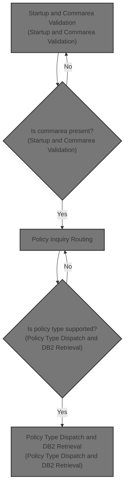
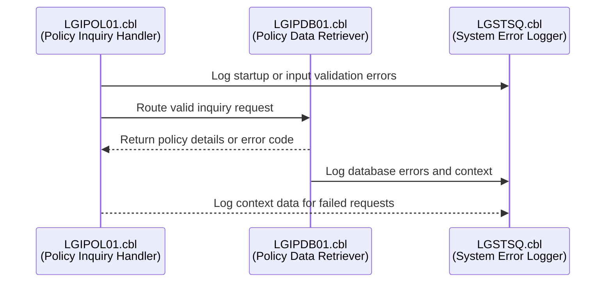
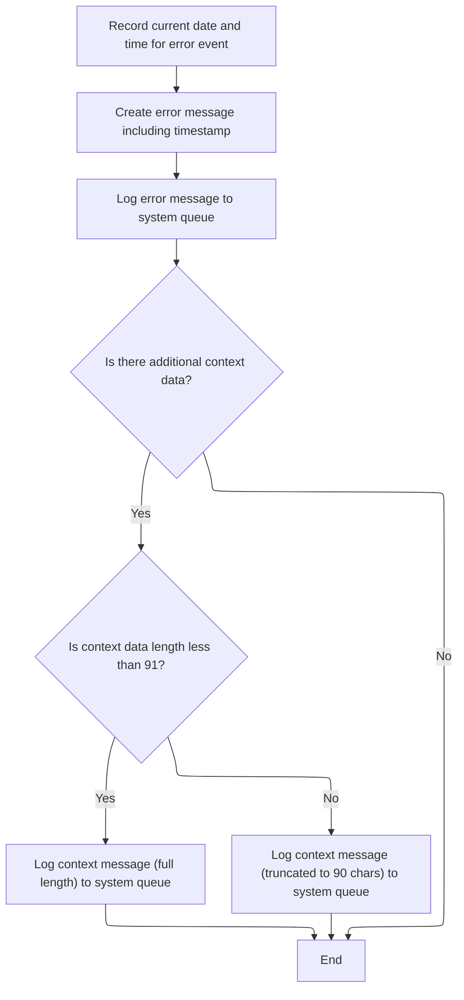
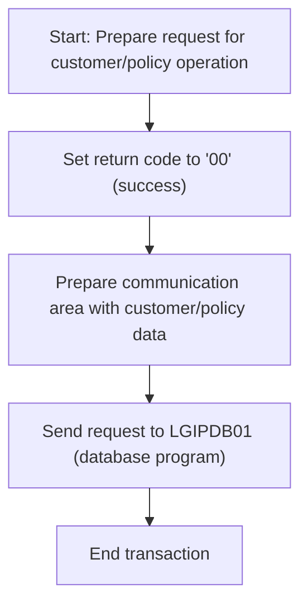

# Overview

This document explains the flow for inquiring about insurance policy details. The process validates requests, logs errors, routes inquiries to the database, and returns policy information or error codes, supporting customer service and policy management.



# Technical Overview



## Dependencies

### Programs

- <SwmToken path="base/src/lgipol01.cbl" pos="91:9:9" line-data="           EXEC CICS LINK Program(LGIPDB01)">`LGIPDB01`</SwmToken> (<SwmPath>[base/src/lgipdb01.cbl](base/src/lgipdb01.cbl)</SwmPath>)
- LGSTSQ (<SwmPath>[base/src/lgstsq.cbl](base/src/lgstsq.cbl)</SwmPath>)

### Copybooks

- SQLCA
- LGPOLICY (<SwmPath>[base/src/lgpolicy.cpy](base/src/lgpolicy.cpy)</SwmPath>)
- LGCMAREA (<SwmPath>[base/src/lgcmarea.cpy](base/src/lgcmarea.cpy)</SwmPath>)

# Where is this program used?

This program is used multiple times in the codebase as represented in the following diagram:

```mermaid
graph TD
  9hl9f("Motor Policy Menu (LGTESTP1)") --> oq93j("Inquiring Policy Details (LGIPOL01)"):::currentEntity
click 9hl9f openCode "base/src/lgtestp1.cbl:1"
o0vo2("House Policy Menu (LGTESTP3)") --> oq93j("Inquiring Policy Details (LGIPOL01)"):::currentEntity
click o0vo2 openCode "base/src/lgtestp3.cbl:1"
uvgih("Endowment Policy Menu (LGTESTP2)") --> oq93j("Inquiring Policy Details (LGIPOL01)"):::currentEntity
click uvgih openCode "base/src/lgtestp2.cbl:1"
vbfhq("Managing Commercial Policies (LGTESTP4)") --> oq93j("Inquiring Policy Details (LGIPOL01)"):::currentEntity
click vbfhq openCode "base/src/lgtestp4.cbl:1"
  
  
click oq93j openCode "base/src/lgipol01.cbl:1"
    classDef currentEntity color:#000000,fill:#7CB9F4

%% Swimm:
%% graph TD
%%   9hl9f("Motor Policy Menu (LGTESTP1)") --> oq93j("Inquiring Policy Details (<SwmToken path="base/src/lgipol01.cbl" pos="13:6:6" line-data="       PROGRAM-ID. LGIPOL01.">`LGIPOL01`</SwmToken>)"):::currentEntity
%% click 9hl9f openCode "<SwmPath>[base/src/lgtestp1.cbl](base/src/lgtestp1.cbl)</SwmPath>:1"
%% o0vo2("House Policy Menu (LGTESTP3)") --> oq93j("Inquiring Policy Details (<SwmToken path="base/src/lgipol01.cbl" pos="13:6:6" line-data="       PROGRAM-ID. LGIPOL01.">`LGIPOL01`</SwmToken>)"):::currentEntity
%% click o0vo2 openCode "<SwmPath>[base/src/lgtestp3.cbl](base/src/lgtestp3.cbl)</SwmPath>:1"
%% uvgih("Endowment Policy Menu (LGTESTP2)") --> oq93j("Inquiring Policy Details (<SwmToken path="base/src/lgipol01.cbl" pos="13:6:6" line-data="       PROGRAM-ID. LGIPOL01.">`LGIPOL01`</SwmToken>)"):::currentEntity
%% click uvgih openCode "<SwmPath>[base/src/lgtestp2.cbl](base/src/lgtestp2.cbl)</SwmPath>:1"
%% vbfhq("Managing Commercial Policies (LGTESTP4)") --> oq93j("Inquiring Policy Details (<SwmToken path="base/src/lgipol01.cbl" pos="13:6:6" line-data="       PROGRAM-ID. LGIPOL01.">`LGIPOL01`</SwmToken>)"):::currentEntity
%% click vbfhq openCode "<SwmPath>[base/src/lgtestp4.cbl](base/src/lgtestp4.cbl)</SwmPath>:1"
%%   
%%   
%% click oq93j openCode "<SwmPath>[base/src/lgipol01.cbl](base/src/lgipol01.cbl)</SwmPath>:1"
%%     classDef currentEntity color:#000000,fill:#7CB9F4
```



## Detailed View of the Program's Functionality

a. Startup and Commarea Validation

When the main policy inquiry program starts, it first initializes its internal tracking fields for debugging and runtime information. It records the transaction ID, terminal ID, and task number for the current invocation. The program then checks if it has received a communication area (commarea), which is required for processing. If the commarea is missing, it prepares an error message indicating this, logs the error (including a timestamp), and then forcibly ends the transaction with a specific error code. This ensures that every missing input is always recorded before the program stops.

b. Error Logging and Message Preparation

Whenever an error needs to be logged (such as a missing commarea or a database error), the program prepares a structured error message. This message includes the current date and time, the program name, and relevant context such as customer and policy numbers, as well as the SQL return code if applicable. The error logging routine first obtains the current system time and formats it for inclusion in the message. It then sends this error message to a system queue for logging and tracking.

If there is a commarea present, the program also logs up to 90 bytes of its contents as a separate message. This provides additional context for debugging by capturing the input that caused the error. Both the main error message and the commarea snapshot are sent to the system queue using a dedicated queue-writing program.

c. System Queue Writing (LGSTSQ)

The queue-writing program determines how it was invoked: either by another program (with a commarea) or directly from a terminal. If called by another program, it copies the message from the commarea; if from a terminal, it receives the message from the terminal input. The program also checks for special prefixes in the message that might indicate a different queue should be used, and adjusts the message length accordingly.

The message is then written to two places: a standard system queue for error messages and a secondary queue for application-specific tracking. If the message came from a terminal, the program sends a blank response back to signal completion. Finally, it returns control to the caller.

d. Policy Inquiry Routing

After error handling, the main program resets the return code to indicate success, sets up pointers to the commarea, and then calls the database handler program to process the actual policy inquiry. This handoff passes the entire commarea to the database handler, which is responsible for retrieving the requested policy details.

e. Policy Type Dispatch and <SwmToken path="base/src/lgipdb01.cbl" pos="242:5:5" line-data="      * initialize DB2 host variables">`DB2`</SwmToken> Retrieval

The database handler program initializes its working storage and tracking fields, then checks again for the presence of a commarea. If missing, it logs an error and ends the transaction. If present, it prepares the commarea and internal variables, converting customer and policy numbers as needed for database queries.

The program then examines the request type specified in the commarea to determine which kind of policy is being requested (endowment, house, motor, or commercial). It uses a structured decision block to dispatch to the appropriate handler for each policy type. If the request type is not recognized, it sets an error code indicating an unsupported request.

Each policy type handler performs a database SELECT to retrieve the relevant policy details. The handler calculates the required size for the commarea to ensure there is enough space to return all data. If the buffer is too small, it sets an error code and returns. If the buffer is sufficient, it copies the retrieved data into the commarea, handling any nullable fields and converting binary values as needed. It then marks the end of the data with a special indicator.

If the database SELECT fails (for example, if no matching policy is found or if there is a SQL error), the handler sets an appropriate error code. For unexpected errors, it logs a detailed error message (including the SQL code and context) using the error logging routine described earlier.

f. Error Logging in Database Handler

Whenever a database error occurs, the database handler prepares a detailed error message. This message includes the SQL return code, the current date and time, and relevant context such as customer and policy numbers. The message is sent to the system queue for logging. If a commarea is present, up to 90 bytes of its contents are also logged as a separate message for additional context.

g. Summary

The overall flow ensures robust error handling and logging at every stage, from initial input validation to database retrieval. All errors are logged with timestamps and context, and the system is designed to capture both the error and the input that caused it. Policy inquiries are routed to specialized handlers based on the request type, and all data movement is carefully managed to prevent buffer overflows and ensure data integrity.

# Rule Definition

| Paragraph Name                                                                                                                                                                                                                                                                                                                                                                                                                                                                                                                                                                                                                                                     | Rule ID | Category          | Description                                                                                                                                                                                                                                                                                                                                                                                                 | Conditions                                                                                                               | Remarks                                                                                                                                                                                                                                                                                                                                                                                                              |
| ------------------------------------------------------------------------------------------------------------------------------------------------------------------------------------------------------------------------------------------------------------------------------------------------------------------------------------------------------------------------------------------------------------------------------------------------------------------------------------------------------------------------------------------------------------------------------------------------------------------------------------------------------------------ | ------- | ----------------- | ----------------------------------------------------------------------------------------------------------------------------------------------------------------------------------------------------------------------------------------------------------------------------------------------------------------------------------------------------------------------------------------------------------- | ------------------------------------------------------------------------------------------------------------------------ | -------------------------------------------------------------------------------------------------------------------------------------------------------------------------------------------------------------------------------------------------------------------------------------------------------------------------------------------------------------------------------------------------------------------- |
| MAINLINE SECTION in <SwmPath>[base/src/lgipol01.cbl](base/src/lgipol01.cbl)</SwmPath>, MAINLINE SECTION in <SwmPath>[base/src/lgipdb01.cbl](base/src/lgipdb01.cbl)</SwmPath>                                                                                                                                                                                                                                                                                                                                                                                                                                                                                       | RL-001  | Conditional Logic | Before any processing, the program must check if the commarea input is present. If it is missing, an error message is written to the error queue and processing is terminated.                                                                                                                                                                                                                              | EIBCALEN is equal to zero (no commarea received).                                                                        | Error message includes a variable message indicating the missing commarea. The error is logged and the program abends with code 'LGCA'.                                                                                                                                                                                                                                                                              |
| <SwmToken path="base/src/lgipol01.cbl" pos="81:3:7" line-data="               PERFORM WRITE-ERROR-MESSAGE">`WRITE-ERROR-MESSAGE`</SwmToken> in <SwmPath>[base/src/lgipol01.cbl](base/src/lgipol01.cbl)</SwmPath>, <SwmToken path="base/src/lgipol01.cbl" pos="81:3:7" line-data="               PERFORM WRITE-ERROR-MESSAGE">`WRITE-ERROR-MESSAGE`</SwmToken> in <SwmPath>[base/src/lgipdb01.cbl](base/src/lgipdb01.cbl)</SwmPath>                                                                                                                                                                                                                                 | RL-002  | Data Assignment   | When an error occurs, the program records the current date and time, includes the program name, a variable message, and, for database errors, customer number, policy number, SQL request description, and SQL return code. The message is written to the system error queue in a fixed format.                                                                                                             | Any error condition, including missing commarea, SQL/database errors, or other processing errors.                        | Error message format: date (8 chars), time (6 chars), program name (9 chars), variable message (21 chars in lgipol01, detailed fields in lgipdb01). For database errors, includes customer number (10), policy number (10), SQL request (16), SQL return code (+9(5)). Messages are written to the error queue using CICS LINK to LGSTSQ. If commarea is present, up to 90 bytes are logged with prefix 'COMMAREA='. |
| <SwmToken path="base/src/lgipdb01.cbl" pos="281:3:9" line-data="               PERFORM GET-ENDOW-DB2-INFO">`GET-ENDOW-DB2-INFO`</SwmToken>, <SwmToken path="base/src/lgipdb01.cbl" pos="285:3:9" line-data="               PERFORM GET-HOUSE-DB2-INFO">`GET-HOUSE-DB2-INFO`</SwmToken>, <SwmToken path="base/src/lgipdb01.cbl" pos="289:3:9" line-data="               PERFORM GET-MOTOR-DB2-INFO">`GET-MOTOR-DB2-INFO`</SwmToken>, <SwmToken path="base/src/lgipdb01.cbl" pos="293:3:9" line-data="               PERFORM GET-COMMERCIAL-DB2-INFO-1">`GET-COMMERCIAL-DB2-INFO`</SwmToken>-\* in <SwmPath>[base/src/lgipdb01.cbl](base/src/lgipdb01.cbl)</SwmPath> | RL-003  | Computation       | For each policy type, the program retrieves data from the appropriate <SwmToken path="base/src/lgipdb01.cbl" pos="242:5:5" line-data="      * initialize DB2 host variables">`DB2`</SwmToken> tables, joining POLICY with the relevant policy table. The retrieved data is copied into the commarea in the exact field order and lengths specified for each policy block, with a 'FINAL' marker at the end. | A valid policy inquiry request is received and a matching policy is found in the database.                               | Field order and lengths are strictly defined for each policy type. Numeric fields are converted to display format. For endowment, PADDINGDATA is variable-length, with its length determined at runtime and 'FINAL' placed after it. Output must match the specified format exactly.                                                                                                                                 |
| <SwmToken path="base/src/lgipdb01.cbl" pos="281:3:9" line-data="               PERFORM GET-ENDOW-DB2-INFO">`GET-ENDOW-DB2-INFO`</SwmToken>, <SwmToken path="base/src/lgipdb01.cbl" pos="285:3:9" line-data="               PERFORM GET-HOUSE-DB2-INFO">`GET-HOUSE-DB2-INFO`</SwmToken>, <SwmToken path="base/src/lgipdb01.cbl" pos="289:3:9" line-data="               PERFORM GET-MOTOR-DB2-INFO">`GET-MOTOR-DB2-INFO`</SwmToken>, <SwmToken path="base/src/lgipdb01.cbl" pos="293:3:9" line-data="               PERFORM GET-COMMERCIAL-DB2-INFO-1">`GET-COMMERCIAL-DB2-INFO`</SwmToken>-\* in <SwmPath>[base/src/lgipdb01.cbl](base/src/lgipdb01.cbl)</SwmPath> | RL-004  | Conditional Logic | If the commarea buffer is too small to hold the required data, the return code is set to '98'. If no matching policy is found, the return code is set to '01'. If a SQL/database error occurs, the return code is set to '90'. If the request type is unsupported, the return code is set to '99'. All error codes and relevant context are logged to the error queue.                                      | Buffer size check fails, no policy match, SQL error, or unsupported request type.                                        | Return codes: '98' (buffer too small), '01' (no match), '90' (SQL error), '99' (unsupported request). Error context is logged as per error message rules.                                                                                                                                                                                                                                                            |
| <SwmToken path="base/src/lgipdb01.cbl" pos="281:3:9" line-data="               PERFORM GET-ENDOW-DB2-INFO">`GET-ENDOW-DB2-INFO`</SwmToken>, <SwmToken path="base/src/lgipdb01.cbl" pos="285:3:9" line-data="               PERFORM GET-HOUSE-DB2-INFO">`GET-HOUSE-DB2-INFO`</SwmToken>, <SwmToken path="base/src/lgipdb01.cbl" pos="289:3:9" line-data="               PERFORM GET-MOTOR-DB2-INFO">`GET-MOTOR-DB2-INFO`</SwmToken>, <SwmToken path="base/src/lgipdb01.cbl" pos="293:3:9" line-data="               PERFORM GET-COMMERCIAL-DB2-INFO-1">`GET-COMMERCIAL-DB2-INFO`</SwmToken>-\* in <SwmPath>[base/src/lgipdb01.cbl](base/src/lgipdb01.cbl)</SwmPath> | RL-005  | Data Assignment   | The output commarea must contain the requested policy data in the correct field order and lengths, with the 'FINAL' marker at the end of the block. All numeric fields must be moved to display fields of the specified length before being placed in the commarea.                                                                                                                                         | A successful policy data retrieval and buffer size check.                                                                | Field order and lengths for each policy type are strictly defined. Numeric fields are converted to display format. The 'FINAL' marker is always 5 characters at the end of the block.                                                                                                                                                                                                                                |
| MAINLINE SECTION in <SwmPath>[base/src/lgipdb01.cbl](base/src/lgipdb01.cbl)</SwmPath> (EVALUATE request type field in input buffer)                                                                                                                                                                                                                                                                                                                                                                                                                                                                                                                                | RL-006  | Conditional Logic | For valid requests, the program routes the inquiry based on the request type field in the input buffer and calls the appropriate policy handler (endowment, house, motor, commercial).                                                                                                                                                                                                                      | The request type field in the input buffer matches a supported request type (e.g., endowment, house, motor, commercial). | Each handler retrieves data from the corresponding database tables using the customer and policy numbers as keys. If the request type is unsupported, the return code is set to '99'.                                                                                                                                                                                                                                |

# User Stories

## User Story 1: Comprehensive error handling and logging

---

### Story Description:

As a system, I want to detect and log errors with detailed context, including missing commarea, SQL/database errors, buffer issues, and unsupported requests, so that all error conditions are recorded in a fixed format for troubleshooting and audit purposes.

---

### Business Rule Mapping:

| Rule ID | Paragraph Name                                                                                                                                                                                                                                                                                                                                                                                                                                                                                                                                                                                                                                                     | Rule Description                                                                                                                                                                                                                                                                                                                                                       |
| ------- | ------------------------------------------------------------------------------------------------------------------------------------------------------------------------------------------------------------------------------------------------------------------------------------------------------------------------------------------------------------------------------------------------------------------------------------------------------------------------------------------------------------------------------------------------------------------------------------------------------------------------------------------------------------------ | ---------------------------------------------------------------------------------------------------------------------------------------------------------------------------------------------------------------------------------------------------------------------------------------------------------------------------------------------------------------------- |
| RL-004  | <SwmToken path="base/src/lgipdb01.cbl" pos="281:3:9" line-data="               PERFORM GET-ENDOW-DB2-INFO">`GET-ENDOW-DB2-INFO`</SwmToken>, <SwmToken path="base/src/lgipdb01.cbl" pos="285:3:9" line-data="               PERFORM GET-HOUSE-DB2-INFO">`GET-HOUSE-DB2-INFO`</SwmToken>, <SwmToken path="base/src/lgipdb01.cbl" pos="289:3:9" line-data="               PERFORM GET-MOTOR-DB2-INFO">`GET-MOTOR-DB2-INFO`</SwmToken>, <SwmToken path="base/src/lgipdb01.cbl" pos="293:3:9" line-data="               PERFORM GET-COMMERCIAL-DB2-INFO-1">`GET-COMMERCIAL-DB2-INFO`</SwmToken>-\* in <SwmPath>[base/src/lgipdb01.cbl](base/src/lgipdb01.cbl)</SwmPath> | If the commarea buffer is too small to hold the required data, the return code is set to '98'. If no matching policy is found, the return code is set to '01'. If a SQL/database error occurs, the return code is set to '90'. If the request type is unsupported, the return code is set to '99'. All error codes and relevant context are logged to the error queue. |
| RL-001  | MAINLINE SECTION in <SwmPath>[base/src/lgipol01.cbl](base/src/lgipol01.cbl)</SwmPath>, MAINLINE SECTION in <SwmPath>[base/src/lgipdb01.cbl](base/src/lgipdb01.cbl)</SwmPath>                                                                                                                                                                                                                                                                                                                                                                                                                                                                                       | Before any processing, the program must check if the commarea input is present. If it is missing, an error message is written to the error queue and processing is terminated.                                                                                                                                                                                         |
| RL-002  | <SwmToken path="base/src/lgipol01.cbl" pos="81:3:7" line-data="               PERFORM WRITE-ERROR-MESSAGE">`WRITE-ERROR-MESSAGE`</SwmToken> in <SwmPath>[base/src/lgipol01.cbl](base/src/lgipol01.cbl)</SwmPath>, <SwmToken path="base/src/lgipol01.cbl" pos="81:3:7" line-data="               PERFORM WRITE-ERROR-MESSAGE">`WRITE-ERROR-MESSAGE`</SwmToken> in <SwmPath>[base/src/lgipdb01.cbl](base/src/lgipdb01.cbl)</SwmPath>                                                                                                                                                                                                                                 | When an error occurs, the program records the current date and time, includes the program name, a variable message, and, for database errors, customer number, policy number, SQL request description, and SQL return code. The message is written to the system error queue in a fixed format.                                                                        |

---

### Relevant Functionality:

- <SwmToken path="base/src/lgipdb01.cbl" pos="281:3:9" line-data="               PERFORM GET-ENDOW-DB2-INFO">`GET-ENDOW-DB2-INFO`</SwmToken>
  1. **RL-004:**
     - After determining required commarea length:
       - If buffer too small, set return code '98' and return
       - If no policy found, set return code '01'
       - If SQL error, set return code '90' and log error
       - If unsupported request, set return code '99'
       - Log all error codes and context to error queue
- **MAINLINE SECTION in** <SwmPath>[base/src/lgipol01.cbl](base/src/lgipol01.cbl)</SwmPath>
  1. **RL-001:**
     - If commarea length is zero:
       - Set error message to indicate missing commarea
       - Perform error message writing routine
       - Terminate processing with abend code 'LGCA'
- <SwmToken path="base/src/lgipol01.cbl" pos="81:3:7" line-data="               PERFORM WRITE-ERROR-MESSAGE">`WRITE-ERROR-MESSAGE`</SwmToken> **in** <SwmPath>[base/src/lgipol01.cbl](base/src/lgipol01.cbl)</SwmPath>
  1. **RL-002:**
     - On error:
       - Get current date and time
       - Compose error message with required fields
       - Write error message to error queue via LGSTSQ
       - If commarea present, write up to 90 bytes of commarea to error queue with 'COMMAREA=' prefix

## User Story 2: Policy data retrieval and commarea population

---

### Story Description:

As a user, I want to receive policy data in the commarea in the exact field order and lengths specified for each policy type, with numeric fields converted to display format and a 'FINAL' marker at the end, so that I can reliably process and display policy information.

---

### Business Rule Mapping:

| Rule ID | Paragraph Name                                                                                                                                                                                                                                                                                                                                                                                                                                                                                                                                                                                                                                                     | Rule Description                                                                                                                                                                                                                                                                                                                                                                                            |
| ------- | ------------------------------------------------------------------------------------------------------------------------------------------------------------------------------------------------------------------------------------------------------------------------------------------------------------------------------------------------------------------------------------------------------------------------------------------------------------------------------------------------------------------------------------------------------------------------------------------------------------------------------------------------------------------ | ----------------------------------------------------------------------------------------------------------------------------------------------------------------------------------------------------------------------------------------------------------------------------------------------------------------------------------------------------------------------------------------------------------- |
| RL-003  | <SwmToken path="base/src/lgipdb01.cbl" pos="281:3:9" line-data="               PERFORM GET-ENDOW-DB2-INFO">`GET-ENDOW-DB2-INFO`</SwmToken>, <SwmToken path="base/src/lgipdb01.cbl" pos="285:3:9" line-data="               PERFORM GET-HOUSE-DB2-INFO">`GET-HOUSE-DB2-INFO`</SwmToken>, <SwmToken path="base/src/lgipdb01.cbl" pos="289:3:9" line-data="               PERFORM GET-MOTOR-DB2-INFO">`GET-MOTOR-DB2-INFO`</SwmToken>, <SwmToken path="base/src/lgipdb01.cbl" pos="293:3:9" line-data="               PERFORM GET-COMMERCIAL-DB2-INFO-1">`GET-COMMERCIAL-DB2-INFO`</SwmToken>-\* in <SwmPath>[base/src/lgipdb01.cbl](base/src/lgipdb01.cbl)</SwmPath> | For each policy type, the program retrieves data from the appropriate <SwmToken path="base/src/lgipdb01.cbl" pos="242:5:5" line-data="      * initialize DB2 host variables">`DB2`</SwmToken> tables, joining POLICY with the relevant policy table. The retrieved data is copied into the commarea in the exact field order and lengths specified for each policy block, with a 'FINAL' marker at the end. |
| RL-005  | <SwmToken path="base/src/lgipdb01.cbl" pos="281:3:9" line-data="               PERFORM GET-ENDOW-DB2-INFO">`GET-ENDOW-DB2-INFO`</SwmToken>, <SwmToken path="base/src/lgipdb01.cbl" pos="285:3:9" line-data="               PERFORM GET-HOUSE-DB2-INFO">`GET-HOUSE-DB2-INFO`</SwmToken>, <SwmToken path="base/src/lgipdb01.cbl" pos="289:3:9" line-data="               PERFORM GET-MOTOR-DB2-INFO">`GET-MOTOR-DB2-INFO`</SwmToken>, <SwmToken path="base/src/lgipdb01.cbl" pos="293:3:9" line-data="               PERFORM GET-COMMERCIAL-DB2-INFO-1">`GET-COMMERCIAL-DB2-INFO`</SwmToken>-\* in <SwmPath>[base/src/lgipdb01.cbl](base/src/lgipdb01.cbl)</SwmPath> | The output commarea must contain the requested policy data in the correct field order and lengths, with the 'FINAL' marker at the end of the block. All numeric fields must be moved to display fields of the specified length before being placed in the commarea.                                                                                                                                         |

---

### Relevant Functionality:

- <SwmToken path="base/src/lgipdb01.cbl" pos="281:3:9" line-data="               PERFORM GET-ENDOW-DB2-INFO">`GET-ENDOW-DB2-INFO`</SwmToken>
  1. **RL-003:**
     - Retrieve policy data from <SwmToken path="base/src/lgipdb01.cbl" pos="242:5:5" line-data="      * initialize DB2 host variables">`DB2`</SwmToken> tables using customer and policy numbers
     - For endowment, determine length of PADDINGDATA at runtime
     - Copy fields to commarea in specified order and length
     - Convert numeric fields to display format
     - Place 'FINAL' marker at end of policy block
  2. **RL-005:**
     - For each policy type:
       - Move fields to commarea in specified order and length
       - Convert numeric fields to display format
       - Place 'FINAL' marker at the end
       - Ensure output matches the required format exactly

## User Story 3: Inquiry routing based on request type

---

### Story Description:

As a system, I want to route policy inquiries to the correct handler based on the request type in the input buffer, so that each request is processed by the appropriate logic and unsupported types are handled with a specific error code.

---

### Business Rule Mapping:

| Rule ID | Paragraph Name                                                                                                                                                                                                                                                                                                                                                                                                                                                                                                                                                                                                                                                     | Rule Description                                                                                                                                                                                                                                                                                                                                                       |
| ------- | ------------------------------------------------------------------------------------------------------------------------------------------------------------------------------------------------------------------------------------------------------------------------------------------------------------------------------------------------------------------------------------------------------------------------------------------------------------------------------------------------------------------------------------------------------------------------------------------------------------------------------------------------------------------ | ---------------------------------------------------------------------------------------------------------------------------------------------------------------------------------------------------------------------------------------------------------------------------------------------------------------------------------------------------------------------- |
| RL-004  | <SwmToken path="base/src/lgipdb01.cbl" pos="281:3:9" line-data="               PERFORM GET-ENDOW-DB2-INFO">`GET-ENDOW-DB2-INFO`</SwmToken>, <SwmToken path="base/src/lgipdb01.cbl" pos="285:3:9" line-data="               PERFORM GET-HOUSE-DB2-INFO">`GET-HOUSE-DB2-INFO`</SwmToken>, <SwmToken path="base/src/lgipdb01.cbl" pos="289:3:9" line-data="               PERFORM GET-MOTOR-DB2-INFO">`GET-MOTOR-DB2-INFO`</SwmToken>, <SwmToken path="base/src/lgipdb01.cbl" pos="293:3:9" line-data="               PERFORM GET-COMMERCIAL-DB2-INFO-1">`GET-COMMERCIAL-DB2-INFO`</SwmToken>-\* in <SwmPath>[base/src/lgipdb01.cbl](base/src/lgipdb01.cbl)</SwmPath> | If the commarea buffer is too small to hold the required data, the return code is set to '98'. If no matching policy is found, the return code is set to '01'. If a SQL/database error occurs, the return code is set to '90'. If the request type is unsupported, the return code is set to '99'. All error codes and relevant context are logged to the error queue. |
| RL-006  | MAINLINE SECTION in <SwmPath>[base/src/lgipdb01.cbl](base/src/lgipdb01.cbl)</SwmPath> (EVALUATE request type field in input buffer)                                                                                                                                                                                                                                                                                                                                                                                                                                                                                                                                | For valid requests, the program routes the inquiry based on the request type field in the input buffer and calls the appropriate policy handler (endowment, house, motor, commercial).                                                                                                                                                                                 |

---

### Relevant Functionality:

- <SwmToken path="base/src/lgipdb01.cbl" pos="281:3:9" line-data="               PERFORM GET-ENDOW-DB2-INFO">`GET-ENDOW-DB2-INFO`</SwmToken>
  1. **RL-004:**
     - After determining required commarea length:
       - If buffer too small, set return code '98' and return
       - If no policy found, set return code '01'
       - If SQL error, set return code '90' and log error
       - If unsupported request, set return code '99'
       - Log all error codes and context to error queue
- **MAINLINE SECTION in** <SwmPath>[base/src/lgipdb01.cbl](base/src/lgipdb01.cbl)</SwmPath> **(EVALUATE request type field in input buffer)**
  1. **RL-006:**
     - Read the request type field from the input buffer
     - Route to handler based on request type:
       - If endowment, call endowment handler
       - If house, call house handler
       - If motor, call motor handler
       - If commercial, call commercial handler
       - Else, set return code to '99'

# Workflow

# Startup and Commarea Validation

The main product role of this section is to ensure that the required input data (commarea) is present before any business logic is executed. This protects downstream processes from running with incomplete or missing data, and guarantees that any startup errors are captured for audit and troubleshooting.

| Category        | Rule Name                              | Description                                                                                                                                                           |
| --------------- | -------------------------------------- | --------------------------------------------------------------------------------------------------------------------------------------------------------------------- |
| Data validation | Immediate termination on missing input | If the commarea is not present, the program must abend immediately after logging the error, preventing any further processing without required input.                 |
| Data validation | Commarea presence validation           | The presence of the commarea is determined by checking if the input length (EIBCALEN) is zero. Only when EIBCALEN is greater than zero is the input considered valid. |

<SwmSnippet path="/base/src/lgipol01.cbl" line="70">

---

We start in <SwmToken path="base/src/lgipol01.cbl" pos="70:1:1" line-data="       MAINLINE SECTION.">`MAINLINE`</SwmToken> by checking if the commarea is present. If not, we log the error using <SwmToken path="base/src/lgipol01.cbl" pos="81:3:7" line-data="               PERFORM WRITE-ERROR-MESSAGE">`WRITE-ERROR-MESSAGE`</SwmToken> and then abend, so the missing input is always recorded before the program stops.

```cobol
       MAINLINE SECTION.
      *
           INITIALIZE WS-HEADER.
      *
           MOVE EIBTRNID TO WS-TRANSID.
           MOVE EIBTRMID TO WS-TERMID.
           MOVE EIBTASKN TO WS-TASKNUM.
      *
      * If NO commarea received issue an ABEND
           IF EIBCALEN IS EQUAL TO ZERO
               MOVE ' NO COMMAREA RECEIVED' TO EM-VARIABLE
               PERFORM WRITE-ERROR-MESSAGE
               EXEC CICS ABEND ABCODE('LGCA') NODUMP END-EXEC
           END-IF
```

---

</SwmSnippet>

## Error Logging and Message Preparation



This section ensures that all error events are logged with accurate timestamps and relevant context, supporting troubleshooting and audit requirements. It prepares and writes error messages to system queues, handling both standard error details and any additional context data.

| Category        | Rule Name                   | Description                                                                                                                    |
| --------------- | --------------------------- | ------------------------------------------------------------------------------------------------------------------------------ |
| Data validation | Context data truncation     | If the context data length exceeds 90 characters, only the first 90 characters are logged to ensure message size consistency.  |
| Business logic  | Timestamp inclusion         | Every error event must include the current date and time in the logged message to ensure traceability.                         |
| Business logic  | Dual queue logging          | Error messages must be written to both the system TDQ and TSQ queues for redundancy and accessibility.                         |
| Business logic  | Context data logging        | If additional context data is present, it must be logged as a separate message to provide insight into the cause of the error. |
| Business logic  | SQLCODE inclusion           | Error messages must include the SQLCODE value to provide technical details about the error condition.                          |
| Business logic  | Terminal response signaling | If the error message is received from a terminal, a blank text response must be sent back as a signal to the user interface.   |

<SwmSnippet path="/base/src/lgipol01.cbl" line="107">

---

In <SwmToken path="base/src/lgipol01.cbl" pos="107:1:5" line-data="       WRITE-ERROR-MESSAGE.">`WRITE-ERROR-MESSAGE`</SwmToken>, we capture the SQLCODE and timestamp to include in the error log.

```cobol
       WRITE-ERROR-MESSAGE.
      * Save SQLCODE in message
      * Obtain and format current time and date
           EXEC CICS ASKTIME ABSTIME(ABS-TIME)
           END-EXEC
           EXEC CICS FORMATTIME ABSTIME(ABS-TIME)
                     MMDDYYYY(DATE1)
                     TIME(TIME1)
           END-EXEC
```

---

</SwmSnippet>

<SwmSnippet path="/base/src/lgipol01.cbl" line="116">

---

After formatting the date and time, we move them into the error message fields and then call LGSTSQ. This call writes the error message to the system queue for logging and tracking.

```cobol
           MOVE DATE1 TO EM-DATE
           MOVE TIME1 TO EM-TIME
      * Write output message to TDQ
           EXEC CICS LINK PROGRAM('LGSTSQ')
                     COMMAREA(ERROR-MSG)
                     LENGTH(LENGTH OF ERROR-MSG)
           END-EXEC.
```

---

</SwmSnippet>

<SwmSnippet path="/base/src/lgstsq.cbl" line="55">

---

<SwmToken path="base/src/lgstsq.cbl" pos="55:1:1" line-data="       MAINLINE SECTION.">`MAINLINE`</SwmToken> in LGSTSQ decides how to handle the incoming message based on whether it was invoked by another program or from a terminal. It uses <SwmToken path="base/src/lgstsq.cbl" pos="69:9:11" line-data="              MOVE &#39;C&#39; To WS-FLAG">`WS-FLAG`</SwmToken> to branch: 'C' for program calls (message from COMMAREA), 'R' for terminal (message from RECEIVE). It also strips special prefixes like 'Q=' if present, adjusts message length with some hardcoded offsets, and writes the message to both TDQ and TSQ. If the message came from a terminal, it sends a blank text back as a signal.

```cobol
       MAINLINE SECTION.

           MOVE SPACES TO WRITE-MSG.
           MOVE SPACES TO WS-RECV.

           EXEC CICS ASSIGN SYSID(WRITE-MSG-SYSID)
                RESP(WS-RESP)
           END-EXEC.

           EXEC CICS ASSIGN INVOKINGPROG(WS-INVOKEPROG)
                RESP(WS-RESP)
           END-EXEC.
           
           IF WS-INVOKEPROG NOT = SPACES
              MOVE 'C' To WS-FLAG
              MOVE COMMA-DATA  TO WRITE-MSG-MSG
              MOVE EIBCALEN    TO WS-RECV-LEN
           ELSE
              EXEC CICS RECEIVE INTO(WS-RECV)
                  LENGTH(WS-RECV-LEN)
                  RESP(WS-RESP)
              END-EXEC
              MOVE 'R' To WS-FLAG
              MOVE WS-RECV-DATA  TO WRITE-MSG-MSG
              SUBTRACT 5 FROM WS-RECV-LEN
           END-IF.

           MOVE 'GENAERRS' TO STSQ-NAME.
           IF WRITE-MSG-MSG(1:2) = 'Q=' THEN
              MOVE WRITE-MSG-MSG(3:4) TO STSQ-EXT
              MOVE WRITE-MSG-REST TO TEMPO
              MOVE TEMPO          TO WRITE-MSG-MSG
              SUBTRACT 7 FROM WS-RECV-LEN
           END-IF.

           ADD 5 TO WS-RECV-LEN.

      * Write output message to TDQ CSMT
      *
           EXEC CICS WRITEQ TD QUEUE(STDQ-NAME)
                     FROM(WRITE-MSG)
                     RESP(WS-RESP)
                     LENGTH(WS-RECV-LEN)

           END-EXEC.

      * Write output message to Genapp TSQ
      * If no space is available then the task will not wait for
      *  storage to become available but will ignore the request...
      *
           EXEC CICS WRITEQ TS QUEUE(STSQ-NAME)
                     FROM(WRITE-MSG)
                     RESP(WS-RESP)
                     NOSUSPEND
                     LENGTH(WS-RECV-LEN)

           END-EXEC.

           If WS-FLAG = 'R' Then
             EXEC CICS SEND TEXT FROM(FILLER-X)
              WAIT
              ERASE
              LENGTH(1)
              FREEKB
             END-EXEC.

           EXEC CICS RETURN
           END-EXEC.
```

---

</SwmSnippet>

<SwmSnippet path="/base/src/lgipol01.cbl" line="124">

---

After returning from LGSTSQ in <SwmToken path="base/src/lgipol01.cbl" pos="81:3:7" line-data="               PERFORM WRITE-ERROR-MESSAGE">`WRITE-ERROR-MESSAGE`</SwmToken>, we check if there's a commarea and, if so, write up to 90 bytes of it to the queue as a separate message. This logs the actual input that caused the error for later analysis.

```cobol
           IF EIBCALEN > 0 THEN
             IF EIBCALEN < 91 THEN
               MOVE DFHCOMMAREA(1:EIBCALEN) TO CA-DATA
               EXEC CICS LINK PROGRAM('LGSTSQ')
                         COMMAREA(CA-ERROR-MSG)
                         LENGTH(LENGTH OF CA-ERROR-MSG)
               END-EXEC
             ELSE
               MOVE DFHCOMMAREA(1:90) TO CA-DATA
               EXEC CICS LINK PROGRAM('LGSTSQ')
                         COMMAREA(CA-ERROR-MSG)
                         LENGTH(LENGTH OF CA-ERROR-MSG)
               END-EXEC
             END-IF
           END-IF.
           EXIT.
```

---

</SwmSnippet>

## Policy Inquiry Routing



<SwmSnippet path="/base/src/lgipol01.cbl" line="86">

---

After returning from <SwmToken path="base/src/lgipol01.cbl" pos="81:3:7" line-data="               PERFORM WRITE-ERROR-MESSAGE">`WRITE-ERROR-MESSAGE`</SwmToken>, MAINLINE resets the return code, sets up commarea pointers, and then calls <SwmToken path="base/src/lgipol01.cbl" pos="91:9:9" line-data="           EXEC CICS LINK Program(LGIPDB01)">`LGIPDB01`</SwmToken> to handle the actual policy inquiry. This hands off the request to the DB2-facing logic.

```cobol
           MOVE '00' TO CA-RETURN-CODE
           MOVE EIBCALEN TO WS-CALEN.
           SET WS-ADDR-DFHCOMMAREA TO ADDRESS OF DFHCOMMAREA.
      *

           EXEC CICS LINK Program(LGIPDB01)
               Commarea(DFHCOMMAREA)
               Length(32500)
           END-EXEC.

           EXEC CICS RETURN END-EXEC.
```

---

</SwmSnippet>

# Policy Type Dispatch and <SwmToken path="base/src/lgipdb01.cbl" pos="242:5:5" line-data="      * initialize DB2 host variables">`DB2`</SwmToken> Retrieval



This section governs how incoming requests for policy data are dispatched based on the request type, and ensures the correct <SwmToken path="base/src/lgipdb01.cbl" pos="242:5:5" line-data="      * initialize DB2 host variables">`DB2`</SwmToken> retrieval routine is called. It also handles error scenarios such as missing commarea, unsupported request types, and buffer size issues.

```mermaid
%%{init: {"flowchart": {"defaultRenderer": "elk"}} }%%
flowchart TD
    node1["Start MAINLINE processing"] --> node2{"Is commarea received?"}
    click node1 openCode "base/src/lgipdb01.cbl:230:236"
    node2 -->|"No"| node3["Log error: No commarea received"]
    click node2 openCode "base/src/lgipdb01.cbl:251:255"
    node3 --> node4["End processing with error"]
    click node3 openCode "base/src/lgipdb01.cbl:252:254"
    node2 -->|"Yes"| node5["Initialize variables and response"]
    click node5 openCode "base/src/lgipdb01.cbl:236:250"
    node5 --> node6{"What is the request type?"}
    click node6 openCode "base/src/lgipdb01.cbl:277:310"
    node6 -->|"Endowment (01IEND)"| node7["Retrieve endowment policy data"]
    click node7 openCode "base/src/lgipdb01.cbl:327:432"
    node6 -->|"House (01IHOU)"| node8["Retrieve house policy data"]
    click node8 openCode "base/src/lgipdb01.cbl:441:523"
    node6 -->|"Motor (01IMOT)"| node9["Retrieve motor policy data"]
    click node9 openCode "base/src/lgipdb01.cbl:529:621"
    node6 -->|"Commercial (01ICOM, 02ICOM, 03ICOM, 05ICOM)"| node10["Retrieve commercial policy data"]
    click node10 openCode "base/src/lgipdb01.cbl:292:306"
    node6 -->|"Other"| node11["Set error: Unsupported request type"]
    click node11 openCode "base/src/lgipdb01.cbl:308:309"
    node11 --> node12["Log error: Unsupported request type"]
    click node12 openCode "base/src/lgipdb01.cbl:252:254"
    node12 --> node13["Return error code"]
    click node13 openCode "base/src/lgipdb01.cbl:308:309"
    node7 --> node14["Return response"]
    click node14 openCode "base/src/lgipdb01.cbl:310:310"
    node8 --> node14
    node9 --> node14
    node10 --> node14
classDef HeadingStyle fill:#777777,stroke:#333,stroke-width:2px;

%% Swimm:
%% %%{init: {"flowchart": {"defaultRenderer": "elk"}} }%%
%% flowchart TD
%%     node1["Start MAINLINE processing"] --> node2{"Is commarea received?"}
%%     click node1 openCode "<SwmPath>[base/src/lgipdb01.cbl](base/src/lgipdb01.cbl)</SwmPath>:230:236"
%%     node2 -->|"No"| node3["Log error: No commarea received"]
%%     click node2 openCode "<SwmPath>[base/src/lgipdb01.cbl](base/src/lgipdb01.cbl)</SwmPath>:251:255"
%%     node3 --> node4["End processing with error"]
%%     click node3 openCode "<SwmPath>[base/src/lgipdb01.cbl](base/src/lgipdb01.cbl)</SwmPath>:252:254"
%%     node2 -->|"Yes"| node5["Initialize variables and response"]
%%     click node5 openCode "<SwmPath>[base/src/lgipdb01.cbl](base/src/lgipdb01.cbl)</SwmPath>:236:250"
%%     node5 --> node6{"What is the request type?"}
%%     click node6 openCode "<SwmPath>[base/src/lgipdb01.cbl](base/src/lgipdb01.cbl)</SwmPath>:277:310"
%%     node6 -->|"Endowment (<SwmToken path="base/src/lgipdb01.cbl" pos="279:4:4" line-data="             WHEN &#39;01IEND&#39;">`01IEND`</SwmToken>)"| node7["Retrieve endowment policy data"]
%%     click node7 openCode "<SwmPath>[base/src/lgipdb01.cbl](base/src/lgipdb01.cbl)</SwmPath>:327:432"
%%     node6 -->|"House (<SwmToken path="base/src/lgipdb01.cbl" pos="283:4:4" line-data="             WHEN &#39;01IHOU&#39;">`01IHOU`</SwmToken>)"| node8["Retrieve house policy data"]
%%     click node8 openCode "<SwmPath>[base/src/lgipdb01.cbl](base/src/lgipdb01.cbl)</SwmPath>:441:523"
%%     node6 -->|"Motor (<SwmToken path="base/src/lgipdb01.cbl" pos="287:4:4" line-data="             WHEN &#39;01IMOT&#39;">`01IMOT`</SwmToken>)"| node9["Retrieve motor policy data"]
%%     click node9 openCode "<SwmPath>[base/src/lgipdb01.cbl](base/src/lgipdb01.cbl)</SwmPath>:529:621"
%%     node6 -->|"Commercial (<SwmToken path="base/src/lgipdb01.cbl" pos="291:4:4" line-data="             WHEN &#39;01ICOM&#39;">`01ICOM`</SwmToken>, <SwmToken path="base/src/lgipdb01.cbl" pos="295:4:4" line-data="             WHEN &#39;02ICOM&#39;">`02ICOM`</SwmToken>, <SwmToken path="base/src/lgipdb01.cbl" pos="299:4:4" line-data="             WHEN &#39;03ICOM&#39;">`03ICOM`</SwmToken>, <SwmToken path="base/src/lgipdb01.cbl" pos="303:4:4" line-data="             WHEN &#39;05ICOM&#39;">`05ICOM`</SwmToken>)"| node10["Retrieve commercial policy data"]
%%     click node10 openCode "<SwmPath>[base/src/lgipdb01.cbl](base/src/lgipdb01.cbl)</SwmPath>:292:306"
%%     node6 -->|"Other"| node11["Set error: Unsupported request type"]
%%     click node11 openCode "<SwmPath>[base/src/lgipdb01.cbl](base/src/lgipdb01.cbl)</SwmPath>:308:309"
%%     node11 --> node12["Log error: Unsupported request type"]
%%     click node12 openCode "<SwmPath>[base/src/lgipdb01.cbl](base/src/lgipdb01.cbl)</SwmPath>:252:254"
%%     node12 --> node13["Return error code"]
%%     click node13 openCode "<SwmPath>[base/src/lgipdb01.cbl](base/src/lgipdb01.cbl)</SwmPath>:308:309"
%%     node7 --> node14["Return response"]
%%     click node14 openCode "<SwmPath>[base/src/lgipdb01.cbl](base/src/lgipdb01.cbl)</SwmPath>:310:310"
%%     node8 --> node14
%%     node9 --> node14
%%     node10 --> node14
%% classDef HeadingStyle fill:#777777,stroke:#333,stroke-width:2px;
```

| Category        | Rule Name               | Description                                                                                                                                                                                                                                                                                                                                                                                                                                                                                                                                                                                                                                                                                                                                                                                                                                                                                                                                                                                                                                                            |
| --------------- | ----------------------- | ---------------------------------------------------------------------------------------------------------------------------------------------------------------------------------------------------------------------------------------------------------------------------------------------------------------------------------------------------------------------------------------------------------------------------------------------------------------------------------------------------------------------------------------------------------------------------------------------------------------------------------------------------------------------------------------------------------------------------------------------------------------------------------------------------------------------------------------------------------------------------------------------------------------------------------------------------------------------------------------------------------------------------------------------------------------------- |
| Data validation | Supported request types | The request type in the commarea must be one of the supported types: <SwmToken path="base/src/lgipdb01.cbl" pos="279:4:4" line-data="             WHEN &#39;01IEND&#39;">`01IEND`</SwmToken> (endowment), <SwmToken path="base/src/lgipdb01.cbl" pos="283:4:4" line-data="             WHEN &#39;01IHOU&#39;">`01IHOU`</SwmToken> (house), <SwmToken path="base/src/lgipdb01.cbl" pos="287:4:4" line-data="             WHEN &#39;01IMOT&#39;">`01IMOT`</SwmToken> (motor), or <SwmToken path="base/src/lgipdb01.cbl" pos="291:4:4" line-data="             WHEN &#39;01ICOM&#39;">`01ICOM`</SwmToken>, <SwmToken path="base/src/lgipdb01.cbl" pos="295:4:4" line-data="             WHEN &#39;02ICOM&#39;">`02ICOM`</SwmToken>, <SwmToken path="base/src/lgipdb01.cbl" pos="299:4:4" line-data="             WHEN &#39;03ICOM&#39;">`03ICOM`</SwmToken>, <SwmToken path="base/src/lgipdb01.cbl" pos="303:4:4" line-data="             WHEN &#39;05ICOM&#39;">`05ICOM`</SwmToken> (commercial). Any other value must result in error code '99' and an error log entry. |
| Business logic  | Policy data retrieval   | For each supported request type, the system must retrieve the corresponding policy data from <SwmToken path="base/src/lgipdb01.cbl" pos="242:5:5" line-data="      * initialize DB2 host variables">`DB2`</SwmToken> and populate the commarea with the results, including all required fields and handling nullable fields appropriately.                                                                                                                                                                                                                                                                                                                                                                                                                                                                                                                                                                                                                                                                                                                             |

<SwmSnippet path="/base/src/lgipdb01.cbl" line="230">

---

<SwmToken path="base/src/lgipdb01.cbl" pos="230:1:1" line-data="       MAINLINE SECTION.">`MAINLINE`</SwmToken> in <SwmToken path="base/src/lgipol01.cbl" pos="91:9:9" line-data="           EXEC CICS LINK Program(LGIPDB01)">`LGIPDB01`</SwmToken> sets up working storage, checks for a commarea, and then uses the request ID to decide which <SwmToken path="base/src/lgipdb01.cbl" pos="242:5:5" line-data="      * initialize DB2 host variables">`DB2`</SwmToken> info retrieval routine to call. Each request type (like endowment, house, motor) has its own handler, and unrecognized types get a '99' error code. This keeps the logic organized and makes it easy to add new policy types later.

```cobol
       MAINLINE SECTION.

      *----------------------------------------------------------------*
      * Common code                                                    *
      *----------------------------------------------------------------*
      * initialize working storage variables
           INITIALIZE WS-HEADER.
      * set up general variable
           MOVE EIBTRNID TO WS-TRANSID.
           MOVE EIBTRMID TO WS-TERMID.
           MOVE EIBTASKN TO WS-TASKNUM.
      *----------------------------------------------------------------*
      * initialize DB2 host variables
           INITIALIZE DB2-IN-INTEGERS.
           INITIALIZE DB2-OUT-INTEGERS.
           INITIALIZE DB2-POLICY.

      *---------------------------------------------------------------*
      * Check commarea and obtain required details                    *
      *---------------------------------------------------------------*
      * If NO commarea received issue an ABEND
           IF EIBCALEN IS EQUAL TO ZERO
             MOVE ' NO COMMAREA RECEIVED' TO EM-VARIABLE
             PERFORM WRITE-ERROR-MESSAGE
             EXEC CICS ABEND ABCODE('LGCA') NODUMP END-EXEC
           END-IF

      * initialize commarea return code to zero
           MOVE '00' TO CA-RETURN-CODE
           MOVE EIBCALEN TO WS-CALEN
           SET WS-ADDR-DFHCOMMAREA TO ADDRESS OF DFHCOMMAREA

      * Convert commarea customer & policy nums to DB2 integer format
           MOVE CA-CUSTOMER-NUM TO DB2-CUSTOMERNUM-INT
           MOVE CA-POLICY-NUM   TO DB2-POLICYNUM-INT
      * and save in error msg field incase required
           MOVE CA-CUSTOMER-NUM TO EM-CUSNUM
           MOVE CA-POLICY-NUM   TO EM-POLNUM

      *----------------------------------------------------------------*
      * Check which policy type is being requested                     *
      * This is not actually required whilst only endowment policy     *
      * inquires are supported, but will make future expansion simpler *
      *----------------------------------------------------------------*
      * Upper case value passed in Request Id field                    *
           MOVE FUNCTION UPPER-CASE(CA-REQUEST-ID) TO WS-REQUEST-ID

           EVALUATE WS-REQUEST-ID

             WHEN '01IEND'
               INITIALIZE DB2-ENDOWMENT
               PERFORM GET-ENDOW-DB2-INFO

             WHEN '01IHOU'
               INITIALIZE DB2-HOUSE
               PERFORM GET-HOUSE-DB2-INFO

             WHEN '01IMOT'
               INITIALIZE DB2-MOTOR
               PERFORM GET-MOTOR-DB2-INFO

             WHEN '01ICOM'
               INITIALIZE DB2-COMMERCIAL
               PERFORM GET-COMMERCIAL-DB2-INFO-1

             WHEN '02ICOM'
               INITIALIZE DB2-COMMERCIAL
               PERFORM GET-COMMERCIAL-DB2-INFO-2

             WHEN '03ICOM'
               INITIALIZE DB2-COMMERCIAL
               PERFORM GET-COMMERCIAL-DB2-INFO-3

             WHEN '05ICOM'
               INITIALIZE DB2-COMMERCIAL
               PERFORM GET-COMMERCIAL-DB2-INFO-5

             WHEN OTHER
               MOVE '99' TO CA-RETURN-CODE

           END-EVALUATE.
```

---

</SwmSnippet>

<SwmSnippet path="/base/src/lgipdb01.cbl" line="997">

---

<SwmToken path="base/src/lgipdb01.cbl" pos="997:1:5" line-data="       WRITE-ERROR-MESSAGE.">`WRITE-ERROR-MESSAGE`</SwmToken> in <SwmToken path="base/src/lgipol01.cbl" pos="91:9:9" line-data="           EXEC CICS LINK Program(LGIPDB01)">`LGIPDB01`</SwmToken> logs the error with timestamp and SQLCODE, then calls LGSTSQ to write the error message to the queue. If there's a commarea, it writes up to 90 bytes of it as a separate message for context. This helps with debugging and audit trails.

```cobol
       WRITE-ERROR-MESSAGE.
      * Save SQLCODE in message
           MOVE SQLCODE TO EM-SQLRC
      * Obtain and format current time and date
           EXEC CICS ASKTIME ABSTIME(ABS-TIME)
           END-EXEC
           EXEC CICS FORMATTIME ABSTIME(ABS-TIME)
                     MMDDYYYY(DATE1)
                     TIME(TIME1)
           END-EXEC
           MOVE DATE1 TO EM-DATE
           MOVE TIME1 TO EM-TIME
      * Write output message to TDQ
           EXEC CICS LINK PROGRAM('LGSTSQ')
                     COMMAREA(ERROR-MSG)
                     LENGTH(LENGTH OF ERROR-MSG)
           END-EXEC.
      * Write 90 bytes or as much as we have of commarea to TDQ
           IF EIBCALEN > 0 THEN
             IF EIBCALEN < 91 THEN
               MOVE DFHCOMMAREA(1:EIBCALEN) TO CA-DATA
               EXEC CICS LINK PROGRAM('LGSTSQ')
                         COMMAREA(CA-ERROR-MSG)
                         LENGTH(LENGTH OF CA-ERROR-MSG)
               END-EXEC
             ELSE
               MOVE DFHCOMMAREA(1:90) TO CA-DATA
               EXEC CICS LINK PROGRAM('LGSTSQ')
                         COMMAREA(CA-ERROR-MSG)
                         LENGTH(LENGTH OF CA-ERROR-MSG)
               END-EXEC
             END-IF
           END-IF.
           EXIT.
```

---

</SwmSnippet>

<SwmSnippet path="/base/src/lgipdb01.cbl" line="327">

---

<SwmToken path="base/src/lgipdb01.cbl" pos="327:1:7" line-data="       GET-ENDOW-DB2-INFO.">`GET-ENDOW-DB2-INFO`</SwmToken> runs a <SwmToken path="base/src/lgipdb01.cbl" pos="327:5:5" line-data="       GET-ENDOW-DB2-INFO.">`DB2`</SwmToken> SELECT for endowment policy details, calculates the required commarea size (including any variable-length padding data), and checks if the buffer is big enough. If so, it moves the data, handles nullable fields, and marks the end with 'FINAL'. If not, it sets an error code or logs the error as needed.

```cobol
       GET-ENDOW-DB2-INFO.

           MOVE ' SELECT ENDOW ' TO EM-SQLREQ
           EXEC SQL
             SELECT  ISSUEDATE,
                     EXPIRYDATE,
                     LASTCHANGED,
                     BROKERID,
                     BROKERSREFERENCE,
                     PAYMENT,
                     WITHPROFITS,
                     EQUITIES,
                     MANAGEDFUND,
                     FUNDNAME,
                     TERM,
                     SUMASSURED,
                     LIFEASSURED,
                     PADDINGDATA,
                     LENGTH(PADDINGDATA)
             INTO  :DB2-ISSUEDATE,
                   :DB2-EXPIRYDATE,
                   :DB2-LASTCHANGED,
                   :DB2-BROKERID-INT INDICATOR :IND-BROKERID,
                   :DB2-BROKERSREF INDICATOR :IND-BROKERSREF,
                   :DB2-PAYMENT-INT INDICATOR :IND-PAYMENT,
                   :DB2-E-WITHPROFITS,
                   :DB2-E-EQUITIES,
                   :DB2-E-MANAGEDFUND,
                   :DB2-E-FUNDNAME,
                   :DB2-E-TERM-SINT,
                   :DB2-E-SUMASSURED-INT,
                   :DB2-E-LIFEASSURED,
                   :DB2-E-PADDINGDATA INDICATOR :IND-E-PADDINGDATA,
                   :DB2-E-PADDING-LEN INDICATOR :IND-E-PADDINGDATAL
             FROM  POLICY,ENDOWMENT
             WHERE ( POLICY.POLICYNUMBER =
                        ENDOWMENT.POLICYNUMBER   AND
                     POLICY.CUSTOMERNUMBER =
                        :DB2-CUSTOMERNUM-INT             AND
                     POLICY.POLICYNUMBER =
                        :DB2-POLICYNUM-INT               )
           END-EXEC

           IF SQLCODE = 0
      *      Select was successful

      *      Calculate size of commarea required to return all data
             ADD WS-CA-HEADERTRAILER-LEN TO WS-REQUIRED-CA-LEN
             ADD WS-FULL-ENDOW-LEN       TO WS-REQUIRED-CA-LEN

      *----------------------------------------------------------------*
      *      Specific code to allow for length of VACHAR data
      *      check whether PADDINGDATA field is non-null
      *        and calculate length of endowment policy
      *        and position of free space in commarea after policy data
      *----------------------------------------------------------------*
             IF IND-E-PADDINGDATAL NOT EQUAL MINUS-ONE
               ADD DB2-E-PADDING-LEN TO WS-REQUIRED-CA-LEN
               ADD DB2-E-PADDING-LEN TO END-POLICY-POS
             END-IF

      *      if commarea received is not large enough ...
      *        set error return code and return to caller
             IF EIBCALEN IS LESS THAN WS-REQUIRED-CA-LEN
               MOVE '98' TO CA-RETURN-CODE
               EXEC CICS RETURN END-EXEC
             ELSE
      *        Length is sufficent so move data to commarea
      *        Move Integer fields to required length numerics
      *        Don't move null fields
               IF IND-BROKERID NOT EQUAL MINUS-ONE
                 MOVE DB2-BROKERID-INT    TO DB2-BROKERID
               END-IF
               IF IND-PAYMENT NOT EQUAL MINUS-ONE
                 MOVE DB2-PAYMENT-INT TO DB2-PAYMENT
               END-IF
      *----------------------------------------------------------------*
               MOVE DB2-E-TERM-SINT       TO DB2-E-TERM
               MOVE DB2-E-SUMASSURED-INT  TO DB2-E-SUMASSURED

               MOVE DB2-POLICY-COMMON     TO CA-POLICY-COMMON
               MOVE DB2-ENDOW-FIXED
                   TO CA-ENDOWMENT(1:WS-ENDOW-LEN)
               IF IND-E-PADDINGDATA NOT EQUAL MINUS-ONE
                 MOVE DB2-E-PADDINGDATA TO
                     CA-E-PADDING-DATA(1:DB2-E-PADDING-LEN)
               END-IF
             END-IF

      *      Mark the end of the policy data
             MOVE 'FINAL' TO CA-E-PADDING-DATA(END-POLICY-POS:5)

           ELSE
      *      Non-zero SQLCODE from first SQL FETCH statement
             IF SQLCODE EQUAL 100
      *        No rows found - invalid customer / policy number
               MOVE '01' TO CA-RETURN-CODE
             ELSE
      *        something has gone wrong
               MOVE '90' TO CA-RETURN-CODE
      *        Write error message to TD QUEUE(CSMT)
               PERFORM WRITE-ERROR-MESSAGE
             END-IF

           END-IF.
           EXIT.
```

---

</SwmSnippet>

<SwmSnippet path="/base/src/lgipdb01.cbl" line="441">

---

<SwmToken path="base/src/lgipdb01.cbl" pos="441:1:7" line-data="       GET-HOUSE-DB2-INFO.">`GET-HOUSE-DB2-INFO`</SwmToken> fetches house policy data, checks if the commarea is big enough, copies fields (handling nulls), and marks the end with 'FINAL'. If the buffer is too small or there's an error, it sets a return code or logs the error.

```cobol
       GET-HOUSE-DB2-INFO.

           MOVE ' SELECT HOUSE ' TO EM-SQLREQ
           EXEC SQL
             SELECT  ISSUEDATE,
                     EXPIRYDATE,
                     LASTCHANGED,
                     BROKERID,
                     BROKERSREFERENCE,
                     PAYMENT,
                     PROPERTYTYPE,
                     BEDROOMS,
                     VALUE,
                     HOUSENAME,
                     HOUSENUMBER,
                     POSTCODE
             INTO  :DB2-ISSUEDATE,
                   :DB2-EXPIRYDATE,
                   :DB2-LASTCHANGED,
                   :DB2-BROKERID-INT INDICATOR :IND-BROKERID,
                   :DB2-BROKERSREF INDICATOR :IND-BROKERSREF,
                   :DB2-PAYMENT-INT INDICATOR :IND-PAYMENT,
                   :DB2-H-PROPERTYTYPE,
                   :DB2-H-BEDROOMS-SINT,
                   :DB2-H-VALUE-INT,
                   :DB2-H-HOUSENAME,
                   :DB2-H-HOUSENUMBER,
                   :DB2-H-POSTCODE
             FROM  POLICY,HOUSE
             WHERE ( POLICY.POLICYNUMBER =
                        HOUSE.POLICYNUMBER   AND
                     POLICY.CUSTOMERNUMBER =
                        :DB2-CUSTOMERNUM-INT             AND
                     POLICY.POLICYNUMBER =
                        :DB2-POLICYNUM-INT               )
           END-EXEC

           IF SQLCODE = 0
      *      Select was successful

      *      Calculate size of commarea required to return all data
             ADD WS-CA-HEADERTRAILER-LEN TO WS-REQUIRED-CA-LEN
             ADD WS-FULL-HOUSE-LEN       TO WS-REQUIRED-CA-LEN

      *      if commarea received is not large enough ...
      *        set error return code and return to caller
             IF EIBCALEN IS LESS THAN WS-REQUIRED-CA-LEN
               MOVE '98' TO CA-RETURN-CODE
               EXEC CICS RETURN END-EXEC
             ELSE
      *        Length is sufficent so move data to commarea
      *        Move Integer fields to required length numerics
      *        Don't move null fields
               IF IND-BROKERID NOT EQUAL MINUS-ONE
                 MOVE DB2-BROKERID-INT  TO DB2-BROKERID
               END-IF
               IF IND-PAYMENT NOT EQUAL MINUS-ONE
                 MOVE DB2-PAYMENT-INT TO DB2-PAYMENT
               END-IF
               MOVE DB2-H-BEDROOMS-SINT TO DB2-H-BEDROOMS
               MOVE DB2-H-VALUE-INT     TO DB2-H-VALUE

               MOVE DB2-POLICY-COMMON   TO CA-POLICY-COMMON
               MOVE DB2-HOUSE           TO CA-HOUSE(1:WS-HOUSE-LEN)
             END-IF

      *      Mark the end of the policy data
             MOVE 'FINAL' TO CA-H-FILLER(1:5)

           ELSE
      *      Non-zero SQLCODE from first SQL FETCH statement
             IF SQLCODE EQUAL 100
      *        No rows found - invalid customer / policy number
               MOVE '01' TO CA-RETURN-CODE
             ELSE
      *        something has gone wrong
               MOVE '90' TO CA-RETURN-CODE
      *        Write error message to TD QUEUE(CSMT)
               PERFORM WRITE-ERROR-MESSAGE
             END-IF

           END-IF.
           EXIT.
```

---

</SwmSnippet>

<SwmSnippet path="/base/src/lgipdb01.cbl" line="529">

---

<SwmToken path="base/src/lgipdb01.cbl" pos="529:1:7" line-data="       GET-MOTOR-DB2-INFO.">`GET-MOTOR-DB2-INFO`</SwmToken> fetches motor policy data, checks if the commarea is big enough, copies fields (handling nulls and converting binary to display), and marks the end with 'FINAL'. Error codes are set for buffer issues, missing data, or SQL errors, and errors are logged if needed.

```cobol
       GET-MOTOR-DB2-INFO.

           MOVE ' SELECT MOTOR ' TO EM-SQLREQ
           EXEC SQL
             SELECT  ISSUEDATE,
                     EXPIRYDATE,
                     LASTCHANGED,
                     BROKERID,
                     BROKERSREFERENCE,
                     PAYMENT,
                     MAKE,
                     MODEL,
                     VALUE,
                     REGNUMBER,
                     COLOUR,
                     CC,
                     YEAROFMANUFACTURE,
                     PREMIUM,
                     ACCIDENTS
             INTO  :DB2-ISSUEDATE,
                   :DB2-EXPIRYDATE,
                   :DB2-LASTCHANGED,
                   :DB2-BROKERID-INT INDICATOR :IND-BROKERID,
                   :DB2-BROKERSREF INDICATOR :IND-BROKERSREF,
                   :DB2-PAYMENT-INT INDICATOR :IND-PAYMENT,
                   :DB2-M-MAKE,
                   :DB2-M-MODEL,
                   :DB2-M-VALUE-INT,
                   :DB2-M-REGNUMBER,
                   :DB2-M-COLOUR,
                   :DB2-M-CC-SINT,
                   :DB2-M-MANUFACTURED,
                   :DB2-M-PREMIUM-INT,
                   :DB2-M-ACCIDENTS-INT
             FROM  POLICY,MOTOR
             WHERE ( POLICY.POLICYNUMBER =
                        MOTOR.POLICYNUMBER   AND
                     POLICY.CUSTOMERNUMBER =
                        :DB2-CUSTOMERNUM-INT             AND
                     POLICY.POLICYNUMBER =
                        :DB2-POLICYNUM-INT               )
           END-EXEC

           IF SQLCODE = 0
      *      Select was successful

      *      Calculate size of commarea required to return all data
             ADD WS-CA-HEADERTRAILER-LEN TO WS-REQUIRED-CA-LEN
             ADD WS-FULL-MOTOR-LEN       TO WS-REQUIRED-CA-LEN

      *      if commarea received is not large enough ...
      *        set error return code and return to caller
             IF EIBCALEN IS LESS THAN WS-REQUIRED-CA-LEN
               MOVE '98' TO CA-RETURN-CODE
               EXEC CICS RETURN END-EXEC
             ELSE
      *        Length is sufficent so move data to commarea
      *        Move Integer fields to required length numerics
      *        Don't move null fields
               IF IND-BROKERID NOT EQUAL MINUS-ONE
                 MOVE DB2-BROKERID-INT TO DB2-BROKERID
               END-IF
               IF IND-PAYMENT NOT EQUAL MINUS-ONE
                 MOVE DB2-PAYMENT-INT    TO DB2-PAYMENT
               END-IF
               MOVE DB2-M-CC-SINT      TO DB2-M-CC
               MOVE DB2-M-VALUE-INT    TO DB2-M-VALUE
               MOVE DB2-M-PREMIUM-INT  TO DB2-M-PREMIUM
               MOVE DB2-M-ACCIDENTS-INT TO DB2-M-ACCIDENTS
               MOVE DB2-M-PREMIUM-INT  TO CA-M-PREMIUM
               MOVE DB2-M-ACCIDENTS-INT TO CA-M-ACCIDENTS

               MOVE DB2-POLICY-COMMON  TO CA-POLICY-COMMON
               MOVE DB2-MOTOR          TO CA-MOTOR(1:WS-MOTOR-LEN)
             END-IF

      *      Mark the end of the policy data
             MOVE 'FINAL' TO CA-M-FILLER(1:5)

           ELSE
      *      Non-zero SQLCODE from first SQL FETCH statement
             IF SQLCODE EQUAL 100
      *        No rows found - invalid customer / policy number
               MOVE '01' TO CA-RETURN-CODE
             ELSE
      *        something has gone wrong
               MOVE '90' TO CA-RETURN-CODE
      *        Write error message to TD QUEUE(CSMT)
               PERFORM WRITE-ERROR-MESSAGE
             END-IF

           END-IF.
           EXIT.
```

---

</SwmSnippet>

&nbsp;

*This is an auto-generated document by Swimm 🌊 and has not yet been verified by a human*

<SwmMeta version="3.0.0" repo-id="Z2l0aHViJTNBJTNBU3dpbW1pby1nZW5hcHAtbW90b3IlM0ElM0FHaXJpLVN3aW1t" repo-name="Swimmio-genapp-motor"><sup>Powered by [Swimm](https://app.swimm.io/)</sup></SwmMeta>
