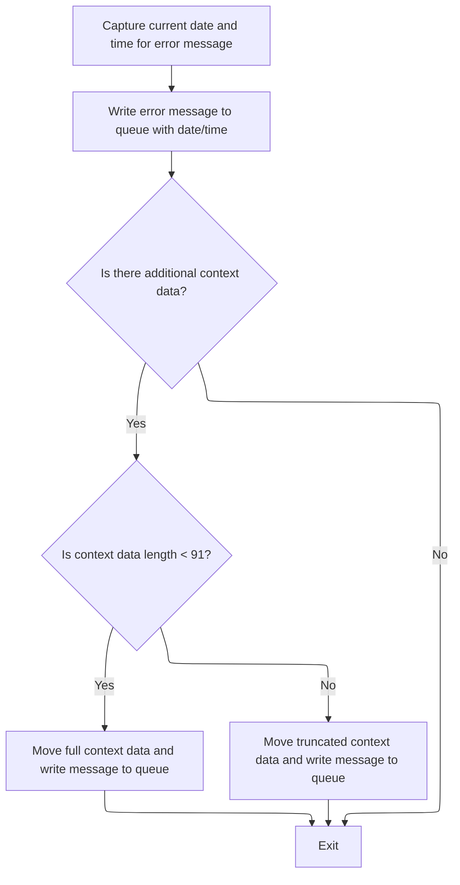

# Overview

This document explains the flow for inquiring about insurance policies. When a user requests details for a specific policy (endowment, house, or motor), the system validates the input, routes the request to the correct data fetch routine, and returns the policy details or an error code.

## Dependencies

### Programs

- <SwmToken path="base/src/lgipol01.cbl" pos="13:6:6" line-data="       PROGRAM-ID. LGIPOL01.">`LGIPOL01`</SwmToken> (<SwmPath>[base/src/lgipol01.cbl](base/src/lgipol01.cbl)</SwmPath>)
- <SwmToken path="base/src/lgipol01.cbl" pos="91:9:9" line-data="           EXEC CICS LINK Program(LGIPDB01)">`LGIPDB01`</SwmToken> (<SwmPath>[base/src/lgipdb01.cbl](base/src/lgipdb01.cbl)</SwmPath>)
- LGSTSQ (<SwmPath>[base/src/lgstsq.cbl](base/src/lgstsq.cbl)</SwmPath>)

### Copybooks

- SQLCA
- LGPOLICY (<SwmPath>[base/src/lgpolicy.cpy](base/src/lgpolicy.cpy)</SwmPath>)
- LGCMAREA (<SwmPath>[base/src/lgcmarea.cpy](base/src/lgcmarea.cpy)</SwmPath>)

# Where is this program used?

This program is used multiple times in the codebase as represented in the following diagram:

```mermaid
graph TD
  9hl9f("Motor Policy Menu (LGTESTP1)") --> oq93j("Inquiring Policy Details (LGIPOL01)"):::currentEntity
click 9hl9f openCode "base/src/lgtestp1.cbl:1"
o0vo2("House Policy Menu (LGTESTP3)") --> oq93j("Inquiring Policy Details (LGIPOL01)"):::currentEntity
click o0vo2 openCode "base/src/lgtestp3.cbl:1"
uvgih("Endowment Policy Menu (LGTESTP2)") --> oq93j("Inquiring Policy Details (LGIPOL01)"):::currentEntity
click uvgih openCode "base/src/lgtestp2.cbl:1"
vbfhq("Managing Commercial Policies (LGTESTP4)") --> oq93j("Inquiring Policy Details (LGIPOL01)"):::currentEntity
click vbfhq openCode "base/src/lgtestp4.cbl:1"
  
  
click oq93j openCode "base/src/lgipol01.cbl:1"
    classDef currentEntity color:#000000,fill:#7CB9F4

%% Swimm:
%% graph TD
%%   9hl9f("Motor Policy Menu (LGTESTP1)") --> oq93j("Inquiring Policy Details (<SwmToken path="base/src/lgipol01.cbl" pos="13:6:6" line-data="       PROGRAM-ID. LGIPOL01.">`LGIPOL01`</SwmToken>)"):::currentEntity
%% click 9hl9f openCode "<SwmPath>[base/src/lgtestp1.cbl](base/src/lgtestp1.cbl)</SwmPath>:1"
%% o0vo2("House Policy Menu (LGTESTP3)") --> oq93j("Inquiring Policy Details (<SwmToken path="base/src/lgipol01.cbl" pos="13:6:6" line-data="       PROGRAM-ID. LGIPOL01.">`LGIPOL01`</SwmToken>)"):::currentEntity
%% click o0vo2 openCode "<SwmPath>[base/src/lgtestp3.cbl](base/src/lgtestp3.cbl)</SwmPath>:1"
%% uvgih("Endowment Policy Menu (LGTESTP2)") --> oq93j("Inquiring Policy Details (<SwmToken path="base/src/lgipol01.cbl" pos="13:6:6" line-data="       PROGRAM-ID. LGIPOL01.">`LGIPOL01`</SwmToken>)"):::currentEntity
%% click uvgih openCode "<SwmPath>[base/src/lgtestp2.cbl](base/src/lgtestp2.cbl)</SwmPath>:1"
%% vbfhq("Managing Commercial Policies (LGTESTP4)") --> oq93j("Inquiring Policy Details (<SwmToken path="base/src/lgipol01.cbl" pos="13:6:6" line-data="       PROGRAM-ID. LGIPOL01.">`LGIPOL01`</SwmToken>)"):::currentEntity
%% click vbfhq openCode "<SwmPath>[base/src/lgtestp4.cbl](base/src/lgtestp4.cbl)</SwmPath>:1"
%%   
%%   
%% click oq93j openCode "<SwmPath>[base/src/lgipol01.cbl](base/src/lgipol01.cbl)</SwmPath>:1"
%%     classDef currentEntity color:#000000,fill:#7CB9F4
```



## Detailed View of the Program's Functionality

# LGSTSQ: Error Message Queueing Logic

## Initialization and Input Handling

- The program begins by clearing out its message and receive buffers to ensure no residual data from previous runs.
- It retrieves the system identifier and the name of the program that invoked it, storing these for use in message headers and routing.
- The program determines how it was called:
  - If invoked directly by another program (not via a terminal), it sets a flag to indicate this and copies the incoming data (up to 90 bytes) into its message buffer, also recording the length.
  - If invoked via a terminal (no invoking program name), it receives data from the terminal, copies the relevant portion into its message buffer, and adjusts the length to exclude the transaction identifier.

## Queue Name Selection and Message Preparation

- By default, the target queue for error messages is set to a standard name.
- If the message begins with a special prefix indicating a custom queue (e.g., "Q=xxxx"), the program extracts the queue extension and modifies the queue name accordingly. It also strips the prefix from the message and adjusts the message length to account for the removed characters.
- The message length is then increased to include header information.

## Writing to Queues

- The program writes the prepared message to a transient data queue for logging and monitoring.
- It also writes the message to a temporary storage queue, using the selected queue name. If the queue is full, the program does not wait for space to become available; it simply ignores the request to avoid blocking.

## Terminal Response and Program Exit

- If the message was received from a terminal, the program sends a minimal response back to the terminal to indicate completion and free up the keyboard.
- Finally, the program returns control to the caller and exits.

# <SwmToken path="base/src/lgipol01.cbl" pos="13:6:6" line-data="       PROGRAM-ID. LGIPOL01.">`LGIPOL01`</SwmToken>: Policy Inquiry Entry Point and Error Logging

## Startup and Initial Error Handling

- The program initializes its working storage, including headers for debugging and tracking.
- It records transaction, terminal, and task identifiers for traceability.
- If no communication area is received (indicating a malformed or incomplete request), it prepares an error message, logs it using the error message procedure, and then abends (terminates abnormally) with a specific code to ensure the issue is traceable.

## Policy Inquiry Preparation

- If the communication area is present, the program resets the return code to indicate success, records the length of the communication area, and sets up a pointer to it.
- It then calls the main policy database inquiry program, passing the communication area and specifying a large enough buffer for all possible policy types.
- After the database inquiry completes, the program returns control to the caller.

## Error Logging Procedure

- When an error needs to be logged, the program:
  - Captures the current date and time using system services.
  - Stamps the error message with the date, time, and program name.
  - Calls the queueing program to write the error message to the appropriate queues.
  - If there is additional context data in the communication area, it sends up to 90 bytes of this data as a separate message for diagnostic purposes.

# <SwmToken path="base/src/lgipol01.cbl" pos="91:9:9" line-data="           EXEC CICS LINK Program(LGIPDB01)">`LGIPDB01`</SwmToken>: Policy Data Fetch and Routing

## Initialization and Input Validation

- The program initializes its working storage, including headers and <SwmToken path="base/src/lgipdb01.cbl" pos="242:5:5" line-data="      * initialize DB2 host variables">`DB2`</SwmToken> host variables for database operations.
- It records transaction, terminal, and task identifiers.
- It checks for the presence of a communication area:
  - If missing, it logs an error message and abends with a specific code.
- It resets the return code, records the communication area length, and sets up a pointer to it.
- It converts customer and policy numbers from the communication area into DB2-compatible integer formats and saves them for error reporting.

## Policy Type Routing

- The program examines the request type in the communication area, converting it to uppercase for consistency.
- It uses a multi-way branch to determine which type of policy is being requested:
  - For endowment, house, motor, or various commercial policy types, it initializes the relevant <SwmToken path="base/src/lgipdb01.cbl" pos="242:5:5" line-data="      * initialize DB2 host variables">`DB2`</SwmToken> structures and calls the corresponding data fetch routine.
  - If the request type is unsupported, it sets an error code indicating an invalid request.

## Data Fetch Routines (Endowment, House, Motor)

### Common Steps

- Each routine performs a database SELECT to retrieve all relevant fields for the requested policy type, joining the policy table with the specific policy subtype table.
- If the SELECT is successful:
  - The routine calculates the required buffer size for the response, including header/trailer and variable-length fields.
  - If the provided buffer is too small, it sets an error code and returns immediately.
  - If the buffer is sufficient:
    - It copies integer fields to their proper formats.
    - It moves only <SwmToken path="base/src/lgipdb01.cbl" pos="379:13:15" line-data="      *      check whether PADDINGDATA field is non-null">`non-null`</SwmToken> fields to the output.
    - It copies all relevant policy data into the communication area.
    - It marks the end of the policy data with a special indicator ("FINAL").
- If the SELECT fails:
  - If no rows are found, it sets an error code indicating the policy was not found.
  - For other SQL errors, it sets a generic database error code and logs an error message using the error logging procedure.

## Error Logging Procedure

- When logging an error:
  - The program saves the SQL error code in the error message.
  - It captures the current date and time.
  - It calls the queueing program to write the error message to the appropriate queues.
  - If there is additional context data in the communication area, it sends up to 90 bytes of this data as a separate message for diagnostics.

## Commercial Policy Data Fetch (Multiple Variants)

- The program supports several commercial policy inquiry variants, each using different selection criteria or cursors to fetch data.
- For each variant:
  - It performs the appropriate SELECT or cursor operation.
  - It checks for errors and logs them as needed.
  - It copies the fetched data into the communication area, marking the end with a special indicator.

# Summary

- The overall flow starts with input validation and error handling.
- Policy inquiries are routed to the correct data fetch routine based on request type.
- Each data fetch routine handles buffer sizing, data copying, and error reporting.
- Error messages are standardized, timestamped, and written to both transient and temporary queues for monitoring and diagnostics.
- The queueing logic supports custom queue names and handles both programmatic and terminal-based invocations.

# Rule Definition

| Paragraph Name                                                                                                                                                                                                                                                                                                                                                                                                                                                                                                                                                                                                                                                                                                                                                                                                                                                                          | Rule ID | Category          | Description                                                                                                                                                                                                                                                                                                                                                                 | Conditions                                                                                                                                                                                                                                                                                                                                                                                                                                                                                                                                                                                                                                                                                                                     | Remarks                                                                                                                                                                                                                                                                                                                                                                                                                                                                                                                                                                                                                                                                                                                                                                                                                                                                                                                                                                                                                                                                          |
| --------------------------------------------------------------------------------------------------------------------------------------------------------------------------------------------------------------------------------------------------------------------------------------------------------------------------------------------------------------------------------------------------------------------------------------------------------------------------------------------------------------------------------------------------------------------------------------------------------------------------------------------------------------------------------------------------------------------------------------------------------------------------------------------------------------------------------------------------------------------------------------- | ------- | ----------------- | --------------------------------------------------------------------------------------------------------------------------------------------------------------------------------------------------------------------------------------------------------------------------------------------------------------------------------------------------------------------------- | ------------------------------------------------------------------------------------------------------------------------------------------------------------------------------------------------------------------------------------------------------------------------------------------------------------------------------------------------------------------------------------------------------------------------------------------------------------------------------------------------------------------------------------------------------------------------------------------------------------------------------------------------------------------------------------------------------------------------------ | -------------------------------------------------------------------------------------------------------------------------------------------------------------------------------------------------------------------------------------------------------------------------------------------------------------------------------------------------------------------------------------------------------------------------------------------------------------------------------------------------------------------------------------------------------------------------------------------------------------------------------------------------------------------------------------------------------------------------------------------------------------------------------------------------------------------------------------------------------------------------------------------------------------------------------------------------------------------------------------------------------------------------------------------------------------------------------- |
| MAINLINE SECTION (<SwmToken path="base/src/lgipol01.cbl" pos="13:6:6" line-data="       PROGRAM-ID. LGIPOL01.">`LGIPOL01`</SwmToken>, <SwmToken path="base/src/lgipol01.cbl" pos="91:9:9" line-data="           EXEC CICS LINK Program(LGIPDB01)">`LGIPDB01`</SwmToken>), Procedure to write error message (<SwmToken path="base/src/lgipol01.cbl" pos="81:3:7" line-data="               PERFORM WRITE-ERROR-MESSAGE">`WRITE-ERROR-MESSAGE`</SwmToken>)                                                                                                                                                                                                                                                                                                                                                                                                                                | RL-001  | Conditional Logic | The program must check if the commarea is present and contains the required fields before processing a policy inquiry. If the commarea is missing, an error message is generated and written to error queues.                                                                                                                                                               | Commarea length (EIBCALEN) is zero or commarea is missing.                                                                                                                                                                                                                                                                                                                                                                                                                                                                                                                                                                                                                                                                     | Error message format: plain text, fields for date (MMDDYYYY, 8 chars), time (HHMMSS, 6 chars), program name (9 chars), variable message (21 chars). Commarea dump: 'COMMAREA=' literal followed by up to 90 bytes of commarea data as plain text. No encoding or transformation. Error codes: 'LGCA' for abend.                                                                                                                                                                                                                                                                                                                                                                                                                                                                                                                                                                                                                                                                                                                                                                  |
| <SwmToken path="base/src/lgipol01.cbl" pos="81:3:7" line-data="               PERFORM WRITE-ERROR-MESSAGE">`WRITE-ERROR-MESSAGE`</SwmToken> (<SwmToken path="base/src/lgipol01.cbl" pos="13:6:6" line-data="       PROGRAM-ID. LGIPOL01.">`LGIPOL01`</SwmToken>, <SwmToken path="base/src/lgipol01.cbl" pos="91:9:9" line-data="           EXEC CICS LINK Program(LGIPDB01)">`LGIPDB01`</SwmToken>), LGSTSQ                                                                                                                                                                                                                                                                                                                                                                                                                                                                             | RL-002  | Computation       | When an error occurs (missing commarea, database error, unsupported request), generate a formatted error message including date, time, program name, and a descriptive message. Optionally include commarea dump if available.                                                                                                                                              | Any error condition (missing commarea, SQLCODE not zero, unsupported request type, buffer too small).                                                                                                                                                                                                                                                                                                                                                                                                                                                                                                                                                                                                                          | Error message: date (MMDDYYYY, 8 chars), time (HHMMSS, 6 chars), program name (9 chars), variable message (21 chars). Commarea dump: 'COMMAREA=' + up to 90 bytes plain text. All data written as plain text. No queue management or error handling for full queues.                                                                                                                                                                                                                                                                                                                                                                                                                                                                                                                                                                                                                                                                                                                                                                                                             |
| MAINLINE SECTION (<SwmToken path="base/src/lgipol01.cbl" pos="91:9:9" line-data="           EXEC CICS LINK Program(LGIPDB01)">`LGIPDB01`</SwmToken>), Policy type evaluation and routing                                                                                                                                                                                                                                                                                                                                                                                                                                                                                                                                                                                                                                                                                                | RL-003  | Conditional Logic | The program routes the policy inquiry based on the <SwmToken path="base/src/lgipdb01.cbl" pos="275:9:13" line-data="           MOVE FUNCTION UPPER-CASE(CA-REQUEST-ID) TO WS-REQUEST-ID">`CA-REQUEST-ID`</SwmToken> field in the commarea, selecting the appropriate policy type (endowment, house, motor, commercial) and invoking the corresponding data retrieval logic. | <SwmToken path="base/src/lgipdb01.cbl" pos="275:9:13" line-data="           MOVE FUNCTION UPPER-CASE(CA-REQUEST-ID) TO WS-REQUEST-ID">`CA-REQUEST-ID`</SwmToken> field present and matches a supported policy type (<SwmToken path="base/src/lgipdb01.cbl" pos="279:4:4" line-data="             WHEN &#39;01IEND&#39;">`01IEND`</SwmToken>, <SwmToken path="base/src/lgipdb01.cbl" pos="283:4:4" line-data="             WHEN &#39;01IHOU&#39;">`01IHOU`</SwmToken>, <SwmToken path="base/src/lgipdb01.cbl" pos="287:4:4" line-data="             WHEN &#39;01IMOT&#39;">`01IMOT`</SwmToken>, <SwmToken path="base/src/lgipdb01.cbl" pos="291:4:4" line-data="             WHEN &#39;01ICOM&#39;">`01ICOM`</SwmToken>, etc.). | Supported request IDs: <SwmToken path="base/src/lgipdb01.cbl" pos="279:4:4" line-data="             WHEN &#39;01IEND&#39;">`01IEND`</SwmToken>, <SwmToken path="base/src/lgipdb01.cbl" pos="283:4:4" line-data="             WHEN &#39;01IHOU&#39;">`01IHOU`</SwmToken>, <SwmToken path="base/src/lgipdb01.cbl" pos="287:4:4" line-data="             WHEN &#39;01IMOT&#39;">`01IMOT`</SwmToken>, <SwmToken path="base/src/lgipdb01.cbl" pos="291:4:4" line-data="             WHEN &#39;01ICOM&#39;">`01ICOM`</SwmToken>, <SwmToken path="base/src/lgipdb01.cbl" pos="295:4:4" line-data="             WHEN &#39;02ICOM&#39;">`02ICOM`</SwmToken>, <SwmToken path="base/src/lgipdb01.cbl" pos="299:4:4" line-data="             WHEN &#39;03ICOM&#39;">`03ICOM`</SwmToken>, <SwmToken path="base/src/lgipdb01.cbl" pos="303:4:4" line-data="             WHEN &#39;05ICOM&#39;">`05ICOM`</SwmToken>. Unsupported types set <SwmToken path="base/src/lgipol01.cbl" pos="86:9:13" line-data="           MOVE &#39;00&#39; TO CA-RETURN-CODE">`CA-RETURN-CODE`</SwmToken> to '99'. |
| <SwmToken path="base/src/lgipdb01.cbl" pos="281:3:9" line-data="               PERFORM GET-ENDOW-DB2-INFO">`GET-ENDOW-DB2-INFO`</SwmToken>, <SwmToken path="base/src/lgipdb01.cbl" pos="285:3:9" line-data="               PERFORM GET-HOUSE-DB2-INFO">`GET-HOUSE-DB2-INFO`</SwmToken>, <SwmToken path="base/src/lgipdb01.cbl" pos="289:3:9" line-data="               PERFORM GET-MOTOR-DB2-INFO">`GET-MOTOR-DB2-INFO`</SwmToken>, <SwmToken path="base/src/lgipdb01.cbl" pos="293:3:9" line-data="               PERFORM GET-COMMERCIAL-DB2-INFO-1">`GET-COMMERCIAL-DB2-INFO`</SwmToken>-\* (<SwmToken path="base/src/lgipol01.cbl" pos="91:9:9" line-data="           EXEC CICS LINK Program(LGIPDB01)">`LGIPDB01`</SwmToken>)                                                                                                                                                       | RL-004  | Computation       | For each policy type, fetch policy data using customer and policy numbers as keys. If the policy is found, check if the commarea buffer is large enough to hold the response data. If not, set <SwmToken path="base/src/lgipol01.cbl" pos="86:9:13" line-data="           MOVE &#39;00&#39; TO CA-RETURN-CODE">`CA-RETURN-CODE`</SwmToken> to '98'.                         | Policy found in database; commarea buffer size compared to required size.                                                                                                                                                                                                                                                                                                                                                                                                                                                                                                                                                                                                                                                      | Buffer size check: compare EIBCALEN to required length. If insufficient, set <SwmToken path="base/src/lgipol01.cbl" pos="86:9:13" line-data="           MOVE &#39;00&#39; TO CA-RETURN-CODE">`CA-RETURN-CODE`</SwmToken> to '98'.                                                                                                                                                                                                                                                                                                                                                                                                                                                                                                                                                                                                                                                                                                                                                                                                                                                |
| <SwmToken path="base/src/lgipdb01.cbl" pos="281:3:9" line-data="               PERFORM GET-ENDOW-DB2-INFO">`GET-ENDOW-DB2-INFO`</SwmToken>, <SwmToken path="base/src/lgipdb01.cbl" pos="285:3:9" line-data="               PERFORM GET-HOUSE-DB2-INFO">`GET-HOUSE-DB2-INFO`</SwmToken>, <SwmToken path="base/src/lgipdb01.cbl" pos="289:3:9" line-data="               PERFORM GET-MOTOR-DB2-INFO">`GET-MOTOR-DB2-INFO`</SwmToken>, <SwmToken path="base/src/lgipdb01.cbl" pos="293:3:9" line-data="               PERFORM GET-COMMERCIAL-DB2-INFO-1">`GET-COMMERCIAL-DB2-INFO`</SwmToken>-\* (<SwmToken path="base/src/lgipol01.cbl" pos="91:9:9" line-data="           EXEC CICS LINK Program(LGIPDB01)">`LGIPDB01`</SwmToken>)                                                                                                                                                       | RL-005  | Data Assignment   | If buffer is sufficient, populate the commarea with policy common fields and policy-specific fields. Mark the end of valid data with 'FINAL' in the appropriate padding/filler field.                                                                                                                                                                                       | Policy found and buffer size sufficient.                                                                                                                                                                                                                                                                                                                                                                                                                                                                                                                                                                                                                                                                                       | 'FINAL' indicator written as plain text in the padding/filler field at the end of policy data. Field sizes depend on policy type.                                                                                                                                                                                                                                                                                                                                                                                                                                                                                                                                                                                                                                                                                                                                                                                                                                                                                                                                                |
| <SwmToken path="base/src/lgipdb01.cbl" pos="281:3:9" line-data="               PERFORM GET-ENDOW-DB2-INFO">`GET-ENDOW-DB2-INFO`</SwmToken>, <SwmToken path="base/src/lgipdb01.cbl" pos="285:3:9" line-data="               PERFORM GET-HOUSE-DB2-INFO">`GET-HOUSE-DB2-INFO`</SwmToken>, <SwmToken path="base/src/lgipdb01.cbl" pos="289:3:9" line-data="               PERFORM GET-MOTOR-DB2-INFO">`GET-MOTOR-DB2-INFO`</SwmToken>, <SwmToken path="base/src/lgipdb01.cbl" pos="293:3:9" line-data="               PERFORM GET-COMMERCIAL-DB2-INFO-1">`GET-COMMERCIAL-DB2-INFO`</SwmToken>-\* (<SwmToken path="base/src/lgipol01.cbl" pos="91:9:9" line-data="           EXEC CICS LINK Program(LGIPDB01)">`LGIPDB01`</SwmToken>), MAINLINE SECTION (<SwmToken path="base/src/lgipol01.cbl" pos="91:9:9" line-data="           EXEC CICS LINK Program(LGIPDB01)">`LGIPDB01`</SwmToken>) | RL-006  | Data Assignment   | Set <SwmToken path="base/src/lgipol01.cbl" pos="86:9:13" line-data="           MOVE &#39;00&#39; TO CA-RETURN-CODE">`CA-RETURN-CODE`</SwmToken> to specific values based on error conditions: '01' if policy not found, '90' for database errors, '98' for insufficient buffer, '99' for unsupported request types.                                                         | Error condition encountered during processing.                                                                                                                                                                                                                                                                                                                                                                                                                                                                                                                                                                                                                                                                                 | <SwmToken path="base/src/lgipol01.cbl" pos="86:9:13" line-data="           MOVE &#39;00&#39; TO CA-RETURN-CODE">`CA-RETURN-CODE`</SwmToken> values: '01' (not found), '90' (database error), '98' (buffer too small), '99' (unsupported request).                                                                                                                                                                                                                                                                                                                                                                                                                                                                                                                                                                                                                                                                                                                                                                                                                                |
| <SwmToken path="base/src/lgipol01.cbl" pos="81:3:7" line-data="               PERFORM WRITE-ERROR-MESSAGE">`WRITE-ERROR-MESSAGE`</SwmToken> (<SwmToken path="base/src/lgipol01.cbl" pos="13:6:6" line-data="       PROGRAM-ID. LGIPOL01.">`LGIPOL01`</SwmToken>, <SwmToken path="base/src/lgipol01.cbl" pos="91:9:9" line-data="           EXEC CICS LINK Program(LGIPDB01)">`LGIPDB01`</SwmToken>), LGSTSQ                                                                                                                                                                                                                                                                                                                                                                                                                                                                             | RL-007  | Computation       | Error messages and commarea dumps are written to both the system log (TDQ) and application error queue (TSQ) without any queue size management or error handling for full queues.                                                                                                                                                                                           | Any error message or commarea dump to be written.                                                                                                                                                                                                                                                                                                                                                                                                                                                                                                                                                                                                                                                                              | TDQ name: 'CSMT'. TSQ name: 'GENAERRS' or <SwmToken path="base/src/lgstsq.cbl" pos="6:19:19" line-data="      *  parm Q=nnnn is passed then Queue name GENAnnnn is used        *">`GENAnnnn`</SwmToken> if Q=nnnn is present. No queue management or error handling for full queues. All writes are attempted.                                                                                                                                                                                                                                                                                                                                                                                                                                                                                                                                                                                                                                                                                                                                                                   |

# User Stories

## User Story 1: Error handling and reporting

---

### Story Description:

As a system, I want to detect missing or invalid commarea and other error conditions, generate formatted error messages with relevant context, and write them to both system and application error queues so that errors are logged and traceable for support and troubleshooting.

---

### Business Rule Mapping:

| Rule ID | Paragraph Name                                                                                                                                                                                                                                                                                                                                                                                                                                                                                                                                                                                                                                                                                                                                                                                                                                                                          | Rule Description                                                                                                                                                                                                                                                                                                    |
| ------- | --------------------------------------------------------------------------------------------------------------------------------------------------------------------------------------------------------------------------------------------------------------------------------------------------------------------------------------------------------------------------------------------------------------------------------------------------------------------------------------------------------------------------------------------------------------------------------------------------------------------------------------------------------------------------------------------------------------------------------------------------------------------------------------------------------------------------------------------------------------------------------------- | ------------------------------------------------------------------------------------------------------------------------------------------------------------------------------------------------------------------------------------------------------------------------------------------------------------------- |
| RL-006  | <SwmToken path="base/src/lgipdb01.cbl" pos="281:3:9" line-data="               PERFORM GET-ENDOW-DB2-INFO">`GET-ENDOW-DB2-INFO`</SwmToken>, <SwmToken path="base/src/lgipdb01.cbl" pos="285:3:9" line-data="               PERFORM GET-HOUSE-DB2-INFO">`GET-HOUSE-DB2-INFO`</SwmToken>, <SwmToken path="base/src/lgipdb01.cbl" pos="289:3:9" line-data="               PERFORM GET-MOTOR-DB2-INFO">`GET-MOTOR-DB2-INFO`</SwmToken>, <SwmToken path="base/src/lgipdb01.cbl" pos="293:3:9" line-data="               PERFORM GET-COMMERCIAL-DB2-INFO-1">`GET-COMMERCIAL-DB2-INFO`</SwmToken>-\* (<SwmToken path="base/src/lgipol01.cbl" pos="91:9:9" line-data="           EXEC CICS LINK Program(LGIPDB01)">`LGIPDB01`</SwmToken>), MAINLINE SECTION (<SwmToken path="base/src/lgipol01.cbl" pos="91:9:9" line-data="           EXEC CICS LINK Program(LGIPDB01)">`LGIPDB01`</SwmToken>) | Set <SwmToken path="base/src/lgipol01.cbl" pos="86:9:13" line-data="           MOVE &#39;00&#39; TO CA-RETURN-CODE">`CA-RETURN-CODE`</SwmToken> to specific values based on error conditions: '01' if policy not found, '90' for database errors, '98' for insufficient buffer, '99' for unsupported request types. |
| RL-001  | MAINLINE SECTION (<SwmToken path="base/src/lgipol01.cbl" pos="13:6:6" line-data="       PROGRAM-ID. LGIPOL01.">`LGIPOL01`</SwmToken>, <SwmToken path="base/src/lgipol01.cbl" pos="91:9:9" line-data="           EXEC CICS LINK Program(LGIPDB01)">`LGIPDB01`</SwmToken>), Procedure to write error message (<SwmToken path="base/src/lgipol01.cbl" pos="81:3:7" line-data="               PERFORM WRITE-ERROR-MESSAGE">`WRITE-ERROR-MESSAGE`</SwmToken>)                                                                                                                                                                                                                                                                                                                                                                                                                                | The program must check if the commarea is present and contains the required fields before processing a policy inquiry. If the commarea is missing, an error message is generated and written to error queues.                                                                                                       |
| RL-002  | <SwmToken path="base/src/lgipol01.cbl" pos="81:3:7" line-data="               PERFORM WRITE-ERROR-MESSAGE">`WRITE-ERROR-MESSAGE`</SwmToken> (<SwmToken path="base/src/lgipol01.cbl" pos="13:6:6" line-data="       PROGRAM-ID. LGIPOL01.">`LGIPOL01`</SwmToken>, <SwmToken path="base/src/lgipol01.cbl" pos="91:9:9" line-data="           EXEC CICS LINK Program(LGIPDB01)">`LGIPDB01`</SwmToken>), LGSTSQ                                                                                                                                                                                                                                                                                                                                                                                                                                                                             | When an error occurs (missing commarea, database error, unsupported request), generate a formatted error message including date, time, program name, and a descriptive message. Optionally include commarea dump if available.                                                                                      |
| RL-007  | <SwmToken path="base/src/lgipol01.cbl" pos="81:3:7" line-data="               PERFORM WRITE-ERROR-MESSAGE">`WRITE-ERROR-MESSAGE`</SwmToken> (<SwmToken path="base/src/lgipol01.cbl" pos="13:6:6" line-data="       PROGRAM-ID. LGIPOL01.">`LGIPOL01`</SwmToken>, <SwmToken path="base/src/lgipol01.cbl" pos="91:9:9" line-data="           EXEC CICS LINK Program(LGIPDB01)">`LGIPDB01`</SwmToken>), LGSTSQ                                                                                                                                                                                                                                                                                                                                                                                                                                                                             | Error messages and commarea dumps are written to both the system log (TDQ) and application error queue (TSQ) without any queue size management or error handling for full queues.                                                                                                                                   |

---

### Relevant Functionality:

- <SwmToken path="base/src/lgipdb01.cbl" pos="281:3:9" line-data="               PERFORM GET-ENDOW-DB2-INFO">`GET-ENDOW-DB2-INFO`</SwmToken>
  1. **RL-006:**
     - If SQLCODE = 100 (not found): set <SwmToken path="base/src/lgipol01.cbl" pos="86:9:13" line-data="           MOVE &#39;00&#39; TO CA-RETURN-CODE">`CA-RETURN-CODE`</SwmToken> to '01'
     - If SQLCODE not zero and not 100: set <SwmToken path="base/src/lgipol01.cbl" pos="86:9:13" line-data="           MOVE &#39;00&#39; TO CA-RETURN-CODE">`CA-RETURN-CODE`</SwmToken> to '90', log error
     - If buffer too small: set <SwmToken path="base/src/lgipol01.cbl" pos="86:9:13" line-data="           MOVE &#39;00&#39; TO CA-RETURN-CODE">`CA-RETURN-CODE`</SwmToken> to '98'
     - If unsupported request type: set <SwmToken path="base/src/lgipol01.cbl" pos="86:9:13" line-data="           MOVE &#39;00&#39; TO CA-RETURN-CODE">`CA-RETURN-CODE`</SwmToken> to '99'
- **MAINLINE SECTION (**<SwmToken path="base/src/lgipol01.cbl" pos="13:6:6" line-data="       PROGRAM-ID. LGIPOL01.">`LGIPOL01`</SwmToken>
  1. **RL-001:**
     - If commarea length is zero:
       - Set error message variable to 'NO COMMAREA RECEIVED'
       - Format current date and time
       - Populate error message fields
       - Write error message to TDQ and TSQ via LGSTSQ
       - If commarea contents available, write up to 90 bytes as plain text with 'COMMAREA=' prefix
       - Issue ABEND with code 'LGCA'
- <SwmToken path="base/src/lgipol01.cbl" pos="81:3:7" line-data="               PERFORM WRITE-ERROR-MESSAGE">`WRITE-ERROR-MESSAGE`</SwmToken> **(**<SwmToken path="base/src/lgipol01.cbl" pos="13:6:6" line-data="       PROGRAM-ID. LGIPOL01.">`LGIPOL01`</SwmToken>
  1. **RL-002:**
     - On error:
       - Format date and time
       - Populate error message fields
       - Write error message to TDQ (CSMT) and TSQ (GENAERRS or <SwmToken path="base/src/lgstsq.cbl" pos="6:19:19" line-data="      *  parm Q=nnnn is passed then Queue name GENAnnnn is used        *">`GENAnnnn`</SwmToken>)
       - If commarea available, write up to 90 bytes as plain text with 'COMMAREA=' prefix
       - No encoding or transformation
       - No queue management or error handling for full queues
  2. **RL-007:**
     - Write error message to TDQ (CSMT) via LGSTSQ
     - Write error message to TSQ (GENAERRS or <SwmToken path="base/src/lgstsq.cbl" pos="6:19:19" line-data="      *  parm Q=nnnn is passed then Queue name GENAnnnn is used        *">`GENAnnnn`</SwmToken>) via LGSTSQ
     - If commarea available, write commarea dump to both queues
     - Do not check for queue fullness or handle errors

## User Story 2: Policy inquiry processing

---

### Story Description:

As a user submitting a policy inquiry, I want my request to be routed to the correct policy type handler, have the system fetch the relevant policy data, and receive a response in the commarea with all required fields populated so that I can access accurate policy information.

---

### Business Rule Mapping:

| Rule ID | Paragraph Name                                                                                                                                                                                                                                                                                                                                                                                                                                                                                                                                                                                                                                                                                                                                                                                                                                                                          | Rule Description                                                                                                                                                                                                                                                                                                                                                            |
| ------- | --------------------------------------------------------------------------------------------------------------------------------------------------------------------------------------------------------------------------------------------------------------------------------------------------------------------------------------------------------------------------------------------------------------------------------------------------------------------------------------------------------------------------------------------------------------------------------------------------------------------------------------------------------------------------------------------------------------------------------------------------------------------------------------------------------------------------------------------------------------------------------------- | --------------------------------------------------------------------------------------------------------------------------------------------------------------------------------------------------------------------------------------------------------------------------------------------------------------------------------------------------------------------------- |
| RL-004  | <SwmToken path="base/src/lgipdb01.cbl" pos="281:3:9" line-data="               PERFORM GET-ENDOW-DB2-INFO">`GET-ENDOW-DB2-INFO`</SwmToken>, <SwmToken path="base/src/lgipdb01.cbl" pos="285:3:9" line-data="               PERFORM GET-HOUSE-DB2-INFO">`GET-HOUSE-DB2-INFO`</SwmToken>, <SwmToken path="base/src/lgipdb01.cbl" pos="289:3:9" line-data="               PERFORM GET-MOTOR-DB2-INFO">`GET-MOTOR-DB2-INFO`</SwmToken>, <SwmToken path="base/src/lgipdb01.cbl" pos="293:3:9" line-data="               PERFORM GET-COMMERCIAL-DB2-INFO-1">`GET-COMMERCIAL-DB2-INFO`</SwmToken>-\* (<SwmToken path="base/src/lgipol01.cbl" pos="91:9:9" line-data="           EXEC CICS LINK Program(LGIPDB01)">`LGIPDB01`</SwmToken>)                                                                                                                                                       | For each policy type, fetch policy data using customer and policy numbers as keys. If the policy is found, check if the commarea buffer is large enough to hold the response data. If not, set <SwmToken path="base/src/lgipol01.cbl" pos="86:9:13" line-data="           MOVE &#39;00&#39; TO CA-RETURN-CODE">`CA-RETURN-CODE`</SwmToken> to '98'.                         |
| RL-005  | <SwmToken path="base/src/lgipdb01.cbl" pos="281:3:9" line-data="               PERFORM GET-ENDOW-DB2-INFO">`GET-ENDOW-DB2-INFO`</SwmToken>, <SwmToken path="base/src/lgipdb01.cbl" pos="285:3:9" line-data="               PERFORM GET-HOUSE-DB2-INFO">`GET-HOUSE-DB2-INFO`</SwmToken>, <SwmToken path="base/src/lgipdb01.cbl" pos="289:3:9" line-data="               PERFORM GET-MOTOR-DB2-INFO">`GET-MOTOR-DB2-INFO`</SwmToken>, <SwmToken path="base/src/lgipdb01.cbl" pos="293:3:9" line-data="               PERFORM GET-COMMERCIAL-DB2-INFO-1">`GET-COMMERCIAL-DB2-INFO`</SwmToken>-\* (<SwmToken path="base/src/lgipol01.cbl" pos="91:9:9" line-data="           EXEC CICS LINK Program(LGIPDB01)">`LGIPDB01`</SwmToken>)                                                                                                                                                       | If buffer is sufficient, populate the commarea with policy common fields and policy-specific fields. Mark the end of valid data with 'FINAL' in the appropriate padding/filler field.                                                                                                                                                                                       |
| RL-006  | <SwmToken path="base/src/lgipdb01.cbl" pos="281:3:9" line-data="               PERFORM GET-ENDOW-DB2-INFO">`GET-ENDOW-DB2-INFO`</SwmToken>, <SwmToken path="base/src/lgipdb01.cbl" pos="285:3:9" line-data="               PERFORM GET-HOUSE-DB2-INFO">`GET-HOUSE-DB2-INFO`</SwmToken>, <SwmToken path="base/src/lgipdb01.cbl" pos="289:3:9" line-data="               PERFORM GET-MOTOR-DB2-INFO">`GET-MOTOR-DB2-INFO`</SwmToken>, <SwmToken path="base/src/lgipdb01.cbl" pos="293:3:9" line-data="               PERFORM GET-COMMERCIAL-DB2-INFO-1">`GET-COMMERCIAL-DB2-INFO`</SwmToken>-\* (<SwmToken path="base/src/lgipol01.cbl" pos="91:9:9" line-data="           EXEC CICS LINK Program(LGIPDB01)">`LGIPDB01`</SwmToken>), MAINLINE SECTION (<SwmToken path="base/src/lgipol01.cbl" pos="91:9:9" line-data="           EXEC CICS LINK Program(LGIPDB01)">`LGIPDB01`</SwmToken>) | Set <SwmToken path="base/src/lgipol01.cbl" pos="86:9:13" line-data="           MOVE &#39;00&#39; TO CA-RETURN-CODE">`CA-RETURN-CODE`</SwmToken> to specific values based on error conditions: '01' if policy not found, '90' for database errors, '98' for insufficient buffer, '99' for unsupported request types.                                                         |
| RL-003  | MAINLINE SECTION (<SwmToken path="base/src/lgipol01.cbl" pos="91:9:9" line-data="           EXEC CICS LINK Program(LGIPDB01)">`LGIPDB01`</SwmToken>), Policy type evaluation and routing                                                                                                                                                                                                                                                                                                                                                                                                                                                                                                                                                                                                                                                                                                | The program routes the policy inquiry based on the <SwmToken path="base/src/lgipdb01.cbl" pos="275:9:13" line-data="           MOVE FUNCTION UPPER-CASE(CA-REQUEST-ID) TO WS-REQUEST-ID">`CA-REQUEST-ID`</SwmToken> field in the commarea, selecting the appropriate policy type (endowment, house, motor, commercial) and invoking the corresponding data retrieval logic. |

---

### Relevant Functionality:

- <SwmToken path="base/src/lgipdb01.cbl" pos="281:3:9" line-data="               PERFORM GET-ENDOW-DB2-INFO">`GET-ENDOW-DB2-INFO`</SwmToken>
  1. **RL-004:**
     - Fetch policy data from database
     - Calculate required commarea size
     - If EIBCALEN < required size:
       - Set <SwmToken path="base/src/lgipol01.cbl" pos="86:9:13" line-data="           MOVE &#39;00&#39; TO CA-RETURN-CODE">`CA-RETURN-CODE`</SwmToken> to '98'
       - Return
     - Else:
       - Populate commarea with policy data
  2. **RL-005:**
     - Move policy common fields to commarea
     - Move policy-specific fields to commarea
     - Write 'FINAL' to padding/filler field at end of policy data
  3. **RL-006:**
     - If SQLCODE = 100 (not found): set <SwmToken path="base/src/lgipol01.cbl" pos="86:9:13" line-data="           MOVE &#39;00&#39; TO CA-RETURN-CODE">`CA-RETURN-CODE`</SwmToken> to '01'
     - If SQLCODE not zero and not 100: set <SwmToken path="base/src/lgipol01.cbl" pos="86:9:13" line-data="           MOVE &#39;00&#39; TO CA-RETURN-CODE">`CA-RETURN-CODE`</SwmToken> to '90', log error
     - If buffer too small: set <SwmToken path="base/src/lgipol01.cbl" pos="86:9:13" line-data="           MOVE &#39;00&#39; TO CA-RETURN-CODE">`CA-RETURN-CODE`</SwmToken> to '98'
     - If unsupported request type: set <SwmToken path="base/src/lgipol01.cbl" pos="86:9:13" line-data="           MOVE &#39;00&#39; TO CA-RETURN-CODE">`CA-RETURN-CODE`</SwmToken> to '99'
- **MAINLINE SECTION (**<SwmToken path="base/src/lgipol01.cbl" pos="91:9:9" line-data="           EXEC CICS LINK Program(LGIPDB01)">`LGIPDB01`</SwmToken>**)**
  1. **RL-003:**
     - Read <SwmToken path="base/src/lgipdb01.cbl" pos="275:9:13" line-data="           MOVE FUNCTION UPPER-CASE(CA-REQUEST-ID) TO WS-REQUEST-ID">`CA-REQUEST-ID`</SwmToken> from commarea
     - Convert to upper case
     - Evaluate value:
       - If matches supported type, perform corresponding data retrieval (<SwmToken path="base/src/lgipdb01.cbl" pos="281:3:9" line-data="               PERFORM GET-ENDOW-DB2-INFO">`GET-ENDOW-DB2-INFO`</SwmToken>, <SwmToken path="base/src/lgipdb01.cbl" pos="285:3:9" line-data="               PERFORM GET-HOUSE-DB2-INFO">`GET-HOUSE-DB2-INFO`</SwmToken>, etc.)
       - If not supported, set <SwmToken path="base/src/lgipol01.cbl" pos="86:9:13" line-data="           MOVE &#39;00&#39; TO CA-RETURN-CODE">`CA-RETURN-CODE`</SwmToken> to '99'

# Workflow

# Startup and Initial Error Handling

This section governs the startup process and initial error handling for the transaction. It ensures that required input data (commarea) is present before proceeding, and provides traceable error logging and controlled termination if critical input is missing.

| Category        | Rule Name                          | Description                                                                                                                                                  |
| --------------- | ---------------------------------- | ------------------------------------------------------------------------------------------------------------------------------------------------------------ |
| Data validation | Error message context completeness | All error messages related to missing commarea must include the transaction ID, terminal ID, task number, and a descriptive error variable for traceability. |
| Business logic  | Error message persistence          | The error message for missing commarea must be stored in the transaction system queue for later review and audit.                                            |

<SwmSnippet path="/base/src/lgipol01.cbl" line="70">

---

In MAINLINE, we start by checking if the commarea is missing. If so, we log the error with <SwmToken path="base/src/lgipol01.cbl" pos="81:3:7" line-data="               PERFORM WRITE-ERROR-MESSAGE">`WRITE-ERROR-MESSAGE`</SwmToken> before abending, so the issue is traceable in system logs.

```cobol
       MAINLINE SECTION.
      *
           INITIALIZE WS-HEADER.
      *
           MOVE EIBTRNID TO WS-TRANSID.
           MOVE EIBTRMID TO WS-TERMID.
           MOVE EIBTASKN TO WS-TASKNUM.
      *
      * If NO commarea received issue an ABEND
           IF EIBCALEN IS EQUAL TO ZERO
               MOVE ' NO COMMAREA RECEIVED' TO EM-VARIABLE
               PERFORM WRITE-ERROR-MESSAGE
               EXEC CICS ABEND ABCODE('LGCA') NODUMP END-EXEC
           END-IF
```

---

</SwmSnippet>

## Error Logging and Time Stamping



This section ensures that all error messages are consistently logged with accurate time stamps and relevant context, supporting both immediate and persistent error tracking. It also enforces limits on context data size and manages responses for received errors.

| Category        | Rule Name                | Description                                                                                                                                                           |
| --------------- | ------------------------ | --------------------------------------------------------------------------------------------------------------------------------------------------------------------- |
| Data validation | Context data size limit  | If context data is available, up to 90 bytes of it must be included with the error message. If the context data exceeds 90 bytes, only the first 90 bytes are logged. |
| Business logic  | Mandatory time stamping  | All error messages must include the current date and time, formatted as MMDDYYYY and HHMMSS, respectively.                                                            |
| Business logic  | Dual queue logging       | Error messages must be written to both transient (TDQ) and persistent (TSQ) queues to ensure immediate visibility and long-term retention.                            |
| Business logic  | Special message handling | Special error messages prefixed with 'Q=' must have their prefix removed and the message length adjusted before logging.                                              |
| Business logic  | Received error response  | If an error message is received as input, a response must be sent back to the sender after logging.                                                                   |

<SwmSnippet path="/base/src/lgipol01.cbl" line="107">

---

In <SwmToken path="base/src/lgipol01.cbl" pos="107:1:5" line-data="       WRITE-ERROR-MESSAGE.">`WRITE-ERROR-MESSAGE`</SwmToken>, we fetch and format the current <SwmToken path="base/src/lgipol01.cbl" pos="35:7:9" line-data="      * Variables for time/date processing">`time/date`</SwmToken>, then stamp the error message with it for logging.

```cobol
       WRITE-ERROR-MESSAGE.
      * Save SQLCODE in message
      * Obtain and format current time and date
           EXEC CICS ASKTIME ABSTIME(ABS-TIME)
           END-EXEC
           EXEC CICS FORMATTIME ABSTIME(ABS-TIME)
                     MMDDYYYY(DATE1)
                     TIME(TIME1)
           END-EXEC
```

---

</SwmSnippet>

<SwmSnippet path="/base/src/lgipol01.cbl" line="116">

---

After stamping the error message, we call LGSTSQ to actually log it. LGSTSQ handles writing the message to the right queue, so we don't have to deal with queue details here. This keeps error logging standardized.

```cobol
           MOVE DATE1 TO EM-DATE
           MOVE TIME1 TO EM-TIME
      * Write output message to TDQ
           EXEC CICS LINK PROGRAM('LGSTSQ')
                     COMMAREA(ERROR-MSG)
                     LENGTH(LENGTH OF ERROR-MSG)
           END-EXEC.
```

---

</SwmSnippet>

<SwmSnippet path="/base/src/lgstsq.cbl" line="55">

---

LGSTSQ decides if the message comes from a program or a received input, handles special 'Q=' prefixed messages, adjusts message length, and writes the result to both TDQ and TSQ queues. If the message was received, it sends a response back. This covers both immediate and persistent logging.

```cobol
       MAINLINE SECTION.

           MOVE SPACES TO WRITE-MSG.
           MOVE SPACES TO WS-RECV.

           EXEC CICS ASSIGN SYSID(WRITE-MSG-SYSID)
                RESP(WS-RESP)
           END-EXEC.

           EXEC CICS ASSIGN INVOKINGPROG(WS-INVOKEPROG)
                RESP(WS-RESP)
           END-EXEC.
           
           IF WS-INVOKEPROG NOT = SPACES
              MOVE 'C' To WS-FLAG
              MOVE COMMA-DATA  TO WRITE-MSG-MSG
              MOVE EIBCALEN    TO WS-RECV-LEN
           ELSE
              EXEC CICS RECEIVE INTO(WS-RECV)
                  LENGTH(WS-RECV-LEN)
                  RESP(WS-RESP)
              END-EXEC
              MOVE 'R' To WS-FLAG
              MOVE WS-RECV-DATA  TO WRITE-MSG-MSG
              SUBTRACT 5 FROM WS-RECV-LEN
           END-IF.

           MOVE 'GENAERRS' TO STSQ-NAME.
           IF WRITE-MSG-MSG(1:2) = 'Q=' THEN
              MOVE WRITE-MSG-MSG(3:4) TO STSQ-EXT
              MOVE WRITE-MSG-REST TO TEMPO
              MOVE TEMPO          TO WRITE-MSG-MSG
              SUBTRACT 7 FROM WS-RECV-LEN
           END-IF.

           ADD 5 TO WS-RECV-LEN.

      * Write output message to TDQ CSMT
      *
           EXEC CICS WRITEQ TD QUEUE(STDQ-NAME)
                     FROM(WRITE-MSG)
                     RESP(WS-RESP)
                     LENGTH(WS-RECV-LEN)

           END-EXEC.

      * Write output message to Genapp TSQ
      * If no space is available then the task will not wait for
      *  storage to become available but will ignore the request...
      *
           EXEC CICS WRITEQ TS QUEUE(STSQ-NAME)
                     FROM(WRITE-MSG)
                     RESP(WS-RESP)
                     NOSUSPEND
                     LENGTH(WS-RECV-LEN)

           END-EXEC.

           If WS-FLAG = 'R' Then
             EXEC CICS SEND TEXT FROM(FILLER-X)
              WAIT
              ERASE
              LENGTH(1)
              FREEKB
             END-EXEC.

           EXEC CICS RETURN
           END-EXEC.
```

---

</SwmSnippet>

<SwmSnippet path="/base/src/lgipol01.cbl" line="124">

---

After returning from LGSTSQ, <SwmToken path="base/src/lgipol01.cbl" pos="81:3:7" line-data="               PERFORM WRITE-ERROR-MESSAGE">`WRITE-ERROR-MESSAGE`</SwmToken> checks if there's commarea data to log. If so, it sends up to 90 bytes of it to LGSTSQ for error tracking, making sure not to exceed the queue's size limit.

```cobol
           IF EIBCALEN > 0 THEN
             IF EIBCALEN < 91 THEN
               MOVE DFHCOMMAREA(1:EIBCALEN) TO CA-DATA
               EXEC CICS LINK PROGRAM('LGSTSQ')
                         COMMAREA(CA-ERROR-MSG)
                         LENGTH(LENGTH OF CA-ERROR-MSG)
               END-EXEC
             ELSE
               MOVE DFHCOMMAREA(1:90) TO CA-DATA
               EXEC CICS LINK PROGRAM('LGSTSQ')
                         COMMAREA(CA-ERROR-MSG)
                         LENGTH(LENGTH OF CA-ERROR-MSG)
               END-EXEC
             END-IF
           END-IF.
           EXIT.
```

---

</SwmSnippet>

## Preparing for Policy Inquiry

<SwmSnippet path="/base/src/lgipol01.cbl" line="86">

---

After returning from <SwmToken path="base/src/lgipol01.cbl" pos="81:3:7" line-data="               PERFORM WRITE-ERROR-MESSAGE">`WRITE-ERROR-MESSAGE`</SwmToken>, MAINLINE resets the return code, sets up the commarea pointer, and then calls <SwmToken path="base/src/lgipol01.cbl" pos="91:9:9" line-data="           EXEC CICS LINK Program(LGIPDB01)">`LGIPDB01`</SwmToken> to fetch the actual policy data. This is where the real inquiry happens.

```cobol
           MOVE '00' TO CA-RETURN-CODE
           MOVE EIBCALEN TO WS-CALEN.
           SET WS-ADDR-DFHCOMMAREA TO ADDRESS OF DFHCOMMAREA.
      *

           EXEC CICS LINK Program(LGIPDB01)
               Commarea(DFHCOMMAREA)
               Length(32500)
           END-EXEC.

           EXEC CICS RETURN END-EXEC.
```

---

</SwmSnippet>

# Policy Type Routing and Data Fetch

```mermaid
%%{init: {"flowchart": {"defaultRenderer": "elk"}} }%%
flowchart TD
    node1["Start: Receive insurance policy request"]
    click node1 openCode "base/src/lgipdb01.cbl:230:231"
    node1 --> node2{"Is request received? (EIBCALEN = 0)"}
    click node2 openCode "base/src/lgipdb01.cbl:251:255"
    node2 -->|"No"| node3["Log error: No commarea received"]
    click node3 openCode "base/src/lgipdb01.cbl:252:254"
    node3 --> node4["Return error code '99'"]
    click node4 openCode "base/src/lgipdb01.cbl:308:309"
    node2 -->|"Yes"| node5{"What type of policy is requested? (CA-REQUEST-ID)"}
    click node5 openCode "base/src/lgipdb01.cbl:277:310"
    node5 -->|"Endowment (01IEND)"| node6["Retrieve endowment policy data"]
    click node6 openCode "base/src/lgipdb01.cbl:327:432"
    node5 -->|"House (01IHOU)"| node7["Retrieve house policy data"]
    click node7 openCode "base/src/lgipdb01.cbl:441:523"
    node5 -->|"Motor (01IMOT)"| node8["Retrieve motor policy data"]
    click node8 openCode "base/src/lgipdb01.cbl:529:621"
    node5 -->|"Commercial (01ICOM)"| node9["Retrieve commercial policy data 1"]
    click node9 openCode "base/src/lgipdb01.cbl:292:294"
    node5 -->|"Commercial (02ICOM)"| node10["Retrieve commercial policy data 2"]
    click node10 openCode "base/src/lgipdb01.cbl:296:298"
    node5 -->|"Commercial (03ICOM)"| node11["Retrieve commercial policy data 3"]
    click node11 openCode "base/src/lgipdb01.cbl:300:302"
    node5 -->|"Commercial (05ICOM)"| node12["Retrieve commercial policy data 5"]
    click node12 openCode "base/src/lgipdb01.cbl:304:306"
    node5 -->|"Other"| node13["Set error code '99': Unsupported request"]
    click node13 openCode "base/src/lgipdb01.cbl:308:309"
    node6 --> node14{"Was policy found? (SQLCODE)"}
    click node14 openCode "base/src/lgipdb01.cbl:370:429"
    node7 --> node14
    node8 --> node14
    node9 --> node14
    node10 --> node14
    node11 --> node14
    node12 --> node14
    node14 -->|"SQLCODE=0"| node15{"Is response area sufficient? (EIBCALEN < required length)"}
    click node15 openCode "base/src/lgipdb01.cbl:390:415"
    node14 -->|"SQLCODE=100"| node16["Set error code '01': Policy not found"]
    click node16 openCode "base/src/lgipdb01.cbl:423:424"
    node14 -->|"SQLCODE other"| node17["Set error code '90': Database error"]
    click node17 openCode "base/src/lgipdb01.cbl:426:429"
    node17 --> node18["Log error message"]
    click node18 openCode "base/src/lgipdb01.cbl:428:429"
    node15 -->|"Yes"| node19["Prepare response with policy data"]
    click node19 openCode "base/src/lgipdb01.cbl:394:418"
    node15 -->|"No"| node20["Set error code '98': Insufficient response area"]
    click node20 openCode "base/src/lgipdb01.cbl:391:392"
    node19 --> node21["Return success"]
    click node21 openCode "base/src/lgipdb01.cbl:418:418"
    node16 --> node21
    node20 --> node21
    node13 --> node21
    node4 --> node21

classDef HeadingStyle fill:#777777,stroke:#333,stroke-width:2px;

%% Swimm:
%% %%{init: {"flowchart": {"defaultRenderer": "elk"}} }%%
%% flowchart TD
%%     node1["Start: Receive insurance policy request"]
%%     click node1 openCode "<SwmPath>[base/src/lgipdb01.cbl](base/src/lgipdb01.cbl)</SwmPath>:230:231"
%%     node1 --> node2{"Is request received? (EIBCALEN = 0)"}
%%     click node2 openCode "<SwmPath>[base/src/lgipdb01.cbl](base/src/lgipdb01.cbl)</SwmPath>:251:255"
%%     node2 -->|"No"| node3["Log error: No commarea received"]
%%     click node3 openCode "<SwmPath>[base/src/lgipdb01.cbl](base/src/lgipdb01.cbl)</SwmPath>:252:254"
%%     node3 --> node4["Return error code '99'"]
%%     click node4 openCode "<SwmPath>[base/src/lgipdb01.cbl](base/src/lgipdb01.cbl)</SwmPath>:308:309"
%%     node2 -->|"Yes"| node5{"What type of policy is requested? (<SwmToken path="base/src/lgipdb01.cbl" pos="275:9:13" line-data="           MOVE FUNCTION UPPER-CASE(CA-REQUEST-ID) TO WS-REQUEST-ID">`CA-REQUEST-ID`</SwmToken>)"}
%%     click node5 openCode "<SwmPath>[base/src/lgipdb01.cbl](base/src/lgipdb01.cbl)</SwmPath>:277:310"
%%     node5 -->|"Endowment (<SwmToken path="base/src/lgipdb01.cbl" pos="279:4:4" line-data="             WHEN &#39;01IEND&#39;">`01IEND`</SwmToken>)"| node6["Retrieve endowment policy data"]
%%     click node6 openCode "<SwmPath>[base/src/lgipdb01.cbl](base/src/lgipdb01.cbl)</SwmPath>:327:432"
%%     node5 -->|"House (<SwmToken path="base/src/lgipdb01.cbl" pos="283:4:4" line-data="             WHEN &#39;01IHOU&#39;">`01IHOU`</SwmToken>)"| node7["Retrieve house policy data"]
%%     click node7 openCode "<SwmPath>[base/src/lgipdb01.cbl](base/src/lgipdb01.cbl)</SwmPath>:441:523"
%%     node5 -->|"Motor (<SwmToken path="base/src/lgipdb01.cbl" pos="287:4:4" line-data="             WHEN &#39;01IMOT&#39;">`01IMOT`</SwmToken>)"| node8["Retrieve motor policy data"]
%%     click node8 openCode "<SwmPath>[base/src/lgipdb01.cbl](base/src/lgipdb01.cbl)</SwmPath>:529:621"
%%     node5 -->|"Commercial (<SwmToken path="base/src/lgipdb01.cbl" pos="291:4:4" line-data="             WHEN &#39;01ICOM&#39;">`01ICOM`</SwmToken>)"| node9["Retrieve commercial policy data 1"]
%%     click node9 openCode "<SwmPath>[base/src/lgipdb01.cbl](base/src/lgipdb01.cbl)</SwmPath>:292:294"
%%     node5 -->|"Commercial (<SwmToken path="base/src/lgipdb01.cbl" pos="295:4:4" line-data="             WHEN &#39;02ICOM&#39;">`02ICOM`</SwmToken>)"| node10["Retrieve commercial policy data 2"]
%%     click node10 openCode "<SwmPath>[base/src/lgipdb01.cbl](base/src/lgipdb01.cbl)</SwmPath>:296:298"
%%     node5 -->|"Commercial (<SwmToken path="base/src/lgipdb01.cbl" pos="299:4:4" line-data="             WHEN &#39;03ICOM&#39;">`03ICOM`</SwmToken>)"| node11["Retrieve commercial policy data 3"]
%%     click node11 openCode "<SwmPath>[base/src/lgipdb01.cbl](base/src/lgipdb01.cbl)</SwmPath>:300:302"
%%     node5 -->|"Commercial (<SwmToken path="base/src/lgipdb01.cbl" pos="303:4:4" line-data="             WHEN &#39;05ICOM&#39;">`05ICOM`</SwmToken>)"| node12["Retrieve commercial policy data 5"]
%%     click node12 openCode "<SwmPath>[base/src/lgipdb01.cbl](base/src/lgipdb01.cbl)</SwmPath>:304:306"
%%     node5 -->|"Other"| node13["Set error code '99': Unsupported request"]
%%     click node13 openCode "<SwmPath>[base/src/lgipdb01.cbl](base/src/lgipdb01.cbl)</SwmPath>:308:309"
%%     node6 --> node14{"Was policy found? (SQLCODE)"}
%%     click node14 openCode "<SwmPath>[base/src/lgipdb01.cbl](base/src/lgipdb01.cbl)</SwmPath>:370:429"
%%     node7 --> node14
%%     node8 --> node14
%%     node9 --> node14
%%     node10 --> node14
%%     node11 --> node14
%%     node12 --> node14
%%     node14 -->|"SQLCODE=0"| node15{"Is response area sufficient? (EIBCALEN < required length)"}
%%     click node15 openCode "<SwmPath>[base/src/lgipdb01.cbl](base/src/lgipdb01.cbl)</SwmPath>:390:415"
%%     node14 -->|"SQLCODE=100"| node16["Set error code '01': Policy not found"]
%%     click node16 openCode "<SwmPath>[base/src/lgipdb01.cbl](base/src/lgipdb01.cbl)</SwmPath>:423:424"
%%     node14 -->|"SQLCODE other"| node17["Set error code '90': Database error"]
%%     click node17 openCode "<SwmPath>[base/src/lgipdb01.cbl](base/src/lgipdb01.cbl)</SwmPath>:426:429"
%%     node17 --> node18["Log error message"]
%%     click node18 openCode "<SwmPath>[base/src/lgipdb01.cbl](base/src/lgipdb01.cbl)</SwmPath>:428:429"
%%     node15 -->|"Yes"| node19["Prepare response with policy data"]
%%     click node19 openCode "<SwmPath>[base/src/lgipdb01.cbl](base/src/lgipdb01.cbl)</SwmPath>:394:418"
%%     node15 -->|"No"| node20["Set error code '98': Insufficient response area"]
%%     click node20 openCode "<SwmPath>[base/src/lgipdb01.cbl](base/src/lgipdb01.cbl)</SwmPath>:391:392"
%%     node19 --> node21["Return success"]
%%     click node21 openCode "<SwmPath>[base/src/lgipdb01.cbl](base/src/lgipdb01.cbl)</SwmPath>:418:418"
%%     node16 --> node21
%%     node20 --> node21
%%     node13 --> node21
%%     node4 --> node21
%% 
%% classDef HeadingStyle fill:#777777,stroke:#333,stroke-width:2px;
```



This section governs how incoming insurance policy requests are routed to the correct data fetch routine based on policy type, ensures input validity, and manages error handling and output formatting for downstream consumers.

| Category        | Rule Name                     | Description                                                                                                                                                                                                                                                                                                                                                                                                                                                                                                                                                                                                                                                                                                                                                                                                                                                                                                                                                                                                                                                                                                                                                                                                                                                          |
| --------------- | ----------------------------- | -------------------------------------------------------------------------------------------------------------------------------------------------------------------------------------------------------------------------------------------------------------------------------------------------------------------------------------------------------------------------------------------------------------------------------------------------------------------------------------------------------------------------------------------------------------------------------------------------------------------------------------------------------------------------------------------------------------------------------------------------------------------------------------------------------------------------------------------------------------------------------------------------------------------------------------------------------------------------------------------------------------------------------------------------------------------------------------------------------------------------------------------------------------------------------------------------------------------------------------------------------------------- |
| Data validation | Policy existence validation   | For each supported policy type, the system must fetch policy data from the corresponding <SwmToken path="base/src/lgipdb01.cbl" pos="242:5:5" line-data="      * initialize DB2 host variables">`DB2`</SwmToken> tables using the provided customer and policy numbers. If no matching policy is found (SQLCODE=100), return error code '01'.                                                                                                                                                                                                                                                                                                                                                                                                                                                                                                                                                                                                                                                                                                                                                                                                                                                                                                                        |
| Business logic  | Policy type routing           | The system must route the request to the appropriate policy data fetch routine based on the value of <SwmToken path="base/src/lgipdb01.cbl" pos="275:9:13" line-data="           MOVE FUNCTION UPPER-CASE(CA-REQUEST-ID) TO WS-REQUEST-ID">`CA-REQUEST-ID`</SwmToken>. Supported values are: <SwmToken path="base/src/lgipdb01.cbl" pos="279:4:4" line-data="             WHEN &#39;01IEND&#39;">`01IEND`</SwmToken> (endowment), <SwmToken path="base/src/lgipdb01.cbl" pos="283:4:4" line-data="             WHEN &#39;01IHOU&#39;">`01IHOU`</SwmToken> (house), <SwmToken path="base/src/lgipdb01.cbl" pos="287:4:4" line-data="             WHEN &#39;01IMOT&#39;">`01IMOT`</SwmToken> (motor), <SwmToken path="base/src/lgipdb01.cbl" pos="291:4:4" line-data="             WHEN &#39;01ICOM&#39;">`01ICOM`</SwmToken>, <SwmToken path="base/src/lgipdb01.cbl" pos="295:4:4" line-data="             WHEN &#39;02ICOM&#39;">`02ICOM`</SwmToken>, <SwmToken path="base/src/lgipdb01.cbl" pos="299:4:4" line-data="             WHEN &#39;03ICOM&#39;">`03ICOM`</SwmToken>, <SwmToken path="base/src/lgipdb01.cbl" pos="303:4:4" line-data="             WHEN &#39;05ICOM&#39;">`05ICOM`</SwmToken> (commercial). Any other value must result in error code '99'. |
| Business logic  | Policy data output formatting | When policy data is successfully retrieved and the buffer is sufficient, the system must populate the commarea with all relevant fields, including only <SwmToken path="base/src/lgipdb01.cbl" pos="379:13:15" line-data="      *      check whether PADDINGDATA field is non-null">`non-null`</SwmToken> values, and mark the end of the data with the string 'FINAL'.                                                                                                                                                                                                                                                                                                                                                                                                                                                                                                                                                                                                                                                                                                                                                                                                                                                                                              |

<SwmSnippet path="/base/src/lgipdb01.cbl" line="230">

---

In MAINLINE of <SwmToken path="base/src/lgipol01.cbl" pos="91:9:9" line-data="           EXEC CICS LINK Program(LGIPDB01)">`LGIPDB01`</SwmToken>, we set up working storage, convert input fields, and use <SwmToken path="base/src/lgipdb01.cbl" pos="275:9:13" line-data="           MOVE FUNCTION UPPER-CASE(CA-REQUEST-ID) TO WS-REQUEST-ID">`CA-REQUEST-ID`</SwmToken> to branch to the right <SwmToken path="base/src/lgipdb01.cbl" pos="242:5:5" line-data="      * initialize DB2 host variables">`DB2`</SwmToken> info fetch routine. This is where we decide which policy type to process.

```cobol
       MAINLINE SECTION.

      *----------------------------------------------------------------*
      * Common code                                                    *
      *----------------------------------------------------------------*
      * initialize working storage variables
           INITIALIZE WS-HEADER.
      * set up general variable
           MOVE EIBTRNID TO WS-TRANSID.
           MOVE EIBTRMID TO WS-TERMID.
           MOVE EIBTASKN TO WS-TASKNUM.
      *----------------------------------------------------------------*
      * initialize DB2 host variables
           INITIALIZE DB2-IN-INTEGERS.
           INITIALIZE DB2-OUT-INTEGERS.
           INITIALIZE DB2-POLICY.

      *---------------------------------------------------------------*
      * Check commarea and obtain required details                    *
      *---------------------------------------------------------------*
      * If NO commarea received issue an ABEND
           IF EIBCALEN IS EQUAL TO ZERO
             MOVE ' NO COMMAREA RECEIVED' TO EM-VARIABLE
             PERFORM WRITE-ERROR-MESSAGE
             EXEC CICS ABEND ABCODE('LGCA') NODUMP END-EXEC
           END-IF

      * initialize commarea return code to zero
           MOVE '00' TO CA-RETURN-CODE
           MOVE EIBCALEN TO WS-CALEN
           SET WS-ADDR-DFHCOMMAREA TO ADDRESS OF DFHCOMMAREA

      * Convert commarea customer & policy nums to DB2 integer format
           MOVE CA-CUSTOMER-NUM TO DB2-CUSTOMERNUM-INT
           MOVE CA-POLICY-NUM   TO DB2-POLICYNUM-INT
      * and save in error msg field incase required
           MOVE CA-CUSTOMER-NUM TO EM-CUSNUM
           MOVE CA-POLICY-NUM   TO EM-POLNUM

      *----------------------------------------------------------------*
      * Check which policy type is being requested                     *
      * This is not actually required whilst only endowment policy     *
      * inquires are supported, but will make future expansion simpler *
      *----------------------------------------------------------------*
      * Upper case value passed in Request Id field                    *
           MOVE FUNCTION UPPER-CASE(CA-REQUEST-ID) TO WS-REQUEST-ID

           EVALUATE WS-REQUEST-ID

             WHEN '01IEND'
               INITIALIZE DB2-ENDOWMENT
               PERFORM GET-ENDOW-DB2-INFO

             WHEN '01IHOU'
               INITIALIZE DB2-HOUSE
               PERFORM GET-HOUSE-DB2-INFO

             WHEN '01IMOT'
               INITIALIZE DB2-MOTOR
               PERFORM GET-MOTOR-DB2-INFO

             WHEN '01ICOM'
               INITIALIZE DB2-COMMERCIAL
               PERFORM GET-COMMERCIAL-DB2-INFO-1

             WHEN '02ICOM'
               INITIALIZE DB2-COMMERCIAL
               PERFORM GET-COMMERCIAL-DB2-INFO-2

             WHEN '03ICOM'
               INITIALIZE DB2-COMMERCIAL
               PERFORM GET-COMMERCIAL-DB2-INFO-3

             WHEN '05ICOM'
               INITIALIZE DB2-COMMERCIAL
               PERFORM GET-COMMERCIAL-DB2-INFO-5

             WHEN OTHER
               MOVE '99' TO CA-RETURN-CODE

           END-EVALUATE.
```

---

</SwmSnippet>

<SwmSnippet path="/base/src/lgipdb01.cbl" line="997">

---

<SwmToken path="base/src/lgipdb01.cbl" pos="997:1:5" line-data="       WRITE-ERROR-MESSAGE.">`WRITE-ERROR-MESSAGE`</SwmToken> in <SwmToken path="base/src/lgipol01.cbl" pos="91:9:9" line-data="           EXEC CICS LINK Program(LGIPDB01)">`LGIPDB01`</SwmToken> logs the SQLCODE and error context, then calls LGSTSQ to queue both the main error message and, if present, up to 90 bytes of commarea data for diagnostics.

```cobol
       WRITE-ERROR-MESSAGE.
      * Save SQLCODE in message
           MOVE SQLCODE TO EM-SQLRC
      * Obtain and format current time and date
           EXEC CICS ASKTIME ABSTIME(ABS-TIME)
           END-EXEC
           EXEC CICS FORMATTIME ABSTIME(ABS-TIME)
                     MMDDYYYY(DATE1)
                     TIME(TIME1)
           END-EXEC
           MOVE DATE1 TO EM-DATE
           MOVE TIME1 TO EM-TIME
      * Write output message to TDQ
           EXEC CICS LINK PROGRAM('LGSTSQ')
                     COMMAREA(ERROR-MSG)
                     LENGTH(LENGTH OF ERROR-MSG)
           END-EXEC.
      * Write 90 bytes or as much as we have of commarea to TDQ
           IF EIBCALEN > 0 THEN
             IF EIBCALEN < 91 THEN
               MOVE DFHCOMMAREA(1:EIBCALEN) TO CA-DATA
               EXEC CICS LINK PROGRAM('LGSTSQ')
                         COMMAREA(CA-ERROR-MSG)
                         LENGTH(LENGTH OF CA-ERROR-MSG)
               END-EXEC
             ELSE
               MOVE DFHCOMMAREA(1:90) TO CA-DATA
               EXEC CICS LINK PROGRAM('LGSTSQ')
                         COMMAREA(CA-ERROR-MSG)
                         LENGTH(LENGTH OF CA-ERROR-MSG)
               END-EXEC
             END-IF
           END-IF.
           EXIT.
```

---

</SwmSnippet>

<SwmSnippet path="/base/src/lgipdb01.cbl" line="327">

---

<SwmToken path="base/src/lgipdb01.cbl" pos="327:1:7" line-data="       GET-ENDOW-DB2-INFO.">`GET-ENDOW-DB2-INFO`</SwmToken> handles variable-length output, checks buffer size, and marks the end of valid data.

```cobol
       GET-ENDOW-DB2-INFO.

           MOVE ' SELECT ENDOW ' TO EM-SQLREQ
           EXEC SQL
             SELECT  ISSUEDATE,
                     EXPIRYDATE,
                     LASTCHANGED,
                     BROKERID,
                     BROKERSREFERENCE,
                     PAYMENT,
                     WITHPROFITS,
                     EQUITIES,
                     MANAGEDFUND,
                     FUNDNAME,
                     TERM,
                     SUMASSURED,
                     LIFEASSURED,
                     PADDINGDATA,
                     LENGTH(PADDINGDATA)
             INTO  :DB2-ISSUEDATE,
                   :DB2-EXPIRYDATE,
                   :DB2-LASTCHANGED,
                   :DB2-BROKERID-INT INDICATOR :IND-BROKERID,
                   :DB2-BROKERSREF INDICATOR :IND-BROKERSREF,
                   :DB2-PAYMENT-INT INDICATOR :IND-PAYMENT,
                   :DB2-E-WITHPROFITS,
                   :DB2-E-EQUITIES,
                   :DB2-E-MANAGEDFUND,
                   :DB2-E-FUNDNAME,
                   :DB2-E-TERM-SINT,
                   :DB2-E-SUMASSURED-INT,
                   :DB2-E-LIFEASSURED,
                   :DB2-E-PADDINGDATA INDICATOR :IND-E-PADDINGDATA,
                   :DB2-E-PADDING-LEN INDICATOR :IND-E-PADDINGDATAL
             FROM  POLICY,ENDOWMENT
             WHERE ( POLICY.POLICYNUMBER =
                        ENDOWMENT.POLICYNUMBER   AND
                     POLICY.CUSTOMERNUMBER =
                        :DB2-CUSTOMERNUM-INT             AND
                     POLICY.POLICYNUMBER =
                        :DB2-POLICYNUM-INT               )
           END-EXEC

           IF SQLCODE = 0
      *      Select was successful

      *      Calculate size of commarea required to return all data
             ADD WS-CA-HEADERTRAILER-LEN TO WS-REQUIRED-CA-LEN
             ADD WS-FULL-ENDOW-LEN       TO WS-REQUIRED-CA-LEN

      *----------------------------------------------------------------*
      *      Specific code to allow for length of VACHAR data
      *      check whether PADDINGDATA field is non-null
      *        and calculate length of endowment policy
      *        and position of free space in commarea after policy data
      *----------------------------------------------------------------*
             IF IND-E-PADDINGDATAL NOT EQUAL MINUS-ONE
               ADD DB2-E-PADDING-LEN TO WS-REQUIRED-CA-LEN
               ADD DB2-E-PADDING-LEN TO END-POLICY-POS
             END-IF

      *      if commarea received is not large enough ...
      *        set error return code and return to caller
             IF EIBCALEN IS LESS THAN WS-REQUIRED-CA-LEN
               MOVE '98' TO CA-RETURN-CODE
               EXEC CICS RETURN END-EXEC
             ELSE
      *        Length is sufficent so move data to commarea
      *        Move Integer fields to required length numerics
      *        Don't move null fields
               IF IND-BROKERID NOT EQUAL MINUS-ONE
                 MOVE DB2-BROKERID-INT    TO DB2-BROKERID
               END-IF
               IF IND-PAYMENT NOT EQUAL MINUS-ONE
                 MOVE DB2-PAYMENT-INT TO DB2-PAYMENT
               END-IF
      *----------------------------------------------------------------*
               MOVE DB2-E-TERM-SINT       TO DB2-E-TERM
               MOVE DB2-E-SUMASSURED-INT  TO DB2-E-SUMASSURED

               MOVE DB2-POLICY-COMMON     TO CA-POLICY-COMMON
               MOVE DB2-ENDOW-FIXED
                   TO CA-ENDOWMENT(1:WS-ENDOW-LEN)
               IF IND-E-PADDINGDATA NOT EQUAL MINUS-ONE
                 MOVE DB2-E-PADDINGDATA TO
                     CA-E-PADDING-DATA(1:DB2-E-PADDING-LEN)
               END-IF
             END-IF

      *      Mark the end of the policy data
             MOVE 'FINAL' TO CA-E-PADDING-DATA(END-POLICY-POS:5)

           ELSE
      *      Non-zero SQLCODE from first SQL FETCH statement
             IF SQLCODE EQUAL 100
      *        No rows found - invalid customer / policy number
               MOVE '01' TO CA-RETURN-CODE
             ELSE
      *        something has gone wrong
               MOVE '90' TO CA-RETURN-CODE
      *        Write error message to TD QUEUE(CSMT)
               PERFORM WRITE-ERROR-MESSAGE
             END-IF

           END-IF.
           EXIT.
```

---

</SwmSnippet>

<SwmSnippet path="/base/src/lgipdb01.cbl" line="441">

---

<SwmToken path="base/src/lgipdb01.cbl" pos="441:1:7" line-data="       GET-HOUSE-DB2-INFO.">`GET-HOUSE-DB2-INFO`</SwmToken> fetches house policy data, checks buffer size, moves only <SwmToken path="base/src/lgipdb01.cbl" pos="379:13:15" line-data="      *      check whether PADDINGDATA field is non-null">`non-null`</SwmToken> fields, and marks the end of the output with 'FINAL'. If the buffer is too small or no data is found, it sets an error code and returns.

```cobol
       GET-HOUSE-DB2-INFO.

           MOVE ' SELECT HOUSE ' TO EM-SQLREQ
           EXEC SQL
             SELECT  ISSUEDATE,
                     EXPIRYDATE,
                     LASTCHANGED,
                     BROKERID,
                     BROKERSREFERENCE,
                     PAYMENT,
                     PROPERTYTYPE,
                     BEDROOMS,
                     VALUE,
                     HOUSENAME,
                     HOUSENUMBER,
                     POSTCODE
             INTO  :DB2-ISSUEDATE,
                   :DB2-EXPIRYDATE,
                   :DB2-LASTCHANGED,
                   :DB2-BROKERID-INT INDICATOR :IND-BROKERID,
                   :DB2-BROKERSREF INDICATOR :IND-BROKERSREF,
                   :DB2-PAYMENT-INT INDICATOR :IND-PAYMENT,
                   :DB2-H-PROPERTYTYPE,
                   :DB2-H-BEDROOMS-SINT,
                   :DB2-H-VALUE-INT,
                   :DB2-H-HOUSENAME,
                   :DB2-H-HOUSENUMBER,
                   :DB2-H-POSTCODE
             FROM  POLICY,HOUSE
             WHERE ( POLICY.POLICYNUMBER =
                        HOUSE.POLICYNUMBER   AND
                     POLICY.CUSTOMERNUMBER =
                        :DB2-CUSTOMERNUM-INT             AND
                     POLICY.POLICYNUMBER =
                        :DB2-POLICYNUM-INT               )
           END-EXEC

           IF SQLCODE = 0
      *      Select was successful

      *      Calculate size of commarea required to return all data
             ADD WS-CA-HEADERTRAILER-LEN TO WS-REQUIRED-CA-LEN
             ADD WS-FULL-HOUSE-LEN       TO WS-REQUIRED-CA-LEN

      *      if commarea received is not large enough ...
      *        set error return code and return to caller
             IF EIBCALEN IS LESS THAN WS-REQUIRED-CA-LEN
               MOVE '98' TO CA-RETURN-CODE
               EXEC CICS RETURN END-EXEC
             ELSE
      *        Length is sufficent so move data to commarea
      *        Move Integer fields to required length numerics
      *        Don't move null fields
               IF IND-BROKERID NOT EQUAL MINUS-ONE
                 MOVE DB2-BROKERID-INT  TO DB2-BROKERID
               END-IF
               IF IND-PAYMENT NOT EQUAL MINUS-ONE
                 MOVE DB2-PAYMENT-INT TO DB2-PAYMENT
               END-IF
               MOVE DB2-H-BEDROOMS-SINT TO DB2-H-BEDROOMS
               MOVE DB2-H-VALUE-INT     TO DB2-H-VALUE

               MOVE DB2-POLICY-COMMON   TO CA-POLICY-COMMON
               MOVE DB2-HOUSE           TO CA-HOUSE(1:WS-HOUSE-LEN)
             END-IF

      *      Mark the end of the policy data
             MOVE 'FINAL' TO CA-H-FILLER(1:5)

           ELSE
      *      Non-zero SQLCODE from first SQL FETCH statement
             IF SQLCODE EQUAL 100
      *        No rows found - invalid customer / policy number
               MOVE '01' TO CA-RETURN-CODE
             ELSE
      *        something has gone wrong
               MOVE '90' TO CA-RETURN-CODE
      *        Write error message to TD QUEUE(CSMT)
               PERFORM WRITE-ERROR-MESSAGE
             END-IF

           END-IF.
           EXIT.
```

---

</SwmSnippet>

<SwmSnippet path="/base/src/lgipdb01.cbl" line="529">

---

<SwmToken path="base/src/lgipdb01.cbl" pos="529:1:7" line-data="       GET-MOTOR-DB2-INFO.">`GET-MOTOR-DB2-INFO`</SwmToken> fetches motor policy data, checks buffer size, moves only <SwmToken path="base/src/lgipdb01.cbl" pos="379:13:15" line-data="      *      check whether PADDINGDATA field is non-null">`non-null`</SwmToken> fields, and marks the end of the output with 'FINAL'. It uses return codes to signal buffer issues, missing data, or SQL errors, and logs errors when needed.

```cobol
       GET-MOTOR-DB2-INFO.

           MOVE ' SELECT MOTOR ' TO EM-SQLREQ
           EXEC SQL
             SELECT  ISSUEDATE,
                     EXPIRYDATE,
                     LASTCHANGED,
                     BROKERID,
                     BROKERSREFERENCE,
                     PAYMENT,
                     MAKE,
                     MODEL,
                     VALUE,
                     REGNUMBER,
                     COLOUR,
                     CC,
                     YEAROFMANUFACTURE,
                     PREMIUM,
                     ACCIDENTS
             INTO  :DB2-ISSUEDATE,
                   :DB2-EXPIRYDATE,
                   :DB2-LASTCHANGED,
                   :DB2-BROKERID-INT INDICATOR :IND-BROKERID,
                   :DB2-BROKERSREF INDICATOR :IND-BROKERSREF,
                   :DB2-PAYMENT-INT INDICATOR :IND-PAYMENT,
                   :DB2-M-MAKE,
                   :DB2-M-MODEL,
                   :DB2-M-VALUE-INT,
                   :DB2-M-REGNUMBER,
                   :DB2-M-COLOUR,
                   :DB2-M-CC-SINT,
                   :DB2-M-MANUFACTURED,
                   :DB2-M-PREMIUM-INT,
                   :DB2-M-ACCIDENTS-INT
             FROM  POLICY,MOTOR
             WHERE ( POLICY.POLICYNUMBER =
                        MOTOR.POLICYNUMBER   AND
                     POLICY.CUSTOMERNUMBER =
                        :DB2-CUSTOMERNUM-INT             AND
                     POLICY.POLICYNUMBER =
                        :DB2-POLICYNUM-INT               )
           END-EXEC

           IF SQLCODE = 0
      *      Select was successful

      *      Calculate size of commarea required to return all data
             ADD WS-CA-HEADERTRAILER-LEN TO WS-REQUIRED-CA-LEN
             ADD WS-FULL-MOTOR-LEN       TO WS-REQUIRED-CA-LEN

      *      if commarea received is not large enough ...
      *        set error return code and return to caller
             IF EIBCALEN IS LESS THAN WS-REQUIRED-CA-LEN
               MOVE '98' TO CA-RETURN-CODE
               EXEC CICS RETURN END-EXEC
             ELSE
      *        Length is sufficent so move data to commarea
      *        Move Integer fields to required length numerics
      *        Don't move null fields
               IF IND-BROKERID NOT EQUAL MINUS-ONE
                 MOVE DB2-BROKERID-INT TO DB2-BROKERID
               END-IF
               IF IND-PAYMENT NOT EQUAL MINUS-ONE
                 MOVE DB2-PAYMENT-INT    TO DB2-PAYMENT
               END-IF
               MOVE DB2-M-CC-SINT      TO DB2-M-CC
               MOVE DB2-M-VALUE-INT    TO DB2-M-VALUE
               MOVE DB2-M-PREMIUM-INT  TO DB2-M-PREMIUM
               MOVE DB2-M-ACCIDENTS-INT TO DB2-M-ACCIDENTS
               MOVE DB2-M-PREMIUM-INT  TO CA-M-PREMIUM
               MOVE DB2-M-ACCIDENTS-INT TO CA-M-ACCIDENTS

               MOVE DB2-POLICY-COMMON  TO CA-POLICY-COMMON
               MOVE DB2-MOTOR          TO CA-MOTOR(1:WS-MOTOR-LEN)
             END-IF

      *      Mark the end of the policy data
             MOVE 'FINAL' TO CA-M-FILLER(1:5)

           ELSE
      *      Non-zero SQLCODE from first SQL FETCH statement
             IF SQLCODE EQUAL 100
      *        No rows found - invalid customer / policy number
               MOVE '01' TO CA-RETURN-CODE
             ELSE
      *        something has gone wrong
               MOVE '90' TO CA-RETURN-CODE
      *        Write error message to TD QUEUE(CSMT)
               PERFORM WRITE-ERROR-MESSAGE
             END-IF

           END-IF.
           EXIT.
```

---

</SwmSnippet>

&nbsp;

*This is an auto-generated document by Swimm 🌊 and has not yet been verified by a human*

<SwmMeta version="3.0.0" repo-id="Z2l0aHViJTNBJTNBU3dpbW1pby1nZW5hcHAtbW90b3IlM0ElM0FHaXJpLVN3aW1t" repo-name="Swimmio-genapp-motor"><sup>Powered by [Swimm](https://app.swimm.io/)</sup></SwmMeta>
