# Overview

This document explains the flow for processing new insurance policy requests. The system validates input, determines the policy type, applies policy-specific business logic, and writes the resulting policy data to persistent storage.

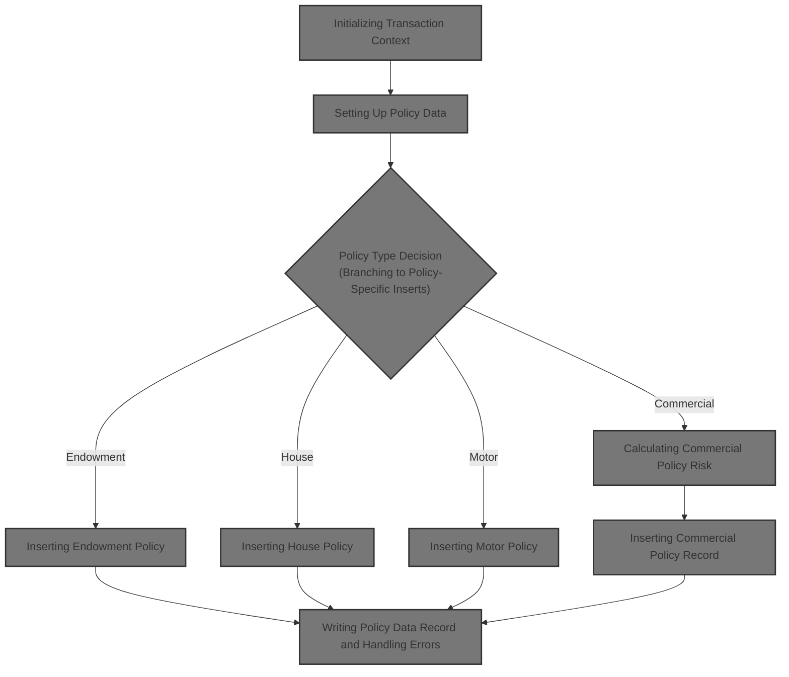

# Technical Overview

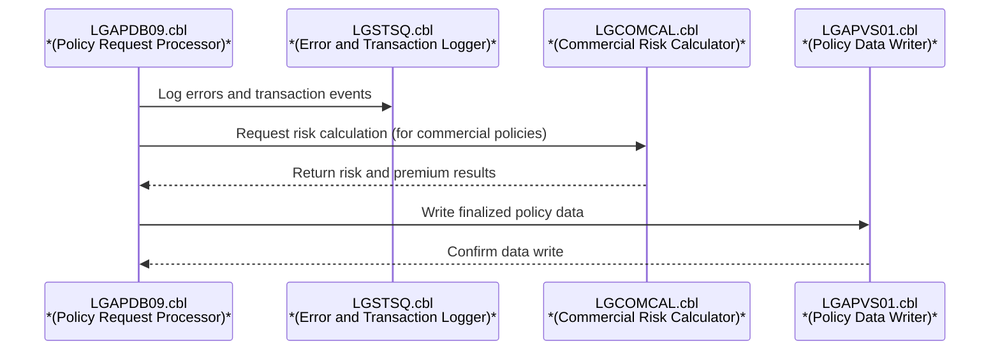

## Dependencies

### Programs

- <SwmToken path="base/src/lgapdb09.cbl" pos="268:9:9" line-data="             EXEC CICS Link Program(LGAPVS01)">`LGAPVS01`</SwmToken> (<SwmPath>[base/src/lgapvs01.cbl](base/src/lgapvs01.cbl)</SwmPath>)
- LGSTSQ (<SwmPath>[base/src/lgstsq.cbl](base/src/lgstsq.cbl)</SwmPath>)
- LGCOMCAL (<SwmPath>[base/src/lgcomcal.cbl](base/src/lgcomcal.cbl)</SwmPath>)

### Copybooks

- LGCMAREA (<SwmPath>[base/src/lgcmarea.cpy](base/src/lgcmarea.cpy)</SwmPath>)
- LGCOMDAT (<SwmPath>[base/src/lgcomdat.cpy](base/src/lgcomdat.cpy)</SwmPath>)
- LGPOLICY (<SwmPath>[base/src/lgpolicy.cpy](base/src/lgpolicy.cpy)</SwmPath>)
- SQLCA

## Input and Output Tables/Files used in the Program

| Table / File Name | Type                                                                                                                     | Description                                          | Usage Mode   | Key Fields / Layout Highlights                                                                                                                                                                                                                                                                                                                                                                                                                                                                                                                                                                                                                                                                                                                                                                                                                                                                                                                                                                                                                                                                                                                                                                                                                                                                                                                                                                                                                                                                                                                                                                                                                                                                                                                                                                                                                                                                                                                                                                                                                                                                                                                                                                                                                                                                                                                                                                                                                                                                                                                                                                                                                                        |
| ----------------- | ------------------------------------------------------------------------------------------------------------------------ | ---------------------------------------------------- | ------------ | --------------------------------------------------------------------------------------------------------------------------------------------------------------------------------------------------------------------------------------------------------------------------------------------------------------------------------------------------------------------------------------------------------------------------------------------------------------------------------------------------------------------------------------------------------------------------------------------------------------------------------------------------------------------------------------------------------------------------------------------------------------------------------------------------------------------------------------------------------------------------------------------------------------------------------------------------------------------------------------------------------------------------------------------------------------------------------------------------------------------------------------------------------------------------------------------------------------------------------------------------------------------------------------------------------------------------------------------------------------------------------------------------------------------------------------------------------------------------------------------------------------------------------------------------------------------------------------------------------------------------------------------------------------------------------------------------------------------------------------------------------------------------------------------------------------------------------------------------------------------------------------------------------------------------------------------------------------------------------------------------------------------------------------------------------------------------------------------------------------------------------------------------------------------------------------------------------------------------------------------------------------------------------------------------------------------------------------------------------------------------------------------------------------------------------------------------------------------------------------------------------------------------------------------------------------------------------------------------------------------------------------------------------------------- |
| COMMERCIAL        | <SwmToken path="base/src/lgapdb09.cbl" pos="199:3:3" line-data="           INITIALIZE DB2-IN-INTEGERS.">`DB2`</SwmToken> | Commercial policy address, perils, premiums, status  | Output       | <SwmToken path="base/src/lgapdb09.cbl" pos="567:2:2" line-data="                       (PolicyNumber,">`PolicyNumber`</SwmToken>, <SwmToken path="base/src/lgapdb09.cbl" pos="568:1:1" line-data="                        RequestDate,">`RequestDate`</SwmToken>, <SwmToken path="base/src/lgapdb09.cbl" pos="569:1:1" line-data="                        StartDate,">`StartDate`</SwmToken>, <SwmToken path="base/src/lgapdb09.cbl" pos="570:1:1" line-data="                        RenewalDate,">`RenewalDate`</SwmToken>, <SwmToken path="base/src/lgapdb09.cbl" pos="502:7:7" line-data="           MOVE CA-B-Address TO WS-XADDRESS">`Address`</SwmToken>, <SwmToken path="base/src/lgapdb09.cbl" pos="572:1:1" line-data="                        Zipcode,">`Zipcode`</SwmToken>, <SwmToken path="base/src/lgapdb09.cbl" pos="573:1:1" line-data="                        LatitudeN,">`LatitudeN`</SwmToken>, <SwmToken path="base/src/lgapdb09.cbl" pos="574:1:1" line-data="                        LongitudeW,">`LongitudeW`</SwmToken>, <SwmToken path="base/src/lgapdb09.cbl" pos="505:7:7" line-data="           MOVE CA-B-Customer TO WS-XCUSTNAME">`Customer`</SwmToken>, <SwmToken path="base/src/lgapdb09.cbl" pos="576:1:1" line-data="                        PropertyType,">`PropertyType`</SwmToken>, <SwmToken path="base/src/lgapdb09.cbl" pos="577:1:1" line-data="                        FirePeril,">`FirePeril`</SwmToken>, <SwmToken path="base/src/lgapdb09.cbl" pos="518:15:19" line-data="           MOVE WS-ZFP-PREMIUM TO CA-B-CA-B-FPR">`CA-B-FPR`</SwmToken>, <SwmToken path="base/src/lgapdb09.cbl" pos="579:1:1" line-data="                        CrimePeril,">`CrimePeril`</SwmToken>, <SwmToken path="base/src/lgapdb09.cbl" pos="580:1:1" line-data="                        CrimePremium,">`CrimePremium`</SwmToken>, <SwmToken path="base/src/lgapdb09.cbl" pos="581:1:1" line-data="                        FloodPeril,">`FloodPeril`</SwmToken>, <SwmToken path="base/src/lgapdb09.cbl" pos="582:1:1" line-data="                        FloodPremium,">`FloodPremium`</SwmToken>, <SwmToken path="base/src/lgapdb09.cbl" pos="583:1:1" line-data="                        WeatherPeril,">`WeatherPeril`</SwmToken>, <SwmToken path="base/src/lgapdb09.cbl" pos="584:1:1" line-data="                        WeatherPremium,">`WeatherPremium`</SwmToken>, <SwmToken path="base/src/lgapdb09.cbl" pos="585:1:1" line-data="                        Status,">`Status`</SwmToken>, <SwmToken path="base/src/lgapdb09.cbl" pos="586:1:1" line-data="                        RejectionReason)">`RejectionReason`</SwmToken> |
| ENDOWMENT         | <SwmToken path="base/src/lgapdb09.cbl" pos="199:3:3" line-data="           INITIALIZE DB2-IN-INTEGERS.">`DB2`</SwmToken> | Endowment policy terms, sum assured, life assured    | Output       | <SwmToken path="base/src/lgapdb09.cbl" pos="289:3:3" line-data="                       ( POLICYNUMBER,">`POLICYNUMBER`</SwmToken>, <SwmToken path="base/src/lgapdb09.cbl" pos="365:1:1" line-data="                            WITHPROFITS,">`WITHPROFITS`</SwmToken>, <SwmToken path="base/src/lgapdb09.cbl" pos="366:1:1" line-data="                            EQUITIES,">`EQUITIES`</SwmToken>, <SwmToken path="base/src/lgapdb09.cbl" pos="367:1:1" line-data="                            MANAGEDFUND,">`MANAGEDFUND`</SwmToken>, <SwmToken path="base/src/lgapdb09.cbl" pos="368:1:1" line-data="                            FUNDNAME,">`FUNDNAME`</SwmToken>, <SwmToken path="base/src/lgapdb09.cbl" pos="346:7:7" line-data="           MOVE CA-E-TERM        TO DB2-E-TERM-SINT">`TERM`</SwmToken>, <SwmToken path="base/src/lgapdb09.cbl" pos="347:17:17" line-data="           MOVE CA-E-SUM-ASSURED TO DB2-E-SUMASSURED-INT">`SUMASSURED`</SwmToken>, <SwmToken path="base/src/lgapdb09.cbl" pos="371:1:1" line-data="                            LIFEASSURED,">`LIFEASSURED`</SwmToken>, <SwmToken path="base/src/lgapdb09.cbl" pos="372:1:1" line-data="                            PADDINGDATA    )">`PADDINGDATA`</SwmToken>                                                                                                                                                                                                                                                                                                                                                                                                                                                                                                                                                                                                                                                                                                                                                                                                                                                                                                                                                                                                                                                                                                                                                                                                                                                                                                                                                                                                                        |
| HOUSE             | <SwmToken path="base/src/lgapdb09.cbl" pos="199:3:3" line-data="           INITIALIZE DB2-IN-INTEGERS.">`DB2`</SwmToken> | House policy property type, value, bedrooms, address | Output       | <SwmToken path="base/src/lgapdb09.cbl" pos="289:3:3" line-data="                       ( POLICYNUMBER,">`POLICYNUMBER`</SwmToken>, <SwmToken path="base/src/lgapdb09.cbl" pos="424:1:1" line-data="                         PROPERTYTYPE,">`PROPERTYTYPE`</SwmToken>, <SwmToken path="base/src/lgapdb09.cbl" pos="418:15:15" line-data="           MOVE CA-H-BED    TO DB2-H-BEDROOMS-SINT">`BEDROOMS`</SwmToken>, <SwmToken path="base/src/lgapdb09.cbl" pos="417:15:15" line-data="           MOVE CA-H-VAL       TO DB2-H-VALUE-INT">`VALUE`</SwmToken>, <SwmToken path="base/src/lgapdb09.cbl" pos="427:1:1" line-data="                         HOUSENAME,">`HOUSENAME`</SwmToken>, <SwmToken path="base/src/lgapdb09.cbl" pos="428:1:1" line-data="                         HOUSENUMBER,">`HOUSENUMBER`</SwmToken>, <SwmToken path="base/src/lgapdb09.cbl" pos="429:1:1" line-data="                         POSTCODE          )">`POSTCODE`</SwmToken>                                                                                                                                                                                                                                                                                                                                                                                                                                                                                                                                                                                                                                                                                                                                                                                                                                                                                                                                                                                                                                                                                                                                                                                                                                                                                                                                                                                                                                                                                                                                                                                                                                                                                                         |
| MOTOR             | <SwmToken path="base/src/lgapdb09.cbl" pos="199:3:3" line-data="           INITIALIZE DB2-IN-INTEGERS.">`DB2`</SwmToken> | Motor policy vehicle make, model, value, accidents   | Output       | <SwmToken path="base/src/lgapdb09.cbl" pos="289:3:3" line-data="                       ( POLICYNUMBER,">`POLICYNUMBER`</SwmToken>, <SwmToken path="base/src/lgapdb09.cbl" pos="460:1:1" line-data="                         MAKE,">`MAKE`</SwmToken>, <SwmToken path="base/src/lgapdb09.cbl" pos="461:1:1" line-data="                         MODEL,">`MODEL`</SwmToken>, <SwmToken path="base/src/lgapdb09.cbl" pos="417:15:15" line-data="           MOVE CA-H-VAL       TO DB2-H-VALUE-INT">`VALUE`</SwmToken>, <SwmToken path="base/src/lgapdb09.cbl" pos="463:1:1" line-data="                         REGNUMBER,">`REGNUMBER`</SwmToken>, <SwmToken path="base/src/lgapdb09.cbl" pos="464:1:1" line-data="                         COLOUR,">`COLOUR`</SwmToken>, <SwmToken path="base/src/lgapdb09.cbl" pos="452:7:7" line-data="           MOVE CA-M-CC          TO DB2-M-CC-SINT">`CC`</SwmToken>, <SwmToken path="base/src/lgapdb09.cbl" pos="466:1:1" line-data="                         YEAROFMANUFACTURE,">`YEAROFMANUFACTURE`</SwmToken>, <SwmToken path="base/src/lgapdb09.cbl" pos="453:7:7" line-data="           MOVE CA-M-PREMIUM     TO DB2-M-PREMIUM-INT">`PREMIUM`</SwmToken>, <SwmToken path="base/src/lgapdb09.cbl" pos="454:7:7" line-data="           MOVE CA-M-ACCIDENTS   TO DB2-M-ACCIDENTS-INT">`ACCIDENTS`</SwmToken>                                                                                                                                                                                                                                                                                                                                                                                                                                                                                                                                                                                                                                                                                                                                                                                                                                                                                                                                                                                                                                                                                                                                                                                                                                                                                                                 |
| POLICY            | <SwmToken path="base/src/lgapdb09.cbl" pos="199:3:3" line-data="           INITIALIZE DB2-IN-INTEGERS.">`DB2`</SwmToken> | Insurance policy core details and lifecycle dates    | Input/Output | <SwmToken path="base/src/lgapdb09.cbl" pos="289:3:3" line-data="                       ( POLICYNUMBER,">`POLICYNUMBER`</SwmToken>, <SwmToken path="base/src/lgapdb09.cbl" pos="290:1:1" line-data="                         CUSTOMERNUMBER,">`CUSTOMERNUMBER`</SwmToken>, <SwmToken path="base/src/lgapdb09.cbl" pos="291:1:1" line-data="                         ISSUEDATE,">`ISSUEDATE`</SwmToken>, <SwmToken path="base/src/lgapdb09.cbl" pos="292:1:1" line-data="                         EXPIRYDATE,">`EXPIRYDATE`</SwmToken>, <SwmToken path="base/src/lgapdb09.cbl" pos="222:11:11" line-data="               MOVE &#39;E&#39; TO DB2-POLICYTYPE">`POLICYTYPE`</SwmToken>, <SwmToken path="base/src/lgapdb09.cbl" pos="294:1:1" line-data="                         LASTCHANGED,">`LASTCHANGED`</SwmToken>, <SwmToken path="base/src/lgapdb09.cbl" pos="283:5:5" line-data="           MOVE CA-BROKERID TO DB2-BROKERID-INT">`BROKERID`</SwmToken>, <SwmToken path="base/src/lgapdb09.cbl" pos="296:1:1" line-data="                         BROKERSREFERENCE,">`BROKERSREFERENCE`</SwmToken>, <SwmToken path="base/src/lgapdb09.cbl" pos="284:5:5" line-data="           MOVE CA-PAYMENT TO DB2-PAYMENT-INT">`PAYMENT`</SwmToken>, <SwmToken path="base/src/lgapdb09.cbl" pos="334:4:6" line-data="               INTO :CA-LASTCHANGED">`CA-LASTCHANGED`</SwmToken>                                                                                                                                                                                                                                                                                                                                                                                                                                                                                                                                                                                                                                                                                                                                                                                                                                                                                                                                                                                                                                                                                                                                                                                                                                                                                         |

&nbsp;

## Detailed View of the Program's Functionality

# Initializing Transaction Context

When a transaction starts, the program sets up a header structure to capture runtime information such as transaction ID, terminal ID, task number, and the length of the communication area. This ensures that all subsequent operations have access to the correct context and clean data. It also initializes variables used for database operations, specifically those that will hold integer values for <SwmToken path="base/src/lgapdb09.cbl" pos="199:3:3" line-data="           INITIALIZE DB2-IN-INTEGERS.">`DB2`</SwmToken> input and output.

If the incoming request does not contain any data (the communication area length is zero), the program prepares an error message indicating that no data was received. It then logs this error and immediately aborts the transaction to prevent any further processing.

# Preparing Error Logging and Context

Whenever an error occurs, the program collects detailed context for logging. This includes the SQL error code, the current date and time, and relevant transaction identifiers. The error message is formatted with all this information and sent to a logging system via a dedicated logging program.

If there is input data present, the program checks its length. If the data is short enough, the entire input is included in the error message; otherwise, only the first portion is included to avoid excessively large logs. This ensures that error logs are both informative and concise. After logging, the function exits.

The logging program itself determines how to route the message based on how it was called. If invoked directly, it prepares the message and writes it to both a transient data queue and a temporary storage queue. If it was triggered as a receive flow, it also sends a response back to the caller.

# Setting Up Policy Data

After error handling, the program resets the return code and prepares pointers and data structures for policy and customer information. It then determines the type of policy being requested by examining the request identifier.

Depending on the policy type (endowment, house, motor, or commercial), the program adjusts the required length of the communication area and sets the appropriate policy type for database operations. If the request type is not recognized, it sets an error code and exits.

The program then validates that the incoming data is sufficient for the requested policy type. If the data is too short, it sets an error code and exits early. If everything is valid, it proceeds to insert the policy record into the database.

# Inserting Policy Record

To insert a new policy, the program maps broker and payment information from the input data into the appropriate database fields. It then executes an SQL insert statement to add the policy to the database.

After the insert, the program checks the result code. If the operation was successful, it retrieves the newly assigned policy number and the timestamp of the last change, storing these for later use. If there was a referential integrity error (such as a missing related record), it logs the error and exits. For any other error, it logs the issue and exits as well.

# Branching to Policy-Specific Inserts

Once the main policy record is inserted, the program determines which specific policy type routine to call next. Each policy type (endowment, house, motor, commercial) has its own routine for inserting additional details into the corresponding database table. If the request type is not recognized, it sets an error code.

# Inserting Endowment Policy

For endowment policies, the program converts numeric fields to the correct format for database storage. It checks if there is any extra variable-length data (such as padding data) to include. If such data exists, it is moved into a buffer and included in the SQL insert statement. Otherwise, only the standard fields are inserted.

After attempting the insert, the program checks for errors. If an error occurred, it logs the issue and aborts the transaction to ensure that no partial data is left in the database.

# Inserting House Policy

For house policies, the program converts relevant fields (such as value and number of bedrooms) to the correct format and inserts the house record into the database with all necessary details.

If the insert fails, the program logs the error and aborts the transaction to maintain data integrity.

# Inserting Motor Policy

For motor policies, the program converts all numeric fields and inserts the motor policy record into the database with all required details.

If the insert fails, the program logs the error and aborts the transaction.

# Calculating Commercial Policy Risk

For commercial policies, the program collects all relevant customer and property data and prepares it for risk calculation. It then calls a dedicated risk calculation module, passing all necessary information.

## Preparing Risk Calculation Context

The risk calculation module initializes its own context, setting transaction, terminal, and task identifiers. It enables security validation and sets up risk matrices by looping over possible positions and toggling specific flags for later use in risk logic.

## Running Risk and Premium Logic

The risk calculation logic starts by processing the insurance policy. It calculates a base risk score, then adds factors based on the property type (warehouse, factory, office, retail, or other) and the location (based on postcode). The total risk score is computed by combining these factors.

The program then determines the policy status based on the risk score, setting indicators and reasons for manual review or pending verification as needed.

## Premium Calculation and Discount Application

Premiums are calculated by first setting a discount factor. If all peril factors (fire, crime, flood, weather) are present, a discount is applied. The program then calculates individual premiums for each peril, multiplying the risk score by performance factors and the discount. If a peril factor is zero, the premium for that peril is set to zero. All peril premiums are summed to get the total premium.

## Transferring Risk Results and Premiums

After risk and premium calculations, the results (risk score, status, rejection reason, and all premium values) are copied back into the communication area for use in subsequent database operations.

The program then performs post-calculation checks and inserts the commercial policy record into the database, ensuring that all relevant fields are set.

# Inserting Commercial Policy Record

The program maps all calculated and input fields for the commercial policy to database variables and prepares the SQL insert statement. It then executes the insert to add the commercial policy record to the database.

After the insert, the program checks for errors. If an error occurred, it sets the return code, logs the error, and aborts the transaction to prevent partial data from being stored.

# Finalizing and Writing Policy Data

After all database operations are complete, the program links to another module to write the formatted policy data record to a persistent file. This is the final step before returning control to the caller.

# Writing Policy Data Record and Handling Errors

The file-writing module prepares the record based on the request type. It transforms customer, endowment, house, or motor data as needed and writes the record to the file with key identifiers.

If the file write fails, the program sets an error code, logs the error, and returns. The error logging routine collects the current time, formats it, and moves all relevant context into the error message. It then calls the logging program to record the error, including any available communication area data.

If the file write succeeds, the record is saved and the function exits normally.

# Data Definitions

| Table / Record Name | Type                                                                                                                     | Short Description                                    | Usage Mode                      |
| ------------------- | ------------------------------------------------------------------------------------------------------------------------ | ---------------------------------------------------- | ------------------------------- |
| COMMERCIAL          | <SwmToken path="base/src/lgapdb09.cbl" pos="199:3:3" line-data="           INITIALIZE DB2-IN-INTEGERS.">`DB2`</SwmToken> | Commercial policy address, perils, premiums, status  | Output (INSERT)                 |
| ENDOWMENT           | <SwmToken path="base/src/lgapdb09.cbl" pos="199:3:3" line-data="           INITIALIZE DB2-IN-INTEGERS.">`DB2`</SwmToken> | Endowment policy terms, sum assured, life assured    | Output (INSERT)                 |
| HOUSE               | <SwmToken path="base/src/lgapdb09.cbl" pos="199:3:3" line-data="           INITIALIZE DB2-IN-INTEGERS.">`DB2`</SwmToken> | House policy property type, value, bedrooms, address | Output (INSERT)                 |
| MOTOR               | <SwmToken path="base/src/lgapdb09.cbl" pos="199:3:3" line-data="           INITIALIZE DB2-IN-INTEGERS.">`DB2`</SwmToken> | Motor policy vehicle make, model, value, accidents   | Output (INSERT)                 |
| POLICY              | <SwmToken path="base/src/lgapdb09.cbl" pos="199:3:3" line-data="           INITIALIZE DB2-IN-INTEGERS.">`DB2`</SwmToken> | Insurance policy core details and lifecycle dates    | Input (SELECT), Output (INSERT) |

&nbsp;

# Rule Definition

| Paragraph Name                                                                                                                                                                                                                                                                                                                                                                                                                                                                                     | Rule ID | Category          | Description                                                                                                                                                                                                                                                                                                     | Conditions                                                                                                                                                                                                                                                                                                                                                                                                                                                                                                                                                                                                                                       | Remarks                                                                                                                                                                                                                                                                                                                                                                                                                                                                                                                                                       |
| -------------------------------------------------------------------------------------------------------------------------------------------------------------------------------------------------------------------------------------------------------------------------------------------------------------------------------------------------------------------------------------------------------------------------------------------------------------------------------------------------- | ------- | ----------------- | --------------------------------------------------------------------------------------------------------------------------------------------------------------------------------------------------------------------------------------------------------------------------------------------------------------- | ------------------------------------------------------------------------------------------------------------------------------------------------------------------------------------------------------------------------------------------------------------------------------------------------------------------------------------------------------------------------------------------------------------------------------------------------------------------------------------------------------------------------------------------------------------------------------------------------------------------------------------------------ | ------------------------------------------------------------------------------------------------------------------------------------------------------------------------------------------------------------------------------------------------------------------------------------------------------------------------------------------------------------------------------------------------------------------------------------------------------------------------------------------------------------------------------------------------------------- |
| MAINLINE SECTION (lines 192-201)                                                                                                                                                                                                                                                                                                                                                                                                                                                                   | RL-001  | Data Assignment   | Before any request is processed, the system must initialize the transaction context and all <SwmToken path="base/src/lgapdb09.cbl" pos="199:3:3" line-data="           INITIALIZE DB2-IN-INTEGERS.">`DB2`</SwmToken> host variables to ensure clean and correct data for downstream logic.                      | Always, at the start of processing any request.                                                                                                                                                                                                                                                                                                                                                                                                                                                                                                                                                                                                  | No specific constants; all relevant working-storage variables and <SwmToken path="base/src/lgapdb09.cbl" pos="199:3:3" line-data="           INITIALIZE DB2-IN-INTEGERS.">`DB2`</SwmToken> host variables are initialized to default/zero values.                                                                                                                                                                                                                                                                                                             |
| MAINLINE SECTION (lines 203-207)                                                                                                                                                                                                                                                                                                                                                                                                                                                                   | RL-002  | Conditional Logic | If no request data is received in the commarea, the system must collect error context (including SQL code, date, and time), send an error message to the logging system, and exit the function.                                                                                                                 | EIBCALEN is zero (no commarea received).                                                                                                                                                                                                                                                                                                                                                                                                                                                                                                                                                                                                         | Error message includes SQL code, date, time, and up to 90 bytes of commarea data if available. Error is logged via LGSTSQ.                                                                                                                                                                                                                                                                                                                                                                                                                                    |
| MAINLINE SECTION (lines 218-239)                                                                                                                                                                                                                                                                                                                                                                                                                                                                   | RL-003  | Conditional Logic | The system must support four policy types, identified by <SwmToken path="base/src/lgapdb09.cbl" pos="218:3:7" line-data="           EVALUATE CA-REQUEST-ID">`CA-REQUEST-ID`</SwmToken>. Any other value must result in a return code of '99' and exit.                                                          | <SwmToken path="base/src/lgapdb09.cbl" pos="218:3:7" line-data="           EVALUATE CA-REQUEST-ID">`CA-REQUEST-ID`</SwmToken> must be one of <SwmToken path="base/src/lgapdb09.cbl" pos="220:4:4" line-data="             WHEN &#39;01AEND&#39;">`01AEND`</SwmToken>, <SwmToken path="base/src/lgapdb09.cbl" pos="224:4:4" line-data="             WHEN &#39;01AHOU&#39;">`01AHOU`</SwmToken>, <SwmToken path="base/src/lgapdb09.cbl" pos="228:4:4" line-data="             WHEN &#39;01AMOT&#39;">`01AMOT`</SwmToken>, <SwmToken path="base/src/lgapdb09.cbl" pos="232:4:4" line-data="             WHEN &#39;01ACOM&#39;">`01ACOM`</SwmToken>. | Supported types: Endowment (<SwmToken path="base/src/lgapdb09.cbl" pos="220:4:4" line-data="             WHEN &#39;01AEND&#39;">`01AEND`</SwmToken>), House (<SwmToken path="base/src/lgapdb09.cbl" pos="224:4:4" line-data="             WHEN &#39;01AHOU&#39;">`01AHOU`</SwmToken>), Motor (<SwmToken path="base/src/lgapdb09.cbl" pos="228:4:4" line-data="             WHEN &#39;01AMOT&#39;">`01AMOT`</SwmToken>), Commercial (<SwmToken path="base/src/lgapdb09.cbl" pos="232:4:4" line-data="             WHEN &#39;01ACOM&#39;">`01ACOM`</SwmToken>). |
| <SwmToken path="base/src/lgapdb09.cbl" pos="247:3:5" line-data="           PERFORM P100-T">`P100-T`</SwmToken> (lines 247-339)                                                                                                                                                                                                                                                                                                                                                                     | RL-004  | Computation       | For each valid policy type, set up the required commarea length and <SwmToken path="base/src/lgapdb09.cbl" pos="199:3:3" line-data="           INITIALIZE DB2-IN-INTEGERS.">`DB2`</SwmToken> policy type, then insert the policy record into the POLICY table, mapping all relevant fields from the input data. | Valid policy type and sufficient commarea length.                                                                                                                                                                                                                                                                                                                                                                                                                                                                                                                                                                                                | Fields mapped include customer number, issue/expiry dates, policy type, broker info, payment, etc.                                                                                                                                                                                                                                                                                                                                                                                                                                                            |
| <SwmToken path="base/src/lgapdb09.cbl" pos="252:3:5" line-data="               PERFORM P200-E">`P200-E`</SwmToken>, <SwmToken path="base/src/lgapdb09.cbl" pos="255:3:5" line-data="               PERFORM P300-H">`P300-H`</SwmToken>, <SwmToken path="base/src/lgapdb09.cbl" pos="258:3:5" line-data="               PERFORM P400-M">`P400-M`</SwmToken>, <SwmToken path="base/src/lgapdb09.cbl" pos="261:3:5" line-data="               PERFORM P500-BIZ">`P500-BIZ`</SwmToken> (lines 343-530) | RL-005  | Computation       | For each policy type, insert a record into the corresponding table (ENDOWMENT, HOUSE, MOTOR, COMMERCIAL), mapping all relevant fields from the input data.                                                                                                                                                      | Valid policy type and successful policy insert.                                                                                                                                                                                                                                                                                                                                                                                                                                                                                                                                                                                                  | Each table has its own set of required fields. Endowment may include optional variable-length data.                                                                                                                                                                                                                                                                                                                                                                                                                                                           |
| <SwmToken path="base/src/lgapdb09.cbl" pos="261:3:5" line-data="               PERFORM P500-BIZ">`P500-BIZ`</SwmToken>, LGCOMCAL (lines 493-530, LGCOMCAL main logic)                                                                                                                                                                                                                                                                                                                              | RL-006  | Computation       | For commercial policies, collect all customer and property data, run a risk calculation, and calculate premiums for fire, crime, flood, and weather perils using specified formulas and discount logic. Determine policy status and rejection reason based on risk calculation results.                         | Policy type is Commercial (<SwmToken path="base/src/lgapdb09.cbl" pos="232:4:4" line-data="             WHEN &#39;01ACOM&#39;">`01ACOM`</SwmToken>).                                                                                                                                                                                                                                                                                                                                                                                                                                                                                             | Discount factor is <SwmToken path="base/src/lgcomcal.cbl" pos="127:15:17" line-data="           03 WS-SA-DISCOUNT           PIC V99 VALUE 0.90.">`0.90`</SwmToken> if all peril factors > 0, else <SwmToken path="base/src/lgcomcal.cbl" pos="366:3:5" line-data="           MOVE 1.00 TO WS-RC-DISCOUNT.">`1.00`</SwmToken>. Premium formulas as specified in the spec. Output includes all calculated premiums, status, and rejection reason.                                                                                                               |
| <SwmToken path="base/src/lgapdb09.cbl" pos="268:9:9" line-data="             EXEC CICS Link Program(LGAPVS01)">`LGAPVS01`</SwmToken> (lines 90-148)                                                                                                                                                                                                                                                                                                                                                | RL-007  | Computation       | After all inserts, write a formatted policy data record to the KSDSPOLY file, using the appropriate layout for the policy type.                                                                                                                                                                                 | Successful policy processing for any type.                                                                                                                                                                                                                                                                                                                                                                                                                                                                                                                                                                                                       | Record layout varies by policy type. Fields are mapped as per type-specific requirements. Record length is 104 bytes, key length is 21 bytes.                                                                                                                                                                                                                                                                                                                                                                                                                 |
| <SwmToken path="base/src/lgapdb09.cbl" pos="205:3:7" line-data="               PERFORM WRITE-ERROR-MESSAGE">`WRITE-ERROR-MESSAGE`</SwmToken>, <SwmToken path="base/src/lgapvs01.cbl" pos="146:3:5" line-data="             PERFORM P999-ERROR">`P999-ERROR`</SwmToken> (various locations)                                                                                                                                                                                                         | RL-008  | Conditional Logic | If any <SwmToken path="base/src/lgapdb09.cbl" pos="199:3:3" line-data="           INITIALIZE DB2-IN-INTEGERS.">`DB2`</SwmToken> or file operation fails, set the appropriate return code and log the error message, including up to 90 bytes of commarea data if available.                                     | Any SQLCODE or file operation response not equal to normal/success.                                                                                                                                                                                                                                                                                                                                                                                                                                                                                                                                                                              | Return codes: '90', '92', '80', etc. Error message includes SQL code, date, time, and up to 90 bytes of commarea data.                                                                                                                                                                                                                                                                                                                                                                                                                                        |
| MAINLINE SECTION, <SwmToken path="base/src/lgapdb09.cbl" pos="247:3:5" line-data="           PERFORM P100-T">`P100-T`</SwmToken>, <SwmToken path="base/src/lgapdb09.cbl" pos="261:3:5" line-data="               PERFORM P500-BIZ">`P500-BIZ`</SwmToken>, <SwmToken path="base/src/lgcomcal.cbl" pos="210:3:7" line-data="           PERFORM CLEANUP-AND-EXIT.">`CLEANUP-AND-EXIT`</SwmToken> (various locations)                                                                                  | RL-009  | Data Assignment   | The output commarea must always include the return code, assigned policy number, last changed timestamp, and, for commercial policies, all calculated premiums, status, and rejection reason.                                                                                                                   | On successful or failed completion of processing.                                                                                                                                                                                                                                                                                                                                                                                                                                                                                                                                                                                                | Output commarea fields: return code (string), policy number (number), last changed timestamp (string), and for commercial: premiums (numbers), status (number), rejection reason (string).                                                                                                                                                                                                                                                                                                                                                                    |
| MAINLINE SECTION (lines 216-245)                                                                                                                                                                                                                                                                                                                                                                                                                                                                   | RL-010  | Conditional Logic | If input data is present, the system must validate that the input data area (commarea) length is sufficient for the requested policy type. If the length is insufficient, set the return code to '98' and exit.                                                                                                 | The actual input data area length is less than the sum of the fixed header length and the required length for the requested policy type.                                                                                                                                                                                                                                                                                                                                                                                                                                                                                                         | The required length is the sum of a fixed header length (number) and a type-specific required length (number). The return code is a two-character string, left-aligned, with no padding required.                                                                                                                                                                                                                                                                                                                                                             |

# User Stories

## User Story 1: Robust request validation and error management

---

### Story Description:

As a system, I want to validate incoming requests, initialize all necessary variables, and handle errors gracefully so that only clean, correct data is processed and any issues are logged and reported appropriately.

---

### Business Rule Mapping:

| Rule ID | Paragraph Name                                                                                                                                                                                                                                                                             | Rule Description                                                                                                                                                                                                                                                                           |
| ------- | ------------------------------------------------------------------------------------------------------------------------------------------------------------------------------------------------------------------------------------------------------------------------------------------ | ------------------------------------------------------------------------------------------------------------------------------------------------------------------------------------------------------------------------------------------------------------------------------------------ |
| RL-008  | <SwmToken path="base/src/lgapdb09.cbl" pos="205:3:7" line-data="               PERFORM WRITE-ERROR-MESSAGE">`WRITE-ERROR-MESSAGE`</SwmToken>, <SwmToken path="base/src/lgapvs01.cbl" pos="146:3:5" line-data="             PERFORM P999-ERROR">`P999-ERROR`</SwmToken> (various locations) | If any <SwmToken path="base/src/lgapdb09.cbl" pos="199:3:3" line-data="           INITIALIZE DB2-IN-INTEGERS.">`DB2`</SwmToken> or file operation fails, set the appropriate return code and log the error message, including up to 90 bytes of commarea data if available.                |
| RL-001  | MAINLINE SECTION (lines 192-201)                                                                                                                                                                                                                                                           | Before any request is processed, the system must initialize the transaction context and all <SwmToken path="base/src/lgapdb09.cbl" pos="199:3:3" line-data="           INITIALIZE DB2-IN-INTEGERS.">`DB2`</SwmToken> host variables to ensure clean and correct data for downstream logic. |
| RL-002  | MAINLINE SECTION (lines 203-207)                                                                                                                                                                                                                                                           | If no request data is received in the commarea, the system must collect error context (including SQL code, date, and time), send an error message to the logging system, and exit the function.                                                                                            |
| RL-010  | MAINLINE SECTION (lines 216-245)                                                                                                                                                                                                                                                           | If input data is present, the system must validate that the input data area (commarea) length is sufficient for the requested policy type. If the length is insufficient, set the return code to '98' and exit.                                                                            |

---

### Relevant Functionality:

- <SwmToken path="base/src/lgapdb09.cbl" pos="205:3:7" line-data="               PERFORM WRITE-ERROR-MESSAGE">`WRITE-ERROR-MESSAGE`</SwmToken>
  1. **RL-008:**
     - On <SwmToken path="base/src/lgapdb09.cbl" pos="199:3:3" line-data="           INITIALIZE DB2-IN-INTEGERS.">`DB2`</SwmToken> or file error:
       - Set return code as per error
       - Populate error message structure
       - Link to LGSTSQ to log error
       - If commarea present, include up to 90 bytes of data
       - Return or abend as appropriate.
- **MAINLINE SECTION (lines 192-201)**
  1. **RL-001:**
     - Initialize transaction context variables (header, transid, termid, tasknum, calen)
     - Initialize all <SwmToken path="base/src/lgapdb09.cbl" pos="199:3:3" line-data="           INITIALIZE DB2-IN-INTEGERS.">`DB2`</SwmToken> input and output host variables to zero or default values.
- **MAINLINE SECTION (lines 203-207)**
  1. **RL-002:**
     - If commarea length is zero:
       - Populate error message structure with context
       - Call <SwmToken path="base/src/lgapdb09.cbl" pos="205:3:7" line-data="               PERFORM WRITE-ERROR-MESSAGE">`WRITE-ERROR-MESSAGE`</SwmToken>
       - Issue CICS abend with code 'LGCA' and exit.
- **MAINLINE SECTION (lines 216-245)**
  1. **RL-010:**
     - Calculate the required length as the sum of the header length and the required length for the policy type
     - If the actual input data area length is less than the required length:
       - Set the return code field in the output data area to '98'
       - Return to the caller without further processing.

## User Story 2: Support and process multiple policy types

---

### Story Description:

As a system, I want to support and process requests for Endowment, House, Motor, and Commercial policies so that users can submit different policy types and have them correctly validated, inserted, and mapped to the appropriate tables.

---

### Business Rule Mapping:

| Rule ID | Paragraph Name                                                                                                                                                                                                                                                                                                                                                                                                                                                                                     | Rule Description                                                                                                                                                                                                                                                                                                |
| ------- | -------------------------------------------------------------------------------------------------------------------------------------------------------------------------------------------------------------------------------------------------------------------------------------------------------------------------------------------------------------------------------------------------------------------------------------------------------------------------------------------------- | --------------------------------------------------------------------------------------------------------------------------------------------------------------------------------------------------------------------------------------------------------------------------------------------------------------- |
| RL-005  | <SwmToken path="base/src/lgapdb09.cbl" pos="252:3:5" line-data="               PERFORM P200-E">`P200-E`</SwmToken>, <SwmToken path="base/src/lgapdb09.cbl" pos="255:3:5" line-data="               PERFORM P300-H">`P300-H`</SwmToken>, <SwmToken path="base/src/lgapdb09.cbl" pos="258:3:5" line-data="               PERFORM P400-M">`P400-M`</SwmToken>, <SwmToken path="base/src/lgapdb09.cbl" pos="261:3:5" line-data="               PERFORM P500-BIZ">`P500-BIZ`</SwmToken> (lines 343-530) | For each policy type, insert a record into the corresponding table (ENDOWMENT, HOUSE, MOTOR, COMMERCIAL), mapping all relevant fields from the input data.                                                                                                                                                      |
| RL-003  | MAINLINE SECTION (lines 218-239)                                                                                                                                                                                                                                                                                                                                                                                                                                                                   | The system must support four policy types, identified by <SwmToken path="base/src/lgapdb09.cbl" pos="218:3:7" line-data="           EVALUATE CA-REQUEST-ID">`CA-REQUEST-ID`</SwmToken>. Any other value must result in a return code of '99' and exit.                                                          |
| RL-004  | <SwmToken path="base/src/lgapdb09.cbl" pos="247:3:5" line-data="           PERFORM P100-T">`P100-T`</SwmToken> (lines 247-339)                                                                                                                                                                                                                                                                                                                                                                     | For each valid policy type, set up the required commarea length and <SwmToken path="base/src/lgapdb09.cbl" pos="199:3:3" line-data="           INITIALIZE DB2-IN-INTEGERS.">`DB2`</SwmToken> policy type, then insert the policy record into the POLICY table, mapping all relevant fields from the input data. |

---

### Relevant Functionality:

- <SwmToken path="base/src/lgapdb09.cbl" pos="252:3:5" line-data="               PERFORM P200-E">`P200-E`</SwmToken>
  1. **RL-005:**
     - For Endowment: Insert with/without variable-length data as needed
     - For House: Insert mapped fields
     - For Motor: Insert mapped fields
     - For Commercial: Collect all customer/property data, run risk calculation, calculate premiums, determine status, insert all results.
- **MAINLINE SECTION (lines 218-239)**
  1. **RL-003:**
     - Evaluate <SwmToken path="base/src/lgapdb09.cbl" pos="218:3:7" line-data="           EVALUATE CA-REQUEST-ID">`CA-REQUEST-ID`</SwmToken>:
       - For each valid type, add required length and set <SwmToken path="base/src/lgapdb09.cbl" pos="199:3:3" line-data="           INITIALIZE DB2-IN-INTEGERS.">`DB2`</SwmToken> policy type
       - For any other value, set return code to '99' and return.
- <SwmToken path="base/src/lgapdb09.cbl" pos="247:3:5" line-data="           PERFORM P100-T">`P100-T`</SwmToken> **(lines 247-339)**
  1. **RL-004:**
     - Move input fields to <SwmToken path="base/src/lgapdb09.cbl" pos="199:3:3" line-data="           INITIALIZE DB2-IN-INTEGERS.">`DB2`</SwmToken> host variables
     - Insert into POLICY table
     - On SQL error, set appropriate return code and log error
     - Retrieve assigned policy number and last changed timestamp
     - Populate these in the output commarea.

## User Story 3: Commercial policy risk and premium calculation

---

### Story Description:

As a commercial policyholder, I want the system to calculate risk scores and premiums for various perils, determine policy status and rejection reasons, and receive all relevant results in the output so that I understand my coverage and costs.

---

### Business Rule Mapping:

| Rule ID | Paragraph Name                                                                                                                                                                                                                                                                                                                                                                                                    | Rule Description                                                                                                                                                                                                                                                                        |
| ------- | ----------------------------------------------------------------------------------------------------------------------------------------------------------------------------------------------------------------------------------------------------------------------------------------------------------------------------------------------------------------------------------------------------------------- | --------------------------------------------------------------------------------------------------------------------------------------------------------------------------------------------------------------------------------------------------------------------------------------- |
| RL-006  | <SwmToken path="base/src/lgapdb09.cbl" pos="261:3:5" line-data="               PERFORM P500-BIZ">`P500-BIZ`</SwmToken>, LGCOMCAL (lines 493-530, LGCOMCAL main logic)                                                                                                                                                                                                                                             | For commercial policies, collect all customer and property data, run a risk calculation, and calculate premiums for fire, crime, flood, and weather perils using specified formulas and discount logic. Determine policy status and rejection reason based on risk calculation results. |
| RL-009  | MAINLINE SECTION, <SwmToken path="base/src/lgapdb09.cbl" pos="247:3:5" line-data="           PERFORM P100-T">`P100-T`</SwmToken>, <SwmToken path="base/src/lgapdb09.cbl" pos="261:3:5" line-data="               PERFORM P500-BIZ">`P500-BIZ`</SwmToken>, <SwmToken path="base/src/lgcomcal.cbl" pos="210:3:7" line-data="           PERFORM CLEANUP-AND-EXIT.">`CLEANUP-AND-EXIT`</SwmToken> (various locations) | The output commarea must always include the return code, assigned policy number, last changed timestamp, and, for commercial policies, all calculated premiums, status, and rejection reason.                                                                                           |

---

### Relevant Functionality:

- <SwmToken path="base/src/lgapdb09.cbl" pos="261:3:5" line-data="               PERFORM P500-BIZ">`P500-BIZ`</SwmToken>
  1. **RL-006:**
     - Collect all required data from commarea
     - Link to LGCOMCAL for risk and premium calculation
     - Apply discount if all peril factors > 0
     - Calculate each peril premium using risk score, performance factor, discount, and peril factor
     - Sum premiums for total
     - Determine status and rejection reason
     - Insert into COMMERCIAL table
     - Populate output commarea with all results.
- **MAINLINE SECTION**
  1. **RL-009:**
     - After processing, move all required values to output commarea fields
     - For commercial, include all calculated premiums, status, and rejection reason
     - Always set return code.

## User Story 4: Write formatted policy data to file and populate output

---

### Story Description:

As a system, I want to write a formatted policy data record to the KSDSPOLY file and ensure the output commarea includes all required fields so that policy data is persisted and users receive complete information about their policy.

---

### Business Rule Mapping:

| Rule ID | Paragraph Name                                                                                                                                                                                                                                                                                                                                                                                                    | Rule Description                                                                                                                                                                              |
| ------- | ----------------------------------------------------------------------------------------------------------------------------------------------------------------------------------------------------------------------------------------------------------------------------------------------------------------------------------------------------------------------------------------------------------------- | --------------------------------------------------------------------------------------------------------------------------------------------------------------------------------------------- |
| RL-007  | <SwmToken path="base/src/lgapdb09.cbl" pos="268:9:9" line-data="             EXEC CICS Link Program(LGAPVS01)">`LGAPVS01`</SwmToken> (lines 90-148)                                                                                                                                                                                                                                                               | After all inserts, write a formatted policy data record to the KSDSPOLY file, using the appropriate layout for the policy type.                                                               |
| RL-009  | MAINLINE SECTION, <SwmToken path="base/src/lgapdb09.cbl" pos="247:3:5" line-data="           PERFORM P100-T">`P100-T`</SwmToken>, <SwmToken path="base/src/lgapdb09.cbl" pos="261:3:5" line-data="               PERFORM P500-BIZ">`P500-BIZ`</SwmToken>, <SwmToken path="base/src/lgcomcal.cbl" pos="210:3:7" line-data="           PERFORM CLEANUP-AND-EXIT.">`CLEANUP-AND-EXIT`</SwmToken> (various locations) | The output commarea must always include the return code, assigned policy number, last changed timestamp, and, for commercial policies, all calculated premiums, status, and rejection reason. |

---

### Relevant Functionality:

- <SwmToken path="base/src/lgapdb09.cbl" pos="268:9:9" line-data="             EXEC CICS Link Program(LGAPVS01)">`LGAPVS01`</SwmToken> **(lines 90-148)**
  1. **RL-007:**
     - Map commarea fields to <SwmToken path="base/src/lgapvs01.cbl" pos="137:3:5" line-data="                     From(V2-RECORD)">`V2-RECORD`</SwmToken> structure based on policy type
     - Write to KSDSPOLY file
     - On error, set return code to '80', log error, and return.
- **MAINLINE SECTION**
  1. **RL-009:**
     - After processing, move all required values to output commarea fields
     - For commercial, include all calculated premiums, status, and rejection reason
     - Always set return code.

# Workflow

# Initializing Transaction Context

```mermaid
%%{init: {"flowchart": {"defaultRenderer": "elk"}} }%%
flowchart TD
  node1["Start: Initialize transaction"]
  click node1 openCode "base/src/lgapdb09.cbl:190:200"
  node1 --> node2{"Was request data received?"}
  click node2 openCode "base/src/lgapdb09.cbl:203:207"
  node2 -->|"No"| node3["Preparing Error Logging and Context"]
  
  node2 -->|"Yes"| node4["Prepare business context"]
  click node4 openCode "base/src/lgapdb09.cbl:209:216"
  node4 --> node5{"What policy type is requested?"}
  click node5 openCode "base/src/lgapdb09.cbl:218:240"
  node5 -->|"Endowment (01AEND)"| node6["Inserting Policy Record"]
  
  node6 --> node7["Inserting Endowment Policy"]
  
  node5 -->|"House (01AHOU)"| node8["Inserting Policy Record"]
  
  node8 --> node9["Inserting House Policy"]
  
  node5 -->|"Motor (01AMOT)"| node10["Inserting Policy Record"]
  
  node10 --> node11["Inserting Motor Policy"]
  
  node5 -->|"Commercial (01ACOM)"| node12["Inserting Policy Record"]
  
  node12 --> node13["Calculating Commercial Policy Risk"]
  
  node13 --> node14["Inserting Commercial Policy Record"]
  
  node5 -->|"Other"| node15["Return error: Invalid request (code '99')"]
  click node15 openCode "base/src/lgapdb09.cbl:237:238"

classDef HeadingStyle fill:#777777,stroke:#333,stroke-width:2px;
click node3 goToHeading "Preparing Error Logging and Context"
node3:::HeadingStyle
click node6 goToHeading "Inserting Policy Record"
node6:::HeadingStyle
click node7 goToHeading "Inserting Endowment Policy"
node7:::HeadingStyle
click node8 goToHeading "Inserting Policy Record"
node8:::HeadingStyle
click node9 goToHeading "Inserting House Policy"
node9:::HeadingStyle
click node10 goToHeading "Inserting Policy Record"
node10:::HeadingStyle
click node11 goToHeading "Inserting Motor Policy"
node11:::HeadingStyle
click node12 goToHeading "Inserting Policy Record"
node12:::HeadingStyle
click node13 goToHeading "Calculating Commercial Policy Risk"
node13:::HeadingStyle
click node14 goToHeading "Inserting Commercial Policy Record"
node14:::HeadingStyle

%% Swimm:
%% %%{init: {"flowchart": {"defaultRenderer": "elk"}} }%%
%% flowchart TD
%%   node1["Start: Initialize transaction"]
%%   click node1 openCode "<SwmPath>[base/src/lgapdb09.cbl](base/src/lgapdb09.cbl)</SwmPath>:190:200"
%%   node1 --> node2{"Was request data received?"}
%%   click node2 openCode "<SwmPath>[base/src/lgapdb09.cbl](base/src/lgapdb09.cbl)</SwmPath>:203:207"
%%   node2 -->|"No"| node3["Preparing Error Logging and Context"]
%%   
%%   node2 -->|"Yes"| node4["Prepare business context"]
%%   click node4 openCode "<SwmPath>[base/src/lgapdb09.cbl](base/src/lgapdb09.cbl)</SwmPath>:209:216"
%%   node4 --> node5{"What policy type is requested?"}
%%   click node5 openCode "<SwmPath>[base/src/lgapdb09.cbl](base/src/lgapdb09.cbl)</SwmPath>:218:240"
%%   node5 -->|"Endowment (<SwmToken path="base/src/lgapdb09.cbl" pos="220:4:4" line-data="             WHEN &#39;01AEND&#39;">`01AEND`</SwmToken>)"| node6["Inserting Policy Record"]
%%   
%%   node6 --> node7["Inserting Endowment Policy"]
%%   
%%   node5 -->|"House (<SwmToken path="base/src/lgapdb09.cbl" pos="224:4:4" line-data="             WHEN &#39;01AHOU&#39;">`01AHOU`</SwmToken>)"| node8["Inserting Policy Record"]
%%   
%%   node8 --> node9["Inserting House Policy"]
%%   
%%   node5 -->|"Motor (<SwmToken path="base/src/lgapdb09.cbl" pos="228:4:4" line-data="             WHEN &#39;01AMOT&#39;">`01AMOT`</SwmToken>)"| node10["Inserting Policy Record"]
%%   
%%   node10 --> node11["Inserting Motor Policy"]
%%   
%%   node5 -->|"Commercial (<SwmToken path="base/src/lgapdb09.cbl" pos="232:4:4" line-data="             WHEN &#39;01ACOM&#39;">`01ACOM`</SwmToken>)"| node12["Inserting Policy Record"]
%%   
%%   node12 --> node13["Calculating Commercial Policy Risk"]
%%   
%%   node13 --> node14["Inserting Commercial Policy Record"]
%%   
%%   node5 -->|"Other"| node15["Return error: Invalid request (code '99')"]
%%   click node15 openCode "<SwmPath>[base/src/lgapdb09.cbl](base/src/lgapdb09.cbl)</SwmPath>:237:238"
%% 
%% classDef HeadingStyle fill:#777777,stroke:#333,stroke-width:2px;
%% click node3 goToHeading "Preparing Error Logging and Context"
%% node3:::HeadingStyle
%% click node6 goToHeading "Inserting Policy Record"
%% node6:::HeadingStyle
%% click node7 goToHeading "Inserting Endowment Policy"
%% node7:::HeadingStyle
%% click node8 goToHeading "Inserting Policy Record"
%% node8:::HeadingStyle
%% click node9 goToHeading "Inserting House Policy"
%% node9:::HeadingStyle
%% click node10 goToHeading "Inserting Policy Record"
%% node10:::HeadingStyle
%% click node11 goToHeading "Inserting Motor Policy"
%% node11:::HeadingStyle
%% click node12 goToHeading "Inserting Policy Record"
%% node12:::HeadingStyle
%% click node13 goToHeading "Calculating Commercial Policy Risk"
%% node13:::HeadingStyle
%% click node14 goToHeading "Inserting Commercial Policy Record"
%% node14:::HeadingStyle
```

This section is responsible for initializing the transaction context and preparing all necessary variables and data structures before processing any insurance policy request. It ensures that the incoming request is valid, sets up the environment for downstream operations, and routes the request to the appropriate business logic based on the policy type specified.

| Category        | Rule Name                     | Description                                                                                                                                                                                                                                                                                                                                                                                                                                                                                                                                                                                                                                            |
| --------------- | ----------------------------- | ------------------------------------------------------------------------------------------------------------------------------------------------------------------------------------------------------------------------------------------------------------------------------------------------------------------------------------------------------------------------------------------------------------------------------------------------------------------------------------------------------------------------------------------------------------------------------------------------------------------------------------------------------ |
| Data validation | Unsupported Policy Type Error | If the policy type is not one of the supported types (<SwmToken path="base/src/lgapdb09.cbl" pos="220:4:4" line-data="             WHEN &#39;01AEND&#39;">`01AEND`</SwmToken>, <SwmToken path="base/src/lgapdb09.cbl" pos="224:4:4" line-data="             WHEN &#39;01AHOU&#39;">`01AHOU`</SwmToken>, <SwmToken path="base/src/lgapdb09.cbl" pos="228:4:4" line-data="             WHEN &#39;01AMOT&#39;">`01AMOT`</SwmToken>, <SwmToken path="base/src/lgapdb09.cbl" pos="232:4:4" line-data="             WHEN &#39;01ACOM&#39;">`01ACOM`</SwmToken>), the system must return an error with code '99' and not proceed with any further processing. |
| Business logic  | Policy Type Routing           | The system must determine the policy type from the request and route the request to the corresponding business logic for Endowment, House, Motor, or Commercial policy processing. If the policy type is not recognized, an error must be returned with code '99'.                                                                                                                                                                                                                                                                                                                                                                                     |
| Business logic  | Business Context Preparation  | For each valid policy type, the system must prepare the business context and initialize all relevant <SwmToken path="base/src/lgapdb09.cbl" pos="199:3:3" line-data="           INITIALIZE DB2-IN-INTEGERS.">`DB2`</SwmToken> variables with values from the request before invoking downstream business logic.                                                                                                                                                                                                                                                                                                                                        |

<SwmSnippet path="/base/src/lgapdb09.cbl" line="190">

---

We start by prepping transaction context and <SwmToken path="base/src/lgapdb09.cbl" pos="199:3:3" line-data="           INITIALIZE DB2-IN-INTEGERS.">`DB2`</SwmToken> variables so everything downstream has the right info and clean data.

```cobol
       MAINLINE SECTION.

           INITIALIZE WS-HEADER.
           MOVE EIBTRNID TO WS-TRANSID.
           MOVE EIBTRMID TO WS-TERMID.
           MOVE EIBTASKN TO WS-TASKNUM.
           MOVE EIBCALEN TO WS-CALEN.
      *----------------------------------------------------------------*

           INITIALIZE DB2-IN-INTEGERS.
           INITIALIZE DB2-OUT-INTEGERS.
```

---

</SwmSnippet>

<SwmSnippet path="/base/src/lgapdb09.cbl" line="203">

---

If there's no commarea, we log the error and bail out by abending after calling <SwmToken path="base/src/lgapdb09.cbl" pos="205:3:7" line-data="               PERFORM WRITE-ERROR-MESSAGE">`WRITE-ERROR-MESSAGE`</SwmToken>.

```cobol
           IF EIBCALEN IS EQUAL TO ZERO
               MOVE ' NO COMMAREA RECEIVED' TO EM-VARIABLE
               PERFORM WRITE-ERROR-MESSAGE
               EXEC CICS ABEND ABCODE('LGCA') NODUMP END-EXEC
           END-IF
```

---

</SwmSnippet>

## Preparing Error Logging and Context

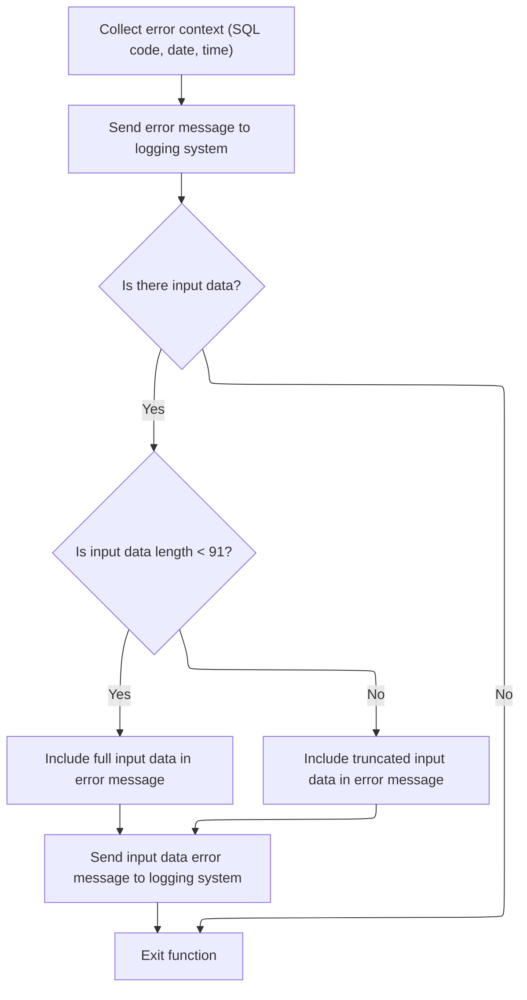

This section ensures that all relevant error context is captured and logged whenever a database error occurs, supporting both operational monitoring and troubleshooting.

| Category       | Rule Name                     | Description                                                                                                                                                                                                                     |
| -------------- | ----------------------------- | ------------------------------------------------------------------------------------------------------------------------------------------------------------------------------------------------------------------------------- |
| Business logic | Error context completeness    | Whenever an error occurs, the error message must include the SQLCODE, the current date, and the current time to provide full context for troubleshooting.                                                                       |
| Business logic | Input data inclusion limit    | If input data is present in the commarea, up to 90 bytes of this data must be included in the error message. If the input data is less than 91 bytes, the full data is included; otherwise, only the first 90 bytes are logged. |
| Business logic | Dual queue logging            | Error messages must be routed to both the TDQ (CSMT) and TSQ (GENAERRS) queues to ensure persistence and transactional tracking.                                                                                                |
| Business logic | Special input prefix handling | If the input data starts with 'Q=', the error message must be manipulated to extract and log the relevant extension and rest of the data, ensuring proper categorization.                                                       |
| Business logic | No input data fallback        | If no input data is present in the commarea, only the basic error message (without commarea data) is logged.                                                                                                                    |
| Technical step | Non-blocking queue write      | Error logging must not wait for TSQ storage to become available; if no space is available, the request is ignored to avoid blocking the task.                                                                                   |

<SwmSnippet path="/base/src/lgapdb09.cbl" line="619">

---

In <SwmToken path="base/src/lgapdb09.cbl" pos="619:1:5" line-data="       WRITE-ERROR-MESSAGE.">`WRITE-ERROR-MESSAGE`</SwmToken>, we grab the SQLCODE, get the current time, format it, and prep the error message with all this info. This sets up the error context before routing it to the logging program.

```cobol
       WRITE-ERROR-MESSAGE.
           MOVE SQLCODE TO EM-SQLRC
           EXEC CICS ASKTIME ABSTIME(ABS-TIME)
           END-EXEC
           EXEC CICS FORMATTIME ABSTIME(ABS-TIME)
                     MMDDYYYY(DATE1)
                     TIME(TIME1)
           END-EXEC
```

---

</SwmSnippet>

<SwmSnippet path="/base/src/lgapdb09.cbl" line="627">

---

After prepping the error message, we call LGSTSQ to log it. First with <SwmToken path="base/src/lgapdb09.cbl" pos="630:3:5" line-data="                     COMMAREA(ERROR-MSG)">`ERROR-MSG`</SwmToken>, then (if needed) with <SwmToken path="base/src/lgapdb09.cbl" pos="637:3:7" line-data="                         COMMAREA(CA-ERROR-MSG)">`CA-ERROR-MSG`</SwmToken> to include extra commarea data. This makes sure all error details are captured in the system queues.

```cobol
           MOVE DATE1 TO EM-DATE
           MOVE TIME1 TO EM-TIME
           EXEC CICS LINK PROGRAM('LGSTSQ')
                     COMMAREA(ERROR-MSG)
                     LENGTH(LENGTH OF ERROR-MSG)
           END-EXEC.
```

---

</SwmSnippet>

<SwmSnippet path="/base/src/lgstsq.cbl" line="55">

---

<SwmToken path="base/src/lgstsq.cbl" pos="55:1:1" line-data="       MAINLINE SECTION.">`MAINLINE`</SwmToken> in LGSTSQ handles message prep and routing: it decides how to build the message based on invocation context, manipulates message content if it starts with 'Q=', and writes the result to both TDQ and TSQ queues. If it's a receive flow, it sends a response back. This covers both error logging and transactional tracking.

```cobol
       MAINLINE SECTION.

           MOVE SPACES TO WRITE-MSG.
           MOVE SPACES TO WS-RECV.

           EXEC CICS ASSIGN SYSID(WRITE-MSG-SYSID)
                RESP(WS-RESP)
           END-EXEC.

           EXEC CICS ASSIGN INVOKINGPROG(WS-INVOKEPROG)
                RESP(WS-RESP)
           END-EXEC.
           
           IF WS-INVOKEPROG NOT = SPACES
              MOVE 'C' To WS-FLAG
              MOVE COMMA-DATA  TO WRITE-MSG-MSG
              MOVE EIBCALEN    TO WS-RECV-LEN
           ELSE
              EXEC CICS RECEIVE INTO(WS-RECV)
                  LENGTH(WS-RECV-LEN)
                  RESP(WS-RESP)
              END-EXEC
              MOVE 'R' To WS-FLAG
              MOVE WS-RECV-DATA  TO WRITE-MSG-MSG
              SUBTRACT 5 FROM WS-RECV-LEN
           END-IF.

           MOVE 'GENAERRS' TO STSQ-NAME.
           IF WRITE-MSG-MSG(1:2) = 'Q=' THEN
              MOVE WRITE-MSG-MSG(3:4) TO STSQ-EXT
              MOVE WRITE-MSG-REST TO TEMPO
              MOVE TEMPO          TO WRITE-MSG-MSG
              SUBTRACT 7 FROM WS-RECV-LEN
           END-IF.

           ADD 5 TO WS-RECV-LEN.

      * Write output message to TDQ CSMT
      *
           EXEC CICS WRITEQ TD QUEUE(STDQ-NAME)
                     FROM(WRITE-MSG)
                     RESP(WS-RESP)
                     LENGTH(WS-RECV-LEN)

           END-EXEC.

      * Write output message to Genapp TSQ
      * If no space is available then the task will not wait for
      *  storage to become available but will ignore the request...
      *
           EXEC CICS WRITEQ TS QUEUE(STSQ-NAME)
                     FROM(WRITE-MSG)
                     RESP(WS-RESP)
                     NOSUSPEND
                     LENGTH(WS-RECV-LEN)

           END-EXEC.

           If WS-FLAG = 'R' Then
             EXEC CICS SEND TEXT FROM(FILLER-X)
              WAIT
              ERASE
              LENGTH(1)
              FREEKB
             END-EXEC.

           EXEC CICS RETURN
           END-EXEC.
```

---

</SwmSnippet>

<SwmSnippet path="/base/src/lgapdb09.cbl" line="633">

---

After returning from LGSTSQ, <SwmToken path="base/src/lgapdb09.cbl" pos="205:3:7" line-data="               PERFORM WRITE-ERROR-MESSAGE">`WRITE-ERROR-MESSAGE`</SwmToken> checks if there's commarea data to log. If so, it moves up to 90 bytes (or less) from DFHCOMMAREA to <SwmToken path="base/src/lgapdb09.cbl" pos="635:12:14" line-data="               MOVE DFHCOMMAREA(1:EIBCALEN) TO CA-DATA">`CA-DATA`</SwmToken> and calls LGSTSQ again with this extended error info. This keeps error logs concise and relevant.

```cobol
           IF EIBCALEN > 0 THEN
             IF EIBCALEN < 91 THEN
               MOVE DFHCOMMAREA(1:EIBCALEN) TO CA-DATA
               EXEC CICS LINK PROGRAM('LGSTSQ')
                         COMMAREA(CA-ERROR-MSG)
                         LENGTH(LENGTH OF CA-ERROR-MSG)
               END-EXEC
             ELSE
               MOVE DFHCOMMAREA(1:90) TO CA-DATA
               EXEC CICS LINK PROGRAM('LGSTSQ')
                         COMMAREA(CA-ERROR-MSG)
                         LENGTH(LENGTH OF CA-ERROR-MSG)
               END-EXEC
             END-IF
           END-IF.
           EXIT.
```

---

</SwmSnippet>

## Setting Up Policy Data

```mermaid
%%{init: {"flowchart": {"defaultRenderer": "elk"}} }%%
flowchart TD
    node1["Start: Prepare customer policy request"]
    click node1 openCode "base/src/lgapdb09.cbl:209:216"
    node1 --> node2{"Request type?"}
    click node2 openCode "base/src/lgapdb09.cbl:218:219"
    node2 -->|"Endowment (01AEND)"| node3["Add Endowment length, set policy type 'E'"]
    click node3 openCode "base/src/lgapdb09.cbl:220:222"
    node2 -->|"House (01AHOU)"| node4["Add House length, set policy type 'H'"]
    click node4 openCode "base/src/lgapdb09.cbl:224:226"
    node2 -->|"Motor (01AMOT)"| node5["Add Motor length, set policy type 'M'"]
    click node5 openCode "base/src/lgapdb09.cbl:228:230"
    node2 -->|"Commission (01ACOM)"| node6["Add Commission length, set policy type 'C'"]
    click node6 openCode "base/src/lgapdb09.cbl:232:234"
    node2 -->|"Other (unrecognized)"| node7["Set return code '99', exit"]
    click node7 openCode "base/src/lgapdb09.cbl:236:238"
    node3 --> node8{"Is incoming data length sufficient?"}
    node4 --> node8
    node5 --> node8
    node6 --> node8
    click node8 openCode "base/src/lgapdb09.cbl:242:242"
    node8 -->|"Yes"| node9["Set return code '00', exit"]
    click node9 openCode "base/src/lgapdb09.cbl:209:216"
    node8 -->|"No"| node10["Set return code '98', exit"]
    click node10 openCode "base/src/lgapdb09.cbl:243:244"
classDef HeadingStyle fill:#777777,stroke:#333,stroke-width:2px;

%% Swimm:
%% %%{init: {"flowchart": {"defaultRenderer": "elk"}} }%%
%% flowchart TD
%%     node1["Start: Prepare customer policy request"]
%%     click node1 openCode "<SwmPath>[base/src/lgapdb09.cbl](base/src/lgapdb09.cbl)</SwmPath>:209:216"
%%     node1 --> node2{"Request type?"}
%%     click node2 openCode "<SwmPath>[base/src/lgapdb09.cbl](base/src/lgapdb09.cbl)</SwmPath>:218:219"
%%     node2 -->|"Endowment (<SwmToken path="base/src/lgapdb09.cbl" pos="220:4:4" line-data="             WHEN &#39;01AEND&#39;">`01AEND`</SwmToken>)"| node3["Add Endowment length, set policy type 'E'"]
%%     click node3 openCode "<SwmPath>[base/src/lgapdb09.cbl](base/src/lgapdb09.cbl)</SwmPath>:220:222"
%%     node2 -->|"House (<SwmToken path="base/src/lgapdb09.cbl" pos="224:4:4" line-data="             WHEN &#39;01AHOU&#39;">`01AHOU`</SwmToken>)"| node4["Add House length, set policy type 'H'"]
%%     click node4 openCode "<SwmPath>[base/src/lgapdb09.cbl](base/src/lgapdb09.cbl)</SwmPath>:224:226"
%%     node2 -->|"Motor (<SwmToken path="base/src/lgapdb09.cbl" pos="228:4:4" line-data="             WHEN &#39;01AMOT&#39;">`01AMOT`</SwmToken>)"| node5["Add Motor length, set policy type 'M'"]
%%     click node5 openCode "<SwmPath>[base/src/lgapdb09.cbl](base/src/lgapdb09.cbl)</SwmPath>:228:230"
%%     node2 -->|"Commission (<SwmToken path="base/src/lgapdb09.cbl" pos="232:4:4" line-data="             WHEN &#39;01ACOM&#39;">`01ACOM`</SwmToken>)"| node6["Add Commission length, set policy type 'C'"]
%%     click node6 openCode "<SwmPath>[base/src/lgapdb09.cbl](base/src/lgapdb09.cbl)</SwmPath>:232:234"
%%     node2 -->|"Other (unrecognized)"| node7["Set return code '99', exit"]
%%     click node7 openCode "<SwmPath>[base/src/lgapdb09.cbl](base/src/lgapdb09.cbl)</SwmPath>:236:238"
%%     node3 --> node8{"Is incoming data length sufficient?"}
%%     node4 --> node8
%%     node5 --> node8
%%     node6 --> node8
%%     click node8 openCode "<SwmPath>[base/src/lgapdb09.cbl](base/src/lgapdb09.cbl)</SwmPath>:242:242"
%%     node8 -->|"Yes"| node9["Set return code '00', exit"]
%%     click node9 openCode "<SwmPath>[base/src/lgapdb09.cbl](base/src/lgapdb09.cbl)</SwmPath>:209:216"
%%     node8 -->|"No"| node10["Set return code '98', exit"]
%%     click node10 openCode "<SwmPath>[base/src/lgapdb09.cbl](base/src/lgapdb09.cbl)</SwmPath>:243:244"
%% classDef HeadingStyle fill:#777777,stroke:#333,stroke-width:2px;
```

<SwmSnippet path="/base/src/lgapdb09.cbl" line="209">

---

Back in MAINLINE after <SwmToken path="base/src/lgapdb09.cbl" pos="205:3:7" line-data="               PERFORM WRITE-ERROR-MESSAGE">`WRITE-ERROR-MESSAGE`</SwmToken>, we reset the return code and set up pointers and policy/customer data for the next steps. This gets everything ready for policy-specific logic.

```cobol
           MOVE '00' TO CA-RETURN-CODE
           SET WS-ADDR-DFHCOMMAREA TO ADDRESS OF DFHCOMMAREA.

           MOVE CA-CUSTOMER-NUM TO DB2-CUSTOMERNUM-INT
           MOVE ZERO            TO DB2-C-PolicyNum-INT
           MOVE CA-CUSTOMER-NUM TO EM-CUSNUM

           ADD WS-CA-HEADER-LEN TO WS-REQUIRED-CA-LEN
```

---

</SwmSnippet>

<SwmSnippet path="/base/src/lgapdb09.cbl" line="218">

---

Here we branch on <SwmToken path="base/src/lgapdb09.cbl" pos="218:3:7" line-data="           EVALUATE CA-REQUEST-ID">`CA-REQUEST-ID`</SwmToken> to set up the required commarea length and <SwmToken path="base/src/lgapdb09.cbl" pos="222:9:9" line-data="               MOVE &#39;E&#39; TO DB2-POLICYTYPE">`DB2`</SwmToken> policy type for each policy variant. This sets up the right context for the next validation and insert steps.

```cobol
           EVALUATE CA-REQUEST-ID

             WHEN '01AEND'
               ADD WS-FULL-ENDOW-LEN TO WS-REQUIRED-CA-LEN
               MOVE 'E' TO DB2-POLICYTYPE
```

---

</SwmSnippet>

<SwmSnippet path="/base/src/lgapdb09.cbl" line="224">

---

For each policy type, we adjust the required length and set the <SwmToken path="base/src/lgapdb09.cbl" pos="226:9:9" line-data="               MOVE &#39;H&#39; TO DB2-POLICYTYPE">`DB2`</SwmToken> policy type. If the request ID doesn't match, we bail out with a '99' code and return.

```cobol
             WHEN '01AHOU'
               ADD WS-FULL-HOUSE-LEN TO WS-REQUIRED-CA-LEN
               MOVE 'H' TO DB2-POLICYTYPE

             WHEN '01AMOT'
               ADD WS-FULL-MOTOR-LEN TO WS-REQUIRED-CA-LEN
               MOVE 'M' TO DB2-POLICYTYPE

             WHEN '01ACOM'
               ADD WS-FULL-COMM-LEN TO WS-REQUIRED-CA-LEN
               MOVE 'C' TO DB2-POLICYTYPE
```

---

</SwmSnippet>

<SwmSnippet path="/base/src/lgapdb09.cbl" line="236">

---

We validate that the commarea length matches what's needed for the chosen policy type. If it's too short, we set an error code and exit early.

```cobol
             WHEN OTHER
               MOVE '99' TO CA-RETURN-CODE
               EXEC CICS RETURN END-EXEC

           END-EVALUATE
```

---

</SwmSnippet>

<SwmSnippet path="/base/src/lgapdb09.cbl" line="242">

---

After all the checks, we move on to actually inserting the policy record by performing <SwmToken path="base/src/lgapdb09.cbl" pos="247:3:5" line-data="           PERFORM P100-T">`P100-T`</SwmToken>. This only happens if everything upstream is valid.

```cobol
           IF EIBCALEN IS LESS THAN WS-REQUIRED-CA-LEN
             MOVE '98' TO CA-RETURN-CODE
             EXEC CICS RETURN END-EXEC
           END-IF
```

---

</SwmSnippet>

<SwmSnippet path="/base/src/lgapdb09.cbl" line="247">

---

We call <SwmToken path="base/src/lgapdb09.cbl" pos="247:3:5" line-data="           PERFORM P100-T">`P100-T`</SwmToken> to insert the new policy record and get back the assigned policy number and last changed timestamp. This is the main DB insert step.

```cobol
           PERFORM P100-T
```

---

</SwmSnippet>

## Inserting Policy Record

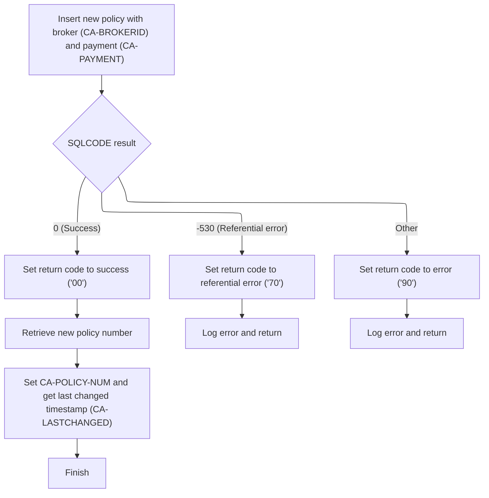

This section governs the business logic for inserting a new insurance policy record into the database, handling success and error scenarios, and preparing output fields for downstream processes.

| Category        | Rule Name                      | Description                                                                                                                                                                                                            |
| --------------- | ------------------------------ | ---------------------------------------------------------------------------------------------------------------------------------------------------------------------------------------------------------------------- |
| Data validation | Mandatory policy fields        | A new policy record must be inserted with all required fields: customer number, issue date, expiry date, policy type, broker ID, broker reference, and payment amount. The policy number is generated by the database. |
| Business logic  | Successful policy creation     | If the database insert is successful (SQLCODE = 0), the return code must be set to '00', and the newly generated policy number and last changed timestamp must be retrieved and provided in the output.                |
| Business logic  | Policy number retrieval        | The policy number assigned by the database must be retrieved immediately after a successful insert and made available for use in related records and output.                                                           |
| Business logic  | Last changed timestamp capture | The last changed timestamp for the new policy must be retrieved and included in the output to support audit and downstream processing.                                                                                 |

<SwmSnippet path="/base/src/lgapdb09.cbl" line="281">

---

In <SwmToken path="base/src/lgapdb09.cbl" pos="281:1:3" line-data="       P100-T.">`P100-T`</SwmToken>, we prep the <SwmToken path="base/src/lgapdb09.cbl" pos="283:9:9" line-data="           MOVE CA-BROKERID TO DB2-BROKERID-INT">`DB2`</SwmToken> integer fields and insert the policy record into the POLICY table, mapping all the main fields from the input data.

```cobol
       P100-T.

           MOVE CA-BROKERID TO DB2-BROKERID-INT
           MOVE CA-PAYMENT TO DB2-PAYMENT-INT

           MOVE ' INSERT POLICY' TO EM-SQLREQ
           EXEC SQL
             INSERT INTO POLICY
                       ( POLICYNUMBER,
                         CUSTOMERNUMBER,
                         ISSUEDATE,
                         EXPIRYDATE,
                         POLICYTYPE,
                         LASTCHANGED,
                         BROKERID,
                         BROKERSREFERENCE,
                         PAYMENT           )
                VALUES ( DEFAULT,
                         :DB2-CUSTOMERNUM-INT,
                         :CA-ISSUE-DATE,
                         :CA-EXPIRY-DATE,
                         :DB2-POLICYTYPE,
                         CURRENT TIMESTAMP,
                         :DB2-BROKERID-INT,
                         :CA-BROKERSREF,
                         :DB2-PAYMENT-INT      )
           END-EXEC
```

---

</SwmSnippet>

<SwmSnippet path="/base/src/lgapdb09.cbl" line="309">

---

After the insert, we check SQLCODE. If there's an error, we log it with <SwmToken path="base/src/lgapdb09.cbl" pos="316:3:7" line-data="               PERFORM WRITE-ERROR-MESSAGE">`WRITE-ERROR-MESSAGE`</SwmToken> and exit or abend depending on the error type.

```cobol
           Evaluate SQLCODE

             When 0
               MOVE '00' TO CA-RETURN-CODE

             When -530
               MOVE '70' TO CA-RETURN-CODE
               PERFORM WRITE-ERROR-MESSAGE
               EXEC CICS RETURN END-EXEC

             When Other
               MOVE '90' TO CA-RETURN-CODE
               PERFORM WRITE-ERROR-MESSAGE
               EXEC CICS RETURN END-EXEC

           END-Evaluate.
```

---

</SwmSnippet>

<SwmSnippet path="/base/src/lgapdb09.cbl" line="326">

---

Back in <SwmToken path="base/src/lgapdb09.cbl" pos="247:3:5" line-data="           PERFORM P100-T">`P100-T`</SwmToken> after error handling, we grab the new policy number from the DB so we can use it for related records and output.

```cobol
           EXEC SQL
             SET :DB2-POLICYNUM-INT = IDENTITY_VAL_LOCAL()
           END-EXEC
```

---

</SwmSnippet>

<SwmSnippet path="/base/src/lgapdb09.cbl" line="329">

---

After inserting, we move the new policy number and last changed timestamp to the output fields so they're ready for the next steps or for returning to the caller.

```cobol
           MOVE DB2-POLICYNUM-INT TO CA-POLICY-NUM
           MOVE CA-POLICY-NUM TO EM-POLNUM

           EXEC SQL
             SELECT LASTCHANGED
               INTO :CA-LASTCHANGED
               FROM POLICY
               WHERE POLICYNUMBER = :DB2-POLICYNUM-INT
           END-EXEC.
           EXIT.
```

---

</SwmSnippet>

## Branching to Policy-Specific Inserts

```mermaid
%%{init: {"flowchart": {"defaultRenderer": "elk"}} }%%
flowchart TD
    node1{"CA-REQUEST-ID?"}
    click node1 openCode "base/src/lgapdb09.cbl:249:266"
    node1 -->|"01AEND (Endowment)"| node2["Handle Endowment Policy"]
    click node2 openCode "base/src/lgapdb09.cbl:252:253"
    node1 -->|"01AHOU (House)"| node3["Handle House Policy"]
    click node3 openCode "base/src/lgapdb09.cbl:255:256"
    node1 -->|"01AMOT (Motor)"| node4["Handle Motor Policy"]
    click node4 openCode "base/src/lgapdb09.cbl:258:259"
    node1 -->|"01ACOM (Business)"| node5["Handle Business Policy"]
    click node5 openCode "base/src/lgapdb09.cbl:261:262"
    node1 -->|"Other"| node6["Set CA-RETURN-CODE to '99'"]
    click node6 openCode "base/src/lgapdb09.cbl:264:265"

classDef HeadingStyle fill:#777777,stroke:#333,stroke-width:2px;

%% Swimm:
%% %%{init: {"flowchart": {"defaultRenderer": "elk"}} }%%
%% flowchart TD
%%     node1{"<SwmToken path="base/src/lgapdb09.cbl" pos="218:3:7" line-data="           EVALUATE CA-REQUEST-ID">`CA-REQUEST-ID`</SwmToken>?"}
%%     click node1 openCode "<SwmPath>[base/src/lgapdb09.cbl](base/src/lgapdb09.cbl)</SwmPath>:249:266"
%%     node1 -->|"<SwmToken path="base/src/lgapdb09.cbl" pos="220:4:4" line-data="             WHEN &#39;01AEND&#39;">`01AEND`</SwmToken> (Endowment)"| node2["Handle Endowment Policy"]
%%     click node2 openCode "<SwmPath>[base/src/lgapdb09.cbl](base/src/lgapdb09.cbl)</SwmPath>:252:253"
%%     node1 -->|"<SwmToken path="base/src/lgapdb09.cbl" pos="224:4:4" line-data="             WHEN &#39;01AHOU&#39;">`01AHOU`</SwmToken> (House)"| node3["Handle House Policy"]
%%     click node3 openCode "<SwmPath>[base/src/lgapdb09.cbl](base/src/lgapdb09.cbl)</SwmPath>:255:256"
%%     node1 -->|"<SwmToken path="base/src/lgapdb09.cbl" pos="228:4:4" line-data="             WHEN &#39;01AMOT&#39;">`01AMOT`</SwmToken> (Motor)"| node4["Handle Motor Policy"]
%%     click node4 openCode "<SwmPath>[base/src/lgapdb09.cbl](base/src/lgapdb09.cbl)</SwmPath>:258:259"
%%     node1 -->|"<SwmToken path="base/src/lgapdb09.cbl" pos="232:4:4" line-data="             WHEN &#39;01ACOM&#39;">`01ACOM`</SwmToken> (Business)"| node5["Handle Business Policy"]
%%     click node5 openCode "<SwmPath>[base/src/lgapdb09.cbl](base/src/lgapdb09.cbl)</SwmPath>:261:262"
%%     node1 -->|"Other"| node6["Set <SwmToken path="base/src/lgapdb09.cbl" pos="209:9:13" line-data="           MOVE &#39;00&#39; TO CA-RETURN-CODE">`CA-RETURN-CODE`</SwmToken> to '99'"]
%%     click node6 openCode "<SwmPath>[base/src/lgapdb09.cbl](base/src/lgapdb09.cbl)</SwmPath>:264:265"
%% 
%% classDef HeadingStyle fill:#777777,stroke:#333,stroke-width:2px;
```

<SwmSnippet path="/base/src/lgapdb09.cbl" line="249">

---

Back in MAINLINE after <SwmToken path="base/src/lgapdb09.cbl" pos="247:3:5" line-data="           PERFORM P100-T">`P100-T`</SwmToken>, we branch to the right insert routine (<SwmToken path="base/src/lgapdb09.cbl" pos="252:3:5" line-data="               PERFORM P200-E">`P200-E`</SwmToken>, <SwmToken path="base/src/lgapdb09.cbl" pos="255:3:5" line-data="               PERFORM P300-H">`P300-H`</SwmToken>, etc.) based on the request type. Each one handles its own policy-specific DB insert.

```cobol
           EVALUATE CA-REQUEST-ID

             WHEN '01AEND'
               PERFORM P200-E

             WHEN '01AHOU'
               PERFORM P300-H

             WHEN '01AMOT'
               PERFORM P400-M

             WHEN '01ACOM'
               PERFORM P500-BIZ

             WHEN OTHER
               MOVE '99' TO CA-RETURN-CODE

           END-EVALUATE
```

---

</SwmSnippet>

## Inserting Endowment Policy

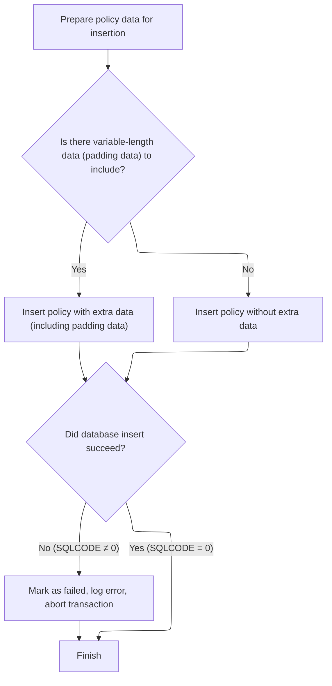

This section governs the rules for inserting an endowment policy into the database, including handling of variable-length data and error conditions.

| Category       | Rule Name                    | Description                                                                                                                                           |
| -------------- | ---------------------------- | ----------------------------------------------------------------------------------------------------------------------------------------------------- |
| Business logic | Include variable-length data | If there is variable-length padding data present in the policy input, it must be included in the database record as part of the insert operation.     |
| Business logic | Omit variable-length data    | If there is no variable-length padding data, the policy record must be inserted without the padding data field.                                       |
| Business logic | Successful insert completion | A successful insert operation (SQLCODE = 0) must result in the policy record being committed to the database and the process finishing without error. |

<SwmSnippet path="/base/src/lgapdb09.cbl" line="343">

---

In <SwmToken path="base/src/lgapdb09.cbl" pos="343:1:3" line-data="       P200-E.">`P200-E`</SwmToken>, we convert numeric fields for <SwmToken path="base/src/lgapdb09.cbl" pos="346:11:11" line-data="           MOVE CA-E-TERM        TO DB2-E-TERM-SINT">`DB2`</SwmToken>, check if there's extra variable-length data, and prep for a conditional insert depending on whether that data exists.

```cobol
       P200-E.

      *    Move numeric fields to integer format
           MOVE CA-E-TERM        TO DB2-E-TERM-SINT
           MOVE CA-E-SUM-ASSURED TO DB2-E-SUMASSURED-INT

           MOVE ' INSERT ENDOW ' TO EM-SQLREQ
      *----------------------------------------------------------------*
      *    There are 2 versions of INSERT...                           *
      *      one which updates all fields including Varchar            *
      *      one which updates all fields Except Varchar               *
      *----------------------------------------------------------------*
           SUBTRACT WS-REQUIRED-CA-LEN FROM EIBCALEN
               GIVING WS-VARY-LEN
```

---

</SwmSnippet>

<SwmSnippet path="/base/src/lgapdb09.cbl" line="358">

---

If there's extra variable-length data, we move it to the right buffer and include it in the SQL insert for the endowment record.

```cobol
           IF WS-VARY-LEN IS GREATER THAN ZERO
      *       Commarea contains data for Varchar field
              MOVE CA-E-PADDING-DATA
                  TO WS-VARY-CHAR(1:WS-VARY-LEN)
              EXEC SQL
                INSERT INTO ENDOWMENT
                          ( POLICYNUMBER,
                            WITHPROFITS,
                            EQUITIES,
                            MANAGEDFUND,
                            FUNDNAME,
                            TERM,
                            SUMASSURED,
                            LIFEASSURED,
                            PADDINGDATA    )
                   VALUES ( :DB2-POLICYNUM-INT,
                            :CA-E-W-PRO,
                            :CA-E-EQU,
                            :CA-E-M-FUN,
                            :CA-E-FUND-NAME,
                            :DB2-E-TERM-SINT,
                            :DB2-E-SUMASSURED-INT,
                            :CA-E-LIFE-ASSURED,
                            :WS-VARY-FIELD )
              END-EXEC
```

---

</SwmSnippet>

<SwmSnippet path="/base/src/lgapdb09.cbl" line="383">

---

If there's no extra data, we just run the insert for the standard endowment fields, skipping the varchar field.

```cobol
           ELSE
              EXEC SQL
                INSERT INTO ENDOWMENT
                          ( POLICYNUMBER,
                            WITHPROFITS,
                            EQUITIES,
                            MANAGEDFUND,
                            FUNDNAME,
                            TERM,
                            SUMASSURED,
                            LIFEASSURED    )
                   VALUES ( :DB2-POLICYNUM-INT,
                            :CA-E-W-PRO,
                            :CA-E-EQU,
                            :CA-E-M-FUN,
                            :CA-E-FUND-NAME,
                            :DB2-E-TERM-SINT,
                            :DB2-E-SUMASSURED-INT,
                            :CA-E-LIFE-ASSURED )
              END-EXEC
```

---

</SwmSnippet>

<SwmSnippet path="/base/src/lgapdb09.cbl" line="405">

---

After the insert, if there's an error, we log it with <SwmToken path="base/src/lgapdb09.cbl" pos="407:3:7" line-data="             PERFORM WRITE-ERROR-MESSAGE">`WRITE-ERROR-MESSAGE`</SwmToken> and abend to roll back the transaction.

```cobol
           IF SQLCODE NOT EQUAL 0
             MOVE '90' TO CA-RETURN-CODE
             PERFORM WRITE-ERROR-MESSAGE
      *      Issue Abend to cause backout of update to Policy table
             EXEC CICS ABEND ABCODE('LGSQ') NODUMP END-EXEC
             EXEC CICS RETURN END-EXEC
           END-IF.

           EXIT.
```

---

</SwmSnippet>

## Inserting House Policy

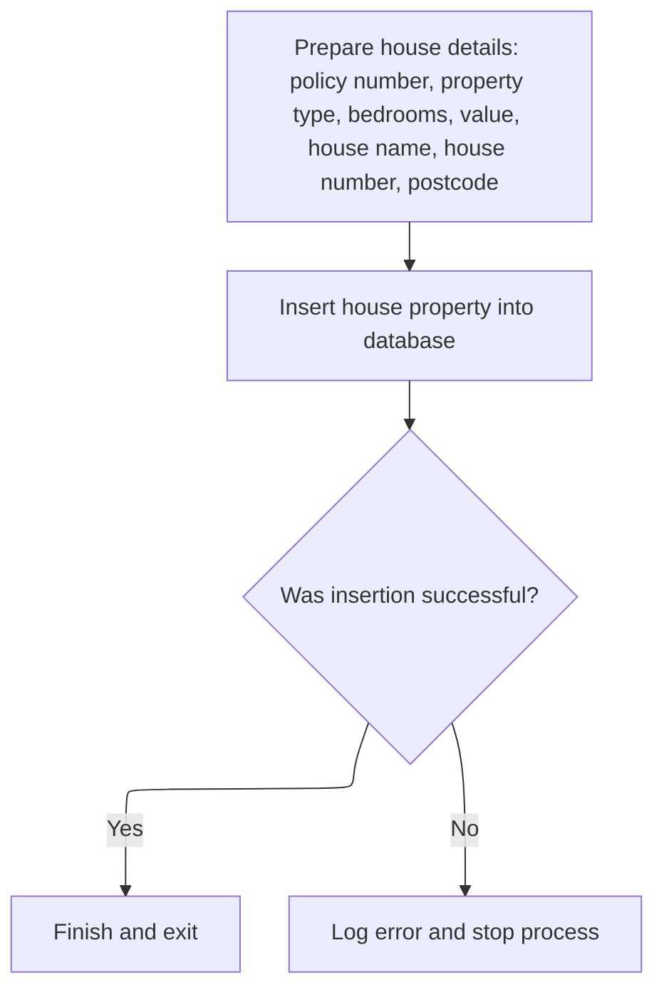

This section governs the process of inserting a new house policy record into the database, ensuring all required fields are present and handling errors appropriately.

| Category        | Rule Name                     | Description                                                                                                                                                                                       |
| --------------- | ----------------------------- | ------------------------------------------------------------------------------------------------------------------------------------------------------------------------------------------------- |
| Data validation | Mandatory house policy fields | A house policy record must include the following fields: policy number, property type, number of bedrooms, value, house name, house number, and postcode. All fields are mandatory for insertion. |
| Business logic  | Successful insert completion  | Upon successful insertion, the process must complete and exit without further action.                                                                                                             |

<SwmSnippet path="/base/src/lgapdb09.cbl" line="415">

---

In <SwmToken path="base/src/lgapdb09.cbl" pos="415:1:3" line-data="       P300-H.">`P300-H`</SwmToken>, we convert value and bedrooms to <SwmToken path="base/src/lgapdb09.cbl" pos="417:11:11" line-data="           MOVE CA-H-VAL       TO DB2-H-VALUE-INT">`DB2`</SwmToken> integer format and insert the house record with all the main fields into the HOUSE table.

```cobol
       P300-H.

           MOVE CA-H-VAL       TO DB2-H-VALUE-INT
           MOVE CA-H-BED    TO DB2-H-BEDROOMS-SINT

           MOVE ' INSERT HOUSE ' TO EM-SQLREQ
           EXEC SQL
             INSERT INTO HOUSE
                       ( POLICYNUMBER,
                         PROPERTYTYPE,
                         BEDROOMS,
                         VALUE,
                         HOUSENAME,
                         HOUSENUMBER,
                         POSTCODE          )
                VALUES ( :DB2-POLICYNUM-INT,
                         :CA-H-P-TYP,
                         :DB2-H-BEDROOMS-SINT,
                         :DB2-H-VALUE-INT,
                         :CA-H-H-NAM,
                         :CA-H-HOUSE-NUMBER,
                         :CA-H-PCD      )
           END-EXEC
```

---

</SwmSnippet>

<SwmSnippet path="/base/src/lgapdb09.cbl" line="439">

---

After the insert, if there's an error, we log it with <SwmToken path="base/src/lgapdb09.cbl" pos="441:3:7" line-data="             PERFORM WRITE-ERROR-MESSAGE">`WRITE-ERROR-MESSAGE`</SwmToken> and abend to roll back the transaction.

```cobol
           IF SQLCODE NOT EQUAL 0
             MOVE '90' TO CA-RETURN-CODE
             PERFORM WRITE-ERROR-MESSAGE
             EXEC CICS ABEND ABCODE('LGSQ') NODUMP END-EXEC
             EXEC CICS RETURN END-EXEC
           END-IF.

           EXIT.
```

---

</SwmSnippet>

## Inserting Motor Policy

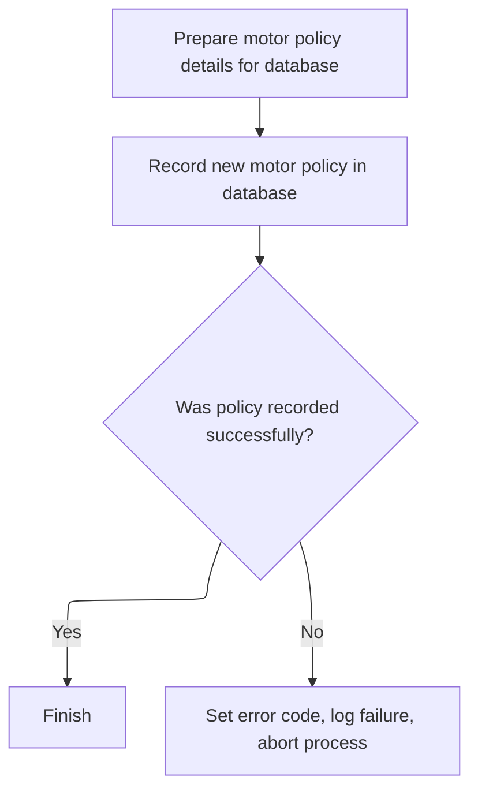

This section governs the process of adding a new motor policy to the database, ensuring all required fields are correctly formatted and handling errors if the insertion fails.

| Category        | Rule Name                        | Description                                                                                                                                                 |
| --------------- | -------------------------------- | ----------------------------------------------------------------------------------------------------------------------------------------------------------- |
| Data validation | Required fields for motor policy | A motor policy record must include all required fields: POLICYNUMBER, MAKE, MODEL, VALUE, REGNUMBER, COLOUR, CC, YEAROFMANUFACTURE, PREMIUM, and ACCIDENTS. |

<SwmSnippet path="/base/src/lgapdb09.cbl" line="448">

---

In <SwmToken path="base/src/lgapdb09.cbl" pos="448:1:3" line-data="       P400-M.">`P400-M`</SwmToken>, we convert all the numeric fields to <SwmToken path="base/src/lgapdb09.cbl" pos="451:11:11" line-data="           MOVE CA-M-VALUE       TO DB2-M-VALUE-INT">`DB2`</SwmToken> format and insert the motor policy record with all the relevant fields into the MOTOR table.

```cobol
       P400-M.

      *    Move numeric fields to integer format
           MOVE CA-M-VALUE       TO DB2-M-VALUE-INT
           MOVE CA-M-CC          TO DB2-M-CC-SINT
           MOVE CA-M-PREMIUM     TO DB2-M-PREMIUM-INT
           MOVE CA-M-ACCIDENTS   TO DB2-M-ACCIDENTS-INT

           MOVE ' INSERT MOTOR ' TO EM-SQLREQ
           EXEC SQL
             INSERT INTO MOTOR
                       ( POLICYNUMBER,
                         MAKE,
                         MODEL,
                         VALUE,
                         REGNUMBER,
                         COLOUR,
                         CC,
                         YEAROFMANUFACTURE,
                         PREMIUM,
                         ACCIDENTS )
                VALUES ( :DB2-POLICYNUM-INT,
                         :CA-M-MAKE,
                         :CA-M-MODEL,
                         :DB2-M-VALUE-INT,
                         :CA-M-REGNUMBER,
                         :CA-M-COLOUR,
                         :DB2-M-CC-SINT,
                         :CA-M-MANUFACTURED,
                         :DB2-M-PREMIUM-INT,
                         :DB2-M-ACCIDENTS-INT )
           END-EXEC
```

---

</SwmSnippet>

<SwmSnippet path="/base/src/lgapdb09.cbl" line="481">

---

After the insert, if there's an error, we log it with <SwmToken path="base/src/lgapdb09.cbl" pos="483:3:7" line-data="             PERFORM WRITE-ERROR-MESSAGE">`WRITE-ERROR-MESSAGE`</SwmToken> and abend to roll back the transaction.

```cobol
           IF SQLCODE NOT EQUAL 0
             MOVE '90' TO CA-RETURN-CODE
             PERFORM WRITE-ERROR-MESSAGE
             EXEC CICS ABEND ABCODE('LGSQ') NODUMP END-EXEC
             EXEC CICS RETURN END-EXEC
           END-IF.

           EXIT.
```

---

</SwmSnippet>

## Calculating Commercial Policy Risk

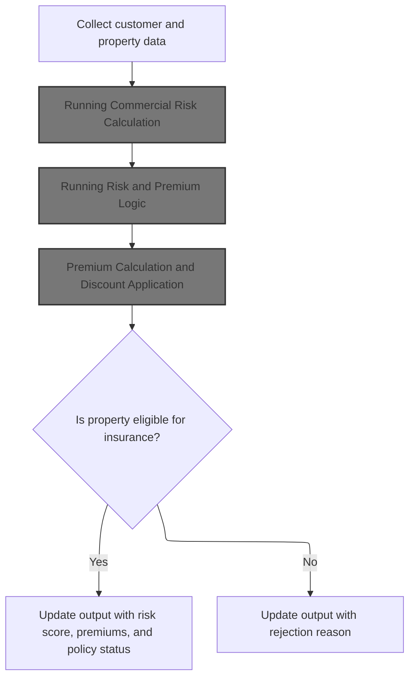

This section determines the commercial insurance policy risk by evaluating property and customer data, calculating risk scores and premiums, and deciding policy eligibility or rejection based on business criteria.

| Category        | Rule Name                        | Description                                                                                                                                                                                                          |
| --------------- | -------------------------------- | -------------------------------------------------------------------------------------------------------------------------------------------------------------------------------------------------------------------- |
| Data validation | Data completeness validation     | All required customer and property data fields must be present and valid before risk calculation can proceed. Missing or invalid data results in rejection.                                                          |
| Business logic  | Risk score calculation           | The risk score for a commercial policy is calculated using property type, postcode, and multiple risk factors (FP, CP, FLP, WP). Each factor contributes to the overall risk score according to a predefined matrix. |
| Business logic  | Premium and discount application | Premiums for each risk type (FP, CP, FLP, WP) are calculated based on the corresponding risk factor and may be adjusted by discounts if certain risk thresholds are met.                                             |
| Business logic  | Eligibility threshold            | A property is eligible for insurance only if its calculated risk score falls within the acceptable range defined by business policy. Properties outside this range are rejected.                                     |
| Business logic  | Eligibility output reporting     | If a property is eligible, the output must include the risk score, calculated premiums, and policy status as 'eligible'.                                                                                             |

<SwmSnippet path="/base/src/lgapdb09.cbl" line="493">

---

In <SwmToken path="base/src/lgapdb09.cbl" pos="493:1:3" line-data="       P500-BIZ SECTION.">`P500-BIZ`</SwmToken>, we move all the commercial policy and property fields into <SwmToken path="base/src/lgapdb09.cbl" pos="511:3:9" line-data="                COMMAREA(WS-COMM-RISK-AREA)">`WS-COMM-RISK-AREA`</SwmToken> to prep for the risk calculation module.

```cobol
       P500-BIZ SECTION.
           MOVE CA-CUSTOMER-NUM TO WS-XCUSTID
           MOVE CA-POLICY-NUM TO WS-XPOLNUM
           MOVE CA-B-PropType TO WS-XPROPTYPE
           MOVE CA-B-PST TO WS-XPOSTCODE
           MOVE CA-B-FP TO WS-XFP-FACTOR
           MOVE CA-B-CP TO WS-XCP-FACTOR
           MOVE CA-B-FLP TO WS-XFLP-FACTOR
           MOVE CA-B-WP TO WS-XWP-FACTOR
           MOVE CA-B-Address TO WS-XADDRESS
           MOVE CA-B-Latitude TO WS-XLAT
           MOVE CA-B-Longitude TO WS-XLONG
           MOVE CA-B-Customer TO WS-XCUSTNAME
           MOVE CA-ISSUE-DATE TO WS-XISSUE
           MOVE CA-EXPIRY-DATE TO WS-XEXPIRY
           MOVE CA-LASTCHANGED TO WS-XLASTCHG
```

---

</SwmSnippet>

<SwmSnippet path="/base/src/lgapdb09.cbl" line="510">

---

We call LGCOMCAL with the risk data to get back the risk score, premiums, and decision for the commercial policy.

```cobol
           EXEC CICS LINK PROGRAM('LGCOMCAL')
                COMMAREA(WS-COMM-RISK-AREA)
                LENGTH(LENGTH OF WS-COMM-RISK-AREA)
           END-EXEC
```

---

</SwmSnippet>

### Running Commercial Risk Calculation

This section governs the calculation of commercial risk for a given input. It ensures that the risk calculation process is properly initialized, business logic is executed, and results are transferred or finalized.

| Category        | Rule Name             | Description                                                                                                                                            |
| --------------- | --------------------- | ------------------------------------------------------------------------------------------------------------------------------------------------------ |
| Data validation | Input Data Validation | All required input data for commercial risk calculation must be present and valid before the calculation process begins.                               |
| Business logic  | Apply Business Logic  | The risk calculation must apply the latest approved business logic for commercial risk assessment, including any regulatory or company-specific rules. |
| Business logic  | Result Transfer       | Upon successful calculation, the results must be transferred to the designated output or reporting system for further use.                             |

<SwmSnippet path="/base/src/lgcomcal.cbl" line="206">

---

We split risk calculation into setup, compute, and result transfer.

```cobol
       MAINLINE SECTION.
           
           PERFORM INITIALIZE-PROCESSING.
           PERFORM PROCESS-BUSINESS-LOGIC.
           PERFORM CLEANUP-AND-EXIT.
```

---

</SwmSnippet>

### Preparing Risk Calculation Context

```mermaid
%%{init: {"flowchart": {"defaultRenderer": "elk"}} }%%
flowchart TD
    node1["Set transaction, terminal, and task context for session"] --> node2["Enable security validation"]
    click node1 openCode "base/src/lgcomcal.cbl:219:221"
    click node2 openCode "base/src/lgcomcal.cbl:234:234"
    node2 --> node3["Initialize risk calculation data"]
    click node3 openCode "base/src/lgcomcal.cbl:225:225"
    node3 --> node4["Set up risk matrices"]
    click node4 openCode "base/src/lgcomcal.cbl:237:249"
    
    subgraph loop1["For each matrix position (row 1-5, col 1-6)"]
        node4 --> node5{"Is position (3,2)?"}
        click node5 openCode "base/src/lgcomcal.cbl:242:244"
        node5 -->|"Yes"| node6["Set Risk Property to 1"]
        click node6 openCode "base/src/lgcomcal.cbl:243:243"
        node5 -->|"No"| node7
        node6 --> node7
        node7{"Is position (2,3)?"}
        click node7 openCode "base/src/lgcomcal.cbl:245:247"
        node7 -->|"Yes"| node8["Set Risk Peril to 3"]
        click node8 openCode "base/src/lgcomcal.cbl:246:246"
        node7 -->|"No"| node9["Continue to next position"]
        click node9 openCode "base/src/lgcomcal.cbl:248:248"
        node8 --> node9
        node9 --> node4
    end
    node4 --> node10["Perform security validation"]
    click node10 openCode "base/src/lgcomcal.cbl:227:227"
    node10 --> node11["End initialization"]
    click node11 openCode "base/src/lgcomcal.cbl:229:229"

classDef HeadingStyle fill:#777777,stroke:#333,stroke-width:2px;

%% Swimm:
%% %%{init: {"flowchart": {"defaultRenderer": "elk"}} }%%
%% flowchart TD
%%     node1["Set transaction, terminal, and task context for session"] --> node2["Enable security validation"]
%%     click node1 openCode "<SwmPath>[base/src/lgcomcal.cbl](base/src/lgcomcal.cbl)</SwmPath>:219:221"
%%     click node2 openCode "<SwmPath>[base/src/lgcomcal.cbl](base/src/lgcomcal.cbl)</SwmPath>:234:234"
%%     node2 --> node3["Initialize risk calculation data"]
%%     click node3 openCode "<SwmPath>[base/src/lgcomcal.cbl](base/src/lgcomcal.cbl)</SwmPath>:225:225"
%%     node3 --> node4["Set up risk matrices"]
%%     click node4 openCode "<SwmPath>[base/src/lgcomcal.cbl](base/src/lgcomcal.cbl)</SwmPath>:237:249"
%%     
%%     subgraph loop1["For each matrix position (row 1-5, col 1-6)"]
%%         node4 --> node5{"Is position (3,2)?"}
%%         click node5 openCode "<SwmPath>[base/src/lgcomcal.cbl](base/src/lgcomcal.cbl)</SwmPath>:242:244"
%%         node5 -->|"Yes"| node6["Set Risk Property to 1"]
%%         click node6 openCode "<SwmPath>[base/src/lgcomcal.cbl](base/src/lgcomcal.cbl)</SwmPath>:243:243"
%%         node5 -->|"No"| node7
%%         node6 --> node7
%%         node7{"Is position (2,3)?"}
%%         click node7 openCode "<SwmPath>[base/src/lgcomcal.cbl](base/src/lgcomcal.cbl)</SwmPath>:245:247"
%%         node7 -->|"Yes"| node8["Set Risk Peril to 3"]
%%         click node8 openCode "<SwmPath>[base/src/lgcomcal.cbl](base/src/lgcomcal.cbl)</SwmPath>:246:246"
%%         node7 -->|"No"| node9["Continue to next position"]
%%         click node9 openCode "<SwmPath>[base/src/lgcomcal.cbl](base/src/lgcomcal.cbl)</SwmPath>:248:248"
%%         node8 --> node9
%%         node9 --> node4
%%     end
%%     node4 --> node10["Perform security validation"]
%%     click node10 openCode "<SwmPath>[base/src/lgcomcal.cbl](base/src/lgcomcal.cbl)</SwmPath>:227:227"
%%     node10 --> node11["End initialization"]
%%     click node11 openCode "<SwmPath>[base/src/lgcomcal.cbl](base/src/lgcomcal.cbl)</SwmPath>:229:229"
%% 
%% classDef HeadingStyle fill:#777777,stroke:#333,stroke-width:2px;
```

This section ensures all necessary session and risk calculation context is set up before any risk logic is executed. It configures identifiers, enables security, and sets specific risk matrix flags that will influence later risk calculations.

| Category        | Rule Name                            | Description                                                                                                                                                                   |
| --------------- | ------------------------------------ | ----------------------------------------------------------------------------------------------------------------------------------------------------------------------------- |
| Data validation | Session Context Initialization       | The transaction, terminal, and task identifiers must be set for every session before risk calculation begins. These identifiers are sourced from the current session context. |
| Data validation | Security Validation Enablement       | Security validation must be enabled for every risk calculation session. The security flag must be set to 'Y' before proceeding.                                               |
| Data validation | Risk Calculation Data Initialization | Risk calculation data must be initialized for each session to ensure no residual data from previous sessions affects the current calculation.                                 |
| Business logic  | Property Risk Flag Assignment        | Within the risk matrix, the property risk flag must be set to 1 only at position (row 3, column 2). No other positions should have this flag set.                             |
| Business logic  | Peril Risk Flag Assignment           | Within the risk matrix, the peril risk flag must be set to 3 only at position (row 2, column 3). No other positions should have this flag set.                                |
| Business logic  | Matrix Default State                 | All other positions in the risk matrix must remain unchanged, with no risk flags set unless explicitly specified.                                                             |

<SwmSnippet path="/base/src/lgcomcal.cbl" line="217">

---

We prep all the context and mappings for risk calculation.

```cobol
       INITIALIZE-PROCESSING.
           INITIALIZE WS-HEADER.
           MOVE EIBTRNID TO WS-TRANSID.
           MOVE EIBTRMID TO WS-TERMID.
           MOVE EIBTASKN TO WS-TASKNUM.
           
           PERFORM INITIALIZE-MATRICES.
           
           INITIALIZE WS-RISK-CALC.
           
           PERFORM INIT-SECURITY-VALIDATION.
           
           EXIT.
```

---

</SwmSnippet>

<SwmSnippet path="/base/src/lgcomcal.cbl" line="233">

---

<SwmToken path="base/src/lgcomcal.cbl" pos="233:1:3" line-data="       INITIALIZE-MATRICES.">`INITIALIZE-MATRICES`</SwmToken> sets <SwmToken path="base/src/lgcomcal.cbl" pos="234:9:13" line-data="           MOVE &#39;Y&#39; TO WS-SEC-ENABLED.">`WS-SEC-ENABLED`</SwmToken> to 'Y' and runs nested loops over <SwmToken path="base/src/lgcomcal.cbl" pos="235:7:11" line-data="           MOVE 1 TO WS-SUB-1.">`WS-SUB-1`</SwmToken> and <SwmToken path="base/src/lgcomcal.cbl" pos="239:7:11" line-data="               MOVE 0 TO WS-SUB-2">`WS-SUB-2`</SwmToken>. It only sets <SwmToken path="base/src/lgcomcal.cbl" pos="243:7:11" line-data="                      MOVE 1 TO WS-RM-PROP">`WS-RM-PROP`</SwmToken> to 1 at (3,2) and <SwmToken path="base/src/lgcomcal.cbl" pos="246:7:11" line-data="                      MOVE 3 TO WS-RM-PERIL">`WS-RM-PERIL`</SwmToken> to 3 at (2,3), leaving the rest untouched. This is about toggling specific flags for later risk logic, not a full matrix setup.

```cobol
       INITIALIZE-MATRICES.
           MOVE 'Y' TO WS-SEC-ENABLED.
           MOVE 1 TO WS-SUB-1.
           
           PERFORM VARYING WS-SUB-1 FROM 1 BY 1 
             UNTIL WS-SUB-1 > 5
               MOVE 0 TO WS-SUB-2
               PERFORM VARYING WS-SUB-2 FROM 1 BY 1 
                 UNTIL WS-SUB-2 > 6
                   IF WS-SUB-1 = 3 AND WS-SUB-2 = 2
                      MOVE 1 TO WS-RM-PROP
                   END-IF
                   IF WS-SUB-1 = 2 AND WS-SUB-2 = 3
                      MOVE 3 TO WS-RM-PERIL
                   END-IF
               END-PERFORM
           END-PERFORM.
           
           EXIT.
```

---

</SwmSnippet>

### Running Risk and Premium Logic

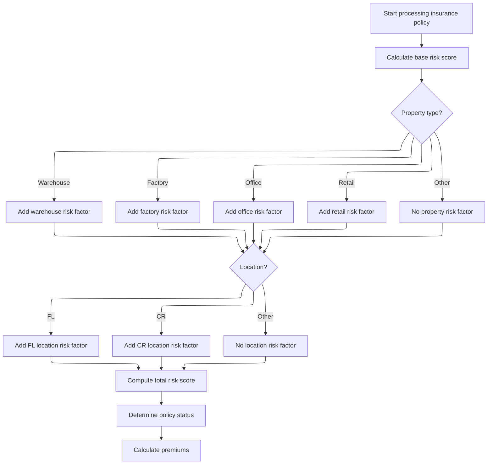

This section is responsible for determining the risk score, policy status, and premium for an insurance policy by evaluating the property type and location, applying relevant factors, and combining them with base values.

| Category        | Rule Name                          | Description                                                                                                                                                                                                                                                          |
| --------------- | ---------------------------------- | -------------------------------------------------------------------------------------------------------------------------------------------------------------------------------------------------------------------------------------------------------------------- |
| Data validation | Postcode length validation         | If the postcode is less than two characters, no geographic risk factor is applied.                                                                                                                                                                                   |
| Business logic  | Property type risk factor          | The risk score must be calculated using a base value, a property type factor, and a geographic factor. Only the property types 'Warehouse', 'Factory', 'Office', and 'Retail' are assigned specific risk factors; all other property types receive a factor of zero. |
| Business logic  | Geographic risk factor             | The geographic risk factor is determined by the first two characters of the postcode. Only 'FL' and 'CR' prefixes are assigned specific risk factors; all other prefixes receive a factor of zero.                                                                   |
| Business logic  | Total risk score calculation       | The total risk score is the sum of the base value, property type factor, and geographic factor. This score is used to determine the policy status and premium.                                                                                                       |
| Business logic  | Sequential calculation requirement | Policy status and premium must be determined after the risk score is calculated, ensuring all relevant factors are considered before finalizing policy details.                                                                                                      |

<SwmSnippet path="/base/src/lgcomcal.cbl" line="268">

---

<SwmToken path="base/src/lgcomcal.cbl" pos="268:1:5" line-data="       PROCESS-BUSINESS-LOGIC.">`PROCESS-BUSINESS-LOGIC`</SwmToken> just runs risk scoring, status, and premium logic in sequence so all results are set before returning.

```cobol
       PROCESS-BUSINESS-LOGIC.
           PERFORM PROCESS-RISK-SCORE.
           PERFORM DETERMINE-POLICY-STATUS.
           PERFORM CALCULATE-PREMIUMS.
           
           EXIT.
```

---

</SwmSnippet>

<SwmSnippet path="/base/src/lgcomcal.cbl" line="277">

---

<SwmToken path="base/src/lgcomcal.cbl" pos="277:1:5" line-data="       PROCESS-RISK-SCORE.">`PROCESS-RISK-SCORE`</SwmToken> calculates the risk score by combining a base value, a property type factor, and a postcode-based geographic factor. Only certain property types and postcode prefixes are handled, and it assumes the postcode is at least two characters. The result is stored for later premium logic.

```cobol
       PROCESS-RISK-SCORE.
           MOVE WS-TM-BASE TO WS-TEMP-SCORE.
           DIVIDE 2 INTO WS-TEMP-SCORE GIVING WS-SUB-1.
           MULTIPLY 2 BY WS-SUB-1 GIVING WS-RC-BASE-VAL.
           
           MOVE 0 TO WS-RC-PROP-FACT.
           
           MOVE 'COMMERCIAL' TO RMS-TYPE
           MOVE '1.0.5' TO RMS-VERSION
      
           EVALUATE CA-XPROPTYPE
               WHEN 'WAREHOUSE'
                   MOVE RMS-PF-W-VAL TO RMS-PF-WAREHOUSE
                   COMPUTE WS-TEMP-CALC = RMS-PF-WAREHOUSE
                   ADD WS-TEMP-CALC TO WS-RC-PROP-FACT
               WHEN 'FACTORY'
                   MOVE RMS-PF-F-VAL TO RMS-PF-FACTORY
                   COMPUTE WS-TEMP-CALC = RMS-PF-FACTORY
                   ADD WS-TEMP-CALC TO WS-RC-PROP-FACT
               WHEN 'OFFICE'
                   MOVE RMS-PF-O-VAL TO RMS-PF-OFFICE
                   COMPUTE WS-TEMP-CALC = RMS-PF-OFFICE
                   ADD WS-TEMP-CALC TO WS-RC-PROP-FACT
               WHEN 'RETAIL'
                   MOVE RMS-PF-R-VAL TO RMS-PF-RETAIL
                   COMPUTE WS-TEMP-CALC = RMS-PF-RETAIL
                   ADD WS-TEMP-CALC TO WS-RC-PROP-FACT
               WHEN OTHER
                   MOVE 0 TO WS-RC-PROP-FACT
           END-EVALUATE.
           
           MOVE 0 TO WS-RC-GEO-FACT.
           
           MOVE RMS-GF-FL-VAL TO RMS-GF-FL
           MOVE RMS-GF-CR-VAL TO RMS-GF-CR
           
           IF CA-XPOSTCODE(1:2) = 'FL'
              MOVE RMS-GF-FL TO WS-RC-GEO-FACT
           ELSE
              IF CA-XPOSTCODE(1:2) = 'CR'
                 MOVE RMS-GF-CR TO WS-RC-GEO-FACT
              END-IF
           END-IF.
           
           COMPUTE WS-RC-TOTAL = 
              WS-RC-BASE-VAL + WS-RC-PROP-FACT + WS-RC-GEO-FACT.
              
           MOVE WS-RC-TOTAL TO WS-SA-RISK.
           
           EXIT.
```

---

</SwmSnippet>

### Premium Calculation and Discount Application

```mermaid
%%{init: {"flowchart": {"defaultRenderer": "elk"}} }%%
flowchart TD
    node1["Start premium calculation"] --> node2["Initialize discount factor to 1.00"]
    click node1 openCode "base/src/lgcomcal.cbl:365:366"
    click node2 openCode "base/src/lgcomcal.cbl:366:366"
    node2 --> node3{"Are all peril factors > 0?"}
    click node3 openCode "base/src/lgcomcal.cbl:373:376"
    node3 -->|"Yes"| node4["Apply discount factor 0.90"]
    click node4 openCode "base/src/lgcomcal.cbl:377:378"
    node3 -->|"No"| node5["Use discount factor 1.00"]
    click node5 openCode "base/src/lgcomcal.cbl:366:366"
    node4 --> node6["Calculate individual peril premiums"]
    node5 --> node6
    subgraph perilPremiums["Calculate premiums for each peril"]
        node6 --> node7{"Fire factor > 0?"}
        click node7 openCode "base/src/lgcomcal.cbl:388:397"
        node7 -->|"Yes (x 0.80)"| node8["Calculate fire premium"]
        click node8 openCode "base/src/lgcomcal.cbl:389:393"
        node7 -->|"No"| node9["Set fire premium to zero"]
        click node9 openCode "base/src/lgcomcal.cbl:395:396"
        node8 --> node10{"Crime factor > 0?"}
        node9 --> node10
        click node10 openCode "base/src/lgcomcal.cbl:399:408"
        node10 -->|"Yes (x 0.60)"| node11["Calculate crime premium"]
        click node11 openCode "base/src/lgcomcal.cbl:401:404"
        node10 -->|"No"| node12["Set crime premium to zero"]
        click node12 openCode "base/src/lgcomcal.cbl:406:407"
        node11 --> node13{"Flood factor > 0?"}
        node12 --> node13
        click node13 openCode "base/src/lgcomcal.cbl:410:419"
        node13 -->|"Yes (x 1.20)"| node14["Calculate flood premium"]
        click node14 openCode "base/src/lgcomcal.cbl:412:415"
        node13 -->|"No"| node15["Set flood premium to zero"]
        click node15 openCode "base/src/lgcomcal.cbl:417:418"
        node14 --> node16{"Weather factor > 0?"}
        node15 --> node16
        click node16 openCode "base/src/lgcomcal.cbl:421:430"
        node16 -->|"Yes (x 0.90)"| node17["Calculate weather premium"]
        click node17 openCode "base/src/lgcomcal.cbl:423:426"
        node16 -->|"No"| node18["Set weather premium to zero"]
        click node18 openCode "base/src/lgcomcal.cbl:428:429"
        node17 --> node19["Sum all peril premiums for total premium"]
        node18 --> node19
        click node19 openCode "base/src/lgcomcal.cbl:432:434"
    end
classDef HeadingStyle fill:#777777,stroke:#333,stroke-width:2px;

%% Swimm:
%% %%{init: {"flowchart": {"defaultRenderer": "elk"}} }%%
%% flowchart TD
%%     node1["Start premium calculation"] --> node2["Initialize discount factor to <SwmToken path="base/src/lgcomcal.cbl" pos="366:3:5" line-data="           MOVE 1.00 TO WS-RC-DISCOUNT.">`1.00`</SwmToken>"]
%%     click node1 openCode "<SwmPath>[base/src/lgcomcal.cbl](base/src/lgcomcal.cbl)</SwmPath>:365:366"
%%     click node2 openCode "<SwmPath>[base/src/lgcomcal.cbl](base/src/lgcomcal.cbl)</SwmPath>:366:366"
%%     node2 --> node3{"Are all peril factors > 0?"}
%%     click node3 openCode "<SwmPath>[base/src/lgcomcal.cbl](base/src/lgcomcal.cbl)</SwmPath>:373:376"
%%     node3 -->|"Yes"| node4["Apply discount factor <SwmToken path="base/src/lgcomcal.cbl" pos="127:15:17" line-data="           03 WS-SA-DISCOUNT           PIC V99 VALUE 0.90.">`0.90`</SwmToken>"]
%%     click node4 openCode "<SwmPath>[base/src/lgcomcal.cbl](base/src/lgcomcal.cbl)</SwmPath>:377:378"
%%     node3 -->|"No"| node5["Use discount factor <SwmToken path="base/src/lgcomcal.cbl" pos="366:3:5" line-data="           MOVE 1.00 TO WS-RC-DISCOUNT.">`1.00`</SwmToken>"]
%%     click node5 openCode "<SwmPath>[base/src/lgcomcal.cbl](base/src/lgcomcal.cbl)</SwmPath>:366:366"
%%     node4 --> node6["Calculate individual peril premiums"]
%%     node5 --> node6
%%     subgraph perilPremiums["Calculate premiums for each peril"]
%%         node6 --> node7{"Fire factor > 0?"}
%%         click node7 openCode "<SwmPath>[base/src/lgcomcal.cbl](base/src/lgcomcal.cbl)</SwmPath>:388:397"
%%         node7 -->|"Yes (x <SwmToken path="base/src/lgcomcal.cbl" pos="128:17:19" line-data="           03 WS-SA-FIRE-FACTOR        PIC V99 VALUE 0.80.">`0.80`</SwmToken>)"| node8["Calculate fire premium"]
%%         click node8 openCode "<SwmPath>[base/src/lgcomcal.cbl](base/src/lgcomcal.cbl)</SwmPath>:389:393"
%%         node7 -->|"No"| node9["Set fire premium to zero"]
%%         click node9 openCode "<SwmPath>[base/src/lgcomcal.cbl](base/src/lgcomcal.cbl)</SwmPath>:395:396"
%%         node8 --> node10{"Crime factor > 0?"}
%%         node9 --> node10
%%         click node10 openCode "<SwmPath>[base/src/lgcomcal.cbl](base/src/lgcomcal.cbl)</SwmPath>:399:408"
%%         node10 -->|"Yes (x <SwmToken path="base/src/lgcomcal.cbl" pos="129:17:19" line-data="           03 WS-SA-CRIME-FACTOR       PIC V99 VALUE 0.60.">`0.60`</SwmToken>)"| node11["Calculate crime premium"]
%%         click node11 openCode "<SwmPath>[base/src/lgcomcal.cbl](base/src/lgcomcal.cbl)</SwmPath>:401:404"
%%         node10 -->|"No"| node12["Set crime premium to zero"]
%%         click node12 openCode "<SwmPath>[base/src/lgcomcal.cbl](base/src/lgcomcal.cbl)</SwmPath>:406:407"
%%         node11 --> node13{"Flood factor > 0?"}
%%         node12 --> node13
%%         click node13 openCode "<SwmPath>[base/src/lgcomcal.cbl](base/src/lgcomcal.cbl)</SwmPath>:410:419"
%%         node13 -->|"Yes (x <SwmToken path="base/src/lgcomcal.cbl" pos="130:17:19" line-data="           03 WS-SA-FLOOD-FACTOR       PIC V99 VALUE 1.20.">`1.20`</SwmToken>)"| node14["Calculate flood premium"]
%%         click node14 openCode "<SwmPath>[base/src/lgcomcal.cbl](base/src/lgcomcal.cbl)</SwmPath>:412:415"
%%         node13 -->|"No"| node15["Set flood premium to zero"]
%%         click node15 openCode "<SwmPath>[base/src/lgcomcal.cbl](base/src/lgcomcal.cbl)</SwmPath>:417:418"
%%         node14 --> node16{"Weather factor > 0?"}
%%         node15 --> node16
%%         click node16 openCode "<SwmPath>[base/src/lgcomcal.cbl](base/src/lgcomcal.cbl)</SwmPath>:421:430"
%%         node16 -->|"Yes (x <SwmToken path="base/src/lgcomcal.cbl" pos="127:15:17" line-data="           03 WS-SA-DISCOUNT           PIC V99 VALUE 0.90.">`0.90`</SwmToken>)"| node17["Calculate weather premium"]
%%         click node17 openCode "<SwmPath>[base/src/lgcomcal.cbl](base/src/lgcomcal.cbl)</SwmPath>:423:426"
%%         node16 -->|"No"| node18["Set weather premium to zero"]
%%         click node18 openCode "<SwmPath>[base/src/lgcomcal.cbl](base/src/lgcomcal.cbl)</SwmPath>:428:429"
%%         node17 --> node19["Sum all peril premiums for total premium"]
%%         node18 --> node19
%%         click node19 openCode "<SwmPath>[base/src/lgcomcal.cbl](base/src/lgcomcal.cbl)</SwmPath>:432:434"
%%     end
%% classDef HeadingStyle fill:#777777,stroke:#333,stroke-width:2px;
```

This section calculates the insurance premium for a commercial policy by evaluating risk factors for each peril, applying performance multipliers, and determining eligibility for a discount. The output includes individual peril premiums and a total premium, ensuring all business rules for discounts and risk factors are enforced.

| Category       | Rule Name                                 | Description                                                                                                                                                                                                                                                                                                                                                                                                                                                                                                                                                                                                                                                                                                                         |
| -------------- | ----------------------------------------- | ----------------------------------------------------------------------------------------------------------------------------------------------------------------------------------------------------------------------------------------------------------------------------------------------------------------------------------------------------------------------------------------------------------------------------------------------------------------------------------------------------------------------------------------------------------------------------------------------------------------------------------------------------------------------------------------------------------------------------------- |
| Business logic | All peril discount eligibility            | If all peril factors (fire, crime, flood, weather) are greater than zero, a discount factor of <SwmToken path="base/src/lgcomcal.cbl" pos="127:15:17" line-data="           03 WS-SA-DISCOUNT           PIC V99 VALUE 0.90.">`0.90`</SwmToken> is applied to the premium calculation.                                                                                                                                                                                                                                                                                                                                                                                                                                               |
| Business logic | No discount for incomplete peril coverage | If any peril factor is zero or less, no discount is applied and the discount factor remains at <SwmToken path="base/src/lgcomcal.cbl" pos="366:3:5" line-data="           MOVE 1.00 TO WS-RC-DISCOUNT.">`1.00`</SwmToken>.                                                                                                                                                                                                                                                                                                                                                                                                                                                                                                          |
| Business logic | Peril premium calculation                 | For each peril, if the peril factor is greater than zero, the premium for that peril is calculated using the risk score, the peril's performance factor, the peril factor, and the discount factor.                                                                                                                                                                                                                                                                                                                                                                                                                                                                                                                                 |
| Business logic | Zero premium for excluded peril           | If a peril factor is zero or less, the premium for that peril is set to zero.                                                                                                                                                                                                                                                                                                                                                                                                                                                                                                                                                                                                                                                       |
| Business logic | Total premium aggregation                 | The total premium is calculated as the sum of all individual peril premiums (fire, crime, flood, weather).                                                                                                                                                                                                                                                                                                                                                                                                                                                                                                                                                                                                                          |
| Business logic | Fixed peril performance factors           | The performance factor for fire is always <SwmToken path="base/src/lgcomcal.cbl" pos="128:17:19" line-data="           03 WS-SA-FIRE-FACTOR        PIC V99 VALUE 0.80.">`0.80`</SwmToken>, for crime is <SwmToken path="base/src/lgcomcal.cbl" pos="129:17:19" line-data="           03 WS-SA-CRIME-FACTOR       PIC V99 VALUE 0.60.">`0.60`</SwmToken>, for flood is <SwmToken path="base/src/lgcomcal.cbl" pos="130:17:19" line-data="           03 WS-SA-FLOOD-FACTOR       PIC V99 VALUE 1.20.">`1.20`</SwmToken>, and for weather is <SwmToken path="base/src/lgcomcal.cbl" pos="127:15:17" line-data="           03 WS-SA-DISCOUNT           PIC V99 VALUE 0.90.">`0.90`</SwmToken>, as defined in the risk matrix structure. |
| Business logic | Fixed discount factor value               | The discount factor applied when eligible is always <SwmToken path="base/src/lgcomcal.cbl" pos="127:15:17" line-data="           03 WS-SA-DISCOUNT           PIC V99 VALUE 0.90.">`0.90`</SwmToken>, as defined in the risk matrix structure.                                                                                                                                                                                                                                                                                                                                                                                                                                                                                       |

<SwmSnippet path="/base/src/lgcomcal.cbl" line="365">

---

<SwmToken path="base/src/lgcomcal.cbl" pos="365:1:3" line-data="       CALCULATE-PREMIUMS.">`CALCULATE-PREMIUMS`</SwmToken> sets the discount and risk performance factors, applies a discount if all risk factors are present, then calls the premium calculation routine. This makes sure all premium and discount logic is applied before output.

```cobol
       CALCULATE-PREMIUMS.
           MOVE 1.00 TO WS-RC-DISCOUNT.
           
           MOVE RMS-PERF-F-VAL TO RMS-PERF-FIRE
           MOVE RMS-PERF-C-VAL TO RMS-PERF-CRIME
           MOVE RMS-PERF-FL-VAL TO RMS-PERF-FLOOD
           MOVE RMS-PERF-W-VAL TO RMS-PERF-WEATHER
           
           IF CA-XFP-FACTOR > 0 AND
              CA-XCP-FACTOR > 0 AND
              CA-XFLP-FACTOR > 0 AND
              CA-XWP-FACTOR > 0
              MOVE RMS-DISCOUNT-FACTOR TO WS-RC-DISCOUNT
              MOVE RMS-DISCOUNT-FACTOR TO CID-DISCOUNT-PCT
           END-IF.
           
           PERFORM COMPLEX-PREMIUM-CALCULATIONS.
           
           EXIT.
```

---

</SwmSnippet>

<SwmSnippet path="/base/src/lgcomcal.cbl" line="387">

---

<SwmToken path="base/src/lgcomcal.cbl" pos="387:1:5" line-data="       COMPLEX-PREMIUM-CALCULATIONS.      ">`COMPLEX-PREMIUM-CALCULATIONS`</SwmToken> loops through each risk type (fire, crime, flood, weather), checks if the factor is positive, and then calculates the premium using the risk score, performance factor, and discount. If the factor is zero, the premium is set to zero. All premiums are summed for the total.

```cobol
       COMPLEX-PREMIUM-CALCULATIONS.      
           IF CA-XFP-FACTOR > 0
              COMPUTE WS-TEMP-CALC = 
                 WS-SA-RISK * RMS-PERF-FIRE
              COMPUTE WS-RC-PREM-FIRE =
                 (WS-TEMP-CALC * CA-XFP-FACTOR * WS-RC-DISCOUNT)
              MOVE WS-RC-PREM-FIRE TO CID-FIRE-PREMIUM
           ELSE
              MOVE 0 TO WS-RC-PREM-FIRE
              MOVE 0 TO CID-FIRE-PREMIUM
           END-IF.
           
           IF CA-XCP-FACTOR > 0
              COMPUTE WS-TEMP-CALC = 
                 WS-SA-RISK * RMS-PERF-CRIME
              COMPUTE WS-RC-PREM-CRIME =
                 (WS-TEMP-CALC * CA-XCP-FACTOR * WS-RC-DISCOUNT)
              MOVE WS-RC-PREM-CRIME TO CID-CRIME-PREMIUM
           ELSE
              MOVE 0 TO WS-RC-PREM-CRIME
              MOVE 0 TO CID-CRIME-PREMIUM
           END-IF.
           
           IF CA-XFLP-FACTOR > 0
              COMPUTE WS-TEMP-CALC = 
                 WS-SA-RISK * RMS-PERF-FLOOD
              COMPUTE WS-RC-PREM-FLOOD =
                 (WS-TEMP-CALC * CA-XFLP-FACTOR * WS-RC-DISCOUNT)
              MOVE WS-RC-PREM-FLOOD TO CID-FLOOD-PREMIUM
           ELSE
              MOVE 0 TO WS-RC-PREM-FLOOD
              MOVE 0 TO CID-FLOOD-PREMIUM
           END-IF.
           
           IF CA-XWP-FACTOR > 0
              COMPUTE WS-TEMP-CALC = 
                 WS-SA-RISK * RMS-PERF-WEATHER
              COMPUTE WS-RC-PREM-WEATHER =
                 (WS-TEMP-CALC * CA-XWP-FACTOR * WS-RC-DISCOUNT)
              MOVE WS-RC-PREM-WEATHER TO CID-WEATHER-PREMIUM
           ELSE
              MOVE 0 TO WS-RC-PREM-WEATHER
              MOVE 0 TO CID-WEATHER-PREMIUM
           END-IF.
           
           COMPUTE CID-TOTAL-PREMIUM =
              CID-FIRE-PREMIUM + CID-CRIME-PREMIUM +
              CID-FLOOD-PREMIUM + CID-WEATHER-PREMIUM.
              
           EXIT.
```

---

</SwmSnippet>

### Transferring Risk Results and Premiums

<SwmSnippet path="/base/src/lgapdb09.cbl" line="515">

---

Back in <SwmToken path="base/src/lgapdb09.cbl" pos="261:3:5" line-data="               PERFORM P500-BIZ">`P500-BIZ`</SwmToken> after returning from LGCOMCAL, we copy the calculated risk score, status, rejection reason, and all premium values from the risk module output fields into the commarea. This sets up the data for the next DB insert and status logic.

```cobol
           MOVE WS-ZRESULT-SCORE TO X3-VAL
           MOVE WS-ZSTATUS-IND TO X5-Z9
           MOVE WS-ZREJECT-TEXT TO X6-REJ
           MOVE WS-ZFP-PREMIUM TO CA-B-CA-B-FPR
           MOVE WS-ZCP-PREMIUM TO CA-B-CPR
           MOVE WS-ZFLP-PREMIUM TO CA-B-FLPR
           MOVE WS-ZWP-PREMIUM TO CA-B-WPR
           
           MOVE X5-Z9 TO CA-B-ST
           MOVE X6-REJ TO CA-B-RejectReason
```

---

</SwmSnippet>

<SwmSnippet path="/base/src/lgapdb09.cbl" line="526">

---

<SwmToken path="base/src/lgapdb09.cbl" pos="261:3:5" line-data="               PERFORM P500-BIZ">`P500-BIZ`</SwmToken> now runs post-calculation checks and inserts the commercial policy record. It makes sure the policy status and rejection reason are set before the DB insert, so the record is complete.

```cobol
           PERFORM P546-CHK-MATRIX
           
           PERFORM P548-BINS
           
           EXIT.
```

---

</SwmSnippet>

## Inserting Commercial Policy Record

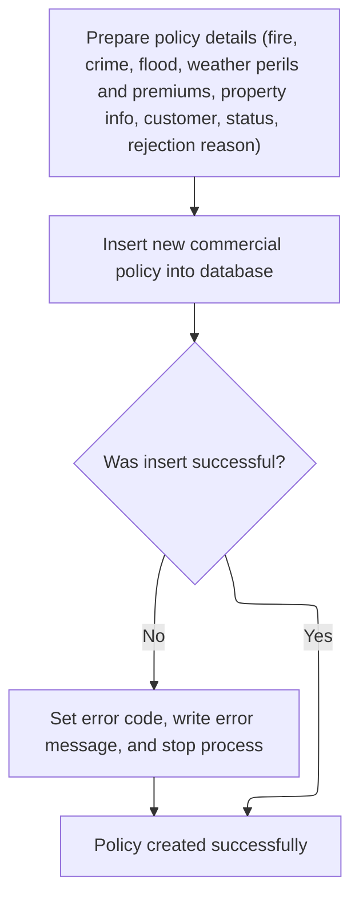

This section is responsible for creating a new commercial policy record in the database. It ensures all required policy fields are mapped and inserted, and handles errors if the insert is unsuccessful.

| Category        | Rule Name                               | Description                                                                                                                                                                                  |
| --------------- | --------------------------------------- | -------------------------------------------------------------------------------------------------------------------------------------------------------------------------------------------- |
| Data validation | Required policy fields mapping          | All required commercial policy fields (including perils, premiums, property info, customer, status, and rejection reason) must be present and mapped before attempting to insert the record. |
| Business logic  | Policy record creation                  | A new commercial policy record must be inserted into the COMMERCIAL table using the mapped values for all fields.                                                                            |
| Business logic  | Successful policy creation confirmation | A successful insert must result in a confirmation that the policy was created, with no further error handling required.                                                                      |

<SwmSnippet path="/base/src/lgapdb09.cbl" line="553">

---

In <SwmToken path="base/src/lgapdb09.cbl" pos="553:1:3" line-data="       P548-BINS.">`P548-BINS`</SwmToken>, we map all the calculated and input commercial policy fields to <SwmToken path="base/src/lgapdb09.cbl" pos="554:11:11" line-data="           MOVE CA-B-FP     TO DB2-B-P1-Int">`DB2`</SwmToken> host variables and prep the SQL insert request string. This sets up the DB insert for the commercial policy.

```cobol
       P548-BINS.
           MOVE CA-B-FP     TO DB2-B-P1-Int
           MOVE CA-B-CA-B-FPR   TO DB2-B-P1A-Int
           MOVE CA-B-CP    TO DB2-B-P2-Int
           MOVE CA-B-CPR  TO DB2-B-P2A-Int
           MOVE CA-B-FLP    TO DB2-B-P3-Int
           MOVE CA-B-FLPR  TO DB2-B-P3A-Int
           MOVE CA-B-WP  TO DB2-B-P4-Int
           MOVE CA-B-WPR TO DB2-B-P4A-Int
           MOVE CA-B-ST        TO DB2-B-Z9-Int
           
           MOVE ' INSERT COMMER' TO EM-SQLREQ
```

---

</SwmSnippet>

<SwmSnippet path="/base/src/lgapdb09.cbl" line="565">

---

Next in <SwmToken path="base/src/lgapdb09.cbl" pos="528:3:5" line-data="           PERFORM P548-BINS">`P548-BINS`</SwmToken>, we execute the SQL insert to add the commercial policy record to the COMMERCIAL table, using the <SwmToken path="base/src/lgapdb09.cbl" pos="587:5:5" line-data="                VALUES (:DB2-POLICYNUM-INT,">`DB2`</SwmToken> variables mapped in the previous step. This is the actual DB write.

```cobol
           EXEC SQL
             INSERT INTO COMMERCIAL
                       (PolicyNumber,
                        RequestDate,
                        StartDate,
                        RenewalDate,
                        Address,
                        Zipcode,
                        LatitudeN,
                        LongitudeW,
                        Customer,
                        PropertyType,
                        FirePeril,
                        CA-B-FPR,
                        CrimePeril,
                        CrimePremium,
                        FloodPeril,
                        FloodPremium,
                        WeatherPeril,
                        WeatherPremium,
                        Status,
                        RejectionReason)
                VALUES (:DB2-POLICYNUM-INT,
                        :CA-LASTCHANGED,
                        :CA-ISSUE-DATE,
                        :CA-EXPIRY-DATE,
                        :CA-B-Address,
                        :CA-B-PST,
                        :CA-B-Latitude,
                        :CA-B-Longitude,
                        :CA-B-Customer,
                        :CA-B-PropType,
                        :DB2-B-P1-Int,
                        :DB2-B-P1A-Int,
                        :DB2-B-P2-Int,
                        :DB2-B-P2A-Int,
                        :DB2-B-P3-Int,
                        :DB2-B-P3A-Int,
                        :DB2-B-P4-Int,
                        :DB2-B-P4A-Int,
                        :DB2-B-Z9-Int,
                        :CA-B-RejectReason)
           END-EXEC
```

---

</SwmSnippet>

<SwmSnippet path="/base/src/lgapdb09.cbl" line="609">

---

Finally in <SwmToken path="base/src/lgapdb09.cbl" pos="528:3:5" line-data="           PERFORM P548-BINS">`P548-BINS`</SwmToken>, we check the SQLCODE after the insert. If there's an error, we set the return code, call <SwmToken path="base/src/lgapdb09.cbl" pos="611:3:7" line-data="              PERFORM WRITE-ERROR-MESSAGE">`WRITE-ERROR-MESSAGE`</SwmToken> to log the failure, and abend the transaction to prevent partial data.

```cobol
           IF SQLCODE NOT = 0
              MOVE '92' TO CA-RETURN-CODE
              PERFORM WRITE-ERROR-MESSAGE
              EXEC CICS ABEND ABCODE('LGSQ') NODUMP END-EXEC
              EXEC CICS RETURN END-EXEC
           END-IF.
           
           EXIT.
```

---

</SwmSnippet>

## Finalizing and Writing Policy Data

<SwmSnippet path="/base/src/lgapdb09.cbl" line="268">

---

Back in MAINLINE after <SwmToken path="base/src/lgapdb09.cbl" pos="261:3:5" line-data="               PERFORM P500-BIZ">`P500-BIZ`</SwmToken>, we link to <SwmToken path="base/src/lgapdb09.cbl" pos="268:9:9" line-data="             EXEC CICS Link Program(LGAPVS01)">`LGAPVS01`</SwmToken> to write the formatted policy data record to the persistent file. This is the last step before returning to the caller.

```cobol
             EXEC CICS Link Program(LGAPVS01)
                  Commarea(DFHCOMMAREA)
                LENGTH(32500)
             END-EXEC.


      * Return to caller
           EXEC CICS RETURN END-EXEC.
```

---

</SwmSnippet>

# Writing Policy Data Record and Handling Errors

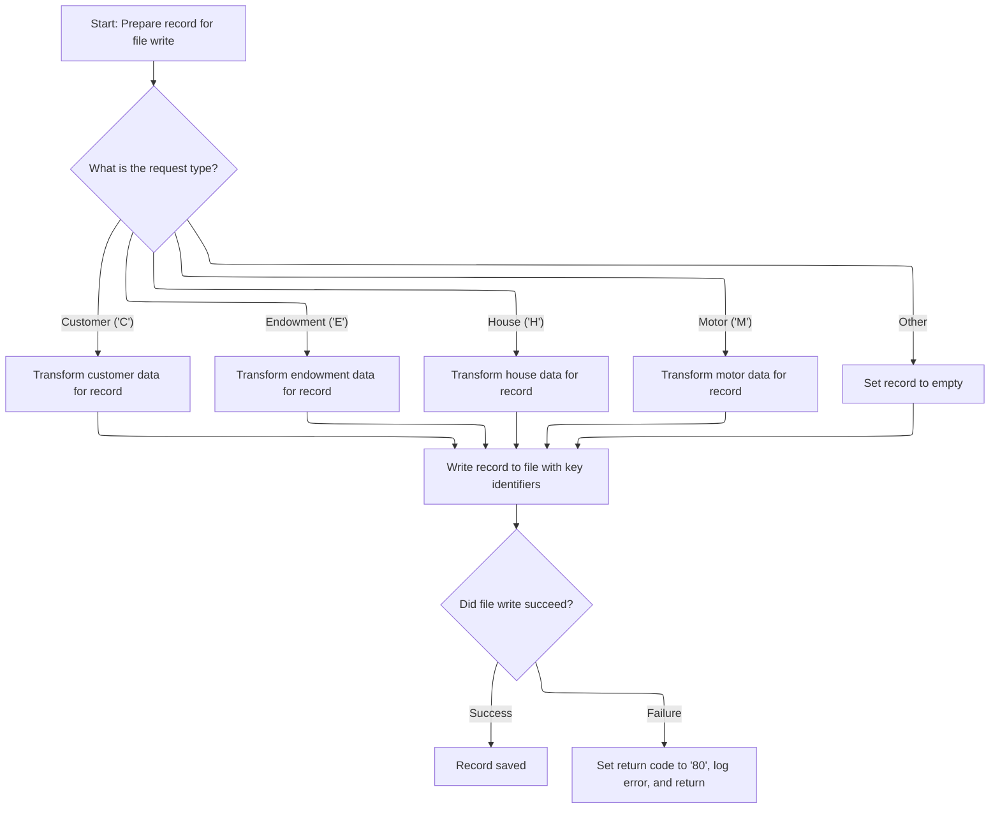

This section governs how policy data records are constructed and written to the main policy file, and how errors are handled if the write operation fails.

| Category       | Rule Name              | Description                                                                                                                                                                                  |
| -------------- | ---------------------- | -------------------------------------------------------------------------------------------------------------------------------------------------------------------------------------------- |
| Business logic | Policy type mapping    | The policy data record must be constructed according to the request type: 'C' for customer, 'E' for endowment, 'H' for house, 'M' for motor, and any other value results in an empty record. |
| Business logic | Record key enforcement | The record must be written to the KSDSPOLY file using the key fields: request type, customer number, and policy number.                                                                      |

<SwmSnippet path="/base/src/lgapvs01.cbl" line="90">

---

<SwmToken path="base/src/lgapvs01.cbl" pos="90:1:3" line-data="       P100-ENTRY SECTION.">`P100-ENTRY`</SwmToken> branches on <SwmToken path="base/src/lgapvs01.cbl" pos="95:16:18" line-data="           Move CA-Request-ID(4:1) To V2-REQ">`V2-REQ`</SwmToken> to move the right fields into <SwmToken path="base/src/lgapvs01.cbl" pos="137:3:5" line-data="                     From(V2-RECORD)">`V2-RECORD`</SwmToken>, then writes it to the KSDSPOLY file. If the write fails, it sets the error code and jumps to error handling. This is the main file write for policy data.

```cobol
       P100-ENTRY SECTION.
      *
      *---------------------------------------------------------------*
           Move EIBCALEN To V1-COMM.
      *---------------------------------------------------------------*
           Move CA-Request-ID(4:1) To V2-REQ
           Move CA-Policy-Num      To V2-POL
           Move CA-Customer-Num    To V2-CUST

           Evaluate V2-REQ

             When 'C'
               Move CA-B-PST     To V2-C-PCD
               Move CA-B-ST       To V2-C-Z9
               Move CA-B-Customer     To V2-C-CUST
               Move WS-RISK-SCORE     To V2-C-VAL
               Move CA-B-CA-B-FPR  To V2-C-P1VAL
               Move CA-B-CPR To V2-C-P2VAL
               Move CA-B-FLPR To V2-C-P3VAL
               Move CA-B-WPR To V2-C-P4VAL

             When 'E'
               Move CA-E-W-PRO        To  V2-E-OPT1
               Move CA-E-EQU          To  V2-E-OPT2
               Move CA-E-M-FUN        To  V2-E-OPT3
               Move CA-E-FUND-NAME    To  V2-E-NAME
               Move CA-E-LIFE-ASSURED To  V2-E-LIFE

             When 'H'
               Move CA-H-P-TYP         To  V2-H-TYPE
               Move CA-H-BED           To  V2-H-ROOMS
               Move CA-H-VAL           To  V2-H-COST
               Move CA-H-PCD           To  V2-H-PCD
               Move CA-H-H-NAM         To  V2-H-NAME

             When 'M'
               Move CA-M-MAKE          To  V2-M-MAKE
               Move CA-M-MODEL         To  V2-M-MODEL
               Move CA-M-VALUE         To  V2-M-COST
               Move CA-M-REGNUMBER     To  V2-M-NUM

             When Other
               Move Spaces To V2-DATA
           End-Evaluate

      *---------------------------------------------------------------*
           Exec CICS Write File('KSDSPOLY')
                     From(V2-RECORD)
                     Length(104)
                     Ridfld(V2-KEY)
                     KeyLength(21)
                     RESP(V1-RCD1)
           End-Exec.
           If V1-RCD1 Not = DFHRESP(NORMAL)
             Move EIBRESP2 To V1-RCD2
             MOVE '80' TO CA-RETURN-CODE
             PERFORM P999-ERROR
             EXEC CICS RETURN END-EXEC
           End-If.
```

---

</SwmSnippet>

<SwmSnippet path="/base/src/lgapvs01.cbl" line="156">

---

<SwmToken path="base/src/lgapvs01.cbl" pos="156:1:3" line-data="       P999-ERROR.">`P999-ERROR`</SwmToken> grabs the current time, formats it, and moves all the error context into <SwmToken path="base/src/lgapvs01.cbl" pos="171:3:5" line-data="                     COMMAREA(ERROR-MSG)">`ERROR-MSG`</SwmToken>. Then it calls LGSTSQ to log the error. If there's commarea data, it moves up to 90 bytes and links again to LGSTSQ with the extended info. This covers both error and commarea logging.

```cobol
       P999-ERROR.
           EXEC CICS ASKTIME ABSTIME(V3-TIME)
           END-EXEC
           EXEC CICS FORMATTIME ABSTIME(V3-TIME)
                     MMDDYYYY(V3-DATE1)
                     TIME(V3-DATE2)
           END-EXEC
      *
           MOVE V3-DATE1 TO EM-DATE
           MOVE V3-DATE2 TO EM-TIME
           Move CA-Customer-Num To EM-Cusnum
           Move CA-Policy-Num   To EM-POLNUM 
           Move V1-RCD1         To EM-RespRC
           Move V1-RCD2         To EM-Resp2RC
           EXEC CICS LINK PROGRAM('LGSTSQ')
                     COMMAREA(ERROR-MSG)
                     LENGTH(LENGTH OF ERROR-MSG)
           END-EXEC.
           IF EIBCALEN > 0 THEN
             IF EIBCALEN < 91 THEN
               MOVE DFHCOMMAREA(1:EIBCALEN) TO CA-DATA
               EXEC CICS LINK PROGRAM('LGSTSQ')
                         COMMAREA(CA-ERROR-MSG)
                         LENGTH(Length Of CA-ERROR-MSG)
               END-EXEC
             ELSE
               MOVE DFHCOMMAREA(1:90) TO CA-DATA
               EXEC CICS LINK PROGRAM('LGSTSQ')
                         COMMAREA(CA-ERROR-MSG)
                         LENGTH(Length Of CA-ERROR-MSG)
               END-EXEC
             END-IF
           END-IF.
           EXIT.
```

---

</SwmSnippet>

&nbsp;

*This is an auto-generated document by Swimm 🌊 and has not yet been verified by a human*

<SwmMeta version="3.0.0" repo-id="Z2l0aHViJTNBJTNBU3dpbW1pby1nZW5hcHAtbW90b3IlM0ElM0FHaXJpLVN3aW1t" repo-name="Swimmio-genapp-motor"><sup>Powered by [Swimm](https://app.swimm.io/)</sup></SwmMeta>
