# Overview

This document describes the flow for processing insurance policy transactions. The system validates requests, determines policy type, processes policy-specific logic, and persists policy records. For commercial policies, risk and premium calculations are performed, and matrix-based logic is applied to set policy status and rejection reasons.

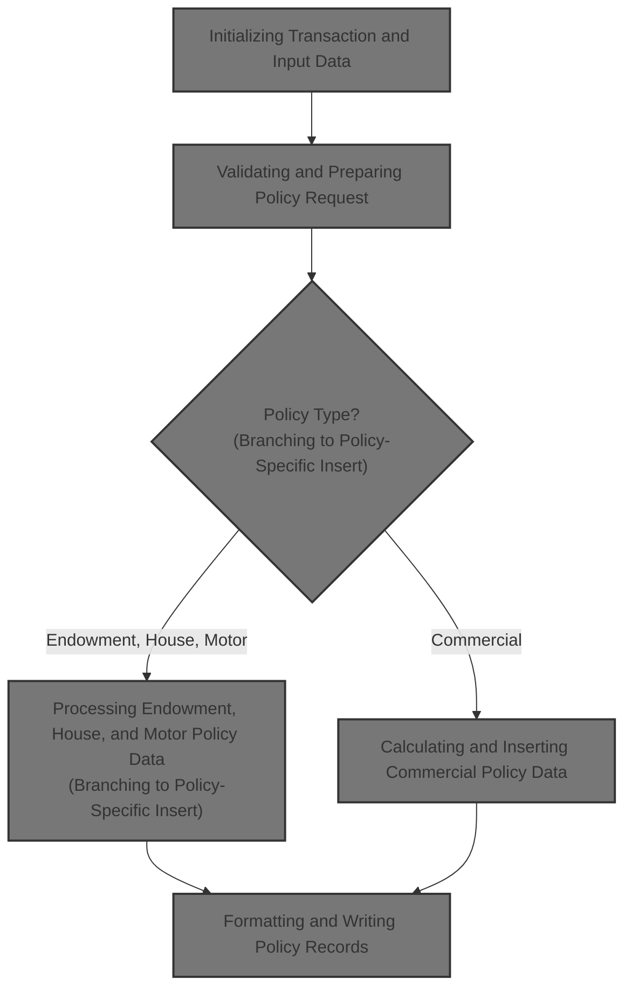

## Dependencies

### Programs

- <SwmToken path="base/src/lgapdb09.cbl" pos="2:6:6" line-data="       PROGRAM-ID. LGAPDB09.">`LGAPDB09`</SwmToken> (<SwmPath>[base/src/lgapdb09.cbl](base/src/lgapdb09.cbl)</SwmPath>)
- <SwmToken path="base/src/lgapdb09.cbl" pos="268:9:9" line-data="             EXEC CICS Link Program(LGAPVS01)">`LGAPVS01`</SwmToken> (<SwmPath>[base/src/lgapvs01.cbl](base/src/lgapvs01.cbl)</SwmPath>)
- LGSTSQ (<SwmPath>[base/src/lgstsq.cbl](base/src/lgstsq.cbl)</SwmPath>)
- LGCOMCAL (<SwmPath>[base/src/lgcomcal.cbl](base/src/lgcomcal.cbl)</SwmPath>)

### Copybooks

- LGCMAREA (<SwmPath>[base/src/lgcmarea.cpy](base/src/lgcmarea.cpy)</SwmPath>)
- LGCOMDAT (<SwmPath>[base/src/lgcomdat.cpy](base/src/lgcomdat.cpy)</SwmPath>)
- LGPOLICY (<SwmPath>[base/src/lgpolicy.cpy](base/src/lgpolicy.cpy)</SwmPath>)
- SQLCA

## Input and Output Tables/Files used in the Program

| Table / File Name | Type                                                                                                                     | Description                                           | Usage Mode   | Key Fields / Layout Highlights                                                                                                                                                                                                                                                                                                                                                                                                                                                                                                                                                                                                                                                                                                                                                                                                                                                                                                                                                                                                                                                                                                                                                                                                                                                                                                                                                                                                                                                                                                                                                                                                                                                                                                                                                                                                                                                                                                                                                                                                                                                                                                                                                                                                                                                                                                                                                                                                                                                                                                                                                                                                                                        |
| ----------------- | ------------------------------------------------------------------------------------------------------------------------ | ----------------------------------------------------- | ------------ | --------------------------------------------------------------------------------------------------------------------------------------------------------------------------------------------------------------------------------------------------------------------------------------------------------------------------------------------------------------------------------------------------------------------------------------------------------------------------------------------------------------------------------------------------------------------------------------------------------------------------------------------------------------------------------------------------------------------------------------------------------------------------------------------------------------------------------------------------------------------------------------------------------------------------------------------------------------------------------------------------------------------------------------------------------------------------------------------------------------------------------------------------------------------------------------------------------------------------------------------------------------------------------------------------------------------------------------------------------------------------------------------------------------------------------------------------------------------------------------------------------------------------------------------------------------------------------------------------------------------------------------------------------------------------------------------------------------------------------------------------------------------------------------------------------------------------------------------------------------------------------------------------------------------------------------------------------------------------------------------------------------------------------------------------------------------------------------------------------------------------------------------------------------------------------------------------------------------------------------------------------------------------------------------------------------------------------------------------------------------------------------------------------------------------------------------------------------------------------------------------------------------------------------------------------------------------------------------------------------------------------------------------------------------- |
| COMMERCIAL        | <SwmToken path="base/src/lgapdb09.cbl" pos="199:3:3" line-data="           INITIALIZE DB2-IN-INTEGERS.">`DB2`</SwmToken> | Commercial policy property, risk, and premium factors | Output       | <SwmToken path="base/src/lgapdb09.cbl" pos="567:2:2" line-data="                       (PolicyNumber,">`PolicyNumber`</SwmToken>, <SwmToken path="base/src/lgapdb09.cbl" pos="568:1:1" line-data="                        RequestDate,">`RequestDate`</SwmToken>, <SwmToken path="base/src/lgapdb09.cbl" pos="569:1:1" line-data="                        StartDate,">`StartDate`</SwmToken>, <SwmToken path="base/src/lgapdb09.cbl" pos="570:1:1" line-data="                        RenewalDate,">`RenewalDate`</SwmToken>, <SwmToken path="base/src/lgapdb09.cbl" pos="502:7:7" line-data="           MOVE CA-B-Address TO WS-XADDRESS">`Address`</SwmToken>, <SwmToken path="base/src/lgapdb09.cbl" pos="572:1:1" line-data="                        Zipcode,">`Zipcode`</SwmToken>, <SwmToken path="base/src/lgapdb09.cbl" pos="573:1:1" line-data="                        LatitudeN,">`LatitudeN`</SwmToken>, <SwmToken path="base/src/lgapdb09.cbl" pos="574:1:1" line-data="                        LongitudeW,">`LongitudeW`</SwmToken>, <SwmToken path="base/src/lgapdb09.cbl" pos="505:7:7" line-data="           MOVE CA-B-Customer TO WS-XCUSTNAME">`Customer`</SwmToken>, <SwmToken path="base/src/lgapdb09.cbl" pos="576:1:1" line-data="                        PropertyType,">`PropertyType`</SwmToken>, <SwmToken path="base/src/lgapdb09.cbl" pos="577:1:1" line-data="                        FirePeril,">`FirePeril`</SwmToken>, <SwmToken path="base/src/lgapdb09.cbl" pos="518:15:19" line-data="           MOVE WS-ZFP-PREMIUM TO CA-B-CA-B-FPR">`CA-B-FPR`</SwmToken>, <SwmToken path="base/src/lgapdb09.cbl" pos="579:1:1" line-data="                        CrimePeril,">`CrimePeril`</SwmToken>, <SwmToken path="base/src/lgapdb09.cbl" pos="580:1:1" line-data="                        CrimePremium,">`CrimePremium`</SwmToken>, <SwmToken path="base/src/lgapdb09.cbl" pos="581:1:1" line-data="                        FloodPeril,">`FloodPeril`</SwmToken>, <SwmToken path="base/src/lgapdb09.cbl" pos="582:1:1" line-data="                        FloodPremium,">`FloodPremium`</SwmToken>, <SwmToken path="base/src/lgapdb09.cbl" pos="583:1:1" line-data="                        WeatherPeril,">`WeatherPeril`</SwmToken>, <SwmToken path="base/src/lgapdb09.cbl" pos="584:1:1" line-data="                        WeatherPremium,">`WeatherPremium`</SwmToken>, <SwmToken path="base/src/lgapdb09.cbl" pos="585:1:1" line-data="                        Status,">`Status`</SwmToken>, <SwmToken path="base/src/lgapdb09.cbl" pos="586:1:1" line-data="                        RejectionReason)">`RejectionReason`</SwmToken> |
| ENDOWMENT         | <SwmToken path="base/src/lgapdb09.cbl" pos="199:3:3" line-data="           INITIALIZE DB2-IN-INTEGERS.">`DB2`</SwmToken> | Endowment policy investment and assured sum details   | Output       | <SwmToken path="base/src/lgapdb09.cbl" pos="289:3:3" line-data="                       ( POLICYNUMBER,">`POLICYNUMBER`</SwmToken>, <SwmToken path="base/src/lgapdb09.cbl" pos="365:1:1" line-data="                            WITHPROFITS,">`WITHPROFITS`</SwmToken>, <SwmToken path="base/src/lgapdb09.cbl" pos="366:1:1" line-data="                            EQUITIES,">`EQUITIES`</SwmToken>, <SwmToken path="base/src/lgapdb09.cbl" pos="367:1:1" line-data="                            MANAGEDFUND,">`MANAGEDFUND`</SwmToken>, <SwmToken path="base/src/lgapdb09.cbl" pos="368:1:1" line-data="                            FUNDNAME,">`FUNDNAME`</SwmToken>, <SwmToken path="base/src/lgapdb09.cbl" pos="346:7:7" line-data="           MOVE CA-E-TERM        TO DB2-E-TERM-SINT">`TERM`</SwmToken>, <SwmToken path="base/src/lgapdb09.cbl" pos="347:17:17" line-data="           MOVE CA-E-SUM-ASSURED TO DB2-E-SUMASSURED-INT">`SUMASSURED`</SwmToken>, <SwmToken path="base/src/lgapdb09.cbl" pos="371:1:1" line-data="                            LIFEASSURED,">`LIFEASSURED`</SwmToken>, <SwmToken path="base/src/lgapdb09.cbl" pos="372:1:1" line-data="                            PADDINGDATA    )">`PADDINGDATA`</SwmToken>                                                                                                                                                                                                                                                                                                                                                                                                                                                                                                                                                                                                                                                                                                                                                                                                                                                                                                                                                                                                                                                                                                                                                                                                                                                                                                                                                                                                                        |
| HOUSE             | <SwmToken path="base/src/lgapdb09.cbl" pos="199:3:3" line-data="           INITIALIZE DB2-IN-INTEGERS.">`DB2`</SwmToken> | House policy property type, value, and address        | Output       | <SwmToken path="base/src/lgapdb09.cbl" pos="289:3:3" line-data="                       ( POLICYNUMBER,">`POLICYNUMBER`</SwmToken>, <SwmToken path="base/src/lgapdb09.cbl" pos="424:1:1" line-data="                         PROPERTYTYPE,">`PROPERTYTYPE`</SwmToken>, <SwmToken path="base/src/lgapdb09.cbl" pos="418:15:15" line-data="           MOVE CA-H-BED    TO DB2-H-BEDROOMS-SINT">`BEDROOMS`</SwmToken>, <SwmToken path="base/src/lgapdb09.cbl" pos="417:15:15" line-data="           MOVE CA-H-VAL       TO DB2-H-VALUE-INT">`VALUE`</SwmToken>, <SwmToken path="base/src/lgapdb09.cbl" pos="427:1:1" line-data="                         HOUSENAME,">`HOUSENAME`</SwmToken>, <SwmToken path="base/src/lgapdb09.cbl" pos="428:1:1" line-data="                         HOUSENUMBER,">`HOUSENUMBER`</SwmToken>, <SwmToken path="base/src/lgapdb09.cbl" pos="429:1:1" line-data="                         POSTCODE          )">`POSTCODE`</SwmToken>                                                                                                                                                                                                                                                                                                                                                                                                                                                                                                                                                                                                                                                                                                                                                                                                                                                                                                                                                                                                                                                                                                                                                                                                                                                                                                                                                                                                                                                                                                                                                                                                                                                                                                         |
| MOTOR             | <SwmToken path="base/src/lgapdb09.cbl" pos="199:3:3" line-data="           INITIALIZE DB2-IN-INTEGERS.">`DB2`</SwmToken> | Motor policy vehicle make, model, and risk data       | Output       | <SwmToken path="base/src/lgapdb09.cbl" pos="289:3:3" line-data="                       ( POLICYNUMBER,">`POLICYNUMBER`</SwmToken>, <SwmToken path="base/src/lgapdb09.cbl" pos="460:1:1" line-data="                         MAKE,">`MAKE`</SwmToken>, <SwmToken path="base/src/lgapdb09.cbl" pos="461:1:1" line-data="                         MODEL,">`MODEL`</SwmToken>, <SwmToken path="base/src/lgapdb09.cbl" pos="417:15:15" line-data="           MOVE CA-H-VAL       TO DB2-H-VALUE-INT">`VALUE`</SwmToken>, <SwmToken path="base/src/lgapdb09.cbl" pos="463:1:1" line-data="                         REGNUMBER,">`REGNUMBER`</SwmToken>, <SwmToken path="base/src/lgapdb09.cbl" pos="464:1:1" line-data="                         COLOUR,">`COLOUR`</SwmToken>, <SwmToken path="base/src/lgapdb09.cbl" pos="452:7:7" line-data="           MOVE CA-M-CC          TO DB2-M-CC-SINT">`CC`</SwmToken>, <SwmToken path="base/src/lgapdb09.cbl" pos="466:1:1" line-data="                         YEAROFMANUFACTURE,">`YEAROFMANUFACTURE`</SwmToken>, <SwmToken path="base/src/lgapdb09.cbl" pos="453:7:7" line-data="           MOVE CA-M-PREMIUM     TO DB2-M-PREMIUM-INT">`PREMIUM`</SwmToken>, <SwmToken path="base/src/lgapdb09.cbl" pos="454:7:7" line-data="           MOVE CA-M-ACCIDENTS   TO DB2-M-ACCIDENTS-INT">`ACCIDENTS`</SwmToken>                                                                                                                                                                                                                                                                                                                                                                                                                                                                                                                                                                                                                                                                                                                                                                                                                                                                                                                                                                                                                                                                                                                                                                                                                                                                                                                 |
| POLICY            | <SwmToken path="base/src/lgapdb09.cbl" pos="199:3:3" line-data="           INITIALIZE DB2-IN-INTEGERS.">`DB2`</SwmToken> | Insurance policy core details and lifecycle dates     | Input/Output | <SwmToken path="base/src/lgapdb09.cbl" pos="289:3:3" line-data="                       ( POLICYNUMBER,">`POLICYNUMBER`</SwmToken>, <SwmToken path="base/src/lgapdb09.cbl" pos="290:1:1" line-data="                         CUSTOMERNUMBER,">`CUSTOMERNUMBER`</SwmToken>, <SwmToken path="base/src/lgapdb09.cbl" pos="291:1:1" line-data="                         ISSUEDATE,">`ISSUEDATE`</SwmToken>, <SwmToken path="base/src/lgapdb09.cbl" pos="292:1:1" line-data="                         EXPIRYDATE,">`EXPIRYDATE`</SwmToken>, <SwmToken path="base/src/lgapdb09.cbl" pos="222:11:11" line-data="               MOVE &#39;E&#39; TO DB2-POLICYTYPE">`POLICYTYPE`</SwmToken>, <SwmToken path="base/src/lgapdb09.cbl" pos="294:1:1" line-data="                         LASTCHANGED,">`LASTCHANGED`</SwmToken>, <SwmToken path="base/src/lgapdb09.cbl" pos="283:5:5" line-data="           MOVE CA-BROKERID TO DB2-BROKERID-INT">`BROKERID`</SwmToken>, <SwmToken path="base/src/lgapdb09.cbl" pos="296:1:1" line-data="                         BROKERSREFERENCE,">`BROKERSREFERENCE`</SwmToken>, <SwmToken path="base/src/lgapdb09.cbl" pos="284:5:5" line-data="           MOVE CA-PAYMENT TO DB2-PAYMENT-INT">`PAYMENT`</SwmToken>, <SwmToken path="base/src/lgapdb09.cbl" pos="334:4:6" line-data="               INTO :CA-LASTCHANGED">`CA-LASTCHANGED`</SwmToken>                                                                                                                                                                                                                                                                                                                                                                                                                                                                                                                                                                                                                                                                                                                                                                                                                                                                                                                                                                                                                                                                                                                                                                                                                                                                                         |

&nbsp;

## Detailed View of the Program's Functionality

# Swimmio-genapp-motor: Detailed Flow and Actions

## 1\. Transaction Initialization and Input Data Handling

At the start, the main transaction logic sets up all the necessary runtime context for tracking and error reporting. This includes initializing header fields for transaction ID, terminal ID, task number, and input length. It also prepares integer variables for database operations.

The code then checks if any input data (commarea) was received. If not, it logs an error message with context and aborts the transaction to prevent further processing.

If input data is present, it sets up the return code, stores the address of the input area, and prepares customer and policy values for database use. It calculates the minimum required input length based on the type of policy requested (endowment, house, motor, commercial). If the request type is unknown, it sets an error code and returns immediately.

If the input data is shorter than required for the requested policy type, it sets an error code for insufficient data and returns.

Once input is validated, the main policy record is inserted into the database.

---

## 2\. Error Logging and Transaction Context

When an error occurs (such as missing input or a database failure), the system captures detailed error information: SQL error code, current date and time, and relevant transaction context. This information is formatted and sent to a monitoring/logging system.

If there is input data, up to 90 bytes of it are also logged for troubleshooting. The logging routine sends both generic and request-specific error info to a queue for monitoring.

The error logging module determines the source of the message (whether it was invoked or received), adjusts message length, and routes it to the appropriate queue. If the message starts with a special prefix, it is routed to a specific queue extension.

After logging, if there was input data, it is also sent to the logging system, truncated if necessary.

---

## 3\. Policy Request Validation and Preparation

The system determines the required input data length for the requested policy type. It sets up the policy type for database operations and validates that the input data is sufficient.

If the request type is not recognized, an error code is set and processing stops.

If the input data is too short, an error code is set and processing stops.

If validation passes, the main policy record is inserted into the database.

---

## 4\. Inserting Main Policy Record

The system prepares all necessary fields (such as broker, payment, and customer info) and inserts a new policy record into the database.

After the insert, the result is checked:

- If successful, the new policy number is retrieved and assigned to the customer and error message structures.
- If there is a foreign key error, an error code is set, the error is logged, and processing stops.
- For any other error, a different error code is set, the error is logged, and processing stops.

The system also retrieves the last changed timestamp for the new policy record.

---

## 5\. Branching to Policy-Specific Insert Logic

After the main policy record is inserted, the system branches to the appropriate routine based on the policy type:

- Endowment: Calls the endowment insert routine.
- House: Calls the house insert routine.
- Motor: Calls the motor insert routine.
- Commercial: Calls the commercial policy logic.
- Unknown: Sets an error code.

---

## 6\. Inserting Endowment Policy Data

The system prepares numeric fields and checks for any extra variable-length data. If present, it includes this data in the SQL insert for the endowment record.

If there is no extra data, a standard insert is performed.

If the insert fails, the error is logged and the transaction is aborted to roll back any changes.

---

## 7\. Inserting House Policy Data

The system prepares all required fields for the house policy (such as property type, bedrooms, value, house name, number, and postcode) and inserts the record into the database.

If the insert fails, the error is logged and the transaction is aborted.

---

## 8\. Inserting Motor Policy Data

The system prepares all required fields for the motor policy (such as make, model, value, registration number, color, engine size, year, premium, and accident count) and inserts the record into the database.

If the insert fails, the error is logged and the transaction is aborted.

---

## 9\. Calculating and Inserting Commercial Policy Data

The system prepares all property and customer data needed for risk calculation and premium computation. It then calls a separate module to perform risk and premium calculations.

### 9.1. Risk Calculation Context Preparation

The risk calculation module initializes runtime info (transaction ID, terminal ID, task number), enables security, and sets up risk calculation matrices. It runs through a matrix initialization loop, setting specific values at certain positions for later risk logic.

### 9.2. Risk and Premium Calculations

The business logic routine calculates the risk score based on property type and geographic factors (postcode prefix). It applies hardcoded factors for different property types and geographic regions.

The total risk score is computed by combining base value, property factor, and geographic factor.

The policy status is determined based on the risk score:

- High risk: Manual review required.
- Medium risk: Pending review.
- Low risk: Normal.

Premiums for different perils (fire, crime, flood, weather) are calculated using the risk score, peril factors, and any applicable discounts.

### 9.3. Transferring Calculated Results

After calculations, the computed risk score, status, rejection reason, and premium values are moved into the main policy record fields.

---

## 10\. Applying Matrix-Based Status and Rejection Logic

A matrix-based routine checks the calculated score and current status to set override flags and rejection reasons:

- Score above 200: Status set to manual review, reason updated.
- Score between 151 and 200: Status set to pending verification, reason updated.
- Score 150 or below: Status set to normal, reason cleared.

These values are then moved into the communication area fields for downstream processing.

---

## 11\. Persisting Commercial Policy to Database

The system maps all policy details, customer info, and peril premiums to database fields and inserts the commercial policy record into the database.

If the insert fails, an error code is set, the error is logged, and the transaction is aborted.

---

## 12\. Finalizing Transaction and Linking to Record Writer

After all processing, the system links to a record writer module, passing the full communication area so the finalized policy record can be written to persistent storage.

---

## 13\. Formatting and Writing Policy Records

The record writer module receives the request and extracts customer and policy info. It determines the request type and formats the record accordingly:

- Commercial: Prepares customer record.
- Endowment: Prepares endowment record.
- House: Prepares house record.
- Motor: Prepares motor record.
- Unknown: Sets record data to blank.

The formatted record is then written to a file. If the write fails, an error code is set, the error is logged, and processing stops.

The error logging routine in this module captures the current time and date, fills out the error message structure, and sends it to the logging system. If there is input data, up to 90 bytes are also logged.

---

## Summary

The flow starts by initializing transaction context and validating input. It then inserts the main policy record and branches to policy-specific logic for endowment, house, motor, or commercial policies. Each branch prepares and inserts the appropriate data, with commercial policies involving risk and premium calculations. All errors are logged with detailed context, and the final policy record is written to persistent storage. The system ensures robust error handling and data integrity throughout the process.

# Data Definitions

| Table / Record Name | Type                                                                                                                     | Short Description                                     | Usage Mode                      |
| ------------------- | ------------------------------------------------------------------------------------------------------------------------ | ----------------------------------------------------- | ------------------------------- |
| COMMERCIAL          | <SwmToken path="base/src/lgapdb09.cbl" pos="199:3:3" line-data="           INITIALIZE DB2-IN-INTEGERS.">`DB2`</SwmToken> | Commercial policy property, risk, and premium factors | Output (INSERT)                 |
| ENDOWMENT           | <SwmToken path="base/src/lgapdb09.cbl" pos="199:3:3" line-data="           INITIALIZE DB2-IN-INTEGERS.">`DB2`</SwmToken> | Endowment policy investment and assured sum details   | Output (INSERT)                 |
| HOUSE               | <SwmToken path="base/src/lgapdb09.cbl" pos="199:3:3" line-data="           INITIALIZE DB2-IN-INTEGERS.">`DB2`</SwmToken> | House policy property type, value, and address        | Output (INSERT)                 |
| MOTOR               | <SwmToken path="base/src/lgapdb09.cbl" pos="199:3:3" line-data="           INITIALIZE DB2-IN-INTEGERS.">`DB2`</SwmToken> | Motor policy vehicle make, model, and risk data       | Output (INSERT)                 |
| POLICY              | <SwmToken path="base/src/lgapdb09.cbl" pos="199:3:3" line-data="           INITIALIZE DB2-IN-INTEGERS.">`DB2`</SwmToken> | Insurance policy core details and lifecycle dates     | Input (SELECT), Output (INSERT) |

&nbsp;

# Rule Definition

| Paragraph Name                                                                                                                            | Rule ID | Category          | Description                                                                                                                                                                                                                   | Conditions                                                                                                                                                                                                                                                                                           | Remarks                                                                                                                                                                            |
| ----------------------------------------------------------------------------------------------------------------------------------------- | ------- | ----------------- | ----------------------------------------------------------------------------------------------------------------------------------------------------------------------------------------------------------------------------- | ---------------------------------------------------------------------------------------------------------------------------------------------------------------------------------------------------------------------------------------------------------------------------------------------------- | ---------------------------------------------------------------------------------------------------------------------------------------------------------------------------------- |
| MAINLINE SECTION, lines 203-207, 242-245                                                                                                  | RL-001  | Conditional Logic | The system must check if the COMMarea is present and contains sufficient data for the requested policy type. If missing or insufficient, set the return code and exit.                                                        | COMMarea length (EIBCALEN) must be greater than zero and at least as large as the required length for the policy type.                                                                                                                                                                               | Return codes: '98' (insufficient data), '99' (invalid request). COMMarea is a byte array; required length is determined by policy type. No further processing if validation fails. |
| MAINLINE SECTION, lines 218-240, 249-266                                                                                                  | RL-002  | Conditional Logic | The system must process only recognized request types. For Motor policy, route to Motor-specific processing. For unrecognized types, set error code and exit.                                                                 | <SwmToken path="base/src/lgapdb09.cbl" pos="218:3:7" line-data="           EVALUATE CA-REQUEST-ID">`CA-REQUEST-ID`</SwmToken> must match one of the known types (<SwmToken path="base/src/lgapdb09.cbl" pos="228:4:4" line-data="             WHEN &#39;01AMOT&#39;">`01AMOT`</SwmToken> for Motor). | Return code for unknown request: '99'. Policy type for Motor: 'M'.                                                                                                                 |
| <SwmToken path="base/src/lgapdb09.cbl" pos="258:3:5" line-data="               PERFORM P400-M">`P400-M`</SwmToken> SECTION, lines 451-454 | RL-003  | Data Assignment   | For Motor policy requests, map COMMarea fields to <SwmToken path="base/src/lgapdb09.cbl" pos="199:3:3" line-data="           INITIALIZE DB2-IN-INTEGERS.">`DB2`</SwmToken> host variables for insertion into the MOTOR table. | <SwmToken path="base/src/lgapdb09.cbl" pos="218:3:7" line-data="           EVALUATE CA-REQUEST-ID">`CA-REQUEST-ID`</SwmToken> = <SwmToken path="base/src/lgapdb09.cbl" pos="228:4:4" line-data="             WHEN &#39;01AMOT&#39;">`01AMOT`</SwmToken> and COMMarea is valid.                       | Field mappings:                                                                                                                                                                    |

- <SwmToken path="base/src/lgapdb09.cbl" pos="470:2:6" line-data="                         :CA-M-MAKE,">`CA-M-MAKE`</SwmToken> → MAKE
- <SwmToken path="base/src/lgapdb09.cbl" pos="471:2:6" line-data="                         :CA-M-MODEL,">`CA-M-MODEL`</SwmToken> → MODEL
- <SwmToken path="base/src/lgapdb09.cbl" pos="451:3:7" line-data="           MOVE CA-M-VALUE       TO DB2-M-VALUE-INT">`CA-M-VALUE`</SwmToken> → VALUE
- <SwmToken path="base/src/lgapdb09.cbl" pos="473:2:6" line-data="                         :CA-M-REGNUMBER,">`CA-M-REGNUMBER`</SwmToken> → REGNUMBER
- <SwmToken path="base/src/lgapdb09.cbl" pos="474:2:6" line-data="                         :CA-M-COLOUR,">`CA-M-COLOUR`</SwmToken> → COLOUR
- <SwmToken path="base/src/lgapdb09.cbl" pos="452:3:7" line-data="           MOVE CA-M-CC          TO DB2-M-CC-SINT">`CA-M-CC`</SwmToken> → CC
- <SwmToken path="base/src/lgapdb09.cbl" pos="476:2:6" line-data="                         :CA-M-MANUFACTURED,">`CA-M-MANUFACTURED`</SwmToken> → YEAROFMANUFACTURE
- <SwmToken path="base/src/lgapdb09.cbl" pos="453:3:7" line-data="           MOVE CA-M-PREMIUM     TO DB2-M-PREMIUM-INT">`CA-M-PREMIUM`</SwmToken> → PREMIUM
- <SwmToken path="base/src/lgapdb09.cbl" pos="454:3:7" line-data="           MOVE CA-M-ACCIDENTS   TO DB2-M-ACCIDENTS-INT">`CA-M-ACCIDENTS`</SwmToken> → ACCIDENTS
- <SwmToken path="base/src/lgapdb09.cbl" pos="329:11:15" line-data="           MOVE DB2-POLICYNUM-INT TO CA-POLICY-NUM">`CA-POLICY-NUM`</SwmToken> → POLICYNUMBER (after insert) Data types must match <SwmToken path="base/src/lgapdb09.cbl" pos="199:3:3" line-data="           INITIALIZE DB2-IN-INTEGERS.">`DB2`</SwmToken> schema: strings, numbers, dates as appropriate. | | <SwmToken path="base/src/lgapdb09.cbl" pos="247:3:5" line-data="           PERFORM P100-T">`P100-T`</SwmToken> SECTION, lines 286-338 | RL-004 | Computation | Insert a new record into the POLICY table with fields from COMMarea and generated values. Assign policy number after insert. | COMMarea is valid and request type is recognized. | Fields:
- POLICYNUMBER (auto-generated)
- CUSTOMERNUMBER (from <SwmToken path="base/src/lgapdb09.cbl" pos="212:3:7" line-data="           MOVE CA-CUSTOMER-NUM TO DB2-CUSTOMERNUM-INT">`CA-CUSTOMER-NUM`</SwmToken>)
- ISSUEDATE (from <SwmToken path="base/src/lgapdb09.cbl" pos="300:2:6" line-data="                         :CA-ISSUE-DATE,">`CA-ISSUE-DATE`</SwmToken>)
- EXPIRYDATE (from <SwmToken path="base/src/lgapdb09.cbl" pos="301:2:6" line-data="                         :CA-EXPIRY-DATE,">`CA-EXPIRY-DATE`</SwmToken>)
- POLICYTYPE ('M' for Motor)
- LASTCHANGED (timestamp)
- BROKERID (from <SwmToken path="base/src/lgapdb09.cbl" pos="283:3:5" line-data="           MOVE CA-BROKERID TO DB2-BROKERID-INT">`CA-BROKERID`</SwmToken>)
- BROKERSREFERENCE (from <SwmToken path="base/src/lgapdb09.cbl" pos="305:2:4" line-data="                         :CA-BROKERSREF,">`CA-BROKERSREF`</SwmToken>)
- PAYMENT (from <SwmToken path="base/src/lgapdb09.cbl" pos="284:3:5" line-data="           MOVE CA-PAYMENT TO DB2-PAYMENT-INT">`CA-PAYMENT`</SwmToken>) Output format: <SwmToken path="base/src/lgapdb09.cbl" pos="199:3:3" line-data="           INITIALIZE DB2-IN-INTEGERS.">`DB2`</SwmToken> table schema, numeric and string types as defined. | | <SwmToken path="base/src/lgapdb09.cbl" pos="258:3:5" line-data="               PERFORM P400-M">`P400-M`</SwmToken> SECTION, lines 457-479 | RL-005 | Computation | Insert a new record into the MOTOR table with mapped fields from COMMarea and assigned policy number. | POLICY record insert was successful; COMMarea is valid. | Fields:
- POLICYNUMBER (from POLICY table)
- MAKE, MODEL, VALUE, REGNUMBER, COLOUR, CC, YEAROFMANUFACTURE, PREMIUM, ACCIDENTS (from COMMarea) Output format: <SwmToken path="base/src/lgapdb09.cbl" pos="199:3:3" line-data="           INITIALIZE DB2-IN-INTEGERS.">`DB2`</SwmToken> table schema, numeric and string types as defined. | | <SwmToken path="base/src/lgapdb09.cbl" pos="247:3:5" line-data="           PERFORM P100-T">`P100-T`</SwmToken> SECTION, lines 329-335 | RL-006 | Data Assignment | After successful database operations, update COMMarea output fields for return to caller. | POLICY and MOTOR inserts were successful. | Output fields:
- <SwmToken path="base/src/lgapdb09.cbl" pos="209:9:13" line-data="           MOVE &#39;00&#39; TO CA-RETURN-CODE">`CA-RETURN-CODE`</SwmToken>: '00' for success
- <SwmToken path="base/src/lgapdb09.cbl" pos="329:11:15" line-data="           MOVE DB2-POLICYNUM-INT TO CA-POLICY-NUM">`CA-POLICY-NUM`</SwmToken>: assigned policy number
- <SwmToken path="base/src/lgapdb09.cbl" pos="334:4:6" line-data="               INTO :CA-LASTCHANGED">`CA-LASTCHANGED`</SwmToken>: timestamp from <SwmToken path="base/src/lgapdb09.cbl" pos="199:3:3" line-data="           INITIALIZE DB2-IN-INTEGERS.">`DB2`</SwmToken> Field sizes and formats must match COMMarea definition: <SwmToken path="base/src/lgapdb09.cbl" pos="209:9:13" line-data="           MOVE &#39;00&#39; TO CA-RETURN-CODE">`CA-RETURN-CODE`</SwmToken> (string, 2 bytes), <SwmToken path="base/src/lgapdb09.cbl" pos="329:11:15" line-data="           MOVE DB2-POLICYNUM-INT TO CA-POLICY-NUM">`CA-POLICY-NUM`</SwmToken> (number/string, 10 bytes), <SwmToken path="base/src/lgapdb09.cbl" pos="334:4:6" line-data="               INTO :CA-LASTCHANGED">`CA-LASTCHANGED`</SwmToken> (timestamp, 26 bytes). | | <SwmToken path="base/src/lgapdb09.cbl" pos="247:3:5" line-data="           PERFORM P100-T">`P100-T`</SwmToken> SECTION, lines 309-323; <SwmToken path="base/src/lgapdb09.cbl" pos="258:3:5" line-data="               PERFORM P400-M">`P400-M`</SwmToken> SECTION, lines 481-486; <SwmToken path="base/src/lgapdb09.cbl" pos="205:3:7" line-data="               PERFORM WRITE-ERROR-MESSAGE">`WRITE-ERROR-MESSAGE`</SwmToken> SECTION, lines 619-648 | RL-007 | Conditional Logic | If any error occurs during database operations, set the appropriate return code, log the error, and return immediately. | SQLCODE not equal to 0 after <SwmToken path="base/src/lgapdb09.cbl" pos="199:3:3" line-data="           INITIALIZE DB2-IN-INTEGERS.">`DB2`</SwmToken> operations. | Return codes:
- '90' for DB error
- '70' for referential integrity error (-530) Error messages are logged via LGSTSQ with details from <SwmToken path="base/src/lgapdb09.cbl" pos="630:3:5" line-data="                     COMMAREA(ERROR-MSG)">`ERROR-MSG`</SwmToken> and <SwmToken path="base/src/lgapdb09.cbl" pos="637:3:7" line-data="                         COMMAREA(CA-ERROR-MSG)">`CA-ERROR-MSG`</SwmToken> structures. | | <SwmToken path="base/src/lgapdb09.cbl" pos="258:3:5" line-data="               PERFORM P400-M">`P400-M`</SwmToken> SECTION, lines 457-479; <SwmToken path="base/src/lgapdb09.cbl" pos="247:3:5" line-data="           PERFORM P100-T">`P100-T`</SwmToken> SECTION, lines 286-338 | RL-008 | Data Assignment | All field mappings and data formats for Motor policy processing must match the <SwmToken path="base/src/lgapdb09.cbl" pos="199:3:3" line-data="           INITIALIZE DB2-IN-INTEGERS.">`DB2`</SwmToken> table schema and COMMarea definitions. | During mapping and insertion steps for Motor policy. | Field types:
- Strings, numbers, dates, timestamps as defined in <SwmToken path="base/src/lgapdb09.cbl" pos="199:3:3" line-data="           INITIALIZE DB2-IN-INTEGERS.">`DB2`</SwmToken> and COMMarea
- Alignment and padding must match schema definitions
- No truncation or overflow allowed | | MAINLINE SECTION, lines 236-239, 243-245 | RL-009 | Conditional Logic | If the request type is not recognized or required input data is missing/invalid, set error code and do not process further. | <SwmToken path="base/src/lgapdb09.cbl" pos="218:3:7" line-data="           EVALUATE CA-REQUEST-ID">`CA-REQUEST-ID`</SwmToken> not recognized or COMMarea length insufficient. | Return codes: '98' (insufficient data), '99' (invalid request). |

# User Stories

## User Story 1: Validate input and route request

---

### Story Description:

As a system, I want to validate the COMMarea input and route requests only for recognized policy types so that invalid or insufficient requests are rejected early and only valid Motor policy requests are processed.

---

### Business Rule Mapping:

| Rule ID | Paragraph Name                           | Rule Description                                                                                                                                                       |
| ------- | ---------------------------------------- | ---------------------------------------------------------------------------------------------------------------------------------------------------------------------- |
| RL-001  | MAINLINE SECTION, lines 203-207, 242-245 | The system must check if the COMMarea is present and contains sufficient data for the requested policy type. If missing or insufficient, set the return code and exit. |
| RL-002  | MAINLINE SECTION, lines 218-240, 249-266 | The system must process only recognized request types. For Motor policy, route to Motor-specific processing. For unrecognized types, set error code and exit.          |
| RL-009  | MAINLINE SECTION, lines 236-239, 243-245 | If the request type is not recognized or required input data is missing/invalid, set error code and do not process further.                                            |

---

### Relevant Functionality:

- **MAINLINE SECTION**
  1. **RL-001:**
     - If COMMarea length is zero:
       - Set error message
       - Log error
       - Abort with code 'LGCA'
     - If COMMarea length is less than required for policy type:
       - Set <SwmToken path="base/src/lgapdb09.cbl" pos="209:9:13" line-data="           MOVE &#39;00&#39; TO CA-RETURN-CODE">`CA-RETURN-CODE`</SwmToken> to '98'
       - Return immediately
  2. **RL-002:**
     - Evaluate <SwmToken path="base/src/lgapdb09.cbl" pos="218:3:7" line-data="           EVALUATE CA-REQUEST-ID">`CA-REQUEST-ID`</SwmToken>:
       - If <SwmToken path="base/src/lgapdb09.cbl" pos="228:4:4" line-data="             WHEN &#39;01AMOT&#39;">`01AMOT`</SwmToken>, set policy type to 'M' and required length
       - If not recognized, set <SwmToken path="base/src/lgapdb09.cbl" pos="209:9:13" line-data="           MOVE &#39;00&#39; TO CA-RETURN-CODE">`CA-RETURN-CODE`</SwmToken> to '99' and return
  3. **RL-009:**
     - If request type is not recognized:
       - Set <SwmToken path="base/src/lgapdb09.cbl" pos="209:9:13" line-data="           MOVE &#39;00&#39; TO CA-RETURN-CODE">`CA-RETURN-CODE`</SwmToken> to '99'
       - Return immediately
     - If input data is insufficient:
       - Set <SwmToken path="base/src/lgapdb09.cbl" pos="209:9:13" line-data="           MOVE &#39;00&#39; TO CA-RETURN-CODE">`CA-RETURN-CODE`</SwmToken> to '98'
       - Return immediately

## User Story 2: Process Motor policy data and insert records

---

### Story Description:

As a system, I want to map Motor policy fields from the COMMarea to the <SwmToken path="base/src/lgapdb09.cbl" pos="199:3:3" line-data="           INITIALIZE DB2-IN-INTEGERS.">`DB2`</SwmToken> schema and insert new records into the POLICY and MOTOR tables so that Motor policy requests are correctly stored and all data formats match the required definitions.

---

### Business Rule Mapping:

| Rule ID | Paragraph Name                                                                                                                                                                                                                                                                   | Rule Description                                                                                                                                                                                                                               |
| ------- | -------------------------------------------------------------------------------------------------------------------------------------------------------------------------------------------------------------------------------------------------------------------------------- | ---------------------------------------------------------------------------------------------------------------------------------------------------------------------------------------------------------------------------------------------- |
| RL-003  | <SwmToken path="base/src/lgapdb09.cbl" pos="258:3:5" line-data="               PERFORM P400-M">`P400-M`</SwmToken> SECTION, lines 451-454                                                                                                                                        | For Motor policy requests, map COMMarea fields to <SwmToken path="base/src/lgapdb09.cbl" pos="199:3:3" line-data="           INITIALIZE DB2-IN-INTEGERS.">`DB2`</SwmToken> host variables for insertion into the MOTOR table.                  |
| RL-005  | <SwmToken path="base/src/lgapdb09.cbl" pos="258:3:5" line-data="               PERFORM P400-M">`P400-M`</SwmToken> SECTION, lines 457-479                                                                                                                                        | Insert a new record into the MOTOR table with mapped fields from COMMarea and assigned policy number.                                                                                                                                          |
| RL-008  | <SwmToken path="base/src/lgapdb09.cbl" pos="258:3:5" line-data="               PERFORM P400-M">`P400-M`</SwmToken> SECTION, lines 457-479; <SwmToken path="base/src/lgapdb09.cbl" pos="247:3:5" line-data="           PERFORM P100-T">`P100-T`</SwmToken> SECTION, lines 286-338 | All field mappings and data formats for Motor policy processing must match the <SwmToken path="base/src/lgapdb09.cbl" pos="199:3:3" line-data="           INITIALIZE DB2-IN-INTEGERS.">`DB2`</SwmToken> table schema and COMMarea definitions. |
| RL-004  | <SwmToken path="base/src/lgapdb09.cbl" pos="247:3:5" line-data="           PERFORM P100-T">`P100-T`</SwmToken> SECTION, lines 286-338                                                                                                                                            | Insert a new record into the POLICY table with fields from COMMarea and generated values. Assign policy number after insert.                                                                                                                   |

---

### Relevant Functionality:

- <SwmToken path="base/src/lgapdb09.cbl" pos="258:3:5" line-data="               PERFORM P400-M">`P400-M`</SwmToken> **SECTION**
  1. **RL-003:**
     - Move COMMarea fields to <SwmToken path="base/src/lgapdb09.cbl" pos="199:3:3" line-data="           INITIALIZE DB2-IN-INTEGERS.">`DB2`</SwmToken> host variables:
       - <SwmToken path="base/src/lgapdb09.cbl" pos="451:3:7" line-data="           MOVE CA-M-VALUE       TO DB2-M-VALUE-INT">`CA-M-VALUE`</SwmToken> to <SwmToken path="base/src/lgapdb09.cbl" pos="451:11:17" line-data="           MOVE CA-M-VALUE       TO DB2-M-VALUE-INT">`DB2-M-VALUE-INT`</SwmToken>
       - <SwmToken path="base/src/lgapdb09.cbl" pos="452:3:7" line-data="           MOVE CA-M-CC          TO DB2-M-CC-SINT">`CA-M-CC`</SwmToken> to <SwmToken path="base/src/lgapdb09.cbl" pos="452:11:17" line-data="           MOVE CA-M-CC          TO DB2-M-CC-SINT">`DB2-M-CC-SINT`</SwmToken>
       - <SwmToken path="base/src/lgapdb09.cbl" pos="453:3:7" line-data="           MOVE CA-M-PREMIUM     TO DB2-M-PREMIUM-INT">`CA-M-PREMIUM`</SwmToken> to <SwmToken path="base/src/lgapdb09.cbl" pos="453:11:17" line-data="           MOVE CA-M-PREMIUM     TO DB2-M-PREMIUM-INT">`DB2-M-PREMIUM-INT`</SwmToken>
       - <SwmToken path="base/src/lgapdb09.cbl" pos="454:3:7" line-data="           MOVE CA-M-ACCIDENTS   TO DB2-M-ACCIDENTS-INT">`CA-M-ACCIDENTS`</SwmToken> to <SwmToken path="base/src/lgapdb09.cbl" pos="454:11:17" line-data="           MOVE CA-M-ACCIDENTS   TO DB2-M-ACCIDENTS-INT">`DB2-M-ACCIDENTS-INT`</SwmToken>
  2. **RL-005:**
     - Insert MOTOR record with mapped fields
     - Use assigned POLICYNUMBER from previous step
  3. **RL-008:**
     - Map each COMMarea field to corresponding <SwmToken path="base/src/lgapdb09.cbl" pos="199:3:3" line-data="           INITIALIZE DB2-IN-INTEGERS.">`DB2`</SwmToken> column
     - Ensure data types and sizes match
     - Validate before insert
- <SwmToken path="base/src/lgapdb09.cbl" pos="247:3:5" line-data="           PERFORM P100-T">`P100-T`</SwmToken> **SECTION**
  1. **RL-004:**
     - Insert POLICY record with mapped fields
     - On success, retrieve generated POLICYNUMBER
     - Update COMMarea output fields with POLICYNUMBER and LASTCHANGED timestamp

## User Story 3: Handle database errors and update output

---

### Story Description:

As a system, I want to handle any errors during database operations and update the COMMarea output fields with the appropriate return codes, policy number, and timestamps so that the caller receives accurate status and error information.

---

### Business Rule Mapping:

| Rule ID | Paragraph Name                                                                                                                                                                                                                                                                                                                                                                                                                                        | Rule Description                                                                                                        |
| ------- | ----------------------------------------------------------------------------------------------------------------------------------------------------------------------------------------------------------------------------------------------------------------------------------------------------------------------------------------------------------------------------------------------------------------------------------------------------- | ----------------------------------------------------------------------------------------------------------------------- |
| RL-006  | <SwmToken path="base/src/lgapdb09.cbl" pos="247:3:5" line-data="           PERFORM P100-T">`P100-T`</SwmToken> SECTION, lines 329-335                                                                                                                                                                                                                                                                                                                 | After successful database operations, update COMMarea output fields for return to caller.                               |
| RL-007  | <SwmToken path="base/src/lgapdb09.cbl" pos="247:3:5" line-data="           PERFORM P100-T">`P100-T`</SwmToken> SECTION, lines 309-323; <SwmToken path="base/src/lgapdb09.cbl" pos="258:3:5" line-data="               PERFORM P400-M">`P400-M`</SwmToken> SECTION, lines 481-486; <SwmToken path="base/src/lgapdb09.cbl" pos="205:3:7" line-data="               PERFORM WRITE-ERROR-MESSAGE">`WRITE-ERROR-MESSAGE`</SwmToken> SECTION, lines 619-648 | If any error occurs during database operations, set the appropriate return code, log the error, and return immediately. |

---

### Relevant Functionality:

- <SwmToken path="base/src/lgapdb09.cbl" pos="247:3:5" line-data="           PERFORM P100-T">`P100-T`</SwmToken> **SECTION**
  1. **RL-006:**
     - Move assigned policy number to <SwmToken path="base/src/lgapdb09.cbl" pos="329:11:15" line-data="           MOVE DB2-POLICYNUM-INT TO CA-POLICY-NUM">`CA-POLICY-NUM`</SwmToken>
     - Move <SwmToken path="base/src/lgapdb09.cbl" pos="199:3:3" line-data="           INITIALIZE DB2-IN-INTEGERS.">`DB2`</SwmToken> timestamp to <SwmToken path="base/src/lgapdb09.cbl" pos="334:4:6" line-data="               INTO :CA-LASTCHANGED">`CA-LASTCHANGED`</SwmToken>
     - Set <SwmToken path="base/src/lgapdb09.cbl" pos="209:9:13" line-data="           MOVE &#39;00&#39; TO CA-RETURN-CODE">`CA-RETURN-CODE`</SwmToken> to '00'
  2. **RL-007:**
     - If SQLCODE is not 0:
       - Set <SwmToken path="base/src/lgapdb09.cbl" pos="209:9:13" line-data="           MOVE &#39;00&#39; TO CA-RETURN-CODE">`CA-RETURN-CODE`</SwmToken> to '90' (or '70' for -530)
       - Populate error message structure
       - Link to LGSTSQ for error logging
       - Return immediately

# Workflow

# Initializing Transaction and Input Data

```mermaid
%%{init: {"flowchart": {"defaultRenderer": "elk"}} }%%
flowchart TD
    node1["Start: Initialize transaction and input data"]
    click node1 openCode "base/src/lgapdb09.cbl:190:200"
    node1 --> node2{"Is commarea received? (EIBCALEN = 0)"}
    click node2 openCode "base/src/lgapdb09.cbl:203:207"
    node2 -->|"No"| node3["Logging Error and Transaction Context"]
    
    node3 --> node12["Return to caller"]
    node2 -->|"Yes"| node4["Prepare customer and policy data"]
    click node4 openCode "base/src/lgapdb09.cbl:209:216"
    node4 --> node5{"Requested policy type? (CA-REQUEST-ID)"}
    click node5 openCode "base/src/lgapdb09.cbl:218:240"
    node5 -->|"Endowment (01AEND)"| node6["Set required length for endowment"]
    click node6 openCode "base/src/lgapdb09.cbl:221:222"
    node5 -->|"House (01AHOU)"| node7["Set required length for house"]
    click node7 openCode "base/src/lgapdb09.cbl:225:226"
    node5 -->|"Motor (01AMOT)"| node8["Set required length for motor"]
    click node8 openCode "base/src/lgapdb09.cbl:229:230"
    node5 -->|"Commercial (01ACOM)"| node9["Set required length for commercial"]
    click node9 openCode "base/src/lgapdb09.cbl:233:234"
    node5 -->|"Other"| node10["Return error code 99"]
    click node10 openCode "base/src/lgapdb09.cbl:237:238"
    node6 --> node11{"Is input length sufficient? (EIBCALEN < WS-REQUIRED-CA-LEN)"}
    node7 --> node11
    node8 --> node11
    node9 --> node11
    click node11 openCode "base/src/lgapdb09.cbl:242:245"
    node11 -->|"No"| node10
    node11 -->|"Yes"| node13{"Route to policy-specific logic"}
    click node13 openCode "base/src/lgapdb09.cbl:249:266"
    node13 --> node14{"Which policy logic?"}
    click node14 openCode "base/src/lgapdb09.cbl:249:266"
    node14 -->|"Endowment"| node15["Inserting Endowment Policy Data"]
    
    node14 -->|"House"| node16["Inserting House Policy Data"]
    
    node14 -->|"Motor"| node17["Inserting Motor Policy Data"]
    
    node14 -->|"Commercial"| node18["Calculating and Inserting Commercial Policy Data"]
    
    node14 -->|"Other"| node10
    node15 --> node19["Applying Matrix-Based Status and Rejection Logic"]
    
    node19 --> node20["Persisting Commercial Policy to Database"]
    
    node16 --> node12
    node17 --> node12
    node18 --> node19
    node20 --> node12
    node10 --> node12
    node12["Return to caller"]
    click node12 openCode "base/src/lgapdb09.cbl:268:275"

classDef HeadingStyle fill:#777777,stroke:#333,stroke-width:2px;
click node3 goToHeading "Logging Error and Transaction Context"
node3:::HeadingStyle
click node15 goToHeading "Inserting Endowment Policy Data"
node15:::HeadingStyle
click node16 goToHeading "Inserting House Policy Data"
node16:::HeadingStyle
click node17 goToHeading "Inserting Motor Policy Data"
node17:::HeadingStyle
click node18 goToHeading "Calculating and Inserting Commercial Policy Data"
node18:::HeadingStyle
click node19 goToHeading "Applying Matrix-Based Status and Rejection Logic"
node19:::HeadingStyle
click node20 goToHeading "Persisting Commercial Policy to Database"
node20:::HeadingStyle

%% Swimm:
%% %%{init: {"flowchart": {"defaultRenderer": "elk"}} }%%
%% flowchart TD
%%     node1["Start: Initialize transaction and input data"]
%%     click node1 openCode "<SwmPath>[base/src/lgapdb09.cbl](base/src/lgapdb09.cbl)</SwmPath>:190:200"
%%     node1 --> node2{"Is commarea received? (EIBCALEN = 0)"}
%%     click node2 openCode "<SwmPath>[base/src/lgapdb09.cbl](base/src/lgapdb09.cbl)</SwmPath>:203:207"
%%     node2 -->|"No"| node3["Logging Error and Transaction Context"]
%%     
%%     node3 --> node12["Return to caller"]
%%     node2 -->|"Yes"| node4["Prepare customer and policy data"]
%%     click node4 openCode "<SwmPath>[base/src/lgapdb09.cbl](base/src/lgapdb09.cbl)</SwmPath>:209:216"
%%     node4 --> node5{"Requested policy type? (<SwmToken path="base/src/lgapdb09.cbl" pos="218:3:7" line-data="           EVALUATE CA-REQUEST-ID">`CA-REQUEST-ID`</SwmToken>)"}
%%     click node5 openCode "<SwmPath>[base/src/lgapdb09.cbl](base/src/lgapdb09.cbl)</SwmPath>:218:240"
%%     node5 -->|"Endowment (<SwmToken path="base/src/lgapdb09.cbl" pos="220:4:4" line-data="             WHEN &#39;01AEND&#39;">`01AEND`</SwmToken>)"| node6["Set required length for endowment"]
%%     click node6 openCode "<SwmPath>[base/src/lgapdb09.cbl](base/src/lgapdb09.cbl)</SwmPath>:221:222"
%%     node5 -->|"House (<SwmToken path="base/src/lgapdb09.cbl" pos="224:4:4" line-data="             WHEN &#39;01AHOU&#39;">`01AHOU`</SwmToken>)"| node7["Set required length for house"]
%%     click node7 openCode "<SwmPath>[base/src/lgapdb09.cbl](base/src/lgapdb09.cbl)</SwmPath>:225:226"
%%     node5 -->|"Motor (<SwmToken path="base/src/lgapdb09.cbl" pos="228:4:4" line-data="             WHEN &#39;01AMOT&#39;">`01AMOT`</SwmToken>)"| node8["Set required length for motor"]
%%     click node8 openCode "<SwmPath>[base/src/lgapdb09.cbl](base/src/lgapdb09.cbl)</SwmPath>:229:230"
%%     node5 -->|"Commercial (<SwmToken path="base/src/lgapdb09.cbl" pos="232:4:4" line-data="             WHEN &#39;01ACOM&#39;">`01ACOM`</SwmToken>)"| node9["Set required length for commercial"]
%%     click node9 openCode "<SwmPath>[base/src/lgapdb09.cbl](base/src/lgapdb09.cbl)</SwmPath>:233:234"
%%     node5 -->|"Other"| node10["Return error code 99"]
%%     click node10 openCode "<SwmPath>[base/src/lgapdb09.cbl](base/src/lgapdb09.cbl)</SwmPath>:237:238"
%%     node6 --> node11{"Is input length sufficient? (EIBCALEN < <SwmToken path="base/src/lgapdb09.cbl" pos="216:13:19" line-data="           ADD WS-CA-HEADER-LEN TO WS-REQUIRED-CA-LEN">`WS-REQUIRED-CA-LEN`</SwmToken>)"}
%%     node7 --> node11
%%     node8 --> node11
%%     node9 --> node11
%%     click node11 openCode "<SwmPath>[base/src/lgapdb09.cbl](base/src/lgapdb09.cbl)</SwmPath>:242:245"
%%     node11 -->|"No"| node10
%%     node11 -->|"Yes"| node13{"Route to policy-specific logic"}
%%     click node13 openCode "<SwmPath>[base/src/lgapdb09.cbl](base/src/lgapdb09.cbl)</SwmPath>:249:266"
%%     node13 --> node14{"Which policy logic?"}
%%     click node14 openCode "<SwmPath>[base/src/lgapdb09.cbl](base/src/lgapdb09.cbl)</SwmPath>:249:266"
%%     node14 -->|"Endowment"| node15["Inserting Endowment Policy Data"]
%%     
%%     node14 -->|"House"| node16["Inserting House Policy Data"]
%%     
%%     node14 -->|"Motor"| node17["Inserting Motor Policy Data"]
%%     
%%     node14 -->|"Commercial"| node18["Calculating and Inserting Commercial Policy Data"]
%%     
%%     node14 -->|"Other"| node10
%%     node15 --> node19["Applying Matrix-Based Status and Rejection Logic"]
%%     
%%     node19 --> node20["Persisting Commercial Policy to Database"]
%%     
%%     node16 --> node12
%%     node17 --> node12
%%     node18 --> node19
%%     node20 --> node12
%%     node10 --> node12
%%     node12["Return to caller"]
%%     click node12 openCode "<SwmPath>[base/src/lgapdb09.cbl](base/src/lgapdb09.cbl)</SwmPath>:268:275"
%% 
%% classDef HeadingStyle fill:#777777,stroke:#333,stroke-width:2px;
%% click node3 goToHeading "Logging Error and Transaction Context"
%% node3:::HeadingStyle
%% click node15 goToHeading "Inserting Endowment Policy Data"
%% node15:::HeadingStyle
%% click node16 goToHeading "Inserting House Policy Data"
%% node16:::HeadingStyle
%% click node17 goToHeading "Inserting Motor Policy Data"
%% node17:::HeadingStyle
%% click node18 goToHeading "Calculating and Inserting Commercial Policy Data"
%% node18:::HeadingStyle
%% click node19 goToHeading "Applying Matrix-Based Status and Rejection Logic"
%% node19:::HeadingStyle
%% click node20 goToHeading "Persisting Commercial Policy to Database"
%% node20:::HeadingStyle
```

This section ensures that every transaction begins with a valid context and input data. It validates the presence and sufficiency of input, determines the requested policy type, and routes the transaction to the correct business logic or error handling as needed.

| Category        | Rule Name                      | Description                                                                                                                                                                                                                                                                                                                                                                                                                                                                                                                                                                                                                                                                                 |
| --------------- | ------------------------------ | ------------------------------------------------------------------------------------------------------------------------------------------------------------------------------------------------------------------------------------------------------------------------------------------------------------------------------------------------------------------------------------------------------------------------------------------------------------------------------------------------------------------------------------------------------------------------------------------------------------------------------------------------------------------------------------------- |
| Data validation | Policy input length validation | For each policy type, the required input length must be set: Endowment (+124), House (+130), Motor (+137), Commercial (+1174). Requests with insufficient input length must return error code 99.                                                                                                                                                                                                                                                                                                                                                                                                                                                                                           |
| Business logic  | Policy type mapping            | The policy type must be determined from the input request ID, and mapped as follows: <SwmToken path="base/src/lgapdb09.cbl" pos="220:4:4" line-data="             WHEN &#39;01AEND&#39;">`01AEND`</SwmToken> to Endowment, <SwmToken path="base/src/lgapdb09.cbl" pos="224:4:4" line-data="             WHEN &#39;01AHOU&#39;">`01AHOU`</SwmToken> to House, <SwmToken path="base/src/lgapdb09.cbl" pos="228:4:4" line-data="             WHEN &#39;01AMOT&#39;">`01AMOT`</SwmToken> to Motor, <SwmToken path="base/src/lgapdb09.cbl" pos="232:4:4" line-data="             WHEN &#39;01ACOM&#39;">`01ACOM`</SwmToken> to Commercial, any other value is invalid and returns error code 99. |
| Business logic  | Policy logic routing           | If the policy type is valid and input length is sufficient, route the transaction to the corresponding policy-specific logic for further processing.                                                                                                                                                                                                                                                                                                                                                                                                                                                                                                                                        |

<SwmSnippet path="/base/src/lgapdb09.cbl" line="190">

---

In <SwmToken path="base/src/lgapdb09.cbl" pos="190:1:1" line-data="       MAINLINE SECTION.">`MAINLINE`</SwmToken>, this is where the transaction context and <SwmToken path="base/src/lgapdb09.cbl" pos="199:3:3" line-data="           INITIALIZE DB2-IN-INTEGERS.">`DB2`</SwmToken> host variables are set up. The flow starts by initializing the header fields for transaction tracking and error reporting, and prepares <SwmToken path="base/src/lgapdb09.cbl" pos="199:3:3" line-data="           INITIALIZE DB2-IN-INTEGERS.">`DB2`</SwmToken> input/output integer variables for clean database operations.

```cobol
       MAINLINE SECTION.

           INITIALIZE WS-HEADER.
           MOVE EIBTRNID TO WS-TRANSID.
           MOVE EIBTRMID TO WS-TERMID.
           MOVE EIBTASKN TO WS-TASKNUM.
           MOVE EIBCALEN TO WS-CALEN.
      *----------------------------------------------------------------*

           INITIALIZE DB2-IN-INTEGERS.
           INITIALIZE DB2-OUT-INTEGERS.
```

---

</SwmSnippet>

<SwmSnippet path="/base/src/lgapdb09.cbl" line="203">

---

Here we check if the input commarea is missing (EIBCALEN == 0). If so, we log the error context and abort the transaction by calling <SwmToken path="base/src/lgapdb09.cbl" pos="205:3:7" line-data="               PERFORM WRITE-ERROR-MESSAGE">`WRITE-ERROR-MESSAGE`</SwmToken>, which records the issue for monitoring and troubleshooting.

```cobol
           IF EIBCALEN IS EQUAL TO ZERO
               MOVE ' NO COMMAREA RECEIVED' TO EM-VARIABLE
               PERFORM WRITE-ERROR-MESSAGE
               EXEC CICS ABEND ABCODE('LGCA') NODUMP END-EXEC
           END-IF
```

---

</SwmSnippet>

## Logging Error and Transaction Context

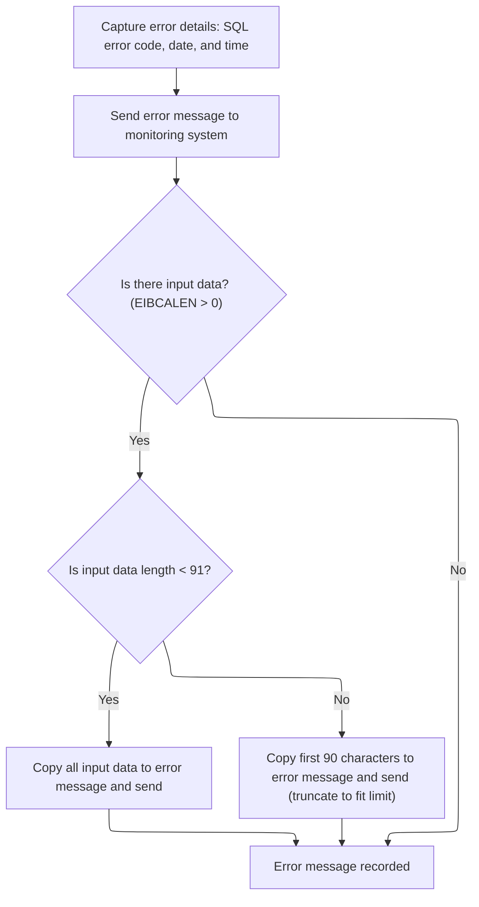

This section ensures that all relevant error and transaction context is captured and logged for monitoring and troubleshooting. It enforces rules about what information is included in the error message and how much transaction data is logged.

| Category       | Rule Name                   | Description                                                                                                                                                                          |
| -------------- | --------------------------- | ------------------------------------------------------------------------------------------------------------------------------------------------------------------------------------ |
| Business logic | Error context completeness  | Every error message must include the SQL error code, the current date, and the current time to provide complete context for troubleshooting.                                         |
| Business logic | Transaction data truncation | If transaction input data (commarea) is present, up to 90 bytes of it must be included in the error message. If the input data exceeds 90 bytes, only the first 90 bytes are logged. |
| Business logic | Dual queue logging          | All error messages must be sent to both the TDQ and TSQ queues to ensure redundancy and availability for monitoring systems.                                                         |
| Business logic | Queue extension routing     | If the error message begins with 'Q=', special routing is applied to extract and handle queue extension information before logging.                                                  |

<SwmSnippet path="/base/src/lgapdb09.cbl" line="619">

---

In <SwmToken path="base/src/lgapdb09.cbl" pos="619:1:5" line-data="       WRITE-ERROR-MESSAGE.">`WRITE-ERROR-MESSAGE`</SwmToken>, we grab the SQL error code, fetch and format the current timestamp, and prep the error message with all relevant context before sending it off for logging.

```cobol
       WRITE-ERROR-MESSAGE.
           MOVE SQLCODE TO EM-SQLRC
           EXEC CICS ASKTIME ABSTIME(ABS-TIME)
           END-EXEC
           EXEC CICS FORMATTIME ABSTIME(ABS-TIME)
                     MMDDYYYY(DATE1)
                     TIME(TIME1)
           END-EXEC
```

---

</SwmSnippet>

<SwmSnippet path="/base/src/lgapdb09.cbl" line="627">

---

After prepping the error message, we call LGSTSQ to log it. If there's commarea data, we send that too, so both generic and request-specific error info gets queued.

```cobol
           MOVE DATE1 TO EM-DATE
           MOVE TIME1 TO EM-TIME
           EXEC CICS LINK PROGRAM('LGSTSQ')
                     COMMAREA(ERROR-MSG)
                     LENGTH(LENGTH OF ERROR-MSG)
           END-EXEC.
```

---

</SwmSnippet>

<SwmSnippet path="/base/src/lgstsq.cbl" line="55">

---

In <SwmToken path="base/src/lgstsq.cbl" pos="55:1:1" line-data="       MAINLINE SECTION.">`MAINLINE`</SwmToken> (LGSTSQ), we prep the message, adjust its length based on source and format, handle special routing if it starts with 'Q=', and write it to both TDQ and TSQ. If the message was received (not invoked), we send a quick response back.

```cobol
       MAINLINE SECTION.

           MOVE SPACES TO WRITE-MSG.
           MOVE SPACES TO WS-RECV.

           EXEC CICS ASSIGN SYSID(WRITE-MSG-SYSID)
                RESP(WS-RESP)
           END-EXEC.

           EXEC CICS ASSIGN INVOKINGPROG(WS-INVOKEPROG)
                RESP(WS-RESP)
           END-EXEC.
           
           IF WS-INVOKEPROG NOT = SPACES
              MOVE 'C' To WS-FLAG
              MOVE COMMA-DATA  TO WRITE-MSG-MSG
              MOVE EIBCALEN    TO WS-RECV-LEN
           ELSE
              EXEC CICS RECEIVE INTO(WS-RECV)
                  LENGTH(WS-RECV-LEN)
                  RESP(WS-RESP)
              END-EXEC
              MOVE 'R' To WS-FLAG
              MOVE WS-RECV-DATA  TO WRITE-MSG-MSG
              SUBTRACT 5 FROM WS-RECV-LEN
           END-IF.

           MOVE 'GENAERRS' TO STSQ-NAME.
           IF WRITE-MSG-MSG(1:2) = 'Q=' THEN
              MOVE WRITE-MSG-MSG(3:4) TO STSQ-EXT
              MOVE WRITE-MSG-REST TO TEMPO
              MOVE TEMPO          TO WRITE-MSG-MSG
              SUBTRACT 7 FROM WS-RECV-LEN
           END-IF.

           ADD 5 TO WS-RECV-LEN.

      * Write output message to TDQ CSMT
      *
           EXEC CICS WRITEQ TD QUEUE(STDQ-NAME)
                     FROM(WRITE-MSG)
                     RESP(WS-RESP)
                     LENGTH(WS-RECV-LEN)

           END-EXEC.

      * Write output message to Genapp TSQ
      * If no space is available then the task will not wait for
      *  storage to become available but will ignore the request...
      *
           EXEC CICS WRITEQ TS QUEUE(STSQ-NAME)
                     FROM(WRITE-MSG)
                     RESP(WS-RESP)
                     NOSUSPEND
                     LENGTH(WS-RECV-LEN)

           END-EXEC.

           If WS-FLAG = 'R' Then
             EXEC CICS SEND TEXT FROM(FILLER-X)
              WAIT
              ERASE
              LENGTH(1)
              FREEKB
             END-EXEC.

           EXEC CICS RETURN
           END-EXEC.
```

---

</SwmSnippet>

<SwmSnippet path="/base/src/lgapdb09.cbl" line="633">

---

After returning from LGSTSQ, <SwmToken path="base/src/lgapdb09.cbl" pos="205:3:7" line-data="               PERFORM WRITE-ERROR-MESSAGE">`WRITE-ERROR-MESSAGE`</SwmToken> checks if there's commarea data and logs up to 90 bytes of it by linking to LGSTSQ again. Anything longer gets truncated, so only the first 90 bytes are logged.

```cobol
           IF EIBCALEN > 0 THEN
             IF EIBCALEN < 91 THEN
               MOVE DFHCOMMAREA(1:EIBCALEN) TO CA-DATA
               EXEC CICS LINK PROGRAM('LGSTSQ')
                         COMMAREA(CA-ERROR-MSG)
                         LENGTH(LENGTH OF CA-ERROR-MSG)
               END-EXEC
             ELSE
               MOVE DFHCOMMAREA(1:90) TO CA-DATA
               EXEC CICS LINK PROGRAM('LGSTSQ')
                         COMMAREA(CA-ERROR-MSG)
                         LENGTH(LENGTH OF CA-ERROR-MSG)
               END-EXEC
             END-IF
           END-IF.
           EXIT.
```

---

</SwmSnippet>

## Validating and Preparing Policy Request

```mermaid
%%{init: {"flowchart": {"defaultRenderer": "elk"}} }%%
flowchart TD
    node1["Start: Prepare request and set up customer/policy values"]
    click node1 openCode "base/src/lgapdb09.cbl:209:216"
    node1 --> node2{"What type of policy is requested?"}
    click node2 openCode "base/src/lgapdb09.cbl:218:240"
    node2 -->|"Endowment (01AEND)"| node3["Add Endowment data length; Set policy type to Endowment"]
    click node3 openCode "base/src/lgapdb09.cbl:220:222"
    node2 -->|"House (01AHOU)"| node4["Add House data length; Set policy type to House"]
    click node4 openCode "base/src/lgapdb09.cbl:224:226"
    node2 -->|"Motor (01AMOT)"| node5["Add Motor data length; Set policy type to Motor"]
    click node5 openCode "base/src/lgapdb09.cbl:228:230"
    node2 -->|"Commission (01ACOM)"| node6["Add Commission data length; Set policy type to Commission"]
    click node6 openCode "base/src/lgapdb09.cbl:232:234"
    node2 -->|"Other"| node7["Set return code to '99' (invalid request); End"]
    click node7 openCode "base/src/lgapdb09.cbl:236:238"
    node3 --> node8{"Is incoming data area sufficient for request?"}
    click node8 openCode "base/src/lgapdb09.cbl:242:245"
    node4 --> node8
    node5 --> node8
    node6 --> node8
    node8 -->|"Yes"| node9["Continue processing"]
    click node9 openCode "base/src/lgapdb09.cbl:240:241"
    node8 -->|"No"| node10["Set return code to '98' (insufficient data); End"]
    click node10 openCode "base/src/lgapdb09.cbl:243:244"
classDef HeadingStyle fill:#777777,stroke:#333,stroke-width:2px;

%% Swimm:
%% %%{init: {"flowchart": {"defaultRenderer": "elk"}} }%%
%% flowchart TD
%%     node1["Start: Prepare request and set up customer/policy values"]
%%     click node1 openCode "<SwmPath>[base/src/lgapdb09.cbl](base/src/lgapdb09.cbl)</SwmPath>:209:216"
%%     node1 --> node2{"What type of policy is requested?"}
%%     click node2 openCode "<SwmPath>[base/src/lgapdb09.cbl](base/src/lgapdb09.cbl)</SwmPath>:218:240"
%%     node2 -->|"Endowment (<SwmToken path="base/src/lgapdb09.cbl" pos="220:4:4" line-data="             WHEN &#39;01AEND&#39;">`01AEND`</SwmToken>)"| node3["Add Endowment data length; Set policy type to Endowment"]
%%     click node3 openCode "<SwmPath>[base/src/lgapdb09.cbl](base/src/lgapdb09.cbl)</SwmPath>:220:222"
%%     node2 -->|"House (<SwmToken path="base/src/lgapdb09.cbl" pos="224:4:4" line-data="             WHEN &#39;01AHOU&#39;">`01AHOU`</SwmToken>)"| node4["Add House data length; Set policy type to House"]
%%     click node4 openCode "<SwmPath>[base/src/lgapdb09.cbl](base/src/lgapdb09.cbl)</SwmPath>:224:226"
%%     node2 -->|"Motor (<SwmToken path="base/src/lgapdb09.cbl" pos="228:4:4" line-data="             WHEN &#39;01AMOT&#39;">`01AMOT`</SwmToken>)"| node5["Add Motor data length; Set policy type to Motor"]
%%     click node5 openCode "<SwmPath>[base/src/lgapdb09.cbl](base/src/lgapdb09.cbl)</SwmPath>:228:230"
%%     node2 -->|"Commission (<SwmToken path="base/src/lgapdb09.cbl" pos="232:4:4" line-data="             WHEN &#39;01ACOM&#39;">`01ACOM`</SwmToken>)"| node6["Add Commission data length; Set policy type to Commission"]
%%     click node6 openCode "<SwmPath>[base/src/lgapdb09.cbl](base/src/lgapdb09.cbl)</SwmPath>:232:234"
%%     node2 -->|"Other"| node7["Set return code to '99' (invalid request); End"]
%%     click node7 openCode "<SwmPath>[base/src/lgapdb09.cbl](base/src/lgapdb09.cbl)</SwmPath>:236:238"
%%     node3 --> node8{"Is incoming data area sufficient for request?"}
%%     click node8 openCode "<SwmPath>[base/src/lgapdb09.cbl](base/src/lgapdb09.cbl)</SwmPath>:242:245"
%%     node4 --> node8
%%     node5 --> node8
%%     node6 --> node8
%%     node8 -->|"Yes"| node9["Continue processing"]
%%     click node9 openCode "<SwmPath>[base/src/lgapdb09.cbl](base/src/lgapdb09.cbl)</SwmPath>:240:241"
%%     node8 -->|"No"| node10["Set return code to '98' (insufficient data); End"]
%%     click node10 openCode "<SwmPath>[base/src/lgapdb09.cbl](base/src/lgapdb09.cbl)</SwmPath>:243:244"
%% classDef HeadingStyle fill:#777777,stroke:#333,stroke-width:2px;
```

<SwmSnippet path="/base/src/lgapdb09.cbl" line="209">

---

We figure out how much input data we need for the current policy type.

```cobol
           MOVE '00' TO CA-RETURN-CODE
           SET WS-ADDR-DFHCOMMAREA TO ADDRESS OF DFHCOMMAREA.

           MOVE CA-CUSTOMER-NUM TO DB2-CUSTOMERNUM-INT
           MOVE ZERO            TO DB2-C-PolicyNum-INT
           MOVE CA-CUSTOMER-NUM TO EM-CUSNUM

           ADD WS-CA-HEADER-LEN TO WS-REQUIRED-CA-LEN
```

---

</SwmSnippet>

<SwmSnippet path="/base/src/lgapdb09.cbl" line="218">

---

Here we branch based on the request ID, adding the right policy-specific length and setting the <SwmToken path="base/src/lgapdb09.cbl" pos="222:9:9" line-data="               MOVE &#39;E&#39; TO DB2-POLICYTYPE">`DB2`</SwmToken> policy type for each insurance product.

```cobol
           EVALUATE CA-REQUEST-ID

             WHEN '01AEND'
               ADD WS-FULL-ENDOW-LEN TO WS-REQUIRED-CA-LEN
               MOVE 'E' TO DB2-POLICYTYPE
```

---

</SwmSnippet>

<SwmSnippet path="/base/src/lgapdb09.cbl" line="224">

---

For each policy type, we add its specific length to the required input size and set the <SwmToken path="base/src/lgapdb09.cbl" pos="226:9:9" line-data="               MOVE &#39;H&#39; TO DB2-POLICYTYPE">`DB2`</SwmToken> policy type. This keeps the input validation tight for each product.

```cobol
             WHEN '01AHOU'
               ADD WS-FULL-HOUSE-LEN TO WS-REQUIRED-CA-LEN
               MOVE 'H' TO DB2-POLICYTYPE

             WHEN '01AMOT'
               ADD WS-FULL-MOTOR-LEN TO WS-REQUIRED-CA-LEN
               MOVE 'M' TO DB2-POLICYTYPE

             WHEN '01ACOM'
               ADD WS-FULL-COMM-LEN TO WS-REQUIRED-CA-LEN
               MOVE 'C' TO DB2-POLICYTYPE
```

---

</SwmSnippet>

<SwmSnippet path="/base/src/lgapdb09.cbl" line="236">

---

If the request ID doesn't match any known type, we bail out with an error code and return control.

```cobol
             WHEN OTHER
               MOVE '99' TO CA-RETURN-CODE
               EXEC CICS RETURN END-EXEC

           END-EVALUATE
```

---

</SwmSnippet>

<SwmSnippet path="/base/src/lgapdb09.cbl" line="242">

---

If the input data is shorter than needed, we set an error code and return, blocking any further work.

```cobol
           IF EIBCALEN IS LESS THAN WS-REQUIRED-CA-LEN
             MOVE '98' TO CA-RETURN-CODE
             EXEC CICS RETURN END-EXEC
           END-IF
```

---

</SwmSnippet>

<SwmSnippet path="/base/src/lgapdb09.cbl" line="247">

---

Once input is validated, we call <SwmToken path="base/src/lgapdb09.cbl" pos="247:3:5" line-data="           PERFORM P100-T">`P100-T`</SwmToken> to insert the main policy record into the database.

```cobol
           PERFORM P100-T
```

---

</SwmSnippet>

## Inserting Main Policy Record

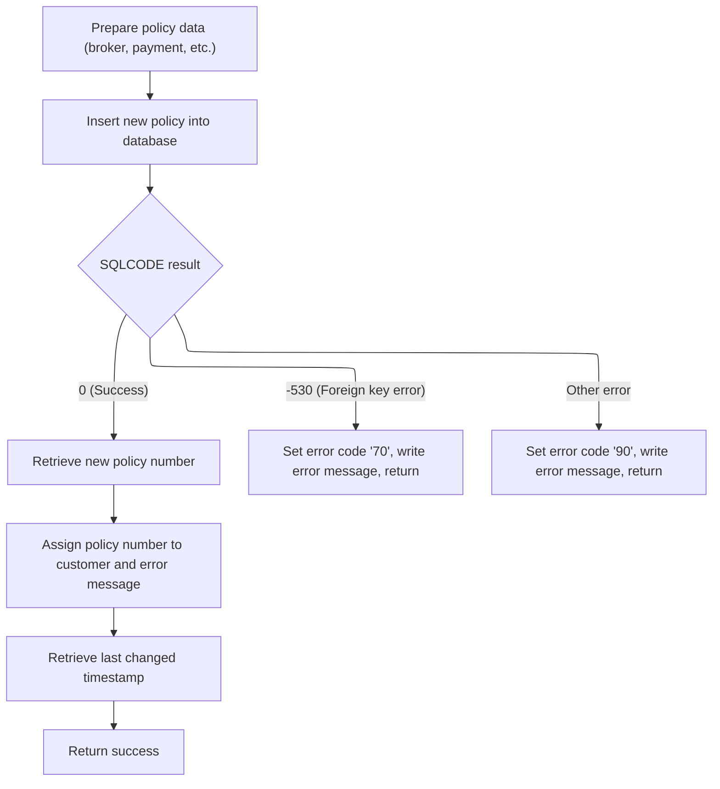

This section governs the creation of a new main policy record in the system, ensuring all required data is present, handling errors, and returning key identifiers for downstream processes.

| Category        | Rule Name                            | Description                                                                                                                                                                             |
| --------------- | ------------------------------------ | --------------------------------------------------------------------------------------------------------------------------------------------------------------------------------------- |
| Data validation | Required policy data validation      | A new policy record must only be created if all required fields (customer number, issue date, expiry date, policy type, broker ID, broker's reference, payment) are provided and valid. |
| Business logic  | Return policy identifiers on success | If the policy record is successfully inserted, the system must retrieve and return the new policy number and the last changed timestamp to the calling process.                         |
| Business logic  | Unique policy number assignment      | The policy number assigned to the new record must be unique and generated by the database using its identity mechanism.                                                                 |

<SwmSnippet path="/base/src/lgapdb09.cbl" line="281">

---

In <SwmToken path="base/src/lgapdb09.cbl" pos="281:1:3" line-data="       P100-T.">`P100-T`</SwmToken>, we prep the <SwmToken path="base/src/lgapdb09.cbl" pos="283:9:9" line-data="           MOVE CA-BROKERID TO DB2-BROKERID-INT">`DB2`</SwmToken> host variables and run the SQL insert to add the main policy record with all the required fields.

```cobol
       P100-T.

           MOVE CA-BROKERID TO DB2-BROKERID-INT
           MOVE CA-PAYMENT TO DB2-PAYMENT-INT

           MOVE ' INSERT POLICY' TO EM-SQLREQ
           EXEC SQL
             INSERT INTO POLICY
                       ( POLICYNUMBER,
                         CUSTOMERNUMBER,
                         ISSUEDATE,
                         EXPIRYDATE,
                         POLICYTYPE,
                         LASTCHANGED,
                         BROKERID,
                         BROKERSREFERENCE,
                         PAYMENT           )
                VALUES ( DEFAULT,
                         :DB2-CUSTOMERNUM-INT,
                         :CA-ISSUE-DATE,
                         :CA-EXPIRY-DATE,
                         :DB2-POLICYTYPE,
                         CURRENT TIMESTAMP,
                         :DB2-BROKERID-INT,
                         :CA-BROKERSREF,
                         :DB2-PAYMENT-INT      )
           END-EXEC
```

---

</SwmSnippet>

<SwmSnippet path="/base/src/lgapdb09.cbl" line="309">

---

After the insert, we check SQLCODE. If there's an error, we log it with <SwmToken path="base/src/lgapdb09.cbl" pos="316:3:7" line-data="               PERFORM WRITE-ERROR-MESSAGE">`WRITE-ERROR-MESSAGE`</SwmToken> and bail out to prevent bad data.

```cobol
           Evaluate SQLCODE

             When 0
               MOVE '00' TO CA-RETURN-CODE

             When -530
               MOVE '70' TO CA-RETURN-CODE
               PERFORM WRITE-ERROR-MESSAGE
               EXEC CICS RETURN END-EXEC

             When Other
               MOVE '90' TO CA-RETURN-CODE
               PERFORM WRITE-ERROR-MESSAGE
               EXEC CICS RETURN END-EXEC

           END-Evaluate.
```

---

</SwmSnippet>

<SwmSnippet path="/base/src/lgapdb09.cbl" line="326">

---

After error handling in <SwmToken path="base/src/lgapdb09.cbl" pos="247:3:5" line-data="           PERFORM P100-T">`P100-T`</SwmToken>, we grab the new policy number from <SwmToken path="base/src/lgapdb09.cbl" pos="327:4:4" line-data="             SET :DB2-POLICYNUM-INT = IDENTITY_VAL_LOCAL()">`DB2`</SwmToken> if the insert worked.

```cobol
           EXEC SQL
             SET :DB2-POLICYNUM-INT = IDENTITY_VAL_LOCAL()
           END-EXEC
```

---

</SwmSnippet>

<SwmSnippet path="/base/src/lgapdb09.cbl" line="329">

---

We return the new policy number and timestamp.

```cobol
           MOVE DB2-POLICYNUM-INT TO CA-POLICY-NUM
           MOVE CA-POLICY-NUM TO EM-POLNUM

           EXEC SQL
             SELECT LASTCHANGED
               INTO :CA-LASTCHANGED
               FROM POLICY
               WHERE POLICYNUMBER = :DB2-POLICYNUM-INT
           END-EXEC.
           EXIT.
```

---

</SwmSnippet>

## Branching to Policy-Specific Insert

```mermaid
%%{init: {"flowchart": {"defaultRenderer": "elk"}} }%%
flowchart TD
    node1{"What is the request type?"}
    click node1 openCode "base/src/lgapdb09.cbl:249:266"
    node1 -->|"Endowment (01AEND)"| node2["Process Endowment Policy"]
    click node2 openCode "base/src/lgapdb09.cbl:252:252"
    node1 -->|"House (01AHOU)"| node3["Process House Policy"]
    click node3 openCode "base/src/lgapdb09.cbl:255:255"
    node1 -->|"Motor (01AMOT)"| node4["Process Motor Policy"]
    click node4 openCode "base/src/lgapdb09.cbl:258:258"
    node1 -->|"Business (01ACOM)"| node5["Process Business Policy"]
    click node5 openCode "base/src/lgapdb09.cbl:261:261"
    node1 -->|"Other"| node6["Set CA-RETURN-CODE to '99' (Unknown request)"]
    click node6 openCode "base/src/lgapdb09.cbl:264:264"

classDef HeadingStyle fill:#777777,stroke:#333,stroke-width:2px;

%% Swimm:
%% %%{init: {"flowchart": {"defaultRenderer": "elk"}} }%%
%% flowchart TD
%%     node1{"What is the request type?"}
%%     click node1 openCode "<SwmPath>[base/src/lgapdb09.cbl](base/src/lgapdb09.cbl)</SwmPath>:249:266"
%%     node1 -->|"Endowment (<SwmToken path="base/src/lgapdb09.cbl" pos="220:4:4" line-data="             WHEN &#39;01AEND&#39;">`01AEND`</SwmToken>)"| node2["Process Endowment Policy"]
%%     click node2 openCode "<SwmPath>[base/src/lgapdb09.cbl](base/src/lgapdb09.cbl)</SwmPath>:252:252"
%%     node1 -->|"House (<SwmToken path="base/src/lgapdb09.cbl" pos="224:4:4" line-data="             WHEN &#39;01AHOU&#39;">`01AHOU`</SwmToken>)"| node3["Process House Policy"]
%%     click node3 openCode "<SwmPath>[base/src/lgapdb09.cbl](base/src/lgapdb09.cbl)</SwmPath>:255:255"
%%     node1 -->|"Motor (<SwmToken path="base/src/lgapdb09.cbl" pos="228:4:4" line-data="             WHEN &#39;01AMOT&#39;">`01AMOT`</SwmToken>)"| node4["Process Motor Policy"]
%%     click node4 openCode "<SwmPath>[base/src/lgapdb09.cbl](base/src/lgapdb09.cbl)</SwmPath>:258:258"
%%     node1 -->|"Business (<SwmToken path="base/src/lgapdb09.cbl" pos="232:4:4" line-data="             WHEN &#39;01ACOM&#39;">`01ACOM`</SwmToken>)"| node5["Process Business Policy"]
%%     click node5 openCode "<SwmPath>[base/src/lgapdb09.cbl](base/src/lgapdb09.cbl)</SwmPath>:261:261"
%%     node1 -->|"Other"| node6["Set <SwmToken path="base/src/lgapdb09.cbl" pos="209:9:13" line-data="           MOVE &#39;00&#39; TO CA-RETURN-CODE">`CA-RETURN-CODE`</SwmToken> to '99' (Unknown request)"]
%%     click node6 openCode "<SwmPath>[base/src/lgapdb09.cbl](base/src/lgapdb09.cbl)</SwmPath>:264:264"
%% 
%% classDef HeadingStyle fill:#777777,stroke:#333,stroke-width:2px;
```

<SwmSnippet path="/base/src/lgapdb09.cbl" line="249">

---

Back in MAINLINE after <SwmToken path="base/src/lgapdb09.cbl" pos="247:3:5" line-data="           PERFORM P100-T">`P100-T`</SwmToken>, we branch to the right insert routine for the policy type, like <SwmToken path="base/src/lgapdb09.cbl" pos="252:3:5" line-data="               PERFORM P200-E">`P200-E`</SwmToken> for endowment, based on the request code.

```cobol
           EVALUATE CA-REQUEST-ID

             WHEN '01AEND'
               PERFORM P200-E

             WHEN '01AHOU'
               PERFORM P300-H

             WHEN '01AMOT'
               PERFORM P400-M

             WHEN '01ACOM'
               PERFORM P500-BIZ

             WHEN OTHER
               MOVE '99' TO CA-RETURN-CODE

           END-EVALUATE
```

---

</SwmSnippet>

## Inserting Endowment Policy Data

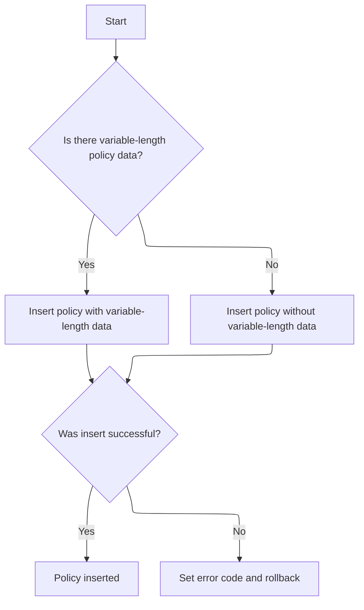

This section governs the insertion of endowment policy data into the database, ensuring that both standard and optional variable-length fields are handled correctly, and that errors are managed to maintain data integrity.

| Category        | Rule Name                      | Description                                                                                                                                                     |
| --------------- | ------------------------------ | --------------------------------------------------------------------------------------------------------------------------------------------------------------- |
| Data validation | Numeric field conversion       | All numeric fields in the input must be converted to the appropriate integer format before insertion into the database.                                         |
| Data validation | SQL request identification     | The SQL request type must be set to 'INSERT ENDOW' before attempting to insert the endowment policy record.                                                     |
| Business logic  | Variable-length data inclusion | If the input policy data contains extra variable-length information, this data must be included in the endowment policy record when inserted into the database. |
| Business logic  | Standard field insertion       | If the input policy data does not contain extra variable-length information, only the standard fields are included in the endowment policy record.              |

<SwmSnippet path="/base/src/lgapdb09.cbl" line="343">

---

In <SwmToken path="base/src/lgapdb09.cbl" pos="343:1:3" line-data="       P200-E.">`P200-E`</SwmToken>, we prep integer fields and check for extra variable-length data. If present, we include it in the SQL insert for the endowment record.

```cobol
       P200-E.

      *    Move numeric fields to integer format
           MOVE CA-E-TERM        TO DB2-E-TERM-SINT
           MOVE CA-E-SUM-ASSURED TO DB2-E-SUMASSURED-INT

           MOVE ' INSERT ENDOW ' TO EM-SQLREQ
      *----------------------------------------------------------------*
      *    There are 2 versions of INSERT...                           *
      *      one which updates all fields including Varchar            *
      *      one which updates all fields Except Varchar               *
      *----------------------------------------------------------------*
           SUBTRACT WS-REQUIRED-CA-LEN FROM EIBCALEN
               GIVING WS-VARY-LEN
```

---

</SwmSnippet>

<SwmSnippet path="/base/src/lgapdb09.cbl" line="358">

---

If there's extra data, we move it to a buffer and include it in the endowment insert. The SQL statement adapts to include the variable field.

```cobol
           IF WS-VARY-LEN IS GREATER THAN ZERO
      *       Commarea contains data for Varchar field
              MOVE CA-E-PADDING-DATA
                  TO WS-VARY-CHAR(1:WS-VARY-LEN)
              EXEC SQL
                INSERT INTO ENDOWMENT
                          ( POLICYNUMBER,
                            WITHPROFITS,
                            EQUITIES,
                            MANAGEDFUND,
                            FUNDNAME,
                            TERM,
                            SUMASSURED,
                            LIFEASSURED,
                            PADDINGDATA    )
                   VALUES ( :DB2-POLICYNUM-INT,
                            :CA-E-W-PRO,
                            :CA-E-EQU,
                            :CA-E-M-FUN,
                            :CA-E-FUND-NAME,
                            :DB2-E-TERM-SINT,
                            :DB2-E-SUMASSURED-INT,
                            :CA-E-LIFE-ASSURED,
                            :WS-VARY-FIELD )
              END-EXEC
```

---

</SwmSnippet>

<SwmSnippet path="/base/src/lgapdb09.cbl" line="383">

---

If there's no extra data, we just run the standard insert for the endowment record, skipping the variable field.

```cobol
           ELSE
              EXEC SQL
                INSERT INTO ENDOWMENT
                          ( POLICYNUMBER,
                            WITHPROFITS,
                            EQUITIES,
                            MANAGEDFUND,
                            FUNDNAME,
                            TERM,
                            SUMASSURED,
                            LIFEASSURED    )
                   VALUES ( :DB2-POLICYNUM-INT,
                            :CA-E-W-PRO,
                            :CA-E-EQU,
                            :CA-E-M-FUN,
                            :CA-E-FUND-NAME,
                            :DB2-E-TERM-SINT,
                            :DB2-E-SUMASSURED-INT,
                            :CA-E-LIFE-ASSURED )
              END-EXEC
```

---

</SwmSnippet>

<SwmSnippet path="/base/src/lgapdb09.cbl" line="405">

---

If the endowment insert fails, we log the error and abend to roll back any changes, keeping the data clean.

```cobol
           IF SQLCODE NOT EQUAL 0
             MOVE '90' TO CA-RETURN-CODE
             PERFORM WRITE-ERROR-MESSAGE
      *      Issue Abend to cause backout of update to Policy table
             EXEC CICS ABEND ABCODE('LGSQ') NODUMP END-EXEC
             EXEC CICS RETURN END-EXEC
           END-IF.

           EXIT.
```

---

</SwmSnippet>

## Inserting House Policy Data

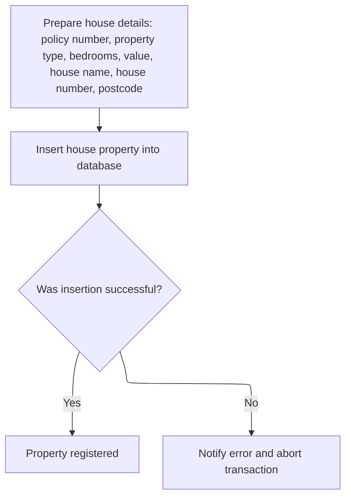

This section governs the process of registering a new house property for an insurance policy. It ensures that all necessary details are provided, attempts to insert the property into the database, and handles errors if the insertion fails.

| Category        | Rule Name                     | Description                                                                                                                                                             |
| --------------- | ----------------------------- | ----------------------------------------------------------------------------------------------------------------------------------------------------------------------- |
| Data validation | Mandatory house policy fields | All required house policy fields (policy number, property type, bedrooms, value, house name, house number, postcode) must be provided before attempting registration.   |
| Data validation | Eligibility for registration  | Only properties with valid and complete data are eligible for registration; any attempt to register incomplete or invalid data must be rejected.                        |
| Business logic  | Property registration attempt | The system must attempt to register the house property in the database using the provided details. If successful, the property is considered registered for the policy. |

<SwmSnippet path="/base/src/lgapdb09.cbl" line="415">

---

In <SwmToken path="base/src/lgapdb09.cbl" pos="415:1:3" line-data="       P300-H.">`P300-H`</SwmToken>, we prep the <SwmToken path="base/src/lgapdb09.cbl" pos="417:11:11" line-data="           MOVE CA-H-VAL       TO DB2-H-VALUE-INT">`DB2`</SwmToken> host variables and run the SQL insert to add the house record with all the required fields from the input.

```cobol
       P300-H.

           MOVE CA-H-VAL       TO DB2-H-VALUE-INT
           MOVE CA-H-BED    TO DB2-H-BEDROOMS-SINT

           MOVE ' INSERT HOUSE ' TO EM-SQLREQ
           EXEC SQL
             INSERT INTO HOUSE
                       ( POLICYNUMBER,
                         PROPERTYTYPE,
                         BEDROOMS,
                         VALUE,
                         HOUSENAME,
                         HOUSENUMBER,
                         POSTCODE          )
                VALUES ( :DB2-POLICYNUM-INT,
                         :CA-H-P-TYP,
                         :DB2-H-BEDROOMS-SINT,
                         :DB2-H-VALUE-INT,
                         :CA-H-H-NAM,
                         :CA-H-HOUSE-NUMBER,
                         :CA-H-PCD      )
           END-EXEC
```

---

</SwmSnippet>

<SwmSnippet path="/base/src/lgapdb09.cbl" line="439">

---

If the house insert fails, we log the error and abend with repo-specific codes to roll back and track the issue.

```cobol
           IF SQLCODE NOT EQUAL 0
             MOVE '90' TO CA-RETURN-CODE
             PERFORM WRITE-ERROR-MESSAGE
             EXEC CICS ABEND ABCODE('LGSQ') NODUMP END-EXEC
             EXEC CICS RETURN END-EXEC
           END-IF.

           EXIT.
```

---

</SwmSnippet>

## Inserting Motor Policy Data

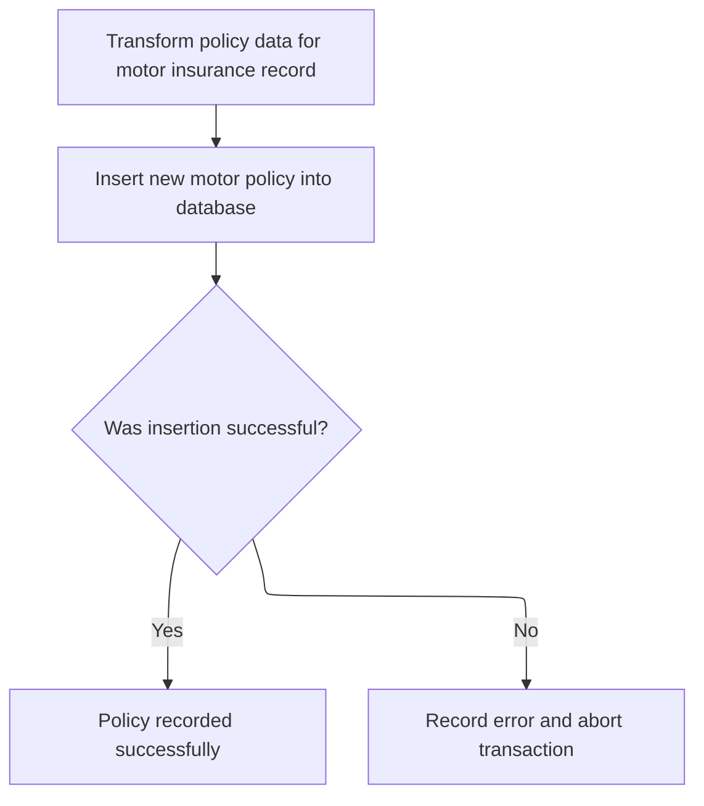

This section is responsible for transforming and inserting motor insurance policy data into the database, ensuring that all required fields are present and that errors are handled according to business requirements.

| Category        | Rule Name                    | Description                                                                                                                                                                                             |
| --------------- | ---------------------------- | ------------------------------------------------------------------------------------------------------------------------------------------------------------------------------------------------------- |
| Data validation | Required motor policy fields | All required motor policy fields (policy number, make, model, value, registration number, colour, engine capacity, year of manufacture, premium, accidents) must be present and valid before insertion. |
| Business logic  | Successful policy recording  | A successful insertion must result in the motor policy being available for future queries and business processes.                                                                                       |

<SwmSnippet path="/base/src/lgapdb09.cbl" line="448">

---

In <SwmToken path="base/src/lgapdb09.cbl" pos="448:1:3" line-data="       P400-M.">`P400-M`</SwmToken>, we prep the <SwmToken path="base/src/lgapdb09.cbl" pos="451:11:11" line-data="           MOVE CA-M-VALUE       TO DB2-M-VALUE-INT">`DB2`</SwmToken> host variables and run the SQL insert to add the motor record with all the required fields from the input.

```cobol
       P400-M.

      *    Move numeric fields to integer format
           MOVE CA-M-VALUE       TO DB2-M-VALUE-INT
           MOVE CA-M-CC          TO DB2-M-CC-SINT
           MOVE CA-M-PREMIUM     TO DB2-M-PREMIUM-INT
           MOVE CA-M-ACCIDENTS   TO DB2-M-ACCIDENTS-INT

           MOVE ' INSERT MOTOR ' TO EM-SQLREQ
           EXEC SQL
             INSERT INTO MOTOR
                       ( POLICYNUMBER,
                         MAKE,
                         MODEL,
                         VALUE,
                         REGNUMBER,
                         COLOUR,
                         CC,
                         YEAROFMANUFACTURE,
                         PREMIUM,
                         ACCIDENTS )
                VALUES ( :DB2-POLICYNUM-INT,
                         :CA-M-MAKE,
                         :CA-M-MODEL,
                         :DB2-M-VALUE-INT,
                         :CA-M-REGNUMBER,
                         :CA-M-COLOUR,
                         :DB2-M-CC-SINT,
                         :CA-M-MANUFACTURED,
                         :DB2-M-PREMIUM-INT,
                         :DB2-M-ACCIDENTS-INT )
           END-EXEC
```

---

</SwmSnippet>

<SwmSnippet path="/base/src/lgapdb09.cbl" line="481">

---

If the motor insert fails, we log the error and abend with repo-specific codes to roll back and track the issue.

```cobol
           IF SQLCODE NOT EQUAL 0
             MOVE '90' TO CA-RETURN-CODE
             PERFORM WRITE-ERROR-MESSAGE
             EXEC CICS ABEND ABCODE('LGSQ') NODUMP END-EXEC
             EXEC CICS RETURN END-EXEC
           END-IF.

           EXIT.
```

---

</SwmSnippet>

## Calculating and Inserting Commercial Policy Data

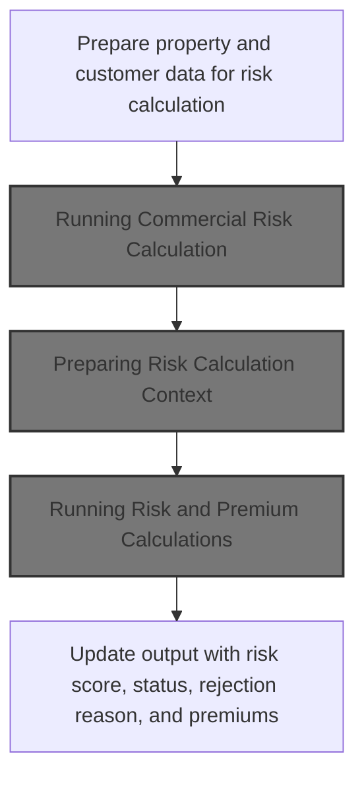

This section is responsible for calculating the commercial insurance risk and premiums for a given property and customer, and updating the output with the results including risk score, policy status, rejection reason, and premium values.

| Category        | Rule Name                           | Description                                                                                                                                                                                               |
| --------------- | ----------------------------------- | --------------------------------------------------------------------------------------------------------------------------------------------------------------------------------------------------------- |
| Data validation | Mandatory field validation          | All required property and customer fields must be present and valid before risk calculation is performed. Missing or invalid data will result in rejection of the calculation.                            |
| Business logic  | Risk score calculation              | The risk score is calculated based on property type, postcode, and multiple risk factors (FP, CP, FLP, WP). The score determines the insurance premium and policy status.                                 |
| Business logic  | Premium calculation per risk factor | Premiums for FP, CP, FLP, and WP factors are calculated individually and must be included in the output. Each premium is determined by the corresponding risk factor and the overall risk score.          |
| Business logic  | Policy status determination         | The policy status is set based on the calculated risk score and predefined thresholds. If the risk score exceeds rejection criteria, the policy is marked as rejected and a rejection reason is provided. |
| Technical step  | Output data update                  | All calculated outputs (risk score, premiums, status, rejection reason) must be updated in the output data structure for downstream processing and reporting.                                             |

<SwmSnippet path="/base/src/lgapdb09.cbl" line="493">

---

In <SwmToken path="base/src/lgapdb09.cbl" pos="493:1:3" line-data="       P500-BIZ SECTION.">`P500-BIZ`</SwmToken>, we prep all the risk and property fields needed for commercial risk calculation and premium computation.

```cobol
       P500-BIZ SECTION.
           MOVE CA-CUSTOMER-NUM TO WS-XCUSTID
           MOVE CA-POLICY-NUM TO WS-XPOLNUM
           MOVE CA-B-PropType TO WS-XPROPTYPE
           MOVE CA-B-PST TO WS-XPOSTCODE
           MOVE CA-B-FP TO WS-XFP-FACTOR
           MOVE CA-B-CP TO WS-XCP-FACTOR
           MOVE CA-B-FLP TO WS-XFLP-FACTOR
           MOVE CA-B-WP TO WS-XWP-FACTOR
           MOVE CA-B-Address TO WS-XADDRESS
           MOVE CA-B-Latitude TO WS-XLAT
           MOVE CA-B-Longitude TO WS-XLONG
           MOVE CA-B-Customer TO WS-XCUSTNAME
           MOVE CA-ISSUE-DATE TO WS-XISSUE
           MOVE CA-EXPIRY-DATE TO WS-XEXPIRY
           MOVE CA-LASTCHANGED TO WS-XLASTCHG
```

---

</SwmSnippet>

<SwmSnippet path="/base/src/lgapdb09.cbl" line="510">

---

After prepping the risk data, we call LGCOMCAL to run the risk and premium calculations for the commercial policy.

```cobol
           EXEC CICS LINK PROGRAM('LGCOMCAL')
                COMMAREA(WS-COMM-RISK-AREA)
                LENGTH(LENGTH OF WS-COMM-RISK-AREA)
           END-EXEC
```

---

</SwmSnippet>

### Running Commercial Risk Calculation

This section is responsible for calculating commercial risk and determining the associated premium based on provided input data. It ensures that all necessary initialization and cleanup steps are performed, and that results are accurately transferred to the output area.

| Category        | Rule Name                    | Description                                                                                                                                           |
| --------------- | ---------------------------- | ----------------------------------------------------------------------------------------------------------------------------------------------------- |
| Data validation | Input Data Validation        | All required input data fields must be present and valid before risk and premium calculations are performed.                                          |
| Business logic  | Risk Model Compliance        | Risk scores must be calculated using the latest approved risk model and factors as defined by the business.                                           |
| Business logic  | Premium Calculation Accuracy | Premium amounts must be determined based on the calculated risk score and the selected coverage options, following the business’s pricing guidelines. |
| Technical step  | Result Transfer Requirement  | All calculated results must be transferred to the designated output area before the process exits.                                                    |

<SwmSnippet path="/base/src/lgcomcal.cbl" line="206">

---

In <SwmToken path="base/src/lgcomcal.cbl" pos="206:1:1" line-data="       MAINLINE SECTION.">`MAINLINE`</SwmToken> (LGCOMCAL), we run initialization, process the risk and premium calculations, and then transfer results to the output area before exiting.

```cobol
       MAINLINE SECTION.
           
           PERFORM INITIALIZE-PROCESSING.
           PERFORM PROCESS-BUSINESS-LOGIC.
           PERFORM CLEANUP-AND-EXIT.
```

---

</SwmSnippet>

### Preparing Risk Calculation Context

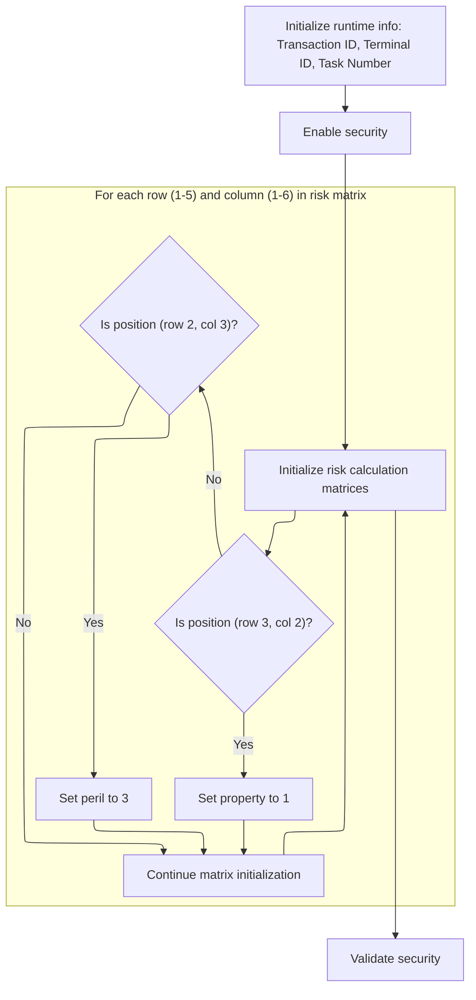

This section ensures all necessary context and mappings are correctly set up before risk calculation logic is run. It guarantees that only the required risk matrix positions are set, security is enabled, and runtime info is captured for traceability.

| Category        | Rule Name                       | Description                                                                                                                                                 |
| --------------- | ------------------------------- | ----------------------------------------------------------------------------------------------------------------------------------------------------------- |
| Data validation | Runtime info capture            | The transaction ID, terminal ID, and task number must be captured from the current environment and stored in the risk calculation context for traceability. |
| Data validation | Security enablement             | Security must be enabled before any risk calculation context is prepared.                                                                                   |
| Data validation | Security validation             | Security validation must be performed after context preparation to ensure all security requirements are met before risk logic is executed.                  |
| Business logic  | Risk matrix property assignment | Only the risk matrix position at row 3, column 2 must have its property value set to 1; all other positions remain unchanged unless specified.              |
| Business logic  | Risk matrix peril assignment    | Only the risk matrix position at row 2, column 3 must have its peril value set to 3; all other positions remain unchanged unless specified.                 |

<SwmSnippet path="/base/src/lgcomcal.cbl" line="217">

---

We prep all context and mappings before running the risk logic.

```cobol
       INITIALIZE-PROCESSING.
           INITIALIZE WS-HEADER.
           MOVE EIBTRNID TO WS-TRANSID.
           MOVE EIBTRMID TO WS-TERMID.
           MOVE EIBTASKN TO WS-TASKNUM.
           
           PERFORM INITIALIZE-MATRICES.
           
           INITIALIZE WS-RISK-CALC.
           
           PERFORM INIT-SECURITY-VALIDATION.
           
           EXIT.
```

---

</SwmSnippet>

<SwmSnippet path="/base/src/lgcomcal.cbl" line="233">

---

<SwmToken path="base/src/lgcomcal.cbl" pos="233:1:3" line-data="       INITIALIZE-MATRICES.">`INITIALIZE-MATRICES`</SwmToken> just sets up a couple of flags in the risk mapping area. It flips <SwmToken path="base/src/lgcomcal.cbl" pos="234:9:13" line-data="           MOVE &#39;Y&#39; TO WS-SEC-ENABLED.">`WS-SEC-ENABLED`</SwmToken> to 'Y' and then runs through two nested loops, but only sets <SwmToken path="base/src/lgcomcal.cbl" pos="243:7:11" line-data="                      MOVE 1 TO WS-RM-PROP">`WS-RM-PROP`</SwmToken> to 1 at (3,2) and <SwmToken path="base/src/lgcomcal.cbl" pos="246:7:11" line-data="                      MOVE 3 TO WS-RM-PERIL">`WS-RM-PERIL`</SwmToken> to 3 at (2,3). The rest of the matrix is untouched, so it's not a full initialization—just prepping the bits needed for later risk logic.

```cobol
       INITIALIZE-MATRICES.
           MOVE 'Y' TO WS-SEC-ENABLED.
           MOVE 1 TO WS-SUB-1.
           
           PERFORM VARYING WS-SUB-1 FROM 1 BY 1 
             UNTIL WS-SUB-1 > 5
               MOVE 0 TO WS-SUB-2
               PERFORM VARYING WS-SUB-2 FROM 1 BY 1 
                 UNTIL WS-SUB-2 > 6
                   IF WS-SUB-1 = 3 AND WS-SUB-2 = 2
                      MOVE 1 TO WS-RM-PROP
                   END-IF
                   IF WS-SUB-1 = 2 AND WS-SUB-2 = 3
                      MOVE 3 TO WS-RM-PERIL
                   END-IF
               END-PERFORM
           END-PERFORM.
           
           EXIT.
```

---

</SwmSnippet>

### Running Risk and Premium Calculations

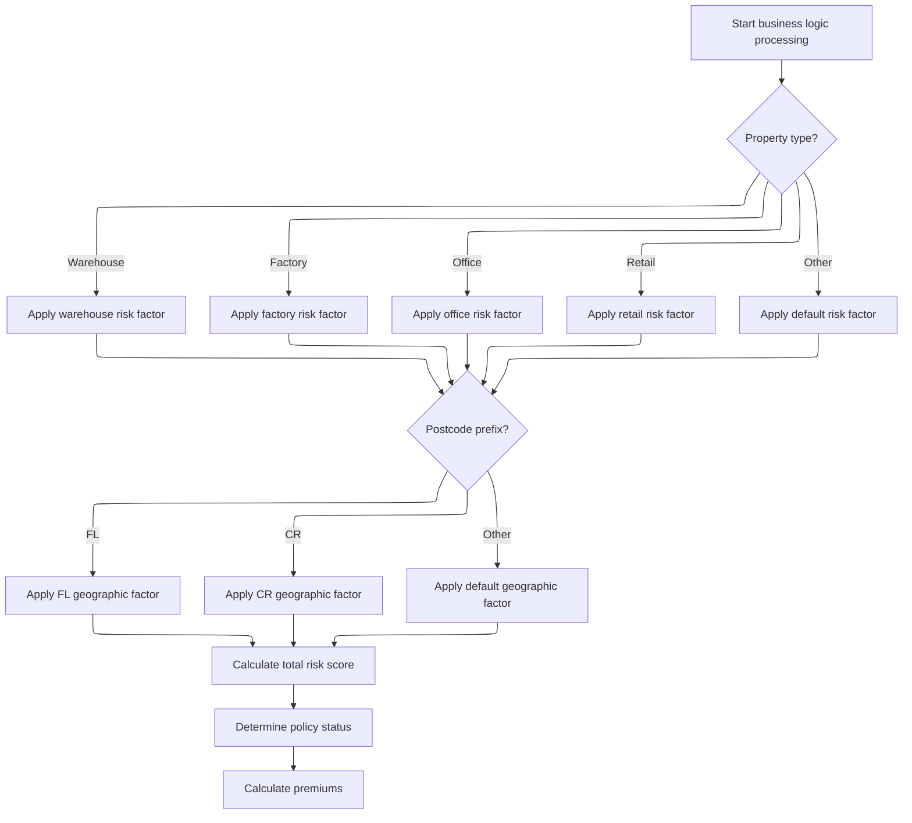

This section governs the calculation of risk scores and premiums for commercial property policies, ensuring that each policy is evaluated according to standardized business rules for property type and location.

| Category       | Rule Name                    | Description                                                                                                                                                                                                                            |
| -------------- | ---------------------------- | -------------------------------------------------------------------------------------------------------------------------------------------------------------------------------------------------------------------------------------- |
| Business logic | Risk score calculation       | Each commercial property policy must be assigned a risk score that is calculated by combining a base value, a property type factor, and a geographic factor based on the postcode prefix.                                              |
| Business logic | Property type risk mapping   | The property type factor must be determined according to the following mapping: Warehouse, Factory, Office, and Retail properties each have a specific risk factor applied; all other property types receive a default factor of zero. |
| Business logic | Geographic risk mapping      | The geographic factor must be determined by the first two characters of the postcode prefix: 'FL' applies the FL geographic factor, 'CR' applies the CR geographic factor, and all other prefixes apply a default factor.              |
| Business logic | Total risk score aggregation | The total risk score for a policy is the sum of the base value, the property type factor, and the geographic factor.                                                                                                                   |
| Business logic | Premium calculation sequence | Premiums must be calculated after the risk score and policy status have been determined, ensuring that all relevant risk factors are considered in the final pricing.                                                                  |

<SwmSnippet path="/base/src/lgcomcal.cbl" line="268">

---

<SwmToken path="base/src/lgcomcal.cbl" pos="268:1:5" line-data="       PROCESS-BUSINESS-LOGIC.">`PROCESS-BUSINESS-LOGIC`</SwmToken> chains risk score, status, and premium calculations so all the commercial policy outputs are set up for downstream processing.

```cobol
       PROCESS-BUSINESS-LOGIC.
           PERFORM PROCESS-RISK-SCORE.
           PERFORM DETERMINE-POLICY-STATUS.
           PERFORM CALCULATE-PREMIUMS.
           
           EXIT.
```

---

</SwmSnippet>

<SwmSnippet path="/base/src/lgcomcal.cbl" line="277">

---

<SwmToken path="base/src/lgcomcal.cbl" pos="277:1:5" line-data="       PROCESS-RISK-SCORE.">`PROCESS-RISK-SCORE`</SwmToken> calculates the commercial property risk score by combining a base value, a property type factor, and a geographic factor based on the postcode prefix. The property and geo factors are hardcoded, and the postcode logic assumes at least two characters, which isn't checked. The total score is stored for later use.

```cobol
       PROCESS-RISK-SCORE.
           MOVE WS-TM-BASE TO WS-TEMP-SCORE.
           DIVIDE 2 INTO WS-TEMP-SCORE GIVING WS-SUB-1.
           MULTIPLY 2 BY WS-SUB-1 GIVING WS-RC-BASE-VAL.
           
           MOVE 0 TO WS-RC-PROP-FACT.
           
           MOVE 'COMMERCIAL' TO RMS-TYPE
           MOVE '1.0.5' TO RMS-VERSION
      
           EVALUATE CA-XPROPTYPE
               WHEN 'WAREHOUSE'
                   MOVE RMS-PF-W-VAL TO RMS-PF-WAREHOUSE
                   COMPUTE WS-TEMP-CALC = RMS-PF-WAREHOUSE
                   ADD WS-TEMP-CALC TO WS-RC-PROP-FACT
               WHEN 'FACTORY'
                   MOVE RMS-PF-F-VAL TO RMS-PF-FACTORY
                   COMPUTE WS-TEMP-CALC = RMS-PF-FACTORY
                   ADD WS-TEMP-CALC TO WS-RC-PROP-FACT
               WHEN 'OFFICE'
                   MOVE RMS-PF-O-VAL TO RMS-PF-OFFICE
                   COMPUTE WS-TEMP-CALC = RMS-PF-OFFICE
                   ADD WS-TEMP-CALC TO WS-RC-PROP-FACT
               WHEN 'RETAIL'
                   MOVE RMS-PF-R-VAL TO RMS-PF-RETAIL
                   COMPUTE WS-TEMP-CALC = RMS-PF-RETAIL
                   ADD WS-TEMP-CALC TO WS-RC-PROP-FACT
               WHEN OTHER
                   MOVE 0 TO WS-RC-PROP-FACT
           END-EVALUATE.
           
           MOVE 0 TO WS-RC-GEO-FACT.
           
           MOVE RMS-GF-FL-VAL TO RMS-GF-FL
           MOVE RMS-GF-CR-VAL TO RMS-GF-CR
           
           IF CA-XPOSTCODE(1:2) = 'FL'
              MOVE RMS-GF-FL TO WS-RC-GEO-FACT
           ELSE
              IF CA-XPOSTCODE(1:2) = 'CR'
                 MOVE RMS-GF-CR TO WS-RC-GEO-FACT
              END-IF
           END-IF.
           
           COMPUTE WS-RC-TOTAL = 
              WS-RC-BASE-VAL + WS-RC-PROP-FACT + WS-RC-GEO-FACT.
              
           MOVE WS-RC-TOTAL TO WS-SA-RISK.
           
           EXIT.
```

---

</SwmSnippet>

### Transferring Calculated Risk and Premiums

<SwmSnippet path="/base/src/lgapdb09.cbl" line="515">

---

Back in <SwmToken path="base/src/lgapdb09.cbl" pos="261:3:5" line-data="               PERFORM P500-BIZ">`P500-BIZ`</SwmToken> after returning from the risk calculation module, we move the computed risk score, status, rejection reason, and all premium values into the main policy record fields. This sets up the data for the next steps in the commercial policy flow.

```cobol
           MOVE WS-ZRESULT-SCORE TO X3-VAL
           MOVE WS-ZSTATUS-IND TO X5-Z9
           MOVE WS-ZREJECT-TEXT TO X6-REJ
           MOVE WS-ZFP-PREMIUM TO CA-B-CA-B-FPR
           MOVE WS-ZCP-PREMIUM TO CA-B-CPR
           MOVE WS-ZFLP-PREMIUM TO CA-B-FLPR
           MOVE WS-ZWP-PREMIUM TO CA-B-WPR
           
           MOVE X5-Z9 TO CA-B-ST
           MOVE X6-REJ TO CA-B-RejectReason
```

---

</SwmSnippet>

<SwmSnippet path="/base/src/lgapdb09.cbl" line="526">

---

After finishing up <SwmToken path="base/src/lgapdb09.cbl" pos="261:3:5" line-data="               PERFORM P500-BIZ">`P500-BIZ`</SwmToken>, we call <SwmToken path="base/src/lgapdb09.cbl" pos="526:3:7" line-data="           PERFORM P546-CHK-MATRIX">`P546-CHK-MATRIX`</SwmToken> to apply business rules to the calculated score. This sets the policy status and rejection reason, flagging anything that needs manual review or further verification before the policy gets added to the database.

```cobol
           PERFORM P546-CHK-MATRIX
           
           PERFORM P548-BINS
           
           EXIT.
```

---

</SwmSnippet>

## Applying Matrix-Based Status and Rejection Logic

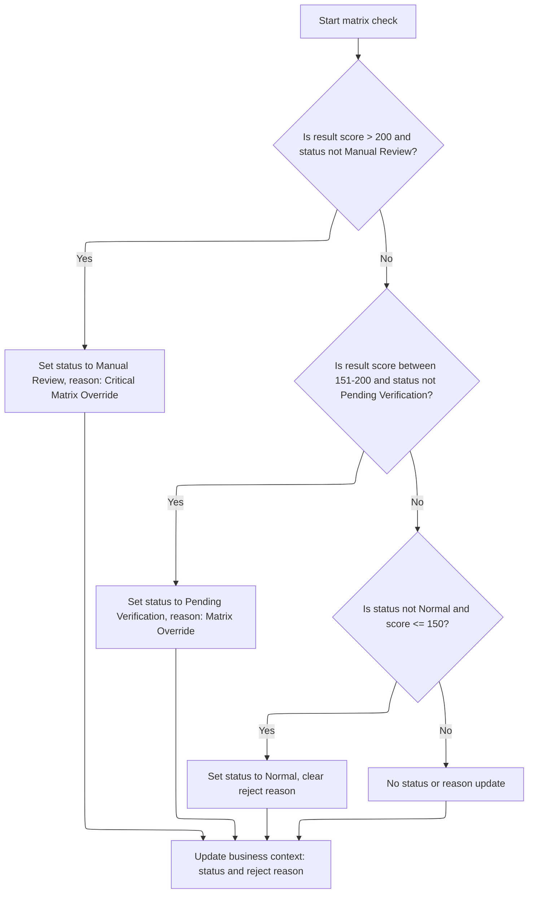

This section applies matrix-based logic to determine and set override flags and rejection reasons for customer or policy records. It uses hardcoded thresholds to decide if a record requires manual review, pending verification, or can be cleared of overrides.

| Category       | Rule Name                     | Description                                                                                                                                                                                                                     |
| -------------- | ----------------------------- | ------------------------------------------------------------------------------------------------------------------------------------------------------------------------------------------------------------------------------- |
| Business logic | Critical Matrix Manual Review | If the calculated score is greater than 200 and the current status is not Manual Review, set the status to Manual Review and set the rejection reason to 'Critical Matrix Override - Manual Review'.                            |
| Business logic | Matrix Pending Verification   | If the calculated score is between 151 and 200 (inclusive) and the current status is not Pending Verification, set the status to Pending Verification and set the rejection reason to 'Matrix Override - Pending Verification'. |
| Business logic | Matrix Normalization          | If the current status is not Normal and the calculated score is 150 or less, set the status to Normal and clear the rejection reason.                                                                                           |
| Business logic | No Override Update            | If none of the above conditions are met, do not update the status or rejection reason.                                                                                                                                          |

<SwmSnippet path="/base/src/lgapdb09.cbl" line="533">

---

In <SwmToken path="base/src/lgapdb09.cbl" pos="533:1:5" line-data="       P546-CHK-MATRIX.">`P546-CHK-MATRIX`</SwmToken>, we use the calculated score and current status to set override flags and rejection reasons. If the score is above 200, it's a manual review; between 151 and 200, it's pending verification; otherwise, we clear any overrides. The thresholds and messages are hardcoded.

```cobol
       P546-CHK-MATRIX.
           EVALUATE TRUE
               WHEN X3-VAL > 200 AND X5-Z9 NOT = 2
                 MOVE 2 TO X5-Z9
                 MOVE 'Critical Matrix Override - Manual Review' TO X6-REJ
               WHEN X3-VAL > 150 AND X3-VAL <= 200 AND X5-Z9 NOT = 1
                 MOVE 1 TO X5-Z9
                 MOVE 'Matrix Override - Pending Verification' TO X6-REJ 
               WHEN X5-Z9 NOT = 0 AND X3-VAL <= 150
                 MOVE 0 TO X5-Z9
                 MOVE SPACES TO X6-REJ
               WHEN OTHER
                 CONTINUE
           END-EVALUATE.
```

---

</SwmSnippet>

<SwmSnippet path="/base/src/lgapdb09.cbl" line="548">

---

After setting the status and rejection reason in <SwmToken path="base/src/lgapdb09.cbl" pos="526:3:7" line-data="           PERFORM P546-CHK-MATRIX">`P546-CHK-MATRIX`</SwmToken>, we move those values into the communication area fields so they're available for the next steps and for any downstream modules that need them.

```cobol
           MOVE X5-Z9 TO CA-B-ST
           MOVE X6-REJ TO CA-B-RejectReason.
           EXIT.
```

---

</SwmSnippet>

## Persisting Commercial Policy to Database

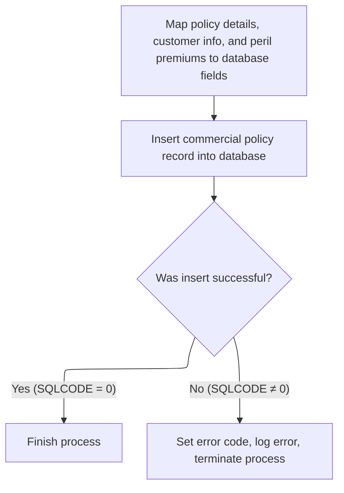

This section governs the rules for persisting a commercial policy to the database, ensuring all required data is mapped and stored, and errors are handled appropriately.

| Category        | Rule Name                           | Description                                                                                                                                                                                                      |
| --------------- | ----------------------------------- | ---------------------------------------------------------------------------------------------------------------------------------------------------------------------------------------------------------------- |
| Data validation | Complete field mapping              | All required commercial policy fields, including customer information, property details, and peril premiums, must be mapped to their corresponding database fields before attempting to persist the policy.      |
| Data validation | Successful persistence confirmation | A commercial policy record must only be considered successfully persisted if the database insert operation returns a success code (SQLCODE = 0).                                                                 |
| Business logic  | Peril premium mapping               | Each peril premium and related field must be mapped from the input structure to its corresponding database field, ensuring accurate calculation and reporting for each peril type (fire, crime, flood, weather). |

<SwmSnippet path="/base/src/lgapdb09.cbl" line="553">

---

In <SwmToken path="base/src/lgapdb09.cbl" pos="553:1:3" line-data="       P548-BINS.">`P548-BINS`</SwmToken>, we map the commarea fields to <SwmToken path="base/src/lgapdb09.cbl" pos="554:11:11" line-data="           MOVE CA-B-FP     TO DB2-B-P1-Int">`DB2`</SwmToken> host variables to match the database schema, then prep for the SQL insert. This sets up all the commercial policy data for persistence.

```cobol
       P548-BINS.
           MOVE CA-B-FP     TO DB2-B-P1-Int
           MOVE CA-B-CA-B-FPR   TO DB2-B-P1A-Int
           MOVE CA-B-CP    TO DB2-B-P2-Int
           MOVE CA-B-CPR  TO DB2-B-P2A-Int
           MOVE CA-B-FLP    TO DB2-B-P3-Int
           MOVE CA-B-FLPR  TO DB2-B-P3A-Int
           MOVE CA-B-WP  TO DB2-B-P4-Int
           MOVE CA-B-WPR TO DB2-B-P4A-Int
           MOVE CA-B-ST        TO DB2-B-Z9-Int
           
           MOVE ' INSERT COMMER' TO EM-SQLREQ
```

---

</SwmSnippet>

<SwmSnippet path="/base/src/lgapdb09.cbl" line="565">

---

This part of <SwmToken path="base/src/lgapdb09.cbl" pos="528:3:5" line-data="           PERFORM P548-BINS">`P548-BINS`</SwmToken> runs the SQL insert to add the full commercial policy record to the database, using all the mapped fields from the previous step. The insert covers everything needed for a complete policy entry.

```cobol
           EXEC SQL
             INSERT INTO COMMERCIAL
                       (PolicyNumber,
                        RequestDate,
                        StartDate,
                        RenewalDate,
                        Address,
                        Zipcode,
                        LatitudeN,
                        LongitudeW,
                        Customer,
                        PropertyType,
                        FirePeril,
                        CA-B-FPR,
                        CrimePeril,
                        CrimePremium,
                        FloodPeril,
                        FloodPremium,
                        WeatherPeril,
                        WeatherPremium,
                        Status,
                        RejectionReason)
                VALUES (:DB2-POLICYNUM-INT,
                        :CA-LASTCHANGED,
                        :CA-ISSUE-DATE,
                        :CA-EXPIRY-DATE,
                        :CA-B-Address,
                        :CA-B-PST,
                        :CA-B-Latitude,
                        :CA-B-Longitude,
                        :CA-B-Customer,
                        :CA-B-PropType,
                        :DB2-B-P1-Int,
                        :DB2-B-P1A-Int,
                        :DB2-B-P2-Int,
                        :DB2-B-P2A-Int,
                        :DB2-B-P3-Int,
                        :DB2-B-P3A-Int,
                        :DB2-B-P4-Int,
                        :DB2-B-P4A-Int,
                        :DB2-B-Z9-Int,
                        :CA-B-RejectReason)
           END-EXEC
```

---

</SwmSnippet>

<SwmSnippet path="/base/src/lgapdb09.cbl" line="609">

---

After the SQL insert in <SwmToken path="base/src/lgapdb09.cbl" pos="528:3:5" line-data="           PERFORM P548-BINS">`P548-BINS`</SwmToken>, if it fails, we set the error code to '92', log the error with <SwmToken path="base/src/lgapdb09.cbl" pos="611:3:7" line-data="              PERFORM WRITE-ERROR-MESSAGE">`WRITE-ERROR-MESSAGE`</SwmToken>, and abend the transaction with 'LGSQ'. This makes sure any DB failure is tracked and the transaction doesn't continue.

```cobol
           IF SQLCODE NOT = 0
              MOVE '92' TO CA-RETURN-CODE
              PERFORM WRITE-ERROR-MESSAGE
              EXEC CICS ABEND ABCODE('LGSQ') NODUMP END-EXEC
              EXEC CICS RETURN END-EXEC
           END-IF.
           
           EXIT.
```

---

</SwmSnippet>

## Finalizing Transaction and Linking to Record Writer

<SwmSnippet path="/base/src/lgapdb09.cbl" line="268">

---

After wrapping up <SwmToken path="base/src/lgapdb09.cbl" pos="261:3:5" line-data="               PERFORM P500-BIZ">`P500-BIZ`</SwmToken>, MAINLINE links to <SwmToken path="base/src/lgapdb09.cbl" pos="268:9:9" line-data="             EXEC CICS Link Program(LGAPVS01)">`LGAPVS01`</SwmToken>, passing the full commarea so the finalized policy record gets written to persistent storage. This is the last step before returning control.

```cobol
             EXEC CICS Link Program(LGAPVS01)
                  Commarea(DFHCOMMAREA)
                LENGTH(32500)
             END-EXEC.


      * Return to caller
           EXEC CICS RETURN END-EXEC.
```

---

</SwmSnippet>

# Formatting and Writing Policy Records

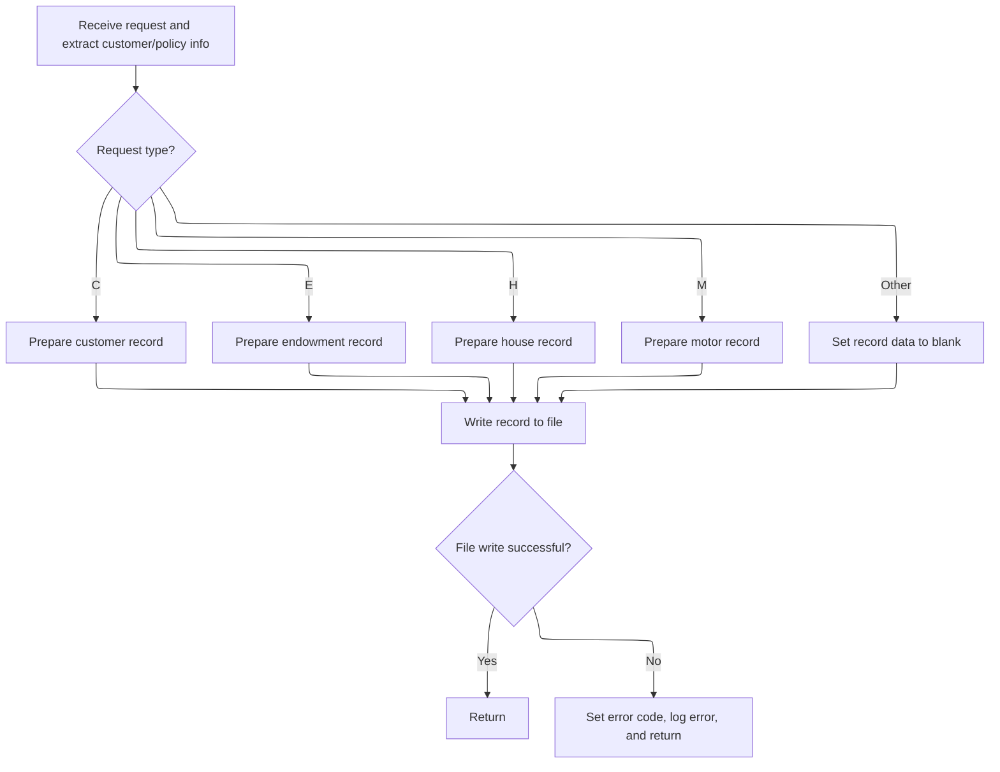

This section is responsible for formatting policy records based on the type of insurance policy operation requested (commercial, endowment, house, or motor), writing the formatted record to the policy file, and handling any errors that occur during the write process.

| Category       | Rule Name              | Description                                                                                                                                                                                                                                                     |
| -------------- | ---------------------- | --------------------------------------------------------------------------------------------------------------------------------------------------------------------------------------------------------------------------------------------------------------- |
| Business logic | Policy type formatting | The system must determine the policy type from the request and format the record fields according to the specific requirements for commercial, endowment, house, or motor policies. If the policy type is not recognized, the record data must be set to blank. |

<SwmSnippet path="/base/src/lgapvs01.cbl" line="90">

---

<SwmToken path="base/src/lgapvs01.cbl" pos="90:1:3" line-data="       P100-ENTRY SECTION.">`P100-ENTRY`</SwmToken> formats the policy record based on the request type, filling out the right fields for commercial, endowment, house, or motor. Then it writes the record to the file, and if the write fails, it triggers error handling and logs the failure.

```cobol
       P100-ENTRY SECTION.
      *
      *---------------------------------------------------------------*
           Move EIBCALEN To V1-COMM.
      *---------------------------------------------------------------*
           Move CA-Request-ID(4:1) To V2-REQ
           Move CA-Policy-Num      To V2-POL
           Move CA-Customer-Num    To V2-CUST

           Evaluate V2-REQ

             When 'C'
               Move CA-B-PST     To V2-C-PCD
               Move CA-B-ST       To V2-C-Z9
               Move CA-B-Customer     To V2-C-CUST
               Move WS-RISK-SCORE     To V2-C-VAL
               Move CA-B-CA-B-FPR  To V2-C-P1VAL
               Move CA-B-CPR To V2-C-P2VAL
               Move CA-B-FLPR To V2-C-P3VAL
               Move CA-B-WPR To V2-C-P4VAL

             When 'E'
               Move CA-E-W-PRO        To  V2-E-OPT1
               Move CA-E-EQU          To  V2-E-OPT2
               Move CA-E-M-FUN        To  V2-E-OPT3
               Move CA-E-FUND-NAME    To  V2-E-NAME
               Move CA-E-LIFE-ASSURED To  V2-E-LIFE

             When 'H'
               Move CA-H-P-TYP         To  V2-H-TYPE
               Move CA-H-BED           To  V2-H-ROOMS
               Move CA-H-VAL           To  V2-H-COST
               Move CA-H-PCD           To  V2-H-PCD
               Move CA-H-H-NAM         To  V2-H-NAME

             When 'M'
               Move CA-M-MAKE          To  V2-M-MAKE
               Move CA-M-MODEL         To  V2-M-MODEL
               Move CA-M-VALUE         To  V2-M-COST
               Move CA-M-REGNUMBER     To  V2-M-NUM

             When Other
               Move Spaces To V2-DATA
           End-Evaluate

      *---------------------------------------------------------------*
           Exec CICS Write File('KSDSPOLY')
                     From(V2-RECORD)
                     Length(104)
                     Ridfld(V2-KEY)
                     KeyLength(21)
                     RESP(V1-RCD1)
           End-Exec.
           If V1-RCD1 Not = DFHRESP(NORMAL)
             Move EIBRESP2 To V1-RCD2
             MOVE '80' TO CA-RETURN-CODE
             PERFORM P999-ERROR
             EXEC CICS RETURN END-EXEC
           End-If.
```

---

</SwmSnippet>

<SwmSnippet path="/base/src/lgapvs01.cbl" line="156">

---

<SwmToken path="base/src/lgapvs01.cbl" pos="156:1:3" line-data="       P999-ERROR.">`P999-ERROR`</SwmToken> grabs the current time and date, fills out the error message structure, and then calls LGSTSQ to log it. If there's commarea data, it moves up to 90 bytes into <SwmToken path="base/src/lgapvs01.cbl" pos="176:12:14" line-data="               MOVE DFHCOMMAREA(1:EIBCALEN) TO CA-DATA">`CA-DATA`</SwmToken> and calls LGSTSQ again to make sure all error context is captured.

```cobol
       P999-ERROR.
           EXEC CICS ASKTIME ABSTIME(V3-TIME)
           END-EXEC
           EXEC CICS FORMATTIME ABSTIME(V3-TIME)
                     MMDDYYYY(V3-DATE1)
                     TIME(V3-DATE2)
           END-EXEC
      *
           MOVE V3-DATE1 TO EM-DATE
           MOVE V3-DATE2 TO EM-TIME
           Move CA-Customer-Num To EM-Cusnum
           Move CA-Policy-Num   To EM-POLNUM 
           Move V1-RCD1         To EM-RespRC
           Move V1-RCD2         To EM-Resp2RC
           EXEC CICS LINK PROGRAM('LGSTSQ')
                     COMMAREA(ERROR-MSG)
                     LENGTH(LENGTH OF ERROR-MSG)
           END-EXEC.
           IF EIBCALEN > 0 THEN
             IF EIBCALEN < 91 THEN
               MOVE DFHCOMMAREA(1:EIBCALEN) TO CA-DATA
               EXEC CICS LINK PROGRAM('LGSTSQ')
                         COMMAREA(CA-ERROR-MSG)
                         LENGTH(Length Of CA-ERROR-MSG)
               END-EXEC
             ELSE
               MOVE DFHCOMMAREA(1:90) TO CA-DATA
               EXEC CICS LINK PROGRAM('LGSTSQ')
                         COMMAREA(CA-ERROR-MSG)
                         LENGTH(Length Of CA-ERROR-MSG)
               END-EXEC
             END-IF
           END-IF.
           EXIT.
```

---

</SwmSnippet>

&nbsp;

*This is an auto-generated document by Swimm 🌊 and has not yet been verified by a human*

<SwmMeta version="3.0.0" repo-id="Z2l0aHViJTNBJTNBU3dpbW1pby1nZW5hcHAtbW90b3IlM0ElM0FHaXJpLVN3aW1t" repo-name="Swimmio-genapp-motor"><sup>Powered by [Swimm](https://app.swimm.io/)</sup></SwmMeta>
