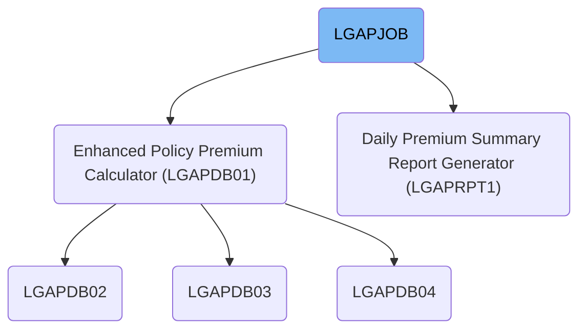
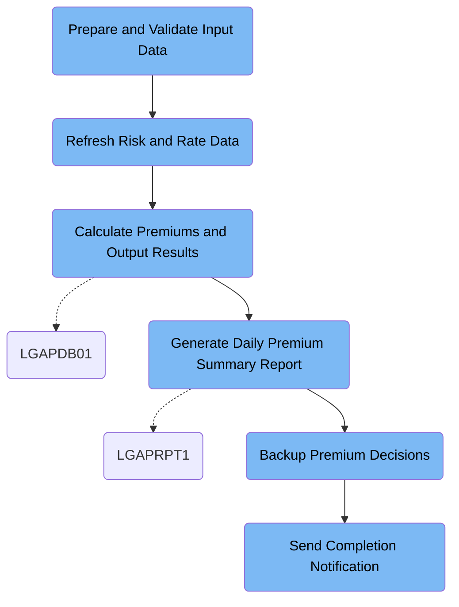

LGAPJOB handles the daily batch workflow for insurance policy applications, converting raw input data into calculated premiums, summary reports, and backups, while notifying stakeholders of job completion. For example, it processes new property policy applications, calculates premiums, produces a summary report, archives the results, and sends a completion notification.

# Dependencies



Here is a high level diagram of the file:



## Prepare and Validate Input Data

Step in this section: `STEP01`.

This section sorts and cleans incoming policy application data to ensure consistency and accuracy before premium calculations are performed.

- The raw insurance policy application data is read from the input dataset.
- Each record is sorted based on key fields that uniquely identify and categorize the policy applications (e.g., policy number and type).
- Records are reformatted to the required structure and length for downstream processing.
- The result is written to an output dataset containing sorted, validated policy data ready for the next calculation step.

### Input

**LGAP.INPUT.RAW.DATA (Raw Policy Input Data)**

Raw data containing new policy applications received for premium calculation.

### Output

**LGAP.INPUT.SORTED (Sorted Validated Policy Data)**

Validated and sorted policy application data ready for premium calculation processing.

## Refresh Risk and Rate Data

Step in this section: `STEP02`.

This section refreshes the database by cleaning out outdated risk data and activating only rates relevant to the current date, making sure all subsequent premium calculations use the most accurate information.

## Calculate Premiums and Output Results

Step in this section: `STEP03`.

This section transforms validated policy application data into calculated premium results, while also handling rejected applications and producing summary business reports.

1. Each sorted and validated policy application is read one by one from the input data.
2. For each policy, the configuration data and rate tables are used to determine the appropriate rules and rating factors for calculating the premium amount.
3. The business logic applies the relevant actuarial formulas and looks up the required rates to compute the policy's premium.
4. Policies that pass all business and data validations are saved with their calculated premium to the premium data output.
5. Policies failing any business rule validation or with incomplete information are flagged, and their details are written to the rejected data output.
6. Summary statistics, such as the number of accepted and rejected policies and aggregate premium totals, are compiled and output to the summary report.

### Input

**LGAP.INPUT.SORTED (Sorted Validated Policy Data)**

Sorted and validated commercial property policy applications ready for premium calculation.

**LGAP.CONFIG.MASTER (Master Configuration Data)**

Configuration data dictating calculation rules and operational parameters for premium processing.

**LGAP.RATE.TABLES (Rate Table Data)**

Property insurance rate information to be applied during premium calculations.

### Output

**LGAP.OUTPUT.PREMIUM.DATA (Premium Calculation Results)**

Calculated premium details for accepted commercial property policies.

**LGAP.OUTPUT.REJECTED.DATA (Rejected Policy Data)**

Records of policies that were not accepted due to data errors or failing business validation rules.

**LGAP.OUTPUT.SUMMARY.RPT (Processing Summary Report)**

Aggregated report summarizing the premium calculation outcomes and business statistics.

## Generate Daily Premium Summary Report

Step in this section: `STEP04`.

Produces a daily summary report that aggregates premium data, calculates key business metrics, and presents an overview of all underwriting outcomes from the day's processing.

- The premium calculation results from the day's accepted policy applications are taken as input.
- For each record, relevant statistics such as total premium values, policy counts, and breakdowns by product line or rating factor are accumulated.
- The accumulated data is formatted into a structured management report with clear headers, summary lines, and detailed breakdowns.
- The final report is written to the output report file, ready for stakeholder review.

### Input

**LGAP.OUTPUT.PREMIUM.DATA (Premium Calculation Results)**

Contains the premium calculation details for all accepted property policy applications from the current day's processing.

### Output

**LGAP.REPORTS.DAILY.SUMMARY (Daily Premium Summary Report)**

Formatted management report containing daily premium statistics and summary breakdowns for business review.

## Backup Premium Decisions

Step in this section: `STEP05`.

Backs up the premium calculation results to a secure tape dataset, ensuring business continuity and compliance for all processed policies.

- The backup process reads all records from the premium calculation output dataset (LGAP.OUTPUT.PREMIUM.DATA).
- Each policy record and its premium result are copied exactly as-is, preserving all detail and formatting.
- The copied data is written sequentially to the backup tape dataset (LGAP.BACKUP.PREMIUM.G0001V00), ensuring a recoverable and auditable snapshot for the run.
- No data transformation or filtering is performed; it is a one-to-one archival copy of the primary output.

### Input

**LGAP.OUTPUT.PREMIUM.DATA (Premium Calculation Results)**

Contains the processed premium data for all accepted property policy applications from the current batch run.

Sample:

| Column Name       | Sample     |
| ----------------- | ---------- |
| PolicyNumber      | CP8923X1   |
| PolicyType        | Property   |
| CalculatedPremium | 420.75     |
| RatingFactor      | 1.09       |
| BindDate          | 2024-06-14 |

### Output

**LGAP.BACKUP.PREMIUM.G0001V00 (Premium Data Backup)**

Secure tape backup containing a full copy of the batch premium calculation results for all accepted property policies.

Sample:

| Column Name       | Sample     |
| ----------------- | ---------- |
| PolicyNumber      | CP8923X1   |
| PolicyType        | Property   |
| CalculatedPremium | 420.75     |
| RatingFactor      | 1.09       |
| BindDate          | 2024-06-14 |

## Send Completion Notification

Step in this section: `NOTIFY`.

Enables communication of successful job completion to the operations team and confirms that both the business report and backup have been generated and are accessible.

- The system reads an inline message from the input (SYSUT1), containing text that specifies job completion, report output location, and backup status.
- The utility takes this message and writes it directly to the output stream (SYSUT2) configured for internal reader, which delivers the notification to the intended operations or stakeholder audience.
- The message format and content are preserved exactly as defined in the input, ensuring immediate and clear communication of completion status.

### Input

**SYSUT1**

Inline notification message text containing job completion, report, and backup status.

Sample:

```
JOB LGAPJOB COMPLETED SUCCESSFULLY
PROCESSING SUMMARY AVAILABLE IN LGAP.OUTPUT.SUMMARY.RPT
BACKUP CREATED: LGAP.BACKUP.PREMIUM.G0001V00
```

### Output

**SYSUT2**

System notification sent via internal reader output, visible to operations or stakeholders.

Sample:

```
JOB LGAPJOB COMPLETED SUCCESSFULLY
PROCESSING SUMMARY AVAILABLE IN LGAP.OUTPUT.SUMMARY.RPT
BACKUP CREATED: LGAP.BACKUP.PREMIUM.G0001V00
```

&nbsp;

*This is an auto-generated document by Swimm 🌊 and has not yet been verified by a human*

<SwmMeta version="3.0.0" repo-id="Z2l0aHViJTNBJTNBU3dpbW1pby1nZW5hcHAtbW90b3IlM0ElM0FHaXJpLVN3aW1t" repo-name="Swimmio-genapp-motor"><sup>Powered by [Swimm](https://app.swimm.io/)</sup></SwmMeta>
