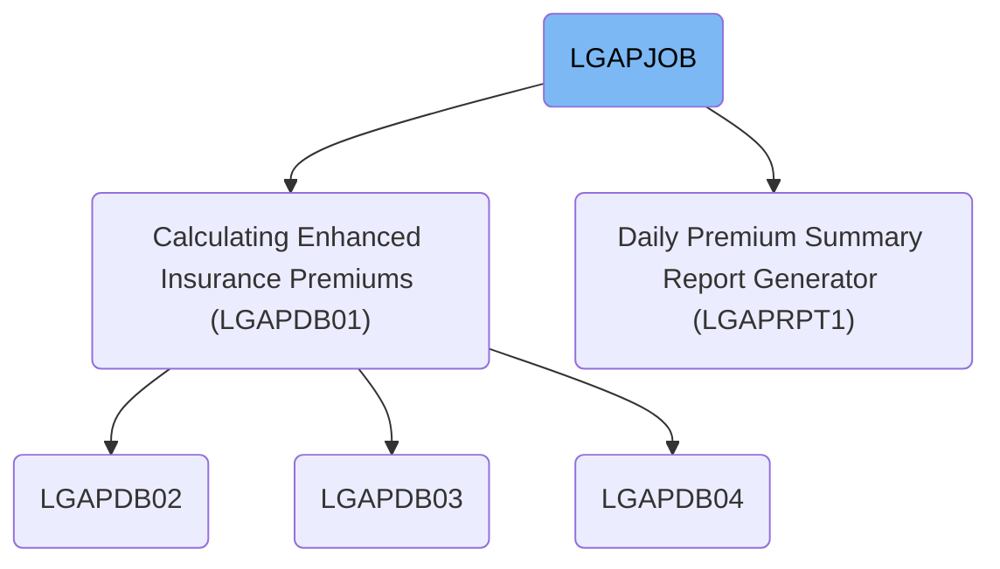
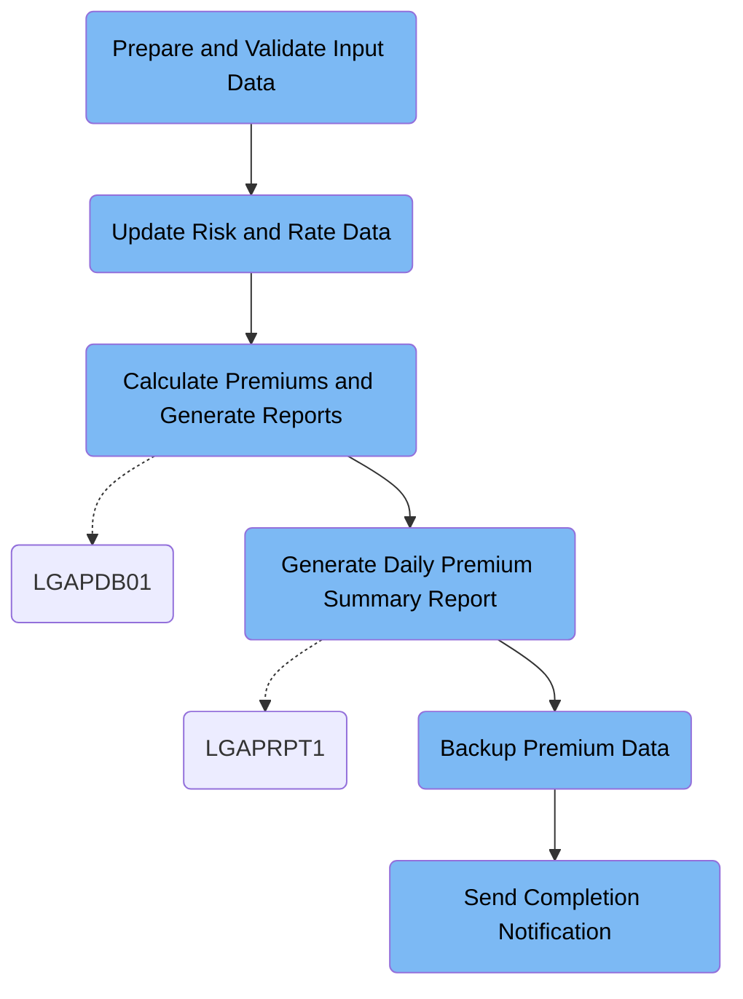

LGAPJOB automates the daily processing of insurance policy applications, transforming raw input records into validated premium calculations, summary reports, backups, and completion notifications. The flow ensures each policy is accurately rated, invalid records are flagged, and all results are archived and reported for business tracking.

# Dependencies



Here is a high level diagram of the file:



## Prepare and Validate Input Data

Step in this section: `STEP01`.

This step ensures incoming raw insurance policy records are standardized and sorted to maintain integrity and consistency before starting premium calculations.

- The raw insurance policy dataset is read as input.
- Each record is sorted primarily by its policy number and then by policy type to ensure consistency in downstream calculations.
- Records are reformatted to a standardized fixed-length layout, ensuring that all records have a uniform structure and length as required for later premium calculations.
- The resulting sorted and standardized records are written to the output dataset, making them ready for use in the next job step.

### Input

**LGAP.INPUT.RAW.DATA**

This dataset contains unsorted, unstandardized raw insurance policy records collected for daily processing.

Sample:

| Column Name    | Sample     |
| -------------- | ---------- |
| POLICY_NO      | 0001234567 |
| POLICY_TYPE    | A          |
| INSURED_NAME   | JANE SMITH |
| EFFECTIVE_DATE | 2024-07-01 |
| PREMIUM        | 0000250.00 |

### Output

**LGAP.INPUT.SORTED**

This dataset contains insurance policy data records that have been sorted and formatted uniformly, ready for accurate premium processing.

Sample:

| Column Name    | Sample     |
| -------------- | ---------- |
| POLICY_NO      | 0001234567 |
| POLICY_TYPE    | A          |
| INSURED_NAME   | JANE SMITH |
| EFFECTIVE_DATE | 2024-07-01 |
| PREMIUM        | 0000250.00 |

## Update Risk and Rate Data

Step in this section: `STEP02`.

This section refreshes both the risk cache and insurance rate master data, ensuring only current and relevant data is used in downstream policy premium calculations.

## Calculate Premiums and Generate Reports

Step in this section: `STEP03`.

Calculates insurance premiums for policy applications using business rules and rate data, filtering out invalid records and compiling summary statistics and reports for business tracking.

1. Each policy application from the standardized input file is loaded one by one.
2. For each application, configuration settings and the relevant premium rate factors are applied according to the business rules in the actuarial logic.
3. The application undergoes eligibility and data validation checks. If the record passes all business rules, the system calculates the premium, adding rating surcharges or discounts as specified in the rate tables and configuration.
4. Successfully rated policies are written to the premium data output file, including the finalized premium value (e.g., POLICY_NO 0001234567 with FINAL_PREMIUM 0000252.45).
5. Records failing eligibility or validation—such as missing essential data—are not rated. These are written to the rejected data output, accompanied by descriptive rejection reasons (e.g., POLICY_NO 0001234588, REJECTION_REASON "Missing required insured information.").
6. As all applications are processed, statistics and totals are collected in memory—such as the count of processed, approved, and rejected records, plus any error codes encountered.
7. At the end of processing, these metrics and summary insights are written to a summary report output, supporting operational transparency and audit requirements.

### Input

**LGAP.INPUT.SORTED**

Sorted and standardized insurance policy applications prepared for premium calculation.

Sample:

| Column Name    | Sample     |
| -------------- | ---------- |
| POLICY_NO      | 0001234567 |
| POLICY_TYPE    | A          |
| INSURED_NAME   | JANE SMITH |
| EFFECTIVE_DATE | 2024-07-01 |
| PREMIUM        | 0000250.00 |

**LGAP.CONFIG.MASTER**

Configuration settings governing actuarial and underwriting logic.

**LGAP.RATE.TABLES**

Rate tables specifying premium calculation factors according to business rules.

### Output

**LGAP.OUTPUT.PREMIUM.DATA**

Insurance application records with successfully calculated premiums, ready for downstream business processing.

Sample:

| Column Name    | Sample     |
| -------------- | ---------- |
| POLICY_NO      | 0001234567 |
| POLICY_TYPE    | A          |
| INSURED_NAME   | JANE SMITH |
| EFFECTIVE_DATE | 2024-07-01 |
| FINAL_PREMIUM  | 0000252.45 |

**LGAP.OUTPUT.REJECTED.DATA**

List of policy applications found invalid or failing business checks, with rejection reasons.

Sample:

| Column Name      | Sample                                |
| ---------------- | ------------------------------------- |
| POLICY_NO        | 0001234588                            |
| REJECTION_REASON | Missing required insured information. |

**LGAP.OUTPUT.SUMMARY.RPT**

Aggregate business and error statistics, controlling totals, and operational summary from the run.

## Generate Daily Premium Summary Report

Step in this section: `STEP04`.

Generates the daily summary report with aggregated premium data and key policy metrics for management review and business tracking.

1. The program loads the finalized premium policy records from the input dataset, examining each policy's premium amount, activation status, and risk score.
2. It maintains counters and accumulators, summing final premium amounts and tallying active/inactive policy counts and risk score bands.
3. As each record is read, the program classifies and aggregates information per reporting requirements.
4. Once all records are processed, the report is generated, formatting totals, counts, and risk insights into scheduled summary sections.
5. The completed, formatted report is written to the output report file for management review.

### Input

**LGAP.OUTPUT.PREMIUM.DATA (Finalized Daily Premium Data)**

Contains successful insurance policy records with calculated daily premiums and associated risk scores.

Sample:

| Column Name    | Sample     |
| -------------- | ---------- |
| POLICY_NO      | 0001234567 |
| POLICY_TYPE    | A          |
| INSURED_NAME   | JANE SMITH |
| EFFECTIVE_DATE | 2024-07-01 |
| FINAL_PREMIUM  | 0000252.45 |
| RISK_SCORE     | 82         |

### Output

**LGAP.REPORTS.DAILY.SUMMARY (Daily Premium Summary Report)**

Business report file containing daily totals, policy counts, and risk score breakdowns for management use.

## Backup Premium Data

Step in this section: `STEP05`.

Copies the finalized premium data to a designated backup archive to prevent data loss and support recovery operations.

- The section uses a utility that reads each record from the premium data file LGAP.OUTPUT.PREMIUM.DATA.
- The utility writes each record without modification to the backup dataset LGAP.BACKUP.PREMIUM.G0001V00 on tape.
- The structure and data are copied exactly, ensuring the backup file is an identical archival version of the original premium data file.

### Input

**LGAP.OUTPUT.PREMIUM.DATA**

Finalized premium insurance policy records file created during batch processing.

Sample:

| Column Name    | Sample     |
| -------------- | ---------- |
| POLICY_NO      | 0001234567 |
| POLICY_TYPE    | A          |
| INSURED_NAME   | JANE SMITH |
| EFFECTIVE_DATE | 2024-07-01 |
| FINAL_PREMIUM  | 0000252.45 |

### Output

**LGAP.BACKUP.PREMIUM.G0001V00**

Backup tape archive containing the full premium data as stored for retention and recovery.

Sample:

| Column Name    | Sample     |
| -------------- | ---------- |
| POLICY_NO      | 0001234567 |
| POLICY_TYPE    | A          |
| INSURED_NAME   | JANE SMITH |
| EFFECTIVE_DATE | 2024-07-01 |
| FINAL_PREMIUM  | 0000252.45 |

## Send Completion Notification

Step in this section: `NOTIFY`.

The section sends a formal notification containing job completion status, summary report location, and backup creation to system operators for operational visibility and assurance.

- The input to this section is an inline message—written in the JCL stream—which contains confirmation of the job's successful execution, location of the generated processing summary report, and details about the premium data backup creation.
- The IEBGENER utility reads this message from the input (SYSUT1) and routes it directly to the output destination (SYSUT2), which is the system's internal reader (INTRDR).
- The message appears as-is in the notification output; no modifications or formatting changes are performed by the utility. The internal reader then uses this message for monitoring and alerting purposes.

### Input

**SYSUT1**

Inline message content for job notification. Contains business-focused completion text and references to output artifacts.

Sample:

```
JOB LGAPJOB COMPLETED SUCCESSFULLY
PROCESSING SUMMARY AVAILABLE IN LGAP.OUTPUT.SUMMARY.RPT
BACKUP CREATED: LGAP.BACKUP.PREMIUM.G0001V00
```

### Output

**SYSUT2**

Mainframe notification stream. Delivers the message to the system internal reader (INTRDR), which can trigger further operational alerts or audits.

Sample:

```
JOB LGAPJOB COMPLETED SUCCESSFULLY
PROCESSING SUMMARY AVAILABLE IN LGAP.OUTPUT.SUMMARY.RPT
BACKUP CREATED: LGAP.BACKUP.PREMIUM.G0001V00
```

&nbsp;

*This is an auto-generated document by Swimm 🌊 and has not yet been verified by a human*

<SwmMeta version="3.0.0" repo-id="Z2l0aHViJTNBJTNBU3dpbW1pby1nZW5hcHAtbW90b3IlM0ElM0FHaXJpLVN3aW1t" repo-name="Swimmio-genapp-motor"><sup>Powered by [Swimm](https://app.swimm.io/)</sup></SwmMeta>
