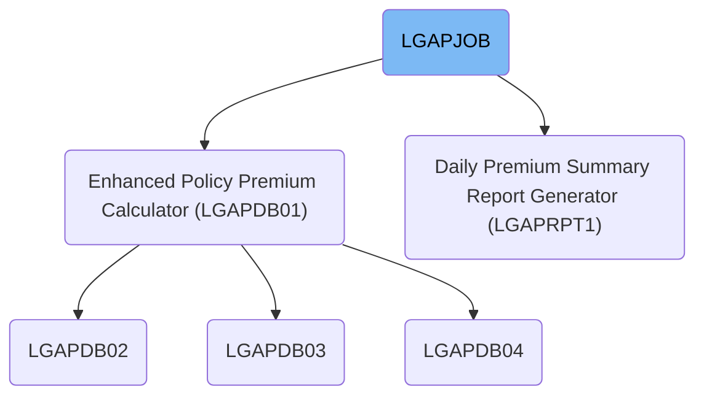
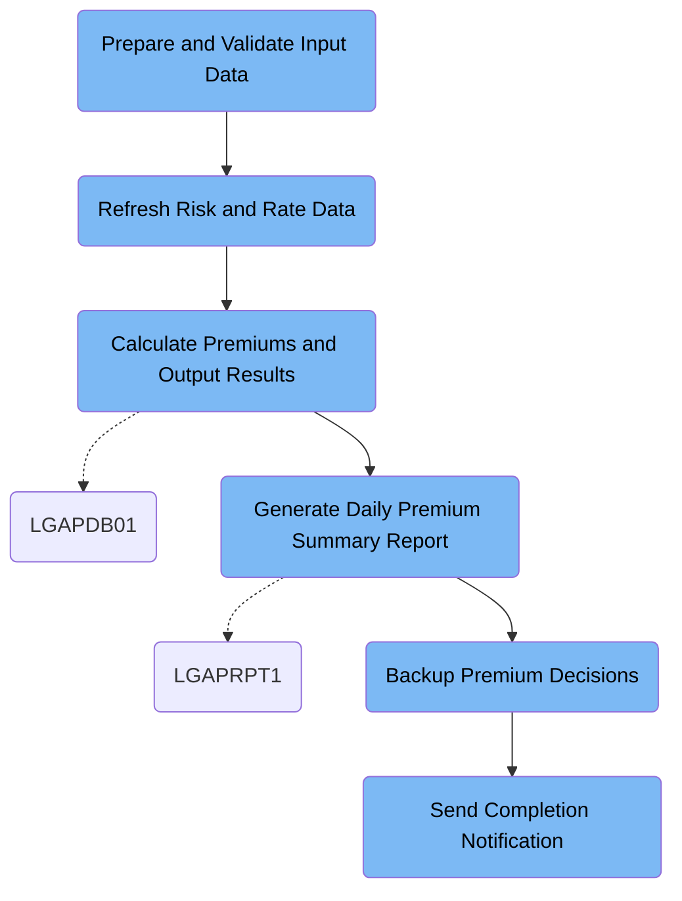

This document details the LGAPJOB batch job, which processes daily insurance policy applications by calculating premiums, generating summary reports, and creating secure backups. The flow transforms raw policy data and rate tables into validated premium results and business insights, ensuring accurate and traceable premium management.

# Dependencies



Here is a high level diagram of the file:



## Prepare and Validate Input Data

Step in this section: `STEP01`.

This section ensures the policy input data is sorted and standardized to guarantee accurate downstream premium calculations.

- The section takes raw policy data as input.
- It sorts the data by policy number and transaction type to guarantee proper sequencing for later use.
- Each record is reformatted to a standardized fixed width, trimming or padding as needed for consistency.
- The resulting output is a validated, sorted dataset that is ready to be used for premium calculation in subsequent steps.

### Input

**LGAP.INPUT.RAW.DATA**

Raw policy application input data used for initial preparation and validation.

### Output

**LGAP.INPUT.SORTED**

Sorted and validated policy application data ready for premium calculation steps.

## Refresh Risk and Rate Data

Step in this section: `STEP02`.

This section refreshes the risk factor cache and updates the rate master data to guarantee policy premiums are always calculated using fresh risk data and active rates.

## Calculate Premiums and Output Results

Step in this section: `STEP03`.

This section determines premium costs for commercial property insurance policies using actuarial rates and configuration data, and outputs processed policy results, any rejected policies, and high-level summary statistics.

1. Policy input records are read sequentially from the sorted input dataset.
2. Configuration and rate data are loaded from their respective datasets to guide the premium calculation logic.
3. For each input policy:
   - Business and actuarial validation is performed using configuration and rate rules.
   - If a record passes, its premium is calculated and written into the processed premium output dataset.
   - If a record fails validation, it is written into the rejected data output.
4. As records are processed, statistical data and results are accumulated.
5. Once all records are processed, summary statistics are generated and written into the summary report output.
6. All results are then available in their respective output datasets for downstream reporting or further processing.

### Input

**LGAP.INPUT.SORTED (Sorted and validated policy application data)**

Validated and sorted insurance policy input records for premium calculation.

**LGAP.CONFIG.MASTER (Master configuration data)**

Centralized configuration data to drive premium calculations and business rules.

**LGAP.RATE.TABLES (Rate tables)**

Actuarial rates and rule tables for calculating policy premiums.

### Output

**LGAP.OUTPUT.PREMIUM.DATA (Processed premium results)**

All processed policy records with calculated premiums.

**LGAP.OUTPUT.REJECTED.DATA (Rejected policy data)**

Records for policies that failed business or actuarial validation during premium calculation.

**LGAP.OUTPUT.SUMMARY.RPT (Business summary report)**

Summary statistics and insights for the premium calculation run.

## Generate Daily Premium Summary Report

Step in this section: `STEP04`.

Produces a daily business report that consolidates premium activity and underwriting results for stakeholders, using the processed premium output as its data source.

1. The report process reads through all finalized premium data records, which include calculated policy premiums and relevant underwriting details.
2. As each record is processed, statistics such as total premiums, policy counts, and breakdowns by categories (e.g., product type, region) are calculated and accumulated.
3. The process formats these statistics and insights into structured summary sections, including totals and relevant breakdowns for management reporting.
4. The results are compiled into a human-readable report layout, which is then written to the daily summary report output dataset for stakeholder distribution.

### Input

**LGAP.OUTPUT.PREMIUM.DATA (Processed premium results)**

All processed policy records with calculated premiums available for daily reporting.

### Output

**LGAP.REPORTS.DAILY.SUMMARY (Daily premium summary report)**

Formatted daily summary report containing key statistics and breakdowns of premium and underwriting performance.

## Backup Premium Decisions

Step in this section: `STEP05`.

Creates a dedicated backup copy of finalized insurance premium data by securely transferring it to a backup storage medium.

- All processed premium records from LGAP.OUTPUT.PREMIUM.DATA are read sequentially.
- Using an IBM utility, every record is copied exactly and written directly into the backup dataset LGAP.BACKUP.PREMIUM.G0001V00.
- No business logic transformation or alteration occurs; the backup is an exact replica of the original processed data, now physically stored on tape for safekeeping.

### Input

**LGAP.OUTPUT.PREMIUM.DATA (Processed Premium Data Output)**

Contains all processed policy records with calculated premiums that require backup.

Sample:

| Column Name   | Sample     |
| ------------- | ---------- |
| PolicyNumber  | CP1025789  |
| PremiumAmount | 2650.00    |
| Status        | APPROVED   |
| EffectiveDate | 2024-06-30 |
| ExpiryDate    | 2025-06-29 |

### Output

**LGAP.BACKUP.PREMIUM.G0001V00 (Premium Data Backup)**

Backup copy of the processed premium data stored on tape media for secure retention and recovery.

Sample:

| Column Name   | Sample     |
| ------------- | ---------- |
| PolicyNumber  | CP1025789  |
| PremiumAmount | 2650.00    |
| Status        | APPROVED   |
| EffectiveDate | 2024-06-30 |
| ExpiryDate    | 2025-06-29 |

## Send Completion Notification

Step in this section: `NOTIFY`.

This section communicates successful job completion and directs users to resulting summary statistics and backups for further review or downstream tasks.

- The completion notification text containing confirmation, summary report location, and backup reference is supplied as direct SYSUT1 input.
- Using a system utility, the notification message is copied exactly as received to SYSUT2, which routes the message to the systems output for review by authorized personnel.
- No transformation occurs; the output is a direct rendering of the input message, ensuring clear communication and traceability for job stakeholders.

### Input

**SYSUT1**

Completion notification message to be rendered for output.

Sample:

```
JOB LGAPJOB COMPLETED SUCCESSFULLY
PROCESSING SUMMARY AVAILABLE IN LGAP.OUTPUT.SUMMARY.RPT
BACKUP CREATED: LGAP.BACKUP.PREMIUM.G0001V00
```

### Output

**SYSUT2**

Rendered job completion notification sent to system output for stakeholder review.

Sample:

```
JOB LGAPJOB COMPLETED SUCCESSFULLY
PROCESSING SUMMARY AVAILABLE IN LGAP.OUTPUT.SUMMARY.RPT
BACKUP CREATED: LGAP.BACKUP.PREMIUM.G0001V00
```

&nbsp;

*This is an auto-generated document by Swimm 🌊 and has not yet been verified by a human*

<SwmMeta version="3.0.0" repo-id="Z2l0aHViJTNBJTNBU3dpbW1pby1nZW5hcHAtbW90b3IlM0ElM0FHaXJpLVN3aW1t" repo-name="Swimmio-genapp-motor"><sup>Powered by [Swimm](https://app.swimm.io/)</sup></SwmMeta>
