# Overview

This document explains the flow for handling and routing incoming messages. Messages from programs or terminals are transformed as needed and reliably written to system queues for logging and further processing. Terminal-originated messages receive an acknowledgement response.

# Where is this program used?

This program is used multiple times in the codebase as represented in the following diagram:

```mermaid
graph TD
  3lbe6("Writing Insurance Policy Data Records (LGAPVS01)") --> qpezc("Logging and Queueing Messages (LGSTSQ)"):::currentEntity
click 3lbe6 openCode "base/src/lgapvs01.cbl:1"
r0xov("Processing Policy Data (LGAPOL01)") --> qpezc("Logging and Queueing Messages (LGSTSQ)"):::currentEntity
click r0xov openCode "base/src/lgapol01.cbl:1"
dg8bs("Deleting Policy Records (LGDPDB01)") --> qpezc("Logging and Queueing Messages (LGSTSQ)"):::currentEntity
click dg8bs openCode "base/src/lgdpdb01.cbl:1"
pu6a6("Deleting Policy Records (LGDPVS01)") --> qpezc("Logging and Queueing Messages (LGSTSQ)"):::currentEntity
click pu6a6 openCode "base/src/lgdpvs01.cbl:1"
kazlq("Adding Customer (LGACUS01)") --> qpezc("Logging and Queueing Messages (LGSTSQ)"):::currentEntity
click kazlq openCode "base/src/lgacus01.cbl:1"
d6oxr("Adding Customer Passwords (LGACDB02)") --> qpezc("Logging and Queueing Messages (LGSTSQ)"):::currentEntity
click d6oxr openCode "base/src/lgacdb02.cbl:1"
q5vs4("Deleting Policy Business Logic (LGDPOL01)") --> qpezc("Logging and Queueing Messages (LGSTSQ)"):::currentEntity
click q5vs4 openCode "base/src/lgdpol01.cbl:1"
81e47("Adding Customer Details (LGACDB01)") --> qpezc("Logging and Queueing Messages (LGSTSQ)"):::currentEntity
click 81e47 openCode "base/src/lgacdb01.cbl:1"
33bu2("Inquire Customer (LGICUS01)") --> qpezc("Logging and Queueing Messages (LGSTSQ)"):::currentEntity
click 33bu2 openCode "base/src/lgicus01.cbl:1"
bgb8g("Inquiring Customer Details (LGICDB01)") --> qpezc("Logging and Queueing Messages (LGSTSQ)"):::currentEntity
click bgb8g openCode "base/src/lgicdb01.cbl:1"
puye3("Inserting Insurance Policy Data (LGAPDB09)") --> qpezc("Logging and Queueing Messages (LGSTSQ)"):::currentEntity
click puye3 openCode "base/src/lgapdb09.cbl:1"
ebg6d("Adding Customer Records (LGACVS01)") --> qpezc("Logging and Queueing Messages (LGSTSQ)"):::currentEntity
click ebg6d openCode "base/src/lgacvs01.cbl:1"
81tir("Inquiring Policy Details (LGIPDB01)") --> qpezc("Logging and Queueing Messages (LGSTSQ)"):::currentEntity
click 81tir openCode "base/src/lgipdb01.cbl:1"
gjvhq("Updating Policy Records (LGUPVS01)") --> qpezc("Logging and Queueing Messages (LGSTSQ)"):::currentEntity
click gjvhq openCode "base/src/lgupvs01.cbl:1"
egybd("Updating Policy Details (LGUPOL01)") --> qpezc("Logging and Queueing Messages (LGSTSQ)"):::currentEntity
click egybd openCode "base/src/lgupol01.cbl:1"
z5yvt("Updating Customer Records (LGUCVS01)") --> qpezc("Logging and Queueing Messages (LGSTSQ)"):::currentEntity
click z5yvt openCode "base/src/lgucvs01.cbl:1"
9pmwh("Updating Policy details (LGUPDB01)") --> qpezc("Logging and Queueing Messages (LGSTSQ)"):::currentEntity
click 9pmwh openCode "base/src/lgupdb01.cbl:1"
gcrbe("Updating Customer details (LGUCDB01)") --> qpezc("Logging and Queueing Messages (LGSTSQ)"):::currentEntity
click gcrbe openCode "base/src/lgucdb01.cbl:1"
62lwd("Updating Customer Details (LGUCUS01)") --> qpezc("Logging and Queueing Messages (LGSTSQ)"):::currentEntity
click 62lwd openCode "base/src/lgucus01.cbl:1"
8gsgl("Inquiring Policy Details (LGIPOL01)") --> qpezc("Logging and Queueing Messages (LGSTSQ)"):::currentEntity
click 8gsgl openCode "base/src/lgipol01.cbl:1"
  
  
click qpezc openCode "base/src/lgstsq.cbl:1"
    classDef currentEntity color:#000000,fill:#7CB9F4

%% Swimm:
%% graph TD
%%   3lbe6("Writing Insurance Policy Data Records (LGAPVS01)") --> qpezc("Logging and Queueing Messages (LGSTSQ)"):::currentEntity
%% click 3lbe6 openCode "<SwmPath>[base/src/lgapvs01.cbl](base/src/lgapvs01.cbl)</SwmPath>:1"
%% r0xov("Processing Policy Data (LGAPOL01)") --> qpezc("Logging and Queueing Messages (LGSTSQ)"):::currentEntity
%% click r0xov openCode "<SwmPath>[base/src/lgapol01.cbl](base/src/lgapol01.cbl)</SwmPath>:1"
%% dg8bs("Deleting Policy Records (LGDPDB01)") --> qpezc("Logging and Queueing Messages (LGSTSQ)"):::currentEntity
%% click dg8bs openCode "<SwmPath>[base/src/lgdpdb01.cbl](base/src/lgdpdb01.cbl)</SwmPath>:1"
%% pu6a6("Deleting Policy Records (LGDPVS01)") --> qpezc("Logging and Queueing Messages (LGSTSQ)"):::currentEntity
%% click pu6a6 openCode "<SwmPath>[base/src/lgdpvs01.cbl](base/src/lgdpvs01.cbl)</SwmPath>:1"
%% kazlq("Adding Customer (LGACUS01)") --> qpezc("Logging and Queueing Messages (LGSTSQ)"):::currentEntity
%% click kazlq openCode "<SwmPath>[base/src/lgacus01.cbl](base/src/lgacus01.cbl)</SwmPath>:1"
%% d6oxr("Adding Customer Passwords (LGACDB02)") --> qpezc("Logging and Queueing Messages (LGSTSQ)"):::currentEntity
%% click d6oxr openCode "<SwmPath>[base/src/lgacdb02.cbl](base/src/lgacdb02.cbl)</SwmPath>:1"
%% q5vs4("Deleting Policy Business Logic (LGDPOL01)") --> qpezc("Logging and Queueing Messages (LGSTSQ)"):::currentEntity
%% click q5vs4 openCode "<SwmPath>[base/src/lgdpol01.cbl](base/src/lgdpol01.cbl)</SwmPath>:1"
%% 81e47("Adding Customer Details (LGACDB01)") --> qpezc("Logging and Queueing Messages (LGSTSQ)"):::currentEntity
%% click 81e47 openCode "<SwmPath>[base/src/lgacdb01.cbl](base/src/lgacdb01.cbl)</SwmPath>:1"
%% 33bu2("Inquire Customer (LGICUS01)") --> qpezc("Logging and Queueing Messages (LGSTSQ)"):::currentEntity
%% click 33bu2 openCode "<SwmPath>[base/src/lgicus01.cbl](base/src/lgicus01.cbl)</SwmPath>:1"
%% bgb8g("Inquiring Customer Details (LGICDB01)") --> qpezc("Logging and Queueing Messages (LGSTSQ)"):::currentEntity
%% click bgb8g openCode "<SwmPath>[base/src/lgicdb01.cbl](base/src/lgicdb01.cbl)</SwmPath>:1"
%% puye3("Inserting Insurance Policy Data (LGAPDB09)") --> qpezc("Logging and Queueing Messages (LGSTSQ)"):::currentEntity
%% click puye3 openCode "<SwmPath>[base/src/lgapdb09.cbl](base/src/lgapdb09.cbl)</SwmPath>:1"
%% ebg6d("Adding Customer Records (LGACVS01)") --> qpezc("Logging and Queueing Messages (LGSTSQ)"):::currentEntity
%% click ebg6d openCode "<SwmPath>[base/src/lgacvs01.cbl](base/src/lgacvs01.cbl)</SwmPath>:1"
%% 81tir("Inquiring Policy Details (LGIPDB01)") --> qpezc("Logging and Queueing Messages (LGSTSQ)"):::currentEntity
%% click 81tir openCode "<SwmPath>[base/src/lgipdb01.cbl](base/src/lgipdb01.cbl)</SwmPath>:1"
%% gjvhq("Updating Policy Records (LGUPVS01)") --> qpezc("Logging and Queueing Messages (LGSTSQ)"):::currentEntity
%% click gjvhq openCode "<SwmPath>[base/src/lgupvs01.cbl](base/src/lgupvs01.cbl)</SwmPath>:1"
%% egybd("Updating Policy Details (LGUPOL01)") --> qpezc("Logging and Queueing Messages (LGSTSQ)"):::currentEntity
%% click egybd openCode "<SwmPath>[base/src/lgupol01.cbl](base/src/lgupol01.cbl)</SwmPath>:1"
%% z5yvt("Updating Customer Records (LGUCVS01)") --> qpezc("Logging and Queueing Messages (LGSTSQ)"):::currentEntity
%% click z5yvt openCode "<SwmPath>[base/src/lgucvs01.cbl](base/src/lgucvs01.cbl)</SwmPath>:1"
%% 9pmwh("Updating Policy details (LGUPDB01)") --> qpezc("Logging and Queueing Messages (LGSTSQ)"):::currentEntity
%% click 9pmwh openCode "<SwmPath>[base/src/lgupdb01.cbl](base/src/lgupdb01.cbl)</SwmPath>:1"
%% gcrbe("Updating Customer details (LGUCDB01)") --> qpezc("Logging and Queueing Messages (LGSTSQ)"):::currentEntity
%% click gcrbe openCode "<SwmPath>[base/src/lgucdb01.cbl](base/src/lgucdb01.cbl)</SwmPath>:1"
%% 62lwd("Updating Customer Details (LGUCUS01)") --> qpezc("Logging and Queueing Messages (LGSTSQ)"):::currentEntity
%% click 62lwd openCode "<SwmPath>[base/src/lgucus01.cbl](base/src/lgucus01.cbl)</SwmPath>:1"
%% 8gsgl("Inquiring Policy Details (LGIPOL01)") --> qpezc("Logging and Queueing Messages (LGSTSQ)"):::currentEntity
%% click 8gsgl openCode "<SwmPath>[base/src/lgipol01.cbl](base/src/lgipol01.cbl)</SwmPath>:1"
%%   
%%   
%% click qpezc openCode "<SwmPath>[base/src/lgstsq.cbl](base/src/lgstsq.cbl)</SwmPath>:1"
%%     classDef currentEntity color:#000000,fill:#7CB9F4
```

&nbsp;

*This is an auto-generated document by Swimm 🌊 and has not yet been verified by a human*

<SwmMeta version="3.0.0" repo-id="Z2l0aHViJTNBJTNBU3dpbW1pby1nZW5hcHAtbW90b3IlM0ElM0FHaXJpLVN3aW1t" repo-name="Swimmio-genapp-motor">Powered by [Swimm](https://app.swimm.io/)</SwmMeta>
