# Overview

This document describes the flow of message routing and queueing for insurance and customer management operations. Messages are identified, formatted, and delivered to system queues, with terminal acknowledgement sent when input is received.

## Dependencies

### Program

- LGSTSQ (<SwmPath>[base/src/lgstsq.cbl](base/src/lgstsq.cbl)</SwmPath>)

# Where is this program used?

This program is used multiple times in the codebase as represented in the following diagram:

```mermaid
graph TD
  22xoc("Writing Insurance Policy Data Records (LGAPVS01)") --> d3e19("Logging and Queueing Messages (LGSTSQ)"):::currentEntity
click 22xoc openCode "base/src/lgapvs01.cbl:1"
2w3gm("Processing Policy Data (LGAPOL01)") --> d3e19("Logging and Queueing Messages (LGSTSQ)"):::currentEntity
click 2w3gm openCode "base/src/lgapol01.cbl:1"
sfn9k("Deleting Policy Records (LGDPDB01)") --> d3e19("Logging and Queueing Messages (LGSTSQ)"):::currentEntity
click sfn9k openCode "base/src/lgdpdb01.cbl:1"
rknay("Deleting Policy Records (LGDPVS01)") --> d3e19("Logging and Queueing Messages (LGSTSQ)"):::currentEntity
click rknay openCode "base/src/lgdpvs01.cbl:1"
6asjt("Adding Customer (LGACUS01)") --> d3e19("Logging and Queueing Messages (LGSTSQ)"):::currentEntity
click 6asjt openCode "base/src/lgacus01.cbl:1"
8t39m("Adding Customer Passwords (LGACDB02)") --> d3e19("Logging and Queueing Messages (LGSTSQ)"):::currentEntity
click 8t39m openCode "base/src/lgacdb02.cbl:1"
v1cu1("Deleting Policy Business Logic (LGDPOL01)") --> d3e19("Logging and Queueing Messages (LGSTSQ)"):::currentEntity
click v1cu1 openCode "base/src/lgdpol01.cbl:1"
jzdo0("Adding Customer Details (LGACDB01)") --> d3e19("Logging and Queueing Messages (LGSTSQ)"):::currentEntity
click jzdo0 openCode "base/src/lgacdb01.cbl:1"
v53zs("Inquire Customer (LGICUS01)") --> d3e19("Logging and Queueing Messages (LGSTSQ)"):::currentEntity
click v53zs openCode "base/src/lgicus01.cbl:1"
4kv41("Inquiring Customer Details (LGICDB01)") --> d3e19("Logging and Queueing Messages (LGSTSQ)"):::currentEntity
click 4kv41 openCode "base/src/lgicdb01.cbl:1"
74j1q("Inserting Insurance Policy Data (LGAPDB09)") --> d3e19("Logging and Queueing Messages (LGSTSQ)"):::currentEntity
click 74j1q openCode "base/src/lgapdb09.cbl:1"
0sxxd("Adding Customer Records (LGACVS01)") --> d3e19("Logging and Queueing Messages (LGSTSQ)"):::currentEntity
click 0sxxd openCode "base/src/lgacvs01.cbl:1"
vp8ze("Inquiring Policy Details (LGIPDB01)") --> d3e19("Logging and Queueing Messages (LGSTSQ)"):::currentEntity
click vp8ze openCode "base/src/lgipdb01.cbl:1"
eei3r("Updating Policy Records (LGUPVS01)") --> d3e19("Logging and Queueing Messages (LGSTSQ)"):::currentEntity
click eei3r openCode "base/src/lgupvs01.cbl:1"
nemvh("Updating Policy Details (LGUPOL01)") --> d3e19("Logging and Queueing Messages (LGSTSQ)"):::currentEntity
click nemvh openCode "base/src/lgupol01.cbl:1"
i49v3("Updating Customer Records (LGUCVS01)") --> d3e19("Logging and Queueing Messages (LGSTSQ)"):::currentEntity
click i49v3 openCode "base/src/lgucvs01.cbl:1"
9ushw("Updating Policy details (LGUPDB01)") --> d3e19("Logging and Queueing Messages (LGSTSQ)"):::currentEntity
click 9ushw openCode "base/src/lgupdb01.cbl:1"
w1eni("Updating Customer details (LGUCDB01)") --> d3e19("Logging and Queueing Messages (LGSTSQ)"):::currentEntity
click w1eni openCode "base/src/lgucdb01.cbl:1"
jfp2m("Updating Customer Details (LGUCUS01)") --> d3e19("Logging and Queueing Messages (LGSTSQ)"):::currentEntity
click jfp2m openCode "base/src/lgucus01.cbl:1"
ooiyt("Inquiring Policy Details (LGIPOL01)") --> d3e19("Logging and Queueing Messages (LGSTSQ)"):::currentEntity
click ooiyt openCode "base/src/lgipol01.cbl:1"
  
  
click d3e19 openCode "base/src/lgstsq.cbl:1"
    classDef currentEntity color:#000000,fill:#7CB9F4

%% Swimm:
%% graph TD
%%   22xoc("Writing Insurance Policy Data Records (LGAPVS01)") --> d3e19("Logging and Queueing Messages (LGSTSQ)"):::currentEntity
%% click 22xoc openCode "<SwmPath>[base/src/lgapvs01.cbl](base/src/lgapvs01.cbl)</SwmPath>:1"
%% 2w3gm("Processing Policy Data (LGAPOL01)") --> d3e19("Logging and Queueing Messages (LGSTSQ)"):::currentEntity
%% click 2w3gm openCode "<SwmPath>[base/src/lgapol01.cbl](base/src/lgapol01.cbl)</SwmPath>:1"
%% sfn9k("Deleting Policy Records (LGDPDB01)") --> d3e19("Logging and Queueing Messages (LGSTSQ)"):::currentEntity
%% click sfn9k openCode "<SwmPath>[base/src/lgdpdb01.cbl](base/src/lgdpdb01.cbl)</SwmPath>:1"
%% rknay("Deleting Policy Records (LGDPVS01)") --> d3e19("Logging and Queueing Messages (LGSTSQ)"):::currentEntity
%% click rknay openCode "<SwmPath>[base/src/lgdpvs01.cbl](base/src/lgdpvs01.cbl)</SwmPath>:1"
%% 6asjt("Adding Customer (LGACUS01)") --> d3e19("Logging and Queueing Messages (LGSTSQ)"):::currentEntity
%% click 6asjt openCode "<SwmPath>[base/src/lgacus01.cbl](base/src/lgacus01.cbl)</SwmPath>:1"
%% 8t39m("Adding Customer Passwords (LGACDB02)") --> d3e19("Logging and Queueing Messages (LGSTSQ)"):::currentEntity
%% click 8t39m openCode "<SwmPath>[base/src/lgacdb02.cbl](base/src/lgacdb02.cbl)</SwmPath>:1"
%% v1cu1("Deleting Policy Business Logic (LGDPOL01)") --> d3e19("Logging and Queueing Messages (LGSTSQ)"):::currentEntity
%% click v1cu1 openCode "<SwmPath>[base/src/lgdpol01.cbl](base/src/lgdpol01.cbl)</SwmPath>:1"
%% jzdo0("Adding Customer Details (LGACDB01)") --> d3e19("Logging and Queueing Messages (LGSTSQ)"):::currentEntity
%% click jzdo0 openCode "<SwmPath>[base/src/lgacdb01.cbl](base/src/lgacdb01.cbl)</SwmPath>:1"
%% v53zs("Inquire Customer (LGICUS01)") --> d3e19("Logging and Queueing Messages (LGSTSQ)"):::currentEntity
%% click v53zs openCode "<SwmPath>[base/src/lgicus01.cbl](base/src/lgicus01.cbl)</SwmPath>:1"
%% 4kv41("Inquiring Customer Details (LGICDB01)") --> d3e19("Logging and Queueing Messages (LGSTSQ)"):::currentEntity
%% click 4kv41 openCode "<SwmPath>[base/src/lgicdb01.cbl](base/src/lgicdb01.cbl)</SwmPath>:1"
%% 74j1q("Inserting Insurance Policy Data (LGAPDB09)") --> d3e19("Logging and Queueing Messages (LGSTSQ)"):::currentEntity
%% click 74j1q openCode "<SwmPath>[base/src/lgapdb09.cbl](base/src/lgapdb09.cbl)</SwmPath>:1"
%% 0sxxd("Adding Customer Records (LGACVS01)") --> d3e19("Logging and Queueing Messages (LGSTSQ)"):::currentEntity
%% click 0sxxd openCode "<SwmPath>[base/src/lgacvs01.cbl](base/src/lgacvs01.cbl)</SwmPath>:1"
%% vp8ze("Inquiring Policy Details (LGIPDB01)") --> d3e19("Logging and Queueing Messages (LGSTSQ)"):::currentEntity
%% click vp8ze openCode "<SwmPath>[base/src/lgipdb01.cbl](base/src/lgipdb01.cbl)</SwmPath>:1"
%% eei3r("Updating Policy Records (LGUPVS01)") --> d3e19("Logging and Queueing Messages (LGSTSQ)"):::currentEntity
%% click eei3r openCode "<SwmPath>[base/src/lgupvs01.cbl](base/src/lgupvs01.cbl)</SwmPath>:1"
%% nemvh("Updating Policy Details (LGUPOL01)") --> d3e19("Logging and Queueing Messages (LGSTSQ)"):::currentEntity
%% click nemvh openCode "<SwmPath>[base/src/lgupol01.cbl](base/src/lgupol01.cbl)</SwmPath>:1"
%% i49v3("Updating Customer Records (LGUCVS01)") --> d3e19("Logging and Queueing Messages (LGSTSQ)"):::currentEntity
%% click i49v3 openCode "<SwmPath>[base/src/lgucvs01.cbl](base/src/lgucvs01.cbl)</SwmPath>:1"
%% 9ushw("Updating Policy details (LGUPDB01)") --> d3e19("Logging and Queueing Messages (LGSTSQ)"):::currentEntity
%% click 9ushw openCode "<SwmPath>[base/src/lgupdb01.cbl](base/src/lgupdb01.cbl)</SwmPath>:1"
%% w1eni("Updating Customer details (LGUCDB01)") --> d3e19("Logging and Queueing Messages (LGSTSQ)"):::currentEntity
%% click w1eni openCode "<SwmPath>[base/src/lgucdb01.cbl](base/src/lgucdb01.cbl)</SwmPath>:1"
%% jfp2m("Updating Customer Details (LGUCUS01)") --> d3e19("Logging and Queueing Messages (LGSTSQ)"):::currentEntity
%% click jfp2m openCode "<SwmPath>[base/src/lgucus01.cbl](base/src/lgucus01.cbl)</SwmPath>:1"
%% ooiyt("Inquiring Policy Details (LGIPOL01)") --> d3e19("Logging and Queueing Messages (LGSTSQ)"):::currentEntity
%% click ooiyt openCode "<SwmPath>[base/src/lgipol01.cbl](base/src/lgipol01.cbl)</SwmPath>:1"
%%   
%%   
%% click d3e19 openCode "<SwmPath>[base/src/lgstsq.cbl](base/src/lgstsq.cbl)</SwmPath>:1"
%%     classDef currentEntity color:#000000,fill:#7CB9F4
```



## Detailed View of the Program's Functionality

a. Message Buffer Preparation and Context Assignment

At the start of the program, all message buffers are cleared to ensure no residual data interferes with the current transaction. This involves resetting both the main message buffer and the buffer used for receiving input. Immediately after, the program interacts with the CICS system to retrieve two key pieces of context: the system identifier and the name of the program that invoked this transaction. These values are stored for use in subsequent logic, as they determine how the message will be processed and routed.

b. Determining Message Source and Type

The program then checks whether it was directly invoked by another program. If an invoking program name is present, the message is treated as coming from a linked program, and a flag is set to indicate this source. The input data from the program is copied into the main message buffer, and the length of the input is recorded. If there is no invoking program, the program instead receives input from the terminal or another external source, sets a different flag to indicate this, and copies the received data into the main message buffer. The length of the received data is adjusted to exclude certain header information.

c. Special Message Format Handling

Next, the program sets a default queue name for message routing. It then checks if the message begins with a specific prefix ("Q="). If this prefix is present, the program extracts an extension from the message, which is used to modify the queue name for targeted routing. The remainder of the message is shifted to remove the prefix and extension, and the message length is further adjusted to account for these changes. This allows for dynamic queue selection based on message content.

d. Message Length Adjustment and Queueing to TDQ

Before routing, the program increases the message length to include additional required information. The message is then written to a transient data queue (TDQ), which is typically used for logging or passing messages to other system components. This ensures that the message is available for downstream processing or auditing.

e. Queueing to TSQ with Non-blocking Behavior

The same message is also written to a temporary storage queue (TSQ). This operation is performed with a non-blocking option, meaning that if storage is unavailable, the program will not wait and will simply continue. This provides a backup or alternative access path for the message, allowing for random access retrieval or further processing without risking delays.

f. Response Handling and Transaction Completion

Finally, if the message was received from an external source (as indicated by the flag), the program sends a brief response back to the terminal to acknowledge receipt and clear the screen. This signals to the user or client that the transaction has been processed. The program then returns control to the CICS system, marking the end of the transaction and ensuring that resources are properly released.

# Rule Definition

| Paragraph Name   | Rule ID | Category          | Description                                                                                                                                                                                                  | Conditions                                                                                        | Remarks                                                                                                                                                                                                                                                                                                                                                                                                                                   |
| ---------------- | ------- | ----------------- | ------------------------------------------------------------------------------------------------------------------------------------------------------------------------------------------------------------ | ------------------------------------------------------------------------------------------------- | ----------------------------------------------------------------------------------------------------------------------------------------------------------------------------------------------------------------------------------------------------------------------------------------------------------------------------------------------------------------------------------------------------------------------------------------- |
| MAINLINE SECTION | RL-001  | Conditional Logic | The queue name for TSQ is set to 'GENAERRS' by default. If the message content starts with 'Q=', the next 4 characters are extracted as an extension and the queue name is set to 'GENA' plus the extension. | Always set to 'GENAERRS' unless message content starts with 'Q='.                                 | Queue name is an 8-character string, padded with spaces if necessary. Extension is 4 characters. Message and its length are adjusted if extension is present.                                                                                                                                                                                                                                                                             |
| MAINLINE SECTION | RL-002  | Computation       | The program writes the processed message to the TDQ named 'CSMT' and to the TSQ with the determined queue name. The message content is always a 90-character string.                                         | After message and queue name are set.                                                             | TDQ name is 'CSMT' (4 characters). TSQ name is either 'GENAERRS' or 'GENA' plus extension (8 characters). Message content is a 90-character string. Length is set according to calculated message length.                                                                                                                                                                                                                                 |
| MAINLINE SECTION | RL-003  | Conditional Logic | After each queue or terminal operation, the program checks the response code. If it indicates failure, the program logs the error and terminates further processing for that transaction.                    | After each CICS WRITEQ or SEND operation.                                                         | Response code is checked after each operation. Error logging and termination are performed if response code indicates failure.                                                                                                                                                                                                                                                                                                            |
| MAINLINE SECTION | RL-004  | Data Assignment   | All message buffers, flags, and context variables must use fixed-length strings or byte arrays as specified. Queue names are padded to their required length with spaces if necessary.                       | Whenever buffers or queue names are assigned.                                                     | Buffers and queue names are fixed-length: message buffer (90 characters), queue names (4 or 8 characters), padded with spaces.                                                                                                                                                                                                                                                                                                            |
| MAINLINE SECTION | RL-005  | Data Assignment   | The program must not vary the terminal response character; it must always be a single blank space.                                                                                                           | Whenever sending a response to the terminal.                                                      | Response is always a single blank space (1 character).                                                                                                                                                                                                                                                                                                                                                                                    |
| MAINLINE SECTION | RL-006  | Data Assignment   | At the beginning of processing, the program sets all message buffers to blank values and assigns system and invocation context information using system services.                                            | Always at program start.                                                                          | All buffers are fixed-length strings or byte arrays as per data definitions. System and invocation context are assigned using system services. Buffers are initialized to blank values.                                                                                                                                                                                                                                                   |
| MAINLINE SECTION | RL-007  | Conditional Logic | The program checks if it was directly invoked by examining the invocation context. It sets a processing mode flag and copies input data to the message buffer based on the invocation mode.                  | If invocation context is not blank, direct invocation; else, input is received from the terminal. | Processing mode flag is set to 'C' for direct invocation, 'R' for terminal input. For direct invocation, the input data from the invocation context is copied to the message buffer and the message length is set to the length provided by the system. For terminal input, the received data is copied to the message buffer and the message length is set to the received length minus the length of the transaction ID (5 characters). |
| MAINLINE SECTION | RL-008  | Conditional Logic | If the message was received from the terminal, the program sends a single blank character as a response to acknowledge and clear the screen.                                                                 | If processing mode flag indicates terminal input.                                                 | Response is always a single blank space (1 character).                                                                                                                                                                                                                                                                                                                                                                                    |

# User Stories

## User Story 1: Program initialization, context assignment, and input handling

---

### Story Description:

As a system, I want all message buffers, flags, and context variables to be initialized to blank values, assigned using system services, and to determine the source of input (direct invocation or terminal), set the appropriate processing mode flag, and copy the input data to the message buffer with the correct length so that processing starts with a clean state and messages are handled according to their source.

---

### Business Rule Mapping:

| Rule ID | Paragraph Name   | Rule Description                                                                                                                                                                            |
| ------- | ---------------- | ------------------------------------------------------------------------------------------------------------------------------------------------------------------------------------------- |
| RL-006  | MAINLINE SECTION | At the beginning of processing, the program sets all message buffers to blank values and assigns system and invocation context information using system services.                           |
| RL-004  | MAINLINE SECTION | All message buffers, flags, and context variables must use fixed-length strings or byte arrays as specified. Queue names are padded to their required length with spaces if necessary.      |
| RL-007  | MAINLINE SECTION | The program checks if it was directly invoked by examining the invocation context. It sets a processing mode flag and copies input data to the message buffer based on the invocation mode. |

---

### Relevant Functionality:

- **MAINLINE SECTION**
  1. **RL-006:**
     - Set all message buffers to blank values
     - Assign system ID to the buffer designated for system context
     - Assign invoking program name to the buffer designated for invocation context
  2. **RL-004:**
     - When assigning buffers or queue names:
       - Ensure they are padded to required length with spaces
  3. **RL-007:**
     - If invocation context is not blank:
       - Set processing mode flag to 'C'
       - Copy input data from invocation context to message buffer
       - Set message length to system-provided length
     - Else:
       - Receive input from terminal into input buffer
       - Set processing mode flag to 'R'
       - Copy received data to message buffer
       - Set message length to received length minus 5

## User Story 2: Message queueing, formatting, and error handling

---

### Story Description:

As a system, I want to set the queue name for TSQ based on message content, format the message and queue names to fixed lengths, write the processed message to both TDQ and TSQ, and check the response code after each operation to log errors and terminate processing if a failure is detected so that messages are reliably queued, formatted, and transaction integrity is maintained.

---

### Business Rule Mapping:

| Rule ID | Paragraph Name   | Rule Description                                                                                                                                                                                             |
| ------- | ---------------- | ------------------------------------------------------------------------------------------------------------------------------------------------------------------------------------------------------------ |
| RL-001  | MAINLINE SECTION | The queue name for TSQ is set to 'GENAERRS' by default. If the message content starts with 'Q=', the next 4 characters are extracted as an extension and the queue name is set to 'GENA' plus the extension. |
| RL-002  | MAINLINE SECTION | The program writes the processed message to the TDQ named 'CSMT' and to the TSQ with the determined queue name. The message content is always a 90-character string.                                         |
| RL-004  | MAINLINE SECTION | All message buffers, flags, and context variables must use fixed-length strings or byte arrays as specified. Queue names are padded to their required length with spaces if necessary.                       |
| RL-003  | MAINLINE SECTION | After each queue or terminal operation, the program checks the response code. If it indicates failure, the program logs the error and terminates further processing for that transaction.                    |

---

### Relevant Functionality:

- **MAINLINE SECTION**
  1. **RL-001:**
     - Set queue name to 'GENAERRS'
     - If message starts with 'Q=':
       - Extract next 4 characters as extension
       - Set queue name to 'GENA' + extension
       - Adjust message and message length accordingly
  2. **RL-002:**
     - Write message to TDQ 'CSMT' with calculated length
     - Write message to TSQ with determined queue name and calculated length
  3. **RL-004:**
     - When assigning buffers or queue names:
       - Ensure they are padded to required length with spaces
  4. **RL-003:**
     - After each queue or terminal operation:
       - Check response code
       - If failure:
         - Log error
         - Terminate processing for transaction

## User Story 3: Terminal response for received messages

---

### Story Description:

As a terminal user, I want to receive a single blank character as a response when my message is processed so that I am acknowledged and my screen is cleared in a consistent manner.

---

### Business Rule Mapping:

| Rule ID | Paragraph Name   | Rule Description                                                                                                                             |
| ------- | ---------------- | -------------------------------------------------------------------------------------------------------------------------------------------- |
| RL-005  | MAINLINE SECTION | The program must not vary the terminal response character; it must always be a single blank space.                                           |
| RL-008  | MAINLINE SECTION | If the message was received from the terminal, the program sends a single blank character as a response to acknowledge and clear the screen. |

---

### Relevant Functionality:

- **MAINLINE SECTION**
  1. **RL-005:**
     - When sending terminal response:
       - Always send a single blank space
  2. **RL-008:**
     - If processing mode flag indicates terminal input:
       - Send single blank character to terminal

# Workflow

# Message Routing and Queueing Entry

```mermaid
%%{init: {"flowchart": {"defaultRenderer": "elk"}} }%%
flowchart TD
    node1["Start: Prepare message buffers"] --> node2["Assign system and invocation context"]
    click node1 openCode "base/src/lgstsq.cbl:57:58"
    click node2 openCode "base/src/lgstsq.cbl:60:66"
    node2 --> node3{"Was program directly invoked? (WS-INVOKEPROG NOT = SPACES)"}
    click node3 openCode "base/src/lgstsq.cbl:68:80"
    node3 -->|"Yes"| node4["Set flag 'C', copy input to message"]
    click node4 openCode "base/src/lgstsq.cbl:69:71"
    node3 -->|"No"| node5["Receive input, set flag 'R', copy received data"]
    click node5 openCode "base/src/lgstsq.cbl:73:78"
    node4 --> node6["Set message name to 'GENAERRS'"]
    click node6 openCode "base/src/lgstsq.cbl:82"
    node5 --> node6
    node6 --> node7{"Does message start with 'Q='? (WRITE-MSG-MSG(1:2) = 'Q=')"}
    click node7 openCode "base/src/lgstsq.cbl:83:88"
    node7 -->|"Yes"| node8["Extract extension, adjust message and length"]
    click node8 openCode "base/src/lgstsq.cbl:84:87"
    node7 -->|"No"| node10["Write message to TDQ"]
    node8 --> node10["Write message to TDQ"]
    click node10 openCode "base/src/lgstsq.cbl:94:99"
    node10 --> node11["Write message to TSQ"]
    click node11 openCode "base/src/lgstsq.cbl:105:111"
    node11 --> node12{"Was input received? (WS-FLAG = 'R')"}
    click node12 openCode "base/src/lgstsq.cbl:113:119"
    node12 -->|"Yes"| node13["Send response to terminal"]
    click node13 openCode "base/src/lgstsq.cbl:114:119"
    node12 -->|"No"| node14["End transaction"]
    click node14 openCode "base/src/lgstsq.cbl:121:122"
classDef HeadingStyle fill:#777777,stroke:#333,stroke-width:2px;

%% Swimm:
%% %%{init: {"flowchart": {"defaultRenderer": "elk"}} }%%
%% flowchart TD
%%     node1["Start: Prepare message buffers"] --> node2["Assign system and invocation context"]
%%     click node1 openCode "<SwmPath>[base/src/lgstsq.cbl](base/src/lgstsq.cbl)</SwmPath>:57:58"
%%     click node2 openCode "<SwmPath>[base/src/lgstsq.cbl](base/src/lgstsq.cbl)</SwmPath>:60:66"
%%     node2 --> node3{"Was program directly invoked? (<SwmToken path="base/src/lgstsq.cbl" pos="64:9:11" line-data="           EXEC CICS ASSIGN INVOKINGPROG(WS-INVOKEPROG)">`WS-INVOKEPROG`</SwmToken> NOT = SPACES)"}
%%     click node3 openCode "<SwmPath>[base/src/lgstsq.cbl](base/src/lgstsq.cbl)</SwmPath>:68:80"
%%     node3 -->|"Yes"| node4["Set flag 'C', copy input to message"]
%%     click node4 openCode "<SwmPath>[base/src/lgstsq.cbl](base/src/lgstsq.cbl)</SwmPath>:69:71"
%%     node3 -->|"No"| node5["Receive input, set flag 'R', copy received data"]
%%     click node5 openCode "<SwmPath>[base/src/lgstsq.cbl](base/src/lgstsq.cbl)</SwmPath>:73:78"
%%     node4 --> node6["Set message name to 'GENAERRS'"]
%%     click node6 openCode "<SwmPath>[base/src/lgstsq.cbl](base/src/lgstsq.cbl)</SwmPath>:82"
%%     node5 --> node6
%%     node6 --> node7{"Does message start with 'Q='? (<SwmToken path="base/src/lgstsq.cbl" pos="70:9:13" line-data="              MOVE COMMA-DATA  TO WRITE-MSG-MSG">`WRITE-MSG-MSG`</SwmToken>(1:2) = 'Q=')"}
%%     click node7 openCode "<SwmPath>[base/src/lgstsq.cbl](base/src/lgstsq.cbl)</SwmPath>:83:88"
%%     node7 -->|"Yes"| node8["Extract extension, adjust message and length"]
%%     click node8 openCode "<SwmPath>[base/src/lgstsq.cbl](base/src/lgstsq.cbl)</SwmPath>:84:87"
%%     node7 -->|"No"| node10["Write message to TDQ"]
%%     node8 --> node10["Write message to TDQ"]
%%     click node10 openCode "<SwmPath>[base/src/lgstsq.cbl](base/src/lgstsq.cbl)</SwmPath>:94:99"
%%     node10 --> node11["Write message to TSQ"]
%%     click node11 openCode "<SwmPath>[base/src/lgstsq.cbl](base/src/lgstsq.cbl)</SwmPath>:105:111"
%%     node11 --> node12{"Was input received? (<SwmToken path="base/src/lgstsq.cbl" pos="69:9:11" line-data="              MOVE &#39;C&#39; To WS-FLAG">`WS-FLAG`</SwmToken> = 'R')"}
%%     click node12 openCode "<SwmPath>[base/src/lgstsq.cbl](base/src/lgstsq.cbl)</SwmPath>:113:119"
%%     node12 -->|"Yes"| node13["Send response to terminal"]
%%     click node13 openCode "<SwmPath>[base/src/lgstsq.cbl](base/src/lgstsq.cbl)</SwmPath>:114:119"
%%     node12 -->|"No"| node14["End transaction"]
%%     click node14 openCode "<SwmPath>[base/src/lgstsq.cbl](base/src/lgstsq.cbl)</SwmPath>:121:122"
%% classDef HeadingStyle fill:#777777,stroke:#333,stroke-width:2px;
```



This section governs how incoming messages are prepared, identified, and routed to appropriate queues, ensuring that system context and message format rules are applied before queueing and responding.

| Category       | Rule Name                     | Description                                                                                                                                                                                                                                                                                         |
| -------------- | ----------------------------- | --------------------------------------------------------------------------------------------------------------------------------------------------------------------------------------------------------------------------------------------------------------------------------------------------- |
| Business logic | Context Assignment            | The system and invoking program context must be assigned for every transaction to determine the source and handling logic for the message.                                                                                                                                                          |
| Business logic | Message Source Identification | If an invoking program is present, the message is treated as coming from <SwmToken path="base/src/lgstsq.cbl" pos="70:3:5" line-data="              MOVE COMMA-DATA  TO WRITE-MSG-MSG">`COMMA-DATA`</SwmToken> and flagged as 'C'; otherwise, the message is received from CICS and flagged as 'R'. |
| Business logic | Message Naming                | All messages must be assigned the name 'GENAERRS' before queueing to ensure consistent identification in downstream systems.                                                                                                                                                                        |
| Business logic | Special Format Extraction     | Messages starting with 'Q=' must have their extension extracted and message length adjusted before queueing. The extension is set to the next four characters after 'Q='.                                                                                                                           |
| Business logic | Dual Queue Routing            | All processed messages must be written to both the transient data queue (TDQ) and the temporary storage queue (TSQ) to ensure availability for both sequential and random access.                                                                                                                   |
| Business logic | Terminal Acknowledgement      | If the message was received (flagged 'R'), a one-character response must be sent to the terminal to acknowledge receipt and clear the screen.                                                                                                                                                       |

<SwmSnippet path="/base/src/lgstsq.cbl" line="55">

---

In MAINLINE, this is the entry point: it clears out message buffers, then calls CICS to get the system ID and the invoking program name. These values set up the context for how the rest of the message handling logic will run.

```cobol
       MAINLINE SECTION.

           MOVE SPACES TO WRITE-MSG.
           MOVE SPACES TO WS-RECV.

           EXEC CICS ASSIGN SYSID(WRITE-MSG-SYSID)
                RESP(WS-RESP)
           END-EXEC.

           EXEC CICS ASSIGN INVOKINGPROG(WS-INVOKEPROG)
                RESP(WS-RESP)
           END-EXEC.
```

---

</SwmSnippet>

<SwmSnippet path="/base/src/lgstsq.cbl" line="68">

---

Here we check if there's an invoking program. If there is, we treat the message as coming from <SwmToken path="base/src/lgstsq.cbl" pos="70:3:5" line-data="              MOVE COMMA-DATA  TO WRITE-MSG-MSG">`COMMA-DATA`</SwmToken> and set the flag to 'C'. If not, we receive a message from CICS into <SwmToken path="base/src/lgstsq.cbl" pos="71:7:9" line-data="              MOVE EIBCALEN    TO WS-RECV-LEN">`WS-RECV`</SwmToken> and set the flag to 'R'. This sets up the source and type of message for the rest of the flow.

```cobol
           IF WS-INVOKEPROG NOT = SPACES
              MOVE 'C' To WS-FLAG
              MOVE COMMA-DATA  TO WRITE-MSG-MSG
              MOVE EIBCALEN    TO WS-RECV-LEN
           ELSE
              EXEC CICS RECEIVE INTO(WS-RECV)
                  LENGTH(WS-RECV-LEN)
                  RESP(WS-RESP)
              END-EXEC
              MOVE 'R' To WS-FLAG
              MOVE WS-RECV-DATA  TO WRITE-MSG-MSG
              SUBTRACT 5 FROM WS-RECV-LEN
           END-IF.
```

---

</SwmSnippet>

<SwmSnippet path="/base/src/lgstsq.cbl" line="82">

---

This is where we check for messages starting with 'Q='. If found, we extract an extension to <SwmToken path="base/src/lgstsq.cbl" pos="84:16:18" line-data="              MOVE WRITE-MSG-MSG(3:4) TO STSQ-EXT">`STSQ-EXT`</SwmToken>, shift the rest of the message, and adjust the length. This sets up special handling for certain message formats before queueing.

```cobol
           MOVE 'GENAERRS' TO STSQ-NAME.
           IF WRITE-MSG-MSG(1:2) = 'Q=' THEN
              MOVE WRITE-MSG-MSG(3:4) TO STSQ-EXT
              MOVE WRITE-MSG-REST TO TEMPO
              MOVE TEMPO          TO WRITE-MSG-MSG
              SUBTRACT 7 FROM WS-RECV-LEN
           END-IF.
```

---

</SwmSnippet>

<SwmSnippet path="/base/src/lgstsq.cbl" line="90">

---

We adjust the message length and push it to the TDQ so other systems can pick it up.

```cobol
           ADD 5 TO WS-RECV-LEN.

      * Write output message to TDQ CSMT
      *
           EXEC CICS WRITEQ TD QUEUE(STDQ-NAME)
                     FROM(WRITE-MSG)
                     RESP(WS-RESP)
                     LENGTH(WS-RECV-LEN)

           END-EXEC.
```

---

</SwmSnippet>

<SwmSnippet path="/base/src/lgstsq.cbl" line="105">

---

Now we write the same message to the TSQ, but with NOSUSPEND so we don't block if storage isn't available. This gives us a backup or random-access option for message retrieval.

```cobol
           EXEC CICS WRITEQ TS QUEUE(STSQ-NAME)
                     FROM(WRITE-MSG)
                     RESP(WS-RESP)
                     NOSUSPEND
                     LENGTH(WS-RECV-LEN)

           END-EXEC.
```

---

</SwmSnippet>

<SwmSnippet path="/base/src/lgstsq.cbl" line="113">

---

Finally, if we processed a received message, we send a one-character response to acknowledge it and clear the screen, then return from the CICS program. This wraps up the flow and signals completion to the client.

```cobol
           If WS-FLAG = 'R' Then
             EXEC CICS SEND TEXT FROM(FILLER-X)
              WAIT
              ERASE
              LENGTH(1)
              FREEKB
             END-EXEC.

           EXEC CICS RETURN
           END-EXEC.
```

---

</SwmSnippet>

&nbsp;

*This is an auto-generated document by Swimm 🌊 and has not yet been verified by a human*

<SwmMeta version="3.0.0" repo-id="Z2l0aHViJTNBJTNBU3dpbW1pby1nZW5hcHAtbW90b3IlM0ElM0FHaXJpLVN3aW1t" repo-name="Swimmio-genapp-motor"><sup>Powered by [Swimm](https://app.swimm.io/)</sup></SwmMeta>
