# Overview

This document explains the flow for routing and queueing messages. Messages from either other programs or interactive user input are processed, with special command prefixes handled as needed, and routed to the appropriate queues. Interactive messages receive a confirmation after processing.


# Where is this program used?

This program is used multiple times in the codebase as represented in the following diagram:


## Detailed View of the Program's Functionality

a. Initialization and Setup

The program begins by clearing any previous message and input data areas. This ensures that no residual data interferes with the current operation. It then retrieves the system identifier and the identifier of any invoking program using system commands. These identifiers are stored for use in subsequent message handling, allowing the program to distinguish between messages initiated by other programs and those received interactively.

b. Determining Message Source and Preparation

Next, the program checks whether it was invoked by another program. If so, it sets an internal flag to indicate a command-type message, copies the incoming data from the program into the message area, and records the length of the incoming data. If not invoked by another program, it receives a message interactively from a user, sets the flag to indicate a received-type message, copies the user’s input into the message area, and adjusts the recorded length to account for the structure of the received data.

c. Special Command Handling

The program then prepares to write the message to a queue. By default, it sets the queue name to a standard value. However, if the message begins with a specific prefix indicating a special command, it extracts an extension from the message and modifies the queue name accordingly. It also removes the prefix and extension from the message content and adjusts the message length to reflect these changes.

d. Queueing the Message

Before queueing, the program increases the message length to account for additional data. It writes the prepared message to a standard output queue for logging or monitoring purposes. Following this, it writes the message to a target queue, which may be dynamically named based on earlier processing. If the target queue is full, the program does not wait for space to become available; instead, it skips the write operation to avoid blocking.

e. Interactive Confirmation and Program Exit

If the message was received interactively, the program sends a minimal confirmation back to the user, indicating successful receipt. Finally, the program exits, returning control to the system or calling process. This ensures that the message routing and queueing operation is complete and that the user or invoking program is appropriately acknowledged.

# Rule Definition

| Paragraph Name                  | Rule ID | Category          | Description                                                                                                                                                                                                                                                                                                                    | Conditions                                                                                       | Remarks                                                                                                                                                                                                                                                                                                                                         |
| ------------------------------- | ------- | ----------------- | ------------------------------------------------------------------------------------------------------------------------------------------------------------------------------------------------------------------------------------------------------------------------------------------------------------------------------ | ------------------------------------------------------------------------------------------------ | ----------------------------------------------------------------------------------------------------------------------------------------------------------------------------------------------------------------------------------------------------------------------------------------------------------------------------------------------- |
| MAINLINE SECTION, lines 82-88   | RL-001  | Conditional Logic | If the message text starts with 'Q=', the system extracts the next 4 characters as the queue extension, removes the prefix and extension from the message, and adjusts the message length accordingly.                                                                                                                         | If the first two characters of the message are 'Q='.                                             | Queue extension is 4 characters. The prefix 'Q=' and the extension (total 6 characters) are removed from the message. The message length is reduced by 7 (including a space or separator).                                                                                                                                                      |
| MAINLINE SECTION, lines 92-99   | RL-002  | Computation       | The system writes the message to the transient data queue named 'CSMT' for logging or audit purposes, using the current message length.                                                                                                                                                                                        | Always, after message extraction and possible modification.                                      | Queue name is 'CSMT' (4 characters). The message and its length are used as is after any modifications.                                                                                                                                                                                                                                         |
| MAINLINE SECTION, lines 101-111 | RL-003  | Conditional Logic | The system writes the message to a temporary storage queue. If a queue extension was extracted, the queue name is 'GENA' plus the extension; otherwise, it is 'GENAERRS'. The message and its length are used.                                                                                                                 | If a queue extension was extracted, use 'GENA'+extension; else, use 'GENAERRS'.                  | Queue name is 8 characters: 'GENA' plus 4-character extension or 'GENAERRS'. Message and length as previously determined.                                                                                                                                                                                                                       |
| MAINLINE SECTION, lines 121-126 | RL-004  | Computation       | The system returns control to the caller after all processing is complete.                                                                                                                                                                                                                                                     | Always, at the end of processing.                                                                | Standard program return, no data returned.                                                                                                                                                                                                                                                                                                      |
| MAINLINE SECTION, lines 57-59   | RL-005  | Data Assignment   | Before processing a new message, the system clears any previous message and input areas to ensure no residual data affects the current operation.                                                                                                                                                                              | Always, at the start of processing a new message.                                                | The message buffer and input buffer are both cleared to spaces. The message buffer is 90 characters, and the input data area is 74 characters.                                                                                                                                                                                                  |
| MAINLINE SECTION, lines 64-80   | RL-006  | Conditional Logic | The system checks if it was invoked by another program by examining if the invocation program name is non-blank. If so, it uses the data passed from the invoking program as the message and sets the processing mode to programmatic; otherwise, it receives input from the user and sets the processing mode to interactive. | If the invocation program name is not blank, use the passed data; else, receive input from user. | The invocation program name is 8 characters. The processing mode flag is set to 'C' for programmatic, 'R' for interactive. The passed data is 90 characters. The message length is set to the length of the passed data for programmatic invocation, or to the received length minus 5 for interactive (to exclude the transaction identifier). |
| MAINLINE SECTION, lines 113-119 | RL-007  | Conditional Logic | If the message was received interactively, the system sends a single space character as confirmation to the user.                                                                                                                                                                                                              | If the processing mode flag indicates interactive mode.                                          | Confirmation is a single space character, sent with length 1.                                                                                                                                                                                                                                                                                   |

# User Stories

## User Story 1: Message Intake, Preparation, and Interactive Confirmation

---

### Story Description:

As a user or invoking program, I want the system to clear previous message and input areas, determine the source of invocation, prepare the message, set the processing mode, and send confirmation if processed interactively so that my message is handled correctly and I receive feedback when using the system interactively.

---

### Business Rule Mapping:

| Rule ID | Paragraph Name                  | Rule Description                                                                                                                                                                                                                                                                                                               |
| ------- | ------------------------------- | ------------------------------------------------------------------------------------------------------------------------------------------------------------------------------------------------------------------------------------------------------------------------------------------------------------------------------ |
| RL-005  | MAINLINE SECTION, lines 57-59   | Before processing a new message, the system clears any previous message and input areas to ensure no residual data affects the current operation.                                                                                                                                                                              |
| RL-006  | MAINLINE SECTION, lines 64-80   | The system checks if it was invoked by another program by examining if the invocation program name is non-blank. If so, it uses the data passed from the invoking program as the message and sets the processing mode to programmatic; otherwise, it receives input from the user and sets the processing mode to interactive. |
| RL-007  | MAINLINE SECTION, lines 113-119 | If the message was received interactively, the system sends a single space character as confirmation to the user.                                                                                                                                                                                                              |

---

### Relevant Functionality:

- **MAINLINE SECTION**
  1. **RL-005:**
     - Set the message buffer (used for output and logging) to all spaces.
     - Set the input buffer (used for receiving user or program input) to all spaces.
  2. **RL-006:**
     - If the invocation program name is not blank:
       - Set the processing mode flag to indicate programmatic invocation.
       - Use the data passed from the invoking program as the message.
       - Set the message length to the length of the passed data.
     - Else:
       - Receive input into the input buffer from the user.
       - Set the processing mode flag to indicate interactive invocation.
       - Use the received input data as the message.
       - Set the message length to the received length minus 5.
  3. **RL-007:**
     - If the processing mode flag indicates interactive mode:
       - Send a single space character as confirmation to the user.

## User Story 2: Message Parsing, Logging, Storage, and Completion

---

### Story Description:

As a system, I want to parse the message for queue extensions, log the message to the audit queue, store it in the appropriate temporary storage queue, and return control after processing so that messages are routed, logged, stored, and the workflow completes cleanly.

---

### Business Rule Mapping:

| Rule ID | Paragraph Name                  | Rule Description                                                                                                                                                                                               |
| ------- | ------------------------------- | -------------------------------------------------------------------------------------------------------------------------------------------------------------------------------------------------------------- |
| RL-001  | MAINLINE SECTION, lines 82-88   | If the message text starts with 'Q=', the system extracts the next 4 characters as the queue extension, removes the prefix and extension from the message, and adjusts the message length accordingly.         |
| RL-002  | MAINLINE SECTION, lines 92-99   | The system writes the message to the transient data queue named 'CSMT' for logging or audit purposes, using the current message length.                                                                        |
| RL-003  | MAINLINE SECTION, lines 101-111 | The system writes the message to a temporary storage queue. If a queue extension was extracted, the queue name is 'GENA' plus the extension; otherwise, it is 'GENAERRS'. The message and its length are used. |
| RL-004  | MAINLINE SECTION, lines 121-126 | The system returns control to the caller after all processing is complete.                                                                                                                                     |

---

### Relevant Functionality:

- **MAINLINE SECTION**
  1. **RL-001:**
     - If the message starts with 'Q=':
       - Extract the next 4 characters as the queue extension.
       - Remove the 'Q=' and extension from the message.
       - Adjust the message length by subtracting 7.
  2. **RL-002:**
     - Write the message to the transient data queue 'CSMT' with the current message length.
  3. **RL-003:**
     - If a queue extension was extracted:
       - Set the queue name to 'GENA' plus the extension.
     - Else:
       - Set the queue name to 'GENAERRS'.
     - Write the message to the temporary storage queue with the determined name and length.
  4. **RL-004:**
     - Return control to the caller.

# Workflow

# Message Routing and Queueing Entry Point

```mermaid
%%{init: {"flowchart": {"defaultRenderer": "elk"}} }%%
flowchart TD
  node1["Start: Clear previous message and input"]
  click node1 openCode "base/src/lgstsq.cbl:57:58"
  node2{"Invoked by another program? (WS-INVOKEPROG ≠ spaces)"}
  click node2 openCode "base/src/lgstsq.cbl:68:68"
  node2 -->|"Yes"| node3["Prepare message from program data (set WS-FLAG='C', use COMMA-DATA)"]
  click node3 openCode "base/src/lgstsq.cbl:69:71"
  node2 -->|"No"| node4["Receive message interactively (set WS-FLAG='R', use WS-RECV-DATA)"]
  click node4 openCode "base/src/lgstsq.cbl:73:79"
  node3 --> node5
  node4 --> node5
  node5{"Message starts with 'Q='?"}
  click node5 openCode "base/src/lgstsq.cbl:83:83"
  node5 -->|"Yes"| node6["Transform message for special command (move STSQ-EXT, adjust length)"]
  click node6 openCode "base/src/lgstsq.cbl:84:87"
  node5 -->|"No"| node7
  node6 --> node7
  node7["Write message to queues 'GENAERRS' and output (use WS-RECV-LEN)"]
  click node7 openCode "base/src/lgstsq.cbl:90:111"
  node7 --> node8{"Received interactively? (WS-FLAG='R')"}
  click node8 openCode "base/src/lgstsq.cbl:113:113"
  node8 -->|"Yes"| node9["Send confirmation to user"]
  click node9 openCode "base/src/lgstsq.cbl:114:119"
  node8 -->|"No"| node10["Return"]
  click node10 openCode "base/src/lgstsq.cbl:121:122"
  node9 --> node10
classDef HeadingStyle fill:#777777,stroke:#333,stroke-width:2px;

%% Swimm:
%% %%{init: {"flowchart": {"defaultRenderer": "elk"}} }%%
%% flowchart TD
%%   node1["Start: Clear previous message and input"]
%%   click node1 openCode "<SwmPath>[base/src/lgstsq.cbl](base/src/lgstsq.cbl)</SwmPath>:57:58"
%%   node2{"Invoked by another program? (<SwmToken path="base/src/lgstsq.cbl" pos="64:9:11" line-data="           EXEC CICS ASSIGN INVOKINGPROG(WS-INVOKEPROG)">`WS-INVOKEPROG`</SwmToken> ≠ spaces)"}
%%   click node2 openCode "<SwmPath>[base/src/lgstsq.cbl](base/src/lgstsq.cbl)</SwmPath>:68:68"
%%   node2 -->|"Yes"| node3["Prepare message from program data (set <SwmToken path="base/src/lgstsq.cbl" pos="69:9:11" line-data="              MOVE &#39;C&#39; To WS-FLAG">`WS-FLAG`</SwmToken>='C', use <SwmToken path="base/src/lgstsq.cbl" pos="70:3:5" line-data="              MOVE COMMA-DATA  TO WRITE-MSG-MSG">`COMMA-DATA`</SwmToken>)"]
%%   click node3 openCode "<SwmPath>[base/src/lgstsq.cbl](base/src/lgstsq.cbl)</SwmPath>:69:71"
%%   node2 -->|"No"| node4["Receive message interactively (set <SwmToken path="base/src/lgstsq.cbl" pos="69:9:11" line-data="              MOVE &#39;C&#39; To WS-FLAG">`WS-FLAG`</SwmToken>='R', use <SwmToken path="base/src/lgstsq.cbl" pos="78:3:7" line-data="              MOVE WS-RECV-DATA  TO WRITE-MSG-MSG">`WS-RECV-DATA`</SwmToken>)"]
%%   click node4 openCode "<SwmPath>[base/src/lgstsq.cbl](base/src/lgstsq.cbl)</SwmPath>:73:79"
%%   node3 --> node5
%%   node4 --> node5
%%   node5{"Message starts with 'Q='?"}
%%   click node5 openCode "<SwmPath>[base/src/lgstsq.cbl](base/src/lgstsq.cbl)</SwmPath>:83:83"
%%   node5 -->|"Yes"| node6["Transform message for special command (move <SwmToken path="base/src/lgstsq.cbl" pos="84:16:18" line-data="              MOVE WRITE-MSG-MSG(3:4) TO STSQ-EXT">`STSQ-EXT`</SwmToken>, adjust length)"]
%%   click node6 openCode "<SwmPath>[base/src/lgstsq.cbl](base/src/lgstsq.cbl)</SwmPath>:84:87"
%%   node5 -->|"No"| node7
%%   node6 --> node7
%%   node7["Write message to queues 'GENAERRS' and output (use <SwmToken path="base/src/lgstsq.cbl" pos="71:7:11" line-data="              MOVE EIBCALEN    TO WS-RECV-LEN">`WS-RECV-LEN`</SwmToken>)"]
%%   click node7 openCode "<SwmPath>[base/src/lgstsq.cbl](base/src/lgstsq.cbl)</SwmPath>:90:111"
%%   node7 --> node8{"Received interactively? (<SwmToken path="base/src/lgstsq.cbl" pos="69:9:11" line-data="              MOVE &#39;C&#39; To WS-FLAG">`WS-FLAG`</SwmToken>='R')"}
%%   click node8 openCode "<SwmPath>[base/src/lgstsq.cbl](base/src/lgstsq.cbl)</SwmPath>:113:113"
%%   node8 -->|"Yes"| node9["Send confirmation to user"]
%%   click node9 openCode "<SwmPath>[base/src/lgstsq.cbl](base/src/lgstsq.cbl)</SwmPath>:114:119"
%%   node8 -->|"No"| node10["Return"]
%%   click node10 openCode "<SwmPath>[base/src/lgstsq.cbl](base/src/lgstsq.cbl)</SwmPath>:121:122"
%%   node9 --> node10
%% classDef HeadingStyle fill:#777777,stroke:#333,stroke-width:2px;
```



This section governs how incoming messages are prepared, routed, and queued, ensuring that both programmatic and interactive messages are handled correctly and that special commands are processed according to business requirements.

| Category       | Rule Name                    | Description                                                                                                                                                                                                                                                                                                                                                   |
| -------------- | ---------------------------- | ------------------------------------------------------------------------------------------------------------------------------------------------------------------------------------------------------------------------------------------------------------------------------------------------------------------------------------------------------------- |
| Business logic | Message Source Determination | If the message is invoked by another program (<SwmToken path="base/src/lgstsq.cbl" pos="64:9:11" line-data="           EXEC CICS ASSIGN INVOKINGPROG(WS-INVOKEPROG)">`WS-INVOKEPROG`</SwmToken> is not spaces), the message must be prepared using program data and flagged as 'C'. Otherwise, the message must be received interactively and flagged as 'R'. |
| Business logic | Special Command Extraction   | If the message starts with 'Q=', the queue extension must be extracted and the message must be transformed by removing the extension and adjusting its length before queueing.                                                                                                                                                                                |
| Business logic | Dual Queue Output            | All messages must be written to both the TD queue 'CSMT' and the TS queue 'GENAERRS', using the calculated message length.                                                                                                                                                                                                                                    |
| Business logic | Interactive Confirmation     | If the message was received interactively (<SwmToken path="base/src/lgstsq.cbl" pos="69:9:11" line-data="              MOVE &#39;C&#39; To WS-FLAG">`WS-FLAG`</SwmToken>='R'), a confirmation must be sent to the user after queueing.                                                                                                                        |
| Business logic | Message Length Adjustment    | The message length must be adjusted by subtracting or adding specific values depending on the message source and content (subtract 5 for interactive, subtract 7 for 'Q=' prefix, add 5 before writing to queues).                                                                                                                                            |

<SwmSnippet path="/base/src/lgstsq.cbl" line="55">

---

This part sets up the message and receive areas, and pulls in the system and invoking program IDs to prep for message handling.

```cobol
       MAINLINE SECTION.

           MOVE SPACES TO WRITE-MSG.
           MOVE SPACES TO WS-RECV.

           EXEC CICS ASSIGN SYSID(WRITE-MSG-SYSID)
                RESP(WS-RESP)
           END-EXEC.

           EXEC CICS ASSIGN INVOKINGPROG(WS-INVOKEPROG)
                RESP(WS-RESP)
           END-EXEC.
```

---

</SwmSnippet>

<SwmSnippet path="/base/src/lgstsq.cbl" line="68">

---

This part decides if the message is from a program or received, sets a flag, and preps the message and its length for the next steps.

```cobol
           IF WS-INVOKEPROG NOT = SPACES
              MOVE 'C' To WS-FLAG
              MOVE COMMA-DATA  TO WRITE-MSG-MSG
              MOVE EIBCALEN    TO WS-RECV-LEN
           ELSE
              EXEC CICS RECEIVE INTO(WS-RECV)
                  LENGTH(WS-RECV-LEN)
                  RESP(WS-RESP)
              END-EXEC
              MOVE 'R' To WS-FLAG
              MOVE WS-RECV-DATA  TO WRITE-MSG-MSG
              SUBTRACT 5 FROM WS-RECV-LEN
           END-IF.
```

---

</SwmSnippet>

<SwmSnippet path="/base/src/lgstsq.cbl" line="82">

---

If the message starts with 'Q=', it extracts the queue extension and removes it from the message before queueing.

```cobol
           MOVE 'GENAERRS' TO STSQ-NAME.
           IF WRITE-MSG-MSG(1:2) = 'Q=' THEN
              MOVE WRITE-MSG-MSG(3:4) TO STSQ-EXT
              MOVE WRITE-MSG-REST TO TEMPO
              MOVE TEMPO          TO WRITE-MSG-MSG
              SUBTRACT 7 FROM WS-RECV-LEN
           END-IF.
```

---

</SwmSnippet>

<SwmSnippet path="/base/src/lgstsq.cbl" line="90">

---

This part bumps the message length and writes the message to the TD queue.

```cobol
           ADD 5 TO WS-RECV-LEN.

      * Write output message to TDQ CSMT
      *
           EXEC CICS WRITEQ TD QUEUE(STDQ-NAME)
                     FROM(WRITE-MSG)
                     RESP(WS-RESP)
                     LENGTH(WS-RECV-LEN)

           END-EXEC.
```

---

</SwmSnippet>

<SwmSnippet path="/base/src/lgstsq.cbl" line="105">

---

This part writes the message to the TS queue, skipping if the queue is full.

```cobol
           EXEC CICS WRITEQ TS QUEUE(STSQ-NAME)
                     FROM(WRITE-MSG)
                     RESP(WS-RESP)
                     NOSUSPEND
                     LENGTH(WS-RECV-LEN)

           END-EXEC.
```

---

</SwmSnippet>

<SwmSnippet path="/base/src/lgstsq.cbl" line="113">

---

If the message was received, it sends a space back as an ack, then exits.

```cobol
           If WS-FLAG = 'R' Then
             EXEC CICS SEND TEXT FROM(FILLER-X)
              WAIT
              ERASE
              LENGTH(1)
              FREEKB
             END-EXEC.

           EXEC CICS RETURN
           END-EXEC.
```

---

</SwmSnippet>

&nbsp;

*This is an auto-generated document by Swimm 🌊 and has not yet been verified by a human*

<SwmMeta version="3.0.0" repo-id="Z2l0aHViJTNBJTNBU3dpbW1pby1nZW5hcHAtbW90b3IlM0ElM0FHaXJpLVN3aW1t" repo-name="Swimmio-genapp-motor"><sup>Powered by [Swimm](https://app.swimm.io/)</sup></SwmMeta>
