# Dependencies

```mermaid
graph TD
  9t4j6("Updating Policy Records (LGUPVS01)") --> 7vsy6("Logging and Staging Queue Management (LGSTSQ)"):::currentEntity
click 9t4j6 openCode "base/src/lgupvs01.cbl:1"
2d0do("Updating Customer Details (LGUCUS01)") --> 7vsy6("Logging and Staging Queue Management (LGSTSQ)"):::currentEntity
click 2d0do openCode "base/src/lgucus01.cbl:1"
hsztl("Updating Customer Details (LGUCDB01)") --> 7vsy6("Logging and Staging Queue Management (LGSTSQ)"):::currentEntity
click hsztl openCode "base/src/lgucdb01.cbl:1"
1moqh("Updating Policy Details (LGUPOL01)") --> 7vsy6("Logging and Staging Queue Management (LGSTSQ)"):::currentEntity
click 1moqh openCode "base/src/lgupol01.cbl:1"
1ofe7("Updating Customer Records (LGUCVS01)") --> 7vsy6("Logging and Staging Queue Management (LGSTSQ)"):::currentEntity
click 1ofe7 openCode "base/src/lgucvs01.cbl:1"
segku("Updating Policy details (LGUPDB01)") --> 7vsy6("Logging and Staging Queue Management (LGSTSQ)"):::currentEntity
click segku openCode "base/src/lgupdb01.cbl:1"
eh3bf("Inquire Policy (LGIPOL01)") --> 7vsy6("Logging and Staging Queue Management (LGSTSQ)"):::currentEntity
click eh3bf openCode "base/src/lgipol01.cbl:1"
wtfxu("Inquiring Customer Details (LGICDB01)") --> 7vsy6("Logging and Staging Queue Management (LGSTSQ)"):::currentEntity
click wtfxu openCode "base/src/lgicdb01.cbl:1"
trqg1("Deleting Policy Records (LGDPDB01)") --> 7vsy6("Logging and Staging Queue Management (LGSTSQ)"):::currentEntity
click trqg1 openCode "base/src/lgdpdb01.cbl:1"
awmcu("Inquire Policy Details (LGIPDB01)") --> 7vsy6("Logging and Staging Queue Management (LGSTSQ)"):::currentEntity
click awmcu openCode "base/src/lgipdb01.cbl:1"
5bnuz("Deleting Policy Business Logic (LGDPOL01)") --> 7vsy6("Logging and Staging Queue Management (LGSTSQ)"):::currentEntity
click 5bnuz openCode "base/src/lgdpol01.cbl:1"
63381("Inquiring Customer Details (LGICUS01)") --> 7vsy6("Logging and Staging Queue Management (LGSTSQ)"):::currentEntity
click 63381 openCode "base/src/lgicus01.cbl:1"
tmbfs("Deleting Policy Records (LGDPVS01)") --> 7vsy6("Logging and Staging Queue Management (LGSTSQ)"):::currentEntity
click tmbfs openCode "base/src/lgdpvs01.cbl:1"
el4q0("Managing Insurance Policy Data (LGAPDB09)") --> 7vsy6("Logging and Staging Queue Management (LGSTSQ)"):::currentEntity
click el4q0 openCode "base/src/lgapdb09.cbl:1"
5an3q("Adding Customer Details (LGACDB01)") --> 7vsy6("Logging and Staging Queue Management (LGSTSQ)"):::currentEntity
click 5an3q openCode "base/src/lgacdb01.cbl:1"
0hxv1("Adding Customer (LGACUS01)") --> 7vsy6("Logging and Staging Queue Management (LGSTSQ)"):::currentEntity
click 0hxv1 openCode "base/src/lgacus01.cbl:1"
ovukj("Adding Customer Passwords (LGACDB02)") --> 7vsy6("Logging and Staging Queue Management (LGSTSQ)"):::currentEntity
click ovukj openCode "base/src/lgacdb02.cbl:1"
pguxn("Adding Customer Records (LGACVS01)") --> 7vsy6("Logging and Staging Queue Management (LGSTSQ)"):::currentEntity
click pguxn openCode "base/src/lgacvs01.cbl:1"
wrf8g("Writing Insurance Policy Data Records (LGAPVS01)") --> 7vsy6("Logging and Staging Queue Management (LGSTSQ)"):::currentEntity
click wrf8g openCode "base/src/lgapvs01.cbl:1"
0xxl0("Processing and Validating Policy Data (LGAPOL01)") --> 7vsy6("Logging and Staging Queue Management (LGSTSQ)"):::currentEntity
click 0xxl0 openCode "base/src/lgapol01.cbl:1"
  
  
click 7vsy6 openCode "base/src/lgstsq.cbl:1"
    classDef currentEntity color:#000000,fill:#7CB9F4

%% Swimm:
%% graph TD
%%   9t4j6("Updating Policy Records (LGUPVS01)") --> 7vsy6("Logging and Staging Queue Management (LGSTSQ)"):::currentEntity
%% click 9t4j6 openCode "<SwmPath>[base/src/lgupvs01.cbl](base/src/lgupvs01.cbl)</SwmPath>:1"
%% 2d0do("Updating Customer Details (LGUCUS01)") --> 7vsy6("Logging and Staging Queue Management (LGSTSQ)"):::currentEntity
%% click 2d0do openCode "<SwmPath>[base/src/lgucus01.cbl](base/src/lgucus01.cbl)</SwmPath>:1"
%% hsztl("Updating Customer Details (LGUCDB01)") --> 7vsy6("Logging and Staging Queue Management (LGSTSQ)"):::currentEntity
%% click hsztl openCode "<SwmPath>[base/src/lgucdb01.cbl](base/src/lgucdb01.cbl)</SwmPath>:1"
%% 1moqh("Updating Policy Details (LGUPOL01)") --> 7vsy6("Logging and Staging Queue Management (LGSTSQ)"):::currentEntity
%% click 1moqh openCode "<SwmPath>[base/src/lgupol01.cbl](base/src/lgupol01.cbl)</SwmPath>:1"
%% 1ofe7("Updating Customer Records (LGUCVS01)") --> 7vsy6("Logging and Staging Queue Management (LGSTSQ)"):::currentEntity
%% click 1ofe7 openCode "<SwmPath>[base/src/lgucvs01.cbl](base/src/lgucvs01.cbl)</SwmPath>:1"
%% segku("Updating Policy details (LGUPDB01)") --> 7vsy6("Logging and Staging Queue Management (LGSTSQ)"):::currentEntity
%% click segku openCode "<SwmPath>[base/src/lgupdb01.cbl](base/src/lgupdb01.cbl)</SwmPath>:1"
%% eh3bf("Inquire Policy (LGIPOL01)") --> 7vsy6("Logging and Staging Queue Management (LGSTSQ)"):::currentEntity
%% click eh3bf openCode "<SwmPath>[base/src/lgipol01.cbl](base/src/lgipol01.cbl)</SwmPath>:1"
%% wtfxu("Inquiring Customer Details (LGICDB01)") --> 7vsy6("Logging and Staging Queue Management (LGSTSQ)"):::currentEntity
%% click wtfxu openCode "<SwmPath>[base/src/lgicdb01.cbl](base/src/lgicdb01.cbl)</SwmPath>:1"
%% trqg1("Deleting Policy Records (LGDPDB01)") --> 7vsy6("Logging and Staging Queue Management (LGSTSQ)"):::currentEntity
%% click trqg1 openCode "<SwmPath>[base/src/lgdpdb01.cbl](base/src/lgdpdb01.cbl)</SwmPath>:1"
%% awmcu("Inquire Policy Details (LGIPDB01)") --> 7vsy6("Logging and Staging Queue Management (LGSTSQ)"):::currentEntity
%% click awmcu openCode "<SwmPath>[base/src/lgipdb01.cbl](base/src/lgipdb01.cbl)</SwmPath>:1"
%% 5bnuz("Deleting Policy Business Logic (LGDPOL01)") --> 7vsy6("Logging and Staging Queue Management (LGSTSQ)"):::currentEntity
%% click 5bnuz openCode "<SwmPath>[base/src/lgdpol01.cbl](base/src/lgdpol01.cbl)</SwmPath>:1"
%% 63381("Inquiring Customer Details (LGICUS01)") --> 7vsy6("Logging and Staging Queue Management (LGSTSQ)"):::currentEntity
%% click 63381 openCode "<SwmPath>[base/src/lgicus01.cbl](base/src/lgicus01.cbl)</SwmPath>:1"
%% tmbfs("Deleting Policy Records (LGDPVS01)") --> 7vsy6("Logging and Staging Queue Management (LGSTSQ)"):::currentEntity
%% click tmbfs openCode "<SwmPath>[base/src/lgdpvs01.cbl](base/src/lgdpvs01.cbl)</SwmPath>:1"
%% el4q0("Managing Insurance Policy Data (LGAPDB09)") --> 7vsy6("Logging and Staging Queue Management (LGSTSQ)"):::currentEntity
%% click el4q0 openCode "<SwmPath>[base/src/lgapdb09.cbl](base/src/lgapdb09.cbl)</SwmPath>:1"
%% 5an3q("Adding Customer Details (LGACDB01)") --> 7vsy6("Logging and Staging Queue Management (LGSTSQ)"):::currentEntity
%% click 5an3q openCode "<SwmPath>[base/src/lgacdb01.cbl](base/src/lgacdb01.cbl)</SwmPath>:1"
%% 0hxv1("Adding Customer (LGACUS01)") --> 7vsy6("Logging and Staging Queue Management (LGSTSQ)"):::currentEntity
%% click 0hxv1 openCode "<SwmPath>[base/src/lgacus01.cbl](base/src/lgacus01.cbl)</SwmPath>:1"
%% ovukj("Adding Customer Passwords (LGACDB02)") --> 7vsy6("Logging and Staging Queue Management (LGSTSQ)"):::currentEntity
%% click ovukj openCode "<SwmPath>[base/src/lgacdb02.cbl](base/src/lgacdb02.cbl)</SwmPath>:1"
%% pguxn("Adding Customer Records (LGACVS01)") --> 7vsy6("Logging and Staging Queue Management (LGSTSQ)"):::currentEntity
%% click pguxn openCode "<SwmPath>[base/src/lgacvs01.cbl](base/src/lgacvs01.cbl)</SwmPath>:1"
%% wrf8g("Writing Insurance Policy Data Records (LGAPVS01)") --> 7vsy6("Logging and Staging Queue Management (LGSTSQ)"):::currentEntity
%% click wrf8g openCode "<SwmPath>[base/src/lgapvs01.cbl](base/src/lgapvs01.cbl)</SwmPath>:1"
%% 0xxl0("Processing and Validating Policy Data (LGAPOL01)") --> 7vsy6("Logging and Staging Queue Management (LGSTSQ)"):::currentEntity
%% click 0xxl0 openCode "<SwmPath>[base/src/lgapol01.cbl](base/src/lgapol01.cbl)</SwmPath>:1"
%%   
%%   
%% click 7vsy6 openCode "<SwmPath>[base/src/lgstsq.cbl](base/src/lgstsq.cbl)</SwmPath>:1"
%%     classDef currentEntity color:#000000,fill:#7CB9F4
```

## Paths

&nbsp;

*This is an auto-generated document by Swimm 🌊 and has not yet been verified by a human*

<SwmMeta version="3.0.0" repo-id="Z2l0aHViJTNBJTNBU3dpbW1pby1nZW5hcHAtbW90b3IlM0ElM0FHaXJpLVN3aW1t" repo-name="Swimmio-genapp-motor">Powered by [Swimm](https://app.swimm.io/)</SwmMeta>
