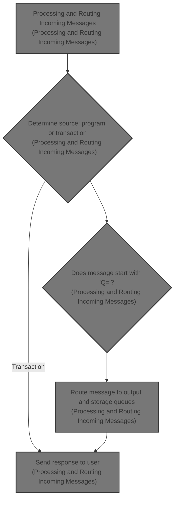

# Overview

This document describes the flow for processing and routing incoming messages. The system receives messages from either program invocations or transactions, determines their source, extracts routing information if present, and routes them to the appropriate output and storage queues. If the message was received from a transaction, a response is sent to the user.

# Where is this program used?

This program is used multiple times in the codebase as represented in the following diagram:

```mermaid
graph TD
  8q80z("Updating Policy Records (LGUPVS01)") --> 83x00("Logging and Staging Queue Management (LGSTSQ)"):::currentEntity
click 8q80z openCode "base/src/lgupvs01.cbl:1"
f808w("Updating Customer Details (LGUCUS01)") --> 83x00("Logging and Staging Queue Management (LGSTSQ)"):::currentEntity
click f808w openCode "base/src/lgucus01.cbl:1"
ofdt4("Updating Customer Details (LGUCDB01)") --> 83x00("Logging and Staging Queue Management (LGSTSQ)"):::currentEntity
click ofdt4 openCode "base/src/lgucdb01.cbl:1"
8nu1k("Updating Policy Details (LGUPOL01)") --> 83x00("Logging and Staging Queue Management (LGSTSQ)"):::currentEntity
click 8nu1k openCode "base/src/lgupol01.cbl:1"
qpeub("Updating Customer Records (LGUCVS01)") --> 83x00("Logging and Staging Queue Management (LGSTSQ)"):::currentEntity
click qpeub openCode "base/src/lgucvs01.cbl:1"
c0yh0("Updating Policy details (LGUPDB01)") --> 83x00("Logging and Staging Queue Management (LGSTSQ)"):::currentEntity
click c0yh0 openCode "base/src/lgupdb01.cbl:1"
l3hbo("Inquire Policy (LGIPOL01)") --> 83x00("Logging and Staging Queue Management (LGSTSQ)"):::currentEntity
click l3hbo openCode "base/src/lgipol01.cbl:1"
qrtpj("Inquiring Customer Details (LGICDB01)") --> 83x00("Logging and Staging Queue Management (LGSTSQ)"):::currentEntity
click qrtpj openCode "base/src/lgicdb01.cbl:1"
zzw28("Deleting Policy Records (LGDPDB01)") --> 83x00("Logging and Staging Queue Management (LGSTSQ)"):::currentEntity
click zzw28 openCode "base/src/lgdpdb01.cbl:1"
jpwaa("Inquire Policy Details (LGIPDB01)") --> 83x00("Logging and Staging Queue Management (LGSTSQ)"):::currentEntity
click jpwaa openCode "base/src/lgipdb01.cbl:1"
fg016("Deleting Policy Business Logic (LGDPOL01)") --> 83x00("Logging and Staging Queue Management (LGSTSQ)"):::currentEntity
click fg016 openCode "base/src/lgdpol01.cbl:1"
vu5vm("Inquiring Customer Details (LGICUS01)") --> 83x00("Logging and Staging Queue Management (LGSTSQ)"):::currentEntity
click vu5vm openCode "base/src/lgicus01.cbl:1"
kcv8h("Deleting Policy Records (LGDPVS01)") --> 83x00("Logging and Staging Queue Management (LGSTSQ)"):::currentEntity
click kcv8h openCode "base/src/lgdpvs01.cbl:1"
u4jkp("Managing Insurance Policy Data (LGAPDB09)") --> 83x00("Logging and Staging Queue Management (LGSTSQ)"):::currentEntity
click u4jkp openCode "base/src/lgapdb09.cbl:1"
ze5os("Adding Customer Details (LGACDB01)") --> 83x00("Logging and Staging Queue Management (LGSTSQ)"):::currentEntity
click ze5os openCode "base/src/lgacdb01.cbl:1"
z7m5t("Adding Customer (LGACUS01)") --> 83x00("Logging and Staging Queue Management (LGSTSQ)"):::currentEntity
click z7m5t openCode "base/src/lgacus01.cbl:1"
c61ri("Adding Customer Passwords (LGACDB02)") --> 83x00("Logging and Staging Queue Management (LGSTSQ)"):::currentEntity
click c61ri openCode "base/src/lgacdb02.cbl:1"
okc9g("Adding Customer Records (LGACVS01)") --> 83x00("Logging and Staging Queue Management (LGSTSQ)"):::currentEntity
click okc9g openCode "base/src/lgacvs01.cbl:1"
n4b8s("Writing Insurance Policy Data Records (LGAPVS01)") --> 83x00("Logging and Staging Queue Management (LGSTSQ)"):::currentEntity
click n4b8s openCode "base/src/lgapvs01.cbl:1"
vae3r("Processing and Validating Policy Data (LGAPOL01)") --> 83x00("Logging and Staging Queue Management (LGSTSQ)"):::currentEntity
click vae3r openCode "base/src/lgapol01.cbl:1"
  
  
click 83x00 openCode "base/src/lgstsq.cbl:1"
    classDef currentEntity color:#000000,fill:#7CB9F4

%% Swimm:
%% graph TD
%%   8q80z("Updating Policy Records (LGUPVS01)") --> 83x00("Logging and Staging Queue Management (LGSTSQ)"):::currentEntity
%% click 8q80z openCode "<SwmPath>[base/src/lgupvs01.cbl](base/src/lgupvs01.cbl)</SwmPath>:1"
%% f808w("Updating Customer Details (LGUCUS01)") --> 83x00("Logging and Staging Queue Management (LGSTSQ)"):::currentEntity
%% click f808w openCode "<SwmPath>[base/src/lgucus01.cbl](base/src/lgucus01.cbl)</SwmPath>:1"
%% ofdt4("Updating Customer Details (LGUCDB01)") --> 83x00("Logging and Staging Queue Management (LGSTSQ)"):::currentEntity
%% click ofdt4 openCode "<SwmPath>[base/src/lgucdb01.cbl](base/src/lgucdb01.cbl)</SwmPath>:1"
%% 8nu1k("Updating Policy Details (LGUPOL01)") --> 83x00("Logging and Staging Queue Management (LGSTSQ)"):::currentEntity
%% click 8nu1k openCode "<SwmPath>[base/src/lgupol01.cbl](base/src/lgupol01.cbl)</SwmPath>:1"
%% qpeub("Updating Customer Records (LGUCVS01)") --> 83x00("Logging and Staging Queue Management (LGSTSQ)"):::currentEntity
%% click qpeub openCode "<SwmPath>[base/src/lgucvs01.cbl](base/src/lgucvs01.cbl)</SwmPath>:1"
%% c0yh0("Updating Policy details (LGUPDB01)") --> 83x00("Logging and Staging Queue Management (LGSTSQ)"):::currentEntity
%% click c0yh0 openCode "<SwmPath>[base/src/lgupdb01.cbl](base/src/lgupdb01.cbl)</SwmPath>:1"
%% l3hbo("Inquire Policy (LGIPOL01)") --> 83x00("Logging and Staging Queue Management (LGSTSQ)"):::currentEntity
%% click l3hbo openCode "<SwmPath>[base/src/lgipol01.cbl](base/src/lgipol01.cbl)</SwmPath>:1"
%% qrtpj("Inquiring Customer Details (LGICDB01)") --> 83x00("Logging and Staging Queue Management (LGSTSQ)"):::currentEntity
%% click qrtpj openCode "<SwmPath>[base/src/lgicdb01.cbl](base/src/lgicdb01.cbl)</SwmPath>:1"
%% zzw28("Deleting Policy Records (LGDPDB01)") --> 83x00("Logging and Staging Queue Management (LGSTSQ)"):::currentEntity
%% click zzw28 openCode "<SwmPath>[base/src/lgdpdb01.cbl](base/src/lgdpdb01.cbl)</SwmPath>:1"
%% jpwaa("Inquire Policy Details (LGIPDB01)") --> 83x00("Logging and Staging Queue Management (LGSTSQ)"):::currentEntity
%% click jpwaa openCode "<SwmPath>[base/src/lgipdb01.cbl](base/src/lgipdb01.cbl)</SwmPath>:1"
%% fg016("Deleting Policy Business Logic (LGDPOL01)") --> 83x00("Logging and Staging Queue Management (LGSTSQ)"):::currentEntity
%% click fg016 openCode "<SwmPath>[base/src/lgdpol01.cbl](base/src/lgdpol01.cbl)</SwmPath>:1"
%% vu5vm("Inquiring Customer Details (LGICUS01)") --> 83x00("Logging and Staging Queue Management (LGSTSQ)"):::currentEntity
%% click vu5vm openCode "<SwmPath>[base/src/lgicus01.cbl](base/src/lgicus01.cbl)</SwmPath>:1"
%% kcv8h("Deleting Policy Records (LGDPVS01)") --> 83x00("Logging and Staging Queue Management (LGSTSQ)"):::currentEntity
%% click kcv8h openCode "<SwmPath>[base/src/lgdpvs01.cbl](base/src/lgdpvs01.cbl)</SwmPath>:1"
%% u4jkp("Managing Insurance Policy Data (LGAPDB09)") --> 83x00("Logging and Staging Queue Management (LGSTSQ)"):::currentEntity
%% click u4jkp openCode "<SwmPath>[base/src/lgapdb09.cbl](base/src/lgapdb09.cbl)</SwmPath>:1"
%% ze5os("Adding Customer Details (LGACDB01)") --> 83x00("Logging and Staging Queue Management (LGSTSQ)"):::currentEntity
%% click ze5os openCode "<SwmPath>[base/src/lgacdb01.cbl](base/src/lgacdb01.cbl)</SwmPath>:1"
%% z7m5t("Adding Customer (LGACUS01)") --> 83x00("Logging and Staging Queue Management (LGSTSQ)"):::currentEntity
%% click z7m5t openCode "<SwmPath>[base/src/lgacus01.cbl](base/src/lgacus01.cbl)</SwmPath>:1"
%% c61ri("Adding Customer Passwords (LGACDB02)") --> 83x00("Logging and Staging Queue Management (LGSTSQ)"):::currentEntity
%% click c61ri openCode "<SwmPath>[base/src/lgacdb02.cbl](base/src/lgacdb02.cbl)</SwmPath>:1"
%% okc9g("Adding Customer Records (LGACVS01)") --> 83x00("Logging and Staging Queue Management (LGSTSQ)"):::currentEntity
%% click okc9g openCode "<SwmPath>[base/src/lgacvs01.cbl](base/src/lgacvs01.cbl)</SwmPath>:1"
%% n4b8s("Writing Insurance Policy Data Records (LGAPVS01)") --> 83x00("Logging and Staging Queue Management (LGSTSQ)"):::currentEntity
%% click n4b8s openCode "<SwmPath>[base/src/lgapvs01.cbl](base/src/lgapvs01.cbl)</SwmPath>:1"
%% vae3r("Processing and Validating Policy Data (LGAPOL01)") --> 83x00("Logging and Staging Queue Management (LGSTSQ)"):::currentEntity
%% click vae3r openCode "<SwmPath>[base/src/lgapol01.cbl](base/src/lgapol01.cbl)</SwmPath>:1"
%%   
%%   
%% click 83x00 openCode "<SwmPath>[base/src/lgstsq.cbl](base/src/lgstsq.cbl)</SwmPath>:1"
%%     classDef currentEntity color:#000000,fill:#7CB9F4
```

&nbsp;

*This is an auto-generated document by Swimm 🌊 and has not yet been verified by a human*

<SwmMeta version="3.0.0" repo-id="Z2l0aHViJTNBJTNBU3dpbW1pby1nZW5hcHAtbW90b3IlM0ElM0FHaXJpLVN3aW1t" repo-name="Swimmio-genapp-motor">Powered by [Swimm](https://app.swimm.io/)</SwmMeta>
