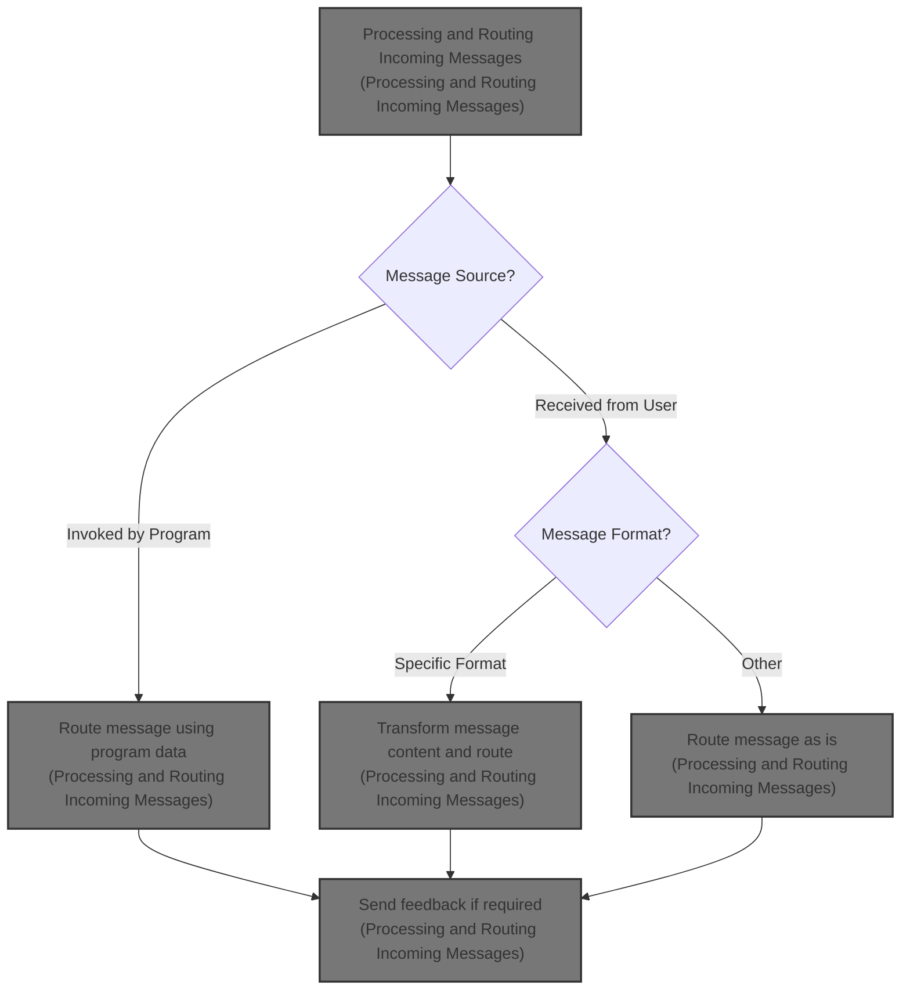

# Overview

This document describes the flow for processing and routing incoming messages. Messages may originate from other programs or direct user input, and are transformed and routed to output and error queues. User feedback is provided when appropriate.



# Where is this program used?

This program is used multiple times in the codebase as represented in the following diagram:

```mermaid
graph TD
  v68qm("Updating Policy Records (LGUPVS01)") --> bkln2("Logging and Staging Queue Management (LGSTSQ)"):::currentEntity
click v68qm openCode "base/src/lgupvs01.cbl:1"
hl6lk("Updating Customer Details (LGUCUS01)") --> bkln2("Logging and Staging Queue Management (LGSTSQ)"):::currentEntity
click hl6lk openCode "base/src/lgucus01.cbl:1"
f7gn3("Updating Customer Details (LGUCDB01)") --> bkln2("Logging and Staging Queue Management (LGSTSQ)"):::currentEntity
click f7gn3 openCode "base/src/lgucdb01.cbl:1"
bel6y("Updating Policy Details (LGUPOL01)") --> bkln2("Logging and Staging Queue Management (LGSTSQ)"):::currentEntity
click bel6y openCode "base/src/lgupol01.cbl:1"
mmkhg("Updating Customer Records (LGUCVS01)") --> bkln2("Logging and Staging Queue Management (LGSTSQ)"):::currentEntity
click mmkhg openCode "base/src/lgucvs01.cbl:1"
1m950("Updating Policy details (LGUPDB01)") --> bkln2("Logging and Staging Queue Management (LGSTSQ)"):::currentEntity
click 1m950 openCode "base/src/lgupdb01.cbl:1"
pe4w0("Inquire Policy (LGIPOL01)") --> bkln2("Logging and Staging Queue Management (LGSTSQ)"):::currentEntity
click pe4w0 openCode "base/src/lgipol01.cbl:1"
p8w1k("Inquiring Customer Details (LGICDB01)") --> bkln2("Logging and Staging Queue Management (LGSTSQ)"):::currentEntity
click p8w1k openCode "base/src/lgicdb01.cbl:1"
4y5ld("Deleting Policy Records (LGDPDB01)") --> bkln2("Logging and Staging Queue Management (LGSTSQ)"):::currentEntity
click 4y5ld openCode "base/src/lgdpdb01.cbl:1"
30wy6("Inquire Policy Details (LGIPDB01)") --> bkln2("Logging and Staging Queue Management (LGSTSQ)"):::currentEntity
click 30wy6 openCode "base/src/lgipdb01.cbl:1"
1t5wr("Deleting Policy Business Logic (LGDPOL01)") --> bkln2("Logging and Staging Queue Management (LGSTSQ)"):::currentEntity
click 1t5wr openCode "base/src/lgdpol01.cbl:1"
xetj3("Inquiring Customer Details (LGICUS01)") --> bkln2("Logging and Staging Queue Management (LGSTSQ)"):::currentEntity
click xetj3 openCode "base/src/lgicus01.cbl:1"
cym7w("Deleting Policy Records (LGDPVS01)") --> bkln2("Logging and Staging Queue Management (LGSTSQ)"):::currentEntity
click cym7w openCode "base/src/lgdpvs01.cbl:1"
k9d0l("Managing Insurance Policy Data (LGAPDB09)") --> bkln2("Logging and Staging Queue Management (LGSTSQ)"):::currentEntity
click k9d0l openCode "base/src/lgapdb09.cbl:1"
c8gkc("Adding Customer Details (LGACDB01)") --> bkln2("Logging and Staging Queue Management (LGSTSQ)"):::currentEntity
click c8gkc openCode "base/src/lgacdb01.cbl:1"
9jy3f("Adding Customer (LGACUS01)") --> bkln2("Logging and Staging Queue Management (LGSTSQ)"):::currentEntity
click 9jy3f openCode "base/src/lgacus01.cbl:1"
cabk9("Adding Customer Passwords (LGACDB02)") --> bkln2("Logging and Staging Queue Management (LGSTSQ)"):::currentEntity
click cabk9 openCode "base/src/lgacdb02.cbl:1"
n9k4n("Adding Customer Records (LGACVS01)") --> bkln2("Logging and Staging Queue Management (LGSTSQ)"):::currentEntity
click n9k4n openCode "base/src/lgacvs01.cbl:1"
nh7rs("Writing Insurance Policy Data Records (LGAPVS01)") --> bkln2("Logging and Staging Queue Management (LGSTSQ)"):::currentEntity
click nh7rs openCode "base/src/lgapvs01.cbl:1"
39ryd("Processing and Validating Policy Data (LGAPOL01)") --> bkln2("Logging and Staging Queue Management (LGSTSQ)"):::currentEntity
click 39ryd openCode "base/src/lgapol01.cbl:1"
  
  
click bkln2 openCode "base/src/lgstsq.cbl:1"
    classDef currentEntity color:#000000,fill:#7CB9F4

%% Swimm:
%% graph TD
%%   v68qm("Updating Policy Records (LGUPVS01)") --> bkln2("Logging and Staging Queue Management (LGSTSQ)"):::currentEntity
%% click v68qm openCode "<SwmPath>[base/src/lgupvs01.cbl](base/src/lgupvs01.cbl)</SwmPath>:1"
%% hl6lk("Updating Customer Details (LGUCUS01)") --> bkln2("Logging and Staging Queue Management (LGSTSQ)"):::currentEntity
%% click hl6lk openCode "<SwmPath>[base/src/lgucus01.cbl](base/src/lgucus01.cbl)</SwmPath>:1"
%% f7gn3("Updating Customer Details (LGUCDB01)") --> bkln2("Logging and Staging Queue Management (LGSTSQ)"):::currentEntity
%% click f7gn3 openCode "<SwmPath>[base/src/lgucdb01.cbl](base/src/lgucdb01.cbl)</SwmPath>:1"
%% bel6y("Updating Policy Details (LGUPOL01)") --> bkln2("Logging and Staging Queue Management (LGSTSQ)"):::currentEntity
%% click bel6y openCode "<SwmPath>[base/src/lgupol01.cbl](base/src/lgupol01.cbl)</SwmPath>:1"
%% mmkhg("Updating Customer Records (LGUCVS01)") --> bkln2("Logging and Staging Queue Management (LGSTSQ)"):::currentEntity
%% click mmkhg openCode "<SwmPath>[base/src/lgucvs01.cbl](base/src/lgucvs01.cbl)</SwmPath>:1"
%% 1m950("Updating Policy details (LGUPDB01)") --> bkln2("Logging and Staging Queue Management (LGSTSQ)"):::currentEntity
%% click 1m950 openCode "<SwmPath>[base/src/lgupdb01.cbl](base/src/lgupdb01.cbl)</SwmPath>:1"
%% pe4w0("Inquire Policy (LGIPOL01)") --> bkln2("Logging and Staging Queue Management (LGSTSQ)"):::currentEntity
%% click pe4w0 openCode "<SwmPath>[base/src/lgipol01.cbl](base/src/lgipol01.cbl)</SwmPath>:1"
%% p8w1k("Inquiring Customer Details (LGICDB01)") --> bkln2("Logging and Staging Queue Management (LGSTSQ)"):::currentEntity
%% click p8w1k openCode "<SwmPath>[base/src/lgicdb01.cbl](base/src/lgicdb01.cbl)</SwmPath>:1"
%% 4y5ld("Deleting Policy Records (LGDPDB01)") --> bkln2("Logging and Staging Queue Management (LGSTSQ)"):::currentEntity
%% click 4y5ld openCode "<SwmPath>[base/src/lgdpdb01.cbl](base/src/lgdpdb01.cbl)</SwmPath>:1"
%% 30wy6("Inquire Policy Details (LGIPDB01)") --> bkln2("Logging and Staging Queue Management (LGSTSQ)"):::currentEntity
%% click 30wy6 openCode "<SwmPath>[base/src/lgipdb01.cbl](base/src/lgipdb01.cbl)</SwmPath>:1"
%% 1t5wr("Deleting Policy Business Logic (LGDPOL01)") --> bkln2("Logging and Staging Queue Management (LGSTSQ)"):::currentEntity
%% click 1t5wr openCode "<SwmPath>[base/src/lgdpol01.cbl](base/src/lgdpol01.cbl)</SwmPath>:1"
%% xetj3("Inquiring Customer Details (LGICUS01)") --> bkln2("Logging and Staging Queue Management (LGSTSQ)"):::currentEntity
%% click xetj3 openCode "<SwmPath>[base/src/lgicus01.cbl](base/src/lgicus01.cbl)</SwmPath>:1"
%% cym7w("Deleting Policy Records (LGDPVS01)") --> bkln2("Logging and Staging Queue Management (LGSTSQ)"):::currentEntity
%% click cym7w openCode "<SwmPath>[base/src/lgdpvs01.cbl](base/src/lgdpvs01.cbl)</SwmPath>:1"
%% k9d0l("Managing Insurance Policy Data (LGAPDB09)") --> bkln2("Logging and Staging Queue Management (LGSTSQ)"):::currentEntity
%% click k9d0l openCode "<SwmPath>[base/src/lgapdb09.cbl](base/src/lgapdb09.cbl)</SwmPath>:1"
%% c8gkc("Adding Customer Details (LGACDB01)") --> bkln2("Logging and Staging Queue Management (LGSTSQ)"):::currentEntity
%% click c8gkc openCode "<SwmPath>[base/src/lgacdb01.cbl](base/src/lgacdb01.cbl)</SwmPath>:1"
%% 9jy3f("Adding Customer (LGACUS01)") --> bkln2("Logging and Staging Queue Management (LGSTSQ)"):::currentEntity
%% click 9jy3f openCode "<SwmPath>[base/src/lgacus01.cbl](base/src/lgacus01.cbl)</SwmPath>:1"
%% cabk9("Adding Customer Passwords (LGACDB02)") --> bkln2("Logging and Staging Queue Management (LGSTSQ)"):::currentEntity
%% click cabk9 openCode "<SwmPath>[base/src/lgacdb02.cbl](base/src/lgacdb02.cbl)</SwmPath>:1"
%% n9k4n("Adding Customer Records (LGACVS01)") --> bkln2("Logging and Staging Queue Management (LGSTSQ)"):::currentEntity
%% click n9k4n openCode "<SwmPath>[base/src/lgacvs01.cbl](base/src/lgacvs01.cbl)</SwmPath>:1"
%% nh7rs("Writing Insurance Policy Data Records (LGAPVS01)") --> bkln2("Logging and Staging Queue Management (LGSTSQ)"):::currentEntity
%% click nh7rs openCode "<SwmPath>[base/src/lgapvs01.cbl](base/src/lgapvs01.cbl)</SwmPath>:1"
%% 39ryd("Processing and Validating Policy Data (LGAPOL01)") --> bkln2("Logging and Staging Queue Management (LGSTSQ)"):::currentEntity
%% click 39ryd openCode "<SwmPath>[base/src/lgapol01.cbl](base/src/lgapol01.cbl)</SwmPath>:1"
%%   
%%   
%% click bkln2 openCode "<SwmPath>[base/src/lgstsq.cbl](base/src/lgstsq.cbl)</SwmPath>:1"
%%     classDef currentEntity color:#000000,fill:#7CB9F4
```



# Workflow

# Processing and Routing Incoming Messages

```mermaid
%%{init: {"flowchart": {"defaultRenderer": "elk"}} }%%
flowchart TD
    node1["Start: Prepare message and system info"]
    click node1 openCode "base/src/lgstsq.cbl:55:66"
    node1 --> node2{"Was program invoked?"}
    click node2 openCode "base/src/lgstsq.cbl:68:80"
    node2 -->|"Invoked"| node3["Use program data for message"]
    click node3 openCode "base/src/lgstsq.cbl:68:72"
    node2 -->|"Received"| node4["Receive message from user"]
    click node4 openCode "base/src/lgstsq.cbl:73:80"
    node3 --> node5["Set queue name to 'GENAERRS'"]
    click node5 openCode "base/src/lgstsq.cbl:82:82"
    node4 --> node5
    node5 --> node6{"Does message start with 'Q='?"}
    click node6 openCode "base/src/lgstsq.cbl:83:88"
    node6 -->|"Yes"| node7["Transform message: extract extension, update content"]
    click node7 openCode "base/src/lgstsq.cbl:84:87"
    node6 -->|"No"| node8["Proceed with message as is"]
    click node8 openCode "base/src/lgstsq.cbl:83:88"
    node7 --> node9["Write message to output and error queues"]
    click node9 openCode "base/src/lgstsq.cbl:90:111"
    node8 --> node9
    node9 --> node10{"Was message received?"}
    click node10 openCode "base/src/lgstsq.cbl:113:113"
    node10 -->|"Yes"| node11["Send feedback to user"]
    click node11 openCode "base/src/lgstsq.cbl:114:119"
    node10 -->|"No"| node12["End transaction"]
    click node12 openCode "base/src/lgstsq.cbl:121:122"
classDef HeadingStyle fill:#777777,stroke:#333,stroke-width:2px;

%% Swimm:
%% %%{init: {"flowchart": {"defaultRenderer": "elk"}} }%%
%% flowchart TD
%%     node1["Start: Prepare message and system info"]
%%     click node1 openCode "<SwmPath>[base/src/lgstsq.cbl](base/src/lgstsq.cbl)</SwmPath>:55:66"
%%     node1 --> node2{"Was program invoked?"}
%%     click node2 openCode "<SwmPath>[base/src/lgstsq.cbl](base/src/lgstsq.cbl)</SwmPath>:68:80"
%%     node2 -->|"Invoked"| node3["Use program data for message"]
%%     click node3 openCode "<SwmPath>[base/src/lgstsq.cbl](base/src/lgstsq.cbl)</SwmPath>:68:72"
%%     node2 -->|"Received"| node4["Receive message from user"]
%%     click node4 openCode "<SwmPath>[base/src/lgstsq.cbl](base/src/lgstsq.cbl)</SwmPath>:73:80"
%%     node3 --> node5["Set queue name to 'GENAERRS'"]
%%     click node5 openCode "<SwmPath>[base/src/lgstsq.cbl](base/src/lgstsq.cbl)</SwmPath>:82:82"
%%     node4 --> node5
%%     node5 --> node6{"Does message start with 'Q='?"}
%%     click node6 openCode "<SwmPath>[base/src/lgstsq.cbl](base/src/lgstsq.cbl)</SwmPath>:83:88"
%%     node6 -->|"Yes"| node7["Transform message: extract extension, update content"]
%%     click node7 openCode "<SwmPath>[base/src/lgstsq.cbl](base/src/lgstsq.cbl)</SwmPath>:84:87"
%%     node6 -->|"No"| node8["Proceed with message as is"]
%%     click node8 openCode "<SwmPath>[base/src/lgstsq.cbl](base/src/lgstsq.cbl)</SwmPath>:83:88"
%%     node7 --> node9["Write message to output and error queues"]
%%     click node9 openCode "<SwmPath>[base/src/lgstsq.cbl](base/src/lgstsq.cbl)</SwmPath>:90:111"
%%     node8 --> node9
%%     node9 --> node10{"Was message received?"}
%%     click node10 openCode "<SwmPath>[base/src/lgstsq.cbl](base/src/lgstsq.cbl)</SwmPath>:113:113"
%%     node10 -->|"Yes"| node11["Send feedback to user"]
%%     click node11 openCode "<SwmPath>[base/src/lgstsq.cbl](base/src/lgstsq.cbl)</SwmPath>:114:119"
%%     node10 -->|"No"| node12["End transaction"]
%%     click node12 openCode "<SwmPath>[base/src/lgstsq.cbl](base/src/lgstsq.cbl)</SwmPath>:121:122"
%% classDef HeadingStyle fill:#777777,stroke:#333,stroke-width:2px;
```



This section is responsible for handling incoming messages, determining their source, transforming them if necessary, and routing them to the appropriate queues for downstream processing. It also provides user feedback when required.

<SwmSnippet path="/base/src/lgstsq.cbl" line="55">

---

In MAINLINE, this is where the flow starts: it clears out the message and receive buffers, then grabs the system ID and the name of the invoking program using CICS ASSIGN. This sets up the context for how the message will be processed next.

```cobol
       MAINLINE SECTION.

           MOVE SPACES TO WRITE-MSG.
           MOVE SPACES TO WS-RECV.

           EXEC CICS ASSIGN SYSID(WRITE-MSG-SYSID)
                RESP(WS-RESP)
           END-EXEC.

           EXEC CICS ASSIGN INVOKINGPROG(WS-INVOKEPROG)
                RESP(WS-RESP)
           END-EXEC.
```

---

</SwmSnippet>

<SwmSnippet path="/base/src/lgstsq.cbl" line="68">

---

Here the code checks if the program was invoked by another program or received a message directly. It sets <SwmToken path="base/src/lgstsq.cbl" pos="69:9:11" line-data="              MOVE &#39;C&#39; To WS-FLAG">`WS-FLAG`</SwmToken> accordingly, pulls the message from the right place, and adjusts the message length if it was received. This sets up the rest of the flow to handle the message source correctly.

```cobol
           IF WS-INVOKEPROG NOT = SPACES
              MOVE 'C' To WS-FLAG
              MOVE COMMA-DATA  TO WRITE-MSG-MSG
              MOVE EIBCALEN    TO WS-RECV-LEN
           ELSE
              EXEC CICS RECEIVE INTO(WS-RECV)
                  LENGTH(WS-RECV-LEN)
                  RESP(WS-RESP)
              END-EXEC
              MOVE 'R' To WS-FLAG
              MOVE WS-RECV-DATA  TO WRITE-MSG-MSG
              SUBTRACT 5 FROM WS-RECV-LEN
           END-IF.
```

---

</SwmSnippet>

<SwmSnippet path="/base/src/lgstsq.cbl" line="82">

---

Here the code looks for a 'Q=' prefix in the message. If found, it extracts the extension, strips the prefix and extension from the message, and updates the message length. This is a custom message format thing.

```cobol
           MOVE 'GENAERRS' TO STSQ-NAME.
           IF WRITE-MSG-MSG(1:2) = 'Q=' THEN
              MOVE WRITE-MSG-MSG(3:4) TO STSQ-EXT
              MOVE WRITE-MSG-REST TO TEMPO
              MOVE TEMPO          TO WRITE-MSG-MSG
              SUBTRACT 7 FROM WS-RECV-LEN
           END-IF.
```

---

</SwmSnippet>

<SwmSnippet path="/base/src/lgstsq.cbl" line="90">

---

Here the code adds 5 back to the message length (after earlier subtractions) and writes the message to the transient data queue (TDQ) using CICS WRITEQ TD. This makes the message available for downstream consumers that read from the TDQ.

```cobol
           ADD 5 TO WS-RECV-LEN.

      * Write output message to TDQ CSMT
      *
           EXEC CICS WRITEQ TD QUEUE(STDQ-NAME)
                     FROM(WRITE-MSG)
                     RESP(WS-RESP)
                     LENGTH(WS-RECV-LEN)

           END-EXEC.
```

---

</SwmSnippet>

<SwmSnippet path="/base/src/lgstsq.cbl" line="105">

---

Here the code writes the message to the temporary storage queue (TSQ) with NOSUSPEND, so if the queue is full, it just skips waiting. This is the second place the message is stored for different consumers.

```cobol
           EXEC CICS WRITEQ TS QUEUE(STSQ-NAME)
                     FROM(WRITE-MSG)
                     RESP(WS-RESP)
                     NOSUSPEND
                     LENGTH(WS-RECV-LEN)

           END-EXEC.
```

---

</SwmSnippet>

<SwmSnippet path="/base/src/lgstsq.cbl" line="113">

---

Finally, if the message was received (not called), the code sends back a single space as an acknowledgment, then returns from the program. No response is sent if the message came from another program.

```cobol
           If WS-FLAG = 'R' Then
             EXEC CICS SEND TEXT FROM(FILLER-X)
              WAIT
              ERASE
              LENGTH(1)
              FREEKB
             END-EXEC.

           EXEC CICS RETURN
           END-EXEC.
```

---

</SwmSnippet>

&nbsp;

*This is an auto-generated document by Swimm 🌊 and has not yet been verified by a human*

<SwmMeta version="3.0.0" repo-id="Z2l0aHViJTNBJTNBU3dpbW1pby1nZW5hcHAtbW90b3IlM0ElM0FHaXJpLVN3aW1t" repo-name="Swimmio-genapp-motor"><sup>Powered by [Swimm](https://app.swimm.io/)</sup></SwmMeta>
