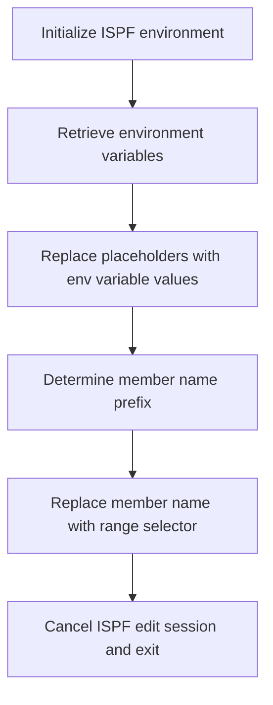

# What the script does

The mac1 Rexx script is designed to perform a series of text substitutions within an ISPF editor session. It replaces placeholder tokens enclosed in angle brackets with their corresponding environment variable values. This process effectively customizes or configures the content of the current member being edited by substituting predefined symbolic names with actual values. For example, if the script encounters the token <CICSHLQ> in the text, it replaces it with the value of the CICSHLQ environment variable. The input is the current text in the ISPF editor, and the output is the same text with all specified placeholders replaced by their respective values.

# Script Flow

The script flow can be broken down into the following main steps:

- Initialize the ISPF environment and prepare for editing.
- Retrieve a set of environment variables relevant to the system and application context.
- For each predefined placeholder token, perform a global replacement in the current ISPF editor member, substituting the token with the corresponding environment variable value.
- Determine the member name and prepend a special character (# or @) based on a condition.
- Replace the member name with a range selector string to mark the first and last lines.
- Cancel the ISPF edit session and exit the script.



<SwmSnippet path="/base/exec/mac1.rexx" line="6">

---

First, the script sets the address to ISPEXEC and issues a command to trace the ISREDIT macro execution, preparing the environment for subsequent editing commands.

```rexx
Address Ispexec
"Isredit Macro (TRACE)"

```

---

</SwmSnippet>

<SwmSnippet path="/base/exec/mac1.rexx" line="9">

---

Next, the script retrieves multiple environment variables using the ISPEXEC VGET command. These variables include system identifiers, application names, and dataset names that will be used for substitution in the editor content.

```rexx
"ISPEXEC VGET (CICSHLQ CPSMHLQ CICSLIC USRHLQ COBOLHLQ DB2HLQ CEEHLQ)"
"ISPEXEC VGET (CSDNAME DB2RUN SQLID DB2SSID DB2DBID DB2CCSID DB2PLAN)"
"ISPEXEC VGET (TORAPPL AORAPPL DORAPPL TORSYSID AORSYSID DORSYSID)"
"ISPEXEC VGET (CMASAPPL CMASYSID WUIAPPL WUISYSID WSIMHLQ)"
"ISPEXEC VGET (PDSDBRM PDSMACP PDSLOAD PDSMSGS WSIMLOG WSIMSTL)"
"ISPEXEC VGET (KSDSCUS KSDSPOL SOURCEX LOADX MAPCOPX DBRMLIX)"
"ISPEXEC VGET (WSIMLGX WSIMWSX WSIMMSX ZFSHOME)"
```

---

</SwmSnippet>

<SwmSnippet path="/base/exec/mac1.rexx" line="16">

---

Then, the script performs a series of global replacements in the current ISPF editor member. For each placeholder token such as <CICSHLQ>, it replaces all occurrences with the corresponding environment variable value, effectively customizing the content.

```rexx
"Isredit Change '<CICSHLQ>' '"CICSHLQ"' All"
"Isredit Change '<CPSMHLQ>' '"CPSMHLQ"' All"
"Isredit Change '<CICSLIC>' '"CICSLIC"' All"
"Isredit Change '<USRHLQ>' '"USRHLQ"' All"
"Isredit Change '<COBOLHLQ>' '"COBOLHLQ"' All"
"Isredit Change '<DB2HLQ>' '"DB2HLQ"' All"
"Isredit Change '<CEEHLQ>' '"CEEHLQ"' All"
"Isredit Change '<CSDNAME>' '"CSDNAME"' All"
"Isredit Change '<DB2RUN>' '"DB2RUN"' All"
"Isredit Change '<SQLID>' '"SQLID"' All"
"Isredit Change '<DB2SSID>' '"DB2SSID"' All"
"Isredit Change '<DB2DBID>' '"DB2DBID"' All"
"Isredit Change '<DB2CCSID>' '"DB2CCSID"' All"
"Isredit Change '<DB2PLAN>' '"DB2PLAN"' All"
"Isredit Change '<TORAPPL>' '"TORAPPL"' All"
"Isredit Change '<AORAPPL>' '"AORAPPL"' All"
"Isredit Change '<DORAPPL>' '"DORAPPL"' All"
"Isredit Change '<TORSYSID>' '"TORSYSID"' All"
"Isredit Change '<AORSYSID>' '"AORSYSID"' All"
"Isredit Change '<DORSYSID>' '"DORSYSID"' All"
"Isredit Change '<CMASAPPL>' '"CMASAPPL"' All"
"Isredit Change '<CMASYSID>' '"CMASYSID"' All"
"Isredit Change '<WUIAPPL>' '"WUIAPPL"' All"
"Isredit Change '<WUISYSID>' '"WUISYSID"' All"
"Isredit Change '<WSIMHLQ>' '"WSIMHLQ"' All"
"Isredit Change '<PDSDBRM>' '"WSIMHLQ"' All"
"Isredit Change '<PDSMACP>' '"WSIMHLQ"' All"
"Isredit Change '<PDSLOAD>' '"WSIMHLQ"' All"
"Isredit Change '<PDSMSGS>' '"WSIMHLQ"' All"
"Isredit Change '<WSIMLOG>' '"WSIMHLQ"' All"
"Isredit Change '<WSIMSTL>' '"WSIMHLQ"' All"
"Isredit Change '<KSDSPOL>' '"KSDSPOL"' All"
"Isredit Change '<KSDSCUS>' '"KSDSCUS"' All"
"Isredit Change '<SOURCEX>' '"SOURCEX"' All"
"Isredit Change '<LOADX>' '"LOADX"' All"
"Isredit Change '<MAPCOPX>' '"MAPCOPX"' All"
"Isredit Change '<DBRMLIX>' '"DBRMLIX"' All"
"Isredit Change '<WSIMWSX>' '"WSIMWSX"' All"
"Isredit Change '<WSIMMSX>' '"WSIMMSX"' All"
"Isredit Change '<WSIMLGX>' '"WSIMLGX"' All"
"Isredit Change '<ZFSHOME>' '"ZFSHOME"' All"
```

---

</SwmSnippet>

<SwmSnippet path="/base/exec/mac1.rexx" line="58">

---

Going into member name handling, the script retrieves the current member name into a variable. It then prefixes the member name with '#' if it matches 'ONCICS', otherwise it prefixes with '@'. This likely serves to mark or categorize the member for further processing.

```rexx
"Isredit (memnme) = MEMBER"
If memnme = 'ONCICS' Then memnme = '#' || memnme
                     Else memnme = '@' || memnme
```

---

</SwmSnippet>

<SwmSnippet path="/base/exec/mac1.rexx" line="61">

---

Finally, the script replaces the member name in the editor with a range selector '.zfirst .zlast' to mark the boundaries of the edited content, cancels the ISPF edit session, and exits with a success code.

```rexx
"Isredit Replace" memnme ".zfirst .zlast"
"Isredit CANCEL"

Exit 0
```

---

</SwmSnippet>

&nbsp;

*This is an auto-generated document by Swimm 🌊 and has not yet been verified by a human*

<SwmMeta version="3.0.0" repo-id="Z2l0aHViJTNBJTNBU3dpbW1pby1nZW5hcHAtbW90b3IlM0ElM0FHaXJpLVN3aW1t" repo-name="Swimmio-genapp-motor"><sup>Powered by [Swimm](https://app.swimm.io/)</sup></SwmMeta>
