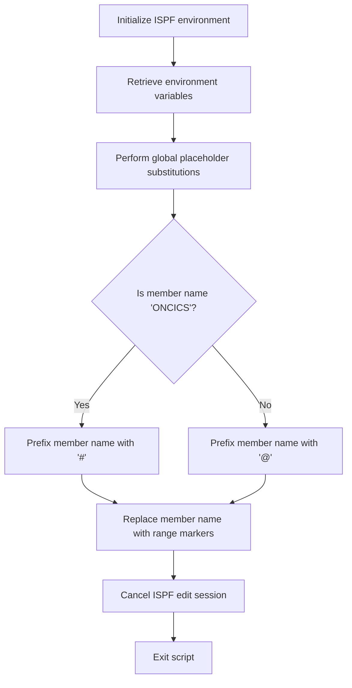

# What the script does

The mac1 Rexx script is designed to perform a series of text substitutions within an ISPF editor session. It replaces placeholder tokens enclosed in angle brackets with corresponding environment variable values. This process effectively customizes or configures source code or configuration files by substituting these placeholders with actual values. For example, if the input contains '<CICSHLQ>', the script replaces it with the value of the CICSHLQ environment variable, resulting in a file with all such placeholders replaced by their respective values.

# Script Flow

The script flow can be broken down into the following main steps:

- Initialize the ISPF environment and prepare for editing.
- Retrieve multiple environment variables using ISPEXEC VGET commands.
- Perform a sequence of global text replacements in the current ISPF editor session, substituting placeholders with environment variable values.
- Adjust the member name prefix based on a condition.
- Replace specific member name references with a range of markers.
- Cancel the ISPF edit session and exit the script.



<SwmSnippet path="/base/exec/mac1.rexx" line="6">

---

First, the script sets the address to ISPEXEC and issues a command to trace the ISREDIT macro execution, preparing the environment for subsequent commands.

```rexx
Address Ispexec
"Isredit Macro (TRACE)"

```

---

</SwmSnippet>

<SwmSnippet path="/base/exec/mac1.rexx" line="9">

---

Next, the script retrieves a series of environment variables using multiple ISPEXEC VGET commands. These variables include various high-level qualifiers, system IDs, and dataset names that will be used for substitution.

```rexx
"ISPEXEC VGET (CICSHLQ CPSMHLQ CICSLIC USRHLQ COBOLHLQ DB2HLQ CEEHLQ)"
"ISPEXEC VGET (CSDNAME DB2RUN SQLID DB2SSID DB2DBID DB2CCSID DB2PLAN)"
"ISPEXEC VGET (TORAPPL AORAPPL DORAPPL TORSYSID AORSYSID DORSYSID)"
"ISPEXEC VGET (CMASAPPL CMASYSID WUIAPPL WUISYSID WSIMHLQ)"
"ISPEXEC VGET (PDSDBRM PDSMACP PDSLOAD PDSMSGS WSIMLOG WSIMSTL)"
"ISPEXEC VGET (KSDSCUS KSDSPOL SOURCEX LOADX MAPCOPX DBRMLIX)"
"ISPEXEC VGET (WSIMLGX WSIMWSX WSIMMSX ZFSHOME)"
```

---

</SwmSnippet>

<SwmSnippet path="/base/exec/mac1.rexx" line="16">

---

Then, the script performs a sequence of global text replacements within the ISPF editor session. Each placeholder token enclosed in angle brackets is replaced with the corresponding environment variable value. This is done using the ISREDIT Change command for each placeholder.

```rexx
"Isredit Change '<CICSHLQ>' '"CICSHLQ"' All"
"Isredit Change '<CPSMHLQ>' '"CPSMHLQ"' All"
"Isredit Change '<CICSLIC>' '"CICSLIC"' All"
"Isredit Change '<USRHLQ>' '"USRHLQ"' All"
"Isredit Change '<COBOLHLQ>' '"COBOLHLQ"' All"
"Isredit Change '<DB2HLQ>' '"DB2HLQ"' All"
"Isredit Change '<CEEHLQ>' '"CEEHLQ"' All"
"Isredit Change '<CSDNAME>' '"CSDNAME"' All"
"Isredit Change '<DB2RUN>' '"DB2RUN"' All"
"Isredit Change '<SQLID>' '"SQLID"' All"
"Isredit Change '<DB2SSID>' '"DB2SSID"' All"
"Isredit Change '<DB2DBID>' '"DB2DBID"' All"
"Isredit Change '<DB2CCSID>' '"DB2CCSID"' All"
"Isredit Change '<DB2PLAN>' '"DB2PLAN"' All"
"Isredit Change '<TORAPPL>' '"TORAPPL"' All"
"Isredit Change '<AORAPPL>' '"AORAPPL"' All"
"Isredit Change '<DORAPPL>' '"DORAPPL"' All"
"Isredit Change '<TORSYSID>' '"TORSYSID"' All"
"Isredit Change '<AORSYSID>' '"AORSYSID"' All"
"Isredit Change '<DORSYSID>' '"DORSYSID"' All"
"Isredit Change '<CMASAPPL>' '"CMASAPPL"' All"
"Isredit Change '<CMASYSID>' '"CMASYSID"' All"
"Isredit Change '<WUIAPPL>' '"WUIAPPL"' All"
"Isredit Change '<WUISYSID>' '"WUISYSID"' All"
"Isredit Change '<WSIMHLQ>' '"WSIMHLQ"' All"
"Isredit Change '<PDSDBRM>' '"WSIMHLQ"' All"
"Isredit Change '<PDSMACP>' '"WSIMHLQ"' All"
"Isredit Change '<PDSLOAD>' '"WSIMHLQ"' All"
"Isredit Change '<PDSMSGS>' '"WSIMHLQ"' All"
"Isredit Change '<WSIMLOG>' '"WSIMHLQ"' All"
"Isredit Change '<WSIMSTL>' '"WSIMHLQ"' All"
"Isredit Change '<KSDSPOL>' '"KSDSPOL"' All"
"Isredit Change '<KSDSCUS>' '"KSDSCUS"' All"
"Isredit Change '<SOURCEX>' '"SOURCEX"' All"
"Isredit Change '<LOADX>' '"LOADX"' All"
"Isredit Change '<MAPCOPX>' '"MAPCOPX"' All"
"Isredit Change '<DBRMLIX>' '"DBRMLIX"' All"
"Isredit Change '<WSIMWSX>' '"WSIMWSX"' All"
"Isredit Change '<WSIMMSX>' '"WSIMMSX"' All"
"Isredit Change '<WSIMLGX>' '"WSIMLGX"' All"
"Isredit Change '<ZFSHOME>' '"ZFSHOME"' All"
```

---

</SwmSnippet>

<SwmSnippet path="/base/exec/mac1.rexx" line="58">

---

Going into member name handling, the script assigns the current member name to a variable and prefixes it with '#' if it equals 'ONCICS', otherwise it prefixes it with '@'. This conditional prefixing likely serves to distinguish or categorize members.

```rexx
"Isredit (memnme) = MEMBER"
If memnme = 'ONCICS' Then memnme = '#' || memnme
                     Else memnme = '@' || memnme
```

---

</SwmSnippet>

<SwmSnippet path="/base/exec/mac1.rexx" line="61">

---

Finally, the script replaces the prefixed member name with a range marker '.zfirst .zlast' in the ISPF editor, cancels the edit session, and exits with a success code.

```rexx
"Isredit Replace" memnme ".zfirst .zlast"
"Isredit CANCEL"

Exit 0
```

---

</SwmSnippet>

&nbsp;

*This is an auto-generated document by Swimm 🌊 and has not yet been verified by a human*

<SwmMeta version="3.0.0" repo-id="Z2l0aHViJTNBJTNBU3dpbW1pby1nZW5hcHAtbW90b3IlM0ElM0FHaXJpLVN3aW1t" repo-name="Swimmio-genapp-motor"><sup>Powered by [Swimm](https://app.swimm.io/)</sup></SwmMeta>
