# Overview

This document explains the flow for managing motor insurance policies through a menu-driven interface. Users can perform inquiries, additions, deletions, and updates of motor policies. Each action is validated and routed to backend business logic, with results or error feedback displayed to the user.

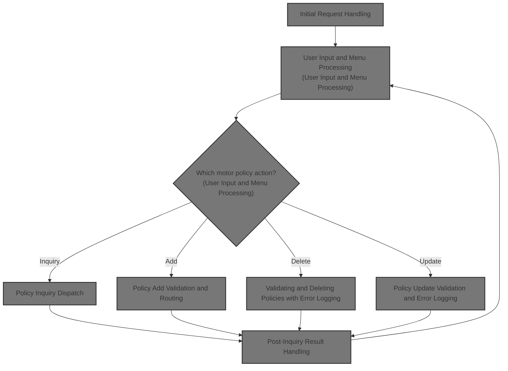
```mermaid
flowchart TD
    node1["Initial Request Handling"]:::HeadingStyle --> node2["User Input and Menu Processing
(User Input and Menu Processing)"]:::HeadingStyle
    click node1 goToHeading "Initial Request Handling"
    click node2 goToHeading "User Input and Menu Processing"
    node2 --> node3{"Which motor policy action?
(User Input and Menu Processing)"}:::HeadingStyle
    click node3 goToHeading "User Input and Menu Processing"
    node3 -->|"Inquiry"| node4["Policy Inquiry Dispatch"]:::HeadingStyle
    click node4 goToHeading "Policy Inquiry Dispatch"
    node4 --> node5["Post-Inquiry Result Handling"]:::HeadingStyle
    click node5 goToHeading "Post-Inquiry Result Handling"
    node3 -->|"Add"| node6["Policy Add Validation and Routing"]:::HeadingStyle
    click node6 goToHeading "Policy Add Validation and Routing"
    node6 --> node5
    node3 -->|"Delete"| node7["Validating and Deleting Policies with Error Logging"]:::HeadingStyle
    click node7 goToHeading "Validating and Deleting Policies with Error Logging"
    node7 --> node5
    node3 -->|"Update"| node8["Policy Update Validation and Error Logging"]:::HeadingStyle
    click node8 goToHeading "Policy Update Validation and Error Logging"
    node8 --> node5
    node5 --> node2

classDef HeadingStyle fill:#777777,stroke:#333,stroke-width:2px;
```

# Technical Overview


```mermaid
sequenceDiagram
  participant MENU as LGTESTP1.cbl<br/>*(Motor Policy Menu Controller)*
  participant INQUIRY as LGIPOL01.cbl<br/>*(Policy Inquiry Handler)*
  participant INQDB as LGIPDB01.cbl<br/>*(Policy Data Fetcher (DB2))*
  participant ADD as LGAPOL01.cbl<br/>*(Policy Add Validator)*
  participant ADDDB as base/src/LGAPDB01.cbl<br/>*(Premium Calculator and Policy Adder)*
  participant RISK as base/src/LGAPDB03.cbl<br/>*(Risk Factor and Premium Calculator)*
  participant ACTUARY as base/src/LGAPDB04.cbl<br/>*(Advanced Actuarial Calculator)*
  participant DELETE as LGDPOL01.cbl<br/>*(Policy Delete Validator)*
  participant DELDB as LGDPDB01.cbl<br/>*(Policy Deleter (DB2))*
  participant DELVSAM as LGDPVS01.cbl<br/>*(Policy Deleter (VSAM))*
  participant UPDATE as LGUPOL01.cbl<br/>*(Policy Update Validator)*
  participant UPDB as LGUPDB01.cbl<br/>*(Policy Updater (DB2))*
  participant UPVSAM as LGUPVS01.cbl<br/>*(Policy Updater (VSAM))*
  participant LOG as LGSTSQS.cbl<br/>*(Error and Message Logger)*

  MENU->>INQUIRY: Route inquiry request
  INQUIRY->>INQDB: Fetch policy data
  INQUIRY->>LOG: Log errors/messages

  MENU->>ADD: Route add request
  ADD->>ADDDB: Validate/add policy, calculate premium
  ADDDB->>RISK: Calculate risk/premium
  ADDDB->>ACTUARY: Advanced actuarial calculation
  ADD->>LOG: Log errors/messages

  MENU->>DELETE: Route delete request
  DELETE->>DELDB: Delete policy (DB2)
  DELETE->>DELVASM: Delete policy (VSAM)
  DELETE->>LOG: Log errors/messages

  MENU->>UPDATE: Route update request
  UPDATE->>UPDB: Update policy (DB2)
  UPDATE->>UPVSAM: Update policy (VSAM)
  UPDATE->>LOG: Log errors/messages

%% Swimm:
%% sequenceDiagram
%%   participant MENU as LGTESTP1.cbl<br/>*(Motor Policy Menu Controller)*
%%   participant INQUIRY as LGIPOL01.cbl<br/>*(Policy Inquiry Handler)*
%%   participant INQDB as LGIPDB01.cbl<br/>*(Policy Data Fetcher (<SwmToken path="base/src/lgipdb01.cbl" pos="242:5:5" line-data="      * initialize DB2 host variables">`DB2`</SwmToken>))*
%%   participant ADD as LGAPOL01.cbl<br/>*(Policy Add Validator)*
%%   participant ADDDB as <SwmPath>[base/src/LGAPDB01.cbl](base/src/LGAPDB01.cbl)</SwmPath><br/>*(Premium Calculator and Policy Adder)*
%%   participant RISK as <SwmPath>[base/src/LGAPDB03.cbl](base/src/LGAPDB03.cbl)</SwmPath><br/>*(Risk Factor and Premium Calculator)*
%%   participant ACTUARY as <SwmPath>[base/src/LGAPDB04.cbl](base/src/LGAPDB04.cbl)</SwmPath><br/>*(Advanced Actuarial Calculator)*
%%   participant DELETE as LGDPOL01.cbl<br/>*(Policy Delete Validator)*
%%   participant DELDB as LGDPDB01.cbl<br/>*(Policy Deleter (<SwmToken path="base/src/lgipdb01.cbl" pos="242:5:5" line-data="      * initialize DB2 host variables">`DB2`</SwmToken>))*
%%   participant DELVSAM as LGDPVS01.cbl<br/>*(Policy Deleter (VSAM))*
%%   participant UPDATE as LGUPOL01.cbl<br/>*(Policy Update Validator)*
%%   participant UPDB as LGUPDB01.cbl<br/>*(Policy Updater (<SwmToken path="base/src/lgipdb01.cbl" pos="242:5:5" line-data="      * initialize DB2 host variables">`DB2`</SwmToken>))*
%%   participant UPVSAM as LGUPVS01.cbl<br/>*(Policy Updater (VSAM))*
%%   participant LOG as LGSTSQS.cbl<br/>*(Error and Message Logger)*
%% 
%%   MENU->>INQUIRY: Route inquiry request
%%   INQUIRY->>INQDB: Fetch policy data
%%   INQUIRY->>LOG: Log errors/messages
%% 
%%   MENU->>ADD: Route add request
%%   ADD->>ADDDB: Validate/add policy, calculate premium
%%   ADDDB->>RISK: Calculate risk/premium
%%   ADDDB->>ACTUARY: Advanced actuarial calculation
%%   ADD->>LOG: Log errors/messages
%% 
%%   MENU->>DELETE: Route delete request
%%   DELETE->>DELDB: Delete policy (<SwmToken path="base/src/lgipdb01.cbl" pos="242:5:5" line-data="      * initialize DB2 host variables">`DB2`</SwmToken>)
%%   DELETE->>DELVASM: Delete policy (VSAM)
%%   DELETE->>LOG: Log errors/messages
%% 
%%   MENU->>UPDATE: Route update request
%%   UPDATE->>UPDB: Update policy (<SwmToken path="base/src/lgipdb01.cbl" pos="242:5:5" line-data="      * initialize DB2 host variables">`DB2`</SwmToken>)
%%   UPDATE->>UPVSAM: Update policy (VSAM)
%%   UPDATE->>LOG: Log errors/messages
```

## Dependencies

### Programs

- <SwmToken path="base/src/lgtestp1.cbl" pos="72:10:10" line-data="                 EXEC CICS LINK PROGRAM(&#39;LGIPOL01&#39;)">`LGIPOL01`</SwmToken> (<SwmPath>[base/src/lgipol01.cbl](base/src/lgipol01.cbl)</SwmPath>)
- <SwmToken path="base/src/lgipol01.cbl" pos="91:9:9" line-data="           EXEC CICS LINK Program(LGIPDB01)">`LGIPDB01`</SwmToken> (<SwmPath>[base/src/lgipdb01.cbl](base/src/lgipdb01.cbl)</SwmPath>)
- LGSTSQ (<SwmPath>[base/src/lgstsq.cbl](base/src/lgstsq.cbl)</SwmPath>)
- <SwmToken path="base/src/lgtestp1.cbl" pos="115:10:10" line-data="                 EXEC CICS LINK PROGRAM(&#39;LGAPOL01&#39;)">`LGAPOL01`</SwmToken> (<SwmPath>[base/src/lgapol01.cbl](base/src/lgapol01.cbl)</SwmPath>)
- <SwmToken path="base/src/lgapol01.cbl" pos="103:9:9" line-data="           EXEC CICS Link Program(LGAPDB01)">`LGAPDB01`</SwmToken> (<SwmPath>[base/src/LGAPDB01.cbl](base/src/LGAPDB01.cbl)</SwmPath>)
- <SwmToken path="base/src/LGAPDB01.cbl" pos="269:4:4" line-data="           CALL &#39;LGAPDB02&#39; USING IN-PROPERTY-TYPE, IN-POSTCODE, ">`LGAPDB02`</SwmToken>
- <SwmToken path="base/src/LGAPDB01.cbl" pos="276:4:4" line-data="           CALL &#39;LGAPDB03&#39; USING WS-BASE-RISK-SCR, IN-FIRE-PERIL, ">`LGAPDB03`</SwmToken> (<SwmPath>[base/src/LGAPDB03.cbl](base/src/LGAPDB03.cbl)</SwmPath>)
- <SwmToken path="base/src/LGAPDB01.cbl" pos="313:4:4" line-data="               CALL &#39;LGAPDB04&#39; USING LK-INPUT-DATA, LK-COVERAGE-DATA, ">`LGAPDB04`</SwmToken> (<SwmPath>[base/src/LGAPDB04.cbl](base/src/LGAPDB04.cbl)</SwmPath>)
- <SwmToken path="base/src/lgtestp1.cbl" pos="139:10:10" line-data="                 EXEC CICS LINK PROGRAM(&#39;LGDPOL01&#39;)">`LGDPOL01`</SwmToken> (<SwmPath>[base/src/lgdpol01.cbl](base/src/lgdpol01.cbl)</SwmPath>)
- <SwmToken path="base/src/lgdpol01.cbl" pos="141:9:9" line-data="           EXEC CICS LINK PROGRAM(LGDPDB01)">`LGDPDB01`</SwmToken> (<SwmPath>[base/src/lgdpdb01.cbl](base/src/lgdpdb01.cbl)</SwmPath>)
- <SwmToken path="base/src/lgdpdb01.cbl" pos="168:9:9" line-data="               EXEC CICS LINK PROGRAM(LGDPVS01)">`LGDPVS01`</SwmToken> (<SwmPath>[base/src/lgdpvs01.cbl](base/src/lgdpvs01.cbl)</SwmPath>)
- <SwmToken path="base/src/lgtestp1.cbl" pos="216:10:10" line-data="                 EXEC CICS LINK PROGRAM(&#39;LGUPOL01&#39;)">`LGUPOL01`</SwmToken> (<SwmPath>[base/src/lgupol01.cbl](base/src/lgupol01.cbl)</SwmPath>)
- <SwmToken path="base/src/lgupol01.cbl" pos="157:9:9" line-data="           EXEC CICS LINK Program(LGUPDB01)">`LGUPDB01`</SwmToken> (<SwmPath>[base/src/lgupdb01.cbl](base/src/lgupdb01.cbl)</SwmPath>)
- <SwmToken path="base/src/lgupdb01.cbl" pos="209:9:9" line-data="           EXEC CICS LINK Program(LGUPVS01)">`LGUPVS01`</SwmToken> (<SwmPath>[base/src/lgupvs01.cbl](base/src/lgupvs01.cbl)</SwmPath>)

### Copybooks

- SQLCA
- LGPOLICY (<SwmPath>[base/src/lgpolicy.cpy](base/src/lgpolicy.cpy)</SwmPath>)
- LGCMAREA (<SwmPath>[base/src/lgcmarea.cpy](base/src/lgcmarea.cpy)</SwmPath>)
- <SwmToken path="base/src/LGAPDB01.cbl" pos="35:3:3" line-data="           COPY INPUTREC2.">`INPUTREC2`</SwmToken> (<SwmPath>[base/src/INPUTREC2.cpy](base/src/INPUTREC2.cpy)</SwmPath>)
- OUTPUTREC (<SwmPath>[base/src/OUTPUTREC.cpy](base/src/OUTPUTREC.cpy)</SwmPath>)
- WORKSTOR (<SwmPath>[base/src/WORKSTOR.cpy](base/src/WORKSTOR.cpy)</SwmPath>)
- LGAPACT (<SwmPath>[base/src/LGAPACT.cpy](base/src/LGAPACT.cpy)</SwmPath>)
- SSMAP

# Workflow

# Initial Request Handling

This section is responsible for handling the initial request from the user, ensuring a clean state for each session, and presenting the main menu to the user for further interaction.

| Category       | Rule Name              | Description                                                                                                                                                                                       |
| -------------- | ---------------------- | ------------------------------------------------------------------------------------------------------------------------------------------------------------------------------------------------- |
| Business logic | Session Data Reset     | All relevant data areas must be reset to their default values before displaying the main menu or processing any user input, to prevent data from previous sessions affecting the current session. |
| Business logic | Main Menu Presentation | The main menu map must be sent to the user's terminal, with the screen cleared, to prepare for new user input.                                                                                    |

<SwmSnippet path="/base/src/lgtestp1.cbl" line="30">

---

In <SwmToken path="base/src/lgtestp1.cbl" pos="30:1:1" line-data="       MAINLINE SECTION.">`MAINLINE`</SwmToken>, this is where the flow starts. It checks if there's any data in the CICS communication area (EIBCALEN > 0). If so, it jumps to the <SwmToken path="base/src/lgtestp1.cbl" pos="33:5:7" line-data="              GO TO A-GAIN.">`A-GAIN`</SwmToken> section to process user input. This is the entry point for handling incoming requests.

```cobol
       MAINLINE SECTION.

           IF EIBCALEN > 0
              GO TO A-GAIN.
```

---

</SwmSnippet>

<SwmSnippet path="/base/src/lgtestp1.cbl" line="35">

---

This resets all relevant data areas to avoid leftover junk from previous runs before showing the menu or processing anything.

```cobol
           Initialize SSMAPP1I.
           Initialize SSMAPP1O.
           Initialize COMM-AREA.
           MOVE '0000000000'   To ENP1CNOO.
           MOVE '0000000000'   To ENP1PNOO.
           MOVE '000000'       To ENP1VALO.
           MOVE '00000'        To ENP1CCO.
           MOVE '000000'       To ENP1ACCO.
           MOVE '000000'       To ENP1PREO.
```

---

</SwmSnippet>

<SwmSnippet path="/base/src/lgtestp1.cbl" line="47">

---

Finally, this sends the main menu map to the user's terminal, clearing the screen and prepping for user input. This is the last step before waiting for the next action.

```cobol
           EXEC CICS SEND MAP ('SSMAPP1')
                     MAPSET ('SSMAP')
                     ERASE
                     END-EXEC.
```

---

</SwmSnippet>

# User Input and Menu Processing


```mermaid
%%{init: {"flowchart": {"defaultRenderer": "elk"}} }%%
flowchart TD
    node1["User submits motor policy action"] --> node2{"Which action?"}
    click node1 openCode "base/src/lgtestp1.cbl:52:63"
    node2 -->|"Inquiry ('1')"| node3["Prepare inquiry request"]
    click node2 openCode "base/src/lgtestp1.cbl:68:75"
    node3 --> node4["Policy Inquiry Dispatch"]
    
    node4 --> node5{"Did inquiry succeed? (CA-RETURN-CODE > 0)"}
    click node5 openCode "base/src/lgtestp1.cbl:76:78"
    node5 -->|"No"| node6["Show 'No Data' message"]
    click node6 openCode "base/src/lgtestp1.cbl:304:306"
    node6 --> node25["Return to menu"]
    click node25 openCode "base/src/lgtestp1.cbl:254:255"
    node5 -->|"Yes"| node7["Display policy details"]
    click node7 openCode "base/src/lgtestp1.cbl:80:94"
    node7 --> node25
    node2 -->|"Add ('2')"| node8["Prepare add request"]
    click node8 openCode "base/src/lgtestp1.cbl:97:118"
    node8 --> node9["Policy Add Validation and Routing"]
    
    node9 --> node10{"Did add succeed? (CA-RETURN-CODE > 0)"}
    click node10 openCode "base/src/lgtestp1.cbl:119:122"
    node10 -->|"No"| node11["Show add error message"]
    click node11 openCode "base/src/lgtestp1.cbl:286:294"
    node11 --> node25
    node10 -->|"Yes"| node12["Show 'Motor Policy Inserted'"]
    click node12 openCode "base/src/lgtestp1.cbl:124:132"
    node12 --> node25
    node2 -->|"Delete ('3')"| node13["Prepare delete request"]
    click node13 openCode "base/src/lgtestp1.cbl:135:142"
    node13 --> node14["Validating and Deleting Policies with Error Logging"]
    
    node14 --> node15{"Did delete succeed? (CA-RETURN-CODE > 0)"}
    click node15 openCode "base/src/lgtestp1.cbl:143:146"
    node15 -->|"No"| node16["Show delete error message"]
    click node16 openCode "base/src/lgtestp1.cbl:300:302"
    node16 --> node25
    node15 -->|"Yes"| node17["Show 'Motor Policy Deleted'"]
    click node17 openCode "base/src/lgtestp1.cbl:148:162"
    node17 --> node25
    node2 -->|"Update ('4')"| node18["Prepare update request"]
    click node18 openCode "base/src/lgtestp1.cbl:169:219"
    node18 --> node19["Policy Update Validation and Error Logging"]
    
    node19 --> node20{"Did update succeed? (CA-RETURN-CODE > 0)"}
    click node20 openCode "base/src/lgtestp1.cbl:220:222"
    node20 -->|"No"| node21["Show update error message"]
    click node21 openCode "base/src/lgtestp1.cbl:296:298"
    node21 --> node25
    node20 -->|"Yes"| node22["Show 'Motor Policy Updated'"]
    click node22 openCode "base/src/lgtestp1.cbl:224:232"
    node22 --> node25
    node2 -->|"Other"| node23["Show 'Please enter a valid option'"]
    click node23 openCode "base/src/lgtestp1.cbl:236:247"
    node23 --> node25
    node25["Return to menu"]
    click node25 openCode "base/src/lgtestp1.cbl:254:255"

classDef HeadingStyle fill:#777777,stroke:#333,stroke-width:2px;
click node4 goToHeading "Policy Inquiry Dispatch"
node4:::HeadingStyle
click node9 goToHeading "Policy Add Validation and Routing"
node9:::HeadingStyle
click node14 goToHeading "Validating and Deleting Policies with Error Logging"
node14:::HeadingStyle
click node19 goToHeading "Policy Update Validation and Error Logging"
node19:::HeadingStyle

%% Swimm:
%% %%{init: {"flowchart": {"defaultRenderer": "elk"}} }%%
%% flowchart TD
%%     node1["User submits motor policy action"] --> node2{"Which action?"}
%%     click node1 openCode "<SwmPath>[base/src/lgtestp1.cbl](base/src/lgtestp1.cbl)</SwmPath>:52:63"
%%     node2 -->|"Inquiry ('1')"| node3["Prepare inquiry request"]
%%     click node2 openCode "<SwmPath>[base/src/lgtestp1.cbl](base/src/lgtestp1.cbl)</SwmPath>:68:75"
%%     node3 --> node4["Policy Inquiry Dispatch"]
%%     
%%     node4 --> node5{"Did inquiry succeed? (<SwmToken path="base/src/lgtestp1.cbl" pos="76:3:7" line-data="                 IF CA-RETURN-CODE &gt; 0">`CA-RETURN-CODE`</SwmToken> > 0)"}
%%     click node5 openCode "<SwmPath>[base/src/lgtestp1.cbl](base/src/lgtestp1.cbl)</SwmPath>:76:78"
%%     node5 -->|"No"| node6["Show 'No Data' message"]
%%     click node6 openCode "<SwmPath>[base/src/lgtestp1.cbl](base/src/lgtestp1.cbl)</SwmPath>:304:306"
%%     node6 --> node25["Return to menu"]
%%     click node25 openCode "<SwmPath>[base/src/lgtestp1.cbl](base/src/lgtestp1.cbl)</SwmPath>:254:255"
%%     node5 -->|"Yes"| node7["Display policy details"]
%%     click node7 openCode "<SwmPath>[base/src/lgtestp1.cbl](base/src/lgtestp1.cbl)</SwmPath>:80:94"
%%     node7 --> node25
%%     node2 -->|"Add ('2')"| node8["Prepare add request"]
%%     click node8 openCode "<SwmPath>[base/src/lgtestp1.cbl](base/src/lgtestp1.cbl)</SwmPath>:97:118"
%%     node8 --> node9["Policy Add Validation and Routing"]
%%     
%%     node9 --> node10{"Did add succeed? (<SwmToken path="base/src/lgtestp1.cbl" pos="76:3:7" line-data="                 IF CA-RETURN-CODE &gt; 0">`CA-RETURN-CODE`</SwmToken> > 0)"}
%%     click node10 openCode "<SwmPath>[base/src/lgtestp1.cbl](base/src/lgtestp1.cbl)</SwmPath>:119:122"
%%     node10 -->|"No"| node11["Show add error message"]
%%     click node11 openCode "<SwmPath>[base/src/lgtestp1.cbl](base/src/lgtestp1.cbl)</SwmPath>:286:294"
%%     node11 --> node25
%%     node10 -->|"Yes"| node12["Show 'Motor Policy Inserted'"]
%%     click node12 openCode "<SwmPath>[base/src/lgtestp1.cbl](base/src/lgtestp1.cbl)</SwmPath>:124:132"
%%     node12 --> node25
%%     node2 -->|"Delete ('3')"| node13["Prepare delete request"]
%%     click node13 openCode "<SwmPath>[base/src/lgtestp1.cbl](base/src/lgtestp1.cbl)</SwmPath>:135:142"
%%     node13 --> node14["Validating and Deleting Policies with Error Logging"]
%%     
%%     node14 --> node15{"Did delete succeed? (<SwmToken path="base/src/lgtestp1.cbl" pos="76:3:7" line-data="                 IF CA-RETURN-CODE &gt; 0">`CA-RETURN-CODE`</SwmToken> > 0)"}
%%     click node15 openCode "<SwmPath>[base/src/lgtestp1.cbl](base/src/lgtestp1.cbl)</SwmPath>:143:146"
%%     node15 -->|"No"| node16["Show delete error message"]
%%     click node16 openCode "<SwmPath>[base/src/lgtestp1.cbl](base/src/lgtestp1.cbl)</SwmPath>:300:302"
%%     node16 --> node25
%%     node15 -->|"Yes"| node17["Show 'Motor Policy Deleted'"]
%%     click node17 openCode "<SwmPath>[base/src/lgtestp1.cbl](base/src/lgtestp1.cbl)</SwmPath>:148:162"
%%     node17 --> node25
%%     node2 -->|"Update ('4')"| node18["Prepare update request"]
%%     click node18 openCode "<SwmPath>[base/src/lgtestp1.cbl](base/src/lgtestp1.cbl)</SwmPath>:169:219"
%%     node18 --> node19["Policy Update Validation and Error Logging"]
%%     
%%     node19 --> node20{"Did update succeed? (<SwmToken path="base/src/lgtestp1.cbl" pos="76:3:7" line-data="                 IF CA-RETURN-CODE &gt; 0">`CA-RETURN-CODE`</SwmToken> > 0)"}
%%     click node20 openCode "<SwmPath>[base/src/lgtestp1.cbl](base/src/lgtestp1.cbl)</SwmPath>:220:222"
%%     node20 -->|"No"| node21["Show update error message"]
%%     click node21 openCode "<SwmPath>[base/src/lgtestp1.cbl](base/src/lgtestp1.cbl)</SwmPath>:296:298"
%%     node21 --> node25
%%     node20 -->|"Yes"| node22["Show 'Motor Policy Updated'"]
%%     click node22 openCode "<SwmPath>[base/src/lgtestp1.cbl](base/src/lgtestp1.cbl)</SwmPath>:224:232"
%%     node22 --> node25
%%     node2 -->|"Other"| node23["Show 'Please enter a valid option'"]
%%     click node23 openCode "<SwmPath>[base/src/lgtestp1.cbl](base/src/lgtestp1.cbl)</SwmPath>:236:247"
%%     node23 --> node25
%%     node25["Return to menu"]
%%     click node25 openCode "<SwmPath>[base/src/lgtestp1.cbl](base/src/lgtestp1.cbl)</SwmPath>:254:255"
%% 
%% classDef HeadingStyle fill:#777777,stroke:#333,stroke-width:2px;
%% click node4 goToHeading "Policy Inquiry Dispatch"
%% node4:::HeadingStyle
%% click node9 goToHeading "Policy Add Validation and Routing"
%% node9:::HeadingStyle
%% click node14 goToHeading "Validating and Deleting Policies with Error Logging"
%% node14:::HeadingStyle
%% click node19 goToHeading "Policy Update Validation and Error Logging"
%% node19:::HeadingStyle
```

This section governs how user selections for motor policy actions are processed, validated, and routed to the appropriate business logic, ensuring correct handling of inquiries, additions, deletions, updates, and invalid menu choices.

| Category        | Rule Name                     | Description                                                                                                                                                                                                                                       |
| --------------- | ----------------------------- | ------------------------------------------------------------------------------------------------------------------------------------------------------------------------------------------------------------------------------------------------- |
| Data validation | Invalid Menu Option Handling  | If the user selects an invalid option, the system must display a 'Please enter a valid option' message and return to the menu.                                                                                                                    |
| Business logic  | Motor Policy Inquiry Handling | If the user selects Inquiry ('1'), the system must prepare and dispatch a motor policy inquiry request using the provided customer and policy numbers. The system must display policy details if found, or a 'No Data' message if not.            |
| Business logic  | Motor Policy Addition         | If the user selects Add ('2'), the system must validate the input data and prepare a motor policy add request. The system must confirm successful addition with a 'Motor Policy Inserted' message, or display an error message if the add fails.  |
| Business logic  | Motor Policy Deletion         | If the user selects Delete ('3'), the system must validate the request and attempt to delete the specified motor policy. The system must confirm deletion with a 'Motor Policy Deleted' message, or display an error message if the delete fails. |
| Business logic  | Motor Policy Update           | If the user selects Update ('4'), the system must validate the input and prepare a motor policy update request. The system must confirm successful update with a 'Motor Policy Updated' message, or display an error message if the update fails. |
| Business logic  | Menu Return Guarantee         | After any action (Inquiry, Add, Delete, Update, or invalid option), the system must always return the user to the Motor Policy Menu for further actions.                                                                                          |

<SwmSnippet path="/base/src/lgtestp1.cbl" line="52">

---

In <SwmToken path="base/src/lgtestp1.cbl" pos="52:1:3" line-data="       A-GAIN.">`A-GAIN`</SwmToken>, this sets up CICS handlers for CLEAR and <SwmToken path="base/src/lgtestp1.cbl" pos="56:1:1" line-data="                     PF3(ENDIT) END-EXEC.">`PF3`</SwmToken> keys, handles map input errors, and receives the user's menu selection from the terminal. This is where user interaction is picked up after the menu is displayed.

```cobol
       A-GAIN.

           EXEC CICS HANDLE AID
                     CLEAR(CLEARIT)
                     PF3(ENDIT) END-EXEC.
           EXEC CICS HANDLE CONDITION
                     MAPFAIL(ENDIT)
                     END-EXEC.

           EXEC CICS RECEIVE MAP('SSMAPP1')
                     INTO(SSMAPP1I)
                     MAPSET('SSMAP') END-EXEC.
```

---

</SwmSnippet>

<SwmSnippet path="/base/src/lgtestp1.cbl" line="68">

---

Here, when the user selects option '1', the code sets up the request as a motor policy inquiry by assigning <SwmToken path="base/src/lgtestp1.cbl" pos="69:4:4" line-data="                 Move &#39;01IMOT&#39;   To CA-REQUEST-ID">`01IMOT`</SwmToken> to the request ID and copying the relevant customer and policy numbers. It then calls <SwmToken path="base/src/lgtestp1.cbl" pos="72:10:10" line-data="                 EXEC CICS LINK PROGRAM(&#39;LGIPOL01&#39;)">`LGIPOL01`</SwmToken> to actually fetch the policy details. The request ID constant is what tells the backend which business logic to run.

```cobol
             WHEN '1'
                 Move '01IMOT'   To CA-REQUEST-ID
                 Move ENP1CNOO   To CA-CUSTOMER-NUM
                 Move ENP1PNOO   To CA-POLICY-NUM
                 EXEC CICS LINK PROGRAM('LGIPOL01')
                           COMMAREA(COMM-AREA)
                           LENGTH(32500)
                 END-EXEC
```

---

</SwmSnippet>

## Policy Inquiry Dispatch

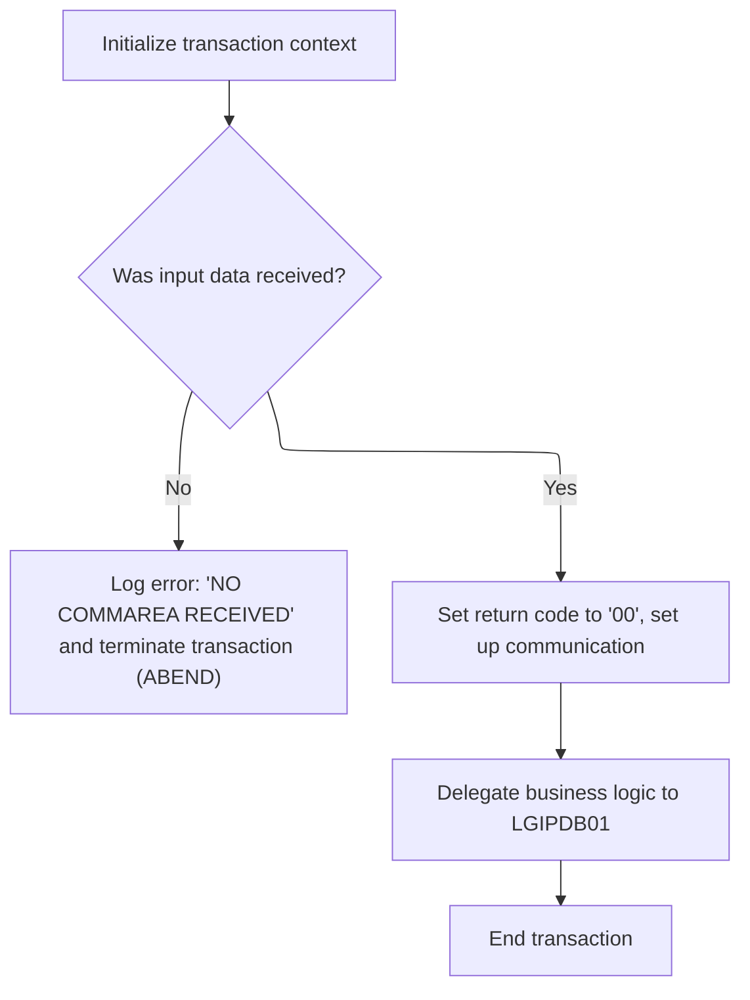
```mermaid
%%{init: {"flowchart": {"defaultRenderer": "elk"}} }%%
flowchart TD
    node1["Initialize transaction context"] --> node2{"Was input data received?"}
    click node1 openCode "base/src/lgipol01.cbl:72:77"
    node2 -->|"No"| node3["Log error: 'NO COMMAREA RECEIVED' and terminate transaction (ABEND)"]
    click node2 openCode "base/src/lgipol01.cbl:79:83"
    click node3 openCode "base/src/lgipol01.cbl:80:83"
    node2 -->|"Yes"| node4["Set return code to '00', set up communication"]
    click node4 openCode "base/src/lgipol01.cbl:86:88"
    node4 --> node5["Delegate business logic to LGIPDB01"]
    click node5 openCode "base/src/lgipol01.cbl:91:94"
    node5 --> node6["End transaction"]
    click node6 openCode "base/src/lgipol01.cbl:96:96"
classDef HeadingStyle fill:#777777,stroke:#333,stroke-width:2px;

%% Swimm:
%% %%{init: {"flowchart": {"defaultRenderer": "elk"}} }%%
%% flowchart TD
%%     node1["Initialize transaction context"] --> node2{"Was input data received?"}
%%     click node1 openCode "<SwmPath>[base/src/lgipol01.cbl](base/src/lgipol01.cbl)</SwmPath>:72:77"
%%     node2 -->|"No"| node3["Log error: 'NO COMMAREA RECEIVED' and terminate transaction (ABEND)"]
%%     click node2 openCode "<SwmPath>[base/src/lgipol01.cbl](base/src/lgipol01.cbl)</SwmPath>:79:83"
%%     click node3 openCode "<SwmPath>[base/src/lgipol01.cbl](base/src/lgipol01.cbl)</SwmPath>:80:83"
%%     node2 -->|"Yes"| node4["Set return code to '00', set up communication"]
%%     click node4 openCode "<SwmPath>[base/src/lgipol01.cbl](base/src/lgipol01.cbl)</SwmPath>:86:88"
%%     node4 --> node5["Delegate business logic to <SwmToken path="base/src/lgipol01.cbl" pos="91:9:9" line-data="           EXEC CICS LINK Program(LGIPDB01)">`LGIPDB01`</SwmToken>"]
%%     click node5 openCode "<SwmPath>[base/src/lgipol01.cbl](base/src/lgipol01.cbl)</SwmPath>:91:94"
%%     node5 --> node6["End transaction"]
%%     click node6 openCode "<SwmPath>[base/src/lgipol01.cbl](base/src/lgipol01.cbl)</SwmPath>:96:96"
%% classDef HeadingStyle fill:#777777,stroke:#333,stroke-width:2px;
```

The Policy Inquiry Dispatch section acts as the entry point for policy inquiry requests, ensuring valid input data is received, initializing transaction context, and routing the request to the appropriate business logic handler.

<SwmSnippet path="/base/src/lgipol01.cbl" line="70">

---

<SwmToken path="base/src/lgipol01.cbl" pos="70:1:1" line-data="       MAINLINE SECTION.">`MAINLINE`</SwmToken> in <SwmToken path="base/src/lgtestp1.cbl" pos="72:10:10" line-data="                 EXEC CICS LINK PROGRAM(&#39;LGIPOL01&#39;)">`LGIPOL01`</SwmToken> checks for a valid commarea, logs and aborts if missing, sets up transaction context, and then calls <SwmToken path="base/src/lgipol01.cbl" pos="91:9:9" line-data="           EXEC CICS LINK Program(LGIPDB01)">`LGIPDB01`</SwmToken> to actually fetch the policy data from <SwmToken path="base/src/lgipdb01.cbl" pos="242:5:5" line-data="      * initialize DB2 host variables">`DB2`</SwmToken>. This is the glue between the menu handler and the <SwmToken path="base/src/lgipdb01.cbl" pos="242:5:5" line-data="      * initialize DB2 host variables">`DB2`</SwmToken> access layer.

```cobol
       MAINLINE SECTION.
      *
           INITIALIZE WS-HEADER.
      *
           MOVE EIBTRNID TO WS-TRANSID.
           MOVE EIBTRMID TO WS-TERMID.
           MOVE EIBTASKN TO WS-TASKNUM.
      *
      * If NO commarea received issue an ABEND
           IF EIBCALEN IS EQUAL TO ZERO
               MOVE ' NO COMMAREA RECEIVED' TO EM-VARIABLE
               PERFORM WRITE-ERROR-MESSAGE
               EXEC CICS ABEND ABCODE('LGCA') NODUMP END-EXEC
           END-IF

      * initialize commarea return code to zero
           MOVE '00' TO CA-RETURN-CODE
           MOVE EIBCALEN TO WS-CALEN.
           SET WS-ADDR-DFHCOMMAREA TO ADDRESS OF DFHCOMMAREA.
      *

           EXEC CICS LINK Program(LGIPDB01)
               Commarea(DFHCOMMAREA)
               Length(32500)
           END-EXEC.

           EXEC CICS RETURN END-EXEC.
```

---

</SwmSnippet>

## Error Logging and Message Queueing

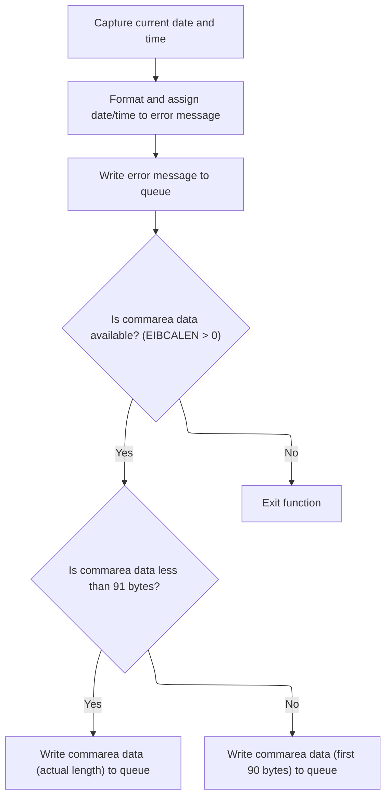
```mermaid
%%{init: {"flowchart": {"defaultRenderer": "elk"}} }%%
flowchart TD
  node1["Capture current date and time"] --> node2["Format and assign date/time to error message"]
  click node1 openCode "base/src/lgipol01.cbl:110:115"
  click node2 openCode "base/src/lgipol01.cbl:116:117"
  node2 --> node3["Write error message to queue"]
  click node3 openCode "base/src/lgipol01.cbl:119:122"
  node3 --> node4{"Is commarea data available? (EIBCALEN > 0)"}
  click node4 openCode "base/src/lgipol01.cbl:124:138"
  node4 -->|"Yes"| node5{"Is commarea data less than 91 bytes?"}
  click node5 openCode "base/src/lgipol01.cbl:125:137"
  node5 -->|"Yes"| node6["Write commarea data (actual length) to queue"]
  click node6 openCode "base/src/lgipol01.cbl:126:130"
  node5 -->|"No"| node7["Write commarea data (first 90 bytes) to queue"]
  click node7 openCode "base/src/lgipol01.cbl:132:136"
  node4 -->|"No"| node8["Exit function"]
  click node8 openCode "base/src/lgipol01.cbl:139:139"

classDef HeadingStyle fill:#777777,stroke:#333,stroke-width:2px;

%% Swimm:
%% %%{init: {"flowchart": {"defaultRenderer": "elk"}} }%%
%% flowchart TD
%%   node1["Capture current date and time"] --> node2["Format and assign date/time to error message"]
%%   click node1 openCode "<SwmPath>[base/src/lgipol01.cbl](base/src/lgipol01.cbl)</SwmPath>:110:115"
%%   click node2 openCode "<SwmPath>[base/src/lgipol01.cbl](base/src/lgipol01.cbl)</SwmPath>:116:117"
%%   node2 --> node3["Write error message to queue"]
%%   click node3 openCode "<SwmPath>[base/src/lgipol01.cbl](base/src/lgipol01.cbl)</SwmPath>:119:122"
%%   node3 --> node4{"Is commarea data available? (EIBCALEN > 0)"}
%%   click node4 openCode "<SwmPath>[base/src/lgipol01.cbl](base/src/lgipol01.cbl)</SwmPath>:124:138"
%%   node4 -->|"Yes"| node5{"Is commarea data less than 91 bytes?"}
%%   click node5 openCode "<SwmPath>[base/src/lgipol01.cbl](base/src/lgipol01.cbl)</SwmPath>:125:137"
%%   node5 -->|"Yes"| node6["Write commarea data (actual length) to queue"]
%%   click node6 openCode "<SwmPath>[base/src/lgipol01.cbl](base/src/lgipol01.cbl)</SwmPath>:126:130"
%%   node5 -->|"No"| node7["Write commarea data (first 90 bytes) to queue"]
%%   click node7 openCode "<SwmPath>[base/src/lgipol01.cbl](base/src/lgipol01.cbl)</SwmPath>:132:136"
%%   node4 -->|"No"| node8["Exit function"]
%%   click node8 openCode "<SwmPath>[base/src/lgipol01.cbl](base/src/lgipol01.cbl)</SwmPath>:139:139"
%% 
%% classDef HeadingStyle fill:#777777,stroke:#333,stroke-width:2px;
```

This section ensures that all error events are logged with relevant context and diagnostic data, supporting troubleshooting and audit requirements. It also manages message queueing for downstream processing.

| Category        | Rule Name                     | Description                                                                                                                                                                                                                                                                                                                                                                              |
| --------------- | ----------------------------- | ---------------------------------------------------------------------------------------------------------------------------------------------------------------------------------------------------------------------------------------------------------------------------------------------------------------------------------------------------------------------------------------- |
| Data validation | Message structure enforcement | Error messages must be formatted according to the <SwmToken path="base/src/lgipol01.cbl" pos="120:3:5" line-data="                     COMMAREA(ERROR-MSG)">`ERROR-MSG`</SwmToken> and <SwmToken path="base/src/lgipol01.cbl" pos="128:3:7" line-data="                         COMMAREA(CA-ERROR-MSG)">`CA-ERROR-MSG`</SwmToken> structures, including all required fields and fillers. |
| Business logic  | Timestamp inclusion           | Every error message must include the current date and time, formatted as MMDDYYYY and HHMMSS, respectively.                                                                                                                                                                                                                                                                              |
| Business logic  | Dual queue logging            | Error messages must be written to both the TDQ (CSMT) and TSQ (GENAERRS) queues for redundancy and downstream processing.                                                                                                                                                                                                                                                                |
| Business logic  | Commarea diagnostic capture   | If commarea diagnostic data is available, up to 90 bytes must be logged with the error message. If less than 91 bytes are present, log the actual length; otherwise, log only the first 90 bytes.                                                                                                                                                                                        |
| Business logic  | Queue extension handling      | If the error message begins with the prefix 'Q=', the next two characters are extracted as an extension and the message length is adjusted by subtracting 7 bytes.                                                                                                                                                                                                                       |
| Business logic  | CICS receive response         | If the error message was received via CICS RECEIVE, a one-character response must be sent back to the originator.                                                                                                                                                                                                                                                                        |

<SwmSnippet path="/base/src/lgipol01.cbl" line="107">

---

<SwmToken path="base/src/lgipol01.cbl" pos="107:1:5" line-data="       WRITE-ERROR-MESSAGE.">`WRITE-ERROR-MESSAGE`</SwmToken> logs the error with a timestamp, formats the message, and then calls LGSTSQ to write the error details to internal queues. If there's a commarea, it also sends up to 90 bytes of that data for diagnostics. LGSTSQ is what actually handles the queueing.

```cobol
       WRITE-ERROR-MESSAGE.
      * Save SQLCODE in message
      * Obtain and format current time and date
           EXEC CICS ASKTIME ABSTIME(ABS-TIME)
           END-EXEC
           EXEC CICS FORMATTIME ABSTIME(ABS-TIME)
                     MMDDYYYY(DATE1)
                     TIME(TIME1)
           END-EXEC
           MOVE DATE1 TO EM-DATE
           MOVE TIME1 TO EM-TIME
      * Write output message to TDQ
           EXEC CICS LINK PROGRAM('LGSTSQ')
                     COMMAREA(ERROR-MSG)
                     LENGTH(LENGTH OF ERROR-MSG)
           END-EXEC.
      * Write 90 bytes or as much as we have of commarea to TDQ
           IF EIBCALEN > 0 THEN
             IF EIBCALEN < 91 THEN
               MOVE DFHCOMMAREA(1:EIBCALEN) TO CA-DATA
               EXEC CICS LINK PROGRAM('LGSTSQ')
                         COMMAREA(CA-ERROR-MSG)
                         LENGTH(LENGTH OF CA-ERROR-MSG)
               END-EXEC
             ELSE
               MOVE DFHCOMMAREA(1:90) TO CA-DATA
               EXEC CICS LINK PROGRAM('LGSTSQ')
                         COMMAREA(CA-ERROR-MSG)
                         LENGTH(LENGTH OF CA-ERROR-MSG)
               END-EXEC
             END-IF
           END-IF.
           EXIT.
```

---

</SwmSnippet>

<SwmSnippet path="/base/src/lgstsq.cbl" line="55">

---

<SwmToken path="base/src/lgstsq.cbl" pos="55:1:1" line-data="       MAINLINE SECTION.">`MAINLINE`</SwmToken> in LGSTSQ figures out if the message is coming from a program call or a CICS RECEIVE, tweaks the message and length based on content (including special handling for 'Q=' prefixes), and writes the message to both TDQ and TSQ queues. If the message was received, it sends a one-character response back. The logic for message length and queue naming is pretty specific to this repo.

```cobol
       MAINLINE SECTION.

           MOVE SPACES TO WRITE-MSG.
           MOVE SPACES TO WS-RECV.

           EXEC CICS ASSIGN SYSID(WRITE-MSG-SYSID)
                RESP(WS-RESP)
           END-EXEC.

           EXEC CICS ASSIGN INVOKINGPROG(WS-INVOKEPROG)
                RESP(WS-RESP)
           END-EXEC.
           
           IF WS-INVOKEPROG NOT = SPACES
              MOVE 'C' To WS-FLAG
              MOVE COMMA-DATA  TO WRITE-MSG-MSG
              MOVE EIBCALEN    TO WS-RECV-LEN
           ELSE
              EXEC CICS RECEIVE INTO(WS-RECV)
                  LENGTH(WS-RECV-LEN)
                  RESP(WS-RESP)
              END-EXEC
              MOVE 'R' To WS-FLAG
              MOVE WS-RECV-DATA  TO WRITE-MSG-MSG
              SUBTRACT 5 FROM WS-RECV-LEN
           END-IF.

           MOVE 'GENAERRS' TO STSQ-NAME.
           IF WRITE-MSG-MSG(1:2) = 'Q=' THEN
              MOVE WRITE-MSG-MSG(3:4) TO STSQ-EXT
              MOVE WRITE-MSG-REST TO TEMPO
              MOVE TEMPO          TO WRITE-MSG-MSG
              SUBTRACT 7 FROM WS-RECV-LEN
           END-IF.

           ADD 5 TO WS-RECV-LEN.

      * Write output message to TDQ CSMT
      *
           EXEC CICS WRITEQ TD QUEUE(STDQ-NAME)
                     FROM(WRITE-MSG)
                     RESP(WS-RESP)
                     LENGTH(WS-RECV-LEN)

           END-EXEC.

      * Write output message to Genapp TSQ
      * If no space is available then the task will not wait for
      *  storage to become available but will ignore the request...
      *
           EXEC CICS WRITEQ TS QUEUE(STSQ-NAME)
                     FROM(WRITE-MSG)
                     RESP(WS-RESP)
                     NOSUSPEND
                     LENGTH(WS-RECV-LEN)

           END-EXEC.

           If WS-FLAG = 'R' Then
             EXEC CICS SEND TEXT FROM(FILLER-X)
              WAIT
              ERASE
              LENGTH(1)
              FREEKB
             END-EXEC.

           EXEC CICS RETURN
           END-EXEC.
```

---

</SwmSnippet>

## Policy Data Fetch and Error Handling

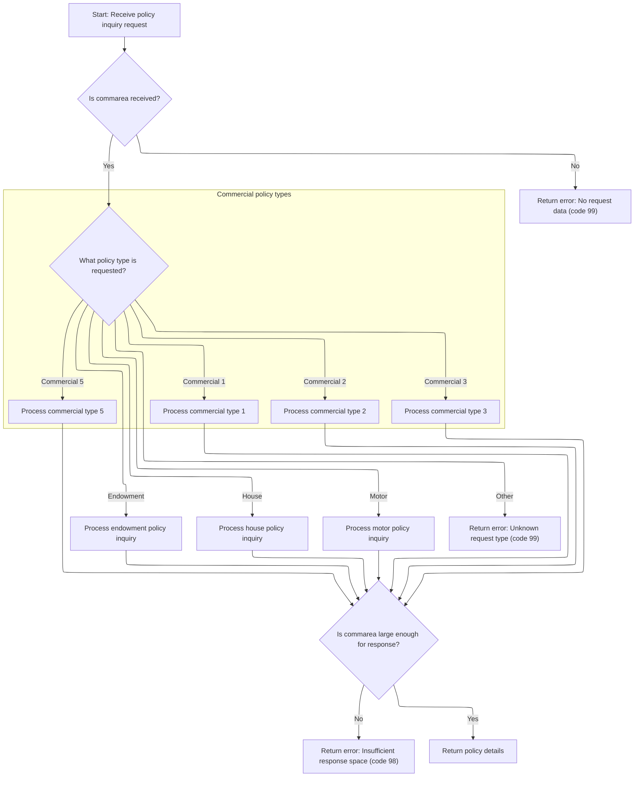
```mermaid
%%{init: {"flowchart": {"defaultRenderer": "elk"}} }%%
flowchart TD
    node1["Start: Receive policy inquiry request"] --> node2{"Is commarea received?"}
    click node1 openCode "base/src/lgipdb01.cbl:230:255"
    node2 -->|"No"| node3["Return error: No request data (code 99)"]
    click node2 openCode "base/src/lgipdb01.cbl:251:255"
    click node3 openCode "base/src/lgipdb01.cbl:252:254"
    node2 -->|"Yes"| node4{"What policy type is requested?"}
    click node4 openCode "base/src/lgipdb01.cbl:277:310"
    node4 -->|"Endowment"| node5["Process endowment policy inquiry"]
    click node5 openCode "base/src/lgipdb01.cbl:327:432"
    node4 -->|"House"| node6["Process house policy inquiry"]
    click node6 openCode "base/src/lgipdb01.cbl:441:523"
    node4 -->|"Motor"| node7["Process motor policy inquiry"]
    click node7 openCode "base/src/lgipdb01.cbl:529:621"
    subgraph commercialTypes["Commercial policy types"]
      node4 -->|"Commercial 1"| node8a["Process commercial type 1"]
      click node8a openCode "base/src/lgipdb01.cbl:292:294"
      node4 -->|"Commercial 2"| node8b["Process commercial type 2"]
      click node8b openCode "base/src/lgipdb01.cbl:296:297"
      node4 -->|"Commercial 3"| node8c["Process commercial type 3"]
      click node8c openCode "base/src/lgipdb01.cbl:300:301"
      node4 -->|"Commercial 5"| node8d["Process commercial type 5"]
      click node8d openCode "base/src/lgipdb01.cbl:304:305"
    end
    node4 -->|"Other"| node9["Return error: Unknown request type (code 99)"]
    click node9 openCode "base/src/lgipdb01.cbl:308:309"
    node5 --> node10{"Is commarea large enough for response?"}
    node6 --> node10
    node7 --> node10
    node8a --> node10
    node8b --> node10
    node8c --> node10
    node8d --> node10
    click node10 openCode "base/src/lgipdb01.cbl:390:392"
    node10 -->|"No"| node12["Return error: Insufficient response space (code 98)"]
    click node12 openCode "base/src/lgipdb01.cbl:391:392"
    node10 -->|"Yes"| node11["Return policy details"]
    click node11 openCode "base/src/lgipdb01.cbl:394:417"

classDef HeadingStyle fill:#777777,stroke:#333,stroke-width:2px;

%% Swimm:
%% %%{init: {"flowchart": {"defaultRenderer": "elk"}} }%%
%% flowchart TD
%%     node1["Start: Receive policy inquiry request"] --> node2{"Is commarea received?"}
%%     click node1 openCode "<SwmPath>[base/src/lgipdb01.cbl](base/src/lgipdb01.cbl)</SwmPath>:230:255"
%%     node2 -->|"No"| node3["Return error: No request data (code 99)"]
%%     click node2 openCode "<SwmPath>[base/src/lgipdb01.cbl](base/src/lgipdb01.cbl)</SwmPath>:251:255"
%%     click node3 openCode "<SwmPath>[base/src/lgipdb01.cbl](base/src/lgipdb01.cbl)</SwmPath>:252:254"
%%     node2 -->|"Yes"| node4{"What policy type is requested?"}
%%     click node4 openCode "<SwmPath>[base/src/lgipdb01.cbl](base/src/lgipdb01.cbl)</SwmPath>:277:310"
%%     node4 -->|"Endowment"| node5["Process endowment policy inquiry"]
%%     click node5 openCode "<SwmPath>[base/src/lgipdb01.cbl](base/src/lgipdb01.cbl)</SwmPath>:327:432"
%%     node4 -->|"House"| node6["Process house policy inquiry"]
%%     click node6 openCode "<SwmPath>[base/src/lgipdb01.cbl](base/src/lgipdb01.cbl)</SwmPath>:441:523"
%%     node4 -->|"Motor"| node7["Process motor policy inquiry"]
%%     click node7 openCode "<SwmPath>[base/src/lgipdb01.cbl](base/src/lgipdb01.cbl)</SwmPath>:529:621"
%%     subgraph commercialTypes["Commercial policy types"]
%%       node4 -->|"Commercial 1"| node8a["Process commercial type 1"]
%%       click node8a openCode "<SwmPath>[base/src/lgipdb01.cbl](base/src/lgipdb01.cbl)</SwmPath>:292:294"
%%       node4 -->|"Commercial 2"| node8b["Process commercial type 2"]
%%       click node8b openCode "<SwmPath>[base/src/lgipdb01.cbl](base/src/lgipdb01.cbl)</SwmPath>:296:297"
%%       node4 -->|"Commercial 3"| node8c["Process commercial type 3"]
%%       click node8c openCode "<SwmPath>[base/src/lgipdb01.cbl](base/src/lgipdb01.cbl)</SwmPath>:300:301"
%%       node4 -->|"Commercial 5"| node8d["Process commercial type 5"]
%%       click node8d openCode "<SwmPath>[base/src/lgipdb01.cbl](base/src/lgipdb01.cbl)</SwmPath>:304:305"
%%     end
%%     node4 -->|"Other"| node9["Return error: Unknown request type (code 99)"]
%%     click node9 openCode "<SwmPath>[base/src/lgipdb01.cbl](base/src/lgipdb01.cbl)</SwmPath>:308:309"
%%     node5 --> node10{"Is commarea large enough for response?"}
%%     node6 --> node10
%%     node7 --> node10
%%     node8a --> node10
%%     node8b --> node10
%%     node8c --> node10
%%     node8d --> node10
%%     click node10 openCode "<SwmPath>[base/src/lgipdb01.cbl](base/src/lgipdb01.cbl)</SwmPath>:390:392"
%%     node10 -->|"No"| node12["Return error: Insufficient response space (code 98)"]
%%     click node12 openCode "<SwmPath>[base/src/lgipdb01.cbl](base/src/lgipdb01.cbl)</SwmPath>:391:392"
%%     node10 -->|"Yes"| node11["Return policy details"]
%%     click node11 openCode "<SwmPath>[base/src/lgipdb01.cbl](base/src/lgipdb01.cbl)</SwmPath>:394:417"
%% 
%% classDef HeadingStyle fill:#777777,stroke:#333,stroke-width:2px;
```

This section governs how policy inquiry requests are validated, routed, and processed, ensuring that only valid requests receive policy data and that errors are handled and logged according to business conventions.

| Category       | Rule Name                     | Description                                                                                                                                                                                                                                                                                                                                        |
| -------------- | ----------------------------- | -------------------------------------------------------------------------------------------------------------------------------------------------------------------------------------------------------------------------------------------------------------------------------------------------------------------------------------------------- |
| Business logic | Policy type routing           | The system must route the request to the appropriate policy handler (endowment, house, motor, commercial) based on the request ID provided in the commarea.                                                                                                                                                                                        |
| Business logic | Successful policy fetch       | Policy details must only be returned if the <SwmToken path="base/src/lgipdb01.cbl" pos="242:5:5" line-data="      * initialize DB2 host variables">`DB2`</SwmToken> SELECT statement completes successfully (SQLCODE = 0).                                                                                                                         |
| Business logic | Policy data completion marker | Returned policy data must be marked with 'FINAL' at the end to indicate completion of the data set.                                                                                                                                                                                                                                                |
| Business logic | Null field exclusion          | Only <SwmToken path="base/src/lgipdb01.cbl" pos="379:13:15" line-data="      *      check whether PADDINGDATA field is non-null">`non-null`</SwmToken> <SwmToken path="base/src/lgipdb01.cbl" pos="242:5:5" line-data="      * initialize DB2 host variables">`DB2`</SwmToken> fields should be copied into the response; null fields are omitted. |

<SwmSnippet path="/base/src/lgipdb01.cbl" line="230">

---

<SwmToken path="base/src/lgipdb01.cbl" pos="230:1:1" line-data="       MAINLINE SECTION.">`MAINLINE`</SwmToken> in <SwmToken path="base/src/lgipol01.cbl" pos="91:9:9" line-data="           EXEC CICS LINK Program(LGIPDB01)">`LGIPDB01`</SwmToken> checks for a valid commarea, sets up <SwmToken path="base/src/lgipdb01.cbl" pos="242:5:5" line-data="      * initialize DB2 host variables">`DB2`</SwmToken> input/output variables, and then routes the request to the right policy type handler (endowment, house, motor, commercial) based on the request ID. Each handler fetches the relevant policy data from <SwmToken path="base/src/lgipdb01.cbl" pos="242:5:5" line-data="      * initialize DB2 host variables">`DB2`</SwmToken> and populates the commarea for the caller. If the request type is unknown or input is missing, it sets an error code or logs the error.

```cobol
       MAINLINE SECTION.

      *----------------------------------------------------------------*
      * Common code                                                    *
      *----------------------------------------------------------------*
      * initialize working storage variables
           INITIALIZE WS-HEADER.
      * set up general variable
           MOVE EIBTRNID TO WS-TRANSID.
           MOVE EIBTRMID TO WS-TERMID.
           MOVE EIBTASKN TO WS-TASKNUM.
      *----------------------------------------------------------------*
      * initialize DB2 host variables
           INITIALIZE DB2-IN-INTEGERS.
           INITIALIZE DB2-OUT-INTEGERS.
           INITIALIZE DB2-POLICY.

      *---------------------------------------------------------------*
      * Check commarea and obtain required details                    *
      *---------------------------------------------------------------*
      * If NO commarea received issue an ABEND
           IF EIBCALEN IS EQUAL TO ZERO
             MOVE ' NO COMMAREA RECEIVED' TO EM-VARIABLE
             PERFORM WRITE-ERROR-MESSAGE
             EXEC CICS ABEND ABCODE('LGCA') NODUMP END-EXEC
           END-IF

      * initialize commarea return code to zero
           MOVE '00' TO CA-RETURN-CODE
           MOVE EIBCALEN TO WS-CALEN
           SET WS-ADDR-DFHCOMMAREA TO ADDRESS OF DFHCOMMAREA

      * Convert commarea customer & policy nums to DB2 integer format
           MOVE CA-CUSTOMER-NUM TO DB2-CUSTOMERNUM-INT
           MOVE CA-POLICY-NUM   TO DB2-POLICYNUM-INT
      * and save in error msg field incase required
           MOVE CA-CUSTOMER-NUM TO EM-CUSNUM
           MOVE CA-POLICY-NUM   TO EM-POLNUM

      *----------------------------------------------------------------*
      * Check which policy type is being requested                     *
      * This is not actually required whilst only endowment policy     *
      * inquires are supported, but will make future expansion simpler *
      *----------------------------------------------------------------*
      * Upper case value passed in Request Id field                    *
           MOVE FUNCTION UPPER-CASE(CA-REQUEST-ID) TO WS-REQUEST-ID

           EVALUATE WS-REQUEST-ID

             WHEN '01IEND'
               INITIALIZE DB2-ENDOWMENT
               PERFORM GET-ENDOW-DB2-INFO

             WHEN '01IHOU'
               INITIALIZE DB2-HOUSE
               PERFORM GET-HOUSE-DB2-INFO

             WHEN '01IMOT'
               INITIALIZE DB2-MOTOR
               PERFORM GET-MOTOR-DB2-INFO

             WHEN '01ICOM'
               INITIALIZE DB2-COMMERCIAL
               PERFORM GET-COMMERCIAL-DB2-INFO-1

             WHEN '02ICOM'
               INITIALIZE DB2-COMMERCIAL
               PERFORM GET-COMMERCIAL-DB2-INFO-2

             WHEN '03ICOM'
               INITIALIZE DB2-COMMERCIAL
               PERFORM GET-COMMERCIAL-DB2-INFO-3

             WHEN '05ICOM'
               INITIALIZE DB2-COMMERCIAL
               PERFORM GET-COMMERCIAL-DB2-INFO-5

             WHEN OTHER
               MOVE '99' TO CA-RETURN-CODE

           END-EVALUATE.
```

---

</SwmSnippet>

<SwmSnippet path="/base/src/lgipdb01.cbl" line="997">

---

<SwmToken path="base/src/lgipdb01.cbl" pos="997:1:5" line-data="       WRITE-ERROR-MESSAGE.">`WRITE-ERROR-MESSAGE`</SwmToken> here logs the SQLCODE, grabs the current timestamp, formats it, and calls LGSTSQ to queue the error message. If there's a commarea, it also sends up to 90 bytes of it for diagnostics. The 90-byte limit and the use of specific structures are repo conventions.

```cobol
       WRITE-ERROR-MESSAGE.
      * Save SQLCODE in message
           MOVE SQLCODE TO EM-SQLRC
      * Obtain and format current time and date
           EXEC CICS ASKTIME ABSTIME(ABS-TIME)
           END-EXEC
           EXEC CICS FORMATTIME ABSTIME(ABS-TIME)
                     MMDDYYYY(DATE1)
                     TIME(TIME1)
           END-EXEC
           MOVE DATE1 TO EM-DATE
           MOVE TIME1 TO EM-TIME
      * Write output message to TDQ
           EXEC CICS LINK PROGRAM('LGSTSQ')
                     COMMAREA(ERROR-MSG)
                     LENGTH(LENGTH OF ERROR-MSG)
           END-EXEC.
      * Write 90 bytes or as much as we have of commarea to TDQ
           IF EIBCALEN > 0 THEN
             IF EIBCALEN < 91 THEN
               MOVE DFHCOMMAREA(1:EIBCALEN) TO CA-DATA
               EXEC CICS LINK PROGRAM('LGSTSQ')
                         COMMAREA(CA-ERROR-MSG)
                         LENGTH(LENGTH OF CA-ERROR-MSG)
               END-EXEC
             ELSE
               MOVE DFHCOMMAREA(1:90) TO CA-DATA
               EXEC CICS LINK PROGRAM('LGSTSQ')
                         COMMAREA(CA-ERROR-MSG)
                         LENGTH(LENGTH OF CA-ERROR-MSG)
               END-EXEC
             END-IF
           END-IF.
           EXIT.
```

---

</SwmSnippet>

<SwmSnippet path="/base/src/lgipdb01.cbl" line="327">

---

<SwmToken path="base/src/lgipdb01.cbl" pos="327:1:7" line-data="       GET-ENDOW-DB2-INFO.">`GET-ENDOW-DB2-INFO`</SwmToken> runs a <SwmToken path="base/src/lgipdb01.cbl" pos="327:5:5" line-data="       GET-ENDOW-DB2-INFO.">`DB2`</SwmToken> SELECT for endowment policy details, dynamically adjusts the required commarea length if there's variable-length padding data, and only moves <SwmToken path="base/src/lgipdb01.cbl" pos="327:5:5" line-data="       GET-ENDOW-DB2-INFO.">`DB2`</SwmToken> fields to the output if they're not null. It uses repo-specific codes ('98', '01', '90') for errors and marks the end of data with 'FINAL'. If the commarea is too small, it bails out early.

```cobol
       GET-ENDOW-DB2-INFO.

           MOVE ' SELECT ENDOW ' TO EM-SQLREQ
           EXEC SQL
             SELECT  ISSUEDATE,
                     EXPIRYDATE,
                     LASTCHANGED,
                     BROKERID,
                     BROKERSREFERENCE,
                     PAYMENT,
                     WITHPROFITS,
                     EQUITIES,
                     MANAGEDFUND,
                     FUNDNAME,
                     TERM,
                     SUMASSURED,
                     LIFEASSURED,
                     PADDINGDATA,
                     LENGTH(PADDINGDATA)
             INTO  :DB2-ISSUEDATE,
                   :DB2-EXPIRYDATE,
                   :DB2-LASTCHANGED,
                   :DB2-BROKERID-INT INDICATOR :IND-BROKERID,
                   :DB2-BROKERSREF INDICATOR :IND-BROKERSREF,
                   :DB2-PAYMENT-INT INDICATOR :IND-PAYMENT,
                   :DB2-E-WITHPROFITS,
                   :DB2-E-EQUITIES,
                   :DB2-E-MANAGEDFUND,
                   :DB2-E-FUNDNAME,
                   :DB2-E-TERM-SINT,
                   :DB2-E-SUMASSURED-INT,
                   :DB2-E-LIFEASSURED,
                   :DB2-E-PADDINGDATA INDICATOR :IND-E-PADDINGDATA,
                   :DB2-E-PADDING-LEN INDICATOR :IND-E-PADDINGDATAL
             FROM  POLICY,ENDOWMENT
             WHERE ( POLICY.POLICYNUMBER =
                        ENDOWMENT.POLICYNUMBER   AND
                     POLICY.CUSTOMERNUMBER =
                        :DB2-CUSTOMERNUM-INT             AND
                     POLICY.POLICYNUMBER =
                        :DB2-POLICYNUM-INT               )
           END-EXEC

           IF SQLCODE = 0
      *      Select was successful

      *      Calculate size of commarea required to return all data
             ADD WS-CA-HEADERTRAILER-LEN TO WS-REQUIRED-CA-LEN
             ADD WS-FULL-ENDOW-LEN       TO WS-REQUIRED-CA-LEN

      *----------------------------------------------------------------*
      *      Specific code to allow for length of VACHAR data
      *      check whether PADDINGDATA field is non-null
      *        and calculate length of endowment policy
      *        and position of free space in commarea after policy data
      *----------------------------------------------------------------*
             IF IND-E-PADDINGDATAL NOT EQUAL MINUS-ONE
               ADD DB2-E-PADDING-LEN TO WS-REQUIRED-CA-LEN
               ADD DB2-E-PADDING-LEN TO END-POLICY-POS
             END-IF

      *      if commarea received is not large enough ...
      *        set error return code and return to caller
             IF EIBCALEN IS LESS THAN WS-REQUIRED-CA-LEN
               MOVE '98' TO CA-RETURN-CODE
               EXEC CICS RETURN END-EXEC
             ELSE
      *        Length is sufficent so move data to commarea
      *        Move Integer fields to required length numerics
      *        Don't move null fields
               IF IND-BROKERID NOT EQUAL MINUS-ONE
                 MOVE DB2-BROKERID-INT    TO DB2-BROKERID
               END-IF
               IF IND-PAYMENT NOT EQUAL MINUS-ONE
                 MOVE DB2-PAYMENT-INT TO DB2-PAYMENT
               END-IF
      *----------------------------------------------------------------*
               MOVE DB2-E-TERM-SINT       TO DB2-E-TERM
               MOVE DB2-E-SUMASSURED-INT  TO DB2-E-SUMASSURED

               MOVE DB2-POLICY-COMMON     TO CA-POLICY-COMMON
               MOVE DB2-ENDOW-FIXED
                   TO CA-ENDOWMENT(1:WS-ENDOW-LEN)
               IF IND-E-PADDINGDATA NOT EQUAL MINUS-ONE
                 MOVE DB2-E-PADDINGDATA TO
                     CA-E-PADDING-DATA(1:DB2-E-PADDING-LEN)
               END-IF
             END-IF

      *      Mark the end of the policy data
             MOVE 'FINAL' TO CA-E-PADDING-DATA(END-POLICY-POS:5)

           ELSE
      *      Non-zero SQLCODE from first SQL FETCH statement
             IF SQLCODE EQUAL 100
      *        No rows found - invalid customer / policy number
               MOVE '01' TO CA-RETURN-CODE
             ELSE
      *        something has gone wrong
               MOVE '90' TO CA-RETURN-CODE
      *        Write error message to TD QUEUE(CSMT)
               PERFORM WRITE-ERROR-MESSAGE
             END-IF

           END-IF.
           EXIT.
```

---

</SwmSnippet>

<SwmSnippet path="/base/src/lgipdb01.cbl" line="441">

---

<SwmToken path="base/src/lgipdb01.cbl" pos="441:1:7" line-data="       GET-HOUSE-DB2-INFO.">`GET-HOUSE-DB2-INFO`</SwmToken> fetches house policy data, checks if the commarea is big enough, and only moves <SwmToken path="base/src/lgipdb01.cbl" pos="441:5:5" line-data="       GET-HOUSE-DB2-INFO.">`DB2`</SwmToken> integer fields if they're not null. It uses repo-specific error codes and marks the end of the data with 'FINAL'. If there's an error, it logs it with <SwmToken path="base/src/lgipdb01.cbl" pos="519:3:7" line-data="               PERFORM WRITE-ERROR-MESSAGE">`WRITE-ERROR-MESSAGE`</SwmToken>.

```cobol
       GET-HOUSE-DB2-INFO.

           MOVE ' SELECT HOUSE ' TO EM-SQLREQ
           EXEC SQL
             SELECT  ISSUEDATE,
                     EXPIRYDATE,
                     LASTCHANGED,
                     BROKERID,
                     BROKERSREFERENCE,
                     PAYMENT,
                     PROPERTYTYPE,
                     BEDROOMS,
                     VALUE,
                     HOUSENAME,
                     HOUSENUMBER,
                     POSTCODE
             INTO  :DB2-ISSUEDATE,
                   :DB2-EXPIRYDATE,
                   :DB2-LASTCHANGED,
                   :DB2-BROKERID-INT INDICATOR :IND-BROKERID,
                   :DB2-BROKERSREF INDICATOR :IND-BROKERSREF,
                   :DB2-PAYMENT-INT INDICATOR :IND-PAYMENT,
                   :DB2-H-PROPERTYTYPE,
                   :DB2-H-BEDROOMS-SINT,
                   :DB2-H-VALUE-INT,
                   :DB2-H-HOUSENAME,
                   :DB2-H-HOUSENUMBER,
                   :DB2-H-POSTCODE
             FROM  POLICY,HOUSE
             WHERE ( POLICY.POLICYNUMBER =
                        HOUSE.POLICYNUMBER   AND
                     POLICY.CUSTOMERNUMBER =
                        :DB2-CUSTOMERNUM-INT             AND
                     POLICY.POLICYNUMBER =
                        :DB2-POLICYNUM-INT               )
           END-EXEC

           IF SQLCODE = 0
      *      Select was successful

      *      Calculate size of commarea required to return all data
             ADD WS-CA-HEADERTRAILER-LEN TO WS-REQUIRED-CA-LEN
             ADD WS-FULL-HOUSE-LEN       TO WS-REQUIRED-CA-LEN

      *      if commarea received is not large enough ...
      *        set error return code and return to caller
             IF EIBCALEN IS LESS THAN WS-REQUIRED-CA-LEN
               MOVE '98' TO CA-RETURN-CODE
               EXEC CICS RETURN END-EXEC
             ELSE
      *        Length is sufficent so move data to commarea
      *        Move Integer fields to required length numerics
      *        Don't move null fields
               IF IND-BROKERID NOT EQUAL MINUS-ONE
                 MOVE DB2-BROKERID-INT  TO DB2-BROKERID
               END-IF
               IF IND-PAYMENT NOT EQUAL MINUS-ONE
                 MOVE DB2-PAYMENT-INT TO DB2-PAYMENT
               END-IF
               MOVE DB2-H-BEDROOMS-SINT TO DB2-H-BEDROOMS
               MOVE DB2-H-VALUE-INT     TO DB2-H-VALUE

               MOVE DB2-POLICY-COMMON   TO CA-POLICY-COMMON
               MOVE DB2-HOUSE           TO CA-HOUSE(1:WS-HOUSE-LEN)
             END-IF

      *      Mark the end of the policy data
             MOVE 'FINAL' TO CA-H-FILLER(1:5)

           ELSE
      *      Non-zero SQLCODE from first SQL FETCH statement
             IF SQLCODE EQUAL 100
      *        No rows found - invalid customer / policy number
               MOVE '01' TO CA-RETURN-CODE
             ELSE
      *        something has gone wrong
               MOVE '90' TO CA-RETURN-CODE
      *        Write error message to TD QUEUE(CSMT)
               PERFORM WRITE-ERROR-MESSAGE
             END-IF

           END-IF.
           EXIT.
```

---

</SwmSnippet>

<SwmSnippet path="/base/src/lgipdb01.cbl" line="529">

---

<SwmToken path="base/src/lgipdb01.cbl" pos="529:1:7" line-data="       GET-MOTOR-DB2-INFO.">`GET-MOTOR-DB2-INFO`</SwmToken> fetches motor policy data, checks for buffer size, moves <SwmToken path="base/src/lgipdb01.cbl" pos="529:5:5" line-data="       GET-MOTOR-DB2-INFO.">`DB2`</SwmToken> integer fields only if they're not null, and copies the data into the commarea. It uses repo-specific codes for errors and marks the end of the data with 'FINAL'.

```cobol
       GET-MOTOR-DB2-INFO.

           MOVE ' SELECT MOTOR ' TO EM-SQLREQ
           EXEC SQL
             SELECT  ISSUEDATE,
                     EXPIRYDATE,
                     LASTCHANGED,
                     BROKERID,
                     BROKERSREFERENCE,
                     PAYMENT,
                     MAKE,
                     MODEL,
                     VALUE,
                     REGNUMBER,
                     COLOUR,
                     CC,
                     YEAROFMANUFACTURE,
                     PREMIUM,
                     ACCIDENTS
             INTO  :DB2-ISSUEDATE,
                   :DB2-EXPIRYDATE,
                   :DB2-LASTCHANGED,
                   :DB2-BROKERID-INT INDICATOR :IND-BROKERID,
                   :DB2-BROKERSREF INDICATOR :IND-BROKERSREF,
                   :DB2-PAYMENT-INT INDICATOR :IND-PAYMENT,
                   :DB2-M-MAKE,
                   :DB2-M-MODEL,
                   :DB2-M-VALUE-INT,
                   :DB2-M-REGNUMBER,
                   :DB2-M-COLOUR,
                   :DB2-M-CC-SINT,
                   :DB2-M-MANUFACTURED,
                   :DB2-M-PREMIUM-INT,
                   :DB2-M-ACCIDENTS-INT
             FROM  POLICY,MOTOR
             WHERE ( POLICY.POLICYNUMBER =
                        MOTOR.POLICYNUMBER   AND
                     POLICY.CUSTOMERNUMBER =
                        :DB2-CUSTOMERNUM-INT             AND
                     POLICY.POLICYNUMBER =
                        :DB2-POLICYNUM-INT               )
           END-EXEC

           IF SQLCODE = 0
      *      Select was successful

      *      Calculate size of commarea required to return all data
             ADD WS-CA-HEADERTRAILER-LEN TO WS-REQUIRED-CA-LEN
             ADD WS-FULL-MOTOR-LEN       TO WS-REQUIRED-CA-LEN

      *      if commarea received is not large enough ...
      *        set error return code and return to caller
             IF EIBCALEN IS LESS THAN WS-REQUIRED-CA-LEN
               MOVE '98' TO CA-RETURN-CODE
               EXEC CICS RETURN END-EXEC
             ELSE
      *        Length is sufficent so move data to commarea
      *        Move Integer fields to required length numerics
      *        Don't move null fields
               IF IND-BROKERID NOT EQUAL MINUS-ONE
                 MOVE DB2-BROKERID-INT TO DB2-BROKERID
               END-IF
               IF IND-PAYMENT NOT EQUAL MINUS-ONE
                 MOVE DB2-PAYMENT-INT    TO DB2-PAYMENT
               END-IF
               MOVE DB2-M-CC-SINT      TO DB2-M-CC
               MOVE DB2-M-VALUE-INT    TO DB2-M-VALUE
               MOVE DB2-M-PREMIUM-INT  TO DB2-M-PREMIUM
               MOVE DB2-M-ACCIDENTS-INT TO DB2-M-ACCIDENTS
               MOVE DB2-M-PREMIUM-INT  TO CA-M-PREMIUM
               MOVE DB2-M-ACCIDENTS-INT TO CA-M-ACCIDENTS

               MOVE DB2-POLICY-COMMON  TO CA-POLICY-COMMON
               MOVE DB2-MOTOR          TO CA-MOTOR(1:WS-MOTOR-LEN)
             END-IF

      *      Mark the end of the policy data
             MOVE 'FINAL' TO CA-M-FILLER(1:5)

           ELSE
      *      Non-zero SQLCODE from first SQL FETCH statement
             IF SQLCODE EQUAL 100
      *        No rows found - invalid customer / policy number
               MOVE '01' TO CA-RETURN-CODE
             ELSE
      *        something has gone wrong
               MOVE '90' TO CA-RETURN-CODE
      *        Write error message to TD QUEUE(CSMT)
               PERFORM WRITE-ERROR-MESSAGE
             END-IF

           END-IF.
           EXIT.
```

---

</SwmSnippet>

## Post-Inquiry Result Handling

<SwmSnippet path="/base/src/lgtestp1.cbl" line="76">

---

Back in <SwmToken path="base/src/lgtestp1.cbl" pos="33:5:7" line-data="              GO TO A-GAIN.">`A-GAIN`</SwmToken>, after returning from <SwmToken path="base/src/lgtestp1.cbl" pos="72:10:10" line-data="                 EXEC CICS LINK PROGRAM(&#39;LGIPOL01&#39;)">`LGIPOL01`</SwmToken>, the code checks if the return code from the inquiry is non-zero. If so, it jumps to <SwmToken path="base/src/lgtestp1.cbl" pos="77:5:7" line-data="                   GO TO NO-DATA">`NO-DATA`</SwmToken> to handle the case where no policy data was found or an error occurred. This keeps the user informed and avoids showing empty or invalid data.

```cobol
                 IF CA-RETURN-CODE > 0
                   GO TO NO-DATA
                 END-IF
```

---

</SwmSnippet>

## No Data Found Handling

The main product role of this section is to provide clear feedback to users when their requested data is not available, ensuring they are informed and can take further action without confusion.

| Category       | Rule Name                 | Description                                                                                                                          |
| -------------- | ------------------------- | ------------------------------------------------------------------------------------------------------------------------------------ |
| Business logic | No Data Message           | If no data is returned from a data retrieval operation, display a message to the user stating 'No data was returned.'                |
| Business logic | Return to Menu on No Data | After displaying the 'No data was returned.' message, the system must return the user to the main menu or prompt for further action. |

<SwmSnippet path="/base/src/lgtestp1.cbl" line="304">

---

<SwmToken path="base/src/lgtestp1.cbl" pos="304:1:3" line-data="       NO-DATA.">`NO-DATA`</SwmToken> sets a message saying no data was returned and then jumps to <SwmToken path="base/src/lgtestp1.cbl" pos="306:5:7" line-data="           Go To ERROR-OUT.">`ERROR-OUT`</SwmToken> to display the menu again. This gives the user feedback and a chance to try another action.

```cobol
       NO-DATA.
           Move 'No data was returned.'            To  ERP1FLDO
           Go To ERROR-OUT.
```

---

</SwmSnippet>

## Menu Redisplay and Session Reset

This section governs how the application responds to errors by redisplaying the motor policy menu and resetting session data, ensuring users can restart their transaction without residual data or confusion.

| Category       | Rule Name                           | Description                                                                                                                                                          |
| -------------- | ----------------------------------- | -------------------------------------------------------------------------------------------------------------------------------------------------------------------- |
| Business logic | Menu redisplay on error             | Whenever an error is detected during a motor policy transaction, the motor policy menu screen must be redisplayed to the user.                                       |
| Business logic | Session data reset                  | After redisplaying the menu, all input and output map areas, as well as session data, must be reset to their initial state before allowing further user interaction. |
| Business logic | Return to transaction menu on error | If an error occurs, the user must be returned to the transaction menu, allowing them to initiate a new operation without manual intervention.                        |

<SwmSnippet path="/base/src/lgtestp1.cbl" line="308">

---

In <SwmToken path="base/src/lgtestp1.cbl" pos="308:1:3" line-data="       ERROR-OUT.">`ERROR-OUT`</SwmToken>, the code sends the <SwmToken path="base/src/lgtestp1.cbl" pos="309:11:11" line-data="           EXEC CICS SEND MAP (&#39;SSMAPP1&#39;)">`SSMAPP1`</SwmToken> map from the SSMAP mapset to the user's terminal. This redraws the motor policy menu screen, using application-specific map names.

```cobol
       ERROR-OUT.
           EXEC CICS SEND MAP ('SSMAPP1')
                     FROM(SSMAPP1O)
                     MAPSET ('SSMAP')
           END-EXEC.
```

---

</SwmSnippet>

<SwmSnippet path="/base/src/lgtestp1.cbl" line="314">

---

After sending the menu, this resets the input/output map areas and the commarea, then jumps to <SwmToken path="base/src/lgtestp1.cbl" pos="318:5:7" line-data="           GO TO ENDIT-STARTIT.">`ENDIT-STARTIT`</SwmToken> to end the current operation and return to the transaction menu. The initialization is app-specific, and the GO TO is a standard way to manage flow in these programs.

```cobol
           Initialize SSMAPP1I.
           Initialize SSMAPP1O.
           Initialize COMM-AREA.

           GO TO ENDIT-STARTIT.
```

---

</SwmSnippet>

## Populate Output Fields After Inquiry

<SwmSnippet path="/base/src/lgtestp1.cbl" line="80">

---

Back in <SwmToken path="base/src/lgtestp1.cbl" pos="33:5:7" line-data="              GO TO A-GAIN.">`A-GAIN`</SwmToken>, after returning from <SwmToken path="base/src/lgtestp1.cbl" pos="77:5:7" line-data="                   GO TO NO-DATA">`NO-DATA`</SwmToken>, the code moves the policy data from the commarea into the output fields for the map. This preps the data for display if the inquiry was successful.

```cobol
                 Move CA-ISSUE-DATE     To  ENP1IDAI
                 Move CA-EXPIRY-DATE    To  ENP1EDAI
                 Move CA-M-MAKE         To  ENP1CMKI
                 Move CA-M-MODEL        To  ENP1CMOI
                 Move CA-M-VALUE        To  ENP1VALI
                 Move CA-M-REGNUMBER    To  ENP1REGI
                 Move CA-M-COLOUR       To  ENP1COLI
                 Move CA-M-CC           To  ENP1CCI
                 Move CA-M-MANUFACTURED To  ENP1MANI
                 Move CA-M-PREMIUM      To  ENP1PREI
                 Move CA-M-ACCIDENTS    To  ENP1ACCI
```

---

</SwmSnippet>

<SwmSnippet path="/base/src/lgtestp1.cbl" line="91">

---

After populating the output fields, this sends the updated map to the user's terminal, showing the policy details. This is the final step before waiting for the next user action.

```cobol
                 EXEC CICS SEND MAP ('SSMAPP1')
                           FROM(SSMAPP1O)
                           MAPSET ('SSMAP')
                 END-EXEC
```

---

</SwmSnippet>

<SwmSnippet path="/base/src/lgtestp1.cbl" line="97">

---

This is the start of the logic for handling the 'add policy' menu option. It sets up the commarea with the new policy data entered by the user, prepping for the backend call to actually add the policy.

```cobol
             WHEN '2'
                 Move '01AMOT'          To CA-REQUEST-ID
                 Move ENP1CNOI          To CA-CUSTOMER-NUM
                 Move 0                 To CA-PAYMENT
                 Move 0                 To CA-BROKERID
                 Move '        '        To CA-BROKERSREF
                 Move ENP1IDAI          To CA-ISSUE-DATE
                 Move ENP1EDAI          To CA-EXPIRY-DATE
                 Move ENP1CMKI          To CA-M-MAKE
                 Move ENP1CMOI          To CA-M-MODEL
                 Move ENP1VALI          To CA-M-VALUE
                 Move ENP1REGI          To CA-M-REGNUMBER
                 Move ENP1COLI          To CA-M-COLOUR
                 Move ENP1CCI           To CA-M-CC
                 Move ENP1MANI          To CA-M-MANUFACTURED
                 Move ENP1PREI          To CA-M-PREMIUM
                 Move ENP1ACCI          To CA-M-ACCIDENTS
```

---

</SwmSnippet>

<SwmSnippet path="/base/src/lgtestp1.cbl" line="115">

---

After setting up the commarea, this calls <SwmToken path="base/src/lgtestp1.cbl" pos="115:10:10" line-data="                 EXEC CICS LINK PROGRAM(&#39;LGAPOL01&#39;)">`LGAPOL01`</SwmToken> to validate and process the add policy request. <SwmToken path="base/src/lgtestp1.cbl" pos="115:10:10" line-data="                 EXEC CICS LINK PROGRAM(&#39;LGAPOL01&#39;)">`LGAPOL01`</SwmToken> checks the data and, if valid, passes it on for premium calculation and DB insert. This is where the actual add logic happens.

```cobol
                 EXEC CICS LINK PROGRAM('LGAPOL01')
                           COMMAREA(COMM-AREA)
                           LENGTH(32500)
                 END-EXEC
```

---

</SwmSnippet>

## Policy Add Validation and Routing

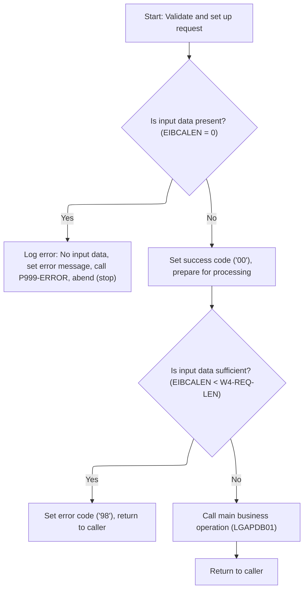
```mermaid
%%{init: {"flowchart": {"defaultRenderer": "elk"}} }%%
flowchart TD
    node1["Start: Validate and set up request"] --> node2{"Is input data present? (EIBCALEN = 0)"}
    click node1 openCode "base/src/lgapol01.cbl:68:77"
    node2 -->|"Yes"| node3["Log error: No input data, set error message, call P999-ERROR, abend (stop)"]
    click node2 openCode "base/src/lgapol01.cbl:83:87"
    click node3 openCode "base/src/lgapol01.cbl:84:86"
    node2 -->|"No"| node4["Set success code ('00'), prepare for processing"]
    click node4 openCode "base/src/lgapol01.cbl:89:92"
    node4 --> node5{"Is input data sufficient? (EIBCALEN < W4-REQ-LEN)"}
    click node5 openCode "base/src/lgapol01.cbl:95:98"
    node5 -->|"Yes"| node6["Set error code ('98'), return to caller"]
    click node6 openCode "base/src/lgapol01.cbl:96:97"
    node5 -->|"No"| node7["Call main business operation (LGAPDB01)"]
    click node7 openCode "base/src/lgapol01.cbl:103:106"
    node7 --> node8["Return to caller"]
    click node8 openCode "base/src/lgapol01.cbl:108:108"
classDef HeadingStyle fill:#777777,stroke:#333,stroke-width:2px;

%% Swimm:
%% %%{init: {"flowchart": {"defaultRenderer": "elk"}} }%%
%% flowchart TD
%%     node1["Start: Validate and set up request"] --> node2{"Is input data present? (EIBCALEN = 0)"}
%%     click node1 openCode "<SwmPath>[base/src/lgapol01.cbl](base/src/lgapol01.cbl)</SwmPath>:68:77"
%%     node2 -->|"Yes"| node3["Log error: No input data, set error message, call <SwmToken path="base/src/lgapol01.cbl" pos="85:3:5" line-data="               PERFORM P999-ERROR">`P999-ERROR`</SwmToken>, abend (stop)"]
%%     click node2 openCode "<SwmPath>[base/src/lgapol01.cbl](base/src/lgapol01.cbl)</SwmPath>:83:87"
%%     click node3 openCode "<SwmPath>[base/src/lgapol01.cbl](base/src/lgapol01.cbl)</SwmPath>:84:86"
%%     node2 -->|"No"| node4["Set success code ('00'), prepare for processing"]
%%     click node4 openCode "<SwmPath>[base/src/lgapol01.cbl](base/src/lgapol01.cbl)</SwmPath>:89:92"
%%     node4 --> node5{"Is input data sufficient? (EIBCALEN < <SwmToken path="base/src/lgapol01.cbl" pos="92:11:15" line-data="           ADD W4-HDR-LEN TO W4-REQ-LEN">`W4-REQ-LEN`</SwmToken>)"}
%%     click node5 openCode "<SwmPath>[base/src/lgapol01.cbl](base/src/lgapol01.cbl)</SwmPath>:95:98"
%%     node5 -->|"Yes"| node6["Set error code ('98'), return to caller"]
%%     click node6 openCode "<SwmPath>[base/src/lgapol01.cbl](base/src/lgapol01.cbl)</SwmPath>:96:97"
%%     node5 -->|"No"| node7["Call main business operation (<SwmToken path="base/src/lgapol01.cbl" pos="103:9:9" line-data="           EXEC CICS Link Program(LGAPDB01)">`LGAPDB01`</SwmToken>)"]
%%     click node7 openCode "<SwmPath>[base/src/lgapol01.cbl](base/src/lgapol01.cbl)</SwmPath>:103:106"
%%     node7 --> node8["Return to caller"]
%%     click node8 openCode "<SwmPath>[base/src/lgapol01.cbl](base/src/lgapol01.cbl)</SwmPath>:108:108"
%% classDef HeadingStyle fill:#777777,stroke:#333,stroke-width:2px;
```

This section ensures that only valid and sufficiently detailed requests for policy addition are processed. It enforces strict validation of input data and provides robust error handling and logging for failed requests.

| Category       | Rule Name             | Description                                                                                                                                   |
| -------------- | --------------------- | --------------------------------------------------------------------------------------------------------------------------------------------- |
| Business logic | Valid request routing | If input data is valid and sufficient, the request must be routed to the main business operation for policy addition and premium calculation. |

<SwmSnippet path="/base/src/lgapol01.cbl" line="68">

---

<SwmToken path="base/src/lgapol01.cbl" pos="68:1:3" line-data="       P100-MAIN SECTION.">`P100-MAIN`</SwmToken> in <SwmToken path="base/src/lgtestp1.cbl" pos="115:10:10" line-data="                 EXEC CICS LINK PROGRAM(&#39;LGAPOL01&#39;)">`LGAPOL01`</SwmToken> checks for a valid commarea, sets up control fields, and checks if the input is big enough for the request. If not, it logs an error and abends. If everything is good, it calls <SwmToken path="base/src/lgapol01.cbl" pos="103:9:9" line-data="           EXEC CICS Link Program(LGAPDB01)">`LGAPDB01`</SwmToken> to actually process the policy add and premium calculation. <SwmToken path="base/src/lgapol01.cbl" pos="85:3:5" line-data="               PERFORM P999-ERROR">`P999-ERROR`</SwmToken> handles error logging and queueing if anything goes wrong.

```cobol
       P100-MAIN SECTION.

      *----------------------------------------------------------------*
      * Common code                                                    *
      *----------------------------------------------------------------*
           INITIALIZE W1-CONTROL.
           MOVE EIBTRNID TO W1-TID.
           MOVE EIBTRMID TO W1-TRM.
           MOVE EIBTASKN TO W1-TSK.
           MOVE EIBCALEN TO W1-LEN.
      *----------------------------------------------------------------*

      *----------------------------------------------------------------*
      * Check commarea and obtain required details                     *
      *----------------------------------------------------------------*
           IF EIBCALEN IS EQUAL TO ZERO
               MOVE ' NO COMMAREA RECEIVED' TO W3-DETAIL
               PERFORM P999-ERROR
               EXEC CICS ABEND ABCODE('LGCA') NODUMP END-EXEC
           END-IF

           MOVE '00' TO CA-RETURN-CODE
           SET W1-PTR TO ADDRESS OF DFHCOMMAREA.

           ADD W4-HDR-LEN TO W4-REQ-LEN


           IF EIBCALEN IS LESS THAN W4-REQ-LEN
             MOVE '98' TO CA-RETURN-CODE
             EXEC CICS RETURN END-EXEC
           END-IF

      *----------------------------------------------------------------*
      *    Perform the data Inserts                                    *
      *----------------------------------------------------------------*
           EXEC CICS Link Program(LGAPDB01)
                Commarea(DFHCOMMAREA)
                LENGTH(32500)
           END-EXEC.

           EXEC CICS RETURN END-EXEC.
```

---

</SwmSnippet>

<SwmSnippet path="/base/src/lgapol01.cbl" line="119">

---

<SwmToken path="base/src/lgapol01.cbl" pos="119:1:3" line-data="       P999-ERROR.">`P999-ERROR`</SwmToken> logs the error with a timestamp, formats the message, and calls LGSTSQ to queue the error. If there's a commarea, it sends up to 90 bytes for diagnostics. The 90-byte limit and the use of specific structures are repo conventions.

```cobol
       P999-ERROR.
      * Save SQLCODE in message
      * Obtain and format current time and date
           EXEC CICS ASKTIME ABSTIME(W2-TIME)
           END-EXEC
           EXEC CICS FORMATTIME ABSTIME(W2-TIME)
                     MMDDYYYY(W2-DATE1)
                     TIME(W2-DATE2)
           END-EXEC
           MOVE W2-DATE1 TO W3-DATE
           MOVE W2-DATE2 TO W3-TIME
      * Write output message to TDQ
           EXEC CICS LINK PROGRAM('LGSTSQ')
                     COMMAREA(W3-MESSAGE)
                     LENGTH(LENGTH OF W3-MESSAGE)
           END-EXEC.
      * Write 90 bytes or as much as we have of commarea to TDQ
           IF EIBCALEN > 0 THEN
             IF EIBCALEN < 91 THEN
               MOVE DFHCOMMAREA(1:EIBCALEN) TO CA-DATA
               EXEC CICS LINK PROGRAM('LGSTSQ')
                         COMMAREA(CA-ERROR-MSG)
                         LENGTH(LENGTH OF CA-ERROR-MSG)
               END-EXEC
             ELSE
               MOVE DFHCOMMAREA(1:90) TO CA-DATA
               EXEC CICS LINK PROGRAM('LGSTSQ')
                         COMMAREA(CA-ERROR-MSG)
                         LENGTH(LENGTH OF CA-ERROR-MSG)
               END-EXEC
             END-IF
           END-IF.
           EXIT.
```

---

</SwmSnippet>

## Premium Calculation Workflow

This section governs how configuration values for actuarial calculations are loaded and set, ensuring that premium calculations use the correct parameters and that any use of defaults is traceable.

| Category        | Rule Name                          | Description                                                                                                                                                                                    |
| --------------- | ---------------------------------- | ---------------------------------------------------------------------------------------------------------------------------------------------------------------------------------------------- |
| Data validation | Workspace parameter update         | Workspace values for actuarial calculation parameters must be updated before any premium calculations are performed, ensuring all calculations use the latest configuration or default values. |
| Business logic  | Config-driven actuarial parameters | If a configuration file is present, the maximum risk score and minimum premium values must be read from the file and used for all subsequent actuarial calculations.                           |

<SwmSnippet path="/base/src/LGAPDB01.cbl" line="90">

---

<SwmToken path="base/src/LGAPDB01.cbl" pos="90:1:1" line-data="       P001.">`P001`</SwmToken> is the main workflow for premium calculation. It runs through initialization, loads config, opens files, processes records, closes files, generates a summary, and displays stats. Each step is handled by its own subroutine, keeping things modular.

```cobol
       P001.
           PERFORM P002-INITIALIZE
           PERFORM P003-LOAD-CONFIG
           PERFORM P005-OPEN-FILES
           PERFORM P006-PROCESS-RECORDS
           PERFORM P014-CLOSE-FILES
           PERFORM P015-GENERATE-SUMMARY
           PERFORM P016-DISPLAY-STATS
           STOP RUN.
```

---

</SwmSnippet>

### Configuration Loading

This section ensures that the application has the necessary configuration parameters to perform calculations, either by loading them from a file or by using defaults if the file is unavailable.

| Category        | Rule Name                       | Description                                                                                                                                                                                                                                                                                                                                                                                                                                         |
| --------------- | ------------------------------- | --------------------------------------------------------------------------------------------------------------------------------------------------------------------------------------------------------------------------------------------------------------------------------------------------------------------------------------------------------------------------------------------------------------------------------------------------- |
| Data validation | Numeric config validation       | The configuration file must provide numeric values for <SwmToken path="base/src/LGAPDB01.cbl" pos="126:4:4" line-data="           MOVE &#39;MAX_RISK_SCORE&#39; TO CONFIG-KEY">`MAX_RISK_SCORE`</SwmToken> and <SwmToken path="base/src/LGAPDB01.cbl" pos="132:4:4" line-data="           MOVE &#39;MIN_PREMIUM&#39; TO CONFIG-KEY">`MIN_PREMIUM`</SwmToken>. If the values are not numeric, they must not be assigned and defaults should be used. |
| Business logic  | Mandatory config initialization | The configuration parameters <SwmToken path="base/src/LGAPDB01.cbl" pos="126:4:4" line-data="           MOVE &#39;MAX_RISK_SCORE&#39; TO CONFIG-KEY">`MAX_RISK_SCORE`</SwmToken> and <SwmToken path="base/src/LGAPDB01.cbl" pos="132:4:4" line-data="           MOVE &#39;MIN_PREMIUM&#39; TO CONFIG-KEY">`MIN_PREMIUM`</SwmToken> must be set before any calculations are performed, either from the config file or defaults.                      |

<SwmSnippet path="/base/src/LGAPDB01.cbl" line="112">

---

<SwmToken path="base/src/LGAPDB01.cbl" pos="112:1:5" line-data="       P003-LOAD-CONFIG.">`P003-LOAD-CONFIG`</SwmToken> tries to open the config file. If it's missing, it loads defaults. If it's there, it reads the config values using <SwmToken path="base/src/LGAPDB01.cbl" pos="118:3:9" line-data="               PERFORM P004-READ-CONFIG-VALUES">`P004-READ-CONFIG-VALUES`</SwmToken>, then closes the file. This sets up the calculation parameters for later steps.

```cobol
       P003-LOAD-CONFIG.
           OPEN INPUT CONFIG-FILE
           IF NOT CONFIG-OK
               DISPLAY 'Warning: Config file not available - using defaults'
               PERFORM P004-SET-DEFAULTS
           ELSE
               PERFORM P004-READ-CONFIG-VALUES
               CLOSE CONFIG-FILE
           END-IF.
```

---

</SwmSnippet>

<SwmSnippet path="/base/src/LGAPDB01.cbl" line="125">

---

<SwmToken path="base/src/LGAPDB01.cbl" pos="125:1:7" line-data="       P004-READ-CONFIG-VALUES.">`P004-READ-CONFIG-VALUES`</SwmToken> reads <SwmToken path="base/src/LGAPDB01.cbl" pos="126:4:4" line-data="           MOVE &#39;MAX_RISK_SCORE&#39; TO CONFIG-KEY">`MAX_RISK_SCORE`</SwmToken> and <SwmToken path="base/src/LGAPDB01.cbl" pos="132:4:4" line-data="           MOVE &#39;MIN_PREMIUM&#39; TO CONFIG-KEY">`MIN_PREMIUM`</SwmToken> from the config file, checks if they're numeric and the read worked, then assigns them to workspace variables. If not, it skips the assignment. This assumes the config file has these keys and numeric values.

```cobol
       P004-READ-CONFIG-VALUES.
           MOVE 'MAX_RISK_SCORE' TO CONFIG-KEY
           READ CONFIG-FILE
           IF CONFIG-OK AND NUMERIC-CONFIG
               MOVE FUNCTION NUMVAL(CONFIG-VALUE) TO WS-MAX-RISK-SCORE
           END-IF
           
           MOVE 'MIN_PREMIUM' TO CONFIG-KEY
           READ CONFIG-FILE
           IF CONFIG-OK AND NUMERIC-CONFIG
               MOVE FUNCTION NUMVAL(CONFIG-VALUE) TO WS-MIN-PREMIUM
           END-IF.
```

---

</SwmSnippet>

### File Preparation and Report Header

<SwmSnippet path="/base/src/LGAPDB01.cbl" line="138">

---

<SwmToken path="base/src/LGAPDB01.cbl" pos="138:1:5" line-data="       P005-OPEN-FILES.">`P005-OPEN-FILES`</SwmToken> runs through opening the input, output, and summary files, then writes the report headers. Each step is handled by its own subroutine, and writing headers is bundled in here even though the name doesn't say it.

```cobol
       P005-OPEN-FILES.
           PERFORM P005A-OPEN-INPUT
           PERFORM P005B-OPEN-OUTPUT
           PERFORM P005C-OPEN-SUMMARY
           PERFORM P005D-WRITE-HEADERS.
```

---

</SwmSnippet>

## Processing and Routing Policy Records

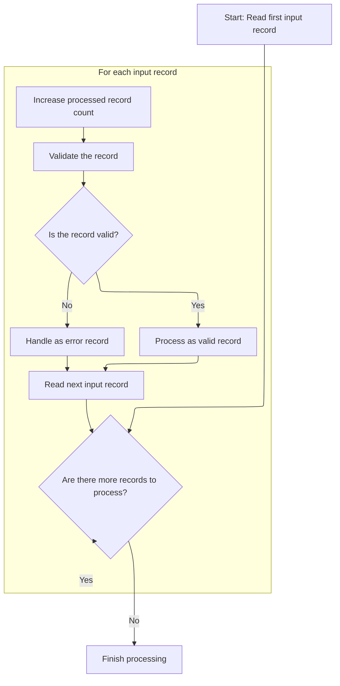
```mermaid
%%{init: {"flowchart": {"defaultRenderer": "elk"}} }%%
flowchart TD
    node1["Start: Read first input record"]
    click node1 openCode "base/src/LGAPDB01.cbl:179:179"
    node1 --> node2{"Are there more records to process?"}
    click node2 openCode "base/src/LGAPDB01.cbl:180:180"
    node2 -->|"No"| node9["Finish processing"]
    click node9 openCode "base/src/LGAPDB01.cbl:189:189"
    node2 -->|"Yes"| loop1
    subgraph loop1["For each input record"]
        node3["Increase processed record count"]
        click node3 openCode "base/src/LGAPDB01.cbl:181:181"
        node3 --> node4["Validate the record"]
        click node4 openCode "base/src/LGAPDB01.cbl:182:182"
        node4 --> node5{"Is the record valid?"}
        click node5 openCode "base/src/LGAPDB01.cbl:183:183"
        node5 -->|"Yes"| node6["Process as valid record"]
        click node6 openCode "base/src/LGAPDB01.cbl:184:184"
        node5 -->|"No"| node7["Handle as error record"]
        click node7 openCode "base/src/LGAPDB01.cbl:186:186"
        node6 --> node8["Read next input record"]
        click node8 openCode "base/src/LGAPDB01.cbl:188:188"
        node7 --> node8
        node8 --> node2
    end

classDef HeadingStyle fill:#777777,stroke:#333,stroke-width:2px;

%% Swimm:
%% %%{init: {"flowchart": {"defaultRenderer": "elk"}} }%%
%% flowchart TD
%%     node1["Start: Read first input record"]
%%     click node1 openCode "<SwmPath>[base/src/LGAPDB01.cbl](base/src/LGAPDB01.cbl)</SwmPath>:179:179"
%%     node1 --> node2{"Are there more records to process?"}
%%     click node2 openCode "<SwmPath>[base/src/LGAPDB01.cbl](base/src/LGAPDB01.cbl)</SwmPath>:180:180"
%%     node2 -->|"No"| node9["Finish processing"]
%%     click node9 openCode "<SwmPath>[base/src/LGAPDB01.cbl](base/src/LGAPDB01.cbl)</SwmPath>:189:189"
%%     node2 -->|"Yes"| loop1
%%     subgraph loop1["For each input record"]
%%         node3["Increase processed record count"]
%%         click node3 openCode "<SwmPath>[base/src/LGAPDB01.cbl](base/src/LGAPDB01.cbl)</SwmPath>:181:181"
%%         node3 --> node4["Validate the record"]
%%         click node4 openCode "<SwmPath>[base/src/LGAPDB01.cbl](base/src/LGAPDB01.cbl)</SwmPath>:182:182"
%%         node4 --> node5{"Is the record valid?"}
%%         click node5 openCode "<SwmPath>[base/src/LGAPDB01.cbl](base/src/LGAPDB01.cbl)</SwmPath>:183:183"
%%         node5 -->|"Yes"| node6["Process as valid record"]
%%         click node6 openCode "<SwmPath>[base/src/LGAPDB01.cbl](base/src/LGAPDB01.cbl)</SwmPath>:184:184"
%%         node5 -->|"No"| node7["Handle as error record"]
%%         click node7 openCode "<SwmPath>[base/src/LGAPDB01.cbl](base/src/LGAPDB01.cbl)</SwmPath>:186:186"
%%         node6 --> node8["Read next input record"]
%%         click node8 openCode "<SwmPath>[base/src/LGAPDB01.cbl](base/src/LGAPDB01.cbl)</SwmPath>:188:188"
%%         node7 --> node8
%%         node8 --> node2
%%     end
%% 
%% classDef HeadingStyle fill:#777777,stroke:#333,stroke-width:2px;
```

This section ensures that each policy record is validated and routed appropriately, maintaining data integrity by separating clean data from errors and tracking processing statistics.

| Category        | Rule Name                     | Description                                                                                                                                                          |
| --------------- | ----------------------------- | -------------------------------------------------------------------------------------------------------------------------------------------------------------------- |
| Data validation | Record validation requirement | Each input record must be validated before it is processed further. Only records that pass validation are considered valid and routed for standard processing.       |
| Business logic  | Error record routing          | If a record fails validation, it must be routed to the error handler and tracked separately from valid records. Error records are not processed as standard records. |
| Business logic  | Processed record counting     | The system must increment the processed record count for each record read, regardless of whether it is valid or an error.                                            |
| Business logic  | End-of-file processing limit  | Processing must continue until the end-of-file indicator is reached, at which point the section must stop processing further records.                                |
| Business logic  | Error severity categorization | Error records must be categorized by severity (fatal, warning, informational) and tracked in the error array for reporting and analysis.                             |
| Business logic  | Error and warning counting    | The system must maintain separate counters for errors and warnings encountered during processing, for use in reporting and operational monitoring.                   |

<SwmSnippet path="/base/src/LGAPDB01.cbl" line="178">

---

We read each record, validate it, and route it to either the valid or error handler. This keeps clean data separate from errors for downstream processing.

```cobol
       P006-PROCESS-RECORDS.
           PERFORM P007-READ-INPUT
           PERFORM UNTIL INPUT-EOF
               ADD 1 TO WS-REC-CNT
               PERFORM P008-VALIDATE-INPUT-RECORD
               IF WS-ERROR-COUNT = ZERO
                   PERFORM P009-PROCESS-VALID-RECORD
               ELSE
                   PERFORM P010-PROCESS-ERROR-RECORD
               END-IF
               PERFORM P007-READ-INPUT
           END-PERFORM.
```

---

</SwmSnippet>

## Validating Policy Data and Logging Errors

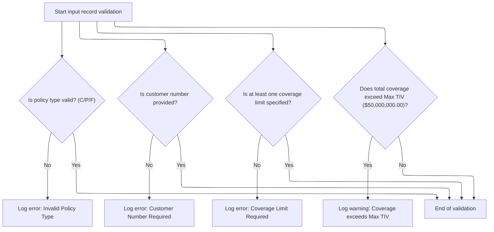
```mermaid
%%{init: {"flowchart": {"defaultRenderer": "elk"}} }%%
flowchart TD
    node1["Start input record validation"]
    click node1 openCode "base/src/LGAPDB01.cbl:195:196"
    node1 --> node2{"Is policy type valid? (C/P/F)"}
    click node2 openCode "base/src/LGAPDB01.cbl:198:204"
    node1 --> node5{"Is customer number provided?"}
    click node5 openCode "base/src/LGAPDB01.cbl:206:210"
    node1 --> node8{"Is at least one coverage limit specified?"}
    click node8 openCode "base/src/LGAPDB01.cbl:212:217"
    node1 --> node11{"Does total coverage exceed Max TIV ($50,000,000.00)?"}
    click node11 openCode "base/src/LGAPDB01.cbl:219:224"
    node2 -->|"No"| node3["Log error: Invalid Policy Type"]
    click node3 openCode "base/src/LGAPDB01.cbl:201:203"
    node5 -->|"No"| node6["Log error: Customer Number Required"]
    click node6 openCode "base/src/LGAPDB01.cbl:207:209"
    node8 -->|"No"| node9["Log error: Coverage Limit Required"]
    click node9 openCode "base/src/LGAPDB01.cbl:214:216"
    node11 -->|"Yes"| node12["Log warning: Coverage exceeds Max TIV"]
    click node12 openCode "base/src/LGAPDB01.cbl:221:223"
    node2 -->|"Yes"| node13["Continue"]
    node5 -->|"Yes"| node13
    node8 -->|"Yes"| node13
    node11 -->|"No"| node13
    node13["End of validation"]
    click node13 openCode "base/src/LGAPDB01.cbl:224:224"
classDef HeadingStyle fill:#777777,stroke:#333,stroke-width:2px;

%% Swimm:
%% %%{init: {"flowchart": {"defaultRenderer": "elk"}} }%%
%% flowchart TD
%%     node1["Start input record validation"]
%%     click node1 openCode "<SwmPath>[base/src/LGAPDB01.cbl](base/src/LGAPDB01.cbl)</SwmPath>:195:196"
%%     node1 --> node2{"Is policy type valid? (C/P/F)"}
%%     click node2 openCode "<SwmPath>[base/src/LGAPDB01.cbl](base/src/LGAPDB01.cbl)</SwmPath>:198:204"
%%     node1 --> node5{"Is customer number provided?"}
%%     click node5 openCode "<SwmPath>[base/src/LGAPDB01.cbl](base/src/LGAPDB01.cbl)</SwmPath>:206:210"
%%     node1 --> node8{"Is at least one coverage limit specified?"}
%%     click node8 openCode "<SwmPath>[base/src/LGAPDB01.cbl](base/src/LGAPDB01.cbl)</SwmPath>:212:217"
%%     node1 --> node11{"Does total coverage exceed Max TIV ($50,000,000.00)?"}
%%     click node11 openCode "<SwmPath>[base/src/LGAPDB01.cbl](base/src/LGAPDB01.cbl)</SwmPath>:219:224"
%%     node2 -->|"No"| node3["Log error: Invalid Policy Type"]
%%     click node3 openCode "<SwmPath>[base/src/LGAPDB01.cbl](base/src/LGAPDB01.cbl)</SwmPath>:201:203"
%%     node5 -->|"No"| node6["Log error: Customer Number Required"]
%%     click node6 openCode "<SwmPath>[base/src/LGAPDB01.cbl](base/src/LGAPDB01.cbl)</SwmPath>:207:209"
%%     node8 -->|"No"| node9["Log error: Coverage Limit Required"]
%%     click node9 openCode "<SwmPath>[base/src/LGAPDB01.cbl](base/src/LGAPDB01.cbl)</SwmPath>:214:216"
%%     node11 -->|"Yes"| node12["Log warning: Coverage exceeds Max TIV"]
%%     click node12 openCode "<SwmPath>[base/src/LGAPDB01.cbl](base/src/LGAPDB01.cbl)</SwmPath>:221:223"
%%     node2 -->|"Yes"| node13["Continue"]
%%     node5 -->|"Yes"| node13
%%     node8 -->|"Yes"| node13
%%     node11 -->|"No"| node13
%%     node13["End of validation"]
%%     click node13 openCode "<SwmPath>[base/src/LGAPDB01.cbl](base/src/LGAPDB01.cbl)</SwmPath>:224:224"
%% classDef HeadingStyle fill:#777777,stroke:#333,stroke-width:2px;
```

This section ensures that incoming policy data meets minimum business requirements before further processing. It validates key fields and logs errors or warnings for any issues, preventing invalid data from entering the main workflow.

| Category        | Rule Name                | Description                                                                                                                                               |
| --------------- | ------------------------ | --------------------------------------------------------------------------------------------------------------------------------------------------------- |
| Data validation | Valid Policy Type        | Only policy types 'C' (Commercial), 'P' (Personal), or 'F' (Farm) are accepted. Any other value is considered invalid and must be logged as an error.     |
| Data validation | Customer Number Required | A customer number must be provided for every policy record. If missing, this must be logged as an error.                                                  |
| Data validation | Coverage Limit Required  | At least one coverage limit (building, contents, or business interruption) must be specified. If all are zero, this must be logged as an error.           |
| Business logic  | Maximum TIV Warning      | If the sum of all coverage limits (building, contents, business interruption) exceeds $50,000,000.00, a warning must be logged, but processing continues. |

<SwmSnippet path="/base/src/LGAPDB01.cbl" line="195">

---

We validate policy type, customer number, and coverage limits, and log errors or warnings if any rules are broken. This keeps invalid data out of the main processing path.

```cobol
       P008-VALIDATE-INPUT-RECORD.
           INITIALIZE WS-ERROR-HANDLING
           
           IF NOT COMMERCIAL-POLICY AND 
              NOT PERSONAL-POLICY AND 
              NOT FARM-POLICY
               PERFORM P008A-LOG-ERROR WITH 
                   'POL001' 'F' 'IN-POLICY-TYPE' 
                   'Invalid Policy Type'
           END-IF
           
           IF IN-CUSTOMER-NUM = SPACES
               PERFORM P008A-LOG-ERROR WITH 
                   'CUS001' 'F' 'IN-CUSTOMER-NUM' 
                   'Customer Number Required'
           END-IF
           
           IF IN-BUILDING-LIMIT = ZERO AND 
              IN-CONTENTS-LIMIT = ZERO
               PERFORM P008A-LOG-ERROR WITH 
                   'COV001' 'F' 'COVERAGE-LIMITS' 
                   'At least one coverage limit required'
           END-IF
           
           IF IN-BUILDING-LIMIT + IN-CONTENTS-LIMIT + 
              IN-BI-LIMIT > WS-MAX-TIV
               PERFORM P008A-LOG-ERROR WITH 
                   'COV002' 'W' 'COVERAGE-LIMITS' 
                   'Total coverage exceeds maximum TIV'
           END-IF.
```

---

</SwmSnippet>

<SwmSnippet path="/base/src/LGAPDB01.cbl" line="226">

---

<SwmToken path="base/src/LGAPDB01.cbl" pos="226:1:5" line-data="       P008A-LOG-ERROR.">`P008A-LOG-ERROR`</SwmToken> bumps the error count and uses it as an index to store error details in parallel arrays. This lets us track multiple errors per record, but only up to 20. Severity is also logged, so downstream logic can distinguish between fatal errors and warnings.

```cobol
       P008A-LOG-ERROR.
           ADD 1 TO WS-ERROR-COUNT
           SET ERR-IDX TO WS-ERROR-COUNT
           MOVE WS-ERROR-CODE TO WS-ERROR-CODE (ERR-IDX)
           MOVE WS-ERROR-SEVERITY TO WS-ERROR-SEVERITY (ERR-IDX)
           MOVE WS-ERROR-FIELD TO WS-ERROR-FIELD (ERR-IDX)
           MOVE WS-ERROR-MESSAGE TO WS-ERROR-MESSAGE (ERR-IDX).
```

---

</SwmSnippet>

## Handling Valid Policy Applications


```mermaid
%%{init: {"flowchart": {"defaultRenderer": "elk"}} }%%
flowchart TD
    node1{"COMMERCIAL-POLICY? (Is IN-POLICY-TYPE = 'C')"}
    click node1 openCode "base/src/LGAPDB01.cbl:235:241"
    node1 -->|"Yes"| node2["Call P011-PROCESS-COMMERCIAL"]
    click node2 openCode "base/src/LGAPDB01.cbl:236:236"
    node2 --> node3["Add 1 to processed commercial counter (WS-PROC-CNT)"]
    click node3 openCode "base/src/LGAPDB01.cbl:237:237"
    node1 -->|"No"| node4["Call P012-PROCESS-NON-COMMERCIAL"]
    click node4 openCode "base/src/LGAPDB01.cbl:239:239"
    node4 --> node5["Add 1 to processed non-commercial counter (WS-ERR-CNT)"]
    click node5 openCode "base/src/LGAPDB01.cbl:240:240"

classDef HeadingStyle fill:#777777,stroke:#333,stroke-width:2px;

%% Swimm:
%% %%{init: {"flowchart": {"defaultRenderer": "elk"}} }%%
%% flowchart TD
%%     node1{"<SwmToken path="base/src/LGAPDB01.cbl" pos="198:5:7" line-data="           IF NOT COMMERCIAL-POLICY AND ">`COMMERCIAL-POLICY`</SwmToken>? (Is <SwmToken path="base/src/LGAPDB01.cbl" pos="202:10:14" line-data="                   &#39;POL001&#39; &#39;F&#39; &#39;IN-POLICY-TYPE&#39; ">`IN-POLICY-TYPE`</SwmToken> = 'C')"}
%%     click node1 openCode "<SwmPath>[base/src/LGAPDB01.cbl](base/src/LGAPDB01.cbl)</SwmPath>:235:241"
%%     node1 -->|"Yes"| node2["Call <SwmToken path="base/src/LGAPDB01.cbl" pos="236:3:7" line-data="               PERFORM P011-PROCESS-COMMERCIAL">`P011-PROCESS-COMMERCIAL`</SwmToken>"]
%%     click node2 openCode "<SwmPath>[base/src/LGAPDB01.cbl](base/src/LGAPDB01.cbl)</SwmPath>:236:236"
%%     node2 --> node3["Add 1 to processed commercial counter (<SwmToken path="base/src/LGAPDB01.cbl" pos="237:7:11" line-data="               ADD 1 TO WS-PROC-CNT">`WS-PROC-CNT`</SwmToken>)"]
%%     click node3 openCode "<SwmPath>[base/src/LGAPDB01.cbl](base/src/LGAPDB01.cbl)</SwmPath>:237:237"
%%     node1 -->|"No"| node4["Call <SwmToken path="base/src/LGAPDB01.cbl" pos="239:3:9" line-data="               PERFORM P012-PROCESS-NON-COMMERCIAL">`P012-PROCESS-NON-COMMERCIAL`</SwmToken>"]
%%     click node4 openCode "<SwmPath>[base/src/LGAPDB01.cbl](base/src/LGAPDB01.cbl)</SwmPath>:239:239"
%%     node4 --> node5["Add 1 to processed non-commercial counter (<SwmToken path="base/src/LGAPDB01.cbl" pos="240:7:11" line-data="               ADD 1 TO WS-ERR-CNT">`WS-ERR-CNT`</SwmToken>)"]
%%     click node5 openCode "<SwmPath>[base/src/LGAPDB01.cbl](base/src/LGAPDB01.cbl)</SwmPath>:240:240"
%% 
%% classDef HeadingStyle fill:#777777,stroke:#333,stroke-width:2px;
```

This section is responsible for handling valid policy applications by determining their type and routing them to the appropriate workflow, while maintaining accurate processing and error counters.

| Category       | Rule Name                            | Description                                                                                                                                                                                                                                                                                                  |
| -------------- | ------------------------------------ | ------------------------------------------------------------------------------------------------------------------------------------------------------------------------------------------------------------------------------------------------------------------------------------------------------------ |
| Business logic | Commercial policy routing            | If the policy type is commercial (<SwmToken path="base/src/LGAPDB01.cbl" pos="202:10:14" line-data="                   &#39;POL001&#39; &#39;F&#39; &#39;IN-POLICY-TYPE&#39; ">`IN-POLICY-TYPE`</SwmToken> = 'C'), the application must be processed through the commercial workflow.                        |
| Business logic | Commercial policy counting           | Each commercial policy application processed must increment the processed commercial counter by 1.                                                                                                                                                                                                           |
| Business logic | Non-commercial policy error logging  | If the policy type is not commercial (<SwmToken path="base/src/LGAPDB01.cbl" pos="202:10:14" line-data="                   &#39;POL001&#39; &#39;F&#39; &#39;IN-POLICY-TYPE&#39; ">`IN-POLICY-TYPE`</SwmToken> ≠ 'C'), the application must be routed to the non-commercial workflow and logged as an error. |
| Business logic | Non-commercial policy error counting | Each non-commercial policy application processed must increment the error counter by 1.                                                                                                                                                                                                                      |

<SwmSnippet path="/base/src/LGAPDB01.cbl" line="234">

---

We route commercial policies to the full actuarial workflow and log non-commercial ones as errors.

```cobol
       P009-PROCESS-VALID-RECORD.
           IF COMMERCIAL-POLICY
               PERFORM P011-PROCESS-COMMERCIAL
               ADD 1 TO WS-PROC-CNT
           ELSE
               PERFORM P012-PROCESS-NON-COMMERCIAL
               ADD 1 TO WS-ERR-CNT
           END-IF.
```

---

</SwmSnippet>

## Commercial Policy Actuarial Workflow

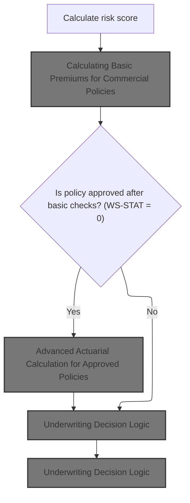
```mermaid
%%{init: {"flowchart": {"defaultRenderer": "elk"}} }%%
flowchart TD
  node1["Calculate risk score"]
  click node1 openCode "base/src/LGAPDB01.cbl:258:258"
  node1 --> node2["Calculating Basic Premiums for Commercial Policies"]
  
  node2 --> node3{"Is policy approved after basic checks? (WS-STAT = 0)"}
  click node3 openCode "base/src/LGAPDB01.cbl:261:263"
  node3 -->|"Yes"| node4["Advanced Actuarial Calculation for Approved Policies"]
  
  node3 -->|"No"| node5["Underwriting Decision Logic"]
  
  node4 --> node5
  node5 --> node6["Underwriting Decision Logic"]
  
classDef HeadingStyle fill:#777777,stroke:#333,stroke-width:2px;
click node2 goToHeading "Calculating Basic Premiums for Commercial Policies"
node2:::HeadingStyle
click node4 goToHeading "Advanced Actuarial Calculation for Approved Policies"
node4:::HeadingStyle
click node5 goToHeading "Underwriting Decision Logic"
node5:::HeadingStyle
click node6 goToHeading "Underwriting Decision Logic"
node6:::HeadingStyle

%% Swimm:
%% %%{init: {"flowchart": {"defaultRenderer": "elk"}} }%%
%% flowchart TD
%%   node1["Calculate risk score"]
%%   click node1 openCode "<SwmPath>[base/src/LGAPDB01.cbl](base/src/LGAPDB01.cbl)</SwmPath>:258:258"
%%   node1 --> node2["Calculating Basic Premiums for Commercial Policies"]
%%   
%%   node2 --> node3{"Is policy approved after basic checks? (<SwmToken path="base/src/LGAPDB01.cbl" pos="261:3:5" line-data="           IF WS-STAT = 0">`WS-STAT`</SwmToken> = 0)"}
%%   click node3 openCode "<SwmPath>[base/src/LGAPDB01.cbl](base/src/LGAPDB01.cbl)</SwmPath>:261:263"
%%   node3 -->|"Yes"| node4["Advanced Actuarial Calculation for Approved Policies"]
%%   
%%   node3 -->|"No"| node5["Underwriting Decision Logic"]
%%   
%%   node4 --> node5
%%   node5 --> node6["Underwriting Decision Logic"]
%%   
%% classDef HeadingStyle fill:#777777,stroke:#333,stroke-width:2px;
%% click node2 goToHeading "Calculating Basic Premiums for Commercial Policies"
%% node2:::HeadingStyle
%% click node4 goToHeading "Advanced Actuarial Calculation for Approved Policies"
%% node4:::HeadingStyle
%% click node5 goToHeading "Underwriting Decision Logic"
%% node5:::HeadingStyle
%% click node6 goToHeading "Underwriting Decision Logic"
%% node6:::HeadingStyle
```

This section governs the actuarial workflow for commercial insurance policies, ensuring that risk scoring, premium calculations, underwriting decisions, and business rules are applied consistently to produce accurate policy records and summary statistics.

| Category        | Rule Name                                  | Description                                                                                                                                                                                                                                         |
| --------------- | ------------------------------------------ | --------------------------------------------------------------------------------------------------------------------------------------------------------------------------------------------------------------------------------------------------- |
| Data validation | Mandatory risk scoring                     | A risk score must be calculated for every commercial policy before any premium calculation or underwriting decision is made.                                                                                                                        |
| Data validation | Underwriting decision documentation        | Underwriting decision status must be recorded for every policy, including status code, description, and rejection reason if applicable.                                                                                                             |
| Data validation | Comprehensive output record                | A detailed output record must be written for each processed policy, including all calculated values and decision outcomes.                                                                                                                          |
| Business logic  | Universal basic premium calculation        | Basic premium calculation must be performed for every commercial policy, regardless of underwriting status.                                                                                                                                         |
| Business logic  | Conditional advanced actuarial calculation | Advanced actuarial calculations are only performed for policies that pass initial underwriting checks (<SwmToken path="base/src/LGAPDB01.cbl" pos="261:3:5" line-data="           IF WS-STAT = 0">`WS-STAT`</SwmToken> = 0, meaning 'UW-APPROVED'). |
| Business logic  | Discount eligibility and application       | Business rules regarding discounts (multi-policy, claims-free, safety program) must be evaluated and applied to eligible policies, affecting the final premium.                                                                                     |
| Business logic  | Statistics update requirement              | Summary statistics must be updated after processing each policy, reflecting totals and aggregates for reporting and analysis.                                                                                                                       |

<SwmSnippet path="/base/src/LGAPDB01.cbl" line="258">

---

We run risk scoring, basic premium calc, enhanced calc if approved, apply business rules, write output, and update stats for commercial policies.

```cobol
       P011-PROCESS-COMMERCIAL.
           PERFORM P011A-CALCULATE-RISK-SCORE
           PERFORM P011B-BASIC-PREMIUM-CALC
           IF WS-STAT = 0
               PERFORM P011C-ENHANCED-ACTUARIAL-CALC
           END-IF
           PERFORM P011D-APPLY-BUSINESS-RULES
           PERFORM P011E-WRITE-OUTPUT-RECORD
           PERFORM P011F-UPDATE-STATISTICS.
```

---

</SwmSnippet>

### Calculating Basic Premiums for Commercial Policies

This section determines the base premium and underwriting decision for commercial insurance policies by evaluating risk scores and peril values against business rules for each peril type.

| Category        | Rule Name                          | Description                                                                                                                                                                                                                                 |
| --------------- | ---------------------------------- | ------------------------------------------------------------------------------------------------------------------------------------------------------------------------------------------------------------------------------------------- |
| Data validation | Minimum premium enforcement        | If the risk score is zero, the base premium for all perils must be set to the minimum allowable premium for each peril.                                                                                                                     |
| Data validation | Discount eligibility enforcement   | Discount factors must be applied only if the policyholder meets eligibility criteria for multi-policy, claims-free, or safety program discounts.                                                                                            |
| Business logic  | Peril-specific premium calculation | Premiums for fire, crime, flood, and weather perils must be calculated separately based on the risk score and peril-specific risk factors.                                                                                                  |
| Business logic  | Total premium aggregation          | The total premium for the policy must be the sum of the individual peril premiums, adjusted by any applicable discount factor.                                                                                                              |
| Business logic  | Underwriting decision assignment   | The underwriting decision must be set to 'approved', 'pending', 'rejected', or 'referred' based on the risk score and risk factors returned from the risk evaluation.                                                                       |
| Business logic  | Default discount factor            | Premium calculations must use the initial discount factor value of <SwmToken path="base/src/LGAPDB03.cbl" pos="93:3:5" line-data="           MOVE 1.00 TO LK-DISC-FACT">`1.00`</SwmToken> unless eligibility for a discount is established. |

<SwmSnippet path="/base/src/LGAPDB01.cbl" line="275">

---

<SwmToken path="base/src/LGAPDB01.cbl" pos="275:1:7" line-data="       P011B-BASIC-PREMIUM-CALC.">`P011B-BASIC-PREMIUM-CALC`</SwmToken> calls <SwmToken path="base/src/LGAPDB01.cbl" pos="276:4:4" line-data="           CALL &#39;LGAPDB03&#39; USING WS-BASE-RISK-SCR, IN-FIRE-PERIL, ">`LGAPDB03`</SwmToken>, passing risk score and peril values. <SwmToken path="base/src/LGAPDB01.cbl" pos="276:4:4" line-data="           CALL &#39;LGAPDB03&#39; USING WS-BASE-RISK-SCR, IN-FIRE-PERIL, ">`LGAPDB03`</SwmToken> fetches risk factors, evaluates the risk score, and calculates premium amounts for fire, crime, flood, and weather perils. This call is needed to get the base premium and underwriting decision for the policy.

```cobol
       P011B-BASIC-PREMIUM-CALC.
           CALL 'LGAPDB03' USING WS-BASE-RISK-SCR, IN-FIRE-PERIL, 
                                IN-CRIME-PERIL, IN-FLOOD-PERIL, 
                                IN-WEATHER-PERIL, WS-STAT,
                                WS-STAT-DESC, WS-REJ-RSN, WS-FR-PREM,
                                WS-CR-PREM, WS-FL-PREM, WS-WE-PREM,
                                WS-TOT-PREM, WS-DISC-FACT.
```

---

</SwmSnippet>

### Risk Assessment and Premium Calculation

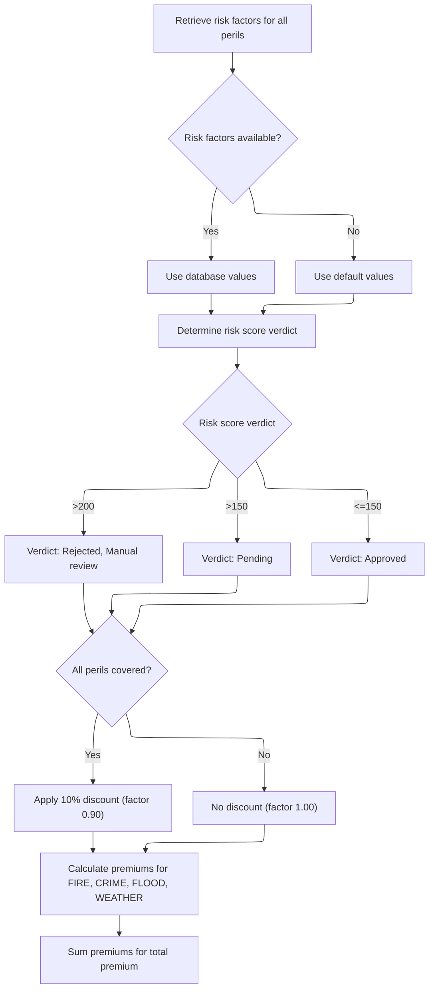
```mermaid
%%{init: {"flowchart": {"defaultRenderer": "elk"}} }%%
flowchart TD
    node1["Retrieve risk factors for all perils"] --> node2{"Risk factors available?"}
    click node1 openCode "base/src/LGAPDB03.cbl:48:71"
    node2 -->|"Yes"| node3["Use database values"]
    click node2 openCode "base/src/LGAPDB03.cbl:55:59"
    node2 -->|"No"| node4["Use default values"]
    click node4 openCode "base/src/LGAPDB03.cbl:58:59"
    node3 --> node5["Determine risk score verdict"]
    node4 --> node5
    click node5 openCode "base/src/LGAPDB03.cbl:73:90"
    node5 --> node6{"Risk score verdict"}
    click node6 openCode "base/src/LGAPDB03.cbl:74:90"
    node6 -->|"#gt;200"| node7["Verdict: Rejected, Manual review"]
    click node7 openCode "base/src/LGAPDB03.cbl:75:78"
    node6 -->|"#gt;150"| node8["Verdict: Pending"]
    click node8 openCode "base/src/LGAPDB03.cbl:81:84"
    node6 -->|"#lt;=150"| node9["Verdict: Approved"]
    click node9 openCode "base/src/LGAPDB03.cbl:86:88"
    node7 --> node10{"All perils covered?"}
    node8 --> node10
    node9 --> node10
    click node10 openCode "base/src/LGAPDB03.cbl:95:100"
    node10 -->|"Yes"| node11["Apply 10% discount (factor 0.90)"]
    click node11 openCode "base/src/LGAPDB03.cbl:99:99"
    node10 -->|"No"| node12["No discount (factor 1.00)"]
    click node12 openCode "base/src/LGAPDB03.cbl:93:94"
    node11 --> node13["Calculate premiums for FIRE, CRIME, FLOOD, WEATHER"]
    node12 --> node13
    click node13 openCode "base/src/LGAPDB03.cbl:102:116"
    node13 --> node14["Sum premiums for total premium"]
    click node14 openCode "base/src/LGAPDB03.cbl:118:120"

classDef HeadingStyle fill:#777777,stroke:#333,stroke-width:2px;

%% Swimm:
%% %%{init: {"flowchart": {"defaultRenderer": "elk"}} }%%
%% flowchart TD
%%     node1["Retrieve risk factors for all perils"] --> node2{"Risk factors available?"}
%%     click node1 openCode "<SwmPath>[base/src/LGAPDB03.cbl](base/src/LGAPDB03.cbl)</SwmPath>:48:71"
%%     node2 -->|"Yes"| node3["Use database values"]
%%     click node2 openCode "<SwmPath>[base/src/LGAPDB03.cbl](base/src/LGAPDB03.cbl)</SwmPath>:55:59"
%%     node2 -->|"No"| node4["Use default values"]
%%     click node4 openCode "<SwmPath>[base/src/LGAPDB03.cbl](base/src/LGAPDB03.cbl)</SwmPath>:58:59"
%%     node3 --> node5["Determine risk score verdict"]
%%     node4 --> node5
%%     click node5 openCode "<SwmPath>[base/src/LGAPDB03.cbl](base/src/LGAPDB03.cbl)</SwmPath>:73:90"
%%     node5 --> node6{"Risk score verdict"}
%%     click node6 openCode "<SwmPath>[base/src/LGAPDB03.cbl](base/src/LGAPDB03.cbl)</SwmPath>:74:90"
%%     node6 -->|"#gt;200"| node7["Verdict: Rejected, Manual review"]
%%     click node7 openCode "<SwmPath>[base/src/LGAPDB03.cbl](base/src/LGAPDB03.cbl)</SwmPath>:75:78"
%%     node6 -->|"#gt;150"| node8["Verdict: Pending"]
%%     click node8 openCode "<SwmPath>[base/src/LGAPDB03.cbl](base/src/LGAPDB03.cbl)</SwmPath>:81:84"
%%     node6 -->|"#lt;=150"| node9["Verdict: Approved"]
%%     click node9 openCode "<SwmPath>[base/src/LGAPDB03.cbl](base/src/LGAPDB03.cbl)</SwmPath>:86:88"
%%     node7 --> node10{"All perils covered?"}
%%     node8 --> node10
%%     node9 --> node10
%%     click node10 openCode "<SwmPath>[base/src/LGAPDB03.cbl](base/src/LGAPDB03.cbl)</SwmPath>:95:100"
%%     node10 -->|"Yes"| node11["Apply 10% discount (factor <SwmToken path="base/src/LGAPDB03.cbl" pos="99:3:5" line-data="             MOVE 0.90 TO LK-DISC-FACT">`0.90`</SwmToken>)"]
%%     click node11 openCode "<SwmPath>[base/src/LGAPDB03.cbl](base/src/LGAPDB03.cbl)</SwmPath>:99:99"
%%     node10 -->|"No"| node12["No discount (factor <SwmToken path="base/src/LGAPDB03.cbl" pos="93:3:5" line-data="           MOVE 1.00 TO LK-DISC-FACT">`1.00`</SwmToken>)"]
%%     click node12 openCode "<SwmPath>[base/src/LGAPDB03.cbl](base/src/LGAPDB03.cbl)</SwmPath>:93:94"
%%     node11 --> node13["Calculate premiums for FIRE, CRIME, FLOOD, WEATHER"]
%%     node12 --> node13
%%     click node13 openCode "<SwmPath>[base/src/LGAPDB03.cbl](base/src/LGAPDB03.cbl)</SwmPath>:102:116"
%%     node13 --> node14["Sum premiums for total premium"]
%%     click node14 openCode "<SwmPath>[base/src/LGAPDB03.cbl](base/src/LGAPDB03.cbl)</SwmPath>:118:120"
%% 
%% classDef HeadingStyle fill:#777777,stroke:#333,stroke-width:2px;
```

This section governs how risk factors are retrieved and applied, how risk scores are evaluated to set underwriting verdicts, and how premiums are calculated for each peril and in total, including any applicable discounts.

| Category       | Rule Name                    | Description                                                                                                                                                                                                                                                                                                                                                                                                 |
| -------------- | ---------------------------- | ----------------------------------------------------------------------------------------------------------------------------------------------------------------------------------------------------------------------------------------------------------------------------------------------------------------------------------------------------------------------------------------------------------- |
| Business logic | Default risk factor fallback | If risk factors for FIRE or CRIME are not available from the database, use default values: <SwmToken path="base/src/LGAPDB03.cbl" pos="58:3:5" line-data="               MOVE 0.80 TO WS-FIRE-FACTOR">`0.80`</SwmToken> for FIRE and <SwmToken path="base/src/LGAPDB03.cbl" pos="70:3:5" line-data="               MOVE 0.60 TO WS-CRIME-FACTOR">`0.60`</SwmToken> for CRIME.                               |
| Business logic | High risk rejection          | If the risk score is greater than 200, the verdict is 'Rejected' and requires manual review.                                                                                                                                                                                                                                                                                                                |
| Business logic | Medium risk pending          | If the risk score is greater than 150 but less than or equal to 200, the verdict is 'Pending'.                                                                                                                                                                                                                                                                                                              |
| Business logic | Low risk approval            | If the risk score is less than or equal to 150, the verdict is 'Approved'.                                                                                                                                                                                                                                                                                                                                  |
| Business logic | All perils discount          | If all perils (FIRE, CRIME, FLOOD, WEATHER) are covered, apply a 10% discount to the premium (discount factor <SwmToken path="base/src/LGAPDB03.cbl" pos="99:3:5" line-data="             MOVE 0.90 TO LK-DISC-FACT">`0.90`</SwmToken>). Otherwise, no discount is applied (factor <SwmToken path="base/src/LGAPDB03.cbl" pos="93:3:5" line-data="           MOVE 1.00 TO LK-DISC-FACT">`1.00`</SwmToken>). |
| Business logic | Peril premium calculation    | Premiums for each peril are calculated as: (risk score × peril factor × peril value × discount factor).                                                                                                                                                                                                                                                                                                     |
| Business logic | Total premium summation      | The total premium is the sum of the individual premiums for FIRE, CRIME, FLOOD, and WEATHER.                                                                                                                                                                                                                                                                                                                |

<SwmSnippet path="/base/src/LGAPDB03.cbl" line="42">

---

We fetch risk factors, set the verdict, and calculate premiums for each peril in sequence.

```cobol
       MAIN-LOGIC.
           PERFORM GET-RISK-FACTORS
           PERFORM CALCULATE-VERDICT
           PERFORM CALCULATE-PREMIUMS
           GOBACK.
```

---

</SwmSnippet>

<SwmSnippet path="/base/src/LGAPDB03.cbl" line="48">

---

We fetch risk factors for FIRE and CRIME, and use defaults if the DB query fails.

```cobol
       GET-RISK-FACTORS.
           EXEC SQL
               SELECT FACTOR_VALUE INTO :WS-FIRE-FACTOR
               FROM RISK_FACTORS
               WHERE PERIL_TYPE = 'FIRE'
           END-EXEC.
           
           IF SQLCODE = 0
               CONTINUE
           ELSE
               MOVE 0.80 TO WS-FIRE-FACTOR
           END-IF.
           
           EXEC SQL
               SELECT FACTOR_VALUE INTO :WS-CRIME-FACTOR
               FROM RISK_FACTORS
               WHERE PERIL_TYPE = 'CRIME'
           END-EXEC.
           
           IF SQLCODE = 0
               CONTINUE
           ELSE
               MOVE 0.60 TO WS-CRIME-FACTOR
           END-IF.
```

---

</SwmSnippet>

<SwmSnippet path="/base/src/LGAPDB03.cbl" line="73">

---

<SwmToken path="base/src/LGAPDB03.cbl" pos="73:1:3" line-data="       CALCULATE-VERDICT.">`CALCULATE-VERDICT`</SwmToken> uses risk score thresholds (200 and 150) to set the verdict code and description. These codes drive the underwriting decision and are used downstream to determine if the policy is approved, pending, or rejected.

```cobol
       CALCULATE-VERDICT.
           IF LK-RISK-SCORE > 200
             MOVE 2 TO LK-STAT
             MOVE 'REJECTED' TO LK-STAT-DESC
             MOVE 'High Risk Score - Manual Review Required' 
               TO LK-REJ-RSN
           ELSE
             IF LK-RISK-SCORE > 150
               MOVE 1 TO LK-STAT
               MOVE 'PENDING' TO LK-STAT-DESC
               MOVE 'Medium Risk - Pending Review'
                 TO LK-REJ-RSN
             ELSE
               MOVE 0 TO LK-STAT
               MOVE 'APPROVED' TO LK-STAT-DESC
               MOVE SPACES TO LK-REJ-RSN
             END-IF
           END-IF.
```

---

</SwmSnippet>

<SwmSnippet path="/base/src/LGAPDB03.cbl" line="92">

---

<SwmToken path="base/src/LGAPDB03.cbl" pos="92:1:3" line-data="       CALCULATE-PREMIUMS.">`CALCULATE-PREMIUMS`</SwmToken> sets a discount factor, applies it if all perils are covered, and then calculates premiums for each peril using the risk score, peril factor, peril value, and discount. The total premium is just the sum of all individual premiums.

```cobol
       CALCULATE-PREMIUMS.
           MOVE 1.00 TO LK-DISC-FACT
           
           IF LK-FIRE-PERIL > 0 AND
              LK-CRIME-PERIL > 0 AND
              LK-FLOOD-PERIL > 0 AND
              LK-WEATHER-PERIL > 0
             MOVE 0.90 TO LK-DISC-FACT
           END-IF

           COMPUTE LK-FIRE-PREMIUM =
             ((LK-RISK-SCORE * WS-FIRE-FACTOR) * LK-FIRE-PERIL *
               LK-DISC-FACT)
           
           COMPUTE LK-CRIME-PREMIUM =
             ((LK-RISK-SCORE * WS-CRIME-FACTOR) * LK-CRIME-PERIL *
               LK-DISC-FACT)
           
           COMPUTE LK-FLOOD-PREMIUM =
             ((LK-RISK-SCORE * WS-FLOOD-FACTOR) * LK-FLOOD-PERIL *
               LK-DISC-FACT)
           
           COMPUTE LK-WEATHER-PREMIUM =
             ((LK-RISK-SCORE * WS-WEATHER-FACTOR) * LK-WEATHER-PERIL *
               LK-DISC-FACT)

           COMPUTE LK-TOTAL-PREMIUM = 
             LK-FIRE-PREMIUM + LK-CRIME-PREMIUM + 
             LK-FLOOD-PREMIUM + LK-WEATHER-PREMIUM. 
```

---

</SwmSnippet>

### Advanced Actuarial Calculation for Approved Policies


```mermaid
%%{init: {"flowchart": {"defaultRenderer": "elk"}} }%%
flowchart TD
    node1["Prepare input and coverage data"] --> node2{"Is current total premium (WS-TOT-PREM) > minimum premium (WS-MIN-PREMIUM)?"}
    click node1 openCode "base/src/LGAPDB01.cbl:283:311"
    node2 -->|"Yes"| node3["Run advanced actuarial calculation (LGAPDB04)"]
    click node2 openCode "base/src/LGAPDB01.cbl:312:313"
    node2 -->|"No"| node6["End"]
    node3 --> node4{"Is enhanced premium (LK-TOTAL-PREMIUM) > current premium (WS-TOT-PREM)?"}
    click node3 openCode "base/src/LGAPDB01.cbl:313:315"
    node4 -->|"Yes"| node5["Update results: fire, crime, flood, weather, total premium, experience mod"]
    click node4 openCode "base/src/LGAPDB01.cbl:317:324"
    node4 -->|"No"| node6["End"]
    node5 --> node6["End"]
    click node5 openCode "base/src/LGAPDB01.cbl:318:323"
    click node6 openCode "base/src/LGAPDB01.cbl:325:325"
classDef HeadingStyle fill:#777777,stroke:#333,stroke-width:2px;

%% Swimm:
%% %%{init: {"flowchart": {"defaultRenderer": "elk"}} }%%
%% flowchart TD
%%     node1["Prepare input and coverage data"] --> node2{"Is current total premium (<SwmToken path="base/src/LGAPDB01.cbl" pos="281:1:5" line-data="                                WS-TOT-PREM, WS-DISC-FACT.">`WS-TOT-PREM`</SwmToken>) > minimum premium (<SwmToken path="base/src/LGAPDB01.cbl" pos="135:14:18" line-data="               MOVE FUNCTION NUMVAL(CONFIG-VALUE) TO WS-MIN-PREMIUM">`WS-MIN-PREMIUM`</SwmToken>)?"}
%%     click node1 openCode "<SwmPath>[base/src/LGAPDB01.cbl](base/src/LGAPDB01.cbl)</SwmPath>:283:311"
%%     node2 -->|"Yes"| node3["Run advanced actuarial calculation (<SwmToken path="base/src/LGAPDB01.cbl" pos="313:4:4" line-data="               CALL &#39;LGAPDB04&#39; USING LK-INPUT-DATA, LK-COVERAGE-DATA, ">`LGAPDB04`</SwmToken>)"]
%%     click node2 openCode "<SwmPath>[base/src/LGAPDB01.cbl](base/src/LGAPDB01.cbl)</SwmPath>:312:313"
%%     node2 -->|"No"| node6["End"]
%%     node3 --> node4{"Is enhanced premium (<SwmToken path="base/src/LGAPDB01.cbl" pos="317:3:7" line-data="               IF LK-TOTAL-PREMIUM &gt; WS-TOT-PREM">`LK-TOTAL-PREMIUM`</SwmToken>) > current premium (<SwmToken path="base/src/LGAPDB01.cbl" pos="281:1:5" line-data="                                WS-TOT-PREM, WS-DISC-FACT.">`WS-TOT-PREM`</SwmToken>)?"}
%%     click node3 openCode "<SwmPath>[base/src/LGAPDB01.cbl](base/src/LGAPDB01.cbl)</SwmPath>:313:315"
%%     node4 -->|"Yes"| node5["Update results: fire, crime, flood, weather, total premium, experience mod"]
%%     click node4 openCode "<SwmPath>[base/src/LGAPDB01.cbl](base/src/LGAPDB01.cbl)</SwmPath>:317:324"
%%     node4 -->|"No"| node6["End"]
%%     node5 --> node6["End"]
%%     click node5 openCode "<SwmPath>[base/src/LGAPDB01.cbl](base/src/LGAPDB01.cbl)</SwmPath>:318:323"
%%     click node6 openCode "<SwmPath>[base/src/LGAPDB01.cbl](base/src/LGAPDB01.cbl)</SwmPath>:325:325"
%% classDef HeadingStyle fill:#777777,stroke:#333,stroke-width:2px;
```

This section governs the advanced actuarial calculation process for insurance policies that have already been approved and meet certain premium thresholds. It ensures that only qualifying policies receive enhanced actuarial analysis, and that premium and risk-related outputs are updated only when the enhanced calculation results in a higher premium. The goal is to provide more accurate and detailed premium breakdowns for eligible policies, improving pricing precision and risk management.

| Category        | Rule Name                     | Description                                                                                                                                                                                                                                                           |
| --------------- | ----------------------------- | --------------------------------------------------------------------------------------------------------------------------------------------------------------------------------------------------------------------------------------------------------------------- |
| Data validation | Minimum Premium Threshold     | Advanced actuarial calculation is only performed for policies where the current total premium exceeds the configured minimum premium amount (default: $500.00).                                                                                                       |
| Data validation | Approved Policy Requirement   | The advanced actuarial calculation is only available for policies that have already been approved through prior validation and underwriting processes.                                                                                                                |
| Business logic  | Enhanced Premium Update       | If the enhanced actuarial calculation produces a total premium greater than the current total premium, the system updates the policy's premium and risk outputs (fire, crime, flood, weather, total premium, and experience modifier) to reflect the enhanced values. |
| Business logic  | No Downgrade on Recalculation | If the enhanced actuarial calculation does not result in a higher total premium, no changes are made to the policy's premium or risk outputs.                                                                                                                         |

<SwmSnippet path="/base/src/LGAPDB01.cbl" line="283">

---

<SwmToken path="base/src/LGAPDB01.cbl" pos="283:1:7" line-data="       P011C-ENHANCED-ACTUARIAL-CALC.">`P011C-ENHANCED-ACTUARIAL-CALC`</SwmToken> sets up the input data and calls <SwmToken path="base/src/LGAPDB01.cbl" pos="313:4:4" line-data="               CALL &#39;LGAPDB04&#39; USING LK-INPUT-DATA, LK-COVERAGE-DATA, ">`LGAPDB04`</SwmToken> for advanced premium calculation, but only if the policy is approved and the premium is above the minimum. If the enhanced premium is higher, we update the output fields. This step adds more actuarial detail for qualifying policies.

```cobol
       P011C-ENHANCED-ACTUARIAL-CALC.
      *    Prepare input structure for actuarial calculation
           MOVE IN-CUSTOMER-NUM TO LK-CUSTOMER-NUM
           MOVE WS-BASE-RISK-SCR TO LK-RISK-SCORE
           MOVE IN-PROPERTY-TYPE TO LK-PROPERTY-TYPE
           MOVE IN-TERRITORY-CODE TO LK-TERRITORY
           MOVE IN-CONSTRUCTION-TYPE TO LK-CONSTRUCTION-TYPE
           MOVE IN-OCCUPANCY-CODE TO LK-OCCUPANCY-CODE
           MOVE IN-SPRINKLER-IND TO LK-PROTECTION-CLASS
           MOVE IN-YEAR-BUILT TO LK-YEAR-BUILT
           MOVE IN-SQUARE-FOOTAGE TO LK-SQUARE-FOOTAGE
           MOVE IN-YEARS-IN-BUSINESS TO LK-YEARS-IN-BUSINESS
           MOVE IN-CLAIMS-COUNT-3YR TO LK-CLAIMS-COUNT-5YR
           MOVE IN-CLAIMS-AMOUNT-3YR TO LK-CLAIMS-AMOUNT-5YR
           
      *    Set coverage data
           MOVE IN-BUILDING-LIMIT TO LK-BUILDING-LIMIT
           MOVE IN-CONTENTS-LIMIT TO LK-CONTENTS-LIMIT
           MOVE IN-BI-LIMIT TO LK-BI-LIMIT
           MOVE IN-FIRE-DEDUCTIBLE TO LK-FIRE-DEDUCTIBLE
           MOVE IN-WIND-DEDUCTIBLE TO LK-WIND-DEDUCTIBLE
           MOVE IN-FLOOD-DEDUCTIBLE TO LK-FLOOD-DEDUCTIBLE
           MOVE IN-OTHER-DEDUCTIBLE TO LK-OTHER-DEDUCTIBLE
           MOVE IN-FIRE-PERIL TO LK-FIRE-PERIL
           MOVE IN-CRIME-PERIL TO LK-CRIME-PERIL
           MOVE IN-FLOOD-PERIL TO LK-FLOOD-PERIL
           MOVE IN-WEATHER-PERIL TO LK-WEATHER-PERIL
           
      *    Call advanced actuarial calculation program (only for approved cases)
           IF WS-TOT-PREM > WS-MIN-PREMIUM
               CALL 'LGAPDB04' USING LK-INPUT-DATA, LK-COVERAGE-DATA, 
                                    LK-OUTPUT-RESULTS
               
      *        Update with enhanced calculations if successful
               IF LK-TOTAL-PREMIUM > WS-TOT-PREM
                   MOVE LK-FIRE-PREMIUM TO WS-FR-PREM
                   MOVE LK-CRIME-PREMIUM TO WS-CR-PREM
                   MOVE LK-FLOOD-PREMIUM TO WS-FL-PREM
                   MOVE LK-WEATHER-PREMIUM TO WS-WE-PREM
                   MOVE LK-TOTAL-PREMIUM TO WS-TOT-PREM
                   MOVE LK-EXPERIENCE-MOD TO WS-EXPERIENCE-MOD
               END-IF
           END-IF.
```

---

</SwmSnippet>

### Full Premium Component Calculation and Finalization


```mermaid
%%{init: {"flowchart": {"defaultRenderer": "elk"}} }%%
flowchart TD
    node2{"Years in business >= 5?"}
    click node2 openCode "base/src/LGAPDB04.cbl:237:254"
    node2 -->|"Yes"| node3{"Claims count (5yr) = 0?"}
    click node3 openCode "base/src/LGAPDB04.cbl:238:253"
    node2 -->|"No"| node4["Set experience modifier to 1.1000"]
    click node4 openCode "base/src/LGAPDB04.cbl:255:256"
    node3 -->|"Yes"| node5["Set experience modifier to 0.8500"]
    click node5 openCode "base/src/LGAPDB04.cbl:239:240"
    node3 -->|"No"| node6["Calculate experience modifier based on claims amount"]
    click node6 openCode "base/src/LGAPDB04.cbl:241:252"
    node6 --> node7{"Is modifier > 2.0000?"}
    click node7 openCode "base/src/LGAPDB04.cbl:246:247"
    node7 -->|"Yes"| node8["Cap modifier at 2.0000"]
    click node8 openCode "base/src/LGAPDB04.cbl:247:248"
    node7 -->|"No"| node9{"Is modifier < 0.5000?"}
    click node9 openCode "base/src/LGAPDB04.cbl:250:251"
    node9 -->|"Yes"| node10["Cap modifier at 0.5000"]
    click node10 openCode "base/src/LGAPDB04.cbl:251:252"
    node9 -->|"No"| node11["Use calculated modifier"]
    click node11 openCode "base/src/LGAPDB04.cbl:241:245"
    node4 --> node12["Calculate schedule modifier"]
    click node12 openCode "base/src/LGAPDB04.cbl:260:316"
    node5 --> node12
    node8 --> node12
    node10 --> node12
    node11 --> node12
    node12 --> node13{"Is fire coverage selected?"}
    click node13 openCode "base/src/LGAPDB04.cbl:322:331"
    node13 -->|"Yes"| node14["Calculate fire premium"]
    click node14 openCode "base/src/LGAPDB04.cbl:323:331"
    node13 -->|"No"| node15
    node14 --> node15{"Is crime coverage selected?"}
    click node15 openCode "base/src/LGAPDB04.cbl:334:343"
    node15 -->|"Yes"| node16["Calculate crime premium"]
    click node16 openCode "base/src/LGAPDB04.cbl:335:343"
    node15 -->|"No"| node17
    node16 --> node17{"Is flood coverage selected?"}
    click node17 openCode "base/src/LGAPDB04.cbl:346:355"
    node17 -->|"Yes"| node18["Calculate flood premium"]
    click node18 openCode "base/src/LGAPDB04.cbl:347:355"
    node17 -->|"No"| node19
    node18 --> node19{"Is weather coverage selected?"}
    click node19 openCode "base/src/LGAPDB04.cbl:358:367"
    node19 -->|"Yes"| node20["Calculate weather premium"]
    click node20 openCode "base/src/LGAPDB04.cbl:359:367"
    node19 -->|"No"| node21
    node20 --> node21["Calculate catastrophe loadings"]
    click node21 openCode "base/src/LGAPDB04.cbl:369:394"
    node21 --> node22["Calculate expenses, discounts, taxes"]
    click node22 openCode "base/src/LGAPDB04.cbl:147:148"
    node22 --> node23["Calculate total premium"]
    click node23 openCode "base/src/LGAPDB04.cbl:464:472"
    node23 --> node24{"Is final rate factor > 0.050000?"}
    click node24 openCode "base/src/LGAPDB04.cbl:473:477"
    node24 -->|"Yes"| node25["Cap rate factor at 0.050000"]
    click node25 openCode "base/src/LGAPDB04.cbl:474:476"
    node24 -->|"No"| node26["Use calculated rate factor"]
    click node26 openCode "base/src/LGAPDB04.cbl:471:472"
    node25 --> node27["Return final premium"]
    click node27 openCode "base/src/LGAPDB04.cbl:477:477"
    node26 --> node27
classDef HeadingStyle fill:#777777,stroke:#333,stroke-width:2px;

%% Swimm:
%% %%{init: {"flowchart": {"defaultRenderer": "elk"}} }%%
%% flowchart TD
%%     node2{"Years in business >= 5?"}
%%     click node2 openCode "<SwmPath>[base/src/LGAPDB04.cbl](base/src/LGAPDB04.cbl)</SwmPath>:237:254"
%%     node2 -->|"Yes"| node3{"Claims count (5yr) = 0?"}
%%     click node3 openCode "<SwmPath>[base/src/LGAPDB04.cbl](base/src/LGAPDB04.cbl)</SwmPath>:238:253"
%%     node2 -->|"No"| node4["Set experience modifier to <SwmToken path="base/src/LGAPDB04.cbl" pos="255:3:5" line-data="               MOVE 1.1000 TO WS-EXPERIENCE-MOD">`1.1000`</SwmToken>"]
%%     click node4 openCode "<SwmPath>[base/src/LGAPDB04.cbl](base/src/LGAPDB04.cbl)</SwmPath>:255:256"
%%     node3 -->|"Yes"| node5["Set experience modifier to <SwmToken path="base/src/LGAPDB04.cbl" pos="239:3:5" line-data="                   MOVE 0.8500 TO WS-EXPERIENCE-MOD">`0.8500`</SwmToken>"]
%%     click node5 openCode "<SwmPath>[base/src/LGAPDB04.cbl](base/src/LGAPDB04.cbl)</SwmPath>:239:240"
%%     node3 -->|"No"| node6["Calculate experience modifier based on claims amount"]
%%     click node6 openCode "<SwmPath>[base/src/LGAPDB04.cbl](base/src/LGAPDB04.cbl)</SwmPath>:241:252"
%%     node6 --> node7{"Is modifier > <SwmToken path="base/src/LGAPDB04.cbl" pos="246:11:13" line-data="                   IF WS-EXPERIENCE-MOD &gt; 2.0000">`2.0000`</SwmToken>?"}
%%     click node7 openCode "<SwmPath>[base/src/LGAPDB04.cbl](base/src/LGAPDB04.cbl)</SwmPath>:246:247"
%%     node7 -->|"Yes"| node8["Cap modifier at <SwmToken path="base/src/LGAPDB04.cbl" pos="246:11:13" line-data="                   IF WS-EXPERIENCE-MOD &gt; 2.0000">`2.0000`</SwmToken>"]
%%     click node8 openCode "<SwmPath>[base/src/LGAPDB04.cbl](base/src/LGAPDB04.cbl)</SwmPath>:247:248"
%%     node7 -->|"No"| node9{"Is modifier < <SwmToken path="base/src/LGAPDB04.cbl" pos="250:11:13" line-data="                   IF WS-EXPERIENCE-MOD &lt; 0.5000">`0.5000`</SwmToken>?"}
%%     click node9 openCode "<SwmPath>[base/src/LGAPDB04.cbl](base/src/LGAPDB04.cbl)</SwmPath>:250:251"
%%     node9 -->|"Yes"| node10["Cap modifier at <SwmToken path="base/src/LGAPDB04.cbl" pos="250:11:13" line-data="                   IF WS-EXPERIENCE-MOD &lt; 0.5000">`0.5000`</SwmToken>"]
%%     click node10 openCode "<SwmPath>[base/src/LGAPDB04.cbl](base/src/LGAPDB04.cbl)</SwmPath>:251:252"
%%     node9 -->|"No"| node11["Use calculated modifier"]
%%     click node11 openCode "<SwmPath>[base/src/LGAPDB04.cbl](base/src/LGAPDB04.cbl)</SwmPath>:241:245"
%%     node4 --> node12["Calculate schedule modifier"]
%%     click node12 openCode "<SwmPath>[base/src/LGAPDB04.cbl](base/src/LGAPDB04.cbl)</SwmPath>:260:316"
%%     node5 --> node12
%%     node8 --> node12
%%     node10 --> node12
%%     node11 --> node12
%%     node12 --> node13{"Is fire coverage selected?"}
%%     click node13 openCode "<SwmPath>[base/src/LGAPDB04.cbl](base/src/LGAPDB04.cbl)</SwmPath>:322:331"
%%     node13 -->|"Yes"| node14["Calculate fire premium"]
%%     click node14 openCode "<SwmPath>[base/src/LGAPDB04.cbl](base/src/LGAPDB04.cbl)</SwmPath>:323:331"
%%     node13 -->|"No"| node15
%%     node14 --> node15{"Is crime coverage selected?"}
%%     click node15 openCode "<SwmPath>[base/src/LGAPDB04.cbl](base/src/LGAPDB04.cbl)</SwmPath>:334:343"
%%     node15 -->|"Yes"| node16["Calculate crime premium"]
%%     click node16 openCode "<SwmPath>[base/src/LGAPDB04.cbl](base/src/LGAPDB04.cbl)</SwmPath>:335:343"
%%     node15 -->|"No"| node17
%%     node16 --> node17{"Is flood coverage selected?"}
%%     click node17 openCode "<SwmPath>[base/src/LGAPDB04.cbl](base/src/LGAPDB04.cbl)</SwmPath>:346:355"
%%     node17 -->|"Yes"| node18["Calculate flood premium"]
%%     click node18 openCode "<SwmPath>[base/src/LGAPDB04.cbl](base/src/LGAPDB04.cbl)</SwmPath>:347:355"
%%     node17 -->|"No"| node19
%%     node18 --> node19{"Is weather coverage selected?"}
%%     click node19 openCode "<SwmPath>[base/src/LGAPDB04.cbl](base/src/LGAPDB04.cbl)</SwmPath>:358:367"
%%     node19 -->|"Yes"| node20["Calculate weather premium"]
%%     click node20 openCode "<SwmPath>[base/src/LGAPDB04.cbl](base/src/LGAPDB04.cbl)</SwmPath>:359:367"
%%     node19 -->|"No"| node21
%%     node20 --> node21["Calculate catastrophe loadings"]
%%     click node21 openCode "<SwmPath>[base/src/LGAPDB04.cbl](base/src/LGAPDB04.cbl)</SwmPath>:369:394"
%%     node21 --> node22["Calculate expenses, discounts, taxes"]
%%     click node22 openCode "<SwmPath>[base/src/LGAPDB04.cbl](base/src/LGAPDB04.cbl)</SwmPath>:147:148"
%%     node22 --> node23["Calculate total premium"]
%%     click node23 openCode "<SwmPath>[base/src/LGAPDB04.cbl](base/src/LGAPDB04.cbl)</SwmPath>:464:472"
%%     node23 --> node24{"Is final rate factor > <SwmToken path="base/src/LGAPDB04.cbl" pos="473:13:15" line-data="           IF LK-FINAL-RATE-FACTOR &gt; 0.050000">`0.050000`</SwmToken>?"}
%%     click node24 openCode "<SwmPath>[base/src/LGAPDB04.cbl](base/src/LGAPDB04.cbl)</SwmPath>:473:477"
%%     node24 -->|"Yes"| node25["Cap rate factor at <SwmToken path="base/src/LGAPDB04.cbl" pos="473:13:15" line-data="           IF LK-FINAL-RATE-FACTOR &gt; 0.050000">`0.050000`</SwmToken>"]
%%     click node25 openCode "<SwmPath>[base/src/LGAPDB04.cbl](base/src/LGAPDB04.cbl)</SwmPath>:474:476"
%%     node24 -->|"No"| node26["Use calculated rate factor"]
%%     click node26 openCode "<SwmPath>[base/src/LGAPDB04.cbl](base/src/LGAPDB04.cbl)</SwmPath>:471:472"
%%     node25 --> node27["Return final premium"]
%%     click node27 openCode "<SwmPath>[base/src/LGAPDB04.cbl](base/src/LGAPDB04.cbl)</SwmPath>:477:477"
%%     node26 --> node27
%% classDef HeadingStyle fill:#777777,stroke:#333,stroke-width:2px;
```

This section calculates and finalizes all premium components for a policy, adjusting for risk, history, coverage, and property characteristics. It ensures the premium is actuarially sound and within business-defined limits.

| Category        | Rule Name                             | Description                                                                                                                                                                                                                                                                                                                                                                                                                                                                                                 |
| --------------- | ------------------------------------- | ----------------------------------------------------------------------------------------------------------------------------------------------------------------------------------------------------------------------------------------------------------------------------------------------------------------------------------------------------------------------------------------------------------------------------------------------------------------------------------------------------------- |
| Data validation | Final rate factor cap                 | The final rate factor is calculated as total premium divided by total insured value, and is capped at <SwmToken path="base/src/LGAPDB04.cbl" pos="473:13:15" line-data="           IF LK-FINAL-RATE-FACTOR &gt; 0.050000">`0.050000`</SwmToken>. If capped, the total premium is recalculated to match the cap.                                                                                                                                                                                             |
| Business logic  | New business experience modifier      | If the business has been operating for less than 5 years, the experience modifier is set to <SwmToken path="base/src/LGAPDB04.cbl" pos="255:3:5" line-data="               MOVE 1.1000 TO WS-EXPERIENCE-MOD">`1.1000`</SwmToken> regardless of claims history.                                                                                                                                                                                                                                              |
| Business logic  | No claims experience discount         | If the business has been operating for 5 years or more and has zero claims in the past 5 years, the experience modifier is set to <SwmToken path="base/src/LGAPDB04.cbl" pos="239:3:5" line-data="                   MOVE 0.8500 TO WS-EXPERIENCE-MOD">`0.8500`</SwmToken>.                                                                                                                                                                                                                                 |
| Business logic  | Claims-based experience adjustment    | If the business has claims in the past 5 years, the experience modifier is calculated using the claims amount, total insured value, and a credibility factor, then capped between <SwmToken path="base/src/LGAPDB04.cbl" pos="250:11:13" line-data="                   IF WS-EXPERIENCE-MOD &lt; 0.5000">`0.5000`</SwmToken> and <SwmToken path="base/src/LGAPDB04.cbl" pos="246:11:13" line-data="                   IF WS-EXPERIENCE-MOD &gt; 2.0000">`2.0000`</SwmToken>.                                |
| Business logic  | Schedule modifier property adjustment | The schedule modifier is calculated by adjusting for building age, protection class, occupancy hazard, and exposure density, with each adjustment using a specific constant, and the final modifier capped between -0.2 and +0.4.                                                                                                                                                                                                                                                                           |
| Business logic  | Peril-specific premium calculation    | Premiums for each peril (fire, crime, flood, weather) are only calculated if the peril is selected, and each uses exposure, base rate, experience and schedule modifiers, and trend factors. Crime and flood premiums use extra constants (<SwmToken path="base/src/LGAPDB03.cbl" pos="58:3:5" line-data="               MOVE 0.80 TO WS-FIRE-FACTOR">`0.80`</SwmToken> and <SwmToken path="base/src/LGAPDB04.cbl" pos="352:9:11" line-data="                   WS-TREND-FACTOR * 1.25">`1.25`</SwmToken>). |
| Business logic  | Catastrophe loading adjustment        | Catastrophe loading is added for hurricane, earthquake, tornado, and flood based on active perils, each using a specific factor, and the total is summed into the premium.                                                                                                                                                                                                                                                                                                                                  |

<SwmSnippet path="/base/src/LGAPDB04.cbl" line="138">

---

<SwmToken path="base/src/LGAPDB04.cbl" pos="138:1:3" line-data="       P100-MAIN.">`P100-MAIN`</SwmToken> in <SwmPath>[base/src/LGAPDB04.cbl](base/src/LGAPDB04.cbl)</SwmPath> runs through all premium component calculations: exposure, rates, experience and schedule mods, base premium, catastrophe loading, expenses, discounts, taxes, and final premium. Each step tweaks the premium based on risk, history, and coverage. This breakdown gives a detailed actuarial result for each policy.

```cobol
       P100-MAIN.
           PERFORM P200-INIT
           PERFORM P300-RATES
           PERFORM P350-EXPOSURE
           PERFORM P400-EXP-MOD
           PERFORM P500-SCHED-MOD
           PERFORM P600-BASE-PREM
           PERFORM P700-CAT-LOAD
           PERFORM P800-EXPENSE
           PERFORM P900-DISC
           PERFORM P950-TAXES
           PERFORM P999-FINAL
           GOBACK.
```

---

</SwmSnippet>

<SwmSnippet path="/base/src/LGAPDB04.cbl" line="234">

---

<SwmToken path="base/src/LGAPDB04.cbl" pos="234:1:5" line-data="       P400-EXP-MOD.">`P400-EXP-MOD`</SwmToken> calculates the experience modifier using years in business and claims history. No claims in 5 years drops the modifier to 0.85, otherwise it's bumped up based on claims amount and credibility factor, but capped between 0.5 and 2.0. Less than 5 years in business sets it to 1.1. This directly adjusts the premium for business experience.

```cobol
       P400-EXP-MOD.
           MOVE 1.0000 TO WS-EXPERIENCE-MOD
           
           IF LK-YEARS-IN-BUSINESS >= 5
               IF LK-CLAIMS-COUNT-5YR = ZERO
                   MOVE 0.8500 TO WS-EXPERIENCE-MOD
               ELSE
                   COMPUTE WS-EXPERIENCE-MOD = 
                       1.0000 + 
                       ((LK-CLAIMS-AMOUNT-5YR / WS-TOTAL-INSURED-VAL) * 
                        WS-CREDIBILITY-FACTOR * 0.50)
                   
                   IF WS-EXPERIENCE-MOD > 2.0000
                       MOVE 2.0000 TO WS-EXPERIENCE-MOD
                   END-IF
                   
                   IF WS-EXPERIENCE-MOD < 0.5000
                       MOVE 0.5000 TO WS-EXPERIENCE-MOD
                   END-IF
               END-IF
           ELSE
               MOVE 1.1000 TO WS-EXPERIENCE-MOD
           END-IF
           
           MOVE WS-EXPERIENCE-MOD TO LK-EXPERIENCE-MOD.
```

---

</SwmSnippet>

<SwmSnippet path="/base/src/LGAPDB04.cbl" line="260">

---

<SwmToken path="base/src/LGAPDB04.cbl" pos="260:1:5" line-data="       P500-SCHED-MOD.">`P500-SCHED-MOD`</SwmToken> calculates the schedule modifier by adjusting for building age, protection class, occupancy hazard, and exposure density. Each adjustment uses a specific constant, and the final modifier is capped between -0.2 and +0.4. This step fine-tunes the premium for property characteristics.

```cobol
       P500-SCHED-MOD.
           MOVE +0.000 TO WS-SCHEDULE-MOD
           
      *    Building age factor
           EVALUATE TRUE
               WHEN LK-YEAR-BUILT >= 2010
                   SUBTRACT 0.050 FROM WS-SCHEDULE-MOD
               WHEN LK-YEAR-BUILT >= 1990
                   CONTINUE
               WHEN LK-YEAR-BUILT >= 1970
                   ADD 0.100 TO WS-SCHEDULE-MOD
               WHEN OTHER
                   ADD 0.200 TO WS-SCHEDULE-MOD
           END-EVALUATE
           
      *    Protection class factor
           EVALUATE LK-PROTECTION-CLASS
               WHEN '01' THRU '03'
                   SUBTRACT 0.100 FROM WS-SCHEDULE-MOD
               WHEN '04' THRU '06'
                   SUBTRACT 0.050 FROM WS-SCHEDULE-MOD
               WHEN '07' THRU '09'
                   CONTINUE
               WHEN OTHER
                   ADD 0.150 TO WS-SCHEDULE-MOD
           END-EVALUATE
           
      *    Occupancy hazard factor
           EVALUATE LK-OCCUPANCY-CODE
               WHEN 'OFF01' THRU 'OFF05'
                   SUBTRACT 0.025 FROM WS-SCHEDULE-MOD
               WHEN 'MFG01' THRU 'MFG10'
                   ADD 0.075 TO WS-SCHEDULE-MOD
               WHEN 'WHS01' THRU 'WHS05'
                   ADD 0.125 TO WS-SCHEDULE-MOD
               WHEN OTHER
                   CONTINUE
           END-EVALUATE
           
      *    Exposure density factor
           IF WS-EXPOSURE-DENSITY > 500.00
               ADD 0.100 TO WS-SCHEDULE-MOD
           ELSE
               IF WS-EXPOSURE-DENSITY < 50.00
                   SUBTRACT 0.050 FROM WS-SCHEDULE-MOD
               END-IF
           END-IF
           
           IF WS-SCHEDULE-MOD > +0.400
               MOVE +0.400 TO WS-SCHEDULE-MOD
           END-IF
           
           IF WS-SCHEDULE-MOD < -0.200
               MOVE -0.200 TO WS-SCHEDULE-MOD
           END-IF
           
           MOVE WS-SCHEDULE-MOD TO LK-SCHEDULE-MOD.
```

---

</SwmSnippet>

<SwmSnippet path="/base/src/LGAPDB04.cbl" line="318">

---

<SwmToken path="base/src/LGAPDB04.cbl" pos="318:1:5" line-data="       P600-BASE-PREM.">`P600-BASE-PREM`</SwmToken> calculates premiums for each peril using exposure, peril-specific base rates, experience and schedule modifiers, and trend factors. Crime and flood have extra constants (<SwmToken path="base/src/LGAPDB04.cbl" pos="336:10:12" line-data="                   (WS-CONTENTS-EXPOSURE * 0.80) *">`0.80`</SwmToken> and <SwmToken path="base/src/LGAPDB04.cbl" pos="352:9:11" line-data="                   WS-TREND-FACTOR * 1.25">`1.25`</SwmToken>) applied. Only active perils get calculated, and all premiums are summed into the base amount.

```cobol
       P600-BASE-PREM.
           MOVE ZERO TO LK-BASE-AMOUNT
           
      * FIRE PREMIUM
           IF LK-FIRE-PERIL > ZERO
               COMPUTE LK-FIRE-PREMIUM = 
                   (WS-BUILDING-EXPOSURE + WS-CONTENTS-EXPOSURE) *
                   WS-BASE-RATE (1, 1, 1, 1) * 
                   WS-EXPERIENCE-MOD *
                   (1 + WS-SCHEDULE-MOD) *
                   WS-TREND-FACTOR
                   
               ADD LK-FIRE-PREMIUM TO LK-BASE-AMOUNT
           END-IF
           
      * CRIME PREMIUM
           IF LK-CRIME-PERIL > ZERO
               COMPUTE LK-CRIME-PREMIUM = 
                   (WS-CONTENTS-EXPOSURE * 0.80) *
                   WS-BASE-RATE (2, 1, 1, 1) * 
                   WS-EXPERIENCE-MOD *
                   (1 + WS-SCHEDULE-MOD) *
                   WS-TREND-FACTOR
                   
               ADD LK-CRIME-PREMIUM TO LK-BASE-AMOUNT
           END-IF
           
      * FLOOD PREMIUM
           IF LK-FLOOD-PERIL > ZERO
               COMPUTE LK-FLOOD-PREMIUM = 
                   WS-BUILDING-EXPOSURE *
                   WS-BASE-RATE (3, 1, 1, 1) * 
                   WS-EXPERIENCE-MOD *
                   (1 + WS-SCHEDULE-MOD) *
                   WS-TREND-FACTOR * 1.25
                   
               ADD LK-FLOOD-PREMIUM TO LK-BASE-AMOUNT
           END-IF
           
      * WEATHER PREMIUM
           IF LK-WEATHER-PERIL > ZERO
               COMPUTE LK-WEATHER-PREMIUM = 
                   (WS-BUILDING-EXPOSURE + WS-CONTENTS-EXPOSURE) *
                   WS-BASE-RATE (4, 1, 1, 1) * 
                   WS-EXPERIENCE-MOD *
                   (1 + WS-SCHEDULE-MOD) *
                   WS-TREND-FACTOR
                   
               ADD LK-WEATHER-PREMIUM TO LK-BASE-AMOUNT
           END-IF.
```

---

</SwmSnippet>

<SwmSnippet path="/base/src/LGAPDB04.cbl" line="369">

---

<SwmToken path="base/src/LGAPDB04.cbl" pos="369:1:5" line-data="       P700-CAT-LOAD.">`P700-CAT-LOAD`</SwmToken> adds catastrophe loading for hurricane, earthquake, tornado, and flood based on which perils are active. Each loading uses a specific factor, and the total is summed and moved to the output. This step adjusts the premium for major risk events.

```cobol
       P700-CAT-LOAD.
           MOVE ZERO TO WS-CAT-LOADING
           
      * Hurricane loading (wind/weather peril)
           IF LK-WEATHER-PERIL > ZERO
               COMPUTE WS-CAT-LOADING = WS-CAT-LOADING +
                   (LK-WEATHER-PREMIUM * WS-HURRICANE-FACTOR)
           END-IF
           
      * Earthquake loading (affects all perils)  
           COMPUTE WS-CAT-LOADING = WS-CAT-LOADING +
               (LK-BASE-AMOUNT * WS-EARTHQUAKE-FACTOR)
           
      * Tornado loading (weather peril primarily)
           IF LK-WEATHER-PERIL > ZERO
               COMPUTE WS-CAT-LOADING = WS-CAT-LOADING +
                   (LK-WEATHER-PREMIUM * WS-TORNADO-FACTOR)
           END-IF
           
      * Flood cat loading (if flood coverage selected)
           IF LK-FLOOD-PERIL > ZERO
               COMPUTE WS-CAT-LOADING = WS-CAT-LOADING +
                   (LK-FLOOD-PREMIUM * WS-FLOOD-FACTOR)
           END-IF
           
           MOVE WS-CAT-LOADING TO LK-CAT-LOAD-AMT.
```

---

</SwmSnippet>

<SwmSnippet path="/base/src/LGAPDB04.cbl" line="464">

---

<SwmToken path="base/src/LGAPDB04.cbl" pos="464:1:3" line-data="       P999-FINAL.">`P999-FINAL`</SwmToken> sums all premium components, calculates the final rate factor as total premium over insured value, and caps it at 0.05 if needed. If capped, the premium is recalculated to match the limit. This keeps premiums within business-defined bounds.

```cobol
       P999-FINAL.
           COMPUTE LK-TOTAL-PREMIUM = 
               LK-BASE-AMOUNT + LK-CAT-LOAD-AMT + 
               LK-EXPENSE-LOAD-AMT + LK-PROFIT-LOAD-AMT -
               LK-DISCOUNT-AMT + LK-TAX-AMT
               
           COMPUTE LK-FINAL-RATE-FACTOR = 
               LK-TOTAL-PREMIUM / WS-TOTAL-INSURED-VAL
               
           IF LK-FINAL-RATE-FACTOR > 0.050000
               MOVE 0.050000 TO LK-FINAL-RATE-FACTOR
               COMPUTE LK-TOTAL-PREMIUM = 
                   WS-TOTAL-INSURED-VAL * LK-FINAL-RATE-FACTOR
           END-IF.
```

---

</SwmSnippet>

### Underwriting Decision Logic


```mermaid
%%{init: {"flowchart": {"defaultRenderer": "elk"}} }%%
flowchart TD
    node1["Calculate risk score"]
    click node1 openCode "base/src/LGAPDB01.cbl:259:259"
    node1 --> node2["Calculate basic premium"]
    click node2 openCode "base/src/LGAPDB01.cbl:260:260"
    node2 --> node3{"Is underwriting decision approved? (WS-STAT = 0)"}
    click node3 openCode "base/src/LGAPDB01.cbl:261:263"
    node3 -->|"Yes"| node4["Perform enhanced actuarial calculation"]
    click node4 openCode "base/src/LGAPDB01.cbl:262:262"
    node3 -->|"No"| node5
    node4 --> node5
    node5{"Apply business rules"}
    click node5 openCode "base/src/LGAPDB01.cbl:327:349"
    node5 -->|"WS-BASE-RISK-SCR > WS-MAX-RISK-SCORE"| node6["Reject application"]
    click node6 openCode "base/src/LGAPDB01.cbl:331:334"
    node5 -->|"WS-TOT-PREM < WS-MIN-PREMIUM"| node7["Mark as pending - review required"]
    click node7 openCode "base/src/LGAPDB01.cbl:336:339"
    node5 -->|"WS-BASE-RISK-SCR > 180"| node8["Mark as pending - underwriter review"]
    click node8 openCode "base/src/LGAPDB01.cbl:341:344"
    node5 -->|"Otherwise"| node9["Approve application"]
    click node9 openCode "base/src/LGAPDB01.cbl:346:348"
    node6 --> node10["Write output record"]
    click node10 openCode "base/src/LGAPDB01.cbl:265:265"
    node7 --> node10
    node8 --> node10
    node9 --> node10
    node10 --> node11{"Update statistics"}
    click node11 openCode "base/src/LGAPDB01.cbl:365:374"
    node11 -->|"Approved"| node12["Increment approved counter"]
    click node12 openCode "base/src/LGAPDB01.cbl:370:370"
    node11 -->|"Pending"| node13["Increment pending counter"]
    click node13 openCode "base/src/LGAPDB01.cbl:371:371"
    node11 -->|"Rejected"| node14["Increment rejected counter"]
    click node14 openCode "base/src/LGAPDB01.cbl:372:372"
    node12 --> node15{"Is risk score > 200?"}
    node13 --> node15
    node14 --> node15
    click node15 openCode "base/src/LGAPDB01.cbl:375:377"
    node15 -->|"Yes"| node16["Increment high risk counter"]
    click node16 openCode "base/src/LGAPDB01.cbl:376:376"
    node15 -->|"No"| node17["End"]
    click node17 openCode "base/src/LGAPDB01.cbl:377:377"

classDef HeadingStyle fill:#777777,stroke:#333,stroke-width:2px;

%% Swimm:
%% %%{init: {"flowchart": {"defaultRenderer": "elk"}} }%%
%% flowchart TD
%%     node1["Calculate risk score"]
%%     click node1 openCode "<SwmPath>[base/src/LGAPDB01.cbl](base/src/LGAPDB01.cbl)</SwmPath>:259:259"
%%     node1 --> node2["Calculate basic premium"]
%%     click node2 openCode "<SwmPath>[base/src/LGAPDB01.cbl](base/src/LGAPDB01.cbl)</SwmPath>:260:260"
%%     node2 --> node3{"Is underwriting decision approved? (<SwmToken path="base/src/LGAPDB01.cbl" pos="261:3:5" line-data="           IF WS-STAT = 0">`WS-STAT`</SwmToken> = 0)"}
%%     click node3 openCode "<SwmPath>[base/src/LGAPDB01.cbl](base/src/LGAPDB01.cbl)</SwmPath>:261:263"
%%     node3 -->|"Yes"| node4["Perform enhanced actuarial calculation"]
%%     click node4 openCode "<SwmPath>[base/src/LGAPDB01.cbl](base/src/LGAPDB01.cbl)</SwmPath>:262:262"
%%     node3 -->|"No"| node5
%%     node4 --> node5
%%     node5{"Apply business rules"}
%%     click node5 openCode "<SwmPath>[base/src/LGAPDB01.cbl](base/src/LGAPDB01.cbl)</SwmPath>:327:349"
%%     node5 -->|"<SwmToken path="base/src/LGAPDB01.cbl" pos="276:9:15" line-data="           CALL &#39;LGAPDB03&#39; USING WS-BASE-RISK-SCR, IN-FIRE-PERIL, ">`WS-BASE-RISK-SCR`</SwmToken> > <SwmToken path="base/src/LGAPDB01.cbl" pos="129:14:20" line-data="               MOVE FUNCTION NUMVAL(CONFIG-VALUE) TO WS-MAX-RISK-SCORE">`WS-MAX-RISK-SCORE`</SwmToken>"| node6["Reject application"]
%%     click node6 openCode "<SwmPath>[base/src/LGAPDB01.cbl](base/src/LGAPDB01.cbl)</SwmPath>:331:334"
%%     node5 -->|"<SwmToken path="base/src/LGAPDB01.cbl" pos="281:1:5" line-data="                                WS-TOT-PREM, WS-DISC-FACT.">`WS-TOT-PREM`</SwmToken> < <SwmToken path="base/src/LGAPDB01.cbl" pos="135:14:18" line-data="               MOVE FUNCTION NUMVAL(CONFIG-VALUE) TO WS-MIN-PREMIUM">`WS-MIN-PREMIUM`</SwmToken>"| node7["Mark as pending - review required"]
%%     click node7 openCode "<SwmPath>[base/src/LGAPDB01.cbl](base/src/LGAPDB01.cbl)</SwmPath>:336:339"
%%     node5 -->|"<SwmToken path="base/src/LGAPDB01.cbl" pos="276:9:15" line-data="           CALL &#39;LGAPDB03&#39; USING WS-BASE-RISK-SCR, IN-FIRE-PERIL, ">`WS-BASE-RISK-SCR`</SwmToken> > 180"| node8["Mark as pending - underwriter review"]
%%     click node8 openCode "<SwmPath>[base/src/LGAPDB01.cbl](base/src/LGAPDB01.cbl)</SwmPath>:341:344"
%%     node5 -->|"Otherwise"| node9["Approve application"]
%%     click node9 openCode "<SwmPath>[base/src/LGAPDB01.cbl](base/src/LGAPDB01.cbl)</SwmPath>:346:348"
%%     node6 --> node10["Write output record"]
%%     click node10 openCode "<SwmPath>[base/src/LGAPDB01.cbl](base/src/LGAPDB01.cbl)</SwmPath>:265:265"
%%     node7 --> node10
%%     node8 --> node10
%%     node9 --> node10
%%     node10 --> node11{"Update statistics"}
%%     click node11 openCode "<SwmPath>[base/src/LGAPDB01.cbl](base/src/LGAPDB01.cbl)</SwmPath>:365:374"
%%     node11 -->|"Approved"| node12["Increment approved counter"]
%%     click node12 openCode "<SwmPath>[base/src/LGAPDB01.cbl](base/src/LGAPDB01.cbl)</SwmPath>:370:370"
%%     node11 -->|"Pending"| node13["Increment pending counter"]
%%     click node13 openCode "<SwmPath>[base/src/LGAPDB01.cbl](base/src/LGAPDB01.cbl)</SwmPath>:371:371"
%%     node11 -->|"Rejected"| node14["Increment rejected counter"]
%%     click node14 openCode "<SwmPath>[base/src/LGAPDB01.cbl](base/src/LGAPDB01.cbl)</SwmPath>:372:372"
%%     node12 --> node15{"Is risk score > 200?"}
%%     node13 --> node15
%%     node14 --> node15
%%     click node15 openCode "<SwmPath>[base/src/LGAPDB01.cbl](base/src/LGAPDB01.cbl)</SwmPath>:375:377"
%%     node15 -->|"Yes"| node16["Increment high risk counter"]
%%     click node16 openCode "<SwmPath>[base/src/LGAPDB01.cbl](base/src/LGAPDB01.cbl)</SwmPath>:376:376"
%%     node15 -->|"No"| node17["End"]
%%     click node17 openCode "<SwmPath>[base/src/LGAPDB01.cbl](base/src/LGAPDB01.cbl)</SwmPath>:377:377"
%% 
%% classDef HeadingStyle fill:#777777,stroke:#333,stroke-width:2px;
```

<SwmSnippet path="/base/src/LGAPDB01.cbl" line="327">

---

<SwmToken path="base/src/LGAPDB01.cbl" pos="327:1:7" line-data="       P011D-APPLY-BUSINESS-RULES.">`P011D-APPLY-BUSINESS-RULES`</SwmToken> sets the underwriting decision based on risk score and premium thresholds. If the risk score is above the max or premium is below the minimum, the policy is rejected or set to pending. Above 180 risk score also triggers pending status for manual review. All other cases are approved.

```cobol
       P011D-APPLY-BUSINESS-RULES.
      *    Determine underwriting decision based on enhanced criteria
           EVALUATE TRUE
               WHEN WS-BASE-RISK-SCR > WS-MAX-RISK-SCORE
                   MOVE 2 TO WS-STAT
                   MOVE 'REJECTED' TO WS-STAT-DESC
                   MOVE 'Risk score exceeds maximum acceptable level' 
                        TO WS-REJ-RSN
               WHEN WS-TOT-PREM < WS-MIN-PREMIUM
                   MOVE 1 TO WS-STAT
                   MOVE 'PENDING' TO WS-STAT-DESC
                   MOVE 'Premium below minimum - requires review'
                        TO WS-REJ-RSN
               WHEN WS-BASE-RISK-SCR > 180
                   MOVE 1 TO WS-STAT
                   MOVE 'PENDING' TO WS-STAT-DESC
                   MOVE 'High risk - underwriter review required'
                        TO WS-REJ-RSN
               WHEN OTHER
                   MOVE 0 TO WS-STAT
                   MOVE 'APPROVED' TO WS-STAT-DESC
                   MOVE SPACES TO WS-REJ-RSN
           END-EVALUATE.
```

---

</SwmSnippet>

<SwmSnippet path="/base/src/LGAPDB01.cbl" line="258">

---

After returning from <SwmToken path="base/src/LGAPDB01.cbl" pos="258:1:5" line-data="       P011-PROCESS-COMMERCIAL.">`P011-PROCESS-COMMERCIAL`</SwmToken> in <SwmPath>[base/src/LGAPDB01.cbl](base/src/LGAPDB01.cbl)</SwmPath>, we update statistics: total premium, risk score totals, and counters for approved, pending, rejected, and high risk policies. This keeps a running tally for reporting and summary output.

```cobol
       P011-PROCESS-COMMERCIAL.
           PERFORM P011A-CALCULATE-RISK-SCORE
           PERFORM P011B-BASIC-PREMIUM-CALC
           IF WS-STAT = 0
               PERFORM P011C-ENHANCED-ACTUARIAL-CALC
           END-IF
           PERFORM P011D-APPLY-BUSINESS-RULES
           PERFORM P011E-WRITE-OUTPUT-RECORD
           PERFORM P011F-UPDATE-STATISTICS.
```

---

</SwmSnippet>

<SwmSnippet path="/base/src/LGAPDB01.cbl" line="365">

---

After processing, we update all the relevant counters and totals for reporting.

```cobol
       P011F-UPDATE-STATISTICS.
           ADD WS-TOT-PREM TO WS-TOTAL-PREMIUM-AMT
           ADD WS-BASE-RISK-SCR TO WS-CONTROL-TOTALS
           
           EVALUATE WS-STAT
               WHEN 0 ADD 1 TO WS-APPROVED-CNT
               WHEN 1 ADD 1 TO WS-PENDING-CNT
               WHEN 2 ADD 1 TO WS-REJECTED-CNT
           END-EVALUATE
           
           IF WS-BASE-RISK-SCR > 200
               ADD 1 TO WS-HIGH-RISK-CNT
           END-IF.
```

---

</SwmSnippet>

## Handling Add Policy Failures and User Feedback

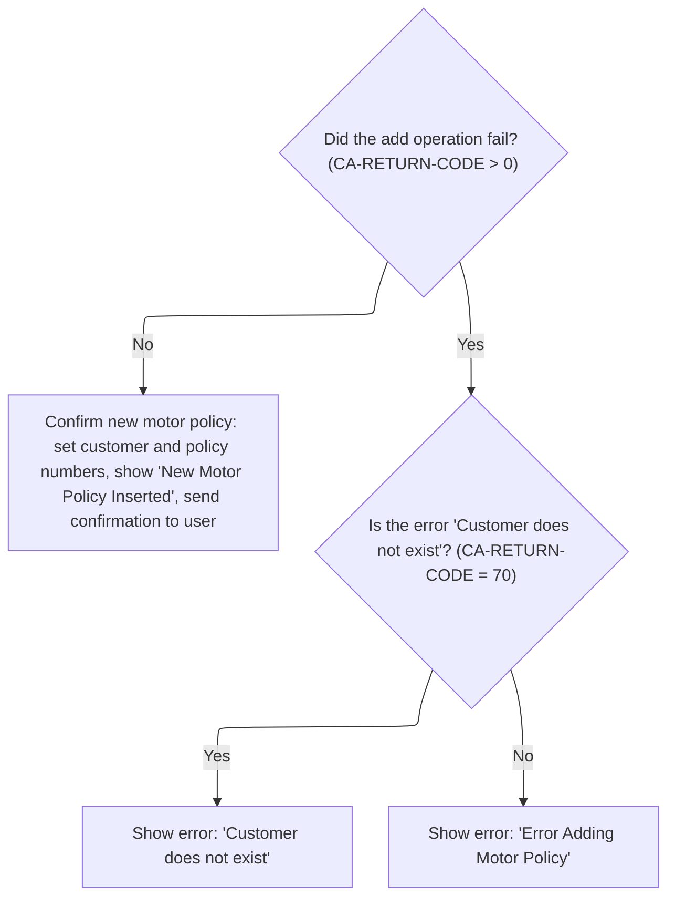
```mermaid
%%{init: {"flowchart": {"defaultRenderer": "elk"}} }%%
flowchart TD
  node1{"Did the add operation fail? (CA-RETURN-CODE > 0)"}
  click node1 openCode "base/src/lgtestp1.cbl:119:122"
  node1 -->|"No"| node2["Confirm new motor policy: set customer and policy numbers, show 'New Motor Policy Inserted', send confirmation to user"]
  click node2 openCode "base/src/lgtestp1.cbl:124:132"
  node1 -->|"Yes"| node3{"Is the error 'Customer does not exist'? (CA-RETURN-CODE = 70)"}
  click node3 openCode "base/src/lgtestp1.cbl:287:294"
  node3 -->|"Yes"| node4["Show error: 'Customer does not exist'"]
  click node4 openCode "base/src/lgtestp1.cbl:288:290"
  node3 -->|"No"| node5["Show error: 'Error Adding Motor Policy'"]
  click node5 openCode "base/src/lgtestp1.cbl:291:293"
classDef HeadingStyle fill:#777777,stroke:#333,stroke-width:2px;

%% Swimm:
%% %%{init: {"flowchart": {"defaultRenderer": "elk"}} }%%
%% flowchart TD
%%   node1{"Did the add operation fail? (<SwmToken path="base/src/lgtestp1.cbl" pos="76:3:7" line-data="                 IF CA-RETURN-CODE &gt; 0">`CA-RETURN-CODE`</SwmToken> > 0)"}
%%   click node1 openCode "<SwmPath>[base/src/lgtestp1.cbl](base/src/lgtestp1.cbl)</SwmPath>:119:122"
%%   node1 -->|"No"| node2["Confirm new motor policy: set customer and policy numbers, show 'New Motor Policy Inserted', send confirmation to user"]
%%   click node2 openCode "<SwmPath>[base/src/lgtestp1.cbl](base/src/lgtestp1.cbl)</SwmPath>:124:132"
%%   node1 -->|"Yes"| node3{"Is the error 'Customer does not exist'? (<SwmToken path="base/src/lgtestp1.cbl" pos="76:3:7" line-data="                 IF CA-RETURN-CODE &gt; 0">`CA-RETURN-CODE`</SwmToken> = 70)"}
%%   click node3 openCode "<SwmPath>[base/src/lgtestp1.cbl](base/src/lgtestp1.cbl)</SwmPath>:287:294"
%%   node3 -->|"Yes"| node4["Show error: 'Customer does not exist'"]
%%   click node4 openCode "<SwmPath>[base/src/lgtestp1.cbl](base/src/lgtestp1.cbl)</SwmPath>:288:290"
%%   node3 -->|"No"| node5["Show error: 'Error Adding Motor Policy'"]
%%   click node5 openCode "<SwmPath>[base/src/lgtestp1.cbl](base/src/lgtestp1.cbl)</SwmPath>:291:293"
%% classDef HeadingStyle fill:#777777,stroke:#333,stroke-width:2px;
```

<SwmSnippet path="/base/src/lgtestp1.cbl" line="119">

---

After <SwmToken path="base/src/lgtestp1.cbl" pos="115:10:10" line-data="                 EXEC CICS LINK PROGRAM(&#39;LGAPOL01&#39;)">`LGAPOL01`</SwmToken>, we check the return code and go to <SwmToken path="base/src/lgtestp1.cbl" pos="121:5:7" line-data="                   GO TO NO-ADD">`NO-ADD`</SwmToken> if the add failed.

```cobol
                 IF CA-RETURN-CODE > 0
                   Exec CICS Syncpoint Rollback End-Exec
                   GO TO NO-ADD
                 END-IF
```

---

</SwmSnippet>

<SwmSnippet path="/base/src/lgtestp1.cbl" line="286">

---

<SwmToken path="base/src/lgtestp1.cbl" pos="286:1:3" line-data="       NO-ADD.">`NO-ADD`</SwmToken> checks the return code and sets a specific error message for missing customer or general add failure. Then it jumps to <SwmToken path="base/src/lgtestp1.cbl" pos="290:5:7" line-data="               Go To ERROR-OUT">`ERROR-OUT`</SwmToken> to refresh the menu and let the user try again. This keeps the user informed and the UI ready for the next action.

```cobol
       NO-ADD.
           Evaluate CA-RETURN-CODE
             When 70
               Move 'Customer does not exist'          To  ERP1FLDO
               Go To ERROR-OUT
             When Other
               Move 'Error Adding Motor Policy'        To  ERP1FLDO
               Go To ERROR-OUT
           End-Evaluate.
```

---

</SwmSnippet>

<SwmSnippet path="/base/src/lgtestp1.cbl" line="124">

---

After returning from <SwmToken path="base/src/lgtestp1.cbl" pos="121:5:7" line-data="                   GO TO NO-ADD">`NO-ADD`</SwmToken> in <SwmToken path="base/src/lgtestp1.cbl" pos="33:5:7" line-data="              GO TO A-GAIN.">`A-GAIN`</SwmToken>, if the add was successful, we move the new customer and policy numbers to the output fields, set a success message, and send the updated map to the user's terminal. This confirms the operation and updates the UI.

```cobol
                 Move CA-CUSTOMER-NUM To ENP1CNOI
                 Move CA-POLICY-NUM   To ENP1PNOI
                 Move ' '             To ENP1OPTI
                 Move 'New Motor Policy Inserted'
                   To  ERP1FLDO
                 EXEC CICS SEND MAP ('SSMAPP1')
                           FROM(SSMAPP1O)
                           MAPSET ('SSMAP')
                 END-EXEC
```

---

</SwmSnippet>

<SwmSnippet path="/base/src/lgtestp1.cbl" line="135">

---

When the user selects option '3', we set up the request for a motor policy delete and call <SwmToken path="base/src/lgtestp1.cbl" pos="139:10:10" line-data="                 EXEC CICS LINK PROGRAM(&#39;LGDPOL01&#39;)">`LGDPOL01`</SwmToken>, passing the customer and policy numbers. <SwmToken path="base/src/lgtestp1.cbl" pos="139:10:10" line-data="                 EXEC CICS LINK PROGRAM(&#39;LGDPOL01&#39;)">`LGDPOL01`</SwmToken> handles validation and deletion, making sure only valid requests go through and the policy is removed from the DB.

```cobol
             WHEN '3'
                 Move '01DMOT'   To CA-REQUEST-ID
                 Move ENP1CNOO   To CA-CUSTOMER-NUM
                 Move ENP1PNOO   To CA-POLICY-NUM
                 EXEC CICS LINK PROGRAM('LGDPOL01')
                           COMMAREA(COMM-AREA)
                           LENGTH(32500)
                 END-EXEC
```

---

</SwmSnippet>

## Validating and Deleting Policies with Error Logging


```mermaid
%%{init: {"flowchart": {"defaultRenderer": "elk"}} }%%
flowchart TD
    node1["Start MAINLINE processing"] --> node2["Initialize business variables"]
    click node1 openCode "base/src/lgdpol01.cbl:78:84"
    click node2 openCode "base/src/lgdpol01.cbl:84:89"
    node2 --> node3{"Is commarea received?"}
    click node3 openCode "base/src/lgdpol01.cbl:95:99"
    node3 -->|"No (EIBCALEN = 0)"| node4["Return error: No commarea received ('LGCA')"]
    click node4 openCode "base/src/lgdpol01.cbl:96:98"
    node3 -->|"Yes"| node5{"Is commarea large enough?"}
    click node5 openCode "base/src/lgdpol01.cbl:107:110"
    node5 -->|"No (EIBCALEN < 28)"| node6["Return error: commarea too small ('98')"]
    click node6 openCode "base/src/lgdpol01.cbl:108:109"
    node5 -->|"Yes"| node7["Upper-case request ID"]
    click node7 openCode "base/src/lgdpol01.cbl:117:117"
    node7 --> node8{"Is request ID recognized?"}
    click node8 openCode "base/src/lgdpol01.cbl:119:122"
    node8 -->|"No"| node9["Return error: unsupported request ('99')"]
    click node9 openCode "base/src/lgdpol01.cbl:124:124"
    node8 -->|"Yes"| node10["Delete policy"]
    click node10 openCode "base/src/lgdpol01.cbl:126:127"
    node10 --> node11{"Did deletion succeed?"}
    click node11 openCode "base/src/lgdpol01.cbl:127:129"
    node11 -->|"No (CA-RETURN-CODE > 0)"| node12["Return error after deletion"]
    click node12 openCode "base/src/lgdpol01.cbl:128:128"
    node11 -->|"Yes (CA-RETURN-CODE = 0)"| node13["Return success"]
    click node13 openCode "base/src/lgdpol01.cbl:133:133"
classDef HeadingStyle fill:#777777,stroke:#333,stroke-width:2px;

%% Swimm:
%% %%{init: {"flowchart": {"defaultRenderer": "elk"}} }%%
%% flowchart TD
%%     node1["Start MAINLINE processing"] --> node2["Initialize business variables"]
%%     click node1 openCode "<SwmPath>[base/src/lgdpol01.cbl](base/src/lgdpol01.cbl)</SwmPath>:78:84"
%%     click node2 openCode "<SwmPath>[base/src/lgdpol01.cbl](base/src/lgdpol01.cbl)</SwmPath>:84:89"
%%     node2 --> node3{"Is commarea received?"}
%%     click node3 openCode "<SwmPath>[base/src/lgdpol01.cbl](base/src/lgdpol01.cbl)</SwmPath>:95:99"
%%     node3 -->|"No (EIBCALEN = 0)"| node4["Return error: No commarea received ('LGCA')"]
%%     click node4 openCode "<SwmPath>[base/src/lgdpol01.cbl](base/src/lgdpol01.cbl)</SwmPath>:96:98"
%%     node3 -->|"Yes"| node5{"Is commarea large enough?"}
%%     click node5 openCode "<SwmPath>[base/src/lgdpol01.cbl](base/src/lgdpol01.cbl)</SwmPath>:107:110"
%%     node5 -->|"No (EIBCALEN < 28)"| node6["Return error: commarea too small ('98')"]
%%     click node6 openCode "<SwmPath>[base/src/lgdpol01.cbl](base/src/lgdpol01.cbl)</SwmPath>:108:109"
%%     node5 -->|"Yes"| node7["Upper-case request ID"]
%%     click node7 openCode "<SwmPath>[base/src/lgdpol01.cbl](base/src/lgdpol01.cbl)</SwmPath>:117:117"
%%     node7 --> node8{"Is request ID recognized?"}
%%     click node8 openCode "<SwmPath>[base/src/lgdpol01.cbl](base/src/lgdpol01.cbl)</SwmPath>:119:122"
%%     node8 -->|"No"| node9["Return error: unsupported request ('99')"]
%%     click node9 openCode "<SwmPath>[base/src/lgdpol01.cbl](base/src/lgdpol01.cbl)</SwmPath>:124:124"
%%     node8 -->|"Yes"| node10["Delete policy"]
%%     click node10 openCode "<SwmPath>[base/src/lgdpol01.cbl](base/src/lgdpol01.cbl)</SwmPath>:126:127"
%%     node10 --> node11{"Did deletion succeed?"}
%%     click node11 openCode "<SwmPath>[base/src/lgdpol01.cbl](base/src/lgdpol01.cbl)</SwmPath>:127:129"
%%     node11 -->|"No (<SwmToken path="base/src/lgtestp1.cbl" pos="76:3:7" line-data="                 IF CA-RETURN-CODE &gt; 0">`CA-RETURN-CODE`</SwmToken> > 0)"| node12["Return error after deletion"]
%%     click node12 openCode "<SwmPath>[base/src/lgdpol01.cbl](base/src/lgdpol01.cbl)</SwmPath>:128:128"
%%     node11 -->|"Yes (<SwmToken path="base/src/lgtestp1.cbl" pos="76:3:7" line-data="                 IF CA-RETURN-CODE &gt; 0">`CA-RETURN-CODE`</SwmToken> = 0)"| node13["Return success"]
%%     click node13 openCode "<SwmPath>[base/src/lgdpol01.cbl](base/src/lgdpol01.cbl)</SwmPath>:133:133"
%% classDef HeadingStyle fill:#777777,stroke:#333,stroke-width:2px;
```

This section validates incoming requests for policy deletion, ensures the request is supported and the commarea is correctly structured, performs the deletion, and logs errors with detailed information if any validation or deletion step fails.

| Category        | Rule Name                  | Description                                                                                                                                                                                                                                                                                                                                                                                                                                                                                                                                                                                                                                                                                                                                                                                                           |
| --------------- | -------------------------- | --------------------------------------------------------------------------------------------------------------------------------------------------------------------------------------------------------------------------------------------------------------------------------------------------------------------------------------------------------------------------------------------------------------------------------------------------------------------------------------------------------------------------------------------------------------------------------------------------------------------------------------------------------------------------------------------------------------------------------------------------------------------------------------------------------------------- |
| Data validation | Supported request ID check | The request ID in the commarea must be upper-cased before validation. Only requests with IDs <SwmToken path="base/src/lgdpol01.cbl" pos="119:18:18" line-data="           IF ( CA-REQUEST-ID NOT EQUAL TO &#39;01DEND&#39; AND">`01DEND`</SwmToken>, <SwmToken path="base/src/lgtestp1.cbl" pos="136:4:4" line-data="                 Move &#39;01DMOT&#39;   To CA-REQUEST-ID">`01DMOT`</SwmToken>, <SwmToken path="base/src/lgdpol01.cbl" pos="121:14:14" line-data="                CA-REQUEST-ID NOT EQUAL TO &#39;01DHOU&#39; AND">`01DHOU`</SwmToken>, or <SwmToken path="base/src/lgdpol01.cbl" pos="122:14:14" line-data="                CA-REQUEST-ID NOT EQUAL TO &#39;01DCOM&#39; )">`01DCOM`</SwmToken> are recognized and supported. Any other request ID must result in error code '99' and be logged. |
| Business logic  | Error logging format       | All error messages must be logged with a timestamp, transaction details, and up to 90 bytes of commarea data (if available), ensuring consistent and traceable error reporting.                                                                                                                                                                                                                                                                                                                                                                                                                                                                                                                                                                                                                                       |
| Business logic  | Successful policy deletion | If all validations pass and the deletion succeeds (<SwmToken path="base/src/lgtestp1.cbl" pos="76:3:7" line-data="                 IF CA-RETURN-CODE &gt; 0">`CA-RETURN-CODE`</SwmToken> = 0), the system must return a success response to the caller.                                                                                                                                                                                                                                                                                                                                                                                                                                                                                                                                                               |

<SwmSnippet path="/base/src/lgdpol01.cbl" line="78">

---

We validate the input, log errors if needed, and call the <SwmToken path="base/src/lgdpol01.cbl" pos="126:7:7" line-data="               PERFORM DELETE-POLICY-DB2-INFO">`DB2`</SwmToken> delete logic for valid requests.

```cobol
       MAINLINE SECTION.

      *----------------------------------------------------------------*
      * Common code                                                    *
      *----------------------------------------------------------------*
      * initialize working storage variables
           INITIALIZE WS-HEADER.
      * set up general variable
           MOVE EIBTRNID TO WS-TRANSID.
           MOVE EIBTRMID TO WS-TERMID.
           MOVE EIBTASKN TO WS-TASKNUM.
      *----------------------------------------------------------------*

      *----------------------------------------------------------------*
      * Check commarea and obtain required details                     *
      *----------------------------------------------------------------*
      * If NO commarea received issue an ABEND
           IF EIBCALEN IS EQUAL TO ZERO
               MOVE ' NO COMMAREA RECEIVED' TO EM-VARIABLE
               PERFORM WRITE-ERROR-MESSAGE
               EXEC CICS ABEND ABCODE('LGCA') NODUMP END-EXEC
           END-IF

      * initialize commarea return code to zero
           MOVE '00' TO CA-RETURN-CODE
           MOVE EIBCALEN TO WS-CALEN.
           SET WS-ADDR-DFHCOMMAREA TO ADDRESS OF DFHCOMMAREA.

      * Check commarea is large enough
           IF EIBCALEN IS LESS THAN WS-CA-HEADER-LEN
             MOVE '98' TO CA-RETURN-CODE
             EXEC CICS RETURN END-EXEC
           END-IF

      *----------------------------------------------------------------*
      * Check request-id in commarea and if recognised ...             *
      * Call routine to delete row from policy table                   *
      *----------------------------------------------------------------*
      * Upper case value passed in Request Id field                    *
           MOVE FUNCTION UPPER-CASE(CA-REQUEST-ID) TO CA-REQUEST-ID

           IF ( CA-REQUEST-ID NOT EQUAL TO '01DEND' AND
                CA-REQUEST-ID NOT EQUAL TO '01DMOT' AND
                CA-REQUEST-ID NOT EQUAL TO '01DHOU' AND
                CA-REQUEST-ID NOT EQUAL TO '01DCOM' )
      *        Request is not recognised or supported
               MOVE '99' TO CA-RETURN-CODE
           ELSE
               PERFORM DELETE-POLICY-DB2-INFO
               If CA-RETURN-CODE > 0
                 EXEC CICS RETURN END-EXEC
               End-if
           END-IF

      * Return to caller
           EXEC CICS RETURN END-EXEC.
```

---

</SwmSnippet>

<SwmSnippet path="/base/src/lgdpol01.cbl" line="154">

---

<SwmToken path="base/src/lgdpol01.cbl" pos="154:1:5" line-data="       WRITE-ERROR-MESSAGE.">`WRITE-ERROR-MESSAGE`</SwmToken> logs errors by formatting the message with timestamp and details, then calls LGSTSQ to write it to the queue. If there's commarea data, it sends up to 90 bytes (or less if shorter) to LGSTSQ as well. This keeps error logs consistent and avoids oversized messages.

```cobol
       WRITE-ERROR-MESSAGE.
      * Save SQLCODE in message
      * Obtain and format current time and date
           EXEC CICS ASKTIME ABSTIME(WS-ABSTIME)
           END-EXEC
           EXEC CICS FORMATTIME ABSTIME(Ws-ABSTIME)
                     MMDDYYYY(WS-DATE)
                     TIME(WS-TIME)
           END-EXEC
           MOVE WS-DATE TO EM-DATE
           MOVE WS-TIME TO EM-TIME
      * Write output message to TDQ
           EXEC CICS LINK PROGRAM('LGSTSQ')
                     COMMAREA(ERROR-MSG)
                     LENGTH(LENGTH OF ERROR-MSG)
           END-EXEC.
      * Write 90 bytes or as much as we have of commarea to TDQ
           IF EIBCALEN > 0 THEN
             IF EIBCALEN < 91 THEN
               MOVE DFHCOMMAREA(1:EIBCALEN) TO CA-DATA
               EXEC CICS LINK PROGRAM('LGSTSQ')
                         COMMAREA(CA-ERROR-MSG)
                         LENGTH(LENGTH OF CA-ERROR-MSG)
               END-EXEC
             ELSE
               MOVE DFHCOMMAREA(1:90) TO CA-DATA
               EXEC CICS LINK PROGRAM('LGSTSQ')
                         COMMAREA(CA-ERROR-MSG)
                         LENGTH(LENGTH OF CA-ERROR-MSG)
               END-EXEC
             END-IF
           END-IF.
           EXIT.
```

---

</SwmSnippet>

## Performing the Actual Policy Deletion in <SwmToken path="base/src/lgipdb01.cbl" pos="242:5:5" line-data="      * initialize DB2 host variables">`DB2`</SwmToken>

This section is responsible for ensuring that a policy record is properly deleted from the <SwmToken path="base/src/lgipdb01.cbl" pos="242:5:5" line-data="      * initialize DB2 host variables">`DB2`</SwmToken> database, and that any errors encountered during the deletion process are captured and communicated.

| Category        | Rule Name                     | Description                                                                                                                                                                                                                                                 |
| --------------- | ----------------------------- | ----------------------------------------------------------------------------------------------------------------------------------------------------------------------------------------------------------------------------------------------------------- |
| Data validation | Valid Policy Deletion Request | A policy can only be deleted if valid customer and policy information is provided in the request.                                                                                                                                                           |
| Business logic  | Successful Policy Removal     | A successful deletion must result in the policy being permanently removed from the <SwmToken path="base/src/lgipdb01.cbl" pos="242:5:5" line-data="      * initialize DB2 host variables">`DB2`</SwmToken> database, with a status code indicating success. |

<SwmSnippet path="/base/src/lgdpol01.cbl" line="139">

---

<SwmToken path="base/src/lgdpol01.cbl" pos="139:1:7" line-data="       DELETE-POLICY-DB2-INFO.">`DELETE-POLICY-DB2-INFO`</SwmToken> links to <SwmToken path="base/src/lgdpol01.cbl" pos="141:9:9" line-data="           EXEC CICS LINK PROGRAM(LGDPDB01)">`LGDPDB01`</SwmToken>, passing the commarea with customer and policy info. <SwmToken path="base/src/lgdpol01.cbl" pos="141:9:9" line-data="           EXEC CICS LINK PROGRAM(LGDPDB01)">`LGDPDB01`</SwmToken> does the actual <SwmToken path="base/src/lgdpol01.cbl" pos="139:5:5" line-data="       DELETE-POLICY-DB2-INFO.">`DB2`</SwmToken> delete and returns a status code. This step is needed to remove the policy from the database and handle any errors.

```cobol
       DELETE-POLICY-DB2-INFO.

           EXEC CICS LINK PROGRAM(LGDPDB01)
                Commarea(DFHCOMMAREA)
                LENGTH(32500)
           END-EXEC.

           EXIT.
```

---

</SwmSnippet>

## <SwmToken path="base/src/lgipdb01.cbl" pos="242:5:5" line-data="      * initialize DB2 host variables">`DB2`</SwmToken> Policy Deletion and Error Logging

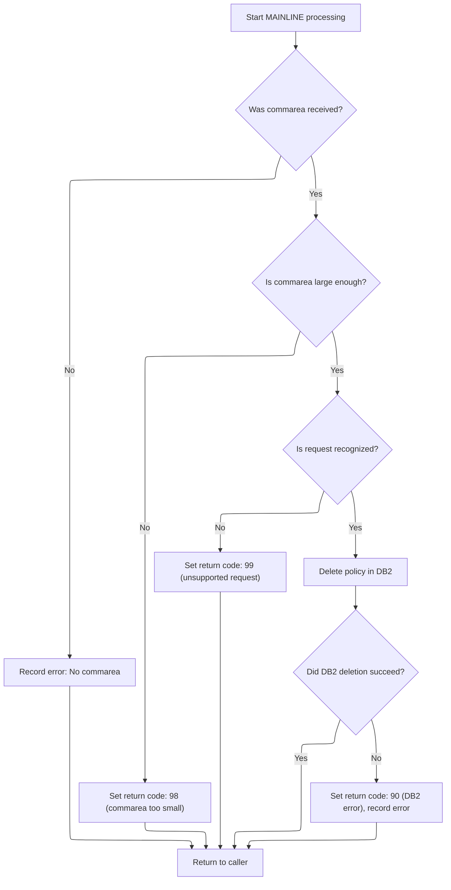
```mermaid
%%{init: {"flowchart": {"defaultRenderer": "elk"}} }%%
flowchart TD
    node1["Start MAINLINE processing"] --> node2{"Was commarea received?"}
    click node1 openCode "base/src/lgdpdb01.cbl:111:117"
    node2 -->|"No"| node3["Record error: No commarea"]
    click node2 openCode "base/src/lgdpdb01.cbl:131:135"
    click node3 openCode "base/src/lgdpdb01.cbl:132:134"
    node3 --> node4["Return to caller"]
    click node4 openCode "base/src/lgdpdb01.cbl:175:175"
    node2 -->|"Yes"| node5{"Is commarea large enough?"}
    click node5 openCode "base/src/lgdpdb01.cbl:143:146"
    node5 -->|"No"| node6["Set return code: 98 (commarea too small)"]
    click node6 openCode "base/src/lgdpdb01.cbl:144:145"
    node6 --> node4
    node5 -->|"Yes"| node7{"Is request recognized?"}
    click node7 openCode "base/src/lgdpdb01.cbl:160:172"
    node7 -->|"No"| node8["Set return code: 99 (unsupported request)"]
    click node8 openCode "base/src/lgdpdb01.cbl:165:165"
    node8 --> node4
    node7 -->|"Yes"| node9["Delete policy in DB2"]
    click node9 openCode "base/src/lgdpdb01.cbl:167:167"
    node9 --> node10{"Did DB2 deletion succeed?"}
    click node10 openCode "base/src/lgdpdb01.cbl:198:202"
    node10 -->|"No"| node11["Set return code: 90 (DB2 error), record error"]
    click node11 openCode "base/src/lgdpdb01.cbl:199:201"
    node11 --> node4
    node10 -->|"Yes"| node4
classDef HeadingStyle fill:#777777,stroke:#333,stroke-width:2px;

%% Swimm:
%% %%{init: {"flowchart": {"defaultRenderer": "elk"}} }%%
%% flowchart TD
%%     node1["Start MAINLINE processing"] --> node2{"Was commarea received?"}
%%     click node1 openCode "<SwmPath>[base/src/lgdpdb01.cbl](base/src/lgdpdb01.cbl)</SwmPath>:111:117"
%%     node2 -->|"No"| node3["Record error: No commarea"]
%%     click node2 openCode "<SwmPath>[base/src/lgdpdb01.cbl](base/src/lgdpdb01.cbl)</SwmPath>:131:135"
%%     click node3 openCode "<SwmPath>[base/src/lgdpdb01.cbl](base/src/lgdpdb01.cbl)</SwmPath>:132:134"
%%     node3 --> node4["Return to caller"]
%%     click node4 openCode "<SwmPath>[base/src/lgdpdb01.cbl](base/src/lgdpdb01.cbl)</SwmPath>:175:175"
%%     node2 -->|"Yes"| node5{"Is commarea large enough?"}
%%     click node5 openCode "<SwmPath>[base/src/lgdpdb01.cbl](base/src/lgdpdb01.cbl)</SwmPath>:143:146"
%%     node5 -->|"No"| node6["Set return code: 98 (commarea too small)"]
%%     click node6 openCode "<SwmPath>[base/src/lgdpdb01.cbl](base/src/lgdpdb01.cbl)</SwmPath>:144:145"
%%     node6 --> node4
%%     node5 -->|"Yes"| node7{"Is request recognized?"}
%%     click node7 openCode "<SwmPath>[base/src/lgdpdb01.cbl](base/src/lgdpdb01.cbl)</SwmPath>:160:172"
%%     node7 -->|"No"| node8["Set return code: 99 (unsupported request)"]
%%     click node8 openCode "<SwmPath>[base/src/lgdpdb01.cbl](base/src/lgdpdb01.cbl)</SwmPath>:165:165"
%%     node8 --> node4
%%     node7 -->|"Yes"| node9["Delete policy in <SwmToken path="base/src/lgipdb01.cbl" pos="242:5:5" line-data="      * initialize DB2 host variables">`DB2`</SwmToken>"]
%%     click node9 openCode "<SwmPath>[base/src/lgdpdb01.cbl](base/src/lgdpdb01.cbl)</SwmPath>:167:167"
%%     node9 --> node10{"Did <SwmToken path="base/src/lgipdb01.cbl" pos="242:5:5" line-data="      * initialize DB2 host variables">`DB2`</SwmToken> deletion succeed?"}
%%     click node10 openCode "<SwmPath>[base/src/lgdpdb01.cbl](base/src/lgdpdb01.cbl)</SwmPath>:198:202"
%%     node10 -->|"No"| node11["Set return code: 90 (<SwmToken path="base/src/lgipdb01.cbl" pos="242:5:5" line-data="      * initialize DB2 host variables">`DB2`</SwmToken> error), record error"]
%%     click node11 openCode "<SwmPath>[base/src/lgdpdb01.cbl](base/src/lgdpdb01.cbl)</SwmPath>:199:201"
%%     node11 --> node4
%%     node10 -->|"Yes"| node4
%% classDef HeadingStyle fill:#777777,stroke:#333,stroke-width:2px;
```

This section governs the deletion of policy records from the <SwmToken path="base/src/lgipdb01.cbl" pos="242:5:5" line-data="      * initialize DB2 host variables">`DB2`</SwmToken> database and the logging of errors encountered during the process. It ensures that only valid, recognized requests are processed, and that all errors are consistently recorded for audit and troubleshooting purposes.

| Category       | Rule Name                          | Description                                                                                                                                                                                                                                                                                                                                                                                                                                                                                                                                                                                                                                                                                                                                                                                                         |
| -------------- | ---------------------------------- | ------------------------------------------------------------------------------------------------------------------------------------------------------------------------------------------------------------------------------------------------------------------------------------------------------------------------------------------------------------------------------------------------------------------------------------------------------------------------------------------------------------------------------------------------------------------------------------------------------------------------------------------------------------------------------------------------------------------------------------------------------------------------------------------------------------------- |
| Business logic | Supported request types            | Only requests with recognized request IDs (<SwmToken path="base/src/lgdpol01.cbl" pos="119:18:18" line-data="           IF ( CA-REQUEST-ID NOT EQUAL TO &#39;01DEND&#39; AND">`01DEND`</SwmToken>, <SwmToken path="base/src/lgdpol01.cbl" pos="121:14:14" line-data="                CA-REQUEST-ID NOT EQUAL TO &#39;01DHOU&#39; AND">`01DHOU`</SwmToken>, <SwmToken path="base/src/lgdpol01.cbl" pos="122:14:14" line-data="                CA-REQUEST-ID NOT EQUAL TO &#39;01DCOM&#39; )">`01DCOM`</SwmToken>, <SwmToken path="base/src/lgtestp1.cbl" pos="136:4:4" line-data="                 Move &#39;01DMOT&#39;   To CA-REQUEST-ID">`01DMOT`</SwmToken>) are permitted for policy deletion. Any other request ID must result in a return code of 99 ('unsupported request') and termination of the request. |
| Business logic | Policy identification for deletion | Policy deletion must use the customer and policy numbers provided in the commarea, converted to <SwmToken path="base/src/lgipdb01.cbl" pos="242:5:5" line-data="      * initialize DB2 host variables">`DB2`</SwmToken> integer format, to identify the record to delete.                                                                                                                                                                                                                                                                                                                                                                                                                                                                                                                                           |
| Business logic | Successful deletion outcome        | If the <SwmToken path="base/src/lgipdb01.cbl" pos="242:5:5" line-data="      * initialize DB2 host variables">`DB2`</SwmToken> deletion operation returns SQLCODE 0 (success) or 100 (record not found), the process is considered successful and no error is logged.                                                                                                                                                                                                                                                                                                                                                                                                                                                                                                                                               |

<SwmSnippet path="/base/src/lgdpdb01.cbl" line="111">

---

Here, MAINLINE in <SwmPath>[base/src/lgdpdb01.cbl](base/src/lgdpdb01.cbl)</SwmPath> validates the commarea, checks the request type, converts IDs for <SwmToken path="base/src/lgdpdb01.cbl" pos="124:5:5" line-data="      * initialize DB2 host variables">`DB2`</SwmToken>, and only proceeds with deletion if the request is for a supported policy type. Unsupported requests are rejected early.

```cobol
       MAINLINE SECTION.

      *----------------------------------------------------------------*
      * Common code                                                    *
      *----------------------------------------------------------------*
      * initialize working storage variables
           INITIALIZE WS-HEADER.
      * set up general variable
           MOVE EIBTRNID TO WS-TRANSID.
           MOVE EIBTRMID TO WS-TERMID.
           MOVE EIBTASKN TO WS-TASKNUM.
      *----------------------------------------------------------------*

      * initialize DB2 host variables
           INITIALIZE DB2-IN-INTEGERS.

      *----------------------------------------------------------------*
      * Check commarea and obtain required details                     *
      *----------------------------------------------------------------*
      * If NO commarea received issue an ABEND
           IF EIBCALEN IS EQUAL TO ZERO
               MOVE ' NO COMMAREA RECEIVED' TO EM-VARIABLE
               PERFORM WRITE-ERROR-MESSAGE
               EXEC CICS ABEND ABCODE('LGCA') NODUMP END-EXEC
           END-IF

      * initialize commarea return code to zero
           MOVE '00' TO CA-RETURN-CODE
           MOVE EIBCALEN TO WS-CALEN.
           SET WS-ADDR-DFHCOMMAREA TO ADDRESS OF DFHCOMMAREA.

      * Check commarea is large enough
           IF EIBCALEN IS LESS THAN WS-CA-HEADER-LEN
             MOVE '98' TO CA-RETURN-CODE
             EXEC CICS RETURN END-EXEC
           END-IF

      * Convert commarea customer & policy nums to DB2 integer format
           MOVE CA-CUSTOMER-NUM TO DB2-CUSTOMERNUM-INT
           MOVE CA-POLICY-NUM   TO DB2-POLICYNUM-INT
      * and save in error msg field incase required
           MOVE CA-CUSTOMER-NUM TO EM-CUSNUM
           MOVE CA-POLICY-NUM   TO EM-POLNUM

      *----------------------------------------------------------------*
      * Check request-id in commarea and if recognised ...             *
      * Call routine to delete row from policy table                   *
      *----------------------------------------------------------------*

           IF ( CA-REQUEST-ID NOT EQUAL TO '01DEND' AND
                CA-REQUEST-ID NOT EQUAL TO '01DHOU' AND
                CA-REQUEST-ID NOT EQUAL TO '01DCOM' AND
                CA-REQUEST-ID NOT EQUAL TO '01DMOT' ) Then
      *        Request is not recognised or supported
               MOVE '99' TO CA-RETURN-CODE
           ELSE
               PERFORM DELETE-POLICY-DB2-INFO
               EXEC CICS LINK PROGRAM(LGDPVS01)
                    Commarea(DFHCOMMAREA)
                    LENGTH(32500)
               END-EXEC
           END-IF.

      * Return to caller
           EXEC CICS RETURN END-EXEC.
```

---

</SwmSnippet>

<SwmSnippet path="/base/src/lgdpdb01.cbl" line="212">

---

<SwmToken path="base/src/lgdpdb01.cbl" pos="212:1:5" line-data="       WRITE-ERROR-MESSAGE.">`WRITE-ERROR-MESSAGE`</SwmToken> in <SwmPath>[base/src/lgdpdb01.cbl](base/src/lgdpdb01.cbl)</SwmPath> formats the error message with the current timestamp and SQL code, then calls LGSTSQ to log it. If there's commarea data, it logs up to 90 bytes of it (truncating if longer) by linking to LGSTSQ again. This keeps error logs consistent and avoids buffer overruns.

```cobol
       WRITE-ERROR-MESSAGE.
      * Save SQLCODE in message
           MOVE SQLCODE TO EM-SQLRC
      * Obtain and format current time and date
           EXEC CICS ASKTIME ABSTIME(WS-ABSTIME)
           END-EXEC
           EXEC CICS FORMATTIME ABSTIME(Ws-ABSTIME)
                     MMDDYYYY(WS-DATE)
                     TIME(WS-TIME)
           END-EXEC
           MOVE WS-DATE TO EM-DATE
           MOVE WS-TIME TO EM-TIME
      * Write output message to TDQ
           EXEC CICS LINK PROGRAM('LGSTSQ')
                     COMMAREA(ERROR-MSG)
                     LENGTH(LENGTH OF ERROR-MSG)
           END-EXEC.
      * Write 90 bytes or as much as we have of commarea to TDQ
           IF EIBCALEN > 0 THEN
             IF EIBCALEN < 91 THEN
               MOVE DFHCOMMAREA(1:EIBCALEN) TO CA-DATA
               EXEC CICS LINK PROGRAM('LGSTSQ')
                         COMMAREA(CA-ERROR-MSG)
                         LENGTH(LENGTH OF CA-ERROR-MSG)
               END-EXEC
             ELSE
               MOVE DFHCOMMAREA(1:90) TO CA-DATA
               EXEC CICS LINK PROGRAM('LGSTSQ')
                         COMMAREA(CA-ERROR-MSG)
                         LENGTH(LENGTH OF CA-ERROR-MSG)
               END-EXEC
             END-IF
           END-IF.
           EXIT.
```

---

</SwmSnippet>

<SwmSnippet path="/base/src/lgdpdb01.cbl" line="186">

---

<SwmToken path="base/src/lgdpdb01.cbl" pos="186:1:7" line-data="       DELETE-POLICY-DB2-INFO.">`DELETE-POLICY-DB2-INFO`</SwmToken> deletes the policy row using the converted customer and policy numbers. If the delete works or the record wasn't found, it's considered done. Any other SQL error triggers error logging and an early return.

```cobol
       DELETE-POLICY-DB2-INFO.

           MOVE ' DELETE POLICY  ' TO EM-SQLREQ
           EXEC SQL
             DELETE
               FROM POLICY
               WHERE ( CUSTOMERNUMBER = :DB2-CUSTOMERNUM-INT AND
                       POLICYNUMBER  = :DB2-POLICYNUM-INT      )
           END-EXEC

      *    Treat SQLCODE 0 and SQLCODE 100 (record not found) as
      *    successful - end result is record does not exist
           IF SQLCODE NOT EQUAL 0 Then
               MOVE '90' TO CA-RETURN-CODE
               PERFORM WRITE-ERROR-MESSAGE
               EXEC CICS RETURN END-EXEC
           END-IF.

           EXIT.
```

---

</SwmSnippet>

## VSAM Policy Deletion and Error Logging

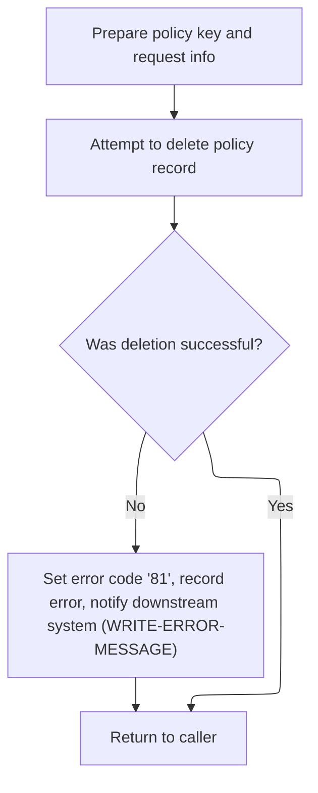
```mermaid
%%{init: {"flowchart": {"defaultRenderer": "elk"}} }%%
flowchart TD
    node1["Prepare policy key and request info"] --> node2["Attempt to delete policy record"]
    click node1 openCode "base/src/lgdpvs01.cbl:75:79"
    click node2 openCode "base/src/lgdpvs01.cbl:81:85"
    node2 --> node3{"Was deletion successful?"}
    click node3 openCode "base/src/lgdpvs01.cbl:86:91"
    node3 -->|"Yes"| node4["Return to caller"]
    click node4 openCode "base/src/lgdpvs01.cbl:95:97"
    node3 -->|"No"| node5["Set error code '81', record error, notify downstream system (WRITE-ERROR-MESSAGE)"]
    click node5 openCode "base/src/lgdpvs01.cbl:87:90"
    node5 --> node4
classDef HeadingStyle fill:#777777,stroke:#333,stroke-width:2px;

%% Swimm:
%% %%{init: {"flowchart": {"defaultRenderer": "elk"}} }%%
%% flowchart TD
%%     node1["Prepare policy key and request info"] --> node2["Attempt to delete policy record"]
%%     click node1 openCode "<SwmPath>[base/src/lgdpvs01.cbl](base/src/lgdpvs01.cbl)</SwmPath>:75:79"
%%     click node2 openCode "<SwmPath>[base/src/lgdpvs01.cbl](base/src/lgdpvs01.cbl)</SwmPath>:81:85"
%%     node2 --> node3{"Was deletion successful?"}
%%     click node3 openCode "<SwmPath>[base/src/lgdpvs01.cbl](base/src/lgdpvs01.cbl)</SwmPath>:86:91"
%%     node3 -->|"Yes"| node4["Return to caller"]
%%     click node4 openCode "<SwmPath>[base/src/lgdpvs01.cbl](base/src/lgdpvs01.cbl)</SwmPath>:95:97"
%%     node3 -->|"No"| node5["Set error code '81', record error, notify downstream system (<SwmToken path="base/src/lgipol01.cbl" pos="81:3:7" line-data="               PERFORM WRITE-ERROR-MESSAGE">`WRITE-ERROR-MESSAGE`</SwmToken>)"]
%%     click node5 openCode "<SwmPath>[base/src/lgdpvs01.cbl](base/src/lgdpvs01.cbl)</SwmPath>:87:90"
%%     node5 --> node4
%% classDef HeadingStyle fill:#777777,stroke:#333,stroke-width:2px;
```

This section governs the deletion of policy records from the VSAM file and ensures that any errors encountered during deletion are logged with detailed information and a standardized error code. It separates VSAM error handling from <SwmToken path="base/src/lgipdb01.cbl" pos="242:5:5" line-data="      * initialize DB2 host variables">`DB2`</SwmToken> logic, maintaining consistency and traceability for failed operations.

| Category       | Rule Name                | Description                                                                                                                                                   |
| -------------- | ------------------------ | ------------------------------------------------------------------------------------------------------------------------------------------------------------- |
| Business logic | Error Message Content    | Error messages must include the current date and time, customer number, policy number, and response codes to provide complete context for downstream systems. |
| Business logic | Successful Deletion Flow | Successful deletion must return control to the caller without logging an error or setting an error code.                                                      |

<SwmSnippet path="/base/src/lgdpvs01.cbl" line="72">

---

MAINLINE in <SwmPath>[base/src/lgdpvs01.cbl](base/src/lgdpvs01.cbl)</SwmPath> sets up the key fields from the commarea, then tries to delete the policy record from the VSAM file using a 21-byte key. If the delete fails, it sets return code '81', logs the error, and exits. This keeps VSAM error handling separate from <SwmToken path="base/src/lgipdb01.cbl" pos="242:5:5" line-data="      * initialize DB2 host variables">`DB2`</SwmToken> logic.

```cobol
       MAINLINE SECTION.
      *
      *---------------------------------------------------------------*
           Move EIBCALEN To WS-Commarea-Len.
      *---------------------------------------------------------------*
           Move CA-Request-ID(4:1) To WF-Request-ID
           Move CA-Policy-Num      To WF-Policy-Num
           Move CA-Customer-Num    To WF-Customer-Num
      *---------------------------------------------------------------*
           Exec CICS Delete File('KSDSPOLY')
                     Ridfld(WF-Policy-Key)
                     KeyLength(21)
                     RESP(WS-RESP)
           End-Exec.
           If WS-RESP Not = DFHRESP(NORMAL)
             Move EIBRESP2 To WS-RESP2
             MOVE '81' TO CA-RETURN-CODE
             PERFORM WRITE-ERROR-MESSAGE
             EXEC CICS RETURN END-EXEC
           End-If.
```

---

</SwmSnippet>

<SwmSnippet path="/base/src/lgdpvs01.cbl" line="99">

---

<SwmToken path="base/src/lgdpvs01.cbl" pos="99:1:5" line-data="       WRITE-ERROR-MESSAGE.">`WRITE-ERROR-MESSAGE`</SwmToken> in <SwmPath>[base/src/lgdpvs01.cbl](base/src/lgdpvs01.cbl)</SwmPath> grabs the current time, fills out the error message with customer/policy info and response codes, then calls LGSTSQ to log it. If there's commarea data, it logs up to 90 bytes by linking to LGSTSQ again. This keeps error logs consistent and avoids buffer overruns.

```cobol
       WRITE-ERROR-MESSAGE.
           EXEC CICS ASKTIME ABSTIME(WS-ABSTIME)
           END-EXEC
           EXEC CICS FORMATTIME ABSTIME(WS-ABSTIME)
                     MMDDYYYY(WS-DATE)
                     TIME(WS-TIME)
           END-EXEC
      *
           MOVE WS-DATE TO EM-DATE
           MOVE WS-TIME TO EM-TIME
           Move CA-Customer-Num To EM-CUSNUM 
           Move CA-POLICY-NUM To EM-POLNUM 
           Move WS-RESP         To EM-RespRC
           Move WS-RESP2        To EM-Resp2RC
           EXEC CICS LINK PROGRAM('LGSTSQ')
                     COMMAREA(ERROR-MSG)
                     LENGTH(LENGTH OF ERROR-MSG)
           END-EXEC.
           IF EIBCALEN > 0 THEN
             IF EIBCALEN < 91 THEN
               MOVE DFHCOMMAREA(1:EIBCALEN) TO CA-DATA
               EXEC CICS LINK PROGRAM('LGSTSQ')
                         COMMAREA(CA-ERROR-MSG)
                         LENGTH(Length Of CA-ERROR-MSG)
               END-EXEC
             ELSE
               MOVE DFHCOMMAREA(1:90) TO CA-DATA
               EXEC CICS LINK PROGRAM('LGSTSQ')
                         COMMAREA(CA-ERROR-MSG)
                         LENGTH(Length Of CA-ERROR-MSG)
               END-EXEC
             END-IF
           END-IF.
           EXIT.
```

---

</SwmSnippet>

<SwmSnippet path="/base/src/lgdpvs01.cbl" line="95">

---

<SwmToken path="base/src/lgdpvs01.cbl" pos="95:1:3" line-data="       A-EXIT.">`A-EXIT`</SwmToken> in <SwmPath>[base/src/lgdpvs01.cbl](base/src/lgdpvs01.cbl)</SwmPath> is just a label for ending the program and returning control. There's no extra logic or cleanup—it's a straight exit.

```cobol
       A-EXIT.
           EXIT.
           GOBACK.
```

---

</SwmSnippet>

## Handling Delete Results and User Feedback

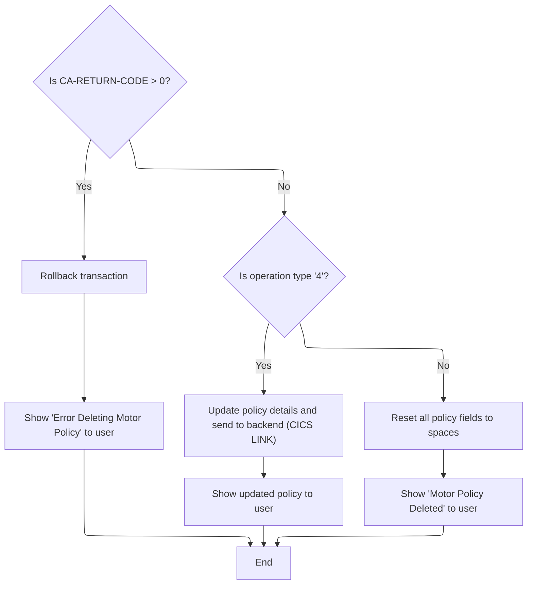
```mermaid
%%{init: {"flowchart": {"defaultRenderer": "elk"}} }%%
flowchart TD
    node1{"Is CA-RETURN-CODE > 0?"}
    click node1 openCode "base/src/lgtestp1.cbl:143:146"
    node1 -->|"Yes"| node2["Rollback transaction"]
    click node2 openCode "base/src/lgtestp1.cbl:144:144"
    node2 --> node3["Show 'Error Deleting Motor Policy' to user"]
    click node3 openCode "base/src/lgtestp1.cbl:301:302"
    node3 --> node4["End"]
    node1 -->|"No"| node5{"Is operation type '4'?"}
    click node5 openCode "base/src/lgtestp1.cbl:169:169"
    node5 -->|"Yes"| node6["Update policy details and send to backend (CICS LINK)"]
    click node6 openCode "base/src/lgtestp1.cbl:170:176"
    node6 --> node7["Show updated policy to user"]
    click node7 openCode "base/src/lgtestp1.cbl:192:195"
    node7 --> node4["End"]
    node5 -->|"No"| node8["Reset all policy fields to spaces"]
    click node8 openCode "base/src/lgtestp1.cbl:148:158"
    node8 --> node9["Show 'Motor Policy Deleted' to user"]
    click node9 openCode "base/src/lgtestp1.cbl:157:158"
    node9 --> node4["End"]

classDef HeadingStyle fill:#777777,stroke:#333,stroke-width:2px;

%% Swimm:
%% %%{init: {"flowchart": {"defaultRenderer": "elk"}} }%%
%% flowchart TD
%%     node1{"Is <SwmToken path="base/src/lgtestp1.cbl" pos="76:3:7" line-data="                 IF CA-RETURN-CODE &gt; 0">`CA-RETURN-CODE`</SwmToken> > 0?"}
%%     click node1 openCode "<SwmPath>[base/src/lgtestp1.cbl](base/src/lgtestp1.cbl)</SwmPath>:143:146"
%%     node1 -->|"Yes"| node2["Rollback transaction"]
%%     click node2 openCode "<SwmPath>[base/src/lgtestp1.cbl](base/src/lgtestp1.cbl)</SwmPath>:144:144"
%%     node2 --> node3["Show 'Error Deleting Motor Policy' to user"]
%%     click node3 openCode "<SwmPath>[base/src/lgtestp1.cbl](base/src/lgtestp1.cbl)</SwmPath>:301:302"
%%     node3 --> node4["End"]
%%     node1 -->|"No"| node5{"Is operation type '4'?"}
%%     click node5 openCode "<SwmPath>[base/src/lgtestp1.cbl](base/src/lgtestp1.cbl)</SwmPath>:169:169"
%%     node5 -->|"Yes"| node6["Update policy details and send to backend (CICS LINK)"]
%%     click node6 openCode "<SwmPath>[base/src/lgtestp1.cbl](base/src/lgtestp1.cbl)</SwmPath>:170:176"
%%     node6 --> node7["Show updated policy to user"]
%%     click node7 openCode "<SwmPath>[base/src/lgtestp1.cbl](base/src/lgtestp1.cbl)</SwmPath>:192:195"
%%     node7 --> node4["End"]
%%     node5 -->|"No"| node8["Reset all policy fields to spaces"]
%%     click node8 openCode "<SwmPath>[base/src/lgtestp1.cbl](base/src/lgtestp1.cbl)</SwmPath>:148:158"
%%     node8 --> node9["Show 'Motor Policy Deleted' to user"]
%%     click node9 openCode "<SwmPath>[base/src/lgtestp1.cbl](base/src/lgtestp1.cbl)</SwmPath>:157:158"
%%     node9 --> node4["End"]
%% 
%% classDef HeadingStyle fill:#777777,stroke:#333,stroke-width:2px;
```

<SwmSnippet path="/base/src/lgtestp1.cbl" line="143">

---

Back in <SwmToken path="base/src/lgtestp1.cbl" pos="33:5:7" line-data="              GO TO A-GAIN.">`A-GAIN`</SwmToken> after returning from <SwmPath>[base/src/lgdpol01.cbl](base/src/lgdpol01.cbl)</SwmPath>, if the delete failed (<SwmToken path="base/src/lgtestp1.cbl" pos="143:3:7" line-data="                 IF CA-RETURN-CODE &gt; 0">`CA-RETURN-CODE`</SwmToken> > 0), we roll back the transaction and jump to <SwmToken path="base/src/lgtestp1.cbl" pos="145:5:7" line-data="                   GO TO NO-DELETE">`NO-DELETE`</SwmToken> to show the error and reset the UI.

```cobol
                 IF CA-RETURN-CODE > 0
                   Exec CICS Syncpoint Rollback End-Exec
                   GO TO NO-DELETE
                 END-IF
```

---

</SwmSnippet>

<SwmSnippet path="/base/src/lgtestp1.cbl" line="300">

---

<SwmToken path="base/src/lgtestp1.cbl" pos="300:1:3" line-data="       NO-DELETE.">`NO-DELETE`</SwmToken> sets the error message for the failed motor policy delete and jumps straight to <SwmToken path="base/src/lgtestp1.cbl" pos="302:5:7" line-data="           Go To ERROR-OUT.">`ERROR-OUT`</SwmToken> to redraw the menu and let the user try again.

```cobol
       NO-DELETE.
           Move 'Error Deleting Motor Policy'    To  ERP1FLDO
           Go To ERROR-OUT.
```

---

</SwmSnippet>

<SwmSnippet path="/base/src/lgtestp1.cbl" line="148">

---

Back in <SwmToken path="base/src/lgtestp1.cbl" pos="33:5:7" line-data="              GO TO A-GAIN.">`A-GAIN`</SwmToken> after <SwmToken path="base/src/lgtestp1.cbl" pos="145:5:7" line-data="                   GO TO NO-DELETE">`NO-DELETE`</SwmToken>, we clear all the policy output fields and set the message to 'Motor Policy Deleted' (even though the delete failed, this is a UI reset step).

```cobol
                 Move Spaces            To  ENP1IDAI
                 Move Spaces            To  ENP1EDAI
                 Move Spaces            To  ENP1CMKI
                 Move Spaces            To  ENP1CMOI
                 Move Spaces            To  ENP1VALI
                 Move Spaces            To  ENP1REGI
                 Move Spaces            To  ENP1COLI
                 Move Spaces            To  ENP1CCI
                 Move Spaces            To  ENP1MANI
                 Move 'Motor Policy Deleted'
                   To  ERP1FLDO
```

---

</SwmSnippet>

<SwmSnippet path="/base/src/lgtestp1.cbl" line="159">

---

After clearing the fields, we send the updated map to the user's terminal (twice, probably for legacy reasons) to refresh the Motor Policy Menu and wait for the next action.

```cobol
                 EXEC CICS SEND MAP ('SSMAPP1')
                           FROM(SSMAPP1O)
                           MAPSET ('SSMAP')
                 END-EXEC
                 EXEC CICS SEND MAP ('SSMAPP1')
                           FROM(SSMAPP1O)
                           MAPSET ('SSMAP')
                 END-EXEC
```

---

</SwmSnippet>

<SwmSnippet path="/base/src/lgtestp1.cbl" line="169">

---

When the user selects option '4', we prep the commarea with the right request ID and user input, then call <SwmToken path="base/src/lgtestp1.cbl" pos="173:10:10" line-data="                 EXEC CICS LINK PROGRAM(&#39;LGIPOL01&#39;)">`LGIPOL01`</SwmToken> to fetch the policy details. This hands off control to the inquiry logic.

```cobol
             WHEN '4'
                 Move '01IMOT'   To CA-REQUEST-ID
                 Move ENP1CNOO   To CA-CUSTOMER-NUM
                 Move ENP1PNOO   To CA-POLICY-NUM
                 EXEC CICS LINK PROGRAM('LGIPOL01')
                           COMMAREA(COMM-AREA)
                           LENGTH(32500)
                 END-EXEC
```

---

</SwmSnippet>

<SwmSnippet path="/base/src/lgtestp1.cbl" line="177">

---

After calling <SwmToken path="base/src/lgtestp1.cbl" pos="72:10:10" line-data="                 EXEC CICS LINK PROGRAM(&#39;LGIPOL01&#39;)">`LGIPOL01`</SwmToken>, we check the return code. If the inquiry failed, we jump to <SwmToken path="base/src/lgtestp1.cbl" pos="178:5:7" line-data="                   GO TO NO-DATA">`NO-DATA`</SwmToken> to handle the error and keep the UI clean.

```cobol
                 IF CA-RETURN-CODE > 0
                   GO TO NO-DATA
                 END-IF
```

---

</SwmSnippet>

<SwmSnippet path="/base/src/lgtestp1.cbl" line="181">

---

After a successful inquiry, we move all the policy details from the commarea into the output fields for the map, prepping the data for display.

```cobol
                 Move CA-ISSUE-DATE     To  ENP1IDAI
                 Move CA-EXPIRY-DATE    To  ENP1EDAI
                 Move CA-M-MAKE         To  ENP1CMKI
                 Move CA-M-MODEL        To  ENP1CMOI
                 Move CA-M-VALUE        To  ENP1VALI
                 Move CA-M-REGNUMBER    To  ENP1REGI
                 Move CA-M-COLOUR       To  ENP1COLI
                 Move CA-M-CC           To  ENP1CCI
                 Move CA-M-MANUFACTURED To  ENP1MANI
                 Move CA-M-PREMIUM      To  ENP1PREI
                 Move CA-M-ACCIDENTS    To  ENP1ACCI
```

---

</SwmSnippet>

<SwmSnippet path="/base/src/lgtestp1.cbl" line="192">

---

After populating the output fields, we send the updated map to the terminal and then receive the next user input, keeping the flow interactive.

```cobol
                 EXEC CICS SEND MAP ('SSMAPP1')
                           FROM(SSMAPP1O)
                           MAPSET ('SSMAP')
                 END-EXEC
                 EXEC CICS RECEIVE MAP('SSMAPP1')
                           INTO(SSMAPP1I)
                           MAPSET('SSMAP') END-EXEC
```

---

</SwmSnippet>

<SwmSnippet path="/base/src/lgtestp1.cbl" line="200">

---

When the user wants to update a policy, we move all the new input fields into the commarea, prepping for the backend update call.

```cobol
                 Move '01UMOT'          To CA-REQUEST-ID
                 Move ENP1CNOI          To CA-CUSTOMER-NUM
                 Move 0                 To CA-PAYMENT
                 Move 0                 To CA-BROKERID
                 Move '        '        To CA-BROKERSREF
                 Move ENP1IDAI          To CA-ISSUE-DATE
                 Move ENP1EDAI          To CA-EXPIRY-DATE
                 Move ENP1CMKI          To CA-M-MAKE
                 Move ENP1CMOI          To CA-M-MODEL
                 Move ENP1VALI          To CA-M-VALUE
                 Move ENP1REGI          To CA-M-REGNUMBER
                 Move ENP1COLI          To CA-M-COLOUR
                 Move ENP1CCI           To CA-M-CC
                 Move ENP1MANI          To CA-M-MANUFACTURED
                 Move ENP1PREI          To CA-M-PREMIUM
                 Move ENP1ACCI          To CA-M-ACCIDENTS
```

---

</SwmSnippet>

<SwmSnippet path="/base/src/lgtestp1.cbl" line="216">

---

After prepping the commarea, we call <SwmToken path="base/src/lgtestp1.cbl" pos="216:10:10" line-data="                 EXEC CICS LINK PROGRAM(&#39;LGUPOL01&#39;)">`LGUPOL01`</SwmToken> to validate and process the policy update. This hands off control to the backend update logic.

```cobol
                 EXEC CICS LINK PROGRAM('LGUPOL01')
                           COMMAREA(COMM-AREA)
                           LENGTH(32500)
                 END-EXEC
```

---

</SwmSnippet>

## Policy Update Validation and Error Logging

```mermaid
%%{init: {"flowchart": {"defaultRenderer": "elk"}} }%%
flowchart TD
    node1["Start: Receive insurance policy request"]
    click node1 openCode "base/src/lgupol01.cbl:83:143"
    node1 --> node2{"Was request data received?"}
    click node2 openCode "base/src/lgupol01.cbl:99:103"
    node2 -->|"No"| node3["Log error and abort transaction (code 'NO COMMAREA RECEIVED')"]
    click node3 openCode "base/src/lgupol01.cbl:100:102"
    node2 -->|"Yes"| node4{"Which policy type is requested?"}
    click node4 openCode "base/src/lgupol01.cbl:113:141"
    node4 -->|"Endowment"| node5{"Is data length sufficient for Endowment? (>= 152)"}
    click node5 openCode "base/src/lgupol01.cbl:115:121"
    node4 -->|"House"| node6{"Is data length sufficient for House? (>= 158)"}
    click node6 openCode "base/src/lgupol01.cbl:123:129"
    node4 -->|"Motor"| node7{"Is data length sufficient for Motor? (>= 165)"}
    click node7 openCode "base/src/lgupol01.cbl:131:137"
    node4 -->|"Other"| node8["Abort transaction: Unknown policy type (code '99')"]
    click node8 openCode "base/src/lgupol01.cbl:139:141"
    node5 -->|"No"| node9["Abort transaction: Insufficient data for Endowment (code '98')"]
    click node9 openCode "base/src/lgupol01.cbl:119:120"
    node5 -->|"Yes"| node10["Update policy in database"]
    click node10 openCode "base/src/lgupol01.cbl:143:143"
    node6 -->|"No"| node11["Abort transaction: Insufficient data for House (code '98')"]
    click node11 openCode "base/src/lgupol01.cbl:127:128"
    node6 -->|"Yes"| node10
    node7 -->|"No"| node12["Abort transaction: Insufficient data for Motor (code '98')"]
    click node12 openCode "base/src/lgupol01.cbl:135:136"
    node7 -->|"Yes"| node10

classDef HeadingStyle fill:#777777,stroke:#333,stroke-width:2px;

%% Swimm:
%% %%{init: {"flowchart": {"defaultRenderer": "elk"}} }%%
%% flowchart TD
%%     node1["Start: Receive insurance policy request"]
%%     click node1 openCode "<SwmPath>[base/src/lgupol01.cbl](base/src/lgupol01.cbl)</SwmPath>:83:143"
%%     node1 --> node2{"Was request data received?"}
%%     click node2 openCode "<SwmPath>[base/src/lgupol01.cbl](base/src/lgupol01.cbl)</SwmPath>:99:103"
%%     node2 -->|"No"| node3["Log error and abort transaction (code 'NO COMMAREA RECEIVED')"]
%%     click node3 openCode "<SwmPath>[base/src/lgupol01.cbl](base/src/lgupol01.cbl)</SwmPath>:100:102"
%%     node2 -->|"Yes"| node4{"Which policy type is requested?"}
%%     click node4 openCode "<SwmPath>[base/src/lgupol01.cbl](base/src/lgupol01.cbl)</SwmPath>:113:141"
%%     node4 -->|"Endowment"| node5{"Is data length sufficient for Endowment? (>= 152)"}
%%     click node5 openCode "<SwmPath>[base/src/lgupol01.cbl](base/src/lgupol01.cbl)</SwmPath>:115:121"
%%     node4 -->|"House"| node6{"Is data length sufficient for House? (>= 158)"}
%%     click node6 openCode "<SwmPath>[base/src/lgupol01.cbl](base/src/lgupol01.cbl)</SwmPath>:123:129"
%%     node4 -->|"Motor"| node7{"Is data length sufficient for Motor? (>= 165)"}
%%     click node7 openCode "<SwmPath>[base/src/lgupol01.cbl](base/src/lgupol01.cbl)</SwmPath>:131:137"
%%     node4 -->|"Other"| node8["Abort transaction: Unknown policy type (code '99')"]
%%     click node8 openCode "<SwmPath>[base/src/lgupol01.cbl](base/src/lgupol01.cbl)</SwmPath>:139:141"
%%     node5 -->|"No"| node9["Abort transaction: Insufficient data for Endowment (code '98')"]
%%     click node9 openCode "<SwmPath>[base/src/lgupol01.cbl](base/src/lgupol01.cbl)</SwmPath>:119:120"
%%     node5 -->|"Yes"| node10["Update policy in database"]
%%     click node10 openCode "<SwmPath>[base/src/lgupol01.cbl](base/src/lgupol01.cbl)</SwmPath>:143:143"
%%     node6 -->|"No"| node11["Abort transaction: Insufficient data for House (code '98')"]
%%     click node11 openCode "<SwmPath>[base/src/lgupol01.cbl](base/src/lgupol01.cbl)</SwmPath>:127:128"
%%     node6 -->|"Yes"| node10
%%     node7 -->|"No"| node12["Abort transaction: Insufficient data for Motor (code '98')"]
%%     click node12 openCode "<SwmPath>[base/src/lgupol01.cbl](base/src/lgupol01.cbl)</SwmPath>:135:136"
%%     node7 -->|"Yes"| node10
%% 
%% classDef HeadingStyle fill:#777777,stroke:#333,stroke-width:2px;
```

This section ensures that only valid insurance policy update requests are processed, and that all errors are consistently logged for audit and troubleshooting purposes.

| Category        | Rule Name                      | Description                                                                                                                                                                                                                                                                                                                                                                                                                                                                                                                                                   |
| --------------- | ------------------------------ | ------------------------------------------------------------------------------------------------------------------------------------------------------------------------------------------------------------------------------------------------------------------------------------------------------------------------------------------------------------------------------------------------------------------------------------------------------------------------------------------------------------------------------------------------------------- |
| Data validation | Valid policy type enforcement  | The policy type in the request must be one of: Endowment (<SwmToken path="base/src/lgupol01.cbl" pos="115:4:4" line-data="             WHEN &#39;01UEND&#39;">`01UEND`</SwmToken>), House (<SwmToken path="base/src/lgupol01.cbl" pos="123:4:4" line-data="             WHEN &#39;01UHOU&#39;">`01UHOU`</SwmToken>), or Motor (<SwmToken path="base/src/lgtestp1.cbl" pos="200:4:4" line-data="                 Move &#39;01UMOT&#39;          To CA-REQUEST-ID">`01UMOT`</SwmToken>). Any other value must result in transaction abort with error code '99'. |
| Data validation | Minimum data length per policy | For each policy type, the commarea data length must meet the minimum required: Endowment (152 bytes), House (158 bytes), Motor (165 bytes). Requests with insufficient data must be aborted with error code '98'.                                                                                                                                                                                                                                                                                                                                             |
| Business logic  | Successful policy update       | If all validations pass, the policy update must be performed in the database and the transaction completed successfully.                                                                                                                                                                                                                                                                                                                                                                                                                                      |

<SwmSnippet path="/base/src/lgupol01.cbl" line="83">

---

In MAINLINE of <SwmPath>[base/src/lgupol01.cbl](base/src/lgupol01.cbl)</SwmPath>, we validate the commarea, check the request type and length, and only proceed if everything matches the expected format for the policy type. If valid, we call <SwmToken path="base/src/lgupol01.cbl" pos="143:3:9" line-data="           PERFORM UPDATE-POLICY-DB2-INFO.">`UPDATE-POLICY-DB2-INFO`</SwmToken> to run the actual DB update.

```cobol
       MAINLINE SECTION.

      *----------------------------------------------------------------*
      * Common code                                                    *
      *----------------------------------------------------------------*
      * initialize working storage variables
           INITIALIZE WS-HEADER.
      * set up general variable
           MOVE EIBTRNID TO WS-TRANSID.
           MOVE EIBTRMID TO WS-TERMID.
           MOVE EIBTASKN TO WS-TASKNUM.

      *----------------------------------------------------------------*
      * Check commarea and obtain required details                     *
      *----------------------------------------------------------------*
      * If NO commarea received issue an ABEND
           IF EIBCALEN IS EQUAL TO ZERO
               MOVE ' NO COMMAREA RECEIVED' TO EM-VARIABLE
               PERFORM WRITE-ERROR-MESSAGE
               EXEC CICS ABEND ABCODE('LGCA') NODUMP END-EXEC
           END-IF
      * initialize commarea return code to zero
           MOVE '00' TO CA-RETURN-CODE
           MOVE EIBCALEN TO WS-CALEN.
           SET WS-ADDR-DFHCOMMAREA TO ADDRESS OF DFHCOMMAREA.

      *----------------------------------------------------------------*
      * Check which policy type is being requested                     *
      *   and chec commarea length                                     *
      *----------------------------------------------------------------*
           EVALUATE CA-REQUEST-ID

             WHEN '01UEND'
               ADD WS-CA-HEADER-LEN  TO WS-REQUIRED-CA-LEN
               ADD WS-FULL-ENDOW-LEN TO WS-REQUIRED-CA-LEN
               IF EIBCALEN IS LESS THAN WS-REQUIRED-CA-LEN
                 MOVE '98' TO CA-RETURN-CODE
                 EXEC CICS RETURN END-EXEC
               END-IF

             WHEN '01UHOU'
               ADD WS-CA-HEADER-LEN  TO WS-REQUIRED-CA-LEN
               ADD WS-FULL-HOUSE-LEN TO WS-REQUIRED-CA-LEN
               IF EIBCALEN IS LESS THAN WS-REQUIRED-CA-LEN
                 MOVE '98' TO CA-RETURN-CODE
                 EXEC CICS RETURN END-EXEC
               END-IF

             WHEN '01UMOT'
               ADD WS-CA-HEADER-LEN  TO WS-REQUIRED-CA-LEN
               ADD WS-FULL-MOTOR-LEN TO WS-REQUIRED-CA-LEN
               IF EIBCALEN IS LESS THAN WS-REQUIRED-CA-LEN
                 MOVE '98' TO CA-RETURN-CODE
                 EXEC CICS RETURN END-EXEC
               END-IF

             WHEN OTHER
               MOVE '99' TO CA-RETURN-CODE
           END-EVALUATE

           PERFORM UPDATE-POLICY-DB2-INFO.
```

---

</SwmSnippet>

<SwmSnippet path="/base/src/lgupol01.cbl" line="169">

---

<SwmToken path="base/src/lgupol01.cbl" pos="169:1:5" line-data="       WRITE-ERROR-MESSAGE.">`WRITE-ERROR-MESSAGE`</SwmToken> in <SwmPath>[base/src/lgupol01.cbl](base/src/lgupol01.cbl)</SwmPath> formats the error message with the current timestamp, then calls LGSTSQ to log it. If there's commarea data, it logs up to 90 bytes by linking to LGSTSQ again. This keeps error logs consistent and avoids buffer overruns.

```cobol
       WRITE-ERROR-MESSAGE.
      * Save SQLCODE in message
      * Obtain and format current time and date
           EXEC CICS ASKTIME ABSTIME(WS-ABSTIME)
           END-EXEC
           EXEC CICS FORMATTIME ABSTIME(WS-ABSTIME)
                     MMDDYYYY(WS-DATE)
                     TIME(WS-TIME)
           END-EXEC
           MOVE WS-DATE TO EM-DATE
           MOVE WS-TIME TO EM-TIME
      * Write output message to TDQ
           EXEC CICS LINK PROGRAM('LGSTSQ')
                     COMMAREA(ERROR-MSG)
                     LENGTH(LENGTH OF ERROR-MSG)
           END-EXEC.
      * Write 90 bytes or as much as we have of commarea to TDQ
           IF EIBCALEN > 0 THEN
             IF EIBCALEN < 91 THEN
               MOVE DFHCOMMAREA(1:EIBCALEN) TO CA-DATA
               EXEC CICS LINK PROGRAM('LGSTSQ')
                         COMMAREA(CA-ERROR-MSG)
                         LENGTH(LENGTH OF CA-ERROR-MSG)
               END-EXEC
             ELSE
               MOVE DFHCOMMAREA(1:90) TO CA-DATA
               EXEC CICS LINK PROGRAM('LGSTSQ')
                         COMMAREA(CA-ERROR-MSG)
                         LENGTH(LENGTH OF CA-ERROR-MSG)
               END-EXEC
             END-IF
           END-IF.
           EXIT.
```

---

</SwmSnippet>

<SwmSnippet path="/base/src/lgupol01.cbl" line="83">

---

After returning from the update logic in <SwmPath>[base/src/lgupol01.cbl](base/src/lgupol01.cbl)</SwmPath>, we check the commarea and request type again, then call <SwmToken path="base/src/lgupol01.cbl" pos="143:3:9" line-data="           PERFORM UPDATE-POLICY-DB2-INFO.">`UPDATE-POLICY-DB2-INFO`</SwmToken> to finish the update and return.

```cobol
       MAINLINE SECTION.

      *----------------------------------------------------------------*
      * Common code                                                    *
      *----------------------------------------------------------------*
      * initialize working storage variables
           INITIALIZE WS-HEADER.
      * set up general variable
           MOVE EIBTRNID TO WS-TRANSID.
           MOVE EIBTRMID TO WS-TERMID.
           MOVE EIBTASKN TO WS-TASKNUM.

      *----------------------------------------------------------------*
      * Check commarea and obtain required details                     *
      *----------------------------------------------------------------*
      * If NO commarea received issue an ABEND
           IF EIBCALEN IS EQUAL TO ZERO
               MOVE ' NO COMMAREA RECEIVED' TO EM-VARIABLE
               PERFORM WRITE-ERROR-MESSAGE
               EXEC CICS ABEND ABCODE('LGCA') NODUMP END-EXEC
           END-IF
      * initialize commarea return code to zero
           MOVE '00' TO CA-RETURN-CODE
           MOVE EIBCALEN TO WS-CALEN.
           SET WS-ADDR-DFHCOMMAREA TO ADDRESS OF DFHCOMMAREA.

      *----------------------------------------------------------------*
      * Check which policy type is being requested                     *
      *   and chec commarea length                                     *
      *----------------------------------------------------------------*
           EVALUATE CA-REQUEST-ID

             WHEN '01UEND'
               ADD WS-CA-HEADER-LEN  TO WS-REQUIRED-CA-LEN
               ADD WS-FULL-ENDOW-LEN TO WS-REQUIRED-CA-LEN
               IF EIBCALEN IS LESS THAN WS-REQUIRED-CA-LEN
                 MOVE '98' TO CA-RETURN-CODE
                 EXEC CICS RETURN END-EXEC
               END-IF

             WHEN '01UHOU'
               ADD WS-CA-HEADER-LEN  TO WS-REQUIRED-CA-LEN
               ADD WS-FULL-HOUSE-LEN TO WS-REQUIRED-CA-LEN
               IF EIBCALEN IS LESS THAN WS-REQUIRED-CA-LEN
                 MOVE '98' TO CA-RETURN-CODE
                 EXEC CICS RETURN END-EXEC
               END-IF

             WHEN '01UMOT'
               ADD WS-CA-HEADER-LEN  TO WS-REQUIRED-CA-LEN
               ADD WS-FULL-MOTOR-LEN TO WS-REQUIRED-CA-LEN
               IF EIBCALEN IS LESS THAN WS-REQUIRED-CA-LEN
                 MOVE '98' TO CA-RETURN-CODE
                 EXEC CICS RETURN END-EXEC
               END-IF

             WHEN OTHER
               MOVE '99' TO CA-RETURN-CODE
           END-EVALUATE

           PERFORM UPDATE-POLICY-DB2-INFO.
```

---

</SwmSnippet>

## <SwmToken path="base/src/lgipdb01.cbl" pos="242:5:5" line-data="      * initialize DB2 host variables">`DB2`</SwmToken> Policy Update Routing

This section is responsible for routing policy update requests to the <SwmToken path="base/src/lgipdb01.cbl" pos="242:5:5" line-data="      * initialize DB2 host variables">`DB2`</SwmToken> update logic, ensuring that policy data is correctly handed off for database processing.

| Category        | Rule Name              | Description                                                                                                                                                                                                                                               |
| --------------- | ---------------------- | --------------------------------------------------------------------------------------------------------------------------------------------------------------------------------------------------------------------------------------------------------- |
| Data validation | Policy data validation | Only valid and complete policy data should be routed for update. Incomplete or invalid data must not be sent to the <SwmToken path="base/src/lgipdb01.cbl" pos="242:5:5" line-data="      * initialize DB2 host variables">`DB2`</SwmToken> update logic. |

<SwmSnippet path="/base/src/lgupol01.cbl" line="155">

---

<SwmToken path="base/src/lgupol01.cbl" pos="155:1:7" line-data="       UPDATE-POLICY-DB2-INFO.">`UPDATE-POLICY-DB2-INFO`</SwmToken> links to <SwmToken path="base/src/lgupol01.cbl" pos="157:9:9" line-data="           EXEC CICS LINK Program(LGUPDB01)">`LGUPDB01`</SwmToken>, passing the commarea for the <SwmToken path="base/src/lgupol01.cbl" pos="155:5:5" line-data="       UPDATE-POLICY-DB2-INFO.">`DB2`</SwmToken> update. This hands off control to the DB update logic.

```cobol
       UPDATE-POLICY-DB2-INFO.

           EXEC CICS LINK Program(LGUPDB01)
                Commarea(DFHCOMMAREA)
                LENGTH(32500)
           END-EXEC.

           EXIT.
```

---

</SwmSnippet>

## Policy Update <SwmToken path="base/src/lgipdb01.cbl" pos="242:5:5" line-data="      * initialize DB2 host variables">`DB2`</SwmToken> Validation and Error Logging

```mermaid
%%{init: {"flowchart": {"defaultRenderer": "elk"}} }%%
flowchart TD
  node1["Initialize environment and DB2 variables"]
  click node1 openCode "base/src/lgupdb01.cbl:167:177"
  node1 --> node2{"Is commarea (request) present?"}
  click node2 openCode "base/src/lgupdb01.cbl:183:187"
  node2 -->|"No"| node3["Log error and terminate process"]
  click node3 openCode "base/src/lgupdb01.cbl:184:186"
  node2 -->|"Yes"| node4["Convert customer and policy numbers for DB2 and error logging"]
  click node4 openCode "base/src/lgupdb01.cbl:195:199"
  node4 --> node5["Update policy in database"]
  click node5 openCode "base/src/lgupdb01.cbl:207:207"
  node5 --> node6["Call external program for further processing"]
  click node6 openCode "base/src/lgupdb01.cbl:209:212"

classDef HeadingStyle fill:#777777,stroke:#333,stroke-width:2px;

%% Swimm:
%% %%{init: {"flowchart": {"defaultRenderer": "elk"}} }%%
%% flowchart TD
%%   node1["Initialize environment and <SwmToken path="base/src/lgipdb01.cbl" pos="242:5:5" line-data="      * initialize DB2 host variables">`DB2`</SwmToken> variables"]
%%   click node1 openCode "<SwmPath>[base/src/lgupdb01.cbl](base/src/lgupdb01.cbl)</SwmPath>:167:177"
%%   node1 --> node2{"Is commarea (request) present?"}
%%   click node2 openCode "<SwmPath>[base/src/lgupdb01.cbl](base/src/lgupdb01.cbl)</SwmPath>:183:187"
%%   node2 -->|"No"| node3["Log error and terminate process"]
%%   click node3 openCode "<SwmPath>[base/src/lgupdb01.cbl](base/src/lgupdb01.cbl)</SwmPath>:184:186"
%%   node2 -->|"Yes"| node4["Convert customer and policy numbers for <SwmToken path="base/src/lgipdb01.cbl" pos="242:5:5" line-data="      * initialize DB2 host variables">`DB2`</SwmToken> and error logging"]
%%   click node4 openCode "<SwmPath>[base/src/lgupdb01.cbl](base/src/lgupdb01.cbl)</SwmPath>:195:199"
%%   node4 --> node5["Update policy in database"]
%%   click node5 openCode "<SwmPath>[base/src/lgupdb01.cbl](base/src/lgupdb01.cbl)</SwmPath>:207:207"
%%   node5 --> node6["Call external program for further processing"]
%%   click node6 openCode "<SwmPath>[base/src/lgupdb01.cbl](base/src/lgupdb01.cbl)</SwmPath>:209:212"
%% 
%% classDef HeadingStyle fill:#777777,stroke:#333,stroke-width:2px;
```

This section governs the validation of incoming requests, conversion of customer and policy identifiers for <SwmToken path="base/src/lgipdb01.cbl" pos="242:5:5" line-data="      * initialize DB2 host variables">`DB2`</SwmToken> operations, execution of policy updates, and consistent error logging for failed operations.

| Category        | Rule Name                       | Description                                                                                                                                      |
| --------------- | ------------------------------- | ------------------------------------------------------------------------------------------------------------------------------------------------ |
| Data validation | Required identifiers for update | Policy updates must only proceed if all required identifiers are present and valid in the commarea; otherwise, the update must not be attempted. |

<SwmSnippet path="/base/src/lgupdb01.cbl" line="162">

---

MAINLINE in <SwmPath>[base/src/lgupdb01.cbl](base/src/lgupdb01.cbl)</SwmPath> checks the commarea, converts IDs for <SwmToken path="base/src/lgupdb01.cbl" pos="175:5:5" line-data="      * initialize DB2 host variables">`DB2`</SwmToken>, and then calls <SwmToken path="base/src/lgupdb01.cbl" pos="207:3:9" line-data="           PERFORM UPDATE-POLICY-DB2-INFO.">`UPDATE-POLICY-DB2-INFO`</SwmToken> to run the actual update. If anything's missing or invalid, it logs an error and exits.

```cobol
       MAINLINE SECTION.

      *----------------------------------------------------------------*
      * Common code                                                    *
      *----------------------------------------------------------------*
      * initialize working storage variables
           INITIALIZE WS-HEADER.
      * set up general variable
           MOVE EIBTRNID TO WS-TRANSID.
           MOVE EIBTRMID TO WS-TERMID.
           MOVE EIBTASKN TO WS-TASKNUM.
           MOVE SPACES   TO WS-RETRY.
      *----------------------------------------------------------------*
      * initialize DB2 host variables
           INITIALIZE DB2-POLICY.
           INITIALIZE DB2-IN-INTEGERS.

      *----------------------------------------------------------------*
      * Check commarea and obtain required details                     *
      *----------------------------------------------------------------*
      * If NO commarea received issue an ABEND
           IF EIBCALEN IS EQUAL TO ZERO
               MOVE ' NO COMMAREA RECEIVED' TO EM-VARIABLE
               PERFORM WRITE-ERROR-MESSAGE
               EXEC CICS ABEND ABCODE('LGCA') NODUMP END-EXEC
           END-IF

      * initialize commarea return code to zero
           MOVE '00' TO CA-RETURN-CODE
           MOVE EIBCALEN TO WS-CALEN.
           SET WS-ADDR-DFHCOMMAREA TO ADDRESS OF DFHCOMMAREA.

      * Convert commarea customer & policy nums to DB2 integer format
           MOVE CA-CUSTOMER-NUM TO DB2-CUSTOMERNUM-INT
           MOVE CA-POLICY-NUM   TO DB2-POLICYNUM-INT
      * and save in error msg field incase required
           MOVE CA-CUSTOMER-NUM TO EM-CUSNUM
           MOVE CA-POLICY-NUM   TO EM-POLNUM

      *----------------------------------------------------------------*
      * Check which policy type is being requested                     *
      *   and check commarea length                                    *
      *----------------------------------------------------------------*

      *    Call procedure to update required tables
           PERFORM UPDATE-POLICY-DB2-INFO.

           EXEC CICS LINK Program(LGUPVS01)
                Commarea(DFHCOMMAREA)
                LENGTH(225)
           END-EXEC.
```

---

</SwmSnippet>

<SwmSnippet path="/base/src/lgupdb01.cbl" line="502">

---

<SwmToken path="base/src/lgupdb01.cbl" pos="502:1:5" line-data="       WRITE-ERROR-MESSAGE.">`WRITE-ERROR-MESSAGE`</SwmToken> in <SwmPath>[base/src/lgupdb01.cbl](base/src/lgupdb01.cbl)</SwmPath> formats the error message with the current timestamp and SQL code, then calls LGSTSQ to log it. If there's commarea data, it logs up to 90 bytes by linking to LGSTSQ again. This keeps error logs consistent and avoids buffer overruns.

```cobol
       WRITE-ERROR-MESSAGE.
      * Save SQLCODE in message
           MOVE SQLCODE TO EM-SQLRC
      * Obtain and format current time and date
           EXEC CICS ASKTIME ABSTIME(WS-ABSTIME)
           END-EXEC
           EXEC CICS FORMATTIME ABSTIME(WS-ABSTIME)
                     MMDDYYYY(WS-DATE)
                     TIME(WS-TIME)
           END-EXEC
           MOVE WS-DATE TO EM-DATE
           MOVE WS-TIME TO EM-TIME
      * Write output message to TDQ
           EXEC CICS LINK PROGRAM('LGSTSQ')
                     COMMAREA(ERROR-MSG)
                     LENGTH(LENGTH OF ERROR-MSG)
           END-EXEC.
      * Write 90 bytes or as much as we have of commarea to TDQ
           IF EIBCALEN > 0 THEN
             IF EIBCALEN < 91 THEN
               MOVE DFHCOMMAREA(1:EIBCALEN) TO CA-DATA
               EXEC CICS LINK PROGRAM('LGSTSQ')
                         COMMAREA(CA-ERROR-MSG)
                         LENGTH(LENGTH OF CA-ERROR-MSG)
               END-EXEC
             ELSE
               MOVE DFHCOMMAREA(1:90) TO CA-DATA
               EXEC CICS LINK PROGRAM('LGSTSQ')
                         COMMAREA(CA-ERROR-MSG)
                         LENGTH(LENGTH OF CA-ERROR-MSG)
               END-EXEC
             END-IF
           END-IF.
           EXIT.
```

---

</SwmSnippet>

## Policy Type-Specific <SwmToken path="base/src/lgipdb01.cbl" pos="242:5:5" line-data="      * initialize DB2 host variables">`DB2`</SwmToken> Update Routing

```mermaid
%%{init: {"flowchart": {"defaultRenderer": "elk"}} }%%
flowchart TD
  node1["Start: Request to update policy"] --> node2{"Can open database for policy?"}
  click node1 openCode "base/src/lgupdb01.cbl:251:254"
  node2 -->|"Yes"| node3{"Can fetch policy row?"}
  click node2 openCode "base/src/lgupdb01.cbl:255:269"
  node2 -->|"No"| node10["Return error: Could not open database"]
  click node10 openCode "base/src/lgupdb01.cbl:264:265"
  node3 -->|"Yes"| node4{"Is policy current? (timestamps match)"}
  click node3 openCode "base/src/lgupdb01.cbl:273:278"
  node3 -->|"No"| node11["Return error: Policy not found"]
  click node11 openCode "base/src/lgupdb01.cbl:351:357"
  node4 -->|"Yes"| node5{"Which policy type?"}
  click node4 openCode "base/src/lgupdb01.cbl:278:283"
  node4 -->|"No"| node12["Return code '02': Policy out of date"]
  click node12 openCode "base/src/lgupdb01.cbl:346:347"
  node5 -->|"Endowment"| node6["Update Endowment policy"]
  click node6 openCode "base/src/lgupdb01.cbl:288:289"
  node5 -->|"House"| node7["Update House policy"]
  click node7 openCode "base/src/lgupdb01.cbl:293:294"
  node5 -->|"Motor"| node8["Update Motor policy"]
  click node8 openCode "base/src/lgupdb01.cbl:298:299"
  node6 --> node9{"Did policy type update succeed?"}
  node7 --> node9
  node8 --> node9
  node9 -->|"Success"| node13["Update main policy table and timestamp"]
  click node13 openCode "base/src/lgupdb01.cbl:317:326"
  node9 -->|"Failure"| node14["Return error: Policy type update failed"]
  click node14 openCode "base/src/lgupdb01.cbl:305:306"
  node13 --> node15{"Did main policy update succeed?"}
  click node15 openCode "base/src/lgupdb01.cbl:336:342"
  node15 -->|"Success"| node16["Return success with new timestamp"]
  click node16 openCode "base/src/lgupdb01.cbl:329:334"
  node15 -->|"Failure"| node17["Return error: Main policy update failed"]
  click node17 openCode "base/src/lgupdb01.cbl:338:341"
  node12 --> node18["Close database"]
  click node18 openCode "base/src/lgupdb01.cbl:360:360"
  node11 --> node18
  node10 --> node18
  node14 --> node18
  node16 --> node18
  node17 --> node18
classDef HeadingStyle fill:#777777,stroke:#333,stroke-width:2px;

%% Swimm:
%% %%{init: {"flowchart": {"defaultRenderer": "elk"}} }%%
%% flowchart TD
%%   node1["Start: Request to update policy"] --> node2{"Can open database for policy?"}
%%   click node1 openCode "<SwmPath>[base/src/lgupdb01.cbl](base/src/lgupdb01.cbl)</SwmPath>:251:254"
%%   node2 -->|"Yes"| node3{"Can fetch policy row?"}
%%   click node2 openCode "<SwmPath>[base/src/lgupdb01.cbl](base/src/lgupdb01.cbl)</SwmPath>:255:269"
%%   node2 -->|"No"| node10["Return error: Could not open database"]
%%   click node10 openCode "<SwmPath>[base/src/lgupdb01.cbl](base/src/lgupdb01.cbl)</SwmPath>:264:265"
%%   node3 -->|"Yes"| node4{"Is policy current? (timestamps match)"}
%%   click node3 openCode "<SwmPath>[base/src/lgupdb01.cbl](base/src/lgupdb01.cbl)</SwmPath>:273:278"
%%   node3 -->|"No"| node11["Return error: Policy not found"]
%%   click node11 openCode "<SwmPath>[base/src/lgupdb01.cbl](base/src/lgupdb01.cbl)</SwmPath>:351:357"
%%   node4 -->|"Yes"| node5{"Which policy type?"}
%%   click node4 openCode "<SwmPath>[base/src/lgupdb01.cbl](base/src/lgupdb01.cbl)</SwmPath>:278:283"
%%   node4 -->|"No"| node12["Return code '02': Policy out of date"]
%%   click node12 openCode "<SwmPath>[base/src/lgupdb01.cbl](base/src/lgupdb01.cbl)</SwmPath>:346:347"
%%   node5 -->|"Endowment"| node6["Update Endowment policy"]
%%   click node6 openCode "<SwmPath>[base/src/lgupdb01.cbl](base/src/lgupdb01.cbl)</SwmPath>:288:289"
%%   node5 -->|"House"| node7["Update House policy"]
%%   click node7 openCode "<SwmPath>[base/src/lgupdb01.cbl](base/src/lgupdb01.cbl)</SwmPath>:293:294"
%%   node5 -->|"Motor"| node8["Update Motor policy"]
%%   click node8 openCode "<SwmPath>[base/src/lgupdb01.cbl](base/src/lgupdb01.cbl)</SwmPath>:298:299"
%%   node6 --> node9{"Did policy type update succeed?"}
%%   node7 --> node9
%%   node8 --> node9
%%   node9 -->|"Success"| node13["Update main policy table and timestamp"]
%%   click node13 openCode "<SwmPath>[base/src/lgupdb01.cbl](base/src/lgupdb01.cbl)</SwmPath>:317:326"
%%   node9 -->|"Failure"| node14["Return error: Policy type update failed"]
%%   click node14 openCode "<SwmPath>[base/src/lgupdb01.cbl](base/src/lgupdb01.cbl)</SwmPath>:305:306"
%%   node13 --> node15{"Did main policy update succeed?"}
%%   click node15 openCode "<SwmPath>[base/src/lgupdb01.cbl](base/src/lgupdb01.cbl)</SwmPath>:336:342"
%%   node15 -->|"Success"| node16["Return success with new timestamp"]
%%   click node16 openCode "<SwmPath>[base/src/lgupdb01.cbl](base/src/lgupdb01.cbl)</SwmPath>:329:334"
%%   node15 -->|"Failure"| node17["Return error: Main policy update failed"]
%%   click node17 openCode "<SwmPath>[base/src/lgupdb01.cbl](base/src/lgupdb01.cbl)</SwmPath>:338:341"
%%   node12 --> node18["Close database"]
%%   click node18 openCode "<SwmPath>[base/src/lgupdb01.cbl](base/src/lgupdb01.cbl)</SwmPath>:360:360"
%%   node11 --> node18
%%   node10 --> node18
%%   node14 --> node18
%%   node16 --> node18
%%   node17 --> node18
%% classDef HeadingStyle fill:#777777,stroke:#333,stroke-width:2px;
```

This section governs how policy update requests are routed and processed based on the policy type. It ensures that only current policies are updated, routes the update to the correct policy type table, and manages error handling and concurrency checks.

| Category       | Rule Name           | Description                                                                                                                                                                               |
| -------------- | ------------------- | ----------------------------------------------------------------------------------------------------------------------------------------------------------------------------------------- |
| Business logic | Policy Type Routing | The update request is routed to the appropriate policy type routine (Endowment, House, Motor) based on the request ID. Each routine updates only the relevant fields for its policy type. |
| Business logic | Update Confirmation | On successful completion of all updates, the system returns a success code and the new timestamp to the caller, confirming the update.                                                    |

<SwmSnippet path="/base/src/lgupdb01.cbl" line="251">

---

<SwmToken path="base/src/lgupdb01.cbl" pos="251:1:7" line-data="       UPDATE-POLICY-DB2-INFO.">`UPDATE-POLICY-DB2-INFO`</SwmToken> in <SwmPath>[base/src/lgupdb01.cbl](base/src/lgupdb01.cbl)</SwmPath> opens a cursor, fetches the policy row, checks timestamps for concurrency, then routes to the right update routine based on request ID. If the update works, it updates the main policy table and timestamp; if not, it logs an error and exits.

```cobol
       UPDATE-POLICY-DB2-INFO.

      *    Open the cursor.
           MOVE ' OPEN   PCURSOR ' TO EM-SQLREQ
           EXEC SQL
             OPEN POLICY_CURSOR
           END-EXEC

           Evaluate SQLCODE
             When 0
               MOVE '00' TO CA-RETURN-CODE
             When -913
               MOVE '90' TO CA-RETURN-CODE
               PERFORM WRITE-ERROR-MESSAGE
               EXEC CICS RETURN END-EXEC
             When Other
               MOVE '90' TO CA-RETURN-CODE
               PERFORM WRITE-ERROR-MESSAGE
               EXEC CICS RETURN END-EXEC
           END-Evaluate.

      *    Fetch the first row (we only expect one matching row)
           PERFORM FETCH-DB2-POLICY-ROW

           IF SQLCODE = 0
      *      Fetch was successful
      *      Compare timestamp in commarea with that in DB2
             IF CA-LASTCHANGED EQUAL TO DB2-LASTCHANGED

      *----------------------------------------------------------------*
      *      Select for Update and Update specific policy type table   *
      *----------------------------------------------------------------*
             EVALUATE CA-REQUEST-ID

      *** Endowment ***
               WHEN '01UEND'
      *          Call routine to update Endowment table
                 PERFORM UPDATE-ENDOW-DB2-INFO

      *** House ***
               WHEN '01UHOU'
      *          Call routine to update Housetable
                 PERFORM UPDATE-HOUSE-DB2-INFO

      *** Motor ***
               WHEN '01UMOT'
      *          Call routine to update Motor table
                 PERFORM UPDATE-MOTOR-DB2-INFO

             END-EVALUATE
      *----------------------------------------------------------------*
              IF CA-RETURN-CODE NOT EQUAL '00'
      *         Update policy type specific table has failed
      *         So close cursor and return
                PERFORM CLOSE-PCURSOR
                EXEC CICS RETURN END-EXEC
              END-IF

      *----------------------------------------------------------------*
      *        Now update Policy table and set new timestamp           *
      *----------------------------------------------------------------*
      *        Move numeric commarea fields to integer format
               MOVE CA-BROKERID      TO DB2-BROKERID-INT
               MOVE CA-PAYMENT       TO DB2-PAYMENT-INT

      *        Update policy table details
               MOVE ' UPDATE POLICY  ' TO EM-SQLREQ
               EXEC SQL
                 UPDATE POLICY
                   SET ISSUEDATE        = :CA-ISSUE-DATE,
                       EXPIRYDATE       = :CA-EXPIRY-DATE,
                       LASTCHANGED      = CURRENT TIMESTAMP ,
                       BROKERID         = :DB2-BROKERID-INT,
                       BROKERSREFERENCE = :CA-BROKERSREF
                   WHERE CURRENT OF POLICY_CURSOR
               END-EXEC

      *        get value of assigned Timestamp for return in commarea
               EXEC SQL
                 SELECT LASTCHANGED
                   INTO :CA-LASTCHANGED
                   FROM POLICY
                   WHERE POLICYNUMBER = :DB2-POLICYNUM-INT
               END-EXEC

               IF SQLCODE NOT EQUAL 0
      *          Non-zero SQLCODE from Update of policy table
                   EXEC CICS SYNCPOINT ROLLBACK END-EXEC
                   MOVE '90' TO CA-RETURN-CODE
      *            Write error message to TD QUEUE(CSMT)
                   PERFORM WRITE-ERROR-MESSAGE
               END-IF

             ELSE
      *        Timestamps do not match (policy table v commarea)
               MOVE '02' TO CA-RETURN-CODE
             END-IF

           ELSE
      *      Non-zero SQLCODE from first SQL FETCH statement
             IF SQLCODE EQUAL 100
               MOVE '01' TO CA-RETURN-CODE
             ELSE
               MOVE '90' TO CA-RETURN-CODE
      *        Write error message to TD QUEUE(CSMT)
               PERFORM WRITE-ERROR-MESSAGE
             END-IF
           END-IF.
      *    Now close the Cursor and we're done!
           PERFORM CLOSE-PCURSOR.
```

---

</SwmSnippet>

<SwmSnippet path="/base/src/lgupdb01.cbl" line="387">

---

<SwmToken path="base/src/lgupdb01.cbl" pos="387:1:7" line-data="       UPDATE-ENDOW-DB2-INFO.">`UPDATE-ENDOW-DB2-INFO`</SwmToken> moves numeric fields to <SwmToken path="base/src/lgupdb01.cbl" pos="387:5:5" line-data="       UPDATE-ENDOW-DB2-INFO.">`DB2`</SwmToken> integer format, runs the SQL update for endowment policies, and logs errors if the update fails or no rows are found.

```cobol
       UPDATE-ENDOW-DB2-INFO.

      *    Move numeric commarea fields to DB2 Integer formats
           MOVE CA-E-TERM        TO DB2-E-TERM-SINT
           MOVE CA-E-SUM-ASSURED TO DB2-E-SUMASSURED-INT

           MOVE ' UPDATE ENDOW ' TO EM-SQLREQ
           EXEC SQL
             UPDATE ENDOWMENT
               SET
                 WITHPROFITS   = :CA-E-WITH-PROFITS,
                   EQUITIES    = :CA-E-EQUITIES,
                   MANAGEDFUND = :CA-E-MANAGED-FUND,
                   FUNDNAME    = :CA-E-FUND-NAME,
                   TERM        = :DB2-E-TERM-SINT,
                   SUMASSURED  = :DB2-E-SUMASSURED-INT,
                   LIFEASSURED = :CA-E-LIFE-ASSURED
               WHERE
                   POLICYNUMBER = :DB2-POLICYNUM-INT
           END-EXEC

           IF SQLCODE NOT EQUAL 0
      *      Non-zero SQLCODE from UPDATE statement
             IF SQLCODE EQUAL 100
               MOVE '01' TO CA-RETURN-CODE
             ELSE
               MOVE '90' TO CA-RETURN-CODE
      *        Write error message to TD QUEUE(CSMT)
               PERFORM WRITE-ERROR-MESSAGE
             END-IF
           END-IF.
           EXIT.
```

---

</SwmSnippet>

<SwmSnippet path="/base/src/lgupdb01.cbl" line="424">

---

<SwmToken path="base/src/lgupdb01.cbl" pos="424:1:7" line-data="       UPDATE-HOUSE-DB2-INFO.">`UPDATE-HOUSE-DB2-INFO`</SwmToken> moves house fields to <SwmToken path="base/src/lgupdb01.cbl" pos="424:5:5" line-data="       UPDATE-HOUSE-DB2-INFO.">`DB2`</SwmToken> integer format, runs the SQL update for house policies, and logs errors if the update fails or no rows are found.

```cobol
       UPDATE-HOUSE-DB2-INFO.

      *    Move numeric commarea fields to DB2 Integer formats
           MOVE CA-H-BEDROOMS    TO DB2-H-BEDROOMS-SINT
           MOVE CA-H-VALUE       TO DB2-H-VALUE-INT

           MOVE ' UPDATE HOUSE ' TO EM-SQLREQ
           EXEC SQL
             UPDATE HOUSE
               SET
                    PROPERTYTYPE = :CA-H-PROPERTY-TYPE,
                    BEDROOMS     = :DB2-H-BEDROOMS-SINT,
                    VALUE        = :DB2-H-VALUE-INT,
                    HOUSENAME    = :CA-H-HOUSE-NAME,
                    HOUSENUMBER  = :CA-H-HOUSE-NUMBER,
                    POSTCODE     = :CA-H-POSTCODE
               WHERE
                    POLICYNUMBER = :DB2-POLICYNUM-INT
           END-EXEC

           IF SQLCODE NOT EQUAL 0
      *      Non-zero SQLCODE from UPDATE statement
             IF SQLCODE = 100
               MOVE '01' TO CA-RETURN-CODE
             ELSE
               MOVE '90' TO CA-RETURN-CODE
      *        Write error message to TD QUEUE(CSMT)
               PERFORM WRITE-ERROR-MESSAGE
             END-IF
           END-IF.
           EXIT.
```

---

</SwmSnippet>

<SwmSnippet path="/base/src/lgupdb01.cbl" line="460">

---

<SwmToken path="base/src/lgupdb01.cbl" pos="460:1:7" line-data="       UPDATE-MOTOR-DB2-INFO.">`UPDATE-MOTOR-DB2-INFO`</SwmToken> moves motor fields to <SwmToken path="base/src/lgupdb01.cbl" pos="460:5:5" line-data="       UPDATE-MOTOR-DB2-INFO.">`DB2`</SwmToken> integer format, runs the SQL update for motor policies, and logs errors if the update fails or no rows are found.

```cobol
       UPDATE-MOTOR-DB2-INFO.

      *    Move numeric commarea fields to DB2 Integer formats
           MOVE CA-M-CC          TO DB2-M-CC-SINT
           MOVE CA-M-VALUE       TO DB2-M-VALUE-INT
           MOVE CA-M-PREMIUM     TO DB2-M-PREMIUM-INT
           MOVE CA-M-ACCIDENTS   TO DB2-M-ACCIDENTS-INT

           MOVE ' UPDATE MOTOR ' TO EM-SQLREQ
           EXEC SQL
             UPDATE MOTOR
               SET
                    MAKE              = :CA-M-MAKE,
                    MODEL             = :CA-M-MODEL,
                    VALUE             = :DB2-M-VALUE-INT,
                    REGNUMBER         = :CA-M-REGNUMBER,
                    COLOUR            = :CA-M-COLOUR,
                    CC                = :DB2-M-CC-SINT,
                    YEAROFMANUFACTURE = :CA-M-MANUFACTURED,
                    PREMIUM           = :DB2-M-PREMIUM-INT,
                    ACCIDENTS         = :DB2-M-ACCIDENTS-INT
               WHERE
                    POLICYNUMBER      = :DB2-POLICYNUM-INT
           END-EXEC

           IF SQLCODE NOT EQUAL 0
      *      Non-zero SQLCODE from UPDATE statement
             IF SQLCODE EQUAL 100
               MOVE '01' TO CA-RETURN-CODE
             ELSE
               MOVE '90' TO CA-RETURN-CODE
      *        Write error message to TD QUEUE(CSMT)
               PERFORM WRITE-ERROR-MESSAGE
             END-IF
           END-IF.
           EXIT.
```

---

</SwmSnippet>

<SwmSnippet path="/base/src/lgupdb01.cbl" line="362">

---

<SwmToken path="base/src/lgupdb01.cbl" pos="362:1:3" line-data="       CLOSE-PCURSOR.">`CLOSE-PCURSOR`</SwmToken> closes the <SwmToken path="base/src/lgipdb01.cbl" pos="242:5:5" line-data="      * initialize DB2 host variables">`DB2`</SwmToken> cursor after the update. If it fails, we log the error and exit; if it wasn't open, we just return cleanly.

```cobol
       CLOSE-PCURSOR.
      *    Now close the Cursor and we're done!
           MOVE ' CLOSE  PCURSOR' TO EM-SQLREQ
           EXEC SQL
             CLOSE POLICY_CURSOR
           END-EXEC.

           Evaluate SQLCODE
             When 0
               MOVE '00' TO CA-RETURN-CODE
             When -501
               MOVE '00' TO CA-RETURN-CODE
               MOVE '-501 detected c' TO EM-SQLREQ
               EXEC CICS RETURN END-EXEC
             When Other
               MOVE '90' TO CA-RETURN-CODE
               PERFORM WRITE-ERROR-MESSAGE
               EXEC CICS RETURN END-EXEC
           END-Evaluate.
           EXIT.
```

---

</SwmSnippet>

## VSAM Policy Update and Error Logging

```mermaid
%%{init: {"flowchart": {"defaultRenderer": "elk"}} }%%
flowchart TD
    node1["Start policy request processing"]
    click node1 openCode "base/src/lgupvs01.cbl:97:105"
    node1 --> node2{"Request type?"}
    click node2 openCode "base/src/lgupvs01.cbl:106:135"
    node2 -->|"Customer ('C')"| node3["Extract customer data"]
    click node3 openCode "base/src/lgupvs01.cbl:109:111"
    node2 -->|"Endowment ('E')"| node4["Extract endowment data"]
    click node4 openCode "base/src/lgupvs01.cbl:114:118"
    node2 -->|"House ('H')"| node5["Extract house data"]
    click node5 openCode "base/src/lgupvs01.cbl:121:125"
    node2 -->|"Motor ('M')"| node6["Extract motor data"]
    click node6 openCode "base/src/lgupvs01.cbl:128:131"
    node2 -->|"Other"| node7["Clear policy data"]
    click node7 openCode "base/src/lgupvs01.cbl:134:134"
    node3 --> node8["Read policy record"]
    node4 --> node8
    node5 --> node8
    node6 --> node8
    node7 --> node8
    click node8 openCode "base/src/lgupvs01.cbl:139:146"
    node8 --> node9{"Read successful?"}
    click node9 openCode "base/src/lgupvs01.cbl:147:153"
    node9 -->|"Yes"| node10["Update policy record"]
    click node10 openCode "base/src/lgupvs01.cbl:155:159"
    node9 -->|"No"| node11["Log error and return error code"]
    click node11 openCode "base/src/lgupvs01.cbl:150:152"
    node10 --> node12{"Update successful?"}
    click node12 openCode "base/src/lgupvs01.cbl:160:166"
    node12 -->|"Yes"| node13["Return success"]
    click node13 openCode "base/src/lgupvs01.cbl:166:166"
    node12 -->|"No"| node14["Log error and return error code"]
    click node14 openCode "base/src/lgupvs01.cbl:163:165"
    node11 --> node15["Process finished"]
    node14 --> node15["Process finished"]
    click node15 openCode "base/src/lgupvs01.cbl:166:166"

classDef HeadingStyle fill:#777777,stroke:#333,stroke-width:2px;

%% Swimm:
%% %%{init: {"flowchart": {"defaultRenderer": "elk"}} }%%
%% flowchart TD
%%     node1["Start policy request processing"]
%%     click node1 openCode "<SwmPath>[base/src/lgupvs01.cbl](base/src/lgupvs01.cbl)</SwmPath>:97:105"
%%     node1 --> node2{"Request type?"}
%%     click node2 openCode "<SwmPath>[base/src/lgupvs01.cbl](base/src/lgupvs01.cbl)</SwmPath>:106:135"
%%     node2 -->|"Customer ('C')"| node3["Extract customer data"]
%%     click node3 openCode "<SwmPath>[base/src/lgupvs01.cbl](base/src/lgupvs01.cbl)</SwmPath>:109:111"
%%     node2 -->|"Endowment ('E')"| node4["Extract endowment data"]
%%     click node4 openCode "<SwmPath>[base/src/lgupvs01.cbl](base/src/lgupvs01.cbl)</SwmPath>:114:118"
%%     node2 -->|"House ('H')"| node5["Extract house data"]
%%     click node5 openCode "<SwmPath>[base/src/lgupvs01.cbl](base/src/lgupvs01.cbl)</SwmPath>:121:125"
%%     node2 -->|"Motor ('M')"| node6["Extract motor data"]
%%     click node6 openCode "<SwmPath>[base/src/lgupvs01.cbl](base/src/lgupvs01.cbl)</SwmPath>:128:131"
%%     node2 -->|"Other"| node7["Clear policy data"]
%%     click node7 openCode "<SwmPath>[base/src/lgupvs01.cbl](base/src/lgupvs01.cbl)</SwmPath>:134:134"
%%     node3 --> node8["Read policy record"]
%%     node4 --> node8
%%     node5 --> node8
%%     node6 --> node8
%%     node7 --> node8
%%     click node8 openCode "<SwmPath>[base/src/lgupvs01.cbl](base/src/lgupvs01.cbl)</SwmPath>:139:146"
%%     node8 --> node9{"Read successful?"}
%%     click node9 openCode "<SwmPath>[base/src/lgupvs01.cbl](base/src/lgupvs01.cbl)</SwmPath>:147:153"
%%     node9 -->|"Yes"| node10["Update policy record"]
%%     click node10 openCode "<SwmPath>[base/src/lgupvs01.cbl](base/src/lgupvs01.cbl)</SwmPath>:155:159"
%%     node9 -->|"No"| node11["Log error and return error code"]
%%     click node11 openCode "<SwmPath>[base/src/lgupvs01.cbl](base/src/lgupvs01.cbl)</SwmPath>:150:152"
%%     node10 --> node12{"Update successful?"}
%%     click node12 openCode "<SwmPath>[base/src/lgupvs01.cbl](base/src/lgupvs01.cbl)</SwmPath>:160:166"
%%     node12 -->|"Yes"| node13["Return success"]
%%     click node13 openCode "<SwmPath>[base/src/lgupvs01.cbl](base/src/lgupvs01.cbl)</SwmPath>:166:166"
%%     node12 -->|"No"| node14["Log error and return error code"]
%%     click node14 openCode "<SwmPath>[base/src/lgupvs01.cbl](base/src/lgupvs01.cbl)</SwmPath>:163:165"
%%     node11 --> node15["Process finished"]
%%     node14 --> node15["Process finished"]
%%     click node15 openCode "<SwmPath>[base/src/lgupvs01.cbl](base/src/lgupvs01.cbl)</SwmPath>:166:166"
%% 
%% classDef HeadingStyle fill:#777777,stroke:#333,stroke-width:2px;
```

This section governs how policy update requests are processed, how policy data is extracted and mapped, how VSAM records are read and updated, and how errors are logged for failed operations.

| Category        | Rule Name                        | Description                                                                                                                                                                                            |
| --------------- | -------------------------------- | ------------------------------------------------------------------------------------------------------------------------------------------------------------------------------------------------------ |
| Data validation | Supported request types          | The request type must be identified as one of: Customer ('C'), Endowment ('E'), House ('H'), Motor ('M'), or Other. Only these types are processed for policy updates.                                 |
| Data validation | Policy record read requirement   | A policy record must be successfully read from the VSAM file before any update can be performed. If the read fails, an error is logged and the process is terminated with an error code ('81').        |
| Business logic  | Policy data extraction           | For each supported request type, only the relevant fields for that policy type are extracted and mapped from the request to the working fields. Unrecognized types result in clearing the policy data. |
| Business logic  | Error log content and size limit | Error logs must include the current timestamp, request details, and response codes. If commarea data is present, up to 90 bytes must be logged to avoid buffer overruns.                               |
| Business logic  | Successful update outcome        | A successful update must result in a success return code and no error log entry.                                                                                                                       |

<SwmSnippet path="/base/src/lgupvs01.cbl" line="97">

---

MAINLINE in <SwmPath>[base/src/lgupvs01.cbl](base/src/lgupvs01.cbl)</SwmPath> maps commarea fields to working fields, reads the VSAM record, and rewrites it with updated data. If the read or rewrite fails, it logs the error and exits.

```cobol
       MAINLINE SECTION.
      *
      *---------------------------------------------------------------*
           Move EIBCALEN To WS-Commarea-Len.
      *---------------------------------------------------------------*
           Move CA-Request-ID(4:1) To WF-Request-ID
           Move CA-Policy-Num      To WF-Policy-Num
           Move CA-Customer-Num    To WF-Customer-Num

           Evaluate WF-Request-ID

             When 'C'
               Move CA-B-Postcode  To WF-B-Postcode
               Move CA-B-Status    To WF-B-Status
               Move CA-B-Customer  To WF-B-Customer

             When 'E'
               Move CA-E-WITH-PROFITS To  WF-E-WITH-PROFITS
               Move CA-E-EQUITIES     To  WF-E-EQUITIES
               Move CA-E-MANAGED-FUND To  WF-E-MANAGED-FUND
               Move CA-E-FUND-NAME    To  WF-E-FUND-NAME
               Move CA-E-LIFE-ASSURED To  WF-E-LIFE-ASSURED

             When 'H'
               Move CA-H-PROPERTY-TYPE To  WF-H-PROPERTY-TYPE
               Move CA-H-BEDROOMS      To  WF-H-BEDROOMS
               Move CA-H-VALUE         To  WF-H-VALUE
               Move CA-H-POSTCODE      To  WF-H-POSTCODE
               Move CA-H-HOUSE-NAME    To  WF-H-HOUSE-NAME

             When 'M'
               Move CA-M-MAKE          To  WF-M-MAKE
               Move CA-M-MODEL         To  WF-M-MODEL
               Move CA-M-VALUE         To  WF-M-VALUE
               Move CA-M-REGNUMBER     To  WF-M-REGNUMBER

             When Other
               Move Spaces To WF-Policy-Data
           End-Evaluate

           Move CA-Policy-Num      To WF-Policy-Num
      *---------------------------------------------------------------*
           Exec CICS Read File('KSDSPOLY')
                     Into(WS-FileIn)
                     Length(WS-Commarea-Len)
                     Ridfld(WF-Policy-Key)
                     KeyLength(21)
                     RESP(WS-RESP)
                     Update
           End-Exec.
           If WS-RESP Not = DFHRESP(NORMAL)
             Move EIBRESP2 To WS-RESP2
             MOVE '81' TO CA-RETURN-CODE
             PERFORM WRITE-ERROR-MESSAGE
             EXEC CICS ABEND ABCODE('LGV3') NODUMP END-EXEC
             EXEC CICS RETURN END-EXEC
           End-If.
      *---------------------------------------------------------------*
           Exec CICS ReWrite File('KSDSPOLY')
                     From(WF-Policy-Info)
                     Length(WS-Commarea-LenF)
                     RESP(WS-RESP)
           End-Exec.
           If WS-RESP Not = DFHRESP(NORMAL)
             Move EIBRESP2 To WS-RESP2
             MOVE '82' TO CA-RETURN-CODE
             PERFORM WRITE-ERROR-MESSAGE
             EXEC CICS ABEND ABCODE('LGV4') NODUMP END-EXEC
             EXEC CICS RETURN END-EXEC
           End-If.
```

---

</SwmSnippet>

<SwmSnippet path="/base/src/lgupvs01.cbl" line="174">

---

<SwmToken path="base/src/lgupvs01.cbl" pos="174:1:5" line-data="       WRITE-ERROR-MESSAGE.">`WRITE-ERROR-MESSAGE`</SwmToken> in <SwmPath>[base/src/lgupvs01.cbl](base/src/lgupvs01.cbl)</SwmPath> formats the error message with the current timestamp, then calls LGSTSQ to log it. If there's commarea data, it logs up to 90 bytes by linking to LGSTSQ again. This keeps error logs consistent and avoids buffer overruns.

```cobol
       WRITE-ERROR-MESSAGE.
           EXEC CICS ASKTIME ABSTIME(WS-ABSTIME)
           END-EXEC
           EXEC CICS FORMATTIME ABSTIME(WS-ABSTIME)
                     MMDDYYYY(WS-DATE)
                     TIME(WS-TIME)
           END-EXEC
      *
           MOVE WS-DATE TO EM-DATE
           MOVE WS-TIME TO EM-TIME
           Move CA-Customer-Num To EM-Cusnum
           Move WS-RESP         To EM-RespRC
           Move WS-RESP2        To EM-Resp2RC
           EXEC CICS LINK PROGRAM('LGSTSQ')
                     COMMAREA(ERROR-MSG)
                     LENGTH(LENGTH OF ERROR-MSG)
           END-EXEC.
           IF EIBCALEN > 0 THEN
             IF EIBCALEN < 91 THEN
               MOVE DFHCOMMAREA(1:EIBCALEN) TO CA-DATA
               EXEC CICS LINK PROGRAM('LGSTSQ')
                         COMMAREA(CA-ERROR-MSG)
                         LENGTH(Length Of CA-ERROR-MSG)
               END-EXEC
             ELSE
               MOVE DFHCOMMAREA(1:90) TO CA-DATA
               EXEC CICS LINK PROGRAM('LGSTSQ')
                         COMMAREA(CA-ERROR-MSG)
                         LENGTH(Length Of CA-ERROR-MSG)
               END-EXEC
             END-IF
           END-IF.
           EXIT.
```

---

</SwmSnippet>

## Handling Update Results and User Feedback

```mermaid
%%{init: {"flowchart": {"defaultRenderer": "elk"}} }%%
flowchart TD
    node1{"Is CA-RETURN-CODE > 0?"}
    click node1 openCode "base/src/lgtestp1.cbl:220:222"
    node1 -->|"Yes"| node2["Show error message: 'Error Updating Motor Policy'"]
    click node2 openCode "base/src/lgtestp1.cbl:296:298"
    node2 --> node4["Return to terminal"]
    click node4 openCode "base/src/lgtestp1.cbl:254:255"
    node1 -->|"No"| node3{"Is input valid?"}
    click node3 openCode "base/src/lgtestp1.cbl:236:249"
    node3 -->|"No"| node5["Prompt: 'Please enter a valid option'"]
    click node5 openCode "base/src/lgtestp1.cbl:238:247"
    node5 --> node4
    node3 -->|"Yes"| node6["Show success message: 'Motor Policy Updated'"]
    click node6 openCode "base/src/lgtestp1.cbl:224:232"
    node6 --> node4
classDef HeadingStyle fill:#777777,stroke:#333,stroke-width:2px;

%% Swimm:
%% %%{init: {"flowchart": {"defaultRenderer": "elk"}} }%%
%% flowchart TD
%%     node1{"Is <SwmToken path="base/src/lgtestp1.cbl" pos="76:3:7" line-data="                 IF CA-RETURN-CODE &gt; 0">`CA-RETURN-CODE`</SwmToken> > 0?"}
%%     click node1 openCode "<SwmPath>[base/src/lgtestp1.cbl](base/src/lgtestp1.cbl)</SwmPath>:220:222"
%%     node1 -->|"Yes"| node2["Show error message: 'Error Updating Motor Policy'"]
%%     click node2 openCode "<SwmPath>[base/src/lgtestp1.cbl](base/src/lgtestp1.cbl)</SwmPath>:296:298"
%%     node2 --> node4["Return to terminal"]
%%     click node4 openCode "<SwmPath>[base/src/lgtestp1.cbl](base/src/lgtestp1.cbl)</SwmPath>:254:255"
%%     node1 -->|"No"| node3{"Is input valid?"}
%%     click node3 openCode "<SwmPath>[base/src/lgtestp1.cbl](base/src/lgtestp1.cbl)</SwmPath>:236:249"
%%     node3 -->|"No"| node5["Prompt: 'Please enter a valid option'"]
%%     click node5 openCode "<SwmPath>[base/src/lgtestp1.cbl](base/src/lgtestp1.cbl)</SwmPath>:238:247"
%%     node5 --> node4
%%     node3 -->|"Yes"| node6["Show success message: 'Motor Policy Updated'"]
%%     click node6 openCode "<SwmPath>[base/src/lgtestp1.cbl](base/src/lgtestp1.cbl)</SwmPath>:224:232"
%%     node6 --> node4
%% classDef HeadingStyle fill:#777777,stroke:#333,stroke-width:2px;
```

<SwmSnippet path="/base/src/lgtestp1.cbl" line="220">

---

Back in <SwmToken path="base/src/lgtestp1.cbl" pos="33:5:7" line-data="              GO TO A-GAIN.">`A-GAIN`</SwmToken> after returning from <SwmPath>[base/src/lgupol01.cbl](base/src/lgupol01.cbl)</SwmPath>, if the update failed (<SwmToken path="base/src/lgtestp1.cbl" pos="220:3:7" line-data="                 IF CA-RETURN-CODE &gt; 0">`CA-RETURN-CODE`</SwmToken> > 0), we jump to <SwmToken path="base/src/lgtestp1.cbl" pos="221:5:7" line-data="                   GO TO NO-UPD">`NO-UPD`</SwmToken> to show the error and reset the UI.

```cobol
                 IF CA-RETURN-CODE > 0
                   GO TO NO-UPD
                 END-IF
```

---

</SwmSnippet>

<SwmSnippet path="/base/src/lgtestp1.cbl" line="296">

---

<SwmToken path="base/src/lgtestp1.cbl" pos="296:1:3" line-data="       NO-UPD.">`NO-UPD`</SwmToken> sets the error message for the failed motor policy update and jumps straight to <SwmToken path="base/src/lgtestp1.cbl" pos="298:5:7" line-data="           Go To ERROR-OUT.">`ERROR-OUT`</SwmToken> to redraw the menu and let the user try again.

```cobol
       NO-UPD.
           Move 'Error Updating Motor Policy'    To  ERP1FLDO
           Go To ERROR-OUT.
```

---

</SwmSnippet>

<SwmSnippet path="/base/src/lgtestp1.cbl" line="224">

---

After returning from <SwmToken path="base/src/lgtestp1.cbl" pos="221:5:7" line-data="                   GO TO NO-UPD">`NO-UPD`</SwmToken> in <SwmToken path="base/src/lgtestp1.cbl" pos="33:5:7" line-data="              GO TO A-GAIN.">`A-GAIN`</SwmToken>, we move the customer and policy numbers from the commarea to the output fields, clear the option field, set the message to 'Motor Policy Updated', and send the refreshed map to the user's terminal. This resets the UI and confirms the operation status, regardless of whether the update succeeded or failed.

```cobol
                 Move CA-CUSTOMER-NUM To ENP1CNOI
                 Move CA-POLICY-NUM   To ENP1PNOI
                 Move ' '             To ENP1OPTI
                 Move 'Motor Policy Updated'
                   To  ERP1FLDO
                 EXEC CICS SEND MAP ('SSMAPP1')
                           FROM(SSMAPP1O)
                           MAPSET ('SSMAP')
                 END-EXEC
```

---

</SwmSnippet>

<SwmSnippet path="/base/src/lgtestp1.cbl" line="236">

---

<SwmToken path="base/src/lgtestp1.cbl" pos="33:5:7" line-data="              GO TO A-GAIN.">`A-GAIN`</SwmToken> wraps up by either handling the selected transaction or, for invalid input, showing an error, resetting the menu, and returning control for the next user action.

```cobol
             WHEN OTHER

                 Move 'Please enter a valid option'
                   To  ERP1FLDO
                 Move -1 To ENP1OPTL

                 EXEC CICS SEND MAP ('SSMAPP1')
                           FROM(SSMAPP1O)
                           MAPSET ('SSMAP')
                           CURSOR
                 END-EXEC
                 GO TO ENDIT-STARTIT

           END-EVALUATE.


      *    Send message to terminal and return

           EXEC CICS RETURN
           END-EXEC.
```

---

</SwmSnippet>

&nbsp;

*This is an auto-generated document by Swimm 🌊 and has not yet been verified by a human*

<SwmMeta version="3.0.0" repo-id="Z2l0aHViJTNBJTNBU3dpbW1pby1nZW5hcHAtbW90b3IlM0ElM0FHaXJpLVN3aW1t" repo-name="Swimmio-genapp-motor"><sup>Powered by [Swimm](https://app.swimm.io/)</sup></SwmMeta>
