# Overview

This document explains the flow for managing motor insurance policies through a menu-driven interface. Users can inquire about, add, delete, or update motor policy records, with backend processing and user feedback for each operation.

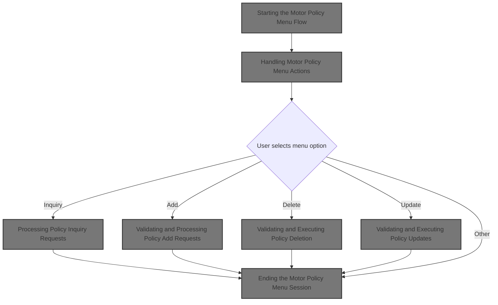
```mermaid
flowchart TD
  node1["Starting the Motor Policy Menu Flow"]:::HeadingStyle
  click node1 goToHeading "Starting the Motor Policy Menu Flow"
  node1 --> node2["Handling Motor Policy Menu Actions"]:::HeadingStyle
  click node2 goToHeading "Handling Motor Policy Menu Actions"
  node2 --> node3{"User selects menu option"}
  node3 -->|"Inquiry"| node4["Processing Policy Inquiry Requests"]:::HeadingStyle
  click node4 goToHeading "Processing Policy Inquiry Requests"
  node4 --> node5["Ending the Motor Policy Menu Session"]:::HeadingStyle
  click node5 goToHeading "Ending the Motor Policy Menu Session"
  node3 -->|"Add"| node6["Validating and Processing Policy Add Requests"]:::HeadingStyle
  click node6 goToHeading "Validating and Processing Policy Add Requests"
  node6 --> node5
  node3 -->|"Delete"| node7["Validating and Executing Policy Deletion"]:::HeadingStyle
  click node7 goToHeading "Validating and Executing Policy Deletion"
  node7 --> node5
  node3 -->|"Update"| node8["Validating and Executing Policy Updates"]:::HeadingStyle
  click node8 goToHeading "Validating and Executing Policy Updates"
  node8 --> node5
  node3 -->|"Other"| node5

classDef HeadingStyle fill:#777777,stroke:#333,stroke-width:2px;
```

# Technical Overview


```mermaid
sequenceDiagram
  participant MENU as LGTESTP1.cbl<br/>*(Motor Policy Menu Controller)*
  participant INQUIRY as LGIPOL01.cbl<br/>*(Policy Inquiry Handler)*
  participant INQDB as LGIPDB01.cbl<br/>*(Policy Data Retriever)*
  participant ADD as LGAPOL01.cbl<br/>*(Policy Addition Handler)*
  participant ADDDB as base/src/LGAPDB01.cbl<br/>*(Premium Calculator and Policy Adder)*
  participant DELETE as LGDPOL01.cbl<br/>*(Policy Deletion Handler)*
  participant DELDB as LGDPDB01.cbl<br/>*(Database Policy Deleter)*
  participant DELFILE as LGDPVS01.cbl<br/>*(File Policy Deleter)*
  participant UPDATE as LGUPOL01.cbl<br/>*(Policy Update Handler)*
  participant UPDB as LGUPDB01.cbl<br/>*(Database Policy Updater)*
  participant UPFILE as LGUPVS01.cbl<br/>*(File Policy Updater)*
  participant LOG as LGSTSQS.cbl<br/>*(System Error Logger)*

  MENU->>INQUIRY: Initiate policy inquiry
  INQUIRY->>INQDB: Retrieve policy data
  INQUIRY->>LOG: Log errors if any

  MENU->>ADD: Initiate policy addition
  ADD->>ADDDB: Add policy and calculate premium
  ADD->>LOG: Log errors if any

  MENU->>DELETE: Initiate policy deletion
  DELETE->>DELDB: Delete policy from database
  DELETE->>LOG: Log errors if any
  DELDB->>DELFILE: Delete policy from file system
  DELDB->>LOG: Log errors if any
  DELFILE->>LOG: Log errors if any

  MENU->>UPDATE: Initiate policy update
  UPDATE->>UPDB: Update policy in database
  UPDATE->>LOG: Log errors if any
  UPDB->>UPFILE: Update policy in file system
  UPDB->>LOG: Log errors if any
  UPFILE->>LOG: Log errors if any

%% Swimm:
%% sequenceDiagram
%%   participant MENU as LGTESTP1.cbl<br/>*(Motor Policy Menu Controller)*
%%   participant INQUIRY as LGIPOL01.cbl<br/>*(Policy Inquiry Handler)*
%%   participant INQDB as LGIPDB01.cbl<br/>*(Policy Data Retriever)*
%%   participant ADD as LGAPOL01.cbl<br/>*(Policy Addition Handler)*
%%   participant ADDDB as <SwmPath>[base/src/LGAPDB01.cbl](base/src/LGAPDB01.cbl)</SwmPath><br/>*(Premium Calculator and Policy Adder)*
%%   participant DELETE as LGDPOL01.cbl<br/>*(Policy Deletion Handler)*
%%   participant DELDB as LGDPDB01.cbl<br/>*(Database Policy Deleter)*
%%   participant DELFILE as LGDPVS01.cbl<br/>*(File Policy Deleter)*
%%   participant UPDATE as LGUPOL01.cbl<br/>*(Policy Update Handler)*
%%   participant UPDB as LGUPDB01.cbl<br/>*(Database Policy Updater)*
%%   participant UPFILE as LGUPVS01.cbl<br/>*(File Policy Updater)*
%%   participant LOG as LGSTSQS.cbl<br/>*(System Error Logger)*
%% 
%%   MENU->>INQUIRY: Initiate policy inquiry
%%   INQUIRY->>INQDB: Retrieve policy data
%%   INQUIRY->>LOG: Log errors if any
%% 
%%   MENU->>ADD: Initiate policy addition
%%   ADD->>ADDDB: Add policy and calculate premium
%%   ADD->>LOG: Log errors if any
%% 
%%   MENU->>DELETE: Initiate policy deletion
%%   DELETE->>DELDB: Delete policy from database
%%   DELETE->>LOG: Log errors if any
%%   DELDB->>DELFILE: Delete policy from file system
%%   DELDB->>LOG: Log errors if any
%%   DELFILE->>LOG: Log errors if any
%% 
%%   MENU->>UPDATE: Initiate policy update
%%   UPDATE->>UPDB: Update policy in database
%%   UPDATE->>LOG: Log errors if any
%%   UPDB->>UPFILE: Update policy in file system
%%   UPDB->>LOG: Log errors if any
%%   UPFILE->>LOG: Log errors if any
```

## Dependencies

### Programs

- <SwmToken path="base/src/lgtestp1.cbl" pos="72:10:10" line-data="                 EXEC CICS LINK PROGRAM(&#39;LGIPOL01&#39;)">`LGIPOL01`</SwmToken> (<SwmPath>[base/src/lgipol01.cbl](base/src/lgipol01.cbl)</SwmPath>)
- <SwmToken path="base/src/lgipol01.cbl" pos="91:9:9" line-data="           EXEC CICS LINK Program(LGIPDB01)">`LGIPDB01`</SwmToken> (<SwmPath>[base/src/lgipdb01.cbl](base/src/lgipdb01.cbl)</SwmPath>)
- LGSTSQ (<SwmPath>[base/src/lgstsq.cbl](base/src/lgstsq.cbl)</SwmPath>)
- <SwmToken path="base/src/lgtestp1.cbl" pos="115:10:10" line-data="                 EXEC CICS LINK PROGRAM(&#39;LGAPOL01&#39;)">`LGAPOL01`</SwmToken> (<SwmPath>[base/src/lgapol01.cbl](base/src/lgapol01.cbl)</SwmPath>)
- <SwmToken path="base/src/lgapol01.cbl" pos="103:9:9" line-data="           EXEC CICS Link Program(LGAPDB01)">`LGAPDB01`</SwmToken> (<SwmPath>[base/src/LGAPDB01.cbl](base/src/LGAPDB01.cbl)</SwmPath>)
- <SwmToken path="base/src/LGAPDB01.cbl" pos="269:4:4" line-data="           CALL &#39;LGAPDB02&#39; USING IN-PROPERTY-TYPE, IN-POSTCODE, ">`LGAPDB02`</SwmToken>
- <SwmToken path="base/src/LGAPDB01.cbl" pos="276:4:4" line-data="           CALL &#39;LGAPDB03&#39; USING WS-BASE-RISK-SCR, IN-FIRE-PERIL, ">`LGAPDB03`</SwmToken> (<SwmPath>[base/src/LGAPDB03.cbl](base/src/LGAPDB03.cbl)</SwmPath>)
- <SwmToken path="base/src/LGAPDB01.cbl" pos="313:4:4" line-data="               CALL &#39;LGAPDB04&#39; USING LK-INPUT-DATA, LK-COVERAGE-DATA, ">`LGAPDB04`</SwmToken> (<SwmPath>[base/src/LGAPDB04.cbl](base/src/LGAPDB04.cbl)</SwmPath>)
- <SwmToken path="base/src/lgtestp1.cbl" pos="139:10:10" line-data="                 EXEC CICS LINK PROGRAM(&#39;LGDPOL01&#39;)">`LGDPOL01`</SwmToken> (<SwmPath>[base/src/lgdpol01.cbl](base/src/lgdpol01.cbl)</SwmPath>)
- <SwmToken path="base/src/lgdpol01.cbl" pos="141:9:9" line-data="           EXEC CICS LINK PROGRAM(LGDPDB01)">`LGDPDB01`</SwmToken> (<SwmPath>[base/src/lgdpdb01.cbl](base/src/lgdpdb01.cbl)</SwmPath>)
- <SwmToken path="base/src/lgdpdb01.cbl" pos="168:9:9" line-data="               EXEC CICS LINK PROGRAM(LGDPVS01)">`LGDPVS01`</SwmToken> (<SwmPath>[base/src/lgdpvs01.cbl](base/src/lgdpvs01.cbl)</SwmPath>)
- <SwmToken path="base/src/lgtestp1.cbl" pos="216:10:10" line-data="                 EXEC CICS LINK PROGRAM(&#39;LGUPOL01&#39;)">`LGUPOL01`</SwmToken> (<SwmPath>[base/src/lgupol01.cbl](base/src/lgupol01.cbl)</SwmPath>)
- <SwmToken path="base/src/lgupol01.cbl" pos="157:9:9" line-data="           EXEC CICS LINK Program(LGUPDB01)">`LGUPDB01`</SwmToken> (<SwmPath>[base/src/lgupdb01.cbl](base/src/lgupdb01.cbl)</SwmPath>)
- <SwmToken path="base/src/lgupdb01.cbl" pos="209:9:9" line-data="           EXEC CICS LINK Program(LGUPVS01)">`LGUPVS01`</SwmToken> (<SwmPath>[base/src/lgupvs01.cbl](base/src/lgupvs01.cbl)</SwmPath>)

### Copybooks

- SQLCA
- LGPOLICY (<SwmPath>[base/src/lgpolicy.cpy](base/src/lgpolicy.cpy)</SwmPath>)
- LGCMAREA (<SwmPath>[base/src/lgcmarea.cpy](base/src/lgcmarea.cpy)</SwmPath>)
- <SwmToken path="base/src/LGAPDB01.cbl" pos="35:3:3" line-data="           COPY INPUTREC2.">`INPUTREC2`</SwmToken> (<SwmPath>[base/src/INPUTREC2.cpy](base/src/INPUTREC2.cpy)</SwmPath>)
- OUTPUTREC (<SwmPath>[base/src/OUTPUTREC.cpy](base/src/OUTPUTREC.cpy)</SwmPath>)
- WORKSTOR (<SwmPath>[base/src/WORKSTOR.cpy](base/src/WORKSTOR.cpy)</SwmPath>)
- LGAPACT (<SwmPath>[base/src/LGAPACT.cpy](base/src/LGAPACT.cpy)</SwmPath>)
- SSMAP

## Detailed View of the Program's Functionality

# a. Overview of the Motor Policy Menu Flow

The main entry point for the motor policy menu checks if there is any communication area data from a previous transaction. If such data exists, it immediately jumps to the main menu handler to process user input. If not, it initializes all input/output and communication areas, clears out any policy or customer fields, and displays a fresh menu screen to the user.

# b. User Input Handling and Menu Actions

When the user interacts with the menu, the system sets up handlers for special keys (like CLEAR or <SwmToken path="base/src/lgtestp1.cbl" pos="56:1:1" line-data="                     PF3(ENDIT) END-EXEC.">`PF3`</SwmToken> for exit) and for input errors. It then receives the user's input from the screen and evaluates which menu option was selected:

- **Inquiry ('1')**: Prepares a request to fetch motor policy details, calls the backend to retrieve the data, and checks the result. If successful, it populates the screen fields with the policy data and displays them. If not, it shows a "No data was returned" message.
- **Add ('2')**: Prepares a request to add a new motor policy, moving all user input into the communication area, and calls the backend to process the add. If the add fails, it rolls back any changes and displays an error message. If successful, it updates the screen with the new policy and customer numbers and shows a success message.
- **Delete ('3')**: Prepares a request to delete a motor policy, calls the backend to process the deletion, and checks the result. If the delete fails, it rolls back and shows an error message. If successful, it clears all policy fields from the screen and shows a confirmation message.
- **Update ('4')**: Prepares a request to update an existing motor policy, moving all updated fields into the communication area, and calls the backend to process the update. If the update fails, it shows an error message. If successful, it updates the screen with the new data and shows a success message.
- **Other/Invalid Option**: If the user enters an invalid option, it displays an error message and returns to the menu.

# c. Inquiry Request Processing

When an inquiry is requested, the system validates the communication area. If it's missing, it logs an error and abends (terminates abnormally). If present, it initializes the return code and passes the request to the backend program responsible for fetching policy details. The backend checks the request type and calls the appropriate routine for the policy type (endowment, house, motor, or commercial). For motor policies, it fetches all relevant data from the database, checks if the communication area is large enough to hold the data, and moves the data into the communication area. If the fetch fails or the data doesn't fit, it sets an error code and logs the error.

# d. Error Logging

Whenever an error is detected (such as missing communication area, SQL errors, or data length issues), the system captures the current date and time, formats an error message, and sends it to a logging program. If there is communication area data, up to 90 bytes of it are also sent for diagnostic purposes. The logging program writes the message to both a transient data queue (for system logs) and a temporary storage queue (for application logs). If the error originated from a received message, it also sends a notification to the terminal.

# e. Add Request Processing

When adding a new policy, the system checks for the presence and length of the communication area. If missing or too short, it logs an error and returns. If valid, it calls the backend program to process the add. The backend initializes working storage, loads configuration settings, opens all required files, and writes headers to the output file. It then reads each input record, validates it, processes valid records, and logs errors for invalid ones. For valid records, it calculates risk scores and premiums, applies business rules, writes the output, and updates statistics. For error records, it zeros out all premium and risk fields, marks the record as rejected, and writes the reason.

# f. Delete Request Processing

When deleting a policy, the system checks the communication area and request ID, only allowing certain delete operations. If the request is valid, it calls the backend to delete the policy from the database. If the delete fails, it logs the error and returns. If successful, it also deletes the policy record from the VSAM file. If the file delete fails, it logs the error and returns.

# g. Update Request Processing

When updating a policy, the system checks the communication area length against the expected size for the policy type. If too short or unrecognized, it sets an error code and returns. If valid, it calls the backend to update the policy in the database. The backend opens a cursor on the policy table, fetches the row, and checks if the timestamp matches. If it matches, it updates the specific policy type table (endowment, house, or motor). If any update fails, it logs the error and closes the cursor. After a successful update, it updates the main policy table and fetches the new timestamp. The cursor is always closed at the end.

# h. VSAM File Updates

For both deletes and updates, after the database operation, the system updates the corresponding VSAM file. It builds the key from the request and policy/customer numbers, reads the record, and either deletes or rewrites it as needed. If the file operation fails, it logs the error and returns.

# i. User Feedback and Session Management

After each operation (inquiry, add, delete, update), the system updates the screen fields and displays appropriate messages to the user. If an error occurs, it displays a specific error message and ends the session. After successful operations, it clears or updates the relevant fields and returns to the menu for further input. If the user chooses to end the session or presses a special key, the system sends a final message and returns control to the transaction manager.

# j. Summary

The flow ensures that all user actions are validated, processed, and logged appropriately. Errors are consistently handled and logged with detailed context. All backend operations are modularized, with clear separation between business logic, database access, file handling, and error logging. The user interface is kept responsive and informative, always reflecting the latest state of the system.

# Rule Definition

| Paragraph Name                                                                                                                                                                                                                                                                                                                                                                                                                                                                                                                                                                                                                                                                                                                                                     | Rule ID | Category          | Description                                                                                                                                                                                                                                                                                                                                                                                                                                                                                                                                                                                                                                                                                                                                                                                                                                                                                                                                                                                                                                                                                                                                                                                                                                                                                                                                                                                                                                                                                                                                                                                                                                                                     | Conditions                                                                                      | Remarks                                                                                                                                                                                                                                                                                                                                                           |
| ------------------------------------------------------------------------------------------------------------------------------------------------------------------------------------------------------------------------------------------------------------------------------------------------------------------------------------------------------------------------------------------------------------------------------------------------------------------------------------------------------------------------------------------------------------------------------------------------------------------------------------------------------------------------------------------------------------------------------------------------------------------ | ------- | ----------------- | ------------------------------------------------------------------------------------------------------------------------------------------------------------------------------------------------------------------------------------------------------------------------------------------------------------------------------------------------------------------------------------------------------------------------------------------------------------------------------------------------------------------------------------------------------------------------------------------------------------------------------------------------------------------------------------------------------------------------------------------------------------------------------------------------------------------------------------------------------------------------------------------------------------------------------------------------------------------------------------------------------------------------------------------------------------------------------------------------------------------------------------------------------------------------------------------------------------------------------------------------------------------------------------------------------------------------------------------------------------------------------------------------------------------------------------------------------------------------------------------------------------------------------------------------------------------------------------------------------------------------------------------------------------------------------- | ----------------------------------------------------------------------------------------------- | ----------------------------------------------------------------------------------------------------------------------------------------------------------------------------------------------------------------------------------------------------------------------------------------------------------------------------------------------------------------- |
| <SwmToken path="base/src/lgtestp1.cbl" pos="11:6:6" line-data="       PROGRAM-ID. LGTESTP1.">`LGTESTP1`</SwmToken>: MAINLINE SECTION, lines 46-50                                                                                                                                                                                                                                                                                                                                                                                                                                                                                                                                                                                                                  | RL-001  | Conditional Logic | The system must display a menu to the user with options for Inquiry ('1'), Add ('2'), Delete ('3'), and Update ('4').                                                                                                                                                                                                                                                                                                                                                                                                                                                                                                                                                                                                                                                                                                                                                                                                                                                                                                                                                                                                                                                                                                                                                                                                                                                                                                                                                                                                                                                                                                                                                           | At the start of a session or after an operation, the main menu is displayed.                    | Menu options are single-character strings: '1', '2', '3', '4'.                                                                                                                                                                                                                                                                                                    |
| <SwmToken path="base/src/lgtestp1.cbl" pos="11:6:6" line-data="       PROGRAM-ID. LGTESTP1.">`LGTESTP1`</SwmToken>: MAINLINE SECTION, per operation blocks (Inquiry, Add, Delete, Update)                                                                                                                                                                                                                                                                                                                                                                                                                                                                                                                                                                          | RL-002  | Data Assignment   | All input fields from the <SwmToken path="base/src/lgtestp1.cbl" pos="47:11:11" line-data="           EXEC CICS SEND MAP (&#39;SSMAPP1&#39;)">`SSMAPP1`</SwmToken> screen (ENP1\*I) must be mapped to the corresponding commarea fields before backend processing.                                                                                                                                                                                                                                                                                                                                                                                                                                                                                                                                                                                                                                                                                                                                                                                                                                                                                                                                                                                                                                                                                                                                                                                                                                                                                                                                                                                                              | Before invoking backend programs for any operation.                                             | Field mapping is one-to-one; field types and lengths must match commarea definitions.                                                                                                                                                                                                                                                                             |
| <SwmToken path="base/src/lgtestp1.cbl" pos="11:6:6" line-data="       PROGRAM-ID. LGTESTP1.">`LGTESTP1`</SwmToken>: MAINLINE SECTION, CLEARIT, <SwmToken path="base/src/lgtestp1.cbl" pos="290:5:7" line-data="               Go To ERROR-OUT">`ERROR-OUT`</SwmToken>, <SwmToken path="base/src/lgtestp1.cbl" pos="247:5:7" line-data="                 GO TO ENDIT-STARTIT">`ENDIT-STARTIT`</SwmToken>                                                                                                                                                                                                                                                                                                                                                            | RL-003  | Data Assignment   | All input, output, and commarea fields must be initialized (reset) at the start of each session and after each operation or error.                                                                                                                                                                                                                                                                                                                                                                                                                                                                                                                                                                                                                                                                                                                                                                                                                                                                                                                                                                                                                                                                                                                                                                                                                                                                                                                                                                                                                                                                                                                                              | At session start, after each operation, or after an error.                                      | Fields are set to spaces or zeroes as appropriate for their type.                                                                                                                                                                                                                                                                                                 |
| <SwmToken path="base/src/lgtestp1.cbl" pos="11:6:6" line-data="       PROGRAM-ID. LGTESTP1.">`LGTESTP1`</SwmToken>: MAINLINE SECTION, EVALUATE <SwmToken path="base/src/lgtestp1.cbl" pos="66:3:3" line-data="           EVALUATE ENP1OPTO">`ENP1OPTO`</SwmToken>                                                                                                                                                                                                                                                                                                                                                                                                                                                                                                  | RL-004  | Conditional Logic | Each menu operation is processed synchronously, handling one request/response per user action, except for Update, which requires a two-step workflow (Inquiry then Update in the same session).                                                                                                                                                                                                                                                                                                                                                                                                                                                                                                                                                                                                                                                                                                                                                                                                                                                                                                                                                                                                                                                                                                                                                                                                                                                                                                                                                                                                                                                                                 | When a user selects a menu option.                                                              | Update workflow: Inquiry step followed by Update step within the same session.                                                                                                                                                                                                                                                                                    |
| <SwmToken path="base/src/lgtestp1.cbl" pos="11:6:6" line-data="       PROGRAM-ID. LGTESTP1.">`LGTESTP1`</SwmToken>: WHEN '1' block; <SwmToken path="base/src/lgtestp1.cbl" pos="72:10:10" line-data="                 EXEC CICS LINK PROGRAM(&#39;LGIPOL01&#39;)">`LGIPOL01`</SwmToken>; <SwmToken path="base/src/lgipol01.cbl" pos="91:9:9" line-data="           EXEC CICS LINK Program(LGIPDB01)">`LGIPDB01`</SwmToken>: <SwmToken path="base/src/lgipdb01.cbl" pos="289:3:9" line-data="               PERFORM GET-MOTOR-DB2-INFO">`GET-MOTOR-DB2-INFO`</SwmToken>                                                                                                                                                                                             | RL-005  | Computation       | For Inquiry, move customer and policy numbers from the screen to the commarea, set <SwmToken path="base/src/lgtestp1.cbl" pos="69:9:13" line-data="                 Move &#39;01IMOT&#39;   To CA-REQUEST-ID">`CA-REQUEST-ID`</SwmToken> to <SwmToken path="base/src/lgtestp1.cbl" pos="69:4:4" line-data="                 Move &#39;01IMOT&#39;   To CA-REQUEST-ID">`01IMOT`</SwmToken>, call backend, and on success, map all motor policy fields from commarea to output screen fields.                                                                                                                                                                                                                                                                                                                                                                                                                                                                                                                                                                                                                                                                                                                                                                                                                                                                                                                                                                                                                                                                                                                                                                                     | User selects Inquiry ('1') and provides customer/policy numbers.                                | <SwmToken path="base/src/lgtestp1.cbl" pos="69:9:13" line-data="                 Move &#39;01IMOT&#39;   To CA-REQUEST-ID">`CA-REQUEST-ID`</SwmToken>=<SwmToken path="base/src/lgtestp1.cbl" pos="69:4:4" line-data="                 Move &#39;01IMOT&#39;   To CA-REQUEST-ID">`01IMOT`</SwmToken>. Output fields are mapped one-to-one from commarea to screen. |
| <SwmToken path="base/src/lgtestp1.cbl" pos="11:6:6" line-data="       PROGRAM-ID. LGTESTP1.">`LGTESTP1`</SwmToken>: WHEN '2' block; <SwmToken path="base/src/lgtestp1.cbl" pos="115:10:10" line-data="                 EXEC CICS LINK PROGRAM(&#39;LGAPOL01&#39;)">`LGAPOL01`</SwmToken>                                                                                                                                                                                                                                                                                                                                                                                                                                                                           | RL-006  | Computation       | For Add, move all motor policy details from input screen fields to commarea, set <SwmToken path="base/src/lgtestp1.cbl" pos="69:9:13" line-data="                 Move &#39;01IMOT&#39;   To CA-REQUEST-ID">`CA-REQUEST-ID`</SwmToken> to <SwmToken path="base/src/lgtestp1.cbl" pos="98:4:4" line-data="                 Move &#39;01AMOT&#39;          To CA-REQUEST-ID">`01AMOT`</SwmToken>, call backend, and on success, display new customer and policy numbers.                                                                                                                                                                                                                                                                                                                                                                                                                                                                                                                                                                                                                                                                                                                                                                                                                                                                                                                                                                                                                                                                                                                                                                                                          | User selects Add ('2') and provides all required policy details.                                | <SwmToken path="base/src/lgtestp1.cbl" pos="69:9:13" line-data="                 Move &#39;01IMOT&#39;   To CA-REQUEST-ID">`CA-REQUEST-ID`</SwmToken>=<SwmToken path="base/src/lgtestp1.cbl" pos="98:4:4" line-data="                 Move &#39;01AMOT&#39;          To CA-REQUEST-ID">`01AMOT`</SwmToken>. New customer/policy numbers are returned in commarea. |
| <SwmToken path="base/src/lgtestp1.cbl" pos="11:6:6" line-data="       PROGRAM-ID. LGTESTP1.">`LGTESTP1`</SwmToken>: WHEN '4' block; <SwmToken path="base/src/lgtestp1.cbl" pos="216:10:10" line-data="                 EXEC CICS LINK PROGRAM(&#39;LGUPOL01&#39;)">`LGUPOL01`</SwmToken>; <SwmToken path="base/src/lgupol01.cbl" pos="157:9:9" line-data="           EXEC CICS LINK Program(LGUPDB01)">`LGUPDB01`</SwmToken>                                                                                                                                                                                                                                                                                                                                       | RL-007  | Computation       | For Update, first perform Inquiry to fetch current policy details, then accept updated input fields, move them to commarea, set <SwmToken path="base/src/lgtestp1.cbl" pos="69:9:13" line-data="                 Move &#39;01IMOT&#39;   To CA-REQUEST-ID">`CA-REQUEST-ID`</SwmToken> to <SwmToken path="base/src/lgtestp1.cbl" pos="200:4:4" line-data="                 Move &#39;01UMOT&#39;          To CA-REQUEST-ID">`01UMOT`</SwmToken>, call backend, and on success, display updated details.                                                                                                                                                                                                                                                                                                                                                                                                                                                                                                                                                                                                                                                                                                                                                                                                                                                                                                                                                                                                                                                                                                                                                                          | User selects Update ('4'), provides customer/policy numbers, and then provides updated details. | <SwmToken path="base/src/lgtestp1.cbl" pos="69:9:13" line-data="                 Move &#39;01IMOT&#39;   To CA-REQUEST-ID">`CA-REQUEST-ID`</SwmToken>=<SwmToken path="base/src/lgtestp1.cbl" pos="200:4:4" line-data="                 Move &#39;01UMOT&#39;          To CA-REQUEST-ID">`01UMOT`</SwmToken>. Two-step workflow within the same session.           |
| <SwmToken path="base/src/lgtestp1.cbl" pos="11:6:6" line-data="       PROGRAM-ID. LGTESTP1.">`LGTESTP1`</SwmToken>: WHEN '3' block; <SwmToken path="base/src/lgtestp1.cbl" pos="139:10:10" line-data="                 EXEC CICS LINK PROGRAM(&#39;LGDPOL01&#39;)">`LGDPOL01`</SwmToken>; <SwmToken path="base/src/lgdpol01.cbl" pos="141:9:9" line-data="           EXEC CICS LINK PROGRAM(LGDPDB01)">`LGDPDB01`</SwmToken>                                                                                                                                                                                                                                                                                                                                       | RL-008  | Computation       | For Delete, move customer and policy numbers from the screen to the commarea, set <SwmToken path="base/src/lgtestp1.cbl" pos="69:9:13" line-data="                 Move &#39;01IMOT&#39;   To CA-REQUEST-ID">`CA-REQUEST-ID`</SwmToken> to <SwmToken path="base/src/lgtestp1.cbl" pos="136:4:4" line-data="                 Move &#39;01DMOT&#39;   To CA-REQUEST-ID">`01DMOT`</SwmToken>, call backend, and on success, clear all screen fields and display a confirmation message.                                                                                                                                                                                                                                                                                                                                                                                                                                                                                                                                                                                                                                                                                                                                                                                                                                                                                                                                                                                                                                                                                                                                                                                            | User selects Delete ('3') and provides customer/policy numbers.                                 | <SwmToken path="base/src/lgtestp1.cbl" pos="69:9:13" line-data="                 Move &#39;01IMOT&#39;   To CA-REQUEST-ID">`CA-REQUEST-ID`</SwmToken>=<SwmToken path="base/src/lgtestp1.cbl" pos="136:4:4" line-data="                 Move &#39;01DMOT&#39;   To CA-REQUEST-ID">`01DMOT`</SwmToken>. Confirmation message is shown on success.                   |
| Spec document; enforced in screen mapping and backend programs                                                                                                                                                                                                                                                                                                                                                                                                                                                                                                                                                                                                                                                                                                     | RL-009  | Conditional Logic | All motor policy fields must be validated: <SwmToken path="base/src/lgtestp1.cbl" pos="82:3:7" line-data="                 Move CA-M-MAKE         To  ENP1CMKI">`CA-M-MAKE`</SwmToken> (alphanumeric, ≤15), <SwmToken path="base/src/lgtestp1.cbl" pos="83:3:7" line-data="                 Move CA-M-MODEL        To  ENP1CMOI">`CA-M-MODEL`</SwmToken> (alphanumeric, ≤15), <SwmToken path="base/src/lgtestp1.cbl" pos="84:3:7" line-data="                 Move CA-M-VALUE        To  ENP1VALI">`CA-M-VALUE`</SwmToken> (numeric, 0-999999, ≤6 digits), <SwmToken path="base/src/lgtestp1.cbl" pos="85:3:7" line-data="                 Move CA-M-REGNUMBER    To  ENP1REGI">`CA-M-REGNUMBER`</SwmToken> (alphanumeric, ≤7), <SwmToken path="base/src/lgtestp1.cbl" pos="86:3:7" line-data="                 Move CA-M-COLOUR       To  ENP1COLI">`CA-M-COLOUR`</SwmToken> (alphanumeric, ≤10), <SwmToken path="base/src/lgtestp1.cbl" pos="87:3:7" line-data="                 Move CA-M-CC           To  ENP1CCI">`CA-M-CC`</SwmToken> (numeric, 0-99999, ≤5 digits), <SwmToken path="base/src/lgtestp1.cbl" pos="88:3:7" line-data="                 Move CA-M-MANUFACTURED To  ENP1MANI">`CA-M-MANUFACTURED`</SwmToken> (numeric, 1900-current year, 4 digits), <SwmToken path="base/src/lgtestp1.cbl" pos="89:3:7" line-data="                 Move CA-M-PREMIUM      To  ENP1PREI">`CA-M-PREMIUM`</SwmToken> (numeric, 0-999999, ≤6 digits), <SwmToken path="base/src/lgtestp1.cbl" pos="90:3:7" line-data="                 Move CA-M-ACCIDENTS    To  ENP1ACCI">`CA-M-ACCIDENTS`</SwmToken> (numeric, 0-999999, ≤6 digits). Data longer than the field is truncated. | On input mapping and before backend call.                                                       | Field types: string or number. Lengths: MAKE/MODEL=15, VALUE=6, REGNUMBER=7, COLOUR=10, CC=5, MANUFACTURED=4, PREMIUM=6, ACCIDENTS=6. Truncation applies if input exceeds length.                                                                                                                                                                                 |
| <SwmToken path="base/src/lgtestp1.cbl" pos="11:6:6" line-data="       PROGRAM-ID. LGTESTP1.">`LGTESTP1`</SwmToken>: After each backend call; <SwmToken path="base/src/lgtestp1.cbl" pos="72:10:10" line-data="                 EXEC CICS LINK PROGRAM(&#39;LGIPOL01&#39;)">`LGIPOL01`</SwmToken>, <SwmToken path="base/src/lgtestp1.cbl" pos="115:10:10" line-data="                 EXEC CICS LINK PROGRAM(&#39;LGAPOL01&#39;)">`LGAPOL01`</SwmToken>, <SwmToken path="base/src/lgtestp1.cbl" pos="139:10:10" line-data="                 EXEC CICS LINK PROGRAM(&#39;LGDPOL01&#39;)">`LGDPOL01`</SwmToken>, <SwmToken path="base/src/lgtestp1.cbl" pos="216:10:10" line-data="                 EXEC CICS LINK PROGRAM(&#39;LGUPOL01&#39;)">`LGUPOL01`</SwmToken> | RL-010  | Conditional Logic | After each backend call, the system must check <SwmToken path="base/src/lgtestp1.cbl" pos="76:3:7" line-data="                 IF CA-RETURN-CODE &gt; 0">`CA-RETURN-CODE`</SwmToken> and display appropriate feedback or error messages to the user via <SwmToken path="base/src/lgtestp1.cbl" pos="128:3:3" line-data="                   To  ERP1FLDO">`ERP1FLDO`</SwmToken>.                                                                                                                                                                                                                                                                                                                                                                                                                                                                                                                                                                                                                                                                                                                                                                                                                                                                                                                                                                                                                                                                                                                                                                                                                                                                                                 | After backend program returns.                                                                  | <SwmToken path="base/src/lgtestp1.cbl" pos="76:3:7" line-data="                 IF CA-RETURN-CODE &gt; 0">`CA-RETURN-CODE`</SwmToken> values: '00' (success), '01' (not found), '90' (error), etc. Feedback is shown in <SwmToken path="base/src/lgtestp1.cbl" pos="128:3:3" line-data="                   To  ERP1FLDO">`ERP1FLDO`</SwmToken>.                   |
| LGSTSQ; error handling sections in all backend programs                                                                                                                                                                                                                                                                                                                                                                                                                                                                                                                                                                                                                                                                                                            | RL-011  | Computation       | Errors must be logged by sending a formatted error message to LGSTSQ, including date (MMDDYYYY), time (HHMMSS), program name, variable details, and up to 90 bytes of commarea data prefixed with 'COMMAREA='.                                                                                                                                                                                                                                                                                                                                                                                                                                                                                                                                                                                                                                                                                                                                                                                                                                                                                                                                                                                                                                                                                                                                                                                                                                                                                                                                                                                                                                                                  | On error in any backend program.                                                                | Error message format: date (8), time (6), program name (8+), variable details (21+), commarea data (up to 90 bytes, prefixed 'COMMAREA=').                                                                                                                                                                                                                        |
| <SwmToken path="base/src/lgtestp1.cbl" pos="11:6:6" line-data="       PROGRAM-ID. LGTESTP1.">`LGTESTP1`</SwmToken>: ENDIT, <SwmToken path="base/src/lgtestp1.cbl" pos="247:5:7" line-data="                 GO TO ENDIT-STARTIT">`ENDIT-STARTIT`</SwmToken>, CLEARIT                                                                                                                                                                                                                                                                                                                                                                                                                                                                                               | RL-012  | Conditional Logic | The system must end the session and return control to CICS after each operation, error, or explicit user exit (PF3/CLEAR), reinitializing all fields before returning. No persistent session state is maintained across operations, except for the brief two-step update workflow.                                                                                                                                                                                                                                                                                                                                                                                                                                                                                                                                                                                                                                                                                                                                                                                                                                                                                                                                                                                                                                                                                                                                                                                                                                                                                                                                                                                              | After operation, error, or user exit.                                                           | All fields are reset to initial values. Only Update workflow retains state between Inquiry and Update.                                                                                                                                                                                                                                                            |

# User Stories

## User Story 1: Inquiry Motor Policy

---

### Story Description:

As a user, I want to inquire about a motor policy by entering customer and policy numbers so that I can view the details of an existing motor policy.

---

### Business Rule Mapping:

| Rule ID | Paragraph Name                                                                                                                                                                                                                                                                                                                                                                                                                                                                                                                                                                                                                                                                                                                                                     | Rule Description                                                                                                                                                                                                                                                                                                                                                                                                                                                                            |
| ------- | ------------------------------------------------------------------------------------------------------------------------------------------------------------------------------------------------------------------------------------------------------------------------------------------------------------------------------------------------------------------------------------------------------------------------------------------------------------------------------------------------------------------------------------------------------------------------------------------------------------------------------------------------------------------------------------------------------------------------------------------------------------------ | ------------------------------------------------------------------------------------------------------------------------------------------------------------------------------------------------------------------------------------------------------------------------------------------------------------------------------------------------------------------------------------------------------------------------------------------------------------------------------------------- |
| RL-002  | <SwmToken path="base/src/lgtestp1.cbl" pos="11:6:6" line-data="       PROGRAM-ID. LGTESTP1.">`LGTESTP1`</SwmToken>: MAINLINE SECTION, per operation blocks (Inquiry, Add, Delete, Update)                                                                                                                                                                                                                                                                                                                                                                                                                                                                                                                                                                          | All input fields from the <SwmToken path="base/src/lgtestp1.cbl" pos="47:11:11" line-data="           EXEC CICS SEND MAP (&#39;SSMAPP1&#39;)">`SSMAPP1`</SwmToken> screen (ENP1\*I) must be mapped to the corresponding commarea fields before backend processing.                                                                                                                                                                                                                          |
| RL-005  | <SwmToken path="base/src/lgtestp1.cbl" pos="11:6:6" line-data="       PROGRAM-ID. LGTESTP1.">`LGTESTP1`</SwmToken>: WHEN '1' block; <SwmToken path="base/src/lgtestp1.cbl" pos="72:10:10" line-data="                 EXEC CICS LINK PROGRAM(&#39;LGIPOL01&#39;)">`LGIPOL01`</SwmToken>; <SwmToken path="base/src/lgipol01.cbl" pos="91:9:9" line-data="           EXEC CICS LINK Program(LGIPDB01)">`LGIPDB01`</SwmToken>: <SwmToken path="base/src/lgipdb01.cbl" pos="289:3:9" line-data="               PERFORM GET-MOTOR-DB2-INFO">`GET-MOTOR-DB2-INFO`</SwmToken>                                                                                                                                                                                             | For Inquiry, move customer and policy numbers from the screen to the commarea, set <SwmToken path="base/src/lgtestp1.cbl" pos="69:9:13" line-data="                 Move &#39;01IMOT&#39;   To CA-REQUEST-ID">`CA-REQUEST-ID`</SwmToken> to <SwmToken path="base/src/lgtestp1.cbl" pos="69:4:4" line-data="                 Move &#39;01IMOT&#39;   To CA-REQUEST-ID">`01IMOT`</SwmToken>, call backend, and on success, map all motor policy fields from commarea to output screen fields. |
| RL-010  | <SwmToken path="base/src/lgtestp1.cbl" pos="11:6:6" line-data="       PROGRAM-ID. LGTESTP1.">`LGTESTP1`</SwmToken>: After each backend call; <SwmToken path="base/src/lgtestp1.cbl" pos="72:10:10" line-data="                 EXEC CICS LINK PROGRAM(&#39;LGIPOL01&#39;)">`LGIPOL01`</SwmToken>, <SwmToken path="base/src/lgtestp1.cbl" pos="115:10:10" line-data="                 EXEC CICS LINK PROGRAM(&#39;LGAPOL01&#39;)">`LGAPOL01`</SwmToken>, <SwmToken path="base/src/lgtestp1.cbl" pos="139:10:10" line-data="                 EXEC CICS LINK PROGRAM(&#39;LGDPOL01&#39;)">`LGDPOL01`</SwmToken>, <SwmToken path="base/src/lgtestp1.cbl" pos="216:10:10" line-data="                 EXEC CICS LINK PROGRAM(&#39;LGUPOL01&#39;)">`LGUPOL01`</SwmToken> | After each backend call, the system must check <SwmToken path="base/src/lgtestp1.cbl" pos="76:3:7" line-data="                 IF CA-RETURN-CODE &gt; 0">`CA-RETURN-CODE`</SwmToken> and display appropriate feedback or error messages to the user via <SwmToken path="base/src/lgtestp1.cbl" pos="128:3:3" line-data="                   To  ERP1FLDO">`ERP1FLDO`</SwmToken>.                                                                                                             |

---

### Relevant Functionality:

- <SwmToken path="base/src/lgtestp1.cbl" pos="11:6:6" line-data="       PROGRAM-ID. LGTESTP1.">`LGTESTP1`</SwmToken>**: MAINLINE SECTION**
  1. **RL-002:**
     - For each operation:
       - Move relevant screen input fields to commarea fields.
- <SwmToken path="base/src/lgtestp1.cbl" pos="11:6:6" line-data="       PROGRAM-ID. LGTESTP1.">`LGTESTP1`</SwmToken>**: WHEN '1' block;** <SwmToken path="base/src/lgtestp1.cbl" pos="72:10:10" line-data="                 EXEC CICS LINK PROGRAM(&#39;LGIPOL01&#39;)">`LGIPOL01`</SwmToken>**;** <SwmToken path="base/src/lgipol01.cbl" pos="91:9:9" line-data="           EXEC CICS LINK Program(LGIPDB01)">`LGIPDB01`</SwmToken>**:** <SwmToken path="base/src/lgipdb01.cbl" pos="289:3:9" line-data="               PERFORM GET-MOTOR-DB2-INFO">`GET-MOTOR-DB2-INFO`</SwmToken>
  1. **RL-005:**
     - Move customer/policy numbers to commarea.
     - Set <SwmToken path="base/src/lgtestp1.cbl" pos="69:9:13" line-data="                 Move &#39;01IMOT&#39;   To CA-REQUEST-ID">`CA-REQUEST-ID`</SwmToken> to <SwmToken path="base/src/lgtestp1.cbl" pos="69:4:4" line-data="                 Move &#39;01IMOT&#39;   To CA-REQUEST-ID">`01IMOT`</SwmToken>.
     - Call <SwmToken path="base/src/lgtestp1.cbl" pos="72:10:10" line-data="                 EXEC CICS LINK PROGRAM(&#39;LGIPOL01&#39;)">`LGIPOL01`</SwmToken> (which calls <SwmToken path="base/src/lgipol01.cbl" pos="91:9:9" line-data="           EXEC CICS LINK Program(LGIPDB01)">`LGIPDB01`</SwmToken>).
     - On success, map commarea fields to output screen fields.
- <SwmToken path="base/src/lgtestp1.cbl" pos="11:6:6" line-data="       PROGRAM-ID. LGTESTP1.">`LGTESTP1`</SwmToken>**: After each backend call;** <SwmToken path="base/src/lgtestp1.cbl" pos="72:10:10" line-data="                 EXEC CICS LINK PROGRAM(&#39;LGIPOL01&#39;)">`LGIPOL01`</SwmToken>
  1. **RL-010:**
     - After backend call:
       - If <SwmToken path="base/src/lgtestp1.cbl" pos="76:3:7" line-data="                 IF CA-RETURN-CODE &gt; 0">`CA-RETURN-CODE`</SwmToken>='00', proceed.
       - If error, display message in <SwmToken path="base/src/lgtestp1.cbl" pos="128:3:3" line-data="                   To  ERP1FLDO">`ERP1FLDO`</SwmToken>.

## User Story 2: Add Motor Policy

---

### Story Description:

As a user, I want to add a new motor policy by entering all required details so that I can create a new motor policy and receive the new customer and policy numbers.

---

### Business Rule Mapping:

| Rule ID | Paragraph Name                                                                                                                                                                                                                                                                                                                                                                                                                                                                                                                                                                                                                                                                                                                                                     | Rule Description                                                                                                                                                                                                                                                                                                                                                                                                                                                       |
| ------- | ------------------------------------------------------------------------------------------------------------------------------------------------------------------------------------------------------------------------------------------------------------------------------------------------------------------------------------------------------------------------------------------------------------------------------------------------------------------------------------------------------------------------------------------------------------------------------------------------------------------------------------------------------------------------------------------------------------------------------------------------------------------ | ---------------------------------------------------------------------------------------------------------------------------------------------------------------------------------------------------------------------------------------------------------------------------------------------------------------------------------------------------------------------------------------------------------------------------------------------------------------------- |
| RL-002  | <SwmToken path="base/src/lgtestp1.cbl" pos="11:6:6" line-data="       PROGRAM-ID. LGTESTP1.">`LGTESTP1`</SwmToken>: MAINLINE SECTION, per operation blocks (Inquiry, Add, Delete, Update)                                                                                                                                                                                                                                                                                                                                                                                                                                                                                                                                                                          | All input fields from the <SwmToken path="base/src/lgtestp1.cbl" pos="47:11:11" line-data="           EXEC CICS SEND MAP (&#39;SSMAPP1&#39;)">`SSMAPP1`</SwmToken> screen (ENP1\*I) must be mapped to the corresponding commarea fields before backend processing.                                                                                                                                                                                                     |
| RL-006  | <SwmToken path="base/src/lgtestp1.cbl" pos="11:6:6" line-data="       PROGRAM-ID. LGTESTP1.">`LGTESTP1`</SwmToken>: WHEN '2' block; <SwmToken path="base/src/lgtestp1.cbl" pos="115:10:10" line-data="                 EXEC CICS LINK PROGRAM(&#39;LGAPOL01&#39;)">`LGAPOL01`</SwmToken>                                                                                                                                                                                                                                                                                                                                                                                                                                                                           | For Add, move all motor policy details from input screen fields to commarea, set <SwmToken path="base/src/lgtestp1.cbl" pos="69:9:13" line-data="                 Move &#39;01IMOT&#39;   To CA-REQUEST-ID">`CA-REQUEST-ID`</SwmToken> to <SwmToken path="base/src/lgtestp1.cbl" pos="98:4:4" line-data="                 Move &#39;01AMOT&#39;          To CA-REQUEST-ID">`01AMOT`</SwmToken>, call backend, and on success, display new customer and policy numbers. |
| RL-010  | <SwmToken path="base/src/lgtestp1.cbl" pos="11:6:6" line-data="       PROGRAM-ID. LGTESTP1.">`LGTESTP1`</SwmToken>: After each backend call; <SwmToken path="base/src/lgtestp1.cbl" pos="72:10:10" line-data="                 EXEC CICS LINK PROGRAM(&#39;LGIPOL01&#39;)">`LGIPOL01`</SwmToken>, <SwmToken path="base/src/lgtestp1.cbl" pos="115:10:10" line-data="                 EXEC CICS LINK PROGRAM(&#39;LGAPOL01&#39;)">`LGAPOL01`</SwmToken>, <SwmToken path="base/src/lgtestp1.cbl" pos="139:10:10" line-data="                 EXEC CICS LINK PROGRAM(&#39;LGDPOL01&#39;)">`LGDPOL01`</SwmToken>, <SwmToken path="base/src/lgtestp1.cbl" pos="216:10:10" line-data="                 EXEC CICS LINK PROGRAM(&#39;LGUPOL01&#39;)">`LGUPOL01`</SwmToken> | After each backend call, the system must check <SwmToken path="base/src/lgtestp1.cbl" pos="76:3:7" line-data="                 IF CA-RETURN-CODE &gt; 0">`CA-RETURN-CODE`</SwmToken> and display appropriate feedback or error messages to the user via <SwmToken path="base/src/lgtestp1.cbl" pos="128:3:3" line-data="                   To  ERP1FLDO">`ERP1FLDO`</SwmToken>.                                                                                        |

---

### Relevant Functionality:

- <SwmToken path="base/src/lgtestp1.cbl" pos="11:6:6" line-data="       PROGRAM-ID. LGTESTP1.">`LGTESTP1`</SwmToken>**: MAINLINE SECTION**
  1. **RL-002:**
     - For each operation:
       - Move relevant screen input fields to commarea fields.
- <SwmToken path="base/src/lgtestp1.cbl" pos="11:6:6" line-data="       PROGRAM-ID. LGTESTP1.">`LGTESTP1`</SwmToken>**: WHEN '2' block;** <SwmToken path="base/src/lgtestp1.cbl" pos="115:10:10" line-data="                 EXEC CICS LINK PROGRAM(&#39;LGAPOL01&#39;)">`LGAPOL01`</SwmToken>
  1. **RL-006:**
     - Move all input fields to commarea.
     - Set <SwmToken path="base/src/lgtestp1.cbl" pos="69:9:13" line-data="                 Move &#39;01IMOT&#39;   To CA-REQUEST-ID">`CA-REQUEST-ID`</SwmToken> to <SwmToken path="base/src/lgtestp1.cbl" pos="98:4:4" line-data="                 Move &#39;01AMOT&#39;          To CA-REQUEST-ID">`01AMOT`</SwmToken>.
     - Call <SwmToken path="base/src/lgtestp1.cbl" pos="115:10:10" line-data="                 EXEC CICS LINK PROGRAM(&#39;LGAPOL01&#39;)">`LGAPOL01`</SwmToken>.
     - On success, display new customer/policy numbers.
- <SwmToken path="base/src/lgtestp1.cbl" pos="11:6:6" line-data="       PROGRAM-ID. LGTESTP1.">`LGTESTP1`</SwmToken>**: After each backend call;** <SwmToken path="base/src/lgtestp1.cbl" pos="72:10:10" line-data="                 EXEC CICS LINK PROGRAM(&#39;LGIPOL01&#39;)">`LGIPOL01`</SwmToken>
  1. **RL-010:**
     - After backend call:
       - If <SwmToken path="base/src/lgtestp1.cbl" pos="76:3:7" line-data="                 IF CA-RETURN-CODE &gt; 0">`CA-RETURN-CODE`</SwmToken>='00', proceed.
       - If error, display message in <SwmToken path="base/src/lgtestp1.cbl" pos="128:3:3" line-data="                   To  ERP1FLDO">`ERP1FLDO`</SwmToken>.

## User Story 3: Update Motor Policy

---

### Story Description:

As a user, I want to update an existing motor policy by first viewing its details and then submitting changes so that I can modify policy information in a controlled two-step workflow.

---

### Business Rule Mapping:

| Rule ID | Paragraph Name                                                                                                                                                                                                                                                                                                                                                                                                                                                                                                                                                                                                                                                                                                                                                     | Rule Description                                                                                                                                                                                                                                                                                                                                                                                                                                                                                       |
| ------- | ------------------------------------------------------------------------------------------------------------------------------------------------------------------------------------------------------------------------------------------------------------------------------------------------------------------------------------------------------------------------------------------------------------------------------------------------------------------------------------------------------------------------------------------------------------------------------------------------------------------------------------------------------------------------------------------------------------------------------------------------------------------ | ------------------------------------------------------------------------------------------------------------------------------------------------------------------------------------------------------------------------------------------------------------------------------------------------------------------------------------------------------------------------------------------------------------------------------------------------------------------------------------------------------ |
| RL-002  | <SwmToken path="base/src/lgtestp1.cbl" pos="11:6:6" line-data="       PROGRAM-ID. LGTESTP1.">`LGTESTP1`</SwmToken>: MAINLINE SECTION, per operation blocks (Inquiry, Add, Delete, Update)                                                                                                                                                                                                                                                                                                                                                                                                                                                                                                                                                                          | All input fields from the <SwmToken path="base/src/lgtestp1.cbl" pos="47:11:11" line-data="           EXEC CICS SEND MAP (&#39;SSMAPP1&#39;)">`SSMAPP1`</SwmToken> screen (ENP1\*I) must be mapped to the corresponding commarea fields before backend processing.                                                                                                                                                                                                                                     |
| RL-004  | <SwmToken path="base/src/lgtestp1.cbl" pos="11:6:6" line-data="       PROGRAM-ID. LGTESTP1.">`LGTESTP1`</SwmToken>: MAINLINE SECTION, EVALUATE <SwmToken path="base/src/lgtestp1.cbl" pos="66:3:3" line-data="           EVALUATE ENP1OPTO">`ENP1OPTO`</SwmToken>                                                                                                                                                                                                                                                                                                                                                                                                                                                                                                  | Each menu operation is processed synchronously, handling one request/response per user action, except for Update, which requires a two-step workflow (Inquiry then Update in the same session).                                                                                                                                                                                                                                                                                                        |
| RL-007  | <SwmToken path="base/src/lgtestp1.cbl" pos="11:6:6" line-data="       PROGRAM-ID. LGTESTP1.">`LGTESTP1`</SwmToken>: WHEN '4' block; <SwmToken path="base/src/lgtestp1.cbl" pos="216:10:10" line-data="                 EXEC CICS LINK PROGRAM(&#39;LGUPOL01&#39;)">`LGUPOL01`</SwmToken>; <SwmToken path="base/src/lgupol01.cbl" pos="157:9:9" line-data="           EXEC CICS LINK Program(LGUPDB01)">`LGUPDB01`</SwmToken>                                                                                                                                                                                                                                                                                                                                       | For Update, first perform Inquiry to fetch current policy details, then accept updated input fields, move them to commarea, set <SwmToken path="base/src/lgtestp1.cbl" pos="69:9:13" line-data="                 Move &#39;01IMOT&#39;   To CA-REQUEST-ID">`CA-REQUEST-ID`</SwmToken> to <SwmToken path="base/src/lgtestp1.cbl" pos="200:4:4" line-data="                 Move &#39;01UMOT&#39;          To CA-REQUEST-ID">`01UMOT`</SwmToken>, call backend, and on success, display updated details. |
| RL-010  | <SwmToken path="base/src/lgtestp1.cbl" pos="11:6:6" line-data="       PROGRAM-ID. LGTESTP1.">`LGTESTP1`</SwmToken>: After each backend call; <SwmToken path="base/src/lgtestp1.cbl" pos="72:10:10" line-data="                 EXEC CICS LINK PROGRAM(&#39;LGIPOL01&#39;)">`LGIPOL01`</SwmToken>, <SwmToken path="base/src/lgtestp1.cbl" pos="115:10:10" line-data="                 EXEC CICS LINK PROGRAM(&#39;LGAPOL01&#39;)">`LGAPOL01`</SwmToken>, <SwmToken path="base/src/lgtestp1.cbl" pos="139:10:10" line-data="                 EXEC CICS LINK PROGRAM(&#39;LGDPOL01&#39;)">`LGDPOL01`</SwmToken>, <SwmToken path="base/src/lgtestp1.cbl" pos="216:10:10" line-data="                 EXEC CICS LINK PROGRAM(&#39;LGUPOL01&#39;)">`LGUPOL01`</SwmToken> | After each backend call, the system must check <SwmToken path="base/src/lgtestp1.cbl" pos="76:3:7" line-data="                 IF CA-RETURN-CODE &gt; 0">`CA-RETURN-CODE`</SwmToken> and display appropriate feedback or error messages to the user via <SwmToken path="base/src/lgtestp1.cbl" pos="128:3:3" line-data="                   To  ERP1FLDO">`ERP1FLDO`</SwmToken>.                                                                                                                        |

---

### Relevant Functionality:

- <SwmToken path="base/src/lgtestp1.cbl" pos="11:6:6" line-data="       PROGRAM-ID. LGTESTP1.">`LGTESTP1`</SwmToken>**: MAINLINE SECTION**
  1. **RL-002:**
     - For each operation:
       - Move relevant screen input fields to commarea fields.
  2. **RL-004:**
     - On menu selection:
       - If Update, perform Inquiry, then accept updated input and perform Update.
       - Otherwise, process selected operation synchronously.
- <SwmToken path="base/src/lgtestp1.cbl" pos="11:6:6" line-data="       PROGRAM-ID. LGTESTP1.">`LGTESTP1`</SwmToken>**: WHEN '4' block;** <SwmToken path="base/src/lgtestp1.cbl" pos="216:10:10" line-data="                 EXEC CICS LINK PROGRAM(&#39;LGUPOL01&#39;)">`LGUPOL01`</SwmToken>**;** <SwmToken path="base/src/lgupol01.cbl" pos="157:9:9" line-data="           EXEC CICS LINK Program(LGUPDB01)">`LGUPDB01`</SwmToken>
  1. **RL-007:**
     - Perform Inquiry as in Inquiry workflow.
     - Accept updated input fields.
     - Move updated fields to commarea.
     - Set <SwmToken path="base/src/lgtestp1.cbl" pos="69:9:13" line-data="                 Move &#39;01IMOT&#39;   To CA-REQUEST-ID">`CA-REQUEST-ID`</SwmToken> to <SwmToken path="base/src/lgtestp1.cbl" pos="200:4:4" line-data="                 Move &#39;01UMOT&#39;          To CA-REQUEST-ID">`01UMOT`</SwmToken>.
     - Call <SwmToken path="base/src/lgtestp1.cbl" pos="216:10:10" line-data="                 EXEC CICS LINK PROGRAM(&#39;LGUPOL01&#39;)">`LGUPOL01`</SwmToken> (which calls <SwmToken path="base/src/lgupol01.cbl" pos="157:9:9" line-data="           EXEC CICS LINK Program(LGUPDB01)">`LGUPDB01`</SwmToken>).
     - On success, display updated details.
- <SwmToken path="base/src/lgtestp1.cbl" pos="11:6:6" line-data="       PROGRAM-ID. LGTESTP1.">`LGTESTP1`</SwmToken>**: After each backend call;** <SwmToken path="base/src/lgtestp1.cbl" pos="72:10:10" line-data="                 EXEC CICS LINK PROGRAM(&#39;LGIPOL01&#39;)">`LGIPOL01`</SwmToken>
  1. **RL-010:**
     - After backend call:
       - If <SwmToken path="base/src/lgtestp1.cbl" pos="76:3:7" line-data="                 IF CA-RETURN-CODE &gt; 0">`CA-RETURN-CODE`</SwmToken>='00', proceed.
       - If error, display message in <SwmToken path="base/src/lgtestp1.cbl" pos="128:3:3" line-data="                   To  ERP1FLDO">`ERP1FLDO`</SwmToken>.

## User Story 4: Delete Motor Policy

---

### Story Description:

As a user, I want to delete a motor policy by providing customer and policy numbers so that I can remove a policy and receive confirmation of its deletion.

---

### Business Rule Mapping:

| Rule ID | Paragraph Name                                                                                                                                                                                                                                                                                                                                                                                                                                                                                                                                                                                                                                                                                                                                                     | Rule Description                                                                                                                                                                                                                                                                                                                                                                                                                                                                     |
| ------- | ------------------------------------------------------------------------------------------------------------------------------------------------------------------------------------------------------------------------------------------------------------------------------------------------------------------------------------------------------------------------------------------------------------------------------------------------------------------------------------------------------------------------------------------------------------------------------------------------------------------------------------------------------------------------------------------------------------------------------------------------------------------ | ------------------------------------------------------------------------------------------------------------------------------------------------------------------------------------------------------------------------------------------------------------------------------------------------------------------------------------------------------------------------------------------------------------------------------------------------------------------------------------ |
| RL-002  | <SwmToken path="base/src/lgtestp1.cbl" pos="11:6:6" line-data="       PROGRAM-ID. LGTESTP1.">`LGTESTP1`</SwmToken>: MAINLINE SECTION, per operation blocks (Inquiry, Add, Delete, Update)                                                                                                                                                                                                                                                                                                                                                                                                                                                                                                                                                                          | All input fields from the <SwmToken path="base/src/lgtestp1.cbl" pos="47:11:11" line-data="           EXEC CICS SEND MAP (&#39;SSMAPP1&#39;)">`SSMAPP1`</SwmToken> screen (ENP1\*I) must be mapped to the corresponding commarea fields before backend processing.                                                                                                                                                                                                                   |
| RL-008  | <SwmToken path="base/src/lgtestp1.cbl" pos="11:6:6" line-data="       PROGRAM-ID. LGTESTP1.">`LGTESTP1`</SwmToken>: WHEN '3' block; <SwmToken path="base/src/lgtestp1.cbl" pos="139:10:10" line-data="                 EXEC CICS LINK PROGRAM(&#39;LGDPOL01&#39;)">`LGDPOL01`</SwmToken>; <SwmToken path="base/src/lgdpol01.cbl" pos="141:9:9" line-data="           EXEC CICS LINK PROGRAM(LGDPDB01)">`LGDPDB01`</SwmToken>                                                                                                                                                                                                                                                                                                                                       | For Delete, move customer and policy numbers from the screen to the commarea, set <SwmToken path="base/src/lgtestp1.cbl" pos="69:9:13" line-data="                 Move &#39;01IMOT&#39;   To CA-REQUEST-ID">`CA-REQUEST-ID`</SwmToken> to <SwmToken path="base/src/lgtestp1.cbl" pos="136:4:4" line-data="                 Move &#39;01DMOT&#39;   To CA-REQUEST-ID">`01DMOT`</SwmToken>, call backend, and on success, clear all screen fields and display a confirmation message. |
| RL-010  | <SwmToken path="base/src/lgtestp1.cbl" pos="11:6:6" line-data="       PROGRAM-ID. LGTESTP1.">`LGTESTP1`</SwmToken>: After each backend call; <SwmToken path="base/src/lgtestp1.cbl" pos="72:10:10" line-data="                 EXEC CICS LINK PROGRAM(&#39;LGIPOL01&#39;)">`LGIPOL01`</SwmToken>, <SwmToken path="base/src/lgtestp1.cbl" pos="115:10:10" line-data="                 EXEC CICS LINK PROGRAM(&#39;LGAPOL01&#39;)">`LGAPOL01`</SwmToken>, <SwmToken path="base/src/lgtestp1.cbl" pos="139:10:10" line-data="                 EXEC CICS LINK PROGRAM(&#39;LGDPOL01&#39;)">`LGDPOL01`</SwmToken>, <SwmToken path="base/src/lgtestp1.cbl" pos="216:10:10" line-data="                 EXEC CICS LINK PROGRAM(&#39;LGUPOL01&#39;)">`LGUPOL01`</SwmToken> | After each backend call, the system must check <SwmToken path="base/src/lgtestp1.cbl" pos="76:3:7" line-data="                 IF CA-RETURN-CODE &gt; 0">`CA-RETURN-CODE`</SwmToken> and display appropriate feedback or error messages to the user via <SwmToken path="base/src/lgtestp1.cbl" pos="128:3:3" line-data="                   To  ERP1FLDO">`ERP1FLDO`</SwmToken>.                                                                                                      |

---

### Relevant Functionality:

- <SwmToken path="base/src/lgtestp1.cbl" pos="11:6:6" line-data="       PROGRAM-ID. LGTESTP1.">`LGTESTP1`</SwmToken>**: MAINLINE SECTION**
  1. **RL-002:**
     - For each operation:
       - Move relevant screen input fields to commarea fields.
- <SwmToken path="base/src/lgtestp1.cbl" pos="11:6:6" line-data="       PROGRAM-ID. LGTESTP1.">`LGTESTP1`</SwmToken>**: WHEN '3' block;** <SwmToken path="base/src/lgtestp1.cbl" pos="139:10:10" line-data="                 EXEC CICS LINK PROGRAM(&#39;LGDPOL01&#39;)">`LGDPOL01`</SwmToken>**;** <SwmToken path="base/src/lgdpol01.cbl" pos="141:9:9" line-data="           EXEC CICS LINK PROGRAM(LGDPDB01)">`LGDPDB01`</SwmToken>
  1. **RL-008:**
     - Move customer/policy numbers to commarea.
     - Set <SwmToken path="base/src/lgtestp1.cbl" pos="69:9:13" line-data="                 Move &#39;01IMOT&#39;   To CA-REQUEST-ID">`CA-REQUEST-ID`</SwmToken> to <SwmToken path="base/src/lgtestp1.cbl" pos="136:4:4" line-data="                 Move &#39;01DMOT&#39;   To CA-REQUEST-ID">`01DMOT`</SwmToken>.
     - Call <SwmToken path="base/src/lgtestp1.cbl" pos="139:10:10" line-data="                 EXEC CICS LINK PROGRAM(&#39;LGDPOL01&#39;)">`LGDPOL01`</SwmToken> (which calls <SwmToken path="base/src/lgdpol01.cbl" pos="141:9:9" line-data="           EXEC CICS LINK PROGRAM(LGDPDB01)">`LGDPDB01`</SwmToken>).
     - On success, clear all screen fields and show confirmation.
- <SwmToken path="base/src/lgtestp1.cbl" pos="11:6:6" line-data="       PROGRAM-ID. LGTESTP1.">`LGTESTP1`</SwmToken>**: After each backend call;** <SwmToken path="base/src/lgtestp1.cbl" pos="72:10:10" line-data="                 EXEC CICS LINK PROGRAM(&#39;LGIPOL01&#39;)">`LGIPOL01`</SwmToken>
  1. **RL-010:**
     - After backend call:
       - If <SwmToken path="base/src/lgtestp1.cbl" pos="76:3:7" line-data="                 IF CA-RETURN-CODE &gt; 0">`CA-RETURN-CODE`</SwmToken>='00', proceed.
       - If error, display message in <SwmToken path="base/src/lgtestp1.cbl" pos="128:3:3" line-data="                   To  ERP1FLDO">`ERP1FLDO`</SwmToken>.

## User Story 5: Error Handling and Logging

---

### Story Description:

As a user, I want the system to display clear error messages and log errors with detailed information so that issues can be understood and tracked for resolution.

---

### Business Rule Mapping:

| Rule ID | Paragraph Name                                                                                                                                                                                                                                                                                                                                                                                                                                                                                                                                                                                                                                                                                                                                                     | Rule Description                                                                                                                                                                                                                                                                                                                                                                |
| ------- | ------------------------------------------------------------------------------------------------------------------------------------------------------------------------------------------------------------------------------------------------------------------------------------------------------------------------------------------------------------------------------------------------------------------------------------------------------------------------------------------------------------------------------------------------------------------------------------------------------------------------------------------------------------------------------------------------------------------------------------------------------------------ | ------------------------------------------------------------------------------------------------------------------------------------------------------------------------------------------------------------------------------------------------------------------------------------------------------------------------------------------------------------------------------- |
| RL-010  | <SwmToken path="base/src/lgtestp1.cbl" pos="11:6:6" line-data="       PROGRAM-ID. LGTESTP1.">`LGTESTP1`</SwmToken>: After each backend call; <SwmToken path="base/src/lgtestp1.cbl" pos="72:10:10" line-data="                 EXEC CICS LINK PROGRAM(&#39;LGIPOL01&#39;)">`LGIPOL01`</SwmToken>, <SwmToken path="base/src/lgtestp1.cbl" pos="115:10:10" line-data="                 EXEC CICS LINK PROGRAM(&#39;LGAPOL01&#39;)">`LGAPOL01`</SwmToken>, <SwmToken path="base/src/lgtestp1.cbl" pos="139:10:10" line-data="                 EXEC CICS LINK PROGRAM(&#39;LGDPOL01&#39;)">`LGDPOL01`</SwmToken>, <SwmToken path="base/src/lgtestp1.cbl" pos="216:10:10" line-data="                 EXEC CICS LINK PROGRAM(&#39;LGUPOL01&#39;)">`LGUPOL01`</SwmToken> | After each backend call, the system must check <SwmToken path="base/src/lgtestp1.cbl" pos="76:3:7" line-data="                 IF CA-RETURN-CODE &gt; 0">`CA-RETURN-CODE`</SwmToken> and display appropriate feedback or error messages to the user via <SwmToken path="base/src/lgtestp1.cbl" pos="128:3:3" line-data="                   To  ERP1FLDO">`ERP1FLDO`</SwmToken>. |
| RL-011  | LGSTSQ; error handling sections in all backend programs                                                                                                                                                                                                                                                                                                                                                                                                                                                                                                                                                                                                                                                                                                            | Errors must be logged by sending a formatted error message to LGSTSQ, including date (MMDDYYYY), time (HHMMSS), program name, variable details, and up to 90 bytes of commarea data prefixed with 'COMMAREA='.                                                                                                                                                                  |

---

### Relevant Functionality:

- <SwmToken path="base/src/lgtestp1.cbl" pos="11:6:6" line-data="       PROGRAM-ID. LGTESTP1.">`LGTESTP1`</SwmToken>**: After each backend call;** <SwmToken path="base/src/lgtestp1.cbl" pos="72:10:10" line-data="                 EXEC CICS LINK PROGRAM(&#39;LGIPOL01&#39;)">`LGIPOL01`</SwmToken>
  1. **RL-010:**
     - After backend call:
       - If <SwmToken path="base/src/lgtestp1.cbl" pos="76:3:7" line-data="                 IF CA-RETURN-CODE &gt; 0">`CA-RETURN-CODE`</SwmToken>='00', proceed.
       - If error, display message in <SwmToken path="base/src/lgtestp1.cbl" pos="128:3:3" line-data="                   To  ERP1FLDO">`ERP1FLDO`</SwmToken>.
- **LGSTSQ; error handling sections in all backend programs**
  1. **RL-011:**
     - On error:
       - Format error message with required fields.
       - Call LGSTSQ with error message and commarea data.

## User Story 6: Motor Policy Menu and Session Management

---

### Story Description:

As a user, I want the system to display the motor policy menu and initialize all fields at the start of each session and after each operation so that I can reliably select and perform motor policy actions with a fresh session state.

---

### Business Rule Mapping:

| Rule ID | Paragraph Name                                                                                                                                                                                                                                                                                                                                                                                          | Rule Description                                                                                                                                                                                                                                                                   |
| ------- | ------------------------------------------------------------------------------------------------------------------------------------------------------------------------------------------------------------------------------------------------------------------------------------------------------------------------------------------------------------------------------------------------------- | ---------------------------------------------------------------------------------------------------------------------------------------------------------------------------------------------------------------------------------------------------------------------------------- |
| RL-001  | <SwmToken path="base/src/lgtestp1.cbl" pos="11:6:6" line-data="       PROGRAM-ID. LGTESTP1.">`LGTESTP1`</SwmToken>: MAINLINE SECTION, lines 46-50                                                                                                                                                                                                                                                       | The system must display a menu to the user with options for Inquiry ('1'), Add ('2'), Delete ('3'), and Update ('4').                                                                                                                                                              |
| RL-003  | <SwmToken path="base/src/lgtestp1.cbl" pos="11:6:6" line-data="       PROGRAM-ID. LGTESTP1.">`LGTESTP1`</SwmToken>: MAINLINE SECTION, CLEARIT, <SwmToken path="base/src/lgtestp1.cbl" pos="290:5:7" line-data="               Go To ERROR-OUT">`ERROR-OUT`</SwmToken>, <SwmToken path="base/src/lgtestp1.cbl" pos="247:5:7" line-data="                 GO TO ENDIT-STARTIT">`ENDIT-STARTIT`</SwmToken> | All input, output, and commarea fields must be initialized (reset) at the start of each session and after each operation or error.                                                                                                                                                 |
| RL-012  | <SwmToken path="base/src/lgtestp1.cbl" pos="11:6:6" line-data="       PROGRAM-ID. LGTESTP1.">`LGTESTP1`</SwmToken>: ENDIT, <SwmToken path="base/src/lgtestp1.cbl" pos="247:5:7" line-data="                 GO TO ENDIT-STARTIT">`ENDIT-STARTIT`</SwmToken>, CLEARIT                                                                                                                                    | The system must end the session and return control to CICS after each operation, error, or explicit user exit (PF3/CLEAR), reinitializing all fields before returning. No persistent session state is maintained across operations, except for the brief two-step update workflow. |

---

### Relevant Functionality:

- <SwmToken path="base/src/lgtestp1.cbl" pos="11:6:6" line-data="       PROGRAM-ID. LGTESTP1.">`LGTESTP1`</SwmToken>**: MAINLINE SECTION**
  1. **RL-001:**
     - On session start or after operation:
       - Display <SwmToken path="base/src/lgtestp1.cbl" pos="47:11:11" line-data="           EXEC CICS SEND MAP (&#39;SSMAPP1&#39;)">`SSMAPP1`</SwmToken> menu with options 1-4.
       - Wait for user input.
  2. **RL-003:**
     - On session start or after operation/error:
       - Initialize all input, output, and commarea fields.
- <SwmToken path="base/src/lgtestp1.cbl" pos="11:6:6" line-data="       PROGRAM-ID. LGTESTP1.">`LGTESTP1`</SwmToken>**: ENDIT**
  1. **RL-012:**
     - After operation/error/exit:
       - Reinitialize all fields.
       - Return control to CICS.
       - Do not retain session state except for Update workflow.

## User Story 7: Motor Policy Field Validation and Input Mapping

---

### Story Description:

As a user, I want the system to validate all motor policy fields for correct type, length, and range during input mapping and backend processing so that my input is accepted only if it meets the required criteria and truncated if too long.

---

### Business Rule Mapping:

| Rule ID | Paragraph Name                                                                                                                                                                                                                                                                                                                                                                                                                                                                                                                                                         | Rule Description                                                                                                                                                                                                                                                                                                                                                                                                                                                                                                                                                                                                                                                                                                                                                                                                                                                                                                                                                                                                                                                                                                                                                                                                                                                                                                                                                                                                                                                                                                                                                                                                                                                                |
| ------- | ---------------------------------------------------------------------------------------------------------------------------------------------------------------------------------------------------------------------------------------------------------------------------------------------------------------------------------------------------------------------------------------------------------------------------------------------------------------------------------------------------------------------------------------------------------------------- | ------------------------------------------------------------------------------------------------------------------------------------------------------------------------------------------------------------------------------------------------------------------------------------------------------------------------------------------------------------------------------------------------------------------------------------------------------------------------------------------------------------------------------------------------------------------------------------------------------------------------------------------------------------------------------------------------------------------------------------------------------------------------------------------------------------------------------------------------------------------------------------------------------------------------------------------------------------------------------------------------------------------------------------------------------------------------------------------------------------------------------------------------------------------------------------------------------------------------------------------------------------------------------------------------------------------------------------------------------------------------------------------------------------------------------------------------------------------------------------------------------------------------------------------------------------------------------------------------------------------------------------------------------------------------------- |
| RL-002  | <SwmToken path="base/src/lgtestp1.cbl" pos="11:6:6" line-data="       PROGRAM-ID. LGTESTP1.">`LGTESTP1`</SwmToken>: MAINLINE SECTION, per operation blocks (Inquiry, Add, Delete, Update)                                                                                                                                                                                                                                                                                                                                                                              | All input fields from the <SwmToken path="base/src/lgtestp1.cbl" pos="47:11:11" line-data="           EXEC CICS SEND MAP (&#39;SSMAPP1&#39;)">`SSMAPP1`</SwmToken> screen (ENP1\*I) must be mapped to the corresponding commarea fields before backend processing.                                                                                                                                                                                                                                                                                                                                                                                                                                                                                                                                                                                                                                                                                                                                                                                                                                                                                                                                                                                                                                                                                                                                                                                                                                                                                                                                                                                                              |
| RL-005  | <SwmToken path="base/src/lgtestp1.cbl" pos="11:6:6" line-data="       PROGRAM-ID. LGTESTP1.">`LGTESTP1`</SwmToken>: WHEN '1' block; <SwmToken path="base/src/lgtestp1.cbl" pos="72:10:10" line-data="                 EXEC CICS LINK PROGRAM(&#39;LGIPOL01&#39;)">`LGIPOL01`</SwmToken>; <SwmToken path="base/src/lgipol01.cbl" pos="91:9:9" line-data="           EXEC CICS LINK Program(LGIPDB01)">`LGIPDB01`</SwmToken>: <SwmToken path="base/src/lgipdb01.cbl" pos="289:3:9" line-data="               PERFORM GET-MOTOR-DB2-INFO">`GET-MOTOR-DB2-INFO`</SwmToken> | For Inquiry, move customer and policy numbers from the screen to the commarea, set <SwmToken path="base/src/lgtestp1.cbl" pos="69:9:13" line-data="                 Move &#39;01IMOT&#39;   To CA-REQUEST-ID">`CA-REQUEST-ID`</SwmToken> to <SwmToken path="base/src/lgtestp1.cbl" pos="69:4:4" line-data="                 Move &#39;01IMOT&#39;   To CA-REQUEST-ID">`01IMOT`</SwmToken>, call backend, and on success, map all motor policy fields from commarea to output screen fields.                                                                                                                                                                                                                                                                                                                                                                                                                                                                                                                                                                                                                                                                                                                                                                                                                                                                                                                                                                                                                                                                                                                                                                                     |
| RL-006  | <SwmToken path="base/src/lgtestp1.cbl" pos="11:6:6" line-data="       PROGRAM-ID. LGTESTP1.">`LGTESTP1`</SwmToken>: WHEN '2' block; <SwmToken path="base/src/lgtestp1.cbl" pos="115:10:10" line-data="                 EXEC CICS LINK PROGRAM(&#39;LGAPOL01&#39;)">`LGAPOL01`</SwmToken>                                                                                                                                                                                                                                                                               | For Add, move all motor policy details from input screen fields to commarea, set <SwmToken path="base/src/lgtestp1.cbl" pos="69:9:13" line-data="                 Move &#39;01IMOT&#39;   To CA-REQUEST-ID">`CA-REQUEST-ID`</SwmToken> to <SwmToken path="base/src/lgtestp1.cbl" pos="98:4:4" line-data="                 Move &#39;01AMOT&#39;          To CA-REQUEST-ID">`01AMOT`</SwmToken>, call backend, and on success, display new customer and policy numbers.                                                                                                                                                                                                                                                                                                                                                                                                                                                                                                                                                                                                                                                                                                                                                                                                                                                                                                                                                                                                                                                                                                                                                                                                          |
| RL-007  | <SwmToken path="base/src/lgtestp1.cbl" pos="11:6:6" line-data="       PROGRAM-ID. LGTESTP1.">`LGTESTP1`</SwmToken>: WHEN '4' block; <SwmToken path="base/src/lgtestp1.cbl" pos="216:10:10" line-data="                 EXEC CICS LINK PROGRAM(&#39;LGUPOL01&#39;)">`LGUPOL01`</SwmToken>; <SwmToken path="base/src/lgupol01.cbl" pos="157:9:9" line-data="           EXEC CICS LINK Program(LGUPDB01)">`LGUPDB01`</SwmToken>                                                                                                                                           | For Update, first perform Inquiry to fetch current policy details, then accept updated input fields, move them to commarea, set <SwmToken path="base/src/lgtestp1.cbl" pos="69:9:13" line-data="                 Move &#39;01IMOT&#39;   To CA-REQUEST-ID">`CA-REQUEST-ID`</SwmToken> to <SwmToken path="base/src/lgtestp1.cbl" pos="200:4:4" line-data="                 Move &#39;01UMOT&#39;          To CA-REQUEST-ID">`01UMOT`</SwmToken>, call backend, and on success, display updated details.                                                                                                                                                                                                                                                                                                                                                                                                                                                                                                                                                                                                                                                                                                                                                                                                                                                                                                                                                                                                                                                                                                                                                                          |
| RL-008  | <SwmToken path="base/src/lgtestp1.cbl" pos="11:6:6" line-data="       PROGRAM-ID. LGTESTP1.">`LGTESTP1`</SwmToken>: WHEN '3' block; <SwmToken path="base/src/lgtestp1.cbl" pos="139:10:10" line-data="                 EXEC CICS LINK PROGRAM(&#39;LGDPOL01&#39;)">`LGDPOL01`</SwmToken>; <SwmToken path="base/src/lgdpol01.cbl" pos="141:9:9" line-data="           EXEC CICS LINK PROGRAM(LGDPDB01)">`LGDPDB01`</SwmToken>                                                                                                                                           | For Delete, move customer and policy numbers from the screen to the commarea, set <SwmToken path="base/src/lgtestp1.cbl" pos="69:9:13" line-data="                 Move &#39;01IMOT&#39;   To CA-REQUEST-ID">`CA-REQUEST-ID`</SwmToken> to <SwmToken path="base/src/lgtestp1.cbl" pos="136:4:4" line-data="                 Move &#39;01DMOT&#39;   To CA-REQUEST-ID">`01DMOT`</SwmToken>, call backend, and on success, clear all screen fields and display a confirmation message.                                                                                                                                                                                                                                                                                                                                                                                                                                                                                                                                                                                                                                                                                                                                                                                                                                                                                                                                                                                                                                                                                                                                                                                            |
| RL-009  | Spec document; enforced in screen mapping and backend programs                                                                                                                                                                                                                                                                                                                                                                                                                                                                                                         | All motor policy fields must be validated: <SwmToken path="base/src/lgtestp1.cbl" pos="82:3:7" line-data="                 Move CA-M-MAKE         To  ENP1CMKI">`CA-M-MAKE`</SwmToken> (alphanumeric, ≤15), <SwmToken path="base/src/lgtestp1.cbl" pos="83:3:7" line-data="                 Move CA-M-MODEL        To  ENP1CMOI">`CA-M-MODEL`</SwmToken> (alphanumeric, ≤15), <SwmToken path="base/src/lgtestp1.cbl" pos="84:3:7" line-data="                 Move CA-M-VALUE        To  ENP1VALI">`CA-M-VALUE`</SwmToken> (numeric, 0-999999, ≤6 digits), <SwmToken path="base/src/lgtestp1.cbl" pos="85:3:7" line-data="                 Move CA-M-REGNUMBER    To  ENP1REGI">`CA-M-REGNUMBER`</SwmToken> (alphanumeric, ≤7), <SwmToken path="base/src/lgtestp1.cbl" pos="86:3:7" line-data="                 Move CA-M-COLOUR       To  ENP1COLI">`CA-M-COLOUR`</SwmToken> (alphanumeric, ≤10), <SwmToken path="base/src/lgtestp1.cbl" pos="87:3:7" line-data="                 Move CA-M-CC           To  ENP1CCI">`CA-M-CC`</SwmToken> (numeric, 0-99999, ≤5 digits), <SwmToken path="base/src/lgtestp1.cbl" pos="88:3:7" line-data="                 Move CA-M-MANUFACTURED To  ENP1MANI">`CA-M-MANUFACTURED`</SwmToken> (numeric, 1900-current year, 4 digits), <SwmToken path="base/src/lgtestp1.cbl" pos="89:3:7" line-data="                 Move CA-M-PREMIUM      To  ENP1PREI">`CA-M-PREMIUM`</SwmToken> (numeric, 0-999999, ≤6 digits), <SwmToken path="base/src/lgtestp1.cbl" pos="90:3:7" line-data="                 Move CA-M-ACCIDENTS    To  ENP1ACCI">`CA-M-ACCIDENTS`</SwmToken> (numeric, 0-999999, ≤6 digits). Data longer than the field is truncated. |

---

### Relevant Functionality:

- <SwmToken path="base/src/lgtestp1.cbl" pos="11:6:6" line-data="       PROGRAM-ID. LGTESTP1.">`LGTESTP1`</SwmToken>**: MAINLINE SECTION**
  1. **RL-002:**
     - For each operation:
       - Move relevant screen input fields to commarea fields.
- <SwmToken path="base/src/lgtestp1.cbl" pos="11:6:6" line-data="       PROGRAM-ID. LGTESTP1.">`LGTESTP1`</SwmToken>**: WHEN '1' block;** <SwmToken path="base/src/lgtestp1.cbl" pos="72:10:10" line-data="                 EXEC CICS LINK PROGRAM(&#39;LGIPOL01&#39;)">`LGIPOL01`</SwmToken>**;** <SwmToken path="base/src/lgipol01.cbl" pos="91:9:9" line-data="           EXEC CICS LINK Program(LGIPDB01)">`LGIPDB01`</SwmToken>**:** <SwmToken path="base/src/lgipdb01.cbl" pos="289:3:9" line-data="               PERFORM GET-MOTOR-DB2-INFO">`GET-MOTOR-DB2-INFO`</SwmToken>
  1. **RL-005:**
     - Move customer/policy numbers to commarea.
     - Set <SwmToken path="base/src/lgtestp1.cbl" pos="69:9:13" line-data="                 Move &#39;01IMOT&#39;   To CA-REQUEST-ID">`CA-REQUEST-ID`</SwmToken> to <SwmToken path="base/src/lgtestp1.cbl" pos="69:4:4" line-data="                 Move &#39;01IMOT&#39;   To CA-REQUEST-ID">`01IMOT`</SwmToken>.
     - Call <SwmToken path="base/src/lgtestp1.cbl" pos="72:10:10" line-data="                 EXEC CICS LINK PROGRAM(&#39;LGIPOL01&#39;)">`LGIPOL01`</SwmToken> (which calls <SwmToken path="base/src/lgipol01.cbl" pos="91:9:9" line-data="           EXEC CICS LINK Program(LGIPDB01)">`LGIPDB01`</SwmToken>).
     - On success, map commarea fields to output screen fields.
- <SwmToken path="base/src/lgtestp1.cbl" pos="11:6:6" line-data="       PROGRAM-ID. LGTESTP1.">`LGTESTP1`</SwmToken>**: WHEN '2' block;** <SwmToken path="base/src/lgtestp1.cbl" pos="115:10:10" line-data="                 EXEC CICS LINK PROGRAM(&#39;LGAPOL01&#39;)">`LGAPOL01`</SwmToken>
  1. **RL-006:**
     - Move all input fields to commarea.
     - Set <SwmToken path="base/src/lgtestp1.cbl" pos="69:9:13" line-data="                 Move &#39;01IMOT&#39;   To CA-REQUEST-ID">`CA-REQUEST-ID`</SwmToken> to <SwmToken path="base/src/lgtestp1.cbl" pos="98:4:4" line-data="                 Move &#39;01AMOT&#39;          To CA-REQUEST-ID">`01AMOT`</SwmToken>.
     - Call <SwmToken path="base/src/lgtestp1.cbl" pos="115:10:10" line-data="                 EXEC CICS LINK PROGRAM(&#39;LGAPOL01&#39;)">`LGAPOL01`</SwmToken>.
     - On success, display new customer/policy numbers.
- <SwmToken path="base/src/lgtestp1.cbl" pos="11:6:6" line-data="       PROGRAM-ID. LGTESTP1.">`LGTESTP1`</SwmToken>**: WHEN '4' block;** <SwmToken path="base/src/lgtestp1.cbl" pos="216:10:10" line-data="                 EXEC CICS LINK PROGRAM(&#39;LGUPOL01&#39;)">`LGUPOL01`</SwmToken>**;** <SwmToken path="base/src/lgupol01.cbl" pos="157:9:9" line-data="           EXEC CICS LINK Program(LGUPDB01)">`LGUPDB01`</SwmToken>
  1. **RL-007:**
     - Perform Inquiry as in Inquiry workflow.
     - Accept updated input fields.
     - Move updated fields to commarea.
     - Set <SwmToken path="base/src/lgtestp1.cbl" pos="69:9:13" line-data="                 Move &#39;01IMOT&#39;   To CA-REQUEST-ID">`CA-REQUEST-ID`</SwmToken> to <SwmToken path="base/src/lgtestp1.cbl" pos="200:4:4" line-data="                 Move &#39;01UMOT&#39;          To CA-REQUEST-ID">`01UMOT`</SwmToken>.
     - Call <SwmToken path="base/src/lgtestp1.cbl" pos="216:10:10" line-data="                 EXEC CICS LINK PROGRAM(&#39;LGUPOL01&#39;)">`LGUPOL01`</SwmToken> (which calls <SwmToken path="base/src/lgupol01.cbl" pos="157:9:9" line-data="           EXEC CICS LINK Program(LGUPDB01)">`LGUPDB01`</SwmToken>).
     - On success, display updated details.
- <SwmToken path="base/src/lgtestp1.cbl" pos="11:6:6" line-data="       PROGRAM-ID. LGTESTP1.">`LGTESTP1`</SwmToken>**: WHEN '3' block;** <SwmToken path="base/src/lgtestp1.cbl" pos="139:10:10" line-data="                 EXEC CICS LINK PROGRAM(&#39;LGDPOL01&#39;)">`LGDPOL01`</SwmToken>**;** <SwmToken path="base/src/lgdpol01.cbl" pos="141:9:9" line-data="           EXEC CICS LINK PROGRAM(LGDPDB01)">`LGDPDB01`</SwmToken>
  1. **RL-008:**
     - Move customer/policy numbers to commarea.
     - Set <SwmToken path="base/src/lgtestp1.cbl" pos="69:9:13" line-data="                 Move &#39;01IMOT&#39;   To CA-REQUEST-ID">`CA-REQUEST-ID`</SwmToken> to <SwmToken path="base/src/lgtestp1.cbl" pos="136:4:4" line-data="                 Move &#39;01DMOT&#39;   To CA-REQUEST-ID">`01DMOT`</SwmToken>.
     - Call <SwmToken path="base/src/lgtestp1.cbl" pos="139:10:10" line-data="                 EXEC CICS LINK PROGRAM(&#39;LGDPOL01&#39;)">`LGDPOL01`</SwmToken> (which calls <SwmToken path="base/src/lgdpol01.cbl" pos="141:9:9" line-data="           EXEC CICS LINK PROGRAM(LGDPDB01)">`LGDPDB01`</SwmToken>).
     - On success, clear all screen fields and show confirmation.
- **Spec document; enforced in screen mapping and backend programs**
  1. **RL-009:**
     - For each field:
       - Check type (alphanumeric/numeric).
       - Check length/range.
       - Truncate if too long.
       - Reject or prompt user if invalid.

# Workflow

# Starting the Motor Policy Menu Flow

This section governs the entry point and initialization for the Motor Policy Menu, ensuring users always start with a fresh session and are presented with the correct menu options.

| Category        | Rule Name               | Description                                                                                                                                                  |
| --------------- | ----------------------- | ------------------------------------------------------------------------------------------------------------------------------------------------------------ |
| Data validation | Session Initialization  | If there is no previous session, all input, output, and communication areas must be reset, and all policy/customer fields must be cleared to default values. |
| Business logic  | Resume Previous Session | If there is an existing communication area from a previous transaction, the user is immediately taken to the main menu handler to continue their session.    |
| Business logic  | Display Initial Menu    | The initial menu screen must be sent to the user, erasing any previous display and presenting the motor policy options.                                      |

<SwmSnippet path="/base/src/lgtestp1.cbl" line="30">

---

In <SwmToken path="base/src/lgtestp1.cbl" pos="30:1:1" line-data="       MAINLINE SECTION.">`MAINLINE`</SwmToken>, we check if there's a commarea from the previous transaction (EIBCALEN > 0). If so, we jump straight to the main menu handler (<SwmToken path="base/src/lgtestp1.cbl" pos="33:5:7" line-data="              GO TO A-GAIN.">`A-GAIN`</SwmToken>) to process user input. This is the entry point for all motor policy menu actions.

```cobol
       MAINLINE SECTION.

           IF EIBCALEN > 0
              GO TO A-GAIN.
```

---

</SwmSnippet>

<SwmSnippet path="/base/src/lgtestp1.cbl" line="35">

---

Here we reset all the input/output and communication areas, and clear out the policy/customer fields. This makes sure the menu starts with a clean slate for every user session.

```cobol
           Initialize SSMAPP1I.
           Initialize SSMAPP1O.
           Initialize COMM-AREA.
           MOVE '0000000000'   To ENP1CNOO.
           MOVE '0000000000'   To ENP1PNOO.
           MOVE '000000'       To ENP1VALO.
           MOVE '00000'        To ENP1CCO.
           MOVE '000000'       To ENP1ACCO.
           MOVE '000000'       To ENP1PREO.
```

---

</SwmSnippet>

<SwmSnippet path="/base/src/lgtestp1.cbl" line="47">

---

This is where we send the initial menu screen to the user, wiping any previous display and showing the motor policy options.

```cobol
           EXEC CICS SEND MAP ('SSMAPP1')
                     MAPSET ('SSMAP')
                     ERASE
                     END-EXEC.
```

---

</SwmSnippet>

# Handling Motor Policy Menu Actions


```mermaid
%%{init: {"flowchart": {"defaultRenderer": "elk"}} }%%
flowchart TD
    node1["User initiates motor policy request"] --> node2{"Select operation"}
    click node1 openCode "base/src/lgtestp1.cbl:52:63"
    node2 -->|"Inquiry ('1')"| node3["Prepare inquiry"]
    click node2 openCode "base/src/lgtestp1.cbl:68:75"
    node3 --> node4["Processing Policy Inquiry Requests"]
    click node3 openCode "base/src/lgipol01.cbl:70:MAINLINE"
    node4 --> node5{"Did inquiry succeed?"}
    
    node5 -->|"Yes"| node6["Show policy details to user"]
    click node6 openCode "base/src/lgtestp1.cbl:80:94"
    node5 -->|"No"| node7["Displaying No Data Message to User"]
    
    node2 -->|"Add ('2')"| node8["Prepare add request"]
    click node8 openCode "base/src/lgtestp1.cbl:97:113"
    node8 --> node9["Validating and Processing Policy Add Requests"]
    
    node9 --> node10["Preparing Files and Data for Premium Calculation"]
    
    node10 --> node11["Processing and Validating Policy Records"]
    
    node11 --> node12{"Did add succeed?"}
    click node12 openCode "base/src/lgtestp1.cbl:119:122"
    node12 -->|"Yes"| node13["Show 'Policy Added' message"]
    click node13 openCode "base/src/lgtestp1.cbl:124:132"
    node12 -->|"No"| node14{"Error code?"}
    click node14 openCode "base/src/lgtestp1.cbl:287:294"
    node14 -->|"70"| node15["Validating and Executing Policy Deletion"]
    
    node14 -->|"Other"| node16["Show 'Error Adding Policy'"]
    click node16 openCode "base/src/lgtestp1.cbl:292:293"
    node2 -->|"Delete ('3')"| node17["Prepare delete request"]
    click node17 openCode "base/src/lgtestp1.cbl:135:142"
    node17 --> node18["Delete policy"]
    click node18 openCode "base/src/lgdpol01.cbl:78:MAINLINE"
    node18 --> node19["Delegating Policy Deletion to Database Layer"]
    
    node19 --> node20["Validating and Executing Database Policy Deletion"]
    
    node20 --> node21["Finishing Policy File Deletion"]
    
    node21 --> node22{"Did delete succeed?"}
    click node22 openCode "base/src/lgtestp1.cbl:143:146"
    node22 -->|"Yes"| node23["Show 'Policy Deleted' message"]
    click node23 openCode "base/src/lgtestp1.cbl:148:162"
    node22 -->|"No"| node24["Show 'Error Deleting Policy'"]
    click node24 openCode "base/src/lgtestp1.cbl:301:302"
    node2 -->|"Update ('4')"| node25["Prepare update request"]
    click node25 openCode "base/src/lgtestp1.cbl:200:215"
    node25 --> node26["Validating and Executing Policy Updates"]
    
    node26 --> node27["Delegating Policy Update to Database Layer"]
    
    node27 --> node28["Coordinating Policy Update and Error Logging"]
    
    node28 --> node29["Updating Policy Data in DB2 and Handling Concurrency"]
    
    node29 --> node30["Updating Policy Records in VSAM and Logging Errors"]
    
    node30 --> node31{"Did update succeed?"}
    click node31 openCode "base/src/lgtestp1.cbl:220:222"
    node31 -->|"Yes"| node32["Show 'Policy Updated' message"]
    click node32 openCode "base/src/lgtestp1.cbl:224:232"
    node31 -->|"No"| node33["Show 'Error Updating Policy'"]
    click node33 openCode "base/src/lgtestp1.cbl:297:298"
    node2 -->|"Other"| node34["Show 'Please enter a valid option'"]
    click node34 openCode "base/src/lgtestp1.cbl:238:247"
classDef HeadingStyle fill:#777777,stroke:#333,stroke-width:2px;
click node4 goToHeading "Processing Policy Inquiry Requests"
node4:::HeadingStyle
click node7 goToHeading "Displaying No Data Message to User"
node7:::HeadingStyle
click node9 goToHeading "Validating and Processing Policy Add Requests"
node9:::HeadingStyle
click node10 goToHeading "Preparing Files and Data for Premium Calculation"
node10:::HeadingStyle
click node11 goToHeading "Processing and Validating Policy Records"
node11:::HeadingStyle
click node15 goToHeading "Validating and Executing Policy Deletion"
node15:::HeadingStyle
click node19 goToHeading "Delegating Policy Deletion to Database Layer"
node19:::HeadingStyle
click node20 goToHeading "Validating and Executing Database Policy Deletion"
node20:::HeadingStyle
click node21 goToHeading "Finishing Policy File Deletion"
node21:::HeadingStyle
click node26 goToHeading "Validating and Executing Policy Updates"
node26:::HeadingStyle
click node27 goToHeading "Delegating Policy Update to Database Layer"
node27:::HeadingStyle
click node28 goToHeading "Coordinating Policy Update and Error Logging"
node28:::HeadingStyle
click node29 goToHeading "Updating Policy Data in DB2 and Handling Concurrency"
node29:::HeadingStyle
click node30 goToHeading "Updating Policy Records in VSAM and Logging Errors"
node30:::HeadingStyle

%% Swimm:
%% %%{init: {"flowchart": {"defaultRenderer": "elk"}} }%%
%% flowchart TD
%%     node1["User initiates motor policy request"] --> node2{"Select operation"}
%%     click node1 openCode "<SwmPath>[base/src/lgtestp1.cbl](base/src/lgtestp1.cbl)</SwmPath>:52:63"
%%     node2 -->|"Inquiry ('1')"| node3["Prepare inquiry"]
%%     click node2 openCode "<SwmPath>[base/src/lgtestp1.cbl](base/src/lgtestp1.cbl)</SwmPath>:68:75"
%%     node3 --> node4["Processing Policy Inquiry Requests"]
%%     click node3 openCode "<SwmPath>[base/src/lgipol01.cbl](base/src/lgipol01.cbl)</SwmPath>:70:MAINLINE"
%%     node4 --> node5{"Did inquiry succeed?"}
%%     
%%     node5 -->|"Yes"| node6["Show policy details to user"]
%%     click node6 openCode "<SwmPath>[base/src/lgtestp1.cbl](base/src/lgtestp1.cbl)</SwmPath>:80:94"
%%     node5 -->|"No"| node7["Displaying No Data Message to User"]
%%     
%%     node2 -->|"Add ('2')"| node8["Prepare add request"]
%%     click node8 openCode "<SwmPath>[base/src/lgtestp1.cbl](base/src/lgtestp1.cbl)</SwmPath>:97:113"
%%     node8 --> node9["Validating and Processing Policy Add Requests"]
%%     
%%     node9 --> node10["Preparing Files and Data for Premium Calculation"]
%%     
%%     node10 --> node11["Processing and Validating Policy Records"]
%%     
%%     node11 --> node12{"Did add succeed?"}
%%     click node12 openCode "<SwmPath>[base/src/lgtestp1.cbl](base/src/lgtestp1.cbl)</SwmPath>:119:122"
%%     node12 -->|"Yes"| node13["Show 'Policy Added' message"]
%%     click node13 openCode "<SwmPath>[base/src/lgtestp1.cbl](base/src/lgtestp1.cbl)</SwmPath>:124:132"
%%     node12 -->|"No"| node14{"Error code?"}
%%     click node14 openCode "<SwmPath>[base/src/lgtestp1.cbl](base/src/lgtestp1.cbl)</SwmPath>:287:294"
%%     node14 -->|"70"| node15["Validating and Executing Policy Deletion"]
%%     
%%     node14 -->|"Other"| node16["Show 'Error Adding Policy'"]
%%     click node16 openCode "<SwmPath>[base/src/lgtestp1.cbl](base/src/lgtestp1.cbl)</SwmPath>:292:293"
%%     node2 -->|"Delete ('3')"| node17["Prepare delete request"]
%%     click node17 openCode "<SwmPath>[base/src/lgtestp1.cbl](base/src/lgtestp1.cbl)</SwmPath>:135:142"
%%     node17 --> node18["Delete policy"]
%%     click node18 openCode "<SwmPath>[base/src/lgdpol01.cbl](base/src/lgdpol01.cbl)</SwmPath>:78:MAINLINE"
%%     node18 --> node19["Delegating Policy Deletion to Database Layer"]
%%     
%%     node19 --> node20["Validating and Executing Database Policy Deletion"]
%%     
%%     node20 --> node21["Finishing Policy File Deletion"]
%%     
%%     node21 --> node22{"Did delete succeed?"}
%%     click node22 openCode "<SwmPath>[base/src/lgtestp1.cbl](base/src/lgtestp1.cbl)</SwmPath>:143:146"
%%     node22 -->|"Yes"| node23["Show 'Policy Deleted' message"]
%%     click node23 openCode "<SwmPath>[base/src/lgtestp1.cbl](base/src/lgtestp1.cbl)</SwmPath>:148:162"
%%     node22 -->|"No"| node24["Show 'Error Deleting Policy'"]
%%     click node24 openCode "<SwmPath>[base/src/lgtestp1.cbl](base/src/lgtestp1.cbl)</SwmPath>:301:302"
%%     node2 -->|"Update ('4')"| node25["Prepare update request"]
%%     click node25 openCode "<SwmPath>[base/src/lgtestp1.cbl](base/src/lgtestp1.cbl)</SwmPath>:200:215"
%%     node25 --> node26["Validating and Executing Policy Updates"]
%%     
%%     node26 --> node27["Delegating Policy Update to Database Layer"]
%%     
%%     node27 --> node28["Coordinating Policy Update and Error Logging"]
%%     
%%     node28 --> node29["Updating Policy Data in <SwmToken path="base/src/lgipdb01.cbl" pos="242:5:5" line-data="      * initialize DB2 host variables">`DB2`</SwmToken> and Handling Concurrency"]
%%     
%%     node29 --> node30["Updating Policy Records in VSAM and Logging Errors"]
%%     
%%     node30 --> node31{"Did update succeed?"}
%%     click node31 openCode "<SwmPath>[base/src/lgtestp1.cbl](base/src/lgtestp1.cbl)</SwmPath>:220:222"
%%     node31 -->|"Yes"| node32["Show 'Policy Updated' message"]
%%     click node32 openCode "<SwmPath>[base/src/lgtestp1.cbl](base/src/lgtestp1.cbl)</SwmPath>:224:232"
%%     node31 -->|"No"| node33["Show 'Error Updating Policy'"]
%%     click node33 openCode "<SwmPath>[base/src/lgtestp1.cbl](base/src/lgtestp1.cbl)</SwmPath>:297:298"
%%     node2 -->|"Other"| node34["Show 'Please enter a valid option'"]
%%     click node34 openCode "<SwmPath>[base/src/lgtestp1.cbl](base/src/lgtestp1.cbl)</SwmPath>:238:247"
%% classDef HeadingStyle fill:#777777,stroke:#333,stroke-width:2px;
%% click node4 goToHeading "Processing Policy Inquiry Requests"
%% node4:::HeadingStyle
%% click node7 goToHeading "Displaying No Data Message to User"
%% node7:::HeadingStyle
%% click node9 goToHeading "Validating and Processing Policy Add Requests"
%% node9:::HeadingStyle
%% click node10 goToHeading "Preparing Files and Data for Premium Calculation"
%% node10:::HeadingStyle
%% click node11 goToHeading "Processing and Validating Policy Records"
%% node11:::HeadingStyle
%% click node15 goToHeading "Validating and Executing Policy Deletion"
%% node15:::HeadingStyle
%% click node19 goToHeading "Delegating Policy Deletion to Database Layer"
%% node19:::HeadingStyle
%% click node20 goToHeading "Validating and Executing Database Policy Deletion"
%% node20:::HeadingStyle
%% click node21 goToHeading "Finishing Policy File Deletion"
%% node21:::HeadingStyle
%% click node26 goToHeading "Validating and Executing Policy Updates"
%% node26:::HeadingStyle
%% click node27 goToHeading "Delegating Policy Update to Database Layer"
%% node27:::HeadingStyle
%% click node28 goToHeading "Coordinating Policy Update and Error Logging"
%% node28:::HeadingStyle
%% click node29 goToHeading "Updating Policy Data in <SwmToken path="base/src/lgipdb01.cbl" pos="242:5:5" line-data="      * initialize DB2 host variables">`DB2`</SwmToken> and Handling Concurrency"
%% node29:::HeadingStyle
%% click node30 goToHeading "Updating Policy Records in VSAM and Logging Errors"
%% node30:::HeadingStyle
```

This section is responsible for interpreting user selections from the motor policy menu and orchestrating the appropriate business process for each motor policy operation, ensuring correct data handling, validation, and user feedback.

| Category        | Rule Name                      | Description                                                                                                                                                                                                                                                                                       |
| --------------- | ------------------------------ | ------------------------------------------------------------------------------------------------------------------------------------------------------------------------------------------------------------------------------------------------------------------------------------------------- |
| Data validation | Invalid Option Handling        | If the user selects an invalid option, the system must prompt the user to enter a valid menu option.                                                                                                                                                                                              |
| Data validation | Input Data Validation          | All policy operations must validate the presence and format of required input data before processing. If data is missing or invalid, an error message must be logged and displayed to the user.                                                                                                   |
| Business logic  | Policy Inquiry Handling        | If the user selects Inquiry, the system must retrieve and display the motor policy details for the provided customer and policy number. If no data is found, a 'No Data' message must be shown.                                                                                                   |
| Business logic  | Policy Addition and Validation | If the user selects Add, the system must validate the provided policy data, calculate premiums, and add the new motor policy. If successful, a 'Policy Added' message is shown; if not, an error message is displayed, and if error code 70 is returned, the system must attempt policy deletion. |
| Business logic  | Policy Deletion Handling       | If the user selects Delete, the system must validate the request and delete the specified motor policy from all relevant tables. If successful, a 'Policy Deleted' message is shown; otherwise, an error message is displayed.                                                                    |
| Business logic  | Policy Update and Concurrency  | If the user selects Update, the system must validate the update request, check for data concurrency, and update the motor policy details in the database. If successful, a 'Policy Updated' message is shown; otherwise, an error message is displayed.                                           |

<SwmSnippet path="/base/src/lgtestp1.cbl" line="52">

---

This is where we catch user actions and grab their input from the screen.

```cobol
       A-GAIN.

           EXEC CICS HANDLE AID
                     CLEAR(CLEARIT)
                     PF3(ENDIT) END-EXEC.
           EXEC CICS HANDLE CONDITION
                     MAPFAIL(ENDIT)
                     END-EXEC.

           EXEC CICS RECEIVE MAP('SSMAPP1')
                     INTO(SSMAPP1I)
                     MAPSET('SSMAP') END-EXEC.
```

---

</SwmSnippet>

<SwmSnippet path="/base/src/lgtestp1.cbl" line="68">

---

Here we prep the commarea with the inquiry request and policy/customer numbers, then call <SwmToken path="base/src/lgtestp1.cbl" pos="72:10:10" line-data="                 EXEC CICS LINK PROGRAM(&#39;LGIPOL01&#39;)">`LGIPOL01`</SwmToken> to fetch the motor policy details. The backend program does the actual data retrieval and returns the result.

```cobol
             WHEN '1'
                 Move '01IMOT'   To CA-REQUEST-ID
                 Move ENP1CNOO   To CA-CUSTOMER-NUM
                 Move ENP1PNOO   To CA-POLICY-NUM
                 EXEC CICS LINK PROGRAM('LGIPOL01')
                           COMMAREA(COMM-AREA)
                           LENGTH(32500)
                 END-EXEC
```

---

</SwmSnippet>

## Processing Policy Inquiry Requests

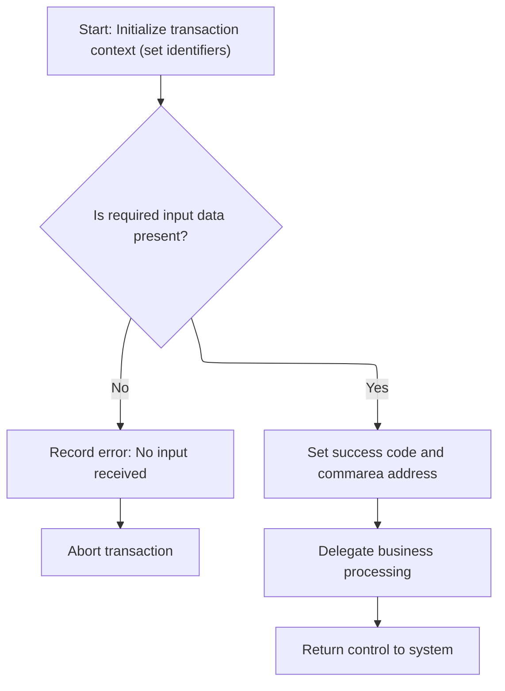
```mermaid
%%{init: {"flowchart": {"defaultRenderer": "elk"}} }%%
flowchart TD
    node1["Start: Initialize transaction context (set identifiers)"] --> node2{"Is required input data present?"}
    click node1 openCode "base/src/lgipol01.cbl:72:77"
    node2 -->|"No"| node3["Record error: No input received"]
    click node2 openCode "base/src/lgipol01.cbl:79:83"
    node3 --> node4["Abort transaction"]
    click node3 openCode "base/src/lgipol01.cbl:80:82"
    click node4 openCode "base/src/lgipol01.cbl:82:83"
    node2 -->|"Yes"| node5["Set success code and commarea address"]
    click node5 openCode "base/src/lgipol01.cbl:86:88"
    node5 --> node6["Delegate business processing"]
    click node6 openCode "base/src/lgipol01.cbl:91:94"
    node6 --> node7["Return control to system"]
    click node7 openCode "base/src/lgipol01.cbl:96:96"

classDef HeadingStyle fill:#777777,stroke:#333,stroke-width:2px;

%% Swimm:
%% %%{init: {"flowchart": {"defaultRenderer": "elk"}} }%%
%% flowchart TD
%%     node1["Start: Initialize transaction context (set identifiers)"] --> node2{"Is required input data present?"}
%%     click node1 openCode "<SwmPath>[base/src/lgipol01.cbl](base/src/lgipol01.cbl)</SwmPath>:72:77"
%%     node2 -->|"No"| node3["Record error: No input received"]
%%     click node2 openCode "<SwmPath>[base/src/lgipol01.cbl](base/src/lgipol01.cbl)</SwmPath>:79:83"
%%     node3 --> node4["Abort transaction"]
%%     click node3 openCode "<SwmPath>[base/src/lgipol01.cbl](base/src/lgipol01.cbl)</SwmPath>:80:82"
%%     click node4 openCode "<SwmPath>[base/src/lgipol01.cbl](base/src/lgipol01.cbl)</SwmPath>:82:83"
%%     node2 -->|"Yes"| node5["Set success code and commarea address"]
%%     click node5 openCode "<SwmPath>[base/src/lgipol01.cbl](base/src/lgipol01.cbl)</SwmPath>:86:88"
%%     node5 --> node6["Delegate business processing"]
%%     click node6 openCode "<SwmPath>[base/src/lgipol01.cbl](base/src/lgipol01.cbl)</SwmPath>:91:94"
%%     node6 --> node7["Return control to system"]
%%     click node7 openCode "<SwmPath>[base/src/lgipol01.cbl](base/src/lgipol01.cbl)</SwmPath>:96:96"
%% 
%% classDef HeadingStyle fill:#777777,stroke:#333,stroke-width:2px;
```

This section governs the initial handling of policy inquiry requests, ensuring that all required input data is present before proceeding, and managing error handling and transaction context setup.

| Category        | Rule Name                   | Description                                                                                                                                              |
| --------------- | --------------------------- | -------------------------------------------------------------------------------------------------------------------------------------------------------- |
| Data validation | Mandatory input enforcement | If the required input data (commarea) is not present in the request, the transaction must be aborted and an error message must be recorded.              |
| Business logic  | Success code initialization | When a valid input is received, the return code in the commarea must be set to '00' to indicate successful receipt and readiness for further processing. |
| Business logic  | Business logic delegation   | Upon successful validation, the system must delegate the business processing of the policy inquiry to the designated business logic handler program.     |

<SwmSnippet path="/base/src/lgipol01.cbl" line="70">

---

In <SwmToken path="base/src/lgipol01.cbl" pos="70:1:1" line-data="       MAINLINE SECTION.">`MAINLINE`</SwmToken> (<SwmToken path="base/src/lgtestp1.cbl" pos="72:10:10" line-data="                 EXEC CICS LINK PROGRAM(&#39;LGIPOL01&#39;)">`LGIPOL01`</SwmToken>), we validate the commarea, log errors if it's missing, and then call <SwmToken path="base/src/lgipol01.cbl" pos="91:9:9" line-data="           EXEC CICS LINK Program(LGIPDB01)">`LGIPDB01`</SwmToken> to actually fetch the policy details. The commarea is the main data carrier between all these steps.

```cobol
       MAINLINE SECTION.
      *
           INITIALIZE WS-HEADER.
      *
           MOVE EIBTRNID TO WS-TRANSID.
           MOVE EIBTRMID TO WS-TERMID.
           MOVE EIBTASKN TO WS-TASKNUM.
      *
      * If NO commarea received issue an ABEND
           IF EIBCALEN IS EQUAL TO ZERO
               MOVE ' NO COMMAREA RECEIVED' TO EM-VARIABLE
               PERFORM WRITE-ERROR-MESSAGE
               EXEC CICS ABEND ABCODE('LGCA') NODUMP END-EXEC
           END-IF

      * initialize commarea return code to zero
           MOVE '00' TO CA-RETURN-CODE
           MOVE EIBCALEN TO WS-CALEN.
           SET WS-ADDR-DFHCOMMAREA TO ADDRESS OF DFHCOMMAREA.
      *

           EXEC CICS LINK Program(LGIPDB01)
               Commarea(DFHCOMMAREA)
               Length(32500)
           END-EXEC.

           EXEC CICS RETURN END-EXEC.
```

---

</SwmSnippet>

## Logging Errors During Policy Inquiry

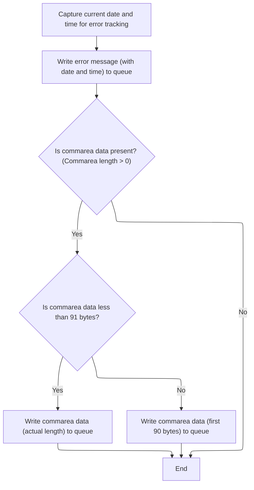
```mermaid
%%{init: {"flowchart": {"defaultRenderer": "elk"}} }%%
flowchart TD
    node1["Capture current date and time for error tracking"]
    click node1 openCode "base/src/lgipol01.cbl:110:117"
    node1 --> node2["Write error message (with date and time) to queue"]
    click node2 openCode "base/src/lgipol01.cbl:119:122"
    node2 --> node3{"Is commarea data present? (Commarea length > 0)"}
    click node3 openCode "base/src/lgipol01.cbl:124:138"
    node3 -->|"Yes"| node4{"Is commarea data less than 91 bytes?"}
    click node4 openCode "base/src/lgipol01.cbl:125:131"
    node3 -->|"No"| node7["End"]
    click node7 openCode "base/src/lgipol01.cbl:139:139"
    node4 -->|"Yes"| node5["Write commarea data (actual length) to queue"]
    click node5 openCode "base/src/lgipol01.cbl:126:130"
    node4 -->|"No"| node6["Write commarea data (first 90 bytes) to queue"]
    click node6 openCode "base/src/lgipol01.cbl:132:136"
    node5 --> node7
    node6 --> node7
classDef HeadingStyle fill:#777777,stroke:#333,stroke-width:2px;

%% Swimm:
%% %%{init: {"flowchart": {"defaultRenderer": "elk"}} }%%
%% flowchart TD
%%     node1["Capture current date and time for error tracking"]
%%     click node1 openCode "<SwmPath>[base/src/lgipol01.cbl](base/src/lgipol01.cbl)</SwmPath>:110:117"
%%     node1 --> node2["Write error message (with date and time) to queue"]
%%     click node2 openCode "<SwmPath>[base/src/lgipol01.cbl](base/src/lgipol01.cbl)</SwmPath>:119:122"
%%     node2 --> node3{"Is commarea data present? (Commarea length > 0)"}
%%     click node3 openCode "<SwmPath>[base/src/lgipol01.cbl](base/src/lgipol01.cbl)</SwmPath>:124:138"
%%     node3 -->|"Yes"| node4{"Is commarea data less than 91 bytes?"}
%%     click node4 openCode "<SwmPath>[base/src/lgipol01.cbl](base/src/lgipol01.cbl)</SwmPath>:125:131"
%%     node3 -->|"No"| node7["End"]
%%     click node7 openCode "<SwmPath>[base/src/lgipol01.cbl](base/src/lgipol01.cbl)</SwmPath>:139:139"
%%     node4 -->|"Yes"| node5["Write commarea data (actual length) to queue"]
%%     click node5 openCode "<SwmPath>[base/src/lgipol01.cbl](base/src/lgipol01.cbl)</SwmPath>:126:130"
%%     node4 -->|"No"| node6["Write commarea data (first 90 bytes) to queue"]
%%     click node6 openCode "<SwmPath>[base/src/lgipol01.cbl](base/src/lgipol01.cbl)</SwmPath>:132:136"
%%     node5 --> node7
%%     node6 --> node7
%% classDef HeadingStyle fill:#777777,stroke:#333,stroke-width:2px;
```

This section ensures that all errors encountered during policy inquiry are logged with precise timestamps and relevant context, including commarea data when available. This supports auditability, troubleshooting, and operational transparency.

| Category        | Rule Name                      | Description                                                                                                                                                                 |
| --------------- | ------------------------------ | --------------------------------------------------------------------------------------------------------------------------------------------------------------------------- |
| Data validation | Commarea data truncation       | If commarea data exceeds 90 bytes, only the first 90 bytes are logged to prevent overflow and maintain consistency in log entry size.                                       |
| Business logic  | Timestamped error logging      | Every error message logged must include the current date and time to ensure traceability.                                                                                   |
| Business logic  | Commarea data inclusion        | If commarea data is present, up to 90 bytes of the data must be included in the error log entry to provide additional context for troubleshooting.                          |
| Business logic  | Dual queue logging             | Error messages must be written to both the transient data queue (TDQ) and the temporary storage queue (TSQ) to ensure redundancy and availability for downstream processes. |
| Business logic  | Error-only logging             | If no commarea data is present, only the error message (with timestamp) is logged, without additional context.                                                              |
| Business logic  | Terminal notification on error | For received messages, a notification must be sent to the terminal to inform the user of the error event.                                                                   |

<SwmSnippet path="/base/src/lgipol01.cbl" line="107">

---

In <SwmToken path="base/src/lgipol01.cbl" pos="107:1:5" line-data="       WRITE-ERROR-MESSAGE.">`WRITE-ERROR-MESSAGE`</SwmToken>, we grab the current <SwmToken path="base/src/lgipol01.cbl" pos="35:7:9" line-data="      * Variables for time/date processing">`time/date`</SwmToken>, format it, and send the error details to LGSTSQ for logging. If there's extra data in the commarea, we send up to 90 bytes of that too, so nothing gets lost in the logs.

```cobol
       WRITE-ERROR-MESSAGE.
      * Save SQLCODE in message
      * Obtain and format current time and date
           EXEC CICS ASKTIME ABSTIME(ABS-TIME)
           END-EXEC
           EXEC CICS FORMATTIME ABSTIME(ABS-TIME)
                     MMDDYYYY(DATE1)
                     TIME(TIME1)
           END-EXEC
           MOVE DATE1 TO EM-DATE
           MOVE TIME1 TO EM-TIME
      * Write output message to TDQ
           EXEC CICS LINK PROGRAM('LGSTSQ')
                     COMMAREA(ERROR-MSG)
                     LENGTH(LENGTH OF ERROR-MSG)
           END-EXEC.
      * Write 90 bytes or as much as we have of commarea to TDQ
           IF EIBCALEN > 0 THEN
             IF EIBCALEN < 91 THEN
               MOVE DFHCOMMAREA(1:EIBCALEN) TO CA-DATA
               EXEC CICS LINK PROGRAM('LGSTSQ')
                         COMMAREA(CA-ERROR-MSG)
                         LENGTH(LENGTH OF CA-ERROR-MSG)
               END-EXEC
             ELSE
               MOVE DFHCOMMAREA(1:90) TO CA-DATA
               EXEC CICS LINK PROGRAM('LGSTSQ')
                         COMMAREA(CA-ERROR-MSG)
                         LENGTH(LENGTH OF CA-ERROR-MSG)
               END-EXEC
             END-IF
           END-IF.
           EXIT.
```

---

</SwmSnippet>

<SwmSnippet path="/base/src/lgstsq.cbl" line="55">

---

In <SwmToken path="base/src/lgstsq.cbl" pos="55:1:1" line-data="       MAINLINE SECTION.">`MAINLINE`</SwmToken> (LGSTSQ), we decide if the message is from a program or a received input, handle special 'Q=' prefixes, adjust message lengths, and write the message to both TDQ and TSQ. If it's a received message, we also send a notification to the terminal.

```cobol
       MAINLINE SECTION.

           MOVE SPACES TO WRITE-MSG.
           MOVE SPACES TO WS-RECV.

           EXEC CICS ASSIGN SYSID(WRITE-MSG-SYSID)
                RESP(WS-RESP)
           END-EXEC.

           EXEC CICS ASSIGN INVOKINGPROG(WS-INVOKEPROG)
                RESP(WS-RESP)
           END-EXEC.
           
           IF WS-INVOKEPROG NOT = SPACES
              MOVE 'C' To WS-FLAG
              MOVE COMMA-DATA  TO WRITE-MSG-MSG
              MOVE EIBCALEN    TO WS-RECV-LEN
           ELSE
              EXEC CICS RECEIVE INTO(WS-RECV)
                  LENGTH(WS-RECV-LEN)
                  RESP(WS-RESP)
              END-EXEC
              MOVE 'R' To WS-FLAG
              MOVE WS-RECV-DATA  TO WRITE-MSG-MSG
              SUBTRACT 5 FROM WS-RECV-LEN
           END-IF.

           MOVE 'GENAERRS' TO STSQ-NAME.
           IF WRITE-MSG-MSG(1:2) = 'Q=' THEN
              MOVE WRITE-MSG-MSG(3:4) TO STSQ-EXT
              MOVE WRITE-MSG-REST TO TEMPO
              MOVE TEMPO          TO WRITE-MSG-MSG
              SUBTRACT 7 FROM WS-RECV-LEN
           END-IF.

           ADD 5 TO WS-RECV-LEN.

      * Write output message to TDQ CSMT
      *
           EXEC CICS WRITEQ TD QUEUE(STDQ-NAME)
                     FROM(WRITE-MSG)
                     RESP(WS-RESP)
                     LENGTH(WS-RECV-LEN)

           END-EXEC.

      * Write output message to Genapp TSQ
      * If no space is available then the task will not wait for
      *  storage to become available but will ignore the request...
      *
           EXEC CICS WRITEQ TS QUEUE(STSQ-NAME)
                     FROM(WRITE-MSG)
                     RESP(WS-RESP)
                     NOSUSPEND
                     LENGTH(WS-RECV-LEN)

           END-EXEC.

           If WS-FLAG = 'R' Then
             EXEC CICS SEND TEXT FROM(FILLER-X)
              WAIT
              ERASE
              LENGTH(1)
              FREEKB
             END-EXEC.

           EXEC CICS RETURN
           END-EXEC.
```

---

</SwmSnippet>

## Fetching and Returning Detailed Policy Data


```mermaid
%%{init: {"flowchart": {"defaultRenderer": "elk"}} }%%
flowchart TD
    node1["Receive policy inquiry request"] --> node2{"Was request data received?"}
    click node1 openCode "base/src/lgipdb01.cbl:230:255"
    node2 -->|"No (EIBCALEN=0)"| node3["Write error message and return error code '99'"]
    click node2 openCode "base/src/lgipdb01.cbl:251:255"
    click node3 openCode "base/src/lgipdb01.cbl:252:254"
    node2 -->|"Yes"| node4{"Which policy type is requested?"}
    click node4 openCode "base/src/lgipdb01.cbl:277:310"
    node4 -->|"Endowment (01IEND)"| node5["Retrieve endowment policy data"]
    click node5 openCode "base/src/lgipdb01.cbl:327:432"
    node4 -->|"House (01IHOU)"| node6["Retrieve house policy data"]
    click node6 openCode "base/src/lgipdb01.cbl:441:523"
    node4 -->|"Motor (01IMOT)"| node7["Retrieve motor policy data"]
    click node7 openCode "base/src/lgipdb01.cbl:529:621"
    node4 -->|"Commercial (01ICOM, 02ICOM, 03ICOM, 05ICOM)"| node8["Retrieve commercial policy data"]
    click node8 openCode "base/src/lgipdb01.cbl:292:306"
    node4 -->|"Other"| node9["Set error code '99' and return to caller"]
    click node9 openCode "base/src/lgipdb01.cbl:308:309"
    node5 --> node10{"Was data retrieval successful?"}
    node6 --> node10
    node7 --> node10
    node8 --> node10
    node10 -->|"Yes (SQLCODE=0)"| node11{"Is response area large enough?"}
    node10 -->|"No rows found (SQLCODE=100)"| node12["Set error code '01' (invalid customer/policy) and return"]
    click node12 openCode "base/src/lgipdb01.cbl:421:424"
    node10 -->|"Other error"| node13["Set error code '90', write error message, and return"]
    click node13 openCode "base/src/lgipdb01.cbl:426:429"
    node11 -->|"No"| node14["Set error code '98' (response area too small) and return"]
    click node14 openCode "base/src/lgipdb01.cbl:391:392"
    node11 -->|"Yes"| node15["Return policy data to caller"]
    click node15 openCode "base/src/lgipdb01.cbl:394:417"
classDef HeadingStyle fill:#777777,stroke:#333,stroke-width:2px;

%% Swimm:
%% %%{init: {"flowchart": {"defaultRenderer": "elk"}} }%%
%% flowchart TD
%%     node1["Receive policy inquiry request"] --> node2{"Was request data received?"}
%%     click node1 openCode "<SwmPath>[base/src/lgipdb01.cbl](base/src/lgipdb01.cbl)</SwmPath>:230:255"
%%     node2 -->|"No (EIBCALEN=0)"| node3["Write error message and return error code '99'"]
%%     click node2 openCode "<SwmPath>[base/src/lgipdb01.cbl](base/src/lgipdb01.cbl)</SwmPath>:251:255"
%%     click node3 openCode "<SwmPath>[base/src/lgipdb01.cbl](base/src/lgipdb01.cbl)</SwmPath>:252:254"
%%     node2 -->|"Yes"| node4{"Which policy type is requested?"}
%%     click node4 openCode "<SwmPath>[base/src/lgipdb01.cbl](base/src/lgipdb01.cbl)</SwmPath>:277:310"
%%     node4 -->|"Endowment (<SwmToken path="base/src/lgipdb01.cbl" pos="279:4:4" line-data="             WHEN &#39;01IEND&#39;">`01IEND`</SwmToken>)"| node5["Retrieve endowment policy data"]
%%     click node5 openCode "<SwmPath>[base/src/lgipdb01.cbl](base/src/lgipdb01.cbl)</SwmPath>:327:432"
%%     node4 -->|"House (<SwmToken path="base/src/lgipdb01.cbl" pos="283:4:4" line-data="             WHEN &#39;01IHOU&#39;">`01IHOU`</SwmToken>)"| node6["Retrieve house policy data"]
%%     click node6 openCode "<SwmPath>[base/src/lgipdb01.cbl](base/src/lgipdb01.cbl)</SwmPath>:441:523"
%%     node4 -->|"Motor (<SwmToken path="base/src/lgtestp1.cbl" pos="69:4:4" line-data="                 Move &#39;01IMOT&#39;   To CA-REQUEST-ID">`01IMOT`</SwmToken>)"| node7["Retrieve motor policy data"]
%%     click node7 openCode "<SwmPath>[base/src/lgipdb01.cbl](base/src/lgipdb01.cbl)</SwmPath>:529:621"
%%     node4 -->|"Commercial (<SwmToken path="base/src/lgipdb01.cbl" pos="291:4:4" line-data="             WHEN &#39;01ICOM&#39;">`01ICOM`</SwmToken>, <SwmToken path="base/src/lgipdb01.cbl" pos="295:4:4" line-data="             WHEN &#39;02ICOM&#39;">`02ICOM`</SwmToken>, <SwmToken path="base/src/lgipdb01.cbl" pos="299:4:4" line-data="             WHEN &#39;03ICOM&#39;">`03ICOM`</SwmToken>, <SwmToken path="base/src/lgipdb01.cbl" pos="303:4:4" line-data="             WHEN &#39;05ICOM&#39;">`05ICOM`</SwmToken>)"| node8["Retrieve commercial policy data"]
%%     click node8 openCode "<SwmPath>[base/src/lgipdb01.cbl](base/src/lgipdb01.cbl)</SwmPath>:292:306"
%%     node4 -->|"Other"| node9["Set error code '99' and return to caller"]
%%     click node9 openCode "<SwmPath>[base/src/lgipdb01.cbl](base/src/lgipdb01.cbl)</SwmPath>:308:309"
%%     node5 --> node10{"Was data retrieval successful?"}
%%     node6 --> node10
%%     node7 --> node10
%%     node8 --> node10
%%     node10 -->|"Yes (SQLCODE=0)"| node11{"Is response area large enough?"}
%%     node10 -->|"No rows found (SQLCODE=100)"| node12["Set error code '01' (invalid customer/policy) and return"]
%%     click node12 openCode "<SwmPath>[base/src/lgipdb01.cbl](base/src/lgipdb01.cbl)</SwmPath>:421:424"
%%     node10 -->|"Other error"| node13["Set error code '90', write error message, and return"]
%%     click node13 openCode "<SwmPath>[base/src/lgipdb01.cbl](base/src/lgipdb01.cbl)</SwmPath>:426:429"
%%     node11 -->|"No"| node14["Set error code '98' (response area too small) and return"]
%%     click node14 openCode "<SwmPath>[base/src/lgipdb01.cbl](base/src/lgipdb01.cbl)</SwmPath>:391:392"
%%     node11 -->|"Yes"| node15["Return policy data to caller"]
%%     click node15 openCode "<SwmPath>[base/src/lgipdb01.cbl](base/src/lgipdb01.cbl)</SwmPath>:394:417"
%% classDef HeadingStyle fill:#777777,stroke:#333,stroke-width:2px;
```

This section is responsible for fetching detailed policy data based on a request, validating the input, determining the correct policy type, retrieving the relevant data from <SwmToken path="base/src/lgipdb01.cbl" pos="242:5:5" line-data="      * initialize DB2 host variables">`DB2`</SwmToken>, and returning the results or appropriate error codes to the caller. It ensures that only valid requests are processed and that all error scenarios are handled with clear return codes and logging.

| Category       | Rule Name                  | Description                                                                                                                                                                                                                                                                                                                                                                                                                                                                                                                                                                                                                                                                                                                                                                                                                                                                                                                                                                                                                                                                   |
| -------------- | -------------------------- | ----------------------------------------------------------------------------------------------------------------------------------------------------------------------------------------------------------------------------------------------------------------------------------------------------------------------------------------------------------------------------------------------------------------------------------------------------------------------------------------------------------------------------------------------------------------------------------------------------------------------------------------------------------------------------------------------------------------------------------------------------------------------------------------------------------------------------------------------------------------------------------------------------------------------------------------------------------------------------------------------------------------------------------------------------------------------------- |
| Business logic | Supported policy types     | The system must support fetching data for the following policy types: Endowment (<SwmToken path="base/src/lgipdb01.cbl" pos="279:4:4" line-data="             WHEN &#39;01IEND&#39;">`01IEND`</SwmToken>), House (<SwmToken path="base/src/lgipdb01.cbl" pos="283:4:4" line-data="             WHEN &#39;01IHOU&#39;">`01IHOU`</SwmToken>), Motor (<SwmToken path="base/src/lgtestp1.cbl" pos="69:4:4" line-data="                 Move &#39;01IMOT&#39;   To CA-REQUEST-ID">`01IMOT`</SwmToken>), and Commercial (<SwmToken path="base/src/lgipdb01.cbl" pos="291:4:4" line-data="             WHEN &#39;01ICOM&#39;">`01ICOM`</SwmToken>, <SwmToken path="base/src/lgipdb01.cbl" pos="295:4:4" line-data="             WHEN &#39;02ICOM&#39;">`02ICOM`</SwmToken>, <SwmToken path="base/src/lgipdb01.cbl" pos="299:4:4" line-data="             WHEN &#39;03ICOM&#39;">`03ICOM`</SwmToken>, <SwmToken path="base/src/lgipdb01.cbl" pos="303:4:4" line-data="             WHEN &#39;05ICOM&#39;">`05ICOM`</SwmToken>). Any other policy type must result in error code '99'. |
| Business logic | Policy data retrieval      | For each supported policy type, the system must retrieve all relevant policy details from <SwmToken path="base/src/lgipdb01.cbl" pos="242:5:5" line-data="      * initialize DB2 host variables">`DB2`</SwmToken> and populate the commarea with the results, provided the response area is large enough.                                                                                                                                                                                                                                                                                                                                                                                                                                                                                                                                                                                                                                                                                                                                                                     |
| Business logic | Invalid customer or policy | If no rows are found for the requested customer and policy number, the system must set error code '01' to indicate an invalid customer or policy and return.                                                                                                                                                                                                                                                                                                                                                                                                                                                                                                                                                                                                                                                                                                                                                                                                                                                                                                                  |

<SwmSnippet path="/base/src/lgipdb01.cbl" line="230">

---

In <SwmToken path="base/src/lgipdb01.cbl" pos="230:1:1" line-data="       MAINLINE SECTION.">`MAINLINE`</SwmToken> (<SwmToken path="base/src/lgipol01.cbl" pos="91:9:9" line-data="           EXEC CICS LINK Program(LGIPDB01)">`LGIPDB01`</SwmToken>), we check the commarea, convert input fields, and branch on the request ID to call the right <SwmToken path="base/src/lgipdb01.cbl" pos="242:5:5" line-data="      * initialize DB2 host variables">`DB2`</SwmToken> info routine for the policy type. This centralizes all policy data fetch logic.

```cobol
       MAINLINE SECTION.

      *----------------------------------------------------------------*
      * Common code                                                    *
      *----------------------------------------------------------------*
      * initialize working storage variables
           INITIALIZE WS-HEADER.
      * set up general variable
           MOVE EIBTRNID TO WS-TRANSID.
           MOVE EIBTRMID TO WS-TERMID.
           MOVE EIBTASKN TO WS-TASKNUM.
      *----------------------------------------------------------------*
      * initialize DB2 host variables
           INITIALIZE DB2-IN-INTEGERS.
           INITIALIZE DB2-OUT-INTEGERS.
           INITIALIZE DB2-POLICY.

      *---------------------------------------------------------------*
      * Check commarea and obtain required details                    *
      *---------------------------------------------------------------*
      * If NO commarea received issue an ABEND
           IF EIBCALEN IS EQUAL TO ZERO
             MOVE ' NO COMMAREA RECEIVED' TO EM-VARIABLE
             PERFORM WRITE-ERROR-MESSAGE
             EXEC CICS ABEND ABCODE('LGCA') NODUMP END-EXEC
           END-IF

      * initialize commarea return code to zero
           MOVE '00' TO CA-RETURN-CODE
           MOVE EIBCALEN TO WS-CALEN
           SET WS-ADDR-DFHCOMMAREA TO ADDRESS OF DFHCOMMAREA

      * Convert commarea customer & policy nums to DB2 integer format
           MOVE CA-CUSTOMER-NUM TO DB2-CUSTOMERNUM-INT
           MOVE CA-POLICY-NUM   TO DB2-POLICYNUM-INT
      * and save in error msg field incase required
           MOVE CA-CUSTOMER-NUM TO EM-CUSNUM
           MOVE CA-POLICY-NUM   TO EM-POLNUM

      *----------------------------------------------------------------*
      * Check which policy type is being requested                     *
      * This is not actually required whilst only endowment policy     *
      * inquires are supported, but will make future expansion simpler *
      *----------------------------------------------------------------*
      * Upper case value passed in Request Id field                    *
           MOVE FUNCTION UPPER-CASE(CA-REQUEST-ID) TO WS-REQUEST-ID

           EVALUATE WS-REQUEST-ID

             WHEN '01IEND'
               INITIALIZE DB2-ENDOWMENT
               PERFORM GET-ENDOW-DB2-INFO

             WHEN '01IHOU'
               INITIALIZE DB2-HOUSE
               PERFORM GET-HOUSE-DB2-INFO

             WHEN '01IMOT'
               INITIALIZE DB2-MOTOR
               PERFORM GET-MOTOR-DB2-INFO

             WHEN '01ICOM'
               INITIALIZE DB2-COMMERCIAL
               PERFORM GET-COMMERCIAL-DB2-INFO-1

             WHEN '02ICOM'
               INITIALIZE DB2-COMMERCIAL
               PERFORM GET-COMMERCIAL-DB2-INFO-2

             WHEN '03ICOM'
               INITIALIZE DB2-COMMERCIAL
               PERFORM GET-COMMERCIAL-DB2-INFO-3

             WHEN '05ICOM'
               INITIALIZE DB2-COMMERCIAL
               PERFORM GET-COMMERCIAL-DB2-INFO-5

             WHEN OTHER
               MOVE '99' TO CA-RETURN-CODE

           END-EVALUATE.
```

---

</SwmSnippet>

<SwmSnippet path="/base/src/lgipdb01.cbl" line="997">

---

In <SwmToken path="base/src/lgipdb01.cbl" pos="997:1:5" line-data="       WRITE-ERROR-MESSAGE.">`WRITE-ERROR-MESSAGE`</SwmToken> (<SwmToken path="base/src/lgipol01.cbl" pos="91:9:9" line-data="           EXEC CICS LINK Program(LGIPDB01)">`LGIPDB01`</SwmToken>), we log the SQL error code, timestamp the error, and send both the error message and up to 90 bytes of commarea to LGSTSQ for system logging. This makes sure all error details are captured for diagnostics.

```cobol
       WRITE-ERROR-MESSAGE.
      * Save SQLCODE in message
           MOVE SQLCODE TO EM-SQLRC
      * Obtain and format current time and date
           EXEC CICS ASKTIME ABSTIME(ABS-TIME)
           END-EXEC
           EXEC CICS FORMATTIME ABSTIME(ABS-TIME)
                     MMDDYYYY(DATE1)
                     TIME(TIME1)
           END-EXEC
           MOVE DATE1 TO EM-DATE
           MOVE TIME1 TO EM-TIME
      * Write output message to TDQ
           EXEC CICS LINK PROGRAM('LGSTSQ')
                     COMMAREA(ERROR-MSG)
                     LENGTH(LENGTH OF ERROR-MSG)
           END-EXEC.
      * Write 90 bytes or as much as we have of commarea to TDQ
           IF EIBCALEN > 0 THEN
             IF EIBCALEN < 91 THEN
               MOVE DFHCOMMAREA(1:EIBCALEN) TO CA-DATA
               EXEC CICS LINK PROGRAM('LGSTSQ')
                         COMMAREA(CA-ERROR-MSG)
                         LENGTH(LENGTH OF CA-ERROR-MSG)
               END-EXEC
             ELSE
               MOVE DFHCOMMAREA(1:90) TO CA-DATA
               EXEC CICS LINK PROGRAM('LGSTSQ')
                         COMMAREA(CA-ERROR-MSG)
                         LENGTH(LENGTH OF CA-ERROR-MSG)
               END-EXEC
             END-IF
           END-IF.
           EXIT.
```

---

</SwmSnippet>

<SwmSnippet path="/base/src/lgipdb01.cbl" line="327">

---

In <SwmToken path="base/src/lgipdb01.cbl" pos="327:1:7" line-data="       GET-ENDOW-DB2-INFO.">`GET-ENDOW-DB2-INFO`</SwmToken>, we fetch all endowment policy details from <SwmToken path="base/src/lgipdb01.cbl" pos="327:5:5" line-data="       GET-ENDOW-DB2-INFO.">`DB2`</SwmToken>, check if the commarea can hold the data, and move everything over if it fits. If not, we set an error code and bail out. We also mark the end of the returned data with 'FINAL'.

```cobol
       GET-ENDOW-DB2-INFO.

           MOVE ' SELECT ENDOW ' TO EM-SQLREQ
           EXEC SQL
             SELECT  ISSUEDATE,
                     EXPIRYDATE,
                     LASTCHANGED,
                     BROKERID,
                     BROKERSREFERENCE,
                     PAYMENT,
                     WITHPROFITS,
                     EQUITIES,
                     MANAGEDFUND,
                     FUNDNAME,
                     TERM,
                     SUMASSURED,
                     LIFEASSURED,
                     PADDINGDATA,
                     LENGTH(PADDINGDATA)
             INTO  :DB2-ISSUEDATE,
                   :DB2-EXPIRYDATE,
                   :DB2-LASTCHANGED,
                   :DB2-BROKERID-INT INDICATOR :IND-BROKERID,
                   :DB2-BROKERSREF INDICATOR :IND-BROKERSREF,
                   :DB2-PAYMENT-INT INDICATOR :IND-PAYMENT,
                   :DB2-E-WITHPROFITS,
                   :DB2-E-EQUITIES,
                   :DB2-E-MANAGEDFUND,
                   :DB2-E-FUNDNAME,
                   :DB2-E-TERM-SINT,
                   :DB2-E-SUMASSURED-INT,
                   :DB2-E-LIFEASSURED,
                   :DB2-E-PADDINGDATA INDICATOR :IND-E-PADDINGDATA,
                   :DB2-E-PADDING-LEN INDICATOR :IND-E-PADDINGDATAL
             FROM  POLICY,ENDOWMENT
             WHERE ( POLICY.POLICYNUMBER =
                        ENDOWMENT.POLICYNUMBER   AND
                     POLICY.CUSTOMERNUMBER =
                        :DB2-CUSTOMERNUM-INT             AND
                     POLICY.POLICYNUMBER =
                        :DB2-POLICYNUM-INT               )
           END-EXEC

           IF SQLCODE = 0
      *      Select was successful

      *      Calculate size of commarea required to return all data
             ADD WS-CA-HEADERTRAILER-LEN TO WS-REQUIRED-CA-LEN
             ADD WS-FULL-ENDOW-LEN       TO WS-REQUIRED-CA-LEN

      *----------------------------------------------------------------*
      *      Specific code to allow for length of VACHAR data
      *      check whether PADDINGDATA field is non-null
      *        and calculate length of endowment policy
      *        and position of free space in commarea after policy data
      *----------------------------------------------------------------*
             IF IND-E-PADDINGDATAL NOT EQUAL MINUS-ONE
               ADD DB2-E-PADDING-LEN TO WS-REQUIRED-CA-LEN
               ADD DB2-E-PADDING-LEN TO END-POLICY-POS
             END-IF

      *      if commarea received is not large enough ...
      *        set error return code and return to caller
             IF EIBCALEN IS LESS THAN WS-REQUIRED-CA-LEN
               MOVE '98' TO CA-RETURN-CODE
               EXEC CICS RETURN END-EXEC
             ELSE
      *        Length is sufficent so move data to commarea
      *        Move Integer fields to required length numerics
      *        Don't move null fields
               IF IND-BROKERID NOT EQUAL MINUS-ONE
                 MOVE DB2-BROKERID-INT    TO DB2-BROKERID
               END-IF
               IF IND-PAYMENT NOT EQUAL MINUS-ONE
                 MOVE DB2-PAYMENT-INT TO DB2-PAYMENT
               END-IF
      *----------------------------------------------------------------*
               MOVE DB2-E-TERM-SINT       TO DB2-E-TERM
               MOVE DB2-E-SUMASSURED-INT  TO DB2-E-SUMASSURED

               MOVE DB2-POLICY-COMMON     TO CA-POLICY-COMMON
               MOVE DB2-ENDOW-FIXED
                   TO CA-ENDOWMENT(1:WS-ENDOW-LEN)
               IF IND-E-PADDINGDATA NOT EQUAL MINUS-ONE
                 MOVE DB2-E-PADDINGDATA TO
                     CA-E-PADDING-DATA(1:DB2-E-PADDING-LEN)
               END-IF
             END-IF

      *      Mark the end of the policy data
             MOVE 'FINAL' TO CA-E-PADDING-DATA(END-POLICY-POS:5)

           ELSE
      *      Non-zero SQLCODE from first SQL FETCH statement
             IF SQLCODE EQUAL 100
      *        No rows found - invalid customer / policy number
               MOVE '01' TO CA-RETURN-CODE
             ELSE
      *        something has gone wrong
               MOVE '90' TO CA-RETURN-CODE
      *        Write error message to TD QUEUE(CSMT)
               PERFORM WRITE-ERROR-MESSAGE
             END-IF

           END-IF.
           EXIT.
```

---

</SwmSnippet>

<SwmSnippet path="/base/src/lgipdb01.cbl" line="441">

---

In <SwmToken path="base/src/lgipdb01.cbl" pos="441:1:7" line-data="       GET-HOUSE-DB2-INFO.">`GET-HOUSE-DB2-INFO`</SwmToken>, we fetch house policy details, check for nulls before moving <SwmToken path="base/src/lgipdb01.cbl" pos="441:5:5" line-data="       GET-HOUSE-DB2-INFO.">`DB2`</SwmToken> integer fields, validate the commarea size, and mark the end of the returned data. If anything's off, we set error codes or log errors.

```cobol
       GET-HOUSE-DB2-INFO.

           MOVE ' SELECT HOUSE ' TO EM-SQLREQ
           EXEC SQL
             SELECT  ISSUEDATE,
                     EXPIRYDATE,
                     LASTCHANGED,
                     BROKERID,
                     BROKERSREFERENCE,
                     PAYMENT,
                     PROPERTYTYPE,
                     BEDROOMS,
                     VALUE,
                     HOUSENAME,
                     HOUSENUMBER,
                     POSTCODE
             INTO  :DB2-ISSUEDATE,
                   :DB2-EXPIRYDATE,
                   :DB2-LASTCHANGED,
                   :DB2-BROKERID-INT INDICATOR :IND-BROKERID,
                   :DB2-BROKERSREF INDICATOR :IND-BROKERSREF,
                   :DB2-PAYMENT-INT INDICATOR :IND-PAYMENT,
                   :DB2-H-PROPERTYTYPE,
                   :DB2-H-BEDROOMS-SINT,
                   :DB2-H-VALUE-INT,
                   :DB2-H-HOUSENAME,
                   :DB2-H-HOUSENUMBER,
                   :DB2-H-POSTCODE
             FROM  POLICY,HOUSE
             WHERE ( POLICY.POLICYNUMBER =
                        HOUSE.POLICYNUMBER   AND
                     POLICY.CUSTOMERNUMBER =
                        :DB2-CUSTOMERNUM-INT             AND
                     POLICY.POLICYNUMBER =
                        :DB2-POLICYNUM-INT               )
           END-EXEC

           IF SQLCODE = 0
      *      Select was successful

      *      Calculate size of commarea required to return all data
             ADD WS-CA-HEADERTRAILER-LEN TO WS-REQUIRED-CA-LEN
             ADD WS-FULL-HOUSE-LEN       TO WS-REQUIRED-CA-LEN

      *      if commarea received is not large enough ...
      *        set error return code and return to caller
             IF EIBCALEN IS LESS THAN WS-REQUIRED-CA-LEN
               MOVE '98' TO CA-RETURN-CODE
               EXEC CICS RETURN END-EXEC
             ELSE
      *        Length is sufficent so move data to commarea
      *        Move Integer fields to required length numerics
      *        Don't move null fields
               IF IND-BROKERID NOT EQUAL MINUS-ONE
                 MOVE DB2-BROKERID-INT  TO DB2-BROKERID
               END-IF
               IF IND-PAYMENT NOT EQUAL MINUS-ONE
                 MOVE DB2-PAYMENT-INT TO DB2-PAYMENT
               END-IF
               MOVE DB2-H-BEDROOMS-SINT TO DB2-H-BEDROOMS
               MOVE DB2-H-VALUE-INT     TO DB2-H-VALUE

               MOVE DB2-POLICY-COMMON   TO CA-POLICY-COMMON
               MOVE DB2-HOUSE           TO CA-HOUSE(1:WS-HOUSE-LEN)
             END-IF

      *      Mark the end of the policy data
             MOVE 'FINAL' TO CA-H-FILLER(1:5)

           ELSE
      *      Non-zero SQLCODE from first SQL FETCH statement
             IF SQLCODE EQUAL 100
      *        No rows found - invalid customer / policy number
               MOVE '01' TO CA-RETURN-CODE
             ELSE
      *        something has gone wrong
               MOVE '90' TO CA-RETURN-CODE
      *        Write error message to TD QUEUE(CSMT)
               PERFORM WRITE-ERROR-MESSAGE
             END-IF

           END-IF.
           EXIT.
```

---

</SwmSnippet>

<SwmSnippet path="/base/src/lgipdb01.cbl" line="529">

---

In <SwmToken path="base/src/lgipdb01.cbl" pos="529:1:7" line-data="       GET-MOTOR-DB2-INFO.">`GET-MOTOR-DB2-INFO`</SwmToken>, we fetch motor policy details, convert <SwmToken path="base/src/lgipdb01.cbl" pos="529:5:5" line-data="       GET-MOTOR-DB2-INFO.">`DB2`</SwmToken> integers, check for nulls, validate the commarea size, and use return codes to signal errors. We also mark the end of the data with 'FINAL'.

```cobol
       GET-MOTOR-DB2-INFO.

           MOVE ' SELECT MOTOR ' TO EM-SQLREQ
           EXEC SQL
             SELECT  ISSUEDATE,
                     EXPIRYDATE,
                     LASTCHANGED,
                     BROKERID,
                     BROKERSREFERENCE,
                     PAYMENT,
                     MAKE,
                     MODEL,
                     VALUE,
                     REGNUMBER,
                     COLOUR,
                     CC,
                     YEAROFMANUFACTURE,
                     PREMIUM,
                     ACCIDENTS
             INTO  :DB2-ISSUEDATE,
                   :DB2-EXPIRYDATE,
                   :DB2-LASTCHANGED,
                   :DB2-BROKERID-INT INDICATOR :IND-BROKERID,
                   :DB2-BROKERSREF INDICATOR :IND-BROKERSREF,
                   :DB2-PAYMENT-INT INDICATOR :IND-PAYMENT,
                   :DB2-M-MAKE,
                   :DB2-M-MODEL,
                   :DB2-M-VALUE-INT,
                   :DB2-M-REGNUMBER,
                   :DB2-M-COLOUR,
                   :DB2-M-CC-SINT,
                   :DB2-M-MANUFACTURED,
                   :DB2-M-PREMIUM-INT,
                   :DB2-M-ACCIDENTS-INT
             FROM  POLICY,MOTOR
             WHERE ( POLICY.POLICYNUMBER =
                        MOTOR.POLICYNUMBER   AND
                     POLICY.CUSTOMERNUMBER =
                        :DB2-CUSTOMERNUM-INT             AND
                     POLICY.POLICYNUMBER =
                        :DB2-POLICYNUM-INT               )
           END-EXEC

           IF SQLCODE = 0
      *      Select was successful

      *      Calculate size of commarea required to return all data
             ADD WS-CA-HEADERTRAILER-LEN TO WS-REQUIRED-CA-LEN
             ADD WS-FULL-MOTOR-LEN       TO WS-REQUIRED-CA-LEN

      *      if commarea received is not large enough ...
      *        set error return code and return to caller
             IF EIBCALEN IS LESS THAN WS-REQUIRED-CA-LEN
               MOVE '98' TO CA-RETURN-CODE
               EXEC CICS RETURN END-EXEC
             ELSE
      *        Length is sufficent so move data to commarea
      *        Move Integer fields to required length numerics
      *        Don't move null fields
               IF IND-BROKERID NOT EQUAL MINUS-ONE
                 MOVE DB2-BROKERID-INT TO DB2-BROKERID
               END-IF
               IF IND-PAYMENT NOT EQUAL MINUS-ONE
                 MOVE DB2-PAYMENT-INT    TO DB2-PAYMENT
               END-IF
               MOVE DB2-M-CC-SINT      TO DB2-M-CC
               MOVE DB2-M-VALUE-INT    TO DB2-M-VALUE
               MOVE DB2-M-PREMIUM-INT  TO DB2-M-PREMIUM
               MOVE DB2-M-ACCIDENTS-INT TO DB2-M-ACCIDENTS
               MOVE DB2-M-PREMIUM-INT  TO CA-M-PREMIUM
               MOVE DB2-M-ACCIDENTS-INT TO CA-M-ACCIDENTS

               MOVE DB2-POLICY-COMMON  TO CA-POLICY-COMMON
               MOVE DB2-MOTOR          TO CA-MOTOR(1:WS-MOTOR-LEN)
             END-IF

      *      Mark the end of the policy data
             MOVE 'FINAL' TO CA-M-FILLER(1:5)

           ELSE
      *      Non-zero SQLCODE from first SQL FETCH statement
             IF SQLCODE EQUAL 100
      *        No rows found - invalid customer / policy number
               MOVE '01' TO CA-RETURN-CODE
             ELSE
      *        something has gone wrong
               MOVE '90' TO CA-RETURN-CODE
      *        Write error message to TD QUEUE(CSMT)
               PERFORM WRITE-ERROR-MESSAGE
             END-IF

           END-IF.
           EXIT.
```

---

</SwmSnippet>

## Handling No Data Returned from Policy Inquiry

<SwmSnippet path="/base/src/lgtestp1.cbl" line="76">

---

Back in <SwmToken path="base/src/lgtestp1.cbl" pos="33:5:7" line-data="              GO TO A-GAIN.">`A-GAIN`</SwmToken>, after returning from <SwmToken path="base/src/lgtestp1.cbl" pos="72:10:10" line-data="                 EXEC CICS LINK PROGRAM(&#39;LGIPOL01&#39;)">`LGIPOL01`</SwmToken>, we check the return code. If it's non-zero, we jump to <SwmToken path="base/src/lgtestp1.cbl" pos="77:5:7" line-data="                   GO TO NO-DATA">`NO-DATA`</SwmToken> to show the user that no motor policy data was found.

```cobol
                 IF CA-RETURN-CODE > 0
                   GO TO NO-DATA
                 END-IF
```

---

</SwmSnippet>

## Displaying No Data Message to User

This section ensures that users are informed when no data is available, providing clear feedback and gracefully ending the session.

| Category       | Rule Name                | Description                                                                                          |
| -------------- | ------------------------ | ---------------------------------------------------------------------------------------------------- |
| Business logic | No Data Feedback Message | If no data is available to display, the user must be shown a message stating 'No data was returned.' |
| Business logic | Session End on No Data   | When no data is available, the session must end and the user must be returned to the menu screen.    |

<SwmSnippet path="/base/src/lgtestp1.cbl" line="304">

---

In <SwmToken path="base/src/lgtestp1.cbl" pos="304:1:3" line-data="       NO-DATA.">`NO-DATA`</SwmToken>, we set the feedback message to 'No data was returned.' and jump to <SwmToken path="base/src/lgtestp1.cbl" pos="306:5:7" line-data="           Go To ERROR-OUT.">`ERROR-OUT`</SwmToken> to show the menu screen and end the session.

```cobol
       NO-DATA.
           Move 'No data was returned.'            To  ERP1FLDO
           Go To ERROR-OUT.
```

---

</SwmSnippet>

## Ending the Motor Policy Menu Session

This section governs how the motor policy menu session is ended, ensuring the user sees the final state and that all session data is properly reset before returning control to the main system.

| Category       | Rule Name                 | Description                                                                                                                                       |
| -------------- | ------------------------- | ------------------------------------------------------------------------------------------------------------------------------------------------- |
| Business logic | Display final policy menu | The motor policy menu screen must always be displayed to the user before ending the session, showing the final state of their policy information. |

<SwmSnippet path="/base/src/lgtestp1.cbl" line="308">

---

In <SwmToken path="base/src/lgtestp1.cbl" pos="308:1:3" line-data="       ERROR-OUT.">`ERROR-OUT`</SwmToken>, we send the motor policy menu screen to the user using the <SwmToken path="base/src/lgtestp1.cbl" pos="309:11:11" line-data="           EXEC CICS SEND MAP (&#39;SSMAPP1&#39;)">`SSMAPP1`</SwmToken> map and SSMAP mapset, showing the final state before ending the session.

```cobol
       ERROR-OUT.
           EXEC CICS SEND MAP ('SSMAPP1')
                     FROM(SSMAPP1O)
                     MAPSET ('SSMAP')
           END-EXEC.
```

---

</SwmSnippet>

<SwmSnippet path="/base/src/lgtestp1.cbl" line="314">

---

After sending the screen, we reinitialize all input/output and commarea data, then jump to <SwmToken path="base/src/lgtestp1.cbl" pos="318:5:7" line-data="           GO TO ENDIT-STARTIT.">`ENDIT-STARTIT`</SwmToken> to end the session and return control to CICS.

```cobol
           Initialize SSMAPP1I.
           Initialize SSMAPP1O.
           Initialize COMM-AREA.

           GO TO ENDIT-STARTIT.
```

---

</SwmSnippet>

## Populating Menu Fields with Policy Data

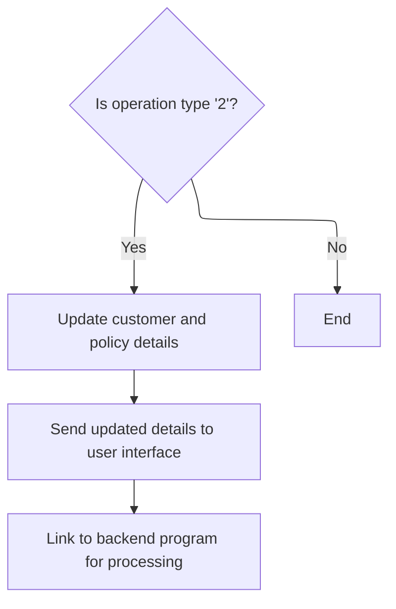
```mermaid
%%{init: {"flowchart": {"defaultRenderer": "elk"}} }%%
flowchart TD
    node1{"Is operation type '2'?"}
    click node1 openCode "base/src/lgtestp1.cbl:97:97"
    node1 -->|"Yes"| node2["Update customer and policy details"]
    click node2 openCode "base/src/lgtestp1.cbl:98:113"
    node2 --> node3["Send updated details to user interface"]
    click node3 openCode "base/src/lgtestp1.cbl:91:94"
    node3 --> node4["Link to backend program for processing"]
    click node4 openCode "base/src/lgtestp1.cbl:115:118"
    node1 -->|"No"| node5["End"]
    click node5 openCode "base/src/lgtestp1.cbl:97:97"

classDef HeadingStyle fill:#777777,stroke:#333,stroke-width:2px;

%% Swimm:
%% %%{init: {"flowchart": {"defaultRenderer": "elk"}} }%%
%% flowchart TD
%%     node1{"Is operation type '2'?"}
%%     click node1 openCode "<SwmPath>[base/src/lgtestp1.cbl](base/src/lgtestp1.cbl)</SwmPath>:97:97"
%%     node1 -->|"Yes"| node2["Update customer and policy details"]
%%     click node2 openCode "<SwmPath>[base/src/lgtestp1.cbl](base/src/lgtestp1.cbl)</SwmPath>:98:113"
%%     node2 --> node3["Send updated details to user interface"]
%%     click node3 openCode "<SwmPath>[base/src/lgtestp1.cbl](base/src/lgtestp1.cbl)</SwmPath>:91:94"
%%     node3 --> node4["Link to backend program for processing"]
%%     click node4 openCode "<SwmPath>[base/src/lgtestp1.cbl](base/src/lgtestp1.cbl)</SwmPath>:115:118"
%%     node1 -->|"No"| node5["End"]
%%     click node5 openCode "<SwmPath>[base/src/lgtestp1.cbl](base/src/lgtestp1.cbl)</SwmPath>:97:97"
%% 
%% classDef HeadingStyle fill:#777777,stroke:#333,stroke-width:2px;
```

<SwmSnippet path="/base/src/lgtestp1.cbl" line="80">

---

Back in <SwmToken path="base/src/lgtestp1.cbl" pos="33:5:7" line-data="              GO TO A-GAIN.">`A-GAIN`</SwmToken>, after returning from <SwmToken path="base/src/lgtestp1.cbl" pos="77:5:7" line-data="                   GO TO NO-DATA">`NO-DATA`</SwmToken>, we move all the motor policy details from the commarea to the screen fields so the user sees the latest data.

```cobol
                 Move CA-ISSUE-DATE     To  ENP1IDAI
                 Move CA-EXPIRY-DATE    To  ENP1EDAI
                 Move CA-M-MAKE         To  ENP1CMKI
                 Move CA-M-MODEL        To  ENP1CMOI
                 Move CA-M-VALUE        To  ENP1VALI
                 Move CA-M-REGNUMBER    To  ENP1REGI
                 Move CA-M-COLOUR       To  ENP1COLI
                 Move CA-M-CC           To  ENP1CCI
                 Move CA-M-MANUFACTURED To  ENP1MANI
                 Move CA-M-PREMIUM      To  ENP1PREI
                 Move CA-M-ACCIDENTS    To  ENP1ACCI
```

---

</SwmSnippet>

<SwmSnippet path="/base/src/lgtestp1.cbl" line="91">

---

After updating the menu fields, we send the updated screen to the user so they see the new policy details.

```cobol
                 EXEC CICS SEND MAP ('SSMAPP1')
                           FROM(SSMAPP1O)
                           MAPSET ('SSMAP')
                 END-EXEC
```

---

</SwmSnippet>

<SwmSnippet path="/base/src/lgtestp1.cbl" line="97">

---

Here we prep all the commarea fields for an add request, moving the user input to the right places before calling the backend add logic.

```cobol
             WHEN '2'
                 Move '01AMOT'          To CA-REQUEST-ID
                 Move ENP1CNOI          To CA-CUSTOMER-NUM
                 Move 0                 To CA-PAYMENT
                 Move 0                 To CA-BROKERID
                 Move '        '        To CA-BROKERSREF
                 Move ENP1IDAI          To CA-ISSUE-DATE
                 Move ENP1EDAI          To CA-EXPIRY-DATE
                 Move ENP1CMKI          To CA-M-MAKE
                 Move ENP1CMOI          To CA-M-MODEL
                 Move ENP1VALI          To CA-M-VALUE
                 Move ENP1REGI          To CA-M-REGNUMBER
                 Move ENP1COLI          To CA-M-COLOUR
                 Move ENP1CCI           To CA-M-CC
                 Move ENP1MANI          To CA-M-MANUFACTURED
                 Move ENP1PREI          To CA-M-PREMIUM
                 Move ENP1ACCI          To CA-M-ACCIDENTS
```

---

</SwmSnippet>

<SwmSnippet path="/base/src/lgtestp1.cbl" line="115">

---

After prepping the add request, we call <SwmToken path="base/src/lgtestp1.cbl" pos="115:10:10" line-data="                 EXEC CICS LINK PROGRAM(&#39;LGAPOL01&#39;)">`LGAPOL01`</SwmToken> to process the new motor policy, passing all the data in the commarea for backend validation and calculation.

```cobol
                 EXEC CICS LINK PROGRAM('LGAPOL01')
                           COMMAREA(COMM-AREA)
                           LENGTH(32500)
                 END-EXEC
```

---

</SwmSnippet>

## Validating and Processing Policy Add Requests

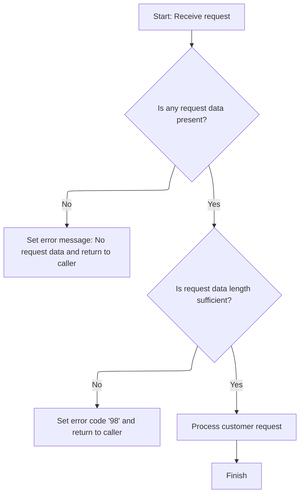
```mermaid
%%{init: {"flowchart": {"defaultRenderer": "elk"}} }%%
flowchart TD
  node1["Start: Receive request"] --> node2{"Is any request data present?"}
  click node1 openCode "base/src/lgapol01.cbl:68:108"
  node2 -->|"No"| node3["Set error message: No request data and return to caller"]
  click node2 openCode "base/src/lgapol01.cbl:83:87"
  click node3 openCode "base/src/lgapol01.cbl:84:86"
  node2 -->|"Yes"| node4{"Is request data length sufficient?"}
  click node4 openCode "base/src/lgapol01.cbl:95:98"
  node4 -->|"No"| node5["Set error code '98' and return to caller"]
  click node5 openCode "base/src/lgapol01.cbl:96:97"
  node4 -->|"Yes"| node6["Process customer request"]
  click node6 openCode "base/src/lgapol01.cbl:103:106"
  node6 --> node7["Finish"]
  click node7 openCode "base/src/lgapol01.cbl:108:108"
classDef HeadingStyle fill:#777777,stroke:#333,stroke-width:2px;

%% Swimm:
%% %%{init: {"flowchart": {"defaultRenderer": "elk"}} }%%
%% flowchart TD
%%   node1["Start: Receive request"] --> node2{"Is any request data present?"}
%%   click node1 openCode "<SwmPath>[base/src/lgapol01.cbl](base/src/lgapol01.cbl)</SwmPath>:68:108"
%%   node2 -->|"No"| node3["Set error message: No request data and return to caller"]
%%   click node2 openCode "<SwmPath>[base/src/lgapol01.cbl](base/src/lgapol01.cbl)</SwmPath>:83:87"
%%   click node3 openCode "<SwmPath>[base/src/lgapol01.cbl](base/src/lgapol01.cbl)</SwmPath>:84:86"
%%   node2 -->|"Yes"| node4{"Is request data length sufficient?"}
%%   click node4 openCode "<SwmPath>[base/src/lgapol01.cbl](base/src/lgapol01.cbl)</SwmPath>:95:98"
%%   node4 -->|"No"| node5["Set error code '98' and return to caller"]
%%   click node5 openCode "<SwmPath>[base/src/lgapol01.cbl](base/src/lgapol01.cbl)</SwmPath>:96:97"
%%   node4 -->|"Yes"| node6["Process customer request"]
%%   click node6 openCode "<SwmPath>[base/src/lgapol01.cbl](base/src/lgapol01.cbl)</SwmPath>:103:106"
%%   node6 --> node7["Finish"]
%%   click node7 openCode "<SwmPath>[base/src/lgapol01.cbl](base/src/lgapol01.cbl)</SwmPath>:108:108"
%% classDef HeadingStyle fill:#777777,stroke:#333,stroke-width:2px;
```

This section validates incoming policy add requests, ensures required data is present and of sufficient length, and processes valid requests. Errors are logged and returned to the caller with appropriate codes and messages.

| Category        | Rule Name                        | Description                                                                                                                                                                                                                                                                                                                                                                                                                                                                                                                            |
| --------------- | -------------------------------- | -------------------------------------------------------------------------------------------------------------------------------------------------------------------------------------------------------------------------------------------------------------------------------------------------------------------------------------------------------------------------------------------------------------------------------------------------------------------------------------------------------------------------------------- |
| Data validation | Missing request data             | If no request data is present in the commarea, an error message 'NO COMMAREA RECEIVED' is set, the error is logged, and the request is aborted.                                                                                                                                                                                                                                                                                                                                                                                        |
| Data validation | Insufficient request length      | If the request data length is less than the required minimum (<SwmToken path="base/src/lgapol01.cbl" pos="92:11:15" line-data="           ADD W4-HDR-LEN TO W4-REQ-LEN">`W4-REQ-LEN`</SwmToken> + <SwmToken path="base/src/lgapol01.cbl" pos="92:3:7" line-data="           ADD W4-HDR-LEN TO W4-REQ-LEN">`W4-HDR-LEN`</SwmToken>, where <SwmToken path="base/src/lgapol01.cbl" pos="92:3:7" line-data="           ADD W4-HDR-LEN TO W4-REQ-LEN">`W4-HDR-LEN`</SwmToken> is 28), an error code '98' is set and the request is aborted. |
| Business logic  | Process valid policy add request | Valid requests are processed by passing the commarea data to the backend <SwmToken path="base/src/lgapol01.cbl" pos="103:9:9" line-data="           EXEC CICS Link Program(LGAPDB01)">`LGAPDB01`</SwmToken> program for policy addition.                                                                                                                                                                                                                                                                                               |

<SwmSnippet path="/base/src/lgapol01.cbl" line="68">

---

We check the input, log errors if needed, and call <SwmToken path="base/src/lgapol01.cbl" pos="103:9:9" line-data="           EXEC CICS Link Program(LGAPDB01)">`LGAPDB01`</SwmToken> for backend processing.

```cobol
       P100-MAIN SECTION.

      *----------------------------------------------------------------*
      * Common code                                                    *
      *----------------------------------------------------------------*
           INITIALIZE W1-CONTROL.
           MOVE EIBTRNID TO W1-TID.
           MOVE EIBTRMID TO W1-TRM.
           MOVE EIBTASKN TO W1-TSK.
           MOVE EIBCALEN TO W1-LEN.
      *----------------------------------------------------------------*

      *----------------------------------------------------------------*
      * Check commarea and obtain required details                     *
      *----------------------------------------------------------------*
           IF EIBCALEN IS EQUAL TO ZERO
               MOVE ' NO COMMAREA RECEIVED' TO W3-DETAIL
               PERFORM P999-ERROR
               EXEC CICS ABEND ABCODE('LGCA') NODUMP END-EXEC
           END-IF

           MOVE '00' TO CA-RETURN-CODE
           SET W1-PTR TO ADDRESS OF DFHCOMMAREA.

           ADD W4-HDR-LEN TO W4-REQ-LEN


           IF EIBCALEN IS LESS THAN W4-REQ-LEN
             MOVE '98' TO CA-RETURN-CODE
             EXEC CICS RETURN END-EXEC
           END-IF

      *----------------------------------------------------------------*
      *    Perform the data Inserts                                    *
      *----------------------------------------------------------------*
           EXEC CICS Link Program(LGAPDB01)
                Commarea(DFHCOMMAREA)
                LENGTH(32500)
           END-EXEC.

           EXEC CICS RETURN END-EXEC.
```

---

</SwmSnippet>

<SwmSnippet path="/base/src/lgapol01.cbl" line="119">

---

In <SwmToken path="base/src/lgapol01.cbl" pos="119:1:3" line-data="       P999-ERROR.">`P999-ERROR`</SwmToken>, we timestamp the error, send the message to LGSTSQ for logging, and if there's extra commarea data, we send up to 90 bytes to avoid buffer overflow.

```cobol
       P999-ERROR.
      * Save SQLCODE in message
      * Obtain and format current time and date
           EXEC CICS ASKTIME ABSTIME(W2-TIME)
           END-EXEC
           EXEC CICS FORMATTIME ABSTIME(W2-TIME)
                     MMDDYYYY(W2-DATE1)
                     TIME(W2-DATE2)
           END-EXEC
           MOVE W2-DATE1 TO W3-DATE
           MOVE W2-DATE2 TO W3-TIME
      * Write output message to TDQ
           EXEC CICS LINK PROGRAM('LGSTSQ')
                     COMMAREA(W3-MESSAGE)
                     LENGTH(LENGTH OF W3-MESSAGE)
           END-EXEC.
      * Write 90 bytes or as much as we have of commarea to TDQ
           IF EIBCALEN > 0 THEN
             IF EIBCALEN < 91 THEN
               MOVE DFHCOMMAREA(1:EIBCALEN) TO CA-DATA
               EXEC CICS LINK PROGRAM('LGSTSQ')
                         COMMAREA(CA-ERROR-MSG)
                         LENGTH(LENGTH OF CA-ERROR-MSG)
               END-EXEC
             ELSE
               MOVE DFHCOMMAREA(1:90) TO CA-DATA
               EXEC CICS LINK PROGRAM('LGSTSQ')
                         COMMAREA(CA-ERROR-MSG)
                         LENGTH(LENGTH OF CA-ERROR-MSG)
               END-EXEC
             END-IF
           END-IF.
           EXIT.
```

---

</SwmSnippet>

## Preparing Files and Data for Premium Calculation

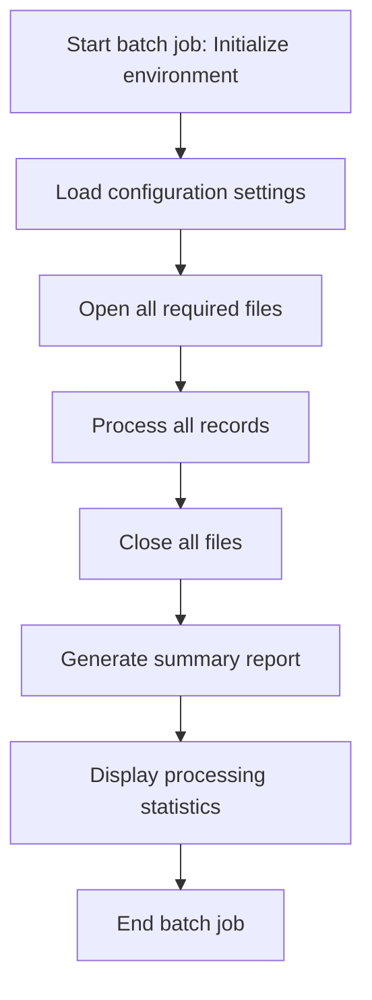
```mermaid
%%{init: {"flowchart": {"defaultRenderer": "elk"}} }%%
flowchart TD
    node1["Start batch job: Initialize environment"]
    node1 --> node2["Load configuration settings"]
    node2 --> node3["Open all required files"]
    node3 --> node4["Process all records"]
    node4 --> node5["Close all files"]
    node5 --> node6["Generate summary report"]
    node6 --> node7["Display processing statistics"]
    node7 --> node8["End batch job"]
    click node1 openCode "base/src/LGAPDB01.cbl:91:91"
    click node2 openCode "base/src/LGAPDB01.cbl:92:92"
    click node3 openCode "base/src/LGAPDB01.cbl:93:93"
    click node4 openCode "base/src/LGAPDB01.cbl:94:94"
    click node5 openCode "base/src/LGAPDB01.cbl:95:95"
    click node6 openCode "base/src/LGAPDB01.cbl:96:96"
    click node7 openCode "base/src/LGAPDB01.cbl:97:97"
    click node8 openCode "base/src/LGAPDB01.cbl:98:98"
classDef HeadingStyle fill:#777777,stroke:#333,stroke-width:2px;

%% Swimm:
%% %%{init: {"flowchart": {"defaultRenderer": "elk"}} }%%
%% flowchart TD
%%     node1["Start batch job: Initialize environment"]
%%     node1 --> node2["Load configuration settings"]
%%     node2 --> node3["Open all required files"]
%%     node3 --> node4["Process all records"]
%%     node4 --> node5["Close all files"]
%%     node5 --> node6["Generate summary report"]
%%     node6 --> node7["Display processing statistics"]
%%     node7 --> node8["End batch job"]
%%     click node1 openCode "<SwmPath>[base/src/LGAPDB01.cbl](base/src/LGAPDB01.cbl)</SwmPath>:91:91"
%%     click node2 openCode "<SwmPath>[base/src/LGAPDB01.cbl](base/src/LGAPDB01.cbl)</SwmPath>:92:92"
%%     click node3 openCode "<SwmPath>[base/src/LGAPDB01.cbl](base/src/LGAPDB01.cbl)</SwmPath>:93:93"
%%     click node4 openCode "<SwmPath>[base/src/LGAPDB01.cbl](base/src/LGAPDB01.cbl)</SwmPath>:94:94"
%%     click node5 openCode "<SwmPath>[base/src/LGAPDB01.cbl](base/src/LGAPDB01.cbl)</SwmPath>:95:95"
%%     click node6 openCode "<SwmPath>[base/src/LGAPDB01.cbl](base/src/LGAPDB01.cbl)</SwmPath>:96:96"
%%     click node7 openCode "<SwmPath>[base/src/LGAPDB01.cbl](base/src/LGAPDB01.cbl)</SwmPath>:97:97"
%%     click node8 openCode "<SwmPath>[base/src/LGAPDB01.cbl](base/src/LGAPDB01.cbl)</SwmPath>:98:98"
%% classDef HeadingStyle fill:#777777,stroke:#333,stroke-width:2px;
```

This section ensures that all prerequisites for premium calculation are met by preparing the environment, loading configurations, and opening all necessary files. It also ensures that output files are structured with headers for clear reporting.

| Category        | Rule Name                  | Description                                                                                                                                                                     |
| --------------- | -------------------------- | ------------------------------------------------------------------------------------------------------------------------------------------------------------------------------- |
| Data validation | File readiness requirement | All required input, output, and summary files must be successfully opened before any premium calculation can begin. If any file cannot be opened, the process must not proceed. |
| Data validation | Configuration validation   | Configuration settings must be loaded and validated before processing records to ensure calculations use the correct parameters and business logic.                             |
| Business logic  | Output header requirement  | Headers must be written to all output files before any data records are processed, ensuring that reports are clear, structured, and meet business reporting standards.          |

<SwmSnippet path="/base/src/LGAPDB01.cbl" line="90">

---

In <SwmToken path="base/src/LGAPDB01.cbl" pos="90:1:1" line-data="       P001.">`P001`</SwmToken>, we initialize working data, load config, open all necessary files, and write headers before starting the main premium calculation loop.

```cobol
       P001.
           PERFORM P002-INITIALIZE
           PERFORM P003-LOAD-CONFIG
           PERFORM P005-OPEN-FILES
           PERFORM P006-PROCESS-RECORDS
           PERFORM P014-CLOSE-FILES
           PERFORM P015-GENERATE-SUMMARY
           PERFORM P016-DISPLAY-STATS
           STOP RUN.
```

---

</SwmSnippet>

<SwmSnippet path="/base/src/LGAPDB01.cbl" line="138">

---

In <SwmToken path="base/src/LGAPDB01.cbl" pos="138:1:5" line-data="       P005-OPEN-FILES.">`P005-OPEN-FILES`</SwmToken>, we open all the files needed for premium calculation and write headers to the output file so reports are clear and structured.

```cobol
       P005-OPEN-FILES.
           PERFORM P005A-OPEN-INPUT
           PERFORM P005B-OPEN-OUTPUT
           PERFORM P005C-OPEN-SUMMARY
           PERFORM P005D-WRITE-HEADERS.
```

---

</SwmSnippet>

## Processing and Validating Policy Records

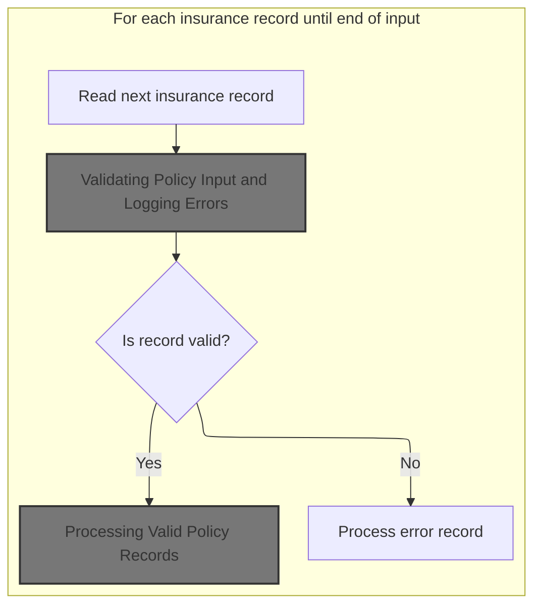
```mermaid
%%{init: {"flowchart": {"defaultRenderer": "elk"}} }%%
flowchart TD
    subgraph loop1["For each insurance record until end of input"]
        node1["Read next insurance record"]
        click node1 openCode "base/src/LGAPDB01.cbl:179:180"
        node1 --> node2["Validating Policy Input and Logging Errors"]
        
        node2 --> node3{"Is record valid?"}
        node3 -->|"Yes"| node4["Processing Valid Policy Records"]
        
        node3 -->|"No"| node5["Process error record"]
        click node5 openCode "base/src/LGAPDB01.cbl:186:187"
    end
classDef HeadingStyle fill:#777777,stroke:#333,stroke-width:2px;
click node2 goToHeading "Validating Policy Input and Logging Errors"
node2:::HeadingStyle
click node4 goToHeading "Processing Valid Policy Records"
node4:::HeadingStyle

%% Swimm:
%% %%{init: {"flowchart": {"defaultRenderer": "elk"}} }%%
%% flowchart TD
%%     subgraph loop1["For each insurance record until end of input"]
%%         node1["Read next insurance record"]
%%         click node1 openCode "<SwmPath>[base/src/LGAPDB01.cbl](base/src/LGAPDB01.cbl)</SwmPath>:179:180"
%%         node1 --> node2["Validating Policy Input and Logging Errors"]
%%         
%%         node2 --> node3{"Is record valid?"}
%%         node3 -->|"Yes"| node4["Processing Valid Policy Records"]
%%         
%%         node3 -->|"No"| node5["Process error record"]
%%         click node5 openCode "<SwmPath>[base/src/LGAPDB01.cbl](base/src/LGAPDB01.cbl)</SwmPath>:186:187"
%%     end
%% classDef HeadingStyle fill:#777777,stroke:#333,stroke-width:2px;
%% click node2 goToHeading "Validating Policy Input and Logging Errors"
%% node2:::HeadingStyle
%% click node4 goToHeading "Processing Valid Policy Records"
%% node4:::HeadingStyle
```

This section governs the reading, validation, and processing of insurance policy records. It ensures that only valid records are processed, errors are logged for invalid records, and all relevant counters are updated to reflect the outcome of each record.

| Category        | Rule Name                    | Description                                                                                                                                                                |
| --------------- | ---------------------------- | -------------------------------------------------------------------------------------------------------------------------------------------------------------------------- |
| Data validation | Mandatory field validation   | Each insurance policy record must be validated for mandatory fields and coverage values before processing.                                                                 |
| Business logic  | Valid record processing      | Valid insurance policy records must be routed for processing according to their policy type (commercial or non-commercial), and the processed counter must be incremented. |
| Business logic  | Error and rejection counting | For each invalid record, the error counter and rejected counter must be incremented to reflect the number of errors and rejected records.                                  |
| Technical step  | End of input processing      | Processing must continue for each record until the end of input is reached, as indicated by the end-of-file status value ('10').                                           |

<SwmSnippet path="/base/src/LGAPDB01.cbl" line="178">

---

In <SwmToken path="base/src/LGAPDB01.cbl" pos="178:1:5" line-data="       P006-PROCESS-RECORDS.">`P006-PROCESS-RECORDS`</SwmToken>, we read each input record, validate it, process valid ones, and log errors for invalid ones, updating counters as we go.

```cobol
       P006-PROCESS-RECORDS.
           PERFORM P007-READ-INPUT
           PERFORM UNTIL INPUT-EOF
               ADD 1 TO WS-REC-CNT
               PERFORM P008-VALIDATE-INPUT-RECORD
               IF WS-ERROR-COUNT = ZERO
                   PERFORM P009-PROCESS-VALID-RECORD
               ELSE
                   PERFORM P010-PROCESS-ERROR-RECORD
               END-IF
               PERFORM P007-READ-INPUT
           END-PERFORM.
```

---

</SwmSnippet>

### Validating Policy Input and Logging Errors

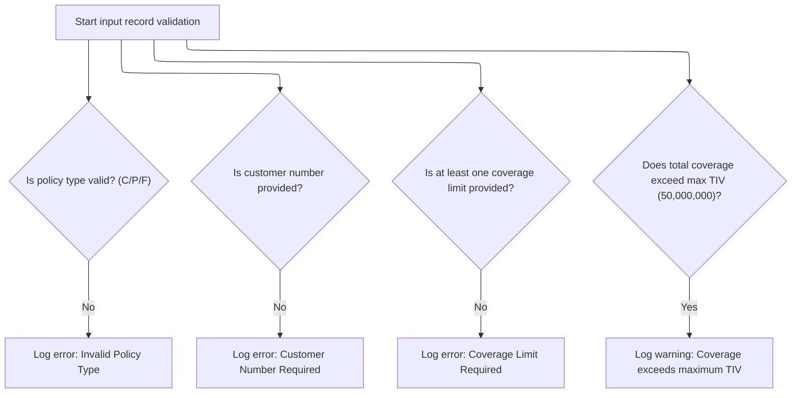
```mermaid
%%{init: {"flowchart": {"defaultRenderer": "elk"}} }%%
flowchart TD
    node1["Start input record validation"]
    click node1 openCode "base/src/LGAPDB01.cbl:195:196"
    node1 --> node2{"Is policy type valid? (C/P/F)"}
    click node2 openCode "base/src/LGAPDB01.cbl:198:204"
    node1 --> node5{"Is customer number provided?"}
    click node5 openCode "base/src/LGAPDB01.cbl:206:210"
    node1 --> node8{"Is at least one coverage limit provided?"}
    click node8 openCode "base/src/LGAPDB01.cbl:212:217"
    node1 --> node11{"Does total coverage exceed max TIV (50,000,000)?"}
    click node11 openCode "base/src/LGAPDB01.cbl:219:224"
    node2 -->|"No"| node3["Log error: Invalid Policy Type"]
    click node3 openCode "base/src/LGAPDB01.cbl:201:203"
    node5 -->|"No"| node6["Log error: Customer Number Required"]
    click node6 openCode "base/src/LGAPDB01.cbl:207:209"
    node8 -->|"No"| node9["Log error: Coverage Limit Required"]
    click node9 openCode "base/src/LGAPDB01.cbl:214:216"
    node11 -->|"Yes"| node12["Log warning: Coverage exceeds maximum TIV"]
    click node12 openCode "base/src/LGAPDB01.cbl:221:223"

classDef HeadingStyle fill:#777777,stroke:#333,stroke-width:2px;

%% Swimm:
%% %%{init: {"flowchart": {"defaultRenderer": "elk"}} }%%
%% flowchart TD
%%     node1["Start input record validation"]
%%     click node1 openCode "<SwmPath>[base/src/LGAPDB01.cbl](base/src/LGAPDB01.cbl)</SwmPath>:195:196"
%%     node1 --> node2{"Is policy type valid? (C/P/F)"}
%%     click node2 openCode "<SwmPath>[base/src/LGAPDB01.cbl](base/src/LGAPDB01.cbl)</SwmPath>:198:204"
%%     node1 --> node5{"Is customer number provided?"}
%%     click node5 openCode "<SwmPath>[base/src/LGAPDB01.cbl](base/src/LGAPDB01.cbl)</SwmPath>:206:210"
%%     node1 --> node8{"Is at least one coverage limit provided?"}
%%     click node8 openCode "<SwmPath>[base/src/LGAPDB01.cbl](base/src/LGAPDB01.cbl)</SwmPath>:212:217"
%%     node1 --> node11{"Does total coverage exceed max TIV (50,000,000)?"}
%%     click node11 openCode "<SwmPath>[base/src/LGAPDB01.cbl](base/src/LGAPDB01.cbl)</SwmPath>:219:224"
%%     node2 -->|"No"| node3["Log error: Invalid Policy Type"]
%%     click node3 openCode "<SwmPath>[base/src/LGAPDB01.cbl](base/src/LGAPDB01.cbl)</SwmPath>:201:203"
%%     node5 -->|"No"| node6["Log error: Customer Number Required"]
%%     click node6 openCode "<SwmPath>[base/src/LGAPDB01.cbl](base/src/LGAPDB01.cbl)</SwmPath>:207:209"
%%     node8 -->|"No"| node9["Log error: Coverage Limit Required"]
%%     click node9 openCode "<SwmPath>[base/src/LGAPDB01.cbl](base/src/LGAPDB01.cbl)</SwmPath>:214:216"
%%     node11 -->|"Yes"| node12["Log warning: Coverage exceeds maximum TIV"]
%%     click node12 openCode "<SwmPath>[base/src/LGAPDB01.cbl](base/src/LGAPDB01.cbl)</SwmPath>:221:223"
%% 
%% classDef HeadingStyle fill:#777777,stroke:#333,stroke-width:2px;
```

This section ensures that policy input records meet required business criteria before they are processed. It validates key fields and logs errors or warnings for any issues found, supporting data quality and compliance.

| Category        | Rule Name                | Description                                                                                                                                             |
| --------------- | ------------------------ | ------------------------------------------------------------------------------------------------------------------------------------------------------- |
| Data validation | Valid Policy Type        | Only policy types 'C' (Commercial), 'P' (Personal), or 'F' (Farm) are considered valid. Any other value is rejected and an error is logged.             |
| Data validation | Customer Number Required | A customer number must be provided for every policy input record. If missing, an error is logged.                                                       |
| Data validation | Coverage Limit Required  | At least one coverage limit (building, contents, or business interruption) must be provided. If all are zero, an error is logged.                       |
| Business logic  | Maximum TIV Warning      | If the sum of building, contents, and business interruption coverage exceeds the maximum Total Insured Value (TIV) of $50,000,000, a warning is logged. |

<SwmSnippet path="/base/src/LGAPDB01.cbl" line="195">

---

We validate input and log errors for anything off.

```cobol
       P008-VALIDATE-INPUT-RECORD.
           INITIALIZE WS-ERROR-HANDLING
           
           IF NOT COMMERCIAL-POLICY AND 
              NOT PERSONAL-POLICY AND 
              NOT FARM-POLICY
               PERFORM P008A-LOG-ERROR WITH 
                   'POL001' 'F' 'IN-POLICY-TYPE' 
                   'Invalid Policy Type'
           END-IF
           
           IF IN-CUSTOMER-NUM = SPACES
               PERFORM P008A-LOG-ERROR WITH 
                   'CUS001' 'F' 'IN-CUSTOMER-NUM' 
                   'Customer Number Required'
           END-IF
           
           IF IN-BUILDING-LIMIT = ZERO AND 
              IN-CONTENTS-LIMIT = ZERO
               PERFORM P008A-LOG-ERROR WITH 
                   'COV001' 'F' 'COVERAGE-LIMITS' 
                   'At least one coverage limit required'
           END-IF
           
           IF IN-BUILDING-LIMIT + IN-CONTENTS-LIMIT + 
              IN-BI-LIMIT > WS-MAX-TIV
               PERFORM P008A-LOG-ERROR WITH 
                   'COV002' 'W' 'COVERAGE-LIMITS' 
                   'Total coverage exceeds maximum TIV'
           END-IF.
```

---

</SwmSnippet>

<SwmSnippet path="/base/src/LGAPDB01.cbl" line="226">

---

<SwmToken path="base/src/LGAPDB01.cbl" pos="226:1:5" line-data="       P008A-LOG-ERROR.">`P008A-LOG-ERROR`</SwmToken> increments the error count and uses that as an index to store error details (code, severity, field, message) in parallel arrays. This lets the system track multiple errors per record, but it assumes the arrays are big enough and doesn't check for overflow.

```cobol
       P008A-LOG-ERROR.
           ADD 1 TO WS-ERROR-COUNT
           SET ERR-IDX TO WS-ERROR-COUNT
           MOVE WS-ERROR-CODE TO WS-ERROR-CODE (ERR-IDX)
           MOVE WS-ERROR-SEVERITY TO WS-ERROR-SEVERITY (ERR-IDX)
           MOVE WS-ERROR-FIELD TO WS-ERROR-FIELD (ERR-IDX)
           MOVE WS-ERROR-MESSAGE TO WS-ERROR-MESSAGE (ERR-IDX).
```

---

</SwmSnippet>

### Processing Valid Policy Records

This section is responsible for identifying and processing valid policy records, updating relevant counters, and ensuring only eligible records are included in the final processed set.

| Category        | Rule Name                      | Description                                                                                                                                                                                                                                                                          |
| --------------- | ------------------------------ | ------------------------------------------------------------------------------------------------------------------------------------------------------------------------------------------------------------------------------------------------------------------------------------ |
| Data validation | Policy Application Eligibility | Only policy records with IN-RECORD-TYPE equal to 'PA' (Policy Application) are eligible for processing.                                                                                                                                                                              |
| Data validation | Rejected Record Handling       | Policy records with IN-RECORD-TYPE not equal to 'PA' or <SwmToken path="base/src/LGAPDB01.cbl" pos="202:10:14" line-data="                   &#39;POL001&#39; &#39;F&#39; &#39;IN-POLICY-TYPE&#39; ">`IN-POLICY-TYPE`</SwmToken> not equal to 'C' are rejected and not processed.    |
| Business logic  | Commercial Policy Filter       | A policy record is considered commercial if <SwmToken path="base/src/LGAPDB01.cbl" pos="202:10:14" line-data="                   &#39;POL001&#39; &#39;F&#39; &#39;IN-POLICY-TYPE&#39; ">`IN-POLICY-TYPE`</SwmToken> is 'C'. Only commercial policies are processed in this section. |
| Business logic  | Processed Record Counter       | For each valid policy record processed, increment the <SwmToken path="base/src/LGAPDB01.cbl" pos="237:7:11" line-data="               ADD 1 TO WS-PROC-CNT">`WS-PROC-CNT`</SwmToken> counter by 1.                                                                                   |

See <SwmLink doc-title="Processing Valid Insurance Records">[Processing Valid Insurance Records](.swm%5Cprocessing-valid-insurance-records.m4z20m89.sw.md)</SwmLink>

### Handling Error Policy Records

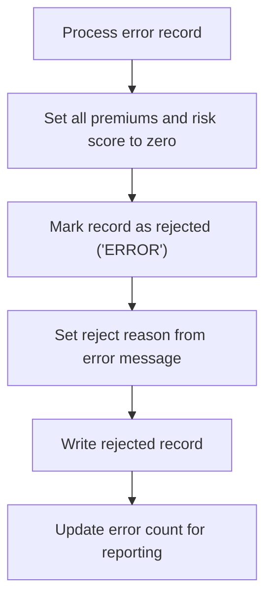
```mermaid
%%{init: {"flowchart": {"defaultRenderer": "elk"}} }%%
flowchart TD
    node1["Process error record"]
    click node1 openCode "base/src/LGAPDB01.cbl:243:256"
    node1 --> node2["Set all premiums and risk score to zero"]
    click node2 openCode "base/src/LGAPDB01.cbl:247:252"
    node2 --> node3["Mark record as rejected ('ERROR')"]
    click node3 openCode "base/src/LGAPDB01.cbl:253:253"
    node3 --> node4["Set reject reason from error message"]
    click node4 openCode "base/src/LGAPDB01.cbl:254:254"
    node4 --> node5["Write rejected record"]
    click node5 openCode "base/src/LGAPDB01.cbl:255:255"
    node5 --> node6["Update error count for reporting"]
    click node6 openCode "base/src/LGAPDB01.cbl:256:256"

classDef HeadingStyle fill:#777777,stroke:#333,stroke-width:2px;

%% Swimm:
%% %%{init: {"flowchart": {"defaultRenderer": "elk"}} }%%
%% flowchart TD
%%     node1["Process error record"]
%%     click node1 openCode "<SwmPath>[base/src/LGAPDB01.cbl](base/src/LGAPDB01.cbl)</SwmPath>:243:256"
%%     node1 --> node2["Set all premiums and risk score to zero"]
%%     click node2 openCode "<SwmPath>[base/src/LGAPDB01.cbl](base/src/LGAPDB01.cbl)</SwmPath>:247:252"
%%     node2 --> node3["Mark record as rejected ('ERROR')"]
%%     click node3 openCode "<SwmPath>[base/src/LGAPDB01.cbl](base/src/LGAPDB01.cbl)</SwmPath>:253:253"
%%     node3 --> node4["Set reject reason from error message"]
%%     click node4 openCode "<SwmPath>[base/src/LGAPDB01.cbl](base/src/LGAPDB01.cbl)</SwmPath>:254:254"
%%     node4 --> node5["Write rejected record"]
%%     click node5 openCode "<SwmPath>[base/src/LGAPDB01.cbl](base/src/LGAPDB01.cbl)</SwmPath>:255:255"
%%     node5 --> node6["Update error count for reporting"]
%%     click node6 openCode "<SwmPath>[base/src/LGAPDB01.cbl](base/src/LGAPDB01.cbl)</SwmPath>:256:256"
%% 
%% classDef HeadingStyle fill:#777777,stroke:#333,stroke-width:2px;
```

<SwmSnippet path="/base/src/LGAPDB01.cbl" line="243">

---

<SwmToken path="base/src/LGAPDB01.cbl" pos="243:1:7" line-data="       P010-PROCESS-ERROR-RECORD.">`P010-PROCESS-ERROR-RECORD`</SwmToken> copies basic input fields to the output, zeros out all premium and risk fields, sets <SwmToken path="base/src/LGAPDB01.cbl" pos="253:9:11" line-data="           MOVE &#39;ERROR&#39; TO OUT-STATUS">`OUT-STATUS`</SwmToken> to 'ERROR', and writes the record. Only the first character of the error message is used as the reject reason, then the error count is incremented.

```cobol
       P010-PROCESS-ERROR-RECORD.
           MOVE IN-CUSTOMER-NUM TO OUT-CUSTOMER-NUM
           MOVE IN-PROPERTY-TYPE TO OUT-PROPERTY-TYPE
           MOVE IN-POSTCODE TO OUT-POSTCODE
           MOVE ZERO TO OUT-RISK-SCORE
           MOVE ZERO TO OUT-FIRE-PREMIUM
           MOVE ZERO TO OUT-CRIME-PREMIUM
           MOVE ZERO TO OUT-FLOOD-PREMIUM
           MOVE ZERO TO OUT-WEATHER-PREMIUM
           MOVE ZERO TO OUT-TOTAL-PREMIUM
           MOVE 'ERROR' TO OUT-STATUS
           MOVE WS-ERROR-MESSAGE (1) TO OUT-REJECT-REASON
           WRITE OUTPUT-RECORD
           ADD 1 TO WS-ERR-CNT.
```

---

</SwmSnippet>

## Handling Policy Deletion Results

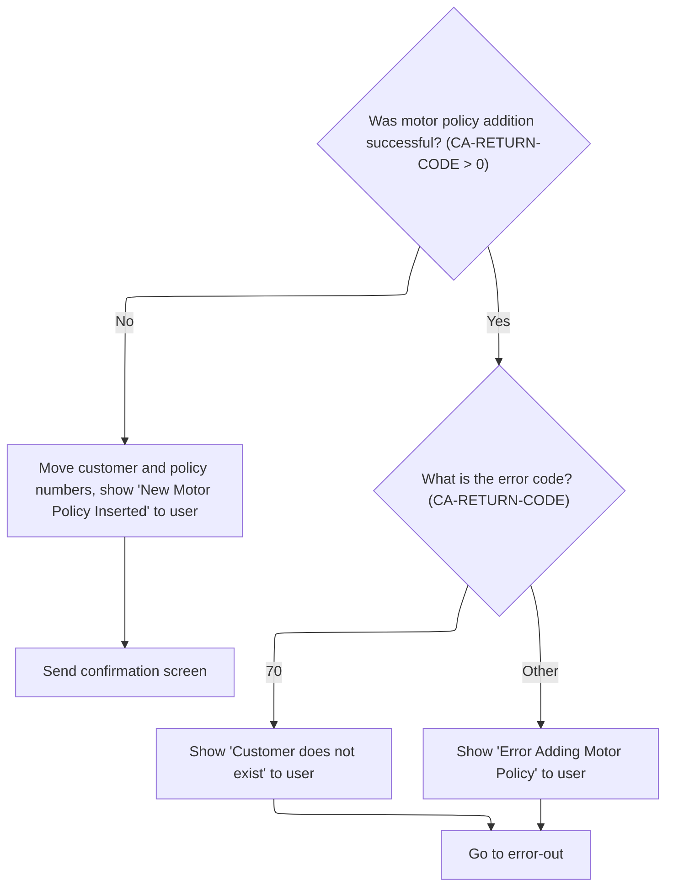
```mermaid
%%{init: {"flowchart": {"defaultRenderer": "elk"}} }%%
flowchart TD
    node1{"Was motor policy addition successful? (CA-RETURN-CODE > 0)"}
    click node1 openCode "base/src/lgtestp1.cbl:119:122"
    node1 -->|"No"| node2["Move customer and policy numbers, show 'New Motor Policy Inserted' to user"]
    click node2 openCode "base/src/lgtestp1.cbl:124:128"
    node2 --> node3["Send confirmation screen"]
    click node3 openCode "base/src/lgtestp1.cbl:129:132"
    node1 -->|"Yes"| node4{"What is the error code? (CA-RETURN-CODE)"}
    click node4 openCode "base/src/lgtestp1.cbl:287:294"
    node4 -->|"70"| node5["Show 'Customer does not exist' to user"]
    click node5 openCode "base/src/lgtestp1.cbl:289:290"
    node5 --> node7["Go to error-out"]
    click node7 openCode "base/src/lgtestp1.cbl:293:294"
    node4 -->|"Other"| node6["Show 'Error Adding Motor Policy' to user"]
    click node6 openCode "base/src/lgtestp1.cbl:292:293"
    node6 --> node7
classDef HeadingStyle fill:#777777,stroke:#333,stroke-width:2px;

%% Swimm:
%% %%{init: {"flowchart": {"defaultRenderer": "elk"}} }%%
%% flowchart TD
%%     node1{"Was motor policy addition successful? (<SwmToken path="base/src/lgtestp1.cbl" pos="76:3:7" line-data="                 IF CA-RETURN-CODE &gt; 0">`CA-RETURN-CODE`</SwmToken> > 0)"}
%%     click node1 openCode "<SwmPath>[base/src/lgtestp1.cbl](base/src/lgtestp1.cbl)</SwmPath>:119:122"
%%     node1 -->|"No"| node2["Move customer and policy numbers, show 'New Motor Policy Inserted' to user"]
%%     click node2 openCode "<SwmPath>[base/src/lgtestp1.cbl](base/src/lgtestp1.cbl)</SwmPath>:124:128"
%%     node2 --> node3["Send confirmation screen"]
%%     click node3 openCode "<SwmPath>[base/src/lgtestp1.cbl](base/src/lgtestp1.cbl)</SwmPath>:129:132"
%%     node1 -->|"Yes"| node4{"What is the error code? (<SwmToken path="base/src/lgtestp1.cbl" pos="76:3:7" line-data="                 IF CA-RETURN-CODE &gt; 0">`CA-RETURN-CODE`</SwmToken>)"}
%%     click node4 openCode "<SwmPath>[base/src/lgtestp1.cbl](base/src/lgtestp1.cbl)</SwmPath>:287:294"
%%     node4 -->|"70"| node5["Show 'Customer does not exist' to user"]
%%     click node5 openCode "<SwmPath>[base/src/lgtestp1.cbl](base/src/lgtestp1.cbl)</SwmPath>:289:290"
%%     node5 --> node7["Go to error-out"]
%%     click node7 openCode "<SwmPath>[base/src/lgtestp1.cbl](base/src/lgtestp1.cbl)</SwmPath>:293:294"
%%     node4 -->|"Other"| node6["Show 'Error Adding Motor Policy' to user"]
%%     click node6 openCode "<SwmPath>[base/src/lgtestp1.cbl](base/src/lgtestp1.cbl)</SwmPath>:292:293"
%%     node6 --> node7
%% classDef HeadingStyle fill:#777777,stroke:#333,stroke-width:2px;
```

<SwmSnippet path="/base/src/lgtestp1.cbl" line="119">

---

Back in <SwmToken path="base/src/lgtestp1.cbl" pos="33:5:7" line-data="              GO TO A-GAIN.">`A-GAIN`</SwmToken>, after returning from <SwmToken path="base/src/lgtestp1.cbl" pos="115:10:10" line-data="                 EXEC CICS LINK PROGRAM(&#39;LGAPOL01&#39;)">`LGAPOL01`</SwmToken>, we check if <SwmToken path="base/src/lgtestp1.cbl" pos="119:3:7" line-data="                 IF CA-RETURN-CODE &gt; 0">`CA-RETURN-CODE`</SwmToken> is set (i.e., something went wrong). If so, we roll back the transaction and jump to <SwmToken path="base/src/lgtestp1.cbl" pos="121:5:7" line-data="                   GO TO NO-ADD">`NO-ADD`</SwmToken> to show the user an error message about the failed add attempt. This prevents partial or invalid policy adds from being committed.

```cobol
                 IF CA-RETURN-CODE > 0
                   Exec CICS Syncpoint Rollback End-Exec
                   GO TO NO-ADD
                 END-IF
```

---

</SwmSnippet>

<SwmSnippet path="/base/src/lgtestp1.cbl" line="286">

---

<SwmToken path="base/src/lgtestp1.cbl" pos="286:1:3" line-data="       NO-ADD.">`NO-ADD`</SwmToken> checks <SwmToken path="base/src/lgtestp1.cbl" pos="287:3:7" line-data="           Evaluate CA-RETURN-CODE">`CA-RETURN-CODE`</SwmToken>. If it's 70, it sets 'Customer does not exist' as the error message; otherwise, it sets a generic add error. Then it jumps to <SwmToken path="base/src/lgtestp1.cbl" pos="290:5:7" line-data="               Go To ERROR-OUT">`ERROR-OUT`</SwmToken>, which handles showing the error on the menu and ending the session. This keeps error handling consistent and user-facing.

```cobol
       NO-ADD.
           Evaluate CA-RETURN-CODE
             When 70
               Move 'Customer does not exist'          To  ERP1FLDO
               Go To ERROR-OUT
             When Other
               Move 'Error Adding Motor Policy'        To  ERP1FLDO
               Go To ERROR-OUT
           End-Evaluate.
```

---

</SwmSnippet>

<SwmSnippet path="/base/src/lgtestp1.cbl" line="124">

---

Back in <SwmToken path="base/src/lgtestp1.cbl" pos="33:5:7" line-data="              GO TO A-GAIN.">`A-GAIN`</SwmToken> after <SwmToken path="base/src/lgtestp1.cbl" pos="121:5:7" line-data="                   GO TO NO-ADD">`NO-ADD`</SwmToken>, if we didn't hit an error, we update the screen fields with the new customer and policy numbers, clear the menu option, and set a success message. Then we send the updated menu to the user. This is the happy path after a successful add.

```cobol
                 Move CA-CUSTOMER-NUM To ENP1CNOI
                 Move CA-POLICY-NUM   To ENP1PNOI
                 Move ' '             To ENP1OPTI
                 Move 'New Motor Policy Inserted'
                   To  ERP1FLDO
                 EXEC CICS SEND MAP ('SSMAPP1')
                           FROM(SSMAPP1O)
                           MAPSET ('SSMAP')
                 END-EXEC
```

---

</SwmSnippet>

<SwmSnippet path="/base/src/lgtestp1.cbl" line="135">

---

Here we handle the delete option. We prep the commarea with the right request ID and policy/customer numbers, then call <SwmToken path="base/src/lgtestp1.cbl" pos="139:10:10" line-data="                 EXEC CICS LINK PROGRAM(&#39;LGDPOL01&#39;)">`LGDPOL01`</SwmToken> to actually process the policy deletion. This offloads the DB work to the backend and keeps the menu logic clean.

```cobol
             WHEN '3'
                 Move '01DMOT'   To CA-REQUEST-ID
                 Move ENP1CNOO   To CA-CUSTOMER-NUM
                 Move ENP1PNOO   To CA-POLICY-NUM
                 EXEC CICS LINK PROGRAM('LGDPOL01')
                           COMMAREA(COMM-AREA)
                           LENGTH(32500)
                 END-EXEC
```

---

</SwmSnippet>

## Validating and Executing Policy Deletion


```mermaid
%%{init: {"flowchart": {"defaultRenderer": "elk"}} }%%
flowchart TD
  node1["Start: Receive and initialize request"]
  click node1 openCode "base/src/lgdpol01.cbl:78:89"
  node1 --> node2{"Was request data received? (EIBCALEN = 0)"}
  click node2 openCode "base/src/lgdpol01.cbl:95:99"
  node2 -->|"No"| node3["Write error message and terminate (code 'NO COMMAREA RECEIVED')"]
  click node3 openCode "base/src/lgdpol01.cbl:96:98"
  node2 -->|"Yes"| node4["Set return code to 0 and prepare commarea"]
  click node4 openCode "base/src/lgdpol01.cbl:102:104"
  node4 --> node5{"Is commarea large enough? (EIBCALEN < 28)"}
  click node5 openCode "base/src/lgdpol01.cbl:107:110"
  node5 -->|"No"| node6["Set error code '98' (commarea too short) and return"]
  click node6 openCode "base/src/lgdpol01.cbl:108:109"
  node5 -->|"Yes"| node7["Uppercase request ID"]
  click node7 openCode "base/src/lgdpol01.cbl:117:117"
  node7 --> node8{"Is request type recognized? (ID in [01DEND,01DMOT,01DHOU,01DCOM])"}
  click node8 openCode "base/src/lgdpol01.cbl:119:122"
  node8 -->|"No"| node9["Set error code '99' (unsupported request) and return"]
  click node9 openCode "base/src/lgdpol01.cbl:124:124"
  node8 -->|"Yes"| node10["Delete policy from database"]
  click node10 openCode "base/src/lgdpol01.cbl:126:126"
  node10 --> node11{"Did deletion fail? (CA-RETURN-CODE > 0)"}
  click node11 openCode "base/src/lgdpol01.cbl:127:129"
  node11 -->|"Yes"| node12["Return to caller"]
  click node12 openCode "base/src/lgdpol01.cbl:128:128"
  node11 -->|"No"| node13["Return to caller"]
  click node13 openCode "base/src/lgdpol01.cbl:133:133"
  node9 --> node13
  node6 --> node13
  node3 --> node13
classDef HeadingStyle fill:#777777,stroke:#333,stroke-width:2px;

%% Swimm:
%% %%{init: {"flowchart": {"defaultRenderer": "elk"}} }%%
%% flowchart TD
%%   node1["Start: Receive and initialize request"]
%%   click node1 openCode "<SwmPath>[base/src/lgdpol01.cbl](base/src/lgdpol01.cbl)</SwmPath>:78:89"
%%   node1 --> node2{"Was request data received? (EIBCALEN = 0)"}
%%   click node2 openCode "<SwmPath>[base/src/lgdpol01.cbl](base/src/lgdpol01.cbl)</SwmPath>:95:99"
%%   node2 -->|"No"| node3["Write error message and terminate (code 'NO COMMAREA RECEIVED')"]
%%   click node3 openCode "<SwmPath>[base/src/lgdpol01.cbl](base/src/lgdpol01.cbl)</SwmPath>:96:98"
%%   node2 -->|"Yes"| node4["Set return code to 0 and prepare commarea"]
%%   click node4 openCode "<SwmPath>[base/src/lgdpol01.cbl](base/src/lgdpol01.cbl)</SwmPath>:102:104"
%%   node4 --> node5{"Is commarea large enough? (EIBCALEN < 28)"}
%%   click node5 openCode "<SwmPath>[base/src/lgdpol01.cbl](base/src/lgdpol01.cbl)</SwmPath>:107:110"
%%   node5 -->|"No"| node6["Set error code '98' (commarea too short) and return"]
%%   click node6 openCode "<SwmPath>[base/src/lgdpol01.cbl](base/src/lgdpol01.cbl)</SwmPath>:108:109"
%%   node5 -->|"Yes"| node7["Uppercase request ID"]
%%   click node7 openCode "<SwmPath>[base/src/lgdpol01.cbl](base/src/lgdpol01.cbl)</SwmPath>:117:117"
%%   node7 --> node8{"Is request type recognized? (ID in [<SwmToken path="base/src/lgdpol01.cbl" pos="119:18:18" line-data="           IF ( CA-REQUEST-ID NOT EQUAL TO &#39;01DEND&#39; AND">`01DEND`</SwmToken>,<SwmToken path="base/src/lgtestp1.cbl" pos="136:4:4" line-data="                 Move &#39;01DMOT&#39;   To CA-REQUEST-ID">`01DMOT`</SwmToken>,<SwmToken path="base/src/lgdpol01.cbl" pos="121:14:14" line-data="                CA-REQUEST-ID NOT EQUAL TO &#39;01DHOU&#39; AND">`01DHOU`</SwmToken>,<SwmToken path="base/src/lgdpol01.cbl" pos="122:14:14" line-data="                CA-REQUEST-ID NOT EQUAL TO &#39;01DCOM&#39; )">`01DCOM`</SwmToken>])"}
%%   click node8 openCode "<SwmPath>[base/src/lgdpol01.cbl](base/src/lgdpol01.cbl)</SwmPath>:119:122"
%%   node8 -->|"No"| node9["Set error code '99' (unsupported request) and return"]
%%   click node9 openCode "<SwmPath>[base/src/lgdpol01.cbl](base/src/lgdpol01.cbl)</SwmPath>:124:124"
%%   node8 -->|"Yes"| node10["Delete policy from database"]
%%   click node10 openCode "<SwmPath>[base/src/lgdpol01.cbl](base/src/lgdpol01.cbl)</SwmPath>:126:126"
%%   node10 --> node11{"Did deletion fail? (<SwmToken path="base/src/lgtestp1.cbl" pos="76:3:7" line-data="                 IF CA-RETURN-CODE &gt; 0">`CA-RETURN-CODE`</SwmToken> > 0)"}
%%   click node11 openCode "<SwmPath>[base/src/lgdpol01.cbl](base/src/lgdpol01.cbl)</SwmPath>:127:129"
%%   node11 -->|"Yes"| node12["Return to caller"]
%%   click node12 openCode "<SwmPath>[base/src/lgdpol01.cbl](base/src/lgdpol01.cbl)</SwmPath>:128:128"
%%   node11 -->|"No"| node13["Return to caller"]
%%   click node13 openCode "<SwmPath>[base/src/lgdpol01.cbl](base/src/lgdpol01.cbl)</SwmPath>:133:133"
%%   node9 --> node13
%%   node6 --> node13
%%   node3 --> node13
%% classDef HeadingStyle fill:#777777,stroke:#333,stroke-width:2px;
```

This section governs the validation and execution of policy deletion requests. It ensures only supported and valid requests are processed, and that errors are logged with sufficient detail for operational review.

| Category        | Rule Name                           | Description                                                                                                                                                                                                                                                                                                                                                                                                                                                                                                                                                                                                                                                                                                                                                  |
| --------------- | ----------------------------------- | ------------------------------------------------------------------------------------------------------------------------------------------------------------------------------------------------------------------------------------------------------------------------------------------------------------------------------------------------------------------------------------------------------------------------------------------------------------------------------------------------------------------------------------------------------------------------------------------------------------------------------------------------------------------------------------------------------------------------------------------------------------ |
| Data validation | Missing commarea termination        | If no commarea data is received with the request, the operation must be terminated and an error message 'NO COMMAREA RECEIVED' must be logged.                                                                                                                                                                                                                                                                                                                                                                                                                                                                                                                                                                                                               |
| Data validation | Minimum commarea length requirement | If the commarea is present but its length is less than 28 bytes, the operation must be terminated and an error code '98' (commarea too short) must be returned.                                                                                                                                                                                                                                                                                                                                                                                                                                                                                                                                                                                              |
| Data validation | Supported request types enforcement | Only requests with IDs <SwmToken path="base/src/lgdpol01.cbl" pos="119:18:18" line-data="           IF ( CA-REQUEST-ID NOT EQUAL TO &#39;01DEND&#39; AND">`01DEND`</SwmToken>, <SwmToken path="base/src/lgtestp1.cbl" pos="136:4:4" line-data="                 Move &#39;01DMOT&#39;   To CA-REQUEST-ID">`01DMOT`</SwmToken>, <SwmToken path="base/src/lgdpol01.cbl" pos="121:14:14" line-data="                CA-REQUEST-ID NOT EQUAL TO &#39;01DHOU&#39; AND">`01DHOU`</SwmToken>, or <SwmToken path="base/src/lgdpol01.cbl" pos="122:14:14" line-data="                CA-REQUEST-ID NOT EQUAL TO &#39;01DCOM&#39; )">`01DCOM`</SwmToken> are supported for policy deletion. Any other request ID must result in error code '99' (unsupported request). |
| Business logic  | Request ID normalization            | The request ID must be uppercased before validation to ensure case-insensitive matching against supported request types.                                                                                                                                                                                                                                                                                                                                                                                                                                                                                                                                                                                                                                     |

<SwmSnippet path="/base/src/lgdpol01.cbl" line="78">

---

MAINLINE in <SwmToken path="base/src/lgtestp1.cbl" pos="139:10:10" line-data="                 EXEC CICS LINK PROGRAM(&#39;LGDPOL01&#39;)">`LGDPOL01`</SwmToken> checks the commarea and request ID, only allowing certain delete operations. If the request is valid, it calls <SwmToken path="base/src/lgdpol01.cbl" pos="126:3:9" line-data="               PERFORM DELETE-POLICY-DB2-INFO">`DELETE-POLICY-DB2-INFO`</SwmToken> to do the actual delete. If not, it sets an error code and returns. Error logging is handled if the commarea is missing or too short.

```cobol
       MAINLINE SECTION.

      *----------------------------------------------------------------*
      * Common code                                                    *
      *----------------------------------------------------------------*
      * initialize working storage variables
           INITIALIZE WS-HEADER.
      * set up general variable
           MOVE EIBTRNID TO WS-TRANSID.
           MOVE EIBTRMID TO WS-TERMID.
           MOVE EIBTASKN TO WS-TASKNUM.
      *----------------------------------------------------------------*

      *----------------------------------------------------------------*
      * Check commarea and obtain required details                     *
      *----------------------------------------------------------------*
      * If NO commarea received issue an ABEND
           IF EIBCALEN IS EQUAL TO ZERO
               MOVE ' NO COMMAREA RECEIVED' TO EM-VARIABLE
               PERFORM WRITE-ERROR-MESSAGE
               EXEC CICS ABEND ABCODE('LGCA') NODUMP END-EXEC
           END-IF

      * initialize commarea return code to zero
           MOVE '00' TO CA-RETURN-CODE
           MOVE EIBCALEN TO WS-CALEN.
           SET WS-ADDR-DFHCOMMAREA TO ADDRESS OF DFHCOMMAREA.

      * Check commarea is large enough
           IF EIBCALEN IS LESS THAN WS-CA-HEADER-LEN
             MOVE '98' TO CA-RETURN-CODE
             EXEC CICS RETURN END-EXEC
           END-IF

      *----------------------------------------------------------------*
      * Check request-id in commarea and if recognised ...             *
      * Call routine to delete row from policy table                   *
      *----------------------------------------------------------------*
      * Upper case value passed in Request Id field                    *
           MOVE FUNCTION UPPER-CASE(CA-REQUEST-ID) TO CA-REQUEST-ID

           IF ( CA-REQUEST-ID NOT EQUAL TO '01DEND' AND
                CA-REQUEST-ID NOT EQUAL TO '01DMOT' AND
                CA-REQUEST-ID NOT EQUAL TO '01DHOU' AND
                CA-REQUEST-ID NOT EQUAL TO '01DCOM' )
      *        Request is not recognised or supported
               MOVE '99' TO CA-RETURN-CODE
           ELSE
               PERFORM DELETE-POLICY-DB2-INFO
               If CA-RETURN-CODE > 0
                 EXEC CICS RETURN END-EXEC
               End-if
           END-IF

      * Return to caller
           EXEC CICS RETURN END-EXEC.
```

---

</SwmSnippet>

<SwmSnippet path="/base/src/lgdpol01.cbl" line="154">

---

<SwmToken path="base/src/lgdpol01.cbl" pos="154:1:5" line-data="       WRITE-ERROR-MESSAGE.">`WRITE-ERROR-MESSAGE`</SwmToken> in <SwmToken path="base/src/lgtestp1.cbl" pos="139:10:10" line-data="                 EXEC CICS LINK PROGRAM(&#39;LGDPOL01&#39;)">`LGDPOL01`</SwmToken> gets the current date/time, fills out the error message, and calls LGSTSQ to log it. If there's commarea data, it sends up to 90 bytes of that too. This makes sure errors are logged with all the context needed for troubleshooting.

```cobol
       WRITE-ERROR-MESSAGE.
      * Save SQLCODE in message
      * Obtain and format current time and date
           EXEC CICS ASKTIME ABSTIME(WS-ABSTIME)
           END-EXEC
           EXEC CICS FORMATTIME ABSTIME(Ws-ABSTIME)
                     MMDDYYYY(WS-DATE)
                     TIME(WS-TIME)
           END-EXEC
           MOVE WS-DATE TO EM-DATE
           MOVE WS-TIME TO EM-TIME
      * Write output message to TDQ
           EXEC CICS LINK PROGRAM('LGSTSQ')
                     COMMAREA(ERROR-MSG)
                     LENGTH(LENGTH OF ERROR-MSG)
           END-EXEC.
      * Write 90 bytes or as much as we have of commarea to TDQ
           IF EIBCALEN > 0 THEN
             IF EIBCALEN < 91 THEN
               MOVE DFHCOMMAREA(1:EIBCALEN) TO CA-DATA
               EXEC CICS LINK PROGRAM('LGSTSQ')
                         COMMAREA(CA-ERROR-MSG)
                         LENGTH(LENGTH OF CA-ERROR-MSG)
               END-EXEC
             ELSE
               MOVE DFHCOMMAREA(1:90) TO CA-DATA
               EXEC CICS LINK PROGRAM('LGSTSQ')
                         COMMAREA(CA-ERROR-MSG)
                         LENGTH(LENGTH OF CA-ERROR-MSG)
               END-EXEC
             END-IF
           END-IF.
           EXIT.
```

---

</SwmSnippet>

## Delegating Policy Deletion to Database Layer

This section ensures that policy deletion requests are routed to the appropriate database handler, maintaining a clear separation between business logic and database operations.

<SwmSnippet path="/base/src/lgdpol01.cbl" line="139">

---

<SwmToken path="base/src/lgdpol01.cbl" pos="139:1:7" line-data="       DELETE-POLICY-DB2-INFO.">`DELETE-POLICY-DB2-INFO`</SwmToken> in <SwmToken path="base/src/lgtestp1.cbl" pos="139:10:10" line-data="                 EXEC CICS LINK PROGRAM(&#39;LGDPOL01&#39;)">`LGDPOL01`</SwmToken> just links to <SwmToken path="base/src/lgdpol01.cbl" pos="141:9:9" line-data="           EXEC CICS LINK PROGRAM(LGDPDB01)">`LGDPDB01`</SwmToken>, passing the commarea for the actual <SwmToken path="base/src/lgdpol01.cbl" pos="139:5:5" line-data="       DELETE-POLICY-DB2-INFO.">`DB2`</SwmToken> delete operation. This keeps the business logic separate from the DB logic and lets <SwmToken path="base/src/lgdpol01.cbl" pos="141:9:9" line-data="           EXEC CICS LINK PROGRAM(LGDPDB01)">`LGDPDB01`</SwmToken> handle all the DB-specific stuff.

```cobol
       DELETE-POLICY-DB2-INFO.

           EXEC CICS LINK PROGRAM(LGDPDB01)
                Commarea(DFHCOMMAREA)
                LENGTH(32500)
           END-EXEC.

           EXIT.
```

---

</SwmSnippet>

## Validating and Executing Database Policy Deletion

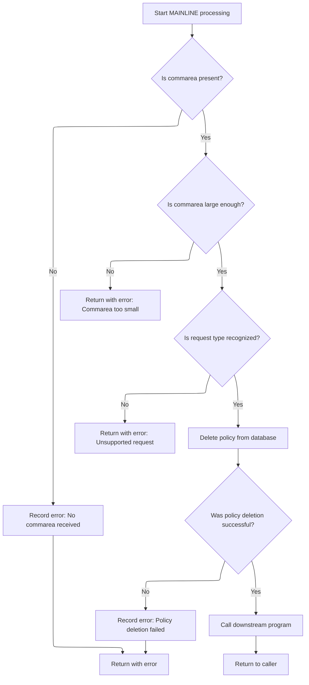
```mermaid
%%{init: {"flowchart": {"defaultRenderer": "elk"}} }%%
flowchart TD
    node1["Start MAINLINE processing"] --> node2{"Is commarea present?"}
    click node1 openCode "base/src/lgdpdb01.cbl:111:117"
    node2 -->|"No"| node3["Record error: No commarea received"]
    click node2 openCode "base/src/lgdpdb01.cbl:131:135"
    click node3 openCode "base/src/lgdpdb01.cbl:132:134"
    node3 --> node4["Return with error"]
    click node4 openCode "base/src/lgdpdb01.cbl:134:135"
    node2 -->|"Yes"| node5{"Is commarea large enough?"}
    click node5 openCode "base/src/lgdpdb01.cbl:143:146"
    node5 -->|"No"| node6["Return with error: Commarea too small"]
    click node6 openCode "base/src/lgdpdb01.cbl:144:145"
    node5 -->|"Yes"| node7{"Is request type recognized?"}
    click node7 openCode "base/src/lgdpdb01.cbl:160:172"
    node7 -->|"No"| node8["Return with error: Unsupported request"]
    click node8 openCode "base/src/lgdpdb01.cbl:165:166"
    node7 -->|"Yes"| node9["Delete policy from database"]
    click node9 openCode "base/src/lgdpdb01.cbl:167:168"
    node9 --> node12{"Was policy deletion successful?"}
    click node12 openCode "base/src/lgdpdb01.cbl:198:202"
    node12 -->|"No"| node13["Record error: Policy deletion failed"]
    click node13 openCode "base/src/lgdpdb01.cbl:199:201"
    node13 --> node4
    node12 -->|"Yes"| node10["Call downstream program"]
    click node10 openCode "base/src/lgdpdb01.cbl:168:171"
    node10 --> node11["Return to caller"]
    click node11 openCode "base/src/lgdpdb01.cbl:175:175"
classDef HeadingStyle fill:#777777,stroke:#333,stroke-width:2px;

%% Swimm:
%% %%{init: {"flowchart": {"defaultRenderer": "elk"}} }%%
%% flowchart TD
%%     node1["Start MAINLINE processing"] --> node2{"Is commarea present?"}
%%     click node1 openCode "<SwmPath>[base/src/lgdpdb01.cbl](base/src/lgdpdb01.cbl)</SwmPath>:111:117"
%%     node2 -->|"No"| node3["Record error: No commarea received"]
%%     click node2 openCode "<SwmPath>[base/src/lgdpdb01.cbl](base/src/lgdpdb01.cbl)</SwmPath>:131:135"
%%     click node3 openCode "<SwmPath>[base/src/lgdpdb01.cbl](base/src/lgdpdb01.cbl)</SwmPath>:132:134"
%%     node3 --> node4["Return with error"]
%%     click node4 openCode "<SwmPath>[base/src/lgdpdb01.cbl](base/src/lgdpdb01.cbl)</SwmPath>:134:135"
%%     node2 -->|"Yes"| node5{"Is commarea large enough?"}
%%     click node5 openCode "<SwmPath>[base/src/lgdpdb01.cbl](base/src/lgdpdb01.cbl)</SwmPath>:143:146"
%%     node5 -->|"No"| node6["Return with error: Commarea too small"]
%%     click node6 openCode "<SwmPath>[base/src/lgdpdb01.cbl](base/src/lgdpdb01.cbl)</SwmPath>:144:145"
%%     node5 -->|"Yes"| node7{"Is request type recognized?"}
%%     click node7 openCode "<SwmPath>[base/src/lgdpdb01.cbl](base/src/lgdpdb01.cbl)</SwmPath>:160:172"
%%     node7 -->|"No"| node8["Return with error: Unsupported request"]
%%     click node8 openCode "<SwmPath>[base/src/lgdpdb01.cbl](base/src/lgdpdb01.cbl)</SwmPath>:165:166"
%%     node7 -->|"Yes"| node9["Delete policy from database"]
%%     click node9 openCode "<SwmPath>[base/src/lgdpdb01.cbl](base/src/lgdpdb01.cbl)</SwmPath>:167:168"
%%     node9 --> node12{"Was policy deletion successful?"}
%%     click node12 openCode "<SwmPath>[base/src/lgdpdb01.cbl](base/src/lgdpdb01.cbl)</SwmPath>:198:202"
%%     node12 -->|"No"| node13["Record error: Policy deletion failed"]
%%     click node13 openCode "<SwmPath>[base/src/lgdpdb01.cbl](base/src/lgdpdb01.cbl)</SwmPath>:199:201"
%%     node13 --> node4
%%     node12 -->|"Yes"| node10["Call downstream program"]
%%     click node10 openCode "<SwmPath>[base/src/lgdpdb01.cbl](base/src/lgdpdb01.cbl)</SwmPath>:168:171"
%%     node10 --> node11["Return to caller"]
%%     click node11 openCode "<SwmPath>[base/src/lgdpdb01.cbl](base/src/lgdpdb01.cbl)</SwmPath>:175:175"
%% classDef HeadingStyle fill:#777777,stroke:#333,stroke-width:2px;
```

This section governs the validation and execution of policy deletion requests in the database. It ensures that only valid, recognized requests are processed, and that errors are handled and logged consistently.

| Category       | Rule Name               | Description                                                                                                                                                                                                                                                                                                                                                                                                                                                                                                                                                                                                                                                                                                                                                                                   |
| -------------- | ----------------------- | --------------------------------------------------------------------------------------------------------------------------------------------------------------------------------------------------------------------------------------------------------------------------------------------------------------------------------------------------------------------------------------------------------------------------------------------------------------------------------------------------------------------------------------------------------------------------------------------------------------------------------------------------------------------------------------------------------------------------------------------------------------------------------------------- |
| Business logic | Supported request types | Only requests with recognized request IDs (<SwmToken path="base/src/lgdpol01.cbl" pos="119:18:18" line-data="           IF ( CA-REQUEST-ID NOT EQUAL TO &#39;01DEND&#39; AND">`01DEND`</SwmToken>, <SwmToken path="base/src/lgdpol01.cbl" pos="121:14:14" line-data="                CA-REQUEST-ID NOT EQUAL TO &#39;01DHOU&#39; AND">`01DHOU`</SwmToken>, <SwmToken path="base/src/lgdpol01.cbl" pos="122:14:14" line-data="                CA-REQUEST-ID NOT EQUAL TO &#39;01DCOM&#39; )">`01DCOM`</SwmToken>, <SwmToken path="base/src/lgtestp1.cbl" pos="136:4:4" line-data="                 Move &#39;01DMOT&#39;   To CA-REQUEST-ID">`01DMOT`</SwmToken>) are permitted for policy deletion. Unrecognized request types must result in an error code indicating unsupported operation. |
| Business logic | Policy deletion outcome | Policy deletion is considered successful if the database returns SQLCODE 0 (success) or 100 (record not found). Any other SQLCODE must result in an error code and detailed error logging.                                                                                                                                                                                                                                                                                                                                                                                                                                                                                                                                                                                                    |
| Business logic | Downstream cleanup call | If a policy deletion request is successful, the process must call a downstream program to perform further cleanup operations.                                                                                                                                                                                                                                                                                                                                                                                                                                                                                                                                                                                                                                                                 |

<SwmSnippet path="/base/src/lgdpdb01.cbl" line="111">

---

MAINLINE in <SwmToken path="base/src/lgdpol01.cbl" pos="141:9:9" line-data="           EXEC CICS LINK PROGRAM(LGDPDB01)">`LGDPDB01`</SwmToken> validates the commarea, converts customer and policy numbers to <SwmToken path="base/src/lgdpdb01.cbl" pos="124:5:5" line-data="      * initialize DB2 host variables">`DB2`</SwmToken> format, and checks the request ID. If it's a recognized delete request, it deletes the policy and then links to <SwmToken path="base/src/lgdpdb01.cbl" pos="168:9:9" line-data="               EXEC CICS LINK PROGRAM(LGDPVS01)">`LGDPVS01`</SwmToken> for further cleanup. If not, it sets an error code. Error logging is handled for missing or bad input.

```cobol
       MAINLINE SECTION.

      *----------------------------------------------------------------*
      * Common code                                                    *
      *----------------------------------------------------------------*
      * initialize working storage variables
           INITIALIZE WS-HEADER.
      * set up general variable
           MOVE EIBTRNID TO WS-TRANSID.
           MOVE EIBTRMID TO WS-TERMID.
           MOVE EIBTASKN TO WS-TASKNUM.
      *----------------------------------------------------------------*

      * initialize DB2 host variables
           INITIALIZE DB2-IN-INTEGERS.

      *----------------------------------------------------------------*
      * Check commarea and obtain required details                     *
      *----------------------------------------------------------------*
      * If NO commarea received issue an ABEND
           IF EIBCALEN IS EQUAL TO ZERO
               MOVE ' NO COMMAREA RECEIVED' TO EM-VARIABLE
               PERFORM WRITE-ERROR-MESSAGE
               EXEC CICS ABEND ABCODE('LGCA') NODUMP END-EXEC
           END-IF

      * initialize commarea return code to zero
           MOVE '00' TO CA-RETURN-CODE
           MOVE EIBCALEN TO WS-CALEN.
           SET WS-ADDR-DFHCOMMAREA TO ADDRESS OF DFHCOMMAREA.

      * Check commarea is large enough
           IF EIBCALEN IS LESS THAN WS-CA-HEADER-LEN
             MOVE '98' TO CA-RETURN-CODE
             EXEC CICS RETURN END-EXEC
           END-IF

      * Convert commarea customer & policy nums to DB2 integer format
           MOVE CA-CUSTOMER-NUM TO DB2-CUSTOMERNUM-INT
           MOVE CA-POLICY-NUM   TO DB2-POLICYNUM-INT
      * and save in error msg field incase required
           MOVE CA-CUSTOMER-NUM TO EM-CUSNUM
           MOVE CA-POLICY-NUM   TO EM-POLNUM

      *----------------------------------------------------------------*
      * Check request-id in commarea and if recognised ...             *
      * Call routine to delete row from policy table                   *
      *----------------------------------------------------------------*

           IF ( CA-REQUEST-ID NOT EQUAL TO '01DEND' AND
                CA-REQUEST-ID NOT EQUAL TO '01DHOU' AND
                CA-REQUEST-ID NOT EQUAL TO '01DCOM' AND
                CA-REQUEST-ID NOT EQUAL TO '01DMOT' ) Then
      *        Request is not recognised or supported
               MOVE '99' TO CA-RETURN-CODE
           ELSE
               PERFORM DELETE-POLICY-DB2-INFO
               EXEC CICS LINK PROGRAM(LGDPVS01)
                    Commarea(DFHCOMMAREA)
                    LENGTH(32500)
               END-EXEC
           END-IF.

      * Return to caller
           EXEC CICS RETURN END-EXEC.
```

---

</SwmSnippet>

<SwmSnippet path="/base/src/lgdpdb01.cbl" line="212">

---

<SwmToken path="base/src/lgdpdb01.cbl" pos="212:1:5" line-data="       WRITE-ERROR-MESSAGE.">`WRITE-ERROR-MESSAGE`</SwmToken> in <SwmToken path="base/src/lgdpol01.cbl" pos="141:9:9" line-data="           EXEC CICS LINK PROGRAM(LGDPDB01)">`LGDPDB01`</SwmToken> logs the SQL error code, timestamps the error, and calls LGSTSQ to log the error message. If there's commarea data, it sends up to 90 bytes of that too. This keeps error logs detailed and consistent.

```cobol
       WRITE-ERROR-MESSAGE.
      * Save SQLCODE in message
           MOVE SQLCODE TO EM-SQLRC
      * Obtain and format current time and date
           EXEC CICS ASKTIME ABSTIME(WS-ABSTIME)
           END-EXEC
           EXEC CICS FORMATTIME ABSTIME(Ws-ABSTIME)
                     MMDDYYYY(WS-DATE)
                     TIME(WS-TIME)
           END-EXEC
           MOVE WS-DATE TO EM-DATE
           MOVE WS-TIME TO EM-TIME
      * Write output message to TDQ
           EXEC CICS LINK PROGRAM('LGSTSQ')
                     COMMAREA(ERROR-MSG)
                     LENGTH(LENGTH OF ERROR-MSG)
           END-EXEC.
      * Write 90 bytes or as much as we have of commarea to TDQ
           IF EIBCALEN > 0 THEN
             IF EIBCALEN < 91 THEN
               MOVE DFHCOMMAREA(1:EIBCALEN) TO CA-DATA
               EXEC CICS LINK PROGRAM('LGSTSQ')
                         COMMAREA(CA-ERROR-MSG)
                         LENGTH(LENGTH OF CA-ERROR-MSG)
               END-EXEC
             ELSE
               MOVE DFHCOMMAREA(1:90) TO CA-DATA
               EXEC CICS LINK PROGRAM('LGSTSQ')
                         COMMAREA(CA-ERROR-MSG)
                         LENGTH(LENGTH OF CA-ERROR-MSG)
               END-EXEC
             END-IF
           END-IF.
           EXIT.
```

---

</SwmSnippet>

<SwmSnippet path="/base/src/lgdpdb01.cbl" line="186">

---

<SwmToken path="base/src/lgdpdb01.cbl" pos="186:1:7" line-data="       DELETE-POLICY-DB2-INFO.">`DELETE-POLICY-DB2-INFO`</SwmToken> in <SwmToken path="base/src/lgdpol01.cbl" pos="141:9:9" line-data="           EXEC CICS LINK PROGRAM(LGDPDB01)">`LGDPDB01`</SwmToken> runs the SQL DELETE for the policy. If SQLCODE is 0 or 100, it's considered a success (even if the record wasn't found). Any other SQLCODE sets <SwmToken path="base/src/lgdpdb01.cbl" pos="199:9:13" line-data="               MOVE &#39;90&#39; TO CA-RETURN-CODE">`CA-RETURN-CODE`</SwmToken> to '90', logs the error, and returns. This keeps error handling tight and avoids failing on missing records.

```cobol
       DELETE-POLICY-DB2-INFO.

           MOVE ' DELETE POLICY  ' TO EM-SQLREQ
           EXEC SQL
             DELETE
               FROM POLICY
               WHERE ( CUSTOMERNUMBER = :DB2-CUSTOMERNUM-INT AND
                       POLICYNUMBER  = :DB2-POLICYNUM-INT      )
           END-EXEC

      *    Treat SQLCODE 0 and SQLCODE 100 (record not found) as
      *    successful - end result is record does not exist
           IF SQLCODE NOT EQUAL 0 Then
               MOVE '90' TO CA-RETURN-CODE
               PERFORM WRITE-ERROR-MESSAGE
               EXEC CICS RETURN END-EXEC
           END-IF.

           EXIT.
```

---

</SwmSnippet>

## Finishing Policy File Deletion

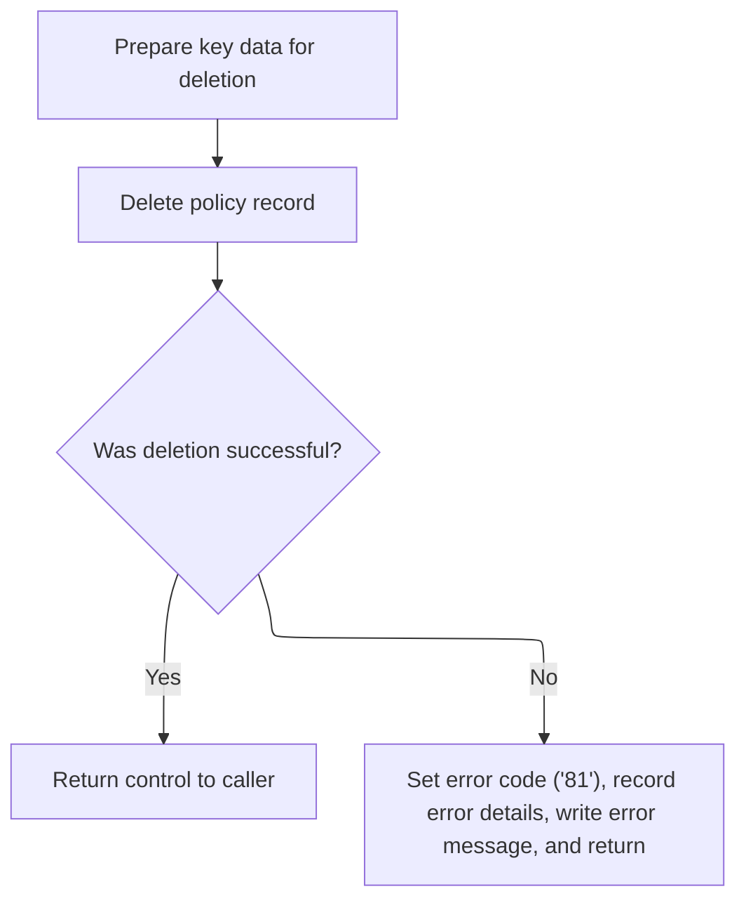
```mermaid
%%{init: {"flowchart": {"defaultRenderer": "elk"}} }%%
flowchart TD
    node1["Prepare key data for deletion"] --> node2["Delete policy record"]
    click node1 openCode "base/src/lgdpvs01.cbl:75:79"
    click node2 openCode "base/src/lgdpvs01.cbl:81:85"
    node2 --> node3{"Was deletion successful?"}
    click node3 openCode "base/src/lgdpvs01.cbl:86:91"
    node3 -->|"Yes"| node5["Return control to caller"]
    click node5 openCode "base/src/lgdpvs01.cbl:95:97"
    node3 -->|"No"| node4["Set error code ('81'), record error details, write error message, and return"]
    click node4 openCode "base/src/lgdpvs01.cbl:87:90"
    click node4 openCode "base/src/lgdpvs01.cbl:99:132"

classDef HeadingStyle fill:#777777,stroke:#333,stroke-width:2px;

%% Swimm:
%% %%{init: {"flowchart": {"defaultRenderer": "elk"}} }%%
%% flowchart TD
%%     node1["Prepare key data for deletion"] --> node2["Delete policy record"]
%%     click node1 openCode "<SwmPath>[base/src/lgdpvs01.cbl](base/src/lgdpvs01.cbl)</SwmPath>:75:79"
%%     click node2 openCode "<SwmPath>[base/src/lgdpvs01.cbl](base/src/lgdpvs01.cbl)</SwmPath>:81:85"
%%     node2 --> node3{"Was deletion successful?"}
%%     click node3 openCode "<SwmPath>[base/src/lgdpvs01.cbl](base/src/lgdpvs01.cbl)</SwmPath>:86:91"
%%     node3 -->|"Yes"| node5["Return control to caller"]
%%     click node5 openCode "<SwmPath>[base/src/lgdpvs01.cbl](base/src/lgdpvs01.cbl)</SwmPath>:95:97"
%%     node3 -->|"No"| node4["Set error code ('81'), record error details, write error message, and return"]
%%     click node4 openCode "<SwmPath>[base/src/lgdpvs01.cbl](base/src/lgdpvs01.cbl)</SwmPath>:87:90"
%%     click node4 openCode "<SwmPath>[base/src/lgdpvs01.cbl](base/src/lgdpvs01.cbl)</SwmPath>:99:132"
%% 
%% classDef HeadingStyle fill:#777777,stroke:#333,stroke-width:2px;
```

This section governs the business process for deleting a policy record from the file system, ensuring that file-level deletes are synchronized with database deletes and that any errors are consistently logged with detailed information for audit and troubleshooting purposes.

| Category        | Rule Name                     | Description                                                                                                                                                      |
| --------------- | ----------------------------- | ---------------------------------------------------------------------------------------------------------------------------------------------------------------- |
| Data validation | Valid Key Requirement         | A policy record must only be deleted if a valid policy number and customer number are provided in the request.                                                   |
| Business logic  | Detailed Error Audit Trail    | When an error occurs, the error log must include the policy number, customer number, response codes, and the date and time of the error event.                   |
| Business logic  | Contextual Error Data Logging | If additional request data is present (commarea data), up to 90 bytes of this data must be included in the error log to provide further context for the failure. |
| Business logic  | Successful Deletion Flow      | Upon successful deletion of the policy record, control must be returned to the caller without error.                                                             |

<SwmSnippet path="/base/src/lgdpvs01.cbl" line="72">

---

MAINLINE in <SwmToken path="base/src/lgdpdb01.cbl" pos="168:9:9" line-data="               EXEC CICS LINK PROGRAM(LGDPVS01)">`LGDPVS01`</SwmToken> builds the key for the VSAM file from the request and policy/customer numbers, then calls CICS to delete the record. If the delete fails, it sets a specific error code, logs the error, and returns. This keeps file-level deletes in sync with DB deletes.

```cobol
       MAINLINE SECTION.
      *
      *---------------------------------------------------------------*
           Move EIBCALEN To WS-Commarea-Len.
      *---------------------------------------------------------------*
           Move CA-Request-ID(4:1) To WF-Request-ID
           Move CA-Policy-Num      To WF-Policy-Num
           Move CA-Customer-Num    To WF-Customer-Num
      *---------------------------------------------------------------*
           Exec CICS Delete File('KSDSPOLY')
                     Ridfld(WF-Policy-Key)
                     KeyLength(21)
                     RESP(WS-RESP)
           End-Exec.
           If WS-RESP Not = DFHRESP(NORMAL)
             Move EIBRESP2 To WS-RESP2
             MOVE '81' TO CA-RETURN-CODE
             PERFORM WRITE-ERROR-MESSAGE
             EXEC CICS RETURN END-EXEC
           End-If.
```

---

</SwmSnippet>

<SwmSnippet path="/base/src/lgdpvs01.cbl" line="99">

---

<SwmToken path="base/src/lgdpvs01.cbl" pos="99:1:5" line-data="       WRITE-ERROR-MESSAGE.">`WRITE-ERROR-MESSAGE`</SwmToken> in <SwmToken path="base/src/lgdpdb01.cbl" pos="168:9:9" line-data="               EXEC CICS LINK PROGRAM(LGDPVS01)">`LGDPVS01`</SwmToken> gets the current date/time, fills out the error message with policy and response codes, and calls LGSTSQ to log it. If there's commarea data, it sends up to 90 bytes of that too. This keeps error logs detailed and consistent for file deletes.

```cobol
       WRITE-ERROR-MESSAGE.
           EXEC CICS ASKTIME ABSTIME(WS-ABSTIME)
           END-EXEC
           EXEC CICS FORMATTIME ABSTIME(WS-ABSTIME)
                     MMDDYYYY(WS-DATE)
                     TIME(WS-TIME)
           END-EXEC
      *
           MOVE WS-DATE TO EM-DATE
           MOVE WS-TIME TO EM-TIME
           Move CA-Customer-Num To EM-CUSNUM 
           Move CA-POLICY-NUM To EM-POLNUM 
           Move WS-RESP         To EM-RespRC
           Move WS-RESP2        To EM-Resp2RC
           EXEC CICS LINK PROGRAM('LGSTSQ')
                     COMMAREA(ERROR-MSG)
                     LENGTH(LENGTH OF ERROR-MSG)
           END-EXEC.
           IF EIBCALEN > 0 THEN
             IF EIBCALEN < 91 THEN
               MOVE DFHCOMMAREA(1:EIBCALEN) TO CA-DATA
               EXEC CICS LINK PROGRAM('LGSTSQ')
                         COMMAREA(CA-ERROR-MSG)
                         LENGTH(Length Of CA-ERROR-MSG)
               END-EXEC
             ELSE
               MOVE DFHCOMMAREA(1:90) TO CA-DATA
               EXEC CICS LINK PROGRAM('LGSTSQ')
                         COMMAREA(CA-ERROR-MSG)
                         LENGTH(Length Of CA-ERROR-MSG)
               END-EXEC
             END-IF
           END-IF.
           EXIT.
```

---

</SwmSnippet>

<SwmSnippet path="/base/src/lgdpvs01.cbl" line="95">

---

<SwmToken path="base/src/lgdpvs01.cbl" pos="95:1:3" line-data="       A-EXIT.">`A-EXIT`</SwmToken> just marks the end of the program and returns control to the caller. Nothing fancy here—just standard COBOL flow control.

```cobol
       A-EXIT.
           EXIT.
           GOBACK.
```

---

</SwmSnippet>

## Handling Policy Inquiry and Update Results

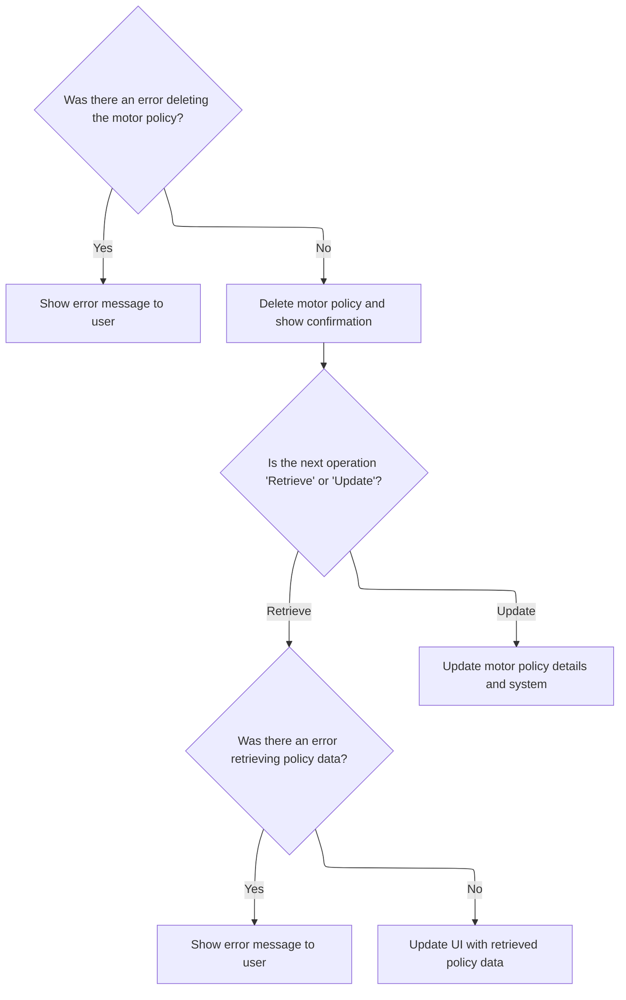
```mermaid
%%{init: {"flowchart": {"defaultRenderer": "elk"}} }%%
flowchart TD
    node1{"Was there an error deleting the motor policy?"}
    click node1 openCode "base/src/lgtestp1.cbl:143:146"
    node1 -->|"Yes"| node2["Show error message to user"]
    click node2 openCode "base/src/lgtestp1.cbl:300:302"
    node1 -->|"No"| node3["Delete motor policy and show confirmation"]
    click node3 openCode "base/src/lgtestp1.cbl:148:158"
    node3 --> node4{"Is the next operation 'Retrieve' or 'Update'?"}
    click node4 openCode "base/src/lgtestp1.cbl:169:176"
    node4 -->|"Retrieve"| node5{"Was there an error retrieving policy data?"}
    click node5 openCode "base/src/lgtestp1.cbl:177:179"
    node5 -->|"Yes"| node6["Show error message to user"]
    click node6 openCode "base/src/lgtestp1.cbl:300:302"
    node5 -->|"No"| node7["Update UI with retrieved policy data"]
    click node7 openCode "base/src/lgtestp1.cbl:181:191"
    node4 -->|"Update"| node8["Update motor policy details and system"]
    click node8 openCode "base/src/lgtestp1.cbl:200:219"
classDef HeadingStyle fill:#777777,stroke:#333,stroke-width:2px;

%% Swimm:
%% %%{init: {"flowchart": {"defaultRenderer": "elk"}} }%%
%% flowchart TD
%%     node1{"Was there an error deleting the motor policy?"}
%%     click node1 openCode "<SwmPath>[base/src/lgtestp1.cbl](base/src/lgtestp1.cbl)</SwmPath>:143:146"
%%     node1 -->|"Yes"| node2["Show error message to user"]
%%     click node2 openCode "<SwmPath>[base/src/lgtestp1.cbl](base/src/lgtestp1.cbl)</SwmPath>:300:302"
%%     node1 -->|"No"| node3["Delete motor policy and show confirmation"]
%%     click node3 openCode "<SwmPath>[base/src/lgtestp1.cbl](base/src/lgtestp1.cbl)</SwmPath>:148:158"
%%     node3 --> node4{"Is the next operation 'Retrieve' or 'Update'?"}
%%     click node4 openCode "<SwmPath>[base/src/lgtestp1.cbl](base/src/lgtestp1.cbl)</SwmPath>:169:176"
%%     node4 -->|"Retrieve"| node5{"Was there an error retrieving policy data?"}
%%     click node5 openCode "<SwmPath>[base/src/lgtestp1.cbl](base/src/lgtestp1.cbl)</SwmPath>:177:179"
%%     node5 -->|"Yes"| node6["Show error message to user"]
%%     click node6 openCode "<SwmPath>[base/src/lgtestp1.cbl](base/src/lgtestp1.cbl)</SwmPath>:300:302"
%%     node5 -->|"No"| node7["Update UI with retrieved policy data"]
%%     click node7 openCode "<SwmPath>[base/src/lgtestp1.cbl](base/src/lgtestp1.cbl)</SwmPath>:181:191"
%%     node4 -->|"Update"| node8["Update motor policy details and system"]
%%     click node8 openCode "<SwmPath>[base/src/lgtestp1.cbl](base/src/lgtestp1.cbl)</SwmPath>:200:219"
%% classDef HeadingStyle fill:#777777,stroke:#333,stroke-width:2px;
```

<SwmSnippet path="/base/src/lgtestp1.cbl" line="143">

---

Back in <SwmToken path="base/src/lgtestp1.cbl" pos="33:5:7" line-data="              GO TO A-GAIN.">`A-GAIN`</SwmToken> after returning from <SwmToken path="base/src/lgtestp1.cbl" pos="139:10:10" line-data="                 EXEC CICS LINK PROGRAM(&#39;LGDPOL01&#39;)">`LGDPOL01`</SwmToken>, we check <SwmToken path="base/src/lgtestp1.cbl" pos="143:3:7" line-data="                 IF CA-RETURN-CODE &gt; 0">`CA-RETURN-CODE`</SwmToken>. If it's set, we roll back and jump to <SwmToken path="base/src/lgtestp1.cbl" pos="145:5:7" line-data="                   GO TO NO-DELETE">`NO-DELETE`</SwmToken> to show an error message about the failed delete. This keeps the user informed and prevents partial deletes.

```cobol
                 IF CA-RETURN-CODE > 0
                   Exec CICS Syncpoint Rollback End-Exec
                   GO TO NO-DELETE
                 END-IF
```

---

</SwmSnippet>

<SwmSnippet path="/base/src/lgtestp1.cbl" line="300">

---

<SwmToken path="base/src/lgtestp1.cbl" pos="300:1:3" line-data="       NO-DELETE.">`NO-DELETE`</SwmToken> sets the error message to 'Error Deleting Motor Policy' and jumps to <SwmToken path="base/src/lgtestp1.cbl" pos="302:5:7" line-data="           Go To ERROR-OUT.">`ERROR-OUT`</SwmToken>, which handles showing the error on the menu and ending the session. This keeps error handling consistent and user-facing for delete failures.

```cobol
       NO-DELETE.
           Move 'Error Deleting Motor Policy'    To  ERP1FLDO
           Go To ERROR-OUT.
```

---

</SwmSnippet>

<SwmSnippet path="/base/src/lgtestp1.cbl" line="148">

---

Back in <SwmToken path="base/src/lgtestp1.cbl" pos="33:5:7" line-data="              GO TO A-GAIN.">`A-GAIN`</SwmToken> after <SwmToken path="base/src/lgtestp1.cbl" pos="145:5:7" line-data="                   GO TO NO-DELETE">`NO-DELETE`</SwmToken>, we clear out all the motor policy fields on the screen and set a success message saying the policy was deleted. This resets the UI for the user after a successful delete.

```cobol
                 Move Spaces            To  ENP1IDAI
                 Move Spaces            To  ENP1EDAI
                 Move Spaces            To  ENP1CMKI
                 Move Spaces            To  ENP1CMOI
                 Move Spaces            To  ENP1VALI
                 Move Spaces            To  ENP1REGI
                 Move Spaces            To  ENP1COLI
                 Move Spaces            To  ENP1CCI
                 Move Spaces            To  ENP1MANI
                 Move 'Motor Policy Deleted'
                   To  ERP1FLDO
```

---

</SwmSnippet>

<SwmSnippet path="/base/src/lgtestp1.cbl" line="159">

---

This part sends the cleared menu to the user, making sure the UI is updated after a delete.

```cobol
                 EXEC CICS SEND MAP ('SSMAPP1')
                           FROM(SSMAPP1O)
                           MAPSET ('SSMAP')
                 END-EXEC
                 EXEC CICS SEND MAP ('SSMAPP1')
                           FROM(SSMAPP1O)
                           MAPSET ('SSMAP')
                 END-EXEC
```

---

</SwmSnippet>

<SwmSnippet path="/base/src/lgtestp1.cbl" line="169">

---

Here we handle the inquiry option. We prep the commarea with the right request ID and policy/customer numbers, then call <SwmToken path="base/src/lgtestp1.cbl" pos="173:10:10" line-data="                 EXEC CICS LINK PROGRAM(&#39;LGIPOL01&#39;)">`LGIPOL01`</SwmToken> to fetch the latest policy details. This is the entry point for showing updated info after an update or inquiry.

```cobol
             WHEN '4'
                 Move '01IMOT'   To CA-REQUEST-ID
                 Move ENP1CNOO   To CA-CUSTOMER-NUM
                 Move ENP1PNOO   To CA-POLICY-NUM
                 EXEC CICS LINK PROGRAM('LGIPOL01')
                           COMMAREA(COMM-AREA)
                           LENGTH(32500)
                 END-EXEC
```

---

</SwmSnippet>

<SwmSnippet path="/base/src/lgtestp1.cbl" line="177">

---

After calling <SwmToken path="base/src/lgtestp1.cbl" pos="72:10:10" line-data="                 EXEC CICS LINK PROGRAM(&#39;LGIPOL01&#39;)">`LGIPOL01`</SwmToken>, we check <SwmToken path="base/src/lgtestp1.cbl" pos="177:3:7" line-data="                 IF CA-RETURN-CODE &gt; 0">`CA-RETURN-CODE`</SwmToken>. If it's set, we jump to <SwmToken path="base/src/lgtestp1.cbl" pos="178:5:7" line-data="                   GO TO NO-DATA">`NO-DATA`</SwmToken> to show the user that no policy data was found. This is the error path for failed inquiries.

```cobol
                 IF CA-RETURN-CODE > 0
                   GO TO NO-DATA
                 END-IF
```

---

</SwmSnippet>

<SwmSnippet path="/base/src/lgtestp1.cbl" line="181">

---

If the inquiry was successful, we move all the returned policy details from the commarea to the screen fields so the user sees the latest info. This is the data mapping step before showing the updated menu.

```cobol
                 Move CA-ISSUE-DATE     To  ENP1IDAI
                 Move CA-EXPIRY-DATE    To  ENP1EDAI
                 Move CA-M-MAKE         To  ENP1CMKI
                 Move CA-M-MODEL        To  ENP1CMOI
                 Move CA-M-VALUE        To  ENP1VALI
                 Move CA-M-REGNUMBER    To  ENP1REGI
                 Move CA-M-COLOUR       To  ENP1COLI
                 Move CA-M-CC           To  ENP1CCI
                 Move CA-M-MANUFACTURED To  ENP1MANI
                 Move CA-M-PREMIUM      To  ENP1PREI
                 Move CA-M-ACCIDENTS    To  ENP1ACCI
```

---

</SwmSnippet>

<SwmSnippet path="/base/src/lgtestp1.cbl" line="192">

---

After updating the UI fields, we send the updated menu to the user and then receive the next input. This keeps the menu interactive and ready for the next action.

```cobol
                 EXEC CICS SEND MAP ('SSMAPP1')
                           FROM(SSMAPP1O)
                           MAPSET ('SSMAP')
                 END-EXEC
                 EXEC CICS RECEIVE MAP('SSMAPP1')
                           INTO(SSMAPP1I)
                           MAPSET('SSMAP') END-EXEC
```

---

</SwmSnippet>

<SwmSnippet path="/base/src/lgtestp1.cbl" line="200">

---

Here we prep the commarea for an update request by moving all the updated UI fields into the commarea. This sets up the data for the backend update call.

```cobol
                 Move '01UMOT'          To CA-REQUEST-ID
                 Move ENP1CNOI          To CA-CUSTOMER-NUM
                 Move 0                 To CA-PAYMENT
                 Move 0                 To CA-BROKERID
                 Move '        '        To CA-BROKERSREF
                 Move ENP1IDAI          To CA-ISSUE-DATE
                 Move ENP1EDAI          To CA-EXPIRY-DATE
                 Move ENP1CMKI          To CA-M-MAKE
                 Move ENP1CMOI          To CA-M-MODEL
                 Move ENP1VALI          To CA-M-VALUE
                 Move ENP1REGI          To CA-M-REGNUMBER
                 Move ENP1COLI          To CA-M-COLOUR
                 Move ENP1CCI           To CA-M-CC
                 Move ENP1MANI          To CA-M-MANUFACTURED
                 Move ENP1PREI          To CA-M-PREMIUM
                 Move ENP1ACCI          To CA-M-ACCIDENTS
```

---

</SwmSnippet>

<SwmSnippet path="/base/src/lgtestp1.cbl" line="216">

---

After prepping the commarea, we call <SwmToken path="base/src/lgtestp1.cbl" pos="216:10:10" line-data="                 EXEC CICS LINK PROGRAM(&#39;LGUPOL01&#39;)">`LGUPOL01`</SwmToken> to process the policy update. This hands off the update logic to the backend, which validates and applies the changes to the database.

```cobol
                 EXEC CICS LINK PROGRAM('LGUPOL01')
                           COMMAREA(COMM-AREA)
                           LENGTH(32500)
                 END-EXEC
```

---

</SwmSnippet>

## Validating and Executing Policy Updates

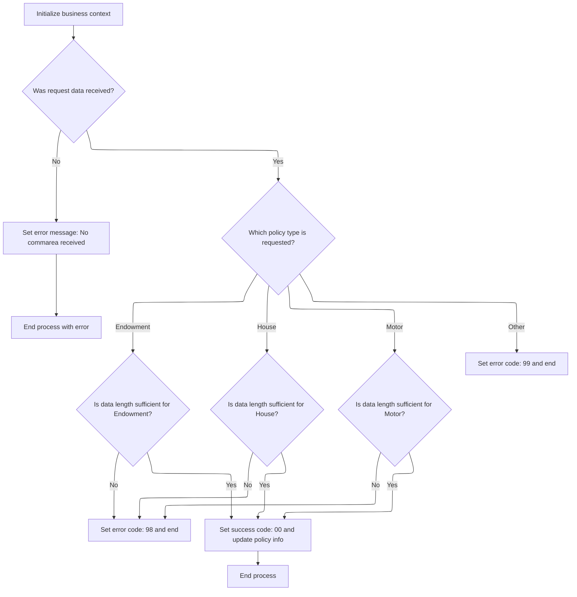
```mermaid
%%{init: {"flowchart": {"defaultRenderer": "elk"}} }%%
flowchart TD
    node1["Initialize business context"] --> node2{"Was request data received?"}
    click node1 openCode "base/src/lgupol01.cbl:89:93"
    node2 -->|"No"| node3["Set error message: No commarea received"]
    click node2 openCode "base/src/lgupol01.cbl:99:103"
    node3 --> node4["End process with error"]
    click node3 openCode "base/src/lgupol01.cbl:100:102"
    node2 -->|"Yes"| node5{"Which policy type is requested?"}
    click node5 openCode "base/src/lgupol01.cbl:113:141"
    node5 -->|"Endowment"| node6{"Is data length sufficient for Endowment?"}
    click node6 openCode "base/src/lgupol01.cbl:115:121"
    node5 -->|"House"| node7{"Is data length sufficient for House?"}
    click node7 openCode "base/src/lgupol01.cbl:123:129"
    node5 -->|"Motor"| node8{"Is data length sufficient for Motor?"}
    click node8 openCode "base/src/lgupol01.cbl:131:137"
    node5 -->|"Other"| node9["Set error code: 99 and end"]
    click node9 openCode "base/src/lgupol01.cbl:139:141"
    node6 -->|"No"| node10["Set error code: 98 and end"]
    click node10 openCode "base/src/lgupol01.cbl:119:120"
    node6 -->|"Yes"| node11["Set success code: 00 and update policy info"]
    click node11 openCode "base/src/lgupol01.cbl:143:143"
    node7 -->|"No"| node10
    node7 -->|"Yes"| node11
    node8 -->|"No"| node10
    node8 -->|"Yes"| node11
    node11 --> node12["End process"]
    click node12 openCode "base/src/lgupol01.cbl:143:143"

classDef HeadingStyle fill:#777777,stroke:#333,stroke-width:2px;

%% Swimm:
%% %%{init: {"flowchart": {"defaultRenderer": "elk"}} }%%
%% flowchart TD
%%     node1["Initialize business context"] --> node2{"Was request data received?"}
%%     click node1 openCode "<SwmPath>[base/src/lgupol01.cbl](base/src/lgupol01.cbl)</SwmPath>:89:93"
%%     node2 -->|"No"| node3["Set error message: No commarea received"]
%%     click node2 openCode "<SwmPath>[base/src/lgupol01.cbl](base/src/lgupol01.cbl)</SwmPath>:99:103"
%%     node3 --> node4["End process with error"]
%%     click node3 openCode "<SwmPath>[base/src/lgupol01.cbl](base/src/lgupol01.cbl)</SwmPath>:100:102"
%%     node2 -->|"Yes"| node5{"Which policy type is requested?"}
%%     click node5 openCode "<SwmPath>[base/src/lgupol01.cbl](base/src/lgupol01.cbl)</SwmPath>:113:141"
%%     node5 -->|"Endowment"| node6{"Is data length sufficient for Endowment?"}
%%     click node6 openCode "<SwmPath>[base/src/lgupol01.cbl](base/src/lgupol01.cbl)</SwmPath>:115:121"
%%     node5 -->|"House"| node7{"Is data length sufficient for House?"}
%%     click node7 openCode "<SwmPath>[base/src/lgupol01.cbl](base/src/lgupol01.cbl)</SwmPath>:123:129"
%%     node5 -->|"Motor"| node8{"Is data length sufficient for Motor?"}
%%     click node8 openCode "<SwmPath>[base/src/lgupol01.cbl](base/src/lgupol01.cbl)</SwmPath>:131:137"
%%     node5 -->|"Other"| node9["Set error code: 99 and end"]
%%     click node9 openCode "<SwmPath>[base/src/lgupol01.cbl](base/src/lgupol01.cbl)</SwmPath>:139:141"
%%     node6 -->|"No"| node10["Set error code: 98 and end"]
%%     click node10 openCode "<SwmPath>[base/src/lgupol01.cbl](base/src/lgupol01.cbl)</SwmPath>:119:120"
%%     node6 -->|"Yes"| node11["Set success code: 00 and update policy info"]
%%     click node11 openCode "<SwmPath>[base/src/lgupol01.cbl](base/src/lgupol01.cbl)</SwmPath>:143:143"
%%     node7 -->|"No"| node10
%%     node7 -->|"Yes"| node11
%%     node8 -->|"No"| node10
%%     node8 -->|"Yes"| node11
%%     node11 --> node12["End process"]
%%     click node12 openCode "<SwmPath>[base/src/lgupol01.cbl](base/src/lgupol01.cbl)</SwmPath>:143:143"
%% 
%% classDef HeadingStyle fill:#777777,stroke:#333,stroke-width:2px;
```

This section governs the validation and execution of policy update requests. It ensures that only requests with sufficient and correct data are processed, and that errors are handled and logged consistently.

| Category        | Rule Name                      | Description                                                                                                                                                                                                                                                                                                                                 |
| --------------- | ------------------------------ | ------------------------------------------------------------------------------------------------------------------------------------------------------------------------------------------------------------------------------------------------------------------------------------------------------------------------------------------- |
| Data validation | Valid policy type enforcement  | The policy type requested must be recognized as 'Endowment', 'House', or 'Motor'. Any other request type must result in a return code of '99' and the process must end without updating the policy.                                                                                                                                         |
| Data validation | Minimum data length per policy | For each recognized policy type, the commarea length must meet or exceed the required minimum: 152 bytes for Endowment (28 header + 124 policy), 158 bytes for House (28 header + 130 policy), and 165 bytes for Motor (28 header + 137 policy). If the length is insufficient, a return code of '98' must be set and the process must end. |
| Business logic  | Successful update execution    | If the request passes all validation checks, the policy information must be updated in the database and a success code ('00') must be set in the response.                                                                                                                                                                                  |

<SwmSnippet path="/base/src/lgupol01.cbl" line="83">

---

In MAINLINE (<SwmToken path="base/src/lgtestp1.cbl" pos="216:10:10" line-data="                 EXEC CICS LINK PROGRAM(&#39;LGUPOL01&#39;)">`LGUPOL01`</SwmToken>), we check the commarea length against the expected size for the policy type (using constants for each type). If it's too short or the request ID is unrecognized, we set an error code and return. If it's valid, we move on to updating the policy in the DB.

```cobol
       MAINLINE SECTION.

      *----------------------------------------------------------------*
      * Common code                                                    *
      *----------------------------------------------------------------*
      * initialize working storage variables
           INITIALIZE WS-HEADER.
      * set up general variable
           MOVE EIBTRNID TO WS-TRANSID.
           MOVE EIBTRMID TO WS-TERMID.
           MOVE EIBTASKN TO WS-TASKNUM.

      *----------------------------------------------------------------*
      * Check commarea and obtain required details                     *
      *----------------------------------------------------------------*
      * If NO commarea received issue an ABEND
           IF EIBCALEN IS EQUAL TO ZERO
               MOVE ' NO COMMAREA RECEIVED' TO EM-VARIABLE
               PERFORM WRITE-ERROR-MESSAGE
               EXEC CICS ABEND ABCODE('LGCA') NODUMP END-EXEC
           END-IF
      * initialize commarea return code to zero
           MOVE '00' TO CA-RETURN-CODE
           MOVE EIBCALEN TO WS-CALEN.
           SET WS-ADDR-DFHCOMMAREA TO ADDRESS OF DFHCOMMAREA.

      *----------------------------------------------------------------*
      * Check which policy type is being requested                     *
      *   and chec commarea length                                     *
      *----------------------------------------------------------------*
           EVALUATE CA-REQUEST-ID

             WHEN '01UEND'
               ADD WS-CA-HEADER-LEN  TO WS-REQUIRED-CA-LEN
               ADD WS-FULL-ENDOW-LEN TO WS-REQUIRED-CA-LEN
               IF EIBCALEN IS LESS THAN WS-REQUIRED-CA-LEN
                 MOVE '98' TO CA-RETURN-CODE
                 EXEC CICS RETURN END-EXEC
               END-IF

             WHEN '01UHOU'
               ADD WS-CA-HEADER-LEN  TO WS-REQUIRED-CA-LEN
               ADD WS-FULL-HOUSE-LEN TO WS-REQUIRED-CA-LEN
               IF EIBCALEN IS LESS THAN WS-REQUIRED-CA-LEN
                 MOVE '98' TO CA-RETURN-CODE
                 EXEC CICS RETURN END-EXEC
               END-IF

             WHEN '01UMOT'
               ADD WS-CA-HEADER-LEN  TO WS-REQUIRED-CA-LEN
               ADD WS-FULL-MOTOR-LEN TO WS-REQUIRED-CA-LEN
               IF EIBCALEN IS LESS THAN WS-REQUIRED-CA-LEN
                 MOVE '98' TO CA-RETURN-CODE
                 EXEC CICS RETURN END-EXEC
               END-IF

             WHEN OTHER
               MOVE '99' TO CA-RETURN-CODE
           END-EVALUATE

           PERFORM UPDATE-POLICY-DB2-INFO.
```

---

</SwmSnippet>

<SwmSnippet path="/base/src/lgupol01.cbl" line="169">

---

<SwmToken path="base/src/lgupol01.cbl" pos="169:1:5" line-data="       WRITE-ERROR-MESSAGE.">`WRITE-ERROR-MESSAGE`</SwmToken> in <SwmToken path="base/src/lgtestp1.cbl" pos="216:10:10" line-data="                 EXEC CICS LINK PROGRAM(&#39;LGUPOL01&#39;)">`LGUPOL01`</SwmToken> gets the current date/time, fills out the error message, and calls LGSTSQ to log it. If there's commarea data, it sends up to 90 bytes of that too. This keeps error logs detailed and consistent for update failures.

```cobol
       WRITE-ERROR-MESSAGE.
      * Save SQLCODE in message
      * Obtain and format current time and date
           EXEC CICS ASKTIME ABSTIME(WS-ABSTIME)
           END-EXEC
           EXEC CICS FORMATTIME ABSTIME(WS-ABSTIME)
                     MMDDYYYY(WS-DATE)
                     TIME(WS-TIME)
           END-EXEC
           MOVE WS-DATE TO EM-DATE
           MOVE WS-TIME TO EM-TIME
      * Write output message to TDQ
           EXEC CICS LINK PROGRAM('LGSTSQ')
                     COMMAREA(ERROR-MSG)
                     LENGTH(LENGTH OF ERROR-MSG)
           END-EXEC.
      * Write 90 bytes or as much as we have of commarea to TDQ
           IF EIBCALEN > 0 THEN
             IF EIBCALEN < 91 THEN
               MOVE DFHCOMMAREA(1:EIBCALEN) TO CA-DATA
               EXEC CICS LINK PROGRAM('LGSTSQ')
                         COMMAREA(CA-ERROR-MSG)
                         LENGTH(LENGTH OF CA-ERROR-MSG)
               END-EXEC
             ELSE
               MOVE DFHCOMMAREA(1:90) TO CA-DATA
               EXEC CICS LINK PROGRAM('LGSTSQ')
                         COMMAREA(CA-ERROR-MSG)
                         LENGTH(LENGTH OF CA-ERROR-MSG)
               END-EXEC
             END-IF
           END-IF.
           EXIT.
```

---

</SwmSnippet>

<SwmSnippet path="/base/src/lgupol01.cbl" line="83">

---

After all the checks in MAINLINE (<SwmToken path="base/src/lgtestp1.cbl" pos="216:10:10" line-data="                 EXEC CICS LINK PROGRAM(&#39;LGUPOL01&#39;)">`LGUPOL01`</SwmToken>), if the commarea is valid, we call <SwmToken path="base/src/lgupol01.cbl" pos="143:3:9" line-data="           PERFORM UPDATE-POLICY-DB2-INFO.">`UPDATE-POLICY-DB2-INFO`</SwmToken> to actually update the policy in the DB. This keeps the validation and update logic separate and clean.

```cobol
       MAINLINE SECTION.

      *----------------------------------------------------------------*
      * Common code                                                    *
      *----------------------------------------------------------------*
      * initialize working storage variables
           INITIALIZE WS-HEADER.
      * set up general variable
           MOVE EIBTRNID TO WS-TRANSID.
           MOVE EIBTRMID TO WS-TERMID.
           MOVE EIBTASKN TO WS-TASKNUM.

      *----------------------------------------------------------------*
      * Check commarea and obtain required details                     *
      *----------------------------------------------------------------*
      * If NO commarea received issue an ABEND
           IF EIBCALEN IS EQUAL TO ZERO
               MOVE ' NO COMMAREA RECEIVED' TO EM-VARIABLE
               PERFORM WRITE-ERROR-MESSAGE
               EXEC CICS ABEND ABCODE('LGCA') NODUMP END-EXEC
           END-IF
      * initialize commarea return code to zero
           MOVE '00' TO CA-RETURN-CODE
           MOVE EIBCALEN TO WS-CALEN.
           SET WS-ADDR-DFHCOMMAREA TO ADDRESS OF DFHCOMMAREA.

      *----------------------------------------------------------------*
      * Check which policy type is being requested                     *
      *   and chec commarea length                                     *
      *----------------------------------------------------------------*
           EVALUATE CA-REQUEST-ID

             WHEN '01UEND'
               ADD WS-CA-HEADER-LEN  TO WS-REQUIRED-CA-LEN
               ADD WS-FULL-ENDOW-LEN TO WS-REQUIRED-CA-LEN
               IF EIBCALEN IS LESS THAN WS-REQUIRED-CA-LEN
                 MOVE '98' TO CA-RETURN-CODE
                 EXEC CICS RETURN END-EXEC
               END-IF

             WHEN '01UHOU'
               ADD WS-CA-HEADER-LEN  TO WS-REQUIRED-CA-LEN
               ADD WS-FULL-HOUSE-LEN TO WS-REQUIRED-CA-LEN
               IF EIBCALEN IS LESS THAN WS-REQUIRED-CA-LEN
                 MOVE '98' TO CA-RETURN-CODE
                 EXEC CICS RETURN END-EXEC
               END-IF

             WHEN '01UMOT'
               ADD WS-CA-HEADER-LEN  TO WS-REQUIRED-CA-LEN
               ADD WS-FULL-MOTOR-LEN TO WS-REQUIRED-CA-LEN
               IF EIBCALEN IS LESS THAN WS-REQUIRED-CA-LEN
                 MOVE '98' TO CA-RETURN-CODE
                 EXEC CICS RETURN END-EXEC
               END-IF

             WHEN OTHER
               MOVE '99' TO CA-RETURN-CODE
           END-EVALUATE

           PERFORM UPDATE-POLICY-DB2-INFO.
```

---

</SwmSnippet>

## Delegating Policy Update to Database Layer

This section ensures that all policy update operations are routed to the database layer, which is responsible for executing the actual update in the database. This separation allows business logic to remain independent of database-specific details.

<SwmSnippet path="/base/src/lgupol01.cbl" line="155">

---

<SwmToken path="base/src/lgupol01.cbl" pos="155:1:7" line-data="       UPDATE-POLICY-DB2-INFO.">`UPDATE-POLICY-DB2-INFO`</SwmToken> in <SwmToken path="base/src/lgtestp1.cbl" pos="216:10:10" line-data="                 EXEC CICS LINK PROGRAM(&#39;LGUPOL01&#39;)">`LGUPOL01`</SwmToken> links to <SwmToken path="base/src/lgupol01.cbl" pos="157:9:9" line-data="           EXEC CICS LINK Program(LGUPDB01)">`LGUPDB01`</SwmToken>, passing the commarea for the actual <SwmToken path="base/src/lgupol01.cbl" pos="155:5:5" line-data="       UPDATE-POLICY-DB2-INFO.">`DB2`</SwmToken> update operation. This lets <SwmToken path="base/src/lgupol01.cbl" pos="157:9:9" line-data="           EXEC CICS LINK Program(LGUPDB01)">`LGUPDB01`</SwmToken> handle all the DB-specific update logic, keeping the business logic clean.

```cobol
       UPDATE-POLICY-DB2-INFO.

           EXEC CICS LINK Program(LGUPDB01)
                Commarea(DFHCOMMAREA)
                LENGTH(32500)
           END-EXEC.

           EXIT.
```

---

</SwmSnippet>

## Coordinating Policy Update and Error Logging

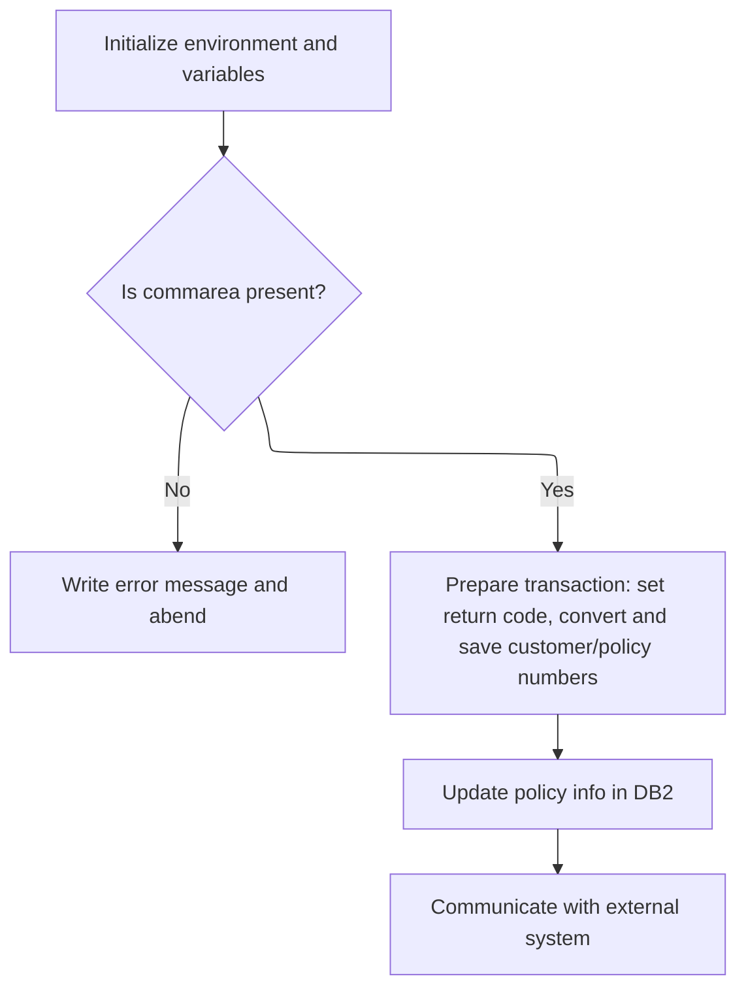
```mermaid
%%{init: {"flowchart": {"defaultRenderer": "elk"}} }%%
flowchart TD
    node1["Initialize environment and variables"]
    click node1 openCode "base/src/lgupdb01.cbl:168:178"
    node1 --> node2{"Is commarea present?"}
    click node2 openCode "base/src/lgupdb01.cbl:183:187"
    node2 -->|"No"| node3["Write error message and abend"]
    click node3 openCode "base/src/lgupdb01.cbl:184:186"
    node2 -->|"Yes"| node4["Prepare transaction: set return code, convert and save customer/policy numbers"]
    click node4 openCode "base/src/lgupdb01.cbl:190:199"
    node4 --> node5["Update policy info in DB2"]
    click node5 openCode "base/src/lgupdb01.cbl:207:207"
    node5 --> node6["Communicate with external system"]
    click node6 openCode "base/src/lgupdb01.cbl:209:212"
classDef HeadingStyle fill:#777777,stroke:#333,stroke-width:2px;

%% Swimm:
%% %%{init: {"flowchart": {"defaultRenderer": "elk"}} }%%
%% flowchart TD
%%     node1["Initialize environment and variables"]
%%     click node1 openCode "<SwmPath>[base/src/lgupdb01.cbl](base/src/lgupdb01.cbl)</SwmPath>:168:178"
%%     node1 --> node2{"Is commarea present?"}
%%     click node2 openCode "<SwmPath>[base/src/lgupdb01.cbl](base/src/lgupdb01.cbl)</SwmPath>:183:187"
%%     node2 -->|"No"| node3["Write error message and abend"]
%%     click node3 openCode "<SwmPath>[base/src/lgupdb01.cbl](base/src/lgupdb01.cbl)</SwmPath>:184:186"
%%     node2 -->|"Yes"| node4["Prepare transaction: set return code, convert and save customer/policy numbers"]
%%     click node4 openCode "<SwmPath>[base/src/lgupdb01.cbl](base/src/lgupdb01.cbl)</SwmPath>:190:199"
%%     node4 --> node5["Update policy info in <SwmToken path="base/src/lgipdb01.cbl" pos="242:5:5" line-data="      * initialize DB2 host variables">`DB2`</SwmToken>"]
%%     click node5 openCode "<SwmPath>[base/src/lgupdb01.cbl](base/src/lgupdb01.cbl)</SwmPath>:207:207"
%%     node5 --> node6["Communicate with external system"]
%%     click node6 openCode "<SwmPath>[base/src/lgupdb01.cbl](base/src/lgupdb01.cbl)</SwmPath>:209:212"
%% classDef HeadingStyle fill:#777777,stroke:#333,stroke-width:2px;
```

This section is responsible for coordinating the update of policy information in the database and external systems, while ensuring that errors are logged with sufficient detail for troubleshooting. It validates the presence of required input data, prepares and updates policy records, and logs errors with contextual information if issues arise.

| Category       | Rule Name              | Description                                                                                                                                                                                    |
| -------------- | ---------------------- | ---------------------------------------------------------------------------------------------------------------------------------------------------------------------------------------------- |
| Business logic | Detailed Error Logging | When an error occurs, an error message must be logged with the current date, time, customer number, policy number, and SQL return code, ensuring traceability and context for troubleshooting. |

<SwmSnippet path="/base/src/lgupdb01.cbl" line="162">

---

MAINLINE checks the commarea, preps <SwmToken path="base/src/lgupdb01.cbl" pos="175:5:5" line-data="      * initialize DB2 host variables">`DB2`</SwmToken> variables, updates the <SwmToken path="base/src/lgupdb01.cbl" pos="175:5:5" line-data="      * initialize DB2 host variables">`DB2`</SwmToken> policy tables, and then calls <SwmToken path="base/src/lgupdb01.cbl" pos="209:9:9" line-data="           EXEC CICS LINK Program(LGUPVS01)">`LGUPVS01`</SwmToken> to update the VSAM file. Error logging is handled if anything's off.

```cobol
       MAINLINE SECTION.

      *----------------------------------------------------------------*
      * Common code                                                    *
      *----------------------------------------------------------------*
      * initialize working storage variables
           INITIALIZE WS-HEADER.
      * set up general variable
           MOVE EIBTRNID TO WS-TRANSID.
           MOVE EIBTRMID TO WS-TERMID.
           MOVE EIBTASKN TO WS-TASKNUM.
           MOVE SPACES   TO WS-RETRY.
      *----------------------------------------------------------------*
      * initialize DB2 host variables
           INITIALIZE DB2-POLICY.
           INITIALIZE DB2-IN-INTEGERS.

      *----------------------------------------------------------------*
      * Check commarea and obtain required details                     *
      *----------------------------------------------------------------*
      * If NO commarea received issue an ABEND
           IF EIBCALEN IS EQUAL TO ZERO
               MOVE ' NO COMMAREA RECEIVED' TO EM-VARIABLE
               PERFORM WRITE-ERROR-MESSAGE
               EXEC CICS ABEND ABCODE('LGCA') NODUMP END-EXEC
           END-IF

      * initialize commarea return code to zero
           MOVE '00' TO CA-RETURN-CODE
           MOVE EIBCALEN TO WS-CALEN.
           SET WS-ADDR-DFHCOMMAREA TO ADDRESS OF DFHCOMMAREA.

      * Convert commarea customer & policy nums to DB2 integer format
           MOVE CA-CUSTOMER-NUM TO DB2-CUSTOMERNUM-INT
           MOVE CA-POLICY-NUM   TO DB2-POLICYNUM-INT
      * and save in error msg field incase required
           MOVE CA-CUSTOMER-NUM TO EM-CUSNUM
           MOVE CA-POLICY-NUM   TO EM-POLNUM

      *----------------------------------------------------------------*
      * Check which policy type is being requested                     *
      *   and check commarea length                                    *
      *----------------------------------------------------------------*

      *    Call procedure to update required tables
           PERFORM UPDATE-POLICY-DB2-INFO.

           EXEC CICS LINK Program(LGUPVS01)
                Commarea(DFHCOMMAREA)
                LENGTH(225)
           END-EXEC.
```

---

</SwmSnippet>

<SwmSnippet path="/base/src/lgupdb01.cbl" line="502">

---

<SwmToken path="base/src/lgupdb01.cbl" pos="502:1:5" line-data="       WRITE-ERROR-MESSAGE.">`WRITE-ERROR-MESSAGE`</SwmToken> here logs SQL errors by formatting the error message and sending it to LGSTSQ. If there's commarea data, it sends up to 90 bytes of that as a separate message. The 90-byte limit is arbitrary and not configurable, so longer commareas get truncated in the logs. The function assumes the error message structures are correctly formatted for LGSTSQ to process.

```cobol
       WRITE-ERROR-MESSAGE.
      * Save SQLCODE in message
           MOVE SQLCODE TO EM-SQLRC
      * Obtain and format current time and date
           EXEC CICS ASKTIME ABSTIME(WS-ABSTIME)
           END-EXEC
           EXEC CICS FORMATTIME ABSTIME(WS-ABSTIME)
                     MMDDYYYY(WS-DATE)
                     TIME(WS-TIME)
           END-EXEC
           MOVE WS-DATE TO EM-DATE
           MOVE WS-TIME TO EM-TIME
      * Write output message to TDQ
           EXEC CICS LINK PROGRAM('LGSTSQ')
                     COMMAREA(ERROR-MSG)
                     LENGTH(LENGTH OF ERROR-MSG)
           END-EXEC.
      * Write 90 bytes or as much as we have of commarea to TDQ
           IF EIBCALEN > 0 THEN
             IF EIBCALEN < 91 THEN
               MOVE DFHCOMMAREA(1:EIBCALEN) TO CA-DATA
               EXEC CICS LINK PROGRAM('LGSTSQ')
                         COMMAREA(CA-ERROR-MSG)
                         LENGTH(LENGTH OF CA-ERROR-MSG)
               END-EXEC
             ELSE
               MOVE DFHCOMMAREA(1:90) TO CA-DATA
               EXEC CICS LINK PROGRAM('LGSTSQ')
                         COMMAREA(CA-ERROR-MSG)
                         LENGTH(LENGTH OF CA-ERROR-MSG)
               END-EXEC
             END-IF
           END-IF.
           EXIT.
```

---

</SwmSnippet>

## Updating Policy Data in <SwmToken path="base/src/lgipdb01.cbl" pos="242:5:5" line-data="      * initialize DB2 host variables">`DB2`</SwmToken> and Handling Concurrency

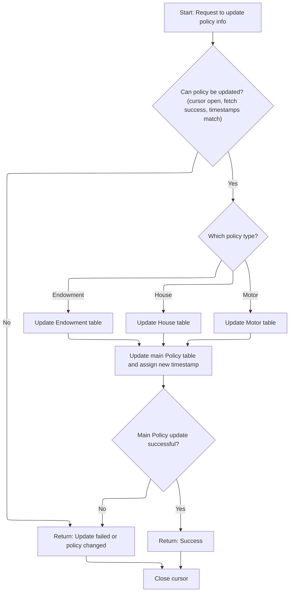
```mermaid
%%{init: {"flowchart": {"defaultRenderer": "elk"}} }%%
flowchart TD
    node1["Start: Request to update policy info"] --> node2{"Can policy be updated? (cursor open, fetch success, timestamps match)"}
    click node1 openCode "base/src/lgupdb01.cbl:251:253"
    click node2 openCode "base/src/lgupdb01.cbl:254:278"
    node2 -->|"Yes"| node3{"Which policy type?"}
    node2 -->|"No"| node8["Return: Update failed or policy changed"]
    click node8 openCode "base/src/lgupdb01.cbl:346:357"
    node3 -->|"Endowment"| node4["Update Endowment table"]
    click node4 openCode "base/src/lgupdb01.cbl:387:418"
    node3 -->|"House"| node5["Update House table"]
    click node5 openCode "base/src/lgupdb01.cbl:424:454"
    node3 -->|"Motor"| node6["Update Motor table"]
    click node6 openCode "base/src/lgupdb01.cbl:460:495"
    node4 --> node7["Update main Policy table and assign new timestamp"]
    node5 --> node7
    node6 --> node7
    click node7 openCode "base/src/lgupdb01.cbl:317:335"
    node7 --> node9{"Main Policy update successful?"}
    click node9 openCode "base/src/lgupdb01.cbl:336:342"
    node9 -->|"Yes"| node10["Return: Success"]
    click node10 openCode "base/src/lgupdb01.cbl:329:335"
    node9 -->|"No"| node8
    node10 --> node11["Close cursor"]
    node8 --> node11
    click node11 openCode "base/src/lgupdb01.cbl:362:381"
classDef HeadingStyle fill:#777777,stroke:#333,stroke-width:2px;

%% Swimm:
%% %%{init: {"flowchart": {"defaultRenderer": "elk"}} }%%
%% flowchart TD
%%     node1["Start: Request to update policy info"] --> node2{"Can policy be updated? (cursor open, fetch success, timestamps match)"}
%%     click node1 openCode "<SwmPath>[base/src/lgupdb01.cbl](base/src/lgupdb01.cbl)</SwmPath>:251:253"
%%     click node2 openCode "<SwmPath>[base/src/lgupdb01.cbl](base/src/lgupdb01.cbl)</SwmPath>:254:278"
%%     node2 -->|"Yes"| node3{"Which policy type?"}
%%     node2 -->|"No"| node8["Return: Update failed or policy changed"]
%%     click node8 openCode "<SwmPath>[base/src/lgupdb01.cbl](base/src/lgupdb01.cbl)</SwmPath>:346:357"
%%     node3 -->|"Endowment"| node4["Update Endowment table"]
%%     click node4 openCode "<SwmPath>[base/src/lgupdb01.cbl](base/src/lgupdb01.cbl)</SwmPath>:387:418"
%%     node3 -->|"House"| node5["Update House table"]
%%     click node5 openCode "<SwmPath>[base/src/lgupdb01.cbl](base/src/lgupdb01.cbl)</SwmPath>:424:454"
%%     node3 -->|"Motor"| node6["Update Motor table"]
%%     click node6 openCode "<SwmPath>[base/src/lgupdb01.cbl](base/src/lgupdb01.cbl)</SwmPath>:460:495"
%%     node4 --> node7["Update main Policy table and assign new timestamp"]
%%     node5 --> node7
%%     node6 --> node7
%%     click node7 openCode "<SwmPath>[base/src/lgupdb01.cbl](base/src/lgupdb01.cbl)</SwmPath>:317:335"
%%     node7 --> node9{"Main Policy update successful?"}
%%     click node9 openCode "<SwmPath>[base/src/lgupdb01.cbl](base/src/lgupdb01.cbl)</SwmPath>:336:342"
%%     node9 -->|"Yes"| node10["Return: Success"]
%%     click node10 openCode "<SwmPath>[base/src/lgupdb01.cbl](base/src/lgupdb01.cbl)</SwmPath>:329:335"
%%     node9 -->|"No"| node8
%%     node10 --> node11["Close cursor"]
%%     node8 --> node11
%%     click node11 openCode "<SwmPath>[base/src/lgupdb01.cbl](base/src/lgupdb01.cbl)</SwmPath>:362:381"
%% classDef HeadingStyle fill:#777777,stroke:#333,stroke-width:2px;
```

This section governs the business logic for updating policy data in the <SwmToken path="base/src/lgipdb01.cbl" pos="242:5:5" line-data="      * initialize DB2 host variables">`DB2`</SwmToken> database, ensuring concurrency control, correct routing based on policy type, and robust error handling. It ensures that only valid and current policy records are updated, and that all changes are properly logged and resources are cleaned up.

| Category       | Rule Name                                | Description                                                                                                                                                                                                           |
| -------------- | ---------------------------------------- | --------------------------------------------------------------------------------------------------------------------------------------------------------------------------------------------------------------------- |
| Business logic | Policy type routing                      | The system must route the update to the correct policy type table (endowment, house, or motor) based on the policy type specified in the request. Only the relevant table is updated for each policy type.            |
| Business logic | Main policy update and timestamp refresh | After a successful update to the policy type table, the main policy table must be updated with new details and a refreshed timestamp. The new timestamp must be returned to the caller for future concurrency checks. |

<SwmSnippet path="/base/src/lgupdb01.cbl" line="251">

---

<SwmToken path="base/src/lgupdb01.cbl" pos="251:1:7" line-data="       UPDATE-POLICY-DB2-INFO.">`UPDATE-POLICY-DB2-INFO`</SwmToken> opens a <SwmToken path="base/src/lgupdb01.cbl" pos="251:5:5" line-data="       UPDATE-POLICY-DB2-INFO.">`DB2`</SwmToken> cursor, fetches the policy row, and checks if the timestamp matches what's in the commarea. If it matches, it updates the specific policy type table (endowment, house, or motor) by calling the relevant routine. If any update fails, it logs the error and closes the cursor. After a successful update, it updates the main policy table and fetches the new timestamp. The cursor is always closed at the end to clean up resources.

```cobol
       UPDATE-POLICY-DB2-INFO.

      *    Open the cursor.
           MOVE ' OPEN   PCURSOR ' TO EM-SQLREQ
           EXEC SQL
             OPEN POLICY_CURSOR
           END-EXEC

           Evaluate SQLCODE
             When 0
               MOVE '00' TO CA-RETURN-CODE
             When -913
               MOVE '90' TO CA-RETURN-CODE
               PERFORM WRITE-ERROR-MESSAGE
               EXEC CICS RETURN END-EXEC
             When Other
               MOVE '90' TO CA-RETURN-CODE
               PERFORM WRITE-ERROR-MESSAGE
               EXEC CICS RETURN END-EXEC
           END-Evaluate.

      *    Fetch the first row (we only expect one matching row)
           PERFORM FETCH-DB2-POLICY-ROW

           IF SQLCODE = 0
      *      Fetch was successful
      *      Compare timestamp in commarea with that in DB2
             IF CA-LASTCHANGED EQUAL TO DB2-LASTCHANGED

      *----------------------------------------------------------------*
      *      Select for Update and Update specific policy type table   *
      *----------------------------------------------------------------*
             EVALUATE CA-REQUEST-ID

      *** Endowment ***
               WHEN '01UEND'
      *          Call routine to update Endowment table
                 PERFORM UPDATE-ENDOW-DB2-INFO

      *** House ***
               WHEN '01UHOU'
      *          Call routine to update Housetable
                 PERFORM UPDATE-HOUSE-DB2-INFO

      *** Motor ***
               WHEN '01UMOT'
      *          Call routine to update Motor table
                 PERFORM UPDATE-MOTOR-DB2-INFO

             END-EVALUATE
      *----------------------------------------------------------------*
              IF CA-RETURN-CODE NOT EQUAL '00'
      *         Update policy type specific table has failed
      *         So close cursor and return
                PERFORM CLOSE-PCURSOR
                EXEC CICS RETURN END-EXEC
              END-IF

      *----------------------------------------------------------------*
      *        Now update Policy table and set new timestamp           *
      *----------------------------------------------------------------*
      *        Move numeric commarea fields to integer format
               MOVE CA-BROKERID      TO DB2-BROKERID-INT
               MOVE CA-PAYMENT       TO DB2-PAYMENT-INT

      *        Update policy table details
               MOVE ' UPDATE POLICY  ' TO EM-SQLREQ
               EXEC SQL
                 UPDATE POLICY
                   SET ISSUEDATE        = :CA-ISSUE-DATE,
                       EXPIRYDATE       = :CA-EXPIRY-DATE,
                       LASTCHANGED      = CURRENT TIMESTAMP ,
                       BROKERID         = :DB2-BROKERID-INT,
                       BROKERSREFERENCE = :CA-BROKERSREF
                   WHERE CURRENT OF POLICY_CURSOR
               END-EXEC

      *        get value of assigned Timestamp for return in commarea
               EXEC SQL
                 SELECT LASTCHANGED
                   INTO :CA-LASTCHANGED
                   FROM POLICY
                   WHERE POLICYNUMBER = :DB2-POLICYNUM-INT
               END-EXEC

               IF SQLCODE NOT EQUAL 0
      *          Non-zero SQLCODE from Update of policy table
                   EXEC CICS SYNCPOINT ROLLBACK END-EXEC
                   MOVE '90' TO CA-RETURN-CODE
      *            Write error message to TD QUEUE(CSMT)
                   PERFORM WRITE-ERROR-MESSAGE
               END-IF

             ELSE
      *        Timestamps do not match (policy table v commarea)
               MOVE '02' TO CA-RETURN-CODE
             END-IF

           ELSE
      *      Non-zero SQLCODE from first SQL FETCH statement
             IF SQLCODE EQUAL 100
               MOVE '01' TO CA-RETURN-CODE
             ELSE
               MOVE '90' TO CA-RETURN-CODE
      *        Write error message to TD QUEUE(CSMT)
               PERFORM WRITE-ERROR-MESSAGE
             END-IF
           END-IF.
      *    Now close the Cursor and we're done!
           PERFORM CLOSE-PCURSOR.
```

---

</SwmSnippet>

<SwmSnippet path="/base/src/lgupdb01.cbl" line="387">

---

<SwmToken path="base/src/lgupdb01.cbl" pos="387:1:7" line-data="       UPDATE-ENDOW-DB2-INFO.">`UPDATE-ENDOW-DB2-INFO`</SwmToken> converts numeric fields from the commarea to <SwmToken path="base/src/lgupdb01.cbl" pos="387:5:5" line-data="       UPDATE-ENDOW-DB2-INFO.">`DB2`</SwmToken> integer formats, then runs the SQL UPDATE for the endowment table. If the update fails, it sets a return code ('01' for not found, '90' for other errors) and logs the error. This step is only for endowment policies and is called from the main update routine.

```cobol
       UPDATE-ENDOW-DB2-INFO.

      *    Move numeric commarea fields to DB2 Integer formats
           MOVE CA-E-TERM        TO DB2-E-TERM-SINT
           MOVE CA-E-SUM-ASSURED TO DB2-E-SUMASSURED-INT

           MOVE ' UPDATE ENDOW ' TO EM-SQLREQ
           EXEC SQL
             UPDATE ENDOWMENT
               SET
                 WITHPROFITS   = :CA-E-WITH-PROFITS,
                   EQUITIES    = :CA-E-EQUITIES,
                   MANAGEDFUND = :CA-E-MANAGED-FUND,
                   FUNDNAME    = :CA-E-FUND-NAME,
                   TERM        = :DB2-E-TERM-SINT,
                   SUMASSURED  = :DB2-E-SUMASSURED-INT,
                   LIFEASSURED = :CA-E-LIFE-ASSURED
               WHERE
                   POLICYNUMBER = :DB2-POLICYNUM-INT
           END-EXEC

           IF SQLCODE NOT EQUAL 0
      *      Non-zero SQLCODE from UPDATE statement
             IF SQLCODE EQUAL 100
               MOVE '01' TO CA-RETURN-CODE
             ELSE
               MOVE '90' TO CA-RETURN-CODE
      *        Write error message to TD QUEUE(CSMT)
               PERFORM WRITE-ERROR-MESSAGE
             END-IF
           END-IF.
           EXIT.
```

---

</SwmSnippet>

<SwmSnippet path="/base/src/lgupdb01.cbl" line="424">

---

<SwmToken path="base/src/lgupdb01.cbl" pos="424:1:7" line-data="       UPDATE-HOUSE-DB2-INFO.">`UPDATE-HOUSE-DB2-INFO`</SwmToken> converts the commarea's numeric fields to <SwmToken path="base/src/lgupdb01.cbl" pos="424:5:5" line-data="       UPDATE-HOUSE-DB2-INFO.">`DB2`</SwmToken> integer formats, then updates the HOUSE table using the policy number as the key. If the update fails, it sets the return code ('01' for not found, '90' for other errors) and logs the error. The function assumes the policy number is valid and unique in the HOUSE table.

```cobol
       UPDATE-HOUSE-DB2-INFO.

      *    Move numeric commarea fields to DB2 Integer formats
           MOVE CA-H-BEDROOMS    TO DB2-H-BEDROOMS-SINT
           MOVE CA-H-VALUE       TO DB2-H-VALUE-INT

           MOVE ' UPDATE HOUSE ' TO EM-SQLREQ
           EXEC SQL
             UPDATE HOUSE
               SET
                    PROPERTYTYPE = :CA-H-PROPERTY-TYPE,
                    BEDROOMS     = :DB2-H-BEDROOMS-SINT,
                    VALUE        = :DB2-H-VALUE-INT,
                    HOUSENAME    = :CA-H-HOUSE-NAME,
                    HOUSENUMBER  = :CA-H-HOUSE-NUMBER,
                    POSTCODE     = :CA-H-POSTCODE
               WHERE
                    POLICYNUMBER = :DB2-POLICYNUM-INT
           END-EXEC

           IF SQLCODE NOT EQUAL 0
      *      Non-zero SQLCODE from UPDATE statement
             IF SQLCODE = 100
               MOVE '01' TO CA-RETURN-CODE
             ELSE
               MOVE '90' TO CA-RETURN-CODE
      *        Write error message to TD QUEUE(CSMT)
               PERFORM WRITE-ERROR-MESSAGE
             END-IF
           END-IF.
           EXIT.
```

---

</SwmSnippet>

<SwmSnippet path="/base/src/lgupdb01.cbl" line="460">

---

<SwmToken path="base/src/lgupdb01.cbl" pos="460:1:7" line-data="       UPDATE-MOTOR-DB2-INFO.">`UPDATE-MOTOR-DB2-INFO`</SwmToken> converts numeric fields from the commarea to <SwmToken path="base/src/lgupdb01.cbl" pos="460:5:5" line-data="       UPDATE-MOTOR-DB2-INFO.">`DB2`</SwmToken> integer formats, then updates the MOTOR table using the policy number as the key. If the update fails, it sets the return code ('01' for not found, '90' for other errors) and logs the error. The function assumes the policy number is valid and unique in the MOTOR table.

```cobol
       UPDATE-MOTOR-DB2-INFO.

      *    Move numeric commarea fields to DB2 Integer formats
           MOVE CA-M-CC          TO DB2-M-CC-SINT
           MOVE CA-M-VALUE       TO DB2-M-VALUE-INT
           MOVE CA-M-PREMIUM     TO DB2-M-PREMIUM-INT
           MOVE CA-M-ACCIDENTS   TO DB2-M-ACCIDENTS-INT

           MOVE ' UPDATE MOTOR ' TO EM-SQLREQ
           EXEC SQL
             UPDATE MOTOR
               SET
                    MAKE              = :CA-M-MAKE,
                    MODEL             = :CA-M-MODEL,
                    VALUE             = :DB2-M-VALUE-INT,
                    REGNUMBER         = :CA-M-REGNUMBER,
                    COLOUR            = :CA-M-COLOUR,
                    CC                = :DB2-M-CC-SINT,
                    YEAROFMANUFACTURE = :CA-M-MANUFACTURED,
                    PREMIUM           = :DB2-M-PREMIUM-INT,
                    ACCIDENTS         = :DB2-M-ACCIDENTS-INT
               WHERE
                    POLICYNUMBER      = :DB2-POLICYNUM-INT
           END-EXEC

           IF SQLCODE NOT EQUAL 0
      *      Non-zero SQLCODE from UPDATE statement
             IF SQLCODE EQUAL 100
               MOVE '01' TO CA-RETURN-CODE
             ELSE
               MOVE '90' TO CA-RETURN-CODE
      *        Write error message to TD QUEUE(CSMT)
               PERFORM WRITE-ERROR-MESSAGE
             END-IF
           END-IF.
           EXIT.
```

---

</SwmSnippet>

<SwmSnippet path="/base/src/lgupdb01.cbl" line="362">

---

<SwmToken path="base/src/lgupdb01.cbl" pos="362:1:3" line-data="       CLOSE-PCURSOR.">`CLOSE-PCURSOR`</SwmToken> closes the <SwmToken path="base/src/lgipdb01.cbl" pos="242:5:5" line-data="      * initialize DB2 host variables">`DB2`</SwmToken> cursor after all updates are done. If the close fails with '-501' (cursor not open), it just sets the return code to '00' and exits. Any other error triggers error logging and an early return. This keeps resource cleanup predictable and avoids leaving open cursors around.

```cobol
       CLOSE-PCURSOR.
      *    Now close the Cursor and we're done!
           MOVE ' CLOSE  PCURSOR' TO EM-SQLREQ
           EXEC SQL
             CLOSE POLICY_CURSOR
           END-EXEC.

           Evaluate SQLCODE
             When 0
               MOVE '00' TO CA-RETURN-CODE
             When -501
               MOVE '00' TO CA-RETURN-CODE
               MOVE '-501 detected c' TO EM-SQLREQ
               EXEC CICS RETURN END-EXEC
             When Other
               MOVE '90' TO CA-RETURN-CODE
               PERFORM WRITE-ERROR-MESSAGE
               EXEC CICS RETURN END-EXEC
           END-Evaluate.
           EXIT.
```

---

</SwmSnippet>

## Updating Policy Records in VSAM and Logging Errors

```mermaid
%%{init: {"flowchart": {"defaultRenderer": "elk"}} }%%
flowchart TD
    node1["Receive policy update request"]
    click node1 openCode "base/src/lgupvs01.cbl:97:105"
    node1 --> node2{"WF-Request-ID: What type of policy?"}
    click node2 openCode "base/src/lgupvs01.cbl:106:135"
    node2 -->|"Customer ('C')"| node3["Update customer fields"]
    click node3 openCode "base/src/lgupvs01.cbl:109:111"
    node2 -->|"Endowment ('E')"| node4["Update endowment fields"]
    click node4 openCode "base/src/lgupvs01.cbl:114:118"
    node2 -->|"House ('H')"| node5["Update house fields"]
    click node5 openCode "base/src/lgupvs01.cbl:121:125"
    node2 -->|"Motor ('M')"| node6["Update motor fields"]
    click node6 openCode "base/src/lgupvs01.cbl:128:131"
    node2 -->|"Other"| node7["Clear policy data"]
    click node7 openCode "base/src/lgupvs01.cbl:134:134"
    node3 --> node8["Read policy record"]
    node4 --> node8
    node5 --> node8
    node6 --> node8
    node7 --> node8
    click node8 openCode "base/src/lgupvs01.cbl:139:146"
    node8 --> node9{"Read successful?"}
    click node9 openCode "base/src/lgupvs01.cbl:147:153"
    node9 -->|"Yes"| node10["Rewrite policy record"]
    click node10 openCode "base/src/lgupvs01.cbl:155:159"
    node9 -->|"No"| node11["Write error message, abend, and return"]
    click node11 openCode "base/src/lgupvs01.cbl:174:206"
    node10 --> node12{"Rewrite successful?"}
    click node12 openCode "base/src/lgupvs01.cbl:160:166"
    node12 -->|"Yes"| node13["Done"]
    click node13 openCode "base/src/lgupvs01.cbl:166:166"
    node12 -->|"No"| node11
classDef HeadingStyle fill:#777777,stroke:#333,stroke-width:2px;

%% Swimm:
%% %%{init: {"flowchart": {"defaultRenderer": "elk"}} }%%
%% flowchart TD
%%     node1["Receive policy update request"]
%%     click node1 openCode "<SwmPath>[base/src/lgupvs01.cbl](base/src/lgupvs01.cbl)</SwmPath>:97:105"
%%     node1 --> node2{"<SwmToken path="base/src/lgdpvs01.cbl" pos="77:16:20" line-data="           Move CA-Request-ID(4:1) To WF-Request-ID">`WF-Request-ID`</SwmToken>: What type of policy?"}
%%     click node2 openCode "<SwmPath>[base/src/lgupvs01.cbl](base/src/lgupvs01.cbl)</SwmPath>:106:135"
%%     node2 -->|"Customer ('C')"| node3["Update customer fields"]
%%     click node3 openCode "<SwmPath>[base/src/lgupvs01.cbl](base/src/lgupvs01.cbl)</SwmPath>:109:111"
%%     node2 -->|"Endowment ('E')"| node4["Update endowment fields"]
%%     click node4 openCode "<SwmPath>[base/src/lgupvs01.cbl](base/src/lgupvs01.cbl)</SwmPath>:114:118"
%%     node2 -->|"House ('H')"| node5["Update house fields"]
%%     click node5 openCode "<SwmPath>[base/src/lgupvs01.cbl](base/src/lgupvs01.cbl)</SwmPath>:121:125"
%%     node2 -->|"Motor ('M')"| node6["Update motor fields"]
%%     click node6 openCode "<SwmPath>[base/src/lgupvs01.cbl](base/src/lgupvs01.cbl)</SwmPath>:128:131"
%%     node2 -->|"Other"| node7["Clear policy data"]
%%     click node7 openCode "<SwmPath>[base/src/lgupvs01.cbl](base/src/lgupvs01.cbl)</SwmPath>:134:134"
%%     node3 --> node8["Read policy record"]
%%     node4 --> node8
%%     node5 --> node8
%%     node6 --> node8
%%     node7 --> node8
%%     click node8 openCode "<SwmPath>[base/src/lgupvs01.cbl](base/src/lgupvs01.cbl)</SwmPath>:139:146"
%%     node8 --> node9{"Read successful?"}
%%     click node9 openCode "<SwmPath>[base/src/lgupvs01.cbl](base/src/lgupvs01.cbl)</SwmPath>:147:153"
%%     node9 -->|"Yes"| node10["Rewrite policy record"]
%%     click node10 openCode "<SwmPath>[base/src/lgupvs01.cbl](base/src/lgupvs01.cbl)</SwmPath>:155:159"
%%     node9 -->|"No"| node11["Write error message, abend, and return"]
%%     click node11 openCode "<SwmPath>[base/src/lgupvs01.cbl](base/src/lgupvs01.cbl)</SwmPath>:174:206"
%%     node10 --> node12{"Rewrite successful?"}
%%     click node12 openCode "<SwmPath>[base/src/lgupvs01.cbl](base/src/lgupvs01.cbl)</SwmPath>:160:166"
%%     node12 -->|"Yes"| node13["Done"]
%%     click node13 openCode "<SwmPath>[base/src/lgupvs01.cbl](base/src/lgupvs01.cbl)</SwmPath>:166:166"
%%     node12 -->|"No"| node11
%% classDef HeadingStyle fill:#777777,stroke:#333,stroke-width:2px;
```

This section is responsible for updating policy records in the VSAM file based on the type of policy specified in the request. It ensures that only the relevant fields for the policy type are updated, and that any errors encountered during file operations are logged with sufficient detail for support teams.

| Category       | Rule Name                         | Description                                                                                                                                                                                           |
| -------------- | --------------------------------- | ----------------------------------------------------------------------------------------------------------------------------------------------------------------------------------------------------- |
| Business logic | Policy type-specific update       | Only the fields relevant to the specified policy type (Customer, Endowment, House, Motor) are updated in the policy record. If the policy type is not recognized, all policy data fields are cleared. |
| Business logic | Error message detail requirements | Error messages must include the date, time, customer number, response codes, and up to 90 bytes of commarea data if available, to provide sufficient context for support teams.                       |
| Business logic | Commarea data logging limit       | If commarea data is present and its length is less than 91 bytes, the entire commarea is included in the error log; if longer, only the first 90 bytes are included.                                  |

<SwmSnippet path="/base/src/lgupvs01.cbl" line="97">

---

MAINLINE updates the VSAM file with new policy data and logs errors if the file operations fail.

```cobol
       MAINLINE SECTION.
      *
      *---------------------------------------------------------------*
           Move EIBCALEN To WS-Commarea-Len.
      *---------------------------------------------------------------*
           Move CA-Request-ID(4:1) To WF-Request-ID
           Move CA-Policy-Num      To WF-Policy-Num
           Move CA-Customer-Num    To WF-Customer-Num

           Evaluate WF-Request-ID

             When 'C'
               Move CA-B-Postcode  To WF-B-Postcode
               Move CA-B-Status    To WF-B-Status
               Move CA-B-Customer  To WF-B-Customer

             When 'E'
               Move CA-E-WITH-PROFITS To  WF-E-WITH-PROFITS
               Move CA-E-EQUITIES     To  WF-E-EQUITIES
               Move CA-E-MANAGED-FUND To  WF-E-MANAGED-FUND
               Move CA-E-FUND-NAME    To  WF-E-FUND-NAME
               Move CA-E-LIFE-ASSURED To  WF-E-LIFE-ASSURED

             When 'H'
               Move CA-H-PROPERTY-TYPE To  WF-H-PROPERTY-TYPE
               Move CA-H-BEDROOMS      To  WF-H-BEDROOMS
               Move CA-H-VALUE         To  WF-H-VALUE
               Move CA-H-POSTCODE      To  WF-H-POSTCODE
               Move CA-H-HOUSE-NAME    To  WF-H-HOUSE-NAME

             When 'M'
               Move CA-M-MAKE          To  WF-M-MAKE
               Move CA-M-MODEL         To  WF-M-MODEL
               Move CA-M-VALUE         To  WF-M-VALUE
               Move CA-M-REGNUMBER     To  WF-M-REGNUMBER

             When Other
               Move Spaces To WF-Policy-Data
           End-Evaluate

           Move CA-Policy-Num      To WF-Policy-Num
      *---------------------------------------------------------------*
           Exec CICS Read File('KSDSPOLY')
                     Into(WS-FileIn)
                     Length(WS-Commarea-Len)
                     Ridfld(WF-Policy-Key)
                     KeyLength(21)
                     RESP(WS-RESP)
                     Update
           End-Exec.
           If WS-RESP Not = DFHRESP(NORMAL)
             Move EIBRESP2 To WS-RESP2
             MOVE '81' TO CA-RETURN-CODE
             PERFORM WRITE-ERROR-MESSAGE
             EXEC CICS ABEND ABCODE('LGV3') NODUMP END-EXEC
             EXEC CICS RETURN END-EXEC
           End-If.
      *---------------------------------------------------------------*
           Exec CICS ReWrite File('KSDSPOLY')
                     From(WF-Policy-Info)
                     Length(WS-Commarea-LenF)
                     RESP(WS-RESP)
           End-Exec.
           If WS-RESP Not = DFHRESP(NORMAL)
             Move EIBRESP2 To WS-RESP2
             MOVE '82' TO CA-RETURN-CODE
             PERFORM WRITE-ERROR-MESSAGE
             EXEC CICS ABEND ABCODE('LGV4') NODUMP END-EXEC
             EXEC CICS RETURN END-EXEC
           End-If.
```

---

</SwmSnippet>

<SwmSnippet path="/base/src/lgupvs01.cbl" line="174">

---

<SwmToken path="base/src/lgupvs01.cbl" pos="174:1:5" line-data="       WRITE-ERROR-MESSAGE.">`WRITE-ERROR-MESSAGE`</SwmToken> in <SwmPath>[base/src/lgupvs01.cbl](base/src/lgupvs01.cbl)</SwmPath> formats the error details (date, time, customer, response codes), sends them to LGSTSQ for logging, and then, if there's commarea data, sends up to 90 bytes of that as a separate message. This gives support teams both the error context and a chunk of the data that caused it.

```cobol
       WRITE-ERROR-MESSAGE.
           EXEC CICS ASKTIME ABSTIME(WS-ABSTIME)
           END-EXEC
           EXEC CICS FORMATTIME ABSTIME(WS-ABSTIME)
                     MMDDYYYY(WS-DATE)
                     TIME(WS-TIME)
           END-EXEC
      *
           MOVE WS-DATE TO EM-DATE
           MOVE WS-TIME TO EM-TIME
           Move CA-Customer-Num To EM-Cusnum
           Move WS-RESP         To EM-RespRC
           Move WS-RESP2        To EM-Resp2RC
           EXEC CICS LINK PROGRAM('LGSTSQ')
                     COMMAREA(ERROR-MSG)
                     LENGTH(LENGTH OF ERROR-MSG)
           END-EXEC.
           IF EIBCALEN > 0 THEN
             IF EIBCALEN < 91 THEN
               MOVE DFHCOMMAREA(1:EIBCALEN) TO CA-DATA
               EXEC CICS LINK PROGRAM('LGSTSQ')
                         COMMAREA(CA-ERROR-MSG)
                         LENGTH(Length Of CA-ERROR-MSG)
               END-EXEC
             ELSE
               MOVE DFHCOMMAREA(1:90) TO CA-DATA
               EXEC CICS LINK PROGRAM('LGSTSQ')
                         COMMAREA(CA-ERROR-MSG)
                         LENGTH(Length Of CA-ERROR-MSG)
               END-EXEC
             END-IF
           END-IF.
           EXIT.
```

---

</SwmSnippet>

## Handling Update Results and User Feedback

```mermaid
%%{init: {"flowchart": {"defaultRenderer": "elk"}} }%%
flowchart TD
    node1{"Was the motor policy update successful?"}
    click node1 openCode "base/src/lgtestp1.cbl:220:222"
    node1 -->|"No"| node2["Show error message: 'Error Updating Motor Policy'"]
    click node2 openCode "base/src/lgtestp1.cbl:296:298"
    node2 --> node4["Send message to user"]
    click node4 openCode "base/src/lgtestp1.cbl:229:232"
    node4 --> node5["Return to terminal"]
    click node5 openCode "base/src/lgtestp1.cbl:254:255"
    node1 -->|"Yes"| node3["Show success message: 'Motor Policy Updated'"]
    click node3 openCode "base/src/lgtestp1.cbl:227:228"
    node3 --> node6["Send message to user"]
    click node6 openCode "base/src/lgtestp1.cbl:229:232"
    node6 --> node5
classDef HeadingStyle fill:#777777,stroke:#333,stroke-width:2px;

%% Swimm:
%% %%{init: {"flowchart": {"defaultRenderer": "elk"}} }%%
%% flowchart TD
%%     node1{"Was the motor policy update successful?"}
%%     click node1 openCode "<SwmPath>[base/src/lgtestp1.cbl](base/src/lgtestp1.cbl)</SwmPath>:220:222"
%%     node1 -->|"No"| node2["Show error message: 'Error Updating Motor Policy'"]
%%     click node2 openCode "<SwmPath>[base/src/lgtestp1.cbl](base/src/lgtestp1.cbl)</SwmPath>:296:298"
%%     node2 --> node4["Send message to user"]
%%     click node4 openCode "<SwmPath>[base/src/lgtestp1.cbl](base/src/lgtestp1.cbl)</SwmPath>:229:232"
%%     node4 --> node5["Return to terminal"]
%%     click node5 openCode "<SwmPath>[base/src/lgtestp1.cbl](base/src/lgtestp1.cbl)</SwmPath>:254:255"
%%     node1 -->|"Yes"| node3["Show success message: 'Motor Policy Updated'"]
%%     click node3 openCode "<SwmPath>[base/src/lgtestp1.cbl](base/src/lgtestp1.cbl)</SwmPath>:227:228"
%%     node3 --> node6["Send message to user"]
%%     click node6 openCode "<SwmPath>[base/src/lgtestp1.cbl](base/src/lgtestp1.cbl)</SwmPath>:229:232"
%%     node6 --> node5
%% classDef HeadingStyle fill:#777777,stroke:#333,stroke-width:2px;
```

<SwmSnippet path="/base/src/lgtestp1.cbl" line="220">

---

Back in <SwmToken path="base/src/lgtestp1.cbl" pos="33:5:7" line-data="              GO TO A-GAIN.">`A-GAIN`</SwmToken> after returning from <SwmPath>[base/src/lgupol01.cbl](base/src/lgupol01.cbl)</SwmPath>, we check <SwmToken path="base/src/lgtestp1.cbl" pos="220:3:7" line-data="                 IF CA-RETURN-CODE &gt; 0">`CA-RETURN-CODE`</SwmToken>. If it's set, we jump to <SwmToken path="base/src/lgtestp1.cbl" pos="221:5:7" line-data="                   GO TO NO-UPD">`NO-UPD`</SwmToken> to handle the update failure and show an error message to the user. This keeps error handling clean and user-facing.

```cobol
                 IF CA-RETURN-CODE > 0
                   GO TO NO-UPD
                 END-IF
```

---

</SwmSnippet>

<SwmSnippet path="/base/src/lgtestp1.cbl" line="296">

---

<SwmToken path="base/src/lgtestp1.cbl" pos="296:1:3" line-data="       NO-UPD.">`NO-UPD`</SwmToken> sets the error message for the user and jumps straight to <SwmToken path="base/src/lgtestp1.cbl" pos="298:5:7" line-data="           Go To ERROR-OUT.">`ERROR-OUT`</SwmToken>. This makes sure the user sees a clear error and the session is wrapped up cleanly.

```cobol
       NO-UPD.
           Move 'Error Updating Motor Policy'    To  ERP1FLDO
           Go To ERROR-OUT.
```

---

</SwmSnippet>

<SwmSnippet path="/base/src/lgtestp1.cbl" line="224">

---

After returning from <SwmToken path="base/src/lgtestp1.cbl" pos="221:5:7" line-data="                   GO TO NO-UPD">`NO-UPD`</SwmToken>, <SwmToken path="base/src/lgtestp1.cbl" pos="33:5:7" line-data="              GO TO A-GAIN.">`A-GAIN`</SwmToken> moves the updated customer and policy numbers to the output fields, clears the menu option, sets the success message, and sends the updated menu to the user. This gives immediate feedback that the update worked.

```cobol
                 Move CA-CUSTOMER-NUM To ENP1CNOI
                 Move CA-POLICY-NUM   To ENP1PNOI
                 Move ' '             To ENP1OPTI
                 Move 'Motor Policy Updated'
                   To  ERP1FLDO
                 EXEC CICS SEND MAP ('SSMAPP1')
                           FROM(SSMAPP1O)
                           MAPSET ('SSMAP')
                 END-EXEC
```

---

</SwmSnippet>

<SwmSnippet path="/base/src/lgtestp1.cbl" line="236">

---

If the user enters an invalid option, <SwmToken path="base/src/lgtestp1.cbl" pos="33:5:7" line-data="              GO TO A-GAIN.">`A-GAIN`</SwmToken> sets the error message, moves the cursor to the option field, sends the menu back, and returns control to CICS. This keeps the menu interactive and ready for the next input.

```cobol
             WHEN OTHER

                 Move 'Please enter a valid option'
                   To  ERP1FLDO
                 Move -1 To ENP1OPTL

                 EXEC CICS SEND MAP ('SSMAPP1')
                           FROM(SSMAPP1O)
                           MAPSET ('SSMAP')
                           CURSOR
                 END-EXEC
                 GO TO ENDIT-STARTIT

           END-EVALUATE.


      *    Send message to terminal and return

           EXEC CICS RETURN
           END-EXEC.
```

---

</SwmSnippet>

&nbsp;

*This is an auto-generated document by Swimm 🌊 and has not yet been verified by a human*

<SwmMeta version="3.0.0" repo-id="Z2l0aHViJTNBJTNBU3dpbW1pby1nZW5hcHAtbW90b3IlM0ElM0FHaXJpLVN3aW1t" repo-name="Swimmio-genapp-motor"><sup>Powered by [Swimm](https://app.swimm.io/)</sup></SwmMeta>
