# Overview

This document describes the flow for managing motor insurance policies via a menu interface. Users can perform view, add, delete, and update operations, with each action processed and feedback displayed on the menu screen.

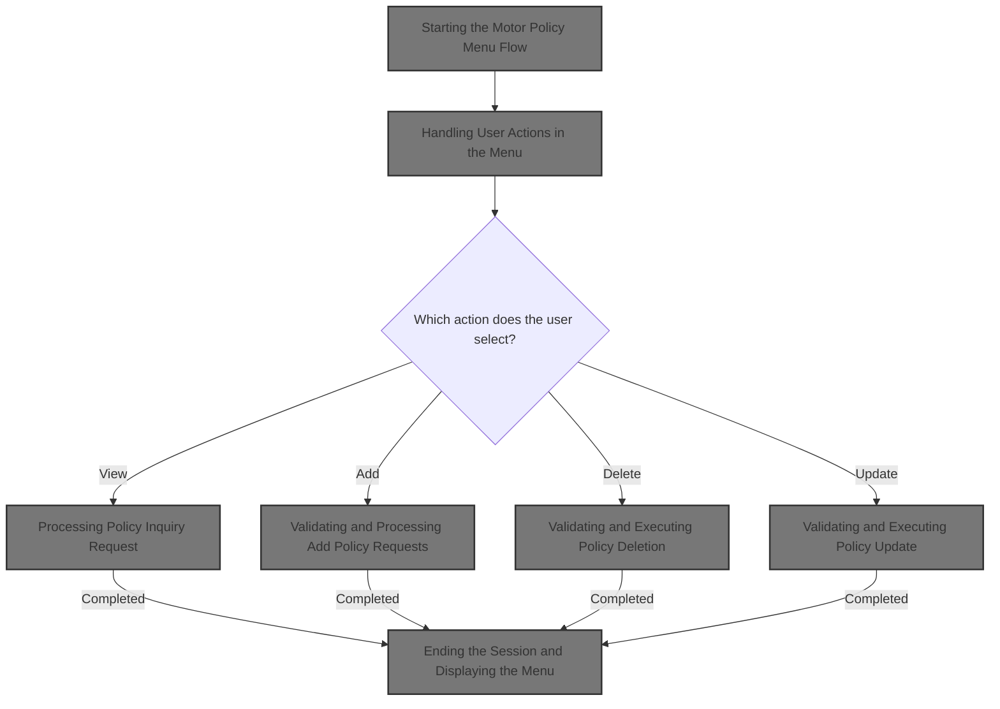
```mermaid
flowchart TD
    node1["Starting the Motor Policy Menu Flow"]:::HeadingStyle
    click node1 goToHeading "Starting the Motor Policy Menu Flow"
    node1 --> node2["Handling User Actions in the Menu"]:::HeadingStyle
    click node2 goToHeading "Handling User Actions in the Menu"
    node2 --> node3{"Which action does the user select?"}
    node3 -->|"View"|node4["Processing Policy Inquiry Request"]:::HeadingStyle
    click node4 goToHeading "Processing Policy Inquiry Request"
    node3 -->|"Add"|node5["Validating and Processing Add Policy Requests"]:::HeadingStyle
    click node5 goToHeading "Validating and Processing Add Policy Requests"
    node3 -->|"Delete"|node6["Validating and Executing Policy Deletion"]:::HeadingStyle
    click node6 goToHeading "Validating and Executing Policy Deletion"
    node3 -->|"Update"|node7["Validating and Executing Policy Update"]:::HeadingStyle
    click node7 goToHeading "Validating and Executing Policy Update"
    node4 -->|"Completed"|node8["Ending the Session and Displaying the Menu"]:::HeadingStyle
    click node8 goToHeading "Ending the Session and Displaying the Menu"
    node5 -->|"Completed"|node8
    node6 -->|"Completed"|node8
    node7 -->|"Completed"|node8

classDef HeadingStyle fill:#777777,stroke:#333,stroke-width:2px;
```

## Dependencies

### Programs

- <SwmToken path="base/src/lgtestp1.cbl" pos="11:6:6" line-data="       PROGRAM-ID. LGTESTP1.">`LGTESTP1`</SwmToken> (<SwmPath>[base/src/lgtestp1.cbl](base/src/lgtestp1.cbl)</SwmPath>)
- <SwmToken path="base/src/lgtestp1.cbl" pos="72:10:10" line-data="                 EXEC CICS LINK PROGRAM(&#39;LGIPOL01&#39;)">`LGIPOL01`</SwmToken> (<SwmPath>[base/src/lgipol01.cbl](base/src/lgipol01.cbl)</SwmPath>)
- <SwmToken path="base/src/lgipol01.cbl" pos="91:9:9" line-data="           EXEC CICS LINK Program(LGIPDB01)">`LGIPDB01`</SwmToken> (<SwmPath>[base/src/lgipdb01.cbl](base/src/lgipdb01.cbl)</SwmPath>)
- LGSTSQ (<SwmPath>[base/src/lgstsq.cbl](base/src/lgstsq.cbl)</SwmPath>)
- <SwmToken path="base/src/lgtestp1.cbl" pos="115:10:10" line-data="                 EXEC CICS LINK PROGRAM(&#39;LGAPOL01&#39;)">`LGAPOL01`</SwmToken> (<SwmPath>[base/src/lgapol01.cbl](base/src/lgapol01.cbl)</SwmPath>)
- <SwmToken path="base/src/lgapol01.cbl" pos="103:9:9" line-data="           EXEC CICS Link Program(LGAPDB01)">`LGAPDB01`</SwmToken> (<SwmPath>[base/src/LGAPDB01.cbl](base/src/LGAPDB01.cbl)</SwmPath>)
- <SwmToken path="base/src/LGAPDB01.cbl" pos="269:4:4" line-data="           CALL &#39;LGAPDB02&#39; USING IN-PROPERTY-TYPE, IN-POSTCODE, ">`LGAPDB02`</SwmToken>
- <SwmToken path="base/src/LGAPDB01.cbl" pos="276:4:4" line-data="           CALL &#39;LGAPDB03&#39; USING WS-BASE-RISK-SCR, IN-FIRE-PERIL, ">`LGAPDB03`</SwmToken> (<SwmPath>[base/src/LGAPDB03.cbl](base/src/LGAPDB03.cbl)</SwmPath>)
- <SwmToken path="base/src/LGAPDB01.cbl" pos="313:4:4" line-data="               CALL &#39;LGAPDB04&#39; USING LK-INPUT-DATA, LK-COVERAGE-DATA, ">`LGAPDB04`</SwmToken> (<SwmPath>[base/src/LGAPDB04.cbl](base/src/LGAPDB04.cbl)</SwmPath>)
- <SwmToken path="base/src/lgtestp1.cbl" pos="139:10:10" line-data="                 EXEC CICS LINK PROGRAM(&#39;LGDPOL01&#39;)">`LGDPOL01`</SwmToken> (<SwmPath>[base/src/lgdpol01.cbl](base/src/lgdpol01.cbl)</SwmPath>)
- <SwmToken path="base/src/lgdpol01.cbl" pos="141:9:9" line-data="           EXEC CICS LINK PROGRAM(LGDPDB01)">`LGDPDB01`</SwmToken> (<SwmPath>[base/src/lgdpdb01.cbl](base/src/lgdpdb01.cbl)</SwmPath>)
- <SwmToken path="base/src/lgdpdb01.cbl" pos="168:9:9" line-data="               EXEC CICS LINK PROGRAM(LGDPVS01)">`LGDPVS01`</SwmToken> (<SwmPath>[base/src/lgdpvs01.cbl](base/src/lgdpvs01.cbl)</SwmPath>)
- <SwmToken path="base/src/lgtestp1.cbl" pos="216:10:10" line-data="                 EXEC CICS LINK PROGRAM(&#39;LGUPOL01&#39;)">`LGUPOL01`</SwmToken> (<SwmPath>[base/src/lgupol01.cbl](base/src/lgupol01.cbl)</SwmPath>)
- <SwmToken path="base/src/lgupol01.cbl" pos="157:9:9" line-data="           EXEC CICS LINK Program(LGUPDB01)">`LGUPDB01`</SwmToken> (<SwmPath>[base/src/lgupdb01.cbl](base/src/lgupdb01.cbl)</SwmPath>)
- <SwmToken path="base/src/lgupdb01.cbl" pos="209:9:9" line-data="           EXEC CICS LINK Program(LGUPVS01)">`LGUPVS01`</SwmToken> (<SwmPath>[base/src/lgupvs01.cbl](base/src/lgupvs01.cbl)</SwmPath>)

### Copybooks

- SQLCA
- LGPOLICY (<SwmPath>[base/src/lgpolicy.cpy](base/src/lgpolicy.cpy)</SwmPath>)
- LGCMAREA (<SwmPath>[base/src/lgcmarea.cpy](base/src/lgcmarea.cpy)</SwmPath>)
- <SwmToken path="base/src/LGAPDB01.cbl" pos="35:3:3" line-data="           COPY INPUTREC2.">`INPUTREC2`</SwmToken> (<SwmPath>[base/src/INPUTREC2.cpy](base/src/INPUTREC2.cpy)</SwmPath>)
- OUTPUTREC (<SwmPath>[base/src/OUTPUTREC.cpy](base/src/OUTPUTREC.cpy)</SwmPath>)
- WORKSTOR (<SwmPath>[base/src/WORKSTOR.cpy](base/src/WORKSTOR.cpy)</SwmPath>)
- LGAPACT (<SwmPath>[base/src/LGAPACT.cpy](base/src/LGAPACT.cpy)</SwmPath>)
- SSMAP

## Detailed View of the Program's Functionality

# Motor Policy Inquiry Flow

## a. Entry Point and Session Handling

When the main menu program starts, it first checks if this is a returning session by examining a system-provided length field. If this field is greater than zero, it means the user is returning from another screen or operation, so the program skips initialization and jumps directly to the main menu logic to process user input.

If this is a new session, the program initializes all input, output, and communication areas. This means it clears all fields related to the menu and backend communication, ensuring that the user interface and backend data start in a clean state. It then sets all relevant fields (such as customer number, policy number, value, etc.) to their default values (usually zeroes or spaces).

After initialization, the program sends the main menu screen to the user's terminal using a special command that displays a predefined map (screen layout). This is what the user sees and interacts with to start any motor policy action.

## b. Handling User Actions in the Menu

When the user interacts with the menu, the program sets up handlers for special keys (like CLEAR or <SwmToken path="base/src/lgtestp1.cbl" pos="56:1:1" line-data="                     PF3(ENDIT) END-EXEC.">`PF3`</SwmToken> for exit) and error conditions (like map input failures). It then receives the user's input from the terminal.

The program examines the user's menu selection and branches accordingly:

- **View Policy ('1')**: Prepares a request to view a motor policy by setting a specific request ID and copying the customer and policy numbers from the input fields. It then calls a backend program to fetch the policy details. If no data is found or an error occurs, it displays a "No data was returned" message and ends the session. If data is found, it populates the output fields with the policy details and displays them to the user.

- **Add Policy ('2')**: Prepares a request to add a new motor policy by setting a different request ID and copying all relevant fields (customer, payment, broker, dates, vehicle details, etc.) from the input. It then calls a backend program to validate and insert the new policy. If the add fails (for example, if the customer does not exist), it displays an appropriate error message. If the add is successful, it updates the output fields and informs the user that the new policy was inserted.

- **Delete Policy ('3')**: Prepares a request to delete a motor policy by setting the appropriate request ID and copying the customer and policy numbers. It calls a backend program to perform the deletion. If the delete fails, it displays an error message. If successful, it clears all policy detail fields and informs the user that the policy was deleted.

- **Update Policy ('4')**: Prepares a request to update an existing motor policy by setting the update request ID and copying all relevant fields. It calls a backend program to perform the update. If the update fails, it displays an error message. If successful, it updates the output fields and informs the user that the policy was updated.

- **Other/Invalid Option**: If the user enters an invalid option, the program prompts the user to enter a valid option and returns the cursor to the input field.

## c. Backend Inquiry Processing

When a policy inquiry is requested, the backend inquiry program first checks that it received the required communication area. If not, it logs an error and terminates the transaction. If the communication area is present, it initializes the return code and sets up the communication area for processing.

The program then delegates the actual data retrieval to another backend program, which is responsible for fetching the requested policy details from the database. After the data is fetched, control returns to the caller.

## d. Error Logging During Inquiry

If an error occurs (such as missing communication area or a database error), the program records the error event with the current date and time, writes the error message to a queue, and logs up to 90 bytes of the communication area for context. This is done by calling a dedicated logging program, which writes the error to both a transient data queue and a temporary storage queue for later review.

## e. Fetching Policy Details from the Database

The backend data retrieval program checks for the presence of the communication area and initializes all necessary variables. It converts the customer and policy numbers to the appropriate format for database queries and saves them for error logging.

Based on the request ID, the program determines which type of policy is being requested (endowment, house, motor, or commercial) and branches to the appropriate handler. Each handler performs a database SELECT to fetch the policy details, checks if the communication area is large enough to hold the data, and moves the data into the communication area for return to the caller. If no data is found or an error occurs, it sets an appropriate return code and logs the error.

## f. Populating Output Fields After Data Retrieval

After a successful inquiry, the main menu program copies the policy details from the communication area into the output fields for the menu screen. This ensures that the user sees the retrieved data. The program then sends the updated menu screen to the user.

## g. Add Policy Request Processing

When adding a policy, the backend add program checks for the presence and length of the communication area. If valid, it calls another backend program to handle the actual database insert. If any errors occur, it logs the error and terminates the transaction.

## h. Premium Calculation Workflow

For batch premium calculations, the workflow initializes the environment, loads configuration, opens files, processes each input record, closes files, generates a summary, and displays statistics. Each input record is validated, and if valid, processed for premium calculation; otherwise, errors are logged and output.

## i. Validating and Processing Input Records

Each input record is validated for policy type, customer number, coverage limits, and total insured value. Errors are logged with specific codes and messages. Valid records are routed to either commercial or non-commercial processing, with only commercial policies being fully processed.

## j. Handling Add Policy Failure

After attempting to add a policy, the program checks the return code. If the add failed, it rolls back the transaction and displays an error message based on the specific error code. If successful, it updates the output fields and informs the user.

## k. Delete Policy Request Processing

When deleting a policy, the backend delete program checks the communication area, validates the request ID, and calls another backend program to perform the database deletion. If errors occur, it logs them and sets an appropriate return code.

## l. Deleting Policy from VSAM File

After deleting from the database, the program attempts to delete the policy record from a VSAM file. If the delete fails, it logs the error and sets a specific return code.

## m. Handling Delete Policy Failure

If the delete operation fails, the program displays an error message to the user. If successful, it clears all policy detail fields and informs the user that the policy was deleted.

## n. Update Policy Request Processing

When updating a policy, the backend update program checks the communication area and its length for the requested policy type. If valid, it calls another backend program to perform the update in the database and VSAM file. Errors are logged as needed.

## o. Coordinating <SwmToken path="base/src/lgipdb01.cbl" pos="242:5:5" line-data="      * initialize DB2 host variables">`DB2`</SwmToken> and VSAM Updates

The update workflow ensures that both the database and the VSAM file are updated in sync. It opens a cursor, fetches the policy row, checks for concurrency (timestamp match), updates the specific policy type table, and then updates the main policy table with a new timestamp. If any step fails, it logs the error and sets a return code.

## p. Handling Update Failures and User Feedback

After attempting an update, the program checks the return code. If the update failed, it displays an error message. If successful, it updates the output fields and informs the user. Invalid options prompt the user to enter a valid option.

## q. Error Logging Throughout the Flow

At every major step (inquiry, add, delete, update), if an error occurs, the program logs the error with a timestamp, relevant identifiers, and up to 90 bytes of the communication area for context. This logging is handled by a dedicated program that writes to both transient and temporary storage queues.

---

This detailed flow ensures that all user actions in the motor policy menu are handled robustly, with clear feedback, error handling, and backend coordination between database and file storage.

# Rule Definition

| Paragraph Name                                                                                                                                                                                                                                                                                                                                                                                      | Rule ID | Category          | Description                                                                                                                                                                                                                                                                  | Conditions                                                                                                                                                                                                                                                                                                                                                                                                                                                                                                                                                                                                                                        | Remarks                                                                                                                                                                                                                                                                                                                                                                                                                                                                                                                                                                                                                                                                                                                                                                                                                                                                                                                                                                                           |
| --------------------------------------------------------------------------------------------------------------------------------------------------------------------------------------------------------------------------------------------------------------------------------------------------------------------------------------------------------------------------------------------------- | ------- | ----------------- | ---------------------------------------------------------------------------------------------------------------------------------------------------------------------------------------------------------------------------------------------------------------------------- | ------------------------------------------------------------------------------------------------------------------------------------------------------------------------------------------------------------------------------------------------------------------------------------------------------------------------------------------------------------------------------------------------------------------------------------------------------------------------------------------------------------------------------------------------------------------------------------------------------------------------------------------------- | ------------------------------------------------------------------------------------------------------------------------------------------------------------------------------------------------------------------------------------------------------------------------------------------------------------------------------------------------------------------------------------------------------------------------------------------------------------------------------------------------------------------------------------------------------------------------------------------------------------------------------------------------------------------------------------------------------------------------------------------------------------------------------------------------------------------------------------------------------------------------------------------------------------------------------------------------------------------------------------------------- |
| MAINLINE SECTION (<SwmPath>[base/src/lgtestp1.cbl](base/src/lgtestp1.cbl)</SwmPath>)                                                                                                                                                                                                                                                                                                                | RL-001  | Conditional Logic | If the session is returning (EIBCALEN > 0), skip initialization and UI display. Otherwise, initialize all input, output, and communication areas to default values and display the initial menu screen.                                                                      | EIBCALEN > 0: returning session; EIBCALEN = 0: new session.                                                                                                                                                                                                                                                                                                                                                                                                                                                                                                                                                                                       | Default values: <SwmToken path="base/src/lgtestp1.cbl" pos="38:9:9" line-data="           MOVE &#39;0000000000&#39;   To ENP1CNOO.">`ENP1CNOO`</SwmToken>, <SwmToken path="base/src/lgtestp1.cbl" pos="39:9:9" line-data="           MOVE &#39;0000000000&#39;   To ENP1PNOO.">`ENP1PNOO`</SwmToken> set to '0000000000'; <SwmToken path="base/src/lgtestp1.cbl" pos="40:9:9" line-data="           MOVE &#39;000000&#39;       To ENP1VALO.">`ENP1VALO`</SwmToken>, <SwmToken path="base/src/lgtestp1.cbl" pos="41:9:9" line-data="           MOVE &#39;00000&#39;        To ENP1CCO.">`ENP1CCO`</SwmToken>, <SwmToken path="base/src/lgtestp1.cbl" pos="42:9:9" line-data="           MOVE &#39;000000&#39;       To ENP1ACCO.">`ENP1ACCO`</SwmToken>, <SwmToken path="base/src/lgtestp1.cbl" pos="43:9:9" line-data="           MOVE &#39;000000&#39;       To ENP1PREO.">`ENP1PREO`</SwmToken> set to zero or spaces. All fields are alphanumeric or numeric as defined in the map copybooks. |
| MAINLINE SECTION, EVALUATE <SwmToken path="base/src/lgtestp1.cbl" pos="66:3:3" line-data="           EVALUATE ENP1OPTO">`ENP1OPTO`</SwmToken> (<SwmPath>[base/src/lgtestp1.cbl](base/src/lgtestp1.cbl)</SwmPath>)                                                                                                                                                                                   | RL-002  | Conditional Logic | Route user request based on selected menu option. Set request ID, populate commarea, and invoke backend program for inquiry, add, delete, or update. Handle errors and display results accordingly.                                                                          | <SwmToken path="base/src/lgtestp1.cbl" pos="66:3:3" line-data="           EVALUATE ENP1OPTO">`ENP1OPTO`</SwmToken> = '1', '2', '3', '4', or other.                                                                                                                                                                                                                                                                                                                                                                                                                                                                                                | Request IDs: <SwmToken path="base/src/lgtestp1.cbl" pos="69:4:4" line-data="                 Move &#39;01IMOT&#39;   To CA-REQUEST-ID">`01IMOT`</SwmToken> (inquiry), <SwmToken path="base/src/lgtestp1.cbl" pos="98:4:4" line-data="                 Move &#39;01AMOT&#39;          To CA-REQUEST-ID">`01AMOT`</SwmToken> (add), <SwmToken path="base/src/lgtestp1.cbl" pos="136:4:4" line-data="                 Move &#39;01DMOT&#39;   To CA-REQUEST-ID">`01DMOT`</SwmToken> (delete), <SwmToken path="base/src/lgtestp1.cbl" pos="200:4:4" line-data="                 Move &#39;01UMOT&#39;          To CA-REQUEST-ID">`01UMOT`</SwmToken> (update). Output and input fields are mapped to commarea fields as per operation. Error messages and confirmation texts are alphanumeric, up to 24 or more characters.                                                                                                                                                                           |
| MAINLINE SECTION (<SwmPath>[base/src/lgipol01.cbl](base/src/lgipol01.cbl)</SwmPath>, <SwmPath>[base/src/lgapol01.cbl](base/src/lgapol01.cbl)</SwmPath>, <SwmPath>[base/src/lgdpol01.cbl](base/src/lgdpol01.cbl)</SwmPath>, <SwmPath>[base/src/lgupol01.cbl](base/src/lgupol01.cbl)</SwmPath>)                                                                                                       | RL-003  | Conditional Logic | All backend operations must validate the presence and length of the commarea. If validation fails, set error messages and return codes, and log the error.                                                                                                                   | EIBCALEN = 0 or EIBCALEN < required length.                                                                                                                                                                                                                                                                                                                                                                                                                                                                                                                                                                                                       | Error codes: '98' (length insufficient), '99' (unsupported request), '00' (success). Error messages include program name, date, time, and up to 90 bytes of commarea data.                                                                                                                                                                                                                                                                                                                                                                                                                                                                                                                                                                                                                                                                                                                                                                                                                        |
| <SwmToken path="base/src/lgipdb01.cbl" pos="289:3:9" line-data="               PERFORM GET-MOTOR-DB2-INFO">`GET-MOTOR-DB2-INFO`</SwmToken> (<SwmPath>[base/src/lgipdb01.cbl](base/src/lgipdb01.cbl)</SwmPath>), MAINLINE SECTION (<SwmPath>[base/src/lgipol01.cbl](base/src/lgipol01.cbl)</SwmPath>)                                                                                                | RL-004  | Computation       | Perform inquiry by selecting policy details from <SwmToken path="base/src/lgipdb01.cbl" pos="242:5:5" line-data="      * initialize DB2 host variables">`DB2`</SwmToken> based on customer and policy number. Populate commarea with results or set error code if not found. | <SwmToken path="base/src/lgtestp1.cbl" pos="69:9:13" line-data="                 Move &#39;01IMOT&#39;   To CA-REQUEST-ID">`CA-REQUEST-ID`</SwmToken> = <SwmToken path="base/src/lgtestp1.cbl" pos="69:4:4" line-data="                 Move &#39;01IMOT&#39;   To CA-REQUEST-ID">`01IMOT`</SwmToken>, valid customer and policy number.                                                                                                                                                                                                                                                                                                          | Returned fields: issue date, expiry date, last changed timestamp, broker info, payment, motor details. All fields are mapped to commarea and must match defined lengths and types.                                                                                                                                                                                                                                                                                                                                                                                                                                                                                                                                                                                                                                                                                                                                                                                                                |
| MAINLINE SECTION (<SwmPath>[base/src/lgapol01.cbl](base/src/lgapol01.cbl)</SwmPath>), <SwmToken path="base/src/lgapol01.cbl" pos="103:9:9" line-data="           EXEC CICS Link Program(LGAPDB01)">`LGAPDB01`</SwmToken> (business rules in <SwmToken path="base/src/LGAPDB01.cbl" pos="264:3:9" line-data="           PERFORM P011D-APPLY-BUSINESS-RULES">`P011D-APPLY-BUSINESS-RULES`</SwmToken>) | RL-005  | Computation       | Add a new policy by populating commarea with all relevant details, invoking backend add operation, and handling result codes and messages.                                                                                                                                   | <SwmToken path="base/src/lgtestp1.cbl" pos="69:9:13" line-data="                 Move &#39;01IMOT&#39;   To CA-REQUEST-ID">`CA-REQUEST-ID`</SwmToken> = <SwmToken path="base/src/lgtestp1.cbl" pos="98:4:4" line-data="                 Move &#39;01AMOT&#39;          To CA-REQUEST-ID">`01AMOT`</SwmToken>, all required policy details present.                                                                                                                                                                                                                                                                                                | Payment and broker fields reset to zero/spaces. Confirmation message: 'New Motor Policy Inserted'. Error codes: '70' (customer does not exist), other codes for generic errors.                                                                                                                                                                                                                                                                                                                                                                                                                                                                                                                                                                                                                                                                                                                                                                                                                   |
| MAINLINE SECTION (<SwmPath>[base/src/lgdpol01.cbl](base/src/lgdpol01.cbl)</SwmPath>), <SwmToken path="base/src/lgdpol01.cbl" pos="141:9:9" line-data="           EXEC CICS LINK PROGRAM(LGDPDB01)">`LGDPDB01`</SwmToken>, <SwmToken path="base/src/lgdpdb01.cbl" pos="168:9:9" line-data="               EXEC CICS LINK PROGRAM(LGDPVS01)">`LGDPVS01`</SwmToken>                                    | RL-006  | Computation       | Delete a policy by populating commarea with customer and policy numbers, invoking backend delete operation, and handling result codes and messages.                                                                                                                          | <SwmToken path="base/src/lgtestp1.cbl" pos="69:9:13" line-data="                 Move &#39;01IMOT&#39;   To CA-REQUEST-ID">`CA-REQUEST-ID`</SwmToken> = <SwmToken path="base/src/lgtestp1.cbl" pos="136:4:4" line-data="                 Move &#39;01DMOT&#39;   To CA-REQUEST-ID">`01DMOT`</SwmToken>, valid customer and policy number.                                                                                                                                                                                                                                                                                                         | Success message: 'Motor Policy Deleted'. Error code: '81' (VSAM delete error), '90' (<SwmToken path="base/src/lgipdb01.cbl" pos="242:5:5" line-data="      * initialize DB2 host variables">`DB2`</SwmToken> error), '99' (unsupported request). Output fields cleared on success.                                                                                                                                                                                                                                                                                                                                                                                                                                                                                                                                                                                                                                                                                                                |
| MAINLINE SECTION (<SwmPath>[base/src/lgupol01.cbl](base/src/lgupol01.cbl)</SwmPath>), <SwmToken path="base/src/lgupol01.cbl" pos="157:9:9" line-data="           EXEC CICS LINK Program(LGUPDB01)">`LGUPDB01`</SwmToken>, <SwmToken path="base/src/lgupdb01.cbl" pos="209:9:9" line-data="           EXEC CICS LINK Program(LGUPVS01)">`LGUPVS01`</SwmToken>                                        | RL-007  | Computation       | Update a policy by populating commarea with all relevant details, invoking backend update operation, and only allowing update if timestamps match (concurrency control).                                                                                                     | <SwmToken path="base/src/lgtestp1.cbl" pos="69:9:13" line-data="                 Move &#39;01IMOT&#39;   To CA-REQUEST-ID">`CA-REQUEST-ID`</SwmToken> = <SwmToken path="base/src/lgtestp1.cbl" pos="200:4:4" line-data="                 Move &#39;01UMOT&#39;          To CA-REQUEST-ID">`01UMOT`</SwmToken>, valid customer and policy number, <SwmToken path="base/src/lgupdb01.cbl" pos="278:3:5" line-data="             IF CA-LASTCHANGED EQUAL TO DB2-LASTCHANGED">`CA-LASTCHANGED`</SwmToken> matches <SwmToken path="base/src/lgipdb01.cbl" pos="348:2:4" line-data="                   :DB2-LASTCHANGED,">`DB2-LASTCHANGED`</SwmToken>. | Error code: '02' (timestamp mismatch), '90' (<SwmToken path="base/src/lgipdb01.cbl" pos="242:5:5" line-data="      * initialize DB2 host variables">`DB2`</SwmToken> error), '82' (VSAM rewrite error). Confirmation message: 'Motor Policy Updated'.                                                                                                                                                                                                                                                                                                                                                                                                                                                                                                                                                                                                                                                                                                                                             |
| <SwmToken path="base/src/lgipol01.cbl" pos="81:3:7" line-data="               PERFORM WRITE-ERROR-MESSAGE">`WRITE-ERROR-MESSAGE`</SwmToken> (all backend programs)                                                                                                                                                                                                                                  | RL-008  | Computation       | Log error events with current date/time and up to 90 bytes of commarea data for diagnostics.                                                                                                                                                                                 | Any error event or failed backend operation.                                                                                                                                                                                                                                                                                                                                                                                                                                                                                                                                                                                                      | Error message includes program name, date, time, customer/policy info, SQLCODE or RESP codes, and up to 90 bytes of commarea data.                                                                                                                                                                                                                                                                                                                                                                                                                                                                                                                                                                                                                                                                                                                                                                                                                                                                |
| Throughout all programs, especially menu and backend operations                                                                                                                                                                                                                                                                                                                                     | RL-009  | Data Assignment   | All numeric fields must be handled according to their defined lengths and types, and string fields must be padded or truncated as required for display and storage.                                                                                                          | Any field assignment or display operation.                                                                                                                                                                                                                                                                                                                                                                                                                                                                                                                                                                                                        | Numeric fields: fixed length, zero-padded as needed. String fields: padded with spaces or truncated to fit defined length. Output fields mapped to UI and commarea.                                                                                                                                                                                                                                                                                                                                                                                                                                                                                                                                                                                                                                                                                                                                                                                                                               |
| <SwmToken path="base/src/lgtestp1.cbl" pos="247:5:7" line-data="                 GO TO ENDIT-STARTIT">`ENDIT-STARTIT`</SwmToken>, <SwmToken path="base/src/lgtestp1.cbl" pos="290:5:7" line-data="               Go To ERROR-OUT">`ERROR-OUT`</SwmToken>, CLEARIT (<SwmPath>[base/src/lgtestp1.cbl](base/src/lgtestp1.cbl)</SwmPath>)                                                               | RL-010  | Data Assignment   | After displaying the menu and ending the session, reset all menu and commarea fields to ensure a fresh start for the next operation.                                                                                                                                         | Session end or error event.                                                                                                                                                                                                                                                                                                                                                                                                                                                                                                                                                                                                                       | All fields are reset to default values (zeros, spaces, or initial values as defined).                                                                                                                                                                                                                                                                                                                                                                                                                                                                                                                                                                                                                                                                                                                                                                                                                                                                                                             |

# User Stories

## User Story 1: Session Initialization and Cleanup

---

### Story Description:

As a user, I want the system to properly initialize or restore my session so that I always start with the correct menu and data fields, and have a fresh environment after each session ends.

---

### Business Rule Mapping:

| Rule ID | Paragraph Name                                                                                                                                                                                                                                                                                                                        | Rule Description                                                                                                                                                                                        |
| ------- | ------------------------------------------------------------------------------------------------------------------------------------------------------------------------------------------------------------------------------------------------------------------------------------------------------------------------------------- | ------------------------------------------------------------------------------------------------------------------------------------------------------------------------------------------------------- |
| RL-001  | MAINLINE SECTION (<SwmPath>[base/src/lgtestp1.cbl](base/src/lgtestp1.cbl)</SwmPath>)                                                                                                                                                                                                                                                  | If the session is returning (EIBCALEN > 0), skip initialization and UI display. Otherwise, initialize all input, output, and communication areas to default values and display the initial menu screen. |
| RL-010  | <SwmToken path="base/src/lgtestp1.cbl" pos="247:5:7" line-data="                 GO TO ENDIT-STARTIT">`ENDIT-STARTIT`</SwmToken>, <SwmToken path="base/src/lgtestp1.cbl" pos="290:5:7" line-data="               Go To ERROR-OUT">`ERROR-OUT`</SwmToken>, CLEARIT (<SwmPath>[base/src/lgtestp1.cbl](base/src/lgtestp1.cbl)</SwmPath>) | After displaying the menu and ending the session, reset all menu and commarea fields to ensure a fresh start for the next operation.                                                                    |
| RL-009  | Throughout all programs, especially menu and backend operations                                                                                                                                                                                                                                                                       | All numeric fields must be handled according to their defined lengths and types, and string fields must be padded or truncated as required for display and storage.                                     |

---

### Relevant Functionality:

- **MAINLINE SECTION (**<SwmPath>[base/src/lgtestp1.cbl](base/src/lgtestp1.cbl)</SwmPath>**)**
  1. **RL-001:**
     - If session length > 0:
       - Skip initialization
       - Go to menu input handling
     - Else:
       - Initialize all input/output/commarea fields to default values
       - Display main menu screen
- <SwmToken path="base/src/lgtestp1.cbl" pos="247:5:7" line-data="                 GO TO ENDIT-STARTIT">`ENDIT-STARTIT`</SwmToken>
  1. **RL-010:**
     - On session end or error:
       - Initialize all input/output/commarea fields
       - Prepare for next transaction
- **Throughout all programs**
  1. **RL-009:**
     - When assigning values to fields:
       - Ensure numeric fields are zero-padded and match defined length
       - Pad or truncate string fields for display/storage
       - Map commarea fields to output fields as required

## User Story 2: Motor Policy Menu and Operations

---

### Story Description:

As a user, I want to interact with a menu to view, add, delete, or update motor policies so that I can manage my policies efficiently and receive clear feedback for each action.

---

### Business Rule Mapping:

| Rule ID | Paragraph Name                                                                                                                                                                                                                                                                                                                                                                                      | Rule Description                                                                                                                                                                                                                                                             |
| ------- | --------------------------------------------------------------------------------------------------------------------------------------------------------------------------------------------------------------------------------------------------------------------------------------------------------------------------------------------------------------------------------------------------- | ---------------------------------------------------------------------------------------------------------------------------------------------------------------------------------------------------------------------------------------------------------------------------- |
| RL-002  | MAINLINE SECTION, EVALUATE <SwmToken path="base/src/lgtestp1.cbl" pos="66:3:3" line-data="           EVALUATE ENP1OPTO">`ENP1OPTO`</SwmToken> (<SwmPath>[base/src/lgtestp1.cbl](base/src/lgtestp1.cbl)</SwmPath>)                                                                                                                                                                                   | Route user request based on selected menu option. Set request ID, populate commarea, and invoke backend program for inquiry, add, delete, or update. Handle errors and display results accordingly.                                                                          |
| RL-004  | <SwmToken path="base/src/lgipdb01.cbl" pos="289:3:9" line-data="               PERFORM GET-MOTOR-DB2-INFO">`GET-MOTOR-DB2-INFO`</SwmToken> (<SwmPath>[base/src/lgipdb01.cbl](base/src/lgipdb01.cbl)</SwmPath>), MAINLINE SECTION (<SwmPath>[base/src/lgipol01.cbl](base/src/lgipol01.cbl)</SwmPath>)                                                                                                | Perform inquiry by selecting policy details from <SwmToken path="base/src/lgipdb01.cbl" pos="242:5:5" line-data="      * initialize DB2 host variables">`DB2`</SwmToken> based on customer and policy number. Populate commarea with results or set error code if not found. |
| RL-005  | MAINLINE SECTION (<SwmPath>[base/src/lgapol01.cbl](base/src/lgapol01.cbl)</SwmPath>), <SwmToken path="base/src/lgapol01.cbl" pos="103:9:9" line-data="           EXEC CICS Link Program(LGAPDB01)">`LGAPDB01`</SwmToken> (business rules in <SwmToken path="base/src/LGAPDB01.cbl" pos="264:3:9" line-data="           PERFORM P011D-APPLY-BUSINESS-RULES">`P011D-APPLY-BUSINESS-RULES`</SwmToken>) | Add a new policy by populating commarea with all relevant details, invoking backend add operation, and handling result codes and messages.                                                                                                                                   |
| RL-006  | MAINLINE SECTION (<SwmPath>[base/src/lgdpol01.cbl](base/src/lgdpol01.cbl)</SwmPath>), <SwmToken path="base/src/lgdpol01.cbl" pos="141:9:9" line-data="           EXEC CICS LINK PROGRAM(LGDPDB01)">`LGDPDB01`</SwmToken>, <SwmToken path="base/src/lgdpdb01.cbl" pos="168:9:9" line-data="               EXEC CICS LINK PROGRAM(LGDPVS01)">`LGDPVS01`</SwmToken>                                    | Delete a policy by populating commarea with customer and policy numbers, invoking backend delete operation, and handling result codes and messages.                                                                                                                          |
| RL-007  | MAINLINE SECTION (<SwmPath>[base/src/lgupol01.cbl](base/src/lgupol01.cbl)</SwmPath>), <SwmToken path="base/src/lgupol01.cbl" pos="157:9:9" line-data="           EXEC CICS LINK Program(LGUPDB01)">`LGUPDB01`</SwmToken>, <SwmToken path="base/src/lgupdb01.cbl" pos="209:9:9" line-data="           EXEC CICS LINK Program(LGUPVS01)">`LGUPVS01`</SwmToken>                                        | Update a policy by populating commarea with all relevant details, invoking backend update operation, and only allowing update if timestamps match (concurrency control).                                                                                                     |
| RL-009  | Throughout all programs, especially menu and backend operations                                                                                                                                                                                                                                                                                                                                     | All numeric fields must be handled according to their defined lengths and types, and string fields must be padded or truncated as required for display and storage.                                                                                                          |

---

### Relevant Functionality:

- **MAINLINE SECTION**
  1. **RL-002:**
     - Evaluate selected option:
       - '1': Set inquiry request, populate commarea, link to <SwmToken path="base/src/lgtestp1.cbl" pos="72:10:10" line-data="                 EXEC CICS LINK PROGRAM(&#39;LGIPOL01&#39;)">`LGIPOL01`</SwmToken>, display results or error
       - '2': Set add request, reset payment/broker fields, populate commarea, link to <SwmToken path="base/src/lgtestp1.cbl" pos="115:10:10" line-data="                 EXEC CICS LINK PROGRAM(&#39;LGAPOL01&#39;)">`LGAPOL01`</SwmToken>, display confirmation or error
       - '3': Set delete request, populate commarea, link to <SwmToken path="base/src/lgtestp1.cbl" pos="139:10:10" line-data="                 EXEC CICS LINK PROGRAM(&#39;LGDPOL01&#39;)">`LGDPOL01`</SwmToken>, clear output fields, display success or error
       - '4': Set update request, reset payment/broker fields, populate commarea, link to <SwmToken path="base/src/lgtestp1.cbl" pos="216:10:10" line-data="                 EXEC CICS LINK PROGRAM(&#39;LGUPOL01&#39;)">`LGUPOL01`</SwmToken>, display confirmation or error
       - Other: Prompt for valid option, return to menu
- <SwmToken path="base/src/lgipdb01.cbl" pos="289:3:9" line-data="               PERFORM GET-MOTOR-DB2-INFO">`GET-MOTOR-DB2-INFO`</SwmToken> **(**<SwmPath>[base/src/lgipdb01.cbl](base/src/lgipdb01.cbl)</SwmPath>**)**
  1. **RL-004:**
     - Convert commarea fields to <SwmToken path="base/src/lgipdb01.cbl" pos="242:5:5" line-data="      * initialize DB2 host variables">`DB2`</SwmToken> host variables
     - Select policy details from <SwmToken path="base/src/lgipdb01.cbl" pos="242:5:5" line-data="      * initialize DB2 host variables">`DB2`</SwmToken>
     - If found:
       - Populate commarea with results
       - Mark end of policy data
     - Else:
       - Set error code ('01' for not found, '90' for other errors)
       - Log error
- **MAINLINE SECTION (**<SwmPath>[base/src/lgapol01.cbl](base/src/lgapol01.cbl)</SwmPath>**)**
  1. **RL-005:**
     - Populate commarea with policy details
     - Reset payment/broker fields
     - Link to <SwmToken path="base/src/lgtestp1.cbl" pos="115:10:10" line-data="                 EXEC CICS LINK PROGRAM(&#39;LGAPOL01&#39;)">`LGAPOL01`</SwmToken> (which calls <SwmToken path="base/src/lgapol01.cbl" pos="103:9:9" line-data="           EXEC CICS Link Program(LGAPDB01)">`LGAPDB01`</SwmToken>)
     - If add successful:
       - Display confirmation and new policy details
     - Else:
       - Display error message based on code
       - Log error
- **MAINLINE SECTION (**<SwmPath>[base/src/lgdpol01.cbl](base/src/lgdpol01.cbl)</SwmPath>**)**
  1. **RL-006:**
     - Populate commarea with customer/policy numbers
     - Link to <SwmToken path="base/src/lgtestp1.cbl" pos="139:10:10" line-data="                 EXEC CICS LINK PROGRAM(&#39;LGDPOL01&#39;)">`LGDPOL01`</SwmToken> (which calls <SwmToken path="base/src/lgdpol01.cbl" pos="141:9:9" line-data="           EXEC CICS LINK PROGRAM(LGDPDB01)">`LGDPDB01`</SwmToken> and <SwmToken path="base/src/lgdpdb01.cbl" pos="168:9:9" line-data="               EXEC CICS LINK PROGRAM(LGDPVS01)">`LGDPVS01`</SwmToken>)
     - If delete successful:
       - Clear output fields
       - Display success message
     - Else:
       - Display error message
       - Log error
- **MAINLINE SECTION (**<SwmPath>[base/src/lgupol01.cbl](base/src/lgupol01.cbl)</SwmPath>**)**
  1. **RL-007:**
     - Populate commarea with policy details
     - Link to <SwmToken path="base/src/lgtestp1.cbl" pos="216:10:10" line-data="                 EXEC CICS LINK PROGRAM(&#39;LGUPOL01&#39;)">`LGUPOL01`</SwmToken> (which calls <SwmToken path="base/src/lgupol01.cbl" pos="157:9:9" line-data="           EXEC CICS LINK Program(LGUPDB01)">`LGUPDB01`</SwmToken> and <SwmToken path="base/src/lgupdb01.cbl" pos="209:9:9" line-data="           EXEC CICS LINK Program(LGUPVS01)">`LGUPVS01`</SwmToken>)
     - Fetch <SwmToken path="base/src/lgipdb01.cbl" pos="242:5:5" line-data="      * initialize DB2 host variables">`DB2`</SwmToken> row and compare timestamps
     - If match:
       - Update policy details
       - Update timestamp
       - Display confirmation
     - Else:
       - Set error code for concurrency failure
       - Log error
- **Throughout all programs**
  1. **RL-009:**
     - When assigning values to fields:
       - Ensure numeric fields are zero-padded and match defined length
       - Pad or truncate string fields for display/storage
       - Map commarea fields to output fields as required

## User Story 3: Backend Validation and Error Handling

---

### Story Description:

As a system, I want to validate all backend requests and log errors with diagnostic details so that operations are reliable and issues can be diagnosed quickly.

---

### Business Rule Mapping:

| Rule ID | Paragraph Name                                                                                                                                                                                                                                                                                | Rule Description                                                                                                                                           |
| ------- | --------------------------------------------------------------------------------------------------------------------------------------------------------------------------------------------------------------------------------------------------------------------------------------------- | ---------------------------------------------------------------------------------------------------------------------------------------------------------- |
| RL-003  | MAINLINE SECTION (<SwmPath>[base/src/lgipol01.cbl](base/src/lgipol01.cbl)</SwmPath>, <SwmPath>[base/src/lgapol01.cbl](base/src/lgapol01.cbl)</SwmPath>, <SwmPath>[base/src/lgdpol01.cbl](base/src/lgdpol01.cbl)</SwmPath>, <SwmPath>[base/src/lgupol01.cbl](base/src/lgupol01.cbl)</SwmPath>) | All backend operations must validate the presence and length of the commarea. If validation fails, set error messages and return codes, and log the error. |
| RL-008  | <SwmToken path="base/src/lgipol01.cbl" pos="81:3:7" line-data="               PERFORM WRITE-ERROR-MESSAGE">`WRITE-ERROR-MESSAGE`</SwmToken> (all backend programs)                                                                                                                            | Log error events with current date/time and up to 90 bytes of commarea data for diagnostics.                                                               |

---

### Relevant Functionality:

- **MAINLINE SECTION (**<SwmPath>[base/src/lgipol01.cbl](base/src/lgipol01.cbl)</SwmPath>
  1. **RL-003:**
     - If commarea not present or too short:
       - Set error code and message
       - Log error with date/time and commarea data
       - Return to caller
- <SwmToken path="base/src/lgipol01.cbl" pos="81:3:7" line-data="               PERFORM WRITE-ERROR-MESSAGE">`WRITE-ERROR-MESSAGE`</SwmToken> **(all backend programs)**
  1. **RL-008:**
     - On error:
       - Format error message with date/time, program, customer/policy info, error code
       - Link to LGSTSQ to write to TDQ and TSQ
       - Include up to 90 bytes of commarea data

# Workflow

# Starting the Motor Policy Menu Flow

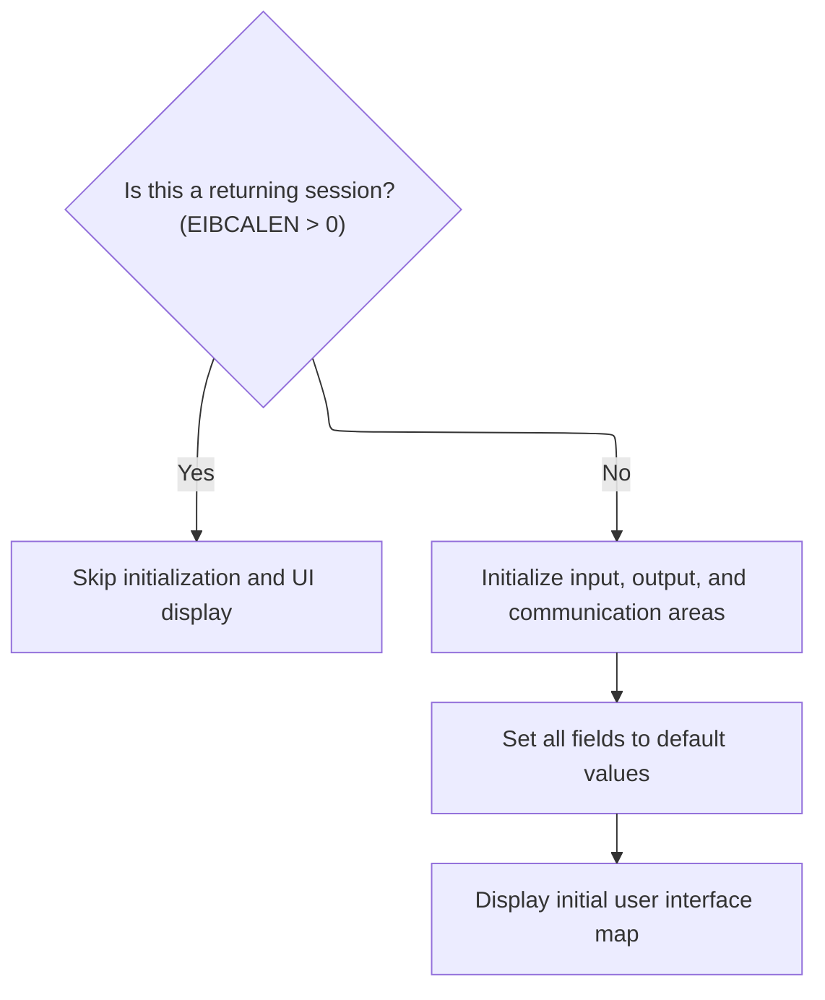
```mermaid
%%{init: {"flowchart": {"defaultRenderer": "elk"}} }%%
flowchart TD
    node1{"Is this a returning session? (EIBCALEN > 0)"}
    click node1 openCode "base/src/lgtestp1.cbl:32:33"
    node1 -->|"Yes"| node2["Skip initialization and UI display"]
    click node2 openCode "base/src/lgtestp1.cbl:33:33"
    node1 -->|"No"| node3["Initialize input, output, and communication areas"]
    click node3 openCode "base/src/lgtestp1.cbl:35:37"
    node3 --> node4["Set all fields to default values"]
    click node4 openCode "base/src/lgtestp1.cbl:38:43"
    node4 --> node5["Display initial user interface map"]
    click node5 openCode "base/src/lgtestp1.cbl:47:50"

classDef HeadingStyle fill:#777777,stroke:#333,stroke-width:2px;

%% Swimm:
%% %%{init: {"flowchart": {"defaultRenderer": "elk"}} }%%
%% flowchart TD
%%     node1{"Is this a returning session? (EIBCALEN > 0)"}
%%     click node1 openCode "<SwmPath>[base/src/lgtestp1.cbl](base/src/lgtestp1.cbl)</SwmPath>:32:33"
%%     node1 -->|"Yes"| node2["Skip initialization and UI display"]
%%     click node2 openCode "<SwmPath>[base/src/lgtestp1.cbl](base/src/lgtestp1.cbl)</SwmPath>:33:33"
%%     node1 -->|"No"| node3["Initialize input, output, and communication areas"]
%%     click node3 openCode "<SwmPath>[base/src/lgtestp1.cbl](base/src/lgtestp1.cbl)</SwmPath>:35:37"
%%     node3 --> node4["Set all fields to default values"]
%%     click node4 openCode "<SwmPath>[base/src/lgtestp1.cbl](base/src/lgtestp1.cbl)</SwmPath>:38:43"
%%     node4 --> node5["Display initial user interface map"]
%%     click node5 openCode "<SwmPath>[base/src/lgtestp1.cbl](base/src/lgtestp1.cbl)</SwmPath>:47:50"
%% 
%% classDef HeadingStyle fill:#777777,stroke:#333,stroke-width:2px;
```

This section governs the entry point for the Motor Policy Menu flow, ensuring that sessions are correctly identified and initialized, and that the user interface is properly presented for new sessions.

| Category        | Rule Name                  | Description                                                                                                                                                                                                                                                                                                                                                                                                                                                                                                                                                                                                                                                                                                                                                                                                                                                                                                                                                                         |
| --------------- | -------------------------- | ----------------------------------------------------------------------------------------------------------------------------------------------------------------------------------------------------------------------------------------------------------------------------------------------------------------------------------------------------------------------------------------------------------------------------------------------------------------------------------------------------------------------------------------------------------------------------------------------------------------------------------------------------------------------------------------------------------------------------------------------------------------------------------------------------------------------------------------------------------------------------------------------------------------------------------------------------------------------------------- |
| Data validation | Field default values       | Default values for key fields are set as follows: <SwmToken path="base/src/lgtestp1.cbl" pos="38:9:9" line-data="           MOVE &#39;0000000000&#39;   To ENP1CNOO.">`ENP1CNOO`</SwmToken> and <SwmToken path="base/src/lgtestp1.cbl" pos="39:9:9" line-data="           MOVE &#39;0000000000&#39;   To ENP1PNOO.">`ENP1PNOO`</SwmToken> to '0000000000', <SwmToken path="base/src/lgtestp1.cbl" pos="40:9:9" line-data="           MOVE &#39;000000&#39;       To ENP1VALO.">`ENP1VALO`</SwmToken> to '000000', <SwmToken path="base/src/lgtestp1.cbl" pos="41:9:9" line-data="           MOVE &#39;00000&#39;        To ENP1CCO.">`ENP1CCO`</SwmToken> to '00000', <SwmToken path="base/src/lgtestp1.cbl" pos="42:9:9" line-data="           MOVE &#39;000000&#39;       To ENP1ACCO.">`ENP1ACCO`</SwmToken> to '000000', <SwmToken path="base/src/lgtestp1.cbl" pos="43:9:9" line-data="           MOVE &#39;000000&#39;       To ENP1PREO.">`ENP1PREO`</SwmToken> to '000000'. |
| Business logic  | Returning session shortcut | If the session is returning (EIBCALEN > 0), initialization steps and UI display are skipped, and the flow proceeds directly to menu action handling.                                                                                                                                                                                                                                                                                                                                                                                                                                                                                                                                                                                                                                                                                                                                                                                                                                |
| Business logic  | New session initialization | If the session is new (EIBCALEN = 0), all input, output, and communication fields are initialized to their default values before any user interaction occurs.                                                                                                                                                                                                                                                                                                                                                                                                                                                                                                                                                                                                                                                                                                                                                                                                                       |
| Business logic  | Initial menu display       | After initialization, the main menu screen is displayed to the user, allowing them to begin motor policy actions.                                                                                                                                                                                                                                                                                                                                                                                                                                                                                                                                                                                                                                                                                                                                                                                                                                                                   |

<SwmSnippet path="/base/src/lgtestp1.cbl" line="30">

---

In <SwmToken path="base/src/lgtestp1.cbl" pos="30:1:1" line-data="       MAINLINE SECTION.">`MAINLINE`</SwmToken>, the flow checks if there's a commarea (EIBCALEN > 0). If so, it jumps straight to <SwmToken path="base/src/lgtestp1.cbl" pos="33:5:7" line-data="              GO TO A-GAIN.">`A-GAIN`</SwmToken> to process user input. This is the entry point for handling menu actions based on incoming data.

```cobol
       MAINLINE SECTION.

           IF EIBCALEN > 0
              GO TO A-GAIN.
```

---

</SwmSnippet>

<SwmSnippet path="/base/src/lgtestp1.cbl" line="35">

---

This part clears out all menu and commarea fields so the UI and backend start fresh.

```cobol
           Initialize SSMAPP1I.
           Initialize SSMAPP1O.
           Initialize COMM-AREA.
           MOVE '0000000000'   To ENP1CNOO.
           MOVE '0000000000'   To ENP1PNOO.
           MOVE '000000'       To ENP1VALO.
           MOVE '00000'        To ENP1CCO.
           MOVE '000000'       To ENP1ACCO.
           MOVE '000000'       To ENP1PREO.
```

---

</SwmSnippet>

<SwmSnippet path="/base/src/lgtestp1.cbl" line="47">

---

Finally, MAINLINE sends the main menu screen to the terminal using a CICS SEND MAP command. This is what the user sees and interacts with to start any motor policy action.

```cobol
           EXEC CICS SEND MAP ('SSMAPP1')
                     MAPSET ('SSMAP')
                     ERASE
                     END-EXEC.
```

---

</SwmSnippet>

# Handling User Actions in the Menu


```mermaid
%%{init: {"flowchart": {"defaultRenderer": "elk"}} }%%
flowchart TD
    node1["User initiates motor policy action"]
    click node1 openCode "base/src/lgtestp1.cbl:52:63"
    node1 --> node2{"Which operation does the user select?"}
    click node2 openCode "base/src/lgtestp1.cbl:68:68"
    node2 -->|"View Policy ('1')"| node3["Prepare view request (set CA-REQUEST-ID=01IMOT)"]
    click node3 openCode "base/src/lgtestp1.cbl:68:75"
    node3 --> node4["Processing Policy Inquiry Request"]
    
    node4 --> node5{"Was policy found? (CA-RETURN-CODE > 0)"}
    click node5 openCode "base/src/lgtestp1.cbl:76:78"
    node5 -->|"No"| node6["Displaying No Data Message and Ending Session"]
    
    node5 -->|"Yes"| node7["Display policy details to user"]
    click node7 openCode "base/src/lgtestp1.cbl:80:94"
    node2 -->|"Add Policy ('2')"| node8["Prepare add request (set CA-REQUEST-ID=01AMOT, reset payment/broker fields)"]
    click node8 openCode "base/src/lgtestp1.cbl:97:113"
    node8 --> node9["Validating and Processing Add Policy Requests"]
    
    node9 --> node10{"Was add successful? (CA-RETURN-CODE > 0)"}
    click node10 openCode "base/src/lgtestp1.cbl:119:122"
    node10 -->|"No"| node11{"Error type (CA-RETURN-CODE=70?)"}
    click node11 openCode "base/src/lgtestp1.cbl:287:294"
    node11 -->|"Customer missing"| node12["Ending the Session and Displaying the Menu"]
    
    node11 -->|"Other"| node13["Ending the Session and Displaying the Menu"]
    
    node10 -->|"Yes"| node14["Inform user: New motor policy inserted"]
    click node14 openCode "base/src/lgtestp1.cbl:124:132"
    node2 -->|"Delete Policy ('3')"| node15["Prepare delete request (set CA-REQUEST-ID=01DMOT)"]
    click node15 openCode "base/src/lgtestp1.cbl:135:142"
    node15 --> node16["Validating and Executing Policy Deletion"]
    
    node16 --> node17["Triggering Policy Deletion in Database"]
    
    node17 --> node18{"Was delete successful? (CA-RETURN-CODE > 0)"}
    click node18 openCode "base/src/lgtestp1.cbl:143:146"
    node18 -->|"No"| node19["Ending the Session and Displaying the Menu"]
    
    node18 -->|"Yes"| node20["Inform user: Motor policy deleted"]
    click node20 openCode "base/src/lgtestp1.cbl:148:166"
    node2 -->|"Update Policy ('4')"| node21["Prepare update request (set CA-REQUEST-ID=01UMOT, reset payment/broker fields)"]
    click node21 openCode "base/src/lgtestp1.cbl:200:215"
    node21 --> node22["Validating and Executing Policy Update"]
    
    node22 --> node23["Triggering Policy Update in Database"]
    
    node23 --> node24{"Was update successful? (CA-RETURN-CODE > 0)"}
    click node24 openCode "base/src/lgtestp1.cbl:220:222"
    node24 -->|"No"| node25["Ending the Session and Displaying the Menu"]
    
    node24 -->|"Yes"| node26["Inform user: Motor policy updated"]
    click node26 openCode "base/src/lgtestp1.cbl:224:232"
    node2 -->|"Other"| node27["Prompt user: Enter valid option"]
    click node27 openCode "base/src/lgtestp1.cbl:238:247"

classDef HeadingStyle fill:#777777,stroke:#333,stroke-width:2px;
click node4 goToHeading "Processing Policy Inquiry Request"
node4:::HeadingStyle
click node6 goToHeading "Displaying No Data Message and Ending Session"
node6:::HeadingStyle
click node9 goToHeading "Validating and Processing Add Policy Requests"
node9:::HeadingStyle
click node12 goToHeading "Ending the Session and Displaying the Menu"
node12:::HeadingStyle
click node13 goToHeading "Ending the Session and Displaying the Menu"
node13:::HeadingStyle
click node16 goToHeading "Validating and Executing Policy Deletion"
node16:::HeadingStyle
click node17 goToHeading "Triggering Policy Deletion in Database"
node17:::HeadingStyle
click node19 goToHeading "Ending the Session and Displaying the Menu"
node19:::HeadingStyle
click node22 goToHeading "Validating and Executing Policy Update"
node22:::HeadingStyle
click node23 goToHeading "Triggering Policy Update in Database"
node23:::HeadingStyle
click node25 goToHeading "Ending the Session and Displaying the Menu"
node25:::HeadingStyle

%% Swimm:
%% %%{init: {"flowchart": {"defaultRenderer": "elk"}} }%%
%% flowchart TD
%%     node1["User initiates motor policy action"]
%%     click node1 openCode "<SwmPath>[base/src/lgtestp1.cbl](base/src/lgtestp1.cbl)</SwmPath>:52:63"
%%     node1 --> node2{"Which operation does the user select?"}
%%     click node2 openCode "<SwmPath>[base/src/lgtestp1.cbl](base/src/lgtestp1.cbl)</SwmPath>:68:68"
%%     node2 -->|"View Policy ('1')"| node3["Prepare view request (set <SwmToken path="base/src/lgtestp1.cbl" pos="69:9:13" line-data="                 Move &#39;01IMOT&#39;   To CA-REQUEST-ID">`CA-REQUEST-ID`</SwmToken>=<SwmToken path="base/src/lgtestp1.cbl" pos="69:4:4" line-data="                 Move &#39;01IMOT&#39;   To CA-REQUEST-ID">`01IMOT`</SwmToken>)"]
%%     click node3 openCode "<SwmPath>[base/src/lgtestp1.cbl](base/src/lgtestp1.cbl)</SwmPath>:68:75"
%%     node3 --> node4["Processing Policy Inquiry Request"]
%%     
%%     node4 --> node5{"Was policy found? (<SwmToken path="base/src/lgtestp1.cbl" pos="76:3:7" line-data="                 IF CA-RETURN-CODE &gt; 0">`CA-RETURN-CODE`</SwmToken> > 0)"}
%%     click node5 openCode "<SwmPath>[base/src/lgtestp1.cbl](base/src/lgtestp1.cbl)</SwmPath>:76:78"
%%     node5 -->|"No"| node6["Displaying No Data Message and Ending Session"]
%%     
%%     node5 -->|"Yes"| node7["Display policy details to user"]
%%     click node7 openCode "<SwmPath>[base/src/lgtestp1.cbl](base/src/lgtestp1.cbl)</SwmPath>:80:94"
%%     node2 -->|"Add Policy ('2')"| node8["Prepare add request (set <SwmToken path="base/src/lgtestp1.cbl" pos="69:9:13" line-data="                 Move &#39;01IMOT&#39;   To CA-REQUEST-ID">`CA-REQUEST-ID`</SwmToken>=<SwmToken path="base/src/lgtestp1.cbl" pos="98:4:4" line-data="                 Move &#39;01AMOT&#39;          To CA-REQUEST-ID">`01AMOT`</SwmToken>, reset payment/broker fields)"]
%%     click node8 openCode "<SwmPath>[base/src/lgtestp1.cbl](base/src/lgtestp1.cbl)</SwmPath>:97:113"
%%     node8 --> node9["Validating and Processing Add Policy Requests"]
%%     
%%     node9 --> node10{"Was add successful? (<SwmToken path="base/src/lgtestp1.cbl" pos="76:3:7" line-data="                 IF CA-RETURN-CODE &gt; 0">`CA-RETURN-CODE`</SwmToken> > 0)"}
%%     click node10 openCode "<SwmPath>[base/src/lgtestp1.cbl](base/src/lgtestp1.cbl)</SwmPath>:119:122"
%%     node10 -->|"No"| node11{"Error type (<SwmToken path="base/src/lgtestp1.cbl" pos="76:3:7" line-data="                 IF CA-RETURN-CODE &gt; 0">`CA-RETURN-CODE`</SwmToken>=70?)"}
%%     click node11 openCode "<SwmPath>[base/src/lgtestp1.cbl](base/src/lgtestp1.cbl)</SwmPath>:287:294"
%%     node11 -->|"Customer missing"| node12["Ending the Session and Displaying the Menu"]
%%     
%%     node11 -->|"Other"| node13["Ending the Session and Displaying the Menu"]
%%     
%%     node10 -->|"Yes"| node14["Inform user: New motor policy inserted"]
%%     click node14 openCode "<SwmPath>[base/src/lgtestp1.cbl](base/src/lgtestp1.cbl)</SwmPath>:124:132"
%%     node2 -->|"Delete Policy ('3')"| node15["Prepare delete request (set <SwmToken path="base/src/lgtestp1.cbl" pos="69:9:13" line-data="                 Move &#39;01IMOT&#39;   To CA-REQUEST-ID">`CA-REQUEST-ID`</SwmToken>=<SwmToken path="base/src/lgtestp1.cbl" pos="136:4:4" line-data="                 Move &#39;01DMOT&#39;   To CA-REQUEST-ID">`01DMOT`</SwmToken>)"]
%%     click node15 openCode "<SwmPath>[base/src/lgtestp1.cbl](base/src/lgtestp1.cbl)</SwmPath>:135:142"
%%     node15 --> node16["Validating and Executing Policy Deletion"]
%%     
%%     node16 --> node17["Triggering Policy Deletion in Database"]
%%     
%%     node17 --> node18{"Was delete successful? (<SwmToken path="base/src/lgtestp1.cbl" pos="76:3:7" line-data="                 IF CA-RETURN-CODE &gt; 0">`CA-RETURN-CODE`</SwmToken> > 0)"}
%%     click node18 openCode "<SwmPath>[base/src/lgtestp1.cbl](base/src/lgtestp1.cbl)</SwmPath>:143:146"
%%     node18 -->|"No"| node19["Ending the Session and Displaying the Menu"]
%%     
%%     node18 -->|"Yes"| node20["Inform user: Motor policy deleted"]
%%     click node20 openCode "<SwmPath>[base/src/lgtestp1.cbl](base/src/lgtestp1.cbl)</SwmPath>:148:166"
%%     node2 -->|"Update Policy ('4')"| node21["Prepare update request (set <SwmToken path="base/src/lgtestp1.cbl" pos="69:9:13" line-data="                 Move &#39;01IMOT&#39;   To CA-REQUEST-ID">`CA-REQUEST-ID`</SwmToken>=<SwmToken path="base/src/lgtestp1.cbl" pos="200:4:4" line-data="                 Move &#39;01UMOT&#39;          To CA-REQUEST-ID">`01UMOT`</SwmToken>, reset payment/broker fields)"]
%%     click node21 openCode "<SwmPath>[base/src/lgtestp1.cbl](base/src/lgtestp1.cbl)</SwmPath>:200:215"
%%     node21 --> node22["Validating and Executing Policy Update"]
%%     
%%     node22 --> node23["Triggering Policy Update in Database"]
%%     
%%     node23 --> node24{"Was update successful? (<SwmToken path="base/src/lgtestp1.cbl" pos="76:3:7" line-data="                 IF CA-RETURN-CODE &gt; 0">`CA-RETURN-CODE`</SwmToken> > 0)"}
%%     click node24 openCode "<SwmPath>[base/src/lgtestp1.cbl](base/src/lgtestp1.cbl)</SwmPath>:220:222"
%%     node24 -->|"No"| node25["Ending the Session and Displaying the Menu"]
%%     
%%     node24 -->|"Yes"| node26["Inform user: Motor policy updated"]
%%     click node26 openCode "<SwmPath>[base/src/lgtestp1.cbl](base/src/lgtestp1.cbl)</SwmPath>:224:232"
%%     node2 -->|"Other"| node27["Prompt user: Enter valid option"]
%%     click node27 openCode "<SwmPath>[base/src/lgtestp1.cbl](base/src/lgtestp1.cbl)</SwmPath>:238:247"
%% 
%% classDef HeadingStyle fill:#777777,stroke:#333,stroke-width:2px;
%% click node4 goToHeading "Processing Policy Inquiry Request"
%% node4:::HeadingStyle
%% click node6 goToHeading "Displaying No Data Message and Ending Session"
%% node6:::HeadingStyle
%% click node9 goToHeading "Validating and Processing Add Policy Requests"
%% node9:::HeadingStyle
%% click node12 goToHeading "Ending the Session and Displaying the Menu"
%% node12:::HeadingStyle
%% click node13 goToHeading "Ending the Session and Displaying the Menu"
%% node13:::HeadingStyle
%% click node16 goToHeading "Validating and Executing Policy Deletion"
%% node16:::HeadingStyle
%% click node17 goToHeading "Triggering Policy Deletion in Database"
%% node17:::HeadingStyle
%% click node19 goToHeading "Ending the Session and Displaying the Menu"
%% node19:::HeadingStyle
%% click node22 goToHeading "Validating and Executing Policy Update"
%% node22:::HeadingStyle
%% click node23 goToHeading "Triggering Policy Update in Database"
%% node23:::HeadingStyle
%% click node25 goToHeading "Ending the Session and Displaying the Menu"
%% node25:::HeadingStyle
```

This section governs how user menu selections for motor policy actions are interpreted and routed to the correct business process, ensuring that each operation (view, add, delete, update) is handled according to business rules and that users receive appropriate feedback.

| Category        | Rule Name                      | Description                                                                                                                                                                                                                                                                                                                                                                                                                           |
| --------------- | ------------------------------ | ------------------------------------------------------------------------------------------------------------------------------------------------------------------------------------------------------------------------------------------------------------------------------------------------------------------------------------------------------------------------------------------------------------------------------------- |
| Data validation | Invalid Option Handling        | If the user selects an invalid menu option, the system must prompt the user to enter a valid option and not proceed with any policy operation.                                                                                                                                                                                                                                                                                        |
| Data validation | Mandatory Input Validation     | For all operations, if required input data (such as customer or policy number) is missing, the system must log an error and end the session without processing the request.                                                                                                                                                                                                                                                           |
| Business logic  | Policy Inquiry Handling        | When a user selects 'View Policy', the system must set the request ID to <SwmToken path="base/src/lgtestp1.cbl" pos="69:4:4" line-data="                 Move &#39;01IMOT&#39;   To CA-REQUEST-ID">`01IMOT`</SwmToken>, populate customer and policy numbers, and attempt to retrieve policy details. If no policy is found, a 'No Data' message is displayed and the session ends.                                                   |
| Business logic  | Policy Addition Handling       | When a user selects 'Add Policy', the system must set the request ID to <SwmToken path="base/src/lgtestp1.cbl" pos="98:4:4" line-data="                 Move &#39;01AMOT&#39;          To CA-REQUEST-ID">`01AMOT`</SwmToken>, reset payment and broker fields to zero or blank, and populate all policy fields from user input. If the add fails due to missing customer (error code 70), the session ends and the menu is displayed. |
| Business logic  | Policy Deletion Handling       | When a user selects 'Delete Policy', the system must set the request ID to <SwmToken path="base/src/lgtestp1.cbl" pos="136:4:4" line-data="                 Move &#39;01DMOT&#39;   To CA-REQUEST-ID">`01DMOT`</SwmToken>, populate customer and policy numbers, and trigger deletion. If deletion is successful, the user is informed; otherwise, the session ends and the menu is displayed.                                        |
| Business logic  | Policy Update Handling         | When a user selects 'Update Policy', the system must set the request ID to <SwmToken path="base/src/lgtestp1.cbl" pos="200:4:4" line-data="                 Move &#39;01UMOT&#39;          To CA-REQUEST-ID">`01UMOT`</SwmToken>, reset payment and broker fields, and populate all policy fields from user input. If update is successful, the user is informed; otherwise, the session ends and the menu is displayed.              |
| Business logic  | Payment and Broker Field Reset | When adding or updating a policy, payment and broker fields must be reset to zero or blank as per business convention before processing the request.                                                                                                                                                                                                                                                                                  |

<SwmSnippet path="/base/src/lgtestp1.cbl" line="52">

---

This part sets up handlers for user actions and grabs the user's menu input.

```cobol
       A-GAIN.

           EXEC CICS HANDLE AID
                     CLEAR(CLEARIT)
                     PF3(ENDIT) END-EXEC.
           EXEC CICS HANDLE CONDITION
                     MAPFAIL(ENDIT)
                     END-EXEC.

           EXEC CICS RECEIVE MAP('SSMAPP1')
                     INTO(SSMAPP1I)
                     MAPSET('SSMAP') END-EXEC.
```

---

</SwmSnippet>

<SwmSnippet path="/base/src/lgtestp1.cbl" line="68">

---

Here, when the user selects inquiry, the code sets <SwmToken path="base/src/lgtestp1.cbl" pos="69:9:13" line-data="                 Move &#39;01IMOT&#39;   To CA-REQUEST-ID">`CA-REQUEST-ID`</SwmToken> to <SwmToken path="base/src/lgtestp1.cbl" pos="69:4:4" line-data="                 Move &#39;01IMOT&#39;   To CA-REQUEST-ID">`01IMOT`</SwmToken> (which means 'inquire motor policy'), fills in the customer and policy numbers, and calls <SwmToken path="base/src/lgtestp1.cbl" pos="72:10:10" line-data="                 EXEC CICS LINK PROGRAM(&#39;LGIPOL01&#39;)">`LGIPOL01`</SwmToken> to fetch the policy details. The meaning of <SwmToken path="base/src/lgtestp1.cbl" pos="69:4:4" line-data="                 Move &#39;01IMOT&#39;   To CA-REQUEST-ID">`01IMOT`</SwmToken> is a repo-specific convention.

```cobol
             WHEN '1'
                 Move '01IMOT'   To CA-REQUEST-ID
                 Move ENP1CNOO   To CA-CUSTOMER-NUM
                 Move ENP1PNOO   To CA-POLICY-NUM
                 EXEC CICS LINK PROGRAM('LGIPOL01')
                           COMMAREA(COMM-AREA)
                           LENGTH(32500)
                 END-EXEC
```

---

</SwmSnippet>

## Processing Policy Inquiry Request

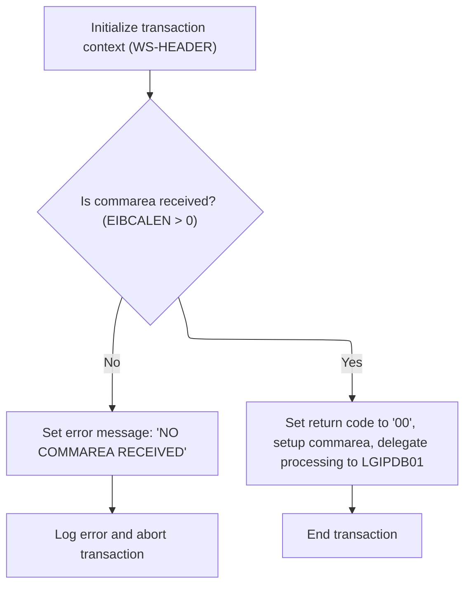
```mermaid
%%{init: {"flowchart": {"defaultRenderer": "elk"}} }%%
flowchart TD
    node1["Initialize transaction context (WS-HEADER)"] --> node2{"Is commarea received? (EIBCALEN > 0)"}
    click node1 openCode "base/src/lgipol01.cbl:72:76"
    node2 -->|"No"| node3["Set error message: 'NO COMMAREA RECEIVED'"]
    click node2 openCode "base/src/lgipol01.cbl:79:83"
    node3 --> node4["Log error and abort transaction"]
    click node3 openCode "base/src/lgipol01.cbl:80:82"
    click node4 openCode "base/src/lgipol01.cbl:81:82"
    node2 -->|"Yes"| node5["Set return code to '00', setup commarea, delegate processing to LGIPDB01"]
    click node5 openCode "base/src/lgipol01.cbl:86:94"
    node5 --> node6["End transaction"]
    click node6 openCode "base/src/lgipol01.cbl:96:96"
classDef HeadingStyle fill:#777777,stroke:#333,stroke-width:2px;

%% Swimm:
%% %%{init: {"flowchart": {"defaultRenderer": "elk"}} }%%
%% flowchart TD
%%     node1["Initialize transaction context (<SwmToken path="base/src/lgipol01.cbl" pos="72:3:5" line-data="           INITIALIZE WS-HEADER.">`WS-HEADER`</SwmToken>)"] --> node2{"Is commarea received? (EIBCALEN > 0)"}
%%     click node1 openCode "<SwmPath>[base/src/lgipol01.cbl](base/src/lgipol01.cbl)</SwmPath>:72:76"
%%     node2 -->|"No"| node3["Set error message: 'NO COMMAREA RECEIVED'"]
%%     click node2 openCode "<SwmPath>[base/src/lgipol01.cbl](base/src/lgipol01.cbl)</SwmPath>:79:83"
%%     node3 --> node4["Log error and abort transaction"]
%%     click node3 openCode "<SwmPath>[base/src/lgipol01.cbl](base/src/lgipol01.cbl)</SwmPath>:80:82"
%%     click node4 openCode "<SwmPath>[base/src/lgipol01.cbl](base/src/lgipol01.cbl)</SwmPath>:81:82"
%%     node2 -->|"Yes"| node5["Set return code to '00', setup commarea, delegate processing to <SwmToken path="base/src/lgipol01.cbl" pos="91:9:9" line-data="           EXEC CICS LINK Program(LGIPDB01)">`LGIPDB01`</SwmToken>"]
%%     click node5 openCode "<SwmPath>[base/src/lgipol01.cbl](base/src/lgipol01.cbl)</SwmPath>:86:94"
%%     node5 --> node6["End transaction"]
%%     click node6 openCode "<SwmPath>[base/src/lgipol01.cbl](base/src/lgipol01.cbl)</SwmPath>:96:96"
%% classDef HeadingStyle fill:#777777,stroke:#333,stroke-width:2px;
```

This section governs the initial validation and delegation logic for policy inquiry requests, ensuring that only requests with valid communication areas are processed and that errors are handled appropriately.

<SwmSnippet path="/base/src/lgipol01.cbl" line="70">

---

MAINLINE in <SwmToken path="base/src/lgtestp1.cbl" pos="72:10:10" line-data="                 EXEC CICS LINK PROGRAM(&#39;LGIPOL01&#39;)">`LGIPOL01`</SwmToken> checks for a commarea, logs and abends if missing, then sets up the commarea and calls <SwmToken path="base/src/lgipol01.cbl" pos="91:9:9" line-data="           EXEC CICS LINK Program(LGIPDB01)">`LGIPDB01`</SwmToken> to fetch the requested policy details. After that, it returns control to the caller.

```cobol
       MAINLINE SECTION.
      *
           INITIALIZE WS-HEADER.
      *
           MOVE EIBTRNID TO WS-TRANSID.
           MOVE EIBTRMID TO WS-TERMID.
           MOVE EIBTASKN TO WS-TASKNUM.
      *
      * If NO commarea received issue an ABEND
           IF EIBCALEN IS EQUAL TO ZERO
               MOVE ' NO COMMAREA RECEIVED' TO EM-VARIABLE
               PERFORM WRITE-ERROR-MESSAGE
               EXEC CICS ABEND ABCODE('LGCA') NODUMP END-EXEC
           END-IF

      * initialize commarea return code to zero
           MOVE '00' TO CA-RETURN-CODE
           MOVE EIBCALEN TO WS-CALEN.
           SET WS-ADDR-DFHCOMMAREA TO ADDRESS OF DFHCOMMAREA.
      *

           EXEC CICS LINK Program(LGIPDB01)
               Commarea(DFHCOMMAREA)
               Length(32500)
           END-EXEC.

           EXEC CICS RETURN END-EXEC.
```

---

</SwmSnippet>

## Logging Errors During Policy Inquiry

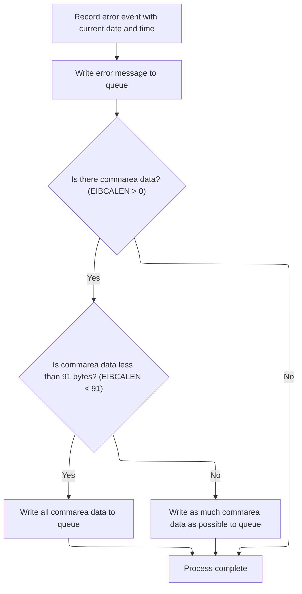
```mermaid
%%{init: {"flowchart": {"defaultRenderer": "elk"}} }%%
flowchart TD
  node1["Record error event with current date and time"] --> node2["Write error message to queue"]
  click node1 openCode "base/src/lgipol01.cbl:110:117"
  click node2 openCode "base/src/lgipol01.cbl:119:122"
  node2 --> node3{"Is there commarea data? (EIBCALEN > 0)"}
  click node3 openCode "base/src/lgipol01.cbl:124:138"
  node3 -->|"No"| node6["Process complete"]
  click node6 openCode "base/src/lgipol01.cbl:139:139"
  node3 -->|"Yes"| node4{"Is commarea data less than 91 bytes? (EIBCALEN < 91)"}
  click node4 openCode "base/src/lgipol01.cbl:125:137"
  node4 -->|"Yes"| node5["Write all commarea data to queue"]
  click node5 openCode "base/src/lgipol01.cbl:126:130"
  node4 -->|"No"| node7["Write as much commarea data as possible to queue"]
  click node7 openCode "base/src/lgipol01.cbl:132:136"
  node5 --> node6
  node7 --> node6
classDef HeadingStyle fill:#777777,stroke:#333,stroke-width:2px;

%% Swimm:
%% %%{init: {"flowchart": {"defaultRenderer": "elk"}} }%%
%% flowchart TD
%%   node1["Record error event with current date and time"] --> node2["Write error message to queue"]
%%   click node1 openCode "<SwmPath>[base/src/lgipol01.cbl](base/src/lgipol01.cbl)</SwmPath>:110:117"
%%   click node2 openCode "<SwmPath>[base/src/lgipol01.cbl](base/src/lgipol01.cbl)</SwmPath>:119:122"
%%   node2 --> node3{"Is there commarea data? (EIBCALEN > 0)"}
%%   click node3 openCode "<SwmPath>[base/src/lgipol01.cbl](base/src/lgipol01.cbl)</SwmPath>:124:138"
%%   node3 -->|"No"| node6["Process complete"]
%%   click node6 openCode "<SwmPath>[base/src/lgipol01.cbl](base/src/lgipol01.cbl)</SwmPath>:139:139"
%%   node3 -->|"Yes"| node4{"Is commarea data less than 91 bytes? (EIBCALEN < 91)"}
%%   click node4 openCode "<SwmPath>[base/src/lgipol01.cbl](base/src/lgipol01.cbl)</SwmPath>:125:137"
%%   node4 -->|"Yes"| node5["Write all commarea data to queue"]
%%   click node5 openCode "<SwmPath>[base/src/lgipol01.cbl](base/src/lgipol01.cbl)</SwmPath>:126:130"
%%   node4 -->|"No"| node7["Write as much commarea data as possible to queue"]
%%   click node7 openCode "<SwmPath>[base/src/lgipol01.cbl](base/src/lgipol01.cbl)</SwmPath>:132:136"
%%   node5 --> node6
%%   node7 --> node6
%% classDef HeadingStyle fill:#777777,stroke:#333,stroke-width:2px;
```

This section ensures that all errors encountered during policy inquiry are logged with relevant context, including timestamp and commarea data, to facilitate troubleshooting and auditability.

| Category       | Rule Name                    | Description                                                                                                                          |
| -------------- | ---------------------------- | ------------------------------------------------------------------------------------------------------------------------------------ |
| Business logic | Timestamp error event        | Every error event must be recorded with the current date and time to ensure traceability.                                            |
| Business logic | Dual queue logging           | Error messages must be written to both TD and TS queues to guarantee availability for downstream processes and audit trails.         |
| Business logic | Commarea context logging     | If commarea data is present, up to 90 bytes must be logged with the error message to provide additional context for troubleshooting. |
| Business logic | Special prefix handling      | Messages prefixed with 'Q=' must have their queue extension and message length adjusted before logging.                              |
| Business logic | Acknowledge received message | If the message was received (not invoked), a response must be sent to acknowledge receipt.                                           |

<SwmSnippet path="/base/src/lgipol01.cbl" line="107">

---

<SwmToken path="base/src/lgipol01.cbl" pos="107:1:5" line-data="       WRITE-ERROR-MESSAGE.">`WRITE-ERROR-MESSAGE`</SwmToken> gets the current date/time, formats it, and calls LGSTSQ to log the error message. It also logs up to 90 bytes of the commarea for context, following repo-specific size limits.

```cobol
       WRITE-ERROR-MESSAGE.
      * Save SQLCODE in message
      * Obtain and format current time and date
           EXEC CICS ASKTIME ABSTIME(ABS-TIME)
           END-EXEC
           EXEC CICS FORMATTIME ABSTIME(ABS-TIME)
                     MMDDYYYY(DATE1)
                     TIME(TIME1)
           END-EXEC
           MOVE DATE1 TO EM-DATE
           MOVE TIME1 TO EM-TIME
      * Write output message to TDQ
           EXEC CICS LINK PROGRAM('LGSTSQ')
                     COMMAREA(ERROR-MSG)
                     LENGTH(LENGTH OF ERROR-MSG)
           END-EXEC.
      * Write 90 bytes or as much as we have of commarea to TDQ
           IF EIBCALEN > 0 THEN
             IF EIBCALEN < 91 THEN
               MOVE DFHCOMMAREA(1:EIBCALEN) TO CA-DATA
               EXEC CICS LINK PROGRAM('LGSTSQ')
                         COMMAREA(CA-ERROR-MSG)
                         LENGTH(LENGTH OF CA-ERROR-MSG)
               END-EXEC
             ELSE
               MOVE DFHCOMMAREA(1:90) TO CA-DATA
               EXEC CICS LINK PROGRAM('LGSTSQ')
                         COMMAREA(CA-ERROR-MSG)
                         LENGTH(LENGTH OF CA-ERROR-MSG)
               END-EXEC
             END-IF
           END-IF.
           EXIT.
```

---

</SwmSnippet>

<SwmSnippet path="/base/src/lgstsq.cbl" line="55">

---

MAINLINE in LGSTSQ decides how to get the message (from commarea or receive), handles special 'Q=' prefixed messages by adjusting the queue extension and message length, writes to both TD and TS queues, and sends a response if the message was received (not invoked).

```cobol
       MAINLINE SECTION.

           MOVE SPACES TO WRITE-MSG.
           MOVE SPACES TO WS-RECV.

           EXEC CICS ASSIGN SYSID(WRITE-MSG-SYSID)
                RESP(WS-RESP)
           END-EXEC.

           EXEC CICS ASSIGN INVOKINGPROG(WS-INVOKEPROG)
                RESP(WS-RESP)
           END-EXEC.
           
           IF WS-INVOKEPROG NOT = SPACES
              MOVE 'C' To WS-FLAG
              MOVE COMMA-DATA  TO WRITE-MSG-MSG
              MOVE EIBCALEN    TO WS-RECV-LEN
           ELSE
              EXEC CICS RECEIVE INTO(WS-RECV)
                  LENGTH(WS-RECV-LEN)
                  RESP(WS-RESP)
              END-EXEC
              MOVE 'R' To WS-FLAG
              MOVE WS-RECV-DATA  TO WRITE-MSG-MSG
              SUBTRACT 5 FROM WS-RECV-LEN
           END-IF.

           MOVE 'GENAERRS' TO STSQ-NAME.
           IF WRITE-MSG-MSG(1:2) = 'Q=' THEN
              MOVE WRITE-MSG-MSG(3:4) TO STSQ-EXT
              MOVE WRITE-MSG-REST TO TEMPO
              MOVE TEMPO          TO WRITE-MSG-MSG
              SUBTRACT 7 FROM WS-RECV-LEN
           END-IF.

           ADD 5 TO WS-RECV-LEN.

      * Write output message to TDQ CSMT
      *
           EXEC CICS WRITEQ TD QUEUE(STDQ-NAME)
                     FROM(WRITE-MSG)
                     RESP(WS-RESP)
                     LENGTH(WS-RECV-LEN)

           END-EXEC.

      * Write output message to Genapp TSQ
      * If no space is available then the task will not wait for
      *  storage to become available but will ignore the request...
      *
           EXEC CICS WRITEQ TS QUEUE(STSQ-NAME)
                     FROM(WRITE-MSG)
                     RESP(WS-RESP)
                     NOSUSPEND
                     LENGTH(WS-RECV-LEN)

           END-EXEC.

           If WS-FLAG = 'R' Then
             EXEC CICS SEND TEXT FROM(FILLER-X)
              WAIT
              ERASE
              LENGTH(1)
              FREEKB
             END-EXEC.

           EXEC CICS RETURN
           END-EXEC.
```

---

</SwmSnippet>

## Fetching Policy Details from the Database


```mermaid
%%{init: {"flowchart": {"defaultRenderer": "elk"}} }%%
flowchart TD
    node1["Start: Receive insurance policy request"]
    click node1 openCode "base/src/lgipdb01.cbl:230:231"
    node1 --> node2{"Was a request payload (commarea) received?"}
    click node2 openCode "base/src/lgipdb01.cbl:251:255"
    node2 -->|"No"| node3["Set error message: No commarea received"]
    click node3 openCode "base/src/lgipdb01.cbl:252:254"
    node3 --> node14["Write error message and end"]
    click node14 openCode "base/src/lgipdb01.cbl:997:1030"
    node2 -->|"Yes"| node4["Determine policy type"]
    click node4 openCode "base/src/lgipdb01.cbl:275:277"
    node4 --> node5{"Policy type (CA-REQUEST-ID)?"}
    click node5 openCode "base/src/lgipdb01.cbl:277:310"
    node5 -->|"Endowment (01IEND)"| node6["Fetch endowment policy data"]
    click node6 openCode "base/src/lgipdb01.cbl:280:281"
    node6 --> node15["End"]
    click node15 openCode "base/src/lgipdb01.cbl:310:310"
    node5 -->|"House (01IHOU)"| node7["Fetch house policy data"]
    click node7 openCode "base/src/lgipdb01.cbl:284:285"
    node7 --> node15
    node5 -->|"Motor (01IMOT)"| node8["Fetch motor policy data"]
    click node8 openCode "base/src/lgipdb01.cbl:288:289"
    node8 --> node15
    node5 -->|"Commercial 1 (01ICOM)"| node9["Fetch commercial policy data 1"]
    click node9 openCode "base/src/lgipdb01.cbl:292:293"
    node9 --> node15
    node5 -->|"Commercial 2 (02ICOM)"| node10["Fetch commercial policy data 2"]
    click node10 openCode "base/src/lgipdb01.cbl:296:297"
    node10 --> node15
    node5 -->|"Commercial 3 (03ICOM)"| node11["Fetch commercial policy data 3"]
    click node11 openCode "base/src/lgipdb01.cbl:300:301"
    node11 --> node15
    node5 -->|"Commercial 5 (05ICOM)"| node12["Fetch commercial policy data 5"]
    click node12 openCode "base/src/lgipdb01.cbl:304:305"
    node12 --> node15
    node5 -->|"Other"| node13["Set error code: Unknown request"]
    click node13 openCode "base/src/lgipdb01.cbl:308:309"
    node13 --> node14

classDef HeadingStyle fill:#777777,stroke:#333,stroke-width:2px;

%% Swimm:
%% %%{init: {"flowchart": {"defaultRenderer": "elk"}} }%%
%% flowchart TD
%%     node1["Start: Receive insurance policy request"]
%%     click node1 openCode "<SwmPath>[base/src/lgipdb01.cbl](base/src/lgipdb01.cbl)</SwmPath>:230:231"
%%     node1 --> node2{"Was a request payload (commarea) received?"}
%%     click node2 openCode "<SwmPath>[base/src/lgipdb01.cbl](base/src/lgipdb01.cbl)</SwmPath>:251:255"
%%     node2 -->|"No"| node3["Set error message: No commarea received"]
%%     click node3 openCode "<SwmPath>[base/src/lgipdb01.cbl](base/src/lgipdb01.cbl)</SwmPath>:252:254"
%%     node3 --> node14["Write error message and end"]
%%     click node14 openCode "<SwmPath>[base/src/lgipdb01.cbl](base/src/lgipdb01.cbl)</SwmPath>:997:1030"
%%     node2 -->|"Yes"| node4["Determine policy type"]
%%     click node4 openCode "<SwmPath>[base/src/lgipdb01.cbl](base/src/lgipdb01.cbl)</SwmPath>:275:277"
%%     node4 --> node5{"Policy type (<SwmToken path="base/src/lgtestp1.cbl" pos="69:9:13" line-data="                 Move &#39;01IMOT&#39;   To CA-REQUEST-ID">`CA-REQUEST-ID`</SwmToken>)?"}
%%     click node5 openCode "<SwmPath>[base/src/lgipdb01.cbl](base/src/lgipdb01.cbl)</SwmPath>:277:310"
%%     node5 -->|"Endowment (<SwmToken path="base/src/lgipdb01.cbl" pos="279:4:4" line-data="             WHEN &#39;01IEND&#39;">`01IEND`</SwmToken>)"| node6["Fetch endowment policy data"]
%%     click node6 openCode "<SwmPath>[base/src/lgipdb01.cbl](base/src/lgipdb01.cbl)</SwmPath>:280:281"
%%     node6 --> node15["End"]
%%     click node15 openCode "<SwmPath>[base/src/lgipdb01.cbl](base/src/lgipdb01.cbl)</SwmPath>:310:310"
%%     node5 -->|"House (<SwmToken path="base/src/lgipdb01.cbl" pos="283:4:4" line-data="             WHEN &#39;01IHOU&#39;">`01IHOU`</SwmToken>)"| node7["Fetch house policy data"]
%%     click node7 openCode "<SwmPath>[base/src/lgipdb01.cbl](base/src/lgipdb01.cbl)</SwmPath>:284:285"
%%     node7 --> node15
%%     node5 -->|"Motor (<SwmToken path="base/src/lgtestp1.cbl" pos="69:4:4" line-data="                 Move &#39;01IMOT&#39;   To CA-REQUEST-ID">`01IMOT`</SwmToken>)"| node8["Fetch motor policy data"]
%%     click node8 openCode "<SwmPath>[base/src/lgipdb01.cbl](base/src/lgipdb01.cbl)</SwmPath>:288:289"
%%     node8 --> node15
%%     node5 -->|"Commercial 1 (<SwmToken path="base/src/lgipdb01.cbl" pos="291:4:4" line-data="             WHEN &#39;01ICOM&#39;">`01ICOM`</SwmToken>)"| node9["Fetch commercial policy data 1"]
%%     click node9 openCode "<SwmPath>[base/src/lgipdb01.cbl](base/src/lgipdb01.cbl)</SwmPath>:292:293"
%%     node9 --> node15
%%     node5 -->|"Commercial 2 (<SwmToken path="base/src/lgipdb01.cbl" pos="295:4:4" line-data="             WHEN &#39;02ICOM&#39;">`02ICOM`</SwmToken>)"| node10["Fetch commercial policy data 2"]
%%     click node10 openCode "<SwmPath>[base/src/lgipdb01.cbl](base/src/lgipdb01.cbl)</SwmPath>:296:297"
%%     node10 --> node15
%%     node5 -->|"Commercial 3 (<SwmToken path="base/src/lgipdb01.cbl" pos="299:4:4" line-data="             WHEN &#39;03ICOM&#39;">`03ICOM`</SwmToken>)"| node11["Fetch commercial policy data 3"]
%%     click node11 openCode "<SwmPath>[base/src/lgipdb01.cbl](base/src/lgipdb01.cbl)</SwmPath>:300:301"
%%     node11 --> node15
%%     node5 -->|"Commercial 5 (<SwmToken path="base/src/lgipdb01.cbl" pos="303:4:4" line-data="             WHEN &#39;05ICOM&#39;">`05ICOM`</SwmToken>)"| node12["Fetch commercial policy data 5"]
%%     click node12 openCode "<SwmPath>[base/src/lgipdb01.cbl](base/src/lgipdb01.cbl)</SwmPath>:304:305"
%%     node12 --> node15
%%     node5 -->|"Other"| node13["Set error code: Unknown request"]
%%     click node13 openCode "<SwmPath>[base/src/lgipdb01.cbl](base/src/lgipdb01.cbl)</SwmPath>:308:309"
%%     node13 --> node14
%% 
%% classDef HeadingStyle fill:#777777,stroke:#333,stroke-width:2px;
```

This section governs how insurance policy details are fetched from the database based on the request type and identifiers provided in the commarea. It ensures that only valid requests are processed, the correct policy data is returned, and errors are handled according to business rules.

| Category        | Rule Name                        | Description                                                                                                                                                                                                                                                                                                                                                                                                                                                                                                                                                                                                                                                                                                                                                                                                                                                                                                                                                                                                                                                                                |
| --------------- | -------------------------------- | ------------------------------------------------------------------------------------------------------------------------------------------------------------------------------------------------------------------------------------------------------------------------------------------------------------------------------------------------------------------------------------------------------------------------------------------------------------------------------------------------------------------------------------------------------------------------------------------------------------------------------------------------------------------------------------------------------------------------------------------------------------------------------------------------------------------------------------------------------------------------------------------------------------------------------------------------------------------------------------------------------------------------------------------------------------------------------------------ |
| Data validation | Supported policy type validation | The policy type must be determined from the request ID in the commarea, and only supported types (<SwmToken path="base/src/lgipdb01.cbl" pos="279:4:4" line-data="             WHEN &#39;01IEND&#39;">`01IEND`</SwmToken>, <SwmToken path="base/src/lgipdb01.cbl" pos="283:4:4" line-data="             WHEN &#39;01IHOU&#39;">`01IHOU`</SwmToken>, <SwmToken path="base/src/lgtestp1.cbl" pos="69:4:4" line-data="                 Move &#39;01IMOT&#39;   To CA-REQUEST-ID">`01IMOT`</SwmToken>, <SwmToken path="base/src/lgipdb01.cbl" pos="291:4:4" line-data="             WHEN &#39;01ICOM&#39;">`01ICOM`</SwmToken>, <SwmToken path="base/src/lgipdb01.cbl" pos="295:4:4" line-data="             WHEN &#39;02ICOM&#39;">`02ICOM`</SwmToken>, <SwmToken path="base/src/lgipdb01.cbl" pos="299:4:4" line-data="             WHEN &#39;03ICOM&#39;">`03ICOM`</SwmToken>, <SwmToken path="base/src/lgipdb01.cbl" pos="303:4:4" line-data="             WHEN &#39;05ICOM&#39;">`05ICOM`</SwmToken>) are processed. Any other value must result in an error code '99' and error logging. |
| Business logic  | Policy data retrieval by type    | For each supported policy type, the system must fetch the corresponding policy details from the database using the provided customer and policy numbers. The returned data must match the requested policy type.                                                                                                                                                                                                                                                                                                                                                                                                                                                                                                                                                                                                                                                                                                                                                                                                                                                                           |

<SwmSnippet path="/base/src/lgipdb01.cbl" line="230">

---

MAINLINE in <SwmToken path="base/src/lgipol01.cbl" pos="91:9:9" line-data="           EXEC CICS LINK Program(LGIPDB01)">`LGIPDB01`</SwmToken> checks for a commarea, sets up <SwmToken path="base/src/lgipdb01.cbl" pos="242:5:5" line-data="      * initialize DB2 host variables">`DB2`</SwmToken> input variables, and uses the request ID to branch to the right handler for fetching endowment, house, motor, or commercial policy details. It logs errors and sets return codes for invalid or missing data.

```cobol
       MAINLINE SECTION.

      *----------------------------------------------------------------*
      * Common code                                                    *
      *----------------------------------------------------------------*
      * initialize working storage variables
           INITIALIZE WS-HEADER.
      * set up general variable
           MOVE EIBTRNID TO WS-TRANSID.
           MOVE EIBTRMID TO WS-TERMID.
           MOVE EIBTASKN TO WS-TASKNUM.
      *----------------------------------------------------------------*
      * initialize DB2 host variables
           INITIALIZE DB2-IN-INTEGERS.
           INITIALIZE DB2-OUT-INTEGERS.
           INITIALIZE DB2-POLICY.

      *---------------------------------------------------------------*
      * Check commarea and obtain required details                    *
      *---------------------------------------------------------------*
      * If NO commarea received issue an ABEND
           IF EIBCALEN IS EQUAL TO ZERO
             MOVE ' NO COMMAREA RECEIVED' TO EM-VARIABLE
             PERFORM WRITE-ERROR-MESSAGE
             EXEC CICS ABEND ABCODE('LGCA') NODUMP END-EXEC
           END-IF

      * initialize commarea return code to zero
           MOVE '00' TO CA-RETURN-CODE
           MOVE EIBCALEN TO WS-CALEN
           SET WS-ADDR-DFHCOMMAREA TO ADDRESS OF DFHCOMMAREA

      * Convert commarea customer & policy nums to DB2 integer format
           MOVE CA-CUSTOMER-NUM TO DB2-CUSTOMERNUM-INT
           MOVE CA-POLICY-NUM   TO DB2-POLICYNUM-INT
      * and save in error msg field incase required
           MOVE CA-CUSTOMER-NUM TO EM-CUSNUM
           MOVE CA-POLICY-NUM   TO EM-POLNUM

      *----------------------------------------------------------------*
      * Check which policy type is being requested                     *
      * This is not actually required whilst only endowment policy     *
      * inquires are supported, but will make future expansion simpler *
      *----------------------------------------------------------------*
      * Upper case value passed in Request Id field                    *
           MOVE FUNCTION UPPER-CASE(CA-REQUEST-ID) TO WS-REQUEST-ID

           EVALUATE WS-REQUEST-ID

             WHEN '01IEND'
               INITIALIZE DB2-ENDOWMENT
               PERFORM GET-ENDOW-DB2-INFO

             WHEN '01IHOU'
               INITIALIZE DB2-HOUSE
               PERFORM GET-HOUSE-DB2-INFO

             WHEN '01IMOT'
               INITIALIZE DB2-MOTOR
               PERFORM GET-MOTOR-DB2-INFO

             WHEN '01ICOM'
               INITIALIZE DB2-COMMERCIAL
               PERFORM GET-COMMERCIAL-DB2-INFO-1

             WHEN '02ICOM'
               INITIALIZE DB2-COMMERCIAL
               PERFORM GET-COMMERCIAL-DB2-INFO-2

             WHEN '03ICOM'
               INITIALIZE DB2-COMMERCIAL
               PERFORM GET-COMMERCIAL-DB2-INFO-3

             WHEN '05ICOM'
               INITIALIZE DB2-COMMERCIAL
               PERFORM GET-COMMERCIAL-DB2-INFO-5

             WHEN OTHER
               MOVE '99' TO CA-RETURN-CODE

           END-EVALUATE.
```

---

</SwmSnippet>

<SwmSnippet path="/base/src/lgipdb01.cbl" line="997">

---

<SwmToken path="base/src/lgipdb01.cbl" pos="997:1:5" line-data="       WRITE-ERROR-MESSAGE.">`WRITE-ERROR-MESSAGE`</SwmToken> here logs the SQL error code, timestamps the error, and calls LGSTSQ to queue the error message. It also logs up to 90 bytes of the commarea for extra context, following repo conventions.

```cobol
       WRITE-ERROR-MESSAGE.
      * Save SQLCODE in message
           MOVE SQLCODE TO EM-SQLRC
      * Obtain and format current time and date
           EXEC CICS ASKTIME ABSTIME(ABS-TIME)
           END-EXEC
           EXEC CICS FORMATTIME ABSTIME(ABS-TIME)
                     MMDDYYYY(DATE1)
                     TIME(TIME1)
           END-EXEC
           MOVE DATE1 TO EM-DATE
           MOVE TIME1 TO EM-TIME
      * Write output message to TDQ
           EXEC CICS LINK PROGRAM('LGSTSQ')
                     COMMAREA(ERROR-MSG)
                     LENGTH(LENGTH OF ERROR-MSG)
           END-EXEC.
      * Write 90 bytes or as much as we have of commarea to TDQ
           IF EIBCALEN > 0 THEN
             IF EIBCALEN < 91 THEN
               MOVE DFHCOMMAREA(1:EIBCALEN) TO CA-DATA
               EXEC CICS LINK PROGRAM('LGSTSQ')
                         COMMAREA(CA-ERROR-MSG)
                         LENGTH(LENGTH OF CA-ERROR-MSG)
               END-EXEC
             ELSE
               MOVE DFHCOMMAREA(1:90) TO CA-DATA
               EXEC CICS LINK PROGRAM('LGSTSQ')
                         COMMAREA(CA-ERROR-MSG)
                         LENGTH(LENGTH OF CA-ERROR-MSG)
               END-EXEC
             END-IF
           END-IF.
           EXIT.
```

---

</SwmSnippet>

<SwmSnippet path="/base/src/lgipdb01.cbl" line="327">

---

<SwmToken path="base/src/lgipdb01.cbl" pos="327:1:7" line-data="       GET-ENDOW-DB2-INFO.">`GET-ENDOW-DB2-INFO`</SwmToken> runs a SELECT for endowment policy details, calculates the required commarea length (including variable-length fields), checks for buffer size, moves data if possible, and marks the end with 'FINAL'. It uses indicator variables for nullable <SwmToken path="base/src/lgipdb01.cbl" pos="327:5:5" line-data="       GET-ENDOW-DB2-INFO.">`DB2`</SwmToken> fields and sets repo-specific return codes for errors.

```cobol
       GET-ENDOW-DB2-INFO.

           MOVE ' SELECT ENDOW ' TO EM-SQLREQ
           EXEC SQL
             SELECT  ISSUEDATE,
                     EXPIRYDATE,
                     LASTCHANGED,
                     BROKERID,
                     BROKERSREFERENCE,
                     PAYMENT,
                     WITHPROFITS,
                     EQUITIES,
                     MANAGEDFUND,
                     FUNDNAME,
                     TERM,
                     SUMASSURED,
                     LIFEASSURED,
                     PADDINGDATA,
                     LENGTH(PADDINGDATA)
             INTO  :DB2-ISSUEDATE,
                   :DB2-EXPIRYDATE,
                   :DB2-LASTCHANGED,
                   :DB2-BROKERID-INT INDICATOR :IND-BROKERID,
                   :DB2-BROKERSREF INDICATOR :IND-BROKERSREF,
                   :DB2-PAYMENT-INT INDICATOR :IND-PAYMENT,
                   :DB2-E-WITHPROFITS,
                   :DB2-E-EQUITIES,
                   :DB2-E-MANAGEDFUND,
                   :DB2-E-FUNDNAME,
                   :DB2-E-TERM-SINT,
                   :DB2-E-SUMASSURED-INT,
                   :DB2-E-LIFEASSURED,
                   :DB2-E-PADDINGDATA INDICATOR :IND-E-PADDINGDATA,
                   :DB2-E-PADDING-LEN INDICATOR :IND-E-PADDINGDATAL
             FROM  POLICY,ENDOWMENT
             WHERE ( POLICY.POLICYNUMBER =
                        ENDOWMENT.POLICYNUMBER   AND
                     POLICY.CUSTOMERNUMBER =
                        :DB2-CUSTOMERNUM-INT             AND
                     POLICY.POLICYNUMBER =
                        :DB2-POLICYNUM-INT               )
           END-EXEC

           IF SQLCODE = 0
      *      Select was successful

      *      Calculate size of commarea required to return all data
             ADD WS-CA-HEADERTRAILER-LEN TO WS-REQUIRED-CA-LEN
             ADD WS-FULL-ENDOW-LEN       TO WS-REQUIRED-CA-LEN

      *----------------------------------------------------------------*
      *      Specific code to allow for length of VACHAR data
      *      check whether PADDINGDATA field is non-null
      *        and calculate length of endowment policy
      *        and position of free space in commarea after policy data
      *----------------------------------------------------------------*
             IF IND-E-PADDINGDATAL NOT EQUAL MINUS-ONE
               ADD DB2-E-PADDING-LEN TO WS-REQUIRED-CA-LEN
               ADD DB2-E-PADDING-LEN TO END-POLICY-POS
             END-IF

      *      if commarea received is not large enough ...
      *        set error return code and return to caller
             IF EIBCALEN IS LESS THAN WS-REQUIRED-CA-LEN
               MOVE '98' TO CA-RETURN-CODE
               EXEC CICS RETURN END-EXEC
             ELSE
      *        Length is sufficent so move data to commarea
      *        Move Integer fields to required length numerics
      *        Don't move null fields
               IF IND-BROKERID NOT EQUAL MINUS-ONE
                 MOVE DB2-BROKERID-INT    TO DB2-BROKERID
               END-IF
               IF IND-PAYMENT NOT EQUAL MINUS-ONE
                 MOVE DB2-PAYMENT-INT TO DB2-PAYMENT
               END-IF
      *----------------------------------------------------------------*
               MOVE DB2-E-TERM-SINT       TO DB2-E-TERM
               MOVE DB2-E-SUMASSURED-INT  TO DB2-E-SUMASSURED

               MOVE DB2-POLICY-COMMON     TO CA-POLICY-COMMON
               MOVE DB2-ENDOW-FIXED
                   TO CA-ENDOWMENT(1:WS-ENDOW-LEN)
               IF IND-E-PADDINGDATA NOT EQUAL MINUS-ONE
                 MOVE DB2-E-PADDINGDATA TO
                     CA-E-PADDING-DATA(1:DB2-E-PADDING-LEN)
               END-IF
             END-IF

      *      Mark the end of the policy data
             MOVE 'FINAL' TO CA-E-PADDING-DATA(END-POLICY-POS:5)

           ELSE
      *      Non-zero SQLCODE from first SQL FETCH statement
             IF SQLCODE EQUAL 100
      *        No rows found - invalid customer / policy number
               MOVE '01' TO CA-RETURN-CODE
             ELSE
      *        something has gone wrong
               MOVE '90' TO CA-RETURN-CODE
      *        Write error message to TD QUEUE(CSMT)
               PERFORM WRITE-ERROR-MESSAGE
             END-IF

           END-IF.
           EXIT.
```

---

</SwmSnippet>

<SwmSnippet path="/base/src/lgipdb01.cbl" line="441">

---

<SwmToken path="base/src/lgipdb01.cbl" pos="441:1:7" line-data="       GET-HOUSE-DB2-INFO.">`GET-HOUSE-DB2-INFO`</SwmToken> fetches house policy details, checks if the commarea is big enough, moves data if so, and sets return codes for errors like buffer too small or no data found. It uses indicator variables for nullable <SwmToken path="base/src/lgipdb01.cbl" pos="441:5:5" line-data="       GET-HOUSE-DB2-INFO.">`DB2`</SwmToken> fields.

```cobol
       GET-HOUSE-DB2-INFO.

           MOVE ' SELECT HOUSE ' TO EM-SQLREQ
           EXEC SQL
             SELECT  ISSUEDATE,
                     EXPIRYDATE,
                     LASTCHANGED,
                     BROKERID,
                     BROKERSREFERENCE,
                     PAYMENT,
                     PROPERTYTYPE,
                     BEDROOMS,
                     VALUE,
                     HOUSENAME,
                     HOUSENUMBER,
                     POSTCODE
             INTO  :DB2-ISSUEDATE,
                   :DB2-EXPIRYDATE,
                   :DB2-LASTCHANGED,
                   :DB2-BROKERID-INT INDICATOR :IND-BROKERID,
                   :DB2-BROKERSREF INDICATOR :IND-BROKERSREF,
                   :DB2-PAYMENT-INT INDICATOR :IND-PAYMENT,
                   :DB2-H-PROPERTYTYPE,
                   :DB2-H-BEDROOMS-SINT,
                   :DB2-H-VALUE-INT,
                   :DB2-H-HOUSENAME,
                   :DB2-H-HOUSENUMBER,
                   :DB2-H-POSTCODE
             FROM  POLICY,HOUSE
             WHERE ( POLICY.POLICYNUMBER =
                        HOUSE.POLICYNUMBER   AND
                     POLICY.CUSTOMERNUMBER =
                        :DB2-CUSTOMERNUM-INT             AND
                     POLICY.POLICYNUMBER =
                        :DB2-POLICYNUM-INT               )
           END-EXEC

           IF SQLCODE = 0
      *      Select was successful

      *      Calculate size of commarea required to return all data
             ADD WS-CA-HEADERTRAILER-LEN TO WS-REQUIRED-CA-LEN
             ADD WS-FULL-HOUSE-LEN       TO WS-REQUIRED-CA-LEN

      *      if commarea received is not large enough ...
      *        set error return code and return to caller
             IF EIBCALEN IS LESS THAN WS-REQUIRED-CA-LEN
               MOVE '98' TO CA-RETURN-CODE
               EXEC CICS RETURN END-EXEC
             ELSE
      *        Length is sufficent so move data to commarea
      *        Move Integer fields to required length numerics
      *        Don't move null fields
               IF IND-BROKERID NOT EQUAL MINUS-ONE
                 MOVE DB2-BROKERID-INT  TO DB2-BROKERID
               END-IF
               IF IND-PAYMENT NOT EQUAL MINUS-ONE
                 MOVE DB2-PAYMENT-INT TO DB2-PAYMENT
               END-IF
               MOVE DB2-H-BEDROOMS-SINT TO DB2-H-BEDROOMS
               MOVE DB2-H-VALUE-INT     TO DB2-H-VALUE

               MOVE DB2-POLICY-COMMON   TO CA-POLICY-COMMON
               MOVE DB2-HOUSE           TO CA-HOUSE(1:WS-HOUSE-LEN)
             END-IF

      *      Mark the end of the policy data
             MOVE 'FINAL' TO CA-H-FILLER(1:5)

           ELSE
      *      Non-zero SQLCODE from first SQL FETCH statement
             IF SQLCODE EQUAL 100
      *        No rows found - invalid customer / policy number
               MOVE '01' TO CA-RETURN-CODE
             ELSE
      *        something has gone wrong
               MOVE '90' TO CA-RETURN-CODE
      *        Write error message to TD QUEUE(CSMT)
               PERFORM WRITE-ERROR-MESSAGE
             END-IF

           END-IF.
           EXIT.
```

---

</SwmSnippet>

<SwmSnippet path="/base/src/lgipdb01.cbl" line="529">

---

<SwmToken path="base/src/lgipdb01.cbl" pos="529:1:7" line-data="       GET-MOTOR-DB2-INFO.">`GET-MOTOR-DB2-INFO`</SwmToken> fetches motor policy details, checks commarea size, moves data if possible, and sets repo-specific codes for errors or end-of-data. It uses indicator variables for nullable fields and copies data with explicit lengths.

```cobol
       GET-MOTOR-DB2-INFO.

           MOVE ' SELECT MOTOR ' TO EM-SQLREQ
           EXEC SQL
             SELECT  ISSUEDATE,
                     EXPIRYDATE,
                     LASTCHANGED,
                     BROKERID,
                     BROKERSREFERENCE,
                     PAYMENT,
                     MAKE,
                     MODEL,
                     VALUE,
                     REGNUMBER,
                     COLOUR,
                     CC,
                     YEAROFMANUFACTURE,
                     PREMIUM,
                     ACCIDENTS
             INTO  :DB2-ISSUEDATE,
                   :DB2-EXPIRYDATE,
                   :DB2-LASTCHANGED,
                   :DB2-BROKERID-INT INDICATOR :IND-BROKERID,
                   :DB2-BROKERSREF INDICATOR :IND-BROKERSREF,
                   :DB2-PAYMENT-INT INDICATOR :IND-PAYMENT,
                   :DB2-M-MAKE,
                   :DB2-M-MODEL,
                   :DB2-M-VALUE-INT,
                   :DB2-M-REGNUMBER,
                   :DB2-M-COLOUR,
                   :DB2-M-CC-SINT,
                   :DB2-M-MANUFACTURED,
                   :DB2-M-PREMIUM-INT,
                   :DB2-M-ACCIDENTS-INT
             FROM  POLICY,MOTOR
             WHERE ( POLICY.POLICYNUMBER =
                        MOTOR.POLICYNUMBER   AND
                     POLICY.CUSTOMERNUMBER =
                        :DB2-CUSTOMERNUM-INT             AND
                     POLICY.POLICYNUMBER =
                        :DB2-POLICYNUM-INT               )
           END-EXEC

           IF SQLCODE = 0
      *      Select was successful

      *      Calculate size of commarea required to return all data
             ADD WS-CA-HEADERTRAILER-LEN TO WS-REQUIRED-CA-LEN
             ADD WS-FULL-MOTOR-LEN       TO WS-REQUIRED-CA-LEN

      *      if commarea received is not large enough ...
      *        set error return code and return to caller
             IF EIBCALEN IS LESS THAN WS-REQUIRED-CA-LEN
               MOVE '98' TO CA-RETURN-CODE
               EXEC CICS RETURN END-EXEC
             ELSE
      *        Length is sufficent so move data to commarea
      *        Move Integer fields to required length numerics
      *        Don't move null fields
               IF IND-BROKERID NOT EQUAL MINUS-ONE
                 MOVE DB2-BROKERID-INT TO DB2-BROKERID
               END-IF
               IF IND-PAYMENT NOT EQUAL MINUS-ONE
                 MOVE DB2-PAYMENT-INT    TO DB2-PAYMENT
               END-IF
               MOVE DB2-M-CC-SINT      TO DB2-M-CC
               MOVE DB2-M-VALUE-INT    TO DB2-M-VALUE
               MOVE DB2-M-PREMIUM-INT  TO DB2-M-PREMIUM
               MOVE DB2-M-ACCIDENTS-INT TO DB2-M-ACCIDENTS
               MOVE DB2-M-PREMIUM-INT  TO CA-M-PREMIUM
               MOVE DB2-M-ACCIDENTS-INT TO CA-M-ACCIDENTS

               MOVE DB2-POLICY-COMMON  TO CA-POLICY-COMMON
               MOVE DB2-MOTOR          TO CA-MOTOR(1:WS-MOTOR-LEN)
             END-IF

      *      Mark the end of the policy data
             MOVE 'FINAL' TO CA-M-FILLER(1:5)

           ELSE
      *      Non-zero SQLCODE from first SQL FETCH statement
             IF SQLCODE EQUAL 100
      *        No rows found - invalid customer / policy number
               MOVE '01' TO CA-RETURN-CODE
             ELSE
      *        something has gone wrong
               MOVE '90' TO CA-RETURN-CODE
      *        Write error message to TD QUEUE(CSMT)
               PERFORM WRITE-ERROR-MESSAGE
             END-IF

           END-IF.
           EXIT.
```

---

</SwmSnippet>

## Handling No Data After Policy Inquiry

<SwmSnippet path="/base/src/lgtestp1.cbl" line="76">

---

Back in <SwmToken path="base/src/lgtestp1.cbl" pos="33:5:7" line-data="              GO TO A-GAIN.">`A-GAIN`</SwmToken>, after returning from <SwmToken path="base/src/lgtestp1.cbl" pos="72:10:10" line-data="                 EXEC CICS LINK PROGRAM(&#39;LGIPOL01&#39;)">`LGIPOL01`</SwmToken>, if <SwmToken path="base/src/lgtestp1.cbl" pos="76:3:7" line-data="                 IF CA-RETURN-CODE &gt; 0">`CA-RETURN-CODE`</SwmToken> is positive (meaning no data or error), the flow jumps to <SwmToken path="base/src/lgtestp1.cbl" pos="77:5:7" line-data="                   GO TO NO-DATA">`NO-DATA`</SwmToken> to show a message and end the session.

```cobol
                 IF CA-RETURN-CODE > 0
                   GO TO NO-DATA
                 END-IF
```

---

</SwmSnippet>

## Displaying No Data Message and Ending Session

This section handles the scenario where no data is returned from a query or process. When this occurs, the user is informed and the session is ended gracefully.

| Category       | Rule Name               | Description                                                                                                                           |
| -------------- | ----------------------- | ------------------------------------------------------------------------------------------------------------------------------------- |
| Business logic | No Data Message Display | If no data is returned from the requested operation, a message stating 'No data was returned.' must be displayed to the user.         |
| Business logic | Session End on No Data  | After displaying the 'No data was returned.' message, the session must be ended and the user returned to the main menu or exit point. |

<SwmSnippet path="/base/src/lgtestp1.cbl" line="304">

---

In <SwmToken path="base/src/lgtestp1.cbl" pos="304:1:3" line-data="       NO-DATA.">`NO-DATA`</SwmToken>, the code sets the 'No data was returned.' message and jumps to <SwmToken path="base/src/lgtestp1.cbl" pos="306:5:7" line-data="           Go To ERROR-OUT.">`ERROR-OUT`</SwmToken> to display the menu and end the session.

```cobol
       NO-DATA.
           Move 'No data was returned.'            To  ERP1FLDO
           Go To ERROR-OUT.
```

---

</SwmSnippet>

## Ending the Session and Displaying the Menu

This section governs how the application ends a user session, displays the updated menu and messages, and ensures all session data is reset before returning control to the system.

| Category       | Rule Name                                  | Description                                                                                                                                            |
| -------------- | ------------------------------------------ | ------------------------------------------------------------------------------------------------------------------------------------------------------ |
| Business logic | Display updated menu on session end        | Whenever the session ends or an error occurs, the menu screen must be displayed to the user with the most recent data and messages.                    |
| Business logic | Reset session fields after display         | All input, output, and communication area fields must be reset after displaying the menu to prevent data leakage or corruption in subsequent sessions. |
| Business logic | Return control to system after session end | Control must be returned to the system (CICS) after the session ends, ensuring proper workflow and resource management.                                |

<SwmSnippet path="/base/src/lgtestp1.cbl" line="308">

---

In <SwmToken path="base/src/lgtestp1.cbl" pos="308:1:3" line-data="       ERROR-OUT.">`ERROR-OUT`</SwmToken>, the code sends the menu screen to the terminal using the data in <SwmToken path="base/src/lgtestp1.cbl" pos="310:3:3" line-data="                     FROM(SSMAPP1O)">`SSMAPP1O`</SwmToken>, so the user sees the updated menu and any messages.

```cobol
       ERROR-OUT.
           EXEC CICS SEND MAP ('SSMAPP1')
                     FROM(SSMAPP1O)
                     MAPSET ('SSMAP')
           END-EXEC.
```

---

</SwmSnippet>

<SwmSnippet path="/base/src/lgtestp1.cbl" line="314">

---

After displaying the menu, <SwmToken path="base/src/lgtestp1.cbl" pos="290:5:7" line-data="               Go To ERROR-OUT">`ERROR-OUT`</SwmToken> resets the input/output and commarea fields, then jumps to <SwmToken path="base/src/lgtestp1.cbl" pos="318:5:7" line-data="           GO TO ENDIT-STARTIT.">`ENDIT-STARTIT`</SwmToken> to end the session and return control to CICS.

```cobol
           Initialize SSMAPP1I.
           Initialize SSMAPP1O.
           Initialize COMM-AREA.

           GO TO ENDIT-STARTIT.
```

---

</SwmSnippet>

## Populating Output Fields After Data Retrieval

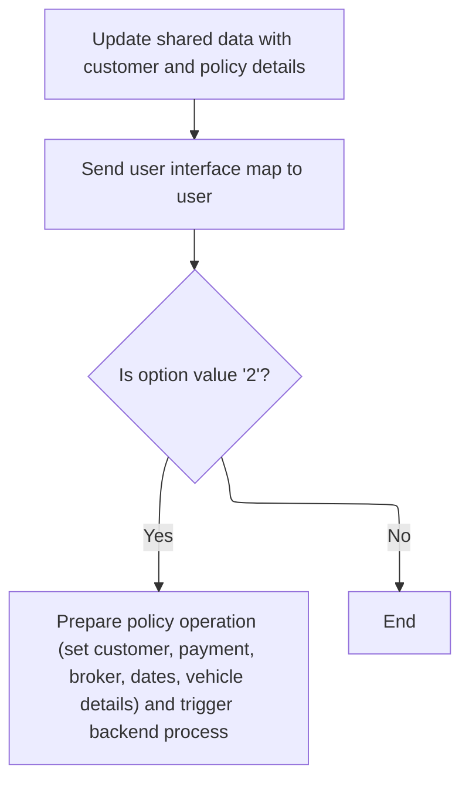
```mermaid
%%{init: {"flowchart": {"defaultRenderer": "elk"}} }%%
flowchart TD
    node1["Update shared data with customer and policy details"]
    click node1 openCode "base/src/lgtestp1.cbl:80:90"
    node1 --> node2["Send user interface map to user"]
    click node2 openCode "base/src/lgtestp1.cbl:91:94"
    node2 --> node3{"Is option value '2'?"}
    click node3 openCode "base/src/lgtestp1.cbl:97:97"
    node3 -->|"Yes"| node4["Prepare policy operation (set customer, payment, broker, dates, vehicle details) and trigger backend process"]
    click node4 openCode "base/src/lgtestp1.cbl:98:118"
    node3 -->|"No"| node5["End"]
    click node5 openCode "base/src/lgtestp1.cbl:94:94"
classDef HeadingStyle fill:#777777,stroke:#333,stroke-width:2px;

%% Swimm:
%% %%{init: {"flowchart": {"defaultRenderer": "elk"}} }%%
%% flowchart TD
%%     node1["Update shared data with customer and policy details"]
%%     click node1 openCode "<SwmPath>[base/src/lgtestp1.cbl](base/src/lgtestp1.cbl)</SwmPath>:80:90"
%%     node1 --> node2["Send user interface map to user"]
%%     click node2 openCode "<SwmPath>[base/src/lgtestp1.cbl](base/src/lgtestp1.cbl)</SwmPath>:91:94"
%%     node2 --> node3{"Is option value '2'?"}
%%     click node3 openCode "<SwmPath>[base/src/lgtestp1.cbl](base/src/lgtestp1.cbl)</SwmPath>:97:97"
%%     node3 -->|"Yes"| node4["Prepare policy operation (set customer, payment, broker, dates, vehicle details) and trigger backend process"]
%%     click node4 openCode "<SwmPath>[base/src/lgtestp1.cbl](base/src/lgtestp1.cbl)</SwmPath>:98:118"
%%     node3 -->|"No"| node5["End"]
%%     click node5 openCode "<SwmPath>[base/src/lgtestp1.cbl](base/src/lgtestp1.cbl)</SwmPath>:94:94"
%% classDef HeadingStyle fill:#777777,stroke:#333,stroke-width:2px;
```

<SwmSnippet path="/base/src/lgtestp1.cbl" line="80">

---

Back in <SwmToken path="base/src/lgtestp1.cbl" pos="33:5:7" line-data="              GO TO A-GAIN.">`A-GAIN`</SwmToken>, if we didn't go to <SwmToken path="base/src/lgtestp1.cbl" pos="77:5:7" line-data="                   GO TO NO-DATA">`NO-DATA`</SwmToken>, the code copies the policy details from the commarea into the output fields for the menu screen, so the user sees the retrieved data.

```cobol
                 Move CA-ISSUE-DATE     To  ENP1IDAI
                 Move CA-EXPIRY-DATE    To  ENP1EDAI
                 Move CA-M-MAKE         To  ENP1CMKI
                 Move CA-M-MODEL        To  ENP1CMOI
                 Move CA-M-VALUE        To  ENP1VALI
                 Move CA-M-REGNUMBER    To  ENP1REGI
                 Move CA-M-COLOUR       To  ENP1COLI
                 Move CA-M-CC           To  ENP1CCI
                 Move CA-M-MANUFACTURED To  ENP1MANI
                 Move CA-M-PREMIUM      To  ENP1PREI
                 Move CA-M-ACCIDENTS    To  ENP1ACCI
```

---

</SwmSnippet>

<SwmSnippet path="/base/src/lgtestp1.cbl" line="91">

---

After filling the output fields, the code sends the updated menu screen to the user so they see the policy details just retrieved.

```cobol
                 EXEC CICS SEND MAP ('SSMAPP1')
                           FROM(SSMAPP1O)
                           MAPSET ('SSMAP')
                 END-EXEC
```

---

</SwmSnippet>

<SwmSnippet path="/base/src/lgtestp1.cbl" line="97">

---

This part sets up the commarea with all the add data.

```cobol
             WHEN '2'
                 Move '01AMOT'          To CA-REQUEST-ID
                 Move ENP1CNOI          To CA-CUSTOMER-NUM
                 Move 0                 To CA-PAYMENT
                 Move 0                 To CA-BROKERID
                 Move '        '        To CA-BROKERSREF
                 Move ENP1IDAI          To CA-ISSUE-DATE
                 Move ENP1EDAI          To CA-EXPIRY-DATE
                 Move ENP1CMKI          To CA-M-MAKE
                 Move ENP1CMOI          To CA-M-MODEL
                 Move ENP1VALI          To CA-M-VALUE
                 Move ENP1REGI          To CA-M-REGNUMBER
                 Move ENP1COLI          To CA-M-COLOUR
                 Move ENP1CCI           To CA-M-CC
                 Move ENP1MANI          To CA-M-MANUFACTURED
                 Move ENP1PREI          To CA-M-PREMIUM
                 Move ENP1ACCI          To CA-M-ACCIDENTS
```

---

</SwmSnippet>

<SwmSnippet path="/base/src/lgtestp1.cbl" line="115">

---

After prepping the commarea, the code calls <SwmToken path="base/src/lgtestp1.cbl" pos="115:10:10" line-data="                 EXEC CICS LINK PROGRAM(&#39;LGAPOL01&#39;)">`LGAPOL01`</SwmToken> to handle the add operation. <SwmToken path="base/src/lgtestp1.cbl" pos="115:10:10" line-data="                 EXEC CICS LINK PROGRAM(&#39;LGAPOL01&#39;)">`LGAPOL01`</SwmToken> does the validation and inserts the new policy into the database.

```cobol
                 EXEC CICS LINK PROGRAM('LGAPOL01')
                           COMMAREA(COMM-AREA)
                           LENGTH(32500)
                 END-EXEC
```

---

</SwmSnippet>

## Validating and Processing Add Policy Requests

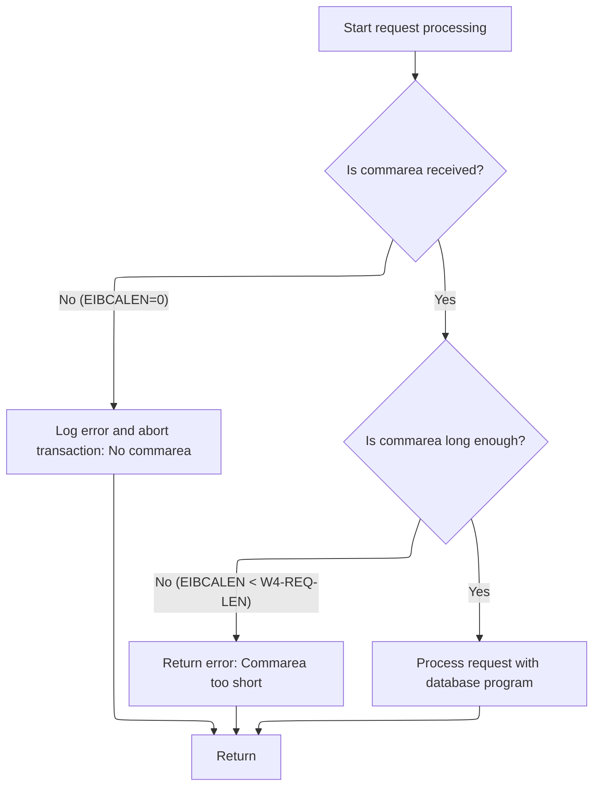
```mermaid
%%{init: {"flowchart": {"defaultRenderer": "elk"}} }%%
flowchart TD
    node1["Start request processing"] --> node2{"Is commarea received?"}
    click node1 openCode "base/src/lgapol01.cbl:68:73"
    node2 -->|"No (EIBCALEN=0)"| node3["Log error and abort transaction: No commarea"]
    click node2 openCode "base/src/lgapol01.cbl:83:87"
    click node3 openCode "base/src/lgapol01.cbl:84:86"
    node2 -->|"Yes"| node4{"Is commarea long enough?"}
    click node4 openCode "base/src/lgapol01.cbl:95:98"
    node4 -->|"No (EIBCALEN < W4-REQ-LEN)"| node5["Return error: Commarea too short"]
    click node5 openCode "base/src/lgapol01.cbl:96:97"
    node4 -->|"Yes"| node6["Process request with database program"]
    click node6 openCode "base/src/lgapol01.cbl:103:106"
    node3 --> node7["Return"]
    node5 --> node7
    node6 --> node7["Return"]
    click node7 openCode "base/src/lgapol01.cbl:108:108"
classDef HeadingStyle fill:#777777,stroke:#333,stroke-width:2px;

%% Swimm:
%% %%{init: {"flowchart": {"defaultRenderer": "elk"}} }%%
%% flowchart TD
%%     node1["Start request processing"] --> node2{"Is commarea received?"}
%%     click node1 openCode "<SwmPath>[base/src/lgapol01.cbl](base/src/lgapol01.cbl)</SwmPath>:68:73"
%%     node2 -->|"No (EIBCALEN=0)"| node3["Log error and abort transaction: No commarea"]
%%     click node2 openCode "<SwmPath>[base/src/lgapol01.cbl](base/src/lgapol01.cbl)</SwmPath>:83:87"
%%     click node3 openCode "<SwmPath>[base/src/lgapol01.cbl](base/src/lgapol01.cbl)</SwmPath>:84:86"
%%     node2 -->|"Yes"| node4{"Is commarea long enough?"}
%%     click node4 openCode "<SwmPath>[base/src/lgapol01.cbl](base/src/lgapol01.cbl)</SwmPath>:95:98"
%%     node4 -->|"No (EIBCALEN < <SwmToken path="base/src/lgapol01.cbl" pos="92:11:15" line-data="           ADD W4-HDR-LEN TO W4-REQ-LEN">`W4-REQ-LEN`</SwmToken>)"| node5["Return error: Commarea too short"]
%%     click node5 openCode "<SwmPath>[base/src/lgapol01.cbl](base/src/lgapol01.cbl)</SwmPath>:96:97"
%%     node4 -->|"Yes"| node6["Process request with database program"]
%%     click node6 openCode "<SwmPath>[base/src/lgapol01.cbl](base/src/lgapol01.cbl)</SwmPath>:103:106"
%%     node3 --> node7["Return"]
%%     node5 --> node7
%%     node6 --> node7["Return"]
%%     click node7 openCode "<SwmPath>[base/src/lgapol01.cbl](base/src/lgapol01.cbl)</SwmPath>:108:108"
%% classDef HeadingStyle fill:#777777,stroke:#333,stroke-width:2px;
```

This section ensures that only valid add policy requests are processed by verifying the commarea is present and of sufficient length, logging and reporting errors for invalid requests, and passing valid requests to the database handler for further processing.

| Category       | Rule Name                | Description                                                                                                   |
| -------------- | ------------------------ | ------------------------------------------------------------------------------------------------------------- |
| Business logic | Valid request processing | Valid requests (commarea present and long enough) must be passed to the database handler for policy addition. |

<SwmSnippet path="/base/src/lgapol01.cbl" line="68">

---

<SwmToken path="base/src/lgapol01.cbl" pos="68:1:3" line-data="       P100-MAIN SECTION.">`P100-MAIN`</SwmToken> checks for a commarea, validates its length, and then calls <SwmToken path="base/src/lgapol01.cbl" pos="103:9:9" line-data="           EXEC CICS Link Program(LGAPDB01)">`LGAPDB01`</SwmToken> to handle the actual add logic and DB insert. If anything's wrong, it logs an error and abends.

```cobol
       P100-MAIN SECTION.

      *----------------------------------------------------------------*
      * Common code                                                    *
      *----------------------------------------------------------------*
           INITIALIZE W1-CONTROL.
           MOVE EIBTRNID TO W1-TID.
           MOVE EIBTRMID TO W1-TRM.
           MOVE EIBTASKN TO W1-TSK.
           MOVE EIBCALEN TO W1-LEN.
      *----------------------------------------------------------------*

      *----------------------------------------------------------------*
      * Check commarea and obtain required details                     *
      *----------------------------------------------------------------*
           IF EIBCALEN IS EQUAL TO ZERO
               MOVE ' NO COMMAREA RECEIVED' TO W3-DETAIL
               PERFORM P999-ERROR
               EXEC CICS ABEND ABCODE('LGCA') NODUMP END-EXEC
           END-IF

           MOVE '00' TO CA-RETURN-CODE
           SET W1-PTR TO ADDRESS OF DFHCOMMAREA.

           ADD W4-HDR-LEN TO W4-REQ-LEN


           IF EIBCALEN IS LESS THAN W4-REQ-LEN
             MOVE '98' TO CA-RETURN-CODE
             EXEC CICS RETURN END-EXEC
           END-IF

      *----------------------------------------------------------------*
      *    Perform the data Inserts                                    *
      *----------------------------------------------------------------*
           EXEC CICS Link Program(LGAPDB01)
                Commarea(DFHCOMMAREA)
                LENGTH(32500)
           END-EXEC.

           EXEC CICS RETURN END-EXEC.
```

---

</SwmSnippet>

<SwmSnippet path="/base/src/lgapol01.cbl" line="119">

---

<SwmToken path="base/src/lgapol01.cbl" pos="119:1:3" line-data="       P999-ERROR.">`P999-ERROR`</SwmToken> timestamps and logs the error message, then calls LGSTSQ to queue it. If there's commarea data, it logs up to 90 bytes for extra context, following repo conventions.

```cobol
       P999-ERROR.
      * Save SQLCODE in message
      * Obtain and format current time and date
           EXEC CICS ASKTIME ABSTIME(W2-TIME)
           END-EXEC
           EXEC CICS FORMATTIME ABSTIME(W2-TIME)
                     MMDDYYYY(W2-DATE1)
                     TIME(W2-DATE2)
           END-EXEC
           MOVE W2-DATE1 TO W3-DATE
           MOVE W2-DATE2 TO W3-TIME
      * Write output message to TDQ
           EXEC CICS LINK PROGRAM('LGSTSQ')
                     COMMAREA(W3-MESSAGE)
                     LENGTH(LENGTH OF W3-MESSAGE)
           END-EXEC.
      * Write 90 bytes or as much as we have of commarea to TDQ
           IF EIBCALEN > 0 THEN
             IF EIBCALEN < 91 THEN
               MOVE DFHCOMMAREA(1:EIBCALEN) TO CA-DATA
               EXEC CICS LINK PROGRAM('LGSTSQ')
                         COMMAREA(CA-ERROR-MSG)
                         LENGTH(LENGTH OF CA-ERROR-MSG)
               END-EXEC
             ELSE
               MOVE DFHCOMMAREA(1:90) TO CA-DATA
               EXEC CICS LINK PROGRAM('LGSTSQ')
                         COMMAREA(CA-ERROR-MSG)
                         LENGTH(LENGTH OF CA-ERROR-MSG)
               END-EXEC
             END-IF
           END-IF.
           EXIT.
```

---

</SwmSnippet>

## Running Actuarial and Premium Calculations

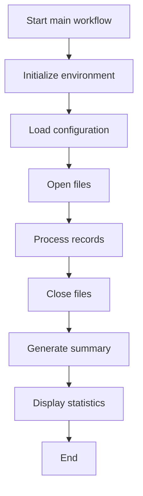
```mermaid
%%{init: {"flowchart": {"defaultRenderer": "elk"}} }%%
flowchart TD
    node1["Start main workflow"] --> node2["Initialize environment"]
    click node1 openCode "base/src/LGAPDB01.cbl:90:91"
    node2 --> node3["Load configuration"]
    click node2 openCode "base/src/LGAPDB01.cbl:91:92"
    node3 --> node4["Open files"]
    click node3 openCode "base/src/LGAPDB01.cbl:92:93"
    node4 --> node5["Process records"]
    click node4 openCode "base/src/LGAPDB01.cbl:93:94"
    node5 --> node6["Close files"]
    click node5 openCode "base/src/LGAPDB01.cbl:94:95"
    node6 --> node7["Generate summary"]
    click node6 openCode "base/src/LGAPDB01.cbl:95:96"
    node7 --> node8["Display statistics"]
    click node7 openCode "base/src/LGAPDB01.cbl:96:97"
    node8 --> node9["End"]
    click node8 openCode "base/src/LGAPDB01.cbl:97:98"

classDef HeadingStyle fill:#777777,stroke:#333,stroke-width:2px;

%% Swimm:
%% %%{init: {"flowchart": {"defaultRenderer": "elk"}} }%%
%% flowchart TD
%%     node1["Start main workflow"] --> node2["Initialize environment"]
%%     click node1 openCode "<SwmPath>[base/src/LGAPDB01.cbl](base/src/LGAPDB01.cbl)</SwmPath>:90:91"
%%     node2 --> node3["Load configuration"]
%%     click node2 openCode "<SwmPath>[base/src/LGAPDB01.cbl](base/src/LGAPDB01.cbl)</SwmPath>:91:92"
%%     node3 --> node4["Open files"]
%%     click node3 openCode "<SwmPath>[base/src/LGAPDB01.cbl](base/src/LGAPDB01.cbl)</SwmPath>:92:93"
%%     node4 --> node5["Process records"]
%%     click node4 openCode "<SwmPath>[base/src/LGAPDB01.cbl](base/src/LGAPDB01.cbl)</SwmPath>:93:94"
%%     node5 --> node6["Close files"]
%%     click node5 openCode "<SwmPath>[base/src/LGAPDB01.cbl](base/src/LGAPDB01.cbl)</SwmPath>:94:95"
%%     node6 --> node7["Generate summary"]
%%     click node6 openCode "<SwmPath>[base/src/LGAPDB01.cbl](base/src/LGAPDB01.cbl)</SwmPath>:95:96"
%%     node7 --> node8["Display statistics"]
%%     click node7 openCode "<SwmPath>[base/src/LGAPDB01.cbl](base/src/LGAPDB01.cbl)</SwmPath>:96:97"
%%     node8 --> node9["End"]
%%     click node8 openCode "<SwmPath>[base/src/LGAPDB01.cbl](base/src/LGAPDB01.cbl)</SwmPath>:97:98"
%% 
%% classDef HeadingStyle fill:#777777,stroke:#333,stroke-width:2px;
```

This section orchestrates the main workflow for running actuarial and premium calculations. It ensures that all necessary data and configuration are loaded, processes each input record to calculate premiums, and produces summary and statistical outputs for business review.

| Category        | Rule Name                           | Description                                                                                                                                                                             |
| --------------- | ----------------------------------- | --------------------------------------------------------------------------------------------------------------------------------------------------------------------------------------- |
| Data validation | Mandatory configuration enforcement | All required configuration parameters must be loaded before any premium calculations are performed. If any mandatory configuration is missing, the workflow must not proceed.           |
| Business logic  | Record-by-record processing         | Each input record must be processed individually to calculate the corresponding premium and actuarial values. No record may be skipped unless it fails validation.                      |
| Business logic  | Summary report generation           | After all records are processed, a summary report must be generated that includes total premiums calculated, number of records processed, and number of records excluded due to errors. |
| Business logic  | Statistics display                  | Statistical data, such as average premium, minimum and maximum premium, and distribution of premium values, must be displayed at the end of the workflow for business review.           |

<SwmSnippet path="/base/src/LGAPDB01.cbl" line="90">

---

<SwmToken path="base/src/LGAPDB01.cbl" pos="90:1:1" line-data="       P001.">`P001`</SwmToken> runs the main workflow for premium calculations: it initializes data, loads config, opens files, processes input records, closes files, generates a summary, and displays stats. Each step is handled by a separate section for clarity.

```cobol
       P001.
           PERFORM P002-INITIALIZE
           PERFORM P003-LOAD-CONFIG
           PERFORM P005-OPEN-FILES
           PERFORM P006-PROCESS-RECORDS
           PERFORM P014-CLOSE-FILES
           PERFORM P015-GENERATE-SUMMARY
           PERFORM P016-DISPLAY-STATS
           STOP RUN.
```

---

</SwmSnippet>

## Processing and Validating Input Records

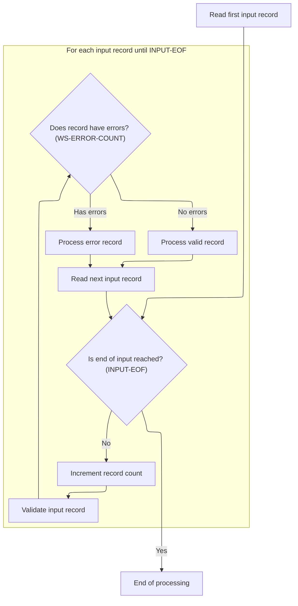
```mermaid
%%{init: {"flowchart": {"defaultRenderer": "elk"}} }%%
flowchart TD
    node1["Read first input record"]
    click node1 openCode "base/src/LGAPDB01.cbl:179:179"
    node1 --> node2{"Is end of input reached? (INPUT-EOF)"}
    click node2 openCode "base/src/LGAPDB01.cbl:180:180"
    subgraph loop1["For each input record until INPUT-EOF"]
        node2 -->|"No"| node3["Increment record count"]
        click node3 openCode "base/src/LGAPDB01.cbl:181:181"
        node3 --> node4["Validate input record"]
        click node4 openCode "base/src/LGAPDB01.cbl:182:182"
        node4 --> node5{"Does record have errors? (WS-ERROR-COUNT)"}
        click node5 openCode "base/src/LGAPDB01.cbl:183:183"
        node5 -->|"No errors"| node6["Process valid record"]
        click node6 openCode "base/src/LGAPDB01.cbl:184:184"
        node5 -->|"Has errors"| node7["Process error record"]
        click node7 openCode "base/src/LGAPDB01.cbl:186:186"
        node6 --> node8["Read next input record"]
        click node8 openCode "base/src/LGAPDB01.cbl:188:188"
        node7 --> node8
        node8 --> node2
    end
    node2 -->|"Yes"| node9["End of processing"]
    click node9 openCode "base/src/LGAPDB01.cbl:189:189"
classDef HeadingStyle fill:#777777,stroke:#333,stroke-width:2px;

%% Swimm:
%% %%{init: {"flowchart": {"defaultRenderer": "elk"}} }%%
%% flowchart TD
%%     node1["Read first input record"]
%%     click node1 openCode "<SwmPath>[base/src/LGAPDB01.cbl](base/src/LGAPDB01.cbl)</SwmPath>:179:179"
%%     node1 --> node2{"Is end of input reached? (<SwmToken path="base/src/LGAPDB01.cbl" pos="180:5:7" line-data="           PERFORM UNTIL INPUT-EOF">`INPUT-EOF`</SwmToken>)"}
%%     click node2 openCode "<SwmPath>[base/src/LGAPDB01.cbl](base/src/LGAPDB01.cbl)</SwmPath>:180:180"
%%     subgraph loop1["For each input record until <SwmToken path="base/src/LGAPDB01.cbl" pos="180:5:7" line-data="           PERFORM UNTIL INPUT-EOF">`INPUT-EOF`</SwmToken>"]
%%         node2 -->|"No"| node3["Increment record count"]
%%         click node3 openCode "<SwmPath>[base/src/LGAPDB01.cbl](base/src/LGAPDB01.cbl)</SwmPath>:181:181"
%%         node3 --> node4["Validate input record"]
%%         click node4 openCode "<SwmPath>[base/src/LGAPDB01.cbl](base/src/LGAPDB01.cbl)</SwmPath>:182:182"
%%         node4 --> node5{"Does record have errors? (<SwmToken path="base/src/LGAPDB01.cbl" pos="183:3:7" line-data="               IF WS-ERROR-COUNT = ZERO">`WS-ERROR-COUNT`</SwmToken>)"}
%%         click node5 openCode "<SwmPath>[base/src/LGAPDB01.cbl](base/src/LGAPDB01.cbl)</SwmPath>:183:183"
%%         node5 -->|"No errors"| node6["Process valid record"]
%%         click node6 openCode "<SwmPath>[base/src/LGAPDB01.cbl](base/src/LGAPDB01.cbl)</SwmPath>:184:184"
%%         node5 -->|"Has errors"| node7["Process error record"]
%%         click node7 openCode "<SwmPath>[base/src/LGAPDB01.cbl](base/src/LGAPDB01.cbl)</SwmPath>:186:186"
%%         node6 --> node8["Read next input record"]
%%         click node8 openCode "<SwmPath>[base/src/LGAPDB01.cbl](base/src/LGAPDB01.cbl)</SwmPath>:188:188"
%%         node7 --> node8
%%         node8 --> node2
%%     end
%%     node2 -->|"Yes"| node9["End of processing"]
%%     click node9 openCode "<SwmPath>[base/src/LGAPDB01.cbl](base/src/LGAPDB01.cbl)</SwmPath>:189:189"
%% classDef HeadingStyle fill:#777777,stroke:#333,stroke-width:2px;
```

This section is responsible for reading input records, validating them, and then either processing them if valid or logging errors if invalid. It ensures that all records are accounted for and that errors are tracked and reported.

| Category        | Rule Name               | Description                                                                                                                                                                                                                                         |
| --------------- | ----------------------- | --------------------------------------------------------------------------------------------------------------------------------------------------------------------------------------------------------------------------------------------------- |
| Data validation | Input record validation | Each input record must be validated for errors before any further processing occurs.                                                                                                                                                                |
| Business logic  | Complete input coverage | Processing must continue until the end-of-file indicator (<SwmToken path="base/src/LGAPDB01.cbl" pos="180:5:7" line-data="           PERFORM UNTIL INPUT-EOF">`INPUT-EOF`</SwmToken>) is reached, ensuring all available input records are handled. |
| Business logic  | Valid record processing | Records with zero errors (<SwmToken path="base/src/LGAPDB01.cbl" pos="183:3:7" line-data="               IF WS-ERROR-COUNT = ZERO">`WS-ERROR-COUNT`</SwmToken> = ZERO) must be processed as valid records.                                          |
| Business logic  | Record counting         | For each input record processed, increment the total record count (<SwmToken path="base/src/LGAPDB01.cbl" pos="181:7:11" line-data="               ADD 1 TO WS-REC-CNT">`WS-REC-CNT`</SwmToken>) to maintain accurate statistics.                   |

<SwmSnippet path="/base/src/LGAPDB01.cbl" line="178">

---

This part loops through input, validates, and processes or logs errors as needed.

```cobol
       P006-PROCESS-RECORDS.
           PERFORM P007-READ-INPUT
           PERFORM UNTIL INPUT-EOF
               ADD 1 TO WS-REC-CNT
               PERFORM P008-VALIDATE-INPUT-RECORD
               IF WS-ERROR-COUNT = ZERO
                   PERFORM P009-PROCESS-VALID-RECORD
               ELSE
                   PERFORM P010-PROCESS-ERROR-RECORD
               END-IF
               PERFORM P007-READ-INPUT
           END-PERFORM.
```

---

</SwmSnippet>

## Validating Policy Input and Logging Errors

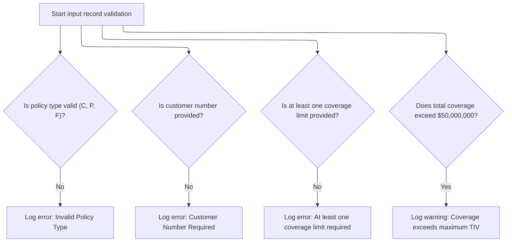
```mermaid
%%{init: {"flowchart": {"defaultRenderer": "elk"}} }%%
flowchart TD
    node1["Start input record validation"]
    click node1 openCode "base/src/LGAPDB01.cbl:195:196"
    node1 --> node2{"Is policy type valid (C, P, F)?"}
    click node2 openCode "base/src/LGAPDB01.cbl:198:204"
    node2 -->|"No"| node3["Log error: Invalid Policy Type"]
    click node3 openCode "base/src/LGAPDB01.cbl:201:204"
    node1 --> node4{"Is customer number provided?"}
    click node4 openCode "base/src/LGAPDB01.cbl:206:210"
    node4 -->|"No"| node5["Log error: Customer Number Required"]
    click node5 openCode "base/src/LGAPDB01.cbl:207:210"
    node1 --> node6{"Is at least one coverage limit provided?"}
    click node6 openCode "base/src/LGAPDB01.cbl:212:217"
    node6 -->|"No"| node7["Log error: At least one coverage limit required"]
    click node7 openCode "base/src/LGAPDB01.cbl:214:217"
    node1 --> node8{"Does total coverage exceed $50,000,000?"}
    click node8 openCode "base/src/LGAPDB01.cbl:219:224"
    node8 -->|"Yes"| node9["Log warning: Coverage exceeds maximum TIV"]
    click node9 openCode "base/src/LGAPDB01.cbl:221:224"

classDef HeadingStyle fill:#777777,stroke:#333,stroke-width:2px;

%% Swimm:
%% %%{init: {"flowchart": {"defaultRenderer": "elk"}} }%%
%% flowchart TD
%%     node1["Start input record validation"]
%%     click node1 openCode "<SwmPath>[base/src/LGAPDB01.cbl](base/src/LGAPDB01.cbl)</SwmPath>:195:196"
%%     node1 --> node2{"Is policy type valid (C, P, F)?"}
%%     click node2 openCode "<SwmPath>[base/src/LGAPDB01.cbl](base/src/LGAPDB01.cbl)</SwmPath>:198:204"
%%     node2 -->|"No"| node3["Log error: Invalid Policy Type"]
%%     click node3 openCode "<SwmPath>[base/src/LGAPDB01.cbl](base/src/LGAPDB01.cbl)</SwmPath>:201:204"
%%     node1 --> node4{"Is customer number provided?"}
%%     click node4 openCode "<SwmPath>[base/src/LGAPDB01.cbl](base/src/LGAPDB01.cbl)</SwmPath>:206:210"
%%     node4 -->|"No"| node5["Log error: Customer Number Required"]
%%     click node5 openCode "<SwmPath>[base/src/LGAPDB01.cbl](base/src/LGAPDB01.cbl)</SwmPath>:207:210"
%%     node1 --> node6{"Is at least one coverage limit provided?"}
%%     click node6 openCode "<SwmPath>[base/src/LGAPDB01.cbl](base/src/LGAPDB01.cbl)</SwmPath>:212:217"
%%     node6 -->|"No"| node7["Log error: At least one coverage limit required"]
%%     click node7 openCode "<SwmPath>[base/src/LGAPDB01.cbl](base/src/LGAPDB01.cbl)</SwmPath>:214:217"
%%     node1 --> node8{"Does total coverage exceed $50,000,000?"}
%%     click node8 openCode "<SwmPath>[base/src/LGAPDB01.cbl](base/src/LGAPDB01.cbl)</SwmPath>:219:224"
%%     node8 -->|"Yes"| node9["Log warning: Coverage exceeds maximum TIV"]
%%     click node9 openCode "<SwmPath>[base/src/LGAPDB01.cbl](base/src/LGAPDB01.cbl)</SwmPath>:221:224"
%% 
%% classDef HeadingStyle fill:#777777,stroke:#333,stroke-width:2px;
```

This section ensures that all policy input records meet minimum business requirements before further processing. It validates key fields and logs errors or warnings for any issues found, supporting data integrity and compliance.

| Category        | Rule Name                           | Description                                                                                                                                                            |
| --------------- | ----------------------------------- | ---------------------------------------------------------------------------------------------------------------------------------------------------------------------- |
| Data validation | Valid Policy Type                   | Only policy types 'C' (Commercial), 'P' (Personal), or 'F' (Farm) are considered valid. Any other value is rejected and an error is logged.                            |
| Data validation | Customer Number Required            | A customer number must be provided for every policy input record. If missing, an error is logged and the record is considered invalid.                                 |
| Data validation | Minimum Coverage Requirement        | At least one coverage limit (building, contents, or business interruption) must be provided. If all are zero, an error is logged and the record is considered invalid. |
| Business logic  | Maximum Total Insured Value Warning | If the sum of building, contents, and business interruption coverage exceeds $50,000,000, a warning is logged but the record is not rejected.                          |

<SwmSnippet path="/base/src/LGAPDB01.cbl" line="195">

---

<SwmToken path="base/src/LGAPDB01.cbl" pos="195:1:7" line-data="       P008-VALIDATE-INPUT-RECORD.">`P008-VALIDATE-INPUT-RECORD`</SwmToken> checks the input record for valid policy type, customer number, coverage limits, and total insured value. If any check fails, it logs an error with a repo-specific code and message.

```cobol
       P008-VALIDATE-INPUT-RECORD.
           INITIALIZE WS-ERROR-HANDLING
           
           IF NOT COMMERCIAL-POLICY AND 
              NOT PERSONAL-POLICY AND 
              NOT FARM-POLICY
               PERFORM P008A-LOG-ERROR WITH 
                   'POL001' 'F' 'IN-POLICY-TYPE' 
                   'Invalid Policy Type'
           END-IF
           
           IF IN-CUSTOMER-NUM = SPACES
               PERFORM P008A-LOG-ERROR WITH 
                   'CUS001' 'F' 'IN-CUSTOMER-NUM' 
                   'Customer Number Required'
           END-IF
           
           IF IN-BUILDING-LIMIT = ZERO AND 
              IN-CONTENTS-LIMIT = ZERO
               PERFORM P008A-LOG-ERROR WITH 
                   'COV001' 'F' 'COVERAGE-LIMITS' 
                   'At least one coverage limit required'
           END-IF
           
           IF IN-BUILDING-LIMIT + IN-CONTENTS-LIMIT + 
              IN-BI-LIMIT > WS-MAX-TIV
               PERFORM P008A-LOG-ERROR WITH 
                   'COV002' 'W' 'COVERAGE-LIMITS' 
                   'Total coverage exceeds maximum TIV'
           END-IF.
```

---

</SwmSnippet>

<SwmSnippet path="/base/src/LGAPDB01.cbl" line="226">

---

<SwmToken path="base/src/LGAPDB01.cbl" pos="226:1:5" line-data="       P008A-LOG-ERROR.">`P008A-LOG-ERROR`</SwmToken> increments the error count and stores each error's details in arrays indexed by that count. There's no check for overflow, so more than 20 errors could cause problems.

```cobol
       P008A-LOG-ERROR.
           ADD 1 TO WS-ERROR-COUNT
           SET ERR-IDX TO WS-ERROR-COUNT
           MOVE WS-ERROR-CODE TO WS-ERROR-CODE (ERR-IDX)
           MOVE WS-ERROR-SEVERITY TO WS-ERROR-SEVERITY (ERR-IDX)
           MOVE WS-ERROR-FIELD TO WS-ERROR-FIELD (ERR-IDX)
           MOVE WS-ERROR-MESSAGE TO WS-ERROR-MESSAGE (ERR-IDX).
```

---

</SwmSnippet>

## Routing Valid Policy Records for Processing

This section determines whether a valid policy record is commercial or non-commercial. Commercial policies are routed for full processing, while non-commercial policies are rejected and logged as errors. The section also updates counters for processed and error records.

| Category       | Rule Name                        | Description                                                                                                                       |
| -------------- | -------------------------------- | --------------------------------------------------------------------------------------------------------------------------------- |
| Business logic | Commercial policy eligibility    | Only policy records with a policy type of 'C' (commercial) are eligible for full processing. All other policy types are rejected. |
| Business logic | Processed records counter update | Each commercial policy record routed for processing increments the processed records counter by one.                              |
| Business logic | Error records counter update     | Each non-commercial policy record rejected increments the error records counter by one.                                           |

<SwmSnippet path="/base/src/LGAPDB01.cbl" line="234">

---

Here, valid policy records are routed to either commercial or non-commercial processing. Only commercial policies get full processing; others are rejected and logged as errors.

```cobol
       P009-PROCESS-VALID-RECORD.
           IF COMMERCIAL-POLICY
               PERFORM P011-PROCESS-COMMERCIAL
               ADD 1 TO WS-PROC-CNT
           ELSE
               PERFORM P012-PROCESS-NON-COMMERCIAL
               ADD 1 TO WS-ERR-CNT
           END-IF.
```

---

</SwmSnippet>

### Processing Commercial Policy Applications

This section governs how commercial policy applications are evaluated, including underwriting decisions and discount eligibility, resulting in a final decision and pricing adjustment for each application.

| Category       | Rule Name                           | Description                                                                                                          |
| -------------- | ----------------------------------- | -------------------------------------------------------------------------------------------------------------------- |
| Business logic | Underwriting Approval Status        | A policy application is considered 'Approved' if the underwriting decision status is set to 0.                       |
| Business logic | Underwriting Pending Status         | A policy application is considered 'Pending' if the underwriting decision status is set to 1.                        |
| Business logic | Underwriting Rejection Status       | A policy application is considered 'Rejected' if the underwriting decision status is set to 2.                       |
| Business logic | Underwriting Referral Status        | A policy application is considered 'Referred' if the underwriting decision status is set to 3.                       |
| Business logic | Multi-Policy Discount Eligibility   | A policy is eligible for a multi-policy discount if the eligibility flag is set to 'Y'.                              |
| Business logic | Claims-Free Discount Eligibility    | A policy is eligible for a claims-free discount if the eligibility flag is set to 'Y'.                               |
| Business logic | Safety Program Discount Eligibility | A policy is eligible for a safety program discount if the eligibility flag is set to 'Y'.                            |
| Business logic | Base Discount Factor                | The base discount factor for a policy is set to 1.00 unless eligibility criteria for discounts are met.              |
| Business logic | Total Discount Factor Calculation   | The total discount factor is calculated based on the combination of eligible discounts and is initially set to 1.00. |

See <SwmLink doc-title="Processing Commercial Insurance Applications">[Processing Commercial Insurance Applications](.swm%5Cprocessing-commercial-insurance-applications.qbcnl505.sw.md)</SwmLink>

### Handling Non-Commercial Policy Applications

<SwmSnippet path="/base/src/LGAPDB01.cbl" line="379">

---

<SwmToken path="base/src/LGAPDB01.cbl" pos="379:1:7" line-data="       P012-PROCESS-NON-COMMERCIAL.">`P012-PROCESS-NON-COMMERCIAL`</SwmToken> copies the customer and property info from input to output, zeroes out all premium and risk fields, and sets the status and reject reason to hardcoded values indicating non-commercial policies aren't supported. The output record is then written, so downstream systems and users get a clear rejection message.

```cobol
       P012-PROCESS-NON-COMMERCIAL.
           MOVE IN-CUSTOMER-NUM TO OUT-CUSTOMER-NUM
           MOVE IN-PROPERTY-TYPE TO OUT-PROPERTY-TYPE
           MOVE IN-POSTCODE TO OUT-POSTCODE
           MOVE ZERO TO OUT-RISK-SCORE
           MOVE ZERO TO OUT-FIRE-PREMIUM
           MOVE ZERO TO OUT-CRIME-PREMIUM
           MOVE ZERO TO OUT-FLOOD-PREMIUM
           MOVE ZERO TO OUT-WEATHER-PREMIUM
           MOVE ZERO TO OUT-TOTAL-PREMIUM
           MOVE 'UNSUPPORTED' TO OUT-STATUS
           MOVE 'Only Commercial policies supported in this version' 
                TO OUT-REJECT-REASON
           WRITE OUTPUT-RECORD.
```

---

</SwmSnippet>

## Handling Add Policy Failure in Menu Flow

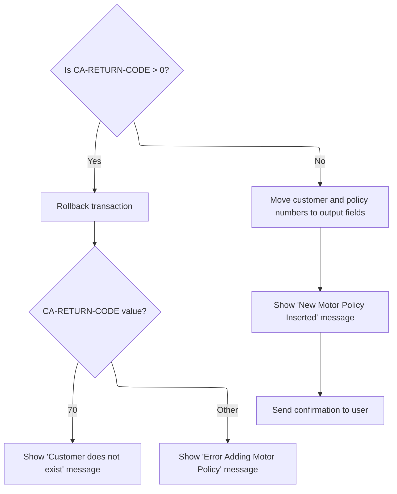
```mermaid
%%{init: {"flowchart": {"defaultRenderer": "elk"}} }%%
flowchart TD
    node1{"Is CA-RETURN-CODE > 0?"}
    click node1 openCode "base/src/lgtestp1.cbl:119:122"
    node1 -->|"Yes"| node2["Rollback transaction"]
    click node2 openCode "base/src/lgtestp1.cbl:120:120"
    node2 --> node3{"CA-RETURN-CODE value?"}
    click node3 openCode "base/src/lgtestp1.cbl:287:294"
    node3 -->|"70"| node4["Show 'Customer does not exist' message"]
    click node4 openCode "base/src/lgtestp1.cbl:289:290"
    node3 -->|"Other"| node5["Show 'Error Adding Motor Policy' message"]
    click node5 openCode "base/src/lgtestp1.cbl:292:293"
    node1 -->|"No"| node6["Move customer and policy numbers to output fields"]
    click node6 openCode "base/src/lgtestp1.cbl:124:125"
    node6 --> node7["Show 'New Motor Policy Inserted' message"]
    click node7 openCode "base/src/lgtestp1.cbl:127:128"
    node7 --> node8["Send confirmation to user"]
    click node8 openCode "base/src/lgtestp1.cbl:129:132"

classDef HeadingStyle fill:#777777,stroke:#333,stroke-width:2px;

%% Swimm:
%% %%{init: {"flowchart": {"defaultRenderer": "elk"}} }%%
%% flowchart TD
%%     node1{"Is <SwmToken path="base/src/lgtestp1.cbl" pos="76:3:7" line-data="                 IF CA-RETURN-CODE &gt; 0">`CA-RETURN-CODE`</SwmToken> > 0?"}
%%     click node1 openCode "<SwmPath>[base/src/lgtestp1.cbl](base/src/lgtestp1.cbl)</SwmPath>:119:122"
%%     node1 -->|"Yes"| node2["Rollback transaction"]
%%     click node2 openCode "<SwmPath>[base/src/lgtestp1.cbl](base/src/lgtestp1.cbl)</SwmPath>:120:120"
%%     node2 --> node3{"<SwmToken path="base/src/lgtestp1.cbl" pos="76:3:7" line-data="                 IF CA-RETURN-CODE &gt; 0">`CA-RETURN-CODE`</SwmToken> value?"}
%%     click node3 openCode "<SwmPath>[base/src/lgtestp1.cbl](base/src/lgtestp1.cbl)</SwmPath>:287:294"
%%     node3 -->|"70"| node4["Show 'Customer does not exist' message"]
%%     click node4 openCode "<SwmPath>[base/src/lgtestp1.cbl](base/src/lgtestp1.cbl)</SwmPath>:289:290"
%%     node3 -->|"Other"| node5["Show 'Error Adding Motor Policy' message"]
%%     click node5 openCode "<SwmPath>[base/src/lgtestp1.cbl](base/src/lgtestp1.cbl)</SwmPath>:292:293"
%%     node1 -->|"No"| node6["Move customer and policy numbers to output fields"]
%%     click node6 openCode "<SwmPath>[base/src/lgtestp1.cbl](base/src/lgtestp1.cbl)</SwmPath>:124:125"
%%     node6 --> node7["Show 'New Motor Policy Inserted' message"]
%%     click node7 openCode "<SwmPath>[base/src/lgtestp1.cbl](base/src/lgtestp1.cbl)</SwmPath>:127:128"
%%     node7 --> node8["Send confirmation to user"]
%%     click node8 openCode "<SwmPath>[base/src/lgtestp1.cbl](base/src/lgtestp1.cbl)</SwmPath>:129:132"
%% 
%% classDef HeadingStyle fill:#777777,stroke:#333,stroke-width:2px;
```

<SwmSnippet path="/base/src/lgtestp1.cbl" line="119">

---

Next, after <SwmToken path="base/src/lgtestp1.cbl" pos="115:10:10" line-data="                 EXEC CICS LINK PROGRAM(&#39;LGAPOL01&#39;)">`LGAPOL01`</SwmToken>, we check for errors and jump to <SwmToken path="base/src/lgtestp1.cbl" pos="121:5:7" line-data="                   GO TO NO-ADD">`NO-ADD`</SwmToken> to handle add failures and show the user an error.

```cobol
                 IF CA-RETURN-CODE > 0
                   Exec CICS Syncpoint Rollback End-Exec
                   GO TO NO-ADD
                 END-IF
```

---

</SwmSnippet>

<SwmSnippet path="/base/src/lgtestp1.cbl" line="286">

---

<SwmToken path="base/src/lgtestp1.cbl" pos="286:1:3" line-data="       NO-ADD.">`NO-ADD`</SwmToken> checks the return code and sets a specific error message for the user. It then jumps to <SwmToken path="base/src/lgtestp1.cbl" pos="290:5:7" line-data="               Go To ERROR-OUT">`ERROR-OUT`</SwmToken>, which displays the menu with the error and ends the session.

```cobol
       NO-ADD.
           Evaluate CA-RETURN-CODE
             When 70
               Move 'Customer does not exist'          To  ERP1FLDO
               Go To ERROR-OUT
             When Other
               Move 'Error Adding Motor Policy'        To  ERP1FLDO
               Go To ERROR-OUT
           End-Evaluate.
```

---

</SwmSnippet>

<SwmSnippet path="/base/src/lgtestp1.cbl" line="124">

---

Back in <SwmToken path="base/src/lgtestp1.cbl" pos="33:5:7" line-data="              GO TO A-GAIN.">`A-GAIN`</SwmToken>, after <SwmToken path="base/src/lgtestp1.cbl" pos="121:5:7" line-data="                   GO TO NO-ADD">`NO-ADD`</SwmToken>, if the add was successful, we copy the customer and policy numbers to the output fields, clear the option, set 'New Motor Policy Inserted' as the feedback, and send the updated menu to the user. These messages are tailored to the business logic and shown after each operation.

```cobol
                 Move CA-CUSTOMER-NUM To ENP1CNOI
                 Move CA-POLICY-NUM   To ENP1PNOI
                 Move ' '             To ENP1OPTI
                 Move 'New Motor Policy Inserted'
                   To  ERP1FLDO
                 EXEC CICS SEND MAP ('SSMAPP1')
                           FROM(SSMAPP1O)
                           MAPSET ('SSMAP')
                 END-EXEC
```

---

</SwmSnippet>

<SwmSnippet path="/base/src/lgtestp1.cbl" line="135">

---

When the user picks delete, we set <SwmToken path="base/src/lgtestp1.cbl" pos="136:9:13" line-data="                 Move &#39;01DMOT&#39;   To CA-REQUEST-ID">`CA-REQUEST-ID`</SwmToken> to <SwmToken path="base/src/lgtestp1.cbl" pos="136:4:4" line-data="                 Move &#39;01DMOT&#39;   To CA-REQUEST-ID">`01DMOT`</SwmToken>, fill in the customer and policy numbers, and call <SwmToken path="base/src/lgtestp1.cbl" pos="139:10:10" line-data="                 EXEC CICS LINK PROGRAM(&#39;LGDPOL01&#39;)">`LGDPOL01`</SwmToken>. This program handles the actual deletion logic for motor policies using the commarea data.

```cobol
             WHEN '3'
                 Move '01DMOT'   To CA-REQUEST-ID
                 Move ENP1CNOO   To CA-CUSTOMER-NUM
                 Move ENP1PNOO   To CA-POLICY-NUM
                 EXEC CICS LINK PROGRAM('LGDPOL01')
                           COMMAREA(COMM-AREA)
                           LENGTH(32500)
                 END-EXEC
```

---

</SwmSnippet>

## Validating and Executing Policy Deletion

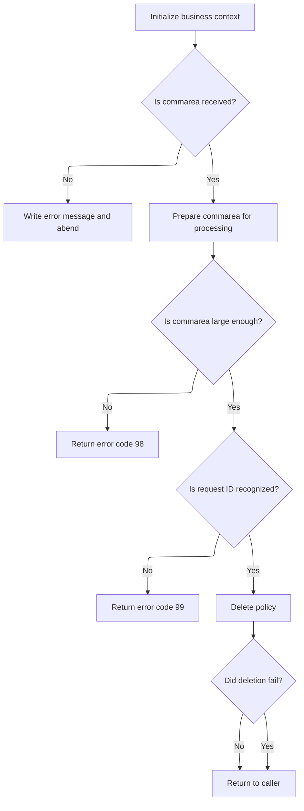
```mermaid
%%{init: {"flowchart": {"defaultRenderer": "elk"}} }%%
flowchart TD
    node1["Initialize business context"] --> node2{"Is commarea received?"}
    click node1 openCode "base/src/lgdpol01.cbl:83:89"
    node2 -->|"No"| node3["Write error message and abend"]
    click node2 openCode "base/src/lgdpol01.cbl:95:99"
    click node3 openCode "base/src/lgdpol01.cbl:96:98"
    node2 -->|"Yes"| node4["Prepare commarea for processing"]
    click node4 openCode "base/src/lgdpol01.cbl:102:104"
    node4 --> node5{"Is commarea large enough?"}
    click node5 openCode "base/src/lgdpol01.cbl:107:110"
    node5 -->|"No"| node6["Return error code 98"]
    click node6 openCode "base/src/lgdpol01.cbl:108:109"
    node5 -->|"Yes"| node7{"Is request ID recognized?"}
    click node7 openCode "base/src/lgdpol01.cbl:119:122"
    node7 -->|"No"| node8["Return error code 99"]
    click node8 openCode "base/src/lgdpol01.cbl:124:124"
    node7 -->|"Yes"| node9["Delete policy"]
    click node9 openCode "base/src/lgdpol01.cbl:126:126"
    node9 --> node10{"Did deletion fail?"}
    click node10 openCode "base/src/lgdpol01.cbl:127:129"
    node10 -->|"Yes"| node11["Return to caller"]
    click node11 openCode "base/src/lgdpol01.cbl:128:128"
    node10 -->|"No"| node11

classDef HeadingStyle fill:#777777,stroke:#333,stroke-width:2px;

%% Swimm:
%% %%{init: {"flowchart": {"defaultRenderer": "elk"}} }%%
%% flowchart TD
%%     node1["Initialize business context"] --> node2{"Is commarea received?"}
%%     click node1 openCode "<SwmPath>[base/src/lgdpol01.cbl](base/src/lgdpol01.cbl)</SwmPath>:83:89"
%%     node2 -->|"No"| node3["Write error message and abend"]
%%     click node2 openCode "<SwmPath>[base/src/lgdpol01.cbl](base/src/lgdpol01.cbl)</SwmPath>:95:99"
%%     click node3 openCode "<SwmPath>[base/src/lgdpol01.cbl](base/src/lgdpol01.cbl)</SwmPath>:96:98"
%%     node2 -->|"Yes"| node4["Prepare commarea for processing"]
%%     click node4 openCode "<SwmPath>[base/src/lgdpol01.cbl](base/src/lgdpol01.cbl)</SwmPath>:102:104"
%%     node4 --> node5{"Is commarea large enough?"}
%%     click node5 openCode "<SwmPath>[base/src/lgdpol01.cbl](base/src/lgdpol01.cbl)</SwmPath>:107:110"
%%     node5 -->|"No"| node6["Return error code 98"]
%%     click node6 openCode "<SwmPath>[base/src/lgdpol01.cbl](base/src/lgdpol01.cbl)</SwmPath>:108:109"
%%     node5 -->|"Yes"| node7{"Is request ID recognized?"}
%%     click node7 openCode "<SwmPath>[base/src/lgdpol01.cbl](base/src/lgdpol01.cbl)</SwmPath>:119:122"
%%     node7 -->|"No"| node8["Return error code 99"]
%%     click node8 openCode "<SwmPath>[base/src/lgdpol01.cbl](base/src/lgdpol01.cbl)</SwmPath>:124:124"
%%     node7 -->|"Yes"| node9["Delete policy"]
%%     click node9 openCode "<SwmPath>[base/src/lgdpol01.cbl](base/src/lgdpol01.cbl)</SwmPath>:126:126"
%%     node9 --> node10{"Did deletion fail?"}
%%     click node10 openCode "<SwmPath>[base/src/lgdpol01.cbl](base/src/lgdpol01.cbl)</SwmPath>:127:129"
%%     node10 -->|"Yes"| node11["Return to caller"]
%%     click node11 openCode "<SwmPath>[base/src/lgdpol01.cbl](base/src/lgdpol01.cbl)</SwmPath>:128:128"
%%     node10 -->|"No"| node11
%% 
%% classDef HeadingStyle fill:#777777,stroke:#333,stroke-width:2px;
```

This section governs the validation and execution of policy deletion requests. It ensures only recognized and properly formatted requests are processed, and that errors are handled and logged for troubleshooting.

| Category        | Rule Name                  | Description                                                                                                                                                                                                                                                                                                                                                                                                                                                                                                                                                                                                                                                                                                                                        |
| --------------- | -------------------------- | -------------------------------------------------------------------------------------------------------------------------------------------------------------------------------------------------------------------------------------------------------------------------------------------------------------------------------------------------------------------------------------------------------------------------------------------------------------------------------------------------------------------------------------------------------------------------------------------------------------------------------------------------------------------------------------------------------------------------------------------------- |
| Data validation | Minimum commarea length    | If the commarea length is less than 28 bytes, the system must return error code '98' and halt further processing.                                                                                                                                                                                                                                                                                                                                                                                                                                                                                                                                                                                                                                  |
| Data validation | Recognized request ID      | Only requests with a recognized request ID (<SwmToken path="base/src/lgdpol01.cbl" pos="119:18:18" line-data="           IF ( CA-REQUEST-ID NOT EQUAL TO &#39;01DEND&#39; AND">`01DEND`</SwmToken>, <SwmToken path="base/src/lgtestp1.cbl" pos="136:4:4" line-data="                 Move &#39;01DMOT&#39;   To CA-REQUEST-ID">`01DMOT`</SwmToken>, <SwmToken path="base/src/lgdpol01.cbl" pos="121:14:14" line-data="                CA-REQUEST-ID NOT EQUAL TO &#39;01DHOU&#39; AND">`01DHOU`</SwmToken>, <SwmToken path="base/src/lgdpol01.cbl" pos="122:14:14" line-data="                CA-REQUEST-ID NOT EQUAL TO &#39;01DCOM&#39; )">`01DCOM`</SwmToken>) are allowed to proceed. Unrecognized request IDs must result in error code '99'. |
| Business logic  | Error logging with context | All error events must be logged with the current date, time, and up to 90 bytes of the commarea for troubleshooting purposes.                                                                                                                                                                                                                                                                                                                                                                                                                                                                                                                                                                                                                      |

<SwmSnippet path="/base/src/lgdpol01.cbl" line="78">

---

<SwmToken path="base/src/lgdpol01.cbl" pos="78:1:1" line-data="       MAINLINE SECTION.">`MAINLINE`</SwmToken> in <SwmToken path="base/src/lgtestp1.cbl" pos="139:10:10" line-data="                 EXEC CICS LINK PROGRAM(&#39;LGDPOL01&#39;)">`LGDPOL01`</SwmToken> checks the commarea, validates the request ID, and only proceeds if it's one of the allowed types. If valid, it calls <SwmToken path="base/src/lgdpol01.cbl" pos="126:3:9" line-data="               PERFORM DELETE-POLICY-DB2-INFO">`DELETE-POLICY-DB2-INFO`</SwmToken> to handle the actual database deletion. Errors or unsupported requests set a return code and exit early.

```cobol
       MAINLINE SECTION.

      *----------------------------------------------------------------*
      * Common code                                                    *
      *----------------------------------------------------------------*
      * initialize working storage variables
           INITIALIZE WS-HEADER.
      * set up general variable
           MOVE EIBTRNID TO WS-TRANSID.
           MOVE EIBTRMID TO WS-TERMID.
           MOVE EIBTASKN TO WS-TASKNUM.
      *----------------------------------------------------------------*

      *----------------------------------------------------------------*
      * Check commarea and obtain required details                     *
      *----------------------------------------------------------------*
      * If NO commarea received issue an ABEND
           IF EIBCALEN IS EQUAL TO ZERO
               MOVE ' NO COMMAREA RECEIVED' TO EM-VARIABLE
               PERFORM WRITE-ERROR-MESSAGE
               EXEC CICS ABEND ABCODE('LGCA') NODUMP END-EXEC
           END-IF

      * initialize commarea return code to zero
           MOVE '00' TO CA-RETURN-CODE
           MOVE EIBCALEN TO WS-CALEN.
           SET WS-ADDR-DFHCOMMAREA TO ADDRESS OF DFHCOMMAREA.

      * Check commarea is large enough
           IF EIBCALEN IS LESS THAN WS-CA-HEADER-LEN
             MOVE '98' TO CA-RETURN-CODE
             EXEC CICS RETURN END-EXEC
           END-IF

      *----------------------------------------------------------------*
      * Check request-id in commarea and if recognised ...             *
      * Call routine to delete row from policy table                   *
      *----------------------------------------------------------------*
      * Upper case value passed in Request Id field                    *
           MOVE FUNCTION UPPER-CASE(CA-REQUEST-ID) TO CA-REQUEST-ID

           IF ( CA-REQUEST-ID NOT EQUAL TO '01DEND' AND
                CA-REQUEST-ID NOT EQUAL TO '01DMOT' AND
                CA-REQUEST-ID NOT EQUAL TO '01DHOU' AND
                CA-REQUEST-ID NOT EQUAL TO '01DCOM' )
      *        Request is not recognised or supported
               MOVE '99' TO CA-RETURN-CODE
           ELSE
               PERFORM DELETE-POLICY-DB2-INFO
               If CA-RETURN-CODE > 0
                 EXEC CICS RETURN END-EXEC
               End-if
           END-IF

      * Return to caller
           EXEC CICS RETURN END-EXEC.
```

---

</SwmSnippet>

<SwmSnippet path="/base/src/lgdpol01.cbl" line="154">

---

<SwmToken path="base/src/lgdpol01.cbl" pos="154:1:5" line-data="       WRITE-ERROR-MESSAGE.">`WRITE-ERROR-MESSAGE`</SwmToken> grabs the current time, formats it, and logs the error by linking to LGSTSQ. It also writes up to 90 bytes of the commarea for extra context, so errors are tracked with relevant data for troubleshooting.

```cobol
       WRITE-ERROR-MESSAGE.
      * Save SQLCODE in message
      * Obtain and format current time and date
           EXEC CICS ASKTIME ABSTIME(WS-ABSTIME)
           END-EXEC
           EXEC CICS FORMATTIME ABSTIME(Ws-ABSTIME)
                     MMDDYYYY(WS-DATE)
                     TIME(WS-TIME)
           END-EXEC
           MOVE WS-DATE TO EM-DATE
           MOVE WS-TIME TO EM-TIME
      * Write output message to TDQ
           EXEC CICS LINK PROGRAM('LGSTSQ')
                     COMMAREA(ERROR-MSG)
                     LENGTH(LENGTH OF ERROR-MSG)
           END-EXEC.
      * Write 90 bytes or as much as we have of commarea to TDQ
           IF EIBCALEN > 0 THEN
             IF EIBCALEN < 91 THEN
               MOVE DFHCOMMAREA(1:EIBCALEN) TO CA-DATA
               EXEC CICS LINK PROGRAM('LGSTSQ')
                         COMMAREA(CA-ERROR-MSG)
                         LENGTH(LENGTH OF CA-ERROR-MSG)
               END-EXEC
             ELSE
               MOVE DFHCOMMAREA(1:90) TO CA-DATA
               EXEC CICS LINK PROGRAM('LGSTSQ')
                         COMMAREA(CA-ERROR-MSG)
                         LENGTH(LENGTH OF CA-ERROR-MSG)
               END-EXEC
             END-IF
           END-IF.
           EXIT.
```

---

</SwmSnippet>

## Triggering Policy Deletion in Database

This section is responsible for initiating the deletion of a policy record from the database by passing the request to the appropriate handler. It ensures that the deletion process is started and that all required information is provided for the operation.

| Category        | Rule Name                          | Description                                                                                                               |
| --------------- | ---------------------------------- | ------------------------------------------------------------------------------------------------------------------------- |
| Data validation | Valid Policy Identifier Required   | A policy record can only be deleted if a valid policy identifier is provided in the request.                              |
| Data validation | Complete Context Information       | The deletion request must include all required context information to ensure the correct policy is targeted for deletion. |
| Business logic  | Audit Logging of Deletion Requests | Policy deletion requests must be logged for audit and compliance purposes.                                                |

<SwmSnippet path="/base/src/lgdpol01.cbl" line="139">

---

<SwmToken path="base/src/lgdpol01.cbl" pos="139:1:7" line-data="       DELETE-POLICY-DB2-INFO.">`DELETE-POLICY-DB2-INFO`</SwmToken> just calls <SwmToken path="base/src/lgdpol01.cbl" pos="141:9:9" line-data="           EXEC CICS LINK PROGRAM(LGDPDB01)">`LGDPDB01`</SwmToken> with the commarea. That program does the actual database delete, so this step hands off the work to the DB handler.

```cobol
       DELETE-POLICY-DB2-INFO.

           EXEC CICS LINK PROGRAM(LGDPDB01)
                Commarea(DFHCOMMAREA)
                LENGTH(32500)
           END-EXEC.

           EXIT.
```

---

</SwmSnippet>

## Validating and Deleting Policy Records


```mermaid
%%{init: {"flowchart": {"defaultRenderer": "elk"}} }%%
flowchart TD
  node1["Start MAINLINE processing"]
  click node1 openCode "base/src/lgdpdb01.cbl:111:112"
  node1 --> node2{"Was request data received? (EIBCALEN = 0)"}
  click node2 openCode "base/src/lgdpdb01.cbl:131:135"
  node2 -->|"No commarea"| node3["Set error: No commarea, record error, return 'LGCA'"]
  click node3 openCode "base/src/lgdpdb01.cbl:132:134"
  node2 -->|"Received"| node4{"Is data long enough? (EIBCALEN < 28)"}
  click node4 openCode "base/src/lgdpdb01.cbl:143:146"
  node4 -->|"Too short"| node5["Set error: Data too short, return code '98'"]
  click node5 openCode "base/src/lgdpdb01.cbl:144:145"
  node4 -->|"Sufficient"| node6{"Is request type supported? (CA-REQUEST-ID in [01DEND,01DHOU,01DCOM,01DMOT])"}
  click node6 openCode "base/src/lgdpdb01.cbl:160:172"
  node6 -->|"Not supported"| node7["Set error: Unsupported request, return code '99'"]
  click node7 openCode "base/src/lgdpdb01.cbl:165:165"
  node6 -->|"Supported"| node8["Delete policy (DELETE-POLICY-DB2-INFO), call downstream process"]
  click node8 openCode "base/src/lgdpdb01.cbl:167:171"
  node8 --> node9["Return to caller"]
  click node9 openCode "base/src/lgdpdb01.cbl:175:175"
  node7 --> node9
  node5 --> node9
  node3 --> node9
classDef HeadingStyle fill:#777777,stroke:#333,stroke-width:2px;

%% Swimm:
%% %%{init: {"flowchart": {"defaultRenderer": "elk"}} }%%
%% flowchart TD
%%   node1["Start MAINLINE processing"]
%%   click node1 openCode "<SwmPath>[base/src/lgdpdb01.cbl](base/src/lgdpdb01.cbl)</SwmPath>:111:112"
%%   node1 --> node2{"Was request data received? (EIBCALEN = 0)"}
%%   click node2 openCode "<SwmPath>[base/src/lgdpdb01.cbl](base/src/lgdpdb01.cbl)</SwmPath>:131:135"
%%   node2 -->|"No commarea"| node3["Set error: No commarea, record error, return 'LGCA'"]
%%   click node3 openCode "<SwmPath>[base/src/lgdpdb01.cbl](base/src/lgdpdb01.cbl)</SwmPath>:132:134"
%%   node2 -->|"Received"| node4{"Is data long enough? (EIBCALEN < 28)"}
%%   click node4 openCode "<SwmPath>[base/src/lgdpdb01.cbl](base/src/lgdpdb01.cbl)</SwmPath>:143:146"
%%   node4 -->|"Too short"| node5["Set error: Data too short, return code '98'"]
%%   click node5 openCode "<SwmPath>[base/src/lgdpdb01.cbl](base/src/lgdpdb01.cbl)</SwmPath>:144:145"
%%   node4 -->|"Sufficient"| node6{"Is request type supported? (<SwmToken path="base/src/lgtestp1.cbl" pos="69:9:13" line-data="                 Move &#39;01IMOT&#39;   To CA-REQUEST-ID">`CA-REQUEST-ID`</SwmToken> in [<SwmToken path="base/src/lgdpol01.cbl" pos="119:18:18" line-data="           IF ( CA-REQUEST-ID NOT EQUAL TO &#39;01DEND&#39; AND">`01DEND`</SwmToken>,<SwmToken path="base/src/lgdpol01.cbl" pos="121:14:14" line-data="                CA-REQUEST-ID NOT EQUAL TO &#39;01DHOU&#39; AND">`01DHOU`</SwmToken>,<SwmToken path="base/src/lgdpol01.cbl" pos="122:14:14" line-data="                CA-REQUEST-ID NOT EQUAL TO &#39;01DCOM&#39; )">`01DCOM`</SwmToken>,<SwmToken path="base/src/lgtestp1.cbl" pos="136:4:4" line-data="                 Move &#39;01DMOT&#39;   To CA-REQUEST-ID">`01DMOT`</SwmToken>])"}
%%   click node6 openCode "<SwmPath>[base/src/lgdpdb01.cbl](base/src/lgdpdb01.cbl)</SwmPath>:160:172"
%%   node6 -->|"Not supported"| node7["Set error: Unsupported request, return code '99'"]
%%   click node7 openCode "<SwmPath>[base/src/lgdpdb01.cbl](base/src/lgdpdb01.cbl)</SwmPath>:165:165"
%%   node6 -->|"Supported"| node8["Delete policy (<SwmToken path="base/src/lgdpol01.cbl" pos="126:3:9" line-data="               PERFORM DELETE-POLICY-DB2-INFO">`DELETE-POLICY-DB2-INFO`</SwmToken>), call downstream process"]
%%   click node8 openCode "<SwmPath>[base/src/lgdpdb01.cbl](base/src/lgdpdb01.cbl)</SwmPath>:167:171"
%%   node8 --> node9["Return to caller"]
%%   click node9 openCode "<SwmPath>[base/src/lgdpdb01.cbl](base/src/lgdpdb01.cbl)</SwmPath>:175:175"
%%   node7 --> node9
%%   node5 --> node9
%%   node3 --> node9
%% classDef HeadingStyle fill:#777777,stroke:#333,stroke-width:2px;
```

This section governs the validation and deletion of policy records. It ensures that only supported requests with valid data are processed, and that errors are consistently handled and logged. The section is responsible for maintaining data integrity and traceability when deleting policy records.

| Category        | Rule Name                       | Description                                                                                                                                                                                                                                                                                                                                                                                                                                                                                                                                                                                                                                                                                                                                                      |
| --------------- | ------------------------------- | ---------------------------------------------------------------------------------------------------------------------------------------------------------------------------------------------------------------------------------------------------------------------------------------------------------------------------------------------------------------------------------------------------------------------------------------------------------------------------------------------------------------------------------------------------------------------------------------------------------------------------------------------------------------------------------------------------------------------------------------------------------------- |
| Data validation | Supported request types         | Only requests with a supported request ID (<SwmToken path="base/src/lgdpol01.cbl" pos="119:18:18" line-data="           IF ( CA-REQUEST-ID NOT EQUAL TO &#39;01DEND&#39; AND">`01DEND`</SwmToken>, <SwmToken path="base/src/lgdpol01.cbl" pos="121:14:14" line-data="                CA-REQUEST-ID NOT EQUAL TO &#39;01DHOU&#39; AND">`01DHOU`</SwmToken>, <SwmToken path="base/src/lgdpol01.cbl" pos="122:14:14" line-data="                CA-REQUEST-ID NOT EQUAL TO &#39;01DCOM&#39; )">`01DCOM`</SwmToken>, <SwmToken path="base/src/lgtestp1.cbl" pos="136:4:4" line-data="                 Move &#39;01DMOT&#39;   To CA-REQUEST-ID">`01DMOT`</SwmToken>) are allowed to proceed. Unsupported request IDs must result in termination and error code '99'. |
| Business logic  | Record not found is success     | If the policy record is not found in the database (SQLCODE 100), the operation is considered successful and no error is returned.                                                                                                                                                                                                                                                                                                                                                                                                                                                                                                                                                                                                                                |
| Business logic  | Downstream deletion consistency | After a successful <SwmToken path="base/src/lgipdb01.cbl" pos="242:5:5" line-data="      * initialize DB2 host variables">`DB2`</SwmToken> deletion, the process must also call the downstream VSAM deletion routine to ensure the policy record is removed from all relevant systems.                                                                                                                                                                                                                                                                                                                                                                                                                                                                           |

<SwmSnippet path="/base/src/lgdpdb01.cbl" line="111">

---

<SwmToken path="base/src/lgdpdb01.cbl" pos="111:1:1" line-data="       MAINLINE SECTION.">`MAINLINE`</SwmToken> in <SwmToken path="base/src/lgdpol01.cbl" pos="141:9:9" line-data="           EXEC CICS LINK PROGRAM(LGDPDB01)">`LGDPDB01`</SwmToken> checks the commarea, converts customer and policy numbers to <SwmToken path="base/src/lgdpdb01.cbl" pos="124:5:5" line-data="      * initialize DB2 host variables">`DB2`</SwmToken> integer format, validates the request ID, and if valid, calls the <SwmToken path="base/src/lgdpdb01.cbl" pos="124:5:5" line-data="      * initialize DB2 host variables">`DB2`</SwmToken> delete logic. After that, it links to <SwmToken path="base/src/lgdpdb01.cbl" pos="168:9:9" line-data="               EXEC CICS LINK PROGRAM(LGDPVS01)">`LGDPVS01`</SwmToken> to handle VSAM file deletion. Errors are logged if anything goes wrong.

```cobol
       MAINLINE SECTION.

      *----------------------------------------------------------------*
      * Common code                                                    *
      *----------------------------------------------------------------*
      * initialize working storage variables
           INITIALIZE WS-HEADER.
      * set up general variable
           MOVE EIBTRNID TO WS-TRANSID.
           MOVE EIBTRMID TO WS-TERMID.
           MOVE EIBTASKN TO WS-TASKNUM.
      *----------------------------------------------------------------*

      * initialize DB2 host variables
           INITIALIZE DB2-IN-INTEGERS.

      *----------------------------------------------------------------*
      * Check commarea and obtain required details                     *
      *----------------------------------------------------------------*
      * If NO commarea received issue an ABEND
           IF EIBCALEN IS EQUAL TO ZERO
               MOVE ' NO COMMAREA RECEIVED' TO EM-VARIABLE
               PERFORM WRITE-ERROR-MESSAGE
               EXEC CICS ABEND ABCODE('LGCA') NODUMP END-EXEC
           END-IF

      * initialize commarea return code to zero
           MOVE '00' TO CA-RETURN-CODE
           MOVE EIBCALEN TO WS-CALEN.
           SET WS-ADDR-DFHCOMMAREA TO ADDRESS OF DFHCOMMAREA.

      * Check commarea is large enough
           IF EIBCALEN IS LESS THAN WS-CA-HEADER-LEN
             MOVE '98' TO CA-RETURN-CODE
             EXEC CICS RETURN END-EXEC
           END-IF

      * Convert commarea customer & policy nums to DB2 integer format
           MOVE CA-CUSTOMER-NUM TO DB2-CUSTOMERNUM-INT
           MOVE CA-POLICY-NUM   TO DB2-POLICYNUM-INT
      * and save in error msg field incase required
           MOVE CA-CUSTOMER-NUM TO EM-CUSNUM
           MOVE CA-POLICY-NUM   TO EM-POLNUM

      *----------------------------------------------------------------*
      * Check request-id in commarea and if recognised ...             *
      * Call routine to delete row from policy table                   *
      *----------------------------------------------------------------*

           IF ( CA-REQUEST-ID NOT EQUAL TO '01DEND' AND
                CA-REQUEST-ID NOT EQUAL TO '01DHOU' AND
                CA-REQUEST-ID NOT EQUAL TO '01DCOM' AND
                CA-REQUEST-ID NOT EQUAL TO '01DMOT' ) Then
      *        Request is not recognised or supported
               MOVE '99' TO CA-RETURN-CODE
           ELSE
               PERFORM DELETE-POLICY-DB2-INFO
               EXEC CICS LINK PROGRAM(LGDPVS01)
                    Commarea(DFHCOMMAREA)
                    LENGTH(32500)
               END-EXEC
           END-IF.

      * Return to caller
           EXEC CICS RETURN END-EXEC.
```

---

</SwmSnippet>

<SwmSnippet path="/base/src/lgdpdb01.cbl" line="212">

---

<SwmToken path="base/src/lgdpdb01.cbl" pos="212:1:5" line-data="       WRITE-ERROR-MESSAGE.">`WRITE-ERROR-MESSAGE`</SwmToken> in <SwmToken path="base/src/lgdpol01.cbl" pos="141:9:9" line-data="           EXEC CICS LINK PROGRAM(LGDPDB01)">`LGDPDB01`</SwmToken> timestamps the error, logs it by linking to LGSTSQ, and writes up to 90 bytes of commarea data for extra context. This keeps error tracking consistent and within system limits.

```cobol
       WRITE-ERROR-MESSAGE.
      * Save SQLCODE in message
           MOVE SQLCODE TO EM-SQLRC
      * Obtain and format current time and date
           EXEC CICS ASKTIME ABSTIME(WS-ABSTIME)
           END-EXEC
           EXEC CICS FORMATTIME ABSTIME(Ws-ABSTIME)
                     MMDDYYYY(WS-DATE)
                     TIME(WS-TIME)
           END-EXEC
           MOVE WS-DATE TO EM-DATE
           MOVE WS-TIME TO EM-TIME
      * Write output message to TDQ
           EXEC CICS LINK PROGRAM('LGSTSQ')
                     COMMAREA(ERROR-MSG)
                     LENGTH(LENGTH OF ERROR-MSG)
           END-EXEC.
      * Write 90 bytes or as much as we have of commarea to TDQ
           IF EIBCALEN > 0 THEN
             IF EIBCALEN < 91 THEN
               MOVE DFHCOMMAREA(1:EIBCALEN) TO CA-DATA
               EXEC CICS LINK PROGRAM('LGSTSQ')
                         COMMAREA(CA-ERROR-MSG)
                         LENGTH(LENGTH OF CA-ERROR-MSG)
               END-EXEC
             ELSE
               MOVE DFHCOMMAREA(1:90) TO CA-DATA
               EXEC CICS LINK PROGRAM('LGSTSQ')
                         COMMAREA(CA-ERROR-MSG)
                         LENGTH(LENGTH OF CA-ERROR-MSG)
               END-EXEC
             END-IF
           END-IF.
           EXIT.
```

---

</SwmSnippet>

<SwmSnippet path="/base/src/lgdpdb01.cbl" line="186">

---

<SwmToken path="base/src/lgdpdb01.cbl" pos="186:1:7" line-data="       DELETE-POLICY-DB2-INFO.">`DELETE-POLICY-DB2-INFO`</SwmToken> runs the SQL DELETE for the policy. If SQLCODE isn't 0 or 100, it sets an error code, logs the error, and returns. Otherwise, it exits cleanly since the record is gone.

```cobol
       DELETE-POLICY-DB2-INFO.

           MOVE ' DELETE POLICY  ' TO EM-SQLREQ
           EXEC SQL
             DELETE
               FROM POLICY
               WHERE ( CUSTOMERNUMBER = :DB2-CUSTOMERNUM-INT AND
                       POLICYNUMBER  = :DB2-POLICYNUM-INT      )
           END-EXEC

      *    Treat SQLCODE 0 and SQLCODE 100 (record not found) as
      *    successful - end result is record does not exist
           IF SQLCODE NOT EQUAL 0 Then
               MOVE '90' TO CA-RETURN-CODE
               PERFORM WRITE-ERROR-MESSAGE
               EXEC CICS RETURN END-EXEC
           END-IF.

           EXIT.
```

---

</SwmSnippet>

## Deleting Policy from VSAM File and Logging Errors

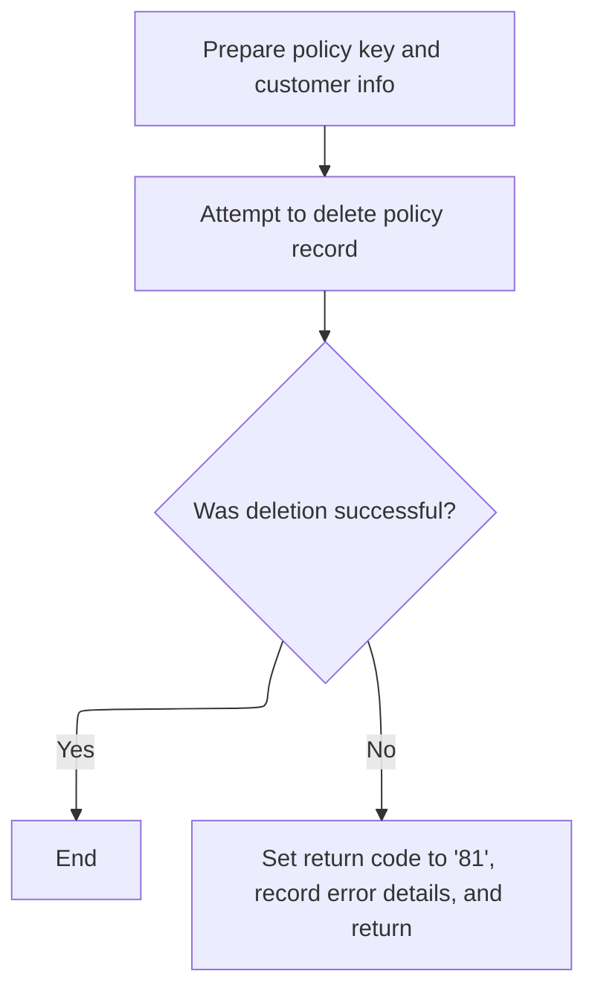
```mermaid
%%{init: {"flowchart": {"defaultRenderer": "elk"}} }%%
flowchart TD
    node1["Prepare policy key and customer info"] --> node2["Attempt to delete policy record"]
    click node1 openCode "base/src/lgdpvs01.cbl:75:79"
    click node2 openCode "base/src/lgdpvs01.cbl:81:85"
    node2 --> node3{"Was deletion successful?"}
    click node3 openCode "base/src/lgdpvs01.cbl:86:91"
    node3 -->|"Yes"| node4["End"]
    click node4 openCode "base/src/lgdpvs01.cbl:91:91"
    node3 -->|"No"| node5["Set return code to '81', record error details, and return"]
    click node5 openCode "base/src/lgdpvs01.cbl:87:90"
    click node5 openCode "base/src/lgdpvs01.cbl:99:132"
classDef HeadingStyle fill:#777777,stroke:#333,stroke-width:2px;

%% Swimm:
%% %%{init: {"flowchart": {"defaultRenderer": "elk"}} }%%
%% flowchart TD
%%     node1["Prepare policy key and customer info"] --> node2["Attempt to delete policy record"]
%%     click node1 openCode "<SwmPath>[base/src/lgdpvs01.cbl](base/src/lgdpvs01.cbl)</SwmPath>:75:79"
%%     click node2 openCode "<SwmPath>[base/src/lgdpvs01.cbl](base/src/lgdpvs01.cbl)</SwmPath>:81:85"
%%     node2 --> node3{"Was deletion successful?"}
%%     click node3 openCode "<SwmPath>[base/src/lgdpvs01.cbl](base/src/lgdpvs01.cbl)</SwmPath>:86:91"
%%     node3 -->|"Yes"| node4["End"]
%%     click node4 openCode "<SwmPath>[base/src/lgdpvs01.cbl](base/src/lgdpvs01.cbl)</SwmPath>:91:91"
%%     node3 -->|"No"| node5["Set return code to '81', record error details, and return"]
%%     click node5 openCode "<SwmPath>[base/src/lgdpvs01.cbl](base/src/lgdpvs01.cbl)</SwmPath>:87:90"
%%     click node5 openCode "<SwmPath>[base/src/lgdpvs01.cbl](base/src/lgdpvs01.cbl)</SwmPath>:99:132"
%% classDef HeadingStyle fill:#777777,stroke:#333,stroke-width:2px;
```

This section governs the deletion of policy records from the VSAM file and ensures that any errors encountered during the process are logged with sufficient detail for troubleshooting and audit purposes.

| Category        | Rule Name                   | Description                                                                                                                                                                                  |
| --------------- | --------------------------- | -------------------------------------------------------------------------------------------------------------------------------------------------------------------------------------------- |
| Data validation | Policy Key Match Required   | A policy record must be deleted only if the provided key (customer and policy number) matches an existing record in the VSAM file.                                                           |
| Data validation | Commarea Data Logging Limit | If the commarea length is greater than zero and less than 91 bytes, all commarea data must be logged; if greater than or equal to 91 bytes, only the first 90 bytes must be logged.          |
| Business logic  | Comprehensive Error Logging | When a deletion error occurs, the system must log the error details, including customer number, policy number, response codes, date, time, and up to 90 bytes of commarea data if available. |
| Business logic  | Error Timestamping          | The error logging process must include a timestamp (date and time) for each error entry.                                                                                                     |

<SwmSnippet path="/base/src/lgdpvs01.cbl" line="72">

---

<SwmToken path="base/src/lgdpvs01.cbl" pos="72:1:1" line-data="       MAINLINE SECTION.">`MAINLINE`</SwmToken> in <SwmToken path="base/src/lgdpdb01.cbl" pos="168:9:9" line-data="               EXEC CICS LINK PROGRAM(LGDPVS01)">`LGDPVS01`</SwmToken> builds the VSAM file key from the request and policy/customer numbers, then runs the CICS Delete File command. If it fails, it logs the error and sets a specific return code before exiting.

```cobol
       MAINLINE SECTION.
      *
      *---------------------------------------------------------------*
           Move EIBCALEN To WS-Commarea-Len.
      *---------------------------------------------------------------*
           Move CA-Request-ID(4:1) To WF-Request-ID
           Move CA-Policy-Num      To WF-Policy-Num
           Move CA-Customer-Num    To WF-Customer-Num
      *---------------------------------------------------------------*
           Exec CICS Delete File('KSDSPOLY')
                     Ridfld(WF-Policy-Key)
                     KeyLength(21)
                     RESP(WS-RESP)
           End-Exec.
           If WS-RESP Not = DFHRESP(NORMAL)
             Move EIBRESP2 To WS-RESP2
             MOVE '81' TO CA-RETURN-CODE
             PERFORM WRITE-ERROR-MESSAGE
             EXEC CICS RETURN END-EXEC
           End-If.
```

---

</SwmSnippet>

<SwmSnippet path="/base/src/lgdpvs01.cbl" line="99">

---

<SwmToken path="base/src/lgdpvs01.cbl" pos="99:1:5" line-data="       WRITE-ERROR-MESSAGE.">`WRITE-ERROR-MESSAGE`</SwmToken> in <SwmToken path="base/src/lgdpdb01.cbl" pos="168:9:9" line-data="               EXEC CICS LINK PROGRAM(LGDPVS01)">`LGDPVS01`</SwmToken> grabs the current time, fills out the error message with customer, policy, and response codes, then calls LGSTSQ to log it. It also writes up to 90 bytes of commarea data for extra context.

```cobol
       WRITE-ERROR-MESSAGE.
           EXEC CICS ASKTIME ABSTIME(WS-ABSTIME)
           END-EXEC
           EXEC CICS FORMATTIME ABSTIME(WS-ABSTIME)
                     MMDDYYYY(WS-DATE)
                     TIME(WS-TIME)
           END-EXEC
      *
           MOVE WS-DATE TO EM-DATE
           MOVE WS-TIME TO EM-TIME
           Move CA-Customer-Num To EM-CUSNUM 
           Move CA-POLICY-NUM To EM-POLNUM 
           Move WS-RESP         To EM-RespRC
           Move WS-RESP2        To EM-Resp2RC
           EXEC CICS LINK PROGRAM('LGSTSQ')
                     COMMAREA(ERROR-MSG)
                     LENGTH(LENGTH OF ERROR-MSG)
           END-EXEC.
           IF EIBCALEN > 0 THEN
             IF EIBCALEN < 91 THEN
               MOVE DFHCOMMAREA(1:EIBCALEN) TO CA-DATA
               EXEC CICS LINK PROGRAM('LGSTSQ')
                         COMMAREA(CA-ERROR-MSG)
                         LENGTH(Length Of CA-ERROR-MSG)
               END-EXEC
             ELSE
               MOVE DFHCOMMAREA(1:90) TO CA-DATA
               EXEC CICS LINK PROGRAM('LGSTSQ')
                         COMMAREA(CA-ERROR-MSG)
                         LENGTH(Length Of CA-ERROR-MSG)
               END-EXEC
             END-IF
           END-IF.
           EXIT.
```

---

</SwmSnippet>

## Handling Delete Policy Failure in Menu Flow

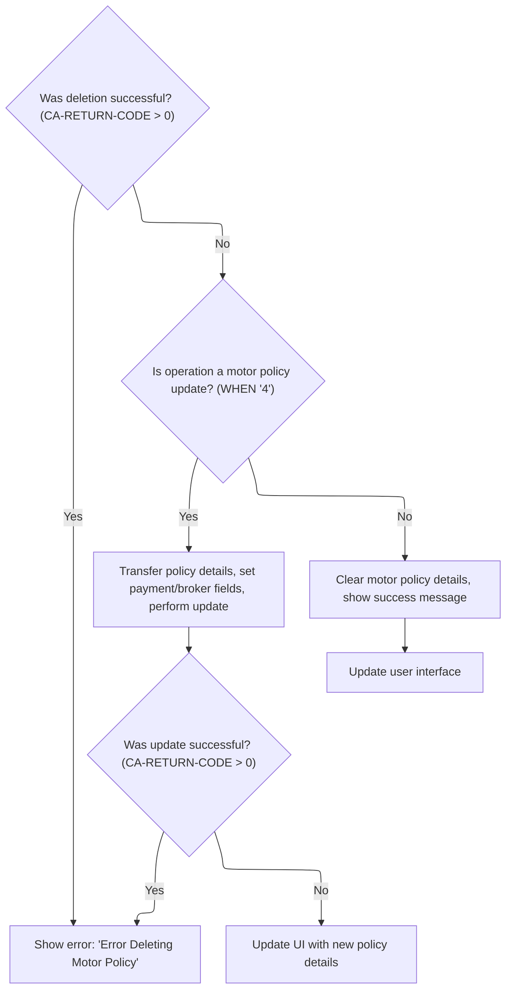
```mermaid
%%{init: {"flowchart": {"defaultRenderer": "elk"}} }%%
flowchart TD
    node1{"Was deletion successful? (CA-RETURN-CODE > 0)"}
    click node1 openCode "base/src/lgtestp1.cbl:143:146"
    node1 -->|"Yes"| node2["Show error: 'Error Deleting Motor Policy'"]
    click node2 openCode "base/src/lgtestp1.cbl:300:302"
    node1 -->|"No"| node3{"Is operation a motor policy update? (WHEN '4')"}
    click node3 openCode "base/src/lgtestp1.cbl:169:176"
    node3 -->|"Yes"| node4["Transfer policy details, set payment/broker fields, perform update"]
    click node4 openCode "base/src/lgtestp1.cbl:170:219"
    node4 --> node5{"Was update successful? (CA-RETURN-CODE > 0)"}
    click node5 openCode "base/src/lgtestp1.cbl:177:179"
    node5 -->|"Yes"| node2
    node5 -->|"No"| node6["Update UI with new policy details"]
    click node6 openCode "base/src/lgtestp1.cbl:181:198"
    node3 -->|"No"| node7["Clear motor policy details, show success message"]
    click node7 openCode "base/src/lgtestp1.cbl:148:158"
    node7 --> node8["Update user interface"]
    click node8 openCode "base/src/lgtestp1.cbl:159:166"

classDef HeadingStyle fill:#777777,stroke:#333,stroke-width:2px;

%% Swimm:
%% %%{init: {"flowchart": {"defaultRenderer": "elk"}} }%%
%% flowchart TD
%%     node1{"Was deletion successful? (<SwmToken path="base/src/lgtestp1.cbl" pos="76:3:7" line-data="                 IF CA-RETURN-CODE &gt; 0">`CA-RETURN-CODE`</SwmToken> > 0)"}
%%     click node1 openCode "<SwmPath>[base/src/lgtestp1.cbl](base/src/lgtestp1.cbl)</SwmPath>:143:146"
%%     node1 -->|"Yes"| node2["Show error: 'Error Deleting Motor Policy'"]
%%     click node2 openCode "<SwmPath>[base/src/lgtestp1.cbl](base/src/lgtestp1.cbl)</SwmPath>:300:302"
%%     node1 -->|"No"| node3{"Is operation a motor policy update? (WHEN '4')"}
%%     click node3 openCode "<SwmPath>[base/src/lgtestp1.cbl](base/src/lgtestp1.cbl)</SwmPath>:169:176"
%%     node3 -->|"Yes"| node4["Transfer policy details, set payment/broker fields, perform update"]
%%     click node4 openCode "<SwmPath>[base/src/lgtestp1.cbl](base/src/lgtestp1.cbl)</SwmPath>:170:219"
%%     node4 --> node5{"Was update successful? (<SwmToken path="base/src/lgtestp1.cbl" pos="76:3:7" line-data="                 IF CA-RETURN-CODE &gt; 0">`CA-RETURN-CODE`</SwmToken> > 0)"}
%%     click node5 openCode "<SwmPath>[base/src/lgtestp1.cbl](base/src/lgtestp1.cbl)</SwmPath>:177:179"
%%     node5 -->|"Yes"| node2
%%     node5 -->|"No"| node6["Update UI with new policy details"]
%%     click node6 openCode "<SwmPath>[base/src/lgtestp1.cbl](base/src/lgtestp1.cbl)</SwmPath>:181:198"
%%     node3 -->|"No"| node7["Clear motor policy details, show success message"]
%%     click node7 openCode "<SwmPath>[base/src/lgtestp1.cbl](base/src/lgtestp1.cbl)</SwmPath>:148:158"
%%     node7 --> node8["Update user interface"]
%%     click node8 openCode "<SwmPath>[base/src/lgtestp1.cbl](base/src/lgtestp1.cbl)</SwmPath>:159:166"
%% 
%% classDef HeadingStyle fill:#777777,stroke:#333,stroke-width:2px;
```

<SwmSnippet path="/base/src/lgtestp1.cbl" line="143">

---

Next, after <SwmToken path="base/src/lgtestp1.cbl" pos="139:10:10" line-data="                 EXEC CICS LINK PROGRAM(&#39;LGDPOL01&#39;)">`LGDPOL01`</SwmToken>, we check for errors and jump to <SwmToken path="base/src/lgtestp1.cbl" pos="145:5:7" line-data="                   GO TO NO-DELETE">`NO-DELETE`</SwmToken> to handle delete failures and show the user an error.

```cobol
                 IF CA-RETURN-CODE > 0
                   Exec CICS Syncpoint Rollback End-Exec
                   GO TO NO-DELETE
                 END-IF
```

---

</SwmSnippet>

<SwmSnippet path="/base/src/lgtestp1.cbl" line="300">

---

<SwmToken path="base/src/lgtestp1.cbl" pos="300:1:3" line-data="       NO-DELETE.">`NO-DELETE`</SwmToken> sets the error message for the user and jumps to <SwmToken path="base/src/lgtestp1.cbl" pos="302:5:7" line-data="           Go To ERROR-OUT.">`ERROR-OUT`</SwmToken>, which displays the menu with the error and ends the session.

```cobol
       NO-DELETE.
           Move 'Error Deleting Motor Policy'    To  ERP1FLDO
           Go To ERROR-OUT.
```

---

</SwmSnippet>

<SwmSnippet path="/base/src/lgtestp1.cbl" line="148">

---

Back in <SwmToken path="base/src/lgtestp1.cbl" pos="33:5:7" line-data="              GO TO A-GAIN.">`A-GAIN`</SwmToken>, after <SwmToken path="base/src/lgtestp1.cbl" pos="145:5:7" line-data="                   GO TO NO-DELETE">`NO-DELETE`</SwmToken>, we clear all the output fields and set 'Motor Policy Deleted' as the feedback. This makes sure the user sees a clean screen and knows the delete worked.

```cobol
                 Move Spaces            To  ENP1IDAI
                 Move Spaces            To  ENP1EDAI
                 Move Spaces            To  ENP1CMKI
                 Move Spaces            To  ENP1CMOI
                 Move Spaces            To  ENP1VALI
                 Move Spaces            To  ENP1REGI
                 Move Spaces            To  ENP1COLI
                 Move Spaces            To  ENP1CCI
                 Move Spaces            To  ENP1MANI
                 Move 'Motor Policy Deleted'
                   To  ERP1FLDO
```

---

</SwmSnippet>

<SwmSnippet path="/base/src/lgtestp1.cbl" line="159">

---

After clearing the fields and setting the message, we send the menu screen to the user—twice. This makes sure the UI is refreshed and the user sees the latest state after a delete.

```cobol
                 EXEC CICS SEND MAP ('SSMAPP1')
                           FROM(SSMAPP1O)
                           MAPSET ('SSMAP')
                 END-EXEC
                 EXEC CICS SEND MAP ('SSMAPP1')
                           FROM(SSMAPP1O)
                           MAPSET ('SSMAP')
                 END-EXEC
```

---

</SwmSnippet>

<SwmSnippet path="/base/src/lgtestp1.cbl" line="169">

---

When the user picks inquiry, we set <SwmToken path="base/src/lgtestp1.cbl" pos="170:9:13" line-data="                 Move &#39;01IMOT&#39;   To CA-REQUEST-ID">`CA-REQUEST-ID`</SwmToken> to <SwmToken path="base/src/lgtestp1.cbl" pos="170:4:4" line-data="                 Move &#39;01IMOT&#39;   To CA-REQUEST-ID">`01IMOT`</SwmToken>, fill in the customer and policy numbers, and call <SwmToken path="base/src/lgtestp1.cbl" pos="173:10:10" line-data="                 EXEC CICS LINK PROGRAM(&#39;LGIPOL01&#39;)">`LGIPOL01`</SwmToken>. This program handles fetching the policy details for display.

```cobol
             WHEN '4'
                 Move '01IMOT'   To CA-REQUEST-ID
                 Move ENP1CNOO   To CA-CUSTOMER-NUM
                 Move ENP1PNOO   To CA-POLICY-NUM
                 EXEC CICS LINK PROGRAM('LGIPOL01')
                           COMMAREA(COMM-AREA)
                           LENGTH(32500)
                 END-EXEC
```

---

</SwmSnippet>

<SwmSnippet path="/base/src/lgtestp1.cbl" line="177">

---

After calling <SwmToken path="base/src/lgtestp1.cbl" pos="72:10:10" line-data="                 EXEC CICS LINK PROGRAM(&#39;LGIPOL01&#39;)">`LGIPOL01`</SwmToken>, we check <SwmToken path="base/src/lgtestp1.cbl" pos="177:3:7" line-data="                 IF CA-RETURN-CODE &gt; 0">`CA-RETURN-CODE`</SwmToken>. If it's greater than zero, we jump to <SwmToken path="base/src/lgtestp1.cbl" pos="178:5:7" line-data="                   GO TO NO-DATA">`NO-DATA`</SwmToken> to show the user a message that no data was found.

```cobol
                 IF CA-RETURN-CODE > 0
                   GO TO NO-DATA
                 END-IF
```

---

</SwmSnippet>

<SwmSnippet path="/base/src/lgtestp1.cbl" line="181">

---

After a successful inquiry, we copy all the motor policy details from the commarea to the output fields so the user sees the full policy info on the menu screen.

```cobol
                 Move CA-ISSUE-DATE     To  ENP1IDAI
                 Move CA-EXPIRY-DATE    To  ENP1EDAI
                 Move CA-M-MAKE         To  ENP1CMKI
                 Move CA-M-MODEL        To  ENP1CMOI
                 Move CA-M-VALUE        To  ENP1VALI
                 Move CA-M-REGNUMBER    To  ENP1REGI
                 Move CA-M-COLOUR       To  ENP1COLI
                 Move CA-M-CC           To  ENP1CCI
                 Move CA-M-MANUFACTURED To  ENP1MANI
                 Move CA-M-PREMIUM      To  ENP1PREI
                 Move CA-M-ACCIDENTS    To  ENP1ACCI
```

---

</SwmSnippet>

<SwmSnippet path="/base/src/lgtestp1.cbl" line="192">

---

After copying the policy details, we send the menu screen to the user and then receive the map input. This keeps the UI in sync and ready for the next action.

```cobol
                 EXEC CICS SEND MAP ('SSMAPP1')
                           FROM(SSMAPP1O)
                           MAPSET ('SSMAP')
                 END-EXEC
                 EXEC CICS RECEIVE MAP('SSMAPP1')
                           INTO(SSMAPP1I)
                           MAPSET('SSMAP') END-EXEC
```

---

</SwmSnippet>

<SwmSnippet path="/base/src/lgtestp1.cbl" line="200">

---

Here we set <SwmToken path="base/src/lgtestp1.cbl" pos="200:9:13" line-data="                 Move &#39;01UMOT&#39;          To CA-REQUEST-ID">`CA-REQUEST-ID`</SwmToken> to <SwmToken path="base/src/lgtestp1.cbl" pos="200:4:4" line-data="                 Move &#39;01UMOT&#39;          To CA-REQUEST-ID">`01UMOT`</SwmToken> to signal an update operation, fill in all the policy fields, and prep the commarea for the backend update logic.

```cobol
                 Move '01UMOT'          To CA-REQUEST-ID
                 Move ENP1CNOI          To CA-CUSTOMER-NUM
                 Move 0                 To CA-PAYMENT
                 Move 0                 To CA-BROKERID
                 Move '        '        To CA-BROKERSREF
                 Move ENP1IDAI          To CA-ISSUE-DATE
                 Move ENP1EDAI          To CA-EXPIRY-DATE
                 Move ENP1CMKI          To CA-M-MAKE
                 Move ENP1CMOI          To CA-M-MODEL
                 Move ENP1VALI          To CA-M-VALUE
                 Move ENP1REGI          To CA-M-REGNUMBER
                 Move ENP1COLI          To CA-M-COLOUR
                 Move ENP1CCI           To CA-M-CC
                 Move ENP1MANI          To CA-M-MANUFACTURED
                 Move ENP1PREI          To CA-M-PREMIUM
                 Move ENP1ACCI          To CA-M-ACCIDENTS
```

---

</SwmSnippet>

<SwmSnippet path="/base/src/lgtestp1.cbl" line="216">

---

After prepping the update request, we call <SwmToken path="base/src/lgtestp1.cbl" pos="216:10:10" line-data="                 EXEC CICS LINK PROGRAM(&#39;LGUPOL01&#39;)">`LGUPOL01`</SwmToken> with the commarea. That program does the actual database update, so this step hands off the work to the DB handler.

```cobol
                 EXEC CICS LINK PROGRAM('LGUPOL01')
                           COMMAREA(COMM-AREA)
                           LENGTH(32500)
                 END-EXEC
```

---

</SwmSnippet>

## Validating and Executing Policy Update

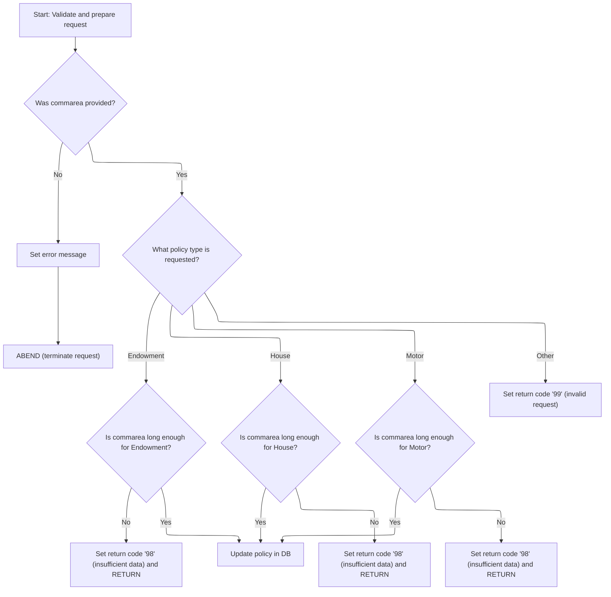
```mermaid
%%{init: {"flowchart": {"defaultRenderer": "elk"}} }%%
flowchart TD
  node1["Start: Validate and prepare request"]
  click node1 openCode "base/src/lgupol01.cbl:83:98"
  node1 --> node2{"Was commarea provided?"}
  click node2 openCode "base/src/lgupol01.cbl:99:103"
  node2 -->|"No"| node3["Set error message"]
  click node3 openCode "base/src/lgupol01.cbl:100:101"
  node3 --> node4["ABEND (terminate request)"]
  click node4 openCode "base/src/lgupol01.cbl:102:102"
  node2 -->|"Yes"| node5{"What policy type is requested?"}
  click node5 openCode "base/src/lgupol01.cbl:113:141"
  node5 -->|"Endowment"| node6{"Is commarea long enough for Endowment?"}
  click node6 openCode "base/src/lgupol01.cbl:118:121"
  node6 -->|"No"| node7["Set return code '98' (insufficient data) and RETURN"]
  click node7 openCode "base/src/lgupol01.cbl:119:120"
  node6 -->|"Yes"| node10["Update policy in DB"]
  node5 -->|"House"| node8{"Is commarea long enough for House?"}
  click node8 openCode "base/src/lgupol01.cbl:126:129"
  node8 -->|"No"| node9["Set return code '98' (insufficient data) and RETURN"]
  click node9 openCode "base/src/lgupol01.cbl:127:128"
  node8 -->|"Yes"| node10
  node5 -->|"Motor"| node11{"Is commarea long enough for Motor?"}
  click node11 openCode "base/src/lgupol01.cbl:134:137"
  node11 -->|"No"| node12["Set return code '98' (insufficient data) and RETURN"]
  click node12 openCode "base/src/lgupol01.cbl:135:136"
  node11 -->|"Yes"| node10
  node5 -->|"Other"| node13["Set return code '99' (invalid request)"]
  click node13 openCode "base/src/lgupol01.cbl:140:141"
  node10["Update policy in DB"]
  click node10 openCode "base/src/lgupol01.cbl:143:143"
classDef HeadingStyle fill:#777777,stroke:#333,stroke-width:2px;

%% Swimm:
%% %%{init: {"flowchart": {"defaultRenderer": "elk"}} }%%
%% flowchart TD
%%   node1["Start: Validate and prepare request"]
%%   click node1 openCode "<SwmPath>[base/src/lgupol01.cbl](base/src/lgupol01.cbl)</SwmPath>:83:98"
%%   node1 --> node2{"Was commarea provided?"}
%%   click node2 openCode "<SwmPath>[base/src/lgupol01.cbl](base/src/lgupol01.cbl)</SwmPath>:99:103"
%%   node2 -->|"No"| node3["Set error message"]
%%   click node3 openCode "<SwmPath>[base/src/lgupol01.cbl](base/src/lgupol01.cbl)</SwmPath>:100:101"
%%   node3 --> node4["ABEND (terminate request)"]
%%   click node4 openCode "<SwmPath>[base/src/lgupol01.cbl](base/src/lgupol01.cbl)</SwmPath>:102:102"
%%   node2 -->|"Yes"| node5{"What policy type is requested?"}
%%   click node5 openCode "<SwmPath>[base/src/lgupol01.cbl](base/src/lgupol01.cbl)</SwmPath>:113:141"
%%   node5 -->|"Endowment"| node6{"Is commarea long enough for Endowment?"}
%%   click node6 openCode "<SwmPath>[base/src/lgupol01.cbl](base/src/lgupol01.cbl)</SwmPath>:118:121"
%%   node6 -->|"No"| node7["Set return code '98' (insufficient data) and RETURN"]
%%   click node7 openCode "<SwmPath>[base/src/lgupol01.cbl](base/src/lgupol01.cbl)</SwmPath>:119:120"
%%   node6 -->|"Yes"| node10["Update policy in DB"]
%%   node5 -->|"House"| node8{"Is commarea long enough for House?"}
%%   click node8 openCode "<SwmPath>[base/src/lgupol01.cbl](base/src/lgupol01.cbl)</SwmPath>:126:129"
%%   node8 -->|"No"| node9["Set return code '98' (insufficient data) and RETURN"]
%%   click node9 openCode "<SwmPath>[base/src/lgupol01.cbl](base/src/lgupol01.cbl)</SwmPath>:127:128"
%%   node8 -->|"Yes"| node10
%%   node5 -->|"Motor"| node11{"Is commarea long enough for Motor?"}
%%   click node11 openCode "<SwmPath>[base/src/lgupol01.cbl](base/src/lgupol01.cbl)</SwmPath>:134:137"
%%   node11 -->|"No"| node12["Set return code '98' (insufficient data) and RETURN"]
%%   click node12 openCode "<SwmPath>[base/src/lgupol01.cbl](base/src/lgupol01.cbl)</SwmPath>:135:136"
%%   node11 -->|"Yes"| node10
%%   node5 -->|"Other"| node13["Set return code '99' (invalid request)"]
%%   click node13 openCode "<SwmPath>[base/src/lgupol01.cbl](base/src/lgupol01.cbl)</SwmPath>:140:141"
%%   node10["Update policy in DB"]
%%   click node10 openCode "<SwmPath>[base/src/lgupol01.cbl](base/src/lgupol01.cbl)</SwmPath>:143:143"
%% classDef HeadingStyle fill:#777777,stroke:#333,stroke-width:2px;
```

This section governs the validation and execution of policy update requests. It ensures that only valid requests with sufficient data are processed, and that errors are consistently handled and tracked.

<SwmSnippet path="/base/src/lgupol01.cbl" line="83">

---

In MAINLINE, <SwmToken path="base/src/lgtestp1.cbl" pos="216:10:10" line-data="                 EXEC CICS LINK PROGRAM(&#39;LGUPOL01&#39;)">`LGUPOL01`</SwmToken> checks the commarea and its length for the requested policy type. If it's too short, it sets an error code and returns. Otherwise, it runs the update logic for the right policy type.

```cobol
       MAINLINE SECTION.

      *----------------------------------------------------------------*
      * Common code                                                    *
      *----------------------------------------------------------------*
      * initialize working storage variables
           INITIALIZE WS-HEADER.
      * set up general variable
           MOVE EIBTRNID TO WS-TRANSID.
           MOVE EIBTRMID TO WS-TERMID.
           MOVE EIBTASKN TO WS-TASKNUM.

      *----------------------------------------------------------------*
      * Check commarea and obtain required details                     *
      *----------------------------------------------------------------*
      * If NO commarea received issue an ABEND
           IF EIBCALEN IS EQUAL TO ZERO
               MOVE ' NO COMMAREA RECEIVED' TO EM-VARIABLE
               PERFORM WRITE-ERROR-MESSAGE
               EXEC CICS ABEND ABCODE('LGCA') NODUMP END-EXEC
           END-IF
      * initialize commarea return code to zero
           MOVE '00' TO CA-RETURN-CODE
           MOVE EIBCALEN TO WS-CALEN.
           SET WS-ADDR-DFHCOMMAREA TO ADDRESS OF DFHCOMMAREA.

      *----------------------------------------------------------------*
      * Check which policy type is being requested                     *
      *   and chec commarea length                                     *
      *----------------------------------------------------------------*
           EVALUATE CA-REQUEST-ID

             WHEN '01UEND'
               ADD WS-CA-HEADER-LEN  TO WS-REQUIRED-CA-LEN
               ADD WS-FULL-ENDOW-LEN TO WS-REQUIRED-CA-LEN
               IF EIBCALEN IS LESS THAN WS-REQUIRED-CA-LEN
                 MOVE '98' TO CA-RETURN-CODE
                 EXEC CICS RETURN END-EXEC
               END-IF

             WHEN '01UHOU'
               ADD WS-CA-HEADER-LEN  TO WS-REQUIRED-CA-LEN
               ADD WS-FULL-HOUSE-LEN TO WS-REQUIRED-CA-LEN
               IF EIBCALEN IS LESS THAN WS-REQUIRED-CA-LEN
                 MOVE '98' TO CA-RETURN-CODE
                 EXEC CICS RETURN END-EXEC
               END-IF

             WHEN '01UMOT'
               ADD WS-CA-HEADER-LEN  TO WS-REQUIRED-CA-LEN
               ADD WS-FULL-MOTOR-LEN TO WS-REQUIRED-CA-LEN
               IF EIBCALEN IS LESS THAN WS-REQUIRED-CA-LEN
                 MOVE '98' TO CA-RETURN-CODE
                 EXEC CICS RETURN END-EXEC
               END-IF

             WHEN OTHER
               MOVE '99' TO CA-RETURN-CODE
           END-EVALUATE

           PERFORM UPDATE-POLICY-DB2-INFO.
```

---

</SwmSnippet>

<SwmSnippet path="/base/src/lgupol01.cbl" line="169">

---

<SwmToken path="base/src/lgupol01.cbl" pos="169:1:5" line-data="       WRITE-ERROR-MESSAGE.">`WRITE-ERROR-MESSAGE`</SwmToken> in <SwmToken path="base/src/lgtestp1.cbl" pos="216:10:10" line-data="                 EXEC CICS LINK PROGRAM(&#39;LGUPOL01&#39;)">`LGUPOL01`</SwmToken> timestamps the error, logs it by linking to LGSTSQ, and writes up to 90 bytes of commarea data for extra context. This keeps error tracking consistent and within system limits.

```cobol
       WRITE-ERROR-MESSAGE.
      * Save SQLCODE in message
      * Obtain and format current time and date
           EXEC CICS ASKTIME ABSTIME(WS-ABSTIME)
           END-EXEC
           EXEC CICS FORMATTIME ABSTIME(WS-ABSTIME)
                     MMDDYYYY(WS-DATE)
                     TIME(WS-TIME)
           END-EXEC
           MOVE WS-DATE TO EM-DATE
           MOVE WS-TIME TO EM-TIME
      * Write output message to TDQ
           EXEC CICS LINK PROGRAM('LGSTSQ')
                     COMMAREA(ERROR-MSG)
                     LENGTH(LENGTH OF ERROR-MSG)
           END-EXEC.
      * Write 90 bytes or as much as we have of commarea to TDQ
           IF EIBCALEN > 0 THEN
             IF EIBCALEN < 91 THEN
               MOVE DFHCOMMAREA(1:EIBCALEN) TO CA-DATA
               EXEC CICS LINK PROGRAM('LGSTSQ')
                         COMMAREA(CA-ERROR-MSG)
                         LENGTH(LENGTH OF CA-ERROR-MSG)
               END-EXEC
             ELSE
               MOVE DFHCOMMAREA(1:90) TO CA-DATA
               EXEC CICS LINK PROGRAM('LGSTSQ')
                         COMMAREA(CA-ERROR-MSG)
                         LENGTH(LENGTH OF CA-ERROR-MSG)
               END-EXEC
             END-IF
           END-IF.
           EXIT.
```

---

</SwmSnippet>

<SwmSnippet path="/base/src/lgupol01.cbl" line="83">

---

After validating the commarea and policy type in MAINLINE, we call <SwmToken path="base/src/lgupol01.cbl" pos="143:3:9" line-data="           PERFORM UPDATE-POLICY-DB2-INFO.">`UPDATE-POLICY-DB2-INFO`</SwmToken> to actually update the policy record in the database. This is the final step before returning control.

```cobol
       MAINLINE SECTION.

      *----------------------------------------------------------------*
      * Common code                                                    *
      *----------------------------------------------------------------*
      * initialize working storage variables
           INITIALIZE WS-HEADER.
      * set up general variable
           MOVE EIBTRNID TO WS-TRANSID.
           MOVE EIBTRMID TO WS-TERMID.
           MOVE EIBTASKN TO WS-TASKNUM.

      *----------------------------------------------------------------*
      * Check commarea and obtain required details                     *
      *----------------------------------------------------------------*
      * If NO commarea received issue an ABEND
           IF EIBCALEN IS EQUAL TO ZERO
               MOVE ' NO COMMAREA RECEIVED' TO EM-VARIABLE
               PERFORM WRITE-ERROR-MESSAGE
               EXEC CICS ABEND ABCODE('LGCA') NODUMP END-EXEC
           END-IF
      * initialize commarea return code to zero
           MOVE '00' TO CA-RETURN-CODE
           MOVE EIBCALEN TO WS-CALEN.
           SET WS-ADDR-DFHCOMMAREA TO ADDRESS OF DFHCOMMAREA.

      *----------------------------------------------------------------*
      * Check which policy type is being requested                     *
      *   and chec commarea length                                     *
      *----------------------------------------------------------------*
           EVALUATE CA-REQUEST-ID

             WHEN '01UEND'
               ADD WS-CA-HEADER-LEN  TO WS-REQUIRED-CA-LEN
               ADD WS-FULL-ENDOW-LEN TO WS-REQUIRED-CA-LEN
               IF EIBCALEN IS LESS THAN WS-REQUIRED-CA-LEN
                 MOVE '98' TO CA-RETURN-CODE
                 EXEC CICS RETURN END-EXEC
               END-IF

             WHEN '01UHOU'
               ADD WS-CA-HEADER-LEN  TO WS-REQUIRED-CA-LEN
               ADD WS-FULL-HOUSE-LEN TO WS-REQUIRED-CA-LEN
               IF EIBCALEN IS LESS THAN WS-REQUIRED-CA-LEN
                 MOVE '98' TO CA-RETURN-CODE
                 EXEC CICS RETURN END-EXEC
               END-IF

             WHEN '01UMOT'
               ADD WS-CA-HEADER-LEN  TO WS-REQUIRED-CA-LEN
               ADD WS-FULL-MOTOR-LEN TO WS-REQUIRED-CA-LEN
               IF EIBCALEN IS LESS THAN WS-REQUIRED-CA-LEN
                 MOVE '98' TO CA-RETURN-CODE
                 EXEC CICS RETURN END-EXEC
               END-IF

             WHEN OTHER
               MOVE '99' TO CA-RETURN-CODE
           END-EVALUATE

           PERFORM UPDATE-POLICY-DB2-INFO.
```

---

</SwmSnippet>

## Triggering Policy Update in Database

This section's main product role is to trigger the update of policy information in the database by delegating the update request to a specialized handler program. It ensures that the policy update process is initiated and the necessary data is provided for the update.

| Category        | Rule Name             | Description                                                                                                                                             |
| --------------- | --------------------- | ------------------------------------------------------------------------------------------------------------------------------------------------------- |
| Data validation | Complete data handoff | The policy update request must include all required policy data in the commarea to ensure the database handler has complete information for the update. |
| Business logic  | Policy update trigger | A policy update request must be triggered whenever there is a change in policy information that requires persistence in the database.                   |

<SwmSnippet path="/base/src/lgupol01.cbl" line="155">

---

<SwmToken path="base/src/lgupol01.cbl" pos="155:1:7" line-data="       UPDATE-POLICY-DB2-INFO.">`UPDATE-POLICY-DB2-INFO`</SwmToken> just calls <SwmToken path="base/src/lgupol01.cbl" pos="157:9:9" line-data="           EXEC CICS LINK Program(LGUPDB01)">`LGUPDB01`</SwmToken> with the commarea. That program does the actual database update, so this step hands off the work to the DB handler.

```cobol
       UPDATE-POLICY-DB2-INFO.

           EXEC CICS LINK Program(LGUPDB01)
                Commarea(DFHCOMMAREA)
                LENGTH(32500)
           END-EXEC.

           EXIT.
```

---

</SwmSnippet>

## Coordinating <SwmToken path="base/src/lgipdb01.cbl" pos="242:5:5" line-data="      * initialize DB2 host variables">`DB2`</SwmToken> and VSAM Updates for Policy Changes

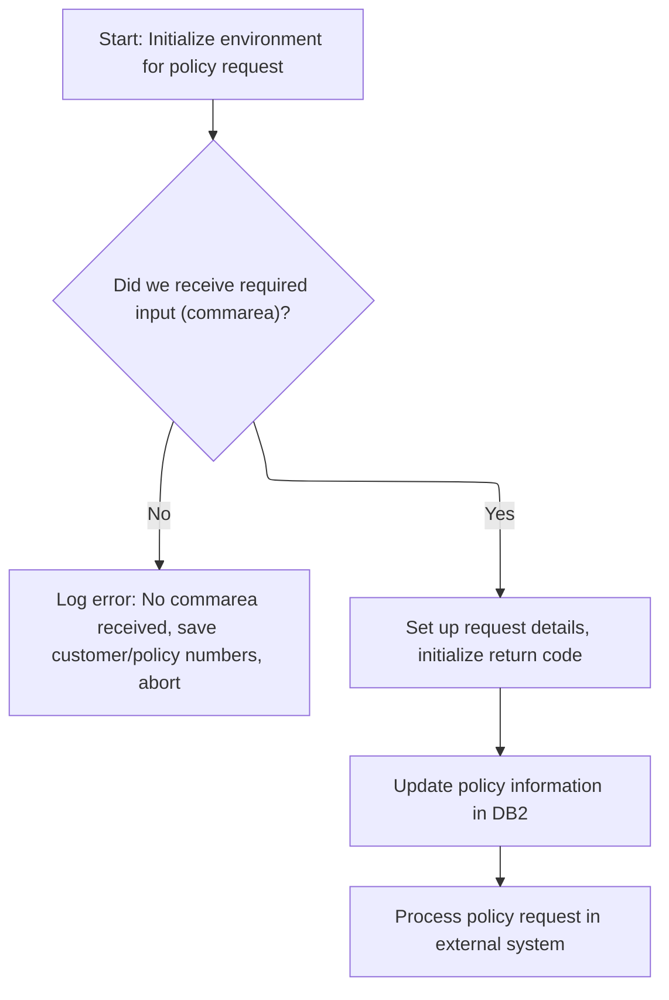
```mermaid
%%{init: {"flowchart": {"defaultRenderer": "elk"}} }%%
flowchart TD
    node1["Start: Initialize environment for policy request"] --> node2{"Did we receive required input (commarea)?"}
    click node1 openCode "base/src/lgupdb01.cbl:162:178"
    node2 -->|"No"| node3["Log error: No commarea received, save customer/policy numbers, abort"]
    click node2 openCode "base/src/lgupdb01.cbl:183:187"
    click node3 openCode "base/src/lgupdb01.cbl:184:186"
    node2 -->|"Yes"| node4["Set up request details, initialize return code"]
    click node4 openCode "base/src/lgupdb01.cbl:190:193"
    node4 --> node5["Update policy information in DB2"]
    click node5 openCode "base/src/lgupdb01.cbl:207:207"
    node5 --> node6["Process policy request in external system"]
    click node6 openCode "base/src/lgupdb01.cbl:209:212"

classDef HeadingStyle fill:#777777,stroke:#333,stroke-width:2px;

%% Swimm:
%% %%{init: {"flowchart": {"defaultRenderer": "elk"}} }%%
%% flowchart TD
%%     node1["Start: Initialize environment for policy request"] --> node2{"Did we receive required input (commarea)?"}
%%     click node1 openCode "<SwmPath>[base/src/lgupdb01.cbl](base/src/lgupdb01.cbl)</SwmPath>:162:178"
%%     node2 -->|"No"| node3["Log error: No commarea received, save customer/policy numbers, abort"]
%%     click node2 openCode "<SwmPath>[base/src/lgupdb01.cbl](base/src/lgupdb01.cbl)</SwmPath>:183:187"
%%     click node3 openCode "<SwmPath>[base/src/lgupdb01.cbl](base/src/lgupdb01.cbl)</SwmPath>:184:186"
%%     node2 -->|"Yes"| node4["Set up request details, initialize return code"]
%%     click node4 openCode "<SwmPath>[base/src/lgupdb01.cbl](base/src/lgupdb01.cbl)</SwmPath>:190:193"
%%     node4 --> node5["Update policy information in <SwmToken path="base/src/lgipdb01.cbl" pos="242:5:5" line-data="      * initialize DB2 host variables">`DB2`</SwmToken>"]
%%     click node5 openCode "<SwmPath>[base/src/lgupdb01.cbl](base/src/lgupdb01.cbl)</SwmPath>:207:207"
%%     node5 --> node6["Process policy request in external system"]
%%     click node6 openCode "<SwmPath>[base/src/lgupdb01.cbl](base/src/lgupdb01.cbl)</SwmPath>:209:212"
%% 
%% classDef HeadingStyle fill:#777777,stroke:#333,stroke-width:2px;
```

This section ensures that policy changes are consistently reflected in both <SwmToken path="base/src/lgipdb01.cbl" pos="242:5:5" line-data="      * initialize DB2 host variables">`DB2`</SwmToken> and VSAM systems, and that errors are logged with relevant context for support and audit purposes.

| Category        | Rule Name                        | Description                                                                                                                                                                                                                                             |
| --------------- | -------------------------------- | ------------------------------------------------------------------------------------------------------------------------------------------------------------------------------------------------------------------------------------------------------- |
| Data validation | Commarea Required for Processing | If no commarea is received with the policy request, the transaction must be aborted and an error message logged, including the customer and policy numbers if available.                                                                                |
| Business logic  | Data Format Compatibility        | Customer and policy numbers from the commarea must be converted to <SwmToken path="base/src/lgipdb01.cbl" pos="242:5:5" line-data="      * initialize DB2 host variables">`DB2`</SwmToken> integer format before any database operations are performed. |
| Business logic  | Synchronized Policy Update       | After updating <SwmToken path="base/src/lgipdb01.cbl" pos="242:5:5" line-data="      * initialize DB2 host variables">`DB2`</SwmToken>, the same policy change must be reflected in the VSAM KSDS file to maintain data consistency across systems.     |

<SwmSnippet path="/base/src/lgupdb01.cbl" line="162">

---

MAINLINE here sets up the transaction, converts customer and policy numbers from the commarea to <SwmToken path="base/src/lgupdb01.cbl" pos="175:5:5" line-data="      * initialize DB2 host variables">`DB2`</SwmToken> integer format for SQL compatibility, and copies them to error message fields for logging. It then calls <SwmToken path="base/src/lgupdb01.cbl" pos="207:3:9" line-data="           PERFORM UPDATE-POLICY-DB2-INFO.">`UPDATE-POLICY-DB2-INFO`</SwmToken> to handle the actual <SwmToken path="base/src/lgupdb01.cbl" pos="175:5:5" line-data="      * initialize DB2 host variables">`DB2`</SwmToken> update logic. After the <SwmToken path="base/src/lgupdb01.cbl" pos="175:5:5" line-data="      * initialize DB2 host variables">`DB2`</SwmToken> update, it links to <SwmToken path="base/src/lgupdb01.cbl" pos="209:9:9" line-data="           EXEC CICS LINK Program(LGUPVS01)">`LGUPVS01`</SwmToken> to update the VSAM KSDS file, keeping both <SwmToken path="base/src/lgupdb01.cbl" pos="175:5:5" line-data="      * initialize DB2 host variables">`DB2`</SwmToken> and VSAM in sync for the policy change.

```cobol
       MAINLINE SECTION.

      *----------------------------------------------------------------*
      * Common code                                                    *
      *----------------------------------------------------------------*
      * initialize working storage variables
           INITIALIZE WS-HEADER.
      * set up general variable
           MOVE EIBTRNID TO WS-TRANSID.
           MOVE EIBTRMID TO WS-TERMID.
           MOVE EIBTASKN TO WS-TASKNUM.
           MOVE SPACES   TO WS-RETRY.
      *----------------------------------------------------------------*
      * initialize DB2 host variables
           INITIALIZE DB2-POLICY.
           INITIALIZE DB2-IN-INTEGERS.

      *----------------------------------------------------------------*
      * Check commarea and obtain required details                     *
      *----------------------------------------------------------------*
      * If NO commarea received issue an ABEND
           IF EIBCALEN IS EQUAL TO ZERO
               MOVE ' NO COMMAREA RECEIVED' TO EM-VARIABLE
               PERFORM WRITE-ERROR-MESSAGE
               EXEC CICS ABEND ABCODE('LGCA') NODUMP END-EXEC
           END-IF

      * initialize commarea return code to zero
           MOVE '00' TO CA-RETURN-CODE
           MOVE EIBCALEN TO WS-CALEN.
           SET WS-ADDR-DFHCOMMAREA TO ADDRESS OF DFHCOMMAREA.

      * Convert commarea customer & policy nums to DB2 integer format
           MOVE CA-CUSTOMER-NUM TO DB2-CUSTOMERNUM-INT
           MOVE CA-POLICY-NUM   TO DB2-POLICYNUM-INT
      * and save in error msg field incase required
           MOVE CA-CUSTOMER-NUM TO EM-CUSNUM
           MOVE CA-POLICY-NUM   TO EM-POLNUM

      *----------------------------------------------------------------*
      * Check which policy type is being requested                     *
      *   and check commarea length                                    *
      *----------------------------------------------------------------*

      *    Call procedure to update required tables
           PERFORM UPDATE-POLICY-DB2-INFO.

           EXEC CICS LINK Program(LGUPVS01)
                Commarea(DFHCOMMAREA)
                LENGTH(225)
           END-EXEC.
```

---

</SwmSnippet>

<SwmSnippet path="/base/src/lgupdb01.cbl" line="502">

---

<SwmToken path="base/src/lgupdb01.cbl" pos="502:1:5" line-data="       WRITE-ERROR-MESSAGE.">`WRITE-ERROR-MESSAGE`</SwmToken> logs the SQL error with a timestamp, then calls LGSTSQ to queue the error message. If there's commarea data, it logs up to 90 bytes of it (since <SwmToken path="base/src/lgupdb01.cbl" pos="522:12:14" line-data="               MOVE DFHCOMMAREA(1:EIBCALEN) TO CA-DATA">`CA-DATA`</SwmToken> is only 90 bytes), again via LGSTSQ. This way, both the error and some context from the commarea are captured for troubleshooting.

```cobol
       WRITE-ERROR-MESSAGE.
      * Save SQLCODE in message
           MOVE SQLCODE TO EM-SQLRC
      * Obtain and format current time and date
           EXEC CICS ASKTIME ABSTIME(WS-ABSTIME)
           END-EXEC
           EXEC CICS FORMATTIME ABSTIME(WS-ABSTIME)
                     MMDDYYYY(WS-DATE)
                     TIME(WS-TIME)
           END-EXEC
           MOVE WS-DATE TO EM-DATE
           MOVE WS-TIME TO EM-TIME
      * Write output message to TDQ
           EXEC CICS LINK PROGRAM('LGSTSQ')
                     COMMAREA(ERROR-MSG)
                     LENGTH(LENGTH OF ERROR-MSG)
           END-EXEC.
      * Write 90 bytes or as much as we have of commarea to TDQ
           IF EIBCALEN > 0 THEN
             IF EIBCALEN < 91 THEN
               MOVE DFHCOMMAREA(1:EIBCALEN) TO CA-DATA
               EXEC CICS LINK PROGRAM('LGSTSQ')
                         COMMAREA(CA-ERROR-MSG)
                         LENGTH(LENGTH OF CA-ERROR-MSG)
               END-EXEC
             ELSE
               MOVE DFHCOMMAREA(1:90) TO CA-DATA
               EXEC CICS LINK PROGRAM('LGSTSQ')
                         COMMAREA(CA-ERROR-MSG)
                         LENGTH(LENGTH OF CA-ERROR-MSG)
               END-EXEC
             END-IF
           END-IF.
           EXIT.
```

---

</SwmSnippet>

## Updating Policy Data in <SwmToken path="base/src/lgipdb01.cbl" pos="242:5:5" line-data="      * initialize DB2 host variables">`DB2`</SwmToken> with Concurrency Checks


```mermaid
%%{init: {"flowchart": {"defaultRenderer": "elk"}} }%%
flowchart TD
    node1["Start: Request to update policy"] --> node2{"Can open policy for update?"}
    click node1 openCode "base/src/lgupdb01.cbl:251:258"
    node2 -->|"Yes"| node3["Fetch policy record"]
    click node2 openCode "base/src/lgupdb01.cbl:259:270"
    node2 -->|"No"| node8["Return error (CA-RETURN-CODE '90')"]
    click node8 openCode "base/src/lgupdb01.cbl:263:269"
    node3 --> node4{"Was policy record found?"}
    click node3 openCode "base/src/lgupdb01.cbl:273:273"
    node4 -->|"Yes"| node5{"Is policy up-to-date? (timestamps match)"}
    click node4 openCode "base/src/lgupdb01.cbl:275:278"
    node4 -->|"No"| node12["Return not found or error (CA-RETURN-CODE '01' or '90')"]
    click node12 openCode "base/src/lgupdb01.cbl:351:357"
    node5 -->|"Match"| node6{"Which policy type?"}
    click node5 openCode "base/src/lgupdb01.cbl:278:283"
    node5 -->|"Conflict"| node13["Return concurrency conflict (CA-RETURN-CODE '02')"]
    click node13 openCode "base/src/lgupdb01.cbl:346:347"
    node6 -->|"Endowment"| node7["Update Endowment table"]
    click node7 openCode "base/src/lgupdb01.cbl:288:288"
    node6 -->|"House"| node9["Update House table"]
    click node9 openCode "base/src/lgupdb01.cbl:293:293"
    node6 -->|"Motor"| node10["Update Motor table"]
    click node10 openCode "base/src/lgupdb01.cbl:298:298"
    node7 --> node14{"Did policy type update succeed?"}
    node9 --> node14
    node10 --> node14
    click node14 openCode "base/src/lgupdb01.cbl:302:307"
    node14 -->|"Yes (CA-RETURN-CODE '00')"| node11["Update main policy table and assign new timestamp"]
    click node11 openCode "base/src/lgupdb01.cbl:313:334"
    node14 -->|"No"| node8
    node11 --> node15{"Was update successful?"}
    click node15 openCode "base/src/lgupdb01.cbl:336:342"
    node15 -->|"Yes"| node16["Return success (CA-RETURN-CODE '00')"]
    click node16 openCode "base/src/lgupdb01.cbl:261:261"
    node15 -->|"No"| node8
    node13 --> node17["Close cursor"]
    node16 --> node17
    node8 --> node17
    node12 --> node17
    click node17 openCode "base/src/lgupdb01.cbl:360:367"

classDef HeadingStyle fill:#777777,stroke:#333,stroke-width:2px;

%% Swimm:
%% %%{init: {"flowchart": {"defaultRenderer": "elk"}} }%%
%% flowchart TD
%%     node1["Start: Request to update policy"] --> node2{"Can open policy for update?"}
%%     click node1 openCode "<SwmPath>[base/src/lgupdb01.cbl](base/src/lgupdb01.cbl)</SwmPath>:251:258"
%%     node2 -->|"Yes"| node3["Fetch policy record"]
%%     click node2 openCode "<SwmPath>[base/src/lgupdb01.cbl](base/src/lgupdb01.cbl)</SwmPath>:259:270"
%%     node2 -->|"No"| node8["Return error (<SwmToken path="base/src/lgtestp1.cbl" pos="76:3:7" line-data="                 IF CA-RETURN-CODE &gt; 0">`CA-RETURN-CODE`</SwmToken> '90')"]
%%     click node8 openCode "<SwmPath>[base/src/lgupdb01.cbl](base/src/lgupdb01.cbl)</SwmPath>:263:269"
%%     node3 --> node4{"Was policy record found?"}
%%     click node3 openCode "<SwmPath>[base/src/lgupdb01.cbl](base/src/lgupdb01.cbl)</SwmPath>:273:273"
%%     node4 -->|"Yes"| node5{"Is policy up-to-date? (timestamps match)"}
%%     click node4 openCode "<SwmPath>[base/src/lgupdb01.cbl](base/src/lgupdb01.cbl)</SwmPath>:275:278"
%%     node4 -->|"No"| node12["Return not found or error (<SwmToken path="base/src/lgtestp1.cbl" pos="76:3:7" line-data="                 IF CA-RETURN-CODE &gt; 0">`CA-RETURN-CODE`</SwmToken> '01' or '90')"]
%%     click node12 openCode "<SwmPath>[base/src/lgupdb01.cbl](base/src/lgupdb01.cbl)</SwmPath>:351:357"
%%     node5 -->|"Match"| node6{"Which policy type?"}
%%     click node5 openCode "<SwmPath>[base/src/lgupdb01.cbl](base/src/lgupdb01.cbl)</SwmPath>:278:283"
%%     node5 -->|"Conflict"| node13["Return concurrency conflict (<SwmToken path="base/src/lgtestp1.cbl" pos="76:3:7" line-data="                 IF CA-RETURN-CODE &gt; 0">`CA-RETURN-CODE`</SwmToken> '02')"]
%%     click node13 openCode "<SwmPath>[base/src/lgupdb01.cbl](base/src/lgupdb01.cbl)</SwmPath>:346:347"
%%     node6 -->|"Endowment"| node7["Update Endowment table"]
%%     click node7 openCode "<SwmPath>[base/src/lgupdb01.cbl](base/src/lgupdb01.cbl)</SwmPath>:288:288"
%%     node6 -->|"House"| node9["Update House table"]
%%     click node9 openCode "<SwmPath>[base/src/lgupdb01.cbl](base/src/lgupdb01.cbl)</SwmPath>:293:293"
%%     node6 -->|"Motor"| node10["Update Motor table"]
%%     click node10 openCode "<SwmPath>[base/src/lgupdb01.cbl](base/src/lgupdb01.cbl)</SwmPath>:298:298"
%%     node7 --> node14{"Did policy type update succeed?"}
%%     node9 --> node14
%%     node10 --> node14
%%     click node14 openCode "<SwmPath>[base/src/lgupdb01.cbl](base/src/lgupdb01.cbl)</SwmPath>:302:307"
%%     node14 -->|"Yes (<SwmToken path="base/src/lgtestp1.cbl" pos="76:3:7" line-data="                 IF CA-RETURN-CODE &gt; 0">`CA-RETURN-CODE`</SwmToken> '00')"| node11["Update main policy table and assign new timestamp"]
%%     click node11 openCode "<SwmPath>[base/src/lgupdb01.cbl](base/src/lgupdb01.cbl)</SwmPath>:313:334"
%%     node14 -->|"No"| node8
%%     node11 --> node15{"Was update successful?"}
%%     click node15 openCode "<SwmPath>[base/src/lgupdb01.cbl](base/src/lgupdb01.cbl)</SwmPath>:336:342"
%%     node15 -->|"Yes"| node16["Return success (<SwmToken path="base/src/lgtestp1.cbl" pos="76:3:7" line-data="                 IF CA-RETURN-CODE &gt; 0">`CA-RETURN-CODE`</SwmToken> '00')"]
%%     click node16 openCode "<SwmPath>[base/src/lgupdb01.cbl](base/src/lgupdb01.cbl)</SwmPath>:261:261"
%%     node15 -->|"No"| node8
%%     node13 --> node17["Close cursor"]
%%     node16 --> node17
%%     node8 --> node17
%%     node12 --> node17
%%     click node17 openCode "<SwmPath>[base/src/lgupdb01.cbl](base/src/lgupdb01.cbl)</SwmPath>:360:367"
%% 
%% classDef HeadingStyle fill:#777777,stroke:#333,stroke-width:2px;
```

This section governs the business logic for updating policy records in <SwmToken path="base/src/lgipdb01.cbl" pos="242:5:5" line-data="      * initialize DB2 host variables">`DB2`</SwmToken>, ensuring data integrity through concurrency checks and type-specific updates. It handles error conditions and ensures that only valid, up-to-date records are modified.

| Category        | Rule Name                       | Description                                                                                                                                                                                                                                               |
| --------------- | ------------------------------- | --------------------------------------------------------------------------------------------------------------------------------------------------------------------------------------------------------------------------------------------------------- |
| Data validation | Policy existence check          | If the requested policy record does not exist in the database, the operation is aborted and a return code '01' (not found) or '90' (error) is set.                                                                                                        |
| Business logic  | Concurrency control             | A policy can only be updated if the timestamp in the request matches the timestamp in the database, ensuring no concurrent changes have occurred. If the timestamps do not match, a concurrency conflict code '02' is returned and the update is aborted. |
| Business logic  | Policy type routing             | The update operation must target the correct policy type table (Endowment, House, or Motor) based on the request ID. Only the relevant table is updated for each policy type.                                                                             |
| Business logic  | Timestamp assignment on success | On successful update, the main policy table is updated with a new timestamp, which is returned in the response to indicate the latest change.                                                                                                             |

<SwmSnippet path="/base/src/lgupdb01.cbl" line="251">

---

<SwmToken path="base/src/lgupdb01.cbl" pos="251:1:7" line-data="       UPDATE-POLICY-DB2-INFO.">`UPDATE-POLICY-DB2-INFO`</SwmToken> opens a cursor, fetches the policy row, and checks if the commarea timestamp matches the <SwmToken path="base/src/lgupdb01.cbl" pos="251:5:5" line-data="       UPDATE-POLICY-DB2-INFO.">`DB2`</SwmToken> one. If they match, it updates the right policy type table (endowment, house, or motor) based on <SwmToken path="base/src/lgupdb01.cbl" pos="283:3:7" line-data="             EVALUATE CA-REQUEST-ID">`CA-REQUEST-ID`</SwmToken>, then updates the main policy table and timestamp. If anything fails, it logs the error and sets a return code. The cursor is always closed at the end.

```cobol
       UPDATE-POLICY-DB2-INFO.

      *    Open the cursor.
           MOVE ' OPEN   PCURSOR ' TO EM-SQLREQ
           EXEC SQL
             OPEN POLICY_CURSOR
           END-EXEC

           Evaluate SQLCODE
             When 0
               MOVE '00' TO CA-RETURN-CODE
             When -913
               MOVE '90' TO CA-RETURN-CODE
               PERFORM WRITE-ERROR-MESSAGE
               EXEC CICS RETURN END-EXEC
             When Other
               MOVE '90' TO CA-RETURN-CODE
               PERFORM WRITE-ERROR-MESSAGE
               EXEC CICS RETURN END-EXEC
           END-Evaluate.

      *    Fetch the first row (we only expect one matching row)
           PERFORM FETCH-DB2-POLICY-ROW

           IF SQLCODE = 0
      *      Fetch was successful
      *      Compare timestamp in commarea with that in DB2
             IF CA-LASTCHANGED EQUAL TO DB2-LASTCHANGED

      *----------------------------------------------------------------*
      *      Select for Update and Update specific policy type table   *
      *----------------------------------------------------------------*
             EVALUATE CA-REQUEST-ID

      *** Endowment ***
               WHEN '01UEND'
      *          Call routine to update Endowment table
                 PERFORM UPDATE-ENDOW-DB2-INFO

      *** House ***
               WHEN '01UHOU'
      *          Call routine to update Housetable
                 PERFORM UPDATE-HOUSE-DB2-INFO

      *** Motor ***
               WHEN '01UMOT'
      *          Call routine to update Motor table
                 PERFORM UPDATE-MOTOR-DB2-INFO

             END-EVALUATE
      *----------------------------------------------------------------*
              IF CA-RETURN-CODE NOT EQUAL '00'
      *         Update policy type specific table has failed
      *         So close cursor and return
                PERFORM CLOSE-PCURSOR
                EXEC CICS RETURN END-EXEC
              END-IF

      *----------------------------------------------------------------*
      *        Now update Policy table and set new timestamp           *
      *----------------------------------------------------------------*
      *        Move numeric commarea fields to integer format
               MOVE CA-BROKERID      TO DB2-BROKERID-INT
               MOVE CA-PAYMENT       TO DB2-PAYMENT-INT

      *        Update policy table details
               MOVE ' UPDATE POLICY  ' TO EM-SQLREQ
               EXEC SQL
                 UPDATE POLICY
                   SET ISSUEDATE        = :CA-ISSUE-DATE,
                       EXPIRYDATE       = :CA-EXPIRY-DATE,
                       LASTCHANGED      = CURRENT TIMESTAMP ,
                       BROKERID         = :DB2-BROKERID-INT,
                       BROKERSREFERENCE = :CA-BROKERSREF
                   WHERE CURRENT OF POLICY_CURSOR
               END-EXEC

      *        get value of assigned Timestamp for return in commarea
               EXEC SQL
                 SELECT LASTCHANGED
                   INTO :CA-LASTCHANGED
                   FROM POLICY
                   WHERE POLICYNUMBER = :DB2-POLICYNUM-INT
               END-EXEC

               IF SQLCODE NOT EQUAL 0
      *          Non-zero SQLCODE from Update of policy table
                   EXEC CICS SYNCPOINT ROLLBACK END-EXEC
                   MOVE '90' TO CA-RETURN-CODE
      *            Write error message to TD QUEUE(CSMT)
                   PERFORM WRITE-ERROR-MESSAGE
               END-IF

             ELSE
      *        Timestamps do not match (policy table v commarea)
               MOVE '02' TO CA-RETURN-CODE
             END-IF

           ELSE
      *      Non-zero SQLCODE from first SQL FETCH statement
             IF SQLCODE EQUAL 100
               MOVE '01' TO CA-RETURN-CODE
             ELSE
               MOVE '90' TO CA-RETURN-CODE
      *        Write error message to TD QUEUE(CSMT)
               PERFORM WRITE-ERROR-MESSAGE
             END-IF
           END-IF.
      *    Now close the Cursor and we're done!
           PERFORM CLOSE-PCURSOR.
```

---

</SwmSnippet>

<SwmSnippet path="/base/src/lgupdb01.cbl" line="228">

---

<SwmToken path="base/src/lgupdb01.cbl" pos="228:1:7" line-data="       FETCH-DB2-POLICY-ROW.">`FETCH-DB2-POLICY-ROW`</SwmToken> sets a label for the fetch operation (for logging), then fetches the policy row using the open cursor. It uses indicator variables to handle nullable <SwmToken path="base/src/lgupdb01.cbl" pos="228:3:3" line-data="       FETCH-DB2-POLICY-ROW.">`DB2`</SwmToken> columns, so we don't blow up if a value is NULL.

```cobol
       FETCH-DB2-POLICY-ROW.
           MOVE ' FETCH  ROW   ' TO EM-SQLREQ
           EXEC SQL
             FETCH POLICY_CURSOR
             INTO  :DB2-ISSUEDATE,
                   :DB2-EXPIRYDATE,
                   :DB2-LASTCHANGED,
                   :DB2-BROKERID-INT INDICATOR :IND-BROKERID,
                   :DB2-BROKERSREF INDICATOR :IND-BROKERSREF,
                   :DB2-PAYMENT-INT INDICATOR :IND-PAYMENT
           END-EXEC
           EXIT.
```

---

</SwmSnippet>

<SwmSnippet path="/base/src/lgupdb01.cbl" line="387">

---

<SwmToken path="base/src/lgupdb01.cbl" pos="387:1:7" line-data="       UPDATE-ENDOW-DB2-INFO.">`UPDATE-ENDOW-DB2-INFO`</SwmToken> converts the term and sum assured fields to <SwmToken path="base/src/lgupdb01.cbl" pos="387:5:5" line-data="       UPDATE-ENDOW-DB2-INFO.">`DB2`</SwmToken> integer format, then runs the SQL UPDATE for the ENDOWMENT table. If the update fails or the policy isn't found, it sets a return code and logs the error.

```cobol
       UPDATE-ENDOW-DB2-INFO.

      *    Move numeric commarea fields to DB2 Integer formats
           MOVE CA-E-TERM        TO DB2-E-TERM-SINT
           MOVE CA-E-SUM-ASSURED TO DB2-E-SUMASSURED-INT

           MOVE ' UPDATE ENDOW ' TO EM-SQLREQ
           EXEC SQL
             UPDATE ENDOWMENT
               SET
                 WITHPROFITS   = :CA-E-WITH-PROFITS,
                   EQUITIES    = :CA-E-EQUITIES,
                   MANAGEDFUND = :CA-E-MANAGED-FUND,
                   FUNDNAME    = :CA-E-FUND-NAME,
                   TERM        = :DB2-E-TERM-SINT,
                   SUMASSURED  = :DB2-E-SUMASSURED-INT,
                   LIFEASSURED = :CA-E-LIFE-ASSURED
               WHERE
                   POLICYNUMBER = :DB2-POLICYNUM-INT
           END-EXEC

           IF SQLCODE NOT EQUAL 0
      *      Non-zero SQLCODE from UPDATE statement
             IF SQLCODE EQUAL 100
               MOVE '01' TO CA-RETURN-CODE
             ELSE
               MOVE '90' TO CA-RETURN-CODE
      *        Write error message to TD QUEUE(CSMT)
               PERFORM WRITE-ERROR-MESSAGE
             END-IF
           END-IF.
           EXIT.
```

---

</SwmSnippet>

<SwmSnippet path="/base/src/lgupdb01.cbl" line="424">

---

<SwmToken path="base/src/lgupdb01.cbl" pos="424:1:7" line-data="       UPDATE-HOUSE-DB2-INFO.">`UPDATE-HOUSE-DB2-INFO`</SwmToken> converts the bedrooms and value fields to <SwmToken path="base/src/lgupdb01.cbl" pos="424:5:5" line-data="       UPDATE-HOUSE-DB2-INFO.">`DB2`</SwmToken> integer format, then updates the HOUSE table. If the update fails or the policy isn't found, it sets a return code and logs the error.

```cobol
       UPDATE-HOUSE-DB2-INFO.

      *    Move numeric commarea fields to DB2 Integer formats
           MOVE CA-H-BEDROOMS    TO DB2-H-BEDROOMS-SINT
           MOVE CA-H-VALUE       TO DB2-H-VALUE-INT

           MOVE ' UPDATE HOUSE ' TO EM-SQLREQ
           EXEC SQL
             UPDATE HOUSE
               SET
                    PROPERTYTYPE = :CA-H-PROPERTY-TYPE,
                    BEDROOMS     = :DB2-H-BEDROOMS-SINT,
                    VALUE        = :DB2-H-VALUE-INT,
                    HOUSENAME    = :CA-H-HOUSE-NAME,
                    HOUSENUMBER  = :CA-H-HOUSE-NUMBER,
                    POSTCODE     = :CA-H-POSTCODE
               WHERE
                    POLICYNUMBER = :DB2-POLICYNUM-INT
           END-EXEC

           IF SQLCODE NOT EQUAL 0
      *      Non-zero SQLCODE from UPDATE statement
             IF SQLCODE = 100
               MOVE '01' TO CA-RETURN-CODE
             ELSE
               MOVE '90' TO CA-RETURN-CODE
      *        Write error message to TD QUEUE(CSMT)
               PERFORM WRITE-ERROR-MESSAGE
             END-IF
           END-IF.
           EXIT.
```

---

</SwmSnippet>

<SwmSnippet path="/base/src/lgupdb01.cbl" line="460">

---

<SwmToken path="base/src/lgupdb01.cbl" pos="460:1:7" line-data="       UPDATE-MOTOR-DB2-INFO.">`UPDATE-MOTOR-DB2-INFO`</SwmToken> converts several numeric fields to <SwmToken path="base/src/lgupdb01.cbl" pos="460:5:5" line-data="       UPDATE-MOTOR-DB2-INFO.">`DB2`</SwmToken> integer format, then updates the MOTOR table. If the update fails or the policy isn't found, it sets a return code and logs the error.

```cobol
       UPDATE-MOTOR-DB2-INFO.

      *    Move numeric commarea fields to DB2 Integer formats
           MOVE CA-M-CC          TO DB2-M-CC-SINT
           MOVE CA-M-VALUE       TO DB2-M-VALUE-INT
           MOVE CA-M-PREMIUM     TO DB2-M-PREMIUM-INT
           MOVE CA-M-ACCIDENTS   TO DB2-M-ACCIDENTS-INT

           MOVE ' UPDATE MOTOR ' TO EM-SQLREQ
           EXEC SQL
             UPDATE MOTOR
               SET
                    MAKE              = :CA-M-MAKE,
                    MODEL             = :CA-M-MODEL,
                    VALUE             = :DB2-M-VALUE-INT,
                    REGNUMBER         = :CA-M-REGNUMBER,
                    COLOUR            = :CA-M-COLOUR,
                    CC                = :DB2-M-CC-SINT,
                    YEAROFMANUFACTURE = :CA-M-MANUFACTURED,
                    PREMIUM           = :DB2-M-PREMIUM-INT,
                    ACCIDENTS         = :DB2-M-ACCIDENTS-INT
               WHERE
                    POLICYNUMBER      = :DB2-POLICYNUM-INT
           END-EXEC

           IF SQLCODE NOT EQUAL 0
      *      Non-zero SQLCODE from UPDATE statement
             IF SQLCODE EQUAL 100
               MOVE '01' TO CA-RETURN-CODE
             ELSE
               MOVE '90' TO CA-RETURN-CODE
      *        Write error message to TD QUEUE(CSMT)
               PERFORM WRITE-ERROR-MESSAGE
             END-IF
           END-IF.
           EXIT.
```

---

</SwmSnippet>

<SwmSnippet path="/base/src/lgupdb01.cbl" line="362">

---

<SwmToken path="base/src/lgupdb01.cbl" pos="362:1:3" line-data="       CLOSE-PCURSOR.">`CLOSE-PCURSOR`</SwmToken> closes the <SwmToken path="base/src/lgipdb01.cbl" pos="242:5:5" line-data="      * initialize DB2 host variables">`DB2`</SwmToken> cursor and updates the return code based on the result. If closing fails, it logs the error and returns immediately.

```cobol
       CLOSE-PCURSOR.
      *    Now close the Cursor and we're done!
           MOVE ' CLOSE  PCURSOR' TO EM-SQLREQ
           EXEC SQL
             CLOSE POLICY_CURSOR
           END-EXEC.

           Evaluate SQLCODE
             When 0
               MOVE '00' TO CA-RETURN-CODE
             When -501
               MOVE '00' TO CA-RETURN-CODE
               MOVE '-501 detected c' TO EM-SQLREQ
               EXEC CICS RETURN END-EXEC
             When Other
               MOVE '90' TO CA-RETURN-CODE
               PERFORM WRITE-ERROR-MESSAGE
               EXEC CICS RETURN END-EXEC
           END-Evaluate.
           EXIT.
```

---

</SwmSnippet>

## Updating Policy Records in VSAM and Handling Errors

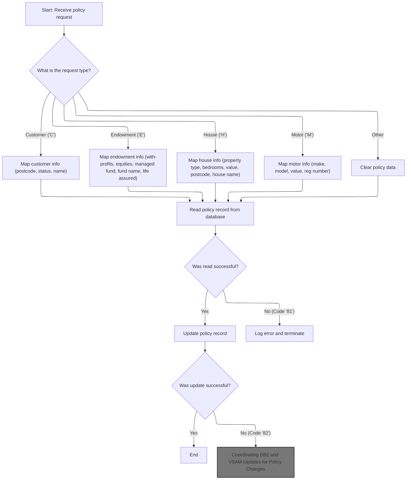
```mermaid
%%{init: {"flowchart": {"defaultRenderer": "elk"}} }%%
flowchart TD
    node1["Start: Receive policy request"] --> node2{"What is the request type?"}
    click node1 openCode "base/src/lgupvs01.cbl:97:105"
    node2 -->|"Customer ('C')"| node3["Map customer info (postcode, status, name)"]
    click node2 openCode "base/src/lgupvs01.cbl:106:135"
    node2 -->|"Endowment ('E')"| node4["Map endowment info (with-profits, equities, managed fund, fund name, life assured)"]
    node2 -->|"House ('H')"| node5["Map house info (property type, bedrooms, value, postcode, house name)"]
    node2 -->|"Motor ('M')"| node6["Map motor info (make, model, value, reg number)"]
    node2 -->|"Other"| node7["Clear policy data"]
    click node3 openCode "base/src/lgupvs01.cbl:109:111"
    click node4 openCode "base/src/lgupvs01.cbl:114:118"
    click node5 openCode "base/src/lgupvs01.cbl:121:125"
    click node6 openCode "base/src/lgupvs01.cbl:128:131"
    click node7 openCode "base/src/lgupvs01.cbl:134:134"
    node3 --> node8["Read policy record from database"]
    node4 --> node8
    node5 --> node8
    node6 --> node8
    node7 --> node8
    click node8 openCode "base/src/lgupvs01.cbl:139:146"
    node8 --> node9{"Was read successful?"}
    click node9 openCode "base/src/lgupvs01.cbl:147:153"
    node9 -->|"Yes"| node10["Update policy record"]
    node9 -->|"No (Code '81')"| node11["Log error and terminate"]
    click node10 openCode "base/src/lgupvs01.cbl:155:159"
    click node11 openCode "base/src/lgupvs01.cbl:150:152"
    node10 --> node12{"Was update successful?"}
    click node12 openCode "base/src/lgupvs01.cbl:160:166"
    node12 -->|"Yes"| node13["End"]
    node12 -->|"No (Code '82')"| node14["Coordinating DB2 and VSAM Updates for Policy Changes"]
    click node13 openCode "base/src/lgupvs01.cbl:170:172"
    
classDef HeadingStyle fill:#777777,stroke:#333,stroke-width:2px;
click node14 goToHeading "Coordinating DB2 and VSAM Updates for Policy Changes"
node14:::HeadingStyle

%% Swimm:
%% %%{init: {"flowchart": {"defaultRenderer": "elk"}} }%%
%% flowchart TD
%%     node1["Start: Receive policy request"] --> node2{"What is the request type?"}
%%     click node1 openCode "<SwmPath>[base/src/lgupvs01.cbl](base/src/lgupvs01.cbl)</SwmPath>:97:105"
%%     node2 -->|"Customer ('C')"| node3["Map customer info (postcode, status, name)"]
%%     click node2 openCode "<SwmPath>[base/src/lgupvs01.cbl](base/src/lgupvs01.cbl)</SwmPath>:106:135"
%%     node2 -->|"Endowment ('E')"| node4["Map endowment info (with-profits, equities, managed fund, fund name, life assured)"]
%%     node2 -->|"House ('H')"| node5["Map house info (property type, bedrooms, value, postcode, house name)"]
%%     node2 -->|"Motor ('M')"| node6["Map motor info (make, model, value, reg number)"]
%%     node2 -->|"Other"| node7["Clear policy data"]
%%     click node3 openCode "<SwmPath>[base/src/lgupvs01.cbl](base/src/lgupvs01.cbl)</SwmPath>:109:111"
%%     click node4 openCode "<SwmPath>[base/src/lgupvs01.cbl](base/src/lgupvs01.cbl)</SwmPath>:114:118"
%%     click node5 openCode "<SwmPath>[base/src/lgupvs01.cbl](base/src/lgupvs01.cbl)</SwmPath>:121:125"
%%     click node6 openCode "<SwmPath>[base/src/lgupvs01.cbl](base/src/lgupvs01.cbl)</SwmPath>:128:131"
%%     click node7 openCode "<SwmPath>[base/src/lgupvs01.cbl](base/src/lgupvs01.cbl)</SwmPath>:134:134"
%%     node3 --> node8["Read policy record from database"]
%%     node4 --> node8
%%     node5 --> node8
%%     node6 --> node8
%%     node7 --> node8
%%     click node8 openCode "<SwmPath>[base/src/lgupvs01.cbl](base/src/lgupvs01.cbl)</SwmPath>:139:146"
%%     node8 --> node9{"Was read successful?"}
%%     click node9 openCode "<SwmPath>[base/src/lgupvs01.cbl](base/src/lgupvs01.cbl)</SwmPath>:147:153"
%%     node9 -->|"Yes"| node10["Update policy record"]
%%     node9 -->|"No (Code '81')"| node11["Log error and terminate"]
%%     click node10 openCode "<SwmPath>[base/src/lgupvs01.cbl](base/src/lgupvs01.cbl)</SwmPath>:155:159"
%%     click node11 openCode "<SwmPath>[base/src/lgupvs01.cbl](base/src/lgupvs01.cbl)</SwmPath>:150:152"
%%     node10 --> node12{"Was update successful?"}
%%     click node12 openCode "<SwmPath>[base/src/lgupvs01.cbl](base/src/lgupvs01.cbl)</SwmPath>:160:166"
%%     node12 -->|"Yes"| node13["End"]
%%     node12 -->|"No (Code '82')"| node14["Coordinating <SwmToken path="base/src/lgipdb01.cbl" pos="242:5:5" line-data="      * initialize DB2 host variables">`DB2`</SwmToken> and VSAM Updates for Policy Changes"]
%%     click node13 openCode "<SwmPath>[base/src/lgupvs01.cbl](base/src/lgupvs01.cbl)</SwmPath>:170:172"
%%     
%% classDef HeadingStyle fill:#777777,stroke:#333,stroke-width:2px;
%% click node14 goToHeading "Coordinating <SwmToken path="base/src/lgipdb01.cbl" pos="242:5:5" line-data="      * initialize DB2 host variables">`DB2`</SwmToken> and VSAM Updates for Policy Changes"
%% node14:::HeadingStyle
```

This section governs the process for updating policy records in the VSAM database, ensuring that the correct fields are mapped based on policy type, and that errors are logged and handled according to business requirements.

| Category        | Rule Name                      | Description                                                                                                                                                   |
| --------------- | ------------------------------ | ------------------------------------------------------------------------------------------------------------------------------------------------------------- |
| Data validation | Unknown policy type handling   | If the request type is not recognized (not Customer, Endowment, House, or Motor), all policy data fields must be cleared before proceeding.                   |
| Data validation | Policy record read validation  | A policy record must be read from the VSAM database before any update is attempted. If the read fails, the error must be logged and the process terminated.   |
| Business logic  | Policy type mapping            | The system must determine the policy type from the 4th character of the request ID and map only the relevant fields for that policy type to the working area. |
| Technical step  | Immediate termination on error | The process must terminate immediately after logging an error, ensuring no further processing occurs on failed requests.                                      |

<SwmSnippet path="/base/src/lgupvs01.cbl" line="97">

---

MAINLINE in <SwmToken path="base/src/lgupdb01.cbl" pos="209:9:9" line-data="           EXEC CICS LINK Program(LGUPVS01)">`LGUPVS01`</SwmToken> figures out the policy type from the 4th character of <SwmToken path="base/src/lgupvs01.cbl" pos="102:3:7" line-data="           Move CA-Request-ID(4:1) To WF-Request-ID">`CA-Request-ID`</SwmToken>, moves the right fields to the working area, then reads and rewrites the VSAM file. If any file operation fails, it logs the error and abends.

```cobol
       MAINLINE SECTION.
      *
      *---------------------------------------------------------------*
           Move EIBCALEN To WS-Commarea-Len.
      *---------------------------------------------------------------*
           Move CA-Request-ID(4:1) To WF-Request-ID
           Move CA-Policy-Num      To WF-Policy-Num
           Move CA-Customer-Num    To WF-Customer-Num

           Evaluate WF-Request-ID

             When 'C'
               Move CA-B-Postcode  To WF-B-Postcode
               Move CA-B-Status    To WF-B-Status
               Move CA-B-Customer  To WF-B-Customer

             When 'E'
               Move CA-E-WITH-PROFITS To  WF-E-WITH-PROFITS
               Move CA-E-EQUITIES     To  WF-E-EQUITIES
               Move CA-E-MANAGED-FUND To  WF-E-MANAGED-FUND
               Move CA-E-FUND-NAME    To  WF-E-FUND-NAME
               Move CA-E-LIFE-ASSURED To  WF-E-LIFE-ASSURED

             When 'H'
               Move CA-H-PROPERTY-TYPE To  WF-H-PROPERTY-TYPE
               Move CA-H-BEDROOMS      To  WF-H-BEDROOMS
               Move CA-H-VALUE         To  WF-H-VALUE
               Move CA-H-POSTCODE      To  WF-H-POSTCODE
               Move CA-H-HOUSE-NAME    To  WF-H-HOUSE-NAME

             When 'M'
               Move CA-M-MAKE          To  WF-M-MAKE
               Move CA-M-MODEL         To  WF-M-MODEL
               Move CA-M-VALUE         To  WF-M-VALUE
               Move CA-M-REGNUMBER     To  WF-M-REGNUMBER

             When Other
               Move Spaces To WF-Policy-Data
           End-Evaluate

           Move CA-Policy-Num      To WF-Policy-Num
      *---------------------------------------------------------------*
           Exec CICS Read File('KSDSPOLY')
                     Into(WS-FileIn)
                     Length(WS-Commarea-Len)
                     Ridfld(WF-Policy-Key)
                     KeyLength(21)
                     RESP(WS-RESP)
                     Update
           End-Exec.
           If WS-RESP Not = DFHRESP(NORMAL)
             Move EIBRESP2 To WS-RESP2
             MOVE '81' TO CA-RETURN-CODE
             PERFORM WRITE-ERROR-MESSAGE
             EXEC CICS ABEND ABCODE('LGV3') NODUMP END-EXEC
             EXEC CICS RETURN END-EXEC
           End-If.
      *---------------------------------------------------------------*
           Exec CICS ReWrite File('KSDSPOLY')
                     From(WF-Policy-Info)
                     Length(WS-Commarea-LenF)
                     RESP(WS-RESP)
           End-Exec.
           If WS-RESP Not = DFHRESP(NORMAL)
             Move EIBRESP2 To WS-RESP2
             MOVE '82' TO CA-RETURN-CODE
             PERFORM WRITE-ERROR-MESSAGE
             EXEC CICS ABEND ABCODE('LGV4') NODUMP END-EXEC
             EXEC CICS RETURN END-EXEC
           End-If.
```

---

</SwmSnippet>

<SwmSnippet path="/base/src/lgupvs01.cbl" line="174">

---

<SwmToken path="base/src/lgupvs01.cbl" pos="174:1:5" line-data="       WRITE-ERROR-MESSAGE.">`WRITE-ERROR-MESSAGE`</SwmToken> in <SwmToken path="base/src/lgupdb01.cbl" pos="209:9:9" line-data="           EXEC CICS LINK Program(LGUPVS01)">`LGUPVS01`</SwmToken> logs the error with timestamp, customer number, and response codes, then calls LGSTSQ to queue the message. If there's commarea data, it logs up to 90 bytes of that too, again via LGSTSQ.

```cobol
       WRITE-ERROR-MESSAGE.
           EXEC CICS ASKTIME ABSTIME(WS-ABSTIME)
           END-EXEC
           EXEC CICS FORMATTIME ABSTIME(WS-ABSTIME)
                     MMDDYYYY(WS-DATE)
                     TIME(WS-TIME)
           END-EXEC
      *
           MOVE WS-DATE TO EM-DATE
           MOVE WS-TIME TO EM-TIME
           Move CA-Customer-Num To EM-Cusnum
           Move WS-RESP         To EM-RespRC
           Move WS-RESP2        To EM-Resp2RC
           EXEC CICS LINK PROGRAM('LGSTSQ')
                     COMMAREA(ERROR-MSG)
                     LENGTH(LENGTH OF ERROR-MSG)
           END-EXEC.
           IF EIBCALEN > 0 THEN
             IF EIBCALEN < 91 THEN
               MOVE DFHCOMMAREA(1:EIBCALEN) TO CA-DATA
               EXEC CICS LINK PROGRAM('LGSTSQ')
                         COMMAREA(CA-ERROR-MSG)
                         LENGTH(Length Of CA-ERROR-MSG)
               END-EXEC
             ELSE
               MOVE DFHCOMMAREA(1:90) TO CA-DATA
               EXEC CICS LINK PROGRAM('LGSTSQ')
                         COMMAREA(CA-ERROR-MSG)
                         LENGTH(Length Of CA-ERROR-MSG)
               END-EXEC
             END-IF
           END-IF.
           EXIT.
```

---

</SwmSnippet>

<SwmSnippet path="/base/src/lgupvs01.cbl" line="170">

---

<SwmToken path="base/src/lgupvs01.cbl" pos="170:1:3" line-data="       A-EXIT.">`A-EXIT`</SwmToken>, EXIT, and GOBACK are just control flow markers to end the program and return to the caller. Nothing else happens here.

```cobol
       A-EXIT.
           EXIT.
           GOBACK.
```

---

</SwmSnippet>

## Handling Update Failures and User Feedback in the Menu

```mermaid
%%{init: {"flowchart": {"defaultRenderer": "elk"}} }%%
flowchart TD
    node1{"Was the motor policy update successful? (CA-RETURN-CODE > 0)"}
    click node1 openCode "base/src/lgtestp1.cbl:220:222"
    node1 -->|"Yes"| node2["Display 'Error Updating Motor Policy' to user"]
    click node2 openCode "base/src/lgtestp1.cbl:296:298"
    node2 --> node4["Return to terminal"]
    click node4 openCode "base/src/lgtestp1.cbl:254:255"
    node1 -->|"No"| node3["Display 'Motor Policy Updated' and send confirmation"]
    click node3 openCode "base/src/lgtestp1.cbl:224:232"
    node3 --> node4
    node1 -->|"Invalid option"| node5["Prompt user to enter a valid option"]
    click node5 openCode "base/src/lgtestp1.cbl:238:247"
    node5 --> node4
classDef HeadingStyle fill:#777777,stroke:#333,stroke-width:2px;

%% Swimm:
%% %%{init: {"flowchart": {"defaultRenderer": "elk"}} }%%
%% flowchart TD
%%     node1{"Was the motor policy update successful? (<SwmToken path="base/src/lgtestp1.cbl" pos="76:3:7" line-data="                 IF CA-RETURN-CODE &gt; 0">`CA-RETURN-CODE`</SwmToken> > 0)"}
%%     click node1 openCode "<SwmPath>[base/src/lgtestp1.cbl](base/src/lgtestp1.cbl)</SwmPath>:220:222"
%%     node1 -->|"Yes"| node2["Display 'Error Updating Motor Policy' to user"]
%%     click node2 openCode "<SwmPath>[base/src/lgtestp1.cbl](base/src/lgtestp1.cbl)</SwmPath>:296:298"
%%     node2 --> node4["Return to terminal"]
%%     click node4 openCode "<SwmPath>[base/src/lgtestp1.cbl](base/src/lgtestp1.cbl)</SwmPath>:254:255"
%%     node1 -->|"No"| node3["Display 'Motor Policy Updated' and send confirmation"]
%%     click node3 openCode "<SwmPath>[base/src/lgtestp1.cbl](base/src/lgtestp1.cbl)</SwmPath>:224:232"
%%     node3 --> node4
%%     node1 -->|"Invalid option"| node5["Prompt user to enter a valid option"]
%%     click node5 openCode "<SwmPath>[base/src/lgtestp1.cbl](base/src/lgtestp1.cbl)</SwmPath>:238:247"
%%     node5 --> node4
%% classDef HeadingStyle fill:#777777,stroke:#333,stroke-width:2px;
```

<SwmSnippet path="/base/src/lgtestp1.cbl" line="220">

---

Back in <SwmToken path="base/src/lgtestp1.cbl" pos="33:5:7" line-data="              GO TO A-GAIN.">`A-GAIN`</SwmToken> after returning from <SwmToken path="base/src/lgtestp1.cbl" pos="216:10:10" line-data="                 EXEC CICS LINK PROGRAM(&#39;LGUPOL01&#39;)">`LGUPOL01`</SwmToken>, we check <SwmToken path="base/src/lgtestp1.cbl" pos="220:3:7" line-data="                 IF CA-RETURN-CODE &gt; 0">`CA-RETURN-CODE`</SwmToken>. If it's positive, we jump to <SwmToken path="base/src/lgtestp1.cbl" pos="221:5:7" line-data="                   GO TO NO-UPD">`NO-UPD`</SwmToken> to show an error message and end the update flow.

```cobol
                 IF CA-RETURN-CODE > 0
                   GO TO NO-UPD
                 END-IF
```

---

</SwmSnippet>

<SwmSnippet path="/base/src/lgtestp1.cbl" line="296">

---

<SwmToken path="base/src/lgtestp1.cbl" pos="296:1:3" line-data="       NO-UPD.">`NO-UPD`</SwmToken> sets the error message for the user and jumps to <SwmToken path="base/src/lgtestp1.cbl" pos="298:5:7" line-data="           Go To ERROR-OUT.">`ERROR-OUT`</SwmToken>, which takes care of displaying the menu and ending the session.

```cobol
       NO-UPD.
           Move 'Error Updating Motor Policy'    To  ERP1FLDO
           Go To ERROR-OUT.
```

---

</SwmSnippet>

<SwmSnippet path="/base/src/lgtestp1.cbl" line="224">

---

After returning from <SwmToken path="base/src/lgtestp1.cbl" pos="221:5:7" line-data="                   GO TO NO-UPD">`NO-UPD`</SwmToken>, <SwmToken path="base/src/lgtestp1.cbl" pos="33:5:7" line-data="              GO TO A-GAIN.">`A-GAIN`</SwmToken> moves the updated customer and policy numbers to the output fields, clears the option, sets 'Motor Policy Updated' as the feedback, and sends the updated menu to the user.

```cobol
                 Move CA-CUSTOMER-NUM To ENP1CNOI
                 Move CA-POLICY-NUM   To ENP1PNOI
                 Move ' '             To ENP1OPTI
                 Move 'Motor Policy Updated'
                   To  ERP1FLDO
                 EXEC CICS SEND MAP ('SSMAPP1')
                           FROM(SSMAPP1O)
                           MAPSET ('SSMAP')
                 END-EXEC
```

---

</SwmSnippet>

<SwmSnippet path="/base/src/lgtestp1.cbl" line="236">

---

<SwmToken path="base/src/lgtestp1.cbl" pos="33:5:7" line-data="              GO TO A-GAIN.">`A-GAIN`</SwmToken> uses <SwmToken path="base/src/lgtestp1.cbl" pos="66:3:3" line-data="           EVALUATE ENP1OPTO">`ENP1OPTO`</SwmToken> to pick the operation, sets up the commarea, and calls the right backend program. If the call fails, it jumps to the error handler. Otherwise, it updates the screen, shows a feedback message, and returns to the menu. Invalid options show an error and put the cursor back for user input.

```cobol
             WHEN OTHER

                 Move 'Please enter a valid option'
                   To  ERP1FLDO
                 Move -1 To ENP1OPTL

                 EXEC CICS SEND MAP ('SSMAPP1')
                           FROM(SSMAPP1O)
                           MAPSET ('SSMAP')
                           CURSOR
                 END-EXEC
                 GO TO ENDIT-STARTIT

           END-EVALUATE.


      *    Send message to terminal and return

           EXEC CICS RETURN
           END-EXEC.
```

---

</SwmSnippet>

&nbsp;

*This is an auto-generated document by Swimm 🌊 and has not yet been verified by a human*

<SwmMeta version="3.0.0" repo-id="Z2l0aHViJTNBJTNBU3dpbW1pby1nZW5hcHAtbW90b3IlM0ElM0FHaXJpLVN3aW1t" repo-name="Swimmio-genapp-motor"><sup>Powered by [Swimm](https://app.swimm.io/)</sup></SwmMeta>
