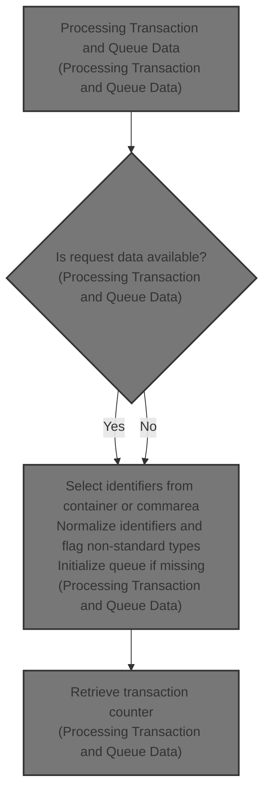

# Overview

This document explains how transaction requests are processed by determining and normalizing transaction identifiers, ensuring queue data is available for tracking, and retrieving transaction counters for reporting.



## Dependencies

### Copybook

- LGCMAREA (<SwmPath>[base/src/lgcmarea.cpy](base/src/lgcmarea.cpy)</SwmPath>)

## Detailed View of the Program's Functionality

a. Initialization and Context Setup

At the start of the process, the program initializes a header structure to store key transaction context information. It retrieves the transaction ID, terminal ID, task number, and the length of the communication area from the CICS environment and stores them for later use. This setup ensures that the transaction context is available throughout the execution.

b. Retrieving Request and Control Data

The program attempts to fetch two pieces of data from CICS containers:

- The first container is expected to hold request data, which is loaded into a designated area.
- The second container is expected to hold control or response data, also loaded into a separate area. After each fetch, the program records the response code to determine if the operation was successful.

c. Deciding Data Source and Early Exit

The program checks if the previous container fetch was successful:

- If successful, it copies the request and control data into the main working fields used for further processing.
- If not successful, it checks if the communication area length is zero. If so, it ends the transaction immediately, as there is nothing to process.
- If the communication area is not empty, it instead copies specific fields from the communication area into the main working fields, ensuring that the program can proceed even if container data was unavailable.

d. Reading and Possibly Initializing Queue Data

The program attempts to read a temporary storage queue to retrieve additional transaction data. If the queue does not exist (as indicated by a specific error code), the program:

- Requests the current system time from CICS.
- Formats the time and date into a specific structure.
- Updates the queue with this new time and date information, effectively initializing it for future use.

e. Normalizing Counter and Type Values

The program then performs normalization on the main working fields:

- If the counter field matches a specific value (<SwmToken path="base/src/lgastat1.cbl" pos="122:8:8" line-data="           If GENAcounter = &#39;02ACUS&#39;">`02ACUS`</SwmToken>), it is changed to a standard value (<SwmToken path="base/src/lgastat1.cbl" pos="123:4:4" line-data="                                     Move &#39;01ACUS&#39; to GENAcounter.">`01ACUS`</SwmToken>).
- If the counter field matches any of several other specific values (<SwmToken path="base/src/lgastat1.cbl" pos="124:8:8" line-data="           If GENAcounter = &#39;02ICOM&#39; or">`02ICOM`</SwmToken>, <SwmToken path="base/src/lgastat1.cbl" pos="125:6:6" line-data="              GENAcounter = &#39;03ICOM&#39; or">`03ICOM`</SwmToken>, <SwmToken path="base/src/lgastat1.cbl" pos="126:6:6" line-data="              GENAcounter = &#39;05ICOM&#39; Move &#39;01ICOM&#39; to GENAcounter.">`05ICOM`</SwmToken>), it is changed to another standard value (<SwmToken path="base/src/lgastat1.cbl" pos="126:12:12" line-data="              GENAcounter = &#39;05ICOM&#39; Move &#39;01ICOM&#39; to GENAcounter.">`01ICOM`</SwmToken>).
- If the type field does not match the expected standard ('00'), it is set to a flag value ('99') to indicate an exception or non-standard condition.

f. Retrieving Transaction Counter and Finalizing

Finally, the program requests a transaction counter from a CICS counter pool, storing the result for potential use or logging. After this, the program ends the transaction and returns control to CICS, completing the flow.

# Rule Definition

| Paragraph Name   | Rule ID | Category          | Description                                                                                                                                                                                                                                                                                                                                                                                                                                                                                                                                                                                                                                                                                                                                                                                                                                                                                                                                                                                                                                                                                                                                                                                                                                                                                                                                                                                                                                                                                             | Conditions                                                                                                                                                                                                                                                                                                   | Remarks                                                                                                                                                                                                                                                                                                                                                                                                                                                                                                                                                                                                                                                                                                                                                                                                                                                                                                                                                                                                                                                                                                                   |
| ---------------- | ------- | ----------------- | ------------------------------------------------------------------------------------------------------------------------------------------------------------------------------------------------------------------------------------------------------------------------------------------------------------------------------------------------------------------------------------------------------------------------------------------------------------------------------------------------------------------------------------------------------------------------------------------------------------------------------------------------------------------------------------------------------------------------------------------------------------------------------------------------------------------------------------------------------------------------------------------------------------------------------------------------------------------------------------------------------------------------------------------------------------------------------------------------------------------------------------------------------------------------------------------------------------------------------------------------------------------------------------------------------------------------------------------------------------------------------------------------------------------------------------------------------------------------------------------------------- | ------------------------------------------------------------------------------------------------------------------------------------------------------------------------------------------------------------------------------------------------------------------------------------------------------------ | ------------------------------------------------------------------------------------------------------------------------------------------------------------------------------------------------------------------------------------------------------------------------------------------------------------------------------------------------------------------------------------------------------------------------------------------------------------------------------------------------------------------------------------------------------------------------------------------------------------------------------------------------------------------------------------------------------------------------------------------------------------------------------------------------------------------------------------------------------------------------------------------------------------------------------------------------------------------------------------------------------------------------------------------------------------------------------------------------------------------------- |
| MAINLINE SECTION | RL-001  | Data Assignment   | The program must initialize the transaction context using the following fields: eyecatcher (16 chars), transaction ID (4 chars), terminal ID (4 chars), task number (7 digits), and commarea length (7 digits).                                                                                                                                                                                                                                                                                                                                                                                                                                                                                                                                                                                                                                                                                                                                                                                                                                                                                                                                                                                                                                                                                                                                                                                                                                                                                         | Always at the start of the transaction.                                                                                                                                                                                                                                                                      | Eyecatcher: 16 alphanumeric, Transaction ID: 4 alphanumeric, Terminal ID: 4 alphanumeric, Task Number: 7 digits, Commarea Length: 7 digits.                                                                                                                                                                                                                                                                                                                                                                                                                                                                                                                                                                                                                                                                                                                                                                                                                                                                                                                                                                               |
| MAINLINE SECTION | RL-002  | Conditional Logic | The program must attempt to fetch request data from the CICS container named <SwmToken path="base/src/lgastat1.cbl" pos="26:17:21" line-data="        01  WS-CHANname1       Pic X(16) value &#39;DFHEP.DATA.00001&#39;.">`DFHEP.DATA.00001`</SwmToken> (6 chars) and return code from <SwmToken path="base/src/lgastat1.cbl" pos="27:17:21" line-data="        01  WS-CHANname2       Pic X(16) value &#39;DFHEP.DATA.00002&#39;.">`DFHEP.DATA.00002`</SwmToken> (2 chars).                                                                                                                                                                                                                                                                                                                                                                                                                                                                                                                                                                                                                                                                                                                                                                                                                                                                                                                                                                                                                            | Always after context initialization.                                                                                                                                                                                                                                                                         | Container names: <SwmToken path="base/src/lgastat1.cbl" pos="26:17:21" line-data="        01  WS-CHANname1       Pic X(16) value &#39;DFHEP.DATA.00001&#39;.">`DFHEP.DATA.00001`</SwmToken> (16 chars in code, but only 6 chars used for data), <SwmToken path="base/src/lgastat1.cbl" pos="27:17:21" line-data="        01  WS-CHANname2       Pic X(16) value &#39;DFHEP.DATA.00002&#39;.">`DFHEP.DATA.00002`</SwmToken> (2 chars for data).                                                                                                                                                                                                                                                                                                                                                                                                                                                                                                                                                                                                                                                                            |
| MAINLINE SECTION | RL-003  | Conditional Logic | If both containers are successfully retrieved, set <SwmToken path="base/src/lgastat1.cbl" pos="96:11:11" line-data="               Move CA-REQUEST-ID  To GENAcounter">`GENAcounter`</SwmToken> to the value from <SwmToken path="base/src/lgastat1.cbl" pos="26:17:21" line-data="        01  WS-CHANname1       Pic X(16) value &#39;DFHEP.DATA.00001&#39;.">`DFHEP.DATA.00001`</SwmToken> and <SwmToken path="base/src/lgastat1.cbl" pos="91:11:11" line-data="             Move WS-Data-RC   To  GENAType">`GENAType`</SwmToken> to the value from <SwmToken path="base/src/lgastat1.cbl" pos="27:17:21" line-data="        01  WS-CHANname2       Pic X(16) value &#39;DFHEP.DATA.00002&#39;.">`DFHEP.DATA.00002`</SwmToken>. If either container fetch fails, check if the commarea length is zero. If zero, end the transaction immediately. If greater than zero, set <SwmToken path="base/src/lgastat1.cbl" pos="96:11:11" line-data="               Move CA-REQUEST-ID  To GENAcounter">`GENAcounter`</SwmToken> to <SwmToken path="base/src/lgastat1.cbl" pos="96:3:7" line-data="               Move CA-REQUEST-ID  To GENAcounter">`CA-REQUEST-ID`</SwmToken> (6 chars) and <SwmToken path="base/src/lgastat1.cbl" pos="91:11:11" line-data="             Move WS-Data-RC   To  GENAType">`GENAType`</SwmToken> to <SwmToken path="base/src/lgastat1.cbl" pos="97:3:7" line-data="               Move CA-RETURN-CODE To GENAtype">`CA-RETURN-CODE`</SwmToken> (2 chars) from the commarea. | After attempting to fetch both containers.                                                                                                                                                                                                                                                                   | <SwmToken path="base/src/lgastat1.cbl" pos="96:11:11" line-data="               Move CA-REQUEST-ID  To GENAcounter">`GENAcounter`</SwmToken>: 6 alphanumeric, <SwmToken path="base/src/lgastat1.cbl" pos="91:11:11" line-data="             Move WS-Data-RC   To  GENAType">`GENAType`</SwmToken>: 2 alphanumeric. <SwmToken path="base/src/lgastat1.cbl" pos="96:3:7" line-data="               Move CA-REQUEST-ID  To GENAcounter">`CA-REQUEST-ID`</SwmToken>: 6 chars, <SwmToken path="base/src/lgastat1.cbl" pos="97:3:7" line-data="               Move CA-RETURN-CODE To GENAtype">`CA-RETURN-CODE`</SwmToken>: 2 chars.                                                                                                                                                                                                                                                                                                                                                                                                                                                                                            |
| MAINLINE SECTION | RL-004  | Conditional Logic | The program must attempt to read the CICS queue named 'GENASTRT' into a 16-byte structure: 8 bytes date (DDMMYYYY), 2 bytes filler (spaces), 6 bytes time (HHMMSS). If the queue does not exist, fetch the current date and time, truncate to 8 and 6 bytes respectively, and write them to the queue in the format: \[date\]\[spaces\]\[time\].                                                                                                                                                                                                                                                                                                                                                                                                                                                                                                                                                                                                                                                                                                                                                                                                                                                                                                                                                                                                                                                                                                                                                        | After setting <SwmToken path="base/src/lgastat1.cbl" pos="96:11:11" line-data="               Move CA-REQUEST-ID  To GENAcounter">`GENAcounter`</SwmToken> and <SwmToken path="base/src/lgastat1.cbl" pos="91:11:11" line-data="             Move WS-Data-RC   To  GENAType">`GENAType`</SwmToken>.          | Queue name: 'GENASTRT' (8 chars). Structure: 8 bytes date (DDMMYYYY), 2 bytes spaces, 6 bytes time (HHMMSS).                                                                                                                                                                                                                                                                                                                                                                                                                                                                                                                                                                                                                                                                                                                                                                                                                                                                                                                                                                                                              |
| MAINLINE SECTION | RL-005  | Conditional Logic | If <SwmToken path="base/src/lgastat1.cbl" pos="96:11:11" line-data="               Move CA-REQUEST-ID  To GENAcounter">`GENAcounter`</SwmToken> is <SwmToken path="base/src/lgastat1.cbl" pos="122:8:8" line-data="           If GENAcounter = &#39;02ACUS&#39;">`02ACUS`</SwmToken>, set it to <SwmToken path="base/src/lgastat1.cbl" pos="123:4:4" line-data="                                     Move &#39;01ACUS&#39; to GENAcounter.">`01ACUS`</SwmToken>. If <SwmToken path="base/src/lgastat1.cbl" pos="96:11:11" line-data="               Move CA-REQUEST-ID  To GENAcounter">`GENAcounter`</SwmToken> is <SwmToken path="base/src/lgastat1.cbl" pos="124:8:8" line-data="           If GENAcounter = &#39;02ICOM&#39; or">`02ICOM`</SwmToken>, <SwmToken path="base/src/lgastat1.cbl" pos="125:6:6" line-data="              GENAcounter = &#39;03ICOM&#39; or">`03ICOM`</SwmToken>, or <SwmToken path="base/src/lgastat1.cbl" pos="126:6:6" line-data="              GENAcounter = &#39;05ICOM&#39; Move &#39;01ICOM&#39; to GENAcounter.">`05ICOM`</SwmToken>, set it to <SwmToken path="base/src/lgastat1.cbl" pos="126:12:12" line-data="              GENAcounter = &#39;05ICOM&#39; Move &#39;01ICOM&#39; to GENAcounter.">`01ICOM`</SwmToken>.                                                                                                                                                                                                                                        | After <SwmToken path="base/src/lgastat1.cbl" pos="96:11:11" line-data="               Move CA-REQUEST-ID  To GENAcounter">`GENAcounter`</SwmToken> is set from containers or commarea.                                                                                                                       | <SwmToken path="base/src/lgastat1.cbl" pos="96:11:11" line-data="               Move CA-REQUEST-ID  To GENAcounter">`GENAcounter`</SwmToken>: 6 alphanumeric. Normalization values: <SwmToken path="base/src/lgastat1.cbl" pos="122:8:8" line-data="           If GENAcounter = &#39;02ACUS&#39;">`02ACUS`</SwmToken> → <SwmToken path="base/src/lgastat1.cbl" pos="123:4:4" line-data="                                     Move &#39;01ACUS&#39; to GENAcounter.">`01ACUS`</SwmToken>, <SwmToken path="base/src/lgastat1.cbl" pos="124:8:8" line-data="           If GENAcounter = &#39;02ICOM&#39; or">`02ICOM`</SwmToken>, <SwmToken path="base/src/lgastat1.cbl" pos="125:6:6" line-data="              GENAcounter = &#39;03ICOM&#39; or">`03ICOM`</SwmToken>, <SwmToken path="base/src/lgastat1.cbl" pos="126:6:6" line-data="              GENAcounter = &#39;05ICOM&#39; Move &#39;01ICOM&#39; to GENAcounter.">`05ICOM`</SwmToken> → <SwmToken path="base/src/lgastat1.cbl" pos="126:12:12" line-data="              GENAcounter = &#39;05ICOM&#39; Move &#39;01ICOM&#39; to GENAcounter.">`01ICOM`</SwmToken>. |
| MAINLINE SECTION | RL-006  | Conditional Logic | If <SwmToken path="base/src/lgastat1.cbl" pos="91:11:11" line-data="             Move WS-Data-RC   To  GENAType">`GENAType`</SwmToken> is not '00', set it to '99'.                                                                                                                                                                                                                                                                                                                                                                                                                                                                                                                                                                                                                                                                                                                                                                                                                                                                                                                                                                                                                                                                                                                                                                                                                                                                                                                                     | After <SwmToken path="base/src/lgastat1.cbl" pos="91:11:11" line-data="             Move WS-Data-RC   To  GENAType">`GENAType`</SwmToken> is set from containers or commarea.                                                                                                                                | <SwmToken path="base/src/lgastat1.cbl" pos="91:11:11" line-data="             Move WS-Data-RC   To  GENAType">`GENAType`</SwmToken>: 2 alphanumeric. Normalization: any value not '00' becomes '99'.                                                                                                                                                                                                                                                                                                                                                                                                                                                                                                                                                                                                                                                                                                                                                                                                                                                                                                                      |
| MAINLINE SECTION | RL-007  | Computation       | Fetch the transaction counter (Trancount) from <SwmToken path="base/src/lgastat1.cbl" pos="130:3:3" line-data="                             Pool(GENApool)">`GENApool`</SwmToken> ('GENA') using the normalized <SwmToken path="base/src/lgastat1.cbl" pos="96:11:11" line-data="               Move CA-REQUEST-ID  To GENAcounter">`GENAcounter`</SwmToken> and <SwmToken path="base/src/lgastat1.cbl" pos="91:11:11" line-data="             Move WS-Data-RC   To  GENAType">`GENAType`</SwmToken> as the key.                                                                                                                                                                                                                                                                                                                                                                                                                                                                                                                                                                                                                                                                                                                                                                                                                                                                                                                                                                                        | After normalization of <SwmToken path="base/src/lgastat1.cbl" pos="96:11:11" line-data="               Move CA-REQUEST-ID  To GENAcounter">`GENAcounter`</SwmToken> and <SwmToken path="base/src/lgastat1.cbl" pos="91:11:11" line-data="             Move WS-Data-RC   To  GENAType">`GENAType`</SwmToken>. | <SwmToken path="base/src/lgastat1.cbl" pos="130:3:3" line-data="                             Pool(GENApool)">`GENApool`</SwmToken>: 'GENA' (4 chars used as pool name). Key: normalized <SwmToken path="base/src/lgastat1.cbl" pos="96:11:11" line-data="               Move CA-REQUEST-ID  To GENAcounter">`GENAcounter`</SwmToken> (6 chars) + <SwmToken path="base/src/lgastat1.cbl" pos="91:11:11" line-data="             Move WS-Data-RC   To  GENAType">`GENAType`</SwmToken> (2 chars). Trancount: 4-byte signed integer.                                                                                                                                                                                                                                                                                                                                                                                                                                                                                                                                                                                         |
| MAINLINE SECTION | RL-008  | Data Assignment   | The program must make the normalized <SwmToken path="base/src/lgastat1.cbl" pos="96:11:11" line-data="               Move CA-REQUEST-ID  To GENAcounter">`GENAcounter`</SwmToken>, <SwmToken path="base/src/lgastat1.cbl" pos="91:11:11" line-data="             Move WS-Data-RC   To  GENAType">`GENAType`</SwmToken>, and Trancount available for downstream processing or return.                                                                                                                                                                                                                                                                                                                                                                                                                                                                                                                                                                                                                                                                                                                                                                                                                                                                                                                                                                                                                                                                                                                    | After fetching Trancount.                                                                                                                                                                                                                                                                                    | <SwmToken path="base/src/lgastat1.cbl" pos="96:11:11" line-data="               Move CA-REQUEST-ID  To GENAcounter">`GENAcounter`</SwmToken>: 6 alphanumeric, <SwmToken path="base/src/lgastat1.cbl" pos="91:11:11" line-data="             Move WS-Data-RC   To  GENAType">`GENAType`</SwmToken>: 2 alphanumeric, Trancount: 4-byte signed integer.                                                                                                                                                                                                                                                                                                                                                                                                                                                                                                                                                                                                                                                                                                                                                                      |

# User Stories

## User Story 1: Transaction context initialization and data sourcing

---

### Story Description:

As a transaction processing system, I want to initialize the transaction context and source request data from containers or commarea so that I can reliably determine the <SwmToken path="base/src/lgastat1.cbl" pos="96:11:11" line-data="               Move CA-REQUEST-ID  To GENAcounter">`GENAcounter`</SwmToken> and <SwmToken path="base/src/lgastat1.cbl" pos="91:11:11" line-data="             Move WS-Data-RC   To  GENAType">`GENAType`</SwmToken> for further processing.

---

### Business Rule Mapping:

| Rule ID | Paragraph Name   | Rule Description                                                                                                                                                                                                                                                                                                                                                                                                                                                                                                                                                                                                                                                                                                                                                                                                                                                                                                                                                                                                                                                                                                                                                                                                                                                                                                                                                                                                                                                                                        |
| ------- | ---------------- | ------------------------------------------------------------------------------------------------------------------------------------------------------------------------------------------------------------------------------------------------------------------------------------------------------------------------------------------------------------------------------------------------------------------------------------------------------------------------------------------------------------------------------------------------------------------------------------------------------------------------------------------------------------------------------------------------------------------------------------------------------------------------------------------------------------------------------------------------------------------------------------------------------------------------------------------------------------------------------------------------------------------------------------------------------------------------------------------------------------------------------------------------------------------------------------------------------------------------------------------------------------------------------------------------------------------------------------------------------------------------------------------------------------------------------------------------------------------------------------------------------- |
| RL-001  | MAINLINE SECTION | The program must initialize the transaction context using the following fields: eyecatcher (16 chars), transaction ID (4 chars), terminal ID (4 chars), task number (7 digits), and commarea length (7 digits).                                                                                                                                                                                                                                                                                                                                                                                                                                                                                                                                                                                                                                                                                                                                                                                                                                                                                                                                                                                                                                                                                                                                                                                                                                                                                         |
| RL-002  | MAINLINE SECTION | The program must attempt to fetch request data from the CICS container named <SwmToken path="base/src/lgastat1.cbl" pos="26:17:21" line-data="        01  WS-CHANname1       Pic X(16) value &#39;DFHEP.DATA.00001&#39;.">`DFHEP.DATA.00001`</SwmToken> (6 chars) and return code from <SwmToken path="base/src/lgastat1.cbl" pos="27:17:21" line-data="        01  WS-CHANname2       Pic X(16) value &#39;DFHEP.DATA.00002&#39;.">`DFHEP.DATA.00002`</SwmToken> (2 chars).                                                                                                                                                                                                                                                                                                                                                                                                                                                                                                                                                                                                                                                                                                                                                                                                                                                                                                                                                                                                                            |
| RL-003  | MAINLINE SECTION | If both containers are successfully retrieved, set <SwmToken path="base/src/lgastat1.cbl" pos="96:11:11" line-data="               Move CA-REQUEST-ID  To GENAcounter">`GENAcounter`</SwmToken> to the value from <SwmToken path="base/src/lgastat1.cbl" pos="26:17:21" line-data="        01  WS-CHANname1       Pic X(16) value &#39;DFHEP.DATA.00001&#39;.">`DFHEP.DATA.00001`</SwmToken> and <SwmToken path="base/src/lgastat1.cbl" pos="91:11:11" line-data="             Move WS-Data-RC   To  GENAType">`GENAType`</SwmToken> to the value from <SwmToken path="base/src/lgastat1.cbl" pos="27:17:21" line-data="        01  WS-CHANname2       Pic X(16) value &#39;DFHEP.DATA.00002&#39;.">`DFHEP.DATA.00002`</SwmToken>. If either container fetch fails, check if the commarea length is zero. If zero, end the transaction immediately. If greater than zero, set <SwmToken path="base/src/lgastat1.cbl" pos="96:11:11" line-data="               Move CA-REQUEST-ID  To GENAcounter">`GENAcounter`</SwmToken> to <SwmToken path="base/src/lgastat1.cbl" pos="96:3:7" line-data="               Move CA-REQUEST-ID  To GENAcounter">`CA-REQUEST-ID`</SwmToken> (6 chars) and <SwmToken path="base/src/lgastat1.cbl" pos="91:11:11" line-data="             Move WS-Data-RC   To  GENAType">`GENAType`</SwmToken> to <SwmToken path="base/src/lgastat1.cbl" pos="97:3:7" line-data="               Move CA-RETURN-CODE To GENAtype">`CA-RETURN-CODE`</SwmToken> (2 chars) from the commarea. |

---

### Relevant Functionality:

- **MAINLINE SECTION**
  1. **RL-001:**
     - Set eyecatcher to constant value.
     - Move transaction ID from system field to context.
     - Move terminal ID from system field to context.
     - Move task number from system field to context.
     - Move commarea length from system field to context.
  2. **RL-002:**
     - Attempt to get container <SwmToken path="base/src/lgastat1.cbl" pos="26:17:21" line-data="        01  WS-CHANname1       Pic X(16) value &#39;DFHEP.DATA.00001&#39;.">`DFHEP.DATA.00001`</SwmToken> into 6-char buffer.
     - Attempt to get container <SwmToken path="base/src/lgastat1.cbl" pos="27:17:21" line-data="        01  WS-CHANname2       Pic X(16) value &#39;DFHEP.DATA.00002&#39;.">`DFHEP.DATA.00002`</SwmToken> into 2-char buffer.
     - Check response code for success.
  3. **RL-003:**
     - If both container fetches succeed:
       - Set <SwmToken path="base/src/lgastat1.cbl" pos="96:11:11" line-data="               Move CA-REQUEST-ID  To GENAcounter">`GENAcounter`</SwmToken> from container 1 value.
       - Set <SwmToken path="base/src/lgastat1.cbl" pos="91:11:11" line-data="             Move WS-Data-RC   To  GENAType">`GENAType`</SwmToken> from container 2 value.
     - Else:
       - If commarea length is zero, end transaction.
       - Else, set <SwmToken path="base/src/lgastat1.cbl" pos="96:11:11" line-data="               Move CA-REQUEST-ID  To GENAcounter">`GENAcounter`</SwmToken> from commarea request ID, set <SwmToken path="base/src/lgastat1.cbl" pos="91:11:11" line-data="             Move WS-Data-RC   To  GENAType">`GENAType`</SwmToken> from commarea return code.

## User Story 2: Queue handling and normalization

---

### Story Description:

As a transaction processing system, I want to read or initialize the GENASTRT queue and normalize <SwmToken path="base/src/lgastat1.cbl" pos="96:11:11" line-data="               Move CA-REQUEST-ID  To GENAcounter">`GENAcounter`</SwmToken> and <SwmToken path="base/src/lgastat1.cbl" pos="91:11:11" line-data="             Move WS-Data-RC   To  GENAType">`GENAType`</SwmToken> values so that the transaction uses consistent and valid identifiers for downstream operations.

---

### Business Rule Mapping:

| Rule ID | Paragraph Name   | Rule Description                                                                                                                                                                                                                                                                                                                                                                                                                                                                                                                                                                                                                                                                                                                                                                                                                                                                                                                                                                                                                                                                                                                                                                                                                                                 |
| ------- | ---------------- | ---------------------------------------------------------------------------------------------------------------------------------------------------------------------------------------------------------------------------------------------------------------------------------------------------------------------------------------------------------------------------------------------------------------------------------------------------------------------------------------------------------------------------------------------------------------------------------------------------------------------------------------------------------------------------------------------------------------------------------------------------------------------------------------------------------------------------------------------------------------------------------------------------------------------------------------------------------------------------------------------------------------------------------------------------------------------------------------------------------------------------------------------------------------------------------------------------------------------------------------------------------------- |
| RL-004  | MAINLINE SECTION | The program must attempt to read the CICS queue named 'GENASTRT' into a 16-byte structure: 8 bytes date (DDMMYYYY), 2 bytes filler (spaces), 6 bytes time (HHMMSS). If the queue does not exist, fetch the current date and time, truncate to 8 and 6 bytes respectively, and write them to the queue in the format: \[date\]\[spaces\]\[time\].                                                                                                                                                                                                                                                                                                                                                                                                                                                                                                                                                                                                                                                                                                                                                                                                                                                                                                                 |
| RL-005  | MAINLINE SECTION | If <SwmToken path="base/src/lgastat1.cbl" pos="96:11:11" line-data="               Move CA-REQUEST-ID  To GENAcounter">`GENAcounter`</SwmToken> is <SwmToken path="base/src/lgastat1.cbl" pos="122:8:8" line-data="           If GENAcounter = &#39;02ACUS&#39;">`02ACUS`</SwmToken>, set it to <SwmToken path="base/src/lgastat1.cbl" pos="123:4:4" line-data="                                     Move &#39;01ACUS&#39; to GENAcounter.">`01ACUS`</SwmToken>. If <SwmToken path="base/src/lgastat1.cbl" pos="96:11:11" line-data="               Move CA-REQUEST-ID  To GENAcounter">`GENAcounter`</SwmToken> is <SwmToken path="base/src/lgastat1.cbl" pos="124:8:8" line-data="           If GENAcounter = &#39;02ICOM&#39; or">`02ICOM`</SwmToken>, <SwmToken path="base/src/lgastat1.cbl" pos="125:6:6" line-data="              GENAcounter = &#39;03ICOM&#39; or">`03ICOM`</SwmToken>, or <SwmToken path="base/src/lgastat1.cbl" pos="126:6:6" line-data="              GENAcounter = &#39;05ICOM&#39; Move &#39;01ICOM&#39; to GENAcounter.">`05ICOM`</SwmToken>, set it to <SwmToken path="base/src/lgastat1.cbl" pos="126:12:12" line-data="              GENAcounter = &#39;05ICOM&#39; Move &#39;01ICOM&#39; to GENAcounter.">`01ICOM`</SwmToken>. |
| RL-006  | MAINLINE SECTION | If <SwmToken path="base/src/lgastat1.cbl" pos="91:11:11" line-data="             Move WS-Data-RC   To  GENAType">`GENAType`</SwmToken> is not '00', set it to '99'.                                                                                                                                                                                                                                                                                                                                                                                                                                                                                                                                                                                                                                                                                                                                                                                                                                                                                                                                                                                                                                                                                              |

---

### Relevant Functionality:

- **MAINLINE SECTION**
  1. **RL-004:**
     - Attempt to read queue 'GENASTRT' into 16-byte structure.
     - If queue does not exist:
       - Fetch current date (DDMMYYYY) and time (HHMMSS).
       - Place date in first 8 bytes, spaces in next 2 bytes, time in last 6 bytes.
       - Write this structure to the queue.
  2. **RL-005:**
     - If <SwmToken path="base/src/lgastat1.cbl" pos="96:11:11" line-data="               Move CA-REQUEST-ID  To GENAcounter">`GENAcounter`</SwmToken> is <SwmToken path="base/src/lgastat1.cbl" pos="122:8:8" line-data="           If GENAcounter = &#39;02ACUS&#39;">`02ACUS`</SwmToken>, set to <SwmToken path="base/src/lgastat1.cbl" pos="123:4:4" line-data="                                     Move &#39;01ACUS&#39; to GENAcounter.">`01ACUS`</SwmToken>.
     - If <SwmToken path="base/src/lgastat1.cbl" pos="96:11:11" line-data="               Move CA-REQUEST-ID  To GENAcounter">`GENAcounter`</SwmToken> is <SwmToken path="base/src/lgastat1.cbl" pos="124:8:8" line-data="           If GENAcounter = &#39;02ICOM&#39; or">`02ICOM`</SwmToken>, <SwmToken path="base/src/lgastat1.cbl" pos="125:6:6" line-data="              GENAcounter = &#39;03ICOM&#39; or">`03ICOM`</SwmToken>, or <SwmToken path="base/src/lgastat1.cbl" pos="126:6:6" line-data="              GENAcounter = &#39;05ICOM&#39; Move &#39;01ICOM&#39; to GENAcounter.">`05ICOM`</SwmToken>, set to <SwmToken path="base/src/lgastat1.cbl" pos="126:12:12" line-data="              GENAcounter = &#39;05ICOM&#39; Move &#39;01ICOM&#39; to GENAcounter.">`01ICOM`</SwmToken>.
  3. **RL-006:**
     - If <SwmToken path="base/src/lgastat1.cbl" pos="91:11:11" line-data="             Move WS-Data-RC   To  GENAType">`GENAType`</SwmToken> is not '00', set to '99'.

## User Story 3: Transaction counter retrieval and output

---

### Story Description:

As a transaction processing system, I want to fetch the transaction counter from the <SwmToken path="base/src/lgastat1.cbl" pos="130:3:3" line-data="                             Pool(GENApool)">`GENApool`</SwmToken> using normalized values and make all relevant data available for downstream processing so that subsequent systems can use the processed transaction information.

---

### Business Rule Mapping:

| Rule ID | Paragraph Name   | Rule Description                                                                                                                                                                                                                                                                                                                                                                                                                                                                                                 |
| ------- | ---------------- | ---------------------------------------------------------------------------------------------------------------------------------------------------------------------------------------------------------------------------------------------------------------------------------------------------------------------------------------------------------------------------------------------------------------------------------------------------------------------------------------------------------------- |
| RL-007  | MAINLINE SECTION | Fetch the transaction counter (Trancount) from <SwmToken path="base/src/lgastat1.cbl" pos="130:3:3" line-data="                             Pool(GENApool)">`GENApool`</SwmToken> ('GENA') using the normalized <SwmToken path="base/src/lgastat1.cbl" pos="96:11:11" line-data="               Move CA-REQUEST-ID  To GENAcounter">`GENAcounter`</SwmToken> and <SwmToken path="base/src/lgastat1.cbl" pos="91:11:11" line-data="             Move WS-Data-RC   To  GENAType">`GENAType`</SwmToken> as the key. |
| RL-008  | MAINLINE SECTION | The program must make the normalized <SwmToken path="base/src/lgastat1.cbl" pos="96:11:11" line-data="               Move CA-REQUEST-ID  To GENAcounter">`GENAcounter`</SwmToken>, <SwmToken path="base/src/lgastat1.cbl" pos="91:11:11" line-data="             Move WS-Data-RC   To  GENAType">`GENAType`</SwmToken>, and Trancount available for downstream processing or return.                                                                                                                             |

---

### Relevant Functionality:

- **MAINLINE SECTION**
  1. **RL-007:**
     - Use normalized <SwmToken path="base/src/lgastat1.cbl" pos="96:11:11" line-data="               Move CA-REQUEST-ID  To GENAcounter">`GENAcounter`</SwmToken> and <SwmToken path="base/src/lgastat1.cbl" pos="91:11:11" line-data="             Move WS-Data-RC   To  GENAType">`GENAType`</SwmToken> as key to fetch Trancount from <SwmToken path="base/src/lgastat1.cbl" pos="130:3:3" line-data="                             Pool(GENApool)">`GENApool`</SwmToken>.
  2. **RL-008:**
     - Provide normalized <SwmToken path="base/src/lgastat1.cbl" pos="96:11:11" line-data="               Move CA-REQUEST-ID  To GENAcounter">`GENAcounter`</SwmToken>, <SwmToken path="base/src/lgastat1.cbl" pos="91:11:11" line-data="             Move WS-Data-RC   To  GENAType">`GENAType`</SwmToken>, and Trancount to downstream logic or as output.

# Workflow

# Processing Transaction and Queue Data

```mermaid
%%{init: {"flowchart": {"defaultRenderer": "elk"}} }%%
flowchart TD
    node1["Start transaction"] --> node2{"Was request data retrieved?"}
    click node1 openCode "base/src/lgastat1.cbl:69:72"
    click node2 openCode "base/src/lgastat1.cbl:79:87"
    node2 -->|"Yes"| node3["Update GENAcounter and GENAType from request"]
    click node3 openCode "base/src/lgastat1.cbl:90:92"
    node2 -->|"No"| node4{"Is request length zero?"}
    click node4 openCode "base/src/lgastat1.cbl:93:94"
    node4 -->|"Yes"| node5["End transaction"]
    click node5 openCode "base/src/lgastat1.cbl:94:94"
    node4 -->|"No"| node6["Update GENAcounter and GENAType from commarea"]
    click node6 openCode "base/src/lgastat1.cbl:96:98"
    node3 --> node7["Read queue data"]
    node6 --> node7
    click node7 openCode "base/src/lgastat1.cbl:101:105"
    node7 --> node8{"Was queue missing?"}
    click node8 openCode "base/src/lgastat1.cbl:106:120"
    node8 -->|"Yes"| node9["Get current time and update queue"]
    click node9 openCode "base/src/lgastat1.cbl:107:119"
    node8 -->|"No"| node11
    node9 --> node11

    subgraph normalization["GENAcounter/GENAType normalization"]
        node11{"GENAcounter = 02ACUS?"}
        click node11 openCode "base/src/lgastat1.cbl:122:123"
        node11 -->|"Yes"| node12["Set GENAcounter to 01ACUS"]
        click node12 openCode "base/src/lgastat1.cbl:123:123"
        node11 -->|"No"| node13{"GENAcounter = 02ICOM, 03ICOM, 05ICOM?"}
        click node13 openCode "base/src/lgastat1.cbl:124:126"
        node13 -->|"Yes"| node14["Set GENAcounter to 01ICOM"]
        click node14 openCode "base/src/lgastat1.cbl:126:126"
        node13 -->|"No"| node15{"GENAType Not = '00'?"}
        click node15 openCode "base/src/lgastat1.cbl:127:127"
        node15 -->|"Yes"| node16["Set GENAType to '99'"]
        click node16 openCode "base/src/lgastat1.cbl:127:127"
        node15 -->|"No"| node17["Proceed"]
        node12 --> node18["Get transaction counter"]
        node14 --> node18
        node16 --> node18
        node17 --> node18
    end
    click node18 openCode "base/src/lgastat1.cbl:129:133"
    node18 --> node19["End transaction"]
    click node19 openCode "base/src/lgastat1.cbl:135:135"

classDef HeadingStyle fill:#777777,stroke:#333,stroke-width:2px;

%% Swimm:
%% %%{init: {"flowchart": {"defaultRenderer": "elk"}} }%%
%% flowchart TD
%%     node1["Start transaction"] --> node2{"Was request data retrieved?"}
%%     click node1 openCode "<SwmPath>[base/src/lgastat1.cbl](base/src/lgastat1.cbl)</SwmPath>:69:72"
%%     click node2 openCode "<SwmPath>[base/src/lgastat1.cbl](base/src/lgastat1.cbl)</SwmPath>:79:87"
%%     node2 -->|"Yes"| node3["Update <SwmToken path="base/src/lgastat1.cbl" pos="96:11:11" line-data="               Move CA-REQUEST-ID  To GENAcounter">`GENAcounter`</SwmToken> and <SwmToken path="base/src/lgastat1.cbl" pos="91:11:11" line-data="             Move WS-Data-RC   To  GENAType">`GENAType`</SwmToken> from request"]
%%     click node3 openCode "<SwmPath>[base/src/lgastat1.cbl](base/src/lgastat1.cbl)</SwmPath>:90:92"
%%     node2 -->|"No"| node4{"Is request length zero?"}
%%     click node4 openCode "<SwmPath>[base/src/lgastat1.cbl](base/src/lgastat1.cbl)</SwmPath>:93:94"
%%     node4 -->|"Yes"| node5["End transaction"]
%%     click node5 openCode "<SwmPath>[base/src/lgastat1.cbl](base/src/lgastat1.cbl)</SwmPath>:94:94"
%%     node4 -->|"No"| node6["Update <SwmToken path="base/src/lgastat1.cbl" pos="96:11:11" line-data="               Move CA-REQUEST-ID  To GENAcounter">`GENAcounter`</SwmToken> and <SwmToken path="base/src/lgastat1.cbl" pos="91:11:11" line-data="             Move WS-Data-RC   To  GENAType">`GENAType`</SwmToken> from commarea"]
%%     click node6 openCode "<SwmPath>[base/src/lgastat1.cbl](base/src/lgastat1.cbl)</SwmPath>:96:98"
%%     node3 --> node7["Read queue data"]
%%     node6 --> node7
%%     click node7 openCode "<SwmPath>[base/src/lgastat1.cbl](base/src/lgastat1.cbl)</SwmPath>:101:105"
%%     node7 --> node8{"Was queue missing?"}
%%     click node8 openCode "<SwmPath>[base/src/lgastat1.cbl](base/src/lgastat1.cbl)</SwmPath>:106:120"
%%     node8 -->|"Yes"| node9["Get current time and update queue"]
%%     click node9 openCode "<SwmPath>[base/src/lgastat1.cbl](base/src/lgastat1.cbl)</SwmPath>:107:119"
%%     node8 -->|"No"| node11
%%     node9 --> node11
%% 
%%     subgraph normalization["GENAcounter/GENAType normalization"]
%%         node11{"<SwmToken path="base/src/lgastat1.cbl" pos="96:11:11" line-data="               Move CA-REQUEST-ID  To GENAcounter">`GENAcounter`</SwmToken> = <SwmToken path="base/src/lgastat1.cbl" pos="122:8:8" line-data="           If GENAcounter = &#39;02ACUS&#39;">`02ACUS`</SwmToken>?"}
%%         click node11 openCode "<SwmPath>[base/src/lgastat1.cbl](base/src/lgastat1.cbl)</SwmPath>:122:123"
%%         node11 -->|"Yes"| node12["Set <SwmToken path="base/src/lgastat1.cbl" pos="96:11:11" line-data="               Move CA-REQUEST-ID  To GENAcounter">`GENAcounter`</SwmToken> to <SwmToken path="base/src/lgastat1.cbl" pos="123:4:4" line-data="                                     Move &#39;01ACUS&#39; to GENAcounter.">`01ACUS`</SwmToken>"]
%%         click node12 openCode "<SwmPath>[base/src/lgastat1.cbl](base/src/lgastat1.cbl)</SwmPath>:123:123"
%%         node11 -->|"No"| node13{"<SwmToken path="base/src/lgastat1.cbl" pos="96:11:11" line-data="               Move CA-REQUEST-ID  To GENAcounter">`GENAcounter`</SwmToken> = <SwmToken path="base/src/lgastat1.cbl" pos="124:8:8" line-data="           If GENAcounter = &#39;02ICOM&#39; or">`02ICOM`</SwmToken>, <SwmToken path="base/src/lgastat1.cbl" pos="125:6:6" line-data="              GENAcounter = &#39;03ICOM&#39; or">`03ICOM`</SwmToken>, <SwmToken path="base/src/lgastat1.cbl" pos="126:6:6" line-data="              GENAcounter = &#39;05ICOM&#39; Move &#39;01ICOM&#39; to GENAcounter.">`05ICOM`</SwmToken>?"}
%%         click node13 openCode "<SwmPath>[base/src/lgastat1.cbl](base/src/lgastat1.cbl)</SwmPath>:124:126"
%%         node13 -->|"Yes"| node14["Set <SwmToken path="base/src/lgastat1.cbl" pos="96:11:11" line-data="               Move CA-REQUEST-ID  To GENAcounter">`GENAcounter`</SwmToken> to <SwmToken path="base/src/lgastat1.cbl" pos="126:12:12" line-data="              GENAcounter = &#39;05ICOM&#39; Move &#39;01ICOM&#39; to GENAcounter.">`01ICOM`</SwmToken>"]
%%         click node14 openCode "<SwmPath>[base/src/lgastat1.cbl](base/src/lgastat1.cbl)</SwmPath>:126:126"
%%         node13 -->|"No"| node15{"<SwmToken path="base/src/lgastat1.cbl" pos="91:11:11" line-data="             Move WS-Data-RC   To  GENAType">`GENAType`</SwmToken> Not = '00'?"}
%%         click node15 openCode "<SwmPath>[base/src/lgastat1.cbl](base/src/lgastat1.cbl)</SwmPath>:127:127"
%%         node15 -->|"Yes"| node16["Set <SwmToken path="base/src/lgastat1.cbl" pos="91:11:11" line-data="             Move WS-Data-RC   To  GENAType">`GENAType`</SwmToken> to '99'"]
%%         click node16 openCode "<SwmPath>[base/src/lgastat1.cbl](base/src/lgastat1.cbl)</SwmPath>:127:127"
%%         node15 -->|"No"| node17["Proceed"]
%%         node12 --> node18["Get transaction counter"]
%%         node14 --> node18
%%         node16 --> node18
%%         node17 --> node18
%%     end
%%     click node18 openCode "<SwmPath>[base/src/lgastat1.cbl](base/src/lgastat1.cbl)</SwmPath>:129:133"
%%     node18 --> node19["End transaction"]
%%     click node19 openCode "<SwmPath>[base/src/lgastat1.cbl](base/src/lgastat1.cbl)</SwmPath>:135:135"
%% 
%% classDef HeadingStyle fill:#777777,stroke:#333,stroke-width:2px;
```



This section manages the processing of transaction and queue data for each incoming request. It determines the source of transaction identifiers, normalizes key values for downstream consistency, and ensures queue data is available and up-to-date for transaction tracking and recovery.

| Category        | Rule Name                            | Description                                                                                                                                                                                                                                                                                                                                                                                                                                                                                                                                                                                                                                                                                                                                                                                                                                             |
| --------------- | ------------------------------------ | ------------------------------------------------------------------------------------------------------------------------------------------------------------------------------------------------------------------------------------------------------------------------------------------------------------------------------------------------------------------------------------------------------------------------------------------------------------------------------------------------------------------------------------------------------------------------------------------------------------------------------------------------------------------------------------------------------------------------------------------------------------------------------------------------------------------------------------------------------- |
| Data validation | Request Data Source Selection        | If request data is successfully retrieved from the CICS container, the <SwmToken path="base/src/lgastat1.cbl" pos="96:11:11" line-data="               Move CA-REQUEST-ID  To GENAcounter">`GENAcounter`</SwmToken> and <SwmToken path="base/src/lgastat1.cbl" pos="91:11:11" line-data="             Move WS-Data-RC   To  GENAType">`GENAType`</SwmToken> values must be set from the request data. If not, and if the request length is zero, the transaction must end immediately without further processing. Otherwise, <SwmToken path="base/src/lgastat1.cbl" pos="96:11:11" line-data="               Move CA-REQUEST-ID  To GENAcounter">`GENAcounter`</SwmToken> and <SwmToken path="base/src/lgastat1.cbl" pos="91:11:11" line-data="             Move WS-Data-RC   To  GENAType">`GENAType`</SwmToken> must be set from the commarea fields. |
| Business logic  | Queue Initialization on Missing Data | If the queue data is missing (queue read fails), the current date and time must be fetched and written to the queue to ensure the queue is initialized for future processing and tracking.                                                                                                                                                                                                                                                                                                                                                                                                                                                                                                                                                                                                                                                              |
| Business logic  | ACUS Counter Normalization           | If <SwmToken path="base/src/lgastat1.cbl" pos="96:11:11" line-data="               Move CA-REQUEST-ID  To GENAcounter">`GENAcounter`</SwmToken> is <SwmToken path="base/src/lgastat1.cbl" pos="122:8:8" line-data="           If GENAcounter = &#39;02ACUS&#39;">`02ACUS`</SwmToken>, it must be normalized to <SwmToken path="base/src/lgastat1.cbl" pos="123:4:4" line-data="                                     Move &#39;01ACUS&#39; to GENAcounter.">`01ACUS`</SwmToken> before further processing.                                                                                                                                                                                                                                                                                                                                               |
| Business logic  | ICOM Counter Normalization           | If <SwmToken path="base/src/lgastat1.cbl" pos="96:11:11" line-data="               Move CA-REQUEST-ID  To GENAcounter">`GENAcounter`</SwmToken> is <SwmToken path="base/src/lgastat1.cbl" pos="124:8:8" line-data="           If GENAcounter = &#39;02ICOM&#39; or">`02ICOM`</SwmToken>, <SwmToken path="base/src/lgastat1.cbl" pos="125:6:6" line-data="              GENAcounter = &#39;03ICOM&#39; or">`03ICOM`</SwmToken>, or <SwmToken path="base/src/lgastat1.cbl" pos="126:6:6" line-data="              GENAcounter = &#39;05ICOM&#39; Move &#39;01ICOM&#39; to GENAcounter.">`05ICOM`</SwmToken>, it must be normalized to <SwmToken path="base/src/lgastat1.cbl" pos="126:12:12" line-data="              GENAcounter = &#39;05ICOM&#39; Move &#39;01ICOM&#39; to GENAcounter.">`01ICOM`</SwmToken> before further processing.                |
| Business logic  | Non-Standard Type Flagging           | If <SwmToken path="base/src/lgastat1.cbl" pos="91:11:11" line-data="             Move WS-Data-RC   To  GENAType">`GENAType`</SwmToken> is not '00', it must be set to '99' to flag non-standard transaction types.                                                                                                                                                                                                                                                                                                                                                                                                                                                                                                                                                                                                                                      |
| Business logic  | Transaction Counter Retrieval        | The transaction counter must be retrieved from the <SwmToken path="base/src/lgastat1.cbl" pos="130:3:3" line-data="                             Pool(GENApool)">`GENApool`</SwmToken> for every processed transaction to ensure accurate tracking and reporting.                                                                                                                                                                                                                                                                                                                                                                                                                                                                                                                                                                                        |

<SwmSnippet path="/base/src/lgastat1.cbl" line="69">

---

We kick off MAINLINE by grabbing the transaction context from CICS and putting it into <SwmToken path="base/src/lgastat1.cbl" pos="72:3:5" line-data="           INITIALIZE WS-HEADER.">`WS-HEADER`</SwmToken> for later use.

```cobol
       MAINLINE SECTION.

      *
           INITIALIZE WS-HEADER.
      *
           MOVE EIBTRNID TO WS-TRANSID.
           MOVE EIBTRMID TO WS-TERMID.
           MOVE EIBTASKN TO WS-TASKNUM.
           MOVE EIBCALEN TO WS-CALEN.
```

---

</SwmSnippet>

<SwmSnippet path="/base/src/lgastat1.cbl" line="79">

---

We fetch request data from a CICS container for use in the next steps.

```cobol
           Exec CICS Get Container(WS-CHANname1)
                         Into(WS-Data-Req)
                         Resp(WS-RESP)
           End-Exec.
```

---

</SwmSnippet>

<SwmSnippet path="/base/src/lgastat1.cbl" line="84">

---

Next we grab data from the <SwmToken path="base/src/lgastat1.cbl" pos="84:9:11" line-data="           Exec CICS Get Container(WS-CHANname2)">`WS-CHANname2`</SwmToken> container and put it into <SwmToken path="base/src/lgastat1.cbl" pos="85:3:7" line-data="                         Into(WS-Data-RC)">`WS-Data-RC`</SwmToken>. This is likely control or response data needed for decision-making in the flow.

```cobol
           Exec CICS Get Container(WS-CHANname2)
                         Into(WS-Data-RC)
                         Resp(WS-RESP)
           End-Exec.
```

---

</SwmSnippet>

<SwmSnippet path="/base/src/lgastat1.cbl" line="89">

---

We decide whether to use container data or commarea fields based on the response, and bail out early if there's nothing to process.

```cobol
           If WS-RESP = DFHRESP(NORMAL)
             Move WS-Data-REQ  To  GENACounter
             Move WS-Data-RC   To  GENAType
           Else
             IF EIBCALEN IS EQUAL TO ZERO
                 EXEC CICS RETURN END-EXEC
             Else
               Move CA-REQUEST-ID  To GENAcounter
               Move CA-RETURN-CODE To GENAtype
             End-if
```

---

</SwmSnippet>

<SwmSnippet path="/base/src/lgastat1.cbl" line="99">

---

Now we read from the CICS queue to get more transaction data into <SwmToken path="base/src/lgastat1.cbl" pos="102:3:5" line-data="                     Into(WS-Qarea)">`WS-Qarea`</SwmToken>, prepping for any additional logic or error handling.

```cobol
           End-if.
      *
           Exec Cics ReadQ TS Queue(WS-Qname)
                     Into(WS-Qarea)
                     Length(Length of WS-Qarea)
                     Resp(WS-RESP)
           End-Exec.
```

---

</SwmSnippet>

<SwmSnippet path="/base/src/lgastat1.cbl" line="106">

---

If the queue read fails, we fetch the current time, format it, and write it back to the queue. This probably helps with tracking or recovery.

```cobol
           If WS-RESP     = DFHRESP(QIDERR) Then
             EXEC CICS ASKTIME ABSTIME(WS-ABSTIME)
             END-EXEC
             EXEC CICS FORMATTIME ABSTIME(WS-ABSTIME)
                       DDMMYYYY(WS-DATE)
                       TIME(WS-TIME)
             END-EXEC
             Move WS-Date To WS-area-D
             Move WS-Time To WS-area-T
             Exec Cics WriteQ TS Queue(WS-Qname)
                       From(WS-Qarea)
                       Length(Length of WS-Qarea)
                       Resp(WS-RESP)
             End-Exec
           End-if
```

---

</SwmSnippet>

<SwmSnippet path="/base/src/lgastat1.cbl" line="122">

---

Here we check if <SwmToken path="base/src/lgastat1.cbl" pos="122:3:3" line-data="           If GENAcounter = &#39;02ACUS&#39;">`GENAcounter`</SwmToken> is <SwmToken path="base/src/lgastat1.cbl" pos="122:8:8" line-data="           If GENAcounter = &#39;02ACUS&#39;">`02ACUS`</SwmToken> and change it to <SwmToken path="base/src/lgastat1.cbl" pos="123:4:4" line-data="                                     Move &#39;01ACUS&#39; to GENAcounter.">`01ACUS`</SwmToken> to normalize the value for later use.

```cobol
           If GENAcounter = '02ACUS'
                                     Move '01ACUS' to GENAcounter.
```

---

</SwmSnippet>

<SwmSnippet path="/base/src/lgastat1.cbl" line="124">

---

Next we check for several ICOM codes and set <SwmToken path="base/src/lgastat1.cbl" pos="124:3:3" line-data="           If GENAcounter = &#39;02ICOM&#39; or">`GENAcounter`</SwmToken> to <SwmToken path="base/src/lgastat1.cbl" pos="126:12:12" line-data="              GENAcounter = &#39;05ICOM&#39; Move &#39;01ICOM&#39; to GENAcounter.">`01ICOM`</SwmToken> if any match, again for normalization.

```cobol
           If GENAcounter = '02ICOM' or
              GENAcounter = '03ICOM' or
              GENAcounter = '05ICOM' Move '01ICOM' to GENAcounter.
```

---

</SwmSnippet>

<SwmSnippet path="/base/src/lgastat1.cbl" line="127">

---

We flag non-standard types with '99'.

```cobol
           If GENAType Not = '00' Move '99' To GENAtype.
```

---

</SwmSnippet>

<SwmSnippet path="/base/src/lgastat1.cbl" line="129">

---

Finally we get the transaction counter from <SwmToken path="base/src/lgastat1.cbl" pos="130:3:3" line-data="                             Pool(GENApool)">`GENApool`</SwmToken> and return control to CICS, wrapping up the flow.

```cobol
               Exec CICS Get Counter(GENAcount)
                             Pool(GENApool)
                             Value(Trancount)
                             Resp(WS-RESP)
               End-Exec

           EXEC CICS RETURN END-EXEC.
```

---

</SwmSnippet>

&nbsp;

*This is an auto-generated document by Swimm 🌊 and has not yet been verified by a human*

<SwmMeta version="3.0.0" repo-id="Z2l0aHViJTNBJTNBU3dpbW1pby1nZW5hcHAtbW90b3IlM0ElM0FHaXJpLVN3aW1t" repo-name="Swimmio-genapp-motor"><sup>Powered by [Swimm](https://app.swimm.io/)</sup></SwmMeta>
