# Overview

This document describes the flow for processing and validating insurance policy data. The flow validates input, prepares the actuarial workflow, reads and validates policy records, and calculates premiums for commercial policies.

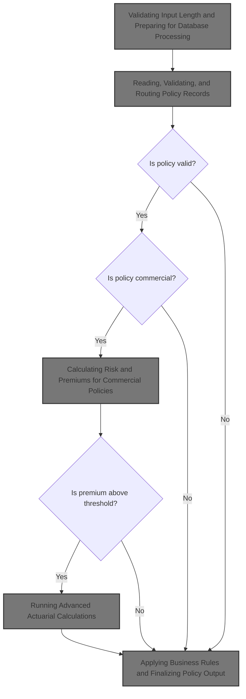

# Technical Overview

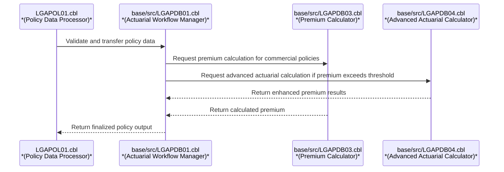

## Dependencies

### Programs

- <SwmToken path="base/src/lgapol01.cbl" pos="103:9:9" line-data="           EXEC CICS Link Program(LGAPDB01)">`LGAPDB01`</SwmToken> (<SwmPath>[base/src/LGAPDB01.cbl](base/src/LGAPDB01.cbl)</SwmPath>)
- <SwmToken path="base/src/LGAPDB01.cbl" pos="269:4:4" line-data="           CALL &#39;LGAPDB02&#39; USING IN-PROPERTY-TYPE, IN-POSTCODE, ">`LGAPDB02`</SwmToken>
- <SwmToken path="base/src/LGAPDB01.cbl" pos="276:4:4" line-data="           CALL &#39;LGAPDB03&#39; USING WS-BASE-RISK-SCR, IN-FIRE-PERIL, ">`LGAPDB03`</SwmToken> (<SwmPath>[base/src/LGAPDB03.cbl](base/src/LGAPDB03.cbl)</SwmPath>)
- <SwmToken path="base/src/LGAPDB01.cbl" pos="313:4:4" line-data="               CALL &#39;LGAPDB04&#39; USING LK-INPUT-DATA, LK-COVERAGE-DATA, ">`LGAPDB04`</SwmToken> (<SwmPath>[base/src/LGAPDB04.cbl](base/src/LGAPDB04.cbl)</SwmPath>)
- LGSTSQ (<SwmPath>[base/src/lgstsq.cbl](base/src/lgstsq.cbl)</SwmPath>)

### Copybooks

- SQLCA
- <SwmToken path="base/src/LGAPDB01.cbl" pos="35:3:3" line-data="           COPY INPUTREC2.">`INPUTREC2`</SwmToken> (<SwmPath>[base/src/INPUTREC2.cpy](base/src/INPUTREC2.cpy)</SwmPath>)
- OUTPUTREC (<SwmPath>[base/src/OUTPUTREC.cpy](base/src/OUTPUTREC.cpy)</SwmPath>)
- WORKSTOR (<SwmPath>[base/src/WORKSTOR.cpy](base/src/WORKSTOR.cpy)</SwmPath>)
- LGAPACT (<SwmPath>[base/src/LGAPACT.cpy](base/src/LGAPACT.cpy)</SwmPath>)
- LGCMAREA (<SwmPath>[base/src/lgcmarea.cpy](base/src/lgcmarea.cpy)</SwmPath>)

# Where is this program used?

This program is used multiple times in the codebase as represented in the following diagram:

```mermaid
graph TD
  oto5s("Managing Commercial Policy Operations (LGTESTP4)") --> 3jbwc("Processing and Validating Policy Data (LGAPOL01)"):::currentEntity
click oto5s openCode "base/src/lgtestp4.cbl:1"
8qv5t("Endowment Policy Menu (LGTESTP2)") --> 3jbwc("Processing and Validating Policy Data (LGAPOL01)"):::currentEntity
click 8qv5t openCode "base/src/lgtestp2.cbl:1"
z9ap3("House Policy Menu (LGTESTP3)") --> 3jbwc("Processing and Validating Policy Data (LGAPOL01)"):::currentEntity
click z9ap3 openCode "base/src/lgtestp3.cbl:1"
ej6sp("Motor Policy Menu (LGTESTP1)") --> 3jbwc("Processing and Validating Policy Data (LGAPOL01)"):::currentEntity
click ej6sp openCode "base/src/lgtestp1.cbl:1"
  
  
click 3jbwc openCode "base/src/lgapol01.cbl:1"
    classDef currentEntity color:#000000,fill:#7CB9F4

%% Swimm:
%% graph TD
%%   oto5s("Managing Commercial Policy Operations (LGTESTP4)") --> 3jbwc("Processing and Validating Policy Data (<SwmToken path="base/src/lgapol01.cbl" pos="2:6:6" line-data="       PROGRAM-ID. LGAPOL01.">`LGAPOL01`</SwmToken>)"):::currentEntity
%% click oto5s openCode "<SwmPath>[base/src/lgtestp4.cbl](base/src/lgtestp4.cbl)</SwmPath>:1"
%% 8qv5t("Endowment Policy Menu (LGTESTP2)") --> 3jbwc("Processing and Validating Policy Data (<SwmToken path="base/src/lgapol01.cbl" pos="2:6:6" line-data="       PROGRAM-ID. LGAPOL01.">`LGAPOL01`</SwmToken>)"):::currentEntity
%% click 8qv5t openCode "<SwmPath>[base/src/lgtestp2.cbl](base/src/lgtestp2.cbl)</SwmPath>:1"
%% z9ap3("House Policy Menu (LGTESTP3)") --> 3jbwc("Processing and Validating Policy Data (<SwmToken path="base/src/lgapol01.cbl" pos="2:6:6" line-data="       PROGRAM-ID. LGAPOL01.">`LGAPOL01`</SwmToken>)"):::currentEntity
%% click z9ap3 openCode "<SwmPath>[base/src/lgtestp3.cbl](base/src/lgtestp3.cbl)</SwmPath>:1"
%% ej6sp("Motor Policy Menu (LGTESTP1)") --> 3jbwc("Processing and Validating Policy Data (<SwmToken path="base/src/lgapol01.cbl" pos="2:6:6" line-data="       PROGRAM-ID. LGAPOL01.">`LGAPOL01`</SwmToken>)"):::currentEntity
%% click ej6sp openCode "<SwmPath>[base/src/lgtestp1.cbl](base/src/lgtestp1.cbl)</SwmPath>:1"
%%   
%%   
%% click 3jbwc openCode "<SwmPath>[base/src/lgapol01.cbl](base/src/lgapol01.cbl)</SwmPath>:1"
%%     classDef currentEntity color:#000000,fill:#7CB9F4
```

# Workflow

# Initializing Transaction Context and Control Data

This section ensures that every transaction starts with a valid context, enabling accurate error handling, logging, and auditing. It also enforces that no transaction proceeds without valid input data.

| Category        | Rule Name                       | Description                                                                                                                                                                      |
| --------------- | ------------------------------- | -------------------------------------------------------------------------------------------------------------------------------------------------------------------------------- |
| Data validation | Input data presence enforcement | If the input data length is zero, an error message stating 'NO COMMAREA RECEIVED' must be logged, and the transaction must be stopped to prevent processing of invalid requests. |

<SwmSnippet path="/base/src/lgapol01.cbl" line="68">

---

This is where we set up the transaction context so error handling and logging routines have the right info for this request.

```cobol
       P100-MAIN SECTION.

      *----------------------------------------------------------------*
      * Common code                                                    *
      *----------------------------------------------------------------*
           INITIALIZE W1-CONTROL.
           MOVE EIBTRNID TO W1-TID.
           MOVE EIBTRMID TO W1-TRM.
           MOVE EIBTASKN TO W1-TSK.
           MOVE EIBCALEN TO W1-LEN.
```

---

</SwmSnippet>

<SwmSnippet path="/base/src/lgapol01.cbl" line="83">

---

If there's no input data, we log the error and stop the transaction so nothing gets processed without valid input.

```cobol
           IF EIBCALEN IS EQUAL TO ZERO
               MOVE ' NO COMMAREA RECEIVED' TO W3-DETAIL
               PERFORM P999-ERROR
               EXEC CICS ABEND ABCODE('LGCA') NODUMP END-EXEC
           END-IF
```

---

</SwmSnippet>

## Logging Error Details and Timestamps

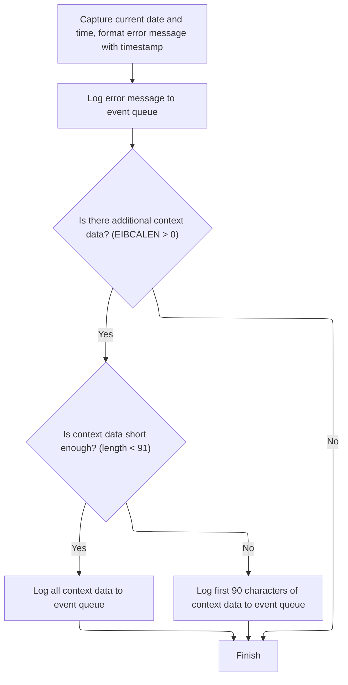

This section ensures that every error is logged with a timestamp for traceability and includes relevant context data, subject to length constraints, to aid in troubleshooting.

| Category       | Rule Name                 | Description                                                                                                                                                                                                |
| -------------- | ------------------------- | ---------------------------------------------------------------------------------------------------------------------------------------------------------------------------------------------------------- |
| Business logic | Timestamp inclusion       | Every error message must include the current date and time, formatted as MMDDYYYY and HHMMSS, to ensure traceability.                                                                                      |
| Business logic | Dual queue logging        | All error messages must be logged to both the system and Genapp event queues to guarantee visibility and redundancy.                                                                                       |
| Business logic | Context data length limit | If additional context data is present, it must be included in the error log. If the context data is 90 characters or fewer, the entire data is logged; if longer, only the first 90 characters are logged. |
| Business logic | No context data fallback  | If no additional context data is present, only the error message with timestamp is logged.                                                                                                                 |

<SwmSnippet path="/base/src/lgapol01.cbl" line="119">

---

In <SwmToken path="base/src/lgapol01.cbl" pos="119:1:3" line-data="       P999-ERROR.">`P999-ERROR`</SwmToken>, we grab the current time, format it into date and time strings, and add these to the error message structure. Then we call LGSTSQ to write the error message to the system and Genapp queues, making sure every error is logged with a timestamp for traceability.

```cobol
       P999-ERROR.
      * Save SQLCODE in message
      * Obtain and format current time and date
           EXEC CICS ASKTIME ABSTIME(W2-TIME)
           END-EXEC
           EXEC CICS FORMATTIME ABSTIME(W2-TIME)
                     MMDDYYYY(W2-DATE1)
                     TIME(W2-DATE2)
           END-EXEC
```

---

</SwmSnippet>

<SwmSnippet path="/base/src/lgapol01.cbl" line="128">

---

We add the timestamp to the error message and send it to LGSTSQ for logging.

```cobol
           MOVE W2-DATE1 TO W3-DATE
           MOVE W2-DATE2 TO W3-TIME
      * Write output message to TDQ
           EXEC CICS LINK PROGRAM('LGSTSQ')
                     COMMAREA(W3-MESSAGE)
                     LENGTH(LENGTH OF W3-MESSAGE)
           END-EXEC.
```

---

</SwmSnippet>

<SwmSnippet path="/base/src/lgapol01.cbl" line="136">

---

Here we check if there's any commarea data to log. If the length is less than 91, we log the whole thing; otherwise, we only log the first 90 bytes. This means error logs might not include all input data if it's longer than 90 bytes.

```cobol
           IF EIBCALEN > 0 THEN
             IF EIBCALEN < 91 THEN
               MOVE DFHCOMMAREA(1:EIBCALEN) TO CA-DATA
               EXEC CICS LINK PROGRAM('LGSTSQ')
                         COMMAREA(CA-ERROR-MSG)
                         LENGTH(LENGTH OF CA-ERROR-MSG)
               END-EXEC
             ELSE
               MOVE DFHCOMMAREA(1:90) TO CA-DATA
               EXEC CICS LINK PROGRAM('LGSTSQ')
                         COMMAREA(CA-ERROR-MSG)
                         LENGTH(LENGTH OF CA-ERROR-MSG)
               END-EXEC
             END-IF
           END-IF.
           EXIT.
```

---

</SwmSnippet>

## Validating Input Length and Preparing for Database Processing

<SwmSnippet path="/base/src/lgapol01.cbl" line="89">

---

After error handling, we check the input length again and bail out if it's too short.

```cobol
           MOVE '00' TO CA-RETURN-CODE
           SET W1-PTR TO ADDRESS OF DFHCOMMAREA.

           ADD W4-HDR-LEN TO W4-REQ-LEN


           IF EIBCALEN IS LESS THAN W4-REQ-LEN
             MOVE '98' TO CA-RETURN-CODE
             EXEC CICS RETURN END-EXEC
           END-IF
```

---

</SwmSnippet>

<SwmSnippet path="/base/src/lgapol01.cbl" line="103">

---

We hand off to <SwmToken path="base/src/lgapol01.cbl" pos="103:9:9" line-data="           EXEC CICS Link Program(LGAPDB01)">`LGAPDB01`</SwmToken> to do the heavy lifting for premium calculation and reporting.

```cobol
           EXEC CICS Link Program(LGAPDB01)
                Commarea(DFHCOMMAREA)
                LENGTH(32500)
           END-EXEC.

           EXEC CICS RETURN END-EXEC.
```

---

</SwmSnippet>

# Preparing Actuarial Workflow and File Setup

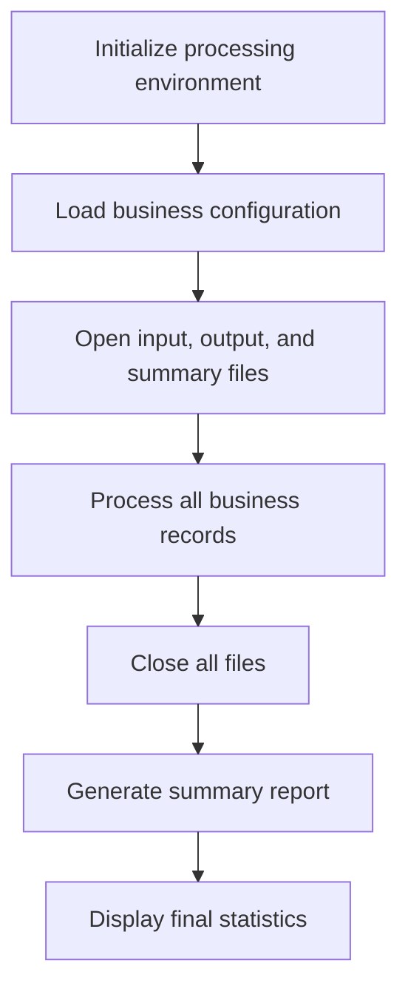

This section ensures that all prerequisites for actuarial processing are met, including environment setup, configuration loading, and file preparation, so that premium calculations and reporting can proceed smoothly.

| Category        | Rule Name                          | Description                                                                                                                                                  |
| --------------- | ---------------------------------- | ------------------------------------------------------------------------------------------------------------------------------------------------------------ |
| Data validation | Configuration loading prerequisite | Business configuration must be loaded before processing records to ensure that all calculations and outputs adhere to current business rules and parameters. |
| Business logic  | Report header enforcement          | Report headers must be written to the output file before any data records are processed, ensuring that all output is clearly labeled for business users.     |
| Business logic  | Counter initialization requirement | Counters and statistics must be initialized at the start of the workflow to ensure accurate tracking of processed records and reporting metrics.             |

<SwmSnippet path="/base/src/LGAPDB01.cbl" line="90">

---

<SwmToken path="base/src/LGAPDB01.cbl" pos="90:1:1" line-data="       P001.">`P001`</SwmToken> runs the setup for the actuarial workflow: initializes counters, loads config, opens input/output/summary files, then processes records and generates reports. This gets everything ready for the actual premium calculations and output.

```cobol
       P001.
           PERFORM P002-INITIALIZE
           PERFORM P003-LOAD-CONFIG
           PERFORM P005-OPEN-FILES
           PERFORM P006-PROCESS-RECORDS
           PERFORM P014-CLOSE-FILES
           PERFORM P015-GENERATE-SUMMARY
           PERFORM P016-DISPLAY-STATS
           STOP RUN.
```

---

</SwmSnippet>

<SwmSnippet path="/base/src/LGAPDB01.cbl" line="138">

---

<SwmToken path="base/src/LGAPDB01.cbl" pos="138:1:5" line-data="       P005-OPEN-FILES.">`P005-OPEN-FILES`</SwmToken> doesn't just open files—it runs subroutines to open input, output, and summary files, then writes report headers. This sets up the output file with column labels before any data is processed.

```cobol
       P005-OPEN-FILES.
           PERFORM P005A-OPEN-INPUT
           PERFORM P005B-OPEN-OUTPUT
           PERFORM P005C-OPEN-SUMMARY
           PERFORM P005D-WRITE-HEADERS.
```

---

</SwmSnippet>

# Reading, Validating, and Routing Policy Records

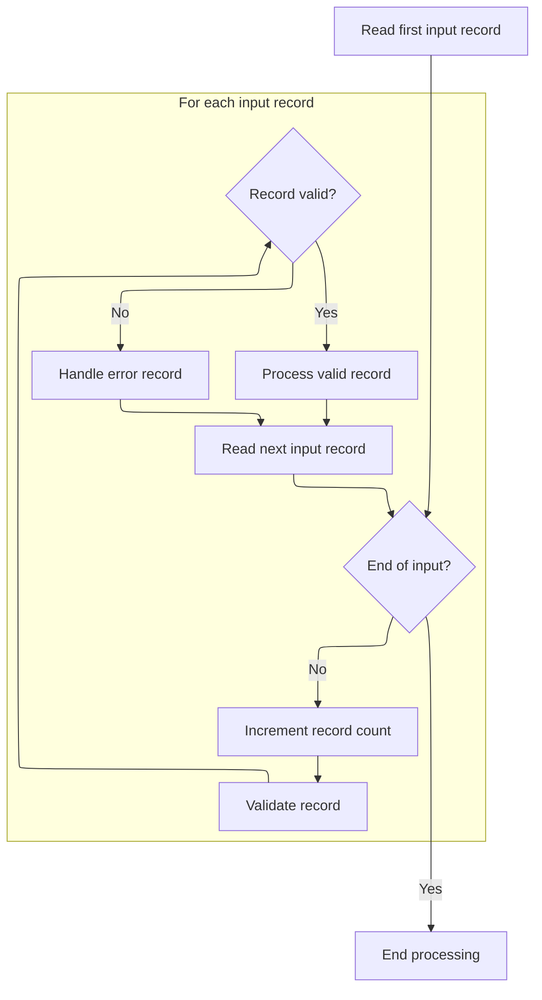

This section is responsible for reading policy records, validating them, and routing them to either standard processing or error handling based on their validity. It ensures that all records are accounted for and that errors are tracked and managed according to severity.

| Category        | Rule Name                     | Description                                                                                                                                                          |
| --------------- | ----------------------------- | -------------------------------------------------------------------------------------------------------------------------------------------------------------------- |
| Data validation | Record validation requirement | Each input record must be validated before it is processed. Validation checks must determine if the record meets all required business criteria for a policy record. |
| Business logic  | Valid record routing          | If a record is valid, it must be routed to standard processing. Valid records contribute to the count of processed policies.                                         |
| Business logic  | Record counting               | The system must increment the total record count for each record read, regardless of validity.                                                                       |
| Business logic  | Error severity categorization | Error records must be categorized by severity: fatal, warning, or informational, using the defined error severity codes ('F', 'W', 'I').                             |
| Technical step  | End of input termination      | Processing must stop when the end of input is reached, as indicated by the end-of-file status value ('10').                                                          |

<SwmSnippet path="/base/src/LGAPDB01.cbl" line="178">

---

We loop through records, validate each, and route them to either processing or error handling.

```cobol
       P006-PROCESS-RECORDS.
           PERFORM P007-READ-INPUT
           PERFORM UNTIL INPUT-EOF
               ADD 1 TO WS-REC-CNT
               PERFORM P008-VALIDATE-INPUT-RECORD
               IF WS-ERROR-COUNT = ZERO
                   PERFORM P009-PROCESS-VALID-RECORD
               ELSE
                   PERFORM P010-PROCESS-ERROR-RECORD
               END-IF
               PERFORM P007-READ-INPUT
           END-PERFORM.
```

---

</SwmSnippet>

# Checking Policy Fields and Logging Validation Errors

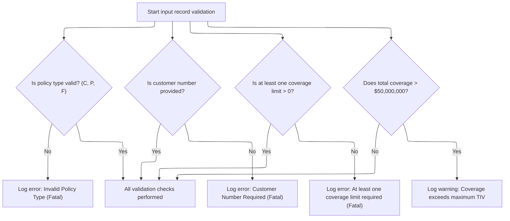

This section ensures that key policy fields are present and valid, and logs any validation errors or warnings for later review. It enforces business rules around policy type, customer number, and coverage limits to maintain data integrity.

| Category        | Rule Name                     | Description                                                                                                                                             |
| --------------- | ----------------------------- | ------------------------------------------------------------------------------------------------------------------------------------------------------- |
| Data validation | Valid Policy Type Enforcement | Only policy types 'C' (Commercial), 'P' (Personal), or 'F' (Farm) are considered valid. Any other value is treated as a fatal error and must be logged. |
| Data validation | Customer Number Requirement   | A customer number must be provided for every policy record. If missing, a fatal error is logged and the record is not processed further.                |
| Data validation | Minimum Coverage Requirement  | At least one coverage limit (building, contents, or business interruption) must be greater than zero. If all are zero, a fatal error is logged.         |
| Business logic  | Maximum Coverage Warning      | If the total coverage (building + contents + business interruption) exceeds $50,000,000, a warning is logged but the record is still processed.         |

<SwmSnippet path="/base/src/LGAPDB01.cbl" line="195">

---

<SwmToken path="base/src/LGAPDB01.cbl" pos="195:1:7" line-data="       P008-VALIDATE-INPUT-RECORD.">`P008-VALIDATE-INPUT-RECORD`</SwmToken> checks key fields (policy type, customer number, coverage limits) and logs errors for any validation failures. Each error is recorded with a code, severity, field, and message for later review.

```cobol
       P008-VALIDATE-INPUT-RECORD.
           INITIALIZE WS-ERROR-HANDLING
           
           IF NOT COMMERCIAL-POLICY AND 
              NOT PERSONAL-POLICY AND 
              NOT FARM-POLICY
               PERFORM P008A-LOG-ERROR WITH 
                   'POL001' 'F' 'IN-POLICY-TYPE' 
                   'Invalid Policy Type'
           END-IF
           
           IF IN-CUSTOMER-NUM = SPACES
               PERFORM P008A-LOG-ERROR WITH 
                   'CUS001' 'F' 'IN-CUSTOMER-NUM' 
                   'Customer Number Required'
           END-IF
           
           IF IN-BUILDING-LIMIT = ZERO AND 
              IN-CONTENTS-LIMIT = ZERO
               PERFORM P008A-LOG-ERROR WITH 
                   'COV001' 'F' 'COVERAGE-LIMITS' 
                   'At least one coverage limit required'
           END-IF
           
           IF IN-BUILDING-LIMIT + IN-CONTENTS-LIMIT + 
              IN-BI-LIMIT > WS-MAX-TIV
               PERFORM P008A-LOG-ERROR WITH 
                   'COV002' 'W' 'COVERAGE-LIMITS' 
                   'Total coverage exceeds maximum TIV'
           END-IF.
```

---

</SwmSnippet>

<SwmSnippet path="/base/src/LGAPDB01.cbl" line="226">

---

<SwmToken path="base/src/LGAPDB01.cbl" pos="226:1:5" line-data="       P008A-LOG-ERROR.">`P008A-LOG-ERROR`</SwmToken> bumps the error count and uses it as an index to store error details in arrays. Only the first 20 errors per record are logged due to the fixed array size.

```cobol
       P008A-LOG-ERROR.
           ADD 1 TO WS-ERROR-COUNT
           SET ERR-IDX TO WS-ERROR-COUNT
           MOVE WS-ERROR-CODE TO WS-ERROR-CODE (ERR-IDX)
           MOVE WS-ERROR-SEVERITY TO WS-ERROR-SEVERITY (ERR-IDX)
           MOVE WS-ERROR-FIELD TO WS-ERROR-FIELD (ERR-IDX)
           MOVE WS-ERROR-MESSAGE TO WS-ERROR-MESSAGE (ERR-IDX).
```

---

</SwmSnippet>

# Routing Valid Policies for Premium Calculation

```mermaid
%%{init: {"flowchart": {"defaultRenderer": "elk"}} }%%
flowchart TD
    node0["Start processing valid record"]
    click node0 openCode "base/src/LGAPDB01.cbl:234:234"
    node0 --> node1{"Is the policy commercial? (IN-POLICY-TYPE = 'C')"}
    click node1 openCode "base/src/LGAPDB01.cbl:235:241"
    node1 -->|"Yes (COMMERCIAL-POLICY)"| node2["Process commercial policy (P011) and increment processing counter (WS-PROC-CNT)"]
    click node2 openCode "base/src/LGAPDB01.cbl:236:237"
    node1 -->|"No (Non-commercial)"| node3["Process non-commercial policy (P012) and increment error counter (WS-ERR-CNT)"]
    click node3 openCode "base/src/LGAPDB01.cbl:239:240"
    node2 --> node4["End"]
    click node4 openCode "base/src/LGAPDB01.cbl:241:241"
    node3 --> node4
classDef HeadingStyle fill:#777777,stroke:#333,stroke-width:2px;

%% Swimm:
%% %%{init: {"flowchart": {"defaultRenderer": "elk"}} }%%
%% flowchart TD
%%     node0["Start processing valid record"]
%%     click node0 openCode "<SwmPath>[base/src/LGAPDB01.cbl](base/src/LGAPDB01.cbl)</SwmPath>:234:234"
%%     node0 --> node1{"Is the policy commercial? (<SwmToken path="base/src/LGAPDB01.cbl" pos="202:10:14" line-data="                   &#39;POL001&#39; &#39;F&#39; &#39;IN-POLICY-TYPE&#39; ">`IN-POLICY-TYPE`</SwmToken> = 'C')"}
%%     click node1 openCode "<SwmPath>[base/src/LGAPDB01.cbl](base/src/LGAPDB01.cbl)</SwmPath>:235:241"
%%     node1 -->|"Yes (<SwmToken path="base/src/LGAPDB01.cbl" pos="198:5:7" line-data="           IF NOT COMMERCIAL-POLICY AND ">`COMMERCIAL-POLICY`</SwmToken>)"| node2["Process commercial policy (<SwmToken path="base/src/LGAPDB01.cbl" pos="236:3:3" line-data="               PERFORM P011-PROCESS-COMMERCIAL">`P011`</SwmToken>) and increment processing counter (<SwmToken path="base/src/LGAPDB01.cbl" pos="237:7:11" line-data="               ADD 1 TO WS-PROC-CNT">`WS-PROC-CNT`</SwmToken>)"]
%%     click node2 openCode "<SwmPath>[base/src/LGAPDB01.cbl](base/src/LGAPDB01.cbl)</SwmPath>:236:237"
%%     node1 -->|"No (Non-commercial)"| node3["Process non-commercial policy (<SwmToken path="base/src/LGAPDB01.cbl" pos="239:3:3" line-data="               PERFORM P012-PROCESS-NON-COMMERCIAL">`P012`</SwmToken>) and increment error counter (<SwmToken path="base/src/LGAPDB01.cbl" pos="240:7:11" line-data="               ADD 1 TO WS-ERR-CNT">`WS-ERR-CNT`</SwmToken>)"]
%%     click node3 openCode "<SwmPath>[base/src/LGAPDB01.cbl](base/src/LGAPDB01.cbl)</SwmPath>:239:240"
%%     node2 --> node4["End"]
%%     click node4 openCode "<SwmPath>[base/src/LGAPDB01.cbl](base/src/LGAPDB01.cbl)</SwmPath>:241:241"
%%     node3 --> node4
%% classDef HeadingStyle fill:#777777,stroke:#333,stroke-width:2px;
```

This section routes valid insurance policy records for premium calculation. It distinguishes between commercial and non-commercial policies, ensuring only commercial policies are processed for premium calculation, while non-commercial policies are logged as unsupported.

| Category        | Rule Name                     | Description                                                                                                                                                                                                                                                                                                                                                     |
| --------------- | ----------------------------- | --------------------------------------------------------------------------------------------------------------------------------------------------------------------------------------------------------------------------------------------------------------------------------------------------------------------------------------------------------------- |
| Data validation | Counter initialization        | The processed policy counter (<SwmToken path="base/src/LGAPDB01.cbl" pos="237:7:11" line-data="               ADD 1 TO WS-PROC-CNT">`WS-PROC-CNT`</SwmToken>) and error counter (<SwmToken path="base/src/LGAPDB01.cbl" pos="240:7:11" line-data="               ADD 1 TO WS-ERR-CNT">`WS-ERR-CNT`</SwmToken>) must both start at zero for each processing run. |
| Business logic  | Commercial policy eligibility | Only policies with a type value of 'C' (commercial) are eligible for premium calculation. All other policy types are considered unsupported for premium calculation.                                                                                                                                                                                            |
| Business logic  | Processed policy count        | Each commercial policy processed for premium calculation must increment the processed policy counter by one.                                                                                                                                                                                                                                                    |
| Business logic  | Unsupported policy logging    | Each non-commercial policy encountered must be logged as unsupported and increment the error counter by one.                                                                                                                                                                                                                                                    |

<SwmSnippet path="/base/src/LGAPDB01.cbl" line="234">

---

<SwmToken path="base/src/LGAPDB01.cbl" pos="234:1:7" line-data="       P009-PROCESS-VALID-RECORD.">`P009-PROCESS-VALID-RECORD`</SwmToken> checks if the policy is commercial. If so, it runs the full premium calculation; otherwise, it logs the policy as unsupported and increments the error count.

```cobol
       P009-PROCESS-VALID-RECORD.
           IF COMMERCIAL-POLICY
               PERFORM P011-PROCESS-COMMERCIAL
               ADD 1 TO WS-PROC-CNT
           ELSE
               PERFORM P012-PROCESS-NON-COMMERCIAL
               ADD 1 TO WS-ERR-CNT
           END-IF.
```

---

</SwmSnippet>

# Calculating Risk and Premiums for Commercial Policies

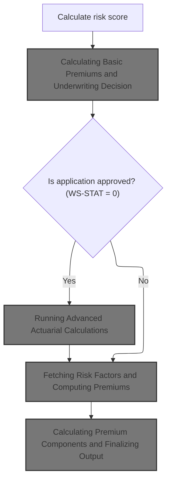

This section governs how risk scores are calculated and used to determine underwriting decisions and premium amounts for commercial insurance policies. It ensures that all relevant data is considered and that business rules are applied to produce accurate and compliant premium calculations.

| Category        | Rule Name                                    | Description                                                                                                                                                                                                                                                                           |
| --------------- | -------------------------------------------- | ------------------------------------------------------------------------------------------------------------------------------------------------------------------------------------------------------------------------------------------------------------------------------------- |
| Data validation | Mandatory risk score calculation             | A risk score must be calculated for every commercial insurance application using property type, location, coverage limits, and customer history before any premium calculation or underwriting decision is made.                                                                      |
| Data validation | Underwriting decision status assignment      | Underwriting decision status must be set to one of: approved (0), pending (1), rejected (2), or referred (3), with a corresponding description and reason provided for non-approved outcomes.                                                                                         |
| Business logic  | Advanced actuarial for approved applications | If the underwriting decision status is 'approved' (<SwmToken path="base/src/LGAPDB01.cbl" pos="261:3:5" line-data="           IF WS-STAT = 0">`WS-STAT`</SwmToken> = 0), advanced actuarial calculations must be performed to potentially update the premium and experience modifier. |
| Business logic  | Comprehensive premium calculation            | Premium calculations must include all relevant components: exposures, rates, modifiers, catastrophe loading, expenses, discounts, and taxes, and must combine these to produce the final premium and rate for the policy.                                                             |
| Business logic  | Discount eligibility and application         | Discount eligibility must be determined for multi-policy, claims-free, and safety program participation, and the total discount factor must be applied to the premium if eligible.                                                                                                    |
| Business logic  | Premium update on advanced calculation       | If the advanced actuarial premium calculation produces a higher premium than the current value, the policy premium and experience modifier must be updated to reflect the advanced result.                                                                                            |

<SwmSnippet path="/base/src/LGAPDB01.cbl" line="258">

---

In <SwmToken path="base/src/LGAPDB01.cbl" pos="258:1:5" line-data="       P011-PROCESS-COMMERCIAL.">`P011-PROCESS-COMMERCIAL`</SwmToken>, we call <SwmToken path="base/src/LGAPDB01.cbl" pos="269:4:4" line-data="           CALL &#39;LGAPDB02&#39; USING IN-PROPERTY-TYPE, IN-POSTCODE, ">`LGAPDB02`</SwmToken> to calculate the risk score using property, location, coverage, and history data. The result is used for all downstream premium calculations.

```cobol
       P011-PROCESS-COMMERCIAL.
           PERFORM P011A-CALCULATE-RISK-SCORE
           PERFORM P011B-BASIC-PREMIUM-CALC
           IF WS-STAT = 0
               PERFORM P011C-ENHANCED-ACTUARIAL-CALC
           END-IF
           PERFORM P011D-APPLY-BUSINESS-RULES
           PERFORM P011E-WRITE-OUTPUT-RECORD
           PERFORM P011F-UPDATE-STATISTICS.
```

---

</SwmSnippet>

<SwmSnippet path="/base/src/LGAPDB01.cbl" line="268">

---

<SwmToken path="base/src/LGAPDB01.cbl" pos="268:1:7" line-data="       P011A-CALCULATE-RISK-SCORE.">`P011A-CALCULATE-RISK-SCORE`</SwmToken> just wraps a call to <SwmToken path="base/src/LGAPDB01.cbl" pos="269:4:4" line-data="           CALL &#39;LGAPDB02&#39; USING IN-PROPERTY-TYPE, IN-POSTCODE, ">`LGAPDB02`</SwmToken>, passing all relevant property and coverage data, and gets back the risk score. The calculation itself is handled externally.

```cobol
       P011A-CALCULATE-RISK-SCORE.
           CALL 'LGAPDB02' USING IN-PROPERTY-TYPE, IN-POSTCODE, 
                                IN-LATITUDE, IN-LONGITUDE,
                                IN-BUILDING-LIMIT, IN-CONTENTS-LIMIT,
                                IN-FLOOD-COVERAGE, IN-WEATHER-COVERAGE,
                                IN-CUSTOMER-HISTORY, WS-BASE-RISK-SCR.
```

---

</SwmSnippet>

## Calculating Basic Premiums and Underwriting Decision

This section is responsible for calculating the basic insurance premiums for a policy application and making the underwriting decision. It determines the risk factors, applies relevant discounts or loadings, and produces the premium breakdown and underwriting status for the policy.

| Category        | Rule Name                            | Description                                                                                                                                                                                                                                |
| --------------- | ------------------------------------ | ------------------------------------------------------------------------------------------------------------------------------------------------------------------------------------------------------------------------------------------ |
| Data validation | Rejection Reason Required            | If the underwriting decision is Rejected, the rejection reason must be provided in the output.                                                                                                                                             |
| Business logic  | Underwriting Decision Status         | The underwriting decision must be made for every policy application and can result in one of the following statuses: Approved, Pending, Rejected, or Referred. The status must be accompanied by a description and, if rejected, a reason. |
| Business logic  | Peril-Based Premium Calculation      | The base premium for each peril (fire, crime, flood, weather) must be calculated using risk factors derived from property, geographical, and customer profile data.                                                                        |
| Business logic  | Discount Eligibility and Application | Discounts such as multi-policy, claims-free, and safety program discounts must be applied if the policyholder is eligible, as indicated by eligibility flags. The total discount factor must be reflected in the final premium.            |
| Business logic  | Premium Loadings                     | Loadings for catastrophe exposure, expenses, and profit must be added to the base premium as separate components before discounts are applied.                                                                                             |
| Business logic  | Total Premium Calculation            | The total premium must be calculated as the sum of all peril premiums after applying loadings and discounts, and must include any applicable taxes and fees.                                                                               |

<SwmSnippet path="/base/src/LGAPDB01.cbl" line="275">

---

<SwmToken path="base/src/LGAPDB01.cbl" pos="275:1:7" line-data="       P011B-BASIC-PREMIUM-CALC.">`P011B-BASIC-PREMIUM-CALC`</SwmToken> calls <SwmToken path="base/src/LGAPDB01.cbl" pos="276:4:4" line-data="           CALL &#39;LGAPDB03&#39; USING WS-BASE-RISK-SCR, IN-FIRE-PERIL, ">`LGAPDB03`</SwmToken> to get risk factors, make the underwriting decision, and calculate all premium components. This keeps the premium logic separate and reusable.

```cobol
       P011B-BASIC-PREMIUM-CALC.
           CALL 'LGAPDB03' USING WS-BASE-RISK-SCR, IN-FIRE-PERIL, 
                                IN-CRIME-PERIL, IN-FLOOD-PERIL, 
                                IN-WEATHER-PERIL, WS-STAT,
                                WS-STAT-DESC, WS-REJ-RSN, WS-FR-PREM,
                                WS-CR-PREM, WS-FL-PREM, WS-WE-PREM,
                                WS-TOT-PREM, WS-DISC-FACT.
```

---

</SwmSnippet>

## Fetching Risk Factors and Computing Premiums

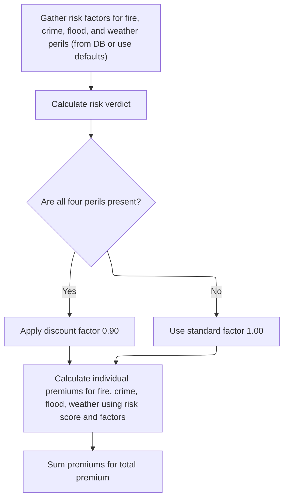

This section is responsible for fetching risk factors for various perils, applying business rules to determine discounts, and computing the total insurance premium based on those factors.

| Category       | Rule Name                 | Description                                                                                                                                                                                                                                                                                                                                                                                                              |
| -------------- | ------------------------- | ------------------------------------------------------------------------------------------------------------------------------------------------------------------------------------------------------------------------------------------------------------------------------------------------------------------------------------------------------------------------------------------------------------------------ |
| Business logic | All perils discount       | A discount factor of <SwmToken path="base/src/LGAPDB03.cbl" pos="99:3:5" line-data="             MOVE 0.90 TO LK-DISC-FACT">`0.90`</SwmToken> must be applied to the premium calculation if all four perils (fire, crime, flood, weather) are present; otherwise, the standard factor of <SwmToken path="base/src/LGAPDB03.cbl" pos="93:3:5" line-data="           MOVE 1.00 TO LK-DISC-FACT">`1.00`</SwmToken> is used. |
| Business logic | Peril premium calculation | Each peril's premium must be calculated by multiplying the risk score, the peril's risk factor, the peril value, and the applicable discount factor.                                                                                                                                                                                                                                                                     |
| Business logic | Total premium aggregation | The total premium must be the sum of the individual premiums for fire, crime, flood, and weather perils.                                                                                                                                                                                                                                                                                                                 |

<SwmSnippet path="/base/src/LGAPDB03.cbl" line="42">

---

<SwmToken path="base/src/LGAPDB03.cbl" pos="42:1:3" line-data="       MAIN-LOGIC.">`MAIN-LOGIC`</SwmToken> starts by fetching risk factors for fire and crime from the database. If the lookup fails, we use default values so the premium calculation can still run.

```cobol
       MAIN-LOGIC.
           PERFORM GET-RISK-FACTORS
           PERFORM CALCULATE-VERDICT
           PERFORM CALCULATE-PREMIUMS
           GOBACK.
```

---

</SwmSnippet>

<SwmSnippet path="/base/src/LGAPDB03.cbl" line="48">

---

In <SwmToken path="base/src/LGAPDB03.cbl" pos="48:1:5" line-data="       GET-RISK-FACTORS.">`GET-RISK-FACTORS`</SwmToken>, we try to fetch fire and crime factors from the <SwmToken path="base/src/LGAPDB03.cbl" pos="51:3:3" line-data="               FROM RISK_FACTORS">`RISK_FACTORS`</SwmToken> table. If the query fails, we fall back to hardcoded values (<SwmToken path="base/src/LGAPDB03.cbl" pos="58:3:5" line-data="               MOVE 0.80 TO WS-FIRE-FACTOR">`0.80`</SwmToken> for fire, <SwmToken path="base/src/LGAPDB03.cbl" pos="70:3:5" line-data="               MOVE 0.60 TO WS-CRIME-FACTOR">`0.60`</SwmToken> for crime), which directly affect premium calculations.

```cobol
       GET-RISK-FACTORS.
           EXEC SQL
               SELECT FACTOR_VALUE INTO :WS-FIRE-FACTOR
               FROM RISK_FACTORS
               WHERE PERIL_TYPE = 'FIRE'
           END-EXEC.
           
           IF SQLCODE = 0
               CONTINUE
           ELSE
               MOVE 0.80 TO WS-FIRE-FACTOR
           END-IF.
           
           EXEC SQL
               SELECT FACTOR_VALUE INTO :WS-CRIME-FACTOR
               FROM RISK_FACTORS
               WHERE PERIL_TYPE = 'CRIME'
           END-EXEC.
           
           IF SQLCODE = 0
               CONTINUE
           ELSE
               MOVE 0.60 TO WS-CRIME-FACTOR
           END-IF.
```

---

</SwmSnippet>

<SwmSnippet path="/base/src/LGAPDB03.cbl" line="92">

---

In <SwmToken path="base/src/LGAPDB03.cbl" pos="92:1:3" line-data="       CALCULATE-PREMIUMS.">`CALCULATE-PREMIUMS`</SwmToken>, we set a discount factor (<SwmToken path="base/src/LGAPDB03.cbl" pos="99:3:5" line-data="             MOVE 0.90 TO LK-DISC-FACT">`0.90`</SwmToken> if all perils are covered, else <SwmToken path="base/src/LGAPDB03.cbl" pos="93:3:5" line-data="           MOVE 1.00 TO LK-DISC-FACT">`1.00`</SwmToken>), then calculate each peril's premium by multiplying risk score, factor, peril value, and discount. The total premium is just the sum of all peril premiums.

```cobol
       CALCULATE-PREMIUMS.
           MOVE 1.00 TO LK-DISC-FACT
           
           IF LK-FIRE-PERIL > 0 AND
              LK-CRIME-PERIL > 0 AND
              LK-FLOOD-PERIL > 0 AND
              LK-WEATHER-PERIL > 0
             MOVE 0.90 TO LK-DISC-FACT
           END-IF

           COMPUTE LK-FIRE-PREMIUM =
             ((LK-RISK-SCORE * WS-FIRE-FACTOR) * LK-FIRE-PERIL *
               LK-DISC-FACT)
           
           COMPUTE LK-CRIME-PREMIUM =
             ((LK-RISK-SCORE * WS-CRIME-FACTOR) * LK-CRIME-PERIL *
               LK-DISC-FACT)
           
           COMPUTE LK-FLOOD-PREMIUM =
             ((LK-RISK-SCORE * WS-FLOOD-FACTOR) * LK-FLOOD-PERIL *
               LK-DISC-FACT)
           
           COMPUTE LK-WEATHER-PREMIUM =
             ((LK-RISK-SCORE * WS-WEATHER-FACTOR) * LK-WEATHER-PERIL *
               LK-DISC-FACT)

           COMPUTE LK-TOTAL-PREMIUM = 
             LK-FIRE-PREMIUM + LK-CRIME-PREMIUM + 
             LK-FLOOD-PREMIUM + LK-WEATHER-PREMIUM. 
```

---

</SwmSnippet>

## Running Advanced Actuarial Calculations

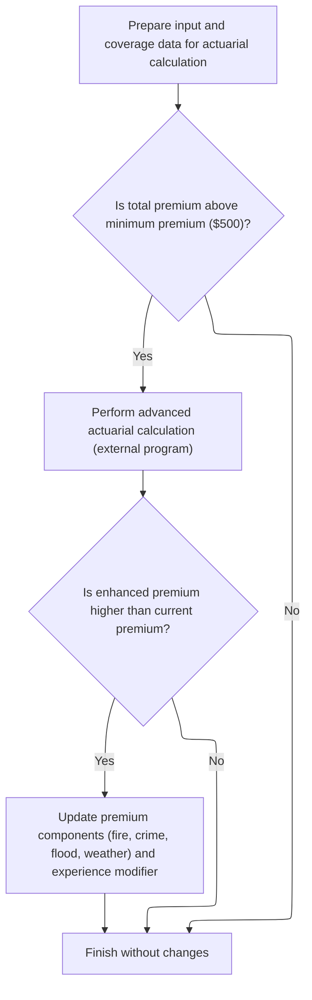

This section determines whether to run advanced actuarial calculations for a policy, based on the total premium amount. If the enhanced actuarial result is better, it updates the premium components and experience modifier accordingly.

| Category        | Rule Name                  | Description                                                                                                                                                                                                                            |
| --------------- | -------------------------- | -------------------------------------------------------------------------------------------------------------------------------------------------------------------------------------------------------------------------------------- |
| Data validation | Minimum premium threshold  | Advanced actuarial calculations are only performed if the total premium exceeds the minimum premium threshold of $500.                                                                                                                 |
| Business logic  | Enhanced premium update    | If the enhanced premium calculated by the advanced actuarial process is greater than the current premium, the premium components (fire, crime, flood, weather) and the experience modifier are updated to reflect the enhanced values. |
| Business logic  | No update on lower premium | If the enhanced premium is not greater than the current premium, no changes are made to the premium components or experience modifier.                                                                                                 |

<SwmSnippet path="/base/src/LGAPDB01.cbl" line="283">

---

<SwmToken path="base/src/LGAPDB01.cbl" pos="283:1:7" line-data="       P011C-ENHANCED-ACTUARIAL-CALC.">`P011C-ENHANCED-ACTUARIAL-CALC`</SwmToken> sets up all the input and coverage data, then calls <SwmToken path="base/src/LGAPDB01.cbl" pos="313:4:4" line-data="               CALL &#39;LGAPDB04&#39; USING LK-INPUT-DATA, LK-COVERAGE-DATA, ">`LGAPDB04`</SwmToken> for advanced premium calculations if the basic premium is high enough. If the enhanced result is better, we update the premium and modifiers.

```cobol
       P011C-ENHANCED-ACTUARIAL-CALC.
      *    Prepare input structure for actuarial calculation
           MOVE IN-CUSTOMER-NUM TO LK-CUSTOMER-NUM
           MOVE WS-BASE-RISK-SCR TO LK-RISK-SCORE
           MOVE IN-PROPERTY-TYPE TO LK-PROPERTY-TYPE
           MOVE IN-TERRITORY-CODE TO LK-TERRITORY
           MOVE IN-CONSTRUCTION-TYPE TO LK-CONSTRUCTION-TYPE
           MOVE IN-OCCUPANCY-CODE TO LK-OCCUPANCY-CODE
           MOVE IN-SPRINKLER-IND TO LK-PROTECTION-CLASS
           MOVE IN-YEAR-BUILT TO LK-YEAR-BUILT
           MOVE IN-SQUARE-FOOTAGE TO LK-SQUARE-FOOTAGE
           MOVE IN-YEARS-IN-BUSINESS TO LK-YEARS-IN-BUSINESS
           MOVE IN-CLAIMS-COUNT-3YR TO LK-CLAIMS-COUNT-5YR
           MOVE IN-CLAIMS-AMOUNT-3YR TO LK-CLAIMS-AMOUNT-5YR
           
      *    Set coverage data
           MOVE IN-BUILDING-LIMIT TO LK-BUILDING-LIMIT
           MOVE IN-CONTENTS-LIMIT TO LK-CONTENTS-LIMIT
           MOVE IN-BI-LIMIT TO LK-BI-LIMIT
           MOVE IN-FIRE-DEDUCTIBLE TO LK-FIRE-DEDUCTIBLE
           MOVE IN-WIND-DEDUCTIBLE TO LK-WIND-DEDUCTIBLE
           MOVE IN-FLOOD-DEDUCTIBLE TO LK-FLOOD-DEDUCTIBLE
           MOVE IN-OTHER-DEDUCTIBLE TO LK-OTHER-DEDUCTIBLE
           MOVE IN-FIRE-PERIL TO LK-FIRE-PERIL
           MOVE IN-CRIME-PERIL TO LK-CRIME-PERIL
           MOVE IN-FLOOD-PERIL TO LK-FLOOD-PERIL
           MOVE IN-WEATHER-PERIL TO LK-WEATHER-PERIL
           
      *    Call advanced actuarial calculation program (only for approved cases)
           IF WS-TOT-PREM > WS-MIN-PREMIUM
               CALL 'LGAPDB04' USING LK-INPUT-DATA, LK-COVERAGE-DATA, 
                                    LK-OUTPUT-RESULTS
               
      *        Update with enhanced calculations if successful
               IF LK-TOTAL-PREMIUM > WS-TOT-PREM
                   MOVE LK-FIRE-PREMIUM TO WS-FR-PREM
                   MOVE LK-CRIME-PREMIUM TO WS-CR-PREM
                   MOVE LK-FLOOD-PREMIUM TO WS-FL-PREM
                   MOVE LK-WEATHER-PREMIUM TO WS-WE-PREM
                   MOVE LK-TOTAL-PREMIUM TO WS-TOT-PREM
                   MOVE LK-EXPERIENCE-MOD TO WS-EXPERIENCE-MOD
               END-IF
           END-IF.
```

---

</SwmSnippet>

## Calculating Premium Components and Finalizing Output

```mermaid
%%{init: {"flowchart": {"defaultRenderer": "elk"}} }%%
flowchart TD
    node1["Start premium calculation"]
    click node1 openCode "base/src/LGAPDB04.cbl:138:150"
    node1 --> node2{"Years in business >= 5?"}
    click node2 openCode "base/src/LGAPDB04.cbl:237:254"
    node2 -->|"Yes"| node3{"Claims-free in 5 years?"}
    click node3 openCode "base/src/LGAPDB04.cbl:238:253"
    node2 -->|"No"| node4["Set experience mod to higher value"]
    click node4 openCode "base/src/LGAPDB04.cbl:255:256"
    node3 -->|"Yes"| node5["Set experience mod to lowest value"]
    click node5 openCode "base/src/LGAPDB04.cbl:239:240"
    node3 -->|"No"| node6["Adjust experience mod based on claims amount"]
    click node6 openCode "base/src/LGAPDB04.cbl:241:252"
    node4 --> node7["Apply schedule modification"]
    click node7 openCode "base/src/LGAPDB04.cbl:260:316"
    node5 --> node7
    node6 --> node7
    node7 --> node8{"Is peril covered?"}
    click node8 openCode "base/src/LGAPDB04.cbl:322:367"
    node8 -->|"Fire"| node9["Calculate fire premium"]
    click node9 openCode "base/src/LGAPDB04.cbl:322:331"
    node8 -->|"Crime"| node10["Calculate crime premium"]
    click node10 openCode "base/src/LGAPDB04.cbl:334:343"
    node8 -->|"Flood"| node11["Calculate flood premium"]
    click node11 openCode "base/src/LGAPDB04.cbl:346:355"
    node8 -->|"Weather"| node12["Calculate weather premium"]
    click node12 openCode "base/src/LGAPDB04.cbl:358:367"
    node9 --> node13["Apply discounts"]
    node10 --> node13
    node11 --> node13
    node12 --> node13
    click node13 openCode "base/src/LGAPDB04.cbl:407:454"
    node13 --> node14{"Total discount > 25%?"}
    click node14 openCode "base/src/LGAPDB04.cbl:447:449"
    node14 -->|"Yes"| node15["Cap discount at 25%"]
    click node15 openCode "base/src/LGAPDB04.cbl:447:449"
    node14 -->|"No"| node16["Use calculated discount"]
    click node16 openCode "base/src/LGAPDB04.cbl:443:446"
    node15 --> node17["Calculate final premium and rate factor"]
    node16 --> node17
    click node17 openCode "base/src/LGAPDB04.cbl:464:477"
    node17 --> node18{"Rate factor > 0.05?"}
    click node18 openCode "base/src/LGAPDB04.cbl:473:477"
    node18 -->|"Yes"| node19["Cap rate factor at 0.05 and recalculate premium"]
    click node19 openCode "base/src/LGAPDB04.cbl:474:477"
    node18 -->|"No"| node20["Use calculated rate factor"]
    click node20 openCode "base/src/LGAPDB04.cbl:470:472"
    node19 --> node21["End: Final premium and rate factor"]
    node20 --> node21
    click node21 openCode "base/src/LGAPDB04.cbl:464:477"

classDef HeadingStyle fill:#777777,stroke:#333,stroke-width:2px;

%% Swimm:
%% %%{init: {"flowchart": {"defaultRenderer": "elk"}} }%%
%% flowchart TD
%%     node1["Start premium calculation"]
%%     click node1 openCode "<SwmPath>[base/src/LGAPDB04.cbl](base/src/LGAPDB04.cbl)</SwmPath>:138:150"
%%     node1 --> node2{"Years in business >= 5?"}
%%     click node2 openCode "<SwmPath>[base/src/LGAPDB04.cbl](base/src/LGAPDB04.cbl)</SwmPath>:237:254"
%%     node2 -->|"Yes"| node3{"<SwmToken path="base/src/LGAPDB04.cbl" pos="425:3:5" line-data="      * Claims-free discount  ">`Claims-free`</SwmToken> in 5 years?"}
%%     click node3 openCode "<SwmPath>[base/src/LGAPDB04.cbl](base/src/LGAPDB04.cbl)</SwmPath>:238:253"
%%     node2 -->|"No"| node4["Set experience mod to higher value"]
%%     click node4 openCode "<SwmPath>[base/src/LGAPDB04.cbl](base/src/LGAPDB04.cbl)</SwmPath>:255:256"
%%     node3 -->|"Yes"| node5["Set experience mod to lowest value"]
%%     click node5 openCode "<SwmPath>[base/src/LGAPDB04.cbl](base/src/LGAPDB04.cbl)</SwmPath>:239:240"
%%     node3 -->|"No"| node6["Adjust experience mod based on claims amount"]
%%     click node6 openCode "<SwmPath>[base/src/LGAPDB04.cbl](base/src/LGAPDB04.cbl)</SwmPath>:241:252"
%%     node4 --> node7["Apply schedule modification"]
%%     click node7 openCode "<SwmPath>[base/src/LGAPDB04.cbl](base/src/LGAPDB04.cbl)</SwmPath>:260:316"
%%     node5 --> node7
%%     node6 --> node7
%%     node7 --> node8{"Is peril covered?"}
%%     click node8 openCode "<SwmPath>[base/src/LGAPDB04.cbl](base/src/LGAPDB04.cbl)</SwmPath>:322:367"
%%     node8 -->|"Fire"| node9["Calculate fire premium"]
%%     click node9 openCode "<SwmPath>[base/src/LGAPDB04.cbl](base/src/LGAPDB04.cbl)</SwmPath>:322:331"
%%     node8 -->|"Crime"| node10["Calculate crime premium"]
%%     click node10 openCode "<SwmPath>[base/src/LGAPDB04.cbl](base/src/LGAPDB04.cbl)</SwmPath>:334:343"
%%     node8 -->|"Flood"| node11["Calculate flood premium"]
%%     click node11 openCode "<SwmPath>[base/src/LGAPDB04.cbl](base/src/LGAPDB04.cbl)</SwmPath>:346:355"
%%     node8 -->|"Weather"| node12["Calculate weather premium"]
%%     click node12 openCode "<SwmPath>[base/src/LGAPDB04.cbl](base/src/LGAPDB04.cbl)</SwmPath>:358:367"
%%     node9 --> node13["Apply discounts"]
%%     node10 --> node13
%%     node11 --> node13
%%     node12 --> node13
%%     click node13 openCode "<SwmPath>[base/src/LGAPDB04.cbl](base/src/LGAPDB04.cbl)</SwmPath>:407:454"
%%     node13 --> node14{"Total discount > 25%?"}
%%     click node14 openCode "<SwmPath>[base/src/LGAPDB04.cbl](base/src/LGAPDB04.cbl)</SwmPath>:447:449"
%%     node14 -->|"Yes"| node15["Cap discount at 25%"]
%%     click node15 openCode "<SwmPath>[base/src/LGAPDB04.cbl](base/src/LGAPDB04.cbl)</SwmPath>:447:449"
%%     node14 -->|"No"| node16["Use calculated discount"]
%%     click node16 openCode "<SwmPath>[base/src/LGAPDB04.cbl](base/src/LGAPDB04.cbl)</SwmPath>:443:446"
%%     node15 --> node17["Calculate final premium and rate factor"]
%%     node16 --> node17
%%     click node17 openCode "<SwmPath>[base/src/LGAPDB04.cbl](base/src/LGAPDB04.cbl)</SwmPath>:464:477"
%%     node17 --> node18{"Rate factor > 0.05?"}
%%     click node18 openCode "<SwmPath>[base/src/LGAPDB04.cbl](base/src/LGAPDB04.cbl)</SwmPath>:473:477"
%%     node18 -->|"Yes"| node19["Cap rate factor at 0.05 and recalculate premium"]
%%     click node19 openCode "<SwmPath>[base/src/LGAPDB04.cbl](base/src/LGAPDB04.cbl)</SwmPath>:474:477"
%%     node18 -->|"No"| node20["Use calculated rate factor"]
%%     click node20 openCode "<SwmPath>[base/src/LGAPDB04.cbl](base/src/LGAPDB04.cbl)</SwmPath>:470:472"
%%     node19 --> node21["End: Final premium and rate factor"]
%%     node20 --> node21
%%     click node21 openCode "<SwmPath>[base/src/LGAPDB04.cbl](base/src/LGAPDB04.cbl)</SwmPath>:464:477"
%% 
%% classDef HeadingStyle fill:#777777,stroke:#333,stroke-width:2px;
```

This section calculates all premium components and finalizes the output for an insurance policy. It applies experience and schedule modifiers, computes peril-specific premiums, applies discounts and caps, and ensures the final premium and rate factor meet business constraints.

| Category       | Rule Name                  | Description                                                                                                                                                                                                                                                                                                                                                                                                                                                                                                 |
| -------------- | -------------------------- | ----------------------------------------------------------------------------------------------------------------------------------------------------------------------------------------------------------------------------------------------------------------------------------------------------------------------------------------------------------------------------------------------------------------------------------------------------------------------------------------------------------- |
| Business logic | Experience modifier limits | If the insured has been in business for at least 5 years and has had no claims in the past 5 years, the experience modifier is set to 0.85. Otherwise, it is adjusted based on claims amount and credibility factor, but always capped between 0.5 and 2.0. If less than 5 years in business, the modifier is set to 1.10.                                                                                                                                                                                  |
| Business logic | Schedule modifier range    | The schedule modifier is calculated using building age, protection class, occupancy code, and exposure density. The final modifier is always clamped between -0.2 and +0.4.                                                                                                                                                                                                                                                                                                                                 |
| Business logic | Peril premium calculation  | Premiums for each peril (fire, crime, flood, weather) are only calculated if the peril indicator is positive. Crime and flood premiums have fixed multipliers (<SwmToken path="base/src/LGAPDB03.cbl" pos="58:3:5" line-data="               MOVE 0.80 TO WS-FIRE-FACTOR">`0.80`</SwmToken> for crime, <SwmToken path="base/src/LGAPDB04.cbl" pos="352:9:11" line-data="                   WS-TREND-FACTOR * 1.25">`1.25`</SwmToken> for flood). All peril premiums are summed for the base premium amount. |
| Business logic | Discount cap               | Discounts are applied for multi-peril coverage, claims-free history, and high deductibles. Each discount has a fixed percentage, and the total discount is capped at 25%.                                                                                                                                                                                                                                                                                                                                   |
| Business logic | Rate factor cap            | The final rate factor is calculated as total premium divided by total insured value. If the rate factor exceeds 0.05, it is capped at 0.05 and the premium is recalculated accordingly.                                                                                                                                                                                                                                                                                                                     |

<SwmSnippet path="/base/src/LGAPDB04.cbl" line="138">

---

<SwmToken path="base/src/LGAPDB04.cbl" pos="138:1:3" line-data="       P100-MAIN.">`P100-MAIN`</SwmToken> runs through all the premium calculation steps: exposure, rates, experience and schedule modifiers, catastrophe loading, expenses, discounts, taxes, and final output. Each step is modular for easy updates and business rule changes.

```cobol
       P100-MAIN.
           PERFORM P200-INIT
           PERFORM P300-RATES
           PERFORM P350-EXPOSURE
           PERFORM P400-EXP-MOD
           PERFORM P500-SCHED-MOD
           PERFORM P600-BASE-PREM
           PERFORM P700-CAT-LOAD
           PERFORM P800-EXPENSE
           PERFORM P900-DISC
           PERFORM P950-TAXES
           PERFORM P999-FINAL
           GOBACK.
```

---

</SwmSnippet>

<SwmSnippet path="/base/src/LGAPDB04.cbl" line="234">

---

<SwmToken path="base/src/LGAPDB04.cbl" pos="234:1:5" line-data="       P400-EXP-MOD.">`P400-EXP-MOD`</SwmToken> calculates the experience modifier based on years in business and claims history. It uses fixed constants for discounts/surcharges and caps the modifier between 0.5 and 2.0. The calculation depends on valid numeric inputs and assumes total insured value isn't zero.

```cobol
       P400-EXP-MOD.
           MOVE 1.0000 TO WS-EXPERIENCE-MOD
           
           IF LK-YEARS-IN-BUSINESS >= 5
               IF LK-CLAIMS-COUNT-5YR = ZERO
                   MOVE 0.8500 TO WS-EXPERIENCE-MOD
               ELSE
                   COMPUTE WS-EXPERIENCE-MOD = 
                       1.0000 + 
                       ((LK-CLAIMS-AMOUNT-5YR / WS-TOTAL-INSURED-VAL) * 
                        WS-CREDIBILITY-FACTOR * 0.50)
                   
                   IF WS-EXPERIENCE-MOD > 2.0000
                       MOVE 2.0000 TO WS-EXPERIENCE-MOD
                   END-IF
                   
                   IF WS-EXPERIENCE-MOD < 0.5000
                       MOVE 0.5000 TO WS-EXPERIENCE-MOD
                   END-IF
               END-IF
           ELSE
               MOVE 1.1000 TO WS-EXPERIENCE-MOD
           END-IF
           
           MOVE WS-EXPERIENCE-MOD TO LK-EXPERIENCE-MOD.
```

---

</SwmSnippet>

<SwmSnippet path="/base/src/LGAPDB04.cbl" line="260">

---

<SwmToken path="base/src/LGAPDB04.cbl" pos="260:1:5" line-data="       P500-SCHED-MOD.">`P500-SCHED-MOD`</SwmToken> adjusts the schedule modifier using building age, protection class, occupancy code, and exposure density. Each factor tweaks the modifier up or down, and the final value is clamped between -0.2 and +0.4. Inputs are assumed valid and formatted.

```cobol
       P500-SCHED-MOD.
           MOVE +0.000 TO WS-SCHEDULE-MOD
           
      *    Building age factor
           EVALUATE TRUE
               WHEN LK-YEAR-BUILT >= 2010
                   SUBTRACT 0.050 FROM WS-SCHEDULE-MOD
               WHEN LK-YEAR-BUILT >= 1990
                   CONTINUE
               WHEN LK-YEAR-BUILT >= 1970
                   ADD 0.100 TO WS-SCHEDULE-MOD
               WHEN OTHER
                   ADD 0.200 TO WS-SCHEDULE-MOD
           END-EVALUATE
           
      *    Protection class factor
           EVALUATE LK-PROTECTION-CLASS
               WHEN '01' THRU '03'
                   SUBTRACT 0.100 FROM WS-SCHEDULE-MOD
               WHEN '04' THRU '06'
                   SUBTRACT 0.050 FROM WS-SCHEDULE-MOD
               WHEN '07' THRU '09'
                   CONTINUE
               WHEN OTHER
                   ADD 0.150 TO WS-SCHEDULE-MOD
           END-EVALUATE
           
      *    Occupancy hazard factor
           EVALUATE LK-OCCUPANCY-CODE
               WHEN 'OFF01' THRU 'OFF05'
                   SUBTRACT 0.025 FROM WS-SCHEDULE-MOD
               WHEN 'MFG01' THRU 'MFG10'
                   ADD 0.075 TO WS-SCHEDULE-MOD
               WHEN 'WHS01' THRU 'WHS05'
                   ADD 0.125 TO WS-SCHEDULE-MOD
               WHEN OTHER
                   CONTINUE
           END-EVALUATE
           
      *    Exposure density factor
           IF WS-EXPOSURE-DENSITY > 500.00
               ADD 0.100 TO WS-SCHEDULE-MOD
           ELSE
               IF WS-EXPOSURE-DENSITY < 50.00
                   SUBTRACT 0.050 FROM WS-SCHEDULE-MOD
               END-IF
           END-IF
           
           IF WS-SCHEDULE-MOD > +0.400
               MOVE +0.400 TO WS-SCHEDULE-MOD
           END-IF
           
           IF WS-SCHEDULE-MOD < -0.200
               MOVE -0.200 TO WS-SCHEDULE-MOD
           END-IF
           
           MOVE WS-SCHEDULE-MOD TO LK-SCHEDULE-MOD.
```

---

</SwmSnippet>

<SwmSnippet path="/base/src/LGAPDB04.cbl" line="318">

---

<SwmToken path="base/src/LGAPDB04.cbl" pos="318:1:5" line-data="       P600-BASE-PREM.">`P600-BASE-PREM`</SwmToken> calculates each peril's premium using exposures, base rates, experience and schedule modifiers, and a trend factor. Crime and flood have extra multipliers (<SwmToken path="base/src/LGAPDB04.cbl" pos="336:10:12" line-data="                   (WS-CONTENTS-EXPOSURE * 0.80) *">`0.80`</SwmToken> and <SwmToken path="base/src/LGAPDB04.cbl" pos="352:9:11" line-data="                   WS-TREND-FACTOR * 1.25">`1.25`</SwmToken>). Only perils with positive indicators are processed, and all premiums are summed for the base amount.

```cobol
       P600-BASE-PREM.
           MOVE ZERO TO LK-BASE-AMOUNT
           
      * FIRE PREMIUM
           IF LK-FIRE-PERIL > ZERO
               COMPUTE LK-FIRE-PREMIUM = 
                   (WS-BUILDING-EXPOSURE + WS-CONTENTS-EXPOSURE) *
                   WS-BASE-RATE (1, 1, 1, 1) * 
                   WS-EXPERIENCE-MOD *
                   (1 + WS-SCHEDULE-MOD) *
                   WS-TREND-FACTOR
                   
               ADD LK-FIRE-PREMIUM TO LK-BASE-AMOUNT
           END-IF
           
      * CRIME PREMIUM
           IF LK-CRIME-PERIL > ZERO
               COMPUTE LK-CRIME-PREMIUM = 
                   (WS-CONTENTS-EXPOSURE * 0.80) *
                   WS-BASE-RATE (2, 1, 1, 1) * 
                   WS-EXPERIENCE-MOD *
                   (1 + WS-SCHEDULE-MOD) *
                   WS-TREND-FACTOR
                   
               ADD LK-CRIME-PREMIUM TO LK-BASE-AMOUNT
           END-IF
           
      * FLOOD PREMIUM
           IF LK-FLOOD-PERIL > ZERO
               COMPUTE LK-FLOOD-PREMIUM = 
                   WS-BUILDING-EXPOSURE *
                   WS-BASE-RATE (3, 1, 1, 1) * 
                   WS-EXPERIENCE-MOD *
                   (1 + WS-SCHEDULE-MOD) *
                   WS-TREND-FACTOR * 1.25
                   
               ADD LK-FLOOD-PREMIUM TO LK-BASE-AMOUNT
           END-IF
           
      * WEATHER PREMIUM
           IF LK-WEATHER-PERIL > ZERO
               COMPUTE LK-WEATHER-PREMIUM = 
                   (WS-BUILDING-EXPOSURE + WS-CONTENTS-EXPOSURE) *
                   WS-BASE-RATE (4, 1, 1, 1) * 
                   WS-EXPERIENCE-MOD *
                   (1 + WS-SCHEDULE-MOD) *
                   WS-TREND-FACTOR
                   
               ADD LK-WEATHER-PREMIUM TO LK-BASE-AMOUNT
           END-IF.
```

---

</SwmSnippet>

<SwmSnippet path="/base/src/LGAPDB04.cbl" line="407">

---

<SwmToken path="base/src/LGAPDB04.cbl" pos="407:1:3" line-data="       P900-DISC.">`P900-DISC`</SwmToken> calculates the total discount by checking for multi-peril coverage, claims-free history, and high deductibles. Each condition adds a fixed percentage, and the total discount is capped at 25%. The final discount is applied to the sum of all premium components.

```cobol
       P900-DISC.
           MOVE ZERO TO WS-TOTAL-DISCOUNT
           
      * Multi-peril discount
           MOVE ZERO TO WS-MULTI-PERIL-DISC
           IF LK-FIRE-PERIL > ZERO AND
              LK-CRIME-PERIL > ZERO AND
              LK-FLOOD-PERIL > ZERO AND
              LK-WEATHER-PERIL > ZERO
               MOVE 0.100 TO WS-MULTI-PERIL-DISC
           ELSE
               IF LK-FIRE-PERIL > ZERO AND
                  LK-WEATHER-PERIL > ZERO AND
                  (LK-CRIME-PERIL > ZERO OR LK-FLOOD-PERIL > ZERO)
                   MOVE 0.050 TO WS-MULTI-PERIL-DISC
               END-IF
           END-IF
           
      * Claims-free discount  
           MOVE ZERO TO WS-CLAIMS-FREE-DISC
           IF LK-CLAIMS-COUNT-5YR = ZERO AND LK-YEARS-IN-BUSINESS >= 5
               MOVE 0.075 TO WS-CLAIMS-FREE-DISC
           END-IF
           
      * Deductible credit
           MOVE ZERO TO WS-DEDUCTIBLE-CREDIT
           IF LK-FIRE-DEDUCTIBLE >= 10000
               ADD 0.025 TO WS-DEDUCTIBLE-CREDIT
           END-IF
           IF LK-WIND-DEDUCTIBLE >= 25000  
               ADD 0.035 TO WS-DEDUCTIBLE-CREDIT
           END-IF
           IF LK-FLOOD-DEDUCTIBLE >= 50000
               ADD 0.045 TO WS-DEDUCTIBLE-CREDIT
           END-IF
           
           COMPUTE WS-TOTAL-DISCOUNT = 
               WS-MULTI-PERIL-DISC + WS-CLAIMS-FREE-DISC + 
               WS-DEDUCTIBLE-CREDIT
               
           IF WS-TOTAL-DISCOUNT > 0.250
               MOVE 0.250 TO WS-TOTAL-DISCOUNT
           END-IF
           
           COMPUTE LK-DISCOUNT-AMT = 
               (LK-BASE-AMOUNT + LK-CAT-LOAD-AMT + 
                LK-EXPENSE-LOAD-AMT + LK-PROFIT-LOAD-AMT) *
               WS-TOTAL-DISCOUNT.
```

---

</SwmSnippet>

<SwmSnippet path="/base/src/LGAPDB04.cbl" line="464">

---

<SwmToken path="base/src/LGAPDB04.cbl" pos="464:1:3" line-data="       P999-FINAL.">`P999-FINAL`</SwmToken> sums up all premium components, subtracts discounts, adds taxes, and calculates the final rate factor. If the rate is above 0.05, we cap it and recalculate the premium. This keeps the output within business limits.

```cobol
       P999-FINAL.
           COMPUTE LK-TOTAL-PREMIUM = 
               LK-BASE-AMOUNT + LK-CAT-LOAD-AMT + 
               LK-EXPENSE-LOAD-AMT + LK-PROFIT-LOAD-AMT -
               LK-DISCOUNT-AMT + LK-TAX-AMT
               
           COMPUTE LK-FINAL-RATE-FACTOR = 
               LK-TOTAL-PREMIUM / WS-TOTAL-INSURED-VAL
               
           IF LK-FINAL-RATE-FACTOR > 0.050000
               MOVE 0.050000 TO LK-FINAL-RATE-FACTOR
               COMPUTE LK-TOTAL-PREMIUM = 
                   WS-TOTAL-INSURED-VAL * LK-FINAL-RATE-FACTOR
           END-IF.
```

---

</SwmSnippet>

## Applying Business Rules and Finalizing Policy Output

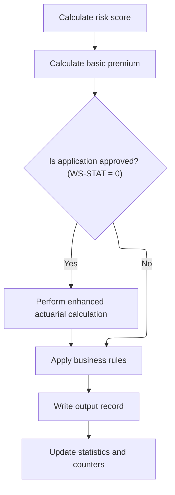

<SwmSnippet path="/base/src/LGAPDB01.cbl" line="258">

---

After enhanced calculations, we run business rules, write the output, and update stats for each policy.

```cobol
       P011-PROCESS-COMMERCIAL.
           PERFORM P011A-CALCULATE-RISK-SCORE
           PERFORM P011B-BASIC-PREMIUM-CALC
           IF WS-STAT = 0
               PERFORM P011C-ENHANCED-ACTUARIAL-CALC
           END-IF
           PERFORM P011D-APPLY-BUSINESS-RULES
           PERFORM P011E-WRITE-OUTPUT-RECORD
           PERFORM P011F-UPDATE-STATISTICS.
```

---

</SwmSnippet>

<SwmSnippet path="/base/src/LGAPDB01.cbl" line="365">

---

<SwmToken path="base/src/LGAPDB01.cbl" pos="365:1:5" line-data="       P011F-UPDATE-STATISTICS.">`P011F-UPDATE-STATISTICS`</SwmToken> is where we update all the running totals and counters after each policy is processed. It adds the policy's premium and risk score to the aggregates, then increments the approved, pending, or rejected counter based on <SwmToken path="base/src/LGAPDB01.cbl" pos="369:3:5" line-data="           EVALUATE WS-STAT">`WS-STAT`</SwmToken> (which is assumed to only be 0, 1, or 2). If the risk score is above 200, it bumps the high-risk counter. The 200 cutoff is arbitrary and not documented, but it directly affects how many policies are flagged as high risk.

```cobol
       P011F-UPDATE-STATISTICS.
           ADD WS-TOT-PREM TO WS-TOTAL-PREMIUM-AMT
           ADD WS-BASE-RISK-SCR TO WS-CONTROL-TOTALS
           
           EVALUATE WS-STAT
               WHEN 0 ADD 1 TO WS-APPROVED-CNT
               WHEN 1 ADD 1 TO WS-PENDING-CNT
               WHEN 2 ADD 1 TO WS-REJECTED-CNT
           END-EVALUATE
           
           IF WS-BASE-RISK-SCR > 200
               ADD 1 TO WS-HIGH-RISK-CNT
           END-IF.
```

---

</SwmSnippet>

&nbsp;

*This is an auto-generated document by Swimm 🌊 and has not yet been verified by a human*

<SwmMeta version="3.0.0" repo-id="Z2l0aHViJTNBJTNBU3dpbW1pby1nZW5hcHAtbW90b3IlM0ElM0FHaXJpLVN3aW1t" repo-name="Swimmio-genapp-motor"><sup>Powered by [Swimm](https://app.swimm.io/)</sup></SwmMeta>
