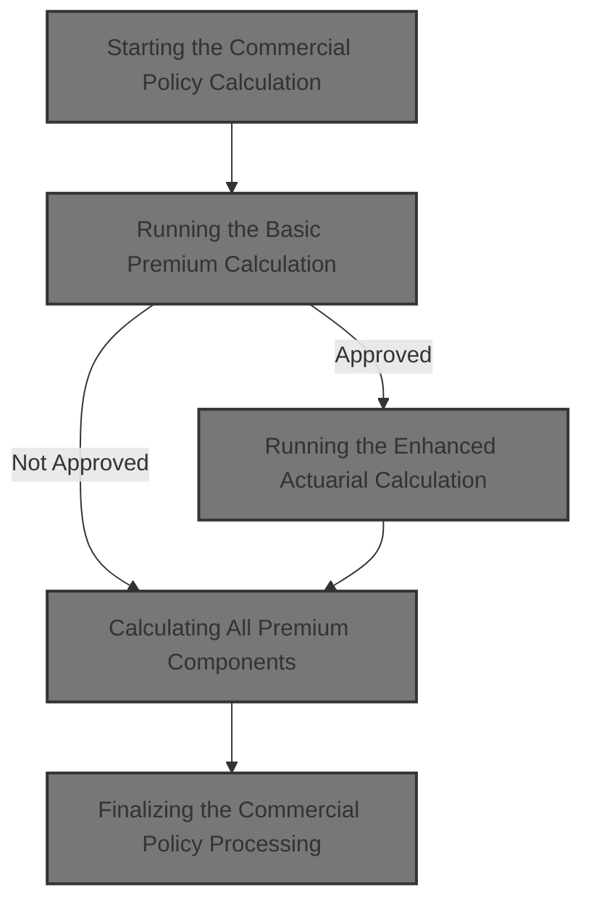
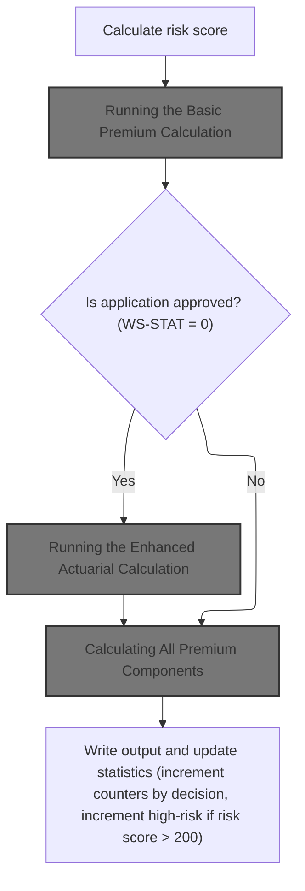
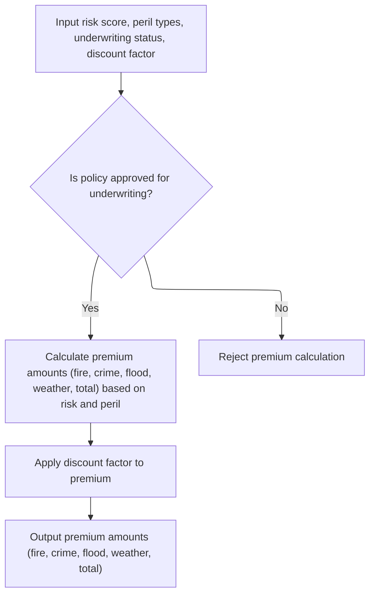
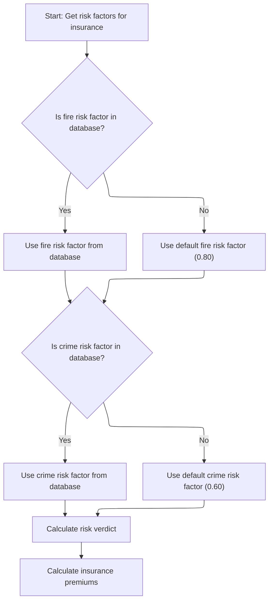
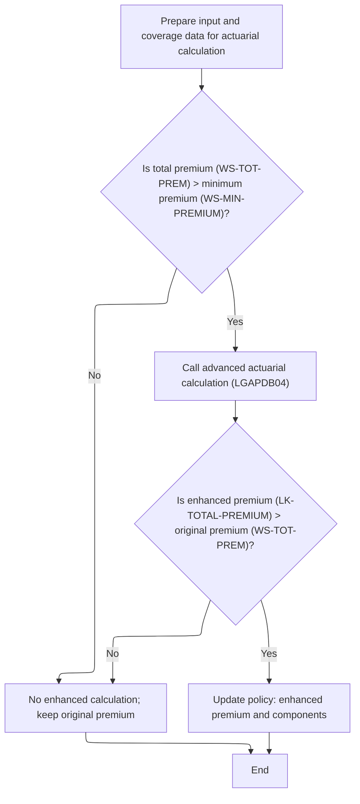
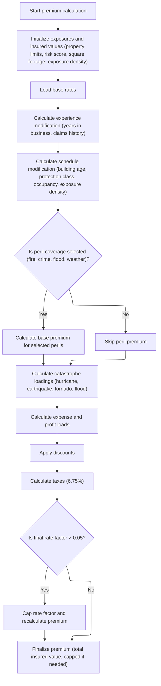
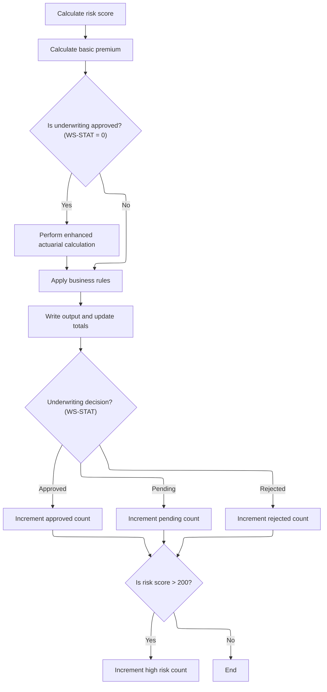

This document describes how a commercial insurance application is processed, from risk evaluation to premium calculation and underwriting decision. The flow receives application data, calculates risk and premiums, applies business rules, and updates reporting statistics. For approved applications, an enhanced actuarial calculation is performed.



# Spec

## Detailed View of the Program's Functionality

a. File and Data Setup

The main program begins by defining the files it will use for input, output, configuration, rates, and summary. Each file is associated with a specific structure, such as the input and output record layouts, configuration records, rate records, and summary records. The program also sets up working storage for counters, configuration values (like maximum risk score and minimum premium), and areas for actuarial calculations.

b. Program Initialization

At startup, the program initializes counters and working storage areas, displays a startup message, and records the processing date. It then attempts to load configuration values from a configuration file. If the file is not available, it falls back to default values. The configuration values loaded include the maximum risk score and minimum premium.

c. File Opening and Header Writing

The program opens all necessary files: input, output, and summary. If any file fails to open, it displays an error and stops. After opening the files, it writes a header row to the output file to label the columns for the results.

d. Main Processing Loop

The program reads each record from the input file in a loop. For each record, it increments a record counter and validates the input. Validation checks include ensuring the policy type is supported, the customer number is present, and at least one coverage limit is provided. If the total coverage exceeds the maximum allowed, it logs a warning. If validation fails, it logs the error and writes an error record to the output.

e. Commercial Policy Processing

For valid commercial policy records, the program performs the following steps:

1. **Risk Score Calculation**: Calls an external module to calculate the risk score based on property and customer data.
2. **Basic Premium Calculation**: Calls another module to calculate the initial premium for each peril (fire, crime, flood, weather) and to determine the underwriting status (approved, pending, rejected).
3. **Enhanced Actuarial Calculation**: If the basic calculation results in an approved status, and the total premium exceeds the minimum, the program prepares detailed input and coverage data and calls an advanced actuarial calculation module. If the enhanced premium is higher than the original, it updates all premium fields and the experience modifier.
4. **Business Rules Application**: The program applies business rules to determine the final underwriting decision. If the risk score exceeds the maximum, the policy is rejected. If the premium is below the minimum or the risk score is high, the policy is marked as pending. Otherwise, it is approved.
5. **Output Writing**: The program writes the results (customer, property, risk score, premiums, status, and rejection reason if any) to the output file.
6. **Statistics Update**: The program updates running totals for premium, risk score, and increments counters for approved, pending, rejected, and high-risk policies.

f. Basic Premium Calculation Module (LGAPDB03)

This module performs three main actions:

1. **Risk Factor Retrieval**: Attempts to fetch fire and crime risk factors from a database. If not found, it uses default values (0.80 for fire, 0.60 for crime).
2. **Underwriting Verdict**: Sets the underwriting status based on the risk score: rejected if above 200, pending if above 150, approved otherwise.
3. **Premium Calculation**: Calculates the premium for each peril by multiplying the risk score, peril factor, and a discount factor. If all perils are selected, a larger discount is applied. The total premium is the sum of all peril premiums.

g. Enhanced Actuarial Calculation Module (LGAPDB04)

This advanced module performs a detailed actuarial calculation:

 1. **Exposure Calculation**: Adjusts building, contents, and business interruption exposures based on the risk score. Sums these for total insured value and calculates exposure density.
 2. **Base Rate Loading**: Loads base rates for each peril from a database, using territory, construction, occupancy, and peril codes. If not found, defaults are used.
 3. **Experience Modifier**: Adjusts for years in business and claims history, capping the modifier between 0.5 and 2.0.
 4. **Schedule Modifier**: Adjusts for building age, protection class, occupancy, and exposure density, capping between -0.2 and +0.4.
 5. **Base Premium Calculation**: Calculates the premium for each selected peril using exposures, base rates, modifiers, and trend factors. Sums these for the base amount.
 6. **Catastrophe Loadings**: Adds loadings for hurricane, earthquake, tornado, and flood, depending on peril selection.
 7. **Expense and Profit Loads**: Adds expense and profit margins to the premium.
 8. **Discounts**: Applies discounts for multi-peril selection, claims-free history, and high deductibles, capping the total discount at 25%.
 9. **Tax Calculation**: Calculates taxes on the subtotal after discounts.
10. **Final Premium Calculation**: Sums all components, subtracts discounts, adds taxes, and calculates the final rate factor. If the rate factor exceeds a cap, the premium is recalculated at the capped rate.

h. Output and Statistics

After processing each record, the program writes the results to the output file. It then updates statistics: total premium, total risk score, and counters for approved, pending, rejected, and high-risk policies. At the end of processing, it closes all files, generates a summary report with totals and averages, and displays the final statistics to the user.

# Rule Definition

| Paragraph Name                                                                    | Rule ID | Category          | Description                                                                                                                     | Conditions                                                                 | Remarks                                                                                                                                                                                                                                                                                                                                          |
| --------------------------------------------------------------------------------- | ------- | ----------------- | ------------------------------------------------------------------------------------------------------------------------------- | -------------------------------------------------------------------------- | ------------------------------------------------------------------------------------------------------------------------------------------------------------------------------------------------------------------------------------------------------------------------------------------------------------------------------------------------ |
| P011A-CALCULATE-RISK-SCORE                                                        | RL-001  | Computation       | The system must calculate a risk score for each commercial policy application using provided input fields.                      | Policy type must be commercial.                                            | Risk score is a numeric value (up to 3 digits).                                                                                                                                                                                                                                                                                                  |
| P011B-BASIC-PREMIUM-CALC, LGAPDB03 MAIN-LOGIC, CALCULATE-PREMIUMS                 | RL-002  | Computation       | The system calculates basic premiums for each peril (fire, crime, flood, weather) using the risk score and peril flags.         | Policy type must be commercial.                                            | Premiums are numeric values (up to 8 digits plus 2 decimals for each peril, total premium up to 9 digits plus 2 decimals). Peril factors: fire=0.80, crime=0.60, flood=1.20, weather=0.90. Discount factor is 0.90 if all perils selected, otherwise 1.00.                                                                                       |
| P011D-APPLY-BUSINESS-RULES, LGAPDB03 CALCULATE-VERDICT                            | RL-003  | Conditional Logic | The system assigns a status (APPROVED, PENDING, REJECTED) based on risk score and premium values.                               | Policy type must be commercial; risk score and premium must be calculated. | Status is alphanumeric (APPROVED, PENDING, REJECTED). Rejection reason is a string (up to 50 characters). Constants: max risk score=250, min premium=500.00, pending threshold risk score=180.                                                                                                                                                   |
| P011C-ENHANCED-ACTUARIAL-CALC, LGAPDB04 P100-MAIN and subparagraphs               | RL-004  | Computation       | For approved policies, the system performs an enhanced actuarial calculation using all customer, property, and coverage fields. | Policy status must be APPROVED and total premium > minimum premium.        | Premium breakdown includes fire_premium, crime_premium, flood_premium, weather_premium, total_premium, base_amount, cat_load_amt, expense_load_amt, profit_load_amt, discount_amt, tax_amt, experience_mod, schedule_mod, final_rate_factor (capped at 0.05). All are numeric fields with specified sizes.                                       |
| LGAPDB03 CALCULATE-PREMIUMS, LGAPDB04 P900-DISC                                   | RL-005  | Conditional Logic | The system applies a discount factor to the premium if all perils are selected.                                                 | All peril flags (fire, crime, flood, weather) are non-zero.                | Discount factor is numeric (0.90 if all perils, 1.00 otherwise).                                                                                                                                                                                                                                                                                 |
| P011E-WRITE-OUTPUT-RECORD, P010-PROCESS-ERROR-RECORD, P012-PROCESS-NON-COMMERCIAL | RL-006  | Data Assignment   | The system writes an output record for each processed policy, including all required fields and rejection reason if applicable. | Policy record has been processed (valid or error).                         | Output record includes: customer_num (string, 10), property_type (string, 15), postcode (string, 10), risk_score (number, 3), fire_premium, crime_premium, flood_premium, weather_premium (number, 8+2), total_premium (number, 9+2), status (string, 20), rejection_reason (string, 50). Fields are left-aligned, padded with spaces if needed. |
| P011F-UPDATE-STATISTICS                                                           | RL-007  | Computation       | The system updates reporting counters after each policy is processed.                                                           | Policy record has been processed.                                          | Counters: approved_count, pending_count, rejected_count, high_risk_count, total_premium_amt, avg_risk_score. All are numeric fields.                                                                                                                                                                                                             |
| P015-GENERATE-SUMMARY, P016-DISPLAY-STATS                                         | RL-008  | Data Assignment   | The system provides reporting counters and summary statistics at the end of processing.                                         | All policy records have been processed.                                    | Summary includes: approved_count, pending_count, rejected_count, high_risk_count, total_premium_amt, avg_risk_score (total risk score divided by processed count). All are numeric fields, displayed and written to summary file.                                                                                                                |

# User Stories

## User Story 1: Calculate risk score and basic premiums for commercial policies

---

### Story Description:

As a commercial policy applicant, I want the system to calculate a risk score and basic premiums for each peril so that my policy application can be evaluated accurately and fairly.

---

### Business Rule Mapping:

| Rule ID | Paragraph Name                                                    | Rule Description                                                                                                        |
| ------- | ----------------------------------------------------------------- | ----------------------------------------------------------------------------------------------------------------------- |
| RL-002  | P011B-BASIC-PREMIUM-CALC, LGAPDB03 MAIN-LOGIC, CALCULATE-PREMIUMS | The system calculates basic premiums for each peril (fire, crime, flood, weather) using the risk score and peril flags. |
| RL-001  | P011A-CALCULATE-RISK-SCORE                                        | The system must calculate a risk score for each commercial policy application using provided input fields.              |
| RL-005  | LGAPDB03 CALCULATE-PREMIUMS, LGAPDB04 P900-DISC                   | The system applies a discount factor to the premium if all perils are selected.                                         |

---

### Relevant Functionality:

- **P011B-BASIC-PREMIUM-CALC**
  1. **RL-002:**
     - For each commercial policy:
       - For each peril, if selected:
         - Compute premium = (risk score \* peril factor) \* peril flag \* discount factor
       - Sum all peril premiums for total premium
       - Set discount factor to 0.90 if all perils selected, else 1.00
- **P011A-CALCULATE-RISK-SCORE**
  1. **RL-001:**
     - For each commercial policy input:
       - Call risk score calculation module with property, location, coverage, and customer history fields.
       - Store the resulting risk score for further processing.
- **LGAPDB03 CALCULATE-PREMIUMS**
  1. **RL-005:**
     - If all peril flags are non-zero:
       - Set discount factor to 0.90
     - Else:
       - Set discount factor to 1.00

## User Story 2: Assign underwriting status, perform enhanced actuarial calculation, write output record, and update reporting counters

---

### Story Description:

As a commercial policy applicant and system administrator, I want the system to determine the underwriting status of each policy, perform enhanced actuarial calculations for approved policies, write output records, and update reporting counters so that policy decisions, premium breakdowns, and statistics are accurately processed and tracked.

---

### Business Rule Mapping:

| Rule ID | Paragraph Name                                                                    | Rule Description                                                                                                                |
| ------- | --------------------------------------------------------------------------------- | ------------------------------------------------------------------------------------------------------------------------------- |
| RL-004  | P011C-ENHANCED-ACTUARIAL-CALC, LGAPDB04 P100-MAIN and subparagraphs               | For approved policies, the system performs an enhanced actuarial calculation using all customer, property, and coverage fields. |
| RL-007  | P011F-UPDATE-STATISTICS                                                           | The system updates reporting counters after each policy is processed.                                                           |
| RL-003  | P011D-APPLY-BUSINESS-RULES, LGAPDB03 CALCULATE-VERDICT                            | The system assigns a status (APPROVED, PENDING, REJECTED) based on risk score and premium values.                               |
| RL-006  | P011E-WRITE-OUTPUT-RECORD, P010-PROCESS-ERROR-RECORD, P012-PROCESS-NON-COMMERCIAL | The system writes an output record for each processed policy, including all required fields and rejection reason if applicable. |

---

### Relevant Functionality:

- **P011C-ENHANCED-ACTUARIAL-CALC**
  1. **RL-004:**
     - If policy is approved and total premium > minimum premium:
       - Prepare input structure with all customer, property, and coverage fields
       - Call actuarial calculation module
       - Calculate exposure, base rates, experience mod, schedule mod, peril premiums, cat loading, expense, profit, discount, tax
       - Cap final rate factor at 0.05 if needed
       - Update premium breakdown fields
- **P011F-UPDATE-STATISTICS**
  1. **RL-007:**
     - After processing each policy:
       - Increment approved_count if status is APPROVED
       - Increment pending_count if status is PENDING
       - Increment rejected_count if status is REJECTED
       - Increment high_risk_count if risk score > 200
       - Add total premium to total_premium_amt
       - Add risk score to running total for avg_risk_score
- **P011D-APPLY-BUSINESS-RULES**
  1. **RL-003:**
     - If risk score > 250:
       - Status = REJECTED, reason = 'Risk score exceeds maximum acceptable level'
     - Else if total premium < 500.00:
       - Status = PENDING, reason = 'Premium below minimum - requires review'
     - Else if risk score > 180:
       - Status = PENDING, reason = 'High risk - underwriter review required'
     - Else:
       - Status = APPROVED, reason = blank
- **P011E-WRITE-OUTPUT-RECORD**
  1. **RL-006:**
     - For each processed policy:
       - Assign all output fields from calculated or input values
       - Write output record to output file

## User Story 3: Provide summary statistics and reporting counters

---

### Story Description:

As a system administrator, I want the system to provide summary statistics and reporting counters at the end of processing so that I can review overall performance and outcomes.

---

### Business Rule Mapping:

| Rule ID | Paragraph Name                            | Rule Description                                                                        |
| ------- | ----------------------------------------- | --------------------------------------------------------------------------------------- |
| RL-007  | P011F-UPDATE-STATISTICS                   | The system updates reporting counters after each policy is processed.                   |
| RL-008  | P015-GENERATE-SUMMARY, P016-DISPLAY-STATS | The system provides reporting counters and summary statistics at the end of processing. |

---

### Relevant Functionality:

- **P011F-UPDATE-STATISTICS**
  1. **RL-007:**
     - After processing each policy:
       - Increment approved_count if status is APPROVED
       - Increment pending_count if status is PENDING
       - Increment rejected_count if status is REJECTED
       - Increment high_risk_count if risk score > 200
       - Add total premium to total_premium_amt
       - Add risk score to running total for avg_risk_score
- **P015-GENERATE-SUMMARY**
  1. **RL-008:**
     - At end of processing:
       - Calculate avg_risk_score = total risk score / processed count
       - Write summary record with all counters
       - Display statistics to user

# Code Walkthrough

## Starting the Commercial Policy Calculation



<SwmSnippet path="/base/src/LGAPDB01.cbl" line="258">

---

In `P011-PROCESS-COMMERCIAL` we kick off the flow by calculating the risk score and then immediately call P011B-BASIC-PREMIUM-CALC to get initial premium values and a risk verdict. This sets up the rest of the flow, since the result of the basic premium calc determines if we need to run the enhanced actuarial calculation (for approved cases).

```cobol
       P011-PROCESS-COMMERCIAL.
           PERFORM P011A-CALCULATE-RISK-SCORE
           PERFORM P011B-BASIC-PREMIUM-CALC
           IF WS-STAT = 0
               PERFORM P011C-ENHANCED-ACTUARIAL-CALC
           END-IF
           PERFORM P011D-APPLY-BUSINESS-RULES
           PERFORM P011E-WRITE-OUTPUT-RECORD
           PERFORM P011F-UPDATE-STATISTICS.
```

---

</SwmSnippet>

### Running the Basic Premium Calculation



<SwmSnippet path="/base/src/LGAPDB01.cbl" line="275">

---

`P011B-BASIC-PREMIUM-CALC` calls LGAPDB03, which grabs risk factors, sets the verdict, and calculates premiums for each peril. We need this call because it gives us the initial premium breakdown and risk status, which drives the next steps.

```cobol
       P011B-BASIC-PREMIUM-CALC.
           CALL 'LGAPDB03' USING WS-BASE-RISK-SCR, IN-FIRE-PERIL, 
                                IN-CRIME-PERIL, IN-FLOOD-PERIL, 
                                IN-WEATHER-PERIL, WS-STAT,
                                WS-STAT-DESC, WS-REJ-RSN, WS-FR-PREM,
                                WS-CR-PREM, WS-FL-PREM, WS-WE-PREM,
                                WS-TOT-PREM, WS-DISC-FACT.
```

---

</SwmSnippet>

### Assessing Risk and Calculating Initial Premiums



<SwmSnippet path="/base/src/LGAPDB03.cbl" line="42">

---

`MAIN-LOGIC` runs the risk factor fetch, then calculates the verdict and premiums. We call GET-RISK-FACTORS first to make sure we have the right multipliers for fire and crime, even if the database is missing data (defaults are used).

```cobol
       MAIN-LOGIC.
           PERFORM GET-RISK-FACTORS
           PERFORM CALCULATE-VERDICT
           PERFORM CALCULATE-PREMIUMS
           GOBACK.
```

---

</SwmSnippet>

<SwmSnippet path="/base/src/LGAPDB03.cbl" line="48">

---

`GET-RISK-FACTORS` tries to fetch fire and crime risk factors from the database. If the query fails, it just sets them to 0.80 and 0.60. The code assumes the table and variables are set up right, but doesn't check. This fallback keeps the flow running even if the DB is missing data.

```cobol
       GET-RISK-FACTORS.
           EXEC SQL
               SELECT FACTOR_VALUE INTO :WS-FIRE-FACTOR
               FROM RISK_FACTORS
               WHERE PERIL_TYPE = 'FIRE'
           END-EXEC.
           
           IF SQLCODE = 0
               CONTINUE
           ELSE
               MOVE 0.80 TO WS-FIRE-FACTOR
           END-IF.
           
           EXEC SQL
               SELECT FACTOR_VALUE INTO :WS-CRIME-FACTOR
               FROM RISK_FACTORS
               WHERE PERIL_TYPE = 'CRIME'
           END-EXEC.
           
           IF SQLCODE = 0
               CONTINUE
           ELSE
               MOVE 0.60 TO WS-CRIME-FACTOR
           END-IF.
```

---

</SwmSnippet>

### Running the Enhanced Actuarial Calculation



<SwmSnippet path="/base/src/LGAPDB01.cbl" line="283">

---

`P011C-ENHANCED-ACTUARIAL-CALC` sets up the input and coverage data, then calls LGAPDB04 if the total premium is above 500. If the enhanced calculation gives a higher premium, we update all the premium fields and the experience modifier. The code assumes all input data is valid and that LGAPDB04 returns the right output.

```cobol
       P011C-ENHANCED-ACTUARIAL-CALC.
      *    Prepare input structure for actuarial calculation
           MOVE IN-CUSTOMER-NUM TO LK-CUSTOMER-NUM
           MOVE WS-BASE-RISK-SCR TO LK-RISK-SCORE
           MOVE IN-PROPERTY-TYPE TO LK-PROPERTY-TYPE
           MOVE IN-TERRITORY-CODE TO LK-TERRITORY
           MOVE IN-CONSTRUCTION-TYPE TO LK-CONSTRUCTION-TYPE
           MOVE IN-OCCUPANCY-CODE TO LK-OCCUPANCY-CODE
           MOVE IN-SPRINKLER-IND TO LK-PROTECTION-CLASS
           MOVE IN-YEAR-BUILT TO LK-YEAR-BUILT
           MOVE IN-SQUARE-FOOTAGE TO LK-SQUARE-FOOTAGE
           MOVE IN-YEARS-IN-BUSINESS TO LK-YEARS-IN-BUSINESS
           MOVE IN-CLAIMS-COUNT-3YR TO LK-CLAIMS-COUNT-5YR
           MOVE IN-CLAIMS-AMOUNT-3YR TO LK-CLAIMS-AMOUNT-5YR
           
      *    Set coverage data
           MOVE IN-BUILDING-LIMIT TO LK-BUILDING-LIMIT
           MOVE IN-CONTENTS-LIMIT TO LK-CONTENTS-LIMIT
           MOVE IN-BI-LIMIT TO LK-BI-LIMIT
           MOVE IN-FIRE-DEDUCTIBLE TO LK-FIRE-DEDUCTIBLE
           MOVE IN-WIND-DEDUCTIBLE TO LK-WIND-DEDUCTIBLE
           MOVE IN-FLOOD-DEDUCTIBLE TO LK-FLOOD-DEDUCTIBLE
           MOVE IN-OTHER-DEDUCTIBLE TO LK-OTHER-DEDUCTIBLE
           MOVE IN-FIRE-PERIL TO LK-FIRE-PERIL
           MOVE IN-CRIME-PERIL TO LK-CRIME-PERIL
           MOVE IN-FLOOD-PERIL TO LK-FLOOD-PERIL
           MOVE IN-WEATHER-PERIL TO LK-WEATHER-PERIL
           
      *    Call advanced actuarial calculation program (only for approved cases)
           IF WS-TOT-PREM > WS-MIN-PREMIUM
               CALL 'LGAPDB04' USING LK-INPUT-DATA, LK-COVERAGE-DATA, 
                                    LK-OUTPUT-RESULTS
               
      *        Update with enhanced calculations if successful
               IF LK-TOTAL-PREMIUM > WS-TOT-PREM
                   MOVE LK-FIRE-PREMIUM TO WS-FR-PREM
                   MOVE LK-CRIME-PREMIUM TO WS-CR-PREM
                   MOVE LK-FLOOD-PREMIUM TO WS-FL-PREM
                   MOVE LK-WEATHER-PREMIUM TO WS-WE-PREM
                   MOVE LK-TOTAL-PREMIUM TO WS-TOT-PREM
                   MOVE LK-EXPERIENCE-MOD TO WS-EXPERIENCE-MOD
               END-IF
           END-IF.
```

---

</SwmSnippet>

### Calculating All Premium Components



<SwmSnippet path="/base/src/LGAPDB04.cbl" line="138">

---

`P100-MAIN` runs through all the premium calculation steps: exposure, experience, schedule, base premium, catastrophe load, expenses, discounts, taxes, and final premium. Each step builds on the previous, so we get a detailed breakdown for the policy.

```cobol
       P100-MAIN.
           PERFORM P200-INIT
           PERFORM P300-RATES
           PERFORM P350-EXPOSURE
           PERFORM P400-EXP-MOD
           PERFORM P500-SCHED-MOD
           PERFORM P600-BASE-PREM
           PERFORM P700-CAT-LOAD
           PERFORM P800-EXPENSE
           PERFORM P900-DISC
           PERFORM P950-TAXES
           PERFORM P999-FINAL
           GOBACK.
```

---

</SwmSnippet>

<SwmSnippet path="/base/src/LGAPDB04.cbl" line="152">

---

`P200-INIT` calculates exposures for building, contents, and BI by scaling the limits with a risk score adjustment. Then it sums them for total insured value, and divides by square footage for exposure density (or uses 100.00 if square footage is zero). The scaling constants and fallback are domain-specific.

```cobol
       P200-INIT.
           INITIALIZE WS-CALCULATION-AREAS
           INITIALIZE WS-BASE-RATE-TABLE
           
           COMPUTE WS-BUILDING-EXPOSURE = 
               LK-BUILDING-LIMIT * (1 + (LK-RISK-SCORE - 100) / 1000)
               
           COMPUTE WS-CONTENTS-EXPOSURE = 
               LK-CONTENTS-LIMIT * (1 + (LK-RISK-SCORE - 100) / 1000)
               
           COMPUTE WS-BI-EXPOSURE = 
               LK-BI-LIMIT * (1 + (LK-RISK-SCORE - 100) / 1000)
               
           COMPUTE WS-TOTAL-INSURED-VAL = 
               WS-BUILDING-EXPOSURE + WS-CONTENTS-EXPOSURE + 
               WS-BI-EXPOSURE
               
           IF LK-SQUARE-FOOTAGE > ZERO
               COMPUTE WS-EXPOSURE-DENSITY = 
                   WS-TOTAL-INSURED-VAL / LK-SQUARE-FOOTAGE
           ELSE
               MOVE 100.00 TO WS-EXPOSURE-DENSITY
           END-IF.
```

---

</SwmSnippet>

<SwmSnippet path="/base/src/LGAPDB04.cbl" line="234">

---

`P400-EXP-MOD` sets the experience modifier based on years in business and claims history. It uses constants for thresholds and clamps the result between 0.5000 and 2.0000. The code assumes all input variables are valid and doesn't check for zero insured value.

```cobol
       P400-EXP-MOD.
           MOVE 1.0000 TO WS-EXPERIENCE-MOD
           
           IF LK-YEARS-IN-BUSINESS >= 5
               IF LK-CLAIMS-COUNT-5YR = ZERO
                   MOVE 0.8500 TO WS-EXPERIENCE-MOD
               ELSE
                   COMPUTE WS-EXPERIENCE-MOD = 
                       1.0000 + 
                       ((LK-CLAIMS-AMOUNT-5YR / WS-TOTAL-INSURED-VAL) * 
                        WS-CREDIBILITY-FACTOR * 0.50)
                   
                   IF WS-EXPERIENCE-MOD > 2.0000
                       MOVE 2.0000 TO WS-EXPERIENCE-MOD
                   END-IF
                   
                   IF WS-EXPERIENCE-MOD < 0.5000
                       MOVE 0.5000 TO WS-EXPERIENCE-MOD
                   END-IF
               END-IF
           ELSE
               MOVE 1.1000 TO WS-EXPERIENCE-MOD
           END-IF
           
           MOVE WS-EXPERIENCE-MOD TO LK-EXPERIENCE-MOD.
```

---

</SwmSnippet>

<SwmSnippet path="/base/src/LGAPDB04.cbl" line="260">

---

`P500-SCHED-MOD` builds the schedule modifier by adjusting for building age, protection class, occupancy code, and exposure density, using fixed constants and ranges. The result is capped between -0.200 and +0.400. The code assumes all inputs are valid and formatted right.

```cobol
       P500-SCHED-MOD.
           MOVE +0.000 TO WS-SCHEDULE-MOD
           
      *    Building age factor
           EVALUATE TRUE
               WHEN LK-YEAR-BUILT >= 2010
                   SUBTRACT 0.050 FROM WS-SCHEDULE-MOD
               WHEN LK-YEAR-BUILT >= 1990
                   CONTINUE
               WHEN LK-YEAR-BUILT >= 1970
                   ADD 0.100 TO WS-SCHEDULE-MOD
               WHEN OTHER
                   ADD 0.200 TO WS-SCHEDULE-MOD
           END-EVALUATE
           
      *    Protection class factor
           EVALUATE LK-PROTECTION-CLASS
               WHEN '01' THRU '03'
                   SUBTRACT 0.100 FROM WS-SCHEDULE-MOD
               WHEN '04' THRU '06'
                   SUBTRACT 0.050 FROM WS-SCHEDULE-MOD
               WHEN '07' THRU '09'
                   CONTINUE
               WHEN OTHER
                   ADD 0.150 TO WS-SCHEDULE-MOD
           END-EVALUATE
           
      *    Occupancy hazard factor
           EVALUATE LK-OCCUPANCY-CODE
               WHEN 'OFF01' THRU 'OFF05'
                   SUBTRACT 0.025 FROM WS-SCHEDULE-MOD
               WHEN 'MFG01' THRU 'MFG10'
                   ADD 0.075 TO WS-SCHEDULE-MOD
               WHEN 'WHS01' THRU 'WHS05'
                   ADD 0.125 TO WS-SCHEDULE-MOD
               WHEN OTHER
                   CONTINUE
           END-EVALUATE
           
      *    Exposure density factor
           IF WS-EXPOSURE-DENSITY > 500.00
               ADD 0.100 TO WS-SCHEDULE-MOD
           ELSE
               IF WS-EXPOSURE-DENSITY < 50.00
                   SUBTRACT 0.050 FROM WS-SCHEDULE-MOD
               END-IF
           END-IF
           
           IF WS-SCHEDULE-MOD > +0.400
               MOVE +0.400 TO WS-SCHEDULE-MOD
           END-IF
           
           IF WS-SCHEDULE-MOD < -0.200
               MOVE -0.200 TO WS-SCHEDULE-MOD
           END-IF
           
           MOVE WS-SCHEDULE-MOD TO LK-SCHEDULE-MOD.
```

---

</SwmSnippet>

<SwmSnippet path="/base/src/LGAPDB04.cbl" line="318">

---

`P600-BASE-PREM` calculates premiums for each peril if the corresponding flag is positive. It uses 0.80 for crime exposure and 1.25 for flood trend, which are hardcoded multipliers. Each premium is added to the base amount. The code assumes peril flags are numeric and positive when selected.

```cobol
       P600-BASE-PREM.
           MOVE ZERO TO LK-BASE-AMOUNT
           
      * FIRE PREMIUM
           IF LK-FIRE-PERIL > ZERO
               COMPUTE LK-FIRE-PREMIUM = 
                   (WS-BUILDING-EXPOSURE + WS-CONTENTS-EXPOSURE) *
                   WS-BASE-RATE (1, 1, 1, 1) * 
                   WS-EXPERIENCE-MOD *
                   (1 + WS-SCHEDULE-MOD) *
                   WS-TREND-FACTOR
                   
               ADD LK-FIRE-PREMIUM TO LK-BASE-AMOUNT
           END-IF
           
      * CRIME PREMIUM
           IF LK-CRIME-PERIL > ZERO
               COMPUTE LK-CRIME-PREMIUM = 
                   (WS-CONTENTS-EXPOSURE * 0.80) *
                   WS-BASE-RATE (2, 1, 1, 1) * 
                   WS-EXPERIENCE-MOD *
                   (1 + WS-SCHEDULE-MOD) *
                   WS-TREND-FACTOR
                   
               ADD LK-CRIME-PREMIUM TO LK-BASE-AMOUNT
           END-IF
           
      * FLOOD PREMIUM
           IF LK-FLOOD-PERIL > ZERO
               COMPUTE LK-FLOOD-PREMIUM = 
                   WS-BUILDING-EXPOSURE *
                   WS-BASE-RATE (3, 1, 1, 1) * 
                   WS-EXPERIENCE-MOD *
                   (1 + WS-SCHEDULE-MOD) *
                   WS-TREND-FACTOR * 1.25
                   
               ADD LK-FLOOD-PREMIUM TO LK-BASE-AMOUNT
           END-IF
           
      * WEATHER PREMIUM
           IF LK-WEATHER-PERIL > ZERO
               COMPUTE LK-WEATHER-PREMIUM = 
                   (WS-BUILDING-EXPOSURE + WS-CONTENTS-EXPOSURE) *
                   WS-BASE-RATE (4, 1, 1, 1) * 
                   WS-EXPERIENCE-MOD *
                   (1 + WS-SCHEDULE-MOD) *
                   WS-TREND-FACTOR
                   
               ADD LK-WEATHER-PREMIUM TO LK-BASE-AMOUNT
           END-IF.
```

---

</SwmSnippet>

<SwmSnippet path="/base/src/LGAPDB04.cbl" line="369">

---

`P700-CAT-LOAD` adds up catastrophe loadings for hurricane, earthquake, tornado, and flood, using peril-specific factors. It only applies hurricane and tornado if weather peril is selected, and flood loading if flood peril is selected. The code assumes peril indicators are numeric and positive.

```cobol
       P700-CAT-LOAD.
           MOVE ZERO TO WS-CAT-LOADING
           
      * Hurricane loading (wind/weather peril)
           IF LK-WEATHER-PERIL > ZERO
               COMPUTE WS-CAT-LOADING = WS-CAT-LOADING +
                   (LK-WEATHER-PREMIUM * WS-HURRICANE-FACTOR)
           END-IF
           
      * Earthquake loading (affects all perils)  
           COMPUTE WS-CAT-LOADING = WS-CAT-LOADING +
               (LK-BASE-AMOUNT * WS-EARTHQUAKE-FACTOR)
           
      * Tornado loading (weather peril primarily)
           IF LK-WEATHER-PERIL > ZERO
               COMPUTE WS-CAT-LOADING = WS-CAT-LOADING +
                   (LK-WEATHER-PREMIUM * WS-TORNADO-FACTOR)
           END-IF
           
      * Flood cat loading (if flood coverage selected)
           IF LK-FLOOD-PERIL > ZERO
               COMPUTE WS-CAT-LOADING = WS-CAT-LOADING +
                   (LK-FLOOD-PREMIUM * WS-FLOOD-FACTOR)
           END-IF
           
           MOVE WS-CAT-LOADING TO LK-CAT-LOAD-AMT.
```

---

</SwmSnippet>

<SwmSnippet path="/base/src/LGAPDB04.cbl" line="456">

---

`P950-TAXES` calculates the tax amount by summing base, catastrophe, expense, and profit loads, subtracting the discount, and multiplying by 0.0675 (the tax rate). The code assumes all inputs are valid monetary amounts.

```cobol
       P950-TAXES.
           COMPUTE WS-TAX-AMOUNT = 
               (LK-BASE-AMOUNT + LK-CAT-LOAD-AMT + 
                LK-EXPENSE-LOAD-AMT + LK-PROFIT-LOAD-AMT - 
                LK-DISCOUNT-AMT) * 0.0675
                
           MOVE WS-TAX-AMOUNT TO LK-TAX-AMT.
```

---

</SwmSnippet>

<SwmSnippet path="/base/src/LGAPDB04.cbl" line="464">

---

`P999-FINAL` adds up all the premium components, subtracts discounts, and then calculates the final rate factor as total premium divided by insured value. If the rate factor is above 0.050000, it's capped and the premium is recalculated. The code assumes insured value isn't zero.

```cobol
       P999-FINAL.
           COMPUTE LK-TOTAL-PREMIUM = 
               LK-BASE-AMOUNT + LK-CAT-LOAD-AMT + 
               LK-EXPENSE-LOAD-AMT + LK-PROFIT-LOAD-AMT -
               LK-DISCOUNT-AMT + LK-TAX-AMT
               
           COMPUTE LK-FINAL-RATE-FACTOR = 
               LK-TOTAL-PREMIUM / WS-TOTAL-INSURED-VAL
               
           IF LK-FINAL-RATE-FACTOR > 0.050000
               MOVE 0.050000 TO LK-FINAL-RATE-FACTOR
               COMPUTE LK-TOTAL-PREMIUM = 
                   WS-TOTAL-INSURED-VAL * LK-FINAL-RATE-FACTOR
           END-IF.
```

---

</SwmSnippet>

### Finalizing the Commercial Policy Processing



<SwmSnippet path="/base/src/LGAPDB01.cbl" line="258">

---

Back in `P011-PROCESS-COMMERCIAL`, after returning from P011C-ENHANCED-ACTUARIAL-CALC, we apply business rules, write the output record, and then call P011F-UPDATE-STATISTICS to update counters and totals for reporting and analysis.

```cobol
       P011-PROCESS-COMMERCIAL.
           PERFORM P011A-CALCULATE-RISK-SCORE
           PERFORM P011B-BASIC-PREMIUM-CALC
           IF WS-STAT = 0
               PERFORM P011C-ENHANCED-ACTUARIAL-CALC
           END-IF
           PERFORM P011D-APPLY-BUSINESS-RULES
           PERFORM P011E-WRITE-OUTPUT-RECORD
           PERFORM P011F-UPDATE-STATISTICS.
```

---

</SwmSnippet>

<SwmSnippet path="/base/src/LGAPDB01.cbl" line="365">

---

`P011F-UPDATE-STATISTICS` adds the premium and risk score to running totals, then increments the approved, pending, or rejected counter based on WS-STAT (0, 1, 2). If the risk score is above 200, it also bumps the high-risk counter. These stats are used for reporting and analysis.

```cobol
       P011F-UPDATE-STATISTICS.
           ADD WS-TOT-PREM TO WS-TOTAL-PREMIUM-AMT
           ADD WS-BASE-RISK-SCR TO WS-CONTROL-TOTALS
           
           EVALUATE WS-STAT
               WHEN 0 ADD 1 TO WS-APPROVED-CNT
               WHEN 1 ADD 1 TO WS-PENDING-CNT
               WHEN 2 ADD 1 TO WS-REJECTED-CNT
           END-EVALUATE
           
           IF WS-BASE-RISK-SCR > 200
               ADD 1 TO WS-HIGH-RISK-CNT
           END-IF.
```

---

</SwmSnippet>

&nbsp;

*This is an auto-generated document by Swimm 🌊 and has not yet been verified by a human*

<SwmMeta version="3.0.0" repo-id="Z2l0aHViJTNBJTNBU3dpbW1pby1nZW5hcHAtbW90b3IlM0ElM0FHaXJpLVN3aW1t" repo-name="Swimmio-genapp-motor"><sup>Powered by [Swimm](https://app.swimm.io/)</sup></SwmMeta>
