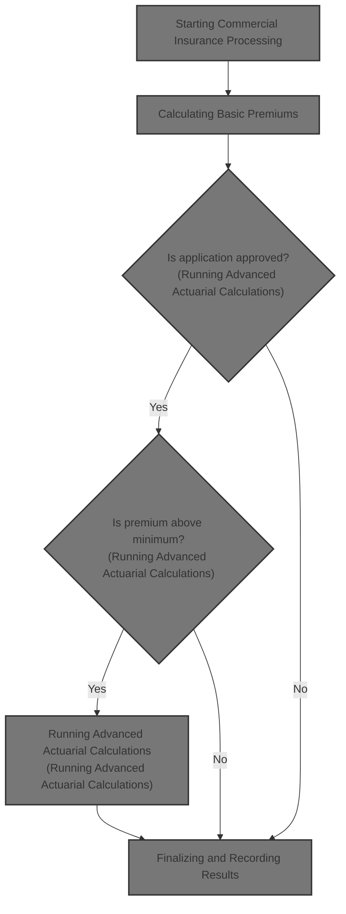
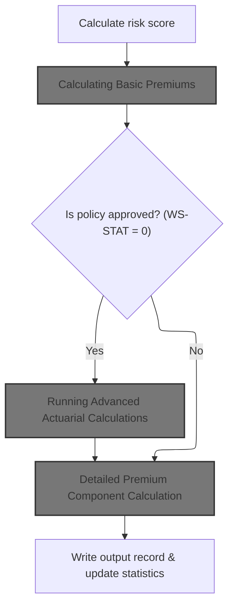
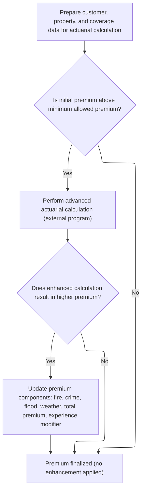
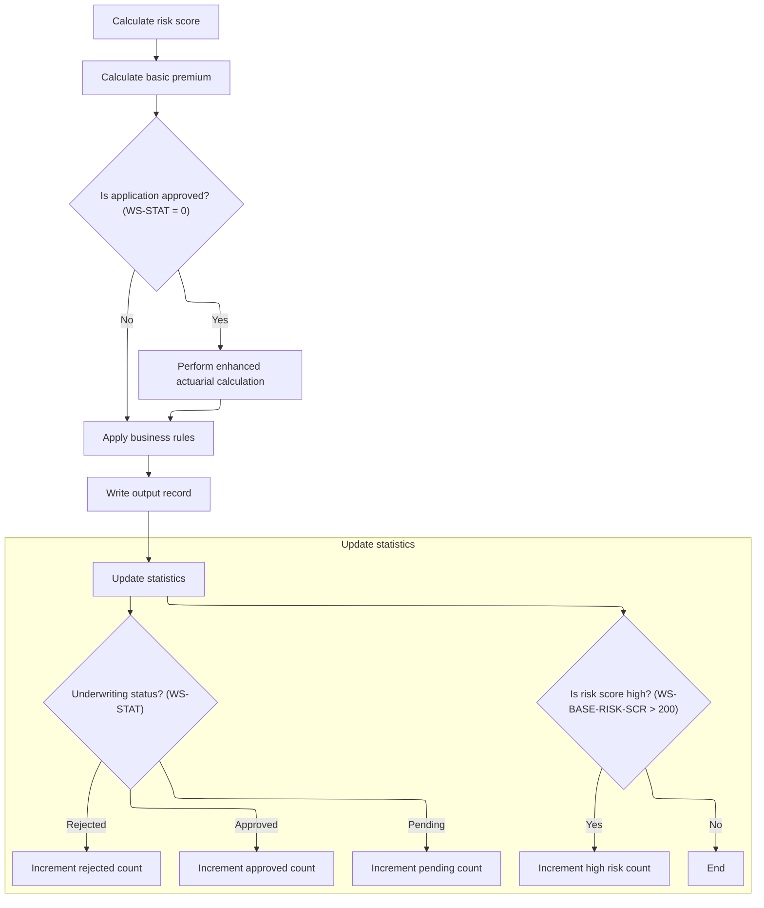

This document describes the flow for processing commercial insurance applications. The process starts with calculating the risk score and basic premiums using the application data. An underwriting decision is made based on risk thresholds, and if approved, advanced actuarial calculations refine the premium. The results are recorded, and summary statistics are updated to reflect the outcome.



# Starting Commercial Insurance Processing



<SwmSnippet path="/base/src/LGAPDB01.cbl" line="258">

---

In `P011-PROCESS-COMMERCIAL` we kick off the flow by calculating the risk score, then immediately call P011B-BASIC-PREMIUM-CALC to get the basic premium and update WS-STAT. This setup is needed because the next step (potentially running enhanced actuarial calculations) depends on WS-STAT being set to 0 (approved). The order here matters: if WS-STAT isn't set right, the advanced logic won't run as intended.

```cobol
       P011-PROCESS-COMMERCIAL.
           PERFORM P011A-CALCULATE-RISK-SCORE
           PERFORM P011B-BASIC-PREMIUM-CALC
           IF WS-STAT = 0
               PERFORM P011C-ENHANCED-ACTUARIAL-CALC
           END-IF
           PERFORM P011D-APPLY-BUSINESS-RULES
           PERFORM P011E-WRITE-OUTPUT-RECORD
           PERFORM P011F-UPDATE-STATISTICS.
```

---

</SwmSnippet>

## Calculating Basic Premiums

<SwmSnippet path="/base/src/LGAPDB01.cbl" line="275">

---

`P011B-BASIC-PREMIUM-CALC` calls LGAPDB03, passing all the risk and peril data. LGAPDB03 handles the actual risk factor lookup, verdict calculation, and premium computation, then returns updated status and premium values. This sets up everything needed for the next decision point.

```cobol
       P011B-BASIC-PREMIUM-CALC.
           CALL 'LGAPDB03' USING WS-BASE-RISK-SCR, IN-FIRE-PERIL, 
                                IN-CRIME-PERIL, IN-FLOOD-PERIL, 
                                IN-WEATHER-PERIL, WS-STAT,
                                WS-STAT-DESC, WS-REJ-RSN, WS-FR-PREM,
                                WS-CR-PREM, WS-FL-PREM, WS-WE-PREM,
                                WS-TOT-PREM, WS-DISC-FACT.
```

---

</SwmSnippet>

## Risk Factor Lookup and Premium Calculation

```mermaid
%%{init: {"flowchart": {"defaultRenderer": "elk"}} }%%
flowchart TD
    node1["Retrieve FIRE risk factor from database"] --> node2{"FIRE risk factor found?"}
    click node1 openCode "base/src/LGAPDB03.cbl:49:53"
    node2 -->|"Yes"| node3["Use database value"]
    click node3 openCode "base/src/LGAPDB03.cbl:55:56"
    node2 -->|"No"| node4["Use default value (0.80)"]
    click node4 openCode "base/src/LGAPDB03.cbl:58:59"
    node3 --> node5["Retrieve CRIME risk factor from database"]
    node4 --> node5
    click node5 openCode "base/src/LGAPDB03.cbl:62:64"
    node5 --> node6{"CRIME risk factor found?"}
    node6 -->|"Yes"| node7["Use database value"]
    click node7 openCode "base/src/LGAPDB03.cbl:67:68"
    node6 -->|"No"| node8["Use default value (0.60)"]
    click node8 openCode "base/src/LGAPDB03.cbl:70:71"
    node7 --> node9["Decide insurance verdict based on risk score"]
    node8 --> node9
    click node9 openCode "base/src/LGAPDB03.cbl:73:90"
    node9 --> node10{"Risk score > 200?"}
    node10 -->|"Yes"| node11["Reject policy"]
    click node11 openCode "base/src/LGAPDB03.cbl:74:78"
    node10 -->|"No"| node12{"Risk score > 150?"}
    node12 -->|"Yes"| node13["Pending review"]
    click node13 openCode "base/src/LGAPDB03.cbl:80:84"
    node12 -->|"No"| node14["Approve policy"]
    click node14 openCode "base/src/LGAPDB03.cbl:86:88"
    node11 --> node15["Calculate premiums"]
    node13 --> node15
    node14 --> node15
    click node15 openCode "base/src/LGAPDB03.cbl:92:120"
    node15 --> node16{"All perils covered?"}
    node16 -->|"Yes"| node17["Apply discount (0.90)"]
    click node17 openCode "base/src/LGAPDB03.cbl:95:99"
    node16 -->|"No"| node18["No discount (1.00)"]
    click node18 openCode "base/src/LGAPDB03.cbl:93:94"
    node17 --> node19["Compute premiums for FIRE, CRIME, FLOOD, WEATHER and total"]
    click node19 openCode "base/src/LGAPDB03.cbl:102:120"
    node18 --> node19
    node19 --> node20["Return verdict and total premium"]
    click node20 openCode "base/src/LGAPDB03.cbl:73:120"

classDef HeadingStyle fill:#777777,stroke:#333,stroke-width:2px;
```



<SwmSnippet path="/base/src/LGAPDB03.cbl" line="42">

---

`MAIN-LOGIC` runs the risk factor lookup, then uses those values to decide the underwriting verdict and calculate all the premium amounts. The order matters because the verdict and premiums depend on the risk factors being set first.

```cobol
       MAIN-LOGIC.
           PERFORM GET-RISK-FACTORS
           PERFORM CALCULATE-VERDICT
           PERFORM CALCULATE-PREMIUMS
           GOBACK.
```

---

</SwmSnippet>

<SwmSnippet path="/base/src/LGAPDB03.cbl" line="48">

---

`GET-RISK-FACTORS` pulls fire and crime factors from the database, but if the query fails, it just uses 0.80 for fire and 0.60 for crime. These defaults keep the flow moving even if the DB is down or missing data.

```cobol
       GET-RISK-FACTORS.
           EXEC SQL
               SELECT FACTOR_VALUE INTO :WS-FIRE-FACTOR
               FROM RISK_FACTORS
               WHERE PERIL_TYPE = 'FIRE'
           END-EXEC.
           
           IF SQLCODE = 0
               CONTINUE
           ELSE
               MOVE 0.80 TO WS-FIRE-FACTOR
           END-IF.
           
           EXEC SQL
               SELECT FACTOR_VALUE INTO :WS-CRIME-FACTOR
               FROM RISK_FACTORS
               WHERE PERIL_TYPE = 'CRIME'
           END-EXEC.
           
           IF SQLCODE = 0
               CONTINUE
           ELSE
               MOVE 0.60 TO WS-CRIME-FACTOR
           END-IF.
```

---

</SwmSnippet>

<SwmSnippet path="/base/src/LGAPDB03.cbl" line="73">

---

`CALCULATE-VERDICT` checks the risk score against hardcoded thresholds (200, 150) to set the status, description, and rejection reason. These numbers decide if a case is approved, pending, or rejected, and what message gets attached.

```cobol
       CALCULATE-VERDICT.
           IF LK-RISK-SCORE > 200
             MOVE 2 TO LK-STAT
             MOVE 'REJECTED' TO LK-STAT-DESC
             MOVE 'High Risk Score - Manual Review Required' 
               TO LK-REJ-RSN
           ELSE
             IF LK-RISK-SCORE > 150
               MOVE 1 TO LK-STAT
               MOVE 'PENDING' TO LK-STAT-DESC
               MOVE 'Medium Risk - Pending Review'
                 TO LK-REJ-RSN
             ELSE
               MOVE 0 TO LK-STAT
               MOVE 'APPROVED' TO LK-STAT-DESC
               MOVE SPACES TO LK-REJ-RSN
             END-IF
           END-IF.
```

---

</SwmSnippet>

<SwmSnippet path="/base/src/LGAPDB03.cbl" line="92">

---

`CALCULATE-PREMIUMS` sets a discount if all perils are covered, then computes each peril's premium using its factor, risk score, and peril value. Finally, it adds up all the premiums for the total.

```cobol
       CALCULATE-PREMIUMS.
           MOVE 1.00 TO LK-DISC-FACT
           
           IF LK-FIRE-PERIL > 0 AND
              LK-CRIME-PERIL > 0 AND
              LK-FLOOD-PERIL > 0 AND
              LK-WEATHER-PERIL > 0
             MOVE 0.90 TO LK-DISC-FACT
           END-IF

           COMPUTE LK-FIRE-PREMIUM =
             ((LK-RISK-SCORE * WS-FIRE-FACTOR) * LK-FIRE-PERIL *
               LK-DISC-FACT)
           
           COMPUTE LK-CRIME-PREMIUM =
             ((LK-RISK-SCORE * WS-CRIME-FACTOR) * LK-CRIME-PERIL *
               LK-DISC-FACT)
           
           COMPUTE LK-FLOOD-PREMIUM =
             ((LK-RISK-SCORE * WS-FLOOD-FACTOR) * LK-FLOOD-PERIL *
               LK-DISC-FACT)
           
           COMPUTE LK-WEATHER-PREMIUM =
             ((LK-RISK-SCORE * WS-WEATHER-FACTOR) * LK-WEATHER-PERIL *
               LK-DISC-FACT)

           COMPUTE LK-TOTAL-PREMIUM = 
             LK-FIRE-PREMIUM + LK-CRIME-PREMIUM + 
             LK-FLOOD-PREMIUM + LK-WEATHER-PREMIUM. 
```

---

</SwmSnippet>

## Running Advanced Actuarial Calculations



<SwmSnippet path="/base/src/LGAPDB01.cbl" line="283">

---

`P011C-ENHANCED-ACTUARIAL-CALC` sets up all the input and coverage data, then calls LGAPDB04 for advanced premium calculations if the basic premium is above the minimum. If the advanced result is higher, it updates the premium and related fields.

```cobol
       P011C-ENHANCED-ACTUARIAL-CALC.
      *    Prepare input structure for actuarial calculation
           MOVE IN-CUSTOMER-NUM TO LK-CUSTOMER-NUM
           MOVE WS-BASE-RISK-SCR TO LK-RISK-SCORE
           MOVE IN-PROPERTY-TYPE TO LK-PROPERTY-TYPE
           MOVE IN-TERRITORY-CODE TO LK-TERRITORY
           MOVE IN-CONSTRUCTION-TYPE TO LK-CONSTRUCTION-TYPE
           MOVE IN-OCCUPANCY-CODE TO LK-OCCUPANCY-CODE
           MOVE IN-SPRINKLER-IND TO LK-PROTECTION-CLASS
           MOVE IN-YEAR-BUILT TO LK-YEAR-BUILT
           MOVE IN-SQUARE-FOOTAGE TO LK-SQUARE-FOOTAGE
           MOVE IN-YEARS-IN-BUSINESS TO LK-YEARS-IN-BUSINESS
           MOVE IN-CLAIMS-COUNT-3YR TO LK-CLAIMS-COUNT-5YR
           MOVE IN-CLAIMS-AMOUNT-3YR TO LK-CLAIMS-AMOUNT-5YR
           
      *    Set coverage data
           MOVE IN-BUILDING-LIMIT TO LK-BUILDING-LIMIT
           MOVE IN-CONTENTS-LIMIT TO LK-CONTENTS-LIMIT
           MOVE IN-BI-LIMIT TO LK-BI-LIMIT
           MOVE IN-FIRE-DEDUCTIBLE TO LK-FIRE-DEDUCTIBLE
           MOVE IN-WIND-DEDUCTIBLE TO LK-WIND-DEDUCTIBLE
           MOVE IN-FLOOD-DEDUCTIBLE TO LK-FLOOD-DEDUCTIBLE
           MOVE IN-OTHER-DEDUCTIBLE TO LK-OTHER-DEDUCTIBLE
           MOVE IN-FIRE-PERIL TO LK-FIRE-PERIL
           MOVE IN-CRIME-PERIL TO LK-CRIME-PERIL
           MOVE IN-FLOOD-PERIL TO LK-FLOOD-PERIL
           MOVE IN-WEATHER-PERIL TO LK-WEATHER-PERIL
           
      *    Call advanced actuarial calculation program (only for approved cases)
           IF WS-TOT-PREM > WS-MIN-PREMIUM
               CALL 'LGAPDB04' USING LK-INPUT-DATA, LK-COVERAGE-DATA, 
                                    LK-OUTPUT-RESULTS
               
      *        Update with enhanced calculations if successful
               IF LK-TOTAL-PREMIUM > WS-TOT-PREM
                   MOVE LK-FIRE-PREMIUM TO WS-FR-PREM
                   MOVE LK-CRIME-PREMIUM TO WS-CR-PREM
                   MOVE LK-FLOOD-PREMIUM TO WS-FL-PREM
                   MOVE LK-WEATHER-PREMIUM TO WS-WE-PREM
                   MOVE LK-TOTAL-PREMIUM TO WS-TOT-PREM
                   MOVE LK-EXPERIENCE-MOD TO WS-EXPERIENCE-MOD
               END-IF
           END-IF.
```

---

</SwmSnippet>

## Detailed Premium Component Calculation

```mermaid
%%{init: {"flowchart": {"defaultRenderer": "elk"}} }%%
flowchart TD
    node1["Initialize exposures based on risk score and limits"]
    click node1 openCode "base/src/LGAPDB04.cbl:152:174"
    node1 --> node2["Calculate rates"]
    click node2 openCode "base/src/LGAPDB04.cbl:140:141"
    node2 --> node3{"Years in business >= 5 and claims count = 0?"}
    click node3 openCode "base/src/LGAPDB04.cbl:237:256"
    node3 -->|"Yes"| node4["Apply reduced experience modifier"]
    click node4 openCode "base/src/LGAPDB04.cbl:239:240"
    node3 -->|"No"| node5["Calculate experience modifier based on claims"]
    click node5 openCode "base/src/LGAPDB04.cbl:241:252"
    node4 --> node6["Calculate schedule modifier (building age, protection, occupancy, exposure density)"]
    node5 --> node6
    click node6 openCode "base/src/LGAPDB04.cbl:260:316"
    node6 --> node7["Calculate base premium, category load, expense load"]
    click node7 openCode "base/src/LGAPDB04.cbl:144:146"
    node7 --> node8{"Multi-peril coverage?"}
    click node8 openCode "base/src/LGAPDB04.cbl:411:423"
    node8 -->|"All perils covered"| node9["Apply maximum multi-peril discount"]
    click node9 openCode "base/src/LGAPDB04.cbl:416:416"
    node8 -->|"Partial perils covered"| node10["Apply partial multi-peril discount"]
    click node10 openCode "base/src/LGAPDB04.cbl:421:421"
    node9 --> node11{"Claims-free and >=5 years?"}
    node10 --> node11
    click node11 openCode "base/src/LGAPDB04.cbl:427:429"
    node11 -->|"Yes"| node12["Apply claims-free discount"]
    click node12 openCode "base/src/LGAPDB04.cbl:428:428"
    node11 -->|"No"| node13["No claims-free discount"]
    click node13 openCode "base/src/LGAPDB04.cbl:429:429"
    node12 --> node14{"High deductibles?"}
    node13 --> node14
    click node14 openCode "base/src/LGAPDB04.cbl:433:441"
    node14 -->|"Yes"| node15["Apply deductible credits"]
    click node15 openCode "base/src/LGAPDB04.cbl:434:440"
    node14 -->|"No"| node16["No deductible credits"]
    click node16 openCode "base/src/LGAPDB04.cbl:441:441"
    node15 --> node17["Sum all discounts"]
    node16 --> node17
    click node17 openCode "base/src/LGAPDB04.cbl:443:445"
    node17 --> node18{"Is total discount > 0.250?"}
    click node18 openCode "base/src/LGAPDB04.cbl:447:449"
    node18 -->|"Yes"| node19["Cap discount at 0.250"]
    click node19 openCode "base/src/LGAPDB04.cbl:448:448"
    node18 -->|"No"| node20["Use calculated discount"]
    click node20 openCode "base/src/LGAPDB04.cbl:450:450"
    node19 --> node21["Calculate taxes"]
    node20 --> node21
    click node21 openCode "base/src/LGAPDB04.cbl:148:148"
    node21 --> node22["Calculate final premium and rate factor"]
    click node22 openCode "base/src/LGAPDB04.cbl:464:472"
    node22 --> node23{"Is rate factor > 0.050000?"}
    click node23 openCode "base/src/LGAPDB04.cbl:473:477"
    node23 -->|"Yes"| node24["Cap rate factor and recalculate premium"]
    click node24 openCode "base/src/LGAPDB04.cbl:474:476"
    node23 -->|"No"| node25["Use calculated premium"]
    click node25 openCode "base/src/LGAPDB04.cbl:477:477"

classDef HeadingStyle fill:#777777,stroke:#333,stroke-width:2px;
```



<SwmSnippet path="/base/src/LGAPDB04.cbl" line="138">

---

`P100-MAIN` runs through all the premium component calculations in order: exposures, rates, modifiers, loadings, discounts, taxes, and then finalizes the premium and rate factor. Each step depends on the previous results.

```cobol
       P100-MAIN.
           PERFORM P200-INIT
           PERFORM P300-RATES
           PERFORM P350-EXPOSURE
           PERFORM P400-EXP-MOD
           PERFORM P500-SCHED-MOD
           PERFORM P600-BASE-PREM
           PERFORM P700-CAT-LOAD
           PERFORM P800-EXPENSE
           PERFORM P900-DISC
           PERFORM P950-TAXES
           PERFORM P999-FINAL
           GOBACK.
```

---

</SwmSnippet>

<SwmSnippet path="/base/src/LGAPDB04.cbl" line="152">

---

`P200-INIT` calculates exposures for building, contents, and BI using a risk score adjustment, then sums them for total insured value. Exposure density is calculated per square foot, or set to 100 if square footage is zero.

```cobol
       P200-INIT.
           INITIALIZE WS-CALCULATION-AREAS
           INITIALIZE WS-BASE-RATE-TABLE
           
           COMPUTE WS-BUILDING-EXPOSURE = 
               LK-BUILDING-LIMIT * (1 + (LK-RISK-SCORE - 100) / 1000)
               
           COMPUTE WS-CONTENTS-EXPOSURE = 
               LK-CONTENTS-LIMIT * (1 + (LK-RISK-SCORE - 100) / 1000)
               
           COMPUTE WS-BI-EXPOSURE = 
               LK-BI-LIMIT * (1 + (LK-RISK-SCORE - 100) / 1000)
               
           COMPUTE WS-TOTAL-INSURED-VAL = 
               WS-BUILDING-EXPOSURE + WS-CONTENTS-EXPOSURE + 
               WS-BI-EXPOSURE
               
           IF LK-SQUARE-FOOTAGE > ZERO
               COMPUTE WS-EXPOSURE-DENSITY = 
                   WS-TOTAL-INSURED-VAL / LK-SQUARE-FOOTAGE
           ELSE
               MOVE 100.00 TO WS-EXPOSURE-DENSITY
           END-IF.
```

---

</SwmSnippet>

<SwmSnippet path="/base/src/LGAPDB04.cbl" line="234">

---

`P400-EXP-MOD` sets the experience modifier based on years in business and claims history, using fixed constants for rewards and penalties, and caps the value between 0.5 and 2.0.

```cobol
       P400-EXP-MOD.
           MOVE 1.0000 TO WS-EXPERIENCE-MOD
           
           IF LK-YEARS-IN-BUSINESS >= 5
               IF LK-CLAIMS-COUNT-5YR = ZERO
                   MOVE 0.8500 TO WS-EXPERIENCE-MOD
               ELSE
                   COMPUTE WS-EXPERIENCE-MOD = 
                       1.0000 + 
                       ((LK-CLAIMS-AMOUNT-5YR / WS-TOTAL-INSURED-VAL) * 
                        WS-CREDIBILITY-FACTOR * 0.50)
                   
                   IF WS-EXPERIENCE-MOD > 2.0000
                       MOVE 2.0000 TO WS-EXPERIENCE-MOD
                   END-IF
                   
                   IF WS-EXPERIENCE-MOD < 0.5000
                       MOVE 0.5000 TO WS-EXPERIENCE-MOD
                   END-IF
               END-IF
           ELSE
               MOVE 1.1000 TO WS-EXPERIENCE-MOD
           END-IF
           
           MOVE WS-EXPERIENCE-MOD TO LK-EXPERIENCE-MOD.
```

---

</SwmSnippet>

<SwmSnippet path="/base/src/LGAPDB04.cbl" line="260">

---

`P500-SCHED-MOD` tweaks the schedule modifier using fixed adjustments for building age, protection class, occupancy, and exposure density, then caps the result between -0.2 and 0.4.

```cobol
       P500-SCHED-MOD.
           MOVE +0.000 TO WS-SCHEDULE-MOD
           
      *    Building age factor
           EVALUATE TRUE
               WHEN LK-YEAR-BUILT >= 2010
                   SUBTRACT 0.050 FROM WS-SCHEDULE-MOD
               WHEN LK-YEAR-BUILT >= 1990
                   CONTINUE
               WHEN LK-YEAR-BUILT >= 1970
                   ADD 0.100 TO WS-SCHEDULE-MOD
               WHEN OTHER
                   ADD 0.200 TO WS-SCHEDULE-MOD
           END-EVALUATE
           
      *    Protection class factor
           EVALUATE LK-PROTECTION-CLASS
               WHEN '01' THRU '03'
                   SUBTRACT 0.100 FROM WS-SCHEDULE-MOD
               WHEN '04' THRU '06'
                   SUBTRACT 0.050 FROM WS-SCHEDULE-MOD
               WHEN '07' THRU '09'
                   CONTINUE
               WHEN OTHER
                   ADD 0.150 TO WS-SCHEDULE-MOD
           END-EVALUATE
           
      *    Occupancy hazard factor
           EVALUATE LK-OCCUPANCY-CODE
               WHEN 'OFF01' THRU 'OFF05'
                   SUBTRACT 0.025 FROM WS-SCHEDULE-MOD
               WHEN 'MFG01' THRU 'MFG10'
                   ADD 0.075 TO WS-SCHEDULE-MOD
               WHEN 'WHS01' THRU 'WHS05'
                   ADD 0.125 TO WS-SCHEDULE-MOD
               WHEN OTHER
                   CONTINUE
           END-EVALUATE
           
      *    Exposure density factor
           IF WS-EXPOSURE-DENSITY > 500.00
               ADD 0.100 TO WS-SCHEDULE-MOD
           ELSE
               IF WS-EXPOSURE-DENSITY < 50.00
                   SUBTRACT 0.050 FROM WS-SCHEDULE-MOD
               END-IF
           END-IF
           
           IF WS-SCHEDULE-MOD > +0.400
               MOVE +0.400 TO WS-SCHEDULE-MOD
           END-IF
           
           IF WS-SCHEDULE-MOD < -0.200
               MOVE -0.200 TO WS-SCHEDULE-MOD
           END-IF
           
           MOVE WS-SCHEDULE-MOD TO LK-SCHEDULE-MOD.
```

---

</SwmSnippet>

<SwmSnippet path="/base/src/LGAPDB04.cbl" line="407">

---

`P900-DISC` calculates discounts for multi-peril coverage, claims-free history, and deductible credits, then sums and caps the total discount at 25%. The final discount amount is applied to the premium components.

```cobol
       P900-DISC.
           MOVE ZERO TO WS-TOTAL-DISCOUNT
           
      * Multi-peril discount
           MOVE ZERO TO WS-MULTI-PERIL-DISC
           IF LK-FIRE-PERIL > ZERO AND
              LK-CRIME-PERIL > ZERO AND
              LK-FLOOD-PERIL > ZERO AND
              LK-WEATHER-PERIL > ZERO
               MOVE 0.100 TO WS-MULTI-PERIL-DISC
           ELSE
               IF LK-FIRE-PERIL > ZERO AND
                  LK-WEATHER-PERIL > ZERO AND
                  (LK-CRIME-PERIL > ZERO OR LK-FLOOD-PERIL > ZERO)
                   MOVE 0.050 TO WS-MULTI-PERIL-DISC
               END-IF
           END-IF
           
      * Claims-free discount  
           MOVE ZERO TO WS-CLAIMS-FREE-DISC
           IF LK-CLAIMS-COUNT-5YR = ZERO AND LK-YEARS-IN-BUSINESS >= 5
               MOVE 0.075 TO WS-CLAIMS-FREE-DISC
           END-IF
           
      * Deductible credit
           MOVE ZERO TO WS-DEDUCTIBLE-CREDIT
           IF LK-FIRE-DEDUCTIBLE >= 10000
               ADD 0.025 TO WS-DEDUCTIBLE-CREDIT
           END-IF
           IF LK-WIND-DEDUCTIBLE >= 25000  
               ADD 0.035 TO WS-DEDUCTIBLE-CREDIT
           END-IF
           IF LK-FLOOD-DEDUCTIBLE >= 50000
               ADD 0.045 TO WS-DEDUCTIBLE-CREDIT
           END-IF
           
           COMPUTE WS-TOTAL-DISCOUNT = 
               WS-MULTI-PERIL-DISC + WS-CLAIMS-FREE-DISC + 
               WS-DEDUCTIBLE-CREDIT
               
           IF WS-TOTAL-DISCOUNT > 0.250
               MOVE 0.250 TO WS-TOTAL-DISCOUNT
           END-IF
           
           COMPUTE LK-DISCOUNT-AMT = 
               (LK-BASE-AMOUNT + LK-CAT-LOAD-AMT + 
                LK-EXPENSE-LOAD-AMT + LK-PROFIT-LOAD-AMT) *
               WS-TOTAL-DISCOUNT.
```

---

</SwmSnippet>

<SwmSnippet path="/base/src/LGAPDB04.cbl" line="464">

---

`P999-FINAL` adds up all the premium components, calculates the rate factor, and caps it at 0.05 if needed. If capped, it recalculates the total premium to match the limit.

```cobol
       P999-FINAL.
           COMPUTE LK-TOTAL-PREMIUM = 
               LK-BASE-AMOUNT + LK-CAT-LOAD-AMT + 
               LK-EXPENSE-LOAD-AMT + LK-PROFIT-LOAD-AMT -
               LK-DISCOUNT-AMT + LK-TAX-AMT
               
           COMPUTE LK-FINAL-RATE-FACTOR = 
               LK-TOTAL-PREMIUM / WS-TOTAL-INSURED-VAL
               
           IF LK-FINAL-RATE-FACTOR > 0.050000
               MOVE 0.050000 TO LK-FINAL-RATE-FACTOR
               COMPUTE LK-TOTAL-PREMIUM = 
                   WS-TOTAL-INSURED-VAL * LK-FINAL-RATE-FACTOR
           END-IF.
```

---

</SwmSnippet>

## Finalizing and Recording Results



<SwmSnippet path="/base/src/LGAPDB01.cbl" line="258">

---

Back in `P011-PROCESS-COMMERCIAL`, after returning from P011C-ENHANCED-ACTUARIAL-CALC, we apply business rules, write the output, and then call P011F-UPDATE-STATISTICS. This last step records the final premium, risk score, and decision counts, making sure the summary stats match the processed data.

```cobol
       P011-PROCESS-COMMERCIAL.
           PERFORM P011A-CALCULATE-RISK-SCORE
           PERFORM P011B-BASIC-PREMIUM-CALC
           IF WS-STAT = 0
               PERFORM P011C-ENHANCED-ACTUARIAL-CALC
           END-IF
           PERFORM P011D-APPLY-BUSINESS-RULES
           PERFORM P011E-WRITE-OUTPUT-RECORD
           PERFORM P011F-UPDATE-STATISTICS.
```

---

</SwmSnippet>

<SwmSnippet path="/base/src/LGAPDB01.cbl" line="365">

---

`P011F-UPDATE-STATISTICS` adds up the total premium and risk score, then bumps the approved, pending, or rejected counters based on WS-STAT. If the risk score is over 200, it also increments the high risk counter.

```cobol
       P011F-UPDATE-STATISTICS.
           ADD WS-TOT-PREM TO WS-TOTAL-PREMIUM-AMT
           ADD WS-BASE-RISK-SCR TO WS-CONTROL-TOTALS
           
           EVALUATE WS-STAT
               WHEN 0 ADD 1 TO WS-APPROVED-CNT
               WHEN 1 ADD 1 TO WS-PENDING-CNT
               WHEN 2 ADD 1 TO WS-REJECTED-CNT
           END-EVALUATE
           
           IF WS-BASE-RISK-SCR > 200
               ADD 1 TO WS-HIGH-RISK-CNT
           END-IF.
```

---

</SwmSnippet>

&nbsp;

*This is an auto-generated document by Swimm 🌊 and has not yet been verified by a human*

<SwmMeta version="3.0.0" repo-id="Z2l0aHViJTNBJTNBU3dpbW1pby1nZW5hcHAtbW90b3IlM0ElM0FHaXJpLVN3aW1t" repo-name="Swimmio-genapp-motor"><sup>Powered by [Swimm](https://app.swimm.io/)</sup></SwmMeta>
