This document describes the flow for processing a commercial insurance application, including risk evaluation, premium calculation, and policy decision. Property and customer data are used to calculate risk and premiums, leading to an underwriting decision and updated reporting statistics.


# Spec

## Detailed View of the Program's Functionality

a. File and Data Initialization

The main program begins by declaring its identity and setting up the environment for file operations. It defines several files for input, output, configuration, rates, and summary, specifying their organization and access modes. The data section lays out the structure for each file, including the fields and formats for reading and writing records. Working storage is initialized to hold counters, configuration values, actuarial data, and other intermediate results. The program starts by displaying a startup message, initializing counters and work areas, and capturing the processing date.

b. Configuration Loading

The program attempts to open and read the configuration file. If the file is unavailable, it loads default configuration values and notes this in the system. If the file is present, it reads specific configuration keys (such as maximum risk score and minimum premium), converting their values as needed and storing them for later use.

c. File Opening and Header Writing

All necessary files are opened for reading and writing. If any file fails to open, the program displays an error and stops. Once files are open, the program writes a header record to the output file, labeling each column for clarity in the output data.

d. Input Record Processing

The program reads input records one by one in a loop until the end of the file. For each record, it increments the record counter and validates the input. Validation checks include ensuring the policy type is supported, the customer number is present, coverage limits are provided, and total coverage does not exceed the maximum allowed. If any validation fails, an error is logged and the record is processed as an error, writing a zeroed output with an error status and reason.

e. Commercial Policy Processing

For valid commercial policy records, the program initiates the commercial policy processing flow:

- It first calls an external risk module to calculate the risk score, passing all relevant property and customer data. The result is stored for use in subsequent calculations.
- Next, it calls another external module to calculate basic premiums for each peril (fire, crime, flood, weather) and to determine the underwriting verdict and discount factor.
- If the initial verdict is "approved," the program prepares detailed input and coverage data and calls an advanced actuarial calculation module, but only if the total premium exceeds the minimum threshold. If the enhanced calculation returns a higher premium, the program updates the premium values and experience modifier accordingly.
- The program then applies business rules to finalize the underwriting decision. These rules check if the risk score exceeds the maximum allowed, if the premium is below the minimum, or if the risk score is high, setting the status and rejection reason as appropriate.
- The output record is written, including all calculated premiums, risk score, status, and rejection reason.
- Finally, statistics are updated: total premium and risk score are aggregated, counters for approved, pending, rejected, and high-risk policies are incremented based on the decision.

f. Non-Commercial Policy Handling

If the policy type is not commercial, the program writes an output record with zeroed premiums and a status indicating that only commercial policies are supported.

g. File Closing and Summary Generation

After all records are processed, the program closes all files. If the summary file is available, it generates a summary report, including the processing date, total records processed, counts of approved, pending, and rejected policies, total premium amount, and average risk score if applicable.

h. Final Statistics Display

At the end of processing, the program displays a summary of the run to the console, including total records read, processed, approved, pending, rejected, error records, high-risk count, total premium generated, and average risk score if available.

i. Advanced Actuarial Premium Calculation (LGAPDB04)

When called, the advanced actuarial calculation module performs the following steps:

- Initializes calculation work areas and loads base rates for each peril from the database, using default rates if the lookup fails.
- Calculates exposures for building, contents, and business interruption by scaling coverage limits with a risk score adjustment. It sums these for total insured value and computes exposure density.
- Sets the experience modifier based on years in business and claims history, applying discounts or surcharges as appropriate and capping the modifier within allowed limits.
- Adjusts the schedule modifier based on building age, protection class, occupancy code, and exposure density, clamping the result within a specified range.
- Calculates base premiums for each peril using exposures, base rates, experience and schedule modifiers, and trend factors. Crime and flood perils receive additional multipliers.
- Adds catastrophe loadings for hurricane, earthquake, tornado, and flood, multiplying premiums or base amounts by fixed factors.
- Calculates expense and profit loadings as percentages of the base and catastrophe amounts.
- Computes discounts for multi-peril coverage, claims-free history, and high deductibles, capping the total discount at 25%.
- Calculates the tax amount as a fixed percentage of the sum of all premium components minus the discount.
- Aggregates all premium components, subtracts discounts and tax, and divides by total insured value to get the rate factor. If the rate factor exceeds the cap, it is limited and the premium is recalculated.

j. Basic Premium and Verdict Calculation (LGAPDB03)

This module, when called, performs the following:

- Retrieves risk factors for fire and crime perils from the database, using default values if the lookup fails.
- Determines the underwriting verdict based on the risk score: scores above 200 are rejected, 151-200 are pending, and 150 or below are approved. The status code and rejection reason are set accordingly.
- Applies a discount factor if all perils are present; otherwise, no discount is applied.
- Calculates premiums for each peril by multiplying the risk score, peril factor, peril selection, and discount factor.
- Sums all peril premiums to get the total premium.

k. Risk Score Calculation (LGAPDB02)

This module is called to calculate the base risk score for a property and customer, using all relevant input data. The result is returned for use in all downstream premium and decision calculations.

l. Statistics and Reporting

Throughout the process, the program maintains counters and aggregates for reporting and analytics. These include totals for premiums, risk scores, and counts for each decision status and high-risk cases. At the end, these statistics are written to the summary file and displayed to the user.

# Rule Definition

| Paragraph Name                                                                | Rule ID | Category          | Description                                                                                                                                                                                                                                                                                                                   | Conditions                                                                   | Remarks                                                                                                                                                                                                                                                                                                                                                                      |
| ----------------------------------------------------------------------------- | ------- | ----------------- | ----------------------------------------------------------------------------------------------------------------------------------------------------------------------------------------------------------------------------------------------------------------------------------------------------------------------------- | ---------------------------------------------------------------------------- | ---------------------------------------------------------------------------------------------------------------------------------------------------------------------------------------------------------------------------------------------------------------------------------------------------------------------------------------------------------------------------- |
| P011A-CALCULATE-RISK-SCORE (LGAPDB01), LGAPDB02 (external call)               | RL-001  | Computation       | Calculate a numeric risk score for commercial policies using property type, postcode, latitude, longitude, building limit, contents limit, flood coverage, weather coverage, and customer history. The risk score is required for all subsequent premium and decision calculations.                                           | Policy must be commercial. All required fields must be present.              | Risk score is a number (typically 0-999). Input fields are strings, numbers, and flags as described. Output is a single numeric value.                                                                                                                                                                                                                                       |
| P011B-BASIC-PREMIUM-CALC (LGAPDB01), LGAPDB03                                 | RL-002  | Computation       | Calculate per-peril premiums and total premium using risk score and peril flags. Determine underwriting status code and description based on risk score: rejected (>200), pending (151-200), approved (<=150). Apply discount factor if all perils are present.                                                               | Risk score must be available. Peril flags must be provided.                  | Fire factor: 0.80, Crime factor: 0.60 (defaults if missing). Discount factor: 0.90 if all perils present, else 1.00. Status codes: 2=rejected, 1=pending, 0=approved. Output includes per-peril premiums (number), total premium (number), status code (number), status description (string), rejection reason (string), discount factor (number).                           |
| P011C-ENHANCED-ACTUARIAL-CALC (LGAPDB01), LGAPDB04                            | RL-003  | Computation       | If application is approved and total premium exceeds minimum, perform enhanced actuarial premium calculation using detailed customer and property data, coverage, and peril selections. Return detailed premium breakdown and modifiers. Update premium and experience modifier if enhanced premium is greater than original. | Status code must be 0 (approved). Total premium must exceed minimum premium. | Minimum premium: 500.00 (default, configurable). Output includes per-peril premiums, total premium, base amount, catastrophe loading, expense loading, profit loading, discount amount, tax amount, experience modifier, schedule modifier, final rate factor. All are numbers except modifiers, which may be decimal. Output format is a structure grouping all components. |
| P011D-APPLY-BUSINESS-RULES (LGAPDB01)                                         | RL-004  | Conditional Logic | Apply business rules after premium calculations and before writing output. Underwriting decision is based on enhanced criteria: risk score exceeding max, premium below minimum, or high risk triggers rejection or pending status.                                                                                           | Premium calculations must be complete.                                       | Max risk score: 250 (default, configurable). Status codes: 2=rejected, 1=pending, 0=approved. Status description and rejection reason set accordingly.                                                                                                                                                                                                                       |
| P011E-WRITE-OUTPUT-RECORD (LGAPDB01)                                          | RL-005  | Data Assignment   | Write output record containing all relevant policy, premium, risk, and decision data.                                                                                                                                                                                                                                         | Business rules must be applied. All required data must be available.         | Output record includes customer number (string), property type (string), postcode (string), risk score (number), per-peril premiums (number), total premium (number), status (string), rejection reason (string). Field sizes: customer number X(10), property type X(15), postcode X(8), risk score 999, premiums 9(8)V99, status X(20), rejection reason X(50).            |
| P011F-UPDATE-STATISTICS (LGAPDB01), P015-GENERATE-SUMMARY, P016-DISPLAY-STATS | RL-006  | Computation       | Update statistics and counters after each policy: aggregate total premium and risk score, increment counters for approved, pending, rejected, and high-risk applications.                                                                                                                                                     | Policy processing must be complete.                                          | High-risk counter incremented if risk score > 200. Counters are numbers (6 digits). Total premium and risk score are summed as numbers. Average risk score calculated as total risk score / processed count.                                                                                                                                                                 |
| GET-RISK-FACTORS (LGAPDB03)                                                   | RL-007  | Conditional Logic | Use default risk factors for fire (0.80) and crime (0.60) if missing from database during risk factor retrieval.                                                                                                                                                                                                              | Risk factor retrieval from database fails (SQLCODE != 0).                    | Fire factor default: 0.80. Crime factor default: 0.60. Factors are numbers (V99).                                                                                                                                                                                                                                                                                            |
| CALCULATE-PREMIUMS (LGAPDB03)                                                 | RL-008  | Conditional Logic | Set discount factor to 0.90 if all perils are present, otherwise 1.00.                                                                                                                                                                                                                                                        | All peril flags (fire, crime, flood, weather) are present (>0).              | Discount factor: 0.90 if all perils present, else 1.00. Factor is a number (V99).                                                                                                                                                                                                                                                                                            |
| CALCULATE-PREMIUMS (LGAPDB03)                                                 | RL-009  | Computation       | Calculate premiums for each peril using risk score and factor constants, sum for total premium, and apply discount if all perils are present.                                                                                                                                                                                 | Risk score and peril flags must be available.                                | Premiums are numbers (9(8)V99 for per-peril, 9(9)V99 for total). Factors: fire 0.80, crime 0.60, flood 1.20, weather 0.90.                                                                                                                                                                                                                                                   |
| P200-INIT (LGAPDB04)                                                          | RL-010  | Computation       | Calculate exposures by scaling limits with risk score adjustment. Calculate exposure density as total insured value divided by square footage, defaulting to 100 if square footage is zero.                                                                                                                                   | Enhanced actuarial calculation is performed.                                 | Exposure density is a decimal (V9999), default 100.00 if square footage is zero. Exposures are numbers (9(10)V99).                                                                                                                                                                                                                                                           |
| P400-EXP-MOD (LGAPDB04)                                                       | RL-011  | Computation       | Determine experience modifier by years in business and claims history. Zero claims and 5+ years get discount; others use claims amount and credibility factor, capped between 0.5 and 2.0. Less than 5 years gets surcharge.                                                                                                  | Enhanced actuarial calculation is performed.                                 | Experience modifier: 0.85 for zero claims and 5+ years, 1.10 for <5 years, else calculated and clamped between 0.5 and 2.0. Modifier is decimal (V9999).                                                                                                                                                                                                                     |
| P500-SCHED-MOD (LGAPDB04)                                                     | RL-012  | Computation       | Adjust schedule modifier based on building age, protection class, occupancy code, and exposure density. Clamp final value between -0.2 and +0.4.                                                                                                                                                                              | Enhanced actuarial calculation is performed.                                 | Schedule modifier is decimal (SV999), clamped between -0.2 and +0.4.                                                                                                                                                                                                                                                                                                         |
| P700-CAT-LOAD (LGAPDB04)                                                      | RL-013  | Computation       | Add catastrophe loadings for hurricane, earthquake, tornado, and flood using fixed factors, summed into premium.                                                                                                                                                                                                              | Enhanced actuarial calculation is performed.                                 | Factors: hurricane 0.0125, earthquake 0.0080, tornado 0.0045, flood 0.0090. Loading is number (9(8)V99).                                                                                                                                                                                                                                                                     |
| P900-DISC (LGAPDB04)                                                          | RL-014  | Computation       | Calculate discounts for multi-peril, claims-free, and deductible credits. Sum, cap at 25%, and apply to premium components.                                                                                                                                                                                                   | Enhanced actuarial calculation is performed.                                 | Multi-peril: 0.10 if all perils, 0.05 for most. Claims-free: 0.075 if zero claims and 5+ years. Deductible credits: fire >=10k (0.025), wind >=25k (0.035), flood >=50k (0.045). Total discount capped at 0.25. Discount is decimal (V999).                                                                                                                                  |
| P950-TAXES (LGAPDB04)                                                         | RL-015  | Computation       | Calculate taxes by summing all premium components, subtracting discount, and multiplying by 0.0675.                                                                                                                                                                                                                           | Enhanced actuarial calculation is performed.                                 | Tax rate: 0.0675. Tax amount is number (9(6)V99).                                                                                                                                                                                                                                                                                                                            |
| P999-FINAL (LGAPDB04)                                                         | RL-016  | Computation       | Calculate final rate factor as sum of all premium components minus discounts and tax, divided by total insured value. If rate factor exceeds 0.05, cap and recalculate premium.                                                                                                                                               | Enhanced actuarial calculation is performed.                                 | Rate factor capped at 0.05. Premium recalculated if capped. Rate factor is decimal (V9999).                                                                                                                                                                                                                                                                                  |

# User Stories

## User Story 1: Calculate basic premiums and underwriting verdict

---

### Story Description:

As a system, I want to calculate per-peril premiums, total premium, and determine underwriting status using risk score and peril flags so that I can decide whether to approve, reject, or pend the application and apply appropriate discounts and default factors.

---

### Business Rule Mapping:

| Rule ID | Paragraph Name                                | Rule Description                                                                                                                                                                                                                                                |
| ------- | --------------------------------------------- | --------------------------------------------------------------------------------------------------------------------------------------------------------------------------------------------------------------------------------------------------------------- |
| RL-002  | P011B-BASIC-PREMIUM-CALC (LGAPDB01), LGAPDB03 | Calculate per-peril premiums and total premium using risk score and peril flags. Determine underwriting status code and description based on risk score: rejected (>200), pending (151-200), approved (<=150). Apply discount factor if all perils are present. |
| RL-008  | CALCULATE-PREMIUMS (LGAPDB03)                 | Set discount factor to 0.90 if all perils are present, otherwise 1.00.                                                                                                                                                                                          |
| RL-009  | CALCULATE-PREMIUMS (LGAPDB03)                 | Calculate premiums for each peril using risk score and factor constants, sum for total premium, and apply discount if all perils are present.                                                                                                                   |

---

### Relevant Functionality:

- **P011B-BASIC-PREMIUM-CALC (LGAPDB01)**
  1. **RL-002:**
     - Retrieve risk factors for fire and crime (use defaults if missing)
     - Calculate verdict:
       - If risk score > 200: status=rejected, code=2
       - If risk score 151-200: status=pending, code=1
       - If risk score <= 150: status=approved, code=0
     - Set discount factor: 0.90 if all perils present, else 1.00
     - Calculate premiums for each peril using risk score and factor constants
     - Sum premiums for total premium
     - Apply discount if all perils present
- **CALCULATE-PREMIUMS (LGAPDB03)**
  1. **RL-008:**
     - If all peril flags > 0, set discount factor to 0.90
     - Else, set discount factor to 1.00
  2. **RL-009:**
     - For each peril:
       - Calculate premium = (risk score \* factor) \* peril flag \* discount factor
     - Sum all peril premiums for total premium

## User Story 2: Perform enhanced actuarial premium calculation for approved applications

---

### Story Description:

As a system, I want to perform an enhanced actuarial premium calculation for approved applications with sufficient premium so that I can provide a detailed premium breakdown, apply all relevant modifiers, loadings, discounts, taxes, and ensure the final rate factor is within acceptable limits.

---

### Business Rule Mapping:

| Rule ID | Paragraph Name                                     | Rule Description                                                                                                                                                                                                                                                                                                              |
| ------- | -------------------------------------------------- | ----------------------------------------------------------------------------------------------------------------------------------------------------------------------------------------------------------------------------------------------------------------------------------------------------------------------------- |
| RL-003  | P011C-ENHANCED-ACTUARIAL-CALC (LGAPDB01), LGAPDB04 | If application is approved and total premium exceeds minimum, perform enhanced actuarial premium calculation using detailed customer and property data, coverage, and peril selections. Return detailed premium breakdown and modifiers. Update premium and experience modifier if enhanced premium is greater than original. |
| RL-010  | P200-INIT (LGAPDB04)                               | Calculate exposures by scaling limits with risk score adjustment. Calculate exposure density as total insured value divided by square footage, defaulting to 100 if square footage is zero.                                                                                                                                   |
| RL-011  | P400-EXP-MOD (LGAPDB04)                            | Determine experience modifier by years in business and claims history. Zero claims and 5+ years get discount; others use claims amount and credibility factor, capped between 0.5 and 2.0. Less than 5 years gets surcharge.                                                                                                  |
| RL-012  | P500-SCHED-MOD (LGAPDB04)                          | Adjust schedule modifier based on building age, protection class, occupancy code, and exposure density. Clamp final value between -0.2 and +0.4.                                                                                                                                                                              |
| RL-013  | P700-CAT-LOAD (LGAPDB04)                           | Add catastrophe loadings for hurricane, earthquake, tornado, and flood using fixed factors, summed into premium.                                                                                                                                                                                                              |
| RL-014  | P900-DISC (LGAPDB04)                               | Calculate discounts for multi-peril, claims-free, and deductible credits. Sum, cap at 25%, and apply to premium components.                                                                                                                                                                                                   |
| RL-015  | P950-TAXES (LGAPDB04)                              | Calculate taxes by summing all premium components, subtracting discount, and multiplying by 0.0675.                                                                                                                                                                                                                           |
| RL-016  | P999-FINAL (LGAPDB04)                              | Calculate final rate factor as sum of all premium components minus discounts and tax, divided by total insured value. If rate factor exceeds 0.05, cap and recalculate premium.                                                                                                                                               |

---

### Relevant Functionality:

- **P011C-ENHANCED-ACTUARIAL-CALC (LGAPDB01)**
  1. **RL-003:**
     - If status is approved and total premium > minimum premium:
       - Prepare input structure with customer, property, coverage, peril data
       - Call actuarial calculation module
       - Receive detailed premium breakdown
       - If enhanced premium > original premium:
         - Update premium and experience modifier with enhanced values
       - Else:
         - Retain original premium
- **P200-INIT (LGAPDB04)**
  1. **RL-010:**
     - Scale building, contents, BI limits by (1 + (risk score - 100)/1000)
     - Sum exposures for total insured value
     - If square footage > 0, exposure density = total insured value / square footage
     - Else, exposure density = 100.00
- **P400-EXP-MOD (LGAPDB04)**
  1. **RL-011:**
     - If years in business >= 5:
       - If claims count = 0: modifier = 0.85
       - Else: modifier = 1.0 + (claims amount / total insured value) \* credibility factor \* 0.5
         - Clamp modifier between 0.5 and 2.0
     - Else: modifier = 1.10
- **P500-SCHED-MOD (LGAPDB04)**
  1. **RL-012:**
     - Adjust modifier for building age
     - Adjust for protection class
     - Adjust for occupancy code
     - Adjust for exposure density
     - Clamp modifier between -0.2 and +0.4
- **P700-CAT-LOAD (LGAPDB04)**
  1. **RL-013:**
     - If weather peril present, add hurricane and tornado loading
     - Add earthquake loading to all
     - If flood peril present, add flood loading
- **P900-DISC (LGAPDB04)**
  1. **RL-014:**
     - Calculate multi-peril discount
     - Calculate claims-free discount
     - Calculate deductible credits
     - Sum discounts, cap at 0.25
     - Apply discount to premium components
- **P950-TAXES (LGAPDB04)**
  1. **RL-015:**
     - Tax = (base + cat load + expense + profit - discount) \* 0.0675
- **P999-FINAL (LGAPDB04)**
  1. **RL-016:**
     - Calculate rate factor = (total premium) / total insured value
     - If rate factor > 0.05, set to 0.05 and recalculate premium

## User Story 3: Apply business rules, write output record, and update statistics

---

### Story Description:

As a system, I want to apply all business rules after premium calculations, write an output record containing all relevant policy, premium, risk, and decision data, and update statistics and counters so that the results are accurate, compliant, and available for reporting and analytics.

---

### Business Rule Mapping:

| Rule ID | Paragraph Name                                                                | Rule Description                                                                                                                                                                                                                    |
| ------- | ----------------------------------------------------------------------------- | ----------------------------------------------------------------------------------------------------------------------------------------------------------------------------------------------------------------------------------- |
| RL-004  | P011D-APPLY-BUSINESS-RULES (LGAPDB01)                                         | Apply business rules after premium calculations and before writing output. Underwriting decision is based on enhanced criteria: risk score exceeding max, premium below minimum, or high risk triggers rejection or pending status. |
| RL-005  | P011E-WRITE-OUTPUT-RECORD (LGAPDB01)                                          | Write output record containing all relevant policy, premium, risk, and decision data.                                                                                                                                               |
| RL-006  | P011F-UPDATE-STATISTICS (LGAPDB01), P015-GENERATE-SUMMARY, P016-DISPLAY-STATS | Update statistics and counters after each policy: aggregate total premium and risk score, increment counters for approved, pending, rejected, and high-risk applications.                                                           |

---

### Relevant Functionality:

- **P011D-APPLY-BUSINESS-RULES (LGAPDB01)**
  1. **RL-004:**
     - Evaluate underwriting decision:
       - If risk score > max risk score: status=rejected
       - If total premium < minimum premium: status=pending
       - If risk score > 180: status=pending
       - Else: status=approved
- **P011E-WRITE-OUTPUT-RECORD (LGAPDB01)**
  1. **RL-005:**
     - Move all relevant fields to output record structure
     - Write output record to file
- **P011F-UPDATE-STATISTICS (LGAPDB01)**
  1. **RL-006:**
     - Add total premium to aggregate
     - Add risk score to aggregate
     - Increment counter based on status code
     - If risk score > 200, increment high-risk counter
     - After all records, calculate average risk score

## User Story 4: Calculate risk score and retrieve risk factors for commercial policy

---

### Story Description:

As a system, I want to calculate a numeric risk score for commercial policies using all relevant property and customer data and retrieve default risk factors if missing so that I can provide a basis for premium and underwriting decisions.

---

### Business Rule Mapping:

| Rule ID | Paragraph Name                                                  | Rule Description                                                                                                                                                                                                                                                                    |
| ------- | --------------------------------------------------------------- | ----------------------------------------------------------------------------------------------------------------------------------------------------------------------------------------------------------------------------------------------------------------------------------- |
| RL-001  | P011A-CALCULATE-RISK-SCORE (LGAPDB01), LGAPDB02 (external call) | Calculate a numeric risk score for commercial policies using property type, postcode, latitude, longitude, building limit, contents limit, flood coverage, weather coverage, and customer history. The risk score is required for all subsequent premium and decision calculations. |
| RL-007  | GET-RISK-FACTORS (LGAPDB03)                                     | Use default risk factors for fire (0.80) and crime (0.60) if missing from database during risk factor retrieval.                                                                                                                                                                    |

---

### Relevant Functionality:

- **P011A-CALCULATE-RISK-SCORE (LGAPDB01)**
  1. **RL-001:**
     - If policy is commercial:
       - Call external risk module with property and customer data
       - Receive numeric risk score
       - Store risk score for use in premium and decision calculations.
- **GET-RISK-FACTORS (LGAPDB03)**
  1. **RL-007:**
     - Attempt to retrieve fire and crime factors from database
     - If retrieval fails, set fire factor to 0.80, crime factor to 0.60

# Code Walkthrough

## Starting Commercial Policy Processing and Risk Calculation


<SwmSnippet path="/base/src/LGAPDB01.cbl" line="258">

---

In `P011-PROCESS-COMMERCIAL` we kick off the flow by calling the risk score calculation. This step sends all relevant property and customer data to the external risk module, which returns a base risk score. We need this score up front because every premium and decision calculation downstream depends on it.

```cobol
       P011-PROCESS-COMMERCIAL.
           PERFORM P011A-CALCULATE-RISK-SCORE
           PERFORM P011B-BASIC-PREMIUM-CALC
           IF WS-STAT = 0
               PERFORM P011C-ENHANCED-ACTUARIAL-CALC
           END-IF
           PERFORM P011D-APPLY-BUSINESS-RULES
           PERFORM P011E-WRITE-OUTPUT-RECORD
           PERFORM P011F-UPDATE-STATISTICS.
```

---

</SwmSnippet>

<SwmSnippet path="/base/src/LGAPDB01.cbl" line="268">

---

`P011A-CALCULATE-RISK-SCORE` just calls LGAPDB02, passing all the property and customer info. The actual risk score logic is in LGAPDB02, so this function is just a wrapper. It assumes all inputs are valid and expects LGAPDB02 to update WS-BASE-RISK-SCR with the result.

```cobol
       P011A-CALCULATE-RISK-SCORE.
           CALL 'LGAPDB02' USING IN-PROPERTY-TYPE, IN-POSTCODE, 
                                IN-LATITUDE, IN-LONGITUDE,
                                IN-BUILDING-LIMIT, IN-CONTENTS-LIMIT,
                                IN-FLOOD-COVERAGE, IN-WEATHER-COVERAGE,
                                IN-CUSTOMER-HISTORY, WS-BASE-RISK-SCR.
```

---

</SwmSnippet>

### Calculating Basic Premiums and Verdict

<SwmSnippet path="/base/src/LGAPDB01.cbl" line="275">

---

`P011B-BASIC-PREMIUM-CALC` calls LGAPDB03, passing the risk score and peril flags. LGAPDB03 figures out the premium for each peril and sets the underwriting verdict and discount factor. We need this call to get all the numbers and decision for the next steps.

```cobol
       P011B-BASIC-PREMIUM-CALC.
           CALL 'LGAPDB03' USING WS-BASE-RISK-SCR, IN-FIRE-PERIL, 
                                IN-CRIME-PERIL, IN-FLOOD-PERIL, 
                                IN-WEATHER-PERIL, WS-STAT,
                                WS-STAT-DESC, WS-REJ-RSN, WS-FR-PREM,
                                WS-CR-PREM, WS-FL-PREM, WS-WE-PREM,
                                WS-TOT-PREM, WS-DISC-FACT.
```

---

</SwmSnippet>

### Risk Factors, Verdict, and Premium Computation

```mermaid
%%{init: {"flowchart": {"defaultRenderer": "elk"}} }%%
flowchart TD
  node1["Retrieve risk factors for all perils (use defaults if missing)"] --> node2{"What is the risk score?"}
  click node1 openCode "base/src/LGAPDB03.cbl:48:71"
  node2 -->|"#gt; 200"| node3["Set status: Rejected (Manual Review)"]
  node2 -->|"151-200"| node4["Set status: Pending"]
  node2 -->|"≤ 150"| node5["Set status: Approved"]
  click node2 openCode "base/src/LGAPDB03.cbl:73:90"
  click node3 openCode "base/src/LGAPDB03.cbl:74:78"
  click node4 openCode "base/src/LGAPDB03.cbl:80:84"
  click node5 openCode "base/src/LGAPDB03.cbl:86:88"
  node3 --> node6{"All perils present?"}
  node4 --> node6
  node5 --> node6
  node6 -->|"Yes"| node7["Apply discount (0.90)"]
  node6 -->|"No"| node8["No discount (1.00)"]
  click node6 openCode "base/src/LGAPDB03.cbl:95:100"
  click node7 openCode "base/src/LGAPDB03.cbl:99:100"
  click node8 openCode "base/src/LGAPDB03.cbl:93:94"
  node7 --> node9["Calculate all premiums and total"]
  node8 --> node9
  click node9 openCode "base/src/LGAPDB03.cbl:102:120"
  node9 --> node10["Return total premium and status"]
  click node10 openCode "base/src/LGAPDB03.cbl:46:46"
classDef HeadingStyle fill:#777777,stroke:#333,stroke-width:2px;
```



<SwmSnippet path="/base/src/LGAPDB03.cbl" line="42">

---

`MAIN-LOGIC` runs the whole risk and premium calculation sequence: fetches risk factors (with defaults if missing), sets the verdict based on risk score, and computes premiums for each peril. Each step feeds into the next, so we need all three to get the final numbers.

```cobol
       MAIN-LOGIC.
           PERFORM GET-RISK-FACTORS
           PERFORM CALCULATE-VERDICT
           PERFORM CALCULATE-PREMIUMS
           GOBACK.
```

---

</SwmSnippet>

<SwmSnippet path="/base/src/LGAPDB03.cbl" line="48">

---

`GET-RISK-FACTORS` tries to fetch fire and crime risk factors from the database. If the lookup fails, it just uses 0.80 for fire and 0.60 for crime. These defaults keep the flow running even if the DB is missing data.

```cobol
       GET-RISK-FACTORS.
           EXEC SQL
               SELECT FACTOR_VALUE INTO :WS-FIRE-FACTOR
               FROM RISK_FACTORS
               WHERE PERIL_TYPE = 'FIRE'
           END-EXEC.
           
           IF SQLCODE = 0
               CONTINUE
           ELSE
               MOVE 0.80 TO WS-FIRE-FACTOR
           END-IF.
           
           EXEC SQL
               SELECT FACTOR_VALUE INTO :WS-CRIME-FACTOR
               FROM RISK_FACTORS
               WHERE PERIL_TYPE = 'CRIME'
           END-EXEC.
           
           IF SQLCODE = 0
               CONTINUE
           ELSE
               MOVE 0.60 TO WS-CRIME-FACTOR
           END-IF.
```

---

</SwmSnippet>

<SwmSnippet path="/base/src/LGAPDB03.cbl" line="73">

---

`CALCULATE-VERDICT` checks the risk score and sets the verdict: above 200 is rejected, 151-200 is pending, 150 and below is approved. It also sets the status code and rejection reason string accordingly.

```cobol
       CALCULATE-VERDICT.
           IF LK-RISK-SCORE > 200
             MOVE 2 TO LK-STAT
             MOVE 'REJECTED' TO LK-STAT-DESC
             MOVE 'High Risk Score - Manual Review Required' 
               TO LK-REJ-RSN
           ELSE
             IF LK-RISK-SCORE > 150
               MOVE 1 TO LK-STAT
               MOVE 'PENDING' TO LK-STAT-DESC
               MOVE 'Medium Risk - Pending Review'
                 TO LK-REJ-RSN
             ELSE
               MOVE 0 TO LK-STAT
               MOVE 'APPROVED' TO LK-STAT-DESC
               MOVE SPACES TO LK-REJ-RSN
             END-IF
           END-IF.
```

---

</SwmSnippet>

<SwmSnippet path="/base/src/LGAPDB03.cbl" line="92">

---

`CALCULATE-PREMIUMS` sets up a discount if all perils are covered, then calculates each peril's premium using risk score and factor constants. It sums them for the total premium. The discount logic is hardcoded for full coverage.

```cobol
       CALCULATE-PREMIUMS.
           MOVE 1.00 TO LK-DISC-FACT
           
           IF LK-FIRE-PERIL > 0 AND
              LK-CRIME-PERIL > 0 AND
              LK-FLOOD-PERIL > 0 AND
              LK-WEATHER-PERIL > 0
             MOVE 0.90 TO LK-DISC-FACT
           END-IF

           COMPUTE LK-FIRE-PREMIUM =
             ((LK-RISK-SCORE * WS-FIRE-FACTOR) * LK-FIRE-PERIL *
               LK-DISC-FACT)
           
           COMPUTE LK-CRIME-PREMIUM =
             ((LK-RISK-SCORE * WS-CRIME-FACTOR) * LK-CRIME-PERIL *
               LK-DISC-FACT)
           
           COMPUTE LK-FLOOD-PREMIUM =
             ((LK-RISK-SCORE * WS-FLOOD-FACTOR) * LK-FLOOD-PERIL *
               LK-DISC-FACT)
           
           COMPUTE LK-WEATHER-PREMIUM =
             ((LK-RISK-SCORE * WS-WEATHER-FACTOR) * LK-WEATHER-PERIL *
               LK-DISC-FACT)

           COMPUTE LK-TOTAL-PREMIUM = 
             LK-FIRE-PREMIUM + LK-CRIME-PREMIUM + 
             LK-FLOOD-PREMIUM + LK-WEATHER-PREMIUM. 
```

---

</SwmSnippet>

### Enhanced Actuarial Premium Calculation


<SwmSnippet path="/base/src/LGAPDB01.cbl" line="283">

---

`P011C-ENHANCED-ACTUARIAL-CALC` sets up all the input and coverage data, then calls LGAPDB04 if the premium is above the minimum. LGAPDB04 does the advanced actuarial calculations, and if it returns a higher premium, we update the results.

```cobol
       P011C-ENHANCED-ACTUARIAL-CALC.
      *    Prepare input structure for actuarial calculation
           MOVE IN-CUSTOMER-NUM TO LK-CUSTOMER-NUM
           MOVE WS-BASE-RISK-SCR TO LK-RISK-SCORE
           MOVE IN-PROPERTY-TYPE TO LK-PROPERTY-TYPE
           MOVE IN-TERRITORY-CODE TO LK-TERRITORY
           MOVE IN-CONSTRUCTION-TYPE TO LK-CONSTRUCTION-TYPE
           MOVE IN-OCCUPANCY-CODE TO LK-OCCUPANCY-CODE
           MOVE IN-SPRINKLER-IND TO LK-PROTECTION-CLASS
           MOVE IN-YEAR-BUILT TO LK-YEAR-BUILT
           MOVE IN-SQUARE-FOOTAGE TO LK-SQUARE-FOOTAGE
           MOVE IN-YEARS-IN-BUSINESS TO LK-YEARS-IN-BUSINESS
           MOVE IN-CLAIMS-COUNT-3YR TO LK-CLAIMS-COUNT-5YR
           MOVE IN-CLAIMS-AMOUNT-3YR TO LK-CLAIMS-AMOUNT-5YR
           
      *    Set coverage data
           MOVE IN-BUILDING-LIMIT TO LK-BUILDING-LIMIT
           MOVE IN-CONTENTS-LIMIT TO LK-CONTENTS-LIMIT
           MOVE IN-BI-LIMIT TO LK-BI-LIMIT
           MOVE IN-FIRE-DEDUCTIBLE TO LK-FIRE-DEDUCTIBLE
           MOVE IN-WIND-DEDUCTIBLE TO LK-WIND-DEDUCTIBLE
           MOVE IN-FLOOD-DEDUCTIBLE TO LK-FLOOD-DEDUCTIBLE
           MOVE IN-OTHER-DEDUCTIBLE TO LK-OTHER-DEDUCTIBLE
           MOVE IN-FIRE-PERIL TO LK-FIRE-PERIL
           MOVE IN-CRIME-PERIL TO LK-CRIME-PERIL
           MOVE IN-FLOOD-PERIL TO LK-FLOOD-PERIL
           MOVE IN-WEATHER-PERIL TO LK-WEATHER-PERIL
           
      *    Call advanced actuarial calculation program (only for approved cases)
           IF WS-TOT-PREM > WS-MIN-PREMIUM
               CALL 'LGAPDB04' USING LK-INPUT-DATA, LK-COVERAGE-DATA, 
                                    LK-OUTPUT-RESULTS
               
      *        Update with enhanced calculations if successful
               IF LK-TOTAL-PREMIUM > WS-TOT-PREM
                   MOVE LK-FIRE-PREMIUM TO WS-FR-PREM
                   MOVE LK-CRIME-PREMIUM TO WS-CR-PREM
                   MOVE LK-FLOOD-PREMIUM TO WS-FL-PREM
                   MOVE LK-WEATHER-PREMIUM TO WS-WE-PREM
                   MOVE LK-TOTAL-PREMIUM TO WS-TOT-PREM
                   MOVE LK-EXPERIENCE-MOD TO WS-EXPERIENCE-MOD
               END-IF
           END-IF.
```

---

</SwmSnippet>

### Advanced Premium Component Calculation


<SwmSnippet path="/base/src/LGAPDB04.cbl" line="138">

---

`P100-MAIN` runs through all the premium component calculations: exposure, experience, schedule, base premium, catastrophe loading, expenses, discounts, taxes, and final aggregation. Each step builds on the previous, so we need all of them for the final premium.

```cobol
       P100-MAIN.
           PERFORM P200-INIT
           PERFORM P300-RATES
           PERFORM P350-EXPOSURE
           PERFORM P400-EXP-MOD
           PERFORM P500-SCHED-MOD
           PERFORM P600-BASE-PREM
           PERFORM P700-CAT-LOAD
           PERFORM P800-EXPENSE
           PERFORM P900-DISC
           PERFORM P950-TAXES
           PERFORM P999-FINAL
           GOBACK.
```

---

</SwmSnippet>

<SwmSnippet path="/base/src/LGAPDB04.cbl" line="152">

---

`P200-INIT` calculates exposures for building, contents, and BI by scaling the limits with a risk score adjustment. It sums these for total insured value and divides by square footage for exposure density, defaulting to 100 if square footage is zero.

```cobol
       P200-INIT.
           INITIALIZE WS-CALCULATION-AREAS
           INITIALIZE WS-BASE-RATE-TABLE
           
           COMPUTE WS-BUILDING-EXPOSURE = 
               LK-BUILDING-LIMIT * (1 + (LK-RISK-SCORE - 100) / 1000)
               
           COMPUTE WS-CONTENTS-EXPOSURE = 
               LK-CONTENTS-LIMIT * (1 + (LK-RISK-SCORE - 100) / 1000)
               
           COMPUTE WS-BI-EXPOSURE = 
               LK-BI-LIMIT * (1 + (LK-RISK-SCORE - 100) / 1000)
               
           COMPUTE WS-TOTAL-INSURED-VAL = 
               WS-BUILDING-EXPOSURE + WS-CONTENTS-EXPOSURE + 
               WS-BI-EXPOSURE
               
           IF LK-SQUARE-FOOTAGE > ZERO
               COMPUTE WS-EXPOSURE-DENSITY = 
                   WS-TOTAL-INSURED-VAL / LK-SQUARE-FOOTAGE
           ELSE
               MOVE 100.00 TO WS-EXPOSURE-DENSITY
           END-IF.
```

---

</SwmSnippet>

<SwmSnippet path="/base/src/LGAPDB04.cbl" line="234">

---

`P400-EXP-MOD` sets the experience modifier based on years in business and claims history. Zero claims and 5+ years gets a discount, otherwise it calculates a modifier using claims amount and credibility factor, capped between 0.5 and 2.0. Less than 5 years gets a surcharge.

```cobol
       P400-EXP-MOD.
           MOVE 1.0000 TO WS-EXPERIENCE-MOD
           
           IF LK-YEARS-IN-BUSINESS >= 5
               IF LK-CLAIMS-COUNT-5YR = ZERO
                   MOVE 0.8500 TO WS-EXPERIENCE-MOD
               ELSE
                   COMPUTE WS-EXPERIENCE-MOD = 
                       1.0000 + 
                       ((LK-CLAIMS-AMOUNT-5YR / WS-TOTAL-INSURED-VAL) * 
                        WS-CREDIBILITY-FACTOR * 0.50)
                   
                   IF WS-EXPERIENCE-MOD > 2.0000
                       MOVE 2.0000 TO WS-EXPERIENCE-MOD
                   END-IF
                   
                   IF WS-EXPERIENCE-MOD < 0.5000
                       MOVE 0.5000 TO WS-EXPERIENCE-MOD
                   END-IF
               END-IF
           ELSE
               MOVE 1.1000 TO WS-EXPERIENCE-MOD
           END-IF
           
           MOVE WS-EXPERIENCE-MOD TO LK-EXPERIENCE-MOD.
```

---

</SwmSnippet>

<SwmSnippet path="/base/src/LGAPDB04.cbl" line="260">

---

`P500-SCHED-MOD` tweaks the schedule modifier based on building age, protection class, occupancy code, and exposure density. Each factor adds or subtracts a fixed value, then clamps the result between -0.2 and +0.4. The final value is used for premium calculation.

```cobol
       P500-SCHED-MOD.
           MOVE +0.000 TO WS-SCHEDULE-MOD
           
      *    Building age factor
           EVALUATE TRUE
               WHEN LK-YEAR-BUILT >= 2010
                   SUBTRACT 0.050 FROM WS-SCHEDULE-MOD
               WHEN LK-YEAR-BUILT >= 1990
                   CONTINUE
               WHEN LK-YEAR-BUILT >= 1970
                   ADD 0.100 TO WS-SCHEDULE-MOD
               WHEN OTHER
                   ADD 0.200 TO WS-SCHEDULE-MOD
           END-EVALUATE
           
      *    Protection class factor
           EVALUATE LK-PROTECTION-CLASS
               WHEN '01' THRU '03'
                   SUBTRACT 0.100 FROM WS-SCHEDULE-MOD
               WHEN '04' THRU '06'
                   SUBTRACT 0.050 FROM WS-SCHEDULE-MOD
               WHEN '07' THRU '09'
                   CONTINUE
               WHEN OTHER
                   ADD 0.150 TO WS-SCHEDULE-MOD
           END-EVALUATE
           
      *    Occupancy hazard factor
           EVALUATE LK-OCCUPANCY-CODE
               WHEN 'OFF01' THRU 'OFF05'
                   SUBTRACT 0.025 FROM WS-SCHEDULE-MOD
               WHEN 'MFG01' THRU 'MFG10'
                   ADD 0.075 TO WS-SCHEDULE-MOD
               WHEN 'WHS01' THRU 'WHS05'
                   ADD 0.125 TO WS-SCHEDULE-MOD
               WHEN OTHER
                   CONTINUE
           END-EVALUATE
           
      *    Exposure density factor
           IF WS-EXPOSURE-DENSITY > 500.00
               ADD 0.100 TO WS-SCHEDULE-MOD
           ELSE
               IF WS-EXPOSURE-DENSITY < 50.00
                   SUBTRACT 0.050 FROM WS-SCHEDULE-MOD
               END-IF
           END-IF
           
           IF WS-SCHEDULE-MOD > +0.400
               MOVE +0.400 TO WS-SCHEDULE-MOD
           END-IF
           
           IF WS-SCHEDULE-MOD < -0.200
               MOVE -0.200 TO WS-SCHEDULE-MOD
           END-IF
           
           MOVE WS-SCHEDULE-MOD TO LK-SCHEDULE-MOD.
```

---

</SwmSnippet>

<SwmSnippet path="/base/src/LGAPDB04.cbl" line="318">

---

`P600-BASE-PREM` calculates premiums for each peril using exposures, base rates, experience and schedule modifiers, and trend factors. Crime and flood get extra multipliers (0.80 and 1.25). Each premium is summed into the base amount.

```cobol
       P600-BASE-PREM.
           MOVE ZERO TO LK-BASE-AMOUNT
           
      * FIRE PREMIUM
           IF LK-FIRE-PERIL > ZERO
               COMPUTE LK-FIRE-PREMIUM = 
                   (WS-BUILDING-EXPOSURE + WS-CONTENTS-EXPOSURE) *
                   WS-BASE-RATE (1, 1, 1, 1) * 
                   WS-EXPERIENCE-MOD *
                   (1 + WS-SCHEDULE-MOD) *
                   WS-TREND-FACTOR
                   
               ADD LK-FIRE-PREMIUM TO LK-BASE-AMOUNT
           END-IF
           
      * CRIME PREMIUM
           IF LK-CRIME-PERIL > ZERO
               COMPUTE LK-CRIME-PREMIUM = 
                   (WS-CONTENTS-EXPOSURE * 0.80) *
                   WS-BASE-RATE (2, 1, 1, 1) * 
                   WS-EXPERIENCE-MOD *
                   (1 + WS-SCHEDULE-MOD) *
                   WS-TREND-FACTOR
                   
               ADD LK-CRIME-PREMIUM TO LK-BASE-AMOUNT
           END-IF
           
      * FLOOD PREMIUM
           IF LK-FLOOD-PERIL > ZERO
               COMPUTE LK-FLOOD-PREMIUM = 
                   WS-BUILDING-EXPOSURE *
                   WS-BASE-RATE (3, 1, 1, 1) * 
                   WS-EXPERIENCE-MOD *
                   (1 + WS-SCHEDULE-MOD) *
                   WS-TREND-FACTOR * 1.25
                   
               ADD LK-FLOOD-PREMIUM TO LK-BASE-AMOUNT
           END-IF
           
      * WEATHER PREMIUM
           IF LK-WEATHER-PERIL > ZERO
               COMPUTE LK-WEATHER-PREMIUM = 
                   (WS-BUILDING-EXPOSURE + WS-CONTENTS-EXPOSURE) *
                   WS-BASE-RATE (4, 1, 1, 1) * 
                   WS-EXPERIENCE-MOD *
                   (1 + WS-SCHEDULE-MOD) *
                   WS-TREND-FACTOR
                   
               ADD LK-WEATHER-PREMIUM TO LK-BASE-AMOUNT
           END-IF.
```

---

</SwmSnippet>

<SwmSnippet path="/base/src/LGAPDB04.cbl" line="369">

---

`P700-CAT-LOAD` adds up catastrophe loadings for hurricane, earthquake, tornado, and flood using fixed factors. Each peril's premium or base amount is multiplied by its factor and summed. The result is used in the final premium.

```cobol
       P700-CAT-LOAD.
           MOVE ZERO TO WS-CAT-LOADING
           
      * Hurricane loading (wind/weather peril)
           IF LK-WEATHER-PERIL > ZERO
               COMPUTE WS-CAT-LOADING = WS-CAT-LOADING +
                   (LK-WEATHER-PREMIUM * WS-HURRICANE-FACTOR)
           END-IF
           
      * Earthquake loading (affects all perils)  
           COMPUTE WS-CAT-LOADING = WS-CAT-LOADING +
               (LK-BASE-AMOUNT * WS-EARTHQUAKE-FACTOR)
           
      * Tornado loading (weather peril primarily)
           IF LK-WEATHER-PERIL > ZERO
               COMPUTE WS-CAT-LOADING = WS-CAT-LOADING +
                   (LK-WEATHER-PREMIUM * WS-TORNADO-FACTOR)
           END-IF
           
      * Flood cat loading (if flood coverage selected)
           IF LK-FLOOD-PERIL > ZERO
               COMPUTE WS-CAT-LOADING = WS-CAT-LOADING +
                   (LK-FLOOD-PREMIUM * WS-FLOOD-FACTOR)
           END-IF
           
           MOVE WS-CAT-LOADING TO LK-CAT-LOAD-AMT.
```

---

</SwmSnippet>

<SwmSnippet path="/base/src/LGAPDB04.cbl" line="407">

---

`P900-DISC` calculates discounts: multi-peril, claims-free, and deductible credits. It sums them, caps at 25%, and applies the total to the premium components to get the final discount amount.

```cobol
       P900-DISC.
           MOVE ZERO TO WS-TOTAL-DISCOUNT
           
      * Multi-peril discount
           MOVE ZERO TO WS-MULTI-PERIL-DISC
           IF LK-FIRE-PERIL > ZERO AND
              LK-CRIME-PERIL > ZERO AND
              LK-FLOOD-PERIL > ZERO AND
              LK-WEATHER-PERIL > ZERO
               MOVE 0.100 TO WS-MULTI-PERIL-DISC
           ELSE
               IF LK-FIRE-PERIL > ZERO AND
                  LK-WEATHER-PERIL > ZERO AND
                  (LK-CRIME-PERIL > ZERO OR LK-FLOOD-PERIL > ZERO)
                   MOVE 0.050 TO WS-MULTI-PERIL-DISC
               END-IF
           END-IF
           
      * Claims-free discount  
           MOVE ZERO TO WS-CLAIMS-FREE-DISC
           IF LK-CLAIMS-COUNT-5YR = ZERO AND LK-YEARS-IN-BUSINESS >= 5
               MOVE 0.075 TO WS-CLAIMS-FREE-DISC
           END-IF
           
      * Deductible credit
           MOVE ZERO TO WS-DEDUCTIBLE-CREDIT
           IF LK-FIRE-DEDUCTIBLE >= 10000
               ADD 0.025 TO WS-DEDUCTIBLE-CREDIT
           END-IF
           IF LK-WIND-DEDUCTIBLE >= 25000  
               ADD 0.035 TO WS-DEDUCTIBLE-CREDIT
           END-IF
           IF LK-FLOOD-DEDUCTIBLE >= 50000
               ADD 0.045 TO WS-DEDUCTIBLE-CREDIT
           END-IF
           
           COMPUTE WS-TOTAL-DISCOUNT = 
               WS-MULTI-PERIL-DISC + WS-CLAIMS-FREE-DISC + 
               WS-DEDUCTIBLE-CREDIT
               
           IF WS-TOTAL-DISCOUNT > 0.250
               MOVE 0.250 TO WS-TOTAL-DISCOUNT
           END-IF
           
           COMPUTE LK-DISCOUNT-AMT = 
               (LK-BASE-AMOUNT + LK-CAT-LOAD-AMT + 
                LK-EXPENSE-LOAD-AMT + LK-PROFIT-LOAD-AMT) *
               WS-TOTAL-DISCOUNT.
```

---

</SwmSnippet>

<SwmSnippet path="/base/src/LGAPDB04.cbl" line="456">

---

`P950-TAXES` calculates the tax by summing all premium components, subtracting the discount, and multiplying by the fixed rate 0.0675. The result is stored for later use.

```cobol
       P950-TAXES.
           COMPUTE WS-TAX-AMOUNT = 
               (LK-BASE-AMOUNT + LK-CAT-LOAD-AMT + 
                LK-EXPENSE-LOAD-AMT + LK-PROFIT-LOAD-AMT - 
                LK-DISCOUNT-AMT) * 0.0675
                
           MOVE WS-TAX-AMOUNT TO LK-TAX-AMT.
```

---

</SwmSnippet>

<SwmSnippet path="/base/src/LGAPDB04.cbl" line="464">

---

`P999-FINAL` adds up all premium components, subtracts discounts, and tax, then divides by total insured value for the rate factor. If the rate factor is above 0.05, it gets capped and the premium is recalculated. This keeps pricing within limits.

```cobol
       P999-FINAL.
           COMPUTE LK-TOTAL-PREMIUM = 
               LK-BASE-AMOUNT + LK-CAT-LOAD-AMT + 
               LK-EXPENSE-LOAD-AMT + LK-PROFIT-LOAD-AMT -
               LK-DISCOUNT-AMT + LK-TAX-AMT
               
           COMPUTE LK-FINAL-RATE-FACTOR = 
               LK-TOTAL-PREMIUM / WS-TOTAL-INSURED-VAL
               
           IF LK-FINAL-RATE-FACTOR > 0.050000
               MOVE 0.050000 TO LK-FINAL-RATE-FACTOR
               COMPUTE LK-TOTAL-PREMIUM = 
                   WS-TOTAL-INSURED-VAL * LK-FINAL-RATE-FACTOR
           END-IF.
```

---

</SwmSnippet>

### Finalizing Policy Decision and Output


<SwmSnippet path="/base/src/LGAPDB01.cbl" line="258">

---

Back in `P011-PROCESS-COMMERCIAL`, after returning from the enhanced actuarial calc, we run the final steps: apply business rules, write the output record, and update statistics. Updating statistics is needed to keep counters for reporting and analytics.

```cobol
       P011-PROCESS-COMMERCIAL.
           PERFORM P011A-CALCULATE-RISK-SCORE
           PERFORM P011B-BASIC-PREMIUM-CALC
           IF WS-STAT = 0
               PERFORM P011C-ENHANCED-ACTUARIAL-CALC
           END-IF
           PERFORM P011D-APPLY-BUSINESS-RULES
           PERFORM P011E-WRITE-OUTPUT-RECORD
           PERFORM P011F-UPDATE-STATISTICS.
```

---

</SwmSnippet>

<SwmSnippet path="/base/src/LGAPDB01.cbl" line="365">

---

`P011F-UPDATE-STATISTICS` adds up the total premium and risk score, then increments counters based on the decision status. If the risk score is above 200, it bumps the high risk counter. The status codes (0, 1, 2) map to approved, pending, and rejected.

```cobol
       P011F-UPDATE-STATISTICS.
           ADD WS-TOT-PREM TO WS-TOTAL-PREMIUM-AMT
           ADD WS-BASE-RISK-SCR TO WS-CONTROL-TOTALS
           
           EVALUATE WS-STAT
               WHEN 0 ADD 1 TO WS-APPROVED-CNT
               WHEN 1 ADD 1 TO WS-PENDING-CNT
               WHEN 2 ADD 1 TO WS-REJECTED-CNT
           END-EVALUATE
           
           IF WS-BASE-RISK-SCR > 200
               ADD 1 TO WS-HIGH-RISK-CNT
           END-IF.
```

---

</SwmSnippet>

&nbsp;

*This is an auto-generated document by Swimm 🌊 and has not yet been verified by a human*

<SwmMeta version="3.0.0" repo-id="Z2l0aHViJTNBJTNBU3dpbW1pby1nZW5hcHAtbW90b3IlM0ElM0FHaXJpLVN3aW1t" repo-name="Swimmio-genapp-motor"><sup>Powered by [Swimm](https://app.swimm.io/)</sup></SwmMeta>
