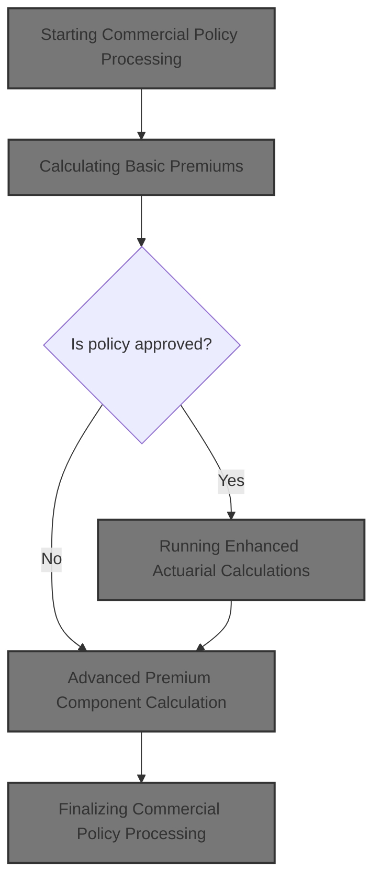
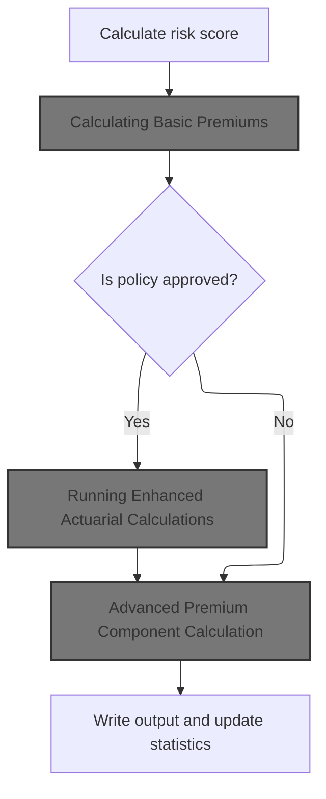
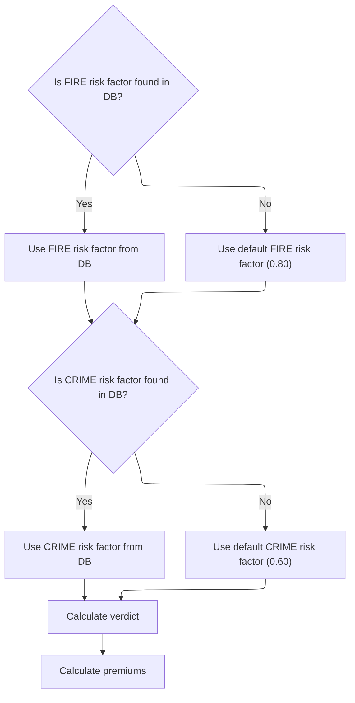
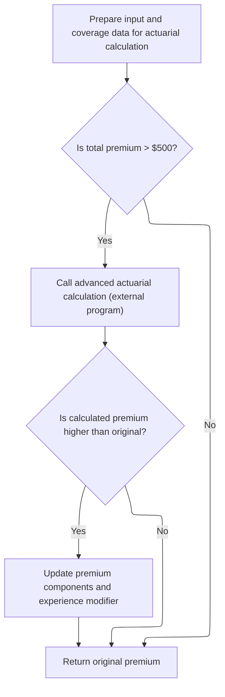
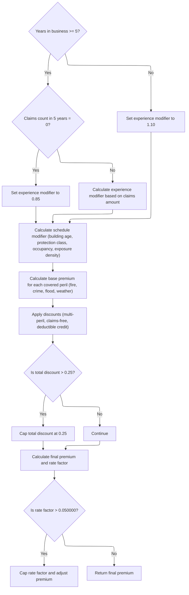
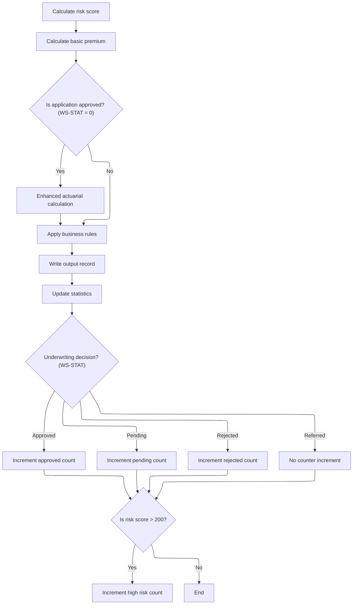

This document describes how commercial insurance policy applications are processed. The flow receives policy and risk data, calculates a risk score and basic premiums, and, if approved, performs enhanced actuarial calculations. It then determines advanced premium components and applies discounts to arrive at the final premium. The process concludes by recording the underwriting decision and updating policy statistics.



# Spec

## Detailed View of the Program's Functionality

# Commercial Policy Processing Flow

## 1\. Initial Record Handling and Validation

When the main program starts, it initializes counters, loads configuration values (either from a config file or defaults), opens all necessary files, and writes output headers. It then enters a loop to read each input record, validate it, and process it according to its type.

- Each input record is checked for valid policy type, required customer number, and at least one coverage limit.
- If the record is valid and is a commercial policy, it proceeds to commercial processing. Otherwise, it is either processed as an error or marked as unsupported.

## 2\. Commercial Policy Processing

For commercial policies, the following sequence is performed:

### a. Risk Score Calculation

- The risk score is calculated by calling an external module, which uses property type, location, coverage limits, and customer history to produce a risk score.

### b. Basic Premium Calculation

- The basic premium calculation module is called, which:
  - Retrieves risk factors for fire and crime perils from a database. If not found, default values are used.
  - Determines the underwriting verdict (approved, pending, rejected) based on the risk score.
  - Calculates premiums for fire, crime, flood, and weather perils using the risk score, peril factors, and a discount factor if all perils are present.
  - Sums up the individual peril premiums to get the total premium.

### c. Enhanced Actuarial Calculation (Conditional)

- If the policy is approved and the total premium exceeds the minimum threshold, enhanced actuarial calculations are performed:
  - All relevant input and coverage data are prepared and passed to the advanced actuarial calculation module.
  - This module loads base rates for each peril from a database (with fallback defaults), calculates exposures, and applies experience and schedule modifiers.
  - Premiums for each peril are recalculated using more detailed logic, including trend factors and modifiers.
  - Catastrophe loadings are added for hurricane, earthquake, tornado, and flood risks.
  - Expense and profit loadings are calculated and added.
  - Discounts are applied for multi-peril coverage, claims-free history, and high deductibles, with a cap on total discount.
  - Taxes are calculated and added.
  - The final premium and rate factor are computed, with caps applied if the rate exceeds a threshold.
  - If the enhanced premium is higher than the original, the premium components and experience modifier are updated.

### d. Business Rule Application

- Business rules are applied to determine the final underwriting decision:
  - If the risk score exceeds the maximum allowed, the policy is rejected.
  - If the premium is below the minimum, the policy is marked pending for review.
  - If the risk score is high but not above the maximum, the policy is marked pending for underwriter review.
  - Otherwise, the policy is approved.

### e. Output Record Writing

- The output record is populated with customer and policy details, risk score, individual peril premiums, total premium, status, and rejection reason (if any), and written to the output file.

### f. Statistics Update

- The total premium and risk score are added to running totals.
- Counters for approved, pending, rejected, and high-risk policies are incremented based on the underwriting decision and risk score.

## 3\. Advanced Actuarial Premium Calculation Details

The advanced actuarial calculation module performs the following steps:

### a. Initialization and Exposure Calculation

- All calculation areas are initialized.
- Building, contents, and business interruption exposures are calculated using coverage limits and risk score.
- Total insured value and exposure density are computed.

### b. Base Rate Loading

- Base rates for each peril are loaded from a database using territory, construction type, occupancy code, and peril code. If not found, default rates are used.

### c. Experience Modifier Calculation

- The experience modifier is set based on years in business and claims history:
  - If the business has operated for at least five years and has no claims, a discount is applied.
  - If there are claims, the modifier is increased based on claims amount and credibility factor, with caps to prevent extreme values.
  - If the business is younger than five years, a slight penalty is applied.

### d. Schedule Modifier Calculation

- The schedule modifier is adjusted for building age, protection class, occupancy code, and exposure density, with caps on the final value.

### e. Base Premium Calculation

- Premiums for each peril are calculated using exposures, base rates, experience and schedule modifiers, and trend factors.
- Crime and flood premiums have additional multipliers.
- All peril premiums are summed to get the base amount.

### f. Catastrophe Loading

- Additional loadings are added for hurricane, earthquake, tornado, and flood risks, based on peril selection and premium amounts.

### g. Expense and Profit Loading

- Expense loading is calculated as a percentage of the base and catastrophe amounts.
- Profit loading is calculated as a percentage of the sum of base, catastrophe, and expense amounts.

### h. Discount Calculation

- Discounts are applied for multi-peril coverage, claims-free history, and high deductibles.
- The total discount is capped at 25% and applied to the sum of premium components.

### i. Tax Calculation

- Taxes are calculated as a percentage of the sum of premium components minus discounts.

### j. Final Premium and Rate Factor Calculation

- The final premium is the sum of all components minus discounts plus taxes.
- The rate factor is calculated as the final premium divided by total insured value, and capped if it exceeds a threshold.
- If capped, the premium is recalculated using the capped rate.

## 4\. Finalization and Reporting

After all records are processed:

- Files are closed.
- A summary file is generated, reporting totals for processed, approved, pending, rejected, and high-risk policies, as well as total premium and average risk score.
- Statistics are displayed to the user.

# Summary

This flow ensures that each commercial policy is evaluated for risk, assigned appropriate premiums using both basic and advanced actuarial logic, and subjected to business rules for final underwriting decisions. All results and statistics are recorded for reporting and analysis. The modular structure allows for easy updates to risk factors, premium calculations, and business rules.

# Rule Definition

| Paragraph Name                                                                                            | Rule ID | Category          | Description                                                                                                                                                               | Conditions                                                                                                                                                       | Remarks                                                                                                                                                                                                                                                                                                                                        |
| --------------------------------------------------------------------------------------------------------- | ------- | ----------------- | ------------------------------------------------------------------------------------------------------------------------------------------------------------------------- | ---------------------------------------------------------------------------------------------------------------------------------------------------------------- | ---------------------------------------------------------------------------------------------------------------------------------------------------------------------------------------------------------------------------------------------------------------------------------------------------------------------------------------------- |
| P008-VALIDATE-INPUT-RECORD (LGAPDB01.cbl)                                                                 | RL-001  | Conditional Logic | Each input policy record must be validated for required fields, policy type, and coverage limits before processing.                                                       | Policy type must be commercial, customer number must not be blank, at least one coverage limit must be non-zero, and total coverage must not exceed maximum TIV. | Maximum TIV is 50,000,000.00. Errors are logged with codes and messages. Only commercial policies are processed; others are marked unsupported.                                                                                                                                                                                                |
| P011A-CALCULATE-RISK-SCORE (LGAPDB01.cbl)                                                                 | RL-002  | Computation       | Risk score is calculated for each policy using property, location, coverage, and history fields via an external module.                                                   | For each valid commercial policy record.                                                                                                                         | Risk score is a numeric value returned by the external module LGAPDB02. Used as input for premium and decision logic.                                                                                                                                                                                                                          |
| GET-RISK-FACTORS (LGAPDB03.cbl)                                                                           | RL-003  | Conditional Logic | Retrieve risk factors for fire and crime perils from the RISK_FACTORS table; use defaults if not found. Flood and weather always use defaults.                            | For each peril during premium calculation.                                                                                                                       | Default values: fire=0.80, crime=0.60, flood=1.20, weather=0.90. Factors are numeric and used in premium formulas.                                                                                                                                                                                                                             |
| LOAD-RATE-TABLES, P310-PERIL-RATES (LGAPDB04.cbl)                                                         | RL-004  | Conditional Logic | Retrieve base rates for each peril from RATE_MASTER. Use detailed keys for fire, simplified for others. Use defaults if not found.                                        | For each peril during actuarial premium calculation.                                                                                                             | Default base rates: fire=0.008500, crime=0.006200, flood=0.012800, weather=0.009600. Base rates are numeric and used in premium formulas.                                                                                                                                                                                                      |
| P011B-BASIC-PREMIUM-CALC (LGAPDB01.cbl), CALCULATE-PREMIUMS (LGAPDB03.cbl), P600-BASE-PREM (LGAPDB04.cbl) | RL-005  | Conditional Logic | A peril is considered selected if its input value is greater than zero. Only selected perils are included in premium and discount calculations.                           | For each peril in the input record.                                                                                                                              | Peril input values are numeric (e.g., 9(4)). Only perils with value > 0 are processed for premiums and discounts.                                                                                                                                                                                                                              |
| CALCULATE-PREMIUMS (LGAPDB03.cbl)                                                                         | RL-006  | Computation       | Calculate basic premiums for each selected peril using the formula: (risk_score \* peril_factor) \* peril_value \* discount_factor. Sum for total premium.                | For each selected peril after risk score and factor retrieval.                                                                                                   | Premiums are numeric, calculated per peril, and summed for total. Discount factor is 0.90 if all perils selected, else 1.00.                                                                                                                                                                                                                   |
| CALCULATE-PREMIUMS (LGAPDB03.cbl)                                                                         | RL-007  | Conditional Logic | Apply a discount factor of 0.90 if all four perils are selected; otherwise, use 1.00.                                                                                     | During basic premium calculation.                                                                                                                                | Discount factor is numeric (V99).                                                                                                                                                                                                                                                                                                              |
| CALCULATE-VERDICT (LGAPDB03.cbl), P011D-APPLY-BUSINESS-RULES (LGAPDB01.cbl)                               | RL-008  | Conditional Logic | Determine approval status based on risk score and premium thresholds. Set status and rejection reason accordingly.                                                        | After premium calculation and before output.                                                                                                                     | Status: 0=APPROVED, 1=PENDING, 2=REJECTED. Reasons are descriptive strings. Thresholds: risk score > 200 (reject), > 150 or > 180 (pending), else approve. Premium below minimum is pending.                                                                                                                                                   |
| P200-INIT (LGAPDB04.cbl)                                                                                  | RL-009  | Computation       | Calculate exposures for building, contents, and business interruption using coverage limits and risk score.                                                               | For approved policies in actuarial calculation.                                                                                                                  | Exposure = coverage_limit \* (1 + (risk_score - 100) / 1000). Numeric values used for further calculations.                                                                                                                                                                                                                                    |
| P400-EXP-MOD (LGAPDB04.cbl)                                                                               | RL-010  | Computation       | Calculate experience modifier based on years in business and claims history. Apply capping between 0.5 and 2.0.                                                           | For approved policies in actuarial calculation.                                                                                                                  | Experience mod: 0.85 (>=5 years, 0 claims), 1.10 (<5 years), else 1.00 + ((claims_amount_5yr / total_insured_value) \* credibility_factor \* 0.50), capped 0.5-2.0. Credibility factor is 0.75.                                                                                                                                                |
| P500-SCHED-MOD (LGAPDB04.cbl)                                                                             | RL-011  | Computation       | Calculate schedule modifier as the sum of building age, protection class, occupancy code, and exposure density factors. Cap between -0.200 and +0.400.                    | For approved policies in actuarial calculation.                                                                                                                  | Building age: >=2010: -0.050, >=1990: 0, >=1970: +0.100, older: +0.200. Protection class: '01'-'03': -0.100, '04'-'06': -0.050, '07'-'09': 0, other: +0.150. Occupancy: 'OFF01'-'OFF05': -0.025, 'MFG01'-'MFG10': +0.075, 'WHS01'-'WHS05': +0.125, other: 0. Exposure density: >500: +0.100, <50: -0.050. Cap total between -0.200 and +0.400. |
| P600-BASE-PREM (LGAPDB04.cbl)                                                                             | RL-012  | Computation       | Calculate base premiums for each peril using exposures, base rates, experience and schedule modifiers, trend factor, and peril-specific adjustments. Sum for base amount. | For each selected peril in actuarial calculation.                                                                                                                | Formulas:                                                                                                                                                                                                                                                                                                                                      |

- Fire: (building_exposure + contents_exposure) \* base_rate_fire \* experience_mod \* (1 + schedule_mod) \* trend_factor
- Crime: (contents_exposure \* 0.80) \* base_rate_crime \* experience_mod \* (1 + schedule_mod) \* trend_factor
- Flood: building_exposure \* base_rate_flood \* experience_mod \* (1 + schedule_mod) \* trend_factor \* 1.25
- Weather: (building_exposure + contents_exposure) \* base_rate_weather \* experience_mod \* (1 + schedule_mod) \* trend_factor Trend factor is 1.0350. Premiums are numeric, summed for base amount. | | P700-CAT-LOAD (LGAPDB04.cbl) | RL-013 | Computation | Add catastrophe loading for hurricane, earthquake, tornado, and flood using respective factors and peril premiums. | For each selected peril in actuarial calculation. | Factors: hurricane=0.0125, earthquake=0.0080, tornado=0.0045, flood=0.0090. Loading is numeric, added to base amount. | | P800-EXPENSE (LGAPDB04.cbl) | RL-014 | Computation | Add expense loading (35%) and profit loading (15%) to the sum of base and cat amounts. | After base and cat loading calculation. | Expense ratio: 0.350, profit margin: 0.150. Loadings are numeric, added to subtotal. | | P900-DISC (LGAPDB04.cbl) | RL-015 | Conditional Logic | Apply multi-peril, claims-free, and deductible discounts. Cap total discount at 0.25. | During actuarial calculation after loadings. | Multi-peril: 0.10 (all perils), 0.05 (fire+weather+one other). Claims-free: 0.075 (0 claims, >=5 years). Deductible: fire>=10,000: +0.025; wind>=25,000: +0.035; flood>=50,000: +0.045. Total discount capped at 0.25. | | P950-TAXES (LGAPDB04.cbl) | RL-016 | Computation | Apply tax at 6.75% to subtotal after discounts. | After discounts in actuarial calculation. | Tax rate: 0.0675. Tax is numeric, added to subtotal. | | P999-FINAL (LGAPDB04.cbl) | RL-017 | Computation | Calculate final premium and rate factor. Cap rate factor at 0.05 and recalculate premium if exceeded. | At end of actuarial calculation. | Final premium = base + cat + expense + profit - discount + tax. Final rate factor = total_premium / total_insured_value, cap at 0.05. | | P011E-WRITE-OUTPUT-RECORD (LGAPDB01.cbl) | RL-018 | Data Assignment | Write output records containing customer info, risk score, peril premiums, total premium, status, and rejection reason. | After all calculations and decision logic. | Output fields: customer info (string), risk score (number), peril premiums (number), total premium (number), status (string), rejection reason (string). Field sizes as per OUTPUTREC copybook. | | P011F-UPDATE-STATISTICS (LGAPDB01.cbl) | RL-019 | Computation | Update statistics for reporting: total premium, risk score, counts for approved, pending, rejected, and high-risk policies. | After output record is written for each policy. | Statistics are numeric counters and sums. High-risk: risk score > 200. |

# User Stories

## User Story 1: Calculate risk score, select perils, and determine approval status

---

### Story Description:

As a system, I want to calculate risk scores, retrieve peril factors and rates, select perils, calculate basic premiums with discount logic, and determine approval status and rejection reasons so that policies are correctly evaluated and premiums reflect the risk and coverage chosen.

---

### Business Rule Mapping:

| Rule ID | Paragraph Name                                                                                            | Rule Description                                                                                                                                           |
| ------- | --------------------------------------------------------------------------------------------------------- | ---------------------------------------------------------------------------------------------------------------------------------------------------------- |
| RL-002  | P011A-CALCULATE-RISK-SCORE (LGAPDB01.cbl)                                                                 | Risk score is calculated for each policy using property, location, coverage, and history fields via an external module.                                    |
| RL-003  | GET-RISK-FACTORS (LGAPDB03.cbl)                                                                           | Retrieve risk factors for fire and crime perils from the RISK_FACTORS table; use defaults if not found. Flood and weather always use defaults.             |
| RL-004  | LOAD-RATE-TABLES, P310-PERIL-RATES (LGAPDB04.cbl)                                                         | Retrieve base rates for each peril from RATE_MASTER. Use detailed keys for fire, simplified for others. Use defaults if not found.                         |
| RL-005  | P011B-BASIC-PREMIUM-CALC (LGAPDB01.cbl), CALCULATE-PREMIUMS (LGAPDB03.cbl), P600-BASE-PREM (LGAPDB04.cbl) | A peril is considered selected if its input value is greater than zero. Only selected perils are included in premium and discount calculations.            |
| RL-006  | CALCULATE-PREMIUMS (LGAPDB03.cbl)                                                                         | Calculate basic premiums for each selected peril using the formula: (risk_score \* peril_factor) \* peril_value \* discount_factor. Sum for total premium. |
| RL-007  | CALCULATE-PREMIUMS (LGAPDB03.cbl)                                                                         | Apply a discount factor of 0.90 if all four perils are selected; otherwise, use 1.00.                                                                      |
| RL-008  | CALCULATE-VERDICT (LGAPDB03.cbl), P011D-APPLY-BUSINESS-RULES (LGAPDB01.cbl)                               | Determine approval status based on risk score and premium thresholds. Set status and rejection reason accordingly.                                         |

---

### Relevant Functionality:

- **P011A-CALCULATE-RISK-SCORE (LGAPDB01.cbl)**
  1. **RL-002:**
     - Call external risk score module with property, location, coverage, and history data.
     - Store returned risk score for use in subsequent calculations.
- **GET-RISK-FACTORS (LGAPDB03.cbl)**
  1. **RL-003:**
     - Query RISK_FACTORS for fire and crime using peril type.
     - If not found, use default values.
     - Always use default for flood and weather.
- **LOAD-RATE-TABLES**
  1. **RL-004:**
     - Query RATE_MASTER for fire using territory, construction, occupancy, peril code, and date.
     - Query for other perils using territory, peril code, and date.
     - If not found, use default base rates.
- **P011B-BASIC-PREMIUM-CALC (LGAPDB01.cbl)**
  1. **RL-005:**
     - For each peril, check if input value > 0.
     - If so, include in premium and discount calculations.
- **CALCULATE-PREMIUMS (LGAPDB03.cbl)**
  1. **RL-006:**
     - For each selected peril:
       - Compute premium = (risk_score \* peril_factor) \* peril_value \* discount_factor.
     - Sum all peril premiums for total premium.
  2. **RL-007:**
     - If all four peril input values > 0, set discount factor to 0.90.
     - Else, set discount factor to 1.00.
     - Use in premium calculations.
- **CALCULATE-VERDICT (LGAPDB03.cbl)**
  1. **RL-008:**
     - If risk score > max allowed, set status to REJECTED, reason 'Risk score exceeds maximum acceptable level'.
     - If premium < minimum, set status to PENDING, reason 'Premium below minimum - requires review'.
     - If risk score > 180 (or 150), set status to PENDING, reason 'High risk - underwriter review required'.
     - Else, set status to APPROVED, reason blank.

## User Story 2: Perform enhanced actuarial calculations for approved policies

---

### Story Description:

As a system, I want to perform detailed actuarial calculations for approved policies, including exposures, experience and schedule modifiers, base premiums, catastrophe, expense, and profit loadings, discounts, taxes, and final premium and rate factor calculations, so that the final premium accurately reflects all relevant risk and business factors.

---

### Business Rule Mapping:

| Rule ID | Paragraph Name                | Rule Description                                                                                                                                                          |
| ------- | ----------------------------- | ------------------------------------------------------------------------------------------------------------------------------------------------------------------------- |
| RL-009  | P200-INIT (LGAPDB04.cbl)      | Calculate exposures for building, contents, and business interruption using coverage limits and risk score.                                                               |
| RL-010  | P400-EXP-MOD (LGAPDB04.cbl)   | Calculate experience modifier based on years in business and claims history. Apply capping between 0.5 and 2.0.                                                           |
| RL-011  | P500-SCHED-MOD (LGAPDB04.cbl) | Calculate schedule modifier as the sum of building age, protection class, occupancy code, and exposure density factors. Cap between -0.200 and +0.400.                    |
| RL-012  | P600-BASE-PREM (LGAPDB04.cbl) | Calculate base premiums for each peril using exposures, base rates, experience and schedule modifiers, trend factor, and peril-specific adjustments. Sum for base amount. |
| RL-013  | P700-CAT-LOAD (LGAPDB04.cbl)  | Add catastrophe loading for hurricane, earthquake, tornado, and flood using respective factors and peril premiums.                                                        |
| RL-014  | P800-EXPENSE (LGAPDB04.cbl)   | Add expense loading (35%) and profit loading (15%) to the sum of base and cat amounts.                                                                                    |
| RL-015  | P900-DISC (LGAPDB04.cbl)      | Apply multi-peril, claims-free, and deductible discounts. Cap total discount at 0.25.                                                                                     |
| RL-016  | P950-TAXES (LGAPDB04.cbl)     | Apply tax at 6.75% to subtotal after discounts.                                                                                                                           |
| RL-017  | P999-FINAL (LGAPDB04.cbl)     | Calculate final premium and rate factor. Cap rate factor at 0.05 and recalculate premium if exceeded.                                                                     |

---

### Relevant Functionality:

- **P200-INIT (LGAPDB04.cbl)**
  1. **RL-009:**
     - For each coverage type:
       - Compute exposure = coverage_limit \* (1 + (risk_score - 100) / 1000).
     - Sum exposures for total insured value.
- **P400-EXP-MOD (LGAPDB04.cbl)**
  1. **RL-010:**
     - If years in business >= 5 and claims count = 0, set mod to 0.85.
     - If years in business >= 5 and claims > 0, compute mod as above, cap between 0.5 and 2.0.
     - If years in business < 5, set mod to 1.10.
- **P500-SCHED-MOD (LGAPDB04.cbl)**
  1. **RL-011:**
     - Add/subtract factors for building age, protection class, occupancy, and exposure density.
     - Cap total modifier between -0.200 and +0.400.
- **P600-BASE-PREM (LGAPDB04.cbl)**
  1. **RL-012:**
     - For each selected peril, compute premium using the respective formula.
     - Add each peril premium to base amount.
- **P700-CAT-LOAD (LGAPDB04.cbl)**
  1. **RL-013:**
     - For each applicable peril, add (peril premium \* cat factor) to cat loading.
     - Add earthquake loading to base amount.
- **P800-EXPENSE (LGAPDB04.cbl)**
  1. **RL-014:**
     - Compute expense loading = (base + cat) \* 0.350.
     - Compute profit loading = (base + cat + expense) \* 0.150.
- **P900-DISC (LGAPDB04.cbl)**
  1. **RL-015:**
     - Calculate each discount as per rules.
     - Sum discounts, cap at 0.25.
     - Apply to subtotal.
- **P950-TAXES (LGAPDB04.cbl)**
  1. **RL-016:**
     - Compute tax = (subtotal after discounts) \* 0.0675.
- **P999-FINAL (LGAPDB04.cbl)**
  1. **RL-017:**
     - Compute final premium as per formula.
     - Compute final rate factor.
     - If rate factor > 0.05, cap and recalculate premium.

## User Story 3: Manage policy records from input validation to reporting

---

### Story Description:

As a system, I want to validate incoming policy records, write output records with calculation results, and update statistics for reporting so that only eligible commercial policies are processed, results are available for downstream use, and business metrics are accurately tracked.

---

### Business Rule Mapping:

| Rule ID | Paragraph Name                            | Rule Description                                                                                                            |
| ------- | ----------------------------------------- | --------------------------------------------------------------------------------------------------------------------------- |
| RL-001  | P008-VALIDATE-INPUT-RECORD (LGAPDB01.cbl) | Each input policy record must be validated for required fields, policy type, and coverage limits before processing.         |
| RL-018  | P011E-WRITE-OUTPUT-RECORD (LGAPDB01.cbl)  | Write output records containing customer info, risk score, peril premiums, total premium, status, and rejection reason.     |
| RL-019  | P011F-UPDATE-STATISTICS (LGAPDB01.cbl)    | Update statistics for reporting: total premium, risk score, counts for approved, pending, rejected, and high-risk policies. |

---

### Relevant Functionality:

- **P008-VALIDATE-INPUT-RECORD (LGAPDB01.cbl)**
  1. **RL-001:**
     - If policy type is not commercial, personal, or farm, log error 'Invalid Policy Type'.
     - If customer number is blank, log error 'Customer Number Required'.
     - If all coverage limits are zero, log error 'At least one coverage limit required'.
     - If total coverage exceeds maximum TIV, log warning 'Total coverage exceeds maximum TIV'.
     - If errors exist, output error record and skip further processing for this record.
- **P011E-WRITE-OUTPUT-RECORD (LGAPDB01.cbl)**
  1. **RL-018:**
     - Assign calculated and input values to output fields.
     - Write output record to file.
- **P011F-UPDATE-STATISTICS (LGAPDB01.cbl)**
  1. **RL-019:**
     - Add premium and risk score to totals.
     - Increment counters for approved, pending, rejected, and high-risk as appropriate.

# Code Walkthrough

## Starting Commercial Policy Processing



<SwmSnippet path="/base/src/LGAPDB01.cbl" line="258">

---

In `P011-PROCESS-COMMERCIAL` we kick off the flow by calculating the risk score, then immediately call P011B-BASIC-PREMIUM-CALC to get the initial premium values. This sets up the baseline premium and supporting data, which is needed before we check the risk status and decide if we need to run the enhanced actuarial calculation or just apply business rules and write outputs.

```cobol
       P011-PROCESS-COMMERCIAL.
           PERFORM P011A-CALCULATE-RISK-SCORE
           PERFORM P011B-BASIC-PREMIUM-CALC
           IF WS-STAT = 0
               PERFORM P011C-ENHANCED-ACTUARIAL-CALC
           END-IF
           PERFORM P011D-APPLY-BUSINESS-RULES
           PERFORM P011E-WRITE-OUTPUT-RECORD
           PERFORM P011F-UPDATE-STATISTICS.
```

---

</SwmSnippet>

### Calculating Basic Premiums

<SwmSnippet path="/base/src/LGAPDB01.cbl" line="275">

---

`P011B-BASIC-PREMIUM-CALC` calls LGAPDB03, passing all relevant risk and peril data. This gets us the risk factors, verdict, and premium amounts for each peril, which we need before moving on to enhanced calculations or business rules.

```cobol
       P011B-BASIC-PREMIUM-CALC.
           CALL 'LGAPDB03' USING WS-BASE-RISK-SCR, IN-FIRE-PERIL, 
                                IN-CRIME-PERIL, IN-FLOOD-PERIL, 
                                IN-WEATHER-PERIL, WS-STAT,
                                WS-STAT-DESC, WS-REJ-RSN, WS-FR-PREM,
                                WS-CR-PREM, WS-FL-PREM, WS-WE-PREM,
                                WS-TOT-PREM, WS-DISC-FACT.
```

---

</SwmSnippet>

### Risk Factor Retrieval and Premium Calculation



<SwmSnippet path="/base/src/LGAPDB03.cbl" line="42">

---

`MAIN-LOGIC` runs the sequence: fetches risk factors from the database (or uses defaults if missing), then determines the application verdict, and finally calculates premiums for each risk category. This sets up all the underwriting and premium data needed for the rest of the flow.

```cobol
       MAIN-LOGIC.
           PERFORM GET-RISK-FACTORS
           PERFORM CALCULATE-VERDICT
           PERFORM CALCULATE-PREMIUMS
           GOBACK.
```

---

</SwmSnippet>

<SwmSnippet path="/base/src/LGAPDB03.cbl" line="48">

---

`GET-RISK-FACTORS` pulls fire and crime risk factors from the database using SQL. If the lookup fails, it just sets them to 0.80 and 0.60. These fallback values are arbitrary and not explained anywhere, but they drive the premium calculation if the DB is missing data.

```cobol
       GET-RISK-FACTORS.
           EXEC SQL
               SELECT FACTOR_VALUE INTO :WS-FIRE-FACTOR
               FROM RISK_FACTORS
               WHERE PERIL_TYPE = 'FIRE'
           END-EXEC.
           
           IF SQLCODE = 0
               CONTINUE
           ELSE
               MOVE 0.80 TO WS-FIRE-FACTOR
           END-IF.
           
           EXEC SQL
               SELECT FACTOR_VALUE INTO :WS-CRIME-FACTOR
               FROM RISK_FACTORS
               WHERE PERIL_TYPE = 'CRIME'
           END-EXEC.
           
           IF SQLCODE = 0
               CONTINUE
           ELSE
               MOVE 0.60 TO WS-CRIME-FACTOR
           END-IF.
```

---

</SwmSnippet>

### Running Enhanced Actuarial Calculations



<SwmSnippet path="/base/src/LGAPDB01.cbl" line="283">

---

`P011C-ENHANCED-ACTUARIAL-CALC` sets up all the policy and coverage data, then calls LGAPDB04 for advanced actuarial calculations. We only update the premium values if the enhanced results are better, so this step refines the premium using more detailed logic.

```cobol
       P011C-ENHANCED-ACTUARIAL-CALC.
      *    Prepare input structure for actuarial calculation
           MOVE IN-CUSTOMER-NUM TO LK-CUSTOMER-NUM
           MOVE WS-BASE-RISK-SCR TO LK-RISK-SCORE
           MOVE IN-PROPERTY-TYPE TO LK-PROPERTY-TYPE
           MOVE IN-TERRITORY-CODE TO LK-TERRITORY
           MOVE IN-CONSTRUCTION-TYPE TO LK-CONSTRUCTION-TYPE
           MOVE IN-OCCUPANCY-CODE TO LK-OCCUPANCY-CODE
           MOVE IN-SPRINKLER-IND TO LK-PROTECTION-CLASS
           MOVE IN-YEAR-BUILT TO LK-YEAR-BUILT
           MOVE IN-SQUARE-FOOTAGE TO LK-SQUARE-FOOTAGE
           MOVE IN-YEARS-IN-BUSINESS TO LK-YEARS-IN-BUSINESS
           MOVE IN-CLAIMS-COUNT-3YR TO LK-CLAIMS-COUNT-5YR
           MOVE IN-CLAIMS-AMOUNT-3YR TO LK-CLAIMS-AMOUNT-5YR
           
      *    Set coverage data
           MOVE IN-BUILDING-LIMIT TO LK-BUILDING-LIMIT
           MOVE IN-CONTENTS-LIMIT TO LK-CONTENTS-LIMIT
           MOVE IN-BI-LIMIT TO LK-BI-LIMIT
           MOVE IN-FIRE-DEDUCTIBLE TO LK-FIRE-DEDUCTIBLE
           MOVE IN-WIND-DEDUCTIBLE TO LK-WIND-DEDUCTIBLE
           MOVE IN-FLOOD-DEDUCTIBLE TO LK-FLOOD-DEDUCTIBLE
           MOVE IN-OTHER-DEDUCTIBLE TO LK-OTHER-DEDUCTIBLE
           MOVE IN-FIRE-PERIL TO LK-FIRE-PERIL
           MOVE IN-CRIME-PERIL TO LK-CRIME-PERIL
           MOVE IN-FLOOD-PERIL TO LK-FLOOD-PERIL
           MOVE IN-WEATHER-PERIL TO LK-WEATHER-PERIL
           
      *    Call advanced actuarial calculation program (only for approved cases)
           IF WS-TOT-PREM > WS-MIN-PREMIUM
               CALL 'LGAPDB04' USING LK-INPUT-DATA, LK-COVERAGE-DATA, 
                                    LK-OUTPUT-RESULTS
               
      *        Update with enhanced calculations if successful
               IF LK-TOTAL-PREMIUM > WS-TOT-PREM
                   MOVE LK-FIRE-PREMIUM TO WS-FR-PREM
                   MOVE LK-CRIME-PREMIUM TO WS-CR-PREM
                   MOVE LK-FLOOD-PREMIUM TO WS-FL-PREM
                   MOVE LK-WEATHER-PREMIUM TO WS-WE-PREM
                   MOVE LK-TOTAL-PREMIUM TO WS-TOT-PREM
                   MOVE LK-EXPERIENCE-MOD TO WS-EXPERIENCE-MOD
               END-IF
           END-IF.
```

---

</SwmSnippet>

### Advanced Premium Component Calculation



<SwmSnippet path="/base/src/LGAPDB04.cbl" line="138">

---

`P100-MAIN` runs through all the premium component calculations: exposure, experience, schedule, base, catastrophe, expense, discount, tax, and final premium. Each step applies a specific adjustment or factor, so we get a modular and detailed premium breakdown.

```cobol
       P100-MAIN.
           PERFORM P200-INIT
           PERFORM P300-RATES
           PERFORM P350-EXPOSURE
           PERFORM P400-EXP-MOD
           PERFORM P500-SCHED-MOD
           PERFORM P600-BASE-PREM
           PERFORM P700-CAT-LOAD
           PERFORM P800-EXPENSE
           PERFORM P900-DISC
           PERFORM P950-TAXES
           PERFORM P999-FINAL
           GOBACK.
```

---

</SwmSnippet>

<SwmSnippet path="/base/src/LGAPDB04.cbl" line="234">

---

`P400-EXP-MOD` calculates the experience modifier based on years in business and claims history. It applies discounts for clean records, increases for claims, and caps the result between 0.5 and 2.0 to avoid wild premium swings.

```cobol
       P400-EXP-MOD.
           MOVE 1.0000 TO WS-EXPERIENCE-MOD
           
           IF LK-YEARS-IN-BUSINESS >= 5
               IF LK-CLAIMS-COUNT-5YR = ZERO
                   MOVE 0.8500 TO WS-EXPERIENCE-MOD
               ELSE
                   COMPUTE WS-EXPERIENCE-MOD = 
                       1.0000 + 
                       ((LK-CLAIMS-AMOUNT-5YR / WS-TOTAL-INSURED-VAL) * 
                        WS-CREDIBILITY-FACTOR * 0.50)
                   
                   IF WS-EXPERIENCE-MOD > 2.0000
                       MOVE 2.0000 TO WS-EXPERIENCE-MOD
                   END-IF
                   
                   IF WS-EXPERIENCE-MOD < 0.5000
                       MOVE 0.5000 TO WS-EXPERIENCE-MOD
                   END-IF
               END-IF
           ELSE
               MOVE 1.1000 TO WS-EXPERIENCE-MOD
           END-IF
           
           MOVE WS-EXPERIENCE-MOD TO LK-EXPERIENCE-MOD.
```

---

</SwmSnippet>

<SwmSnippet path="/base/src/LGAPDB04.cbl" line="260">

---

`P500-SCHED-MOD` builds the schedule modifier by adjusting for building age, protection class, occupancy code, and exposure density. Each input tweaks the modifier using hardcoded constants, and the result is capped before being used in premium calculations.

```cobol
       P500-SCHED-MOD.
           MOVE +0.000 TO WS-SCHEDULE-MOD
           
      *    Building age factor
           EVALUATE TRUE
               WHEN LK-YEAR-BUILT >= 2010
                   SUBTRACT 0.050 FROM WS-SCHEDULE-MOD
               WHEN LK-YEAR-BUILT >= 1990
                   CONTINUE
               WHEN LK-YEAR-BUILT >= 1970
                   ADD 0.100 TO WS-SCHEDULE-MOD
               WHEN OTHER
                   ADD 0.200 TO WS-SCHEDULE-MOD
           END-EVALUATE
           
      *    Protection class factor
           EVALUATE LK-PROTECTION-CLASS
               WHEN '01' THRU '03'
                   SUBTRACT 0.100 FROM WS-SCHEDULE-MOD
               WHEN '04' THRU '06'
                   SUBTRACT 0.050 FROM WS-SCHEDULE-MOD
               WHEN '07' THRU '09'
                   CONTINUE
               WHEN OTHER
                   ADD 0.150 TO WS-SCHEDULE-MOD
           END-EVALUATE
           
      *    Occupancy hazard factor
           EVALUATE LK-OCCUPANCY-CODE
               WHEN 'OFF01' THRU 'OFF05'
                   SUBTRACT 0.025 FROM WS-SCHEDULE-MOD
               WHEN 'MFG01' THRU 'MFG10'
                   ADD 0.075 TO WS-SCHEDULE-MOD
               WHEN 'WHS01' THRU 'WHS05'
                   ADD 0.125 TO WS-SCHEDULE-MOD
               WHEN OTHER
                   CONTINUE
           END-EVALUATE
           
      *    Exposure density factor
           IF WS-EXPOSURE-DENSITY > 500.00
               ADD 0.100 TO WS-SCHEDULE-MOD
           ELSE
               IF WS-EXPOSURE-DENSITY < 50.00
                   SUBTRACT 0.050 FROM WS-SCHEDULE-MOD
               END-IF
           END-IF
           
           IF WS-SCHEDULE-MOD > +0.400
               MOVE +0.400 TO WS-SCHEDULE-MOD
           END-IF
           
           IF WS-SCHEDULE-MOD < -0.200
               MOVE -0.200 TO WS-SCHEDULE-MOD
           END-IF
           
           MOVE WS-SCHEDULE-MOD TO LK-SCHEDULE-MOD.
```

---

</SwmSnippet>

<SwmSnippet path="/base/src/LGAPDB04.cbl" line="318">

---

`P600-BASE-PREM` calculates the base premium for each peril using exposure values, rate lookups, and modifiers. It applies specific multipliers for crime and flood, then sums up the premiums for all covered perils.

```cobol
       P600-BASE-PREM.
           MOVE ZERO TO LK-BASE-AMOUNT
           
      * FIRE PREMIUM
           IF LK-FIRE-PERIL > ZERO
               COMPUTE LK-FIRE-PREMIUM = 
                   (WS-BUILDING-EXPOSURE + WS-CONTENTS-EXPOSURE) *
                   WS-BASE-RATE (1, 1, 1, 1) * 
                   WS-EXPERIENCE-MOD *
                   (1 + WS-SCHEDULE-MOD) *
                   WS-TREND-FACTOR
                   
               ADD LK-FIRE-PREMIUM TO LK-BASE-AMOUNT
           END-IF
           
      * CRIME PREMIUM
           IF LK-CRIME-PERIL > ZERO
               COMPUTE LK-CRIME-PREMIUM = 
                   (WS-CONTENTS-EXPOSURE * 0.80) *
                   WS-BASE-RATE (2, 1, 1, 1) * 
                   WS-EXPERIENCE-MOD *
                   (1 + WS-SCHEDULE-MOD) *
                   WS-TREND-FACTOR
                   
               ADD LK-CRIME-PREMIUM TO LK-BASE-AMOUNT
           END-IF
           
      * FLOOD PREMIUM
           IF LK-FLOOD-PERIL > ZERO
               COMPUTE LK-FLOOD-PREMIUM = 
                   WS-BUILDING-EXPOSURE *
                   WS-BASE-RATE (3, 1, 1, 1) * 
                   WS-EXPERIENCE-MOD *
                   (1 + WS-SCHEDULE-MOD) *
                   WS-TREND-FACTOR * 1.25
                   
               ADD LK-FLOOD-PREMIUM TO LK-BASE-AMOUNT
           END-IF
           
      * WEATHER PREMIUM
           IF LK-WEATHER-PERIL > ZERO
               COMPUTE LK-WEATHER-PREMIUM = 
                   (WS-BUILDING-EXPOSURE + WS-CONTENTS-EXPOSURE) *
                   WS-BASE-RATE (4, 1, 1, 1) * 
                   WS-EXPERIENCE-MOD *
                   (1 + WS-SCHEDULE-MOD) *
                   WS-TREND-FACTOR
                   
               ADD LK-WEATHER-PREMIUM TO LK-BASE-AMOUNT
           END-IF.
```

---

</SwmSnippet>

<SwmSnippet path="/base/src/LGAPDB04.cbl" line="407">

---

`P900-DISC` calculates discounts for multi-peril coverage, claims-free history, and high deductibles, then sums and caps the total discount at 25%. The final discount amount is applied to the sum of all premium components.

```cobol
       P900-DISC.
           MOVE ZERO TO WS-TOTAL-DISCOUNT
           
      * Multi-peril discount
           MOVE ZERO TO WS-MULTI-PERIL-DISC
           IF LK-FIRE-PERIL > ZERO AND
              LK-CRIME-PERIL > ZERO AND
              LK-FLOOD-PERIL > ZERO AND
              LK-WEATHER-PERIL > ZERO
               MOVE 0.100 TO WS-MULTI-PERIL-DISC
           ELSE
               IF LK-FIRE-PERIL > ZERO AND
                  LK-WEATHER-PERIL > ZERO AND
                  (LK-CRIME-PERIL > ZERO OR LK-FLOOD-PERIL > ZERO)
                   MOVE 0.050 TO WS-MULTI-PERIL-DISC
               END-IF
           END-IF
           
      * Claims-free discount  
           MOVE ZERO TO WS-CLAIMS-FREE-DISC
           IF LK-CLAIMS-COUNT-5YR = ZERO AND LK-YEARS-IN-BUSINESS >= 5
               MOVE 0.075 TO WS-CLAIMS-FREE-DISC
           END-IF
           
      * Deductible credit
           MOVE ZERO TO WS-DEDUCTIBLE-CREDIT
           IF LK-FIRE-DEDUCTIBLE >= 10000
               ADD 0.025 TO WS-DEDUCTIBLE-CREDIT
           END-IF
           IF LK-WIND-DEDUCTIBLE >= 25000  
               ADD 0.035 TO WS-DEDUCTIBLE-CREDIT
           END-IF
           IF LK-FLOOD-DEDUCTIBLE >= 50000
               ADD 0.045 TO WS-DEDUCTIBLE-CREDIT
           END-IF
           
           COMPUTE WS-TOTAL-DISCOUNT = 
               WS-MULTI-PERIL-DISC + WS-CLAIMS-FREE-DISC + 
               WS-DEDUCTIBLE-CREDIT
               
           IF WS-TOTAL-DISCOUNT > 0.250
               MOVE 0.250 TO WS-TOTAL-DISCOUNT
           END-IF
           
           COMPUTE LK-DISCOUNT-AMT = 
               (LK-BASE-AMOUNT + LK-CAT-LOAD-AMT + 
                LK-EXPENSE-LOAD-AMT + LK-PROFIT-LOAD-AMT) *
               WS-TOTAL-DISCOUNT.
```

---

</SwmSnippet>

<SwmSnippet path="/base/src/LGAPDB04.cbl" line="464">

---

`P999-FINAL` sums all premium components, subtracts discounts, adds taxes, then divides by total insured value to get the final rate factor. If the rate is over 0.05, it gets capped and the premium is recalculated.

```cobol
       P999-FINAL.
           COMPUTE LK-TOTAL-PREMIUM = 
               LK-BASE-AMOUNT + LK-CAT-LOAD-AMT + 
               LK-EXPENSE-LOAD-AMT + LK-PROFIT-LOAD-AMT -
               LK-DISCOUNT-AMT + LK-TAX-AMT
               
           COMPUTE LK-FINAL-RATE-FACTOR = 
               LK-TOTAL-PREMIUM / WS-TOTAL-INSURED-VAL
               
           IF LK-FINAL-RATE-FACTOR > 0.050000
               MOVE 0.050000 TO LK-FINAL-RATE-FACTOR
               COMPUTE LK-TOTAL-PREMIUM = 
                   WS-TOTAL-INSURED-VAL * LK-FINAL-RATE-FACTOR
           END-IF.
```

---

</SwmSnippet>

### Finalizing Commercial Policy Processing



<SwmSnippet path="/base/src/LGAPDB01.cbl" line="258">

---

After enhanced calculations, `P011-PROCESS-COMMERCIAL` wraps up by updating all the relevant statistics for reporting.

```cobol
       P011-PROCESS-COMMERCIAL.
           PERFORM P011A-CALCULATE-RISK-SCORE
           PERFORM P011B-BASIC-PREMIUM-CALC
           IF WS-STAT = 0
               PERFORM P011C-ENHANCED-ACTUARIAL-CALC
           END-IF
           PERFORM P011D-APPLY-BUSINESS-RULES
           PERFORM P011E-WRITE-OUTPUT-RECORD
           PERFORM P011F-UPDATE-STATISTICS.
```

---

</SwmSnippet>

<SwmSnippet path="/base/src/LGAPDB01.cbl" line="365">

---

`P011F-UPDATE-STATISTICS` adds up the total premium and risk score, then increments counters for approved, pending, rejected, and high-risk policies. The high-risk threshold is set at 200, which is arbitrary but drives the reporting.

```cobol
       P011F-UPDATE-STATISTICS.
           ADD WS-TOT-PREM TO WS-TOTAL-PREMIUM-AMT
           ADD WS-BASE-RISK-SCR TO WS-CONTROL-TOTALS
           
           EVALUATE WS-STAT
               WHEN 0 ADD 1 TO WS-APPROVED-CNT
               WHEN 1 ADD 1 TO WS-PENDING-CNT
               WHEN 2 ADD 1 TO WS-REJECTED-CNT
           END-EVALUATE
           
           IF WS-BASE-RISK-SCR > 200
               ADD 1 TO WS-HIGH-RISK-CNT
           END-IF.
```

---

</SwmSnippet>

&nbsp;

*This is an auto-generated document by Swimm 🌊 and has not yet been verified by a human*

<SwmMeta version="3.0.0" repo-id="Z2l0aHViJTNBJTNBU3dpbW1pby1nZW5hcHAtbW90b3IlM0ElM0FHaXJpLVN3aW1t" repo-name="Swimmio-genapp-motor"><sup>Powered by [Swimm](https://app.swimm.io/)</sup></SwmMeta>
