# Overview

This document explains the flow of processing insurance policy data, including validation, premium calculation, error logging, and summary generation. Supporting programs handle record validation and premium calculation.

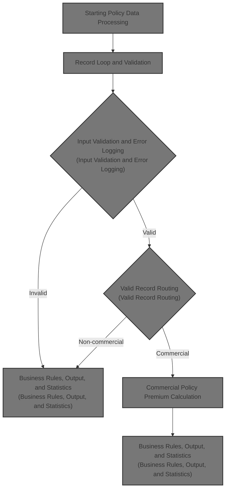

# Technical Overview

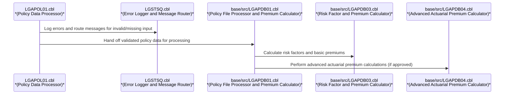

## Dependencies

### Programs

- <SwmToken path="base/src/lgapol01.cbl" pos="103:9:9" line-data="           EXEC CICS Link Program(LGAPDB01)">`LGAPDB01`</SwmToken> (<SwmPath>[base/src/LGAPDB01.cbl](base/src/LGAPDB01.cbl)</SwmPath>)
- <SwmToken path="base/src/LGAPDB01.cbl" pos="269:4:4" line-data="           CALL &#39;LGAPDB02&#39; USING IN-PROPERTY-TYPE, IN-POSTCODE, ">`LGAPDB02`</SwmToken>
- <SwmToken path="base/src/LGAPDB01.cbl" pos="276:4:4" line-data="           CALL &#39;LGAPDB03&#39; USING WS-BASE-RISK-SCR, IN-FIRE-PERIL, ">`LGAPDB03`</SwmToken> (<SwmPath>[base/src/LGAPDB03.cbl](base/src/LGAPDB03.cbl)</SwmPath>)
- <SwmToken path="base/src/LGAPDB01.cbl" pos="313:4:4" line-data="               CALL &#39;LGAPDB04&#39; USING LK-INPUT-DATA, LK-COVERAGE-DATA, ">`LGAPDB04`</SwmToken> (<SwmPath>[base/src/LGAPDB04.cbl](base/src/LGAPDB04.cbl)</SwmPath>)
- LGSTSQ (<SwmPath>[base/src/lgstsq.cbl](base/src/lgstsq.cbl)</SwmPath>)

### Copybooks

- SQLCA
- <SwmToken path="base/src/LGAPDB01.cbl" pos="35:3:3" line-data="           COPY INPUTREC2.">`INPUTREC2`</SwmToken> (<SwmPath>[base/src/INPUTREC2.cpy](base/src/INPUTREC2.cpy)</SwmPath>)
- OUTPUTREC (<SwmPath>[base/src/OUTPUTREC.cpy](base/src/OUTPUTREC.cpy)</SwmPath>)
- WORKSTOR (<SwmPath>[base/src/WORKSTOR.cpy](base/src/WORKSTOR.cpy)</SwmPath>)
- LGAPACT (<SwmPath>[base/src/LGAPACT.cpy](base/src/LGAPACT.cpy)</SwmPath>)
- LGCMAREA (<SwmPath>[base/src/lgcmarea.cpy](base/src/lgcmarea.cpy)</SwmPath>)

# Where is this program used?

This program is used multiple times in the codebase as represented in the following diagram:

```mermaid
graph TD
  le6x4("Motor Policy Menu (LGTESTP1)") --> h7p0p("Processing Policy Data (LGAPOL01)"):::currentEntity
click le6x4 openCode "base/src/lgtestp1.cbl:1"
2hwkj("House Policy Menu (LGTESTP3)") --> h7p0p("Processing Policy Data (LGAPOL01)"):::currentEntity
click 2hwkj openCode "base/src/lgtestp3.cbl:1"
k1b8m("Endowment Policy Menu (LGTESTP2)") --> h7p0p("Processing Policy Data (LGAPOL01)"):::currentEntity
click k1b8m openCode "base/src/lgtestp2.cbl:1"
bokjk("Managing Commercial Policies (LGTESTP4)") --> h7p0p("Processing Policy Data (LGAPOL01)"):::currentEntity
click bokjk openCode "base/src/lgtestp4.cbl:1"
  
  
click h7p0p openCode "base/src/lgapol01.cbl:1"
    classDef currentEntity color:#000000,fill:#7CB9F4

%% Swimm:
%% graph TD
%%   le6x4("Motor Policy Menu (LGTESTP1)") --> h7p0p("Processing Policy Data (<SwmToken path="base/src/lgapol01.cbl" pos="2:6:6" line-data="       PROGRAM-ID. LGAPOL01.">`LGAPOL01`</SwmToken>)"):::currentEntity
%% click le6x4 openCode "<SwmPath>[base/src/lgtestp1.cbl](base/src/lgtestp1.cbl)</SwmPath>:1"
%% 2hwkj("House Policy Menu (LGTESTP3)") --> h7p0p("Processing Policy Data (<SwmToken path="base/src/lgapol01.cbl" pos="2:6:6" line-data="       PROGRAM-ID. LGAPOL01.">`LGAPOL01`</SwmToken>)"):::currentEntity
%% click 2hwkj openCode "<SwmPath>[base/src/lgtestp3.cbl](base/src/lgtestp3.cbl)</SwmPath>:1"
%% k1b8m("Endowment Policy Menu (LGTESTP2)") --> h7p0p("Processing Policy Data (<SwmToken path="base/src/lgapol01.cbl" pos="2:6:6" line-data="       PROGRAM-ID. LGAPOL01.">`LGAPOL01`</SwmToken>)"):::currentEntity
%% click k1b8m openCode "<SwmPath>[base/src/lgtestp2.cbl](base/src/lgtestp2.cbl)</SwmPath>:1"
%% bokjk("Managing Commercial Policies (LGTESTP4)") --> h7p0p("Processing Policy Data (<SwmToken path="base/src/lgapol01.cbl" pos="2:6:6" line-data="       PROGRAM-ID. LGAPOL01.">`LGAPOL01`</SwmToken>)"):::currentEntity
%% click bokjk openCode "<SwmPath>[base/src/lgtestp4.cbl](base/src/lgtestp4.cbl)</SwmPath>:1"
%%   
%%   
%% click h7p0p openCode "<SwmPath>[base/src/lgapol01.cbl](base/src/lgapol01.cbl)</SwmPath>:1"
%%     classDef currentEntity color:#000000,fill:#7CB9F4
```

## Detailed View of the Program's Functionality

a. **File and Environment Setup**

The program begins by defining its identity and the files it will use. Several files are declared for input, output, configuration, rates, and summary data. Each file is associated with a specific filename, organization (sequential or indexed), and a status variable to track file operations. The file section then describes the structure of each file record, including the use of copybooks for input and output records, and explicit layouts for configuration, rate, and summary records.

b. **Working Storage and Initialization**

Working storage is set up to hold status flags, counters for statistics (such as approved, pending, total premium, average risk score, high risk count), and structures for actuarial calculations and configuration values. Default values are provided for key configuration items like maximum risk score, minimum premium, and maximum total insured value (TIV).

The initialization routine displays startup messages, resets all counters and work areas, and records the processing date.

c. **Configuration Loading**

The program attempts to open and read the configuration file. If the file is unavailable, it logs a warning and loads default configuration values. If the file is present, it reads specific configuration keys (like maximum risk score and minimum premium), and updates the working storage values if the configuration is valid and numeric.

d. **File Opening and Header Writing**

All necessary files (input, output, summary) are opened. If any file fails to open, an error is displayed and the program stops. For the summary file, a warning is issued if it cannot be opened, but processing continues. Output file headers are written to clearly label the columns in the output data.

e. **Main Processing Loop**

The core of the program is a loop that processes each input record:

- The first input record is read.
- For each record, a counter is incremented.
- The record is validated for required fields and business rules.
- If the record passes validation, it is processed as a valid record; otherwise, it is processed as an error record.
- After processing, the next input record is read.
- The loop continues until the end of the input file.

f. **Input Validation**

Each input record is checked for:

- Valid policy type (must be commercial, personal, or farm).
- Presence of a customer number.
- At least one coverage limit (building or contents) must be provided.
- The sum of building, contents, and business interruption limits must not exceed the maximum allowed TIV.

If any check fails, an error is logged with a code, severity, field, and message. Multiple errors can be logged per record, up to a maximum.

g. **Processing Valid Records**

For valid records, the program distinguishes between commercial and non-commercial policies:

- Commercial policies undergo detailed processing, including risk scoring, premium calculation, possible enhanced actuarial calculation, application of business rules, output writing, and statistics updating.
- Non-commercial policies are not supported in this version; a message is written to the output indicating this, and the record is counted as an error.

h. **Commercial Policy Processing**

For commercial policies, the following steps are performed:

1. **Risk Score Calculation:** Calls an external module to compute the risk score based on property and customer details.
2. **Basic Premium Calculation:** Calls another module to compute the basic premium using the risk score and peril information.
3. **Enhanced Actuarial Calculation:** If the application is approved and the total premium exceeds the minimum, a more detailed actuarial calculation is performed by calling a specialized module. If the enhanced premium is higher than the original, the premium components and experience modifier are updated.
4. **Business Rules Application:** The underwriting decision is determined based on the risk score and premium. The record can be approved, pending, or rejected, with appropriate status and reason.
5. **Output Writing:** The results are written to the output file, including all calculated premiums, status, and any rejection reason.
6. **Statistics Update:** Totals and counters are updated for premiums, risk scores, and policy statuses. High-risk policies are counted separately if the risk score exceeds a threshold.

i. **Processing Error Records**

For records with validation errors, the program writes an output record with zeroed premiums, an "ERROR" status, and the first error message as the rejection reason. The error counter is incremented.

j. **Closing Files**

After all records are processed, all files are closed. The summary file is only closed if it was successfully opened.

k. **Summary Generation**

If the summary file is available, the program writes a summary report including:

- A title and processing date.
- Total records processed.
- Counts of approved, pending, and rejected policies.
- Total premium amount.
- Average risk score (if any records were processed).

l. **Statistics Display**

Finally, the program displays a summary of processing statistics to the console, including counts of records read, processed, approved, pending, rejected, errors, high-risk cases, total premium generated, and average risk score (if applicable).

# Rule Definition

| Paragraph Name                                                                                                                                                                                                                                                                                                                                                                                                                                                                                                                                                                                                                                                                                                                                                                                      | Rule ID | Category          | Description                                                                                                                                                                                                                                                                                                                                                                                                | Conditions                                                                                                                                                                                                                                                                                                                                                                                                                                                                                        | Remarks                                                                                                                                                                                                                                                                                                                                                 |
| --------------------------------------------------------------------------------------------------------------------------------------------------------------------------------------------------------------------------------------------------------------------------------------------------------------------------------------------------------------------------------------------------------------------------------------------------------------------------------------------------------------------------------------------------------------------------------------------------------------------------------------------------------------------------------------------------------------------------------------------------------------------------------------------------- | ------- | ----------------- | ---------------------------------------------------------------------------------------------------------------------------------------------------------------------------------------------------------------------------------------------------------------------------------------------------------------------------------------------------------------------------------------------------------- | ------------------------------------------------------------------------------------------------------------------------------------------------------------------------------------------------------------------------------------------------------------------------------------------------------------------------------------------------------------------------------------------------------------------------------------------------------------------------------------------------- | ------------------------------------------------------------------------------------------------------------------------------------------------------------------------------------------------------------------------------------------------------------------------------------------------------------------------------------------------------- |
| <SwmToken path="base/src/LGAPDB01.cbl" pos="182:3:9" line-data="               PERFORM P008-VALIDATE-INPUT-RECORD">`P008-VALIDATE-INPUT-RECORD`</SwmToken> (<SwmToken path="base/src/lgapol01.cbl" pos="103:9:9" line-data="           EXEC CICS Link Program(LGAPDB01)">`LGAPDB01`</SwmToken>)                                                                                                                                                                                                                                                                                                                                                                                                                                                                                                     | RL-001  | Conditional Logic | Each input policy record must be validated to ensure the policy type is one of 'C', 'P', or 'F', the customer number is present, and at least one coverage limit (building, contents, or BI) is greater than zero.                                                                                                                                                                                         | Processing an input policy record from <SwmToken path="base/src/LGAPDB01.cbl" pos="9:12:14" line-data="           SELECT INPUT-FILE ASSIGN TO &#39;INPUT.DAT&#39;">`INPUT.DAT`</SwmToken>.                                                                                                                                                                                                                                                                                                        | Policy type must be 'C', 'P', or 'F'. Customer number must not be blank. At least one of building, contents, or BI limit must be greater than zero. Error messages are logged with error code, severity, field name, and message. Up to 20 validation errors per record are tracked.                                                                    |
| <SwmToken path="base/src/LGAPDB01.cbl" pos="259:3:9" line-data="           PERFORM P011A-CALCULATE-RISK-SCORE">`P011A-CALCULATE-RISK-SCORE`</SwmToken> (<SwmToken path="base/src/lgapol01.cbl" pos="103:9:9" line-data="           EXEC CICS Link Program(LGAPDB01)">`LGAPDB01`</SwmToken>), <SwmToken path="base/src/LGAPDB01.cbl" pos="269:4:4" line-data="           CALL &#39;LGAPDB02&#39; USING IN-PROPERTY-TYPE, IN-POSTCODE, ">`LGAPDB02`</SwmToken> (external call)                                                                                                                                                                                                                                                                                                                        | RL-002  | Computation       | A risk score must be calculated for each policy record using property and customer details.                                                                                                                                                                                                                                                                                                                | Processing a valid policy record.                                                                                                                                                                                                                                                                                                                                                                                                                                                                 | Risk score is calculated via external program <SwmToken path="base/src/LGAPDB01.cbl" pos="269:4:4" line-data="           CALL &#39;LGAPDB02&#39; USING IN-PROPERTY-TYPE, IN-POSTCODE, ">`LGAPDB02`</SwmToken> using property type, postcode, location, coverage, and customer history.                                                                  |
| <SwmToken path="base/src/LGAPDB01.cbl" pos="260:3:9" line-data="           PERFORM P011B-BASIC-PREMIUM-CALC">`P011B-BASIC-PREMIUM-CALC`</SwmToken>, <SwmToken path="base/src/LGAPDB01.cbl" pos="262:3:9" line-data="               PERFORM P011C-ENHANCED-ACTUARIAL-CALC">`P011C-ENHANCED-ACTUARIAL-CALC`</SwmToken> (<SwmToken path="base/src/lgapol01.cbl" pos="103:9:9" line-data="           EXEC CICS Link Program(LGAPDB01)">`LGAPDB01`</SwmToken>), <SwmToken path="base/src/LGAPDB01.cbl" pos="276:4:4" line-data="           CALL &#39;LGAPDB03&#39; USING WS-BASE-RISK-SCR, IN-FIRE-PERIL, ">`LGAPDB03`</SwmToken>, <SwmToken path="base/src/LGAPDB01.cbl" pos="313:4:4" line-data="               CALL &#39;LGAPDB04&#39; USING LK-INPUT-DATA, LK-COVERAGE-DATA, ">`LGAPDB04`</SwmToken> | RL-003  | Computation       | For commercial policies, calculate premiums for each peril (fire, crime, flood, weather) using risk score, peril selections, and business rules. If approved, perform enhanced actuarial calculations including experience and schedule modifiers, premium components, and final rate factor.                                                                                                              | Record is a commercial policy and passes validation.                                                                                                                                                                                                                                                                                                                                                                                                                                              | Premiums are calculated per peril. Enhanced actuarial calculations are performed only if the application is approved and total premium exceeds minimum. Premium components include base, catastrophe, expense, profit, discount, and tax. Final rate factor is capped at 0.05.                                                                          |
| <SwmToken path="base/src/LGAPDB03.cbl" pos="43:3:7" line-data="           PERFORM GET-RISK-FACTORS">`GET-RISK-FACTORS`</SwmToken> (<SwmToken path="base/src/LGAPDB01.cbl" pos="276:4:4" line-data="           CALL &#39;LGAPDB03&#39; USING WS-BASE-RISK-SCR, IN-FIRE-PERIL, ">`LGAPDB03`</SwmToken>)                                                                                                                                                                                                                                                                                                                                                                                                                                                                                               | RL-004  | Conditional Logic | If risk factors for fire or crime perils are not available in the database, use default values (<SwmToken path="base/src/LGAPDB03.cbl" pos="58:3:5" line-data="               MOVE 0.80 TO WS-FIRE-FACTOR">`0.80`</SwmToken> for fire, <SwmToken path="base/src/LGAPDB03.cbl" pos="70:3:5" line-data="               MOVE 0.60 TO WS-CRIME-FACTOR">`0.60`</SwmToken> for crime).                           | Database lookup for risk factors fails (SQLCODE not 0).                                                                                                                                                                                                                                                                                                                                                                                                                                           | Default fire factor: <SwmToken path="base/src/LGAPDB03.cbl" pos="58:3:5" line-data="               MOVE 0.80 TO WS-FIRE-FACTOR">`0.80`</SwmToken>. Default crime factor: <SwmToken path="base/src/LGAPDB03.cbl" pos="70:3:5" line-data="               MOVE 0.60 TO WS-CRIME-FACTOR">`0.60`</SwmToken>.                                                 |
| <SwmToken path="base/src/LGAPDB04.cbl" pos="142:3:7" line-data="           PERFORM P400-EXP-MOD">`P400-EXP-MOD`</SwmToken> (<SwmToken path="base/src/LGAPDB01.cbl" pos="313:4:4" line-data="               CALL &#39;LGAPDB04&#39; USING LK-INPUT-DATA, LK-COVERAGE-DATA, ">`LGAPDB04`</SwmToken>)                                                                                                                                                                                                                                                                                                                                                                                                                                                                                                  | RL-005  | Computation       | Calculate experience modifier based on years in business and claims history. If years in business >= 5 and claims in last 5 years = 0, set modifier to 0.85. If years in business < 5, set to 1.1. Otherwise, calculate based on claims, bounded between 0.5 and 2.0.                                                                                                                                      | Actuarial calculation for commercial policy.                                                                                                                                                                                                                                                                                                                                                                                                                                                      | Minimum modifier: 0.5. Maximum modifier: 2.0. Special cases: 0.85 (no claims, >=5 years), 1.1 (<5 years).                                                                                                                                                                                                                                               |
| <SwmToken path="base/src/LGAPDB04.cbl" pos="144:3:7" line-data="           PERFORM P600-BASE-PREM">`P600-BASE-PREM`</SwmToken> (<SwmToken path="base/src/LGAPDB01.cbl" pos="313:4:4" line-data="               CALL &#39;LGAPDB04&#39; USING LK-INPUT-DATA, LK-COVERAGE-DATA, ">`LGAPDB04`</SwmToken>)                                                                                                                                                                                                                                                                                                                                                                                                                                                                                              | RL-006  | Computation       | Base premium for each peril uses business multipliers: <SwmToken path="base/src/LGAPDB03.cbl" pos="58:3:5" line-data="               MOVE 0.80 TO WS-FIRE-FACTOR">`0.80`</SwmToken> for crime, <SwmToken path="base/src/LGAPDB04.cbl" pos="352:9:11" line-data="                   WS-TREND-FACTOR * 1.25">`1.25`</SwmToken> for flood. Only perils present in the record are included in the calculation. | Calculating base premium for each peril in actuarial calculation.                                                                                                                                                                                                                                                                                                                                                                                                                                 | Crime multiplier: <SwmToken path="base/src/LGAPDB03.cbl" pos="58:3:5" line-data="               MOVE 0.80 TO WS-FIRE-FACTOR">`0.80`</SwmToken>. Flood multiplier: <SwmToken path="base/src/LGAPDB04.cbl" pos="352:9:11" line-data="                   WS-TREND-FACTOR * 1.25">`1.25`</SwmToken>. Only include perils with coverage selected.            |
| <SwmToken path="base/src/LGAPDB04.cbl" pos="148:3:5" line-data="           PERFORM P950-TAXES">`P950-TAXES`</SwmToken> (<SwmToken path="base/src/LGAPDB01.cbl" pos="313:4:4" line-data="               CALL &#39;LGAPDB04&#39; USING LK-INPUT-DATA, LK-COVERAGE-DATA, ">`LGAPDB04`</SwmToken>)                                                                                                                                                                                                                                                                                                                                                                                                                                                                                                      | RL-007  | Computation       | Tax is calculated as 6.75% of the sum of all premium components minus discounts.                                                                                                                                                                                                                                                                                                                           | After all premium components and discounts are calculated.                                                                                                                                                                                                                                                                                                                                                                                                                                        | Tax rate: 6.75%. Tax is applied to (base + cat + expense + profit - discount).                                                                                                                                                                                                                                                                          |
| <SwmToken path="base/src/LGAPDB04.cbl" pos="149:3:5" line-data="           PERFORM P999-FINAL">`P999-FINAL`</SwmToken> (<SwmToken path="base/src/LGAPDB01.cbl" pos="313:4:4" line-data="               CALL &#39;LGAPDB04&#39; USING LK-INPUT-DATA, LK-COVERAGE-DATA, ">`LGAPDB04`</SwmToken>)                                                                                                                                                                                                                                                                                                                                                                                                                                                                                                      | RL-008  | Conditional Logic | The final rate factor must be capped at 0.05. If the calculated value exceeds this, cap it and recalculate the premium accordingly.                                                                                                                                                                                                                                                                        | After calculating final rate factor and total premium.                                                                                                                                                                                                                                                                                                                                                                                                                                            | Maximum final rate factor: 0.05. If exceeded, set to 0.05 and recalculate total premium as insured value \* 0.05.                                                                                                                                                                                                                                       |
| <SwmToken path="base/src/LGAPDB01.cbl" pos="265:3:9" line-data="           PERFORM P011E-WRITE-OUTPUT-RECORD">`P011E-WRITE-OUTPUT-RECORD`</SwmToken>, <SwmToken path="base/src/LGAPDB01.cbl" pos="186:3:9" line-data="                   PERFORM P010-PROCESS-ERROR-RECORD">`P010-PROCESS-ERROR-RECORD`</SwmToken>, <SwmToken path="base/src/LGAPDB01.cbl" pos="239:3:9" line-data="               PERFORM P012-PROCESS-NON-COMMERCIAL">`P012-PROCESS-NON-COMMERCIAL`</SwmToken> (<SwmToken path="base/src/lgapol01.cbl" pos="103:9:9" line-data="           EXEC CICS Link Program(LGAPDB01)">`LGAPDB01`</SwmToken>)                                                                                                                                                                               | RL-009  | Data Assignment   | For each processed record, write an output record to <SwmToken path="base/src/LGAPDB01.cbl" pos="13:12:14" line-data="           SELECT OUTPUT-FILE ASSIGN TO &#39;OUTPUT.DAT&#39;">`OUTPUT.DAT`</SwmToken> including all calculated premiums, risk score, status, and rejection reason if applicable. Output format must match field definitions and lengths.                                             | After processing each policy record.                                                                                                                                                                                                                                                                                                                                                                                                                                                              | Output fields: customer number, property type, postcode, risk score, fire/crime/flood/weather premiums, total premium, status, rejection reason. Field sizes and alignment must match field definitions (see COPYBOOKs).                                                                                                                                |
| <SwmToken path="base/src/LGAPDB01.cbl" pos="96:3:7" line-data="           PERFORM P015-GENERATE-SUMMARY">`P015-GENERATE-SUMMARY`</SwmToken> (<SwmToken path="base/src/lgapol01.cbl" pos="103:9:9" line-data="           EXEC CICS Link Program(LGAPDB01)">`LGAPDB01`</SwmToken>)                                                                                                                                                                                                                                                                                                                                                                                                                                                                                                                    | RL-010  | Computation       | Maintain and output summary statistics: total policies processed, total premium, number of high risk policies (risk score > 200), number of approved, pending, and rejected policies. Write these to <SwmToken path="base/src/LGAPDB01.cbl" pos="27:12:14" line-data="           SELECT SUMMARY-FILE ASSIGN TO &#39;SUMMARY.DAT&#39;">`SUMMARY.DAT`</SwmToken> at end of processing.                       | After all records are processed.                                                                                                                                                                                                                                                                                                                                                                                                                                                                  | Summary fields: total records, approved, pending, rejected, total premium, average risk score, high risk count. Output as formatted lines in <SwmToken path="base/src/LGAPDB01.cbl" pos="27:12:14" line-data="           SELECT SUMMARY-FILE ASSIGN TO &#39;SUMMARY.DAT&#39;">`SUMMARY.DAT`</SwmToken>.                                                 |
| <SwmToken path="base/src/LGAPDB01.cbl" pos="201:3:7" line-data="               PERFORM P008A-LOG-ERROR WITH ">`P008A-LOG-ERROR`</SwmToken> (<SwmToken path="base/src/lgapol01.cbl" pos="103:9:9" line-data="           EXEC CICS Link Program(LGAPDB01)">`LGAPDB01`</SwmToken>), <SwmToken path="base/src/lgapol01.cbl" pos="85:3:5" line-data="               PERFORM P999-ERROR">`P999-ERROR`</SwmToken> (<SwmToken path="base/src/lgapol01.cbl" pos="2:6:6" line-data="       PROGRAM-ID. LGAPOL01.">`LGAPOL01`</SwmToken>), LGSTSQ                                                                                                                                                                                                                                                              | RL-011  | Data Assignment   | All validation and system errors must be logged to ERRORLOG.DAT, including timestamp, program name, error detail, field name, error message, severity, and commarea data if present. Errors must be routed to both transient and temporary queues.                                                                                                                                                         | When a validation or system error occurs.                                                                                                                                                                                                                                                                                                                                                                                                                                                         | Error log fields: timestamp, program name, error detail, field name, error message, severity, commarea data (up to 90 bytes). Errors are routed to both TDQ (CSMT) and TSQ (GENAERRS or <SwmToken path="base/src/lgstsq.cbl" pos="6:19:19" line-data="      *  parm Q=nnnn is passed then Queue name GENAnnnn is used        *">`GENAnnnn`</SwmToken>). |
| <SwmToken path="base/src/LGAPDB01.cbl" pos="201:3:7" line-data="               PERFORM P008A-LOG-ERROR WITH ">`P008A-LOG-ERROR`</SwmToken> (<SwmToken path="base/src/lgapol01.cbl" pos="103:9:9" line-data="           EXEC CICS Link Program(LGAPDB01)">`LGAPDB01`</SwmToken>)                                                                                                                                                                                                                                                                                                                                                                                                                                                                                                                     | RL-012  | Data Assignment   | Support up to 20 validation errors per record, tracked in parallel arrays and logged accordingly.                                                                                                                                                                                                                                                                                                          | During validation of an input record.                                                                                                                                                                                                                                                                                                                                                                                                                                                             | Maximum 20 errors per record. Errors are stored in parallel arrays (code, severity, field, message).                                                                                                                                                                                                                                                    |
| Throughout <SwmToken path="base/src/lgapol01.cbl" pos="103:9:9" line-data="           EXEC CICS Link Program(LGAPDB01)">`LGAPDB01`</SwmToken>, especially file I/O and record moves                                                                                                                                                                                                                                                                                                                                                                                                                                                                                                                                                                                                                 | RL-013  | Conditional Logic | All input and output formats must match the field definitions and lengths provided in the copybooks and documentation.                                                                                                                                                                                                                                                                                     | Reading from <SwmToken path="base/src/LGAPDB01.cbl" pos="9:12:14" line-data="           SELECT INPUT-FILE ASSIGN TO &#39;INPUT.DAT&#39;">`INPUT.DAT`</SwmToken>, writing to <SwmToken path="base/src/LGAPDB01.cbl" pos="13:12:14" line-data="           SELECT OUTPUT-FILE ASSIGN TO &#39;OUTPUT.DAT&#39;">`OUTPUT.DAT`</SwmToken> and <SwmToken path="base/src/LGAPDB01.cbl" pos="27:12:14" line-data="           SELECT SUMMARY-FILE ASSIGN TO &#39;SUMMARY.DAT&#39;">`SUMMARY.DAT`</SwmToken>. | Field sizes, types, and alignments must match copybook definitions for all files. No truncation or overflow allowed.                                                                                                                                                                                                                                    |
| <SwmToken path="base/src/LGAPDB01.cbl" pos="182:3:9" line-data="               PERFORM P008-VALIDATE-INPUT-RECORD">`P008-VALIDATE-INPUT-RECORD`</SwmToken> (<SwmToken path="base/src/lgapol01.cbl" pos="103:9:9" line-data="           EXEC CICS Link Program(LGAPDB01)">`LGAPDB01`</SwmToken>)                                                                                                                                                                                                                                                                                                                                                                                                                                                                                                     | RL-014  | Conditional Logic | The sum of building, contents, and business interruption coverage limits for a policy must not exceed the maximum allowed coverage of $50,000,000. If the total coverage exceeds this amount, a warning must be logged, but the record continues to be processed.                                                                                                                                          | Sum of coverage limits is calculated for a policy record during input validation.                                                                                                                                                                                                                                                                                                                                                                                                                 | Maximum allowed coverage is $50,000,000. If exceeded, log a warning with a specific error code. The warning does not prevent further processing of the record. The warning message should include the total coverage value and indicate that the maximum allowed coverage has been exceeded.                                                            |

# User Stories

## User Story 1: Validate and log insurance policy records

---

### Story Description:

As a system, I want to validate each insurance policy record for required fields, coverage limits, and maximum allowed coverage so that only valid records are processed and all validation errors and warnings are logged for troubleshooting.

---

### Business Rule Mapping:

| Rule ID | Paragraph Name                                                                                                                                                                                                                                                                                                                                                                                                                                                                                                                         | Rule Description                                                                                                                                                                                                                                                  |
| ------- | -------------------------------------------------------------------------------------------------------------------------------------------------------------------------------------------------------------------------------------------------------------------------------------------------------------------------------------------------------------------------------------------------------------------------------------------------------------------------------------------------------------------------------------- | ----------------------------------------------------------------------------------------------------------------------------------------------------------------------------------------------------------------------------------------------------------------- |
| RL-001  | <SwmToken path="base/src/LGAPDB01.cbl" pos="182:3:9" line-data="               PERFORM P008-VALIDATE-INPUT-RECORD">`P008-VALIDATE-INPUT-RECORD`</SwmToken> (<SwmToken path="base/src/lgapol01.cbl" pos="103:9:9" line-data="           EXEC CICS Link Program(LGAPDB01)">`LGAPDB01`</SwmToken>)                                                                                                                                                                                                                                        | Each input policy record must be validated to ensure the policy type is one of 'C', 'P', or 'F', the customer number is present, and at least one coverage limit (building, contents, or BI) is greater than zero.                                                |
| RL-014  | <SwmToken path="base/src/LGAPDB01.cbl" pos="182:3:9" line-data="               PERFORM P008-VALIDATE-INPUT-RECORD">`P008-VALIDATE-INPUT-RECORD`</SwmToken> (<SwmToken path="base/src/lgapol01.cbl" pos="103:9:9" line-data="           EXEC CICS Link Program(LGAPDB01)">`LGAPDB01`</SwmToken>)                                                                                                                                                                                                                                        | The sum of building, contents, and business interruption coverage limits for a policy must not exceed the maximum allowed coverage of $50,000,000. If the total coverage exceeds this amount, a warning must be logged, but the record continues to be processed. |
| RL-011  | <SwmToken path="base/src/LGAPDB01.cbl" pos="201:3:7" line-data="               PERFORM P008A-LOG-ERROR WITH ">`P008A-LOG-ERROR`</SwmToken> (<SwmToken path="base/src/lgapol01.cbl" pos="103:9:9" line-data="           EXEC CICS Link Program(LGAPDB01)">`LGAPDB01`</SwmToken>), <SwmToken path="base/src/lgapol01.cbl" pos="85:3:5" line-data="               PERFORM P999-ERROR">`P999-ERROR`</SwmToken> (<SwmToken path="base/src/lgapol01.cbl" pos="2:6:6" line-data="       PROGRAM-ID. LGAPOL01.">`LGAPOL01`</SwmToken>), LGSTSQ | All validation and system errors must be logged to ERRORLOG.DAT, including timestamp, program name, error detail, field name, error message, severity, and commarea data if present. Errors must be routed to both transient and temporary queues.                |
| RL-012  | <SwmToken path="base/src/LGAPDB01.cbl" pos="201:3:7" line-data="               PERFORM P008A-LOG-ERROR WITH ">`P008A-LOG-ERROR`</SwmToken> (<SwmToken path="base/src/lgapol01.cbl" pos="103:9:9" line-data="           EXEC CICS Link Program(LGAPDB01)">`LGAPDB01`</SwmToken>)                                                                                                                                                                                                                                                        | Support up to 20 validation errors per record, tracked in parallel arrays and logged accordingly.                                                                                                                                                                 |

---

### Relevant Functionality:

- <SwmToken path="base/src/LGAPDB01.cbl" pos="182:3:9" line-data="               PERFORM P008-VALIDATE-INPUT-RECORD">`P008-VALIDATE-INPUT-RECORD`</SwmToken> **(**<SwmToken path="base/src/lgapol01.cbl" pos="103:9:9" line-data="           EXEC CICS Link Program(LGAPDB01)">`LGAPDB01`</SwmToken>**)**
  1. **RL-001:**
     - For each input record:
       - If policy type is not 'C', 'P', or 'F', log error 'Invalid Policy Type'.
       - If customer number is blank, log error 'Customer Number Required'.
       - If all coverage limits are zero, log error 'At least one coverage limit required'.
       - Track errors in parallel arrays (up to 20 per record).
       - If errors exist, mark record as error and skip further processing.
  2. **RL-014:**
     - Calculate total coverage as the sum of building, contents, and business interruption limits.
     - If total coverage exceeds $50,000,000:
       - Log a warning message indicating the total coverage exceeds the allowed maximum.
       - Continue processing the record as normal.
- <SwmToken path="base/src/LGAPDB01.cbl" pos="201:3:7" line-data="               PERFORM P008A-LOG-ERROR WITH ">`P008A-LOG-ERROR`</SwmToken> **(**<SwmToken path="base/src/lgapol01.cbl" pos="103:9:9" line-data="           EXEC CICS Link Program(LGAPDB01)">`LGAPDB01`</SwmToken>**)**
  1. **RL-011:**
     - On error, build error message with required fields.
     - Write error to ERRORLOG.DAT.
     - Route error message to both TDQ and TSQ using LGSTSQ.
     - If commarea present, include up to 90 bytes in error log.
  2. **RL-012:**
     - For each validation error, increment error count.
     - Store error details in parallel arrays up to 20 entries.
     - Log all errors for the record.

## User Story 2: Process commercial policy premiums and actuarial calculations

---

### Story Description:

As a commercial policyholder, I want the system to calculate premiums for each peril, apply risk factors, experience modifiers, business multipliers, tax, and cap the final rate factor so that my premium reflects my risk profile and business history according to actuarial standards.

---

### Business Rule Mapping:

| Rule ID | Paragraph Name                                                                                                                                                                                                                                                                                                                                                                                                                                                                                                                                                                                                                                                                                                                                                                                      | Rule Description                                                                                                                                                                                                                                                                                                                                                                                           |
| ------- | --------------------------------------------------------------------------------------------------------------------------------------------------------------------------------------------------------------------------------------------------------------------------------------------------------------------------------------------------------------------------------------------------------------------------------------------------------------------------------------------------------------------------------------------------------------------------------------------------------------------------------------------------------------------------------------------------------------------------------------------------------------------------------------------------- | ---------------------------------------------------------------------------------------------------------------------------------------------------------------------------------------------------------------------------------------------------------------------------------------------------------------------------------------------------------------------------------------------------------- |
| RL-003  | <SwmToken path="base/src/LGAPDB01.cbl" pos="260:3:9" line-data="           PERFORM P011B-BASIC-PREMIUM-CALC">`P011B-BASIC-PREMIUM-CALC`</SwmToken>, <SwmToken path="base/src/LGAPDB01.cbl" pos="262:3:9" line-data="               PERFORM P011C-ENHANCED-ACTUARIAL-CALC">`P011C-ENHANCED-ACTUARIAL-CALC`</SwmToken> (<SwmToken path="base/src/lgapol01.cbl" pos="103:9:9" line-data="           EXEC CICS Link Program(LGAPDB01)">`LGAPDB01`</SwmToken>), <SwmToken path="base/src/LGAPDB01.cbl" pos="276:4:4" line-data="           CALL &#39;LGAPDB03&#39; USING WS-BASE-RISK-SCR, IN-FIRE-PERIL, ">`LGAPDB03`</SwmToken>, <SwmToken path="base/src/LGAPDB01.cbl" pos="313:4:4" line-data="               CALL &#39;LGAPDB04&#39; USING LK-INPUT-DATA, LK-COVERAGE-DATA, ">`LGAPDB04`</SwmToken> | For commercial policies, calculate premiums for each peril (fire, crime, flood, weather) using risk score, peril selections, and business rules. If approved, perform enhanced actuarial calculations including experience and schedule modifiers, premium components, and final rate factor.                                                                                                              |
| RL-004  | <SwmToken path="base/src/LGAPDB03.cbl" pos="43:3:7" line-data="           PERFORM GET-RISK-FACTORS">`GET-RISK-FACTORS`</SwmToken> (<SwmToken path="base/src/LGAPDB01.cbl" pos="276:4:4" line-data="           CALL &#39;LGAPDB03&#39; USING WS-BASE-RISK-SCR, IN-FIRE-PERIL, ">`LGAPDB03`</SwmToken>)                                                                                                                                                                                                                                                                                                                                                                                                                                                                                               | If risk factors for fire or crime perils are not available in the database, use default values (<SwmToken path="base/src/LGAPDB03.cbl" pos="58:3:5" line-data="               MOVE 0.80 TO WS-FIRE-FACTOR">`0.80`</SwmToken> for fire, <SwmToken path="base/src/LGAPDB03.cbl" pos="70:3:5" line-data="               MOVE 0.60 TO WS-CRIME-FACTOR">`0.60`</SwmToken> for crime).                           |
| RL-005  | <SwmToken path="base/src/LGAPDB04.cbl" pos="142:3:7" line-data="           PERFORM P400-EXP-MOD">`P400-EXP-MOD`</SwmToken> (<SwmToken path="base/src/LGAPDB01.cbl" pos="313:4:4" line-data="               CALL &#39;LGAPDB04&#39; USING LK-INPUT-DATA, LK-COVERAGE-DATA, ">`LGAPDB04`</SwmToken>)                                                                                                                                                                                                                                                                                                                                                                                                                                                                                                  | Calculate experience modifier based on years in business and claims history. If years in business >= 5 and claims in last 5 years = 0, set modifier to 0.85. If years in business < 5, set to 1.1. Otherwise, calculate based on claims, bounded between 0.5 and 2.0.                                                                                                                                      |
| RL-006  | <SwmToken path="base/src/LGAPDB04.cbl" pos="144:3:7" line-data="           PERFORM P600-BASE-PREM">`P600-BASE-PREM`</SwmToken> (<SwmToken path="base/src/LGAPDB01.cbl" pos="313:4:4" line-data="               CALL &#39;LGAPDB04&#39; USING LK-INPUT-DATA, LK-COVERAGE-DATA, ">`LGAPDB04`</SwmToken>)                                                                                                                                                                                                                                                                                                                                                                                                                                                                                              | Base premium for each peril uses business multipliers: <SwmToken path="base/src/LGAPDB03.cbl" pos="58:3:5" line-data="               MOVE 0.80 TO WS-FIRE-FACTOR">`0.80`</SwmToken> for crime, <SwmToken path="base/src/LGAPDB04.cbl" pos="352:9:11" line-data="                   WS-TREND-FACTOR * 1.25">`1.25`</SwmToken> for flood. Only perils present in the record are included in the calculation. |
| RL-007  | <SwmToken path="base/src/LGAPDB04.cbl" pos="148:3:5" line-data="           PERFORM P950-TAXES">`P950-TAXES`</SwmToken> (<SwmToken path="base/src/LGAPDB01.cbl" pos="313:4:4" line-data="               CALL &#39;LGAPDB04&#39; USING LK-INPUT-DATA, LK-COVERAGE-DATA, ">`LGAPDB04`</SwmToken>)                                                                                                                                                                                                                                                                                                                                                                                                                                                                                                      | Tax is calculated as 6.75% of the sum of all premium components minus discounts.                                                                                                                                                                                                                                                                                                                           |
| RL-008  | <SwmToken path="base/src/LGAPDB04.cbl" pos="149:3:5" line-data="           PERFORM P999-FINAL">`P999-FINAL`</SwmToken> (<SwmToken path="base/src/LGAPDB01.cbl" pos="313:4:4" line-data="               CALL &#39;LGAPDB04&#39; USING LK-INPUT-DATA, LK-COVERAGE-DATA, ">`LGAPDB04`</SwmToken>)                                                                                                                                                                                                                                                                                                                                                                                                                                                                                                      | The final rate factor must be capped at 0.05. If the calculated value exceeds this, cap it and recalculate the premium accordingly.                                                                                                                                                                                                                                                                        |

---

### Relevant Functionality:

- <SwmToken path="base/src/LGAPDB01.cbl" pos="260:3:9" line-data="           PERFORM P011B-BASIC-PREMIUM-CALC">`P011B-BASIC-PREMIUM-CALC`</SwmToken>
  1. **RL-003:**
     - For commercial policies:
       - Call <SwmToken path="base/src/LGAPDB01.cbl" pos="276:4:4" line-data="           CALL &#39;LGAPDB03&#39; USING WS-BASE-RISK-SCR, IN-FIRE-PERIL, ">`LGAPDB03`</SwmToken> to calculate basic premiums per peril using risk score and peril selections.
       - If approved and total premium > minimum, call <SwmToken path="base/src/LGAPDB01.cbl" pos="313:4:4" line-data="               CALL &#39;LGAPDB04&#39; USING LK-INPUT-DATA, LK-COVERAGE-DATA, ">`LGAPDB04`</SwmToken> for enhanced actuarial calculations.
       - Apply experience and schedule modifiers, calculate premium components, and cap final rate factor at 0.05.
       - If capped, recalculate total premium.
- <SwmToken path="base/src/LGAPDB03.cbl" pos="43:3:7" line-data="           PERFORM GET-RISK-FACTORS">`GET-RISK-FACTORS`</SwmToken> **(**<SwmToken path="base/src/LGAPDB01.cbl" pos="276:4:4" line-data="           CALL &#39;LGAPDB03&#39; USING WS-BASE-RISK-SCR, IN-FIRE-PERIL, ">`LGAPDB03`</SwmToken>**)**
  1. **RL-004:**
     - Attempt to retrieve fire and crime risk factors from database.
     - If not found, assign default values (<SwmToken path="base/src/LGAPDB03.cbl" pos="58:3:5" line-data="               MOVE 0.80 TO WS-FIRE-FACTOR">`0.80`</SwmToken> for fire, <SwmToken path="base/src/LGAPDB03.cbl" pos="70:3:5" line-data="               MOVE 0.60 TO WS-CRIME-FACTOR">`0.60`</SwmToken> for crime).
- <SwmToken path="base/src/LGAPDB04.cbl" pos="142:3:7" line-data="           PERFORM P400-EXP-MOD">`P400-EXP-MOD`</SwmToken> **(**<SwmToken path="base/src/LGAPDB01.cbl" pos="313:4:4" line-data="               CALL &#39;LGAPDB04&#39; USING LK-INPUT-DATA, LK-COVERAGE-DATA, ">`LGAPDB04`</SwmToken>**)**
  1. **RL-005:**
     - If years in business >= 5 and claims = 0, set modifier to 0.85.
     - Else if years in business < 5, set modifier to 1.1.
     - Else, calculate modifier based on claims and cap between 0.5 and 2.0.
- <SwmToken path="base/src/LGAPDB04.cbl" pos="144:3:7" line-data="           PERFORM P600-BASE-PREM">`P600-BASE-PREM`</SwmToken> **(**<SwmToken path="base/src/LGAPDB01.cbl" pos="313:4:4" line-data="               CALL &#39;LGAPDB04&#39; USING LK-INPUT-DATA, LK-COVERAGE-DATA, ">`LGAPDB04`</SwmToken>**)**
  1. **RL-006:**
     - For each peril:
       - If peril is present, calculate premium using corresponding multiplier.
       - Sum premiums for all selected perils.
- <SwmToken path="base/src/LGAPDB04.cbl" pos="148:3:5" line-data="           PERFORM P950-TAXES">`P950-TAXES`</SwmToken> **(**<SwmToken path="base/src/LGAPDB01.cbl" pos="313:4:4" line-data="               CALL &#39;LGAPDB04&#39; USING LK-INPUT-DATA, LK-COVERAGE-DATA, ">`LGAPDB04`</SwmToken>**)**
  1. **RL-007:**
     - Calculate tax = (base + cat + expense + profit - discount) \* <SwmToken path="base/src/LGAPDB04.cbl" pos="460:10:12" line-data="                LK-DISCOUNT-AMT) * 0.0675">`0.0675`</SwmToken>.
     - Add tax to total premium.
- <SwmToken path="base/src/LGAPDB04.cbl" pos="149:3:5" line-data="           PERFORM P999-FINAL">`P999-FINAL`</SwmToken> **(**<SwmToken path="base/src/LGAPDB01.cbl" pos="313:4:4" line-data="               CALL &#39;LGAPDB04&#39; USING LK-INPUT-DATA, LK-COVERAGE-DATA, ">`LGAPDB04`</SwmToken>**)**
  1. **RL-008:**
     - Calculate final rate factor = total premium / total insured value.
     - If > 0.05, set to 0.05 and recalculate total premium = insured value \* 0.05.

## User Story 3: Process and output insurance policy records with risk and premium calculations

---

### Story Description:

As a system, I want to process each insurance policy record by calculating risk scores, generating output records with calculated premiums, maintaining summary statistics, and ensuring all data formats match field definitions so that policy processing is accurate, traceable, and compatible with downstream systems.

---

### Business Rule Mapping:

| Rule ID | Paragraph Name                                                                                                                                                                                                                                                                                                                                                                                                                                                                                                                                                                                                        | Rule Description                                                                                                                                                                                                                                                                                                                                                                     |
| ------- | --------------------------------------------------------------------------------------------------------------------------------------------------------------------------------------------------------------------------------------------------------------------------------------------------------------------------------------------------------------------------------------------------------------------------------------------------------------------------------------------------------------------------------------------------------------------------------------------------------------------- | ------------------------------------------------------------------------------------------------------------------------------------------------------------------------------------------------------------------------------------------------------------------------------------------------------------------------------------------------------------------------------------ |
| RL-002  | <SwmToken path="base/src/LGAPDB01.cbl" pos="259:3:9" line-data="           PERFORM P011A-CALCULATE-RISK-SCORE">`P011A-CALCULATE-RISK-SCORE`</SwmToken> (<SwmToken path="base/src/lgapol01.cbl" pos="103:9:9" line-data="           EXEC CICS Link Program(LGAPDB01)">`LGAPDB01`</SwmToken>), <SwmToken path="base/src/LGAPDB01.cbl" pos="269:4:4" line-data="           CALL &#39;LGAPDB02&#39; USING IN-PROPERTY-TYPE, IN-POSTCODE, ">`LGAPDB02`</SwmToken> (external call)                                                                                                                                          | A risk score must be calculated for each policy record using property and customer details.                                                                                                                                                                                                                                                                                          |
| RL-009  | <SwmToken path="base/src/LGAPDB01.cbl" pos="265:3:9" line-data="           PERFORM P011E-WRITE-OUTPUT-RECORD">`P011E-WRITE-OUTPUT-RECORD`</SwmToken>, <SwmToken path="base/src/LGAPDB01.cbl" pos="186:3:9" line-data="                   PERFORM P010-PROCESS-ERROR-RECORD">`P010-PROCESS-ERROR-RECORD`</SwmToken>, <SwmToken path="base/src/LGAPDB01.cbl" pos="239:3:9" line-data="               PERFORM P012-PROCESS-NON-COMMERCIAL">`P012-PROCESS-NON-COMMERCIAL`</SwmToken> (<SwmToken path="base/src/lgapol01.cbl" pos="103:9:9" line-data="           EXEC CICS Link Program(LGAPDB01)">`LGAPDB01`</SwmToken>) | For each processed record, write an output record to <SwmToken path="base/src/LGAPDB01.cbl" pos="13:12:14" line-data="           SELECT OUTPUT-FILE ASSIGN TO &#39;OUTPUT.DAT&#39;">`OUTPUT.DAT`</SwmToken> including all calculated premiums, risk score, status, and rejection reason if applicable. Output format must match field definitions and lengths.                       |
| RL-010  | <SwmToken path="base/src/LGAPDB01.cbl" pos="96:3:7" line-data="           PERFORM P015-GENERATE-SUMMARY">`P015-GENERATE-SUMMARY`</SwmToken> (<SwmToken path="base/src/lgapol01.cbl" pos="103:9:9" line-data="           EXEC CICS Link Program(LGAPDB01)">`LGAPDB01`</SwmToken>)                                                                                                                                                                                                                                                                                                                                      | Maintain and output summary statistics: total policies processed, total premium, number of high risk policies (risk score > 200), number of approved, pending, and rejected policies. Write these to <SwmToken path="base/src/LGAPDB01.cbl" pos="27:12:14" line-data="           SELECT SUMMARY-FILE ASSIGN TO &#39;SUMMARY.DAT&#39;">`SUMMARY.DAT`</SwmToken> at end of processing. |
| RL-013  | Throughout <SwmToken path="base/src/lgapol01.cbl" pos="103:9:9" line-data="           EXEC CICS Link Program(LGAPDB01)">`LGAPDB01`</SwmToken>, especially file I/O and record moves                                                                                                                                                                                                                                                                                                                                                                                                                                   | All input and output formats must match the field definitions and lengths provided in the copybooks and documentation.                                                                                                                                                                                                                                                               |

---

### Relevant Functionality:

- <SwmToken path="base/src/LGAPDB01.cbl" pos="259:3:9" line-data="           PERFORM P011A-CALCULATE-RISK-SCORE">`P011A-CALCULATE-RISK-SCORE`</SwmToken> **(**<SwmToken path="base/src/lgapol01.cbl" pos="103:9:9" line-data="           EXEC CICS Link Program(LGAPDB01)">`LGAPDB01`</SwmToken>**)**
  1. **RL-002:**
     - Call <SwmToken path="base/src/LGAPDB01.cbl" pos="269:4:4" line-data="           CALL &#39;LGAPDB02&#39; USING IN-PROPERTY-TYPE, IN-POSTCODE, ">`LGAPDB02`</SwmToken> with property and customer details.
     - Receive calculated risk score for use in further processing.
- <SwmToken path="base/src/LGAPDB01.cbl" pos="265:3:9" line-data="           PERFORM P011E-WRITE-OUTPUT-RECORD">`P011E-WRITE-OUTPUT-RECORD`</SwmToken>
  1. **RL-009:**
     - Assign calculated values to output fields.
     - Write output record to <SwmToken path="base/src/LGAPDB01.cbl" pos="13:12:14" line-data="           SELECT OUTPUT-FILE ASSIGN TO &#39;OUTPUT.DAT&#39;">`OUTPUT.DAT`</SwmToken> in specified format.
- <SwmToken path="base/src/LGAPDB01.cbl" pos="96:3:7" line-data="           PERFORM P015-GENERATE-SUMMARY">`P015-GENERATE-SUMMARY`</SwmToken> **(**<SwmToken path="base/src/lgapol01.cbl" pos="103:9:9" line-data="           EXEC CICS Link Program(LGAPDB01)">`LGAPDB01`</SwmToken>**)**
  1. **RL-010:**
     - Track counters for each statistic during processing.
     - At end, write summary lines to <SwmToken path="base/src/LGAPDB01.cbl" pos="27:12:14" line-data="           SELECT SUMMARY-FILE ASSIGN TO &#39;SUMMARY.DAT&#39;">`SUMMARY.DAT`</SwmToken> in specified format.
- **Throughout** <SwmToken path="base/src/lgapol01.cbl" pos="103:9:9" line-data="           EXEC CICS Link Program(LGAPDB01)">`LGAPDB01`</SwmToken>
  1. **RL-013:**
     - When reading or writing records, ensure all fields conform to defined sizes and types.
     - Pad or truncate as necessary to match format.
     - Validate format compliance before output.

# Workflow

# Starting Policy Data Processing

This section is responsible for starting policy data processing by setting up the transaction context and validating the presence of required input data. It ensures that missing or invalid input is detected early and handled according to business requirements.

| Category       | Rule Name            | Description                                                                                                                                                                                                                                  |
| -------------- | -------------------- | -------------------------------------------------------------------------------------------------------------------------------------------------------------------------------------------------------------------------------------------- |
| Business logic | Error detail logging | Error details must include the current date, time, and transaction identifiers, and must be routed to the system queue for tracking and alerting. Up to 90 bytes of additional error data from the commarea should be included if available. |

<SwmSnippet path="/base/src/lgapol01.cbl" line="68">

---

This is the entry point for policy processing, setting up the transaction context from CICS system variables.

```cobol
       P100-MAIN SECTION.

      *----------------------------------------------------------------*
      * Common code                                                    *
      *----------------------------------------------------------------*
           INITIALIZE W1-CONTROL.
           MOVE EIBTRNID TO W1-TID.
           MOVE EIBTRMID TO W1-TRM.
           MOVE EIBTASKN TO W1-TSK.
           MOVE EIBCALEN TO W1-LEN.
```

---

</SwmSnippet>

<SwmSnippet path="/base/src/lgapol01.cbl" line="83">

---

Here we check if the commarea is missing (EIBCALEN = 0). If so, we log the error details and message to the system queue by calling <SwmToken path="base/src/lgapol01.cbl" pos="85:3:5" line-data="               PERFORM P999-ERROR">`P999-ERROR`</SwmToken>, then abend the transaction. This guarantees that missing input is always recorded and flagged.

```cobol
           IF EIBCALEN IS EQUAL TO ZERO
               MOVE ' NO COMMAREA RECEIVED' TO W3-DETAIL
               PERFORM P999-ERROR
               EXEC CICS ABEND ABCODE('LGCA') NODUMP END-EXEC
           END-IF
```

---

</SwmSnippet>

## Error Logging and Message Routing

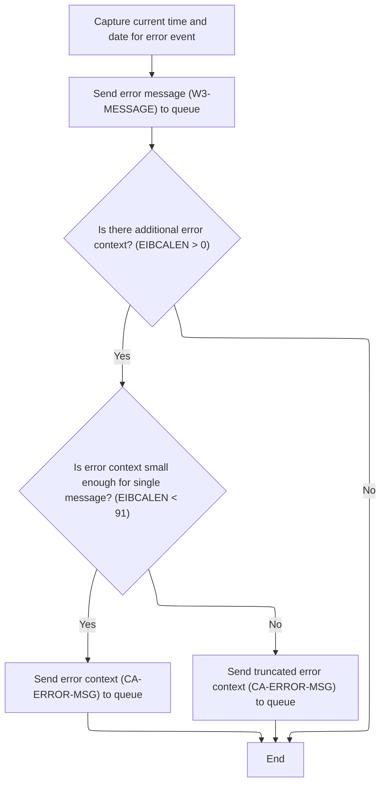

This section ensures that all error events are logged with accurate timestamps and relevant context, and that error messages are reliably routed to the appropriate queues for monitoring and troubleshooting.

| Category       | Rule Name                      | Description                                                                                                                      |
| -------------- | ------------------------------ | -------------------------------------------------------------------------------------------------------------------------------- |
| Business logic | Timestamp inclusion            | Every error event must include the current date and time in the log entry.                                                       |
| Business logic | Dual queue routing             | All error messages must be sent to both a transient queue and a temporary queue for redundancy and monitoring.                   |
| Business logic | Error context logging          | If additional error context is present, up to 90 bytes of context data must be included in the error log entry.                  |
| Business logic | Context truncation             | If the error context exceeds 90 bytes, only the first 90 bytes are logged and the rest is truncated.                             |
| Business logic | Minimal error logging          | If no additional error context is present, only the main error message is logged.                                                |
| Business logic | Special message parsing        | Special messages starting with 'Q=' must be parsed and routed with their extension and remaining data separated.                 |
| Business logic | Message receipt acknowledgment | If an error message is received from a queue (not a program), a one-character response must be sent back to acknowledge receipt. |

<SwmSnippet path="/base/src/lgapol01.cbl" line="119">

---

We fetch and format the current timestamp for the error log entry.

```cobol
       P999-ERROR.
      * Save SQLCODE in message
      * Obtain and format current time and date
           EXEC CICS ASKTIME ABSTIME(W2-TIME)
           END-EXEC
           EXEC CICS FORMATTIME ABSTIME(W2-TIME)
                     MMDDYYYY(W2-DATE1)
                     TIME(W2-DATE2)
           END-EXEC
```

---

</SwmSnippet>

<SwmSnippet path="/base/src/lgapol01.cbl" line="128">

---

After formatting the error message, we call LGSTSQ to handle the actual logging and queueing of the error message. This offloads message routing and storage to a dedicated program.

```cobol
           MOVE W2-DATE1 TO W3-DATE
           MOVE W2-DATE2 TO W3-TIME
      * Write output message to TDQ
           EXEC CICS LINK PROGRAM('LGSTSQ')
                     COMMAREA(W3-MESSAGE)
                     LENGTH(LENGTH OF W3-MESSAGE)
           END-EXEC.
```

---

</SwmSnippet>

<SwmSnippet path="/base/src/lgstsq.cbl" line="55">

---

<SwmToken path="base/src/lgstsq.cbl" pos="55:1:1" line-data="       MAINLINE SECTION.">`MAINLINE`</SwmToken> in LGSTSQ handles message routing: it decides whether to use the commarea or receive a message, parses special 'Q=' messages, and writes the message to both a transient and a temporary queue. If the message was received (not from a program), it sends a one-character response back. This covers both logging and flow control for error and status messages.

```cobol
       MAINLINE SECTION.

           MOVE SPACES TO WRITE-MSG.
           MOVE SPACES TO WS-RECV.

           EXEC CICS ASSIGN SYSID(WRITE-MSG-SYSID)
                RESP(WS-RESP)
           END-EXEC.

           EXEC CICS ASSIGN INVOKINGPROG(WS-INVOKEPROG)
                RESP(WS-RESP)
           END-EXEC.
           
           IF WS-INVOKEPROG NOT = SPACES
              MOVE 'C' To WS-FLAG
              MOVE COMMA-DATA  TO WRITE-MSG-MSG
              MOVE EIBCALEN    TO WS-RECV-LEN
           ELSE
              EXEC CICS RECEIVE INTO(WS-RECV)
                  LENGTH(WS-RECV-LEN)
                  RESP(WS-RESP)
              END-EXEC
              MOVE 'R' To WS-FLAG
              MOVE WS-RECV-DATA  TO WRITE-MSG-MSG
              SUBTRACT 5 FROM WS-RECV-LEN
           END-IF.

           MOVE 'GENAERRS' TO STSQ-NAME.
           IF WRITE-MSG-MSG(1:2) = 'Q=' THEN
              MOVE WRITE-MSG-MSG(3:4) TO STSQ-EXT
              MOVE WRITE-MSG-REST TO TEMPO
              MOVE TEMPO          TO WRITE-MSG-MSG
              SUBTRACT 7 FROM WS-RECV-LEN
           END-IF.

           ADD 5 TO WS-RECV-LEN.

      * Write output message to TDQ CSMT
      *
           EXEC CICS WRITEQ TD QUEUE(STDQ-NAME)
                     FROM(WRITE-MSG)
                     RESP(WS-RESP)
                     LENGTH(WS-RECV-LEN)

           END-EXEC.

      * Write output message to Genapp TSQ
      * If no space is available then the task will not wait for
      *  storage to become available but will ignore the request...
      *
           EXEC CICS WRITEQ TS QUEUE(STSQ-NAME)
                     FROM(WRITE-MSG)
                     RESP(WS-RESP)
                     NOSUSPEND
                     LENGTH(WS-RECV-LEN)

           END-EXEC.

           If WS-FLAG = 'R' Then
             EXEC CICS SEND TEXT FROM(FILLER-X)
              WAIT
              ERASE
              LENGTH(1)
              FREEKB
             END-EXEC.

           EXEC CICS RETURN
           END-EXEC.
```

---

</SwmSnippet>

<SwmSnippet path="/base/src/lgapol01.cbl" line="136">

---

After returning from LGSTSQ in <SwmToken path="base/src/lgapol01.cbl" pos="85:3:5" line-data="               PERFORM P999-ERROR">`P999-ERROR`</SwmToken>, we check if there's any commarea data. If so, we log up to 90 bytes of it (or less, if shorter) by calling LGSTSQ again. This keeps the error log concise but still captures relevant input data for troubleshooting.

```cobol
           IF EIBCALEN > 0 THEN
             IF EIBCALEN < 91 THEN
               MOVE DFHCOMMAREA(1:EIBCALEN) TO CA-DATA
               EXEC CICS LINK PROGRAM('LGSTSQ')
                         COMMAREA(CA-ERROR-MSG)
                         LENGTH(LENGTH OF CA-ERROR-MSG)
               END-EXEC
             ELSE
               MOVE DFHCOMMAREA(1:90) TO CA-DATA
               EXEC CICS LINK PROGRAM('LGSTSQ')
                         COMMAREA(CA-ERROR-MSG)
                         LENGTH(LENGTH OF CA-ERROR-MSG)
               END-EXEC
             END-IF
           END-IF.
           EXIT.
```

---

</SwmSnippet>

## Post-Error Handling and Input Validation

```mermaid
%%{init: {"flowchart": {"defaultRenderer": "elk"}} }%%
flowchart TD
    node1["Set CA-RETURN-CODE to '00' (success) and prepare request"] --> node2{"Is incoming request length (EIBCALEN) >= required (W4-REQ-LEN)?"}
    click node1 openCode "base/src/lgapol01.cbl:89:92"
    node2 -->|"No"| node3["Set CA-RETURN-CODE to '98' (error) and return"]
    click node2 openCode "base/src/lgapol01.cbl:95:98"
    click node3 openCode "base/src/lgapol01.cbl:96:98"
    node2 -->|"Yes"| node4["CICS Link to LGAPDB01 for processing"]
    click node4 openCode "base/src/lgapol01.cbl:103:106"
    node4 --> node5["Return to caller"]
    click node5 openCode "base/src/lgapol01.cbl:108:108"

classDef HeadingStyle fill:#777777,stroke:#333,stroke-width:2px;

%% Swimm:
%% %%{init: {"flowchart": {"defaultRenderer": "elk"}} }%%
%% flowchart TD
%%     node1["Set <SwmToken path="base/src/lgapol01.cbl" pos="89:9:13" line-data="           MOVE &#39;00&#39; TO CA-RETURN-CODE">`CA-RETURN-CODE`</SwmToken> to '00' (success) and prepare request"] --> node2{"Is incoming request length (EIBCALEN) >= required (<SwmToken path="base/src/lgapol01.cbl" pos="92:11:15" line-data="           ADD W4-HDR-LEN TO W4-REQ-LEN">`W4-REQ-LEN`</SwmToken>)?"}
%%     click node1 openCode "<SwmPath>[base/src/lgapol01.cbl](base/src/lgapol01.cbl)</SwmPath>:89:92"
%%     node2 -->|"No"| node3["Set <SwmToken path="base/src/lgapol01.cbl" pos="89:9:13" line-data="           MOVE &#39;00&#39; TO CA-RETURN-CODE">`CA-RETURN-CODE`</SwmToken> to '98' (error) and return"]
%%     click node2 openCode "<SwmPath>[base/src/lgapol01.cbl](base/src/lgapol01.cbl)</SwmPath>:95:98"
%%     click node3 openCode "<SwmPath>[base/src/lgapol01.cbl](base/src/lgapol01.cbl)</SwmPath>:96:98"
%%     node2 -->|"Yes"| node4["CICS Link to <SwmToken path="base/src/lgapol01.cbl" pos="103:9:9" line-data="           EXEC CICS Link Program(LGAPDB01)">`LGAPDB01`</SwmToken> for processing"]
%%     click node4 openCode "<SwmPath>[base/src/lgapol01.cbl](base/src/lgapol01.cbl)</SwmPath>:103:106"
%%     node4 --> node5["Return to caller"]
%%     click node5 openCode "<SwmPath>[base/src/lgapol01.cbl](base/src/lgapol01.cbl)</SwmPath>:108:108"
%% 
%% classDef HeadingStyle fill:#777777,stroke:#333,stroke-width:2px;
```

<SwmSnippet path="/base/src/lgapol01.cbl" line="89">

---

After error handling, we validate the input length and bail out if it's too short.

```cobol
           MOVE '00' TO CA-RETURN-CODE
           SET W1-PTR TO ADDRESS OF DFHCOMMAREA.

           ADD W4-HDR-LEN TO W4-REQ-LEN


           IF EIBCALEN IS LESS THAN W4-REQ-LEN
             MOVE '98' TO CA-RETURN-CODE
             EXEC CICS RETURN END-EXEC
           END-IF
```

---

</SwmSnippet>

<SwmSnippet path="/base/src/lgapol01.cbl" line="103">

---

We hand off to <SwmToken path="base/src/lgapol01.cbl" pos="103:9:9" line-data="           EXEC CICS Link Program(LGAPDB01)">`LGAPDB01`</SwmToken> for the main policy processing, then exit.

```cobol
           EXEC CICS Link Program(LGAPDB01)
                Commarea(DFHCOMMAREA)
                LENGTH(32500)
           END-EXEC.

           EXEC CICS RETURN END-EXEC.
```

---

</SwmSnippet>

# Policy File Processing and Summary Generation

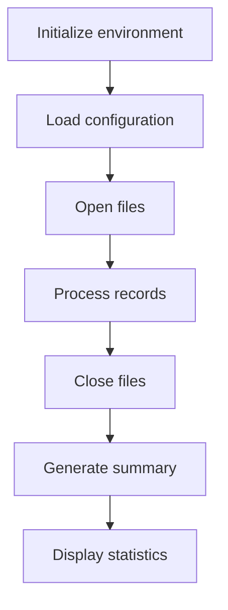

This section acts as the main driver for the policy file processing workflow, ensuring that all necessary steps are performed in sequence to produce a summary and statistics for business review.

| Category        | Rule Name                         | Description                                                                                                                                           |
| --------------- | --------------------------------- | ----------------------------------------------------------------------------------------------------------------------------------------------------- |
| Data validation | Configuration Loading Requirement | Configuration settings must be loaded before files are opened or records are processed.                                                               |
| Business logic  | Record Processing Integrity       | Each policy record must be processed according to business rules defined in the configuration, ensuring accurate data transformation and aggregation. |
| Business logic  | Summary Generation Mandate        | A summary of processed records must be generated, including key statistics relevant to business stakeholders.                                         |
| Business logic  | Statistics Display Requirement    | Statistics must be displayed in a clear and accessible format for business users after summary generation.                                            |

<SwmSnippet path="/base/src/LGAPDB01.cbl" line="90">

---

This is the main driver: setup, process, summarize, and finish.

```cobol
       P001.
           PERFORM P002-INITIALIZE
           PERFORM P003-LOAD-CONFIG
           PERFORM P005-OPEN-FILES
           PERFORM P006-PROCESS-RECORDS
           PERFORM P014-CLOSE-FILES
           PERFORM P015-GENERATE-SUMMARY
           PERFORM P016-DISPLAY-STATS
           STOP RUN.
```

---

</SwmSnippet>

# Record Loop and Validation

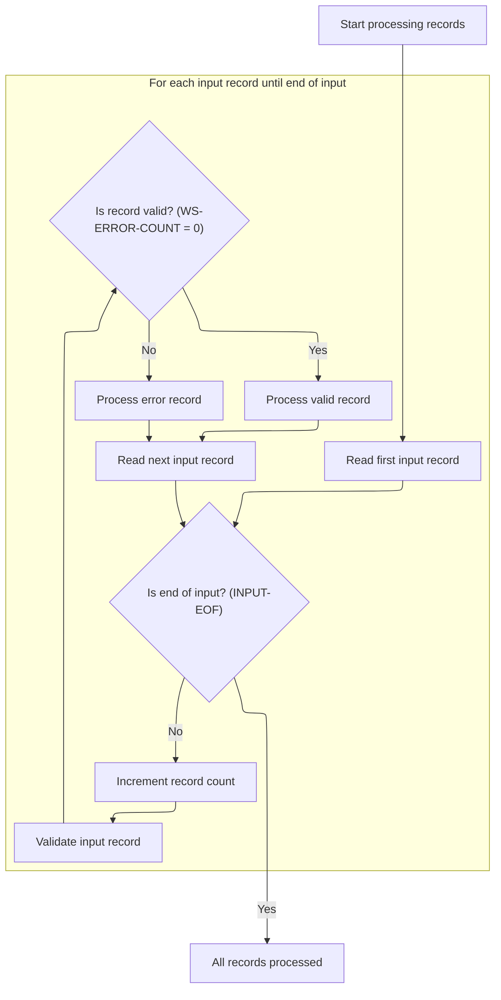

This section is responsible for looping through all input records, validating each record, and routing them to either valid or error handling paths. It also tracks processing statistics such as record counts and error counts.

| Category        | Rule Name                             | Description                                                                                                                                                                                                                            |
| --------------- | ------------------------------------- | -------------------------------------------------------------------------------------------------------------------------------------------------------------------------------------------------------------------------------------- |
| Data validation | End-of-file termination               | Processing must continue until the end-of-file condition is reached, which is defined as <SwmToken path="base/src/LGAPDB01.cbl" pos="11:7:11" line-data="                  FILE STATUS IS WS-IN-STAT.">`WS-IN-STAT`</SwmToken> = '10'. |
| Data validation | Input record validation               | Each input record must be validated before further processing. Validation is determined by <SwmToken path="base/src/LGAPDB01.cbl" pos="183:3:7" line-data="               IF WS-ERROR-COUNT = ZERO">`WS-ERROR-COUNT`</SwmToken> = 0.   |
| Business logic  | Valid vs error record routing         | If a record is valid, it must be processed as a valid record. If not, it must be processed as an error record.                                                                                                                         |
| Business logic  | Record count tracking                 | The total number of records processed must be tracked and incremented for each record.                                                                                                                                                 |
| Business logic  | Error and warning counter maintenance | Counters for errors, warnings, and rejected records must be maintained and updated as records are processed.                                                                                                                           |

<SwmSnippet path="/base/src/LGAPDB01.cbl" line="178">

---

We loop through all records, validate, and branch to valid/error handling.

```cobol
       P006-PROCESS-RECORDS.
           PERFORM P007-READ-INPUT
           PERFORM UNTIL INPUT-EOF
               ADD 1 TO WS-REC-CNT
               PERFORM P008-VALIDATE-INPUT-RECORD
               IF WS-ERROR-COUNT = ZERO
                   PERFORM P009-PROCESS-VALID-RECORD
               ELSE
                   PERFORM P010-PROCESS-ERROR-RECORD
               END-IF
               PERFORM P007-READ-INPUT
           END-PERFORM.
```

---

</SwmSnippet>

# Input Validation and Error Logging

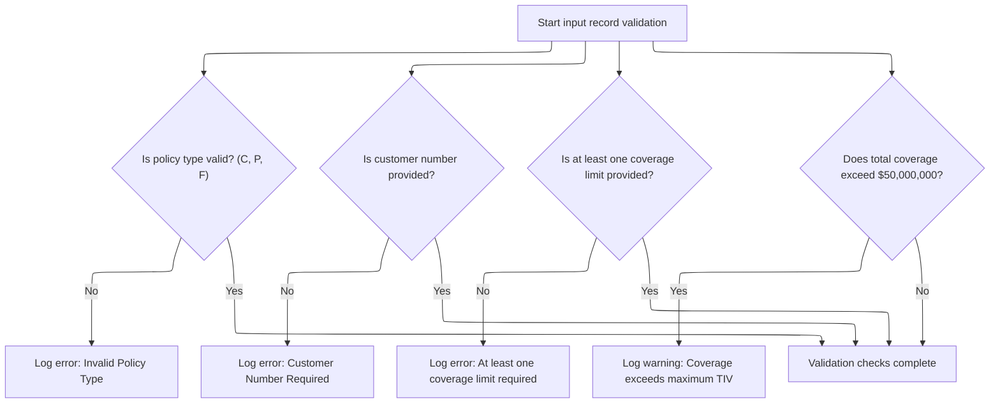

This section ensures that all required fields in an input record are present and valid, and logs any errors or warnings for business review and downstream processing.

| Category        | Rule Name                | Description                                                                                                                                                            |
| --------------- | ------------------------ | ---------------------------------------------------------------------------------------------------------------------------------------------------------------------- |
| Data validation | Valid Policy Type        | Only policy types 'C' (Commercial), 'P' (Personal), or 'F' (Farm) are considered valid. Any other value is rejected and logged as an error.                            |
| Data validation | Customer Number Required | A customer number must be provided for every input record. If missing, an error is logged and the record is considered invalid.                                        |
| Data validation | Coverage Limit Required  | At least one coverage limit (building, contents, or business interruption) must be provided. If all are zero, an error is logged and the record is considered invalid. |
| Business logic  | Maximum Coverage Warning | If the sum of building, contents, and business interruption coverage exceeds $50,000,000, a warning is logged but the record is not rejected.                          |

<SwmSnippet path="/base/src/LGAPDB01.cbl" line="195">

---

We validate required fields and log any issues for each input record.

```cobol
       P008-VALIDATE-INPUT-RECORD.
           INITIALIZE WS-ERROR-HANDLING
           
           IF NOT COMMERCIAL-POLICY AND 
              NOT PERSONAL-POLICY AND 
              NOT FARM-POLICY
               PERFORM P008A-LOG-ERROR WITH 
                   'POL001' 'F' 'IN-POLICY-TYPE' 
                   'Invalid Policy Type'
           END-IF
           
           IF IN-CUSTOMER-NUM = SPACES
               PERFORM P008A-LOG-ERROR WITH 
                   'CUS001' 'F' 'IN-CUSTOMER-NUM' 
                   'Customer Number Required'
           END-IF
           
           IF IN-BUILDING-LIMIT = ZERO AND 
              IN-CONTENTS-LIMIT = ZERO
               PERFORM P008A-LOG-ERROR WITH 
                   'COV001' 'F' 'COVERAGE-LIMITS' 
                   'At least one coverage limit required'
           END-IF
           
           IF IN-BUILDING-LIMIT + IN-CONTENTS-LIMIT + 
              IN-BI-LIMIT > WS-MAX-TIV
               PERFORM P008A-LOG-ERROR WITH 
                   'COV002' 'W' 'COVERAGE-LIMITS' 
                   'Total coverage exceeds maximum TIV'
           END-IF.
```

---

</SwmSnippet>

<SwmSnippet path="/base/src/LGAPDB01.cbl" line="226">

---

<SwmToken path="base/src/LGAPDB01.cbl" pos="226:1:5" line-data="       P008A-LOG-ERROR.">`P008A-LOG-ERROR`</SwmToken> increments the error count and stores error details in parallel arrays, indexed by the error count. This lets us track multiple errors per record, but only up to 20.

```cobol
       P008A-LOG-ERROR.
           ADD 1 TO WS-ERROR-COUNT
           SET ERR-IDX TO WS-ERROR-COUNT
           MOVE WS-ERROR-CODE TO WS-ERROR-CODE (ERR-IDX)
           MOVE WS-ERROR-SEVERITY TO WS-ERROR-SEVERITY (ERR-IDX)
           MOVE WS-ERROR-FIELD TO WS-ERROR-FIELD (ERR-IDX)
           MOVE WS-ERROR-MESSAGE TO WS-ERROR-MESSAGE (ERR-IDX).
```

---

</SwmSnippet>

# Valid Record Routing

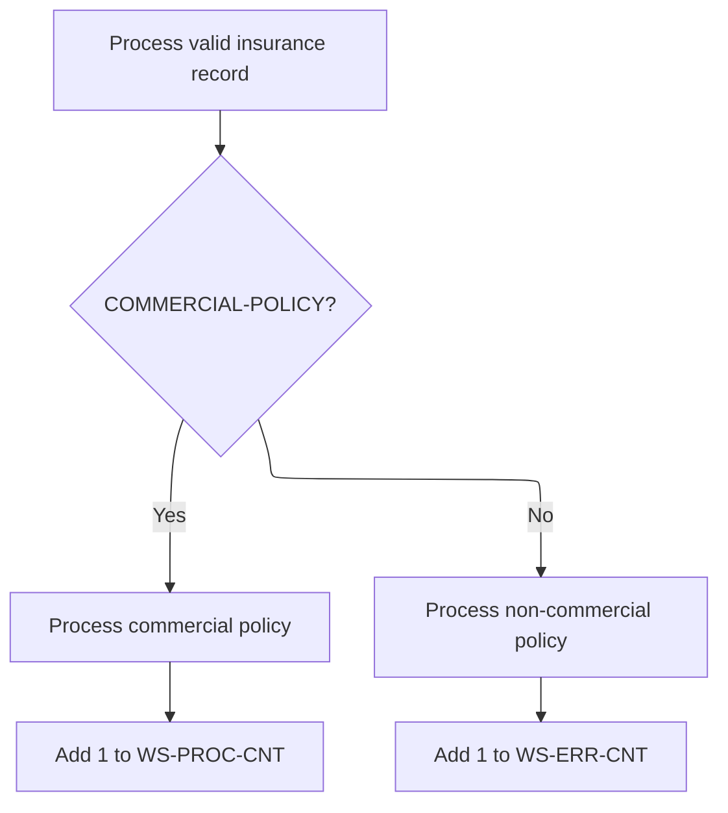

This section ensures that each valid insurance record is routed to the appropriate business logic for commercial or non-commercial policies, and that processing statistics are accurately maintained.

| Category        | Rule Name                        | Description                                                                                                                                                                                                                                                                                                                        |
| --------------- | -------------------------------- | ---------------------------------------------------------------------------------------------------------------------------------------------------------------------------------------------------------------------------------------------------------------------------------------------------------------------------------- |
| Data validation | Counter initialization           | The initial value of both <SwmToken path="base/src/LGAPDB01.cbl" pos="237:7:11" line-data="               ADD 1 TO WS-PROC-CNT">`WS-PROC-CNT`</SwmToken> and <SwmToken path="base/src/LGAPDB01.cbl" pos="240:7:11" line-data="               ADD 1 TO WS-ERR-CNT">`WS-ERR-CNT`</SwmToken> must be zero at the start of processing. |
| Business logic  | Commercial policy routing        | If the insurance record's <SwmToken path="base/src/LGAPDB01.cbl" pos="202:10:14" line-data="                   &#39;POL001&#39; &#39;F&#39; &#39;IN-POLICY-TYPE&#39; ">`IN-POLICY-TYPE`</SwmToken> is 'C', the record must be processed as a commercial policy.                                                                    |
| Business logic  | Non-commercial policy routing    | If the insurance record's <SwmToken path="base/src/LGAPDB01.cbl" pos="202:10:14" line-data="                   &#39;POL001&#39; &#39;F&#39; &#39;IN-POLICY-TYPE&#39; ">`IN-POLICY-TYPE`</SwmToken> is not 'C', the record must be processed as a non-commercial policy.                                                            |
| Business logic  | Processed counter for commercial | For each commercial policy processed, increment the processed counter (<SwmToken path="base/src/LGAPDB01.cbl" pos="237:7:11" line-data="               ADD 1 TO WS-PROC-CNT">`WS-PROC-CNT`</SwmToken>) by 1.                                                                                                                       |
| Business logic  | Error counter for non-commercial | For each non-commercial policy processed, increment the error counter (<SwmToken path="base/src/LGAPDB01.cbl" pos="240:7:11" line-data="               ADD 1 TO WS-ERR-CNT">`WS-ERR-CNT`</SwmToken>) by 1.                                                                                                                         |

<SwmSnippet path="/base/src/LGAPDB01.cbl" line="234">

---

We branch to commercial or non-commercial logic for each valid record.

```cobol
       P009-PROCESS-VALID-RECORD.
           IF COMMERCIAL-POLICY
               PERFORM P011-PROCESS-COMMERCIAL
               ADD 1 TO WS-PROC-CNT
           ELSE
               PERFORM P012-PROCESS-NON-COMMERCIAL
               ADD 1 TO WS-ERR-CNT
           END-IF.
```

---

</SwmSnippet>

# Commercial Policy Premium Calculation

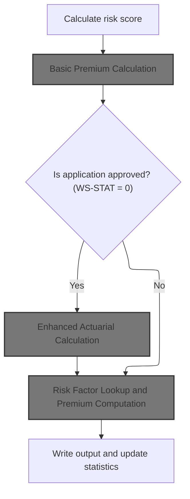

This section governs the calculation of commercial policy premiums, including risk assessment, basic and enhanced premium calculations, application of business rules, and output of results. Enhanced actuarial calculations are only performed for approved applications.

| Category        | Rule Name                                  | Description                                                                                                                                                                                                    |
| --------------- | ------------------------------------------ | -------------------------------------------------------------------------------------------------------------------------------------------------------------------------------------------------------------- |
| Data validation | Mandatory risk score assessment            | A risk score must be calculated for every commercial policy application using property and customer details before any premium calculation is performed.                                                       |
| Data validation | Minimum premium enforcement                | Minimum premium thresholds must be met during enhanced actuarial calculations; if the calculated premium is below the minimum, it must be adjusted upwards.                                                    |
| Business logic  | Universal basic premium calculation        | Basic premium calculation must be performed for all applications, regardless of underwriting decision status.                                                                                                  |
| Business logic  | Conditional enhanced premium calculation   | Enhanced actuarial premium calculation is only performed if the application is approved (<SwmToken path="base/src/LGAPDB01.cbl" pos="261:3:5" line-data="           IF WS-STAT = 0">`WS-STAT`</SwmToken> = 0). |
| Business logic  | Fallback risk factor premium computation   | If the application is not approved, risk factor lookup and premium computation must be performed using available risk data.                                                                                    |
| Business logic  | Comprehensive output and statistics update | All calculated outputs, including premium values, risk status, verdict, rejection reason, and discount factor, must be written to the output record and statistics updated for each processed application.     |
| Business logic  | Discount eligibility consideration         | Discount eligibility factors (multi-policy, claims-free, safety program) must be considered when calculating the total discount factor for the premium.                                                        |

<SwmSnippet path="/base/src/LGAPDB01.cbl" line="258">

---

In <SwmToken path="base/src/LGAPDB01.cbl" pos="258:1:5" line-data="       P011-PROCESS-COMMERCIAL.">`P011-PROCESS-COMMERCIAL`</SwmToken>, we calculate the risk score, basic premium, and—if approved—run enhanced actuarial calculations. Then we apply business rules, write the output, and update stats. This keeps the heavy calculations limited to approved policies.

```cobol
       P011-PROCESS-COMMERCIAL.
           PERFORM P011A-CALCULATE-RISK-SCORE
           PERFORM P011B-BASIC-PREMIUM-CALC
           IF WS-STAT = 0
               PERFORM P011C-ENHANCED-ACTUARIAL-CALC
           END-IF
           PERFORM P011D-APPLY-BUSINESS-RULES
           PERFORM P011E-WRITE-OUTPUT-RECORD
           PERFORM P011F-UPDATE-STATISTICS.
```

---

</SwmSnippet>

<SwmSnippet path="/base/src/LGAPDB01.cbl" line="268">

---

<SwmToken path="base/src/LGAPDB01.cbl" pos="268:1:7" line-data="       P011A-CALCULATE-RISK-SCORE.">`P011A-CALCULATE-RISK-SCORE`</SwmToken> just calls <SwmToken path="base/src/LGAPDB01.cbl" pos="269:4:4" line-data="           CALL &#39;LGAPDB02&#39; USING IN-PROPERTY-TYPE, IN-POSTCODE, ">`LGAPDB02`</SwmToken> with property and customer details to get the risk score. The actual calculation is outside this function, keeping things modular.

```cobol
       P011A-CALCULATE-RISK-SCORE.
           CALL 'LGAPDB02' USING IN-PROPERTY-TYPE, IN-POSTCODE, 
                                IN-LATITUDE, IN-LONGITUDE,
                                IN-BUILDING-LIMIT, IN-CONTENTS-LIMIT,
                                IN-FLOOD-COVERAGE, IN-WEATHER-COVERAGE,
                                IN-CUSTOMER-HISTORY, WS-BASE-RISK-SCR.
```

---

</SwmSnippet>

## Basic Premium Calculation

This section is responsible for calculating the basic premium and determining the underwriting status for a property insurance policy based on risk and peril data.

| Category        | Rule Name                      | Description                                                                                                                                                                                                                                                                               |
| --------------- | ------------------------------ | ----------------------------------------------------------------------------------------------------------------------------------------------------------------------------------------------------------------------------------------------------------------------------------------- |
| Data validation | Rejection Reason Requirement   | If the underwriting status is 'rejected', a rejection reason must be provided in the output.                                                                                                                                                                                              |
| Data validation | Default Value Usage            | Premium calculations must use the initial values for risk score (0), discount factor (<SwmToken path="base/src/LGAPDB03.cbl" pos="93:3:5" line-data="           MOVE 1.00 TO LK-DISC-FACT">`1.00`</SwmToken>), and underwriting status (0) unless updated by the risk and peril analysis. |
| Business logic  | Peril Premium Calculation      | Premium amounts for each peril (fire, crime, flood, weather) must be calculated based on the provided risk score and peril information for the property.                                                                                                                                  |
| Business logic  | Total Premium Calculation      | The total premium must be the sum of the individual peril premiums, adjusted by any applicable discount factor.                                                                                                                                                                           |
| Business logic  | Discount Eligibility           | The discount factor must be applied to the total premium if the policyholder is eligible for discounts such as multi-policy, claims-free, or safety program participation.                                                                                                                |
| Business logic  | Underwriting Status Assignment | The underwriting status must be set to 'approved', 'pending', 'rejected', or 'referred' based on the risk score and other underwriting criteria.                                                                                                                                          |

<SwmSnippet path="/base/src/LGAPDB01.cbl" line="275">

---

<SwmToken path="base/src/LGAPDB01.cbl" pos="275:1:7" line-data="       P011B-BASIC-PREMIUM-CALC.">`P011B-BASIC-PREMIUM-CALC`</SwmToken> calls <SwmToken path="base/src/LGAPDB01.cbl" pos="276:4:4" line-data="           CALL &#39;LGAPDB03&#39; USING WS-BASE-RISK-SCR, IN-FIRE-PERIL, ">`LGAPDB03`</SwmToken> with the risk score and peril info to get the premium amounts and underwriting status. This keeps premium logic out of the main flow.

```cobol
       P011B-BASIC-PREMIUM-CALC.
           CALL 'LGAPDB03' USING WS-BASE-RISK-SCR, IN-FIRE-PERIL, 
                                IN-CRIME-PERIL, IN-FLOOD-PERIL, 
                                IN-WEATHER-PERIL, WS-STAT,
                                WS-STAT-DESC, WS-REJ-RSN, WS-FR-PREM,
                                WS-CR-PREM, WS-FL-PREM, WS-WE-PREM,
                                WS-TOT-PREM, WS-DISC-FACT.
```

---

</SwmSnippet>

## Risk Factor Lookup and Premium Computation

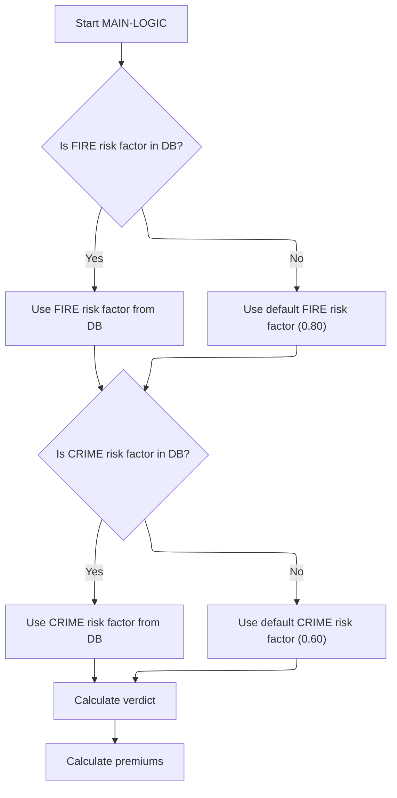

This section ensures that risk factors for FIRE and CRIME are available for premium computation, either by fetching them from the database or by using predefined defaults if unavailable.

| Category        | Rule Name                       | Description                                                                                                                                                                                                  |
| --------------- | ------------------------------- | ------------------------------------------------------------------------------------------------------------------------------------------------------------------------------------------------------------ |
| Data validation | Database risk factor lookup     | Always attempt to retrieve FIRE and CRIME risk factors from the database before using defaults.                                                                                                              |
| Business logic  | Default FIRE risk factor        | If the FIRE risk factor is not found in the database, use a default value of <SwmToken path="base/src/LGAPDB03.cbl" pos="58:3:5" line-data="               MOVE 0.80 TO WS-FIRE-FACTOR">`0.80`</SwmToken>.   |
| Business logic  | Default CRIME risk factor       | If the CRIME risk factor is not found in the database, use a default value of <SwmToken path="base/src/LGAPDB03.cbl" pos="70:3:5" line-data="               MOVE 0.60 TO WS-CRIME-FACTOR">`0.60`</SwmToken>. |
| Business logic  | Premium and verdict calculation | Premiums and verdicts must be calculated using the final risk factors (from DB or default).                                                                                                                  |

<SwmSnippet path="/base/src/LGAPDB03.cbl" line="42">

---

We look up risk factors, fall back to defaults if needed, then compute the premium and verdict.

```cobol
       MAIN-LOGIC.
           PERFORM GET-RISK-FACTORS
           PERFORM CALCULATE-VERDICT
           PERFORM CALCULATE-PREMIUMS
           GOBACK.
```

---

</SwmSnippet>

<SwmSnippet path="/base/src/LGAPDB03.cbl" line="48">

---

<SwmToken path="base/src/LGAPDB03.cbl" pos="48:1:5" line-data="       GET-RISK-FACTORS.">`GET-RISK-FACTORS`</SwmToken> tries to fetch fire and crime risk factors from the DB. If the query fails, it uses hardcoded defaults (<SwmToken path="base/src/LGAPDB03.cbl" pos="58:3:5" line-data="               MOVE 0.80 TO WS-FIRE-FACTOR">`0.80`</SwmToken> for fire, <SwmToken path="base/src/LGAPDB03.cbl" pos="70:3:5" line-data="               MOVE 0.60 TO WS-CRIME-FACTOR">`0.60`</SwmToken> for crime) to keep the calculation moving.

```cobol
       GET-RISK-FACTORS.
           EXEC SQL
               SELECT FACTOR_VALUE INTO :WS-FIRE-FACTOR
               FROM RISK_FACTORS
               WHERE PERIL_TYPE = 'FIRE'
           END-EXEC.
           
           IF SQLCODE = 0
               CONTINUE
           ELSE
               MOVE 0.80 TO WS-FIRE-FACTOR
           END-IF.
           
           EXEC SQL
               SELECT FACTOR_VALUE INTO :WS-CRIME-FACTOR
               FROM RISK_FACTORS
               WHERE PERIL_TYPE = 'CRIME'
           END-EXEC.
           
           IF SQLCODE = 0
               CONTINUE
           ELSE
               MOVE 0.60 TO WS-CRIME-FACTOR
           END-IF.
```

---

</SwmSnippet>

## Enhanced Actuarial Calculation

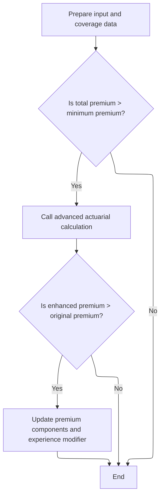

This section governs the process for performing enhanced actuarial calculations for insurance premium determination. It ensures that advanced actuarial logic is only applied to qualifying cases and that premium components are updated only when the enhanced calculation results in a higher premium.

| Category        | Rule Name                   | Description                                                                                                                                                                                   |
| --------------- | --------------------------- | --------------------------------------------------------------------------------------------------------------------------------------------------------------------------------------------- |
| Data validation | Minimum premium threshold   | Advanced actuarial calculation is only performed if the total premium exceeds the minimum premium threshold (currently set at $500.00).                                                       |
| Data validation | Input data preparation      | All relevant customer, property, and coverage data must be prepared and mapped correctly before performing the advanced actuarial calculation.                                                |
| Business logic  | Enhanced premium update     | If the enhanced actuarial calculation produces a total premium greater than the original premium, the premium components and experience modifier are updated to reflect the enhanced results. |
| Business logic  | No change for lower premium | If the enhanced actuarial calculation does not produce a higher premium than the original, no changes are made to the premium components or experience modifier.                              |

<SwmSnippet path="/base/src/LGAPDB01.cbl" line="283">

---

<SwmToken path="base/src/LGAPDB01.cbl" pos="283:1:7" line-data="       P011C-ENHANCED-ACTUARIAL-CALC.">`P011C-ENHANCED-ACTUARIAL-CALC`</SwmToken> sets up all the detailed input fields and calls <SwmToken path="base/src/LGAPDB01.cbl" pos="313:4:4" line-data="               CALL &#39;LGAPDB04&#39; USING LK-INPUT-DATA, LK-COVERAGE-DATA, ">`LGAPDB04`</SwmToken> for advanced premium calculations, but only if the initial premium is above the minimum. If the enhanced premium is higher, we update the results.

```cobol
       P011C-ENHANCED-ACTUARIAL-CALC.
      *    Prepare input structure for actuarial calculation
           MOVE IN-CUSTOMER-NUM TO LK-CUSTOMER-NUM
           MOVE WS-BASE-RISK-SCR TO LK-RISK-SCORE
           MOVE IN-PROPERTY-TYPE TO LK-PROPERTY-TYPE
           MOVE IN-TERRITORY-CODE TO LK-TERRITORY
           MOVE IN-CONSTRUCTION-TYPE TO LK-CONSTRUCTION-TYPE
           MOVE IN-OCCUPANCY-CODE TO LK-OCCUPANCY-CODE
           MOVE IN-SPRINKLER-IND TO LK-PROTECTION-CLASS
           MOVE IN-YEAR-BUILT TO LK-YEAR-BUILT
           MOVE IN-SQUARE-FOOTAGE TO LK-SQUARE-FOOTAGE
           MOVE IN-YEARS-IN-BUSINESS TO LK-YEARS-IN-BUSINESS
           MOVE IN-CLAIMS-COUNT-3YR TO LK-CLAIMS-COUNT-5YR
           MOVE IN-CLAIMS-AMOUNT-3YR TO LK-CLAIMS-AMOUNT-5YR
           
      *    Set coverage data
           MOVE IN-BUILDING-LIMIT TO LK-BUILDING-LIMIT
           MOVE IN-CONTENTS-LIMIT TO LK-CONTENTS-LIMIT
           MOVE IN-BI-LIMIT TO LK-BI-LIMIT
           MOVE IN-FIRE-DEDUCTIBLE TO LK-FIRE-DEDUCTIBLE
           MOVE IN-WIND-DEDUCTIBLE TO LK-WIND-DEDUCTIBLE
           MOVE IN-FLOOD-DEDUCTIBLE TO LK-FLOOD-DEDUCTIBLE
           MOVE IN-OTHER-DEDUCTIBLE TO LK-OTHER-DEDUCTIBLE
           MOVE IN-FIRE-PERIL TO LK-FIRE-PERIL
           MOVE IN-CRIME-PERIL TO LK-CRIME-PERIL
           MOVE IN-FLOOD-PERIL TO LK-FLOOD-PERIL
           MOVE IN-WEATHER-PERIL TO LK-WEATHER-PERIL
           
      *    Call advanced actuarial calculation program (only for approved cases)
           IF WS-TOT-PREM > WS-MIN-PREMIUM
               CALL 'LGAPDB04' USING LK-INPUT-DATA, LK-COVERAGE-DATA, 
                                    LK-OUTPUT-RESULTS
               
      *        Update with enhanced calculations if successful
               IF LK-TOTAL-PREMIUM > WS-TOT-PREM
                   MOVE LK-FIRE-PREMIUM TO WS-FR-PREM
                   MOVE LK-CRIME-PREMIUM TO WS-CR-PREM
                   MOVE LK-FLOOD-PREMIUM TO WS-FL-PREM
                   MOVE LK-WEATHER-PREMIUM TO WS-WE-PREM
                   MOVE LK-TOTAL-PREMIUM TO WS-TOT-PREM
                   MOVE LK-EXPERIENCE-MOD TO WS-EXPERIENCE-MOD
               END-IF
           END-IF.
```

---

</SwmSnippet>

## Premium Component Calculation and Finalization

```mermaid
%%{init: {"flowchart": {"defaultRenderer": "elk"}} }%%
flowchart TD
    node1["Start premium calculation"]
    click node1 openCode "base/src/LGAPDB04.cbl:138:150"
    node1 --> node2{"Years in business >= 5?"}
    click node2 openCode "base/src/LGAPDB04.cbl:237:257"
    node2 -->|"Yes"| node3{"Claims in last 5 years = 0?"}
    node2 -->|"No"| node4["Set experience modifier to 1.1"]
    click node4 openCode "base/src/LGAPDB04.cbl:255:256"
    node3 -->|"Yes"| node5["Set experience modifier to 0.85"]
    click node5 openCode "base/src/LGAPDB04.cbl:239:240"
    node3 -->|"No"| node6["Calculate modifier based on claims"]
    click node6 openCode "base/src/LGAPDB04.cbl:241:252"
    node6 --> node7{"Modifier > 2.0?"}
    click node7 openCode "base/src/LGAPDB04.cbl:246:247"
    node7 -->|"Yes"| node8["Set modifier to 2.0"]
    click node8 openCode "base/src/LGAPDB04.cbl:247:248"
    node7 -->|"No"| node9{"Modifier < 0.5?"}
    click node9 openCode "base/src/LGAPDB04.cbl:250:251"
    node9 -->|"Yes"| node10["Set modifier to 0.5"]
    click node10 openCode "base/src/LGAPDB04.cbl:251:252"
    node9 -->|"No"| node11["Use calculated modifier"]
    click node11 openCode "base/src/LGAPDB04.cbl:241:252"
    node5 --> node12["Calculate base premium for covered perils"]
    click node12 openCode "base/src/LGAPDB04.cbl:318:367"
    node4 --> node12
    node8 --> node12
    node10 --> node12
    node11 --> node12
    node12 --> node13["Calculate taxes (6.75%)"]
    click node13 openCode "base/src/LGAPDB04.cbl:456:462"
    node13 --> node14["Calculate final premium and rate factor"]
    click node14 openCode "base/src/LGAPDB04.cbl:464:472"
    node14 --> node15{"Is rate factor > 0.05?"}
    click node15 openCode "base/src/LGAPDB04.cbl:473:477"
    node15 -->|"Yes"| node16["Cap rate factor at 0.05 and recalculate premium"]
    click node16 openCode "base/src/LGAPDB04.cbl:474:476"
    node15 -->|"No"| node17["Return final premium"]
    click node17 openCode "base/src/LGAPDB04.cbl:465:477"

classDef HeadingStyle fill:#777777,stroke:#333,stroke-width:2px;

%% Swimm:
%% %%{init: {"flowchart": {"defaultRenderer": "elk"}} }%%
%% flowchart TD
%%     node1["Start premium calculation"]
%%     click node1 openCode "<SwmPath>[base/src/LGAPDB04.cbl](base/src/LGAPDB04.cbl)</SwmPath>:138:150"
%%     node1 --> node2{"Years in business >= 5?"}
%%     click node2 openCode "<SwmPath>[base/src/LGAPDB04.cbl](base/src/LGAPDB04.cbl)</SwmPath>:237:257"
%%     node2 -->|"Yes"| node3{"Claims in last 5 years = 0?"}
%%     node2 -->|"No"| node4["Set experience modifier to 1.1"]
%%     click node4 openCode "<SwmPath>[base/src/LGAPDB04.cbl](base/src/LGAPDB04.cbl)</SwmPath>:255:256"
%%     node3 -->|"Yes"| node5["Set experience modifier to 0.85"]
%%     click node5 openCode "<SwmPath>[base/src/LGAPDB04.cbl](base/src/LGAPDB04.cbl)</SwmPath>:239:240"
%%     node3 -->|"No"| node6["Calculate modifier based on claims"]
%%     click node6 openCode "<SwmPath>[base/src/LGAPDB04.cbl](base/src/LGAPDB04.cbl)</SwmPath>:241:252"
%%     node6 --> node7{"Modifier > 2.0?"}
%%     click node7 openCode "<SwmPath>[base/src/LGAPDB04.cbl](base/src/LGAPDB04.cbl)</SwmPath>:246:247"
%%     node7 -->|"Yes"| node8["Set modifier to 2.0"]
%%     click node8 openCode "<SwmPath>[base/src/LGAPDB04.cbl](base/src/LGAPDB04.cbl)</SwmPath>:247:248"
%%     node7 -->|"No"| node9{"Modifier < 0.5?"}
%%     click node9 openCode "<SwmPath>[base/src/LGAPDB04.cbl](base/src/LGAPDB04.cbl)</SwmPath>:250:251"
%%     node9 -->|"Yes"| node10["Set modifier to 0.5"]
%%     click node10 openCode "<SwmPath>[base/src/LGAPDB04.cbl](base/src/LGAPDB04.cbl)</SwmPath>:251:252"
%%     node9 -->|"No"| node11["Use calculated modifier"]
%%     click node11 openCode "<SwmPath>[base/src/LGAPDB04.cbl](base/src/LGAPDB04.cbl)</SwmPath>:241:252"
%%     node5 --> node12["Calculate base premium for covered perils"]
%%     click node12 openCode "<SwmPath>[base/src/LGAPDB04.cbl](base/src/LGAPDB04.cbl)</SwmPath>:318:367"
%%     node4 --> node12
%%     node8 --> node12
%%     node10 --> node12
%%     node11 --> node12
%%     node12 --> node13["Calculate taxes (6.75%)"]
%%     click node13 openCode "<SwmPath>[base/src/LGAPDB04.cbl](base/src/LGAPDB04.cbl)</SwmPath>:456:462"
%%     node13 --> node14["Calculate final premium and rate factor"]
%%     click node14 openCode "<SwmPath>[base/src/LGAPDB04.cbl](base/src/LGAPDB04.cbl)</SwmPath>:464:472"
%%     node14 --> node15{"Is rate factor > 0.05?"}
%%     click node15 openCode "<SwmPath>[base/src/LGAPDB04.cbl](base/src/LGAPDB04.cbl)</SwmPath>:473:477"
%%     node15 -->|"Yes"| node16["Cap rate factor at 0.05 and recalculate premium"]
%%     click node16 openCode "<SwmPath>[base/src/LGAPDB04.cbl](base/src/LGAPDB04.cbl)</SwmPath>:474:476"
%%     node15 -->|"No"| node17["Return final premium"]
%%     click node17 openCode "<SwmPath>[base/src/LGAPDB04.cbl](base/src/LGAPDB04.cbl)</SwmPath>:465:477"
%% 
%% classDef HeadingStyle fill:#777777,stroke:#333,stroke-width:2px;
```

This section determines the total premium for an insurance policy by applying business rules to exposures, rates, experience/schedule modifiers, peril-specific calculations, taxes, and final caps. Each step ensures the premium is calculated fairly and within defined business limits.

| Category       | Rule Name                               | Description                                                                                                                                                                                                                                                                                                                                                                                     |
| -------------- | --------------------------------------- | ----------------------------------------------------------------------------------------------------------------------------------------------------------------------------------------------------------------------------------------------------------------------------------------------------------------------------------------------------------------------------------------------- |
| Business logic | New business experience modifier        | If the insured has been in business for less than 5 years, the experience modifier is set to 1.1 regardless of claims history.                                                                                                                                                                                                                                                                  |
| Business logic | No claims experience discount           | If the insured has been in business for at least 5 years and has zero claims in the last 5 years, the experience modifier is set to 0.85.                                                                                                                                                                                                                                                       |
| Business logic | Claims-based experience modifier bounds | If the insured has been in business for at least 5 years and has claims, the experience modifier is calculated using a formula based on claims amount, total insured value, and a credibility factor, but is capped between 0.5 and 2.0.                                                                                                                                                        |
| Business logic | Peril-specific premium multipliers      | Base premium for each peril is only calculated if the peril is present, and uses business-defined multipliers: <SwmToken path="base/src/LGAPDB03.cbl" pos="58:3:5" line-data="               MOVE 0.80 TO WS-FIRE-FACTOR">`0.80`</SwmToken> for crime, <SwmToken path="base/src/LGAPDB04.cbl" pos="352:9:11" line-data="                   WS-TREND-FACTOR * 1.25">`1.25`</SwmToken> for flood. |
| Business logic | Premium tax calculation                 | Taxes are calculated by summing all premium components, subtracting discounts, and multiplying by a fixed tax rate of 6.75%.                                                                                                                                                                                                                                                                    |
| Business logic | Rate factor cap                         | The final rate factor is capped at 0.05. If the calculated rate factor exceeds this cap, the total premium is recalculated to match the capped rate.                                                                                                                                                                                                                                            |

<SwmSnippet path="/base/src/LGAPDB04.cbl" line="138">

---

<SwmToken path="base/src/LGAPDB04.cbl" pos="138:1:3" line-data="       P100-MAIN.">`P100-MAIN`</SwmToken> in <SwmToken path="base/src/LGAPDB01.cbl" pos="313:4:4" line-data="               CALL &#39;LGAPDB04&#39; USING LK-INPUT-DATA, LK-COVERAGE-DATA, ">`LGAPDB04`</SwmToken> runs through all the premium component calculations in sequence: exposures, rates, experience/schedule mods, base/cat/expense/profit loads, discounts, taxes, and finally computes the total premium and rate factor. Each step builds on the last.

```cobol
       P100-MAIN.
           PERFORM P200-INIT
           PERFORM P300-RATES
           PERFORM P350-EXPOSURE
           PERFORM P400-EXP-MOD
           PERFORM P500-SCHED-MOD
           PERFORM P600-BASE-PREM
           PERFORM P700-CAT-LOAD
           PERFORM P800-EXPENSE
           PERFORM P900-DISC
           PERFORM P950-TAXES
           PERFORM P999-FINAL
           GOBACK.
```

---

</SwmSnippet>

<SwmSnippet path="/base/src/LGAPDB04.cbl" line="234">

---

<SwmToken path="base/src/LGAPDB04.cbl" pos="234:1:5" line-data="       P400-EXP-MOD.">`P400-EXP-MOD`</SwmToken> calculates the experience modifier using years in business and claims history, with hardcoded bounds and scaling factors. This keeps the modifier within business-defined limits.

```cobol
       P400-EXP-MOD.
           MOVE 1.0000 TO WS-EXPERIENCE-MOD
           
           IF LK-YEARS-IN-BUSINESS >= 5
               IF LK-CLAIMS-COUNT-5YR = ZERO
                   MOVE 0.8500 TO WS-EXPERIENCE-MOD
               ELSE
                   COMPUTE WS-EXPERIENCE-MOD = 
                       1.0000 + 
                       ((LK-CLAIMS-AMOUNT-5YR / WS-TOTAL-INSURED-VAL) * 
                        WS-CREDIBILITY-FACTOR * 0.50)
                   
                   IF WS-EXPERIENCE-MOD > 2.0000
                       MOVE 2.0000 TO WS-EXPERIENCE-MOD
                   END-IF
                   
                   IF WS-EXPERIENCE-MOD < 0.5000
                       MOVE 0.5000 TO WS-EXPERIENCE-MOD
                   END-IF
               END-IF
           ELSE
               MOVE 1.1000 TO WS-EXPERIENCE-MOD
           END-IF
           
           MOVE WS-EXPERIENCE-MOD TO LK-EXPERIENCE-MOD.
```

---

</SwmSnippet>

<SwmSnippet path="/base/src/LGAPDB04.cbl" line="318">

---

<SwmToken path="base/src/LGAPDB04.cbl" pos="318:1:5" line-data="       P600-BASE-PREM.">`P600-BASE-PREM`</SwmToken> calculates the base premium for each peril, using business-defined multipliers (<SwmToken path="base/src/LGAPDB04.cbl" pos="336:10:12" line-data="                   (WS-CONTENTS-EXPOSURE * 0.80) *">`0.80`</SwmToken> for crime, <SwmToken path="base/src/LGAPDB04.cbl" pos="352:9:11" line-data="                   WS-TREND-FACTOR * 1.25">`1.25`</SwmToken> for flood) and only including perils that are present. Each premium is added to the total base amount.

```cobol
       P600-BASE-PREM.
           MOVE ZERO TO LK-BASE-AMOUNT
           
      * FIRE PREMIUM
           IF LK-FIRE-PERIL > ZERO
               COMPUTE LK-FIRE-PREMIUM = 
                   (WS-BUILDING-EXPOSURE + WS-CONTENTS-EXPOSURE) *
                   WS-BASE-RATE (1, 1, 1, 1) * 
                   WS-EXPERIENCE-MOD *
                   (1 + WS-SCHEDULE-MOD) *
                   WS-TREND-FACTOR
                   
               ADD LK-FIRE-PREMIUM TO LK-BASE-AMOUNT
           END-IF
           
      * CRIME PREMIUM
           IF LK-CRIME-PERIL > ZERO
               COMPUTE LK-CRIME-PREMIUM = 
                   (WS-CONTENTS-EXPOSURE * 0.80) *
                   WS-BASE-RATE (2, 1, 1, 1) * 
                   WS-EXPERIENCE-MOD *
                   (1 + WS-SCHEDULE-MOD) *
                   WS-TREND-FACTOR
                   
               ADD LK-CRIME-PREMIUM TO LK-BASE-AMOUNT
           END-IF
           
      * FLOOD PREMIUM
           IF LK-FLOOD-PERIL > ZERO
               COMPUTE LK-FLOOD-PREMIUM = 
                   WS-BUILDING-EXPOSURE *
                   WS-BASE-RATE (3, 1, 1, 1) * 
                   WS-EXPERIENCE-MOD *
                   (1 + WS-SCHEDULE-MOD) *
                   WS-TREND-FACTOR * 1.25
                   
               ADD LK-FLOOD-PREMIUM TO LK-BASE-AMOUNT
           END-IF
           
      * WEATHER PREMIUM
           IF LK-WEATHER-PERIL > ZERO
               COMPUTE LK-WEATHER-PREMIUM = 
                   (WS-BUILDING-EXPOSURE + WS-CONTENTS-EXPOSURE) *
                   WS-BASE-RATE (4, 1, 1, 1) * 
                   WS-EXPERIENCE-MOD *
                   (1 + WS-SCHEDULE-MOD) *
                   WS-TREND-FACTOR
                   
               ADD LK-WEATHER-PREMIUM TO LK-BASE-AMOUNT
           END-IF.
```

---

</SwmSnippet>

<SwmSnippet path="/base/src/LGAPDB04.cbl" line="456">

---

<SwmToken path="base/src/LGAPDB04.cbl" pos="456:1:3" line-data="       P950-TAXES.">`P950-TAXES`</SwmToken> computes the tax by summing up all the premium components, subtracting discounts, and multiplying by a fixed tax rate (<SwmToken path="base/src/LGAPDB04.cbl" pos="460:10:12" line-data="                LK-DISCOUNT-AMT) * 0.0675">`0.0675`</SwmToken>). The result is stored for later use.

```cobol
       P950-TAXES.
           COMPUTE WS-TAX-AMOUNT = 
               (LK-BASE-AMOUNT + LK-CAT-LOAD-AMT + 
                LK-EXPENSE-LOAD-AMT + LK-PROFIT-LOAD-AMT - 
                LK-DISCOUNT-AMT) * 0.0675
                
           MOVE WS-TAX-AMOUNT TO LK-TAX-AMT.
```

---

</SwmSnippet>

<SwmSnippet path="/base/src/LGAPDB04.cbl" line="464">

---

<SwmToken path="base/src/LGAPDB04.cbl" pos="464:1:3" line-data="       P999-FINAL.">`P999-FINAL`</SwmToken> sums up all premium components, calculates the rate factor, and caps it at 0.05 if needed. If capped, it recalculates the total premium to match the limit. This keeps premiums within business-defined bounds.

```cobol
       P999-FINAL.
           COMPUTE LK-TOTAL-PREMIUM = 
               LK-BASE-AMOUNT + LK-CAT-LOAD-AMT + 
               LK-EXPENSE-LOAD-AMT + LK-PROFIT-LOAD-AMT -
               LK-DISCOUNT-AMT + LK-TAX-AMT
               
           COMPUTE LK-FINAL-RATE-FACTOR = 
               LK-TOTAL-PREMIUM / WS-TOTAL-INSURED-VAL
               
           IF LK-FINAL-RATE-FACTOR > 0.050000
               MOVE 0.050000 TO LK-FINAL-RATE-FACTOR
               COMPUTE LK-TOTAL-PREMIUM = 
                   WS-TOTAL-INSURED-VAL * LK-FINAL-RATE-FACTOR
           END-IF.
```

---

</SwmSnippet>

## Business Rules, Output, and Statistics

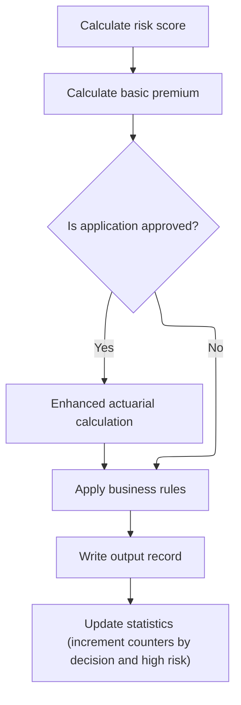

<SwmSnippet path="/base/src/LGAPDB01.cbl" line="258">

---

After calculations, we apply business rules, write output, and update stats.

```cobol
       P011-PROCESS-COMMERCIAL.
           PERFORM P011A-CALCULATE-RISK-SCORE
           PERFORM P011B-BASIC-PREMIUM-CALC
           IF WS-STAT = 0
               PERFORM P011C-ENHANCED-ACTUARIAL-CALC
           END-IF
           PERFORM P011D-APPLY-BUSINESS-RULES
           PERFORM P011E-WRITE-OUTPUT-RECORD
           PERFORM P011F-UPDATE-STATISTICS.
```

---

</SwmSnippet>

<SwmSnippet path="/base/src/LGAPDB01.cbl" line="365">

---

<SwmToken path="base/src/LGAPDB01.cbl" pos="365:1:5" line-data="       P011F-UPDATE-STATISTICS.">`P011F-UPDATE-STATISTICS`</SwmToken> updates totals and counters for premiums, risk scores, and policy statuses. It also increments the high risk counter if the risk score exceeds 200, using business-defined thresholds.

```cobol
       P011F-UPDATE-STATISTICS.
           ADD WS-TOT-PREM TO WS-TOTAL-PREMIUM-AMT
           ADD WS-BASE-RISK-SCR TO WS-CONTROL-TOTALS
           
           EVALUATE WS-STAT
               WHEN 0 ADD 1 TO WS-APPROVED-CNT
               WHEN 1 ADD 1 TO WS-PENDING-CNT
               WHEN 2 ADD 1 TO WS-REJECTED-CNT
           END-EVALUATE
           
           IF WS-BASE-RISK-SCR > 200
               ADD 1 TO WS-HIGH-RISK-CNT
           END-IF.
```

---

</SwmSnippet>

&nbsp;

*This is an auto-generated document by Swimm 🌊 and has not yet been verified by a human*

<SwmMeta version="3.0.0" repo-id="Z2l0aHViJTNBJTNBU3dpbW1pby1nZW5hcHAtbW90b3IlM0ElM0FHaXJpLVN3aW1t" repo-name="Swimmio-genapp-motor"><sup>Powered by [Swimm](https://app.swimm.io/)</sup></SwmMeta>
