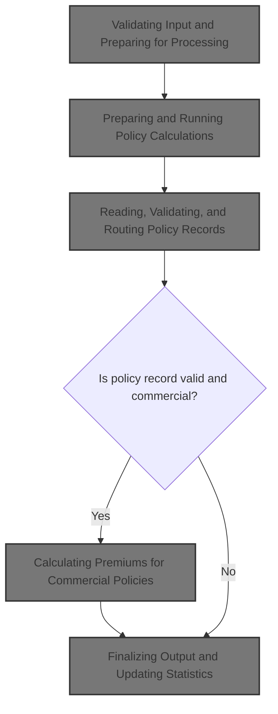
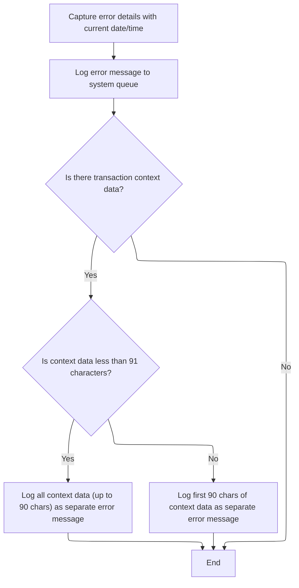
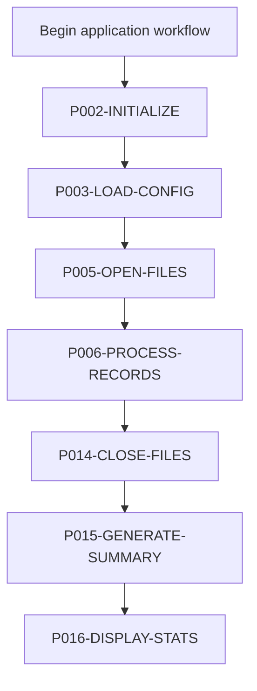
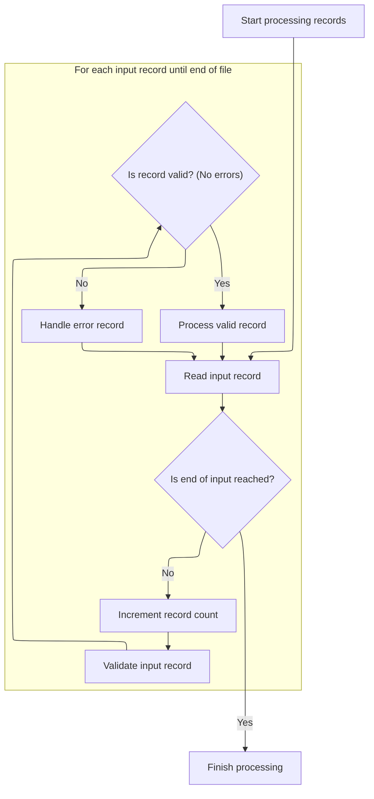
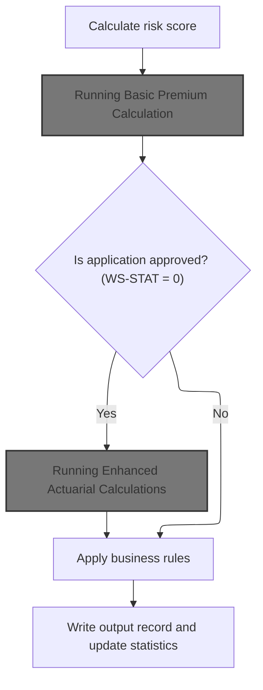
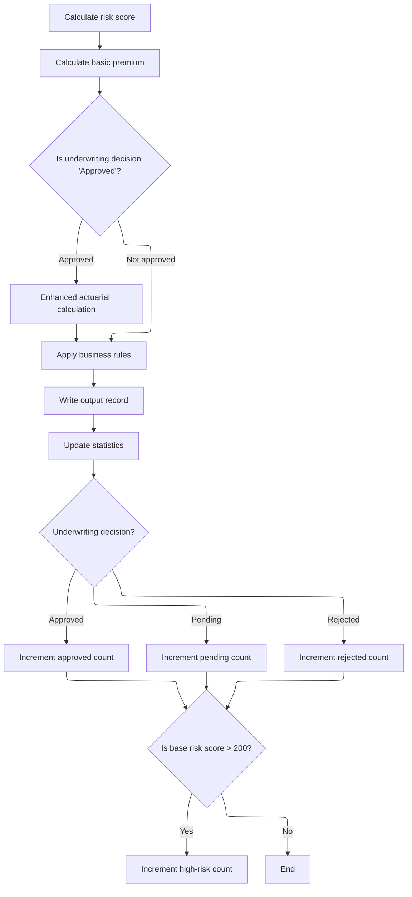

# Overview

This document describes the flow for processing and pricing commercial insurance policies. The system validates incoming transactions, classifies records, calculates premiums, and updates business statistics.



## Dependencies

### Programs

- <SwmToken path="base/src/lgapol01.cbl" pos="2:6:6" line-data="       PROGRAM-ID. LGAPOL01.">`LGAPOL01`</SwmToken> (<SwmPath>[base/src/lgapol01.cbl](base/src/lgapol01.cbl)</SwmPath>)
- <SwmToken path="base/src/lgapol01.cbl" pos="103:9:9" line-data="           EXEC CICS Link Program(LGAPDB01)">`LGAPDB01`</SwmToken> (<SwmPath>[base/src/LGAPDB01.cbl](base/src/LGAPDB01.cbl)</SwmPath>)
- <SwmToken path="base/src/LGAPDB01.cbl" pos="269:4:4" line-data="           CALL &#39;LGAPDB02&#39; USING IN-PROPERTY-TYPE, IN-POSTCODE, ">`LGAPDB02`</SwmToken>
- <SwmToken path="base/src/LGAPDB01.cbl" pos="276:4:4" line-data="           CALL &#39;LGAPDB03&#39; USING WS-BASE-RISK-SCR, IN-FIRE-PERIL, ">`LGAPDB03`</SwmToken> (<SwmPath>[base/src/LGAPDB03.cbl](base/src/LGAPDB03.cbl)</SwmPath>)
- <SwmToken path="base/src/LGAPDB01.cbl" pos="313:4:4" line-data="               CALL &#39;LGAPDB04&#39; USING LK-INPUT-DATA, LK-COVERAGE-DATA, ">`LGAPDB04`</SwmToken> (<SwmPath>[base/src/LGAPDB04.cbl](base/src/LGAPDB04.cbl)</SwmPath>)
- LGSTSQ (<SwmPath>[base/src/lgstsq.cbl](base/src/lgstsq.cbl)</SwmPath>)

### Copybooks

- SQLCA
- <SwmToken path="base/src/LGAPDB01.cbl" pos="35:3:3" line-data="           COPY INPUTREC2.">`INPUTREC2`</SwmToken> (<SwmPath>[base/src/INPUTREC2.cpy](base/src/INPUTREC2.cpy)</SwmPath>)
- OUTPUTREC (<SwmPath>[base/src/OUTPUTREC.cpy](base/src/OUTPUTREC.cpy)</SwmPath>)
- WORKSTOR (<SwmPath>[base/src/WORKSTOR.cpy](base/src/WORKSTOR.cpy)</SwmPath>)
- LGAPACT (<SwmPath>[base/src/LGAPACT.cpy](base/src/LGAPACT.cpy)</SwmPath>)
- LGCMAREA (<SwmPath>[base/src/lgcmarea.cpy](base/src/lgcmarea.cpy)</SwmPath>)

# Where is this program used?

This program is used multiple times in the codebase as represented in the following diagram:

```mermaid
graph TD
  le6x4("Motor Policy Menu (LGTESTP1)") --> h7p0p("Processing Policy Data (LGAPOL01)"):::currentEntity
click le6x4 openCode "base/src/lgtestp1.cbl:1"
2hwkj("House Policy Menu (LGTESTP3)") --> h7p0p("Processing Policy Data (LGAPOL01)"):::currentEntity
click 2hwkj openCode "base/src/lgtestp3.cbl:1"
k1b8m("Endowment Policy Menu (LGTESTP2)") --> h7p0p("Processing Policy Data (LGAPOL01)"):::currentEntity
click k1b8m openCode "base/src/lgtestp2.cbl:1"
bokjk("Managing Commercial Policies (LGTESTP4)") --> h7p0p("Processing Policy Data (LGAPOL01)"):::currentEntity
click bokjk openCode "base/src/lgtestp4.cbl:1"
  
  
click h7p0p openCode "base/src/lgapol01.cbl:1"
    classDef currentEntity color:#000000,fill:#7CB9F4

%% Swimm:
%% graph TD
%%   le6x4("Motor Policy Menu (LGTESTP1)") --> h7p0p("Processing Policy Data (<SwmToken path="base/src/lgapol01.cbl" pos="2:6:6" line-data="       PROGRAM-ID. LGAPOL01.">`LGAPOL01`</SwmToken>)"):::currentEntity
%% click le6x4 openCode "<SwmPath>[base/src/lgtestp1.cbl](base/src/lgtestp1.cbl)</SwmPath>:1"
%% 2hwkj("House Policy Menu (LGTESTP3)") --> h7p0p("Processing Policy Data (<SwmToken path="base/src/lgapol01.cbl" pos="2:6:6" line-data="       PROGRAM-ID. LGAPOL01.">`LGAPOL01`</SwmToken>)"):::currentEntity
%% click 2hwkj openCode "<SwmPath>[base/src/lgtestp3.cbl](base/src/lgtestp3.cbl)</SwmPath>:1"
%% k1b8m("Endowment Policy Menu (LGTESTP2)") --> h7p0p("Processing Policy Data (<SwmToken path="base/src/lgapol01.cbl" pos="2:6:6" line-data="       PROGRAM-ID. LGAPOL01.">`LGAPOL01`</SwmToken>)"):::currentEntity
%% click k1b8m openCode "<SwmPath>[base/src/lgtestp2.cbl](base/src/lgtestp2.cbl)</SwmPath>:1"
%% bokjk("Managing Commercial Policies (LGTESTP4)") --> h7p0p("Processing Policy Data (<SwmToken path="base/src/lgapol01.cbl" pos="2:6:6" line-data="       PROGRAM-ID. LGAPOL01.">`LGAPOL01`</SwmToken>)"):::currentEntity
%% click bokjk openCode "<SwmPath>[base/src/lgtestp4.cbl](base/src/lgtestp4.cbl)</SwmPath>:1"
%%   
%%   
%% click h7p0p openCode "<SwmPath>[base/src/lgapol01.cbl](base/src/lgapol01.cbl)</SwmPath>:1"
%%     classDef currentEntity color:#000000,fill:#7CB9F4
```



## Detailed View of the Program's Functionality

a. Initializing Transaction Context and Input Validation

At the start of the main program, the system initializes a control structure to capture key transaction context from the CICS environment. This includes the transaction ID, terminal ID, task number, and the length of the communication area (commarea). These details are stored locally for later use, especially for error handling and logging.

The program then checks if any input data (commarea) was received. If not, it logs an error message, triggers the error handling routine, and forcibly ends the transaction to prevent further processing of invalid or missing input.

If input data is present, the program resets the return code to indicate success and sets up a pointer to the commarea for further processing. It then checks if the input data is at least as long as the required minimum length (header plus required fields). If the input is too short, it sets an error code and exits early, avoiding processing of incomplete or corrupt data.

b. Error Logging and Message Routing

When an error is detected (such as missing or invalid input), the error handling routine is invoked. This routine first captures the current system date and time, formats them, and prepares an error message that includes these details along with the program name and a description of the error.

The error message is then sent to a system queue for logging, using a dedicated message-logging program. This ensures that errors are recorded in a central location for monitoring and support.

If there is any input data present in the commarea, up to 90 bytes of this data are also logged as a separate message. This provides additional context for troubleshooting, capturing the raw input that led to the error.

The message-logging program handles special routing rules, such as changing the queue name if the message starts with a specific prefix, and adjusts message lengths as needed for different repository or queue requirements. Messages are written to both a transient data queue (for system logs) and a temporary storage queue (for application-level tracking).

c. Main Processing Flow and File Handling

After passing input validation, the main program proceeds to the core processing logic. It opens all necessary files: input, output, summary, configuration, and rate tables. If any file cannot be opened, the program logs an error and halts.

Configuration values (such as maximum risk score, minimum premium, and maximum total insured value) are loaded from a configuration file if available; otherwise, default values are used.

The program writes headers to the output file to label the columns for later reporting.

d. Reading, Validating, and Routing Policy Records

The program enters a loop to process each input record until the end of the input file is reached. For each record:

- The record count is incremented.
- The input record is validated for several business rules:
  - The policy type must be recognized (commercial, personal, or farm).
  - The customer number must not be empty.
  - At least one coverage limit (building or contents) must be provided.
  - The total coverage must not exceed the maximum allowed value.
- If the record passes validation, it is processed as a valid record; otherwise, it is processed as an error record.

For error records, the program writes a row to the output file with zeroed premium values, an error status, and the first error message encountered.

e. Processing Valid Policy Records

For valid records, the program distinguishes between commercial and non-commercial policies. Only commercial policies are fully processed; others are marked as unsupported, and an appropriate message is written to the output.

For commercial policies, the following steps are performed:

- The risk score is calculated using a dedicated risk scoring module, which considers property type, location, coverage amounts, and customer history.
- A basic premium calculation is performed using another module, which looks up risk factors, determines the underwriting verdict (approved, pending, rejected), and computes initial premiums for each peril (fire, crime, flood, weather).
- If the underwriting decision is "approved," an enhanced actuarial calculation is performed. This advanced calculation considers additional factors such as experience modifiers, schedule modifiers, catastrophe loads, expenses, discounts, and taxes. If the enhanced premium is higher than the basic premium, the enhanced values are used.
- Business rules are applied to finalize the underwriting decision, possibly overriding the earlier verdict based on risk score or premium thresholds.
- The output record is written with all calculated values and the final decision.
- Statistics are updated to track totals, counts by decision, and high-risk cases.

f. Basic Premium Calculation and Risk Assessment

The basic premium calculation module retrieves risk factors for each peril (fire, crime) from a database. If the lookup fails, default factors are used. The risk score is then bucketed into "approved," "pending," or "rejected" based on hardcoded thresholds. Premiums for each peril are calculated using the risk score, peril-specific factors, and a discount factor if all perils are covered. The total premium is the sum of all peril premiums.

g. Enhanced Actuarial Calculations

If the policy is approved and the basic premium exceeds the minimum threshold, the enhanced actuarial calculation module is invoked. This module:

- Prepares all input and coverage data, including customer details, property characteristics, coverage limits, deductibles, and peril selections.
- Loads base rates for each peril from a rate table, using territory, construction type, occupancy code, and peril code as keys. Defaults are used if the lookup fails.
- Calculates exposures for building, contents, and business interruption, adjusting for risk score.
- Computes the experience modifier based on years in business and claims history, clamping the value within a specified range.
- Calculates the schedule modifier based on building age, protection class, occupancy code, and exposure density, again clamping the result.
- Calculates the base premium for each peril, applying the appropriate rates, modifiers, and trend factors. Crime and flood perils receive additional multipliers.
- Adds catastrophe loads for hurricane, earthquake, tornado, and flood risks.
- Adds expense and profit loadings based on fixed ratios.
- Calculates discounts for multi-peril coverage, claims-free history, and high deductibles, capping the total discount at 25%.
- Calculates taxes as a percentage of the subtotal after discounts.
- Sums all components to arrive at the total premium, and calculates the final rate factor. If the rate factor exceeds a hard cap, it is reduced and the premium is recalculated.

h. Finalizing Output and Updating Statistics

After all calculations, the program writes the results to the output file, including all premium components, the underwriting decision, and any rejection reasons.

Statistics are updated to reflect the total premium generated, the sum of risk scores, and counts of approved, pending, rejected, and high-risk policies.

At the end of processing, the program closes all files, generates a summary report with totals and averages, and displays key statistics to the operator.

i. Summary

The overall flow ensures that every policy record is validated, processed according to business rules, and logged with full traceability. Errors are captured with detailed context, and all calculations are performed in a strict sequence to ensure consistency and auditability. The modular structure allows for easy updates to business rules, rating factors, and calculation logic as requirements evolve.

# Rule Definition

| Paragraph Name                                                                                                                                                                                                                                                                                                                                                                                                                                                                                                                                                                                                                                                                                                                                                                                                                                                                                                                                                                                                                                                                                                                                                                                       | Rule ID | Category          | Description                                                                                                                                                                                                                                                                                                                                                                                                                                                                                                                         | Conditions                                                                                                | Remarks                                                                                                                                                                                                                                                                                                                                                                                                 |
| ---------------------------------------------------------------------------------------------------------------------------------------------------------------------------------------------------------------------------------------------------------------------------------------------------------------------------------------------------------------------------------------------------------------------------------------------------------------------------------------------------------------------------------------------------------------------------------------------------------------------------------------------------------------------------------------------------------------------------------------------------------------------------------------------------------------------------------------------------------------------------------------------------------------------------------------------------------------------------------------------------------------------------------------------------------------------------------------------------------------------------------------------------------------------------------------------------- | ------- | ----------------- | ----------------------------------------------------------------------------------------------------------------------------------------------------------------------------------------------------------------------------------------------------------------------------------------------------------------------------------------------------------------------------------------------------------------------------------------------------------------------------------------------------------------------------------- | --------------------------------------------------------------------------------------------------------- | ------------------------------------------------------------------------------------------------------------------------------------------------------------------------------------------------------------------------------------------------------------------------------------------------------------------------------------------------------------------------------------------------------- |
| <SwmToken path="base/src/lgapol01.cbl" pos="68:1:3" line-data="       P100-MAIN SECTION.">`P100-MAIN`</SwmToken> SECTION (LGAPOL01.cbl), <SwmToken path="base/src/LGAPDB01.cbl" pos="91:3:5" line-data="           PERFORM P002-INITIALIZE">`P002-INITIALIZE`</SwmToken> (<SwmPath>[base/src/LGAPDB01.cbl](base/src/LGAPDB01.cbl)</SwmPath>)                                                                                                                                                                                                                                                                                                                                                                                                                                                                                                                                                                                                                                                                                                                                                                                                                                                         | RL-001  | Data Assignment   | For each incoming policy record, the system must initialize the transaction context, capturing transaction identifiers and relevant details for error handling and logging.                                                                                                                                                                                                                                                                                                                                                         | On start of processing for each policy record.                                                            | Transaction context includes transaction ID, terminal ID, task number, and commarea length. All fields are fixed-length strings or numbers as appropriate.                                                                                                                                                                                                                                              |
| <SwmToken path="base/src/LGAPDB01.cbl" pos="182:3:9" line-data="               PERFORM P008-VALIDATE-INPUT-RECORD">`P008-VALIDATE-INPUT-RECORD`</SwmToken>, <SwmToken path="base/src/LGAPDB01.cbl" pos="186:3:9" line-data="                   PERFORM P010-PROCESS-ERROR-RECORD">`P010-PROCESS-ERROR-RECORD`</SwmToken> (<SwmPath>[base/src/LGAPDB01.cbl](base/src/LGAPDB01.cbl)</SwmPath>)                                                                                                                                                                                                                                                                                                                                                                                                                                                                                                                                                                                                                                                                                                                                                                                                         | RL-002  | Conditional Logic | If any required input data is missing or invalid, halt processing for that transaction and write an error record to the output file with status 'ERROR' and a rejection reason.                                                                                                                                                                                                                                                                                                                                                     | If validation fails for policy type, customer number, coverage limits, or total coverage exceeds maximum. | Output record must have all premium fields set to zero, status 'ERROR', and a rejection reason. Numeric fields are fixed-point decimals, string fields are fixed-length and space-padded.                                                                                                                                                                                                               |
| <SwmToken path="base/src/lgapol01.cbl" pos="85:3:5" line-data="               PERFORM P999-ERROR">`P999-ERROR`</SwmToken> (LGAPOL01.cbl), <SwmPath>[base/src/lgstsq.cbl](base/src/lgstsq.cbl)</SwmPath>                                                                                                                                                                                                                                                                                                                                                                                                                                                                                                                                                                                                                                                                                                                                                                                                                                                                                                                                                                                              | RL-003  | Conditional Logic | For each error, log the error details with the current date and time, and route the error message to the system queue. If transaction context data is present, up to 90 characters of context must be logged as a separate error message.                                                                                                                                                                                                                                                                                           | Whenever an error is detected during processing.                                                          | Error message includes date, time, program name, detail, and up to 90 bytes of transaction context. All fields are fixed-length and space-padded.                                                                                                                                                                                                                                                       |
| <SwmToken path="base/src/LGAPDB01.cbl" pos="259:3:9" line-data="           PERFORM P011A-CALCULATE-RISK-SCORE">`P011A-CALCULATE-RISK-SCORE`</SwmToken> (<SwmPath>[base/src/LGAPDB01.cbl](base/src/LGAPDB01.cbl)</SwmPath>)                                                                                                                                                                                                                                                                                                                                                                                                                                                                                                                                                                                                                                                                                                                                                                                                                                                                                                                                                                           | RL-004  | Computation       | Calculate a risk score using all relevant input fields for valid commercial policy records.                                                                                                                                                                                                                                                                                                                                                                                                                                         | If policy record is valid and commercial.                                                                 | Risk score is a fixed-point number, calculated using property type, location, coverage limits, and customer history.                                                                                                                                                                                                                                                                                    |
| <SwmToken path="base/src/LGAPDB03.cbl" pos="43:3:7" line-data="           PERFORM GET-RISK-FACTORS">`GET-RISK-FACTORS`</SwmToken> (<SwmPath>[base/src/LGAPDB03.cbl](base/src/LGAPDB03.cbl)</SwmPath>)                                                                                                                                                                                                                                                                                                                                                                                                                                                                                                                                                                                                                                                                                                                                                                                                                                                                                                                                                                                                | RL-005  | Conditional Logic | Retrieve risk factors for 'FIRE' and 'CRIME' perils from the <SwmToken path="base/src/LGAPDB03.cbl" pos="51:3:3" line-data="               FROM RISK_FACTORS">`RISK_FACTORS`</SwmToken> table by peril type only. If not found, use default values: <SwmToken path="base/src/LGAPDB03.cbl" pos="58:3:5" line-data="               MOVE 0.80 TO WS-FIRE-FACTOR">`0.80`</SwmToken> for fire, <SwmToken path="base/src/LGAPDB03.cbl" pos="70:3:5" line-data="               MOVE 0.60 TO WS-CRIME-FACTOR">`0.60`</SwmToken> for crime. | When calculating premiums for fire and crime perils.                                                      | Default risk factors: <SwmToken path="base/src/LGAPDB03.cbl" pos="58:3:5" line-data="               MOVE 0.80 TO WS-FIRE-FACTOR">`0.80`</SwmToken> (fire), <SwmToken path="base/src/LGAPDB03.cbl" pos="70:3:5" line-data="               MOVE 0.60 TO WS-CRIME-FACTOR">`0.60`</SwmToken> (crime).                                                                                                       |
| <SwmToken path="base/src/LGAPDB04.cbl" pos="179:1:5" line-data="       LOAD-RATE-TABLES.">`LOAD-RATE-TABLES`</SwmToken>, <SwmToken path="base/src/LGAPDB04.cbl" pos="200:3:7" line-data="           PERFORM P310-PERIL-RATES VARYING RATE-IDX FROM 2 BY 1 ">`P310-PERIL-RATES`</SwmToken> (<SwmPath>[base/src/LGAPDB04.cbl](base/src/LGAPDB04.cbl)</SwmPath>)                                                                                                                                                                                                                                                                                                                                                                                                                                                                                                                                                                                                                                                                                                                                                                                                                                        | RL-006  | Conditional Logic | Retrieve base rates for each peril from <SwmToken path="base/src/LGAPDB04.cbl" pos="183:3:3" line-data="               FROM RATE_MASTER">`RATE_MASTER`</SwmToken> table using territory, construction type, occupancy code, peril code, and current date. If not found, use hardcoded default rates per peril.                                                                                                                                                                                                                      | When calculating premiums for each peril.                                                                 | Default base rates: 0.0085 (fire), 0.0062 (crime), 0.0128 (flood), 0.0096 (weather).                                                                                                                                                                                                                                                                                                                    |
| <SwmToken path="base/src/LGAPDB03.cbl" pos="44:3:5" line-data="           PERFORM CALCULATE-VERDICT">`CALCULATE-VERDICT`</SwmToken> (<SwmPath>[base/src/LGAPDB03.cbl](base/src/LGAPDB03.cbl)</SwmPath>), <SwmToken path="base/src/LGAPDB01.cbl" pos="264:3:9" line-data="           PERFORM P011D-APPLY-BUSINESS-RULES">`P011D-APPLY-BUSINESS-RULES`</SwmToken> (<SwmPath>[base/src/LGAPDB01.cbl](base/src/LGAPDB01.cbl)</SwmPath>)                                                                                                                                                                                                                                                                                                                                                                                                                                                                                                                                                                                                                                                                                                                                                                  | RL-007  | Conditional Logic | Calculate verdict based on risk score: >200 is 'REJECTED', >150 is 'PENDING', otherwise 'APPROVED'.                                                                                                                                                                                                                                                                                                                                                                                                                                 | After risk score is calculated.                                                                           | Status values: 'REJECTED', 'PENDING', 'APPROVED'. Rejection reasons are fixed-length strings.                                                                                                                                                                                                                                                                                                           |
| <SwmToken path="base/src/LGAPDB03.cbl" pos="45:3:5" line-data="           PERFORM CALCULATE-PREMIUMS">`CALCULATE-PREMIUMS`</SwmToken> (<SwmPath>[base/src/LGAPDB03.cbl](base/src/LGAPDB03.cbl)</SwmPath>), <SwmToken path="base/src/LGAPDB04.cbl" pos="144:3:7" line-data="           PERFORM P600-BASE-PREM">`P600-BASE-PREM`</SwmToken> (<SwmPath>[base/src/LGAPDB04.cbl](base/src/LGAPDB04.cbl)</SwmPath>)                                                                                                                                                                                                                                                                                                                                                                                                                                                                                                                                                                                                                                                                                                                                                                                        | RL-008  | Computation       | Calculate premiums for each selected peril (fire, crime, flood, weather) using exposures, base rates, risk factors, experience and schedule modifiers, and peril-specific multipliers.                                                                                                                                                                                                                                                                                                                                              | For valid commercial policies with selected perils.                                                       | Peril multipliers: crime <SwmToken path="base/src/LGAPDB03.cbl" pos="58:3:5" line-data="               MOVE 0.80 TO WS-FIRE-FACTOR">`0.80`</SwmToken>, flood <SwmToken path="base/src/LGAPDB04.cbl" pos="352:9:11" line-data="                   WS-TREND-FACTOR * 1.25">`1.25`</SwmToken>. Premiums are fixed-point decimals.                                                                          |
| <SwmToken path="base/src/LGAPDB03.cbl" pos="45:3:5" line-data="           PERFORM CALCULATE-PREMIUMS">`CALCULATE-PREMIUMS`</SwmToken> (<SwmPath>[base/src/LGAPDB03.cbl](base/src/LGAPDB03.cbl)</SwmPath>), <SwmToken path="base/src/LGAPDB04.cbl" pos="144:3:7" line-data="           PERFORM P600-BASE-PREM">`P600-BASE-PREM`</SwmToken> (<SwmPath>[base/src/LGAPDB04.cbl](base/src/LGAPDB04.cbl)</SwmPath>)                                                                                                                                                                                                                                                                                                                                                                                                                                                                                                                                                                                                                                                                                                                                                                                        | RL-009  | Computation       | Sum all peril premiums to determine the base premium.                                                                                                                                                                                                                                                                                                                                                                                                                                                                               | After individual peril premiums are calculated.                                                           | Base premium is a fixed-point decimal.                                                                                                                                                                                                                                                                                                                                                                  |
| <SwmToken path="base/src/LGAPDB01.cbl" pos="265:3:9" line-data="           PERFORM P011E-WRITE-OUTPUT-RECORD">`P011E-WRITE-OUTPUT-RECORD`</SwmToken>, <SwmToken path="base/src/LGAPDB01.cbl" pos="239:3:9" line-data="               PERFORM P012-PROCESS-NON-COMMERCIAL">`P012-PROCESS-NON-COMMERCIAL`</SwmToken>, <SwmToken path="base/src/LGAPDB01.cbl" pos="186:3:9" line-data="                   PERFORM P010-PROCESS-ERROR-RECORD">`P010-PROCESS-ERROR-RECORD`</SwmToken> (<SwmPath>[base/src/LGAPDB01.cbl](base/src/LGAPDB01.cbl)</SwmPath>)                                                                                                                                                                                                                                                                                                                                                                                                                                                                                                                                                                                                                                                 | RL-010  | Data Assignment   | For each processed record, write an output record containing customer number, property type, postcode, risk score, premiums for each peril, total premium, status, and rejection reason.                                                                                                                                                                                                                                                                                                                                            | After processing each policy record.                                                                      | All output fields are fixed-length and space-padded. Numeric fields are fixed-point decimals.                                                                                                                                                                                                                                                                                                           |
| <SwmToken path="base/src/LGAPDB01.cbl" pos="266:3:7" line-data="           PERFORM P011F-UPDATE-STATISTICS.">`P011F-UPDATE-STATISTICS`</SwmToken> (<SwmPath>[base/src/LGAPDB01.cbl](base/src/LGAPDB01.cbl)</SwmPath>)                                                                                                                                                                                                                                                                                                                                                                                                                                                                                                                                                                                                                                                                                                                                                                                                                                                                                                                                                                                | RL-011  | Computation       | Update statistics after each record: total premium, risk score totals, counts for approved, pending, rejected, and high-risk records.                                                                                                                                                                                                                                                                                                                                                                                               | After each record is processed.                                                                           | Statistics counters are numeric and incremented as appropriate.                                                                                                                                                                                                                                                                                                                                         |
| Throughout output record writing and error logging (<SwmPath>[base/src/LGAPDB01.cbl](base/src/LGAPDB01.cbl)</SwmPath>, LGAPOL01.cbl, LGSTSQ.cbl)                                                                                                                                                                                                                                                                                                                                                                                                                                                                                                                                                                                                                                                                                                                                                                                                                                                                                                                                                                                                                                                     | RL-012  | Data Assignment   | All numeric fields must be fixed-point decimals; all string fields must be fixed-length and space-padded.                                                                                                                                                                                                                                                                                                                                                                                                                           | Whenever writing output or error records.                                                                 | Numeric: fixed-point decimal. String: fixed-length, space-padded. Example: customer number X(10), premium 9(8)<SwmToken path="base/src/LGAPDB01.cbl" pos="58:15:15" line-data="              10 RATE-MIN-PREMIUM      PIC 9(6)V99.">`V99`</SwmToken>.                                                                                                                                                   |
| <SwmToken path="base/src/LGAPDB03.cbl" pos="43:3:7" line-data="           PERFORM GET-RISK-FACTORS">`GET-RISK-FACTORS`</SwmToken> (<SwmPath>[base/src/LGAPDB03.cbl](base/src/LGAPDB03.cbl)</SwmPath>), <SwmToken path="base/src/LGAPDB04.cbl" pos="179:1:5" line-data="       LOAD-RATE-TABLES.">`LOAD-RATE-TABLES`</SwmToken>, <SwmToken path="base/src/LGAPDB04.cbl" pos="200:3:7" line-data="           PERFORM P310-PERIL-RATES VARYING RATE-IDX FROM 2 BY 1 ">`P310-PERIL-RATES`</SwmToken> (<SwmPath>[base/src/LGAPDB04.cbl](base/src/LGAPDB04.cbl)</SwmPath>)                                                                                                                                                                                                                                                                                                                                                                                                                                                                                                                                                                                                                                 | RL-013  | Conditional Logic | All lookups must default to hardcoded values if the database does not return a result.                                                                                                                                                                                                                                                                                                                                                                                                                                              | If SQLCODE is not 0 after lookup.                                                                         | Default values: risk factors (fire <SwmToken path="base/src/LGAPDB03.cbl" pos="58:3:5" line-data="               MOVE 0.80 TO WS-FIRE-FACTOR">`0.80`</SwmToken>, crime <SwmToken path="base/src/LGAPDB03.cbl" pos="70:3:5" line-data="               MOVE 0.60 TO WS-CRIME-FACTOR">`0.60`</SwmToken>), base rates (fire 0.0085, crime 0.0062, flood 0.0128, weather 0.0096).                            |
| <SwmToken path="base/src/LGAPDB01.cbl" pos="186:3:9" line-data="                   PERFORM P010-PROCESS-ERROR-RECORD">`P010-PROCESS-ERROR-RECORD`</SwmToken>, <SwmToken path="base/src/LGAPDB01.cbl" pos="239:3:9" line-data="               PERFORM P012-PROCESS-NON-COMMERCIAL">`P012-PROCESS-NON-COMMERCIAL`</SwmToken> (<SwmPath>[base/src/LGAPDB01.cbl](base/src/LGAPDB01.cbl)</SwmPath>)                                                                                                                                                                                                                                                                                                                                                                                                                                                                                                                                                                                                                                                                                                                                                                                                       | RL-014  | Data Assignment   | If a record is invalid or unsupported, set all premium fields to zero, status to 'ERROR' or 'UNSUPPORTED', and provide a rejection reason.                                                                                                                                                                                                                                                                                                                                                                                          | If validation fails or policy type is not supported.                                                      | Premium fields: zero. Status: 'ERROR' or 'UNSUPPORTED'. Rejection reason: fixed-length string.                                                                                                                                                                                                                                                                                                          |
| <SwmToken path="base/src/LGAPDB01.cbl" pos="182:3:9" line-data="               PERFORM P008-VALIDATE-INPUT-RECORD">`P008-VALIDATE-INPUT-RECORD`</SwmToken> (<SwmPath>[base/src/LGAPDB01.cbl](base/src/LGAPDB01.cbl)</SwmPath>)                                                                                                                                                                                                                                                                                                                                                                                                                                                                                                                                                                                                                                                                                                                                                                                                                                                                                                                                                                       | RL-015  | Conditional Logic | Validate each input policy record to ensure the policy type is supported (only commercial policies are processed), the customer number is present, at least one coverage limit is provided (building, contents, or business interruption), and the sum of all coverage limits does not exceed the maximum allowed value.                                                                                                                                                                                                            | On reading each input policy record.                                                                      | Supported policy type is 'COMMERCIAL'. Maximum coverage is defined by a business rule constant (default 50,000,000.00). All fields must be formatted as fixed-point decimals or fixed-length, space-padded strings as appropriate.                                                                                                                                                                      |
| <SwmToken path="base/src/LGAPDB01.cbl" pos="262:3:9" line-data="               PERFORM P011C-ENHANCED-ACTUARIAL-CALC">`P011C-ENHANCED-ACTUARIAL-CALC`</SwmToken> (<SwmPath>[base/src/LGAPDB01.cbl](base/src/LGAPDB01.cbl)</SwmPath>), <SwmToken path="base/src/LGAPDB04.cbl" pos="142:3:7" line-data="           PERFORM P400-EXP-MOD">`P400-EXP-MOD`</SwmToken>, <SwmToken path="base/src/LGAPDB04.cbl" pos="143:3:7" line-data="           PERFORM P500-SCHED-MOD">`P500-SCHED-MOD`</SwmToken>, <SwmToken path="base/src/LGAPDB04.cbl" pos="145:3:7" line-data="           PERFORM P700-CAT-LOAD">`P700-CAT-LOAD`</SwmToken>, <SwmToken path="base/src/LGAPDB04.cbl" pos="146:3:5" line-data="           PERFORM P800-EXPENSE">`P800-EXPENSE`</SwmToken>, <SwmToken path="base/src/LGAPDB04.cbl" pos="147:3:5" line-data="           PERFORM P900-DISC">`P900-DISC`</SwmToken>, <SwmToken path="base/src/LGAPDB04.cbl" pos="148:3:5" line-data="           PERFORM P950-TAXES">`P950-TAXES`</SwmToken>, <SwmToken path="base/src/LGAPDB04.cbl" pos="149:3:5" line-data="           PERFORM P999-FINAL">`P999-FINAL`</SwmToken> (<SwmPath>[base/src/LGAPDB04.cbl](base/src/LGAPDB04.cbl)</SwmPath>) | RL-016  | Conditional Logic | If the policy status is 'APPROVED' and the total premium is greater than the minimum allowed premium, perform enhanced actuarial calculations. These calculations include applying experience and schedule modifiers, adding catastrophe and expense loads, applying eligible discounts (multi-peril, claims-free, deductible), calculating taxes, and capping the rate factor. If the enhanced premium is greater than the original, update all premium components with the enhanced values.                                       | If the policy status is 'APPROVED' and the total premium is greater than the minimum premium constant.    | Minimum premium is defined by a business rule constant (default <SwmToken path="base/src/LGAPDB04.cbl" pos="300:11:13" line-data="           IF WS-EXPOSURE-DENSITY &gt; 500.00">`500.00`</SwmToken>). Discounts are capped at 25%. Taxes are calculated at 6.75%. The rate factor is capped at 0.05. All numeric fields are fixed-point decimals; all string fields are fixed-length and space-padded. |

# User Stories

## User Story 1: Transaction Initialization and Error Handling

---

### Story Description:

As a system, I want to initialize the transaction context for each policy record and handle errors by logging details, writing error records, and routing error messages so that all transactions are traceable and errors are managed consistently.

---

### Business Rule Mapping:

| Rule ID | Paragraph Name                                                                                                                                                                                                                                                                                                                                                                               | Rule Description                                                                                                                                                                                                                          |
| ------- | -------------------------------------------------------------------------------------------------------------------------------------------------------------------------------------------------------------------------------------------------------------------------------------------------------------------------------------------------------------------------------------------- | ----------------------------------------------------------------------------------------------------------------------------------------------------------------------------------------------------------------------------------------- |
| RL-002  | <SwmToken path="base/src/LGAPDB01.cbl" pos="182:3:9" line-data="               PERFORM P008-VALIDATE-INPUT-RECORD">`P008-VALIDATE-INPUT-RECORD`</SwmToken>, <SwmToken path="base/src/LGAPDB01.cbl" pos="186:3:9" line-data="                   PERFORM P010-PROCESS-ERROR-RECORD">`P010-PROCESS-ERROR-RECORD`</SwmToken> (<SwmPath>[base/src/LGAPDB01.cbl](base/src/LGAPDB01.cbl)</SwmPath>) | If any required input data is missing or invalid, halt processing for that transaction and write an error record to the output file with status 'ERROR' and a rejection reason.                                                           |
| RL-001  | <SwmToken path="base/src/lgapol01.cbl" pos="68:1:3" line-data="       P100-MAIN SECTION.">`P100-MAIN`</SwmToken> SECTION (LGAPOL01.cbl), <SwmToken path="base/src/LGAPDB01.cbl" pos="91:3:5" line-data="           PERFORM P002-INITIALIZE">`P002-INITIALIZE`</SwmToken> (<SwmPath>[base/src/LGAPDB01.cbl](base/src/LGAPDB01.cbl)</SwmPath>)                                                 | For each incoming policy record, the system must initialize the transaction context, capturing transaction identifiers and relevant details for error handling and logging.                                                               |
| RL-003  | <SwmToken path="base/src/lgapol01.cbl" pos="85:3:5" line-data="               PERFORM P999-ERROR">`P999-ERROR`</SwmToken> (LGAPOL01.cbl), <SwmPath>[base/src/lgstsq.cbl](base/src/lgstsq.cbl)</SwmPath>                                                                                                                                                                                      | For each error, log the error details with the current date and time, and route the error message to the system queue. If transaction context data is present, up to 90 characters of context must be logged as a separate error message. |

---

### Relevant Functionality:

- <SwmToken path="base/src/LGAPDB01.cbl" pos="182:3:9" line-data="               PERFORM P008-VALIDATE-INPUT-RECORD">`P008-VALIDATE-INPUT-RECORD`</SwmToken>
  1. **RL-002:**
     - Validate input fields
     - If any validation fails:
       - Set premium fields to zero
       - Set status to 'ERROR'
       - Set rejection reason to first error encountered
       - Write output record
- <SwmToken path="base/src/lgapol01.cbl" pos="68:1:3" line-data="       P100-MAIN SECTION.">`P100-MAIN`</SwmToken> **SECTION (LGAPOL01.cbl)**
  1. **RL-001:**
     - Initialize control structure for transaction context
     - Move transaction identifiers (ID, terminal, task) into context fields
     - Store commarea length for later reference
- <SwmToken path="base/src/lgapol01.cbl" pos="85:3:5" line-data="               PERFORM P999-ERROR">`P999-ERROR`</SwmToken> **(LGAPOL01.cbl)**
  1. **RL-003:**
     - Obtain current date and time
     - Format error message with date, time, program name, and detail
     - Write error message to system queue
     - If transaction context is present, write up to 90 bytes of context as a separate message

## User Story 2: Input Validation and Unsupported Policy Handling

---

### Story Description:

As a system, I want to validate each input policy record for supported type, required fields, and coverage limits, and handle invalid or unsupported records by marking them as 'ERROR' or 'UNSUPPORTED' with zero premiums and a rejection reason so that only valid commercial policies are processed and errors are clearly reported.

---

### Business Rule Mapping:

| Rule ID | Paragraph Name                                                                                                                                                                                                                                                                                                                                                                                 | Rule Description                                                                                                                                                                                                                                                                                                         |
| ------- | ---------------------------------------------------------------------------------------------------------------------------------------------------------------------------------------------------------------------------------------------------------------------------------------------------------------------------------------------------------------------------------------------- | ------------------------------------------------------------------------------------------------------------------------------------------------------------------------------------------------------------------------------------------------------------------------------------------------------------------------ |
| RL-002  | <SwmToken path="base/src/LGAPDB01.cbl" pos="182:3:9" line-data="               PERFORM P008-VALIDATE-INPUT-RECORD">`P008-VALIDATE-INPUT-RECORD`</SwmToken>, <SwmToken path="base/src/LGAPDB01.cbl" pos="186:3:9" line-data="                   PERFORM P010-PROCESS-ERROR-RECORD">`P010-PROCESS-ERROR-RECORD`</SwmToken> (<SwmPath>[base/src/LGAPDB01.cbl](base/src/LGAPDB01.cbl)</SwmPath>)   | If any required input data is missing or invalid, halt processing for that transaction and write an error record to the output file with status 'ERROR' and a rejection reason.                                                                                                                                          |
| RL-014  | <SwmToken path="base/src/LGAPDB01.cbl" pos="186:3:9" line-data="                   PERFORM P010-PROCESS-ERROR-RECORD">`P010-PROCESS-ERROR-RECORD`</SwmToken>, <SwmToken path="base/src/LGAPDB01.cbl" pos="239:3:9" line-data="               PERFORM P012-PROCESS-NON-COMMERCIAL">`P012-PROCESS-NON-COMMERCIAL`</SwmToken> (<SwmPath>[base/src/LGAPDB01.cbl](base/src/LGAPDB01.cbl)</SwmPath>) | If a record is invalid or unsupported, set all premium fields to zero, status to 'ERROR' or 'UNSUPPORTED', and provide a rejection reason.                                                                                                                                                                               |
| RL-015  | <SwmToken path="base/src/LGAPDB01.cbl" pos="182:3:9" line-data="               PERFORM P008-VALIDATE-INPUT-RECORD">`P008-VALIDATE-INPUT-RECORD`</SwmToken> (<SwmPath>[base/src/LGAPDB01.cbl](base/src/LGAPDB01.cbl)</SwmPath>)                                                                                                                                                                 | Validate each input policy record to ensure the policy type is supported (only commercial policies are processed), the customer number is present, at least one coverage limit is provided (building, contents, or business interruption), and the sum of all coverage limits does not exceed the maximum allowed value. |

---

### Relevant Functionality:

- <SwmToken path="base/src/LGAPDB01.cbl" pos="182:3:9" line-data="               PERFORM P008-VALIDATE-INPUT-RECORD">`P008-VALIDATE-INPUT-RECORD`</SwmToken>
  1. **RL-002:**
     - Validate input fields
     - If any validation fails:
       - Set premium fields to zero
       - Set status to 'ERROR'
       - Set rejection reason to first error encountered
       - Write output record
- <SwmToken path="base/src/LGAPDB01.cbl" pos="186:3:9" line-data="                   PERFORM P010-PROCESS-ERROR-RECORD">`P010-PROCESS-ERROR-RECORD`</SwmToken>
  1. **RL-014:**
     - Set premium fields to zero
     - Set status to 'ERROR' or 'UNSUPPORTED'
     - Set rejection reason
     - Write output record
- <SwmToken path="base/src/LGAPDB01.cbl" pos="182:3:9" line-data="               PERFORM P008-VALIDATE-INPUT-RECORD">`P008-VALIDATE-INPUT-RECORD`</SwmToken> **(**<SwmPath>[base/src/LGAPDB01.cbl](base/src/LGAPDB01.cbl)</SwmPath>**)**
  1. **RL-015:**
     - Check if the policy type is 'COMMERCIAL'; if not, mark as unsupported
     - Check if the customer number is present and not empty
     - Check if at least one of the coverage limits (building, contents, business interruption) is greater than zero
     - Check if the sum of all coverage limits does not exceed the maximum allowed value

## User Story 3: Commercial Policy Processing, Premium Calculation, and Enhanced Actuarial Methods

---

### Story Description:

As a system, I want to process valid commercial policy records by calculating risk scores, retrieving risk factors and base rates (using defaults if necessary), assigning verdicts based on risk score, calculating premiums for each peril, and performing enhanced actuarial calculations for approved policies with premiums above the minimum threshold so that commercial policies are accurately assessed, priced, and comply with regulatory and business requirements.

---

### Business Rule Mapping:

| Rule ID | Paragraph Name                                                                                                                                                                                                                                                                                                                                                                                                                                                                                                                                                                                                                                                                                                                                                                                                                                                                                                                                                                                                                                                                                                                                                                                       | Rule Description                                                                                                                                                                                                                                                                                                                                                                                                                                                                                                                    |
| ------- | ---------------------------------------------------------------------------------------------------------------------------------------------------------------------------------------------------------------------------------------------------------------------------------------------------------------------------------------------------------------------------------------------------------------------------------------------------------------------------------------------------------------------------------------------------------------------------------------------------------------------------------------------------------------------------------------------------------------------------------------------------------------------------------------------------------------------------------------------------------------------------------------------------------------------------------------------------------------------------------------------------------------------------------------------------------------------------------------------------------------------------------------------------------------------------------------------------- | ----------------------------------------------------------------------------------------------------------------------------------------------------------------------------------------------------------------------------------------------------------------------------------------------------------------------------------------------------------------------------------------------------------------------------------------------------------------------------------------------------------------------------------- |
| RL-004  | <SwmToken path="base/src/LGAPDB01.cbl" pos="259:3:9" line-data="           PERFORM P011A-CALCULATE-RISK-SCORE">`P011A-CALCULATE-RISK-SCORE`</SwmToken> (<SwmPath>[base/src/LGAPDB01.cbl](base/src/LGAPDB01.cbl)</SwmPath>)                                                                                                                                                                                                                                                                                                                                                                                                                                                                                                                                                                                                                                                                                                                                                                                                                                                                                                                                                                           | Calculate a risk score using all relevant input fields for valid commercial policy records.                                                                                                                                                                                                                                                                                                                                                                                                                                         |
| RL-005  | <SwmToken path="base/src/LGAPDB03.cbl" pos="43:3:7" line-data="           PERFORM GET-RISK-FACTORS">`GET-RISK-FACTORS`</SwmToken> (<SwmPath>[base/src/LGAPDB03.cbl](base/src/LGAPDB03.cbl)</SwmPath>)                                                                                                                                                                                                                                                                                                                                                                                                                                                                                                                                                                                                                                                                                                                                                                                                                                                                                                                                                                                                | Retrieve risk factors for 'FIRE' and 'CRIME' perils from the <SwmToken path="base/src/LGAPDB03.cbl" pos="51:3:3" line-data="               FROM RISK_FACTORS">`RISK_FACTORS`</SwmToken> table by peril type only. If not found, use default values: <SwmToken path="base/src/LGAPDB03.cbl" pos="58:3:5" line-data="               MOVE 0.80 TO WS-FIRE-FACTOR">`0.80`</SwmToken> for fire, <SwmToken path="base/src/LGAPDB03.cbl" pos="70:3:5" line-data="               MOVE 0.60 TO WS-CRIME-FACTOR">`0.60`</SwmToken> for crime. |
| RL-013  | <SwmToken path="base/src/LGAPDB03.cbl" pos="43:3:7" line-data="           PERFORM GET-RISK-FACTORS">`GET-RISK-FACTORS`</SwmToken> (<SwmPath>[base/src/LGAPDB03.cbl](base/src/LGAPDB03.cbl)</SwmPath>), <SwmToken path="base/src/LGAPDB04.cbl" pos="179:1:5" line-data="       LOAD-RATE-TABLES.">`LOAD-RATE-TABLES`</SwmToken>, <SwmToken path="base/src/LGAPDB04.cbl" pos="200:3:7" line-data="           PERFORM P310-PERIL-RATES VARYING RATE-IDX FROM 2 BY 1 ">`P310-PERIL-RATES`</SwmToken> (<SwmPath>[base/src/LGAPDB04.cbl](base/src/LGAPDB04.cbl)</SwmPath>)                                                                                                                                                                                                                                                                                                                                                                                                                                                                                                                                                                                                                                 | All lookups must default to hardcoded values if the database does not return a result.                                                                                                                                                                                                                                                                                                                                                                                                                                              |
| RL-006  | <SwmToken path="base/src/LGAPDB04.cbl" pos="179:1:5" line-data="       LOAD-RATE-TABLES.">`LOAD-RATE-TABLES`</SwmToken>, <SwmToken path="base/src/LGAPDB04.cbl" pos="200:3:7" line-data="           PERFORM P310-PERIL-RATES VARYING RATE-IDX FROM 2 BY 1 ">`P310-PERIL-RATES`</SwmToken> (<SwmPath>[base/src/LGAPDB04.cbl](base/src/LGAPDB04.cbl)</SwmPath>)                                                                                                                                                                                                                                                                                                                                                                                                                                                                                                                                                                                                                                                                                                                                                                                                                                        | Retrieve base rates for each peril from <SwmToken path="base/src/LGAPDB04.cbl" pos="183:3:3" line-data="               FROM RATE_MASTER">`RATE_MASTER`</SwmToken> table using territory, construction type, occupancy code, peril code, and current date. If not found, use hardcoded default rates per peril.                                                                                                                                                                                                                      |
| RL-007  | <SwmToken path="base/src/LGAPDB03.cbl" pos="44:3:5" line-data="           PERFORM CALCULATE-VERDICT">`CALCULATE-VERDICT`</SwmToken> (<SwmPath>[base/src/LGAPDB03.cbl](base/src/LGAPDB03.cbl)</SwmPath>), <SwmToken path="base/src/LGAPDB01.cbl" pos="264:3:9" line-data="           PERFORM P011D-APPLY-BUSINESS-RULES">`P011D-APPLY-BUSINESS-RULES`</SwmToken> (<SwmPath>[base/src/LGAPDB01.cbl](base/src/LGAPDB01.cbl)</SwmPath>)                                                                                                                                                                                                                                                                                                                                                                                                                                                                                                                                                                                                                                                                                                                                                                  | Calculate verdict based on risk score: >200 is 'REJECTED', >150 is 'PENDING', otherwise 'APPROVED'.                                                                                                                                                                                                                                                                                                                                                                                                                                 |
| RL-008  | <SwmToken path="base/src/LGAPDB03.cbl" pos="45:3:5" line-data="           PERFORM CALCULATE-PREMIUMS">`CALCULATE-PREMIUMS`</SwmToken> (<SwmPath>[base/src/LGAPDB03.cbl](base/src/LGAPDB03.cbl)</SwmPath>), <SwmToken path="base/src/LGAPDB04.cbl" pos="144:3:7" line-data="           PERFORM P600-BASE-PREM">`P600-BASE-PREM`</SwmToken> (<SwmPath>[base/src/LGAPDB04.cbl](base/src/LGAPDB04.cbl)</SwmPath>)                                                                                                                                                                                                                                                                                                                                                                                                                                                                                                                                                                                                                                                                                                                                                                                        | Calculate premiums for each selected peril (fire, crime, flood, weather) using exposures, base rates, risk factors, experience and schedule modifiers, and peril-specific multipliers.                                                                                                                                                                                                                                                                                                                                              |
| RL-009  | <SwmToken path="base/src/LGAPDB03.cbl" pos="45:3:5" line-data="           PERFORM CALCULATE-PREMIUMS">`CALCULATE-PREMIUMS`</SwmToken> (<SwmPath>[base/src/LGAPDB03.cbl](base/src/LGAPDB03.cbl)</SwmPath>), <SwmToken path="base/src/LGAPDB04.cbl" pos="144:3:7" line-data="           PERFORM P600-BASE-PREM">`P600-BASE-PREM`</SwmToken> (<SwmPath>[base/src/LGAPDB04.cbl](base/src/LGAPDB04.cbl)</SwmPath>)                                                                                                                                                                                                                                                                                                                                                                                                                                                                                                                                                                                                                                                                                                                                                                                        | Sum all peril premiums to determine the base premium.                                                                                                                                                                                                                                                                                                                                                                                                                                                                               |
| RL-016  | <SwmToken path="base/src/LGAPDB01.cbl" pos="262:3:9" line-data="               PERFORM P011C-ENHANCED-ACTUARIAL-CALC">`P011C-ENHANCED-ACTUARIAL-CALC`</SwmToken> (<SwmPath>[base/src/LGAPDB01.cbl](base/src/LGAPDB01.cbl)</SwmPath>), <SwmToken path="base/src/LGAPDB04.cbl" pos="142:3:7" line-data="           PERFORM P400-EXP-MOD">`P400-EXP-MOD`</SwmToken>, <SwmToken path="base/src/LGAPDB04.cbl" pos="143:3:7" line-data="           PERFORM P500-SCHED-MOD">`P500-SCHED-MOD`</SwmToken>, <SwmToken path="base/src/LGAPDB04.cbl" pos="145:3:7" line-data="           PERFORM P700-CAT-LOAD">`P700-CAT-LOAD`</SwmToken>, <SwmToken path="base/src/LGAPDB04.cbl" pos="146:3:5" line-data="           PERFORM P800-EXPENSE">`P800-EXPENSE`</SwmToken>, <SwmToken path="base/src/LGAPDB04.cbl" pos="147:3:5" line-data="           PERFORM P900-DISC">`P900-DISC`</SwmToken>, <SwmToken path="base/src/LGAPDB04.cbl" pos="148:3:5" line-data="           PERFORM P950-TAXES">`P950-TAXES`</SwmToken>, <SwmToken path="base/src/LGAPDB04.cbl" pos="149:3:5" line-data="           PERFORM P999-FINAL">`P999-FINAL`</SwmToken> (<SwmPath>[base/src/LGAPDB04.cbl](base/src/LGAPDB04.cbl)</SwmPath>) | If the policy status is 'APPROVED' and the total premium is greater than the minimum allowed premium, perform enhanced actuarial calculations. These calculations include applying experience and schedule modifiers, adding catastrophe and expense loads, applying eligible discounts (multi-peril, claims-free, deductible), calculating taxes, and capping the rate factor. If the enhanced premium is greater than the original, update all premium components with the enhanced values.                                       |

---

### Relevant Functionality:

- <SwmToken path="base/src/LGAPDB01.cbl" pos="259:3:9" line-data="           PERFORM P011A-CALCULATE-RISK-SCORE">`P011A-CALCULATE-RISK-SCORE`</SwmToken> **(**<SwmPath>[base/src/LGAPDB01.cbl](base/src/LGAPDB01.cbl)</SwmPath>**)**
  1. **RL-004:**
     - Call risk score calculation routine with relevant input fields
     - Store calculated risk score for further processing
- <SwmToken path="base/src/LGAPDB03.cbl" pos="43:3:7" line-data="           PERFORM GET-RISK-FACTORS">`GET-RISK-FACTORS`</SwmToken> **(**<SwmPath>[base/src/LGAPDB03.cbl](base/src/LGAPDB03.cbl)</SwmPath>**)**
  1. **RL-005:**
     - Query <SwmToken path="base/src/LGAPDB03.cbl" pos="51:3:3" line-data="               FROM RISK_FACTORS">`RISK_FACTORS`</SwmToken> table for 'FIRE' and 'CRIME'
     - If not found, use default values
  2. **RL-013:**
     - After each lookup, check result
     - If not found, assign default value
- <SwmToken path="base/src/LGAPDB04.cbl" pos="179:1:5" line-data="       LOAD-RATE-TABLES.">`LOAD-RATE-TABLES`</SwmToken>
  1. **RL-006:**
     - Query <SwmToken path="base/src/LGAPDB04.cbl" pos="183:3:3" line-data="               FROM RATE_MASTER">`RATE_MASTER`</SwmToken> for each peril
     - If not found, use hardcoded default rate
- <SwmToken path="base/src/LGAPDB03.cbl" pos="44:3:5" line-data="           PERFORM CALCULATE-VERDICT">`CALCULATE-VERDICT`</SwmToken> **(**<SwmPath>[base/src/LGAPDB03.cbl](base/src/LGAPDB03.cbl)</SwmPath>**)**
  1. **RL-007:**
     - If risk score > 200, set status to 'REJECTED' and reason
     - If risk score > 150, set status to 'PENDING' and reason
     - Otherwise, set status to 'APPROVED' and blank reason
- <SwmToken path="base/src/LGAPDB03.cbl" pos="45:3:5" line-data="           PERFORM CALCULATE-PREMIUMS">`CALCULATE-PREMIUMS`</SwmToken> **(**<SwmPath>[base/src/LGAPDB03.cbl](base/src/LGAPDB03.cbl)</SwmPath>**)**
  1. **RL-008:**
     - For each peril:
       - Calculate exposure
       - Apply base rate, risk factor, experience modifier, schedule modifier, and peril multiplier
       - Sum premiums for total
  2. **RL-009:**
     - Add all peril premiums to obtain base premium
- <SwmToken path="base/src/LGAPDB01.cbl" pos="262:3:9" line-data="               PERFORM P011C-ENHANCED-ACTUARIAL-CALC">`P011C-ENHANCED-ACTUARIAL-CALC`</SwmToken> **(**<SwmPath>[base/src/LGAPDB01.cbl](base/src/LGAPDB01.cbl)</SwmPath>**)**
  1. **RL-016:**
     - If the policy status is 'APPROVED' and the total premium is greater than the minimum premium:
       - Apply experience modifier (0.85 for 5+ years and no claims, 1.10 for less than 5 years, scaled for claims history, clamped between 0.5 and 2.0)
       - Apply schedule modifier based on building age, protection class, occupancy code, and exposure density, clamped to a set range
       - Add catastrophe and expense loads
       - Apply eligible discounts (multi-peril, claims-free, deductible), capped at 25%
       - Calculate taxes at 6.75% of the sum of base, catastrophe, expense, and profit loads minus discounts
       - Calculate total premium as sum of all components minus discounts plus taxes
       - Calculate rate factor as total premium divided by insured value, capped at 0.05; if capped, recalculate premium
       - If enhanced premium is greater than original, update all premium components with enhanced values

## User Story 4: Output Record Writing, Statistics Update, and Data Formatting

---

### Story Description:

As a system, I want to write output records with all required fields, update processing statistics, and ensure all numeric and string fields are formatted correctly so that reporting is accurate, consistent, and meets data standards.

---

### Business Rule Mapping:

| Rule ID | Paragraph Name                                                                                                                                                                                                                                                                                                                                                                                                                                                                                                                                       | Rule Description                                                                                                                                                                         |
| ------- | ---------------------------------------------------------------------------------------------------------------------------------------------------------------------------------------------------------------------------------------------------------------------------------------------------------------------------------------------------------------------------------------------------------------------------------------------------------------------------------------------------------------------------------------------------- | ---------------------------------------------------------------------------------------------------------------------------------------------------------------------------------------- |
| RL-010  | <SwmToken path="base/src/LGAPDB01.cbl" pos="265:3:9" line-data="           PERFORM P011E-WRITE-OUTPUT-RECORD">`P011E-WRITE-OUTPUT-RECORD`</SwmToken>, <SwmToken path="base/src/LGAPDB01.cbl" pos="239:3:9" line-data="               PERFORM P012-PROCESS-NON-COMMERCIAL">`P012-PROCESS-NON-COMMERCIAL`</SwmToken>, <SwmToken path="base/src/LGAPDB01.cbl" pos="186:3:9" line-data="                   PERFORM P010-PROCESS-ERROR-RECORD">`P010-PROCESS-ERROR-RECORD`</SwmToken> (<SwmPath>[base/src/LGAPDB01.cbl](base/src/LGAPDB01.cbl)</SwmPath>) | For each processed record, write an output record containing customer number, property type, postcode, risk score, premiums for each peril, total premium, status, and rejection reason. |
| RL-011  | <SwmToken path="base/src/LGAPDB01.cbl" pos="266:3:7" line-data="           PERFORM P011F-UPDATE-STATISTICS.">`P011F-UPDATE-STATISTICS`</SwmToken> (<SwmPath>[base/src/LGAPDB01.cbl](base/src/LGAPDB01.cbl)</SwmPath>)                                                                                                                                                                                                                                                                                                                                | Update statistics after each record: total premium, risk score totals, counts for approved, pending, rejected, and high-risk records.                                                    |
| RL-012  | Throughout output record writing and error logging (<SwmPath>[base/src/LGAPDB01.cbl](base/src/LGAPDB01.cbl)</SwmPath>, LGAPOL01.cbl, LGSTSQ.cbl)                                                                                                                                                                                                                                                                                                                                                                                                     | All numeric fields must be fixed-point decimals; all string fields must be fixed-length and space-padded.                                                                                |

---

### Relevant Functionality:

- <SwmToken path="base/src/LGAPDB01.cbl" pos="265:3:9" line-data="           PERFORM P011E-WRITE-OUTPUT-RECORD">`P011E-WRITE-OUTPUT-RECORD`</SwmToken>
  1. **RL-010:**
     - Move processed data to output fields
     - Write output record
- <SwmToken path="base/src/LGAPDB01.cbl" pos="266:3:7" line-data="           PERFORM P011F-UPDATE-STATISTICS.">`P011F-UPDATE-STATISTICS`</SwmToken> **(**<SwmPath>[base/src/LGAPDB01.cbl](base/src/LGAPDB01.cbl)</SwmPath>**)**
  1. **RL-011:**
     - Add premium to total
     - Add risk score to total
     - Increment counters for status and high-risk
- **Throughout output record writing and error logging (**<SwmPath>[base/src/LGAPDB01.cbl](base/src/LGAPDB01.cbl)</SwmPath>
  1. **RL-012:**
     - Format numeric fields as fixed-point decimals
     - Format string fields as fixed-length, space-padded

# Workflow

# Initializing Transaction Context

This section ensures that every transaction has its context correctly captured for traceability and error management, and prevents further processing if required input data is missing.

| Category       | Rule Name                        | Description                                                                                                                                    |
| -------------- | -------------------------------- | ---------------------------------------------------------------------------------------------------------------------------------------------- |
| Business logic | Transaction context completeness | The transaction context must include the transaction ID, terminal ID, task number, and input data length for every transaction.                |
| Business logic | Error logging requirements       | Error details must include the current date, time, and transaction context, and be routed to system queues for tracking and alerting.          |
| Business logic | Supplementary error data capture | If additional error data is present in the communication area, up to 90 bytes of this data must be captured and logged with the error details. |

<SwmSnippet path="/base/src/lgapol01.cbl" line="68">

---

This is where we grab the transaction context from CICS and store it locally so later error handling and logging can reference the right transaction details.

```cobol
       P100-MAIN SECTION.

      *----------------------------------------------------------------*
      * Common code                                                    *
      *----------------------------------------------------------------*
           INITIALIZE W1-CONTROL.
           MOVE EIBTRNID TO W1-TID.
           MOVE EIBTRMID TO W1-TRM.
           MOVE EIBTASKN TO W1-TSK.
           MOVE EIBCALEN TO W1-LEN.
```

---

</SwmSnippet>

<SwmSnippet path="/base/src/lgapol01.cbl" line="83">

---

If there's no input data, we log the error and halt the transaction to avoid processing garbage.

```cobol
           IF EIBCALEN IS EQUAL TO ZERO
               MOVE ' NO COMMAREA RECEIVED' TO W3-DETAIL
               PERFORM P999-ERROR
               EXEC CICS ABEND ABCODE('LGCA') NODUMP END-EXEC
           END-IF
```

---

</SwmSnippet>

## Logging Error Details and Routing Messages



This section ensures that all error events are logged with precise timestamps and relevant context, enabling effective error tracking and troubleshooting. It also routes messages to the correct queues and handles special cases for message formatting and length.

| Category        | Rule Name                 | Description                                                                                                                                                      |
| --------------- | ------------------------- | ---------------------------------------------------------------------------------------------------------------------------------------------------------------- |
| Data validation | Context Data Length Limit | If the transaction context data exceeds 90 characters, only the first 90 characters are logged to comply with message length constraints.                        |
| Business logic  | Timestamping Errors       | Every error message must include the current system date and time to ensure accurate tracking of when errors occur.                                              |
| Business logic  | Dual Queue Logging        | All error messages must be logged to both the system queue and the Genapp TSQ to guarantee visibility for monitoring and support tools.                          |
| Business logic  | Context Data Logging      | If transaction context data is present, up to 90 characters of this data must be logged as a separate error message to provide additional context for the error. |
| Business logic  | Queue Prefix Handling     | Messages with a 'Q=' prefix must have the prefix removed and the remaining message routed according to repository-specific rules.                                |

<SwmSnippet path="/base/src/lgapol01.cbl" line="119">

---

In <SwmToken path="base/src/lgapol01.cbl" pos="119:1:3" line-data="       P999-ERROR.">`P999-ERROR`</SwmToken>, we grab the current system time and date, format them, and prep the error message with these details. This timestamping is key for tracking when and where errors happen.

```cobol
       P999-ERROR.
      * Save SQLCODE in message
      * Obtain and format current time and date
           EXEC CICS ASKTIME ABSTIME(W2-TIME)
           END-EXEC
           EXEC CICS FORMATTIME ABSTIME(W2-TIME)
                     MMDDYYYY(W2-DATE1)
                     TIME(W2-DATE2)
           END-EXEC
```

---

</SwmSnippet>

<SwmSnippet path="/base/src/lgapol01.cbl" line="128">

---

Here we prep the error message with the formatted date and time, then call LGSTSQ to write it to the system queues. This makes sure the error gets logged and can be picked up by monitoring or support tools.

```cobol
           MOVE W2-DATE1 TO W3-DATE
           MOVE W2-DATE2 TO W3-TIME
      * Write output message to TDQ
           EXEC CICS LINK PROGRAM('LGSTSQ')
                     COMMAREA(W3-MESSAGE)
                     LENGTH(LENGTH OF W3-MESSAGE)
           END-EXEC.
```

---

</SwmSnippet>

<SwmSnippet path="/base/src/lgstsq.cbl" line="55">

---

We format and route the message to the right queues, handling special cases like 'Q=' prefixes and adjusting lengths for repository-specific rules.

```cobol
       MAINLINE SECTION.

           MOVE SPACES TO WRITE-MSG.
           MOVE SPACES TO WS-RECV.

           EXEC CICS ASSIGN SYSID(WRITE-MSG-SYSID)
                RESP(WS-RESP)
           END-EXEC.

           EXEC CICS ASSIGN INVOKINGPROG(WS-INVOKEPROG)
                RESP(WS-RESP)
           END-EXEC.
           
           IF WS-INVOKEPROG NOT = SPACES
              MOVE 'C' To WS-FLAG
              MOVE COMMA-DATA  TO WRITE-MSG-MSG
              MOVE EIBCALEN    TO WS-RECV-LEN
           ELSE
              EXEC CICS RECEIVE INTO(WS-RECV)
                  LENGTH(WS-RECV-LEN)
                  RESP(WS-RESP)
              END-EXEC
              MOVE 'R' To WS-FLAG
              MOVE WS-RECV-DATA  TO WRITE-MSG-MSG
              SUBTRACT 5 FROM WS-RECV-LEN
           END-IF.

           MOVE 'GENAERRS' TO STSQ-NAME.
           IF WRITE-MSG-MSG(1:2) = 'Q=' THEN
              MOVE WRITE-MSG-MSG(3:4) TO STSQ-EXT
              MOVE WRITE-MSG-REST TO TEMPO
              MOVE TEMPO          TO WRITE-MSG-MSG
              SUBTRACT 7 FROM WS-RECV-LEN
           END-IF.

           ADD 5 TO WS-RECV-LEN.

      * Write output message to TDQ CSMT
      *
           EXEC CICS WRITEQ TD QUEUE(STDQ-NAME)
                     FROM(WRITE-MSG)
                     RESP(WS-RESP)
                     LENGTH(WS-RECV-LEN)

           END-EXEC.

      * Write output message to Genapp TSQ
      * If no space is available then the task will not wait for
      *  storage to become available but will ignore the request...
      *
           EXEC CICS WRITEQ TS QUEUE(STSQ-NAME)
                     FROM(WRITE-MSG)
                     RESP(WS-RESP)
                     NOSUSPEND
                     LENGTH(WS-RECV-LEN)

           END-EXEC.

           If WS-FLAG = 'R' Then
             EXEC CICS SEND TEXT FROM(FILLER-X)
              WAIT
              ERASE
              LENGTH(1)
              FREEKB
             END-EXEC.

           EXEC CICS RETURN
           END-EXEC.
```

---

</SwmSnippet>

<SwmSnippet path="/base/src/lgapol01.cbl" line="136">

---

After returning from LGSTSQ in <SwmToken path="base/src/lgapol01.cbl" pos="85:3:5" line-data="               PERFORM P999-ERROR">`P999-ERROR`</SwmToken>, we check if there's any commarea data to log. If so, we move up to 90 bytes of it into the error message and call LGSTSQ again to log this extra context. This makes sure all error details are captured, even if they're not part of the main error message.

```cobol
           IF EIBCALEN > 0 THEN
             IF EIBCALEN < 91 THEN
               MOVE DFHCOMMAREA(1:EIBCALEN) TO CA-DATA
               EXEC CICS LINK PROGRAM('LGSTSQ')
                         COMMAREA(CA-ERROR-MSG)
                         LENGTH(LENGTH OF CA-ERROR-MSG)
               END-EXEC
             ELSE
               MOVE DFHCOMMAREA(1:90) TO CA-DATA
               EXEC CICS LINK PROGRAM('LGSTSQ')
                         COMMAREA(CA-ERROR-MSG)
                         LENGTH(LENGTH OF CA-ERROR-MSG)
               END-EXEC
             END-IF
           END-IF.
           EXIT.
```

---

</SwmSnippet>

## Validating Input and Preparing for Processing

<SwmSnippet path="/base/src/lgapol01.cbl" line="89">

---

Back in <SwmToken path="base/src/lgapol01.cbl" pos="68:1:3" line-data="       P100-MAIN SECTION.">`P100-MAIN`</SwmToken> after <SwmToken path="base/src/lgapol01.cbl" pos="85:3:5" line-data="               PERFORM P999-ERROR">`P999-ERROR`</SwmToken>, we reset the return code and set up pointers for the commarea. Then we check if the input is long enough—if not, we set an error code and bail out. This prevents us from running with incomplete or corrupt input.

```cobol
           MOVE '00' TO CA-RETURN-CODE
           SET W1-PTR TO ADDRESS OF DFHCOMMAREA.

           ADD W4-HDR-LEN TO W4-REQ-LEN


           IF EIBCALEN IS LESS THAN W4-REQ-LEN
             MOVE '98' TO CA-RETURN-CODE
             EXEC CICS RETURN END-EXEC
           END-IF
```

---

</SwmSnippet>

<SwmSnippet path="/base/src/lgapol01.cbl" line="103">

---

We hand off to <SwmToken path="base/src/lgapol01.cbl" pos="103:9:9" line-data="           EXEC CICS Link Program(LGAPDB01)">`LGAPDB01`</SwmToken> to do the actual policy processing and premium calculations.

```cobol
           EXEC CICS Link Program(LGAPDB01)
                Commarea(DFHCOMMAREA)
                LENGTH(32500)
           END-EXEC.

           EXEC CICS RETURN END-EXEC.
```

---

</SwmSnippet>

# Preparing and Running Policy Calculations



This section governs the end-to-end execution of the policy calculation workflow, ensuring that all required steps are performed in the correct order and that the workflow completes successfully with all outputs generated.

| Category        | Rule Name                      | Description                                                                                                          |
| --------------- | ------------------------------ | -------------------------------------------------------------------------------------------------------------------- |
| Data validation | Mandatory Initialization       | The workflow must always begin with initialization of working data before any other step is performed.               |
| Data validation | Config Precedence              | Configuration data must be loaded before any records are processed or files are opened.                              |
| Data validation | File Access Requirement        | All required files must be opened before any record processing begins.                                               |
| Data validation | File Closure Enforcement       | Files must be closed after all records have been processed and before generating summaries or displaying statistics. |
| Data validation | Statistics Display Sequence    | Statistics must be displayed only after the summary has been generated, ensuring all data is finalized.              |
| Business logic  | Complete Record Processing     | Each input record must be processed individually and completely before moving to the next step.                      |
| Business logic  | Summary Generation Requirement | A summary of the policy calculations must be generated after all records are processed and files are closed.         |

<SwmSnippet path="/base/src/LGAPDB01.cbl" line="90">

---

<SwmToken path="base/src/LGAPDB01.cbl" pos="90:1:1" line-data="       P001.">`P001`</SwmToken> runs the whole policy calculation flow: it initializes working data, loads config, opens files, processes each input record, closes files, generates a summary, and displays stats. Each step sets up the next, so nothing gets skipped or processed out of order.

```cobol
       P001.
           PERFORM P002-INITIALIZE
           PERFORM P003-LOAD-CONFIG
           PERFORM P005-OPEN-FILES
           PERFORM P006-PROCESS-RECORDS
           PERFORM P014-CLOSE-FILES
           PERFORM P015-GENERATE-SUMMARY
           PERFORM P016-DISPLAY-STATS
           STOP RUN.
```

---

</SwmSnippet>

# Reading, Validating, and Routing Policy Records



This section governs the reading, validation, and routing of policy records. Each record is checked for required business criteria, and errors or warnings are logged using repository-specific codes. Valid records are processed, while invalid records are handled separately.

| Category        | Rule Name                          | Description                                                                                                                                                                                                                                                                                                                                                                                                                                                                                          |
| --------------- | ---------------------------------- | ---------------------------------------------------------------------------------------------------------------------------------------------------------------------------------------------------------------------------------------------------------------------------------------------------------------------------------------------------------------------------------------------------------------------------------------------------------------------------------------------------- |
| Data validation | Valid Policy Type                  | Only records with a valid policy type (Commercial, Personal, or Farm) are considered valid. Any other policy type is flagged as an error with code <SwmToken path="base/src/LGAPDB01.cbl" pos="202:2:2" line-data="                   &#39;POL001&#39; &#39;F&#39; &#39;IN-POLICY-TYPE&#39; ">`POL001`</SwmToken> and severity 'F'.                                                                                                                                                                  |
| Data validation | Customer Number Required           | Customer number must not be empty. If the customer number field is blank, the record is flagged as an error with code <SwmToken path="base/src/LGAPDB01.cbl" pos="208:2:2" line-data="                   &#39;CUS001&#39; &#39;F&#39; &#39;IN-CUSTOMER-NUM&#39; ">`CUS001`</SwmToken> and severity 'F'.                                                                                                                                                                                              |
| Data validation | Minimum Coverage Requirement       | At least one coverage limit (building, contents, or business interruption) must be greater than zero. If all are zero, the record is flagged as an error with code <SwmToken path="base/src/LGAPDB01.cbl" pos="215:2:2" line-data="                   &#39;COV001&#39; &#39;F&#39; &#39;COVERAGE-LIMITS&#39; ">`COV001`</SwmToken> and severity 'F'.                                                                                                                                                 |
| Business logic  | Maximum Coverage Limit             | The sum of building, contents, and business interruption coverage limits must not exceed the maximum allowed total insured value (<SwmToken path="base/src/LGAPDB01.cbl" pos="220:9:13" line-data="              IN-BI-LIMIT &gt; WS-MAX-TIV">`WS-MAX-TIV`</SwmToken>). If exceeded, a warning is logged with code <SwmToken path="base/src/LGAPDB01.cbl" pos="222:2:2" line-data="                   &#39;COV002&#39; &#39;W&#39; &#39;COVERAGE-LIMITS&#39; ">`COV002`</SwmToken> and severity 'W'. |
| Business logic  | Record Routing Based on Validation | Records with no validation errors are processed as valid records. Records with one or more errors are handled as error records and not routed for further processing.                                                                                                                                                                                                                                                                                                                                |
| Business logic  | Record Counting                    | Each processed record increments the total record count. Separate counters are maintained for errors, warnings, processed, and rejected records.                                                                                                                                                                                                                                                                                                                                                     |
| Technical step  | End of Input Processing            | Processing continues until the end of the input file is reached, as indicated by the <SwmToken path="base/src/LGAPDB01.cbl" pos="180:5:7" line-data="           PERFORM UNTIL INPUT-EOF">`INPUT-EOF`</SwmToken> status.                                                                                                                                                                                                                                                                              |

<SwmSnippet path="/base/src/LGAPDB01.cbl" line="178">

---

We read, validate, and route each record until we hit EOF.

```cobol
       P006-PROCESS-RECORDS.
           PERFORM P007-READ-INPUT
           PERFORM UNTIL INPUT-EOF
               ADD 1 TO WS-REC-CNT
               PERFORM P008-VALIDATE-INPUT-RECORD
               IF WS-ERROR-COUNT = ZERO
                   PERFORM P009-PROCESS-VALID-RECORD
               ELSE
                   PERFORM P010-PROCESS-ERROR-RECORD
               END-IF
               PERFORM P007-READ-INPUT
           END-PERFORM.
```

---

</SwmSnippet>

<SwmSnippet path="/base/src/LGAPDB01.cbl" line="195">

---

<SwmToken path="base/src/LGAPDB01.cbl" pos="195:1:7" line-data="       P008-VALIDATE-INPUT-RECORD.">`P008-VALIDATE-INPUT-RECORD`</SwmToken> checks for valid policy type, non-empty customer number, at least one coverage limit, and that total coverage doesn't exceed the max allowed. Errors and warnings are logged for any issues found, using repository-specific codes and messages.

```cobol
       P008-VALIDATE-INPUT-RECORD.
           INITIALIZE WS-ERROR-HANDLING
           
           IF NOT COMMERCIAL-POLICY AND 
              NOT PERSONAL-POLICY AND 
              NOT FARM-POLICY
               PERFORM P008A-LOG-ERROR WITH 
                   'POL001' 'F' 'IN-POLICY-TYPE' 
                   'Invalid Policy Type'
           END-IF
           
           IF IN-CUSTOMER-NUM = SPACES
               PERFORM P008A-LOG-ERROR WITH 
                   'CUS001' 'F' 'IN-CUSTOMER-NUM' 
                   'Customer Number Required'
           END-IF
           
           IF IN-BUILDING-LIMIT = ZERO AND 
              IN-CONTENTS-LIMIT = ZERO
               PERFORM P008A-LOG-ERROR WITH 
                   'COV001' 'F' 'COVERAGE-LIMITS' 
                   'At least one coverage limit required'
           END-IF
           
           IF IN-BUILDING-LIMIT + IN-CONTENTS-LIMIT + 
              IN-BI-LIMIT > WS-MAX-TIV
               PERFORM P008A-LOG-ERROR WITH 
                   'COV002' 'W' 'COVERAGE-LIMITS' 
                   'Total coverage exceeds maximum TIV'
           END-IF.
```

---

</SwmSnippet>

# Processing Valid Policy Records

This section governs how incoming policy records are classified and processed, ensuring that only commercial policies are accepted for further processing, while others are rejected and tracked accordingly.

| Category        | Rule Name                       | Description                                                                                                           |
| --------------- | ------------------------------- | --------------------------------------------------------------------------------------------------------------------- |
| Data validation | Commercial policy acceptance    | Only policies with a type value of 'C' (commercial) are accepted for processing. All other policy types are rejected. |
| Business logic  | Processed counter update        | Each accepted commercial policy increments the processed counter by one.                                              |
| Business logic  | Error counter update            | Each rejected non-commercial policy increments the error counter by one.                                              |
| Business logic  | Non-commercial policy rejection | Non-commercial policies are not processed further and are excluded from commercial policy workflows.                  |

<SwmSnippet path="/base/src/LGAPDB01.cbl" line="234">

---

We process commercial policies, reject others, and update the right counters.

```cobol
       P009-PROCESS-VALID-RECORD.
           IF COMMERCIAL-POLICY
               PERFORM P011-PROCESS-COMMERCIAL
               ADD 1 TO WS-PROC-CNT
           ELSE
               PERFORM P012-PROCESS-NON-COMMERCIAL
               ADD 1 TO WS-ERR-CNT
           END-IF.
```

---

</SwmSnippet>

# Calculating Premiums for Commercial Policies



This section governs how commercial insurance premiums are calculated, including risk assessment, premium determination, conditional enhanced calculations for approved applications, application of business rules, and final output record generation.

| Category       | Rule Name                                  | Description                                                                                                                                                                                                          |
| -------------- | ------------------------------------------ | -------------------------------------------------------------------------------------------------------------------------------------------------------------------------------------------------------------------- |
| Business logic | Mandatory risk scoring                     | A risk score must be calculated for every commercial policy application before any premium calculation is performed.                                                                                                 |
| Business logic | Universal basic premium calculation        | Basic premium calculation must be performed for every commercial policy application, regardless of underwriting decision.                                                                                            |
| Business logic | Conditional enhanced actuarial calculation | Enhanced actuarial calculations are only performed if the underwriting decision is 'approved' (<SwmToken path="base/src/LGAPDB01.cbl" pos="261:3:5" line-data="           IF WS-STAT = 0">`WS-STAT`</SwmToken> = 0). |
| Business logic | Mandatory business rule application        | Business rules must be applied to all applications after premium calculations to ensure compliance with company policies and regulatory requirements.                                                                |
| Business logic | Output record requirement                  | An output record must be written for every processed application, including calculated premiums, risk status, verdict, rejection reason, and discount factor.                                                        |
| Business logic | Statistics update requirement              | Statistics must be updated after processing each application to maintain accurate business metrics and reporting.                                                                                                    |
| Business logic | Premium override by enhanced calculation   | If the enhanced actuarial calculation results in a higher premium than the basic calculation, the premium breakdown must be updated to reflect the enhanced value.                                                   |
| Business logic | Discount eligibility enforcement           | Discount factors must be applied according to eligibility for multi-policy, claims-free, and safety program participation, as indicated in the application data.                                                     |

<SwmSnippet path="/base/src/LGAPDB01.cbl" line="258">

---

In <SwmToken path="base/src/LGAPDB01.cbl" pos="258:1:5" line-data="       P011-PROCESS-COMMERCIAL.">`P011-PROCESS-COMMERCIAL`</SwmToken>, we run risk scoring, basic premium calculation, and—if the underwriting decision is 'approved' (<SwmToken path="base/src/LGAPDB01.cbl" pos="261:3:5" line-data="           IF WS-STAT = 0">`WS-STAT`</SwmToken> = 0)—we do an enhanced actuarial calc. Then we apply business rules, write the output record, and update stats. The conditional enhanced calc only runs for approved cases.

```cobol
       P011-PROCESS-COMMERCIAL.
           PERFORM P011A-CALCULATE-RISK-SCORE
           PERFORM P011B-BASIC-PREMIUM-CALC
           IF WS-STAT = 0
               PERFORM P011C-ENHANCED-ACTUARIAL-CALC
           END-IF
           PERFORM P011D-APPLY-BUSINESS-RULES
           PERFORM P011E-WRITE-OUTPUT-RECORD
           PERFORM P011F-UPDATE-STATISTICS.
```

---

</SwmSnippet>

## Running Basic Premium Calculation

This section governs the calculation of basic insurance premiums by evaluating risk factors, applying loadings and discounts, and determining underwriting decisions for a given policy application.

| Category        | Rule Name                        | Description                                                                                                                                                                                                                           |
| --------------- | -------------------------------- | ------------------------------------------------------------------------------------------------------------------------------------------------------------------------------------------------------------------------------------- |
| Data validation | Rejection Reason Requirement     | If the underwriting decision is rejected, a rejection reason must be provided in the output.                                                                                                                                          |
| Data validation | Discount Factor Initialization   | The discount factor must have an initial value of <SwmToken path="base/src/LGAPDB03.cbl" pos="93:3:5" line-data="           MOVE 1.00 TO LK-DISC-FACT">`1.00`</SwmToken> and only be reduced if the customer qualifies for discounts. |
| Data validation | Base Risk Score Initialization   | The base risk score must start at zero and be updated based on risk analysis before premium calculation.                                                                                                                              |
| Business logic  | Peril Base Premium Calculation   | The base premium for each peril (fire, crime, flood, weather) must be calculated using the risk factors associated with the property, customer profile, and geographical zone.                                                        |
| Business logic  | Total Premium Aggregation        | The total premium must be the sum of the final premiums for all covered perils after applying all eligible discounts and loadings.                                                                                                    |
| Business logic  | Discount Eligibility Application | Discount factors must be applied if the customer is eligible for multi-policy, claims-free, or safety program discounts, as indicated by eligibility flags.                                                                           |
| Business logic  | Underwriting Decision Assignment | Underwriting decision status must be set to approved, pending, rejected, or referred based on the risk analysis and premium calculation results.                                                                                      |
| Business logic  | Premium Breakdown Requirement    | Premium breakdown must include separate values for base premiums, loadings, discounts, final premiums, and taxes/fees for each peril.                                                                                                 |

<SwmSnippet path="/base/src/LGAPDB01.cbl" line="275">

---

In <SwmToken path="base/src/LGAPDB01.cbl" pos="275:1:7" line-data="       P011B-BASIC-PREMIUM-CALC.">`P011B-BASIC-PREMIUM-CALC`</SwmToken>, we call <SwmToken path="base/src/LGAPDB01.cbl" pos="276:4:4" line-data="           CALL &#39;LGAPDB03&#39; USING WS-BASE-RISK-SCR, IN-FIRE-PERIL, ">`LGAPDB03`</SwmToken> and pass all the risk and peril data. <SwmToken path="base/src/LGAPDB01.cbl" pos="276:4:4" line-data="           CALL &#39;LGAPDB03&#39; USING WS-BASE-RISK-SCR, IN-FIRE-PERIL, ">`LGAPDB03`</SwmToken> does the heavy lifting for risk factor lookup, verdict, and premium calculation.

```cobol
       P011B-BASIC-PREMIUM-CALC.
           CALL 'LGAPDB03' USING WS-BASE-RISK-SCR, IN-FIRE-PERIL, 
                                IN-CRIME-PERIL, IN-FLOOD-PERIL, 
                                IN-WEATHER-PERIL, WS-STAT,
                                WS-STAT-DESC, WS-REJ-RSN, WS-FR-PREM,
                                WS-CR-PREM, WS-FL-PREM, WS-WE-PREM,
                                WS-TOT-PREM, WS-DISC-FACT.
```

---

</SwmSnippet>

## Assessing Risk and Computing Premiums

```mermaid
%%{init: {"flowchart": {"defaultRenderer": "elk"}} }%%
flowchart TD
  node1["Retrieve FIRE and CRIME risk factors"] --> node2{"Is FIRE risk factor found?"}
  click node1 openCode "base/src/LGAPDB03.cbl:48:71"
  node2 -->|"Yes"| node3["Set FIRE factor from DB"]
  click node2 openCode "base/src/LGAPDB03.cbl:55:59"
  node2 -->|"No"| node4["Set FIRE factor to 0.80"]
  click node3 openCode "base/src/LGAPDB03.cbl:55:56"
  click node4 openCode "base/src/LGAPDB03.cbl:58:59"
  node3 --> node5{"Is CRIME risk factor found?"}
  node4 --> node5
  node5 -->|"Yes"| node6["Set CRIME factor from DB"]
  click node5 openCode "base/src/LGAPDB03.cbl:67:71"
  node5 -->|"No"| node7["Set CRIME factor to 0.60"]
  click node6 openCode "base/src/LGAPDB03.cbl:67:68"
  click node7 openCode "base/src/LGAPDB03.cbl:70:71"
  node6 --> node8["Evaluate risk score"]
  node7 --> node8
  click node8 openCode "base/src/LGAPDB03.cbl:73:90"
  node8 --> node9{"Risk score > 200?"}
  node9 -->|"Yes"| node10["Verdict: REJECTED"]
  click node9 openCode "base/src/LGAPDB03.cbl:74:78"
  node10 --> node11["Reason: High Risk Score - Manual Review Required"]
  click node10 openCode "base/src/LGAPDB03.cbl:77:78"
  click node11 openCode "base/src/LGAPDB03.cbl:77:78"
  node9 -->|"No"| node12{"Risk score > 150?"}
  node12 -->|"Yes"| node13["Verdict: PENDING"]
  click node12 openCode "base/src/LGAPDB03.cbl:80:84"
  node13 --> node14["Reason: Medium Risk - Pending Review"]
  click node13 openCode "base/src/LGAPDB03.cbl:83:84"
  click node14 openCode "base/src/LGAPDB03.cbl:83:84"
  node12 -->|"No"| node15["Verdict: APPROVED"]
  click node15 openCode "base/src/LGAPDB03.cbl:86:88"
  node15 --> node16["Reason: Approved"]
  click node16 openCode "base/src/LGAPDB03.cbl:87:88"
  click node16 openCode "base/src/LGAPDB03.cbl:87:88"
  node11 --> node17["Calculate premiums"]
  node14 --> node17
  node16 --> node17
  click node17 openCode "base/src/LGAPDB03.cbl:45:46"
classDef HeadingStyle fill:#777777,stroke:#333,stroke-width:2px;

%% Swimm:
%% %%{init: {"flowchart": {"defaultRenderer": "elk"}} }%%
%% flowchart TD
%%   node1["Retrieve FIRE and CRIME risk factors"] --> node2{"Is FIRE risk factor found?"}
%%   click node1 openCode "<SwmPath>[base/src/LGAPDB03.cbl](base/src/LGAPDB03.cbl)</SwmPath>:48:71"
%%   node2 -->|"Yes"| node3["Set FIRE factor from DB"]
%%   click node2 openCode "<SwmPath>[base/src/LGAPDB03.cbl](base/src/LGAPDB03.cbl)</SwmPath>:55:59"
%%   node2 -->|"No"| node4["Set FIRE factor to <SwmToken path="base/src/LGAPDB03.cbl" pos="58:3:5" line-data="               MOVE 0.80 TO WS-FIRE-FACTOR">`0.80`</SwmToken>"]
%%   click node3 openCode "<SwmPath>[base/src/LGAPDB03.cbl](base/src/LGAPDB03.cbl)</SwmPath>:55:56"
%%   click node4 openCode "<SwmPath>[base/src/LGAPDB03.cbl](base/src/LGAPDB03.cbl)</SwmPath>:58:59"
%%   node3 --> node5{"Is CRIME risk factor found?"}
%%   node4 --> node5
%%   node5 -->|"Yes"| node6["Set CRIME factor from DB"]
%%   click node5 openCode "<SwmPath>[base/src/LGAPDB03.cbl](base/src/LGAPDB03.cbl)</SwmPath>:67:71"
%%   node5 -->|"No"| node7["Set CRIME factor to <SwmToken path="base/src/LGAPDB03.cbl" pos="70:3:5" line-data="               MOVE 0.60 TO WS-CRIME-FACTOR">`0.60`</SwmToken>"]
%%   click node6 openCode "<SwmPath>[base/src/LGAPDB03.cbl](base/src/LGAPDB03.cbl)</SwmPath>:67:68"
%%   click node7 openCode "<SwmPath>[base/src/LGAPDB03.cbl](base/src/LGAPDB03.cbl)</SwmPath>:70:71"
%%   node6 --> node8["Evaluate risk score"]
%%   node7 --> node8
%%   click node8 openCode "<SwmPath>[base/src/LGAPDB03.cbl](base/src/LGAPDB03.cbl)</SwmPath>:73:90"
%%   node8 --> node9{"Risk score > 200?"}
%%   node9 -->|"Yes"| node10["Verdict: REJECTED"]
%%   click node9 openCode "<SwmPath>[base/src/LGAPDB03.cbl](base/src/LGAPDB03.cbl)</SwmPath>:74:78"
%%   node10 --> node11["Reason: High Risk Score - Manual Review Required"]
%%   click node10 openCode "<SwmPath>[base/src/LGAPDB03.cbl](base/src/LGAPDB03.cbl)</SwmPath>:77:78"
%%   click node11 openCode "<SwmPath>[base/src/LGAPDB03.cbl](base/src/LGAPDB03.cbl)</SwmPath>:77:78"
%%   node9 -->|"No"| node12{"Risk score > 150?"}
%%   node12 -->|"Yes"| node13["Verdict: PENDING"]
%%   click node12 openCode "<SwmPath>[base/src/LGAPDB03.cbl](base/src/LGAPDB03.cbl)</SwmPath>:80:84"
%%   node13 --> node14["Reason: Medium Risk - Pending Review"]
%%   click node13 openCode "<SwmPath>[base/src/LGAPDB03.cbl](base/src/LGAPDB03.cbl)</SwmPath>:83:84"
%%   click node14 openCode "<SwmPath>[base/src/LGAPDB03.cbl](base/src/LGAPDB03.cbl)</SwmPath>:83:84"
%%   node12 -->|"No"| node15["Verdict: APPROVED"]
%%   click node15 openCode "<SwmPath>[base/src/LGAPDB03.cbl](base/src/LGAPDB03.cbl)</SwmPath>:86:88"
%%   node15 --> node16["Reason: Approved"]
%%   click node16 openCode "<SwmPath>[base/src/LGAPDB03.cbl](base/src/LGAPDB03.cbl)</SwmPath>:87:88"
%%   click node16 openCode "<SwmPath>[base/src/LGAPDB03.cbl](base/src/LGAPDB03.cbl)</SwmPath>:87:88"
%%   node11 --> node17["Calculate premiums"]
%%   node14 --> node17
%%   node16 --> node17
%%   click node17 openCode "<SwmPath>[base/src/LGAPDB03.cbl](base/src/LGAPDB03.cbl)</SwmPath>:45:46"
%% classDef HeadingStyle fill:#777777,stroke:#333,stroke-width:2px;
```



This section determines the insurance application status by assessing risk factors and computing premiums. It ensures that risk factor retrieval, verdict assignment, and premium calculation are performed in a specific order to maintain consistency and accuracy.

| Category       | Rule Name                 | Description                                                                                                                                                                                                                    |
| -------------- | ------------------------- | ------------------------------------------------------------------------------------------------------------------------------------------------------------------------------------------------------------------------------ |
| Business logic | Default FIRE risk factor  | If the FIRE risk factor cannot be retrieved from the database, a default value of <SwmToken path="base/src/LGAPDB03.cbl" pos="58:3:5" line-data="               MOVE 0.80 TO WS-FIRE-FACTOR">`0.80`</SwmToken> must be used.   |
| Business logic | Default CRIME risk factor | If the CRIME risk factor cannot be retrieved from the database, a default value of <SwmToken path="base/src/LGAPDB03.cbl" pos="70:3:5" line-data="               MOVE 0.60 TO WS-CRIME-FACTOR">`0.60`</SwmToken> must be used. |
| Business logic | High risk rejection       | If the calculated risk score is greater than 200, the application must be rejected and flagged for manual review with the reason 'High Risk Score - Manual Review Required'.                                                   |
| Business logic | Medium risk pending       | If the calculated risk score is greater than 150 but less than or equal to 200, the application must be marked as pending with the reason 'Medium Risk - Pending Review'.                                                      |
| Business logic | Low risk approval         | If the calculated risk score is 150 or less, the application must be approved with the reason 'Approved'.                                                                                                                      |
| Business logic | Premium calculation order | Premiums must be calculated after the verdict is assigned, ensuring that the risk factors and verdict status are reflected in the premium calculation.                                                                         |

<SwmSnippet path="/base/src/LGAPDB03.cbl" line="42">

---

<SwmToken path="base/src/LGAPDB03.cbl" pos="42:1:3" line-data="       MAIN-LOGIC.">`MAIN-LOGIC`</SwmToken> in <SwmToken path="base/src/LGAPDB01.cbl" pos="276:4:4" line-data="           CALL &#39;LGAPDB03&#39; USING WS-BASE-RISK-SCR, IN-FIRE-PERIL, ">`LGAPDB03`</SwmToken> runs the risk factor lookup, then calculates the verdict (approved, pending, rejected), and finally computes the premiums for each risk category. The order matters because risk factors affect both verdict and premium.

```cobol
       MAIN-LOGIC.
           PERFORM GET-RISK-FACTORS
           PERFORM CALCULATE-VERDICT
           PERFORM CALCULATE-PREMIUMS
           GOBACK.
```

---

</SwmSnippet>

<SwmSnippet path="/base/src/LGAPDB03.cbl" line="48">

---

We grab risk factors from the DB, but use defaults if the lookup fails.

```cobol
       GET-RISK-FACTORS.
           EXEC SQL
               SELECT FACTOR_VALUE INTO :WS-FIRE-FACTOR
               FROM RISK_FACTORS
               WHERE PERIL_TYPE = 'FIRE'
           END-EXEC.
           
           IF SQLCODE = 0
               CONTINUE
           ELSE
               MOVE 0.80 TO WS-FIRE-FACTOR
           END-IF.
           
           EXEC SQL
               SELECT FACTOR_VALUE INTO :WS-CRIME-FACTOR
               FROM RISK_FACTORS
               WHERE PERIL_TYPE = 'CRIME'
           END-EXEC.
           
           IF SQLCODE = 0
               CONTINUE
           ELSE
               MOVE 0.60 TO WS-CRIME-FACTOR
           END-IF.
```

---

</SwmSnippet>

<SwmSnippet path="/base/src/LGAPDB03.cbl" line="73">

---

<SwmToken path="base/src/LGAPDB03.cbl" pos="73:1:3" line-data="       CALCULATE-VERDICT.">`CALCULATE-VERDICT`</SwmToken> buckets the risk score: >200 is rejected, >150 is pending, otherwise approved. It sets status codes, descriptions, and rejection reasons based on these thresholds. The cutoff values are hardcoded and not explained in the code.

```cobol
       CALCULATE-VERDICT.
           IF LK-RISK-SCORE > 200
             MOVE 2 TO LK-STAT
             MOVE 'REJECTED' TO LK-STAT-DESC
             MOVE 'High Risk Score - Manual Review Required' 
               TO LK-REJ-RSN
           ELSE
             IF LK-RISK-SCORE > 150
               MOVE 1 TO LK-STAT
               MOVE 'PENDING' TO LK-STAT-DESC
               MOVE 'Medium Risk - Pending Review'
                 TO LK-REJ-RSN
             ELSE
               MOVE 0 TO LK-STAT
               MOVE 'APPROVED' TO LK-STAT-DESC
               MOVE SPACES TO LK-REJ-RSN
             END-IF
           END-IF.
```

---

</SwmSnippet>

## Running Enhanced Actuarial Calculations

```mermaid
%%{init: {"flowchart": {"defaultRenderer": "elk"}} }%%
flowchart TD
    node1["Prepare input and coverage data"] --> node2{"Is total premium (WS-TOT-PREM) > minimum premium (WS-MIN-PREMIUM)?"}
    click node1 openCode "base/src/LGAPDB01.cbl:283:310"
    node2 -->|"No"| node5["End"]
    node2 -->|"Yes"| node3["Call advanced actuarial calculation (LGAPDB04)"]
    click node2 openCode "base/src/LGAPDB01.cbl:311:312"
    click node3 openCode "base/src/LGAPDB01.cbl:313:315"
    node3 --> node4{"Is enhanced premium (LK-TOTAL-PREMIUM) > original premium (WS-TOT-PREM)?"}
    click node4 openCode "base/src/LGAPDB01.cbl:317:317"
    node4 -->|"No"| node5["End"]
    node4 -->|"Yes"| node6["Update results with enhanced premium values"]
    click node6 openCode "base/src/LGAPDB01.cbl:318:324"
    node6 --> node5["End"]
    click node5 openCode "base/src/LGAPDB01.cbl:325:325"
classDef HeadingStyle fill:#777777,stroke:#333,stroke-width:2px;

%% Swimm:
%% %%{init: {"flowchart": {"defaultRenderer": "elk"}} }%%
%% flowchart TD
%%     node1["Prepare input and coverage data"] --> node2{"Is total premium (<SwmToken path="base/src/LGAPDB01.cbl" pos="281:1:5" line-data="                                WS-TOT-PREM, WS-DISC-FACT.">`WS-TOT-PREM`</SwmToken>) > minimum premium (<SwmToken path="base/src/LGAPDB01.cbl" pos="312:11:15" line-data="           IF WS-TOT-PREM &gt; WS-MIN-PREMIUM">`WS-MIN-PREMIUM`</SwmToken>)?"}
%%     click node1 openCode "<SwmPath>[base/src/LGAPDB01.cbl](base/src/LGAPDB01.cbl)</SwmPath>:283:310"
%%     node2 -->|"No"| node5["End"]
%%     node2 -->|"Yes"| node3["Call advanced actuarial calculation (<SwmToken path="base/src/LGAPDB01.cbl" pos="313:4:4" line-data="               CALL &#39;LGAPDB04&#39; USING LK-INPUT-DATA, LK-COVERAGE-DATA, ">`LGAPDB04`</SwmToken>)"]
%%     click node2 openCode "<SwmPath>[base/src/LGAPDB01.cbl](base/src/LGAPDB01.cbl)</SwmPath>:311:312"
%%     click node3 openCode "<SwmPath>[base/src/LGAPDB01.cbl](base/src/LGAPDB01.cbl)</SwmPath>:313:315"
%%     node3 --> node4{"Is enhanced premium (<SwmToken path="base/src/LGAPDB01.cbl" pos="317:3:7" line-data="               IF LK-TOTAL-PREMIUM &gt; WS-TOT-PREM">`LK-TOTAL-PREMIUM`</SwmToken>) > original premium (<SwmToken path="base/src/LGAPDB01.cbl" pos="281:1:5" line-data="                                WS-TOT-PREM, WS-DISC-FACT.">`WS-TOT-PREM`</SwmToken>)?"}
%%     click node4 openCode "<SwmPath>[base/src/LGAPDB01.cbl](base/src/LGAPDB01.cbl)</SwmPath>:317:317"
%%     node4 -->|"No"| node5["End"]
%%     node4 -->|"Yes"| node6["Update results with enhanced premium values"]
%%     click node6 openCode "<SwmPath>[base/src/LGAPDB01.cbl](base/src/LGAPDB01.cbl)</SwmPath>:318:324"
%%     node6 --> node5["End"]
%%     click node5 openCode "<SwmPath>[base/src/LGAPDB01.cbl](base/src/LGAPDB01.cbl)</SwmPath>:325:325"
%% classDef HeadingStyle fill:#777777,stroke:#333,stroke-width:2px;
```



This section ensures that enhanced actuarial calculations are only performed for policies where the total premium exceeds the minimum threshold, and updates premium components only if the enhanced calculation results in a higher premium.

| Category        | Rule Name                 | Description                                                                                                                                                                                                                                                                                                                                                                                                                                                                   |
| --------------- | ------------------------- | ----------------------------------------------------------------------------------------------------------------------------------------------------------------------------------------------------------------------------------------------------------------------------------------------------------------------------------------------------------------------------------------------------------------------------------------------------------------------------- |
| Data validation | Minimum premium threshold | Enhanced actuarial calculations are only performed if the total premium (<SwmToken path="base/src/LGAPDB01.cbl" pos="281:1:5" line-data="                                WS-TOT-PREM, WS-DISC-FACT.">`WS-TOT-PREM`</SwmToken>) is greater than the minimum premium (<SwmToken path="base/src/LGAPDB01.cbl" pos="312:11:15" line-data="           IF WS-TOT-PREM &gt; WS-MIN-PREMIUM">`WS-MIN-PREMIUM`</SwmToken>), which is set to $500.00.                                   |
| Data validation | Input data preparation    | All input and coverage data must be prepared and mapped correctly before any actuarial calculations are performed.                                                                                                                                                                                                                                                                                                                                                            |
| Business logic  | Enhanced premium update   | If the enhanced actuarial calculation returns a total premium (<SwmToken path="base/src/LGAPDB01.cbl" pos="317:3:7" line-data="               IF LK-TOTAL-PREMIUM &gt; WS-TOT-PREM">`LK-TOTAL-PREMIUM`</SwmToken>) greater than the original total premium (<SwmToken path="base/src/LGAPDB01.cbl" pos="281:1:5" line-data="                                WS-TOT-PREM, WS-DISC-FACT.">`WS-TOT-PREM`</SwmToken>), all premium components are updated to the enhanced values. |
| Business logic  | Retain original premium   | If the enhanced actuarial calculation does not produce a higher total premium, the original premium values are retained and no updates are made.                                                                                                                                                                                                                                                                                                                              |

<SwmSnippet path="/base/src/LGAPDB01.cbl" line="283">

---

In <SwmToken path="base/src/LGAPDB01.cbl" pos="283:1:7" line-data="       P011C-ENHANCED-ACTUARIAL-CALC.">`P011C-ENHANCED-ACTUARIAL-CALC`</SwmToken>, we prep all the input and coverage data, then call <SwmToken path="base/src/LGAPDB01.cbl" pos="313:4:4" line-data="               CALL &#39;LGAPDB04&#39; USING LK-INPUT-DATA, LK-COVERAGE-DATA, ">`LGAPDB04`</SwmToken> if the basic premium is above the minimum. If the enhanced calculation returns a higher premium, we update all the premium components with the new values.

```cobol
       P011C-ENHANCED-ACTUARIAL-CALC.
      *    Prepare input structure for actuarial calculation
           MOVE IN-CUSTOMER-NUM TO LK-CUSTOMER-NUM
           MOVE WS-BASE-RISK-SCR TO LK-RISK-SCORE
           MOVE IN-PROPERTY-TYPE TO LK-PROPERTY-TYPE
           MOVE IN-TERRITORY-CODE TO LK-TERRITORY
           MOVE IN-CONSTRUCTION-TYPE TO LK-CONSTRUCTION-TYPE
           MOVE IN-OCCUPANCY-CODE TO LK-OCCUPANCY-CODE
           MOVE IN-SPRINKLER-IND TO LK-PROTECTION-CLASS
           MOVE IN-YEAR-BUILT TO LK-YEAR-BUILT
           MOVE IN-SQUARE-FOOTAGE TO LK-SQUARE-FOOTAGE
           MOVE IN-YEARS-IN-BUSINESS TO LK-YEARS-IN-BUSINESS
           MOVE IN-CLAIMS-COUNT-3YR TO LK-CLAIMS-COUNT-5YR
           MOVE IN-CLAIMS-AMOUNT-3YR TO LK-CLAIMS-AMOUNT-5YR
           
      *    Set coverage data
           MOVE IN-BUILDING-LIMIT TO LK-BUILDING-LIMIT
           MOVE IN-CONTENTS-LIMIT TO LK-CONTENTS-LIMIT
           MOVE IN-BI-LIMIT TO LK-BI-LIMIT
           MOVE IN-FIRE-DEDUCTIBLE TO LK-FIRE-DEDUCTIBLE
           MOVE IN-WIND-DEDUCTIBLE TO LK-WIND-DEDUCTIBLE
           MOVE IN-FLOOD-DEDUCTIBLE TO LK-FLOOD-DEDUCTIBLE
           MOVE IN-OTHER-DEDUCTIBLE TO LK-OTHER-DEDUCTIBLE
           MOVE IN-FIRE-PERIL TO LK-FIRE-PERIL
           MOVE IN-CRIME-PERIL TO LK-CRIME-PERIL
           MOVE IN-FLOOD-PERIL TO LK-FLOOD-PERIL
           MOVE IN-WEATHER-PERIL TO LK-WEATHER-PERIL
           
      *    Call advanced actuarial calculation program (only for approved cases)
           IF WS-TOT-PREM > WS-MIN-PREMIUM
               CALL 'LGAPDB04' USING LK-INPUT-DATA, LK-COVERAGE-DATA, 
                                    LK-OUTPUT-RESULTS
               
      *        Update with enhanced calculations if successful
               IF LK-TOTAL-PREMIUM > WS-TOT-PREM
                   MOVE LK-FIRE-PREMIUM TO WS-FR-PREM
                   MOVE LK-CRIME-PREMIUM TO WS-CR-PREM
                   MOVE LK-FLOOD-PREMIUM TO WS-FL-PREM
                   MOVE LK-WEATHER-PREMIUM TO WS-WE-PREM
                   MOVE LK-TOTAL-PREMIUM TO WS-TOT-PREM
                   MOVE LK-EXPERIENCE-MOD TO WS-EXPERIENCE-MOD
               END-IF
           END-IF.
```

---

</SwmSnippet>

## Calculating All Premium Components

```mermaid
%%{init: {"flowchart": {"defaultRenderer": "elk"}} }%%
flowchart TD
    node1["Start premium calculation"] --> node2{"Is business claims-free and 5+ years?"}
    click node1 openCode "base/src/LGAPDB04.cbl:138:150"
    node2 -->|"Yes"| node3["Apply best experience modifier"]
    click node2 openCode "base/src/LGAPDB04.cbl:234:258"
    node2 -->|"No"| node4["Calculate experience modifier based on claims"]
    click node3 openCode "base/src/LGAPDB04.cbl:234:258"
    click node4 openCode "base/src/LGAPDB04.cbl:234:258"
    node3 --> node5["Calculate schedule modifier (building, protection, occupancy, exposure)"]
    node4 --> node5
    click node5 openCode "base/src/LGAPDB04.cbl:260:316"
    node5 --> node6{"Is fire peril covered?"}
    node6 -->|"Yes"| node7["Add fire premium"]
    node6 -->|"No"| node8{"Is crime peril covered?"}
    click node6 openCode "base/src/LGAPDB04.cbl:318:367"
    click node7 openCode "base/src/LGAPDB04.cbl:318:331"
    node7 --> node8
    node8 -->|"Yes"| node9["Add crime premium"]
    node8 -->|"No"| node10{"Is flood peril covered?"}
    click node9 openCode "base/src/LGAPDB04.cbl:333:343"
    node9 --> node10
    node10 -->|"Yes"| node11["Add flood premium"]
    node10 -->|"No"| node12{"Is weather peril covered?"}
    click node11 openCode "base/src/LGAPDB04.cbl:345:355"
    node11 --> node12
    node12 -->|"Yes"| node13["Add weather premium"]
    node12 -->|"No"| node14["Continue"]
    click node13 openCode "base/src/LGAPDB04.cbl:357:367"
    node13 --> node14
    node14 --> node15["Add catastrophe load"]
    click node15 openCode "base/src/LGAPDB04.cbl:145:145"
    node15 --> node16["Add expense load"]
    click node16 openCode "base/src/LGAPDB04.cbl:146:146"
    node16 --> node17{"Eligible for multi-peril, claims-free, or deductible discounts?"}
    click node17 openCode "base/src/LGAPDB04.cbl:407:454"
    node17 -->|"Yes"| node18["Apply discounts (capped at 25%)"]
    node17 -->|"No"| node19["No discount applied"]
    click node18 openCode "base/src/LGAPDB04.cbl:447:449"
    node18 --> node20["Apply taxes"]
    node19 --> node20
    click node20 openCode "base/src/LGAPDB04.cbl:456:462"
    node20 --> node21{"Is final rate factor > 0.05?"}
    click node21 openCode "base/src/LGAPDB04.cbl:464:477"
    node21 -->|"Yes"| node22["Cap rate factor and recalculate premium"]
    node21 -->|"No"| node23["Finalize premium and rate factor"]
    click node22 openCode "base/src/LGAPDB04.cbl:473:477"
    click node23 openCode "base/src/LGAPDB04.cbl:465:472"

classDef HeadingStyle fill:#777777,stroke:#333,stroke-width:2px;

%% Swimm:
%% %%{init: {"flowchart": {"defaultRenderer": "elk"}} }%%
%% flowchart TD
%%     node1["Start premium calculation"] --> node2{"Is business claims-free and 5+ years?"}
%%     click node1 openCode "<SwmPath>[base/src/LGAPDB04.cbl](base/src/LGAPDB04.cbl)</SwmPath>:138:150"
%%     node2 -->|"Yes"| node3["Apply best experience modifier"]
%%     click node2 openCode "<SwmPath>[base/src/LGAPDB04.cbl](base/src/LGAPDB04.cbl)</SwmPath>:234:258"
%%     node2 -->|"No"| node4["Calculate experience modifier based on claims"]
%%     click node3 openCode "<SwmPath>[base/src/LGAPDB04.cbl](base/src/LGAPDB04.cbl)</SwmPath>:234:258"
%%     click node4 openCode "<SwmPath>[base/src/LGAPDB04.cbl](base/src/LGAPDB04.cbl)</SwmPath>:234:258"
%%     node3 --> node5["Calculate schedule modifier (building, protection, occupancy, exposure)"]
%%     node4 --> node5
%%     click node5 openCode "<SwmPath>[base/src/LGAPDB04.cbl](base/src/LGAPDB04.cbl)</SwmPath>:260:316"
%%     node5 --> node6{"Is fire peril covered?"}
%%     node6 -->|"Yes"| node7["Add fire premium"]
%%     node6 -->|"No"| node8{"Is crime peril covered?"}
%%     click node6 openCode "<SwmPath>[base/src/LGAPDB04.cbl](base/src/LGAPDB04.cbl)</SwmPath>:318:367"
%%     click node7 openCode "<SwmPath>[base/src/LGAPDB04.cbl](base/src/LGAPDB04.cbl)</SwmPath>:318:331"
%%     node7 --> node8
%%     node8 -->|"Yes"| node9["Add crime premium"]
%%     node8 -->|"No"| node10{"Is flood peril covered?"}
%%     click node9 openCode "<SwmPath>[base/src/LGAPDB04.cbl](base/src/LGAPDB04.cbl)</SwmPath>:333:343"
%%     node9 --> node10
%%     node10 -->|"Yes"| node11["Add flood premium"]
%%     node10 -->|"No"| node12{"Is weather peril covered?"}
%%     click node11 openCode "<SwmPath>[base/src/LGAPDB04.cbl](base/src/LGAPDB04.cbl)</SwmPath>:345:355"
%%     node11 --> node12
%%     node12 -->|"Yes"| node13["Add weather premium"]
%%     node12 -->|"No"| node14["Continue"]
%%     click node13 openCode "<SwmPath>[base/src/LGAPDB04.cbl](base/src/LGAPDB04.cbl)</SwmPath>:357:367"
%%     node13 --> node14
%%     node14 --> node15["Add catastrophe load"]
%%     click node15 openCode "<SwmPath>[base/src/LGAPDB04.cbl](base/src/LGAPDB04.cbl)</SwmPath>:145:145"
%%     node15 --> node16["Add expense load"]
%%     click node16 openCode "<SwmPath>[base/src/LGAPDB04.cbl](base/src/LGAPDB04.cbl)</SwmPath>:146:146"
%%     node16 --> node17{"Eligible for multi-peril, claims-free, or deductible discounts?"}
%%     click node17 openCode "<SwmPath>[base/src/LGAPDB04.cbl](base/src/LGAPDB04.cbl)</SwmPath>:407:454"
%%     node17 -->|"Yes"| node18["Apply discounts (capped at 25%)"]
%%     node17 -->|"No"| node19["No discount applied"]
%%     click node18 openCode "<SwmPath>[base/src/LGAPDB04.cbl](base/src/LGAPDB04.cbl)</SwmPath>:447:449"
%%     node18 --> node20["Apply taxes"]
%%     node19 --> node20
%%     click node20 openCode "<SwmPath>[base/src/LGAPDB04.cbl](base/src/LGAPDB04.cbl)</SwmPath>:456:462"
%%     node20 --> node21{"Is final rate factor > 0.05?"}
%%     click node21 openCode "<SwmPath>[base/src/LGAPDB04.cbl](base/src/LGAPDB04.cbl)</SwmPath>:464:477"
%%     node21 -->|"Yes"| node22["Cap rate factor and recalculate premium"]
%%     node21 -->|"No"| node23["Finalize premium and rate factor"]
%%     click node22 openCode "<SwmPath>[base/src/LGAPDB04.cbl](base/src/LGAPDB04.cbl)</SwmPath>:473:477"
%%     click node23 openCode "<SwmPath>[base/src/LGAPDB04.cbl](base/src/LGAPDB04.cbl)</SwmPath>:465:472"
%% 
%% classDef HeadingStyle fill:#777777,stroke:#333,stroke-width:2px;
```



This section calculates all premium components for a business insurance policy, determining the final premium and rate factor by applying a sequence of domain-specific rules and constants to the provided business and coverage data.

<SwmSnippet path="/base/src/LGAPDB04.cbl" line="138">

---

<SwmToken path="base/src/LGAPDB04.cbl" pos="138:1:3" line-data="       P100-MAIN.">`P100-MAIN`</SwmToken> in <SwmToken path="base/src/LGAPDB01.cbl" pos="313:4:4" line-data="               CALL &#39;LGAPDB04&#39; USING LK-INPUT-DATA, LK-COVERAGE-DATA, ">`LGAPDB04`</SwmToken> runs all the premium component calculations in order: exposures, experience mod, schedule mod, base premium, catastrophe load, expenses, discounts, taxes, and final premium/rate factor. Each step depends on the previous, so the sequence matters.

```cobol
       P100-MAIN.
           PERFORM P200-INIT
           PERFORM P300-RATES
           PERFORM P350-EXPOSURE
           PERFORM P400-EXP-MOD
           PERFORM P500-SCHED-MOD
           PERFORM P600-BASE-PREM
           PERFORM P700-CAT-LOAD
           PERFORM P800-EXPENSE
           PERFORM P900-DISC
           PERFORM P950-TAXES
           PERFORM P999-FINAL
           GOBACK.
```

---

</SwmSnippet>

<SwmSnippet path="/base/src/LGAPDB04.cbl" line="234">

---

<SwmToken path="base/src/LGAPDB04.cbl" pos="234:1:5" line-data="       P400-EXP-MOD.">`P400-EXP-MOD`</SwmToken> calculates the experience modifier using business rules: 0.85 for 5+ years and no claims, 1.10 for less than 5 years, and a scaled value for claims history. The modifier is clamped between 0.5 and 2.0. These constants are hardcoded and not explained in the code.

```cobol
       P400-EXP-MOD.
           MOVE 1.0000 TO WS-EXPERIENCE-MOD
           
           IF LK-YEARS-IN-BUSINESS >= 5
               IF LK-CLAIMS-COUNT-5YR = ZERO
                   MOVE 0.8500 TO WS-EXPERIENCE-MOD
               ELSE
                   COMPUTE WS-EXPERIENCE-MOD = 
                       1.0000 + 
                       ((LK-CLAIMS-AMOUNT-5YR / WS-TOTAL-INSURED-VAL) * 
                        WS-CREDIBILITY-FACTOR * 0.50)
                   
                   IF WS-EXPERIENCE-MOD > 2.0000
                       MOVE 2.0000 TO WS-EXPERIENCE-MOD
                   END-IF
                   
                   IF WS-EXPERIENCE-MOD < 0.5000
                       MOVE 0.5000 TO WS-EXPERIENCE-MOD
                   END-IF
               END-IF
           ELSE
               MOVE 1.1000 TO WS-EXPERIENCE-MOD
           END-IF
           
           MOVE WS-EXPERIENCE-MOD TO LK-EXPERIENCE-MOD.
```

---

</SwmSnippet>

<SwmSnippet path="/base/src/LGAPDB04.cbl" line="260">

---

<SwmToken path="base/src/LGAPDB04.cbl" pos="260:1:5" line-data="       P500-SCHED-MOD.">`P500-SCHED-MOD`</SwmToken> builds the schedule modifier by adjusting for building age, protection class, occupancy code, and exposure density. Each factor tweaks the modifier up or down using fixed constants, then clamps the result to a set range. These rules are hardcoded and domain-specific.

```cobol
       P500-SCHED-MOD.
           MOVE +0.000 TO WS-SCHEDULE-MOD
           
      *    Building age factor
           EVALUATE TRUE
               WHEN LK-YEAR-BUILT >= 2010
                   SUBTRACT 0.050 FROM WS-SCHEDULE-MOD
               WHEN LK-YEAR-BUILT >= 1990
                   CONTINUE
               WHEN LK-YEAR-BUILT >= 1970
                   ADD 0.100 TO WS-SCHEDULE-MOD
               WHEN OTHER
                   ADD 0.200 TO WS-SCHEDULE-MOD
           END-EVALUATE
           
      *    Protection class factor
           EVALUATE LK-PROTECTION-CLASS
               WHEN '01' THRU '03'
                   SUBTRACT 0.100 FROM WS-SCHEDULE-MOD
               WHEN '04' THRU '06'
                   SUBTRACT 0.050 FROM WS-SCHEDULE-MOD
               WHEN '07' THRU '09'
                   CONTINUE
               WHEN OTHER
                   ADD 0.150 TO WS-SCHEDULE-MOD
           END-EVALUATE
           
      *    Occupancy hazard factor
           EVALUATE LK-OCCUPANCY-CODE
               WHEN 'OFF01' THRU 'OFF05'
                   SUBTRACT 0.025 FROM WS-SCHEDULE-MOD
               WHEN 'MFG01' THRU 'MFG10'
                   ADD 0.075 TO WS-SCHEDULE-MOD
               WHEN 'WHS01' THRU 'WHS05'
                   ADD 0.125 TO WS-SCHEDULE-MOD
               WHEN OTHER
                   CONTINUE
           END-EVALUATE
           
      *    Exposure density factor
           IF WS-EXPOSURE-DENSITY > 500.00
               ADD 0.100 TO WS-SCHEDULE-MOD
           ELSE
               IF WS-EXPOSURE-DENSITY < 50.00
                   SUBTRACT 0.050 FROM WS-SCHEDULE-MOD
               END-IF
           END-IF
           
           IF WS-SCHEDULE-MOD > +0.400
               MOVE +0.400 TO WS-SCHEDULE-MOD
           END-IF
           
           IF WS-SCHEDULE-MOD < -0.200
               MOVE -0.200 TO WS-SCHEDULE-MOD
           END-IF
           
           MOVE WS-SCHEDULE-MOD TO LK-SCHEDULE-MOD.
```

---

</SwmSnippet>

<SwmSnippet path="/base/src/LGAPDB04.cbl" line="318">

---

<SwmToken path="base/src/LGAPDB04.cbl" pos="318:1:5" line-data="       P600-BASE-PREM.">`P600-BASE-PREM`</SwmToken> calculates premiums for each peril if selected. It uses exposures, base rates, experience and schedule mods, and trend factors. Crime and flood get extra multipliers (<SwmToken path="base/src/LGAPDB04.cbl" pos="336:10:12" line-data="                   (WS-CONTENTS-EXPOSURE * 0.80) *">`0.80`</SwmToken> and <SwmToken path="base/src/LGAPDB04.cbl" pos="352:9:11" line-data="                   WS-TREND-FACTOR * 1.25">`1.25`</SwmToken>). All premiums are summed into the base amount. The constants are hardcoded and not explained.

```cobol
       P600-BASE-PREM.
           MOVE ZERO TO LK-BASE-AMOUNT
           
      * FIRE PREMIUM
           IF LK-FIRE-PERIL > ZERO
               COMPUTE LK-FIRE-PREMIUM = 
                   (WS-BUILDING-EXPOSURE + WS-CONTENTS-EXPOSURE) *
                   WS-BASE-RATE (1, 1, 1, 1) * 
                   WS-EXPERIENCE-MOD *
                   (1 + WS-SCHEDULE-MOD) *
                   WS-TREND-FACTOR
                   
               ADD LK-FIRE-PREMIUM TO LK-BASE-AMOUNT
           END-IF
           
      * CRIME PREMIUM
           IF LK-CRIME-PERIL > ZERO
               COMPUTE LK-CRIME-PREMIUM = 
                   (WS-CONTENTS-EXPOSURE * 0.80) *
                   WS-BASE-RATE (2, 1, 1, 1) * 
                   WS-EXPERIENCE-MOD *
                   (1 + WS-SCHEDULE-MOD) *
                   WS-TREND-FACTOR
                   
               ADD LK-CRIME-PREMIUM TO LK-BASE-AMOUNT
           END-IF
           
      * FLOOD PREMIUM
           IF LK-FLOOD-PERIL > ZERO
               COMPUTE LK-FLOOD-PREMIUM = 
                   WS-BUILDING-EXPOSURE *
                   WS-BASE-RATE (3, 1, 1, 1) * 
                   WS-EXPERIENCE-MOD *
                   (1 + WS-SCHEDULE-MOD) *
                   WS-TREND-FACTOR * 1.25
                   
               ADD LK-FLOOD-PREMIUM TO LK-BASE-AMOUNT
           END-IF
           
      * WEATHER PREMIUM
           IF LK-WEATHER-PERIL > ZERO
               COMPUTE LK-WEATHER-PREMIUM = 
                   (WS-BUILDING-EXPOSURE + WS-CONTENTS-EXPOSURE) *
                   WS-BASE-RATE (4, 1, 1, 1) * 
                   WS-EXPERIENCE-MOD *
                   (1 + WS-SCHEDULE-MOD) *
                   WS-TREND-FACTOR
                   
               ADD LK-WEATHER-PREMIUM TO LK-BASE-AMOUNT
           END-IF.
```

---

</SwmSnippet>

<SwmSnippet path="/base/src/LGAPDB04.cbl" line="407">

---

<SwmToken path="base/src/LGAPDB04.cbl" pos="407:1:3" line-data="       P900-DISC.">`P900-DISC`</SwmToken> calculates discounts: 10% for all perils, 5% for most combos, 7.5% for claims-free and 5+ years, and extra credits for high deductibles. The total discount is capped at 25%. The final discount amount is applied to the sum of base, cat, expense, and profit loads.

```cobol
       P900-DISC.
           MOVE ZERO TO WS-TOTAL-DISCOUNT
           
      * Multi-peril discount
           MOVE ZERO TO WS-MULTI-PERIL-DISC
           IF LK-FIRE-PERIL > ZERO AND
              LK-CRIME-PERIL > ZERO AND
              LK-FLOOD-PERIL > ZERO AND
              LK-WEATHER-PERIL > ZERO
               MOVE 0.100 TO WS-MULTI-PERIL-DISC
           ELSE
               IF LK-FIRE-PERIL > ZERO AND
                  LK-WEATHER-PERIL > ZERO AND
                  (LK-CRIME-PERIL > ZERO OR LK-FLOOD-PERIL > ZERO)
                   MOVE 0.050 TO WS-MULTI-PERIL-DISC
               END-IF
           END-IF
           
      * Claims-free discount  
           MOVE ZERO TO WS-CLAIMS-FREE-DISC
           IF LK-CLAIMS-COUNT-5YR = ZERO AND LK-YEARS-IN-BUSINESS >= 5
               MOVE 0.075 TO WS-CLAIMS-FREE-DISC
           END-IF
           
      * Deductible credit
           MOVE ZERO TO WS-DEDUCTIBLE-CREDIT
           IF LK-FIRE-DEDUCTIBLE >= 10000
               ADD 0.025 TO WS-DEDUCTIBLE-CREDIT
           END-IF
           IF LK-WIND-DEDUCTIBLE >= 25000  
               ADD 0.035 TO WS-DEDUCTIBLE-CREDIT
           END-IF
           IF LK-FLOOD-DEDUCTIBLE >= 50000
               ADD 0.045 TO WS-DEDUCTIBLE-CREDIT
           END-IF
           
           COMPUTE WS-TOTAL-DISCOUNT = 
               WS-MULTI-PERIL-DISC + WS-CLAIMS-FREE-DISC + 
               WS-DEDUCTIBLE-CREDIT
               
           IF WS-TOTAL-DISCOUNT > 0.250
               MOVE 0.250 TO WS-TOTAL-DISCOUNT
           END-IF
           
           COMPUTE LK-DISCOUNT-AMT = 
               (LK-BASE-AMOUNT + LK-CAT-LOAD-AMT + 
                LK-EXPENSE-LOAD-AMT + LK-PROFIT-LOAD-AMT) *
               WS-TOTAL-DISCOUNT.
```

---

</SwmSnippet>

<SwmSnippet path="/base/src/LGAPDB04.cbl" line="456">

---

<SwmToken path="base/src/LGAPDB04.cbl" pos="456:1:3" line-data="       P950-TAXES.">`P950-TAXES`</SwmToken> calculates the tax by summing base, cat, expense, and profit loads, subtracting discounts, and multiplying by a fixed 6.75% rate. The result is stored for later use in the output.

```cobol
       P950-TAXES.
           COMPUTE WS-TAX-AMOUNT = 
               (LK-BASE-AMOUNT + LK-CAT-LOAD-AMT + 
                LK-EXPENSE-LOAD-AMT + LK-PROFIT-LOAD-AMT - 
                LK-DISCOUNT-AMT) * 0.0675
                
           MOVE WS-TAX-AMOUNT TO LK-TAX-AMT.
```

---

</SwmSnippet>

<SwmSnippet path="/base/src/LGAPDB04.cbl" line="464">

---

<SwmToken path="base/src/LGAPDB04.cbl" pos="464:1:3" line-data="       P999-FINAL.">`P999-FINAL`</SwmToken> adds up all premium components, subtracts discounts, and adds taxes to get the total premium. It then calculates the rate factor as total premium divided by insured value, capping it at 0.05 if needed and recalculating the premium if the cap is hit. The cap is hardcoded and not explained.

```cobol
       P999-FINAL.
           COMPUTE LK-TOTAL-PREMIUM = 
               LK-BASE-AMOUNT + LK-CAT-LOAD-AMT + 
               LK-EXPENSE-LOAD-AMT + LK-PROFIT-LOAD-AMT -
               LK-DISCOUNT-AMT + LK-TAX-AMT
               
           COMPUTE LK-FINAL-RATE-FACTOR = 
               LK-TOTAL-PREMIUM / WS-TOTAL-INSURED-VAL
               
           IF LK-FINAL-RATE-FACTOR > 0.050000
               MOVE 0.050000 TO LK-FINAL-RATE-FACTOR
               COMPUTE LK-TOTAL-PREMIUM = 
                   WS-TOTAL-INSURED-VAL * LK-FINAL-RATE-FACTOR
           END-IF.
```

---

</SwmSnippet>

## Finalizing Output and Updating Statistics



<SwmSnippet path="/base/src/LGAPDB01.cbl" line="258">

---

After returning from the enhanced actuarial calc in <SwmToken path="base/src/lgapol01.cbl" pos="103:9:9" line-data="           EXEC CICS Link Program(LGAPDB01)">`LGAPDB01`</SwmToken>, we apply business rules, write the output record, and update statistics. The enhanced calc only runs for approved cases, and the stats update reflects the final underwriting decision and premium.

```cobol
       P011-PROCESS-COMMERCIAL.
           PERFORM P011A-CALCULATE-RISK-SCORE
           PERFORM P011B-BASIC-PREMIUM-CALC
           IF WS-STAT = 0
               PERFORM P011C-ENHANCED-ACTUARIAL-CALC
           END-IF
           PERFORM P011D-APPLY-BUSINESS-RULES
           PERFORM P011E-WRITE-OUTPUT-RECORD
           PERFORM P011F-UPDATE-STATISTICS.
```

---

</SwmSnippet>

<SwmSnippet path="/base/src/LGAPDB01.cbl" line="365">

---

<SwmToken path="base/src/LGAPDB01.cbl" pos="365:1:5" line-data="       P011F-UPDATE-STATISTICS.">`P011F-UPDATE-STATISTICS`</SwmToken> updates all the counters: total premium, risk score totals, and increments approved, pending, or rejected counts based on the underwriting decision. If the risk score is over 200, it also bumps the high-risk counter. The 200 cutoff is arbitrary and not explained.

```cobol
       P011F-UPDATE-STATISTICS.
           ADD WS-TOT-PREM TO WS-TOTAL-PREMIUM-AMT
           ADD WS-BASE-RISK-SCR TO WS-CONTROL-TOTALS
           
           EVALUATE WS-STAT
               WHEN 0 ADD 1 TO WS-APPROVED-CNT
               WHEN 1 ADD 1 TO WS-PENDING-CNT
               WHEN 2 ADD 1 TO WS-REJECTED-CNT
           END-EVALUATE
           
           IF WS-BASE-RISK-SCR > 200
               ADD 1 TO WS-HIGH-RISK-CNT
           END-IF.
```

---

</SwmSnippet>

&nbsp;

*This is an auto-generated document by Swimm 🌊 and has not yet been verified by a human*

<SwmMeta version="3.0.0" repo-id="Z2l0aHViJTNBJTNBU3dpbW1pby1nZW5hcHAtbW90b3IlM0ElM0FHaXJpLVN3aW1t" repo-name="Swimmio-genapp-motor"><sup>Powered by [Swimm](https://app.swimm.io/)</sup></SwmMeta>
