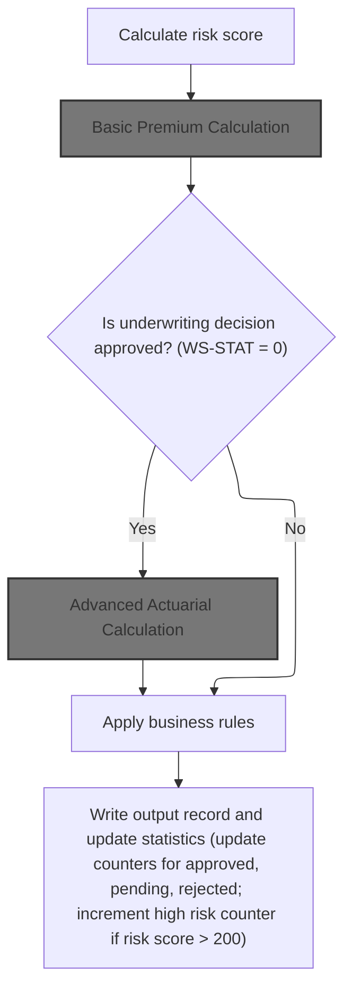
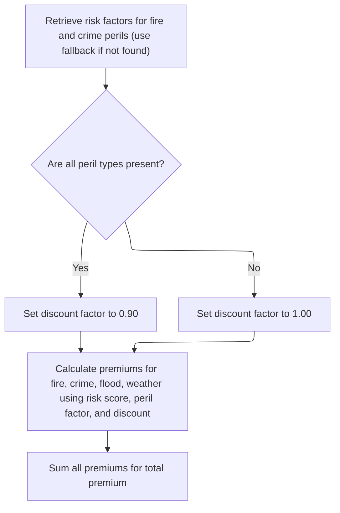
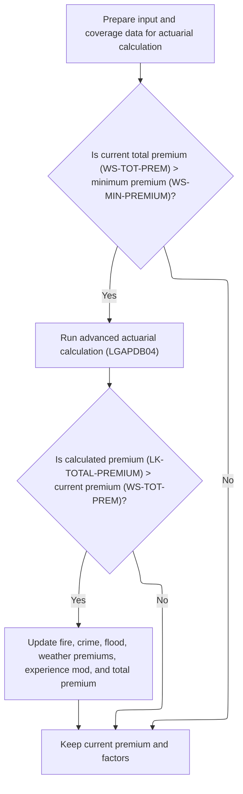
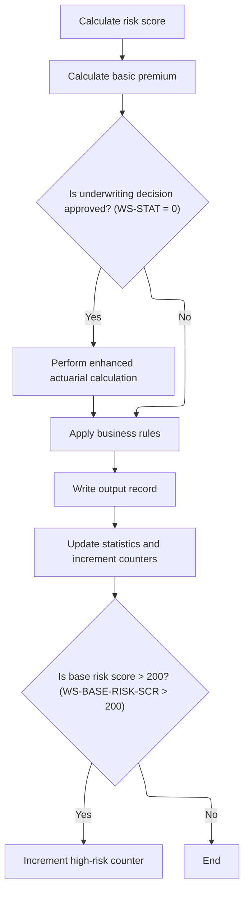
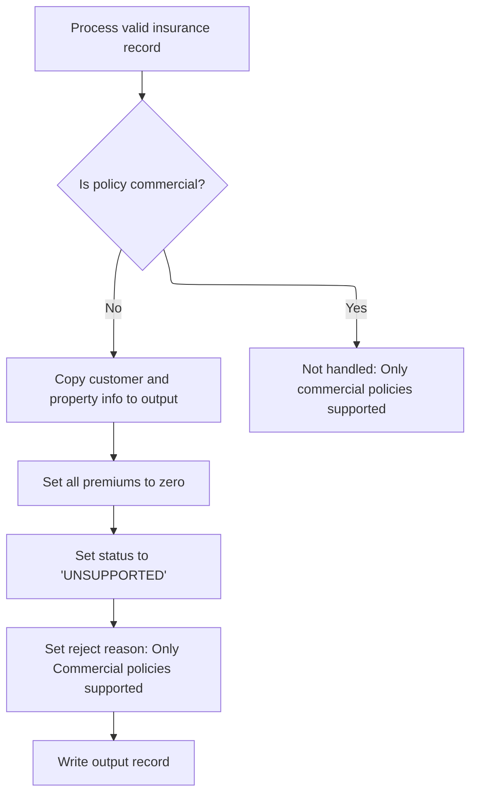

This document outlines the process for handling valid insurance policy records. Commercial policies are processed with risk and premium calculations, business rule application, and statistics updates. Non-commercial policies are flagged as unsupported, with all premiums set to zero. The flow receives a policy record as input and outputs either a processed record or a flagged unsupported record.

# Spec

## Detailed View of the Program's Functionality

a. Program Initialization and Structure

The program in question is responsible for advanced actuarial premium calculations for insurance policies. It is structured with several sections: identification, environment, data (including working storage and linkage), and a detailed procedure division. The program expects three main data structures as input/output: input data (customer and risk info), coverage data (limits, deductibles, perils), and output results (premiums, modifiers, factors).

b. Actuarial Constants, Factors, and Data Structures

The program defines a set of constants and factors used throughout the calculations. These include ratios for expenses, profit, loss, trend, and credibility, as well as peril correlations and catastrophe model factors (for hurricane, earthquake, tornado, and flood). There are also multi-dimensional arrays for storing base rates by peril, territory, construction, and occupancy, and several working storage areas for intermediate results, discounts, exposures, and modifiers.

c. Main Calculation Flow

The main procedure is a step-by-step sequence that performs the following actions in order:

 1. **Initialization (P200-INIT):**

    - All calculation work areas and the base rate table are initialized.
    - Building, contents, and business interruption exposures are calculated by adjusting the coverage limits based on the risk score.
    - The total insured value is computed as the sum of these exposures.
    - Exposure density is calculated as total insured value divided by square footage, or set to a default if square footage is zero.

 2. **Base Rate Loading (LOAD-RATE-TABLES and P310-PERIL-RATES):**

    - The program attempts to load base rates for each peril (fire, crime, flood, weather) from a database table, using the territory, construction type, occupancy code, and peril code as keys, and ensuring the rates are currently effective.
    - If a rate is not found, a default hardcoded rate is used for that peril.

 3. **Experience Modifier Calculation (P400-EXP-MOD):**

    - The experience modifier is set based on years in business and claims history.
    - If the business has at least 5 years and no claims, a discount is applied.
    - If there are claims, the modifier is increased proportionally to the claims amount (relative to total insured value), with upper and lower caps.
    - If the business is younger than 5 years, a penalty is applied.
    - The calculated modifier is stored for later use.

 4. **Schedule Modifier Calculation (P500-SCHED-MOD):**

    - The schedule modifier is adjusted based on building age, protection class, occupancy code, and exposure density.
    - Each factor can increase or decrease the modifier according to business rules and hardcoded ranges.
    - The modifier is clamped to a minimum and maximum value before being stored.

 5. **Base Premium Calculation (P600-BASE-PREM):**

    - For each peril selected (fire, crime, flood, weather), the premium is calculated using the relevant exposures, base rate, experience modifier, schedule modifier, and trend factor.
    - The flood premium includes an additional loading.
    - All peril premiums are summed to form the base amount.

 6. **Catastrophe Loading (P700-CAT-LOAD):**

    - Additional premium is added for catastrophe risks: hurricane (if weather peril is selected), earthquake (all perils), tornado (if weather peril is selected), and flood (if flood peril is selected).
    - Each loading is calculated as a percentage of the relevant peril premium or base amount and summed.

 7. **Expense and Profit Loading (P800-EXPENSE):**

    - Expense loading is calculated as a percentage of the sum of base amount and catastrophe loading.
    - Profit loading is calculated as a percentage of the sum of base amount, catastrophe loading, and expense loading.
    - Both are stored for use in the final premium calculation.

 8. **Discounts and Credits (P900-DISC):**

    - Discounts are applied for multi-peril coverage, claims-free history, and high deductibles.
    - Each discount is calculated according to business rules and summed, with a maximum cap.
    - The total discount is applied to the sum of base amount, catastrophe loading, expense loading, and profit loading.

 9. **Taxes (P950-TAXES):**

    - Taxes are calculated as a percentage of the subtotal after discounts and added to the premium.

10. **Final Premium and Rate Factor Calculation (P999-FINAL):**

    - The total premium is calculated by summing all components and subtracting discounts, then adding taxes.
    - The final rate factor is calculated as the total premium divided by the total insured value.
    - If the rate factor exceeds a maximum threshold, it is capped and the premium is recalculated accordingly.

d. Data Flow and Output

- The program receives all necessary data via its linkage section (input data, coverage data, and output results).
- Each calculation step updates the relevant fields in the output structure.
- The final output includes detailed premiums for each peril, the total premium, all premium components, and the rating factors (experience, schedule, and final rate factor).

e. Business Logic and Safeguards

- The program uses hardcoded constants and fallback values to ensure calculations proceed even if some data is missing.
- All modifiers and discounts are capped to prevent extreme values.
- The calculation steps are modular, so changes in one area do not affect others.
- There are no explicit checks for divide-by-zero in some calculations, but defaults are set to avoid errors where possible.

f. Summary

This program implements a comprehensive, stepwise actuarial premium calculation for insurance policies, incorporating risk, exposure, experience, schedule, catastrophe, expense, profit, discounts, and taxes. It is designed to be robust, modular, and to provide detailed output for downstream processing or reporting.

# Rule Definition

| Paragraph Name                                                                                              | Rule ID | Category          | Description                                                                                                                                                                                                                                                                                                               | Conditions                                                                                                                        | Remarks                                                                                                                                                                                                                                                                                                                                                                                 |
| ----------------------------------------------------------------------------------------------------------- | ------- | ----------------- | ------------------------------------------------------------------------------------------------------------------------------------------------------------------------------------------------------------------------------------------------------------------------------------------------------------------------- | --------------------------------------------------------------------------------------------------------------------------------- | --------------------------------------------------------------------------------------------------------------------------------------------------------------------------------------------------------------------------------------------------------------------------------------------------------------------------------------------------------------------------------------- |
| P008-VALIDATE-INPUT-RECORD, P009-PROCESS-VALID-RECORD, P011-PROCESS-COMMERCIAL, P012-PROCESS-NON-COMMERCIAL | RL-001  | Conditional Logic | The program must determine if the input policy is commercial. If so, it processes the record for risk and premium calculation. If not, it marks the record as unsupported and sets all premium and risk score fields to zero.                                                                                             | Input record must have COMMERCIAL-POLICY field set to true for commercial processing. Otherwise, it is treated as non-commercial. | Output record for non-commercial policies must include customer number, property type, postcode, risk score (zero), all premiums (zero), status ('UNSUPPORTED'), and reject reason ('Only Commercial policies supported in this version'). All fields are alphanumeric or numeric as per output record definition.                                                                      |
| P011A-CALCULATE-RISK-SCORE                                                                                  | RL-002  | Computation       | For commercial policies, the risk score is calculated using property type, postcode, coverage limits, peril selections, and customer history.                                                                                                                                                                             | Policy must be commercial.                                                                                                        | Risk score is a numeric value (up to 3 digits). Calculated by a called program using all relevant input fields.                                                                                                                                                                                                                                                                         |
| CALCULATE-PREMIUMS (LGAPDB03), P011B-BASIC-PREMIUM-CALC, P600-BASE-PREM (LGAPDB04)                          | RL-003  | Computation       | Premiums for fire, crime, flood, and weather perils are calculated using formulas that multiply risk score, peril factor, peril value, and discount factor. If peril value is zero or not specified, premium for that peril is zero.                                                                                      | Policy must be commercial. Peril value must be greater than zero to calculate premium.                                            | Peril factors: fire=0.80, crime=0.60, flood=1.20, weather=0.90 (defaults if not found in DB). Premiums are numeric (up to 8 digits, 2 decimals). Discount factor is 0.90 if all peril values > 0, else 1.00.                                                                                                                                                                            |
| CALCULATE-PREMIUMS (LGAPDB03), P900-DISC (LGAPDB04)                                                         | RL-004  | Conditional Logic | Discount factor is set to 0.90 if all peril values are greater than zero, otherwise 1.00. Used in premium calculation formulas.                                                                                                                                                                                           | All peril values must be greater than zero for discount factor to be 0.90.                                                        | Discount factor is numeric (0.90 or 1.00).                                                                                                                                                                                                                                                                                                                                              |
| CALCULATE-PREMIUMS (LGAPDB03), P011B-BASIC-PREMIUM-CALC, P600-BASE-PREM (LGAPDB04), P999-FINAL (LGAPDB04)   | RL-005  | Computation       | Total premium is the sum of all peril premiums. May be updated by advanced actuarial calculations if applicable.                                                                                                                                                                                                          | Policy must be commercial. Peril premiums must be calculated.                                                                     | Total premium is numeric (up to 9 digits, 2 decimals).                                                                                                                                                                                                                                                                                                                                  |
| P011C-ENHANCED-ACTUARIAL-CALC, LGAPDB04 (entire main logic)                                                 | RL-006  | Computation       | If underwriting decision is approved and total premium is greater than minimum premium, advanced actuarial calculations are performed using exposures, experience modifier, schedule modifier, catastrophe loading, expense and profit loading, discounts, and taxes. Premiums are updated if actuarial result is higher. | Underwriting decision must be approved (status=0). Total premium must be greater than minimum premium.                            | Minimum premium is 500.00 (default, can be overridden by config). Actuarial calculation uses multiple numeric fields and updates peril premiums and total premium if result is higher.                                                                                                                                                                                                  |
| P999-FINAL (LGAPDB04)                                                                                       | RL-007  | Computation       | Final rate factor is calculated as total premium divided by total insured value and capped at 0.05. If capped, total premium is recalculated as total insured value times 0.05.                                                                                                                                           | Final rate factor must be calculated. If it exceeds 0.05, capping is applied.                                                     | Final rate factor is numeric (max 0.05). Total insured value is numeric (up to 11 digits, 2 decimals).                                                                                                                                                                                                                                                                                  |
| P011E-WRITE-OUTPUT-RECORD, P012-PROCESS-NON-COMMERCIAL, P010-PROCESS-ERROR-RECORD                           | RL-008  | Data Assignment   | For every input record processed, an output record is written with all required fields. For commercial policies, output includes calculated values. For non-commercial, premiums and risk score are zero, status is 'UNSUPPORTED', and reject reason is set.                                                              | All input records must result in an output record.                                                                                | Output record fields: customer number (string, 10), property type (string, 15), postcode (string, 8), risk score (number, 3), fire premium (number, 8.2), crime premium (number, 8.2), flood premium (number, 8.2), weather premium (number, 8.2), total premium (number, 9.2), status (string, 20), reject reason (string, 50). Fields are left-aligned, padded with spaces if needed. |

# User Stories

## User Story 1: Process input record and handle non-commercial policies

---

### Story Description:

As a system, I want to determine if a policy is commercial or non-commercial so that I can process commercial policies for risk and premium calculation, and mark non-commercial policies as unsupported with appropriate output fields.

---

### Business Rule Mapping:

| Rule ID | Paragraph Name                                                                                              | Rule Description                                                                                                                                                                                                                                             |
| ------- | ----------------------------------------------------------------------------------------------------------- | ------------------------------------------------------------------------------------------------------------------------------------------------------------------------------------------------------------------------------------------------------------ |
| RL-001  | P008-VALIDATE-INPUT-RECORD, P009-PROCESS-VALID-RECORD, P011-PROCESS-COMMERCIAL, P012-PROCESS-NON-COMMERCIAL | The program must determine if the input policy is commercial. If so, it processes the record for risk and premium calculation. If not, it marks the record as unsupported and sets all premium and risk score fields to zero.                                |
| RL-008  | P011E-WRITE-OUTPUT-RECORD, P012-PROCESS-NON-COMMERCIAL, P010-PROCESS-ERROR-RECORD                           | For every input record processed, an output record is written with all required fields. For commercial policies, output includes calculated values. For non-commercial, premiums and risk score are zero, status is 'UNSUPPORTED', and reject reason is set. |

---

### Relevant Functionality:

- **P008-VALIDATE-INPUT-RECORD**
  1. **RL-001:**
     - If COMMERCIAL-POLICY is true:
       - Proceed to risk score and premium calculation
     - Else:
       - Set risk score and all premiums to zero
       - Set status to 'UNSUPPORTED'
       - Set reject reason to 'Only Commercial policies supported in this version'
       - Write output record
- **P011E-WRITE-OUTPUT-RECORD**
  1. **RL-008:**
     - For commercial policies:
       - Populate output record with calculated values
     - For non-commercial policies:
       - Set premiums and risk score to zero
       - Set status and reject reason as specified
     - Write output record for each input

## User Story 2: Calculate risk score and peril premiums for commercial policies

---

### Story Description:

As a commercial policyholder, I want my risk score and peril premiums (fire, crime, flood, weather) to be calculated accurately using my policy details, peril factors, and discount logic so that my total premium reflects my coverage and risk profile.

---

### Business Rule Mapping:

| Rule ID | Paragraph Name                                                                                            | Rule Description                                                                                                                                                                                                                     |
| ------- | --------------------------------------------------------------------------------------------------------- | ------------------------------------------------------------------------------------------------------------------------------------------------------------------------------------------------------------------------------------ |
| RL-002  | P011A-CALCULATE-RISK-SCORE                                                                                | For commercial policies, the risk score is calculated using property type, postcode, coverage limits, peril selections, and customer history.                                                                                        |
| RL-003  | CALCULATE-PREMIUMS (LGAPDB03), P011B-BASIC-PREMIUM-CALC, P600-BASE-PREM (LGAPDB04)                        | Premiums for fire, crime, flood, and weather perils are calculated using formulas that multiply risk score, peril factor, peril value, and discount factor. If peril value is zero or not specified, premium for that peril is zero. |
| RL-004  | CALCULATE-PREMIUMS (LGAPDB03), P900-DISC (LGAPDB04)                                                       | Discount factor is set to 0.90 if all peril values are greater than zero, otherwise 1.00. Used in premium calculation formulas.                                                                                                      |
| RL-005  | CALCULATE-PREMIUMS (LGAPDB03), P011B-BASIC-PREMIUM-CALC, P600-BASE-PREM (LGAPDB04), P999-FINAL (LGAPDB04) | Total premium is the sum of all peril premiums. May be updated by advanced actuarial calculations if applicable.                                                                                                                     |

---

### Relevant Functionality:

- **P011A-CALCULATE-RISK-SCORE**
  1. **RL-002:**
     - Call risk score calculation routine with:
       - Property type
       - Postcode
       - Coverage limits
       - Peril selections
       - Customer history
     - Store result as risk score
- **CALCULATE-PREMIUMS (LGAPDB03)**
  1. **RL-003:**
     - For each peril (fire, crime, flood, weather):
       - If peril value > 0:
         - Compute premium = (risk score \* peril factor) \* peril value \* discount factor
       - Else:
         - Set premium to zero
     - Sum all peril premiums for total premium
  2. **RL-004:**
     - If all peril values > 0:
       - Set discount factor to 0.90
     - Else:
       - Set discount factor to 1.00
  3. **RL-005:**
     - Sum fire, crime, flood, and weather premiums
     - If advanced actuarial calculation performed and result > basic premium:
       - Update total premium and peril premiums

## User Story 3: Perform advanced actuarial calculations and apply final rate capping

---

### Story Description:

As a commercial policyholder with an approved underwriting decision and sufficient premium, I want advanced actuarial calculations and final rate capping to be applied to my policy so that my premiums are updated according to regulatory and business requirements.

---

### Business Rule Mapping:

| Rule ID | Paragraph Name                                              | Rule Description                                                                                                                                                                                                                                                                                                          |
| ------- | ----------------------------------------------------------- | ------------------------------------------------------------------------------------------------------------------------------------------------------------------------------------------------------------------------------------------------------------------------------------------------------------------------- |
| RL-006  | P011C-ENHANCED-ACTUARIAL-CALC, LGAPDB04 (entire main logic) | If underwriting decision is approved and total premium is greater than minimum premium, advanced actuarial calculations are performed using exposures, experience modifier, schedule modifier, catastrophe loading, expense and profit loading, discounts, and taxes. Premiums are updated if actuarial result is higher. |
| RL-007  | P999-FINAL (LGAPDB04)                                       | Final rate factor is calculated as total premium divided by total insured value and capped at 0.05. If capped, total premium is recalculated as total insured value times 0.05.                                                                                                                                           |

---

### Relevant Functionality:

- **P011C-ENHANCED-ACTUARIAL-CALC**
  1. **RL-006:**
     - If status is 'APPROVED' and total premium > minimum premium:
       - Prepare input structure for actuarial calculation
       - Call actuarial calculation routine
       - If calculated premium > basic premium:
         - Update peril premiums and total premium
- **P999-FINAL (LGAPDB04)**
  1. **RL-007:**
     - Compute final rate factor = total premium / total insured value
     - If final rate factor > 0.05:
       - Set final rate factor to 0.05
       - Recompute total premium = total insured value \* 0.05

# Code Walkthrough

## Branching by Policy Type

<SwmSnippet path="/base/src/LGAPDB01.cbl" line="234">

---

`P009-PROCESS-VALID-RECORD` kicks off the flow by checking if the policy is commercial. If it is, we call P011-PROCESS-COMMERCIAL to run the full premium and risk calculation logic for commercial policies. If not, we branch to P012-PROCESS-NON-COMMERCIAL, which just flags the record as unsupported. This call to P011-PROCESS-COMMERCIAL is needed because only commercial policies go through the full calculation and output process.

```cobol
       P009-PROCESS-VALID-RECORD.
           IF COMMERCIAL-POLICY
               PERFORM P011-PROCESS-COMMERCIAL
               ADD 1 TO WS-PROC-CNT
           ELSE
               PERFORM P012-PROCESS-NON-COMMERCIAL
               ADD 1 TO WS-ERR-CNT
           END-IF.
```

---

</SwmSnippet>

### Commercial Policy Processing



<SwmSnippet path="/base/src/LGAPDB01.cbl" line="258">

---

In `P011-PROCESS-COMMERCIAL`, we first calculate the risk score, then immediately call P011B-BASIC-PREMIUM-CALC to compute the initial premium values using that risk score. This step is needed because the premium calculation depends on the risk score, and the result determines if we need to run more advanced actuarial logic.

```cobol
       P011-PROCESS-COMMERCIAL.
           PERFORM P011A-CALCULATE-RISK-SCORE
           PERFORM P011B-BASIC-PREMIUM-CALC
           IF WS-STAT = 0
               PERFORM P011C-ENHANCED-ACTUARIAL-CALC
           END-IF
           PERFORM P011D-APPLY-BUSINESS-RULES
           PERFORM P011E-WRITE-OUTPUT-RECORD
           PERFORM P011F-UPDATE-STATISTICS.
```

---

</SwmSnippet>

#### Basic Premium Calculation

<SwmSnippet path="/base/src/LGAPDB01.cbl" line="275">

---

`P011B-BASIC-PREMIUM-CALC` calls the LGAPDB03 program to handle risk factor lookup, verdict assignment, and premium calculation for each peril. This call is needed because all the logic for these calculations is implemented in LGAPDB03, not inline here.

```cobol
       P011B-BASIC-PREMIUM-CALC.
           CALL 'LGAPDB03' USING WS-BASE-RISK-SCR, IN-FIRE-PERIL, 
                                IN-CRIME-PERIL, IN-FLOOD-PERIL, 
                                IN-WEATHER-PERIL, WS-STAT,
                                WS-STAT-DESC, WS-REJ-RSN, WS-FR-PREM,
                                WS-CR-PREM, WS-FL-PREM, WS-WE-PREM,
                                WS-TOT-PREM, WS-DISC-FACT.
```

---

</SwmSnippet>

#### Risk Factor and Premium Computation



<SwmSnippet path="/base/src/LGAPDB03.cbl" line="42">

---

`MAIN-LOGIC` in LGAPDB03 runs the sequence: fetch risk factors, determine the application verdict, and calculate premiums for each peril. The call to GET-RISK-FACTORS is needed to pull current risk factors from the database, which are then used in the premium calculations.

```cobol
       MAIN-LOGIC.
           PERFORM GET-RISK-FACTORS
           PERFORM CALCULATE-VERDICT
           PERFORM CALCULATE-PREMIUMS
           GOBACK.
```

---

</SwmSnippet>

<SwmSnippet path="/base/src/LGAPDB03.cbl" line="48">

---

`GET-RISK-FACTORS` tries to fetch FIRE and CRIME risk factors from the RISK_FACTORS table. If the query fails, it just uses 0.80 for FIRE and 0.60 for CRIME as defaults. This keeps the calculation running even if the DB is missing data, but those numbers are just hardcoded here.

```cobol
       GET-RISK-FACTORS.
           EXEC SQL
               SELECT FACTOR_VALUE INTO :WS-FIRE-FACTOR
               FROM RISK_FACTORS
               WHERE PERIL_TYPE = 'FIRE'
           END-EXEC.
           
           IF SQLCODE = 0
               CONTINUE
           ELSE
               MOVE 0.80 TO WS-FIRE-FACTOR
           END-IF.
           
           EXEC SQL
               SELECT FACTOR_VALUE INTO :WS-CRIME-FACTOR
               FROM RISK_FACTORS
               WHERE PERIL_TYPE = 'CRIME'
           END-EXEC.
           
           IF SQLCODE = 0
               CONTINUE
           ELSE
               MOVE 0.60 TO WS-CRIME-FACTOR
           END-IF.
```

---

</SwmSnippet>

<SwmSnippet path="/base/src/LGAPDB03.cbl" line="92">

---

`CALCULATE-PREMIUMS` sets a discount if all perils are covered, then calculates each peril's premium using the risk score, peril factor, peril value, and discount. The total premium is just the sum of all these. The discount logic is a business rule to encourage full coverage.

```cobol
       CALCULATE-PREMIUMS.
           MOVE 1.00 TO LK-DISC-FACT
           
           IF LK-FIRE-PERIL > 0 AND
              LK-CRIME-PERIL > 0 AND
              LK-FLOOD-PERIL > 0 AND
              LK-WEATHER-PERIL > 0
             MOVE 0.90 TO LK-DISC-FACT
           END-IF

           COMPUTE LK-FIRE-PREMIUM =
             ((LK-RISK-SCORE * WS-FIRE-FACTOR) * LK-FIRE-PERIL *
               LK-DISC-FACT)
           
           COMPUTE LK-CRIME-PREMIUM =
             ((LK-RISK-SCORE * WS-CRIME-FACTOR) * LK-CRIME-PERIL *
               LK-DISC-FACT)
           
           COMPUTE LK-FLOOD-PREMIUM =
             ((LK-RISK-SCORE * WS-FLOOD-FACTOR) * LK-FLOOD-PERIL *
               LK-DISC-FACT)
           
           COMPUTE LK-WEATHER-PREMIUM =
             ((LK-RISK-SCORE * WS-WEATHER-FACTOR) * LK-WEATHER-PERIL *
               LK-DISC-FACT)

           COMPUTE LK-TOTAL-PREMIUM = 
             LK-FIRE-PREMIUM + LK-CRIME-PREMIUM + 
             LK-FLOOD-PREMIUM + LK-WEATHER-PREMIUM. 
```

---

</SwmSnippet>

#### Advanced Actuarial Calculation



<SwmSnippet path="/base/src/LGAPDB01.cbl" line="283">

---

`P011C-ENHANCED-ACTUARIAL-CALC` sets up all the input data and calls LGAPDB04 for advanced premium calculation, but only if the total premium is above the minimum. If the enhanced premium comes back higher, we update the working storage with the new values.

```cobol
       P011C-ENHANCED-ACTUARIAL-CALC.
      *    Prepare input structure for actuarial calculation
           MOVE IN-CUSTOMER-NUM TO LK-CUSTOMER-NUM
           MOVE WS-BASE-RISK-SCR TO LK-RISK-SCORE
           MOVE IN-PROPERTY-TYPE TO LK-PROPERTY-TYPE
           MOVE IN-TERRITORY-CODE TO LK-TERRITORY
           MOVE IN-CONSTRUCTION-TYPE TO LK-CONSTRUCTION-TYPE
           MOVE IN-OCCUPANCY-CODE TO LK-OCCUPANCY-CODE
           MOVE IN-SPRINKLER-IND TO LK-PROTECTION-CLASS
           MOVE IN-YEAR-BUILT TO LK-YEAR-BUILT
           MOVE IN-SQUARE-FOOTAGE TO LK-SQUARE-FOOTAGE
           MOVE IN-YEARS-IN-BUSINESS TO LK-YEARS-IN-BUSINESS
           MOVE IN-CLAIMS-COUNT-3YR TO LK-CLAIMS-COUNT-5YR
           MOVE IN-CLAIMS-AMOUNT-3YR TO LK-CLAIMS-AMOUNT-5YR
           
      *    Set coverage data
           MOVE IN-BUILDING-LIMIT TO LK-BUILDING-LIMIT
           MOVE IN-CONTENTS-LIMIT TO LK-CONTENTS-LIMIT
           MOVE IN-BI-LIMIT TO LK-BI-LIMIT
           MOVE IN-FIRE-DEDUCTIBLE TO LK-FIRE-DEDUCTIBLE
           MOVE IN-WIND-DEDUCTIBLE TO LK-WIND-DEDUCTIBLE
           MOVE IN-FLOOD-DEDUCTIBLE TO LK-FLOOD-DEDUCTIBLE
           MOVE IN-OTHER-DEDUCTIBLE TO LK-OTHER-DEDUCTIBLE
           MOVE IN-FIRE-PERIL TO LK-FIRE-PERIL
           MOVE IN-CRIME-PERIL TO LK-CRIME-PERIL
           MOVE IN-FLOOD-PERIL TO LK-FLOOD-PERIL
           MOVE IN-WEATHER-PERIL TO LK-WEATHER-PERIL
           
      *    Call advanced actuarial calculation program (only for approved cases)
           IF WS-TOT-PREM > WS-MIN-PREMIUM
               CALL 'LGAPDB04' USING LK-INPUT-DATA, LK-COVERAGE-DATA, 
                                    LK-OUTPUT-RESULTS
               
      *        Update with enhanced calculations if successful
               IF LK-TOTAL-PREMIUM > WS-TOT-PREM
                   MOVE LK-FIRE-PREMIUM TO WS-FR-PREM
                   MOVE LK-CRIME-PREMIUM TO WS-CR-PREM
                   MOVE LK-FLOOD-PREMIUM TO WS-FL-PREM
                   MOVE LK-WEATHER-PREMIUM TO WS-WE-PREM
                   MOVE LK-TOTAL-PREMIUM TO WS-TOT-PREM
                   MOVE LK-EXPERIENCE-MOD TO WS-EXPERIENCE-MOD
               END-IF
           END-IF.
```

---

</SwmSnippet>

#### Full Actuarial Premium Breakdown

```mermaid
%%{init: {"flowchart": {"defaultRenderer": "elk"}} }%%
flowchart TD
    node1["Calculate exposures using limits and risk score"]
    click node1 openCode "base/src/LGAPDB04.cbl:152:174"
    node1 --> node2{"Is square footage > 0?"}
    click node2 openCode "base/src/LGAPDB04.cbl:169:174"
    node2 -->|"Yes"| node3["Calculate exposure density"]
    click node3 openCode "base/src/LGAPDB04.cbl:170:171"
    node2 -->|"No"| node4["Set exposure density to default"]
    click node4 openCode "base/src/LGAPDB04.cbl:173:173"
    node3 --> node5["Adjust experience modifier"]
    node4 --> node5
    click node5 openCode "base/src/LGAPDB04.cbl:234:258"
    node5 --> node6{"Years in business >= 5?"}
    click node6 openCode "base/src/LGAPDB04.cbl:237:256"
    node6 -->|"Yes"| node7{"Claims count (5yr) = 0?"}
    click node7 openCode "base/src/LGAPDB04.cbl:238:253"
    node7 -->|"Yes"| node8["Set experience mod to 0.85"]
    click node8 openCode "base/src/LGAPDB04.cbl:239:239"
    node7 -->|"No"| node9["Calculate experience mod and cap between 0.5 and 2.0"]
    click node9 openCode "base/src/LGAPDB04.cbl:241:252"
    node6 -->|"No"| node10["Set experience mod to 1.10"]
    click node10 openCode "base/src/LGAPDB04.cbl:255:255"
    node8 --> node11["Adjust schedule modifier: building age, protection class, occupancy, exposure density"]
    node9 --> node11
    node10 --> node11
    click node11 openCode "base/src/LGAPDB04.cbl:260:316"
    node11 --> node12{"Is schedule modifier > 0.4?"}
    click node12 openCode "base/src/LGAPDB04.cbl:308:310"
    node12 -->|"Yes"| node13["Cap schedule modifier at 0.4"]
    click node13 openCode "base/src/LGAPDB04.cbl:309:310"
    node12 -->|"No"| node14{"Is schedule modifier < -0.2?"}
    click node14 openCode "base/src/LGAPDB04.cbl:312:314"
    node14 -->|"Yes"| node15["Cap schedule modifier at -0.2"]
    click node15 openCode "base/src/LGAPDB04.cbl:313:314"
    node14 -->|"No"| node16["Continue"]
    node13 --> node17["Calculate final premium and rate factor"]
    node15 --> node17
    node16 --> node17
    click node17 openCode "base/src/LGAPDB04.cbl:464:472"
    node17 --> node18{"Is final rate factor > 0.05?"}
    click node18 openCode "base/src/LGAPDB04.cbl:473:477"
    node18 -->|"Yes"| node19["Cap rate factor at 0.05 and recalculate premium"]
    click node19 openCode "base/src/LGAPDB04.cbl:474:476"
    node18 -->|"No"| node20["Return final premium and rate factor"]
    click node20 openCode "base/src/LGAPDB04.cbl:477:477"
classDef HeadingStyle fill:#777777,stroke:#333,stroke-width:2px;
```



<SwmSnippet path="/base/src/LGAPDB04.cbl" line="138">

---

`P100-MAIN` runs through all the actuarial steps: initializing exposures, calculating rates, applying experience and schedule mods, adding catastrophe and expense loads, discounts, taxes, and finally computing the total premium and rate factor. Each step is modular, so changes in one don't break the others.

```cobol
       P100-MAIN.
           PERFORM P200-INIT
           PERFORM P300-RATES
           PERFORM P350-EXPOSURE
           PERFORM P400-EXP-MOD
           PERFORM P500-SCHED-MOD
           PERFORM P600-BASE-PREM
           PERFORM P700-CAT-LOAD
           PERFORM P800-EXPENSE
           PERFORM P900-DISC
           PERFORM P950-TAXES
           PERFORM P999-FINAL
           GOBACK.
```

---

</SwmSnippet>

<SwmSnippet path="/base/src/LGAPDB04.cbl" line="152">

---

`P200-INIT` adjusts the building, contents, and BI exposures using a risk score-based formula, then sums them for total insured value. If square footage is zero, it just sets exposure density to 100.00 to avoid a divide-by-zero. These constants and formulas are specific to this repo and not explained in the code.

```cobol
       P200-INIT.
           INITIALIZE WS-CALCULATION-AREAS
           INITIALIZE WS-BASE-RATE-TABLE
           
           COMPUTE WS-BUILDING-EXPOSURE = 
               LK-BUILDING-LIMIT * (1 + (LK-RISK-SCORE - 100) / 1000)
               
           COMPUTE WS-CONTENTS-EXPOSURE = 
               LK-CONTENTS-LIMIT * (1 + (LK-RISK-SCORE - 100) / 1000)
               
           COMPUTE WS-BI-EXPOSURE = 
               LK-BI-LIMIT * (1 + (LK-RISK-SCORE - 100) / 1000)
               
           COMPUTE WS-TOTAL-INSURED-VAL = 
               WS-BUILDING-EXPOSURE + WS-CONTENTS-EXPOSURE + 
               WS-BI-EXPOSURE
               
           IF LK-SQUARE-FOOTAGE > ZERO
               COMPUTE WS-EXPOSURE-DENSITY = 
                   WS-TOTAL-INSURED-VAL / LK-SQUARE-FOOTAGE
           ELSE
               MOVE 100.00 TO WS-EXPOSURE-DENSITY
           END-IF.
```

---

</SwmSnippet>

<SwmSnippet path="/base/src/LGAPDB04.cbl" line="234">

---

`P400-EXP-MOD` sets the experience modifier based on years in business and claims history, using a bunch of hardcoded constants. If there are no claims in 5 years, you get a discount; otherwise, it scales with claims amount and is capped. Less than 5 years in business gets a penalty. No explicit check for divide-by-zero on total insured value.

```cobol
       P400-EXP-MOD.
           MOVE 1.0000 TO WS-EXPERIENCE-MOD
           
           IF LK-YEARS-IN-BUSINESS >= 5
               IF LK-CLAIMS-COUNT-5YR = ZERO
                   MOVE 0.8500 TO WS-EXPERIENCE-MOD
               ELSE
                   COMPUTE WS-EXPERIENCE-MOD = 
                       1.0000 + 
                       ((LK-CLAIMS-AMOUNT-5YR / WS-TOTAL-INSURED-VAL) * 
                        WS-CREDIBILITY-FACTOR * 0.50)
                   
                   IF WS-EXPERIENCE-MOD > 2.0000
                       MOVE 2.0000 TO WS-EXPERIENCE-MOD
                   END-IF
                   
                   IF WS-EXPERIENCE-MOD < 0.5000
                       MOVE 0.5000 TO WS-EXPERIENCE-MOD
                   END-IF
               END-IF
           ELSE
               MOVE 1.1000 TO WS-EXPERIENCE-MOD
           END-IF
           
           MOVE WS-EXPERIENCE-MOD TO LK-EXPERIENCE-MOD.
```

---

</SwmSnippet>

<SwmSnippet path="/base/src/LGAPDB04.cbl" line="260">

---

`P500-SCHED-MOD` tweaks the schedule mod based on building age, protection class, occupancy code, and exposure density, using a bunch of hardcoded ranges and constants. The result is clamped between -0.20 and +0.40. All these adjustments are business logic, not explained in the code.

```cobol
       P500-SCHED-MOD.
           MOVE +0.000 TO WS-SCHEDULE-MOD
           
      *    Building age factor
           EVALUATE TRUE
               WHEN LK-YEAR-BUILT >= 2010
                   SUBTRACT 0.050 FROM WS-SCHEDULE-MOD
               WHEN LK-YEAR-BUILT >= 1990
                   CONTINUE
               WHEN LK-YEAR-BUILT >= 1970
                   ADD 0.100 TO WS-SCHEDULE-MOD
               WHEN OTHER
                   ADD 0.200 TO WS-SCHEDULE-MOD
           END-EVALUATE
           
      *    Protection class factor
           EVALUATE LK-PROTECTION-CLASS
               WHEN '01' THRU '03'
                   SUBTRACT 0.100 FROM WS-SCHEDULE-MOD
               WHEN '04' THRU '06'
                   SUBTRACT 0.050 FROM WS-SCHEDULE-MOD
               WHEN '07' THRU '09'
                   CONTINUE
               WHEN OTHER
                   ADD 0.150 TO WS-SCHEDULE-MOD
           END-EVALUATE
           
      *    Occupancy hazard factor
           EVALUATE LK-OCCUPANCY-CODE
               WHEN 'OFF01' THRU 'OFF05'
                   SUBTRACT 0.025 FROM WS-SCHEDULE-MOD
               WHEN 'MFG01' THRU 'MFG10'
                   ADD 0.075 TO WS-SCHEDULE-MOD
               WHEN 'WHS01' THRU 'WHS05'
                   ADD 0.125 TO WS-SCHEDULE-MOD
               WHEN OTHER
                   CONTINUE
           END-EVALUATE
           
      *    Exposure density factor
           IF WS-EXPOSURE-DENSITY > 500.00
               ADD 0.100 TO WS-SCHEDULE-MOD
           ELSE
               IF WS-EXPOSURE-DENSITY < 50.00
                   SUBTRACT 0.050 FROM WS-SCHEDULE-MOD
               END-IF
           END-IF
           
           IF WS-SCHEDULE-MOD > +0.400
               MOVE +0.400 TO WS-SCHEDULE-MOD
           END-IF
           
           IF WS-SCHEDULE-MOD < -0.200
               MOVE -0.200 TO WS-SCHEDULE-MOD
           END-IF
           
           MOVE WS-SCHEDULE-MOD TO LK-SCHEDULE-MOD.
```

---

</SwmSnippet>

<SwmSnippet path="/base/src/LGAPDB04.cbl" line="464">

---

`P999-FINAL` sums up all the premium components, divides by total insured value to get the rate factor, and caps it at 0.05 if needed. If capped, it recalculates the total premium. The 0.05 is just a hardcoded business rule here, and there's no check for divide-by-zero.

```cobol
       P999-FINAL.
           COMPUTE LK-TOTAL-PREMIUM = 
               LK-BASE-AMOUNT + LK-CAT-LOAD-AMT + 
               LK-EXPENSE-LOAD-AMT + LK-PROFIT-LOAD-AMT -
               LK-DISCOUNT-AMT + LK-TAX-AMT
               
           COMPUTE LK-FINAL-RATE-FACTOR = 
               LK-TOTAL-PREMIUM / WS-TOTAL-INSURED-VAL
               
           IF LK-FINAL-RATE-FACTOR > 0.050000
               MOVE 0.050000 TO LK-FINAL-RATE-FACTOR
               COMPUTE LK-TOTAL-PREMIUM = 
                   WS-TOTAL-INSURED-VAL * LK-FINAL-RATE-FACTOR
           END-IF.
```

---

</SwmSnippet>

#### Finalizing Commercial Policy Output



<SwmSnippet path="/base/src/LGAPDB01.cbl" line="258">

---

Back in `P011-PROCESS-COMMERCIAL`, after returning from P011C-ENHANCED-ACTUARIAL-CALC, we apply business rules, write the output, and then call P011F-UPDATE-STATISTICS to update all the counters and totals for reporting and monitoring.

```cobol
       P011-PROCESS-COMMERCIAL.
           PERFORM P011A-CALCULATE-RISK-SCORE
           PERFORM P011B-BASIC-PREMIUM-CALC
           IF WS-STAT = 0
               PERFORM P011C-ENHANCED-ACTUARIAL-CALC
           END-IF
           PERFORM P011D-APPLY-BUSINESS-RULES
           PERFORM P011E-WRITE-OUTPUT-RECORD
           PERFORM P011F-UPDATE-STATISTICS.
```

---

</SwmSnippet>

<SwmSnippet path="/base/src/LGAPDB01.cbl" line="365">

---

`P011F-UPDATE-STATISTICS` adds the premium and risk score to running totals, increments counters based on the underwriting status, and bumps the high-risk counter if the risk score is over 200. The 200 threshold is just a hardcoded business rule here.

```cobol
       P011F-UPDATE-STATISTICS.
           ADD WS-TOT-PREM TO WS-TOTAL-PREMIUM-AMT
           ADD WS-BASE-RISK-SCR TO WS-CONTROL-TOTALS
           
           EVALUATE WS-STAT
               WHEN 0 ADD 1 TO WS-APPROVED-CNT
               WHEN 1 ADD 1 TO WS-PENDING-CNT
               WHEN 2 ADD 1 TO WS-REJECTED-CNT
           END-EVALUATE
           
           IF WS-BASE-RISK-SCR > 200
               ADD 1 TO WS-HIGH-RISK-CNT
           END-IF.
```

---

</SwmSnippet>

### Non-Commercial Policy Handling



<SwmSnippet path="/base/src/LGAPDB01.cbl" line="379">

---

`P012-PROCESS-NON-COMMERCIAL` copies over the basic input fields, sets all premium and risk outputs to zero, and writes out 'UNSUPPORTED' with a fixed reject reason. This makes it clear that non-commercial policies aren't processed here.

```cobol
       P012-PROCESS-NON-COMMERCIAL.
           MOVE IN-CUSTOMER-NUM TO OUT-CUSTOMER-NUM
           MOVE IN-PROPERTY-TYPE TO OUT-PROPERTY-TYPE
           MOVE IN-POSTCODE TO OUT-POSTCODE
           MOVE ZERO TO OUT-RISK-SCORE
           MOVE ZERO TO OUT-FIRE-PREMIUM
           MOVE ZERO TO OUT-CRIME-PREMIUM
           MOVE ZERO TO OUT-FLOOD-PREMIUM
           MOVE ZERO TO OUT-WEATHER-PREMIUM
           MOVE ZERO TO OUT-TOTAL-PREMIUM
           MOVE 'UNSUPPORTED' TO OUT-STATUS
           MOVE 'Only Commercial policies supported in this version' 
                TO OUT-REJECT-REASON
           WRITE OUTPUT-RECORD.
```

---

</SwmSnippet>

&nbsp;

*This is an auto-generated document by Swimm 🌊 and has not yet been verified by a human*

<SwmMeta version="3.0.0" repo-id="Z2l0aHViJTNBJTNBU3dpbW1pby1nZW5hcHAtbW90b3IlM0ElM0FHaXJpLVN3aW1t" repo-name="Swimmio-genapp-motor"><sup>Powered by [Swimm](https://app.swimm.io/)</sup></SwmMeta>
