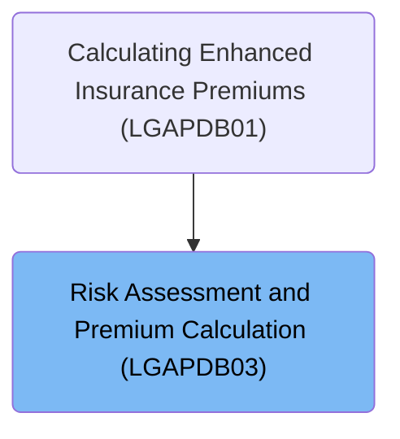
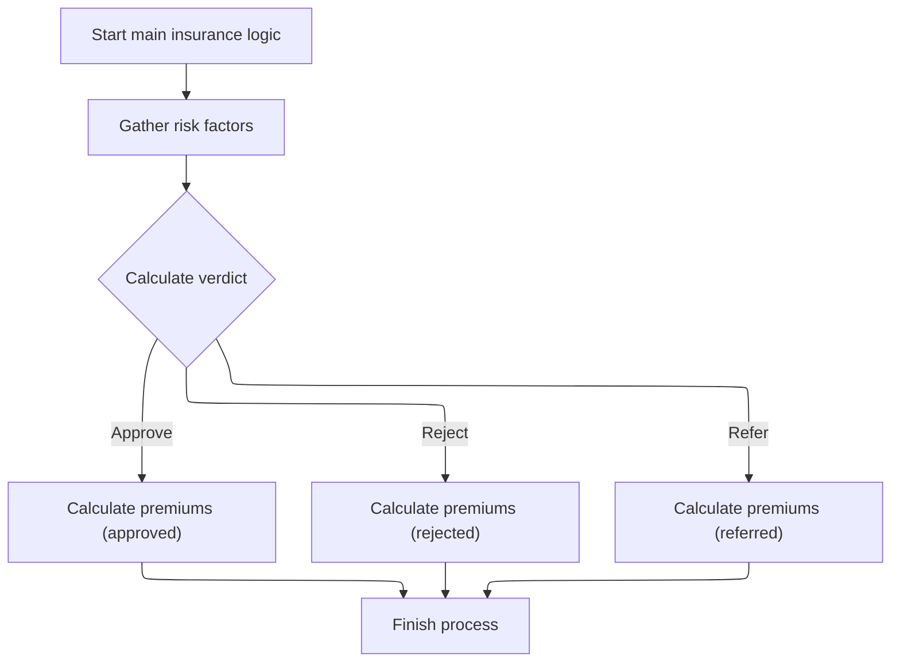
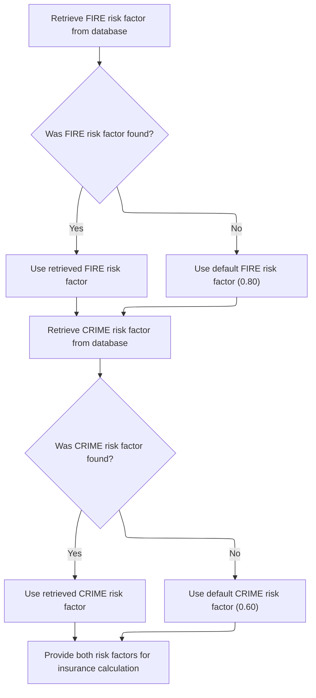

# Overview

This document describes the flow for assessing insurance risk and calculating premiums. The process gathers risk factors for 'FIRE' and 'CRIME', determines a risk verdict, and calculates the premium according to the verdict, using defaults if necessary.

## Dependencies

### Copybook

- SQLCA

# Where is this program used?

This program is used once, as represented in the following diagram:



## Input and Output Tables/Files used in the Program

| Table / File Name                                                                                                          | Type | Description                                              | Usage Mode | Key Fields / Layout Highlights                                                                                                                                                                                                                                                                               |
| -------------------------------------------------------------------------------------------------------------------------- | ---- | -------------------------------------------------------- | ---------- | ------------------------------------------------------------------------------------------------------------------------------------------------------------------------------------------------------------------------------------------------------------------------------------------------------------ |
| <SwmToken path="base/src/LGAPDB03.cbl" pos="51:3:3" line-data="               FROM RISK_FACTORS">`RISK_FACTORS`</SwmToken> | DB2  | Risk factor values by peril type for premium calculation | Input      | <SwmToken path="base/src/LGAPDB03.cbl" pos="50:8:12" line-data="               SELECT FACTOR_VALUE INTO :WS-FIRE-FACTOR">`WS-FIRE-FACTOR`</SwmToken>, <SwmToken path="base/src/LGAPDB03.cbl" pos="62:8:12" line-data="               SELECT FACTOR_VALUE INTO :WS-CRIME-FACTOR">`WS-CRIME-FACTOR`</SwmToken> |

&nbsp;

# Workflow

# Orchestrating the Risk Assessment and Premium Calculation



This section orchestrates the insurance risk assessment and premium calculation process. It ensures that all necessary risk factors are collected before making a decision on the policy and calculating the premium according to the verdict.

| Category        | Rule Name                       | Description                                                                                                                                                                                    |
| --------------- | ------------------------------- | ---------------------------------------------------------------------------------------------------------------------------------------------------------------------------------------------- |
| Data validation | Complete risk factor collection | All risk factors required for assessment must be gathered before any verdict or premium calculation is performed. If a risk factor is missing from the database, a default value must be used. |
| Business logic  | Risk verdict determination      | The risk verdict must be determined based on the collected risk factors, resulting in one of three possible outcomes: Approve, Reject, or Refer.                                               |
| Business logic  | Premium calculation by verdict  | Premium calculation must be performed according to the risk verdict. Approved, rejected, and referred cases each require a distinct premium calculation approach.                              |

<SwmSnippet path="/base/src/LGAPDB03.cbl" line="42">

---

<SwmToken path="base/src/LGAPDB03.cbl" pos="42:1:3" line-data="       MAIN-LOGIC.">`MAIN-LOGIC`</SwmToken> kicks off the process by fetching risk factors, then uses those to determine the verdict and calculate premiums. We call <SwmToken path="base/src/LGAPDB03.cbl" pos="43:3:7" line-data="           PERFORM GET-RISK-FACTORS">`GET-RISK-FACTORS`</SwmToken> first because the rest of the flow depends on having up-to-date risk factor values from the database or defaults if missing.

```cobol
       MAIN-LOGIC.
           PERFORM GET-RISK-FACTORS
           PERFORM CALCULATE-VERDICT
           PERFORM CALCULATE-PREMIUMS
           GOBACK.
```

---

</SwmSnippet>

# Fetching and Defaulting Risk Factors



This section ensures that insurance calculations always have valid risk factor values for the 'FIRE' and 'CRIME' peril types, using database values when available and defaulting when necessary.

| Category        | Rule Name                           | Description                                                                                                                                                                                                                                                  |
| --------------- | ----------------------------------- | ------------------------------------------------------------------------------------------------------------------------------------------------------------------------------------------------------------------------------------------------------------ |
| Data validation | Peril type restriction              | Only the 'FIRE' and 'CRIME' peril types are considered for risk factor retrieval and defaulting in this section.                                                                                                                                             |
| Business logic  | Use FIRE risk factor from database  | If a risk factor for the 'FIRE' peril type is found in the database, use the retrieved value for insurance calculations.                                                                                                                                     |
| Business logic  | Default FIRE risk factor            | If a risk factor for the 'FIRE' peril type is not found in the database, use the default value of <SwmToken path="base/src/LGAPDB03.cbl" pos="58:3:5" line-data="               MOVE 0.80 TO WS-FIRE-FACTOR">`0.80`</SwmToken> for insurance calculations.   |
| Business logic  | Use CRIME risk factor from database | If a risk factor for the 'CRIME' peril type is found in the database, use the retrieved value for insurance calculations.                                                                                                                                    |
| Business logic  | Default CRIME risk factor           | If a risk factor for the 'CRIME' peril type is not found in the database, use the default value of <SwmToken path="base/src/LGAPDB03.cbl" pos="70:3:5" line-data="               MOVE 0.60 TO WS-CRIME-FACTOR">`0.60`</SwmToken> for insurance calculations. |

<SwmSnippet path="/base/src/LGAPDB03.cbl" line="48">

---

In <SwmToken path="base/src/LGAPDB03.cbl" pos="48:1:5" line-data="       GET-RISK-FACTORS.">`GET-RISK-FACTORS`</SwmToken>, we start by querying the <SwmToken path="base/src/LGAPDB03.cbl" pos="51:3:3" line-data="               FROM RISK_FACTORS">`RISK_FACTORS`</SwmToken> table for the 'FIRE' peril type. The peril types are hardcoded, so this function is only concerned with 'FIRE' and 'CRIME'. If the value isn't found, we'll handle that in the next step.

```cobol
       GET-RISK-FACTORS.
           EXEC SQL
               SELECT FACTOR_VALUE INTO :WS-FIRE-FACTOR
               FROM RISK_FACTORS
               WHERE PERIL_TYPE = 'FIRE'
           END-EXEC.
```

---

</SwmSnippet>

<SwmSnippet path="/base/src/LGAPDB03.cbl" line="55">

---

If the database doesn't return a value for 'FIRE', we just assign <SwmToken path="base/src/LGAPDB03.cbl" pos="58:3:5" line-data="               MOVE 0.80 TO WS-FIRE-FACTOR">`0.80`</SwmToken> as the default. This keeps the flow moving even if the data is missing.

```cobol
           IF SQLCODE = 0
               CONTINUE
           ELSE
               MOVE 0.80 TO WS-FIRE-FACTOR
           END-IF.
```

---

</SwmSnippet>

<SwmSnippet path="/base/src/LGAPDB03.cbl" line="61">

---

After handling 'FIRE', we do the same thing for 'CRIME'—query the database for its risk factor using another hardcoded string.

```cobol
           EXEC SQL
               SELECT FACTOR_VALUE INTO :WS-CRIME-FACTOR
               FROM RISK_FACTORS
               WHERE PERIL_TYPE = 'CRIME'
           END-EXEC.
```

---

</SwmSnippet>

<SwmSnippet path="/base/src/LGAPDB03.cbl" line="67">

---

After both queries, we end up with risk factors for 'FIRE' and 'CRIME'—either from the database or as defaults. These are now ready for the next steps in the flow.

```cobol
           IF SQLCODE = 0
               CONTINUE
           ELSE
               MOVE 0.60 TO WS-CRIME-FACTOR
           END-IF.
```

---

</SwmSnippet>

&nbsp;

*This is an auto-generated document by Swimm 🌊 and has not yet been verified by a human*

<SwmMeta version="3.0.0" repo-id="Z2l0aHViJTNBJTNBU3dpbW1pby1nZW5hcHAtbW90b3IlM0ElM0FHaXJpLVN3aW1t" repo-name="Swimmio-genapp-motor"><sup>Powered by [Swimm](https://app.swimm.io/)</sup></SwmMeta>
