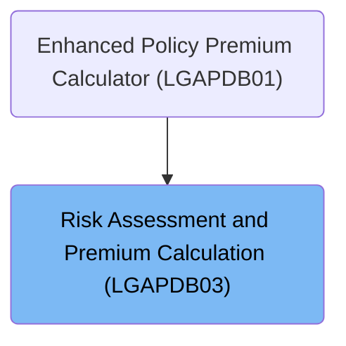
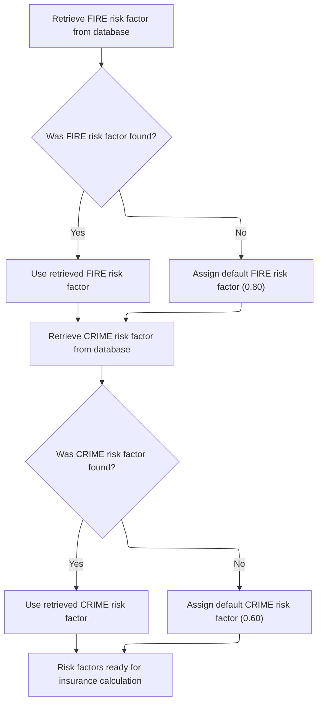
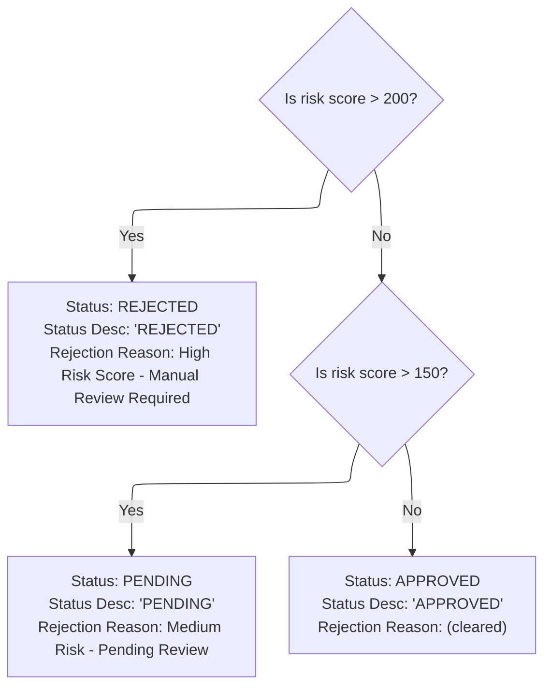
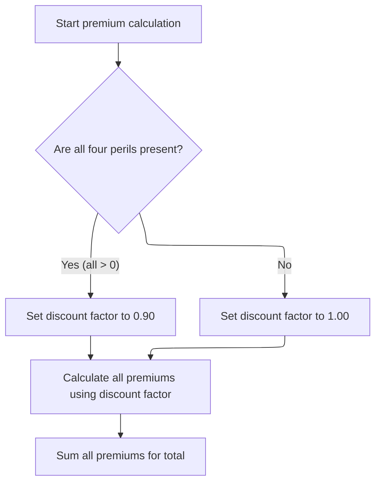

# Overview

This document explains the flow for orchestrating risk assessment and premium calculation for insurance policies. The process ensures risk factors are available, assigns a verdict based on risk score, and calculates premiums with possible discounts.

## Dependencies

### Program

- <SwmToken path="base/src/LGAPDB03.cbl" pos="2:6:6" line-data="       PROGRAM-ID. LGAPDB03.">`LGAPDB03`</SwmToken> (<SwmPath>[base/src/LGAPDB03.cbl](base/src/LGAPDB03.cbl)</SwmPath>)

### Copybook

- SQLCA

# Where is this program used?

This program is used once, as represented in the following diagram:



## Input and Output Tables/Files used in the Program

| Table / File Name                                                                                                          | Type | Description                                                        | Usage Mode | Key Fields / Layout Highlights                                                                                                                                                                                                                                                                               |
| -------------------------------------------------------------------------------------------------------------------------- | ---- | ------------------------------------------------------------------ | ---------- | ------------------------------------------------------------------------------------------------------------------------------------------------------------------------------------------------------------------------------------------------------------------------------------------------------------ |
| <SwmToken path="base/src/LGAPDB03.cbl" pos="51:3:3" line-data="               FROM RISK_FACTORS">`RISK_FACTORS`</SwmToken> | DB2  | Risk factor values by peril type for insurance premium calculation | Input      | <SwmToken path="base/src/LGAPDB03.cbl" pos="50:8:12" line-data="               SELECT FACTOR_VALUE INTO :WS-FIRE-FACTOR">`WS-FIRE-FACTOR`</SwmToken>, <SwmToken path="base/src/LGAPDB03.cbl" pos="62:8:12" line-data="               SELECT FACTOR_VALUE INTO :WS-CRIME-FACTOR">`WS-CRIME-FACTOR`</SwmToken> |

&nbsp;

## Detailed View of the Program's Functionality

## Program Initialization and Data Setup

The program begins by declaring its identity and configuration. It sets up sections for working storage and linkage, which are areas where temporary and input/output data are defined. In working storage, it prepares variables to hold risk factors for different perils (fire, crime, flood, weather), each with a default value. It also includes a section for database communication. The linkage section defines all the input and output fields that the program will use, such as risk score, peril values, status, descriptions, rejection reasons, individual premiums, total premium, and discount factor.

## Main Orchestration Logic

The main logic of the program is a sequence of three steps:

1. It first retrieves risk factors from the database or uses defaults if unavailable.
2. It then determines the application verdict based on the risk score.
3. Finally, it calculates the insurance premiums for each peril and the total, applying any discounts as appropriate.

## Fetching and Defaulting Risk Factors

The program attempts to fetch the risk factor for fire from the database. If the database query is successful, it uses the retrieved value. If not, it assigns a default value of <SwmToken path="base/src/LGAPDB03.cbl" pos="58:3:5" line-data="               MOVE 0.80 TO WS-FIRE-FACTOR">`0.80`</SwmToken> for fire. The same process is repeated for the crime risk factor, with a default value of <SwmToken path="base/src/LGAPDB03.cbl" pos="70:3:5" line-data="               MOVE 0.60 TO WS-CRIME-FACTOR">`0.60`</SwmToken> if the database query fails. Flood and weather factors are not fetched from the database; their values remain as initially set in working storage.

## Assigning Application Verdict

The program evaluates the risk score to determine the application status:

- If the risk score is greater than 200, the application is marked as rejected, with a description indicating rejection and a reason stating that manual review is required due to high risk.
- If the risk score is greater than 150 but not above 200, the status is set to pending, with a description and reason indicating medium risk and pending review.
- If the risk score is 150 or below, the application is approved, with the description set accordingly and the rejection reason cleared.

## Computing Premiums and Discounts

Premium calculation begins by setting the discount factor to <SwmToken path="base/src/LGAPDB03.cbl" pos="93:3:5" line-data="           MOVE 1.00 TO LK-DISC-FACT">`1.00`</SwmToken> (no discount). The program checks if all four peril values (fire, crime, flood, weather) are positive. If so, it applies a discount factor of <SwmToken path="base/src/LGAPDB03.cbl" pos="99:3:5" line-data="             MOVE 0.90 TO LK-DISC-FACT">`0.90`</SwmToken>, representing a 10% discount for full coverage.

For each peril (fire, crime, flood, weather), the premium is calculated using the formula: risk score multiplied by the corresponding risk factor, multiplied by the peril value, and then multiplied by the discount factor. After calculating individual premiums, the program sums them to produce the total premium.

## Summary of Flow

1. The program initializes and prepares all necessary data fields.
2. It retrieves risk factors for fire and crime from the database, using defaults if needed.
3. It determines the application verdict based on the risk score, setting status, description, and rejection reason.
4. It calculates individual premiums for each peril, applies a discount if all perils are covered, and sums the premiums for a total.

# Data Definitions

| Table / Record Name                                                                                                        | Type | Short Description                                                  | Usage Mode     |
| -------------------------------------------------------------------------------------------------------------------------- | ---- | ------------------------------------------------------------------ | -------------- |
| <SwmToken path="base/src/LGAPDB03.cbl" pos="51:3:3" line-data="               FROM RISK_FACTORS">`RISK_FACTORS`</SwmToken> | DB2  | Risk factor values by peril type for insurance premium calculation | Input (SELECT) |

&nbsp;

# Rule Definition

| Paragraph Name                                                                                                                        | Rule ID | Category          | Description                                                                                                                                                                                                                                                                                                                                                                                                                                                                                                                                                                                                                                                                                                                                                                                                                                                                                                                                                                                                                                                                                                                                                                                                                                   | Conditions                                                                                                                                                                                                                                                                                                                                                                                                                                                                                               | Remarks                                                                                                                                                                                                                                                                                                                                                                                                                                                                                                                                                                                                                                                                                                                                                                                                                                                                                                                                                                                                                                                                                                                                                                                                                                                                                                                                                                                                               |
| ------------------------------------------------------------------------------------------------------------------------------------- | ------- | ----------------- | --------------------------------------------------------------------------------------------------------------------------------------------------------------------------------------------------------------------------------------------------------------------------------------------------------------------------------------------------------------------------------------------------------------------------------------------------------------------------------------------------------------------------------------------------------------------------------------------------------------------------------------------------------------------------------------------------------------------------------------------------------------------------------------------------------------------------------------------------------------------------------------------------------------------------------------------------------------------------------------------------------------------------------------------------------------------------------------------------------------------------------------------------------------------------------------------------------------------------------------------- | -------------------------------------------------------------------------------------------------------------------------------------------------------------------------------------------------------------------------------------------------------------------------------------------------------------------------------------------------------------------------------------------------------------------------------------------------------------------------------------------------------- | --------------------------------------------------------------------------------------------------------------------------------------------------------------------------------------------------------------------------------------------------------------------------------------------------------------------------------------------------------------------------------------------------------------------------------------------------------------------------------------------------------------------------------------------------------------------------------------------------------------------------------------------------------------------------------------------------------------------------------------------------------------------------------------------------------------------------------------------------------------------------------------------------------------------------------------------------------------------------------------------------------------------------------------------------------------------------------------------------------------------------------------------------------------------------------------------------------------------------------------------------------------------------------------------------------------------------------------------------------------------------------------------------------------------- |
| <SwmToken path="base/src/LGAPDB03.cbl" pos="43:3:7" line-data="           PERFORM GET-RISK-FACTORS">`GET-RISK-FACTORS`</SwmToken>     | RL-001  | Conditional Logic | The system must retrieve the FIRE risk factor from the <SwmToken path="base/src/LGAPDB03.cbl" pos="51:3:3" line-data="               FROM RISK_FACTORS">`RISK_FACTORS`</SwmToken> table using <SwmToken path="base/src/LGAPDB03.cbl" pos="52:3:3" line-data="               WHERE PERIL_TYPE = &#39;FIRE&#39;">`PERIL_TYPE`</SwmToken> = 'FIRE'. If not found, assign a default value of <SwmToken path="base/src/LGAPDB03.cbl" pos="58:3:5" line-data="               MOVE 0.80 TO WS-FIRE-FACTOR">`0.80`</SwmToken>.                                                                                                                                                                                                                                                                                                                                                                                                                                                                                                                                                                                                                                                                                                                        | Attempt to select <SwmToken path="base/src/LGAPDB03.cbl" pos="50:3:3" line-data="               SELECT FACTOR_VALUE INTO :WS-FIRE-FACTOR">`FACTOR_VALUE`</SwmToken> from <SwmToken path="base/src/LGAPDB03.cbl" pos="51:3:3" line-data="               FROM RISK_FACTORS">`RISK_FACTORS`</SwmToken> where <SwmToken path="base/src/LGAPDB03.cbl" pos="52:3:3" line-data="               WHERE PERIL_TYPE = &#39;FIRE&#39;">`PERIL_TYPE`</SwmToken> = 'FIRE'. If SQLCODE is not 0, assign default value.  | Default value for FIRE risk factor is <SwmToken path="base/src/LGAPDB03.cbl" pos="58:3:5" line-data="               MOVE 0.80 TO WS-FIRE-FACTOR">`0.80`</SwmToken>. Retrieved value is a decimal number (e.g., <SwmToken path="base/src/LGAPDB03.cbl" pos="58:3:5" line-data="               MOVE 0.80 TO WS-FIRE-FACTOR">`0.80`</SwmToken>).                                                                                                                                                                                                                                                                                                                                                                                                                                                                                                                                                                                                                                                                                                                                                                                                                                                                                                                                                                                                                                                                         |
| <SwmToken path="base/src/LGAPDB03.cbl" pos="43:3:7" line-data="           PERFORM GET-RISK-FACTORS">`GET-RISK-FACTORS`</SwmToken>     | RL-002  | Conditional Logic | The system must retrieve the CRIME risk factor from the <SwmToken path="base/src/LGAPDB03.cbl" pos="51:3:3" line-data="               FROM RISK_FACTORS">`RISK_FACTORS`</SwmToken> table using <SwmToken path="base/src/LGAPDB03.cbl" pos="52:3:3" line-data="               WHERE PERIL_TYPE = &#39;FIRE&#39;">`PERIL_TYPE`</SwmToken> = 'CRIME'. If not found, assign a default value of <SwmToken path="base/src/LGAPDB03.cbl" pos="70:3:5" line-data="               MOVE 0.60 TO WS-CRIME-FACTOR">`0.60`</SwmToken>.                                                                                                                                                                                                                                                                                                                                                                                                                                                                                                                                                                                                                                                                                                                     | Attempt to select <SwmToken path="base/src/LGAPDB03.cbl" pos="50:3:3" line-data="               SELECT FACTOR_VALUE INTO :WS-FIRE-FACTOR">`FACTOR_VALUE`</SwmToken> from <SwmToken path="base/src/LGAPDB03.cbl" pos="51:3:3" line-data="               FROM RISK_FACTORS">`RISK_FACTORS`</SwmToken> where <SwmToken path="base/src/LGAPDB03.cbl" pos="52:3:3" line-data="               WHERE PERIL_TYPE = &#39;FIRE&#39;">`PERIL_TYPE`</SwmToken> = 'CRIME'. If SQLCODE is not 0, assign default value. | Default value for CRIME risk factor is <SwmToken path="base/src/LGAPDB03.cbl" pos="70:3:5" line-data="               MOVE 0.60 TO WS-CRIME-FACTOR">`0.60`</SwmToken>. Retrieved value is a decimal number (e.g., <SwmToken path="base/src/LGAPDB03.cbl" pos="70:3:5" line-data="               MOVE 0.60 TO WS-CRIME-FACTOR">`0.60`</SwmToken>).                                                                                                                                                                                                                                                                                                                                                                                                                                                                                                                                                                                                                                                                                                                                                                                                                                                                                                                                                                                                                                                                      |
| <SwmToken path="base/src/LGAPDB03.cbl" pos="9:1:3" line-data="       WORKING-STORAGE SECTION.">`WORKING-STORAGE`</SwmToken> SECTION   | RL-003  | Data Assignment   | The FLOOD risk factor is set to <SwmToken path="base/src/LGAPDB03.cbl" pos="16:15:17" line-data="       01  WS-FLOOD-FACTOR             PIC V99 VALUE 1.20.">`1.20`</SwmToken> and the WEATHER risk factor is set to <SwmToken path="base/src/LGAPDB03.cbl" pos="99:3:5" line-data="             MOVE 0.90 TO LK-DISC-FACT">`0.90`</SwmToken>, both hardcoded.                                                                                                                                                                                                                                                                                                                                                                                                                                                                                                                                                                                                                                                                                                                                                                                                                                                                                | Always applies; no conditions.                                                                                                                                                                                                                                                                                                                                                                                                                                                                           | FLOOD risk factor is <SwmToken path="base/src/LGAPDB03.cbl" pos="16:15:17" line-data="       01  WS-FLOOD-FACTOR             PIC V99 VALUE 1.20.">`1.20`</SwmToken>, WEATHER risk factor is <SwmToken path="base/src/LGAPDB03.cbl" pos="99:3:5" line-data="             MOVE 0.90 TO LK-DISC-FACT">`0.90`</SwmToken>. Both are decimal numbers.                                                                                                                                                                                                                                                                                                                                                                                                                                                                                                                                                                                                                                                                                                                                                                                                                                                                                                                                                                                                                                                                       |
| LINKAGE SECTION, PROCEDURE DIVISION USING                                                                                             | RL-004  | Data Assignment   | The system accepts <SwmToken path="base/src/LGAPDB03.cbl" pos="74:3:7" line-data="           IF LK-RISK-SCORE &gt; 200">`LK-RISK-SCORE`</SwmToken> (integer, 3 digits), <SwmToken path="base/src/LGAPDB03.cbl" pos="95:3:7" line-data="           IF LK-FIRE-PERIL &gt; 0 AND">`LK-FIRE-PERIL`</SwmToken>, <SwmToken path="base/src/LGAPDB03.cbl" pos="96:1:5" line-data="              LK-CRIME-PERIL &gt; 0 AND">`LK-CRIME-PERIL`</SwmToken>, <SwmToken path="base/src/LGAPDB03.cbl" pos="97:1:5" line-data="              LK-FLOOD-PERIL &gt; 0 AND">`LK-FLOOD-PERIL`</SwmToken>, <SwmToken path="base/src/LGAPDB03.cbl" pos="98:1:5" line-data="              LK-WEATHER-PERIL &gt; 0">`LK-WEATHER-PERIL`</SwmToken> (all integer, 4 digits).                                                                                                                                                                                                                                                                                                                                                                                                                                                                                             | Input parameters must be provided to the program.                                                                                                                                                                                                                                                                                                                                                                                                                                                        | <SwmToken path="base/src/LGAPDB03.cbl" pos="74:3:7" line-data="           IF LK-RISK-SCORE &gt; 200">`LK-RISK-SCORE`</SwmToken>: integer, 3 digits; <SwmToken path="base/src/LGAPDB03.cbl" pos="95:3:7" line-data="           IF LK-FIRE-PERIL &gt; 0 AND">`LK-FIRE-PERIL`</SwmToken>, <SwmToken path="base/src/LGAPDB03.cbl" pos="96:1:5" line-data="              LK-CRIME-PERIL &gt; 0 AND">`LK-CRIME-PERIL`</SwmToken>, <SwmToken path="base/src/LGAPDB03.cbl" pos="97:1:5" line-data="              LK-FLOOD-PERIL &gt; 0 AND">`LK-FLOOD-PERIL`</SwmToken>, <SwmToken path="base/src/LGAPDB03.cbl" pos="98:1:5" line-data="              LK-WEATHER-PERIL &gt; 0">`LK-WEATHER-PERIL`</SwmToken>: integer, 4 digits.                                                                                                                                                                                                                                                                                                                                                                                                                                                                                                                                                                                                                                                                                              |
| <SwmToken path="base/src/LGAPDB03.cbl" pos="44:3:5" line-data="           PERFORM CALCULATE-VERDICT">`CALCULATE-VERDICT`</SwmToken>   | RL-005  | Conditional Logic | Verdict is determined by <SwmToken path="base/src/LGAPDB03.cbl" pos="74:3:7" line-data="           IF LK-RISK-SCORE &gt; 200">`LK-RISK-SCORE`</SwmToken>: >200 is REJECTED, >150 is PENDING, otherwise APPROVED.                                                                                                                                                                                                                                                                                                                                                                                                                                                                                                                                                                                                                                                                                                                                                                                                                                                                                                                                                                                                                              | <SwmToken path="base/src/LGAPDB03.cbl" pos="74:3:7" line-data="           IF LK-RISK-SCORE &gt; 200">`LK-RISK-SCORE`</SwmToken> value determines verdict.                                                                                                                                                                                                                                                                                                                                                | <SwmToken path="base/src/LGAPDB03.cbl" pos="75:7:9" line-data="             MOVE 2 TO LK-STAT">`LK-STAT`</SwmToken>: number (0, 1, 2); <SwmToken path="base/src/LGAPDB03.cbl" pos="76:9:13" line-data="             MOVE &#39;REJECTED&#39; TO LK-STAT-DESC">`LK-STAT-DESC`</SwmToken>: string (20 chars); <SwmToken path="base/src/LGAPDB03.cbl" pos="78:3:7" line-data="               TO LK-REJ-RSN">`LK-REJ-RSN`</SwmToken>: string (50 chars).                                                                                                                                                                                                                                                                                                                                                                                                                                                                                                                                                                                                                                                                                                                                                                                                                                                                                                                                                                   |
| <SwmToken path="base/src/LGAPDB03.cbl" pos="45:3:5" line-data="           PERFORM CALCULATE-PREMIUMS">`CALCULATE-PREMIUMS`</SwmToken> | RL-006  | Conditional Logic | If all peril values are greater than 0, discount factor is <SwmToken path="base/src/LGAPDB03.cbl" pos="99:3:5" line-data="             MOVE 0.90 TO LK-DISC-FACT">`0.90`</SwmToken>; otherwise, <SwmToken path="base/src/LGAPDB03.cbl" pos="93:3:5" line-data="           MOVE 1.00 TO LK-DISC-FACT">`1.00`</SwmToken>.                                                                                                                                                                                                                                                                                                                                                                                                                                                                                                                                                                                                                                                                                                                                                                                                                                                                                                                       | All peril values (FIRE, CRIME, FLOOD, WEATHER) must be > 0 for discount.                                                                                                                                                                                                                                                                                                                                                                                                                                 | <SwmToken path="base/src/LGAPDB03.cbl" pos="93:9:13" line-data="           MOVE 1.00 TO LK-DISC-FACT">`LK-DISC-FACT`</SwmToken>: decimal (<SwmToken path="base/src/LGAPDB03.cbl" pos="99:3:5" line-data="             MOVE 0.90 TO LK-DISC-FACT">`0.90`</SwmToken> or <SwmToken path="base/src/LGAPDB03.cbl" pos="93:3:5" line-data="           MOVE 1.00 TO LK-DISC-FACT">`1.00`</SwmToken>).                                                                                                                                                                                                                                                                                                                                                                                                                                                                                                                                                                                                                                                                                                                                                                                                                                                                                                                                                                                                                        |
| <SwmToken path="base/src/LGAPDB03.cbl" pos="45:3:5" line-data="           PERFORM CALCULATE-PREMIUMS">`CALCULATE-PREMIUMS`</SwmToken> | RL-007  | Computation       | Premium for each peril is calculated as: <SwmToken path="base/src/LGAPDB03.cbl" pos="74:3:7" line-data="           IF LK-RISK-SCORE &gt; 200">`LK-RISK-SCORE`</SwmToken> \* risk factor \* peril value \* <SwmToken path="base/src/LGAPDB03.cbl" pos="93:9:13" line-data="           MOVE 1.00 TO LK-DISC-FACT">`LK-DISC-FACT`</SwmToken>.                                                                                                                                                                                                                                                                                                                                                                                                                                                                                                                                                                                                                                                                                                                                                                                                                                                                                                    | Calculation performed for each peril using respective risk factor and peril value.                                                                                                                                                                                                                                                                                                                                                                                                                       | Premiums: decimal, up to 8 digits before decimal, 2 after (<SwmToken path="base/src/LGAPDB03.cbl" pos="102:3:7" line-data="           COMPUTE LK-FIRE-PREMIUM =">`LK-FIRE-PREMIUM`</SwmToken>, <SwmToken path="base/src/LGAPDB03.cbl" pos="106:3:7" line-data="           COMPUTE LK-CRIME-PREMIUM =">`LK-CRIME-PREMIUM`</SwmToken>, <SwmToken path="base/src/LGAPDB03.cbl" pos="110:3:7" line-data="           COMPUTE LK-FLOOD-PREMIUM =">`LK-FLOOD-PREMIUM`</SwmToken>, <SwmToken path="base/src/LGAPDB03.cbl" pos="114:3:7" line-data="           COMPUTE LK-WEATHER-PREMIUM =">`LK-WEATHER-PREMIUM`</SwmToken>).                                                                                                                                                                                                                                                                                                                                                                                                                                                                                                                                                                                                                                                                                                                                                                                                 |
| <SwmToken path="base/src/LGAPDB03.cbl" pos="45:3:5" line-data="           PERFORM CALCULATE-PREMIUMS">`CALCULATE-PREMIUMS`</SwmToken> | RL-008  | Computation       | Total premium is the sum of all peril premiums.                                                                                                                                                                                                                                                                                                                                                                                                                                                                                                                                                                                                                                                                                                                                                                                                                                                                                                                                                                                                                                                                                                                                                                                               | Sum after all individual premiums are calculated.                                                                                                                                                                                                                                                                                                                                                                                                                                                        | <SwmToken path="base/src/LGAPDB03.cbl" pos="118:3:7" line-data="           COMPUTE LK-TOTAL-PREMIUM = ">`LK-TOTAL-PREMIUM`</SwmToken>: decimal, up to 9 digits before decimal, 2 after.                                                                                                                                                                                                                                                                                                                                                                                                                                                                                                                                                                                                                                                                                                                                                                                                                                                                                                                                                                                                                                                                                                                                                                                                                               |
| LINKAGE SECTION, PROCEDURE DIVISION USING                                                                                             | RL-009  | Data Assignment   | Output includes <SwmToken path="base/src/LGAPDB03.cbl" pos="75:7:9" line-data="             MOVE 2 TO LK-STAT">`LK-STAT`</SwmToken>, <SwmToken path="base/src/LGAPDB03.cbl" pos="76:9:13" line-data="             MOVE &#39;REJECTED&#39; TO LK-STAT-DESC">`LK-STAT-DESC`</SwmToken>, <SwmToken path="base/src/LGAPDB03.cbl" pos="78:3:7" line-data="               TO LK-REJ-RSN">`LK-REJ-RSN`</SwmToken>, <SwmToken path="base/src/LGAPDB03.cbl" pos="102:3:7" line-data="           COMPUTE LK-FIRE-PREMIUM =">`LK-FIRE-PREMIUM`</SwmToken>, <SwmToken path="base/src/LGAPDB03.cbl" pos="106:3:7" line-data="           COMPUTE LK-CRIME-PREMIUM =">`LK-CRIME-PREMIUM`</SwmToken>, <SwmToken path="base/src/LGAPDB03.cbl" pos="110:3:7" line-data="           COMPUTE LK-FLOOD-PREMIUM =">`LK-FLOOD-PREMIUM`</SwmToken>, <SwmToken path="base/src/LGAPDB03.cbl" pos="114:3:7" line-data="           COMPUTE LK-WEATHER-PREMIUM =">`LK-WEATHER-PREMIUM`</SwmToken>, <SwmToken path="base/src/LGAPDB03.cbl" pos="118:3:7" line-data="           COMPUTE LK-TOTAL-PREMIUM = ">`LK-TOTAL-PREMIUM`</SwmToken>, <SwmToken path="base/src/LGAPDB03.cbl" pos="93:9:13" line-data="           MOVE 1.00 TO LK-DISC-FACT">`LK-DISC-FACT`</SwmToken>. | After all calculations are complete.                                                                                                                                                                                                                                                                                                                                                                                                                                                                     | Output fields: <SwmToken path="base/src/LGAPDB03.cbl" pos="75:7:9" line-data="             MOVE 2 TO LK-STAT">`LK-STAT`</SwmToken> (number), <SwmToken path="base/src/LGAPDB03.cbl" pos="76:9:13" line-data="             MOVE &#39;REJECTED&#39; TO LK-STAT-DESC">`LK-STAT-DESC`</SwmToken> (string, 20 chars), <SwmToken path="base/src/LGAPDB03.cbl" pos="78:3:7" line-data="               TO LK-REJ-RSN">`LK-REJ-RSN`</SwmToken> (string, 50 chars), <SwmToken path="base/src/LGAPDB03.cbl" pos="102:3:7" line-data="           COMPUTE LK-FIRE-PREMIUM =">`LK-FIRE-PREMIUM`</SwmToken>, <SwmToken path="base/src/LGAPDB03.cbl" pos="106:3:7" line-data="           COMPUTE LK-CRIME-PREMIUM =">`LK-CRIME-PREMIUM`</SwmToken>, <SwmToken path="base/src/LGAPDB03.cbl" pos="110:3:7" line-data="           COMPUTE LK-FLOOD-PREMIUM =">`LK-FLOOD-PREMIUM`</SwmToken>, <SwmToken path="base/src/LGAPDB03.cbl" pos="114:3:7" line-data="           COMPUTE LK-WEATHER-PREMIUM =">`LK-WEATHER-PREMIUM`</SwmToken> (decimal, 8 digits before decimal, 2 after), <SwmToken path="base/src/LGAPDB03.cbl" pos="118:3:7" line-data="           COMPUTE LK-TOTAL-PREMIUM = ">`LK-TOTAL-PREMIUM`</SwmToken> (decimal, 9 digits before decimal, 2 after), <SwmToken path="base/src/LGAPDB03.cbl" pos="93:9:13" line-data="           MOVE 1.00 TO LK-DISC-FACT">`LK-DISC-FACT`</SwmToken> (decimal, 2 digits after decimal). |

# User Stories

## User Story 1: Risk Factor Setup

---

### Story Description:

As a system, I want to retrieve and assign risk factors for FIRE, CRIME, FLOOD, and WEATHER perils so that I can accurately calculate insurance premiums based on current risk data or defaults.

---

### Business Rule Mapping:

| Rule ID | Paragraph Name                                                                                                                      | Rule Description                                                                                                                                                                                                                                                                                                                                                                                                                                                                                                          |
| ------- | ----------------------------------------------------------------------------------------------------------------------------------- | ------------------------------------------------------------------------------------------------------------------------------------------------------------------------------------------------------------------------------------------------------------------------------------------------------------------------------------------------------------------------------------------------------------------------------------------------------------------------------------------------------------------------- |
| RL-001  | <SwmToken path="base/src/LGAPDB03.cbl" pos="43:3:7" line-data="           PERFORM GET-RISK-FACTORS">`GET-RISK-FACTORS`</SwmToken>   | The system must retrieve the FIRE risk factor from the <SwmToken path="base/src/LGAPDB03.cbl" pos="51:3:3" line-data="               FROM RISK_FACTORS">`RISK_FACTORS`</SwmToken> table using <SwmToken path="base/src/LGAPDB03.cbl" pos="52:3:3" line-data="               WHERE PERIL_TYPE = &#39;FIRE&#39;">`PERIL_TYPE`</SwmToken> = 'FIRE'. If not found, assign a default value of <SwmToken path="base/src/LGAPDB03.cbl" pos="58:3:5" line-data="               MOVE 0.80 TO WS-FIRE-FACTOR">`0.80`</SwmToken>.    |
| RL-002  | <SwmToken path="base/src/LGAPDB03.cbl" pos="43:3:7" line-data="           PERFORM GET-RISK-FACTORS">`GET-RISK-FACTORS`</SwmToken>   | The system must retrieve the CRIME risk factor from the <SwmToken path="base/src/LGAPDB03.cbl" pos="51:3:3" line-data="               FROM RISK_FACTORS">`RISK_FACTORS`</SwmToken> table using <SwmToken path="base/src/LGAPDB03.cbl" pos="52:3:3" line-data="               WHERE PERIL_TYPE = &#39;FIRE&#39;">`PERIL_TYPE`</SwmToken> = 'CRIME'. If not found, assign a default value of <SwmToken path="base/src/LGAPDB03.cbl" pos="70:3:5" line-data="               MOVE 0.60 TO WS-CRIME-FACTOR">`0.60`</SwmToken>. |
| RL-003  | <SwmToken path="base/src/LGAPDB03.cbl" pos="9:1:3" line-data="       WORKING-STORAGE SECTION.">`WORKING-STORAGE`</SwmToken> SECTION | The FLOOD risk factor is set to <SwmToken path="base/src/LGAPDB03.cbl" pos="16:15:17" line-data="       01  WS-FLOOD-FACTOR             PIC V99 VALUE 1.20.">`1.20`</SwmToken> and the WEATHER risk factor is set to <SwmToken path="base/src/LGAPDB03.cbl" pos="99:3:5" line-data="             MOVE 0.90 TO LK-DISC-FACT">`0.90`</SwmToken>, both hardcoded.                                                                                                                                                            |

---

### Relevant Functionality:

- <SwmToken path="base/src/LGAPDB03.cbl" pos="43:3:7" line-data="           PERFORM GET-RISK-FACTORS">`GET-RISK-FACTORS`</SwmToken>
  1. **RL-001:**
     - Query <SwmToken path="base/src/LGAPDB03.cbl" pos="51:3:3" line-data="               FROM RISK_FACTORS">`RISK_FACTORS`</SwmToken> for FIRE risk factor
     - If query succeeds, use retrieved value
     - If query fails, set FIRE risk factor to <SwmToken path="base/src/LGAPDB03.cbl" pos="58:3:5" line-data="               MOVE 0.80 TO WS-FIRE-FACTOR">`0.80`</SwmToken>
  2. **RL-002:**
     - Query <SwmToken path="base/src/LGAPDB03.cbl" pos="51:3:3" line-data="               FROM RISK_FACTORS">`RISK_FACTORS`</SwmToken> for CRIME risk factor
     - If query succeeds, use retrieved value
     - If query fails, set CRIME risk factor to <SwmToken path="base/src/LGAPDB03.cbl" pos="70:3:5" line-data="               MOVE 0.60 TO WS-CRIME-FACTOR">`0.60`</SwmToken>
- <SwmToken path="base/src/LGAPDB03.cbl" pos="9:1:3" line-data="       WORKING-STORAGE SECTION.">`WORKING-STORAGE`</SwmToken> **SECTION**
  1. **RL-003:**
     - Set FLOOD risk factor to <SwmToken path="base/src/LGAPDB03.cbl" pos="16:15:17" line-data="       01  WS-FLOOD-FACTOR             PIC V99 VALUE 1.20.">`1.20`</SwmToken>
     - Set WEATHER risk factor to <SwmToken path="base/src/LGAPDB03.cbl" pos="99:3:5" line-data="             MOVE 0.90 TO LK-DISC-FACT">`0.90`</SwmToken>

## User Story 2: Application Interface and Verdict Delivery

---

### Story Description:

As a system, I want to accept specific input parameters, determine the application verdict, and provide detailed output values so that users can submit risk data and receive an appropriate approval, pending, or rejection status with reasons and premium details.

---

### Business Rule Mapping:

| Rule ID | Paragraph Name                                                                                                                      | Rule Description                                                                                                                                                                                                                                                                                                                                                                                                                                                                                                                                                                                                                                                                                                                                                                                                                                                                                                                                                                                                                                                                                                                                                                                                                              |
| ------- | ----------------------------------------------------------------------------------------------------------------------------------- | --------------------------------------------------------------------------------------------------------------------------------------------------------------------------------------------------------------------------------------------------------------------------------------------------------------------------------------------------------------------------------------------------------------------------------------------------------------------------------------------------------------------------------------------------------------------------------------------------------------------------------------------------------------------------------------------------------------------------------------------------------------------------------------------------------------------------------------------------------------------------------------------------------------------------------------------------------------------------------------------------------------------------------------------------------------------------------------------------------------------------------------------------------------------------------------------------------------------------------------------- |
| RL-005  | <SwmToken path="base/src/LGAPDB03.cbl" pos="44:3:5" line-data="           PERFORM CALCULATE-VERDICT">`CALCULATE-VERDICT`</SwmToken> | Verdict is determined by <SwmToken path="base/src/LGAPDB03.cbl" pos="74:3:7" line-data="           IF LK-RISK-SCORE &gt; 200">`LK-RISK-SCORE`</SwmToken>: >200 is REJECTED, >150 is PENDING, otherwise APPROVED.                                                                                                                                                                                                                                                                                                                                                                                                                                                                                                                                                                                                                                                                                                                                                                                                                                                                                                                                                                                                                              |
| RL-004  | LINKAGE SECTION, PROCEDURE DIVISION USING                                                                                           | The system accepts <SwmToken path="base/src/LGAPDB03.cbl" pos="74:3:7" line-data="           IF LK-RISK-SCORE &gt; 200">`LK-RISK-SCORE`</SwmToken> (integer, 3 digits), <SwmToken path="base/src/LGAPDB03.cbl" pos="95:3:7" line-data="           IF LK-FIRE-PERIL &gt; 0 AND">`LK-FIRE-PERIL`</SwmToken>, <SwmToken path="base/src/LGAPDB03.cbl" pos="96:1:5" line-data="              LK-CRIME-PERIL &gt; 0 AND">`LK-CRIME-PERIL`</SwmToken>, <SwmToken path="base/src/LGAPDB03.cbl" pos="97:1:5" line-data="              LK-FLOOD-PERIL &gt; 0 AND">`LK-FLOOD-PERIL`</SwmToken>, <SwmToken path="base/src/LGAPDB03.cbl" pos="98:1:5" line-data="              LK-WEATHER-PERIL &gt; 0">`LK-WEATHER-PERIL`</SwmToken> (all integer, 4 digits).                                                                                                                                                                                                                                                                                                                                                                                                                                                                                             |
| RL-009  | LINKAGE SECTION, PROCEDURE DIVISION USING                                                                                           | Output includes <SwmToken path="base/src/LGAPDB03.cbl" pos="75:7:9" line-data="             MOVE 2 TO LK-STAT">`LK-STAT`</SwmToken>, <SwmToken path="base/src/LGAPDB03.cbl" pos="76:9:13" line-data="             MOVE &#39;REJECTED&#39; TO LK-STAT-DESC">`LK-STAT-DESC`</SwmToken>, <SwmToken path="base/src/LGAPDB03.cbl" pos="78:3:7" line-data="               TO LK-REJ-RSN">`LK-REJ-RSN`</SwmToken>, <SwmToken path="base/src/LGAPDB03.cbl" pos="102:3:7" line-data="           COMPUTE LK-FIRE-PREMIUM =">`LK-FIRE-PREMIUM`</SwmToken>, <SwmToken path="base/src/LGAPDB03.cbl" pos="106:3:7" line-data="           COMPUTE LK-CRIME-PREMIUM =">`LK-CRIME-PREMIUM`</SwmToken>, <SwmToken path="base/src/LGAPDB03.cbl" pos="110:3:7" line-data="           COMPUTE LK-FLOOD-PREMIUM =">`LK-FLOOD-PREMIUM`</SwmToken>, <SwmToken path="base/src/LGAPDB03.cbl" pos="114:3:7" line-data="           COMPUTE LK-WEATHER-PREMIUM =">`LK-WEATHER-PREMIUM`</SwmToken>, <SwmToken path="base/src/LGAPDB03.cbl" pos="118:3:7" line-data="           COMPUTE LK-TOTAL-PREMIUM = ">`LK-TOTAL-PREMIUM`</SwmToken>, <SwmToken path="base/src/LGAPDB03.cbl" pos="93:9:13" line-data="           MOVE 1.00 TO LK-DISC-FACT">`LK-DISC-FACT`</SwmToken>. |

---

### Relevant Functionality:

- <SwmToken path="base/src/LGAPDB03.cbl" pos="44:3:5" line-data="           PERFORM CALCULATE-VERDICT">`CALCULATE-VERDICT`</SwmToken>
  1. **RL-005:**
     - If risk score > 200:
       - Set status to 2
       - Set description to 'REJECTED'
       - Set rejection reason to 'High Risk Score - Manual Review Required'
     - Else if risk score > 150:
       - Set status to 1
       - Set description to 'PENDING'
       - Set rejection reason to 'Medium Risk - Pending Review'
     - Else:
       - Set status to 0
       - Set description to 'APPROVED'
       - Set rejection reason to blank
- **LINKAGE SECTION**
  1. **RL-004:**
     - Accept input parameters for risk score and peril values
  2. **RL-009:**
     - Return all output fields with calculated and assigned values

## User Story 3: Premium and Discount Calculation

---

### Story Description:

As a system, I want to calculate peril premiums, apply discount factors, and sum the total premium so that users receive accurate pricing based on their risk profile.

---

### Business Rule Mapping:

| Rule ID | Paragraph Name                                                                                                                        | Rule Description                                                                                                                                                                                                                                                                                                                           |
| ------- | ------------------------------------------------------------------------------------------------------------------------------------- | ------------------------------------------------------------------------------------------------------------------------------------------------------------------------------------------------------------------------------------------------------------------------------------------------------------------------------------------ |
| RL-006  | <SwmToken path="base/src/LGAPDB03.cbl" pos="45:3:5" line-data="           PERFORM CALCULATE-PREMIUMS">`CALCULATE-PREMIUMS`</SwmToken> | If all peril values are greater than 0, discount factor is <SwmToken path="base/src/LGAPDB03.cbl" pos="99:3:5" line-data="             MOVE 0.90 TO LK-DISC-FACT">`0.90`</SwmToken>; otherwise, <SwmToken path="base/src/LGAPDB03.cbl" pos="93:3:5" line-data="           MOVE 1.00 TO LK-DISC-FACT">`1.00`</SwmToken>.                    |
| RL-007  | <SwmToken path="base/src/LGAPDB03.cbl" pos="45:3:5" line-data="           PERFORM CALCULATE-PREMIUMS">`CALCULATE-PREMIUMS`</SwmToken> | Premium for each peril is calculated as: <SwmToken path="base/src/LGAPDB03.cbl" pos="74:3:7" line-data="           IF LK-RISK-SCORE &gt; 200">`LK-RISK-SCORE`</SwmToken> \* risk factor \* peril value \* <SwmToken path="base/src/LGAPDB03.cbl" pos="93:9:13" line-data="           MOVE 1.00 TO LK-DISC-FACT">`LK-DISC-FACT`</SwmToken>. |
| RL-008  | <SwmToken path="base/src/LGAPDB03.cbl" pos="45:3:5" line-data="           PERFORM CALCULATE-PREMIUMS">`CALCULATE-PREMIUMS`</SwmToken> | Total premium is the sum of all peril premiums.                                                                                                                                                                                                                                                                                            |

---

### Relevant Functionality:

- <SwmToken path="base/src/LGAPDB03.cbl" pos="45:3:5" line-data="           PERFORM CALCULATE-PREMIUMS">`CALCULATE-PREMIUMS`</SwmToken>
  1. **RL-006:**
     - Set discount factor to <SwmToken path="base/src/LGAPDB03.cbl" pos="93:3:5" line-data="           MOVE 1.00 TO LK-DISC-FACT">`1.00`</SwmToken>
     - If all peril values > 0, set discount factor to <SwmToken path="base/src/LGAPDB03.cbl" pos="99:3:5" line-data="             MOVE 0.90 TO LK-DISC-FACT">`0.90`</SwmToken>
  2. **RL-007:**
     - For each peril (FIRE, CRIME, FLOOD, WEATHER):
       - Compute premium = risk score \* risk factor \* peril value \* discount factor
  3. **RL-008:**
     - Sum all peril premiums to get total premium

# Workflow

# Orchestrating Risk and Premium Calculation

This section orchestrates the end-to-end process of risk and premium calculation for insurance policies. It ensures that risk factors are retrieved before any verdict or premium calculations are performed, maintaining a strict sequence to guarantee accurate and consistent results.

| Category       | Rule Name                       | Description                                                                                                                                                                                                                     |
| -------------- | ------------------------------- | ------------------------------------------------------------------------------------------------------------------------------------------------------------------------------------------------------------------------------- |
| Business logic | Mandatory risk factor retrieval | Risk factor values for both 'FIRE' and 'CRIME' must be retrieved before any verdict or premium calculations are performed. If the risk factor data is unavailable, default values must be used to ensure the process continues. |
| Business logic | Sequential process enforcement  | The process must follow a strict sequence: first retrieve risk factors, then calculate the verdict, and finally calculate the premiums. Each step depends on the successful completion of the previous one.                     |

<SwmSnippet path="/base/src/LGAPDB03.cbl" line="42">

---

<SwmToken path="base/src/LGAPDB03.cbl" pos="42:1:3" line-data="       MAIN-LOGIC.">`MAIN-LOGIC`</SwmToken> kicks off the whole process: it first calls <SwmToken path="base/src/LGAPDB03.cbl" pos="43:3:7" line-data="           PERFORM GET-RISK-FACTORS">`GET-RISK-FACTORS`</SwmToken> to pull the necessary risk factor values, which are needed for both the verdict and premium calculations. Without these, the next steps would either use fallback defaults or not work as intended. After fetching the factors, it moves on to calculate the verdict and then the premiums, keeping the flow sequential and dependent.

```cobol
       MAIN-LOGIC.
           PERFORM GET-RISK-FACTORS
           PERFORM CALCULATE-VERDICT
           PERFORM CALCULATE-PREMIUMS
           GOBACK.
```

---

</SwmSnippet>

## Fetching and Defaulting Risk Factors



This section ensures that risk factors for FIRE and CRIME perils are always available for insurance calculations, either by fetching them from the database or by assigning default values if the database query fails.

| Category        | Rule Name                      | Description                                                                                                                                                                                                                           |
| --------------- | ------------------------------ | ------------------------------------------------------------------------------------------------------------------------------------------------------------------------------------------------------------------------------------- |
| Data validation | Database risk factor retrieval | Risk factors for FIRE and CRIME perils must be retrieved from the database whenever possible before considering default values.                                                                                                       |
| Business logic  | Default FIRE risk factor       | If a risk factor for the FIRE peril is not found in the database, a default value of <SwmToken path="base/src/LGAPDB03.cbl" pos="58:3:5" line-data="               MOVE 0.80 TO WS-FIRE-FACTOR">`0.80`</SwmToken> must be assigned.   |
| Business logic  | Default CRIME risk factor      | If a risk factor for the CRIME peril is not found in the database, a default value of <SwmToken path="base/src/LGAPDB03.cbl" pos="70:3:5" line-data="               MOVE 0.60 TO WS-CRIME-FACTOR">`0.60`</SwmToken> must be assigned. |

<SwmSnippet path="/base/src/LGAPDB03.cbl" line="48">

---

In <SwmToken path="base/src/LGAPDB03.cbl" pos="48:1:5" line-data="       GET-RISK-FACTORS.">`GET-RISK-FACTORS`</SwmToken>, we try to fetch the 'FIRE' risk factor from the database, prepping for fallback if it fails.

```cobol
       GET-RISK-FACTORS.
           EXEC SQL
               SELECT FACTOR_VALUE INTO :WS-FIRE-FACTOR
               FROM RISK_FACTORS
               WHERE PERIL_TYPE = 'FIRE'
           END-EXEC.
```

---

</SwmSnippet>

<SwmSnippet path="/base/src/LGAPDB03.cbl" line="55">

---

If the database query for 'FIRE' fails, we just set <SwmToken path="base/src/LGAPDB03.cbl" pos="58:9:13" line-data="               MOVE 0.80 TO WS-FIRE-FACTOR">`WS-FIRE-FACTOR`</SwmToken> to <SwmToken path="base/src/LGAPDB03.cbl" pos="58:3:5" line-data="               MOVE 0.80 TO WS-FIRE-FACTOR">`0.80`</SwmToken>. This is a hardcoded fallback, not explained anywhere, so it's a business assumption baked into the code.

```cobol
           IF SQLCODE = 0
               CONTINUE
           ELSE
               MOVE 0.80 TO WS-FIRE-FACTOR
           END-IF.
```

---

</SwmSnippet>

<SwmSnippet path="/base/src/LGAPDB03.cbl" line="61">

---

After handling 'FIRE', we do the same for 'CRIME'—run a query to get its factor from the database, prepping for a fallback if needed.

```cobol
           EXEC SQL
               SELECT FACTOR_VALUE INTO :WS-CRIME-FACTOR
               FROM RISK_FACTORS
               WHERE PERIL_TYPE = 'CRIME'
           END-EXEC.
```

---

</SwmSnippet>

<SwmSnippet path="/base/src/LGAPDB03.cbl" line="67">

---

After both queries, we either have the database values or the hardcoded defaults for FIRE and CRIME risk factors. These get used right away in the next steps for verdict and premium calculations.

```cobol
           IF SQLCODE = 0
               CONTINUE
           ELSE
               MOVE 0.60 TO WS-CRIME-FACTOR
           END-IF.
```

---

</SwmSnippet>

## Assigning Application Verdict



<SwmSnippet path="/base/src/LGAPDB03.cbl" line="73">

---

<SwmToken path="base/src/LGAPDB03.cbl" pos="73:1:3" line-data="       CALCULATE-VERDICT.">`CALCULATE-VERDICT`</SwmToken> checks the risk score and assigns a status, description, and rejection reason based on fixed thresholds (200, 150). These values drive the application's outcome and are hardcoded business logic.

```cobol
       CALCULATE-VERDICT.
           IF LK-RISK-SCORE > 200
             MOVE 2 TO LK-STAT
             MOVE 'REJECTED' TO LK-STAT-DESC
             MOVE 'High Risk Score - Manual Review Required' 
               TO LK-REJ-RSN
           ELSE
             IF LK-RISK-SCORE > 150
               MOVE 1 TO LK-STAT
               MOVE 'PENDING' TO LK-STAT-DESC
               MOVE 'Medium Risk - Pending Review'
                 TO LK-REJ-RSN
             ELSE
               MOVE 0 TO LK-STAT
               MOVE 'APPROVED' TO LK-STAT-DESC
               MOVE SPACES TO LK-REJ-RSN
             END-IF
           END-IF.
```

---

</SwmSnippet>

# Computing Premiums and Discounts



This section is responsible for calculating insurance premiums for four perils (fire, crime, flood, weather) and applying a discount if full coverage is selected. It ensures that the correct factors and discount are used in premium calculations.

| Category       | Rule Name                        | Description                                                                                                                                                                                                                                                                                                                                                                                                                                                                                                                                                                                                                                                                                                       |
| -------------- | -------------------------------- | ----------------------------------------------------------------------------------------------------------------------------------------------------------------------------------------------------------------------------------------------------------------------------------------------------------------------------------------------------------------------------------------------------------------------------------------------------------------------------------------------------------------------------------------------------------------------------------------------------------------------------------------------------------------------------------------------------------------- |
| Business logic | Full coverage discount           | If all four peril values (fire, crime, flood, weather) are greater than zero, a 10% discount is applied to all premiums by setting the discount factor to <SwmToken path="base/src/LGAPDB03.cbl" pos="99:3:5" line-data="             MOVE 0.90 TO LK-DISC-FACT">`0.90`</SwmToken>.                                                                                                                                                                                                                                                                                                                                                                                                                               |
| Business logic | No discount for partial coverage | If any peril value is zero or missing, no discount is applied and the discount factor remains at <SwmToken path="base/src/LGAPDB03.cbl" pos="93:3:5" line-data="           MOVE 1.00 TO LK-DISC-FACT">`1.00`</SwmToken>.                                                                                                                                                                                                                                                                                                                                                                                                                                                                                          |
| Business logic | Premium calculation formula      | Each peril's premium is calculated using the formula: (risk score × peril factor) × peril value × discount factor. The peril factors are: fire (<SwmToken path="base/src/LGAPDB03.cbl" pos="58:3:5" line-data="               MOVE 0.80 TO WS-FIRE-FACTOR">`0.80`</SwmToken>), crime (<SwmToken path="base/src/LGAPDB03.cbl" pos="70:3:5" line-data="               MOVE 0.60 TO WS-CRIME-FACTOR">`0.60`</SwmToken>), flood (<SwmToken path="base/src/LGAPDB03.cbl" pos="16:15:17" line-data="       01  WS-FLOOD-FACTOR             PIC V99 VALUE 1.20.">`1.20`</SwmToken>), weather (<SwmToken path="base/src/LGAPDB03.cbl" pos="99:3:5" line-data="             MOVE 0.90 TO LK-DISC-FACT">`0.90`</SwmToken>). |
| Business logic | Total premium summation          | The total premium is the sum of the individual premiums for fire, crime, flood, and weather perils.                                                                                                                                                                                                                                                                                                                                                                                                                                                                                                                                                                                                               |
| Business logic | Fixed peril factors              | The peril factors used in premium calculations are fixed: fire (<SwmToken path="base/src/LGAPDB03.cbl" pos="58:3:5" line-data="               MOVE 0.80 TO WS-FIRE-FACTOR">`0.80`</SwmToken>), crime (<SwmToken path="base/src/LGAPDB03.cbl" pos="70:3:5" line-data="               MOVE 0.60 TO WS-CRIME-FACTOR">`0.60`</SwmToken>), flood (<SwmToken path="base/src/LGAPDB03.cbl" pos="16:15:17" line-data="       01  WS-FLOOD-FACTOR             PIC V99 VALUE 1.20.">`1.20`</SwmToken>), weather (<SwmToken path="base/src/LGAPDB03.cbl" pos="99:3:5" line-data="             MOVE 0.90 TO LK-DISC-FACT">`0.90`</SwmToken>).                                                                                 |

<SwmSnippet path="/base/src/LGAPDB03.cbl" line="92">

---

In <SwmToken path="base/src/LGAPDB03.cbl" pos="92:1:3" line-data="       CALCULATE-PREMIUMS.">`CALCULATE-PREMIUMS`</SwmToken>, we start by setting the discount factor to <SwmToken path="base/src/LGAPDB03.cbl" pos="93:3:5" line-data="           MOVE 1.00 TO LK-DISC-FACT">`1.00`</SwmToken>, then check if all peril values are positive. If so, we drop the factor to <SwmToken path="base/src/LGAPDB03.cbl" pos="99:3:5" line-data="             MOVE 0.90 TO LK-DISC-FACT">`0.90`</SwmToken>, applying a 10% discount for full coverage.

```cobol
       CALCULATE-PREMIUMS.
           MOVE 1.00 TO LK-DISC-FACT
           
           IF LK-FIRE-PERIL > 0 AND
              LK-CRIME-PERIL > 0 AND
              LK-FLOOD-PERIL > 0 AND
              LK-WEATHER-PERIL > 0
             MOVE 0.90 TO LK-DISC-FACT
           END-IF
```

---

</SwmSnippet>

<SwmSnippet path="/base/src/LGAPDB03.cbl" line="102">

---

Here we compute each peril's premium using its factor, value, and the discount, then sum them up for the total premium. The formulas are straightforward and use the values fetched or defaulted earlier.

```cobol
           COMPUTE LK-FIRE-PREMIUM =
             ((LK-RISK-SCORE * WS-FIRE-FACTOR) * LK-FIRE-PERIL *
               LK-DISC-FACT)
           
           COMPUTE LK-CRIME-PREMIUM =
             ((LK-RISK-SCORE * WS-CRIME-FACTOR) * LK-CRIME-PERIL *
               LK-DISC-FACT)
           
           COMPUTE LK-FLOOD-PREMIUM =
             ((LK-RISK-SCORE * WS-FLOOD-FACTOR) * LK-FLOOD-PERIL *
               LK-DISC-FACT)
           
           COMPUTE LK-WEATHER-PREMIUM =
             ((LK-RISK-SCORE * WS-WEATHER-FACTOR) * LK-WEATHER-PERIL *
               LK-DISC-FACT)

           COMPUTE LK-TOTAL-PREMIUM = 
             LK-FIRE-PREMIUM + LK-CRIME-PREMIUM + 
             LK-FLOOD-PREMIUM + LK-WEATHER-PREMIUM. 
```

---

</SwmSnippet>

&nbsp;

*This is an auto-generated document by Swimm 🌊 and has not yet been verified by a human*

<SwmMeta version="3.0.0" repo-id="Z2l0aHViJTNBJTNBU3dpbW1pby1nZW5hcHAtbW90b3IlM0ElM0FHaXJpLVN3aW1t" repo-name="Swimmio-genapp-motor"><sup>Powered by [Swimm](https://app.swimm.io/)</sup></SwmMeta>
