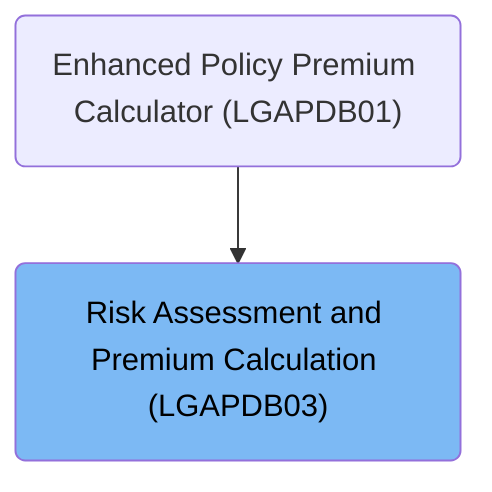
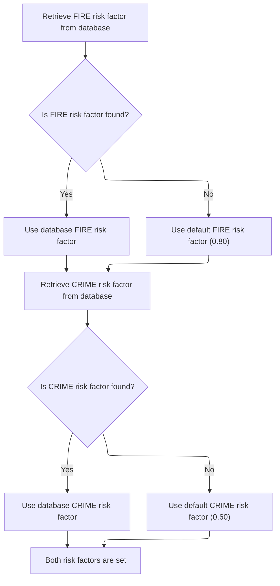

# Overview

This document outlines the flow for orchestrating risk assessment and premium calculation for insurance policies. The process ensures risk factors are obtained before calculations, applies business rules for premium computation, and outputs individual and total premiums.

## Dependencies

### Copybook

- SQLCA

# Where is this program used?

This program is used once, as represented in the following diagram:



## Input and Output Tables/Files used in the Program

| Table / File Name                                                                                                          | Type | Description                                              | Usage Mode | Key Fields / Layout Highlights                                                                                                                                                                                                                                                                               |
| -------------------------------------------------------------------------------------------------------------------------- | ---- | -------------------------------------------------------- | ---------- | ------------------------------------------------------------------------------------------------------------------------------------------------------------------------------------------------------------------------------------------------------------------------------------------------------------ |
| <SwmToken path="base/src/LGAPDB03.cbl" pos="51:3:3" line-data="               FROM RISK_FACTORS">`RISK_FACTORS`</SwmToken> | DB2  | Risk factor values by peril type for premium calculation | Input      | <SwmToken path="base/src/LGAPDB03.cbl" pos="50:8:12" line-data="               SELECT FACTOR_VALUE INTO :WS-FIRE-FACTOR">`WS-FIRE-FACTOR`</SwmToken>, <SwmToken path="base/src/LGAPDB03.cbl" pos="62:8:12" line-data="               SELECT FACTOR_VALUE INTO :WS-CRIME-FACTOR">`WS-CRIME-FACTOR`</SwmToken> |

&nbsp;

## Detailed View of the Program's Functionality

a. Program Initialization and Data Structure Setup

The program begins by defining its identity and environment. It sets up the necessary configuration for database access and declares the data structures it will use throughout execution. This includes:

- Allocating storage for risk factors related to different perils (fire, crime, flood, weather), each with a default value.
- Defining the linkage section, which is used to receive input and output parameters when the program is called. These parameters include the risk score, peril values, status codes, descriptions, rejection reasons, individual peril premiums, total premium, and the discount factor.

b. Main Execution Flow

The main logic of the program orchestrates the overall process by performing three key steps in sequence:

1. It first retrieves the necessary risk factors for the perils by invoking the risk factor retrieval logic.
2. It then determines the verdict (approval, pending, or rejection) based on the risk score.
3. Finally, it calculates the premiums for each peril and the total premium, applying any applicable discounts.

c. Fetching Risk Factors

The program attempts to retrieve the risk factors for the FIRE and CRIME perils from a database:

- For FIRE, it queries the database for the relevant factor. If the query is successful, it uses the value from the database. If not, it falls back to a default value (<SwmToken path="base/src/LGAPDB03.cbl" pos="58:3:5" line-data="               MOVE 0.80 TO WS-FIRE-FACTOR">`0.80`</SwmToken>).
- For CRIME, it repeats the process: querying the database, using the result if found, or falling back to a default (<SwmToken path="base/src/LGAPDB03.cbl" pos="70:3:5" line-data="               MOVE 0.60 TO WS-CRIME-FACTOR">`0.60`</SwmToken>) if not.
- The risk factors for FLOOD and WEATHER are not dynamically fetched; they retain their default values as defined at the start.

d. Verdict Calculation

The program evaluates the risk score to determine the application’s status:

- If the risk score is above 200, the application is rejected, and a specific rejection reason is set.
- If the risk score is between 151 and 200, the application is marked as pending, with a corresponding reason.
- If the risk score is 150 or below, the application is approved, and any rejection reason is cleared.

e. Premium Calculation and Discount Application

The program calculates the insurance premium for each peril and the total premium:

- It starts by setting the discount factor to <SwmToken path="base/src/LGAPDB03.cbl" pos="93:3:5" line-data="           MOVE 1.00 TO LK-DISC-FACT">`1.00`</SwmToken> (no discount).
- If all peril values (fire, crime, flood, weather) are greater than zero, indicating full coverage, the discount factor is reduced to <SwmToken path="base/src/LGAPDB03.cbl" pos="99:3:5" line-data="             MOVE 0.90 TO LK-DISC-FACT">`0.90`</SwmToken>, applying a 10% discount as per business rules.
- For each peril, the premium is calculated by multiplying the risk score, the peril’s risk factor, the peril value, and the discount factor.
- The total premium is then computed as the sum of all individual peril premiums.

f. Program Termination

After all calculations and status determinations are complete, the program returns control to the caller, passing back all calculated and determined values through the linkage section.

# Data Definitions

| Table / Record Name                                                                                                        | Type | Short Description                                        | Usage Mode     |
| -------------------------------------------------------------------------------------------------------------------------- | ---- | -------------------------------------------------------- | -------------- |
| <SwmToken path="base/src/LGAPDB03.cbl" pos="51:3:3" line-data="               FROM RISK_FACTORS">`RISK_FACTORS`</SwmToken> | DB2  | Risk factor values by peril type for premium calculation | Input (SELECT) |

&nbsp;

# Rule Definition

| Paragraph Name                                                                                                                      | Rule ID | Category          | Description                                                                                                                                                                                                                                                                                                                            | Conditions                                                                                                                                                                                                                                                                                                                                  | Remarks                                                                                                                                                                                                                                                                                                                                         |
| ----------------------------------------------------------------------------------------------------------------------------------- | ------- | ----------------- | -------------------------------------------------------------------------------------------------------------------------------------------------------------------------------------------------------------------------------------------------------------------------------------------------------------------------------------- | ------------------------------------------------------------------------------------------------------------------------------------------------------------------------------------------------------------------------------------------------------------------------------------------------------------------------------------------- | ----------------------------------------------------------------------------------------------------------------------------------------------------------------------------------------------------------------------------------------------------------------------------------------------------------------------------------------------- |
| <SwmToken path="base/src/LGAPDB03.cbl" pos="43:3:7" line-data="           PERFORM GET-RISK-FACTORS">`GET-RISK-FACTORS`</SwmToken>   | RL-001  | Conditional Logic | The system retrieves the risk factor for FIRE from the <SwmToken path="base/src/LGAPDB03.cbl" pos="51:3:3" line-data="               FROM RISK_FACTORS">`RISK_FACTORS`</SwmToken> table. If not found, it uses a default value.                                                                                                        | Query for <SwmToken path="base/src/LGAPDB03.cbl" pos="52:3:3" line-data="               WHERE PERIL_TYPE = &#39;FIRE&#39;">`PERIL_TYPE`</SwmToken> = 'FIRE' in <SwmToken path="base/src/LGAPDB03.cbl" pos="51:3:3" line-data="               FROM RISK_FACTORS">`RISK_FACTORS`</SwmToken>. If no row is found (SQLCODE != 0), use default.  | Default value for FIRE risk factor is <SwmToken path="base/src/LGAPDB03.cbl" pos="58:3:5" line-data="               MOVE 0.80 TO WS-FIRE-FACTOR">`0.80`</SwmToken>. The risk factor is a numeric value (e.g., <SwmToken path="base/src/LGAPDB03.cbl" pos="58:3:5" line-data="               MOVE 0.80 TO WS-FIRE-FACTOR">`0.80`</SwmToken>).    |
| <SwmToken path="base/src/LGAPDB03.cbl" pos="43:3:7" line-data="           PERFORM GET-RISK-FACTORS">`GET-RISK-FACTORS`</SwmToken>   | RL-002  | Conditional Logic | The system retrieves the risk factor for CRIME from the <SwmToken path="base/src/LGAPDB03.cbl" pos="51:3:3" line-data="               FROM RISK_FACTORS">`RISK_FACTORS`</SwmToken> table. If not found, it uses a default value.                                                                                                       | Query for <SwmToken path="base/src/LGAPDB03.cbl" pos="52:3:3" line-data="               WHERE PERIL_TYPE = &#39;FIRE&#39;">`PERIL_TYPE`</SwmToken> = 'CRIME' in <SwmToken path="base/src/LGAPDB03.cbl" pos="51:3:3" line-data="               FROM RISK_FACTORS">`RISK_FACTORS`</SwmToken>. If no row is found (SQLCODE != 0), use default. | Default value for CRIME risk factor is <SwmToken path="base/src/LGAPDB03.cbl" pos="70:3:5" line-data="               MOVE 0.60 TO WS-CRIME-FACTOR">`0.60`</SwmToken>. The risk factor is a numeric value (e.g., <SwmToken path="base/src/LGAPDB03.cbl" pos="70:3:5" line-data="               MOVE 0.60 TO WS-CRIME-FACTOR">`0.60`</SwmToken>). |
| <SwmToken path="base/src/LGAPDB03.cbl" pos="9:1:3" line-data="       WORKING-STORAGE SECTION.">`WORKING-STORAGE`</SwmToken> SECTION | RL-003  | Data Assignment   | The risk factor for FLOOD is always <SwmToken path="base/src/LGAPDB03.cbl" pos="16:15:17" line-data="       01  WS-FLOOD-FACTOR             PIC V99 VALUE 1.20.">`1.20`</SwmToken> and for WEATHER is always <SwmToken path="base/src/LGAPDB03.cbl" pos="99:3:5" line-data="             MOVE 0.90 TO LK-DISC-FACT">`0.90`</SwmToken>. | Always applies; no database lookup.                                                                                                                                                                                                                                                                                                         | FLOOD risk factor: <SwmToken path="base/src/LGAPDB03.cbl" pos="16:15:17" line-data="       01  WS-FLOOD-FACTOR             PIC V99 VALUE 1.20.">`1.20`</SwmToken>, WEATHER risk factor: <SwmToken path="base/src/LGAPDB03.cbl" pos="99:3:5" line-data="             MOVE 0.90 TO LK-DISC-FACT">`0.90`</SwmToken>. Both are numeric values.      |
| LINKAGE SECTION, PROCEDURE DIVISION header                                                                                          | RL-004  | Data Assignment   | The system receives input values for risk score and peril values via linkage variables.                                                                                                                                                                                                                                                | Always applies at program start.                                                                                                                                                                                                                                                                                                            | Input variables:                                                                                                                                                                                                                                                                                                                                |

- <SwmToken path="base/src/LGAPDB03.cbl" pos="103:3:7" line-data="             ((LK-RISK-SCORE * WS-FIRE-FACTOR) * LK-FIRE-PERIL *">`LK-RISK-SCORE`</SwmToken>: integer (3 digits)
- <SwmToken path="base/src/LGAPDB03.cbl" pos="95:3:7" line-data="           IF LK-FIRE-PERIL &gt; 0 AND">`LK-FIRE-PERIL`</SwmToken>, <SwmToken path="base/src/LGAPDB03.cbl" pos="96:1:5" line-data="              LK-CRIME-PERIL &gt; 0 AND">`LK-CRIME-PERIL`</SwmToken>, <SwmToken path="base/src/LGAPDB03.cbl" pos="97:1:5" line-data="              LK-FLOOD-PERIL &gt; 0 AND">`LK-FLOOD-PERIL`</SwmToken>, <SwmToken path="base/src/LGAPDB03.cbl" pos="98:1:5" line-data="              LK-WEATHER-PERIL &gt; 0">`LK-WEATHER-PERIL`</SwmToken>: numeric (4 digits each) | | <SwmToken path="base/src/LGAPDB03.cbl" pos="45:3:5" line-data="           PERFORM CALCULATE-PREMIUMS">`CALCULATE-PREMIUMS`</SwmToken> | RL-005 | Conditional Logic | If all peril values are greater than zero, set discount factor to <SwmToken path="base/src/LGAPDB03.cbl" pos="99:3:5" line-data="             MOVE 0.90 TO LK-DISC-FACT">`0.90`</SwmToken>; otherwise, set to <SwmToken path="base/src/LGAPDB03.cbl" pos="93:3:5" line-data="           MOVE 1.00 TO LK-DISC-FACT">`1.00`</SwmToken>. | All peril values (FIRE, CRIME, FLOOD, WEATHER) > 0. | Discount factor is numeric (e.g., <SwmToken path="base/src/LGAPDB03.cbl" pos="99:3:5" line-data="             MOVE 0.90 TO LK-DISC-FACT">`0.90`</SwmToken> or <SwmToken path="base/src/LGAPDB03.cbl" pos="93:3:5" line-data="           MOVE 1.00 TO LK-DISC-FACT">`1.00`</SwmToken>). | | <SwmToken path="base/src/LGAPDB03.cbl" pos="45:3:5" line-data="           PERFORM CALCULATE-PREMIUMS">`CALCULATE-PREMIUMS`</SwmToken> | RL-006 | Computation | Premium for each peril is calculated as: risk score \* risk factor \* peril value \* discount factor. | Always applies after risk factors and discount factor are set. | Premiums are numeric values with up to 8 digits and 2 decimals (e.g., 99999999.99). | | <SwmToken path="base/src/LGAPDB03.cbl" pos="45:3:5" line-data="           PERFORM CALCULATE-PREMIUMS">`CALCULATE-PREMIUMS`</SwmToken> | RL-007 | Computation | The total premium is the sum of all peril premiums. | After all peril premiums are calculated. | Total premium is numeric with up to 9 digits and 2 decimals (e.g., 999999999.99). | | <SwmToken path="base/src/LGAPDB03.cbl" pos="45:3:5" line-data="           PERFORM CALCULATE-PREMIUMS">`CALCULATE-PREMIUMS`</SwmToken> | RL-008 | Data Assignment | The discount factor used in premium calculations is output. | After discount factor is determined. | Discount factor is numeric (e.g., <SwmToken path="base/src/LGAPDB03.cbl" pos="99:3:5" line-data="             MOVE 0.90 TO LK-DISC-FACT">`0.90`</SwmToken> or <SwmToken path="base/src/LGAPDB03.cbl" pos="93:3:5" line-data="           MOVE 1.00 TO LK-DISC-FACT">`1.00`</SwmToken>). | | <SwmToken path="base/src/LGAPDB03.cbl" pos="44:3:5" line-data="           PERFORM CALCULATE-VERDICT">`CALCULATE-VERDICT`</SwmToken> | RL-009 | Conditional Logic | Status code, description, and rejection reason are set based on the risk score. | Risk score > 200: rejected; 151-200: pending; <=150: approved. | Status code: 0 (approved), 1 (pending), 2 (rejected) Status description: string (up to 20 chars) Rejection reason: string (up to 50 chars, blank if approved) |

# User Stories

## User Story 1: Retrieve and assign risk factors for perils

---

### Story Description:

As a system, I want to retrieve risk factor values for FIRE and CRIME perils from the database, use default values if not found, and assign constant values for FLOOD and WEATHER so that I can accurately calculate premiums for each peril.

---

### Business Rule Mapping:

| Rule ID | Paragraph Name                                                                                                                      | Rule Description                                                                                                                                                                                                                                                                                                                       |
| ------- | ----------------------------------------------------------------------------------------------------------------------------------- | -------------------------------------------------------------------------------------------------------------------------------------------------------------------------------------------------------------------------------------------------------------------------------------------------------------------------------------- |
| RL-001  | <SwmToken path="base/src/LGAPDB03.cbl" pos="43:3:7" line-data="           PERFORM GET-RISK-FACTORS">`GET-RISK-FACTORS`</SwmToken>   | The system retrieves the risk factor for FIRE from the <SwmToken path="base/src/LGAPDB03.cbl" pos="51:3:3" line-data="               FROM RISK_FACTORS">`RISK_FACTORS`</SwmToken> table. If not found, it uses a default value.                                                                                                        |
| RL-002  | <SwmToken path="base/src/LGAPDB03.cbl" pos="43:3:7" line-data="           PERFORM GET-RISK-FACTORS">`GET-RISK-FACTORS`</SwmToken>   | The system retrieves the risk factor for CRIME from the <SwmToken path="base/src/LGAPDB03.cbl" pos="51:3:3" line-data="               FROM RISK_FACTORS">`RISK_FACTORS`</SwmToken> table. If not found, it uses a default value.                                                                                                       |
| RL-003  | <SwmToken path="base/src/LGAPDB03.cbl" pos="9:1:3" line-data="       WORKING-STORAGE SECTION.">`WORKING-STORAGE`</SwmToken> SECTION | The risk factor for FLOOD is always <SwmToken path="base/src/LGAPDB03.cbl" pos="16:15:17" line-data="       01  WS-FLOOD-FACTOR             PIC V99 VALUE 1.20.">`1.20`</SwmToken> and for WEATHER is always <SwmToken path="base/src/LGAPDB03.cbl" pos="99:3:5" line-data="             MOVE 0.90 TO LK-DISC-FACT">`0.90`</SwmToken>. |

---

### Relevant Functionality:

- <SwmToken path="base/src/LGAPDB03.cbl" pos="43:3:7" line-data="           PERFORM GET-RISK-FACTORS">`GET-RISK-FACTORS`</SwmToken>
  1. **RL-001:**
     - Query <SwmToken path="base/src/LGAPDB03.cbl" pos="51:3:3" line-data="               FROM RISK_FACTORS">`RISK_FACTORS`</SwmToken> for FIRE risk factor
     - If found, assign to FIRE risk factor
     - If not found, assign default value <SwmToken path="base/src/LGAPDB03.cbl" pos="58:3:5" line-data="               MOVE 0.80 TO WS-FIRE-FACTOR">`0.80`</SwmToken>
  2. **RL-002:**
     - Query <SwmToken path="base/src/LGAPDB03.cbl" pos="51:3:3" line-data="               FROM RISK_FACTORS">`RISK_FACTORS`</SwmToken> for CRIME risk factor
     - If found, assign to CRIME risk factor
     - If not found, assign default value <SwmToken path="base/src/LGAPDB03.cbl" pos="70:3:5" line-data="               MOVE 0.60 TO WS-CRIME-FACTOR">`0.60`</SwmToken>
- <SwmToken path="base/src/LGAPDB03.cbl" pos="9:1:3" line-data="       WORKING-STORAGE SECTION.">`WORKING-STORAGE`</SwmToken> **SECTION**
  1. **RL-003:**
     - Assign <SwmToken path="base/src/LGAPDB03.cbl" pos="16:15:17" line-data="       01  WS-FLOOD-FACTOR             PIC V99 VALUE 1.20.">`1.20`</SwmToken> to FLOOD risk factor
     - Assign <SwmToken path="base/src/LGAPDB03.cbl" pos="99:3:5" line-data="             MOVE 0.90 TO LK-DISC-FACT">`0.90`</SwmToken> to WEATHER risk factor

## User Story 2: Accept input, calculate premiums, and output results

---

### Story Description:

As a user, I want to provide risk score and peril values, and have the system determine if all perils are covered, apply the appropriate discount factor, calculate individual peril premiums, output the total premium and discount factor, and receive status and rejection information so that I can understand the cost, any discounts applied, and the outcome of my premium calculation.

---

### Business Rule Mapping:

| Rule ID | Paragraph Name                                                                                                                        | Rule Description                                                                                                                                                                                                                                                                                                                      |
| ------- | ------------------------------------------------------------------------------------------------------------------------------------- | ------------------------------------------------------------------------------------------------------------------------------------------------------------------------------------------------------------------------------------------------------------------------------------------------------------------------------------- |
| RL-005  | <SwmToken path="base/src/LGAPDB03.cbl" pos="45:3:5" line-data="           PERFORM CALCULATE-PREMIUMS">`CALCULATE-PREMIUMS`</SwmToken> | If all peril values are greater than zero, set discount factor to <SwmToken path="base/src/LGAPDB03.cbl" pos="99:3:5" line-data="             MOVE 0.90 TO LK-DISC-FACT">`0.90`</SwmToken>; otherwise, set to <SwmToken path="base/src/LGAPDB03.cbl" pos="93:3:5" line-data="           MOVE 1.00 TO LK-DISC-FACT">`1.00`</SwmToken>. |
| RL-006  | <SwmToken path="base/src/LGAPDB03.cbl" pos="45:3:5" line-data="           PERFORM CALCULATE-PREMIUMS">`CALCULATE-PREMIUMS`</SwmToken> | Premium for each peril is calculated as: risk score \* risk factor \* peril value \* discount factor.                                                                                                                                                                                                                                 |
| RL-007  | <SwmToken path="base/src/LGAPDB03.cbl" pos="45:3:5" line-data="           PERFORM CALCULATE-PREMIUMS">`CALCULATE-PREMIUMS`</SwmToken> | The total premium is the sum of all peril premiums.                                                                                                                                                                                                                                                                                   |
| RL-008  | <SwmToken path="base/src/LGAPDB03.cbl" pos="45:3:5" line-data="           PERFORM CALCULATE-PREMIUMS">`CALCULATE-PREMIUMS`</SwmToken> | The discount factor used in premium calculations is output.                                                                                                                                                                                                                                                                           |
| RL-004  | LINKAGE SECTION, PROCEDURE DIVISION header                                                                                            | The system receives input values for risk score and peril values via linkage variables.                                                                                                                                                                                                                                               |
| RL-009  | <SwmToken path="base/src/LGAPDB03.cbl" pos="44:3:5" line-data="           PERFORM CALCULATE-VERDICT">`CALCULATE-VERDICT`</SwmToken>   | Status code, description, and rejection reason are set based on the risk score.                                                                                                                                                                                                                                                       |

---

### Relevant Functionality:

- <SwmToken path="base/src/LGAPDB03.cbl" pos="45:3:5" line-data="           PERFORM CALCULATE-PREMIUMS">`CALCULATE-PREMIUMS`</SwmToken>
  1. **RL-005:**
     - Set discount factor to <SwmToken path="base/src/LGAPDB03.cbl" pos="93:3:5" line-data="           MOVE 1.00 TO LK-DISC-FACT">`1.00`</SwmToken>
     - If all peril values > 0, set discount factor to <SwmToken path="base/src/LGAPDB03.cbl" pos="99:3:5" line-data="             MOVE 0.90 TO LK-DISC-FACT">`0.90`</SwmToken>
  2. **RL-006:**
     - For each peril (FIRE, CRIME, FLOOD, WEATHER):
       - Compute premium = risk score \* risk factor \* peril value \* discount factor
       - Assign to output variable
  3. **RL-007:**
     - Sum all peril premiums
     - Assign result to total premium output variable
  4. **RL-008:**
     - Assign discount factor to output variable
- **LINKAGE SECTION**
  1. **RL-004:**
     - Receive input values for risk score and each peril via linkage
- <SwmToken path="base/src/LGAPDB03.cbl" pos="44:3:5" line-data="           PERFORM CALCULATE-VERDICT">`CALCULATE-VERDICT`</SwmToken>
  1. **RL-009:**
     - If risk score > 200:
       - Set status code to 2
       - Set description to 'REJECTED'
       - Set rejection reason to 'High Risk Score - Manual Review Required'
     - Else if risk score > 150:
       - Set status code to 1
       - Set description to 'PENDING'
       - Set rejection reason to 'Medium Risk - Pending Review'
     - Else:
       - Set status code to 0
       - Set description to 'APPROVED'
       - Set rejection reason to blank

# Workflow

# Orchestrating Risk and Premium Calculation

This section is responsible for orchestrating the overall risk and premium calculation process. It ensures that all necessary risk factors are obtained before proceeding to calculate the insurance verdict and the associated premiums. The section guarantees that calculations are performed in the correct sequence to maintain data integrity and business compliance.

| Category        | Rule Name                     | Description                                                                                                                                                |
| --------------- | ----------------------------- | ---------------------------------------------------------------------------------------------------------------------------------------------------------- |
| Data validation | Risk Factor Prerequisite      | Risk factor values must be obtained before any verdict or premium calculations are performed. If risk factors are unavailable, the process cannot proceed. |
| Business logic  | Verdict Before Premium        | The verdict calculation must always be performed before the premium calculation, as the premium may depend on the verdict outcome.                         |
| Business logic  | Complete Calculation Sequence | The process must complete all three steps—fetching risk factors, calculating verdict, and calculating premiums—before returning control to the caller.     |

<SwmSnippet path="/base/src/LGAPDB03.cbl" line="42">

---

<SwmToken path="base/src/LGAPDB03.cbl" pos="42:1:3" line-data="       MAIN-LOGIC.">`MAIN-LOGIC`</SwmToken> kicks off the flow by calling <SwmToken path="base/src/LGAPDB03.cbl" pos="43:3:7" line-data="           PERFORM GET-RISK-FACTORS">`GET-RISK-FACTORS`</SwmToken> to fetch the necessary risk factor values. This is needed up front because both the verdict and premium calculations depend on these values. Without them, the rest of the logic can't run correctly.

```cobol
       MAIN-LOGIC.
           PERFORM GET-RISK-FACTORS
           PERFORM CALCULATE-VERDICT
           PERFORM CALCULATE-PREMIUMS
           GOBACK.
```

---

</SwmSnippet>

# Fetching Peril Risk Factors



This section ensures that risk factors for FIRE and CRIME perils are always available for downstream calculations, either by retrieving them from the database or by applying a default value if the database does not provide one.

| Category        | Rule Name                          | Description                                                                                                                                                                                                                                            |
| --------------- | ---------------------------------- | ------------------------------------------------------------------------------------------------------------------------------------------------------------------------------------------------------------------------------------------------------ |
| Data validation | Mandatory risk factor availability | Both FIRE and CRIME risk factors must be set (either from the database or default) before proceeding to premium and verdict calculations.                                                                                                              |
| Business logic  | Default FIRE risk factor           | If a FIRE risk factor is not found in the database, the system must use a default value of <SwmToken path="base/src/LGAPDB03.cbl" pos="58:3:5" line-data="               MOVE 0.80 TO WS-FIRE-FACTOR">`0.80`</SwmToken> for FIRE risk calculations.    |
| Business logic  | Default CRIME risk factor          | If a CRIME risk factor is not found in the database, the system must use a default value of <SwmToken path="base/src/LGAPDB03.cbl" pos="70:3:5" line-data="               MOVE 0.60 TO WS-CRIME-FACTOR">`0.60`</SwmToken> for CRIME risk calculations. |

<SwmSnippet path="/base/src/LGAPDB03.cbl" line="48">

---

In <SwmToken path="base/src/LGAPDB03.cbl" pos="48:1:5" line-data="       GET-RISK-FACTORS.">`GET-RISK-FACTORS`</SwmToken>, we start by querying the database for the FIRE risk factor. If the query fails, we fall back to a default value so the rest of the flow isn't blocked.

```cobol
       GET-RISK-FACTORS.
           EXEC SQL
               SELECT FACTOR_VALUE INTO :WS-FIRE-FACTOR
               FROM RISK_FACTORS
               WHERE PERIL_TYPE = 'FIRE'
           END-EXEC.
```

---

</SwmSnippet>

<SwmSnippet path="/base/src/LGAPDB03.cbl" line="55">

---

If the FIRE risk factor isn't found in the database, we just set it to <SwmToken path="base/src/LGAPDB03.cbl" pos="58:3:5" line-data="               MOVE 0.80 TO WS-FIRE-FACTOR">`0.80`</SwmToken> and move on. This fallback keeps the flow running and directly affects the premium and verdict calculations.

```cobol
           IF SQLCODE = 0
               CONTINUE
           ELSE
               MOVE 0.80 TO WS-FIRE-FACTOR
           END-IF.
```

---

</SwmSnippet>

<SwmSnippet path="/base/src/LGAPDB03.cbl" line="61">

---

After handling FIRE, we do the same for CRIME—query the database for its risk factor, prepping for another fallback if needed.

```cobol
           EXEC SQL
               SELECT FACTOR_VALUE INTO :WS-CRIME-FACTOR
               FROM RISK_FACTORS
               WHERE PERIL_TYPE = 'CRIME'
           END-EXEC.
```

---

</SwmSnippet>

<SwmSnippet path="/base/src/LGAPDB03.cbl" line="67">

---

After both queries, <SwmToken path="base/src/LGAPDB03.cbl" pos="43:3:7" line-data="           PERFORM GET-RISK-FACTORS">`GET-RISK-FACTORS`</SwmToken> leaves us with values for FIRE and CRIME—either from the database or defaults. These are used immediately in the next steps.

```cobol
           IF SQLCODE = 0
               CONTINUE
           ELSE
               MOVE 0.60 TO WS-CRIME-FACTOR
           END-IF.
```

---

</SwmSnippet>

# Premium Calculation and Discount Application

This section is responsible for calculating insurance premiums for different perils (fire, crime, flood, weather) and applying a discount if all perils are covered. The calculation uses risk scores, peril-specific factors, peril values, and a discount factor to determine both individual and total premiums.

| Category       | Rule Name                 | Description                                                                                                                                                                                                                                                                                                                                                                                                                                                                                                                                                                                                                                      |
| -------------- | ------------------------- | ------------------------------------------------------------------------------------------------------------------------------------------------------------------------------------------------------------------------------------------------------------------------------------------------------------------------------------------------------------------------------------------------------------------------------------------------------------------------------------------------------------------------------------------------------------------------------------------------------------------------------------------------ |
| Business logic | Full Coverage Discount    | If all four perils (fire, crime, flood, and weather) are covered, a 10% discount is applied to the premium calculation by setting the discount factor to <SwmToken path="base/src/LGAPDB03.cbl" pos="99:3:5" line-data="             MOVE 0.90 TO LK-DISC-FACT">`0.90`</SwmToken>. Otherwise, the discount factor remains at <SwmToken path="base/src/LGAPDB03.cbl" pos="93:3:5" line-data="           MOVE 1.00 TO LK-DISC-FACT">`1.00`</SwmToken>.                                                                                                                                                                                             |
| Business logic | Peril Premium Calculation | Each peril's premium is calculated by multiplying the risk score, the peril-specific factor, the peril value, and the discount factor.                                                                                                                                                                                                                                                                                                                                                                                                                                                                                                           |
| Business logic | Total Premium Aggregation | The total premium is the sum of the individual premiums for fire, crime, flood, and weather perils.                                                                                                                                                                                                                                                                                                                                                                                                                                                                                                                                              |
| Business logic | Peril Factor Constants    | The peril-specific factors used in premium calculations are: <SwmToken path="base/src/LGAPDB03.cbl" pos="58:3:5" line-data="               MOVE 0.80 TO WS-FIRE-FACTOR">`0.80`</SwmToken> for fire, <SwmToken path="base/src/LGAPDB03.cbl" pos="70:3:5" line-data="               MOVE 0.60 TO WS-CRIME-FACTOR">`0.60`</SwmToken> for crime, <SwmToken path="base/src/LGAPDB03.cbl" pos="16:15:17" line-data="       01  WS-FLOOD-FACTOR             PIC V99 VALUE 1.20.">`1.20`</SwmToken> for flood, and <SwmToken path="base/src/LGAPDB03.cbl" pos="99:3:5" line-data="             MOVE 0.90 TO LK-DISC-FACT">`0.90`</SwmToken> for weather. |

<SwmSnippet path="/base/src/LGAPDB03.cbl" line="92">

---

In <SwmToken path="base/src/LGAPDB03.cbl" pos="92:1:3" line-data="       CALCULATE-PREMIUMS.">`CALCULATE-PREMIUMS`</SwmToken>, we set up the discount factor. It's <SwmToken path="base/src/LGAPDB03.cbl" pos="93:3:5" line-data="           MOVE 1.00 TO LK-DISC-FACT">`1.00`</SwmToken> by default, but drops to <SwmToken path="base/src/LGAPDB03.cbl" pos="99:3:5" line-data="             MOVE 0.90 TO LK-DISC-FACT">`0.90`</SwmToken> if every peril is covered, following the business rule for full coverage.

```cobol
       CALCULATE-PREMIUMS.
           MOVE 1.00 TO LK-DISC-FACT
           
           IF LK-FIRE-PERIL > 0 AND
              LK-CRIME-PERIL > 0 AND
              LK-FLOOD-PERIL > 0 AND
              LK-WEATHER-PERIL > 0
             MOVE 0.90 TO LK-DISC-FACT
           END-IF
```

---

</SwmSnippet>

<SwmSnippet path="/base/src/LGAPDB03.cbl" line="102">

---

<SwmToken path="base/src/LGAPDB03.cbl" pos="45:3:5" line-data="           PERFORM CALCULATE-PREMIUMS">`CALCULATE-PREMIUMS`</SwmToken> computes each peril's premium using the risk score, a fixed factor, the peril value, and the discount. Then it sums them up for the total premium.

```cobol
           COMPUTE LK-FIRE-PREMIUM =
             ((LK-RISK-SCORE * WS-FIRE-FACTOR) * LK-FIRE-PERIL *
               LK-DISC-FACT)
           
           COMPUTE LK-CRIME-PREMIUM =
             ((LK-RISK-SCORE * WS-CRIME-FACTOR) * LK-CRIME-PERIL *
               LK-DISC-FACT)
           
           COMPUTE LK-FLOOD-PREMIUM =
             ((LK-RISK-SCORE * WS-FLOOD-FACTOR) * LK-FLOOD-PERIL *
               LK-DISC-FACT)
           
           COMPUTE LK-WEATHER-PREMIUM =
             ((LK-RISK-SCORE * WS-WEATHER-FACTOR) * LK-WEATHER-PERIL *
               LK-DISC-FACT)

           COMPUTE LK-TOTAL-PREMIUM = 
             LK-FIRE-PREMIUM + LK-CRIME-PREMIUM + 
             LK-FLOOD-PREMIUM + LK-WEATHER-PREMIUM. 
```

---

</SwmSnippet>

&nbsp;

*This is an auto-generated document by Swimm 🌊 and has not yet been verified by a human*

<SwmMeta version="3.0.0" repo-id="Z2l0aHViJTNBJTNBU3dpbW1pby1nZW5hcHAtbW90b3IlM0ElM0FHaXJpLVN3aW1t" repo-name="Swimmio-genapp-motor"><sup>Powered by [Swimm](https://app.swimm.io/)</sup></SwmMeta>
