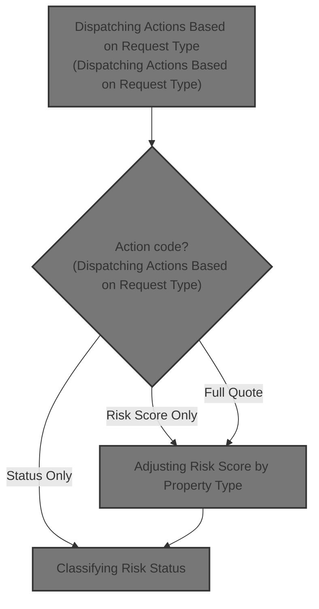

# Overview

This document describes the flow for processing insurance application requests. Requests are routed to the appropriate calculation routines based on the action code, resulting in risk scores, risk status, and premium values as required.

## Dependencies

### Program

- LGPCALC1 (<SwmPath>[base/src/lgpcalc1.cbl](base/src/lgpcalc1.cbl)</SwmPath>)

&nbsp;

*This is an auto-generated document by Swimm 🌊 and has not yet been verified by a human*

<SwmMeta version="3.0.0" repo-id="Z2l0aHViJTNBJTNBU3dpbW1pby1nZW5hcHAtbW90b3IlM0ElM0FHaXJpLVN3aW1t" repo-name="Swimmio-genapp-motor">Powered by [Swimm](https://app.swimm.io/)</SwmMeta>
