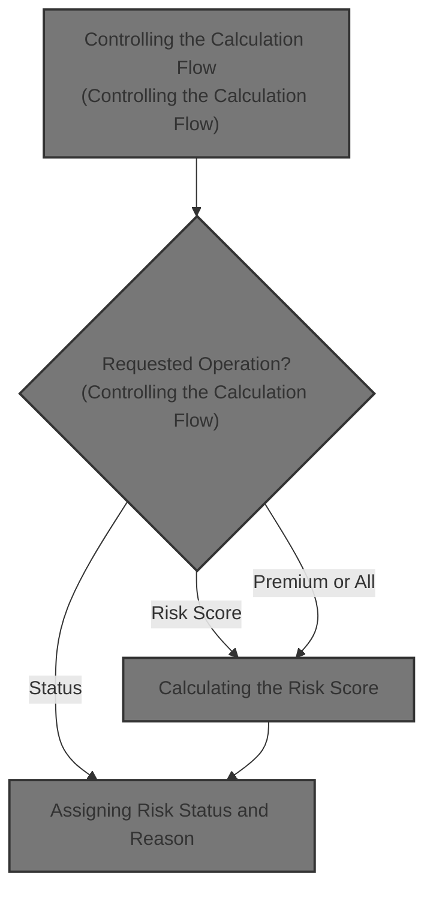

# Overview

This document describes the flow for processing insurance applications. The system evaluates the requested operation and executes the relevant business logic to calculate risk scores, assign risk status, and determine premiums.

## Dependencies

### Program

- LGPCALC1 (<SwmPath>[base/src/lgpcalc1.cbl](base/src/lgpcalc1.cbl)</SwmPath>)

&nbsp;

*This is an auto-generated document by Swimm 🌊 and has not yet been verified by a human*

<SwmMeta version="3.0.0" repo-id="Z2l0aHViJTNBJTNBU3dpbW1pby1nZW5hcHAtbW90b3IlM0ElM0FHaXJpLVN3aW1t" repo-name="Swimmio-genapp-motor">Powered by [Swimm](https://app.swimm.io/)</SwmMeta>
