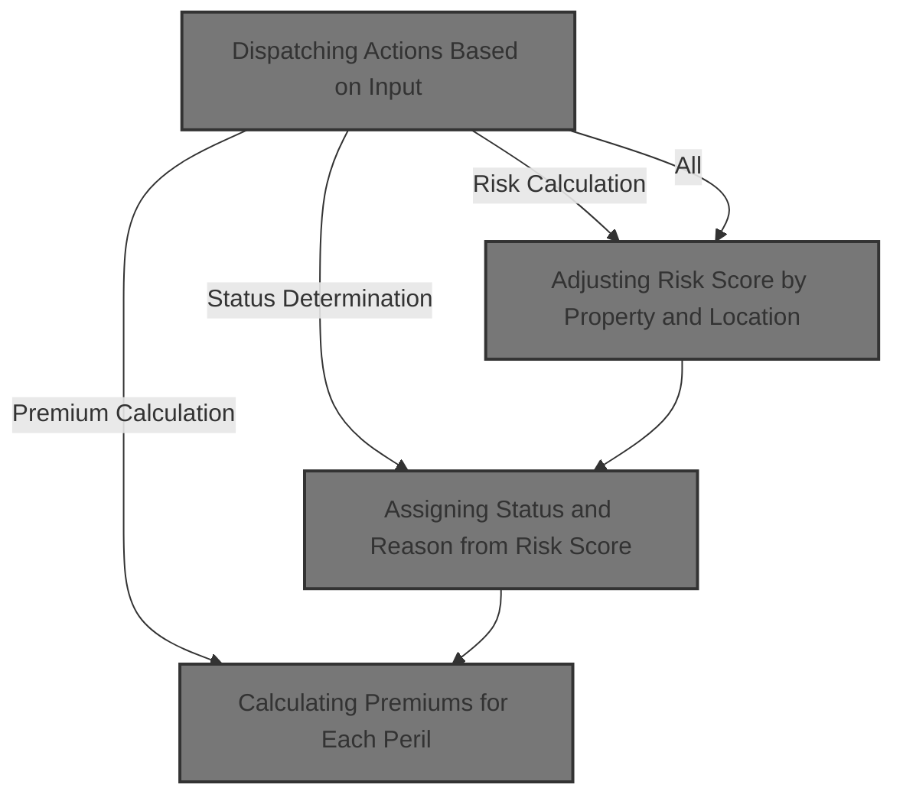
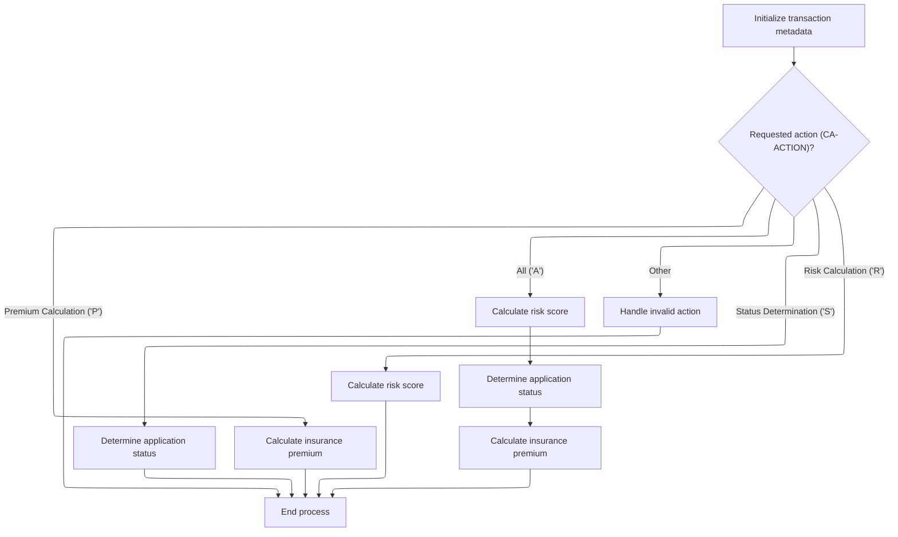
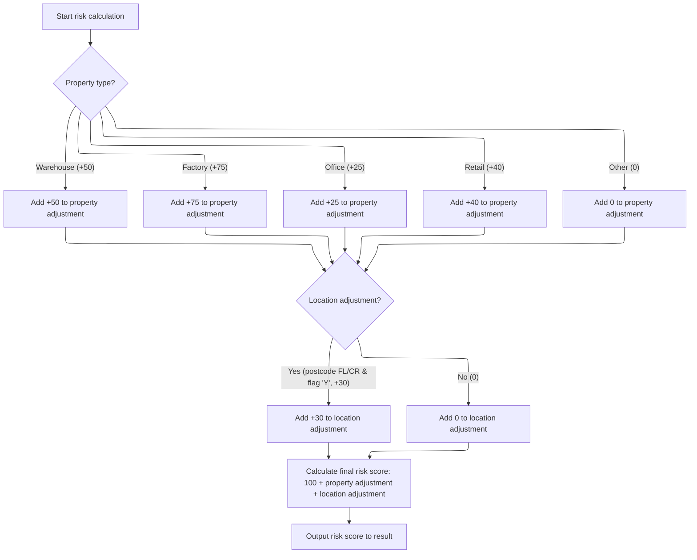
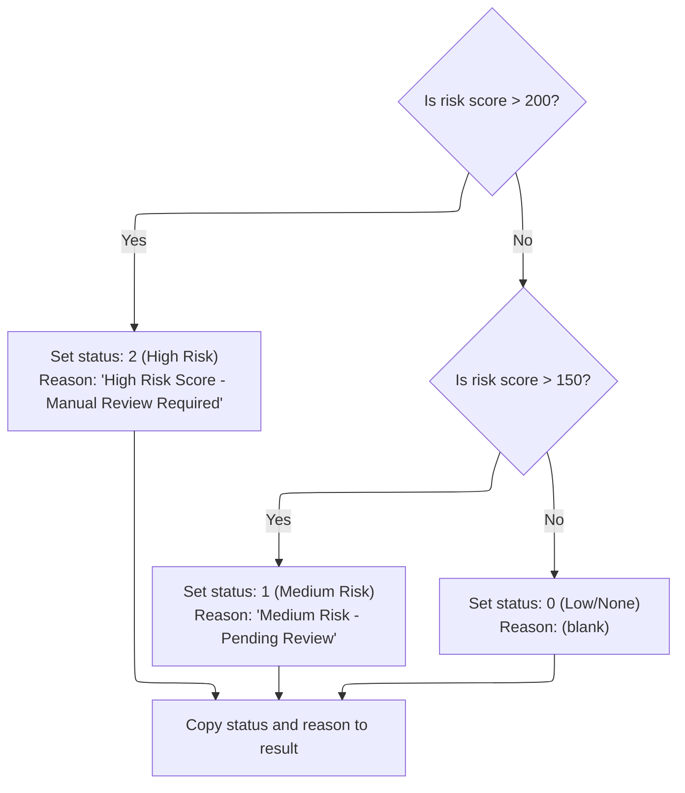

# Overview

This document explains the flow for processing insurance calculation requests. The process determines which business operation to perform, calculates risk scores, assigns risk status and reason, and computes insurance premiums for each peril according to business rules.



## Detailed View of the Program's Functionality

# Dispatching Actions Based on Input

The main entry point of the program begins by setting up transaction metadata, which includes initializing header fields and copying transaction, terminal, and task identifiers into working storage. After this setup, the program examines the requested action code provided as input.

Depending on the action code:

- If the request is for risk calculation, the program runs the risk calculation logic.
- If the request is for status determination, it runs the status determination logic.
- If the request is for premium calculation, it runs the premium calculation logic.
- If the request is for all actions, it runs risk calculation first, then status determination, and finally premium calculation in sequence. This order is important because both status and premium calculations depend on the risk score produced by the risk calculation.
- If the action code is not recognized, the program runs error handling logic.

After completing the requested actions, the program returns control to the calling environment.

# Adjusting Risk Score by Property and Location

When the risk calculation logic is invoked, it starts by resetting the property and location adjustment accumulators to zero.

Next, it checks the property type provided in the input. For each recognized property type, a specific adjustment value is added to the property adjustment accumulator:

- Warehouse properties add a fixed value.
- Factory properties add a higher fixed value.
- Office properties add a moderate fixed value.
- Retail properties add a value between office and warehouse.
- Any other property type does not change the adjustment.

After the property adjustment, the program checks if the location qualifies for an additional adjustment. This is determined by examining the first two characters of the postcode and checking corresponding flags. If the postcode starts with certain values and the associated flag is set, a fixed location adjustment is added.

Finally, the total risk score is calculated by adding a base score, the property adjustment, and the location adjustment. This total is then output as the risk score for the property.

# Assigning Status and Reason from Risk Score

The status determination logic begins by resetting the status and reason fields.

It then checks the risk score:

- If the risk score is above a high threshold, the status is set to indicate high risk, and the reason is set to a message indicating manual review is required.
- If the risk score is above a medium threshold but not high, the status is set to indicate medium risk, and the reason is set to a message indicating pending review.
- If the risk score is not above either threshold, the status is set to indicate low or no risk, and the reason is left blank.

After determining the status and reason, these values are copied into the result structure for output.

# Calculating Premiums for Each Peril

The premium calculation logic starts by resetting all premium values to zero and setting a multiplier to its default value.

It then checks if all risk factors (fire, crime, flood, weather) are present and positive. If so, it applies a discount to the multiplier; otherwise, the multiplier remains at its default value.

For each risk factor:

- If the fire risk factor is positive, the fire premium is calculated using the risk score, a fire premium factor, the fire risk factor, and the multiplier.
- If the crime risk factor is positive, the crime premium is calculated similarly, using its own factor.
- If the flood risk factor is positive, the flood premium is calculated using its specific factor.
- If the weather risk factor is positive, the weather premium is calculated using its own factor.

Each calculated premium is stored in working storage. After all calculations, the premiums are copied into the result structure for output.

# Error Handling

If an invalid action code is provided, the error handling logic sets the risk score and all premiums to zero, sets the status to a special value indicating an error, and sets the reason to a message indicating an invalid processing request. These values are then output in the result structure.

# Rule Definition

| Paragraph Name                                                                                                                                                                             | Rule ID | Category          | Description                                                                                                                                                                                                                                                                                                                                                                                                                                                                                                                                                                        | Conditions                                                                                                                                                                                                                          | Remarks                                                                                                                                                                                                                                                                                                                                                                                                                                                                                                                                                                                                                                                                                                                                                                                                                                                                                                                                                                                                                                                                                                                                                                                                                                                                                                                                                                                                                        |
| ------------------------------------------------------------------------------------------------------------------------------------------------------------------------------------------ | ------- | ----------------- | ---------------------------------------------------------------------------------------------------------------------------------------------------------------------------------------------------------------------------------------------------------------------------------------------------------------------------------------------------------------------------------------------------------------------------------------------------------------------------------------------------------------------------------------------------------------------------------- | ----------------------------------------------------------------------------------------------------------------------------------------------------------------------------------------------------------------------------------- | ------------------------------------------------------------------------------------------------------------------------------------------------------------------------------------------------------------------------------------------------------------------------------------------------------------------------------------------------------------------------------------------------------------------------------------------------------------------------------------------------------------------------------------------------------------------------------------------------------------------------------------------------------------------------------------------------------------------------------------------------------------------------------------------------------------------------------------------------------------------------------------------------------------------------------------------------------------------------------------------------------------------------------------------------------------------------------------------------------------------------------------------------------------------------------------------------------------------------------------------------------------------------------------------------------------------------------------------------------------------------------------------------------------------------------ |
| MAINLINE SECTION (lines 127-140), <SwmToken path="base/src/lgpcalc1.cbl" pos="139:3:5" line-data="                 PERFORM ERROR-PROCESSING">`ERROR-PROCESSING`</SwmToken> (lines 259-268) | RL-001  | Conditional Logic | The system dispatches processing based on the <SwmToken path="base/src/lgpcalc1.cbl" pos="127:3:5" line-data="           EVALUATE CA-ACTION">`CA-ACTION`</SwmToken> field. Depending on the value, it performs risk calculation, status determination, premium calculation, or all in sequence. If the action is invalid, it sets status to 9, reason to 'Invalid Processing Request', and all other output fields to zero. All output fields must be present in the result object, even if only some are populated for a given action.                                            | Triggered whenever a request is received. The value of <SwmToken path="base/src/lgpcalc1.cbl" pos="127:3:5" line-data="           EVALUATE CA-ACTION">`CA-ACTION`</SwmToken> determines which processing steps are performed.       | Valid <SwmToken path="base/src/lgpcalc1.cbl" pos="127:3:5" line-data="           EVALUATE CA-ACTION">`CA-ACTION`</SwmToken> values: 'R', 'S', 'P', 'A'. Output fields: <SwmToken path="base/src/lgpcalc1.cbl" pos="179:11:17" line-data="           MOVE WS-CA-TOTAL TO CA-R-RISK-SCORE.">`CA-R-RISK-SCORE`</SwmToken> (integer, 3 digits), <SwmToken path="base/src/lgpcalc1.cbl" pos="204:11:15" line-data="           MOVE WS-CA-STATUS TO CA-R-STATUS.">`CA-R-STATUS`</SwmToken> (integer, 1 digit), <SwmToken path="base/src/lgpcalc1.cbl" pos="205:11:15" line-data="           MOVE WS-CA-REASON TO CA-R-REASON.">`CA-R-REASON`</SwmToken> (string, 50 chars), <SwmToken path="base/src/lgpcalc1.cbl" pos="250:13:19" line-data="           MOVE WS-PF-FIRE-PREM TO CA-R-FIRE-PREM.">`CA-R-FIRE-PREM`</SwmToken>, <SwmToken path="base/src/lgpcalc1.cbl" pos="251:13:19" line-data="           MOVE WS-PF-CRIME-PREM TO CA-R-CRIME-PREM.">`CA-R-CRIME-PREM`</SwmToken>, <SwmToken path="base/src/lgpcalc1.cbl" pos="252:13:19" line-data="           MOVE WS-PF-FLOOD-PREM TO CA-R-FLOOD-PREM.">`CA-R-FLOOD-PREM`</SwmToken>, <SwmToken path="base/src/lgpcalc1.cbl" pos="253:13:19" line-data="           MOVE WS-PF-WEATHER-PREM TO CA-R-WEATHER-PREM.">`CA-R-WEATHER-PREM`</SwmToken> (all integer, 8 digits). For invalid actions, status is 9, reason is 'Invalid Processing Request', all other outputs are zero. |
| <SwmToken path="base/src/lgpcalc1.cbl" pos="129:3:5" line-data="                 PERFORM RISK-CALCULATION">`RISK-CALCULATION`</SwmToken> (lines 149-181)                                   | RL-002  | Computation       | Calculates the risk score based on property type and postcode. Property adjustment is added based on property type. Location adjustment is added if postcode starts with 'FL' or 'CR'. The risk score is the sum of base (100), property adjustment, and location adjustment.                                                                                                                                                                                                                                                                                                      | Performed when <SwmToken path="base/src/lgpcalc1.cbl" pos="127:3:5" line-data="           EVALUATE CA-ACTION">`CA-ACTION`</SwmToken> is 'R' or 'A'.                                                                                 | Property adjustments: WAREHOUSE +50, FACTORY +75, OFFICE +25, RETAIL +40, Other 0. Location adjustment: +30 if postcode starts with 'FL' or 'CR', else 0. Risk score output: integer, 3 digits.                                                                                                                                                                                                                                                                                                                                                                                                                                                                                                                                                                                                                                                                                                                                                                                                                                                                                                                                                                                                                                                                                                                                                                                                                                |
| <SwmToken path="base/src/lgpcalc1.cbl" pos="131:3:5" line-data="                 PERFORM STATUS-DETERMINATION">`STATUS-DETERMINATION`</SwmToken> (lines 185-207)                           | RL-003  | Conditional Logic | Determines the status and reason based on the risk score. If risk score > 200, status is 2 and reason is 'High Risk Score - Manual Review Required'. If risk score > 150, status is 1 and reason is 'Medium Risk - Pending Review'. Otherwise, status is 0 and reason is blank.                                                                                                                                                                                                                                                                                                    | Performed when <SwmToken path="base/src/lgpcalc1.cbl" pos="127:3:5" line-data="           EVALUATE CA-ACTION">`CA-ACTION`</SwmToken> is 'S' or 'A'. Uses risk score from input or previous calculation.                             | Status: integer, 1 digit. Reason: string, 50 chars. Thresholds: >200 (status 2), >150 (status 1), else 0.                                                                                                                                                                                                                                                                                                                                                                                                                                                                                                                                                                                                                                                                                                                                                                                                                                                                                                                                                                                                                                                                                                                                                                                                                                                                                                                      |
| <SwmToken path="base/src/lgpcalc1.cbl" pos="133:3:5" line-data="                 PERFORM PREMIUM-CALCULATION">`PREMIUM-CALCULATION`</SwmToken> (lines 211-255)                             | RL-004  | Computation       | Calculates premiums for fire, crime, flood, and weather perils using the risk score and respective risk factors. If all risk factors are greater than zero, a multiplier of <SwmToken path="base/src/lgpcalc1.cbl" pos="71:15:17" line-data="           03 WS-PF-DISCOUNT           PIC V99 VALUE 0.90.">`0.90`</SwmToken> is used; otherwise, <SwmToken path="base/src/lgpcalc1.cbl" pos="213:3:5" line-data="           MOVE 1.00 TO WS-RT-MULTIPLIER.">`1.00`</SwmToken>. Each premium is calculated only if its risk factor is greater than zero, otherwise it is set to zero. | Performed when <SwmToken path="base/src/lgpcalc1.cbl" pos="127:3:5" line-data="           EVALUATE CA-ACTION">`CA-ACTION`</SwmToken> is 'P' or 'A'. Uses risk score from input or previous calculation and risk factors from input. | Premium formulas:                                                                                                                                                                                                                                                                                                                                                                                                                                                                                                                                                                                                                                                                                                                                                                                                                                                                                                                                                                                                                                                                                                                                                                                                                                                                                                                                                                                                              |

- Fire: risk score × <SwmToken path="base/src/lgpcalc1.cbl" pos="73:15:17" line-data="              05 WS-PF-FIRE            PIC V99 VALUE 0.80.">`0.80`</SwmToken> × fire factor × multiplier
- Crime: risk score × <SwmToken path="base/src/lgpcalc1.cbl" pos="74:15:17" line-data="              05 WS-PF-CRIME           PIC V99 VALUE 0.60.">`0.60`</SwmToken> × crime factor × multiplier
- Flood: risk score × <SwmToken path="base/src/lgpcalc1.cbl" pos="75:15:17" line-data="              05 WS-PF-FLOOD           PIC V99 VALUE 1.20.">`1.20`</SwmToken> × flood factor × multiplier
- Weather: risk score × <SwmToken path="base/src/lgpcalc1.cbl" pos="71:15:17" line-data="           03 WS-PF-DISCOUNT           PIC V99 VALUE 0.90.">`0.90`</SwmToken> × weather factor × multiplier Multiplier: <SwmToken path="base/src/lgpcalc1.cbl" pos="71:15:17" line-data="           03 WS-PF-DISCOUNT           PIC V99 VALUE 0.90.">`0.90`</SwmToken> if all risk factors > 0, else <SwmToken path="base/src/lgpcalc1.cbl" pos="213:3:5" line-data="           MOVE 1.00 TO WS-RT-MULTIPLIER.">`1.00`</SwmToken>. Premium outputs: integer, 8 digits. If risk factor <= 0, premium is zero. |

# User Stories

## User Story 1: Process insurance risk and premium requests end-to-end

---

### Story Description:

As a system user, I want to submit a request with an action type so that the system processes risk calculation, status determination, premium calculation, or all in sequence, and always returns a complete result object with appropriate fields populated or zeroed for invalid actions.

---

### Business Rule Mapping:

| Rule ID | Paragraph Name                                                                                                                                                                             | Rule Description                                                                                                                                                                                                                                                                                                                                                                                                                                                                                                                                                                   |
| ------- | ------------------------------------------------------------------------------------------------------------------------------------------------------------------------------------------ | ---------------------------------------------------------------------------------------------------------------------------------------------------------------------------------------------------------------------------------------------------------------------------------------------------------------------------------------------------------------------------------------------------------------------------------------------------------------------------------------------------------------------------------------------------------------------------------- |
| RL-001  | MAINLINE SECTION (lines 127-140), <SwmToken path="base/src/lgpcalc1.cbl" pos="139:3:5" line-data="                 PERFORM ERROR-PROCESSING">`ERROR-PROCESSING`</SwmToken> (lines 259-268) | The system dispatches processing based on the <SwmToken path="base/src/lgpcalc1.cbl" pos="127:3:5" line-data="           EVALUATE CA-ACTION">`CA-ACTION`</SwmToken> field. Depending on the value, it performs risk calculation, status determination, premium calculation, or all in sequence. If the action is invalid, it sets status to 9, reason to 'Invalid Processing Request', and all other output fields to zero. All output fields must be present in the result object, even if only some are populated for a given action.                                            |
| RL-002  | <SwmToken path="base/src/lgpcalc1.cbl" pos="129:3:5" line-data="                 PERFORM RISK-CALCULATION">`RISK-CALCULATION`</SwmToken> (lines 149-181)                                   | Calculates the risk score based on property type and postcode. Property adjustment is added based on property type. Location adjustment is added if postcode starts with 'FL' or 'CR'. The risk score is the sum of base (100), property adjustment, and location adjustment.                                                                                                                                                                                                                                                                                                      |
| RL-003  | <SwmToken path="base/src/lgpcalc1.cbl" pos="131:3:5" line-data="                 PERFORM STATUS-DETERMINATION">`STATUS-DETERMINATION`</SwmToken> (lines 185-207)                           | Determines the status and reason based on the risk score. If risk score > 200, status is 2 and reason is 'High Risk Score - Manual Review Required'. If risk score > 150, status is 1 and reason is 'Medium Risk - Pending Review'. Otherwise, status is 0 and reason is blank.                                                                                                                                                                                                                                                                                                    |
| RL-004  | <SwmToken path="base/src/lgpcalc1.cbl" pos="133:3:5" line-data="                 PERFORM PREMIUM-CALCULATION">`PREMIUM-CALCULATION`</SwmToken> (lines 211-255)                             | Calculates premiums for fire, crime, flood, and weather perils using the risk score and respective risk factors. If all risk factors are greater than zero, a multiplier of <SwmToken path="base/src/lgpcalc1.cbl" pos="71:15:17" line-data="           03 WS-PF-DISCOUNT           PIC V99 VALUE 0.90.">`0.90`</SwmToken> is used; otherwise, <SwmToken path="base/src/lgpcalc1.cbl" pos="213:3:5" line-data="           MOVE 1.00 TO WS-RT-MULTIPLIER.">`1.00`</SwmToken>. Each premium is calculated only if its risk factor is greater than zero, otherwise it is set to zero. |

---

### Relevant Functionality:

- **MAINLINE SECTION (lines 127-140)**
  1. **RL-001:**
     - On receiving a request, check <SwmToken path="base/src/lgpcalc1.cbl" pos="127:3:5" line-data="           EVALUATE CA-ACTION">`CA-ACTION`</SwmToken>:
       - If 'R': Perform risk calculation, output only risk score.
       - If 'S': Use provided risk score, perform status determination, output only status and reason.
       - If 'P': Use provided risk score and risk factors, perform premium calculation, output only premium fields.
       - If 'A': Perform risk calculation, then status determination, then premium calculation, output all fields.
       - If not one of the above: Set status to 9, reason to 'Invalid Processing Request', all other outputs zero.
     - Always include all output fields in the result object.
- <SwmToken path="base/src/lgpcalc1.cbl" pos="129:3:5" line-data="                 PERFORM RISK-CALCULATION">`RISK-CALCULATION`</SwmToken> **(lines 149-181)**
  1. **RL-002:**
     - Set property adjustment to 0.
     - Set location adjustment to 0.
     - If property type is:
       - 'WAREHOUSE': property adjustment +50
       - 'FACTORY': property adjustment +75
       - 'OFFICE': property adjustment +25
       - 'RETAIL': property adjustment +40
       - Other: property adjustment 0
     - If postcode starts with 'FL' or 'CR': location adjustment +30
     - Risk score = 100 + property adjustment + location adjustment
     - Output risk score in result object.
- <SwmToken path="base/src/lgpcalc1.cbl" pos="131:3:5" line-data="                 PERFORM STATUS-DETERMINATION">`STATUS-DETERMINATION`</SwmToken> **(lines 185-207)**
  1. **RL-003:**
     - If risk score > 200:
       - Set status to 2
       - Set reason to 'High Risk Score - Manual Review Required'
     - Else if risk score > 150:
       - Set status to 1
       - Set reason to 'Medium Risk - Pending Review'
     - Else:
       - Set status to 0
       - Set reason to blank
     - Output status and reason in result object.
- <SwmToken path="base/src/lgpcalc1.cbl" pos="133:3:5" line-data="                 PERFORM PREMIUM-CALCULATION">`PREMIUM-CALCULATION`</SwmToken> **(lines 211-255)**
  1. **RL-004:**
     - Set multiplier to <SwmToken path="base/src/lgpcalc1.cbl" pos="213:3:5" line-data="           MOVE 1.00 TO WS-RT-MULTIPLIER.">`1.00`</SwmToken>
     - If all risk factors > 0: set multiplier to <SwmToken path="base/src/lgpcalc1.cbl" pos="71:15:17" line-data="           03 WS-PF-DISCOUNT           PIC V99 VALUE 0.90.">`0.90`</SwmToken>
     - For each peril:
       - If risk factor > 0:
         - Calculate premium as: risk score × peril factor × risk factor × multiplier
         - Output premium in result object
       - Else:
         - Set premium to zero in result object
     - Output all premium fields in result object.

# Workflow

# Dispatching Actions Based on Input



This section is responsible for dispatching the correct business process based on the <SwmToken path="base/src/lgpcalc1.cbl" pos="127:3:5" line-data="           EVALUATE CA-ACTION">`CA-ACTION`</SwmToken> input. It ensures that transaction metadata is set and that the requested calculation(s) are performed in the correct order, with dependencies respected.

| Category       | Rule Name                     | Description                                                                                                                                                                                                                            |
| -------------- | ----------------------------- | -------------------------------------------------------------------------------------------------------------------------------------------------------------------------------------------------------------------------------------- |
| Business logic | Risk calculation dispatch     | If the requested action is 'R', only the risk score calculation is performed and the result is returned.                                                                                                                               |
| Business logic | Status determination dispatch | If the requested action is 'S', only the application status determination is performed and the result is returned.                                                                                                                     |
| Business logic | Premium calculation dispatch  | If the requested action is 'P', only the insurance premium calculation is performed and the result is returned.                                                                                                                        |
| Business logic | Chained calculation dispatch  | If the requested action is 'A', all three calculations (risk score, status determination, premium calculation) must be performed in sequence, with risk calculation first, followed by status determination, then premium calculation. |

<SwmSnippet path="/base/src/lgpcalc1.cbl" line="120">

---

<SwmToken path="base/src/lgpcalc1.cbl" pos="120:1:1" line-data="       MAINLINE SECTION.">`MAINLINE`</SwmToken> kicks off the flow by routing the request based on the <SwmToken path="base/src/lgpcalc1.cbl" pos="127:3:5" line-data="           EVALUATE CA-ACTION">`CA-ACTION`</SwmToken> input. It sets up some header fields, then checks the action type: 'R' runs risk calculation, 'S' runs status determination, 'P' runs premium calculation, and 'A' chains all three. Calling <SwmToken path="base/src/lgpcalc1.cbl" pos="129:3:5" line-data="                 PERFORM RISK-CALCULATION">`RISK-CALCULATION`</SwmToken> first is necessary because both status and premium calculations depend on the risk score it produces.

```cobol
       MAINLINE SECTION.
           
           INITIALIZE WS-HEADER.
           MOVE EIBTRNID TO WS-TRANSID.
           MOVE EIBTRMID TO WS-TERMID.
           MOVE EIBTASKN TO WS-TASKNUM.
           
           EVALUATE CA-ACTION
              WHEN 'R'
                 PERFORM RISK-CALCULATION
              WHEN 'S'
                 PERFORM STATUS-DETERMINATION
              WHEN 'P'
                 PERFORM PREMIUM-CALCULATION
              WHEN 'A'
                 PERFORM RISK-CALCULATION
                 PERFORM STATUS-DETERMINATION
                 PERFORM PREMIUM-CALCULATION
              WHEN OTHER
                 PERFORM ERROR-PROCESSING
           END-EVALUATE.
           
           EXEC CICS RETURN END-EXEC.
```

---

</SwmSnippet>

# Adjusting Risk Score by Property and Location



This section determines the risk score for a property by applying predefined adjustments based on the property's type and its location. The risk score is used to assess insurance risk and pricing.

| Category       | Rule Name                    | Description                                                                                                                                                   |
| -------------- | ---------------------------- | ------------------------------------------------------------------------------------------------------------------------------------------------------------- |
| Business logic | Base risk score              | The risk score calculation always starts with a base value of 100.                                                                                            |
| Business logic | Property type adjustment     | The property type determines a fixed adjustment to the risk score: Warehouse (+50), Factory (+75), Office (+25), Retail (+40), Other (+0).                    |
| Business logic | Location risk adjustment     | If the postcode starts with 'FL' and the FL flag is 'Y', or starts with 'CR' and the CR flag is 'Y', a location adjustment of +30 is added to the risk score. |
| Business logic | No location adjustment       | If the postcode does not meet the location risk criteria, no location adjustment is applied.                                                                  |
| Business logic | Final risk score calculation | The final risk score is the sum of the base score, property adjustment, and location adjustment.                                                              |

<SwmSnippet path="/base/src/lgpcalc1.cbl" line="149">

---

In <SwmToken path="base/src/lgpcalc1.cbl" pos="149:1:3" line-data="       RISK-CALCULATION.">`RISK-CALCULATION`</SwmToken>, the function checks the property type and adds a predefined adjustment to the property adjustment accumulator. Each property type (WAREHOUSE, FACTORY, OFFICE, RETAIL) has its own adjustment value. The subtraction of zero in the COMPUTE lines is pointless and doesn't change the result.

```cobol
       RISK-CALCULATION.
           MOVE 0 TO WS-CA-PROP-ADJ.
           MOVE 0 TO WS-CA-POST-ADJ.
           
           EVALUATE CA-D-PROP-TYPE
              WHEN 'WAREHOUSE'
                 COMPUTE WS-RT-TEMP1 = WS-EM-ADJUST-1 - 0
                 ADD WS-RT-TEMP1 TO WS-CA-PROP-ADJ
              WHEN 'FACTORY'
                 COMPUTE WS-RT-TEMP1 = WS-EM-ADJUST-2 - 0
                 ADD WS-RT-TEMP1 TO WS-CA-PROP-ADJ
              WHEN 'OFFICE'
                 COMPUTE WS-RT-TEMP1 = WS-EM-ADJUST-3 - 0
                 ADD WS-RT-TEMP1 TO WS-CA-PROP-ADJ
              WHEN 'RETAIL'
                 COMPUTE WS-RT-TEMP1 = WS-EM-ADJUST-4 - 0
                 ADD WS-RT-TEMP1 TO WS-CA-PROP-ADJ
              WHEN OTHER
                 CONTINUE
           END-EVALUATE.
```

---

</SwmSnippet>

<SwmSnippet path="/base/src/lgpcalc1.cbl" line="170">

---

After the property type adjustment, the code checks if the postcode starts with 'FL' or 'CR' and if the corresponding flag is set. If so, it adds a fixed adjustment for location risk. This step assumes the postcode is always at least two characters long.

```cobol
           IF (CA-D-POSTCODE(1:2) = 'FL' AND WS-EM-FL-FLAG = 'Y') OR
              (CA-D-POSTCODE(1:2) = 'CR' AND WS-EM-CR-FLAG = 'Y')
              COMPUTE WS-RT-TEMP1 = WS-EM-POST-ADJUSTMENT - 0
              ADD WS-RT-TEMP1 TO WS-CA-POST-ADJ
           END-IF.
```

---

</SwmSnippet>

<SwmSnippet path="/base/src/lgpcalc1.cbl" line="176">

---

Finally, the total risk score is calculated by adding the base score (100), the property adjustment, and the postcode adjustment. This total is then output as the risk score for the property.

```cobol
           COMPUTE WS-CA-TOTAL = 
              WS-CA-BASE + WS-CA-PROP-ADJ + WS-CA-POST-ADJ.
              
           MOVE WS-CA-TOTAL TO CA-R-RISK-SCORE.
           
           EXIT.
```

---

</SwmSnippet>

# Assigning Status and Reason from Risk Score



This section determines the risk status and reason for a case based on the calculated risk score. The status and reason are assigned according to fixed thresholds and are then provided as part of the result for downstream processing or display.

| Category       | Rule Name              | Description                                                                                                                                                                  |
| -------------- | ---------------------- | ---------------------------------------------------------------------------------------------------------------------------------------------------------------------------- |
| Business logic | High Risk Assignment   | If the risk score is greater than 200, the status must be set to 2 (High Risk) and the reason must be set to 'High Risk Score - Manual Review Required'.                     |
| Business logic | Medium Risk Assignment | If the risk score is greater than 150 but less than or equal to 200, the status must be set to 1 (Medium Risk) and the reason must be set to 'Medium Risk - Pending Review'. |
| Business logic | Low Risk Assignment    | If the risk score is 150 or less, the status must be set to 0 (Low/None) and the reason must be left blank.                                                                  |

<SwmSnippet path="/base/src/lgpcalc1.cbl" line="185">

---

In <SwmToken path="base/src/lgpcalc1.cbl" pos="185:1:3" line-data="       STATUS-DETERMINATION.">`STATUS-DETERMINATION`</SwmToken>, the function checks the risk score and assigns a status code and reason string based on fixed thresholds. It uses working storage variables for the intermediate values before moving them to the output fields.

```cobol
       STATUS-DETERMINATION.
           MOVE 0 TO WS-CA-STATUS.
           MOVE SPACES TO WS-CA-REASON.
           
           IF CA-D-RISK-SCORE > 200
              MOVE 2 TO WS-CA-STATUS
              MOVE 'High Risk Score - Manual Review Required' 
                TO WS-CA-REASON
           ELSE
              IF CA-D-RISK-SCORE > 150
                 MOVE 1 TO WS-CA-STATUS
                 MOVE 'Medium Risk - Pending Review'
                   TO WS-CA-REASON
              ELSE
                 MOVE 0 TO WS-CA-STATUS
                 MOVE SPACES TO WS-CA-REASON
              END-IF
```

---

</SwmSnippet>

<SwmSnippet path="/base/src/lgpcalc1.cbl" line="202">

---

After determining the status and reason, the function moves these values into the result structure for use by whatever called this logic.

```cobol
           END-IF.
           
           MOVE WS-CA-STATUS TO CA-R-STATUS.
           MOVE WS-CA-REASON TO CA-R-REASON.
           
           EXIT.
```

---

</SwmSnippet>

# Calculating Premiums for Each Peril



```mermaid
%%{init: {"flowchart": {"defaultRenderer": "elk"}} }%%
flowchart TD
    node1["Initialize all premiums to zero and set multiplier to 1.00"] 
    click node1 openCode "base/src/lgpcalc1.cbl:211:214"
    node1 --> node2{"Are all risk factors (fire, crime, flood, weather) > 0?"}
    click node2 openCode "base/src/lgpcalc1.cbl:215:220"
    node2 -->|"Yes"| node3["Apply discount multiplier (0.90)"]
    click node3 openCode "base/src/lgpcalc1.cbl:219:220"
    node2 -->|"No"| node4["Continue with multiplier 1.00"]
    click node4 openCode "base/src/lgpcalc1.cbl:213:213"
    node3 --> node5
    node4 --> node5
    
    subgraph premiums["Calculate premiums for each risk type"]
      node5 --> node6{"Fire factor > 0?"}
      click node6 openCode "base/src/lgpcalc1.cbl:222:227"
      node6 -->|"Yes"| node7["Calculate fire premium (risk score × 0.80 × fire factor × multiplier)"]
      click node7 openCode "base/src/lgpcalc1.cbl:223:226"
      node6 -->|"No"| node8
      node7 --> node8
      node8{"Crime factor > 0?"}
      click node8 openCode "base/src/lgpcalc1.cbl:229:234"
      node8 -->|"Yes"| node9["Calculate crime premium (risk score × 0.60 × crime factor × multiplier)"]
      click node9 openCode "base/src/lgpcalc1.cbl:230:233"
      node8 -->|"No"| node10
      node9 --> node10
      node10{"Flood factor > 0?"}
      click node10 openCode "base/src/lgpcalc1.cbl:236:241"
      node10 -->|"Yes"| node11["Calculate flood premium (risk score × 1.20 × flood factor × multiplier)"]
      click node11 openCode "base/src/lgpcalc1.cbl:237:240"
      node10 -->|"No"| node12
      node11 --> node12
      node12{"Weather factor > 0?"}
      click node12 openCode "base/src/lgpcalc1.cbl:243:248"
      node12 -->|"Yes"| node13["Calculate weather premium (risk score × 0.90 × weather factor × multiplier)"]
      click node13 openCode "base/src/lgpcalc1.cbl:244:247"
      node12 -->|"No"| node14["Move calculated premiums to result"]
      node13 --> node14
    end
    node14["Move calculated premiums to result"]
    click node14 openCode "base/src/lgpcalc1.cbl:250:253"
classDef HeadingStyle fill:#777777,stroke:#333,stroke-width:2px;

%% Swimm:
%% %%{init: {"flowchart": {"defaultRenderer": "elk"}} }%%
%% flowchart TD
%%     node1["Initialize all premiums to zero and set multiplier to <SwmToken path="base/src/lgpcalc1.cbl" pos="213:3:5" line-data="           MOVE 1.00 TO WS-RT-MULTIPLIER.">`1.00`</SwmToken>"] 
%%     click node1 openCode "<SwmPath>[base/src/lgpcalc1.cbl](base/src/lgpcalc1.cbl)</SwmPath>:211:214"
%%     node1 --> node2{"Are all risk factors (fire, crime, flood, weather) > 0?"}
%%     click node2 openCode "<SwmPath>[base/src/lgpcalc1.cbl](base/src/lgpcalc1.cbl)</SwmPath>:215:220"
%%     node2 -->|"Yes"| node3["Apply discount multiplier (<SwmToken path="base/src/lgpcalc1.cbl" pos="71:15:17" line-data="           03 WS-PF-DISCOUNT           PIC V99 VALUE 0.90.">`0.90`</SwmToken>)"]
%%     click node3 openCode "<SwmPath>[base/src/lgpcalc1.cbl](base/src/lgpcalc1.cbl)</SwmPath>:219:220"
%%     node2 -->|"No"| node4["Continue with multiplier <SwmToken path="base/src/lgpcalc1.cbl" pos="213:3:5" line-data="           MOVE 1.00 TO WS-RT-MULTIPLIER.">`1.00`</SwmToken>"]
%%     click node4 openCode "<SwmPath>[base/src/lgpcalc1.cbl](base/src/lgpcalc1.cbl)</SwmPath>:213:213"
%%     node3 --> node5
%%     node4 --> node5
%%     
%%     subgraph premiums["Calculate premiums for each risk type"]
%%       node5 --> node6{"Fire factor > 0?"}
%%       click node6 openCode "<SwmPath>[base/src/lgpcalc1.cbl](base/src/lgpcalc1.cbl)</SwmPath>:222:227"
%%       node6 -->|"Yes"| node7["Calculate fire premium (risk score × <SwmToken path="base/src/lgpcalc1.cbl" pos="73:15:17" line-data="              05 WS-PF-FIRE            PIC V99 VALUE 0.80.">`0.80`</SwmToken> × fire factor × multiplier)"]
%%       click node7 openCode "<SwmPath>[base/src/lgpcalc1.cbl](base/src/lgpcalc1.cbl)</SwmPath>:223:226"
%%       node6 -->|"No"| node8
%%       node7 --> node8
%%       node8{"Crime factor > 0?"}
%%       click node8 openCode "<SwmPath>[base/src/lgpcalc1.cbl](base/src/lgpcalc1.cbl)</SwmPath>:229:234"
%%       node8 -->|"Yes"| node9["Calculate crime premium (risk score × <SwmToken path="base/src/lgpcalc1.cbl" pos="74:15:17" line-data="              05 WS-PF-CRIME           PIC V99 VALUE 0.60.">`0.60`</SwmToken> × crime factor × multiplier)"]
%%       click node9 openCode "<SwmPath>[base/src/lgpcalc1.cbl](base/src/lgpcalc1.cbl)</SwmPath>:230:233"
%%       node8 -->|"No"| node10
%%       node9 --> node10
%%       node10{"Flood factor > 0?"}
%%       click node10 openCode "<SwmPath>[base/src/lgpcalc1.cbl](base/src/lgpcalc1.cbl)</SwmPath>:236:241"
%%       node10 -->|"Yes"| node11["Calculate flood premium (risk score × <SwmToken path="base/src/lgpcalc1.cbl" pos="75:15:17" line-data="              05 WS-PF-FLOOD           PIC V99 VALUE 1.20.">`1.20`</SwmToken> × flood factor × multiplier)"]
%%       click node11 openCode "<SwmPath>[base/src/lgpcalc1.cbl](base/src/lgpcalc1.cbl)</SwmPath>:237:240"
%%       node10 -->|"No"| node12
%%       node11 --> node12
%%       node12{"Weather factor > 0?"}
%%       click node12 openCode "<SwmPath>[base/src/lgpcalc1.cbl](base/src/lgpcalc1.cbl)</SwmPath>:243:248"
%%       node12 -->|"Yes"| node13["Calculate weather premium (risk score × <SwmToken path="base/src/lgpcalc1.cbl" pos="71:15:17" line-data="           03 WS-PF-DISCOUNT           PIC V99 VALUE 0.90.">`0.90`</SwmToken> × weather factor × multiplier)"]
%%       click node13 openCode "<SwmPath>[base/src/lgpcalc1.cbl](base/src/lgpcalc1.cbl)</SwmPath>:244:247"
%%       node12 -->|"No"| node14["Move calculated premiums to result"]
%%       node13 --> node14
%%     end
%%     node14["Move calculated premiums to result"]
%%     click node14 openCode "<SwmPath>[base/src/lgpcalc1.cbl](base/src/lgpcalc1.cbl)</SwmPath>:250:253"
%% classDef HeadingStyle fill:#777777,stroke:#333,stroke-width:2px;
```

This section calculates insurance premiums for each peril (fire, crime, flood, weather) based on the provided risk factors and risk score. A discount multiplier is applied if all risk factors are present, affecting the premium calculation for each peril.

| Category        | Rule Name                              | Description                                                                                                                                                                                                                                                                              |
| --------------- | -------------------------------------- | ---------------------------------------------------------------------------------------------------------------------------------------------------------------------------------------------------------------------------------------------------------------------------------------- |
| Data validation | Peril premium eligibility              | A premium for a peril is only calculated if its corresponding risk factor is greater than zero.                                                                                                                                                                                          |
| Business logic  | All-risk discount                      | If all risk factors (fire, crime, flood, weather) are greater than zero, a discount multiplier of <SwmToken path="base/src/lgpcalc1.cbl" pos="71:15:17" line-data="           03 WS-PF-DISCOUNT           PIC V99 VALUE 0.90.">`0.90`</SwmToken> is applied to all premium calculations. |
| Business logic  | Default multiplier for incomplete risk | If any risk factor is zero or missing, the default multiplier of <SwmToken path="base/src/lgpcalc1.cbl" pos="213:3:5" line-data="           MOVE 1.00 TO WS-RT-MULTIPLIER.">`1.00`</SwmToken> is used for all premium calculations.                                                      |
| Business logic  | Fire premium calculation               | The fire premium is calculated as: risk score × <SwmToken path="base/src/lgpcalc1.cbl" pos="73:15:17" line-data="              05 WS-PF-FIRE            PIC V99 VALUE 0.80.">`0.80`</SwmToken> × fire risk factor × multiplier.                                                          |
| Business logic  | Crime premium calculation              | The crime premium is calculated as: risk score × <SwmToken path="base/src/lgpcalc1.cbl" pos="74:15:17" line-data="              05 WS-PF-CRIME           PIC V99 VALUE 0.60.">`0.60`</SwmToken> × crime risk factor × multiplier.                                                        |
| Business logic  | Flood premium calculation              | The flood premium is calculated as: risk score × <SwmToken path="base/src/lgpcalc1.cbl" pos="75:15:17" line-data="              05 WS-PF-FLOOD           PIC V99 VALUE 1.20.">`1.20`</SwmToken> × flood risk factor × multiplier.                                                        |
| Business logic  | Weather premium calculation            | The weather premium is calculated as: risk score × <SwmToken path="base/src/lgpcalc1.cbl" pos="71:15:17" line-data="           03 WS-PF-DISCOUNT           PIC V99 VALUE 0.90.">`0.90`</SwmToken> × weather risk factor × multiplier.                                                    |

<SwmSnippet path="/base/src/lgpcalc1.cbl" line="211">

---

In <SwmToken path="base/src/lgpcalc1.cbl" pos="211:1:3" line-data="       PREMIUM-CALCULATION.">`PREMIUM-CALCULATION`</SwmToken>, the function sets up a multiplier for premium calculations. If all risk factors are present, it applies a discount; otherwise, it uses the default multiplier. This affects all subsequent premium calculations for each peril.

```cobol
       PREMIUM-CALCULATION.
           INITIALIZE WS-PF-PREMIUMS.
           MOVE 1.00 TO WS-RT-MULTIPLIER.
           
           IF CA-D-FIRE-FACTOR > 0 AND
              CA-D-CRIME-FACTOR > 0 AND
              CA-D-FLOOD-FACTOR > 0 AND
              CA-D-WEATHER-FACTOR > 0
              MOVE WS-PF-DISCOUNT TO WS-RT-MULTIPLIER
           END-IF.
```

---

</SwmSnippet>

<SwmSnippet path="/base/src/lgpcalc1.cbl" line="222">

---

If the fire risk factor is positive, the code calculates the fire premium using the risk score, fire premium factor, fire risk factor, and the multiplier. This is stored for output.

```cobol
           IF CA-D-FIRE-FACTOR > 0
              COMPUTE WS-RT-TEMP1 = 
                 CA-D-RISK-SCORE * WS-PF-FIRE
              COMPUTE WS-PF-FIRE-PREM =
                 (WS-RT-TEMP1 * CA-D-FIRE-FACTOR * WS-RT-MULTIPLIER)
           END-IF.
```

---

</SwmSnippet>

<SwmSnippet path="/base/src/lgpcalc1.cbl" line="229">

---

Same as fire, but for crime: if the crime risk factor is positive, the code calculates the crime premium using the relevant factor and stores it.

```cobol
           IF CA-D-CRIME-FACTOR > 0
              COMPUTE WS-RT-TEMP1 = 
                 CA-D-RISK-SCORE * WS-PF-CRIME
              COMPUTE WS-PF-CRIME-PREM =
                 (WS-RT-TEMP1 * CA-D-CRIME-FACTOR * WS-RT-MULTIPLIER)
           END-IF.
```

---

</SwmSnippet>

<SwmSnippet path="/base/src/lgpcalc1.cbl" line="236">

---

Same logic for flood: if the flood risk factor is positive, the code calculates the flood premium and stores it.

```cobol
           IF CA-D-FLOOD-FACTOR > 0
              COMPUTE WS-RT-TEMP1 = 
                 CA-D-RISK-SCORE * WS-PF-FLOOD
              COMPUTE WS-PF-FLOOD-PREM =
                 (WS-RT-TEMP1 * CA-D-FLOOD-FACTOR * WS-RT-MULTIPLIER)
           END-IF.
```

---

</SwmSnippet>

<SwmSnippet path="/base/src/lgpcalc1.cbl" line="243">

---

Same pattern for weather: if the weather risk factor is positive, the code calculates the weather premium and stores it.

```cobol
           IF CA-D-WEATHER-FACTOR > 0
              COMPUTE WS-RT-TEMP1 = 
                 CA-D-RISK-SCORE * WS-PF-WEATHER
              COMPUTE WS-PF-WEATHER-PREM =
                 (WS-RT-TEMP1 * CA-D-WEATHER-FACTOR * WS-RT-MULTIPLIER)
           END-IF.
```

---

</SwmSnippet>

<SwmSnippet path="/base/src/lgpcalc1.cbl" line="250">

---

After all the premiums are calculated, they're moved into the result structure so the client or next process can use them.

```cobol
           MOVE WS-PF-FIRE-PREM TO CA-R-FIRE-PREM.
           MOVE WS-PF-CRIME-PREM TO CA-R-CRIME-PREM.
           MOVE WS-PF-FLOOD-PREM TO CA-R-FLOOD-PREM.
           MOVE WS-PF-WEATHER-PREM TO CA-R-WEATHER-PREM.
           
           EXIT.
```

---

</SwmSnippet>

&nbsp;

*This is an auto-generated document by Swimm 🌊 and has not yet been verified by a human*

<SwmMeta version="3.0.0" repo-id="Z2l0aHViJTNBJTNBU3dpbW1pby1nZW5hcHAtbW90b3IlM0ElM0FHaXJpLVN3aW1t" repo-name="Swimmio-genapp-motor"><sup>Powered by [Swimm](https://app.swimm.io/)</sup></SwmMeta>
