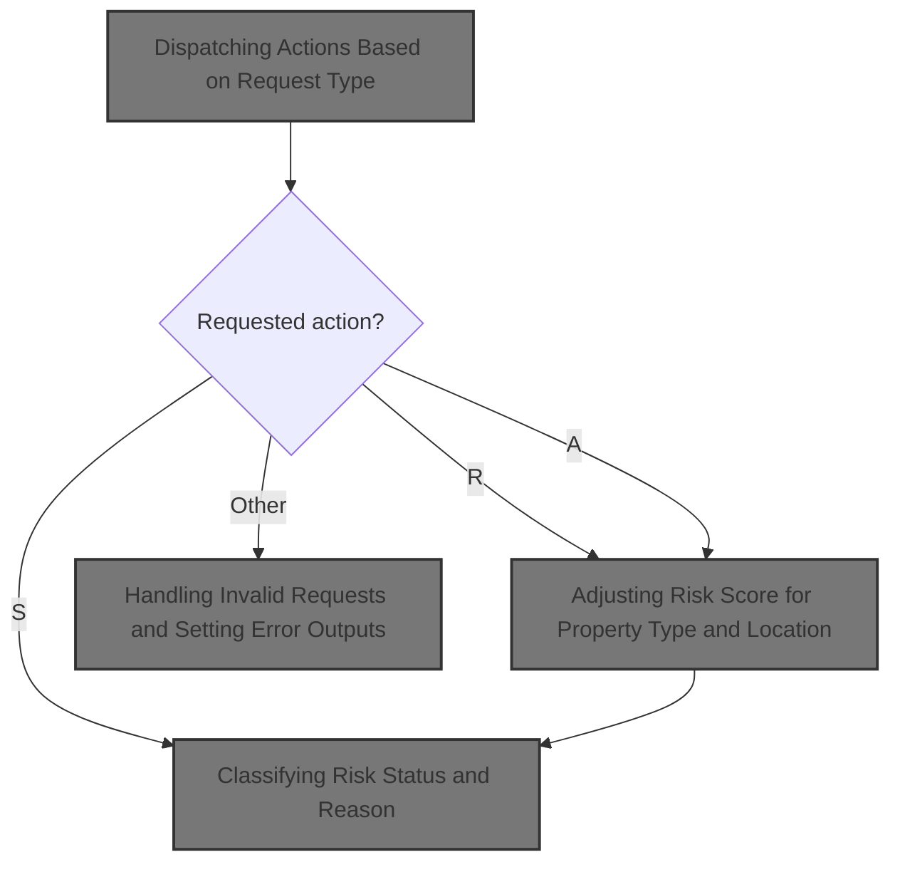
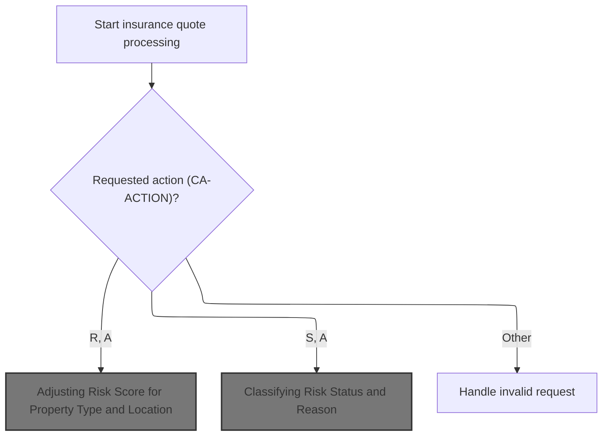
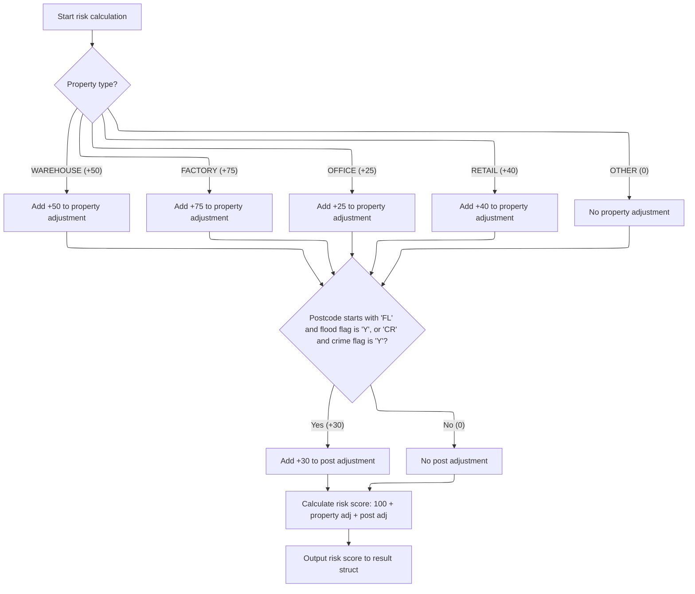
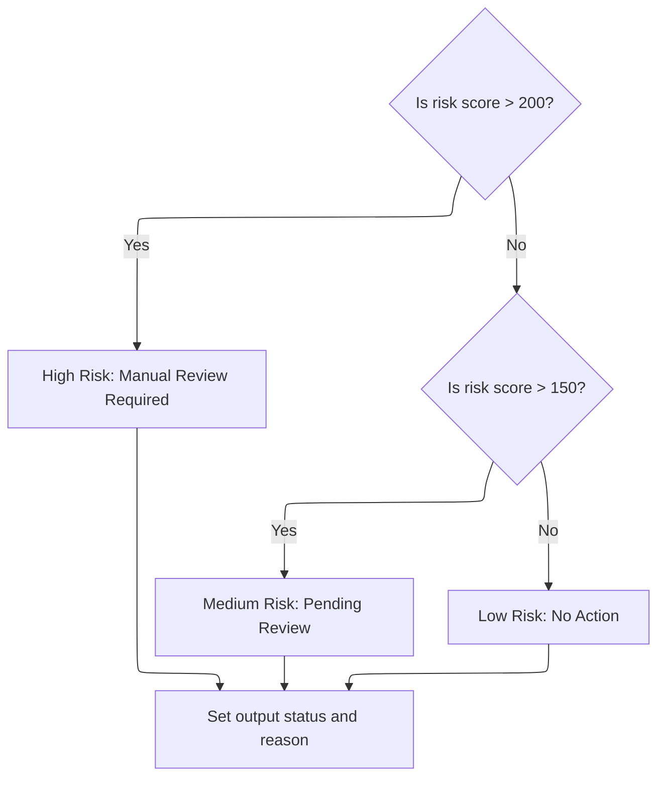

# Overview

This document explains the flow for processing insurance quote requests. The system receives property and location details, applies business rules to calculate risk scores, classify risk status, and determine premium values based on the requested action.



## Dependencies

### Program

- <SwmToken path="base/src/lgpcalc1.cbl" pos="2:6:6" line-data="       PROGRAM-ID. LGPCALC1.">`LGPCALC1`</SwmToken> (<SwmPath>[base/src/lgpcalc1.cbl](base/src/lgpcalc1.cbl)</SwmPath>)

## Detailed View of the Program's Functionality

## Dispatching Actions Based on Request Type

When the insurance quote processing begins, the code first initializes header information for the transaction, such as transaction ID, terminal ID, and task number. It then examines the incoming request type, which determines what kind of calculation or processing should be performed.

- If the request is for risk calculation or a full assessment (types 'R' or 'A'), the code first calculates the risk score for the property.
- If the request is for status determination ('S'), it classifies the risk status based on the risk score.
- If the request is for premium calculation ('P'), it calculates the insurance premiums.
- If the request is for a full assessment ('A'), it performs risk calculation, status determination, and premium calculation in sequence.
- If the request type is not recognized, it triggers error handling to set error outputs.

After processing, the code returns control to the calling system.

---

## Adjusting Risk Score for Property Type and Location

The risk calculation begins by resetting the property and postcode adjustment accumulators to zero.

1. **Property Type Adjustment**:

   - The code checks the property type provided in the request.
   - For recognized types:
     - Warehouse: Adds a fixed adjustment (+50) to the property risk.
     - Factory: Adds a larger adjustment (+75).
     - Office: Adds a smaller adjustment (+25).
     - Retail: Adds a moderate adjustment (+40).
   - If the property type is not recognized, no adjustment is made.

2. **Location-Based Adjustment**:

   - The code checks the first two characters of the postcode.
   - If the postcode starts with 'FL' and the flood risk flag is set, or starts with 'CR' and the crime risk flag is set, it adds a location-based adjustment (+30) to the risk.
   - If neither condition is met, no location adjustment is made.

3. **Total Risk Score Calculation**:

   - The code sums a base risk score (100), the property adjustment, and the postcode adjustment to get the total risk score.
   - This total risk score is then output to the result structure for use in subsequent calculations.

---

## Classifying Risk Status and Reason

The status determination logic uses the risk score to classify the risk level:

1. **High Risk**:

   - If the risk score is greater than 200, the status is set to "High Risk" and the reason is "Manual Review Required".

2. **Medium Risk**:

   - If the risk score is greater than 150 but not above 200, the status is set to "Medium Risk" and the reason is "Pending Review".

3. **Low Risk**:

   - If the risk score is 150 or below, the status is set to "Low Risk" and no reason is provided.

The status code and reason are then output to the result structure.

---

## Calculating Premiums

Premium calculation is performed if requested:

1. **Initialization**:

   - All premium accumulators are reset to zero.
   - A multiplier is set to <SwmToken path="base/src/lgpcalc1.cbl" pos="88:15:17" line-data="           03 WS-RT-MULTIPLIER         PIC V99 VALUE 1.00.">`1.00`</SwmToken>.

2. **Discount Application**:

   - If all peril factors (fire, crime, flood, weather) are present and greater than zero, a discount multiplier (<SwmToken path="base/src/lgpcalc1.cbl" pos="71:15:17" line-data="           03 WS-PF-DISCOUNT           PIC V99 VALUE 0.90.">`0.90`</SwmToken>) is applied.

3. **Premium Calculation for Each Peril**:

   - For each peril (fire, crime, flood, weather), if the corresponding factor is greater than zero:
     - The risk score is multiplied by a peril-specific factor.
     - The result is then multiplied by the peril factor and the multiplier to get the premium for that peril.

4. **Output**:

   - The calculated premiums for fire, crime, flood, and weather are output to the result structure.

---

## Handling Invalid Requests and Setting Error Outputs

If the request type is not recognized, error handling is triggered:

- The risk score is set to zero.
- The status is set to a special error code (9).
- The reason is set to "Invalid Processing Request".
- All premium outputs are set to zero.

This signals to the client or downstream logic that the request was invalid and no meaningful calculation was performed.

# Rule Definition

| Paragraph Name                                                                                                                                   | Rule ID | Category          | Description                                                                                                                                                                                                                                                                                                                                                                                                                                                                                                                                                                                                                                                                                                                                                                                | Conditions                                                                                                                                          | Remarks                                                                                                                                                                                                                                                                                                                                                                                                                                                                                                                                                                                                                                                                                                                                                                                                                                                                                                                                                                                                                                                                                                                                                                                                                                                                                                                                                                                                                                                                                                                                                                                       |
| ------------------------------------------------------------------------------------------------------------------------------------------------ | ------- | ----------------- | ------------------------------------------------------------------------------------------------------------------------------------------------------------------------------------------------------------------------------------------------------------------------------------------------------------------------------------------------------------------------------------------------------------------------------------------------------------------------------------------------------------------------------------------------------------------------------------------------------------------------------------------------------------------------------------------------------------------------------------------------------------------------------------------ | --------------------------------------------------------------------------------------------------------------------------------------------------- | --------------------------------------------------------------------------------------------------------------------------------------------------------------------------------------------------------------------------------------------------------------------------------------------------------------------------------------------------------------------------------------------------------------------------------------------------------------------------------------------------------------------------------------------------------------------------------------------------------------------------------------------------------------------------------------------------------------------------------------------------------------------------------------------------------------------------------------------------------------------------------------------------------------------------------------------------------------------------------------------------------------------------------------------------------------------------------------------------------------------------------------------------------------------------------------------------------------------------------------------------------------------------------------------------------------------------------------------------------------------------------------------------------------------------------------------------------------------------------------------------------------------------------------------------------------------------------------------- |
| <SwmToken path="base/src/lgpcalc1.cbl" pos="129:3:5" line-data="                 PERFORM RISK-CALCULATION">`RISK-CALCULATION`</SwmToken>         | RL-001  | Computation       | When <SwmToken path="base/src/lgpcalc1.cbl" pos="127:3:5" line-data="           EVALUATE CA-ACTION">`CA-ACTION`</SwmToken> is 'R' or 'A', the system calculates a risk score starting from a base value, adding adjustments for property type and postcode. Property type adjustment is case-sensitive and depends on <SwmToken path="base/src/lgpcalc1.cbl" pos="153:3:9" line-data="           EVALUATE CA-D-PROP-TYPE">`CA-D-PROP-TYPE`</SwmToken>. Postcode adjustment is applied if <SwmToken path="base/src/lgpcalc1.cbl" pos="170:4:8" line-data="           IF (CA-D-POSTCODE(1:2) = &#39;FL&#39; AND WS-EM-FL-FLAG = &#39;Y&#39;) OR">`CA-D-POSTCODE`</SwmToken> starts with 'FL' (flood) or 'CR' (crime), with internal flags always set to 'Y'. The total risk score is output. | <SwmToken path="base/src/lgpcalc1.cbl" pos="127:3:5" line-data="           EVALUATE CA-ACTION">`CA-ACTION`</SwmToken> = 'R' or 'A'                  | Base risk score: 100. Property adjustments: WAREHOUSE +50, FACTORY +75, OFFICE +25, RETAIL +40, other +0. Postcode adjustment: +30 if <SwmToken path="base/src/lgpcalc1.cbl" pos="170:4:8" line-data="           IF (CA-D-POSTCODE(1:2) = &#39;FL&#39; AND WS-EM-FL-FLAG = &#39;Y&#39;) OR">`CA-D-POSTCODE`</SwmToken>(1:2) = 'FL' and flood flag 'Y', or <SwmToken path="base/src/lgpcalc1.cbl" pos="170:4:8" line-data="           IF (CA-D-POSTCODE(1:2) = &#39;FL&#39; AND WS-EM-FL-FLAG = &#39;Y&#39;) OR">`CA-D-POSTCODE`</SwmToken>(1:2) = 'CR' and crime flag 'Y'. Output <SwmToken path="base/src/lgpcalc1.cbl" pos="179:11:17" line-data="           MOVE WS-CA-TOTAL TO CA-R-RISK-SCORE.">`CA-R-RISK-SCORE`</SwmToken> is a number (3 digits). All comparisons are case-sensitive.                                                                                                                                                                                                                                                                                                                                                                                                                                                                                                                                                                                                                                                                                                                                                                                                 |
| <SwmToken path="base/src/lgpcalc1.cbl" pos="131:3:5" line-data="                 PERFORM STATUS-DETERMINATION">`STATUS-DETERMINATION`</SwmToken> | RL-002  | Conditional Logic | When <SwmToken path="base/src/lgpcalc1.cbl" pos="127:3:5" line-data="           EVALUATE CA-ACTION">`CA-ACTION`</SwmToken> is 'S' or 'A', the system classifies the risk score into status and reason categories. If risk score > 200, status is 2 and reason is 'High Risk - Manual Review Required'. If risk score > 150 and <= 200, status is 1 and reason is 'Medium Risk - Pending Review'. If risk score <= 150, status is 0 and reason is 'Low Risk - No Action'.                                                                                                                                                                                                                                                                                                                   | <SwmToken path="base/src/lgpcalc1.cbl" pos="127:3:5" line-data="           EVALUATE CA-ACTION">`CA-ACTION`</SwmToken> = 'S' or 'A'                  | Status output: <SwmToken path="base/src/lgpcalc1.cbl" pos="204:11:15" line-data="           MOVE WS-CA-STATUS TO CA-R-STATUS.">`CA-R-STATUS`</SwmToken> (single digit number). Reason output: <SwmToken path="base/src/lgpcalc1.cbl" pos="205:11:15" line-data="           MOVE WS-CA-REASON TO CA-R-REASON.">`CA-R-REASON`</SwmToken> (string, 50 characters). Risk score is taken from <SwmToken path="base/src/lgpcalc1.cbl" pos="189:3:9" line-data="           IF CA-D-RISK-SCORE &gt; 200">`CA-D-RISK-SCORE`</SwmToken> (3 digits).                                                                                                                                                                                                                                                                                                                                                                                                                                                                                                                                                                                                                                                                                                                                                                                                                                                                                                                                                                                                                                                     |
| <SwmToken path="base/src/lgpcalc1.cbl" pos="133:3:5" line-data="                 PERFORM PREMIUM-CALCULATION">`PREMIUM-CALCULATION`</SwmToken>   | RL-003  | Computation       | When <SwmToken path="base/src/lgpcalc1.cbl" pos="127:3:5" line-data="           EVALUATE CA-ACTION">`CA-ACTION`</SwmToken> is 'P' or 'A', the system calculates premiums for four perils. For each peril, if the input factor is greater than zero, the premium is calculated as risk_score × peril_factor × peril_input_factor × multiplier. The multiplier is <SwmToken path="base/src/lgpcalc1.cbl" pos="71:15:17" line-data="           03 WS-PF-DISCOUNT           PIC V99 VALUE 0.90.">`0.90`</SwmToken> if all peril input factors are > 0, otherwise <SwmToken path="base/src/lgpcalc1.cbl" pos="88:15:17" line-data="           03 WS-RT-MULTIPLIER         PIC V99 VALUE 1.00.">`1.00`</SwmToken>. If input factor is zero or missing, premium is zero.                          | <SwmToken path="base/src/lgpcalc1.cbl" pos="127:3:5" line-data="           EVALUATE CA-ACTION">`CA-ACTION`</SwmToken> = 'P' or 'A'                  | Peril factors: Fire <SwmToken path="base/src/lgpcalc1.cbl" pos="73:15:17" line-data="              05 WS-PF-FIRE            PIC V99 VALUE 0.80.">`0.80`</SwmToken>, Crime <SwmToken path="base/src/lgpcalc1.cbl" pos="74:15:17" line-data="              05 WS-PF-CRIME           PIC V99 VALUE 0.60.">`0.60`</SwmToken>, Flood <SwmToken path="base/src/lgpcalc1.cbl" pos="75:15:17" line-data="              05 WS-PF-FLOOD           PIC V99 VALUE 1.20.">`1.20`</SwmToken>, Weather <SwmToken path="base/src/lgpcalc1.cbl" pos="71:15:17" line-data="           03 WS-PF-DISCOUNT           PIC V99 VALUE 0.90.">`0.90`</SwmToken>. Discount multiplier: <SwmToken path="base/src/lgpcalc1.cbl" pos="71:15:17" line-data="           03 WS-PF-DISCOUNT           PIC V99 VALUE 0.90.">`0.90`</SwmToken> if all input factors > 0, else <SwmToken path="base/src/lgpcalc1.cbl" pos="88:15:17" line-data="           03 WS-RT-MULTIPLIER         PIC V99 VALUE 1.00.">`1.00`</SwmToken>. Premium outputs: <SwmToken path="base/src/lgpcalc1.cbl" pos="263:7:13" line-data="           MOVE 0 TO CA-R-FIRE-PREM.">`CA-R-FIRE-PREM`</SwmToken>, <SwmToken path="base/src/lgpcalc1.cbl" pos="264:7:13" line-data="           MOVE 0 TO CA-R-CRIME-PREM.">`CA-R-CRIME-PREM`</SwmToken>, <SwmToken path="base/src/lgpcalc1.cbl" pos="265:7:13" line-data="           MOVE 0 TO CA-R-FLOOD-PREM.">`CA-R-FLOOD-PREM`</SwmToken>, <SwmToken path="base/src/lgpcalc1.cbl" pos="266:7:13" line-data="           MOVE 0 TO CA-R-WEATHER-PREM.">`CA-R-WEATHER-PREM`</SwmToken> (each 8 digits, number). |
| <SwmToken path="base/src/lgpcalc1.cbl" pos="139:3:5" line-data="                 PERFORM ERROR-PROCESSING">`ERROR-PROCESSING`</SwmToken>         | RL-004  | Conditional Logic | If <SwmToken path="base/src/lgpcalc1.cbl" pos="127:3:5" line-data="           EVALUATE CA-ACTION">`CA-ACTION`</SwmToken> is not 'R', 'S', 'P', or 'A', the system sets status to 9, reason to 'Invalid Processing Request', and all other output fields to zero.                                                                                                                                                                                                                                                                                                                                                                                                                                                                                                                           | <SwmToken path="base/src/lgpcalc1.cbl" pos="127:3:5" line-data="           EVALUATE CA-ACTION">`CA-ACTION`</SwmToken> not in \['R', 'S', 'P', 'A'\] | Status output: <SwmToken path="base/src/lgpcalc1.cbl" pos="204:11:15" line-data="           MOVE WS-CA-STATUS TO CA-R-STATUS.">`CA-R-STATUS`</SwmToken> = 9. Reason output: <SwmToken path="base/src/lgpcalc1.cbl" pos="205:11:15" line-data="           MOVE WS-CA-REASON TO CA-R-REASON.">`CA-R-REASON`</SwmToken> = 'Invalid Processing Request' (string, 50 characters). All other outputs (risk score, premiums) set to zero.                                                                                                                                                                                                                                                                                                                                                                                                                                                                                                                                                                                                                                                                                                                                                                                                                                                                                                                                                                                                                                                                                                                                                            |
| <SwmToken path="base/src/lgpcalc1.cbl" pos="129:3:5" line-data="                 PERFORM RISK-CALCULATION">`RISK-CALCULATION`</SwmToken>         | RL-005  | Conditional Logic | All comparisons for property type and postcode are case-sensitive. Only exact matches for 'WAREHOUSE', 'FACTORY', 'OFFICE', 'RETAIL', 'FL', and 'CR' trigger adjustments.                                                                                                                                                                                                                                                                                                                                                                                                                                                                                                                                                                                                                  | Any property type or postcode comparison                                                                                                            | Comparisons must use exact case as specified. No normalization or case conversion is performed.                                                                                                                                                                                                                                                                                                                                                                                                                                                                                                                                                                                                                                                                                                                                                                                                                                                                                                                                                                                                                                                                                                                                                                                                                                                                                                                                                                                                                                                                                               |
| <SwmToken path="base/src/lgpcalc1.cbl" pos="129:3:5" line-data="                 PERFORM RISK-CALCULATION">`RISK-CALCULATION`</SwmToken>         | RL-006  | Data Assignment   | Flood and crime flags used for postcode adjustment are internal and always set to 'Y'. No input is required for these flags.                                                                                                                                                                                                                                                                                                                                                                                                                                                                                                                                                                                                                                                               | Postcode adjustment logic                                                                                                                           | Flood flag: 'Y'. Crime flag: 'Y'. These are not part of input and are always set internally.                                                                                                                                                                                                                                                                                                                                                                                                                                                                                                                                                                                                                                                                                                                                                                                                                                                                                                                                                                                                                                                                                                                                                                                                                                                                                                                                                                                                                                                                                                  |

# User Stories

## User Story 1: Process insurance quote requests including risk calculation, status classification, premium calculation, and error handling

---

### Story Description:

As an insurance system, I want to process insurance quote requests by calculating risk scores, classifying risk status and reason, determining premiums for fire, crime, flood, and weather perils, and handling invalid requests by setting all outputs to zero and providing a clear error message so that users receive accurate, complete, and reliable insurance quotes or appropriate feedback for invalid requests.

---

### Business Rule Mapping:

| Rule ID | Paragraph Name                                                                                                                                   | Rule Description                                                                                                                                                                                                                                                                                                                                                                                                                                                                                                                                                                                                                                                                                                                                                                           |
| ------- | ------------------------------------------------------------------------------------------------------------------------------------------------ | ------------------------------------------------------------------------------------------------------------------------------------------------------------------------------------------------------------------------------------------------------------------------------------------------------------------------------------------------------------------------------------------------------------------------------------------------------------------------------------------------------------------------------------------------------------------------------------------------------------------------------------------------------------------------------------------------------------------------------------------------------------------------------------------ |
| RL-001  | <SwmToken path="base/src/lgpcalc1.cbl" pos="129:3:5" line-data="                 PERFORM RISK-CALCULATION">`RISK-CALCULATION`</SwmToken>         | When <SwmToken path="base/src/lgpcalc1.cbl" pos="127:3:5" line-data="           EVALUATE CA-ACTION">`CA-ACTION`</SwmToken> is 'R' or 'A', the system calculates a risk score starting from a base value, adding adjustments for property type and postcode. Property type adjustment is case-sensitive and depends on <SwmToken path="base/src/lgpcalc1.cbl" pos="153:3:9" line-data="           EVALUATE CA-D-PROP-TYPE">`CA-D-PROP-TYPE`</SwmToken>. Postcode adjustment is applied if <SwmToken path="base/src/lgpcalc1.cbl" pos="170:4:8" line-data="           IF (CA-D-POSTCODE(1:2) = &#39;FL&#39; AND WS-EM-FL-FLAG = &#39;Y&#39;) OR">`CA-D-POSTCODE`</SwmToken> starts with 'FL' (flood) or 'CR' (crime), with internal flags always set to 'Y'. The total risk score is output. |
| RL-005  | <SwmToken path="base/src/lgpcalc1.cbl" pos="129:3:5" line-data="                 PERFORM RISK-CALCULATION">`RISK-CALCULATION`</SwmToken>         | All comparisons for property type and postcode are case-sensitive. Only exact matches for 'WAREHOUSE', 'FACTORY', 'OFFICE', 'RETAIL', 'FL', and 'CR' trigger adjustments.                                                                                                                                                                                                                                                                                                                                                                                                                                                                                                                                                                                                                  |
| RL-006  | <SwmToken path="base/src/lgpcalc1.cbl" pos="129:3:5" line-data="                 PERFORM RISK-CALCULATION">`RISK-CALCULATION`</SwmToken>         | Flood and crime flags used for postcode adjustment are internal and always set to 'Y'. No input is required for these flags.                                                                                                                                                                                                                                                                                                                                                                                                                                                                                                                                                                                                                                                               |
| RL-002  | <SwmToken path="base/src/lgpcalc1.cbl" pos="131:3:5" line-data="                 PERFORM STATUS-DETERMINATION">`STATUS-DETERMINATION`</SwmToken> | When <SwmToken path="base/src/lgpcalc1.cbl" pos="127:3:5" line-data="           EVALUATE CA-ACTION">`CA-ACTION`</SwmToken> is 'S' or 'A', the system classifies the risk score into status and reason categories. If risk score > 200, status is 2 and reason is 'High Risk - Manual Review Required'. If risk score > 150 and <= 200, status is 1 and reason is 'Medium Risk - Pending Review'. If risk score <= 150, status is 0 and reason is 'Low Risk - No Action'.                                                                                                                                                                                                                                                                                                                   |
| RL-004  | <SwmToken path="base/src/lgpcalc1.cbl" pos="139:3:5" line-data="                 PERFORM ERROR-PROCESSING">`ERROR-PROCESSING`</SwmToken>         | If <SwmToken path="base/src/lgpcalc1.cbl" pos="127:3:5" line-data="           EVALUATE CA-ACTION">`CA-ACTION`</SwmToken> is not 'R', 'S', 'P', or 'A', the system sets status to 9, reason to 'Invalid Processing Request', and all other output fields to zero.                                                                                                                                                                                                                                                                                                                                                                                                                                                                                                                           |
| RL-003  | <SwmToken path="base/src/lgpcalc1.cbl" pos="133:3:5" line-data="                 PERFORM PREMIUM-CALCULATION">`PREMIUM-CALCULATION`</SwmToken>   | When <SwmToken path="base/src/lgpcalc1.cbl" pos="127:3:5" line-data="           EVALUATE CA-ACTION">`CA-ACTION`</SwmToken> is 'P' or 'A', the system calculates premiums for four perils. For each peril, if the input factor is greater than zero, the premium is calculated as risk_score × peril_factor × peril_input_factor × multiplier. The multiplier is <SwmToken path="base/src/lgpcalc1.cbl" pos="71:15:17" line-data="           03 WS-PF-DISCOUNT           PIC V99 VALUE 0.90.">`0.90`</SwmToken> if all peril input factors are > 0, otherwise <SwmToken path="base/src/lgpcalc1.cbl" pos="88:15:17" line-data="           03 WS-RT-MULTIPLIER         PIC V99 VALUE 1.00.">`1.00`</SwmToken>. If input factor is zero or missing, premium is zero.                          |

---

### Relevant Functionality:

- <SwmToken path="base/src/lgpcalc1.cbl" pos="129:3:5" line-data="                 PERFORM RISK-CALCULATION">`RISK-CALCULATION`</SwmToken>
  1. **RL-001:**
     - Set property adjustment to 0
     - Set postcode adjustment to 0
     - If property type is 'WAREHOUSE', add 50 If 'FACTORY', add 75 If 'OFFICE', add 25 If 'RETAIL', add 40 Else, add 0
     - If postcode starts with 'FL' and flood flag is 'Y', add 30 If postcode starts with 'CR' and crime flag is 'Y', add 30
     - Total risk score = base + property adjustment + postcode adjustment
     - Output total risk score
  2. **RL-005:**
     - When comparing property type or postcode, use exact case
     - Only apply adjustments for exact matches
  3. **RL-006:**
     - Set flood flag to 'Y'
     - Set crime flag to 'Y'
     - Use these flags in postcode adjustment logic
- <SwmToken path="base/src/lgpcalc1.cbl" pos="131:3:5" line-data="                 PERFORM STATUS-DETERMINATION">`STATUS-DETERMINATION`</SwmToken>
  1. **RL-002:**
     - If risk score > 200: Set status to 2 Set reason to 'High Risk Score - Manual Review Required'
     - Else if risk score > 150: Set status to 1 Set reason to 'Medium Risk - Pending Review'
     - Else: Set status to 0 Set reason to spaces
     - Output status and reason
- <SwmToken path="base/src/lgpcalc1.cbl" pos="139:3:5" line-data="                 PERFORM ERROR-PROCESSING">`ERROR-PROCESSING`</SwmToken>
  1. **RL-004:**
     - Set risk score to 0
     - Set status to 9
     - Set reason to 'Invalid Processing Request'
     - Set all premiums to 0
     - Output all fields
- <SwmToken path="base/src/lgpcalc1.cbl" pos="133:3:5" line-data="                 PERFORM PREMIUM-CALCULATION">`PREMIUM-CALCULATION`</SwmToken>
  1. **RL-003:**
     - Set multiplier to <SwmToken path="base/src/lgpcalc1.cbl" pos="88:15:17" line-data="           03 WS-RT-MULTIPLIER         PIC V99 VALUE 1.00.">`1.00`</SwmToken>
     - If all peril input factors > 0, set multiplier to <SwmToken path="base/src/lgpcalc1.cbl" pos="71:15:17" line-data="           03 WS-PF-DISCOUNT           PIC V99 VALUE 0.90.">`0.90`</SwmToken>
     - For each peril: If input factor > 0: premium = risk_score × peril_factor × input_factor × multiplier Else: premium = 0
     - Output premiums for each peril

# Workflow

# Dispatching Actions Based on Request Type



This section governs how insurance quote requests are dispatched to the appropriate calculation logic based on the requested action type. It ensures that the correct business logic is executed for risk, status, premium, or error handling, and that outputs are populated accordingly.

| Category       | Rule Name                             | Description                                                                                                                                                                                         |
| -------------- | ------------------------------------- | --------------------------------------------------------------------------------------------------------------------------------------------------------------------------------------------------- |
| Business logic | Risk Score Calculation for 'R' Action | If the requested action is 'R', the system must calculate the risk score for the property using its type and postcode, and output the score in the result.                                          |
| Business logic | Status Determination for 'S' Action   | If the requested action is 'S', the system must determine the risk status and reason using the risk score from the quote data, and output these in the result.                                      |
| Business logic | Premium Calculation for 'P' Action    | If the requested action is 'P', the system must calculate the premium for the quote and output the premium values in the result.                                                                    |
| Business logic | Full Quote Processing for 'A' Action  | If the requested action is 'A', the system must calculate the risk score, determine the risk status and reason, and calculate the premium, in that order, outputting all results in the quote data. |

<SwmSnippet path="/base/src/lgpcalc1.cbl" line="120">

---

MAINLINE kicks off the flow by checking <SwmToken path="base/src/lgpcalc1.cbl" pos="127:3:5" line-data="           EVALUATE CA-ACTION">`CA-ACTION`</SwmToken> and routing to the relevant calculation: risk, status, premium, or error handling. For actions that need a risk score (like 'R' or 'A'), it calls <SwmToken path="base/src/lgpcalc1.cbl" pos="129:3:5" line-data="                 PERFORM RISK-CALCULATION">`RISK-CALCULATION`</SwmToken> first, since the risk score is required for downstream logic like status and premium calculations.

```cobol
       MAINLINE SECTION.
           
           INITIALIZE WS-HEADER.
           MOVE EIBTRNID TO WS-TRANSID.
           MOVE EIBTRMID TO WS-TERMID.
           MOVE EIBTASKN TO WS-TASKNUM.
           
           EVALUATE CA-ACTION
              WHEN 'R'
                 PERFORM RISK-CALCULATION
              WHEN 'S'
                 PERFORM STATUS-DETERMINATION
              WHEN 'P'
                 PERFORM PREMIUM-CALCULATION
              WHEN 'A'
                 PERFORM RISK-CALCULATION
                 PERFORM STATUS-DETERMINATION
                 PERFORM PREMIUM-CALCULATION
              WHEN OTHER
                 PERFORM ERROR-PROCESSING
           END-EVALUATE.
           
           EXEC CICS RETURN END-EXEC.
```

---

</SwmSnippet>

## Adjusting Risk Score for Property Type and Location



This section determines the risk score for a property by applying specific adjustments based on the property's type and its location. The adjustments are layered on top of a base score to reflect both property and geographic risk factors.

| Category       | Rule Name                | Description                                                                                                                                                         |
| -------------- | ------------------------ | ------------------------------------------------------------------------------------------------------------------------------------------------------------------- |
| Business logic | Base risk score          | The base risk score for all properties is set to 100 before any adjustments are applied.                                                                            |
| Business logic | Property type adjustment | A property type adjustment is added to the risk score based on the property type: WAREHOUSE (+50), FACTORY (+75), OFFICE (+25), RETAIL (+40), OTHER (0).            |
| Business logic | Location risk adjustment | If the postcode starts with 'FL' and the flood flag is 'Y', or starts with 'CR' and the crime flag is 'Y', a location adjustment of +30 is added to the risk score. |
| Business logic | No location adjustment   | If the postcode does not meet the criteria for flood or crime risk, no location adjustment is applied to the risk score.                                            |
| Business logic | Risk score calculation   | The final risk score is calculated as the sum of the base score, property type adjustment, and location adjustment.                                                 |
| Technical step | Risk score output        | The calculated risk score is output to the result struct for use in subsequent business processes.                                                                  |

<SwmSnippet path="/base/src/lgpcalc1.cbl" line="149">

---

In <SwmToken path="base/src/lgpcalc1.cbl" pos="149:1:3" line-data="       RISK-CALCULATION.">`RISK-CALCULATION`</SwmToken>, the code checks the property type and adds a specific adjustment to the risk accumulator for recognized types. This sets up the property-specific risk before any location-based adjustments.

```cobol
       RISK-CALCULATION.
           MOVE 0 TO WS-CA-PROP-ADJ.
           MOVE 0 TO WS-CA-POST-ADJ.
           
           EVALUATE CA-D-PROP-TYPE
              WHEN 'WAREHOUSE'
                 COMPUTE WS-RT-TEMP1 = WS-EM-ADJUST-1 - 0
                 ADD WS-RT-TEMP1 TO WS-CA-PROP-ADJ
              WHEN 'FACTORY'
                 COMPUTE WS-RT-TEMP1 = WS-EM-ADJUST-2 - 0
                 ADD WS-RT-TEMP1 TO WS-CA-PROP-ADJ
              WHEN 'OFFICE'
                 COMPUTE WS-RT-TEMP1 = WS-EM-ADJUST-3 - 0
                 ADD WS-RT-TEMP1 TO WS-CA-PROP-ADJ
              WHEN 'RETAIL'
                 COMPUTE WS-RT-TEMP1 = WS-EM-ADJUST-4 - 0
                 ADD WS-RT-TEMP1 TO WS-CA-PROP-ADJ
              WHEN OTHER
                 CONTINUE
           END-EVALUATE.
```

---

</SwmSnippet>

<SwmSnippet path="/base/src/lgpcalc1.cbl" line="170">

---

After property type adjustment, <SwmToken path="base/src/lgpcalc1.cbl" pos="129:3:5" line-data="                 PERFORM RISK-CALCULATION">`RISK-CALCULATION`</SwmToken> checks if the postcode starts with 'FL' or 'CR' and if the corresponding flag is set. If so, it adds a location-based adjustment to the risk accumulator, layering geographic risk on top of property risk.

```cobol
           IF (CA-D-POSTCODE(1:2) = 'FL' AND WS-EM-FL-FLAG = 'Y') OR
              (CA-D-POSTCODE(1:2) = 'CR' AND WS-EM-CR-FLAG = 'Y')
              COMPUTE WS-RT-TEMP1 = WS-EM-POST-ADJUSTMENT - 0
              ADD WS-RT-TEMP1 TO WS-CA-POST-ADJ
           END-IF.
```

---

</SwmSnippet>

<SwmSnippet path="/base/src/lgpcalc1.cbl" line="176">

---

After all adjustments, <SwmToken path="base/src/lgpcalc1.cbl" pos="129:3:5" line-data="                 PERFORM RISK-CALCULATION">`RISK-CALCULATION`</SwmToken> sums the base score, property adjustment, and postcode adjustment to get the total risk score, then outputs it for use in later calculations.

```cobol
           COMPUTE WS-CA-TOTAL = 
              WS-CA-BASE + WS-CA-PROP-ADJ + WS-CA-POST-ADJ.
              
           MOVE WS-CA-TOTAL TO CA-R-RISK-SCORE.
           
           EXIT.
```

---

</SwmSnippet>

## Classifying Risk Status and Reason



This section classifies the risk level of an insurance application based on the calculated risk score. It assigns a status code and a descriptive reason to indicate whether the application is considered high, medium, or low risk.

| Category       | Rule Name                  | Description                                                                                                                                                                                        |
| -------------- | -------------------------- | -------------------------------------------------------------------------------------------------------------------------------------------------------------------------------------------------- |
| Business logic | High risk classification   | If the risk score is greater than 200, the application is classified as high risk. The status code is set to 2 and the reason is set to 'High Risk Score - Manual Review Required'.                |
| Business logic | Medium risk classification | If the risk score is greater than 150 but not greater than 200, the application is classified as medium risk. The status code is set to 1 and the reason is set to 'Medium Risk - Pending Review'. |
| Business logic | Low risk classification    | If the risk score is 150 or less, the application is classified as low risk. The status code is set to 0 and the reason is left blank.                                                             |

<SwmSnippet path="/base/src/lgpcalc1.cbl" line="185">

---

In <SwmToken path="base/src/lgpcalc1.cbl" pos="185:1:3" line-data="       STATUS-DETERMINATION.">`STATUS-DETERMINATION`</SwmToken>, the code checks the risk score against two thresholds and sets the risk status and reason accordingly. This step classifies the risk for later use.

```cobol
       STATUS-DETERMINATION.
           MOVE 0 TO WS-CA-STATUS.
           MOVE SPACES TO WS-CA-REASON.
           
           IF CA-D-RISK-SCORE > 200
              MOVE 2 TO WS-CA-STATUS
              MOVE 'High Risk Score - Manual Review Required' 
                TO WS-CA-REASON
           ELSE
              IF CA-D-RISK-SCORE > 150
                 MOVE 1 TO WS-CA-STATUS
                 MOVE 'Medium Risk - Pending Review'
                   TO WS-CA-REASON
              ELSE
                 MOVE 0 TO WS-CA-STATUS
                 MOVE SPACES TO WS-CA-REASON
              END-IF
```

---

</SwmSnippet>

<SwmSnippet path="/base/src/lgpcalc1.cbl" line="202">

---

<SwmToken path="base/src/lgpcalc1.cbl" pos="131:3:5" line-data="                 PERFORM STATUS-DETERMINATION">`STATUS-DETERMINATION`</SwmToken> outputs the status code and reason string to the result fields, making them available for the client or downstream logic.

```cobol
           END-IF.
           
           MOVE WS-CA-STATUS TO CA-R-STATUS.
           MOVE WS-CA-REASON TO CA-R-REASON.
           
           EXIT.
```

---

</SwmSnippet>

## Handling Invalid Requests and Setting Error Outputs

<SwmSnippet path="/base/src/lgpcalc1.cbl" line="259">

---

<SwmToken path="base/src/lgpcalc1.cbl" pos="259:1:3" line-data="       ERROR-PROCESSING.">`ERROR-PROCESSING`</SwmToken> writes error codes and zeroed outputs to signal an invalid request.

```cobol
       ERROR-PROCESSING.
           MOVE 0 TO CA-R-RISK-SCORE.
           MOVE 9 TO CA-R-STATUS.
           MOVE 'Invalid Processing Request' TO CA-R-REASON.
           MOVE 0 TO CA-R-FIRE-PREM.
           MOVE 0 TO CA-R-CRIME-PREM.
           MOVE 0 TO CA-R-FLOOD-PREM.
           MOVE 0 TO CA-R-WEATHER-PREM.
           
           EXIT.
```

---

</SwmSnippet>

&nbsp;

*This is an auto-generated document by Swimm 🌊 and has not yet been verified by a human*

<SwmMeta version="3.0.0" repo-id="Z2l0aHViJTNBJTNBU3dpbW1pby1nZW5hcHAtbW90b3IlM0ElM0FHaXJpLVN3aW1t" repo-name="Swimmio-genapp-motor"><sup>Powered by [Swimm](https://app.swimm.io/)</sup></SwmMeta>
