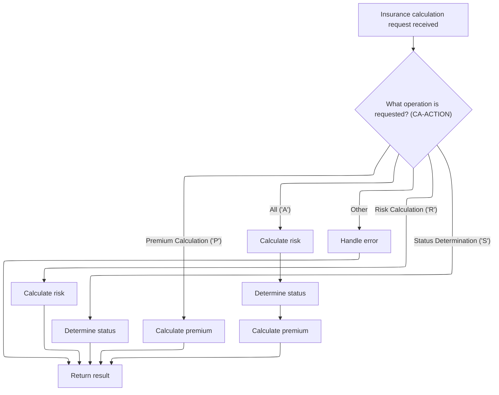
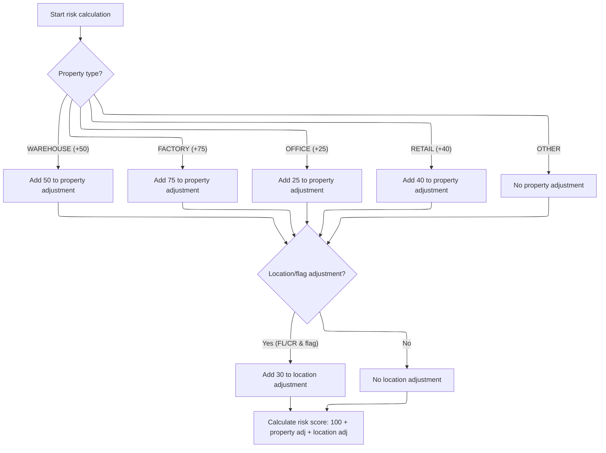
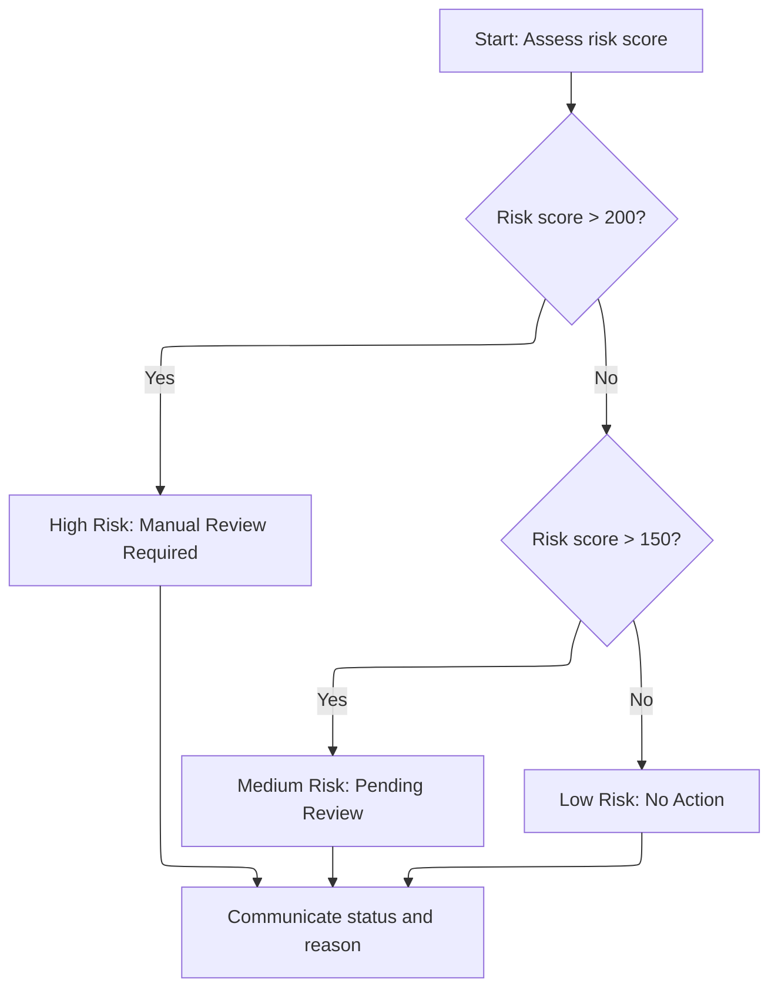

# Overview

This document explains the flow for processing insurance calculation requests. Based on the action code, the flow performs risk assessment, status determination, premium calculation, or all three in sequence, using property and location details to determine risk and pricing outcomes.

## Dependencies

### Program

- <SwmToken path="base/src/lgpcalc1.cbl" pos="2:6:6" line-data="       PROGRAM-ID. LGPCALC1.">`LGPCALC1`</SwmToken> (<SwmPath>[base/src/lgpcalc1.cbl](base/src/lgpcalc1.cbl)</SwmPath>)

## Detailed View of the Program's Functionality

## Dispatching Actions Based on Request Type

When a request for insurance calculation is received, the program begins by initializing header information and copying transaction, terminal, and task identifiers into working storage. It then examines the type of operation requested, which is indicated by a specific action code.

Depending on the action code:

- If the request is for risk calculation, the program performs the risk calculation routine.
- If the request is for status determination, it performs the status determination routine.
- If the request is for premium calculation, it performs the premium calculation routine.
- If the request is for all operations, it performs risk calculation first, then status determination, and finally premium calculation, in that order.
- If the action code is unrecognized, it performs error handling.

After the appropriate routine(s) are executed, the program returns control to the calling system.

---

## Calculating Property and Location Risk Adjustments

When the risk calculation routine is triggered, the program starts by resetting the property and location adjustment values to zero.

Next, it checks the type of property involved in the request:

- If the property is a warehouse, it adds a specific adjustment value to the property adjustment.
- If the property is a factory, it adds a higher adjustment value.
- If the property is an office, it adds a smaller adjustment value.
- If the property is retail, it adds a moderate adjustment value.
- If the property type is not recognized, no adjustment is made.

After determining the property adjustment, the program checks the location:

- If the postcode starts with certain prefixes (such as 'FL' or 'CR') and the corresponding flag is set, it adds an additional adjustment to the location adjustment.
- If these conditions are not met, no location adjustment is made.

Finally, the program calculates the total risk score by summing a base value, the property adjustment, and the location adjustment. This total risk score is then stored for use in subsequent processing.

---

## Assigning Risk Status and Reason

When the status determination routine is triggered, the program begins by resetting the status and reason fields.

It then assesses the risk score:

- If the risk score exceeds a high threshold, the status is set to indicate high risk, and the reason specifies that manual review is required.
- If the risk score is above a medium threshold but not the high threshold, the status is set to medium risk, and the reason indicates that the case is pending review.
- If the risk score is below the medium threshold, the status is set to low risk, and the reason is left blank.

After determining the status and reason, these values are copied to the output fields so they can be returned to the requester or used in further processing.

---

## Calculating Premiums

When the premium calculation routine is triggered, the program resets all premium values and sets a multiplier to its default value.

If all peril factors (fire, crime, flood, weather) are present and greater than zero, a discount multiplier is applied.

For each peril type:

- If the corresponding factor is greater than zero, the program calculates a temporary value by multiplying the risk score by a peril-specific factor.
- It then calculates the premium for that peril by multiplying the temporary value by the peril factor and the multiplier.
- The calculated premium is stored for each peril type.

After all premiums are calculated, they are copied to the output fields for use in subsequent processing or for returning to the requester.

---

## Handling Errors

If an unrecognized action code is received, the error handling routine is triggered.

In this routine:

- The risk score is set to zero.
- The status is set to a value indicating an error.
- The reason is set to a message indicating an invalid processing request.
- All premium values are set to zero.

This ensures that the output clearly indicates that the request was not processed due to an invalid action code.

# Rule Definition

| Paragraph Name                                                                                                                                                   | Rule ID | Category          | Description                                                                                                                                                                                                                                                                                                                                                                                                                                                                                                     | Conditions                                                                                                                                                              | Remarks                                                                                                                                                                                                                                                                                                                                                                                                                                                                                                                                                                                                                                                                                                                                                                                                                                                                                                                                                                                                                                                                                |
| ---------------------------------------------------------------------------------------------------------------------------------------------------------------- | ------- | ----------------- | --------------------------------------------------------------------------------------------------------------------------------------------------------------------------------------------------------------------------------------------------------------------------------------------------------------------------------------------------------------------------------------------------------------------------------------------------------------------------------------------------------------- | ----------------------------------------------------------------------------------------------------------------------------------------------------------------------- | -------------------------------------------------------------------------------------------------------------------------------------------------------------------------------------------------------------------------------------------------------------------------------------------------------------------------------------------------------------------------------------------------------------------------------------------------------------------------------------------------------------------------------------------------------------------------------------------------------------------------------------------------------------------------------------------------------------------------------------------------------------------------------------------------------------------------------------------------------------------------------------------------------------------------------------------------------------------------------------------------------------------------------------------------------------------------------------- |
| MAINLINE SECTION (lines 127-140)                                                                                                                                 | RL-001  | Conditional Logic | The program determines which operation(s) to perform based on the value of the <SwmToken path="base/src/lgpcalc1.cbl" pos="127:3:5" line-data="           EVALUATE CA-ACTION">`CA-ACTION`</SwmToken> input field. It supports risk calculation, status determination, premium calculation, all in sequence, or error handling for invalid actions.                                                                                                                                                              | <SwmToken path="base/src/lgpcalc1.cbl" pos="127:3:5" line-data="           EVALUATE CA-ACTION">`CA-ACTION`</SwmToken> is one of 'R', 'S', 'P', 'A', or any other value. | <SwmToken path="base/src/lgpcalc1.cbl" pos="127:3:5" line-data="           EVALUATE CA-ACTION">`CA-ACTION`</SwmToken> is a single character. Outputs are written to <SwmToken path="base/src/lgpcalc1.cbl" pos="105:3:5" line-data="           03 CA-RESULT.">`CA-RESULT`</SwmToken>, which includes numeric and alphanumeric fields as specified in the linkage section.                                                                                                                                                                                                                                                                                                                                                                                                                                                                                                                                                                                                                                                                                                              |
| <SwmToken path="base/src/lgpcalc1.cbl" pos="129:3:5" line-data="                 PERFORM RISK-CALCULATION">`RISK-CALCULATION`</SwmToken> (lines 150-180)         | RL-002  | Computation       | Calculates the risk score by adjusting a base value according to property type and postcode. Property adjustment is based on <SwmToken path="base/src/lgpcalc1.cbl" pos="153:3:9" line-data="           EVALUATE CA-D-PROP-TYPE">`CA-D-PROP-TYPE`</SwmToken>, and location adjustment is based on the first two characters of <SwmToken path="base/src/lgpcalc1.cbl" pos="170:4:8" line-data="           IF (CA-D-POSTCODE(1:2) = &#39;FL&#39; AND WS-EM-FL-FLAG = &#39;Y&#39;) OR">`CA-D-POSTCODE`</SwmToken>. | <SwmToken path="base/src/lgpcalc1.cbl" pos="127:3:5" line-data="           EVALUATE CA-ACTION">`CA-ACTION`</SwmToken> is 'R' or 'A'.                                    | Property adjustments: WAREHOUSE=50, FACTORY=75, OFFICE=25, RETAIL=40, other=0. Location adjustment: 30 if postcode starts with 'FL' or 'CR'. Base risk score is 100. Output risk score is numeric (3 digits).                                                                                                                                                                                                                                                                                                                                                                                                                                                                                                                                                                                                                                                                                                                                                                                                                                                                          |
| <SwmToken path="base/src/lgpcalc1.cbl" pos="131:3:5" line-data="                 PERFORM STATUS-DETERMINATION">`STATUS-DETERMINATION`</SwmToken> (lines 185-207) | RL-003  | Conditional Logic | Sets the status and reason fields based on the risk score. High, medium, and low risk thresholds are used to determine the output values.                                                                                                                                                                                                                                                                                                                                                                       | <SwmToken path="base/src/lgpcalc1.cbl" pos="127:3:5" line-data="           EVALUATE CA-ACTION">`CA-ACTION`</SwmToken> is 'S' or 'A'.                                    | Risk score is a 3-digit number. Status is a single digit (0, 1, 2). Reason is a 50-character string. Thresholds: >200=2/'High Risk Score - Manual Review Required', >150=1/'Medium Risk - Pending Review', <=150=0/blank.                                                                                                                                                                                                                                                                                                                                                                                                                                                                                                                                                                                                                                                                                                                                                                                                                                                              |
| <SwmToken path="base/src/lgpcalc1.cbl" pos="133:3:5" line-data="                 PERFORM PREMIUM-CALCULATION">`PREMIUM-CALCULATION`</SwmToken> (lines 211-255)   | RL-004  | Computation       | Calculates premiums for fire, crime, flood, and weather perils using the risk score, peril base multipliers, peril input factors, and an overall multiplier. The overall multiplier is discounted if all peril factors are present and greater than zero.                                                                                                                                                                                                                                                       | <SwmToken path="base/src/lgpcalc1.cbl" pos="127:3:5" line-data="           EVALUATE CA-ACTION">`CA-ACTION`</SwmToken> is 'P' or 'A'.                                    | Peril base multipliers: fire=<SwmToken path="base/src/lgpcalc1.cbl" pos="73:15:17" line-data="              05 WS-PF-FIRE            PIC V99 VALUE 0.80.">`0.80`</SwmToken>, crime=<SwmToken path="base/src/lgpcalc1.cbl" pos="74:15:17" line-data="              05 WS-PF-CRIME           PIC V99 VALUE 0.60.">`0.60`</SwmToken>, flood=<SwmToken path="base/src/lgpcalc1.cbl" pos="75:15:17" line-data="              05 WS-PF-FLOOD           PIC V99 VALUE 1.20.">`1.20`</SwmToken>, weather=<SwmToken path="base/src/lgpcalc1.cbl" pos="71:15:17" line-data="           03 WS-PF-DISCOUNT           PIC V99 VALUE 0.90.">`0.90`</SwmToken>. Overall multiplier: <SwmToken path="base/src/lgpcalc1.cbl" pos="71:15:17" line-data="           03 WS-PF-DISCOUNT           PIC V99 VALUE 0.90.">`0.90`</SwmToken> if all peril factors > 0, else <SwmToken path="base/src/lgpcalc1.cbl" pos="88:15:17" line-data="           03 WS-RT-MULTIPLIER         PIC V99 VALUE 1.00.">`1.00`</SwmToken>. Premiums are 8-digit numbers. Only calculate premium for a peril if its factor > 0. |
| <SwmToken path="base/src/lgpcalc1.cbl" pos="139:3:5" line-data="                 PERFORM ERROR-PROCESSING">`ERROR-PROCESSING`</SwmToken> (lines 259-268)         | RL-005  | Data Assignment   | If the action is not recognized, set status to 9, reason to 'Invalid Processing Request', and all numeric outputs to zero.                                                                                                                                                                                                                                                                                                                                                                                      | <SwmToken path="base/src/lgpcalc1.cbl" pos="127:3:5" line-data="           EVALUATE CA-ACTION">`CA-ACTION`</SwmToken> is not 'R', 'S', 'P', or 'A'.                     | Status is 9. Reason is 'Invalid Processing Request'. All premiums and risk score are zeroed. Output fields are as specified in the linkage section.                                                                                                                                                                                                                                                                                                                                                                                                                                                                                                                                                                                                                                                                                                                                                                                                                                                                                                                                    |

# User Stories

## User Story 1: Perform all calculations in sequence for comprehensive processing

---

### Story Description:

As a system, I want to perform risk calculation, status determination, and premium calculation in sequence for an insurance request so that I can provide a complete assessment and pricing in a single operation.

---

### Business Rule Mapping:

| Rule ID | Paragraph Name                                                                                                                                                   | Rule Description                                                                                                                                                                                                                                                                                                                                                                                                                                                                                                |
| ------- | ---------------------------------------------------------------------------------------------------------------------------------------------------------------- | --------------------------------------------------------------------------------------------------------------------------------------------------------------------------------------------------------------------------------------------------------------------------------------------------------------------------------------------------------------------------------------------------------------------------------------------------------------------------------------------------------------- |
| RL-001  | MAINLINE SECTION (lines 127-140)                                                                                                                                 | The program determines which operation(s) to perform based on the value of the <SwmToken path="base/src/lgpcalc1.cbl" pos="127:3:5" line-data="           EVALUATE CA-ACTION">`CA-ACTION`</SwmToken> input field. It supports risk calculation, status determination, premium calculation, all in sequence, or error handling for invalid actions.                                                                                                                                                              |
| RL-002  | <SwmToken path="base/src/lgpcalc1.cbl" pos="129:3:5" line-data="                 PERFORM RISK-CALCULATION">`RISK-CALCULATION`</SwmToken> (lines 150-180)         | Calculates the risk score by adjusting a base value according to property type and postcode. Property adjustment is based on <SwmToken path="base/src/lgpcalc1.cbl" pos="153:3:9" line-data="           EVALUATE CA-D-PROP-TYPE">`CA-D-PROP-TYPE`</SwmToken>, and location adjustment is based on the first two characters of <SwmToken path="base/src/lgpcalc1.cbl" pos="170:4:8" line-data="           IF (CA-D-POSTCODE(1:2) = &#39;FL&#39; AND WS-EM-FL-FLAG = &#39;Y&#39;) OR">`CA-D-POSTCODE`</SwmToken>. |
| RL-003  | <SwmToken path="base/src/lgpcalc1.cbl" pos="131:3:5" line-data="                 PERFORM STATUS-DETERMINATION">`STATUS-DETERMINATION`</SwmToken> (lines 185-207) | Sets the status and reason fields based on the risk score. High, medium, and low risk thresholds are used to determine the output values.                                                                                                                                                                                                                                                                                                                                                                       |
| RL-004  | <SwmToken path="base/src/lgpcalc1.cbl" pos="133:3:5" line-data="                 PERFORM PREMIUM-CALCULATION">`PREMIUM-CALCULATION`</SwmToken> (lines 211-255)   | Calculates premiums for fire, crime, flood, and weather perils using the risk score, peril base multipliers, peril input factors, and an overall multiplier. The overall multiplier is discounted if all peril factors are present and greater than zero.                                                                                                                                                                                                                                                       |

---

### Relevant Functionality:

- **MAINLINE SECTION (lines 127-140)**
  1. **RL-001:**
     - Read <SwmToken path="base/src/lgpcalc1.cbl" pos="127:3:5" line-data="           EVALUATE CA-ACTION">`CA-ACTION`</SwmToken> from input
     - If 'R', perform risk calculation
     - If 'S', perform status determination
     - If 'P', perform premium calculation
     - If 'A', perform risk calculation, then status determination, then premium calculation
     - Otherwise, perform error processing (set error status, reason, and zero outputs)
- <SwmToken path="base/src/lgpcalc1.cbl" pos="129:3:5" line-data="                 PERFORM RISK-CALCULATION">`RISK-CALCULATION`</SwmToken> **(lines 150-180)**
  1. **RL-002:**
     - Set property adjustment to 0
     - Set location adjustment to 0
     - If property type is 'WAREHOUSE', add 50 to property adjustment
     - If 'FACTORY', add 75
     - If 'OFFICE', add 25
     - If 'RETAIL', add 40
     - If postcode starts with 'FL' or 'CR', add 30 to location adjustment
     - Risk score = 100 + property adjustment + location adjustment
     - Write risk score to output field
- <SwmToken path="base/src/lgpcalc1.cbl" pos="131:3:5" line-data="                 PERFORM STATUS-DETERMINATION">`STATUS-DETERMINATION`</SwmToken> **(lines 185-207)**
  1. **RL-003:**
     - If risk score > 200, set status to 2 and reason to 'High Risk Score - Manual Review Required'
     - Else if risk score > 150, set status to 1 and reason to 'Medium Risk - Pending Review'
     - Else, set status to 0 and reason to blank
     - Write status and reason to output fields
- <SwmToken path="base/src/lgpcalc1.cbl" pos="133:3:5" line-data="                 PERFORM PREMIUM-CALCULATION">`PREMIUM-CALCULATION`</SwmToken> **(lines 211-255)**
  1. **RL-004:**
     - Set overall multiplier to <SwmToken path="base/src/lgpcalc1.cbl" pos="88:15:17" line-data="           03 WS-RT-MULTIPLIER         PIC V99 VALUE 1.00.">`1.00`</SwmToken>
     - If all peril factors > 0, set overall multiplier to <SwmToken path="base/src/lgpcalc1.cbl" pos="71:15:17" line-data="           03 WS-PF-DISCOUNT           PIC V99 VALUE 0.90.">`0.90`</SwmToken>
     - For each peril:
       - If peril factor > 0:
         - Compute temp = risk score \* peril base multiplier
         - Premium = temp \* peril factor \* overall multiplier
         - Write premium to output field
     - Write all premiums to output fields

## User Story 2: Handle invalid processing requests

---

### Story Description:

As a system, I want to detect and handle invalid insurance calculation requests so that I can inform users of errors and ensure output fields are set to safe default values.

---

### Business Rule Mapping:

| Rule ID | Paragraph Name                                                                                                                                           | Rule Description                                                                                                                                                                                                                                                                                                                                   |
| ------- | -------------------------------------------------------------------------------------------------------------------------------------------------------- | -------------------------------------------------------------------------------------------------------------------------------------------------------------------------------------------------------------------------------------------------------------------------------------------------------------------------------------------------- |
| RL-001  | MAINLINE SECTION (lines 127-140)                                                                                                                         | The program determines which operation(s) to perform based on the value of the <SwmToken path="base/src/lgpcalc1.cbl" pos="127:3:5" line-data="           EVALUATE CA-ACTION">`CA-ACTION`</SwmToken> input field. It supports risk calculation, status determination, premium calculation, all in sequence, or error handling for invalid actions. |
| RL-005  | <SwmToken path="base/src/lgpcalc1.cbl" pos="139:3:5" line-data="                 PERFORM ERROR-PROCESSING">`ERROR-PROCESSING`</SwmToken> (lines 259-268) | If the action is not recognized, set status to 9, reason to 'Invalid Processing Request', and all numeric outputs to zero.                                                                                                                                                                                                                         |

---

### Relevant Functionality:

- **MAINLINE SECTION (lines 127-140)**
  1. **RL-001:**
     - Read <SwmToken path="base/src/lgpcalc1.cbl" pos="127:3:5" line-data="           EVALUATE CA-ACTION">`CA-ACTION`</SwmToken> from input
     - If 'R', perform risk calculation
     - If 'S', perform status determination
     - If 'P', perform premium calculation
     - If 'A', perform risk calculation, then status determination, then premium calculation
     - Otherwise, perform error processing (set error status, reason, and zero outputs)
- <SwmToken path="base/src/lgpcalc1.cbl" pos="139:3:5" line-data="                 PERFORM ERROR-PROCESSING">`ERROR-PROCESSING`</SwmToken> **(lines 259-268)**
  1. **RL-005:**
     - Set risk score to 0
     - Set status to 9
     - Set reason to 'Invalid Processing Request'
     - Set all premiums to 0
     - Write all outputs to output fields

# Workflow

# Dispatching Actions Based on Request Type



This section is responsible for dispatching the correct insurance calculation operation(s) based on the action code in the incoming request. It ensures that only valid operations are performed and that results are returned according to business requirements.

| Category       | Rule Name                   | Description                                                                                                                                                               |
| -------------- | --------------------------- | ------------------------------------------------------------------------------------------------------------------------------------------------------------------------- |
| Business logic | Risk Calculation Only       | If the action code is 'R', only the risk calculation is performed and the risk score is returned.                                                                         |
| Business logic | Status Determination Only   | If the action code is 'S', only the status determination is performed and the status is returned.                                                                         |
| Business logic | Premium Calculation Only    | If the action code is 'P', only the premium calculation is performed and the premium amounts are returned.                                                                |
| Business logic | All Calculations            | If the action code is 'A', all three operations (risk calculation, status determination, and premium calculation) are performed in sequence and all results are returned. |
| Business logic | Risk Calculation Precedence | The risk calculation must always be performed first when multiple operations are requested, as subsequent calculations may depend on the risk score.                      |

<SwmSnippet path="/base/src/lgpcalc1.cbl" line="120">

---

MAINLINE decides which calculation to run based on the action code, always starting with risk calculation when a risk score is needed for further processing.

```cobol
       MAINLINE SECTION.
           
           INITIALIZE WS-HEADER.
           MOVE EIBTRNID TO WS-TRANSID.
           MOVE EIBTRMID TO WS-TERMID.
           MOVE EIBTASKN TO WS-TASKNUM.
           
           EVALUATE CA-ACTION
              WHEN 'R'
                 PERFORM RISK-CALCULATION
              WHEN 'S'
                 PERFORM STATUS-DETERMINATION
              WHEN 'P'
                 PERFORM PREMIUM-CALCULATION
              WHEN 'A'
                 PERFORM RISK-CALCULATION
                 PERFORM STATUS-DETERMINATION
                 PERFORM PREMIUM-CALCULATION
              WHEN OTHER
                 PERFORM ERROR-PROCESSING
           END-EVALUATE.
           
           EXEC CICS RETURN END-EXEC.
```

---

</SwmSnippet>

# Calculating Property and Location Risk Adjustments



This section determines the risk score for a property by applying specific adjustments based on property type and location. The risk score is used to assess insurance risk and pricing.

| Category       | Rule Name                     | Description                                                                                                                                                              |
| -------------- | ----------------------------- | ------------------------------------------------------------------------------------------------------------------------------------------------------------------------ |
| Business logic | Warehouse property adjustment | If the property type is 'WAREHOUSE', add 50 to the property adjustment value.                                                                                            |
| Business logic | Factory property adjustment   | If the property type is 'FACTORY', add 75 to the property adjustment value.                                                                                              |
| Business logic | Office property adjustment    | If the property type is 'OFFICE', add 25 to the property adjustment value.                                                                                               |
| Business logic | Retail property adjustment    | If the property type is 'RETAIL', add 40 to the property adjustment value.                                                                                               |
| Business logic | Other property adjustment     | If the property type is not recognized (OTHER), do not apply any property adjustment.                                                                                    |
| Business logic | Location risk adjustment      | If the postcode starts with 'FL' and the FL flag is set to 'Y', or the postcode starts with 'CR' and the CR flag is set to 'Y', add 30 to the location adjustment value. |
| Business logic | Risk score calculation        | The risk score is calculated as the sum of the base score (100), the property adjustment, and the location adjustment.                                                   |

<SwmSnippet path="/base/src/lgpcalc1.cbl" line="149">

---

In <SwmToken path="base/src/lgpcalc1.cbl" pos="149:1:3" line-data="       RISK-CALCULATION.">`RISK-CALCULATION`</SwmToken>, we start by zeroing out the property and postcode adjustments. Then, we check the property type and add a specific adjustment value to <SwmToken path="base/src/lgpcalc1.cbl" pos="150:7:13" line-data="           MOVE 0 TO WS-CA-PROP-ADJ.">`WS-CA-PROP-ADJ`</SwmToken> for recognized types. This step sets up the risk score to reflect the property's baseline risk.

```cobol
       RISK-CALCULATION.
           MOVE 0 TO WS-CA-PROP-ADJ.
           MOVE 0 TO WS-CA-POST-ADJ.
           
           EVALUATE CA-D-PROP-TYPE
              WHEN 'WAREHOUSE'
                 COMPUTE WS-RT-TEMP1 = WS-EM-ADJUST-1 - 0
                 ADD WS-RT-TEMP1 TO WS-CA-PROP-ADJ
              WHEN 'FACTORY'
                 COMPUTE WS-RT-TEMP1 = WS-EM-ADJUST-2 - 0
                 ADD WS-RT-TEMP1 TO WS-CA-PROP-ADJ
              WHEN 'OFFICE'
                 COMPUTE WS-RT-TEMP1 = WS-EM-ADJUST-3 - 0
                 ADD WS-RT-TEMP1 TO WS-CA-PROP-ADJ
              WHEN 'RETAIL'
                 COMPUTE WS-RT-TEMP1 = WS-EM-ADJUST-4 - 0
                 ADD WS-RT-TEMP1 TO WS-CA-PROP-ADJ
              WHEN OTHER
                 CONTINUE
           END-EVALUATE.
```

---

</SwmSnippet>

<SwmSnippet path="/base/src/lgpcalc1.cbl" line="170">

---

After adjusting for property type, we check if the postcode starts with 'FL' or 'CR' and if the relevant flag is set. If so, we bump up the postcode adjustment, adding more risk for those locations.

```cobol
           IF (CA-D-POSTCODE(1:2) = 'FL' AND WS-EM-FL-FLAG = 'Y') OR
              (CA-D-POSTCODE(1:2) = 'CR' AND WS-EM-CR-FLAG = 'Y')
              COMPUTE WS-RT-TEMP1 = WS-EM-POST-ADJUSTMENT - 0
              ADD WS-RT-TEMP1 TO WS-CA-POST-ADJ
           END-IF.
```

---

</SwmSnippet>

<SwmSnippet path="/base/src/lgpcalc1.cbl" line="176">

---

After all adjustments, we sum the base score, property adjustment, and postcode adjustment to get the total risk score. This value is then output to <SwmToken path="base/src/lgpcalc1.cbl" pos="179:11:17" line-data="           MOVE WS-CA-TOTAL TO CA-R-RISK-SCORE.">`CA-R-RISK-SCORE`</SwmToken> for use in later steps.

```cobol
           COMPUTE WS-CA-TOTAL = 
              WS-CA-BASE + WS-CA-PROP-ADJ + WS-CA-POST-ADJ.
              
           MOVE WS-CA-TOTAL TO CA-R-RISK-SCORE.
           
           EXIT.
```

---

</SwmSnippet>

# Assigning Risk Status and Reason



This section determines the risk status and reason for a quote based on the calculated risk score. The status and reason are set according to defined thresholds and are made available for subsequent processing.

| Category       | Rule Name                  | Description                                                                                                                                                          |
| -------------- | -------------------------- | -------------------------------------------------------------------------------------------------------------------------------------------------------------------- |
| Business logic | High Risk Manual Review    | If the risk score is greater than 200, the status must be set to High Risk and the reason must indicate that manual review is required.                              |
| Business logic | Medium Risk Pending Review | If the risk score is greater than 150 but not greater than 200, the status must be set to Medium Risk and the reason must indicate that the quote is pending review. |
| Business logic | Low Risk No Action         | If the risk score is 150 or less, the status must be set to Low Risk and no reason is provided.                                                                      |

<SwmSnippet path="/base/src/lgpcalc1.cbl" line="185">

---

In <SwmToken path="base/src/lgpcalc1.cbl" pos="185:1:3" line-data="       STATUS-DETERMINATION.">`STATUS-DETERMINATION`</SwmToken>, we check the risk score against two thresholds. Depending on where it lands, we set the status and reason to indicate if the quote needs manual review, is pending, or is low risk.

```cobol
       STATUS-DETERMINATION.
           MOVE 0 TO WS-CA-STATUS.
           MOVE SPACES TO WS-CA-REASON.
           
           IF CA-D-RISK-SCORE > 200
              MOVE 2 TO WS-CA-STATUS
              MOVE 'High Risk Score - Manual Review Required' 
                TO WS-CA-REASON
           ELSE
              IF CA-D-RISK-SCORE > 150
                 MOVE 1 TO WS-CA-STATUS
                 MOVE 'Medium Risk - Pending Review'
                   TO WS-CA-REASON
              ELSE
                 MOVE 0 TO WS-CA-STATUS
                 MOVE SPACES TO WS-CA-REASON
              END-IF
```

---

</SwmSnippet>

<SwmSnippet path="/base/src/lgpcalc1.cbl" line="202">

---

After setting the status and reason, we move them to the output fields in <SwmToken path="base/src/lgpcalc1.cbl" pos="105:3:5" line-data="           03 CA-RESULT.">`CA-RESULT`</SwmToken> so they're available for whatever comes next in the flow.

```cobol
           END-IF.
           
           MOVE WS-CA-STATUS TO CA-R-STATUS.
           MOVE WS-CA-REASON TO CA-R-REASON.
           
           EXIT.
```

---

</SwmSnippet>

&nbsp;

*This is an auto-generated document by Swimm 🌊 and has not yet been verified by a human*

<SwmMeta version="3.0.0" repo-id="Z2l0aHViJTNBJTNBU3dpbW1pby1nZW5hcHAtbW90b3IlM0ElM0FHaXJpLVN3aW1t" repo-name="Swimmio-genapp-motor"><sup>Powered by [Swimm](https://app.swimm.io/)</sup></SwmMeta>
