# Overview

This document describes the flow for updating insurance policy records. Incoming requests are validated, mapped to database fields, and processed according to policy type. The flow ensures updates are performed only when records are current, and logs all outcomes for support and audit.

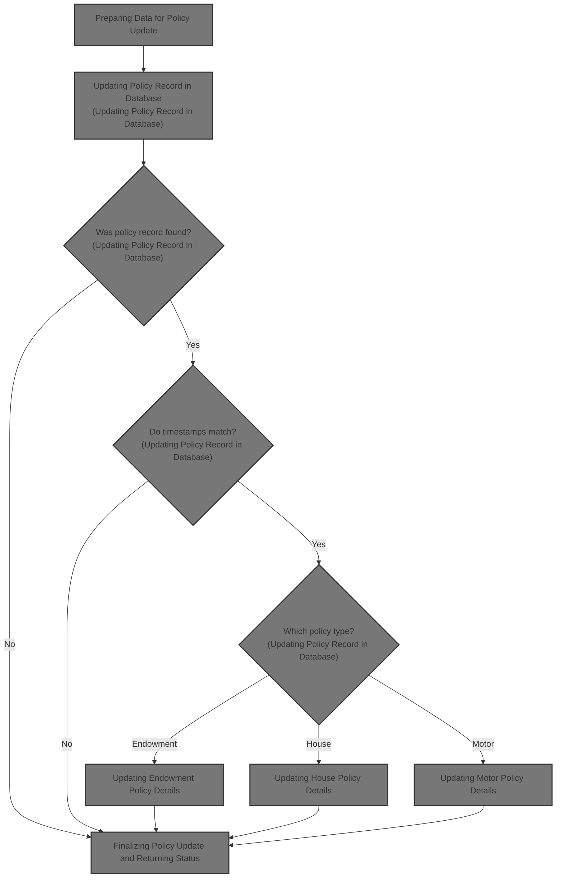

# Technical Overview

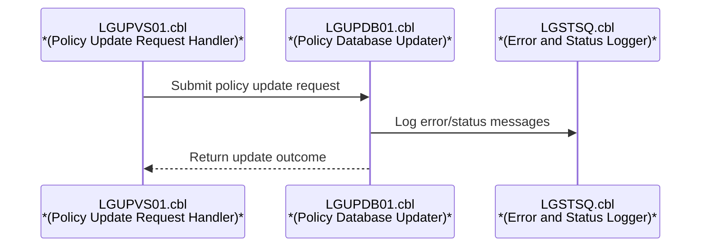

## Dependencies

### Programs

- <SwmToken path="base/src/lgupdb01.cbl" pos="209:9:9" line-data="           EXEC CICS LINK Program(LGUPVS01)">`LGUPVS01`</SwmToken> (<SwmPath>[base/src/lgupvs01.cbl](base/src/lgupvs01.cbl)</SwmPath>)
- LGSTSQ (<SwmPath>[base/src/lgstsq.cbl](base/src/lgstsq.cbl)</SwmPath>)

### Copybooks

- LGCMAREA (<SwmPath>[base/src/lgcmarea.cpy](base/src/lgcmarea.cpy)</SwmPath>)
- LGPOLICY (<SwmPath>[base/src/lgpolicy.cpy](base/src/lgpolicy.cpy)</SwmPath>)
- SQLCA

# Where is this program used?

This program is used once, as represented in the following diagram:

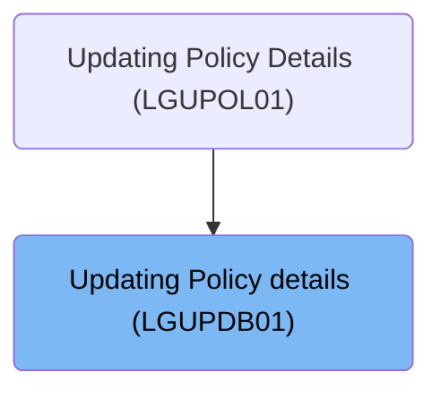

## Input and Output Tables/Files used in the Program

| Table / File Name | Type                                                                                                                    | Description                              | Usage Mode   | Key Fields / Layout Highlights                                                                                                                                                                                                                                                                                                                                                                                                                                                                                                                                                                                                                                                                                                                                                                                                                                                                                                                                                                                                                                                                                                                                                                                                                                                                                         |
| ----------------- | ----------------------------------------------------------------------------------------------------------------------- | ---------------------------------------- | ------------ | ---------------------------------------------------------------------------------------------------------------------------------------------------------------------------------------------------------------------------------------------------------------------------------------------------------------------------------------------------------------------------------------------------------------------------------------------------------------------------------------------------------------------------------------------------------------------------------------------------------------------------------------------------------------------------------------------------------------------------------------------------------------------------------------------------------------------------------------------------------------------------------------------------------------------------------------------------------------------------------------------------------------------------------------------------------------------------------------------------------------------------------------------------------------------------------------------------------------------------------------------------------------------------------------------------------------------- |
| ENDOWMENT         | <SwmToken path="base/src/lgupdb01.cbl" pos="175:5:5" line-data="      * initialize DB2 host variables">`DB2`</SwmToken> | Endowment policy terms and insured party | Output       | <SwmToken path="base/src/lgupdb01.cbl" pos="397:1:1" line-data="                 WITHPROFITS   = :CA-E-WITH-PROFITS,">`WITHPROFITS`</SwmToken>, <SwmToken path="base/src/lgupdb01.cbl" pos="398:1:1" line-data="                   EQUITIES    = :CA-E-EQUITIES,">`EQUITIES`</SwmToken>, <SwmToken path="base/src/lgupdb01.cbl" pos="399:1:1" line-data="                   MANAGEDFUND = :CA-E-MANAGED-FUND,">`MANAGEDFUND`</SwmToken>, <SwmToken path="base/src/lgupdb01.cbl" pos="400:1:1" line-data="                   FUNDNAME    = :CA-E-FUND-NAME,">`FUNDNAME`</SwmToken>, <SwmToken path="base/src/lgupdb01.cbl" pos="390:7:7" line-data="           MOVE CA-E-TERM        TO DB2-E-TERM-SINT">`TERM`</SwmToken>, <SwmToken path="base/src/lgupdb01.cbl" pos="391:17:17" line-data="           MOVE CA-E-SUM-ASSURED TO DB2-E-SUMASSURED-INT">`SUMASSURED`</SwmToken>, <SwmToken path="base/src/lgupdb01.cbl" pos="403:1:1" line-data="                   LIFEASSURED = :CA-E-LIFE-ASSURED">`LIFEASSURED`</SwmToken>                                                                                                                                                                                                                                                                                          |
| HOUSE             | <SwmToken path="base/src/lgupdb01.cbl" pos="175:5:5" line-data="      * initialize DB2 host variables">`DB2`</SwmToken> | House insurance property and value data  | Output       | <SwmToken path="base/src/lgupdb01.cbl" pos="434:1:1" line-data="                    PROPERTYTYPE = :CA-H-PROPERTY-TYPE,">`PROPERTYTYPE`</SwmToken>, <SwmToken path="base/src/lgupdb01.cbl" pos="427:7:7" line-data="           MOVE CA-H-BEDROOMS    TO DB2-H-BEDROOMS-SINT">`BEDROOMS`</SwmToken>, <SwmToken path="base/src/lgupdb01.cbl" pos="428:7:7" line-data="           MOVE CA-H-VALUE       TO DB2-H-VALUE-INT">`VALUE`</SwmToken>, <SwmToken path="base/src/lgupdb01.cbl" pos="437:1:1" line-data="                    HOUSENAME    = :CA-H-HOUSE-NAME,">`HOUSENAME`</SwmToken>, <SwmToken path="base/src/lgupdb01.cbl" pos="438:1:1" line-data="                    HOUSENUMBER  = :CA-H-HOUSE-NUMBER,">`HOUSENUMBER`</SwmToken>, <SwmToken path="base/src/lgupdb01.cbl" pos="439:1:1" line-data="                    POSTCODE     = :CA-H-POSTCODE">`POSTCODE`</SwmToken>                                                                                                                                                                                                                                                                                                                                                                                                                                  |
| MOTOR             | <SwmToken path="base/src/lgupdb01.cbl" pos="175:5:5" line-data="      * initialize DB2 host variables">`DB2`</SwmToken> | Motor insurance vehicle and premium data | Output       | <SwmToken path="base/src/lgupdb01.cbl" pos="472:1:1" line-data="                    MAKE              = :CA-M-MAKE,">`MAKE`</SwmToken>, <SwmToken path="base/src/lgupdb01.cbl" pos="473:1:1" line-data="                    MODEL             = :CA-M-MODEL,">`MODEL`</SwmToken>, <SwmToken path="base/src/lgupdb01.cbl" pos="428:7:7" line-data="           MOVE CA-H-VALUE       TO DB2-H-VALUE-INT">`VALUE`</SwmToken>, <SwmToken path="base/src/lgupdb01.cbl" pos="475:1:1" line-data="                    REGNUMBER         = :CA-M-REGNUMBER,">`REGNUMBER`</SwmToken>, <SwmToken path="base/src/lgupdb01.cbl" pos="476:1:1" line-data="                    COLOUR            = :CA-M-COLOUR,">`COLOUR`</SwmToken>, <SwmToken path="base/src/lgupdb01.cbl" pos="463:7:7" line-data="           MOVE CA-M-CC          TO DB2-M-CC-SINT">`CC`</SwmToken>, <SwmToken path="base/src/lgupdb01.cbl" pos="478:1:1" line-data="                    YEAROFMANUFACTURE = :CA-M-MANUFACTURED,">`YEAROFMANUFACTURE`</SwmToken>, <SwmToken path="base/src/lgupdb01.cbl" pos="465:7:7" line-data="           MOVE CA-M-PREMIUM     TO DB2-M-PREMIUM-INT">`PREMIUM`</SwmToken>, <SwmToken path="base/src/lgupdb01.cbl" pos="466:7:7" line-data="           MOVE CA-M-ACCIDENTS   TO DB2-M-ACCIDENTS-INT">`ACCIDENTS`</SwmToken> |
| POLICY            | <SwmToken path="base/src/lgupdb01.cbl" pos="175:5:5" line-data="      * initialize DB2 host variables">`DB2`</SwmToken> | Insurance policy core details and status | Input/Output | <SwmToken path="base/src/lgupdb01.cbl" pos="320:3:3" line-data="                   SET ISSUEDATE        = :CA-ISSUE-DATE,">`ISSUEDATE`</SwmToken>, <SwmToken path="base/src/lgupdb01.cbl" pos="321:1:1" line-data="                       EXPIRYDATE       = :CA-EXPIRY-DATE,">`EXPIRYDATE`</SwmToken>, <SwmToken path="base/src/lgupdb01.cbl" pos="278:5:5" line-data="             IF CA-LASTCHANGED EQUAL TO DB2-LASTCHANGED">`LASTCHANGED`</SwmToken>, <SwmToken path="base/src/lgupdb01.cbl" pos="313:5:5" line-data="               MOVE CA-BROKERID      TO DB2-BROKERID-INT">`BROKERID`</SwmToken>, <SwmToken path="base/src/lgupdb01.cbl" pos="324:1:1" line-data="                       BROKERSREFERENCE = :CA-BROKERSREF">`BROKERSREFERENCE`</SwmToken>, <SwmToken path="base/src/lgupdb01.cbl" pos="278:3:5" line-data="             IF CA-LASTCHANGED EQUAL TO DB2-LASTCHANGED">`CA-LASTCHANGED`</SwmToken>                                                                                                                                                                                                                                                                                                                                                                                              |

&nbsp;

# Workflow

# Initializing and Starting the Update Flow

This section ensures that all variables and context required for the update flow are properly initialized and validated before any business logic is executed. It also enforces mandatory input requirements and error handling for missing data.

| Category        | Rule Name                          | Description                                                                                                                                                                                                                                             |
| --------------- | ---------------------------------- | ------------------------------------------------------------------------------------------------------------------------------------------------------------------------------------------------------------------------------------------------------- |
| Data validation | Mandatory commarea validation      | The transaction must not proceed if the commarea is missing; an error message must be logged and the transaction must be terminated immediately.                                                                                                        |
| Business logic  | Customer and policy number mapping | Customer and policy numbers from the commarea must be mapped to both <SwmToken path="base/src/lgupdb01.cbl" pos="175:5:5" line-data="      * initialize DB2 host variables">`DB2`</SwmToken> input variables and error message fields for traceability. |

<SwmSnippet path="/base/src/lgupdb01.cbl" line="162">

---

We start by prepping all the context and <SwmToken path="base/src/lgupdb01.cbl" pos="175:5:5" line-data="      * initialize DB2 host variables">`DB2`</SwmToken> variables so the rest of the flow can work with clean data.

```cobol
       MAINLINE SECTION.

      *----------------------------------------------------------------*
      * Common code                                                    *
      *----------------------------------------------------------------*
      * initialize working storage variables
           INITIALIZE WS-HEADER.
      * set up general variable
           MOVE EIBTRNID TO WS-TRANSID.
           MOVE EIBTRMID TO WS-TERMID.
           MOVE EIBTASKN TO WS-TASKNUM.
           MOVE SPACES   TO WS-RETRY.
      *----------------------------------------------------------------*
      * initialize DB2 host variables
           INITIALIZE DB2-POLICY.
           INITIALIZE DB2-IN-INTEGERS.
```

---

</SwmSnippet>

<SwmSnippet path="/base/src/lgupdb01.cbl" line="183">

---

We log the missing commarea error and then terminate the transaction.

```cobol
           IF EIBCALEN IS EQUAL TO ZERO
               MOVE ' NO COMMAREA RECEIVED' TO EM-VARIABLE
               PERFORM WRITE-ERROR-MESSAGE
               EXEC CICS ABEND ABCODE('LGCA') NODUMP END-EXEC
           END-IF
```

---

</SwmSnippet>

## Capturing and Logging Error Details

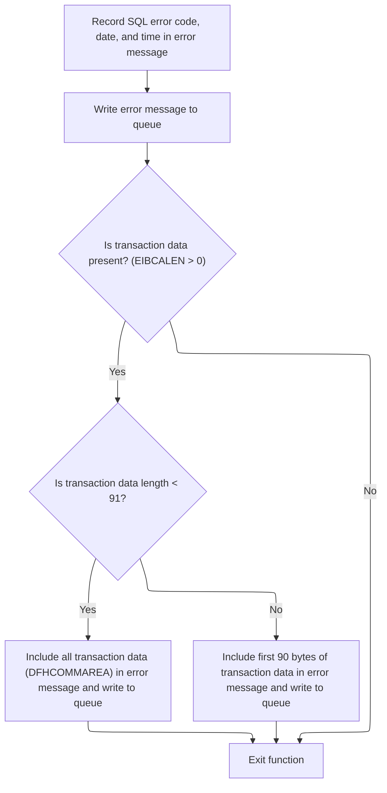

This section ensures that all relevant error details are captured and logged whenever an SQL error occurs, providing sufficient context for support and troubleshooting teams.

| Category       | Rule Name                       | Description                                                                                                                                                                                                              |
| -------------- | ------------------------------- | ------------------------------------------------------------------------------------------------------------------------------------------------------------------------------------------------------------------------ |
| Business logic | Error message completeness      | Whenever an SQL error occurs, the error message must include the SQL error code, the current date, and the current time.                                                                                                 |
| Business logic | Transaction data inclusion      | If transaction data is present, include up to the first 90 bytes of transaction data in the error message. If the transaction data is less than 91 bytes, include all of it; otherwise, include only the first 90 bytes. |
| Business logic | Dual queue logging              | All error messages must be logged to both the TDQ and TSQ queues for redundancy and accessibility.                                                                                                                       |
| Business logic | Special message prefix handling | If the error message starts with 'Q=', the message must be adjusted to extract and store the extension and remaining message content separately.                                                                         |

<SwmSnippet path="/base/src/lgupdb01.cbl" line="502">

---

In <SwmToken path="base/src/lgupdb01.cbl" pos="502:1:5" line-data="       WRITE-ERROR-MESSAGE.">`WRITE-ERROR-MESSAGE`</SwmToken>, we grab the current time and date, format them, and stash the SQLCODE into the error message structure. This sets up all the info needed for error logging.

```cobol
       WRITE-ERROR-MESSAGE.
      * Save SQLCODE in message
           MOVE SQLCODE TO EM-SQLRC
      * Obtain and format current time and date
           EXEC CICS ASKTIME ABSTIME(WS-ABSTIME)
           END-EXEC
           EXEC CICS FORMATTIME ABSTIME(WS-ABSTIME)
                     MMDDYYYY(WS-DATE)
                     TIME(WS-TIME)
           END-EXEC
```

---

</SwmSnippet>

<SwmSnippet path="/base/src/lgupdb01.cbl" line="512">

---

After prepping the error message, we call LGSTSQ to queue it for logging. We also send extra context from the commarea if available, so all error details are captured.

```cobol
           MOVE WS-DATE TO EM-DATE
           MOVE WS-TIME TO EM-TIME
      * Write output message to TDQ
           EXEC CICS LINK PROGRAM('LGSTSQ')
                     COMMAREA(ERROR-MSG)
                     LENGTH(LENGTH OF ERROR-MSG)
           END-EXEC.
```

---

</SwmSnippet>

<SwmSnippet path="/base/src/lgstsq.cbl" line="55">

---

<SwmToken path="base/src/lgstsq.cbl" pos="55:1:1" line-data="       MAINLINE SECTION.">`MAINLINE`</SwmToken> in LGSTSQ figures out where the message came from, tweaks the message if it starts with 'Q=', and writes it to both TDQ and TSQ queues. If the message was received, it sends a quick response back.

```cobol
       MAINLINE SECTION.

           MOVE SPACES TO WRITE-MSG.
           MOVE SPACES TO WS-RECV.

           EXEC CICS ASSIGN SYSID(WRITE-MSG-SYSID)
                RESP(WS-RESP)
           END-EXEC.

           EXEC CICS ASSIGN INVOKINGPROG(WS-INVOKEPROG)
                RESP(WS-RESP)
           END-EXEC.
           
           IF WS-INVOKEPROG NOT = SPACES
              MOVE 'C' To WS-FLAG
              MOVE COMMA-DATA  TO WRITE-MSG-MSG
              MOVE EIBCALEN    TO WS-RECV-LEN
           ELSE
              EXEC CICS RECEIVE INTO(WS-RECV)
                  LENGTH(WS-RECV-LEN)
                  RESP(WS-RESP)
              END-EXEC
              MOVE 'R' To WS-FLAG
              MOVE WS-RECV-DATA  TO WRITE-MSG-MSG
              SUBTRACT 5 FROM WS-RECV-LEN
           END-IF.

           MOVE 'GENAERRS' TO STSQ-NAME.
           IF WRITE-MSG-MSG(1:2) = 'Q=' THEN
              MOVE WRITE-MSG-MSG(3:4) TO STSQ-EXT
              MOVE WRITE-MSG-REST TO TEMPO
              MOVE TEMPO          TO WRITE-MSG-MSG
              SUBTRACT 7 FROM WS-RECV-LEN
           END-IF.

           ADD 5 TO WS-RECV-LEN.

      * Write output message to TDQ CSMT
      *
           EXEC CICS WRITEQ TD QUEUE(STDQ-NAME)
                     FROM(WRITE-MSG)
                     RESP(WS-RESP)
                     LENGTH(WS-RECV-LEN)

           END-EXEC.

      * Write output message to Genapp TSQ
      * If no space is available then the task will not wait for
      *  storage to become available but will ignore the request...
      *
           EXEC CICS WRITEQ TS QUEUE(STSQ-NAME)
                     FROM(WRITE-MSG)
                     RESP(WS-RESP)
                     NOSUSPEND
                     LENGTH(WS-RECV-LEN)

           END-EXEC.

           If WS-FLAG = 'R' Then
             EXEC CICS SEND TEXT FROM(FILLER-X)
              WAIT
              ERASE
              LENGTH(1)
              FREEKB
             END-EXEC.

           EXEC CICS RETURN
           END-EXEC.
```

---

</SwmSnippet>

<SwmSnippet path="/base/src/lgupdb01.cbl" line="520">

---

After returning from LGSTSQ, <SwmToken path="base/src/lgupdb01.cbl" pos="185:3:7" line-data="               PERFORM WRITE-ERROR-MESSAGE">`WRITE-ERROR-MESSAGE`</SwmToken> checks the commarea length and sends up to 90 bytes of it to LGSTSQ for logging. This keeps message sizes manageable and avoids overruns.

```cobol
           IF EIBCALEN > 0 THEN
             IF EIBCALEN < 91 THEN
               MOVE DFHCOMMAREA(1:EIBCALEN) TO CA-DATA
               EXEC CICS LINK PROGRAM('LGSTSQ')
                         COMMAREA(CA-ERROR-MSG)
                         LENGTH(LENGTH OF CA-ERROR-MSG)
               END-EXEC
             ELSE
               MOVE DFHCOMMAREA(1:90) TO CA-DATA
               EXEC CICS LINK PROGRAM('LGSTSQ')
                         COMMAREA(CA-ERROR-MSG)
                         LENGTH(LENGTH OF CA-ERROR-MSG)
               END-EXEC
             END-IF
           END-IF.
           EXIT.
```

---

</SwmSnippet>

## Preparing Data for Policy Update

<SwmSnippet path="/base/src/lgupdb01.cbl" line="190">

---

After <SwmToken path="base/src/lgupdb01.cbl" pos="185:3:7" line-data="               PERFORM WRITE-ERROR-MESSAGE">`WRITE-ERROR-MESSAGE`</SwmToken>, MAINLINE sets up the return code, copies commarea fields to <SwmToken path="base/src/lgupdb01.cbl" pos="194:17:17" line-data="      * Convert commarea customer &amp; policy nums to DB2 integer format">`DB2`</SwmToken> integer variables for DB operations, and also stashes them in the error message structure for later error handling.

```cobol
           MOVE '00' TO CA-RETURN-CODE
           MOVE EIBCALEN TO WS-CALEN.
           SET WS-ADDR-DFHCOMMAREA TO ADDRESS OF DFHCOMMAREA.

      * Convert commarea customer & policy nums to DB2 integer format
           MOVE CA-CUSTOMER-NUM TO DB2-CUSTOMERNUM-INT
           MOVE CA-POLICY-NUM   TO DB2-POLICYNUM-INT
      * and save in error msg field incase required
           MOVE CA-CUSTOMER-NUM TO EM-CUSNUM
           MOVE CA-POLICY-NUM   TO EM-POLNUM
```

---

</SwmSnippet>

<SwmSnippet path="/base/src/lgupdb01.cbl" line="207">

---

We hand off to the <SwmToken path="base/src/lgupdb01.cbl" pos="207:7:7" line-data="           PERFORM UPDATE-POLICY-DB2-INFO.">`DB2`</SwmToken> update routine now that everything's set up.

```cobol
           PERFORM UPDATE-POLICY-DB2-INFO.

           EXEC CICS LINK Program(LGUPVS01)
                Commarea(DFHCOMMAREA)
                LENGTH(225)
           END-EXEC.
```

---

</SwmSnippet>

# Updating Policy Record in Database

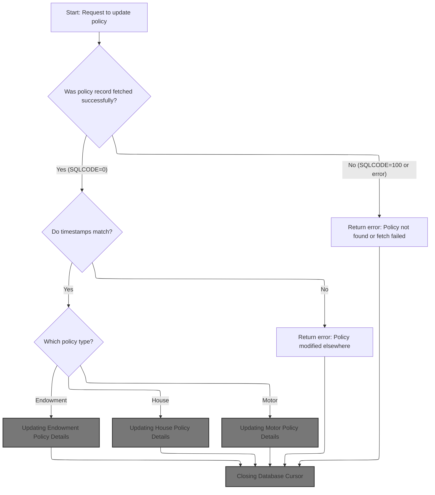

This section ensures that policy records are updated in the database only if the record exists, has not been modified elsewhere, and the correct policy type update routine is selected. It also manages error handling and cursor closure for database operations.

| Category        | Rule Name                         | Description                                                                                                                                                                             |
| --------------- | --------------------------------- | --------------------------------------------------------------------------------------------------------------------------------------------------------------------------------------- |
| Data validation | Policy fetch prerequisite         | A policy record must be fetched successfully from the database before any update is attempted. If the record cannot be fetched, the update process is aborted and an error is returned. |
| Data validation | Concurrent modification safeguard | If the timestamp in the request does not match the timestamp in the database, the update is aborted and an error is returned indicating the policy was modified elsewhere.              |
| Business logic  | Policy type-specific update       | The update routine executed must match the policy type specified in the request (Endowment, House, or Motor). Only the relevant policy details are updated for the selected type.       |
| Technical step  | Cursor closure requirement        | The database cursor must be closed after the update process, regardless of whether the update was successful or an error occurred.                                                      |

<SwmSnippet path="/base/src/lgupdb01.cbl" line="251">

---

In <SwmToken path="base/src/lgupdb01.cbl" pos="251:1:7" line-data="       UPDATE-POLICY-DB2-INFO.">`UPDATE-POLICY-DB2-INFO`</SwmToken>, we open a <SwmToken path="base/src/lgupdb01.cbl" pos="251:5:5" line-data="       UPDATE-POLICY-DB2-INFO.">`DB2`</SwmToken> cursor for the policy record so we can fetch and update it as needed.

```cobol
       UPDATE-POLICY-DB2-INFO.

      *    Open the cursor.
           MOVE ' OPEN   PCURSOR ' TO EM-SQLREQ
           EXEC SQL
             OPEN POLICY_CURSOR
           END-EXEC
```

---

</SwmSnippet>

<SwmSnippet path="/base/src/lgupdb01.cbl" line="259">

---

After opening the cursor, we check SQLCODE. If there's a lock timeout or other error, we log it with <SwmToken path="base/src/lgupdb01.cbl" pos="264:3:7" line-data="               PERFORM WRITE-ERROR-MESSAGE">`WRITE-ERROR-MESSAGE`</SwmToken> and bail out.

```cobol
           Evaluate SQLCODE
             When 0
               MOVE '00' TO CA-RETURN-CODE
             When -913
               MOVE '90' TO CA-RETURN-CODE
               PERFORM WRITE-ERROR-MESSAGE
               EXEC CICS RETURN END-EXEC
             When Other
               MOVE '90' TO CA-RETURN-CODE
               PERFORM WRITE-ERROR-MESSAGE
               EXEC CICS RETURN END-EXEC
           END-Evaluate.
```

---

</SwmSnippet>

<SwmSnippet path="/base/src/lgupdb01.cbl" line="273">

---

After logging any cursor open errors, <SwmToken path="base/src/lgupdb01.cbl" pos="207:3:9" line-data="           PERFORM UPDATE-POLICY-DB2-INFO.">`UPDATE-POLICY-DB2-INFO`</SwmToken> moves on to fetch the policy row if everything's good.

```cobol
           PERFORM FETCH-DB2-POLICY-ROW
```

---

</SwmSnippet>

<SwmSnippet path="/base/src/lgupdb01.cbl" line="275">

---

After fetching the policy, we compare timestamps to avoid clobbering concurrent updates. Then we pick the right update routine (endowment, house, motor) based on the request type.

```cobol
           IF SQLCODE = 0
      *      Fetch was successful
      *      Compare timestamp in commarea with that in DB2
             IF CA-LASTCHANGED EQUAL TO DB2-LASTCHANGED

      *----------------------------------------------------------------*
      *      Select for Update and Update specific policy type table   *
      *----------------------------------------------------------------*
             EVALUATE CA-REQUEST-ID

      *** Endowment ***
               WHEN '01UEND'
      *          Call routine to update Endowment table
                 PERFORM UPDATE-ENDOW-DB2-INFO

      *** House ***
               WHEN '01UHOU'
      *          Call routine to update Housetable
                 PERFORM UPDATE-HOUSE-DB2-INFO

      *** Motor ***
               WHEN '01UMOT'
      *          Call routine to update Motor table
                 PERFORM UPDATE-MOTOR-DB2-INFO

             END-EVALUATE
```

---

</SwmSnippet>

## Updating Endowment Policy Details

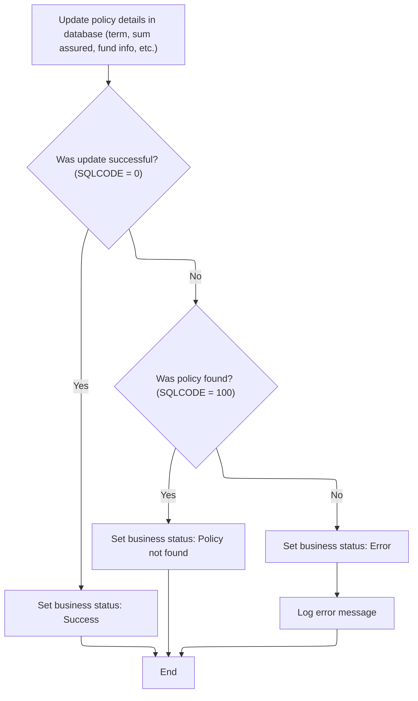

This section is responsible for updating the details of an endowment policy in the database and setting the appropriate business status based on the outcome of the update operation.

| Category       | Rule Name                | Description                                                                                                                                                                        |
| -------------- | ------------------------ | ---------------------------------------------------------------------------------------------------------------------------------------------------------------------------------- |
| Business logic | Successful update status | If the policy update in the database is successful, the business status must be set to 'Success'.                                                                                  |
| Business logic | Policy not found status  | If the policy update fails because the policy was not found (SQLCODE = 100), the business status must be set to 'Policy not found' and a specific return code ('01') must be used. |

<SwmSnippet path="/base/src/lgupdb01.cbl" line="387">

---

In <SwmToken path="base/src/lgupdb01.cbl" pos="387:1:7" line-data="       UPDATE-ENDOW-DB2-INFO.">`UPDATE-ENDOW-DB2-INFO`</SwmToken>, we convert the numeric commarea fields to <SwmToken path="base/src/lgupdb01.cbl" pos="387:5:5" line-data="       UPDATE-ENDOW-DB2-INFO.">`DB2`</SwmToken> integer types and then run the SQL UPDATE for the endowment policy.

```cobol
       UPDATE-ENDOW-DB2-INFO.

      *    Move numeric commarea fields to DB2 Integer formats
           MOVE CA-E-TERM        TO DB2-E-TERM-SINT
           MOVE CA-E-SUM-ASSURED TO DB2-E-SUMASSURED-INT

           MOVE ' UPDATE ENDOW ' TO EM-SQLREQ
           EXEC SQL
             UPDATE ENDOWMENT
               SET
                 WITHPROFITS   = :CA-E-WITH-PROFITS,
                   EQUITIES    = :CA-E-EQUITIES,
                   MANAGEDFUND = :CA-E-MANAGED-FUND,
                   FUNDNAME    = :CA-E-FUND-NAME,
                   TERM        = :DB2-E-TERM-SINT,
                   SUMASSURED  = :DB2-E-SUMASSURED-INT,
                   LIFEASSURED = :CA-E-LIFE-ASSURED
               WHERE
                   POLICYNUMBER = :DB2-POLICYNUM-INT
           END-EXEC
```

---

</SwmSnippet>

<SwmSnippet path="/base/src/lgupdb01.cbl" line="408">

---

After the update, if SQLCODE isn't zero, we set a return code ('01' for not found, '90' for error) and log the error with <SwmToken path="base/src/lgupdb01.cbl" pos="415:3:7" line-data="               PERFORM WRITE-ERROR-MESSAGE">`WRITE-ERROR-MESSAGE`</SwmToken>.

```cobol
           IF SQLCODE NOT EQUAL 0
      *      Non-zero SQLCODE from UPDATE statement
             IF SQLCODE EQUAL 100
               MOVE '01' TO CA-RETURN-CODE
             ELSE
               MOVE '90' TO CA-RETURN-CODE
      *        Write error message to TD QUEUE(CSMT)
               PERFORM WRITE-ERROR-MESSAGE
             END-IF
           END-IF.
           EXIT.
```

---

</SwmSnippet>

## Updating House Policy Details

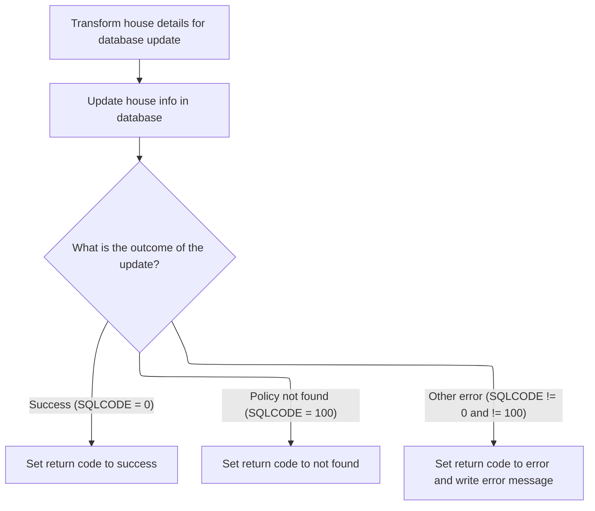

This section is responsible for updating house policy details in the database based on input received from the commarea structure. It ensures that the correct fields are updated and provides clear feedback on the outcome of the operation.

| Category       | Rule Name                  | Description                                                                                                                                                                                                         |
| -------------- | -------------------------- | ------------------------------------------------------------------------------------------------------------------------------------------------------------------------------------------------------------------- |
| Business logic | Update house policy fields | The house policy record in the database must be updated with the provided property type, number of bedrooms, house value, house name, house number, and postcode, using the policy number as the unique identifier. |

<SwmSnippet path="/base/src/lgupdb01.cbl" line="424">

---

In <SwmToken path="base/src/lgupdb01.cbl" pos="424:1:7" line-data="       UPDATE-HOUSE-DB2-INFO.">`UPDATE-HOUSE-DB2-INFO`</SwmToken>, we convert the numeric commarea fields to <SwmToken path="base/src/lgupdb01.cbl" pos="424:5:5" line-data="       UPDATE-HOUSE-DB2-INFO.">`DB2`</SwmToken> integer types and update the house policy record using those values.

```cobol
       UPDATE-HOUSE-DB2-INFO.

      *    Move numeric commarea fields to DB2 Integer formats
           MOVE CA-H-BEDROOMS    TO DB2-H-BEDROOMS-SINT
           MOVE CA-H-VALUE       TO DB2-H-VALUE-INT

           MOVE ' UPDATE HOUSE ' TO EM-SQLREQ
           EXEC SQL
             UPDATE HOUSE
               SET
                    PROPERTYTYPE = :CA-H-PROPERTY-TYPE,
                    BEDROOMS     = :DB2-H-BEDROOMS-SINT,
                    VALUE        = :DB2-H-VALUE-INT,
                    HOUSENAME    = :CA-H-HOUSE-NAME,
                    HOUSENUMBER  = :CA-H-HOUSE-NUMBER,
                    POSTCODE     = :CA-H-POSTCODE
               WHERE
                    POLICYNUMBER = :DB2-POLICYNUM-INT
           END-EXEC
```

---

</SwmSnippet>

<SwmSnippet path="/base/src/lgupdb01.cbl" line="444">

---

After the update, if SQLCODE isn't zero, we set a return code ('01' for not found, '90' for error) and log the error with <SwmToken path="base/src/lgupdb01.cbl" pos="451:3:7" line-data="               PERFORM WRITE-ERROR-MESSAGE">`WRITE-ERROR-MESSAGE`</SwmToken>.

```cobol
           IF SQLCODE NOT EQUAL 0
      *      Non-zero SQLCODE from UPDATE statement
             IF SQLCODE = 100
               MOVE '01' TO CA-RETURN-CODE
             ELSE
               MOVE '90' TO CA-RETURN-CODE
      *        Write error message to TD QUEUE(CSMT)
               PERFORM WRITE-ERROR-MESSAGE
             END-IF
           END-IF.
           EXIT.
```

---

</SwmSnippet>

## Updating Motor Policy Details

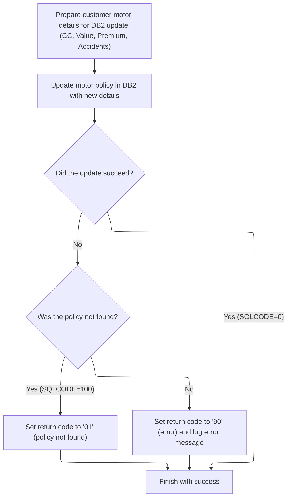

This section is responsible for updating motor policy details in the <SwmToken path="base/src/lgupdb01.cbl" pos="175:5:5" line-data="      * initialize DB2 host variables">`DB2`</SwmToken> database and returning a status code that reflects the outcome of the update operation.

| Category       | Rule Name                    | Description                                                                                                                                                                                                                                                              |
| -------------- | ---------------------------- | ------------------------------------------------------------------------------------------------------------------------------------------------------------------------------------------------------------------------------------------------------------------------ |
| Business logic | Motor policy update          | The motor policy record must be updated in the <SwmToken path="base/src/lgupdb01.cbl" pos="175:5:5" line-data="      * initialize DB2 host variables">`DB2`</SwmToken> database using the provided policy number and new details. Only the specified fields are updated. |
| Business logic | Successful update completion | If the update operation is successful (SQLCODE=0), the process must complete with a success status.                                                                                                                                                                      |

<SwmSnippet path="/base/src/lgupdb01.cbl" line="460">

---

In <SwmToken path="base/src/lgupdb01.cbl" pos="460:1:7" line-data="       UPDATE-MOTOR-DB2-INFO.">`UPDATE-MOTOR-DB2-INFO`</SwmToken>, we convert the numeric commarea fields to <SwmToken path="base/src/lgupdb01.cbl" pos="460:5:5" line-data="       UPDATE-MOTOR-DB2-INFO.">`DB2`</SwmToken> integer types and update the motor policy record using those values.

```cobol
       UPDATE-MOTOR-DB2-INFO.

      *    Move numeric commarea fields to DB2 Integer formats
           MOVE CA-M-CC          TO DB2-M-CC-SINT
           MOVE CA-M-VALUE       TO DB2-M-VALUE-INT
           MOVE CA-M-PREMIUM     TO DB2-M-PREMIUM-INT
           MOVE CA-M-ACCIDENTS   TO DB2-M-ACCIDENTS-INT

           MOVE ' UPDATE MOTOR ' TO EM-SQLREQ
           EXEC SQL
             UPDATE MOTOR
               SET
                    MAKE              = :CA-M-MAKE,
                    MODEL             = :CA-M-MODEL,
                    VALUE             = :DB2-M-VALUE-INT,
                    REGNUMBER         = :CA-M-REGNUMBER,
                    COLOUR            = :CA-M-COLOUR,
                    CC                = :DB2-M-CC-SINT,
                    YEAROFMANUFACTURE = :CA-M-MANUFACTURED,
                    PREMIUM           = :DB2-M-PREMIUM-INT,
                    ACCIDENTS         = :DB2-M-ACCIDENTS-INT
               WHERE
                    POLICYNUMBER      = :DB2-POLICYNUM-INT
           END-EXEC
```

---

</SwmSnippet>

<SwmSnippet path="/base/src/lgupdb01.cbl" line="485">

---

After the update, if SQLCODE isn't zero, we set a return code ('01' for not found, '90' for error) and log the error with <SwmToken path="base/src/lgupdb01.cbl" pos="492:3:7" line-data="               PERFORM WRITE-ERROR-MESSAGE">`WRITE-ERROR-MESSAGE`</SwmToken>.

```cobol
           IF SQLCODE NOT EQUAL 0
      *      Non-zero SQLCODE from UPDATE statement
             IF SQLCODE EQUAL 100
               MOVE '01' TO CA-RETURN-CODE
             ELSE
               MOVE '90' TO CA-RETURN-CODE
      *        Write error message to TD QUEUE(CSMT)
               PERFORM WRITE-ERROR-MESSAGE
             END-IF
           END-IF.
           EXIT.
```

---

</SwmSnippet>

## Handling Failed Updates and Cleaning Up Resources

<SwmSnippet path="/base/src/lgupdb01.cbl" line="302">

---

After returning from <SwmToken path="base/src/lgupdb01.cbl" pos="298:3:9" line-data="                 PERFORM UPDATE-MOTOR-DB2-INFO">`UPDATE-MOTOR-DB2-INFO`</SwmToken>, <SwmToken path="base/src/lgupdb01.cbl" pos="207:3:9" line-data="           PERFORM UPDATE-POLICY-DB2-INFO.">`UPDATE-POLICY-DB2-INFO`</SwmToken> checks if the update failed and closes the cursor before exiting to clean up DB resources.

```cobol
              IF CA-RETURN-CODE NOT EQUAL '00'
      *         Update policy type specific table has failed
      *         So close cursor and return
                PERFORM CLOSE-PCURSOR
                EXEC CICS RETURN END-EXEC
              END-IF
```

---

</SwmSnippet>

## Closing Database Cursor

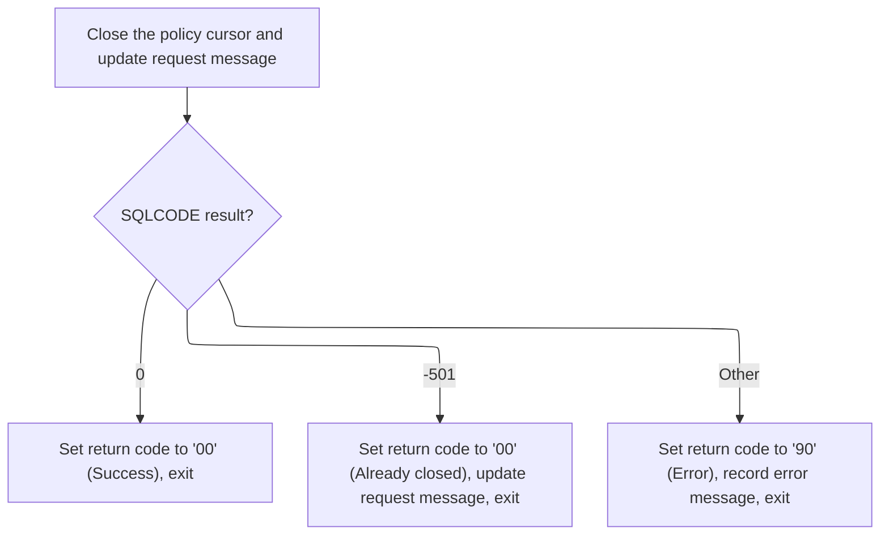

This section governs the business logic for closing the policy database cursor, ensuring that the operation is logged, the outcome is clearly communicated via return codes, and any errors are properly recorded for downstream processing.

<SwmSnippet path="/base/src/lgupdb01.cbl" line="362">

---

In <SwmToken path="base/src/lgupdb01.cbl" pos="362:1:3" line-data="       CLOSE-PCURSOR.">`CLOSE-PCURSOR`</SwmToken>, we log the close request, run the SQL CLOSE, and prep for error handling if needed.

```cobol
       CLOSE-PCURSOR.
      *    Now close the Cursor and we're done!
           MOVE ' CLOSE  PCURSOR' TO EM-SQLREQ
           EXEC SQL
             CLOSE POLICY_CURSOR
           END-EXEC.
```

---

</SwmSnippet>

<SwmSnippet path="/base/src/lgupdb01.cbl" line="369">

---

After closing the cursor, if there's an error, we log it with <SwmToken path="base/src/lgupdb01.cbl" pos="378:3:7" line-data="               PERFORM WRITE-ERROR-MESSAGE">`WRITE-ERROR-MESSAGE`</SwmToken> and exit. If the cursor wasn't open, we just return.

```cobol
           Evaluate SQLCODE
             When 0
               MOVE '00' TO CA-RETURN-CODE
             When -501
               MOVE '00' TO CA-RETURN-CODE
               MOVE '-501 detected c' TO EM-SQLREQ
               EXEC CICS RETURN END-EXEC
             When Other
               MOVE '90' TO CA-RETURN-CODE
               PERFORM WRITE-ERROR-MESSAGE
               EXEC CICS RETURN END-EXEC
           END-Evaluate.
           EXIT.
```

---

</SwmSnippet>

## Finalizing Policy Update and Returning Status

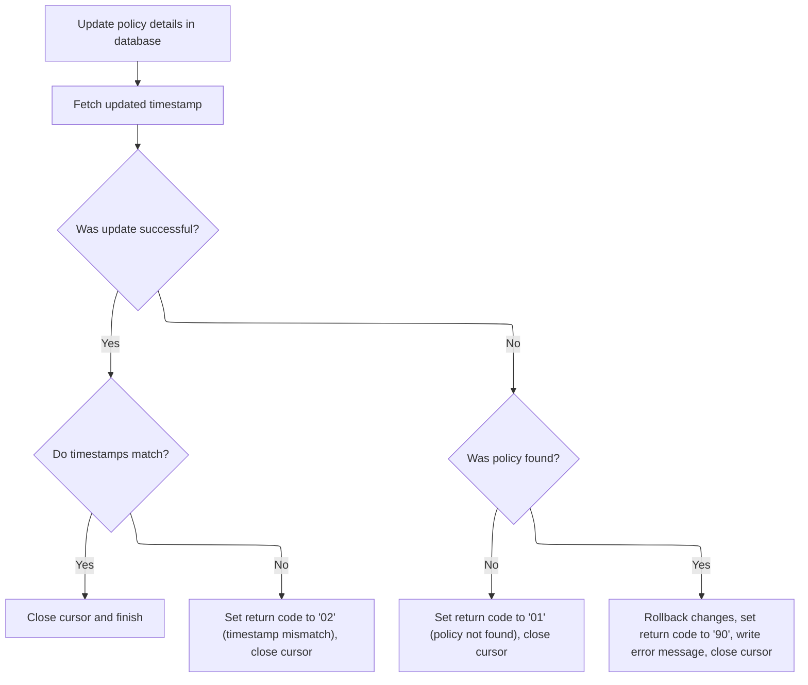

<SwmSnippet path="/base/src/lgupdb01.cbl" line="313">

---

After <SwmToken path="base/src/lgupdb01.cbl" pos="305:3:5" line-data="                PERFORM CLOSE-PCURSOR">`CLOSE-PCURSOR`</SwmToken>, <SwmToken path="base/src/lgupdb01.cbl" pos="207:3:9" line-data="           PERFORM UPDATE-POLICY-DB2-INFO.">`UPDATE-POLICY-DB2-INFO`</SwmToken> moves broker and payment info to <SwmToken path="base/src/lgupdb01.cbl" pos="313:9:9" line-data="               MOVE CA-BROKERID      TO DB2-BROKERID-INT">`DB2`</SwmToken> integer fields and runs the final policy table update.

```cobol
               MOVE CA-BROKERID      TO DB2-BROKERID-INT
               MOVE CA-PAYMENT       TO DB2-PAYMENT-INT

      *        Update policy table details
               MOVE ' UPDATE POLICY  ' TO EM-SQLREQ
               EXEC SQL
                 UPDATE POLICY
                   SET ISSUEDATE        = :CA-ISSUE-DATE,
                       EXPIRYDATE       = :CA-EXPIRY-DATE,
                       LASTCHANGED      = CURRENT TIMESTAMP ,
                       BROKERID         = :DB2-BROKERID-INT,
                       BROKERSREFERENCE = :CA-BROKERSREF
                   WHERE CURRENT OF POLICY_CURSOR
               END-EXEC
```

---

</SwmSnippet>

<SwmSnippet path="/base/src/lgupdb01.cbl" line="329">

---

After updating the policy, we grab the new LASTCHANGED timestamp so we can confirm the update and use it for future checks.

```cobol
               EXEC SQL
                 SELECT LASTCHANGED
                   INTO :CA-LASTCHANGED
                   FROM POLICY
                   WHERE POLICYNUMBER = :DB2-POLICYNUM-INT
               END-EXEC
```

---

</SwmSnippet>

<SwmSnippet path="/base/src/lgupdb01.cbl" line="336">

---

If the policy update fails, we rollback the transaction and log the error with <SwmToken path="base/src/lgupdb01.cbl" pos="341:3:7" line-data="                   PERFORM WRITE-ERROR-MESSAGE">`WRITE-ERROR-MESSAGE`</SwmToken>.

```cobol
               IF SQLCODE NOT EQUAL 0
      *          Non-zero SQLCODE from Update of policy table
                   EXEC CICS SYNCPOINT ROLLBACK END-EXEC
                   MOVE '90' TO CA-RETURN-CODE
      *            Write error message to TD QUEUE(CSMT)
                   PERFORM WRITE-ERROR-MESSAGE
               END-IF
```

---

</SwmSnippet>

<SwmSnippet path="/base/src/lgupdb01.cbl" line="344">

---

If the timestamps don't match, we set the return code to '02' to flag a concurrency issue.

```cobol
             ELSE
      *        Timestamps do not match (policy table v commarea)
               MOVE '02' TO CA-RETURN-CODE
             END-IF
```

---

</SwmSnippet>

<SwmSnippet path="/base/src/lgupdb01.cbl" line="349">

---

If the fetch fails with SQLCODE 100, we set the return code to '01' to signal the record wasn't found.

```cobol
           ELSE
      *      Non-zero SQLCODE from first SQL FETCH statement
             IF SQLCODE EQUAL 100
               MOVE '01' TO CA-RETURN-CODE
```

---

</SwmSnippet>

<SwmSnippet path="/base/src/lgupdb01.cbl" line="353">

---

At the end, <SwmToken path="base/src/lgupdb01.cbl" pos="207:3:9" line-data="           PERFORM UPDATE-POLICY-DB2-INFO.">`UPDATE-POLICY-DB2-INFO`</SwmToken> returns a status code and closes the cursor to wrap up the update process.

```cobol
             ELSE
               MOVE '90' TO CA-RETURN-CODE
      *        Write error message to TD QUEUE(CSMT)
               PERFORM WRITE-ERROR-MESSAGE
             END-IF
           END-IF.
      *    Now close the Cursor and we're done!
           PERFORM CLOSE-PCURSOR.
```

---

</SwmSnippet>

# Handling Policy Update Requests and Error Logging

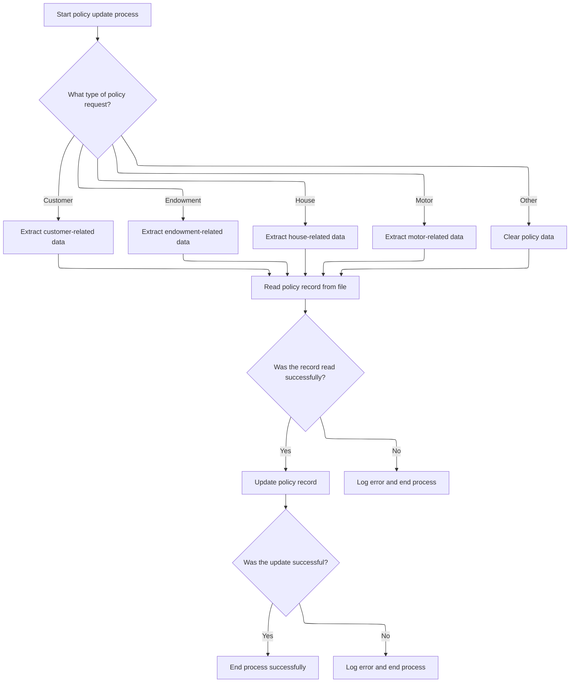

This section governs how policy update requests are processed, how the correct fields are selected for update based on request type, and how errors are logged and reported if the update process fails.

| Category        | Rule Name                      | Description                                                                                                                                                                                                                                                                                                                              |
| --------------- | ------------------------------ | ---------------------------------------------------------------------------------------------------------------------------------------------------------------------------------------------------------------------------------------------------------------------------------------------------------------------------------------- |
| Data validation | Error log content requirements | Error logs must include the timestamp, error code, customer number, and response codes. If extra commarea data is present, up to 90 bytes of it must be included in the error log.                                                                                                                                                       |
| Business logic  | Policy type selection          | The type of policy update (Customer, Endowment, House, Motor, Other) is determined by the 4th character of the <SwmToken path="base/src/lgupvs01.cbl" pos="102:3:7" line-data="           Move CA-Request-ID(4:1) To WF-Request-ID">`CA-Request-ID`</SwmToken> field. Only the relevant fields for the selected policy type are updated. |
| Business logic  | Unknown request type handling  | If the request type is not recognized (not 'C', 'E', 'H', or 'M'), all policy data fields are cleared before attempting to read and update the record.                                                                                                                                                                                   |

<SwmSnippet path="/base/src/lgupvs01.cbl" line="97">

---

In MAINLINE (<SwmToken path="base/src/lgupdb01.cbl" pos="209:9:9" line-data="           EXEC CICS LINK Program(LGUPVS01)">`LGUPVS01`</SwmToken>), we use the 4th char of <SwmToken path="base/src/lgupvs01.cbl" pos="102:3:7" line-data="           Move CA-Request-ID(4:1) To WF-Request-ID">`CA-Request-ID`</SwmToken> to pick which fields to update, read the policy record, and rewrite it with new data. Errors trigger logging and abend.

```cobol
       MAINLINE SECTION.
      *
      *---------------------------------------------------------------*
           Move EIBCALEN To WS-Commarea-Len.
      *---------------------------------------------------------------*
           Move CA-Request-ID(4:1) To WF-Request-ID
           Move CA-Policy-Num      To WF-Policy-Num
           Move CA-Customer-Num    To WF-Customer-Num

           Evaluate WF-Request-ID

             When 'C'
               Move CA-B-Postcode  To WF-B-Postcode
               Move CA-B-Status    To WF-B-Status
               Move CA-B-Customer  To WF-B-Customer

             When 'E'
               Move CA-E-WITH-PROFITS To  WF-E-WITH-PROFITS
               Move CA-E-EQUITIES     To  WF-E-EQUITIES
               Move CA-E-MANAGED-FUND To  WF-E-MANAGED-FUND
               Move CA-E-FUND-NAME    To  WF-E-FUND-NAME
               Move CA-E-LIFE-ASSURED To  WF-E-LIFE-ASSURED

             When 'H'
               Move CA-H-PROPERTY-TYPE To  WF-H-PROPERTY-TYPE
               Move CA-H-BEDROOMS      To  WF-H-BEDROOMS
               Move CA-H-VALUE         To  WF-H-VALUE
               Move CA-H-POSTCODE      To  WF-H-POSTCODE
               Move CA-H-HOUSE-NAME    To  WF-H-HOUSE-NAME

             When 'M'
               Move CA-M-MAKE          To  WF-M-MAKE
               Move CA-M-MODEL         To  WF-M-MODEL
               Move CA-M-VALUE         To  WF-M-VALUE
               Move CA-M-REGNUMBER     To  WF-M-REGNUMBER

             When Other
               Move Spaces To WF-Policy-Data
           End-Evaluate

           Move CA-Policy-Num      To WF-Policy-Num
      *---------------------------------------------------------------*
           Exec CICS Read File('KSDSPOLY')
                     Into(WS-FileIn)
                     Length(WS-Commarea-Len)
                     Ridfld(WF-Policy-Key)
                     KeyLength(21)
                     RESP(WS-RESP)
                     Update
           End-Exec.
           If WS-RESP Not = DFHRESP(NORMAL)
             Move EIBRESP2 To WS-RESP2
             MOVE '81' TO CA-RETURN-CODE
             PERFORM WRITE-ERROR-MESSAGE
             EXEC CICS ABEND ABCODE('LGV3') NODUMP END-EXEC
             EXEC CICS RETURN END-EXEC
           End-If.
      *---------------------------------------------------------------*
           Exec CICS ReWrite File('KSDSPOLY')
                     From(WF-Policy-Info)
                     Length(WS-Commarea-LenF)
                     RESP(WS-RESP)
           End-Exec.
           If WS-RESP Not = DFHRESP(NORMAL)
             Move EIBRESP2 To WS-RESP2
             MOVE '82' TO CA-RETURN-CODE
             PERFORM WRITE-ERROR-MESSAGE
             EXEC CICS ABEND ABCODE('LGV4') NODUMP END-EXEC
             EXEC CICS RETURN END-EXEC
           End-If.
```

---

</SwmSnippet>

<SwmSnippet path="/base/src/lgupvs01.cbl" line="174">

---

In <SwmToken path="base/src/lgupvs01.cbl" pos="174:1:5" line-data="       WRITE-ERROR-MESSAGE.">`WRITE-ERROR-MESSAGE`</SwmToken> (<SwmToken path="base/src/lgupdb01.cbl" pos="209:9:9" line-data="           EXEC CICS LINK Program(LGUPVS01)">`LGUPVS01`</SwmToken>), we format the timestamp, fill out the error message, and call LGSTSQ to log it. If there's extra commarea data, we send up to 90 bytes of that too.

```cobol
       WRITE-ERROR-MESSAGE.
           EXEC CICS ASKTIME ABSTIME(WS-ABSTIME)
           END-EXEC
           EXEC CICS FORMATTIME ABSTIME(WS-ABSTIME)
                     MMDDYYYY(WS-DATE)
                     TIME(WS-TIME)
           END-EXEC
      *
           MOVE WS-DATE TO EM-DATE
           MOVE WS-TIME TO EM-TIME
           Move CA-Customer-Num To EM-Cusnum
           Move WS-RESP         To EM-RespRC
           Move WS-RESP2        To EM-Resp2RC
           EXEC CICS LINK PROGRAM('LGSTSQ')
                     COMMAREA(ERROR-MSG)
                     LENGTH(LENGTH OF ERROR-MSG)
           END-EXEC.
           IF EIBCALEN > 0 THEN
             IF EIBCALEN < 91 THEN
               MOVE DFHCOMMAREA(1:EIBCALEN) TO CA-DATA
               EXEC CICS LINK PROGRAM('LGSTSQ')
                         COMMAREA(CA-ERROR-MSG)
                         LENGTH(Length Of CA-ERROR-MSG)
               END-EXEC
             ELSE
               MOVE DFHCOMMAREA(1:90) TO CA-DATA
               EXEC CICS LINK PROGRAM('LGSTSQ')
                         COMMAREA(CA-ERROR-MSG)
                         LENGTH(Length Of CA-ERROR-MSG)
               END-EXEC
             END-IF
           END-IF.
           EXIT.
```

---

</SwmSnippet>

&nbsp;

*This is an auto-generated document by Swimm 🌊 and has not yet been verified by a human*

<SwmMeta version="3.0.0" repo-id="Z2l0aHViJTNBJTNBU3dpbW1pby1nZW5hcHAtbW90b3IlM0ElM0FHaXJpLVN3aW1t" repo-name="Swimmio-genapp-motor"><sup>Powered by [Swimm](https://app.swimm.io/)</sup></SwmMeta>
