# Overview

This document explains the flow for updating insurance policy details. The process receives policy update requests, validates input, updates policy records in both <SwmToken path="base/src/lgupdb01.cbl" pos="175:5:5" line-data="      * initialize DB2 host variables">`DB2`</SwmToken> and VSAM databases, and logs errors with transaction context for traceability. It supports Endowment, House, and Motor policy types, ensuring concurrency control and clear status reporting.

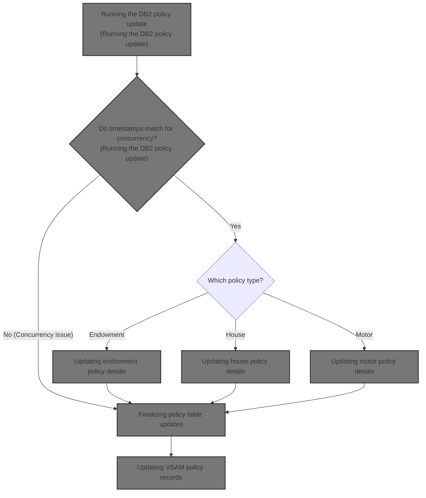

## Dependencies

### Programs

- <SwmToken path="base/src/lgupdb01.cbl" pos="10:6:6" line-data="       PROGRAM-ID. LGUPDB01.">`LGUPDB01`</SwmToken> (<SwmPath>[base/src/lgupdb01.cbl](base/src/lgupdb01.cbl)</SwmPath>)
- <SwmToken path="base/src/lgupdb01.cbl" pos="209:9:9" line-data="           EXEC CICS LINK Program(LGUPVS01)">`LGUPVS01`</SwmToken> (<SwmPath>[base/src/lgupvs01.cbl](base/src/lgupvs01.cbl)</SwmPath>)
- LGSTSQ (<SwmPath>[base/src/lgstsq.cbl](base/src/lgstsq.cbl)</SwmPath>)

### Copybooks

- LGCMAREA (<SwmPath>[base/src/lgcmarea.cpy](base/src/lgcmarea.cpy)</SwmPath>)
- LGPOLICY (<SwmPath>[base/src/lgpolicy.cpy](base/src/lgpolicy.cpy)</SwmPath>)
- SQLCA

# Where is this program used?

This program is used once, as represented in the following diagram:

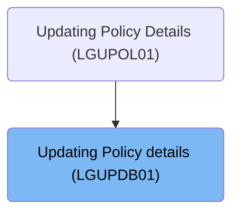

## Input and Output Tables/Files used in the Program

| Table / File Name | Type                                                                                                                    | Description                                                               | Usage Mode   | Key Fields / Layout Highlights                                                                                                                                                                                                                                                                                                                                                                                                                                                                                                                                                                                                                                                                                                                                                                                                                                                                                                                                                                                                                                                                                                                                                                                                                                                                                         |
| ----------------- | ----------------------------------------------------------------------------------------------------------------------- | ------------------------------------------------------------------------- | ------------ | ---------------------------------------------------------------------------------------------------------------------------------------------------------------------------------------------------------------------------------------------------------------------------------------------------------------------------------------------------------------------------------------------------------------------------------------------------------------------------------------------------------------------------------------------------------------------------------------------------------------------------------------------------------------------------------------------------------------------------------------------------------------------------------------------------------------------------------------------------------------------------------------------------------------------------------------------------------------------------------------------------------------------------------------------------------------------------------------------------------------------------------------------------------------------------------------------------------------------------------------------------------------------------------------------------------------------- |
| ENDOWMENT         | <SwmToken path="base/src/lgupdb01.cbl" pos="175:5:5" line-data="      * initialize DB2 host variables">`DB2`</SwmToken> | Endowment policy specifics: fund, term, sum assured, life assured         | Output       | <SwmToken path="base/src/lgupdb01.cbl" pos="397:1:1" line-data="                 WITHPROFITS   = :CA-E-WITH-PROFITS,">`WITHPROFITS`</SwmToken>, <SwmToken path="base/src/lgupdb01.cbl" pos="398:1:1" line-data="                   EQUITIES    = :CA-E-EQUITIES,">`EQUITIES`</SwmToken>, <SwmToken path="base/src/lgupdb01.cbl" pos="399:1:1" line-data="                   MANAGEDFUND = :CA-E-MANAGED-FUND,">`MANAGEDFUND`</SwmToken>, <SwmToken path="base/src/lgupdb01.cbl" pos="400:1:1" line-data="                   FUNDNAME    = :CA-E-FUND-NAME,">`FUNDNAME`</SwmToken>, <SwmToken path="base/src/lgupdb01.cbl" pos="390:7:7" line-data="           MOVE CA-E-TERM        TO DB2-E-TERM-SINT">`TERM`</SwmToken>, <SwmToken path="base/src/lgupdb01.cbl" pos="391:17:17" line-data="           MOVE CA-E-SUM-ASSURED TO DB2-E-SUMASSURED-INT">`SUMASSURED`</SwmToken>, <SwmToken path="base/src/lgupdb01.cbl" pos="403:1:1" line-data="                   LIFEASSURED = :CA-E-LIFE-ASSURED">`LIFEASSURED`</SwmToken>                                                                                                                                                                                                                                                                                          |
| HOUSE             | <SwmToken path="base/src/lgupdb01.cbl" pos="175:5:5" line-data="      * initialize DB2 host variables">`DB2`</SwmToken> | House policy details: property type, bedrooms, value, address             | Output       | <SwmToken path="base/src/lgupdb01.cbl" pos="434:1:1" line-data="                    PROPERTYTYPE = :CA-H-PROPERTY-TYPE,">`PROPERTYTYPE`</SwmToken>, <SwmToken path="base/src/lgupdb01.cbl" pos="427:7:7" line-data="           MOVE CA-H-BEDROOMS    TO DB2-H-BEDROOMS-SINT">`BEDROOMS`</SwmToken>, <SwmToken path="base/src/lgupdb01.cbl" pos="428:7:7" line-data="           MOVE CA-H-VALUE       TO DB2-H-VALUE-INT">`VALUE`</SwmToken>, <SwmToken path="base/src/lgupdb01.cbl" pos="437:1:1" line-data="                    HOUSENAME    = :CA-H-HOUSE-NAME,">`HOUSENAME`</SwmToken>, <SwmToken path="base/src/lgupdb01.cbl" pos="438:1:1" line-data="                    HOUSENUMBER  = :CA-H-HOUSE-NUMBER,">`HOUSENUMBER`</SwmToken>, <SwmToken path="base/src/lgupdb01.cbl" pos="439:1:1" line-data="                    POSTCODE     = :CA-H-POSTCODE">`POSTCODE`</SwmToken>                                                                                                                                                                                                                                                                                                                                                                                                                                  |
| MOTOR             | <SwmToken path="base/src/lgupdb01.cbl" pos="175:5:5" line-data="      * initialize DB2 host variables">`DB2`</SwmToken> | Motor policy details: vehicle make, model, value, reg, premium, accidents | Output       | <SwmToken path="base/src/lgupdb01.cbl" pos="472:1:1" line-data="                    MAKE              = :CA-M-MAKE,">`MAKE`</SwmToken>, <SwmToken path="base/src/lgupdb01.cbl" pos="473:1:1" line-data="                    MODEL             = :CA-M-MODEL,">`MODEL`</SwmToken>, <SwmToken path="base/src/lgupdb01.cbl" pos="428:7:7" line-data="           MOVE CA-H-VALUE       TO DB2-H-VALUE-INT">`VALUE`</SwmToken>, <SwmToken path="base/src/lgupdb01.cbl" pos="475:1:1" line-data="                    REGNUMBER         = :CA-M-REGNUMBER,">`REGNUMBER`</SwmToken>, <SwmToken path="base/src/lgupdb01.cbl" pos="476:1:1" line-data="                    COLOUR            = :CA-M-COLOUR,">`COLOUR`</SwmToken>, <SwmToken path="base/src/lgupdb01.cbl" pos="463:7:7" line-data="           MOVE CA-M-CC          TO DB2-M-CC-SINT">`CC`</SwmToken>, <SwmToken path="base/src/lgupdb01.cbl" pos="478:1:1" line-data="                    YEAROFMANUFACTURE = :CA-M-MANUFACTURED,">`YEAROFMANUFACTURE`</SwmToken>, <SwmToken path="base/src/lgupdb01.cbl" pos="465:7:7" line-data="           MOVE CA-M-PREMIUM     TO DB2-M-PREMIUM-INT">`PREMIUM`</SwmToken>, <SwmToken path="base/src/lgupdb01.cbl" pos="466:7:7" line-data="           MOVE CA-M-ACCIDENTS   TO DB2-M-ACCIDENTS-INT">`ACCIDENTS`</SwmToken> |
| POLICY            | <SwmToken path="base/src/lgupdb01.cbl" pos="175:5:5" line-data="      * initialize DB2 host variables">`DB2`</SwmToken> | Insurance policy core details: type, dates, broker, payment               | Input/Output | <SwmToken path="base/src/lgupdb01.cbl" pos="320:3:3" line-data="                   SET ISSUEDATE        = :CA-ISSUE-DATE,">`ISSUEDATE`</SwmToken>, <SwmToken path="base/src/lgupdb01.cbl" pos="321:1:1" line-data="                       EXPIRYDATE       = :CA-EXPIRY-DATE,">`EXPIRYDATE`</SwmToken>, <SwmToken path="base/src/lgupdb01.cbl" pos="278:5:5" line-data="             IF CA-LASTCHANGED EQUAL TO DB2-LASTCHANGED">`LASTCHANGED`</SwmToken>, <SwmToken path="base/src/lgupdb01.cbl" pos="313:5:5" line-data="               MOVE CA-BROKERID      TO DB2-BROKERID-INT">`BROKERID`</SwmToken>, <SwmToken path="base/src/lgupdb01.cbl" pos="324:1:1" line-data="                       BROKERSREFERENCE = :CA-BROKERSREF">`BROKERSREFERENCE`</SwmToken>, <SwmToken path="base/src/lgupdb01.cbl" pos="278:3:5" line-data="             IF CA-LASTCHANGED EQUAL TO DB2-LASTCHANGED">`CA-LASTCHANGED`</SwmToken>                                                                                                                                                                                                                                                                                                                                                                                              |

&nbsp;

## Detailed View of the Program's Functionality

# Swimmio-genapp-motor: Detailed Flow Explanation

---

## A. Starting the Update Workflow

This process begins in the main section of the update program. The code first prepares all necessary working storage and database variables. This includes:

- Initializing all working storage fields to ensure no leftover data from previous transactions.
- Setting up transaction context by copying system-provided values (like transaction ID, terminal ID, and task number) into local storage.
- Clearing any retry indicators.
- Initializing all database host variables to their default states.

No input validation is performed at this stage; the focus is solely on setup.

Next, the code checks if any input data (commarea) was provided. If not, it logs an error message and immediately aborts the transaction to prevent further processing with missing input.

---

## B. Preparing and Logging Error Details

When an error is detected (such as missing input or a database failure), the error logging routine is invoked. This routine:

1. Captures the current SQL error code.
2. Obtains the current date and time from the system and formats them.
3. Populates the error message structure with the error code, date, time, and relevant transaction details.

The error message is then sent to a dedicated message-handling program, which routes it to both a transient data queue (TDQ) and a temporary storage queue (TSQ). If the error is related to transaction data, up to 90 bytes of the input data are also logged for diagnostic purposes.

The message-handling program determines the appropriate queue based on the message content and writes the error details to both queues. If the message was received via a terminal, it may also send a response back to the terminal.

---

## C. Preparing Policy Data for <SwmToken path="base/src/lgupdb01.cbl" pos="175:5:5" line-data="      * initialize DB2 host variables">`DB2`</SwmToken> Update

After error handling, the mainline logic:

- Sets the initial return code to indicate success.
- Copies the length of the input data for later use.
- Converts customer and policy numbers from the input into the format required by the database.
- Stores these numbers in both the database host variables and the error message structure for tracking.

With all fields prepared, the code proceeds to the main database update routine. After the database update, it links to an external program to update the corresponding VSAM (file-based) record.

---

## D. Running the <SwmToken path="base/src/lgupdb01.cbl" pos="175:5:5" line-data="      * initialize DB2 host variables">`DB2`</SwmToken> Policy Update

The database update routine performs the following steps:

1. Opens a database cursor to prepare for row-level updates.
2. Checks if the cursor opened successfully. If not, it logs the error and aborts.
3. Fetches the policy row from the database.
4. Compares the timestamp in the input data with the one in the database to ensure no concurrent updates have occurred.
5. Depending on the policy type (endowment, house, or motor), it calls the appropriate update routine for that policy type.
6. If the policy-type-specific update fails, it closes the cursor and exits.
7. If successful, it updates the main policy table with the new details and fetches the latest timestamp for concurrency tracking.
8. If any errors occur during these steps, the error is logged, and the transaction is rolled back as needed.

---

## E. Updating Endowment Policy Details

For endowment policies, the update routine:

- Converts relevant input fields to the required database formats.
- Executes an SQL UPDATE statement to modify the endowment policy details.
- Checks the result:
  - If successful, nothing further is done.
  - If the policy was not found, sets a specific return code.
  - For other errors, sets an error code and logs the error.

---

## F. Updating House Policy Details

For house policies, the update routine:

- Converts relevant input fields to the required database formats.
- Executes an SQL UPDATE statement to modify the house policy details.
- Checks the result:
  - If successful, nothing further is done.
  - If the policy was not found, sets a specific return code.
  - For other errors, sets an error code and logs the error.

---

## G. Updating Motor Policy Details

For motor policies, the update routine:

- Converts relevant input fields to the required database formats.
- Executes an SQL UPDATE statement to modify the motor policy details.
- Checks the result:
  - If successful, nothing further is done.
  - If the policy was not found, sets a specific return code.
  - For other errors, sets an error code and logs the error.

---

## H. Handling Failed Policy Type Updates

If any of the policy-type-specific updates fail, the main update routine:

- Closes the database cursor to release resources.
- Exits the update process to prevent further actions on a failed transaction.

---

## I. Closing the <SwmToken path="base/src/lgupdb01.cbl" pos="175:5:5" line-data="      * initialize DB2 host variables">`DB2`</SwmToken> Cursor

After all updates (or upon failure), the code:

- Issues a command to close the database cursor.
- Checks the result:
  - If successful or if the cursor was already closed, sets a success code.
  - For other errors, sets an error code, logs the error, and exits.

---

## J. Finalizing Policy Table Updates

After closing the cursor, the code:

- Maps any remaining input fields to the required database formats.
- Executes an SQL UPDATE on the main policy table to update general policy details and set a new timestamp.
- Fetches the new timestamp and copies it back to the input data for concurrency tracking.
- Checks the result:
  - If the update failed, rolls back the transaction, sets an error code, and logs the error.
  - If the timestamps do not match, sets a specific code to indicate a concurrency issue.
  - If the policy was not found, sets a specific code.
  - For other errors, sets an error code and logs the error.
- Closes the cursor to complete the update process.

---

## K. Updating VSAM Policy Records

After the database update, the process continues with updating the VSAM (file-based) policy record:

1. Receives the policy update request and maps the input data (policy number, customer number, request type).
2. Determines the policy type based on the request and moves the relevant fields into the VSAM record structure.
3. Reads the existing policy record from the VSAM file.
4. If the read fails, logs the error and aborts.
5. If successful, rewrites the policy record with the updated data.
6. If the rewrite fails, logs the error and aborts.

---

## L. Logging Errors in VSAM Updates

If an error occurs during the VSAM update:

- The error logging routine is called.
- The current date and time are formatted and stored in the error message.
- The error message is populated with relevant details (customer number, response codes).
- The message is sent to the message-handling program for logging.
- If input data is present, up to 90 bytes are also logged for diagnostics.

---

## M. Message Handling and Routing

The message-handling program:

- Receives error messages from both the database and VSAM update routines.
- Determines the appropriate queue for the message (default or based on message content).
- Writes the message to both a transient data queue and a temporary storage queue.
- If the message was received from a terminal, may send a response back to the terminal.
- Returns control to the caller after logging.

---

This flow ensures that all policy updates are processed consistently, errors are logged with full context, and both database and file-based records are kept in sync. The error handling is robust, capturing both system and business errors, and routing them to appropriate queues for monitoring and diagnostics.

# Data Definitions

| Table / Record Name | Type                                                                                                                    | Short Description                                                         | Usage Mode                              |
| ------------------- | ----------------------------------------------------------------------------------------------------------------------- | ------------------------------------------------------------------------- | --------------------------------------- |
| ENDOWMENT           | <SwmToken path="base/src/lgupdb01.cbl" pos="175:5:5" line-data="      * initialize DB2 host variables">`DB2`</SwmToken> | Endowment policy specifics: fund, term, sum assured, life assured         | Output (UPDATE)                         |
| HOUSE               | <SwmToken path="base/src/lgupdb01.cbl" pos="175:5:5" line-data="      * initialize DB2 host variables">`DB2`</SwmToken> | House policy details: property type, bedrooms, value, address             | Output (UPDATE)                         |
| MOTOR               | <SwmToken path="base/src/lgupdb01.cbl" pos="175:5:5" line-data="      * initialize DB2 host variables">`DB2`</SwmToken> | Motor policy details: vehicle make, model, value, reg, premium, accidents | Output (UPDATE)                         |
| POLICY              | <SwmToken path="base/src/lgupdb01.cbl" pos="175:5:5" line-data="      * initialize DB2 host variables">`DB2`</SwmToken> | Insurance policy core details: type, dates, broker, payment               | Input (DECLARE/SELECT), Output (UPDATE) |

&nbsp;

# Rule Definition

| Paragraph Name                                                                                                                                                                                                                                                                                                                                                                            | Rule ID | Category          | Description                                                                                                                                                                                                                                                                                                                                           | Conditions                                                                                                                                                                                                                                                                                                                                    | Remarks                                                                                                                                                                                                                                                                                                                         |
| ----------------------------------------------------------------------------------------------------------------------------------------------------------------------------------------------------------------------------------------------------------------------------------------------------------------------------------------------------------------------------------------- | ------- | ----------------- | ----------------------------------------------------------------------------------------------------------------------------------------------------------------------------------------------------------------------------------------------------------------------------------------------------------------------------------------------------- | --------------------------------------------------------------------------------------------------------------------------------------------------------------------------------------------------------------------------------------------------------------------------------------------------------------------------------------------- | ------------------------------------------------------------------------------------------------------------------------------------------------------------------------------------------------------------------------------------------------------------------------------------------------------------------------------- |
| MAINLINE SECTION, <SwmToken path="base/src/lgupdb01.cbl" pos="185:3:7" line-data="               PERFORM WRITE-ERROR-MESSAGE">`WRITE-ERROR-MESSAGE`</SwmToken>                                                                                                                                                                                                                            | RL-001  | Conditional Logic | If the commarea input is missing or empty, the system must generate an error message containing the SQL error code, current date and time, and up to 90 bytes of commarea data, and write this message to the error queue.                                                                                                                            | EIBCALEN is zero or commarea is empty.                                                                                                                                                                                                                                                                                                        | Error message must include: date (string, 8 bytes), time (string, 6 bytes), program name (string, 9 bytes), customer number (string, 10 bytes), policy number (string, 10 bytes), SQL request description (string, 16 bytes), SQL return code (number, 5 bytes), and up to 90 bytes of commarea data prefixed with 'COMMAREA='. |
| MAINLINE SECTION                                                                                                                                                                                                                                                                                                                                                                          | RL-002  | Data Assignment   | All working storage and <SwmToken path="base/src/lgupdb01.cbl" pos="175:5:5" line-data="      * initialize DB2 host variables">`DB2`</SwmToken> host variables must be initialized and populated using the commarea input fields, ensuring all values are fresh for each transaction.                                                                 | Valid commarea input received.                                                                                                                                                                                                                                                                                                                | <SwmToken path="base/src/lgupdb01.cbl" pos="175:5:5" line-data="      * initialize DB2 host variables">`DB2`</SwmToken> host variables must match the schema types (e.g., numeric fields to integer/smallint).                                                                                                                  |
| <SwmToken path="base/src/lgupdb01.cbl" pos="207:3:9" line-data="           PERFORM UPDATE-POLICY-DB2-INFO.">`UPDATE-POLICY-DB2-INFO`</SwmToken>, <SwmToken path="base/src/lgupdb01.cbl" pos="298:3:9" line-data="                 PERFORM UPDATE-MOTOR-DB2-INFO">`UPDATE-MOTOR-DB2-INFO`</SwmToken>                                                                                       | RL-003  | Computation       | The system must update the MOTOR <SwmToken path="base/src/lgupdb01.cbl" pos="175:5:5" line-data="      * initialize DB2 host variables">`DB2`</SwmToken> table using mapped commarea fields, converting types as needed, and only if the input and database timestamps match.                                                                         | SQL fetch successful and <SwmToken path="base/src/lgupdb01.cbl" pos="278:3:5" line-data="             IF CA-LASTCHANGED EQUAL TO DB2-LASTCHANGED">`CA-LASTCHANGED`</SwmToken> equals <SwmToken path="base/src/lgupdb01.cbl" pos="278:11:13" line-data="             IF CA-LASTCHANGED EQUAL TO DB2-LASTCHANGED">`DB2-LASTCHANGED`</SwmToken>. | Numeric fields must be converted to integer/smallint as required. Update only occurs if timestamps match.                                                                                                                                                                                                                       |
| <SwmToken path="base/src/lgupdb01.cbl" pos="207:3:9" line-data="           PERFORM UPDATE-POLICY-DB2-INFO.">`UPDATE-POLICY-DB2-INFO`</SwmToken>, <SwmToken path="base/src/lgupdb01.cbl" pos="298:3:9" line-data="                 PERFORM UPDATE-MOTOR-DB2-INFO">`UPDATE-MOTOR-DB2-INFO`</SwmToken>, MAINLINE SECTION (<SwmPath>[base/src/lgupvs01.cbl](base/src/lgupvs01.cbl)</SwmPath>) | RL-004  | Data Assignment   | Return codes must be set according to the outcome of <SwmToken path="base/src/lgupdb01.cbl" pos="175:5:5" line-data="      * initialize DB2 host variables">`DB2`</SwmToken> and VSAM operations: '00' for success, '01' for not found, '02' for timestamp mismatch, '81' for VSAM read error, '82' for VSAM rewrite error, '90' for general error.   | After each <SwmToken path="base/src/lgupdb01.cbl" pos="175:5:5" line-data="      * initialize DB2 host variables">`DB2`</SwmToken> or VSAM operation.                                                                                                                                                                                         | Return codes: '00', '01', '02', '81', '82', '90'.                                                                                                                                                                                                                                                                               |
| MAINLINE SECTION (<SwmPath>[base/src/lgupvs01.cbl](base/src/lgupvs01.cbl)</SwmPath>)                                                                                                                                                                                                                                                                                                      | RL-005  | Data Assignment   | After <SwmToken path="base/src/lgupdb01.cbl" pos="175:5:5" line-data="      * initialize DB2 host variables">`DB2`</SwmToken> update, the system must update the corresponding VSAM record in the KSDSPOLY file using mapped commarea fields for motor policy, following the exact field order and lengths as described in the VSAM output structure. | <SwmToken path="base/src/lgupdb01.cbl" pos="175:5:5" line-data="      * initialize DB2 host variables">`DB2`</SwmToken> update successful and motor policy update requested.                                                                                                                                                                  | VSAM record length must be exactly 64 bytes. Only relevant motor policy fields are written, in the specified order and lengths.                                                                                                                                                                                                 |
| MAINLINE SECTION, after <SwmToken path="base/src/lgupdb01.cbl" pos="175:5:5" line-data="      * initialize DB2 host variables">`DB2`</SwmToken> and VSAM updates                                                                                                                                                                                                                          | RL-006  | Data Assignment   | The system must return the updated policy data in the output format as described for the MOTOR <SwmToken path="base/src/lgupdb01.cbl" pos="175:5:5" line-data="      * initialize DB2 host variables">`DB2`</SwmToken> table and the KSDSPOLY VSAM file.                                                                                              | After successful <SwmToken path="base/src/lgupdb01.cbl" pos="175:5:5" line-data="      * initialize DB2 host variables">`DB2`</SwmToken> and VSAM updates.                                                                                                                                                                                    | Output formats must match <SwmToken path="base/src/lgupdb01.cbl" pos="175:5:5" line-data="      * initialize DB2 host variables">`DB2`</SwmToken> and VSAM schema definitions for motor policy.                                                                                                                                 |
| <SwmToken path="base/src/lgupdb01.cbl" pos="185:3:7" line-data="               PERFORM WRITE-ERROR-MESSAGE">`WRITE-ERROR-MESSAGE`</SwmToken> (<SwmPath>[base/src/lgupdb01.cbl](base/src/lgupdb01.cbl)</SwmPath>, <SwmPath>[base/src/lgupvs01.cbl](base/src/lgupvs01.cbl)</SwmPath>), LGSTSQ                                                                                               | RL-007  | Data Assignment   | Error messages must be logged to the error queue in a prescribed format, including all required fields and up to 90 bytes of commarea data.                                                                                                                                                                                                           | Any error condition encountered during <SwmToken path="base/src/lgupdb01.cbl" pos="175:5:5" line-data="      * initialize DB2 host variables">`DB2`</SwmToken> or VSAM operations.                                                                                                                                                            | Error message format: date (8 bytes), time (6 bytes), program name (9 bytes), customer number (10 bytes), policy number (10 bytes), SQL request (16 bytes), SQL return code (5 bytes), commarea data (up to 90 bytes, prefixed with 'COMMAREA=').                                                                               |

# User Stories

## User Story 1: Handle missing or empty commarea input and log error

---

### Story Description:

As a system, I want to detect when the commarea input is missing or empty so that I can generate and log a detailed error message to the error queue, ensuring proper diagnostics and traceability.

---

### Business Rule Mapping:

| Rule ID | Paragraph Name                                                                                                                                                                                                                                                                              | Rule Description                                                                                                                                                                                                           |
| ------- | ------------------------------------------------------------------------------------------------------------------------------------------------------------------------------------------------------------------------------------------------------------------------------------------- | -------------------------------------------------------------------------------------------------------------------------------------------------------------------------------------------------------------------------- |
| RL-001  | MAINLINE SECTION, <SwmToken path="base/src/lgupdb01.cbl" pos="185:3:7" line-data="               PERFORM WRITE-ERROR-MESSAGE">`WRITE-ERROR-MESSAGE`</SwmToken>                                                                                                                              | If the commarea input is missing or empty, the system must generate an error message containing the SQL error code, current date and time, and up to 90 bytes of commarea data, and write this message to the error queue. |
| RL-007  | <SwmToken path="base/src/lgupdb01.cbl" pos="185:3:7" line-data="               PERFORM WRITE-ERROR-MESSAGE">`WRITE-ERROR-MESSAGE`</SwmToken> (<SwmPath>[base/src/lgupdb01.cbl](base/src/lgupdb01.cbl)</SwmPath>, <SwmPath>[base/src/lgupvs01.cbl](base/src/lgupvs01.cbl)</SwmPath>), LGSTSQ | Error messages must be logged to the error queue in a prescribed format, including all required fields and up to 90 bytes of commarea data.                                                                                |

---

### Relevant Functionality:

- **MAINLINE SECTION**
  1. **RL-001:**
     - If commarea length is zero:
       - Set error message fields (date, time, program name, customer number, policy number, SQL request, SQL return code)
       - Copy up to 90 bytes of commarea data
       - Write error message to error queue via LGSTSQ
       - ABEND with code 'LGCA'
     - Else, continue processing.
- <SwmToken path="base/src/lgupdb01.cbl" pos="185:3:7" line-data="               PERFORM WRITE-ERROR-MESSAGE">`WRITE-ERROR-MESSAGE`</SwmToken> **(**<SwmPath>[base/src/lgupdb01.cbl](base/src/lgupdb01.cbl)</SwmPath>
  1. **RL-007:**
     - On error:
       - Populate error message fields
       - Copy up to 90 bytes of commarea data
       - Write error message to error queue via LGSTSQ

## User Story 2: Process input, update MOTOR <SwmToken path="base/src/lgupdb01.cbl" pos="175:5:5" line-data="      * initialize DB2 host variables">`DB2`</SwmToken> table with concurrency control, and set return codes

---

### Story Description:

As a system, I want to initialize all working storage and <SwmToken path="base/src/lgupdb01.cbl" pos="175:5:5" line-data="      * initialize DB2 host variables">`DB2`</SwmToken> host variables using the commarea input fields, then update the MOTOR <SwmToken path="base/src/lgupdb01.cbl" pos="175:5:5" line-data="      * initialize DB2 host variables">`DB2`</SwmToken> table with concurrency control, and set appropriate return codes based on the outcome so that data integrity is maintained and the user is informed of the result.

---

### Business Rule Mapping:

| Rule ID | Paragraph Name                                                                                                                                                                                                                                                                                                                                                                            | Rule Description                                                                                                                                                                                                                                                                                                                                    |
| ------- | ----------------------------------------------------------------------------------------------------------------------------------------------------------------------------------------------------------------------------------------------------------------------------------------------------------------------------------------------------------------------------------------- | --------------------------------------------------------------------------------------------------------------------------------------------------------------------------------------------------------------------------------------------------------------------------------------------------------------------------------------------------- |
| RL-003  | <SwmToken path="base/src/lgupdb01.cbl" pos="207:3:9" line-data="           PERFORM UPDATE-POLICY-DB2-INFO.">`UPDATE-POLICY-DB2-INFO`</SwmToken>, <SwmToken path="base/src/lgupdb01.cbl" pos="298:3:9" line-data="                 PERFORM UPDATE-MOTOR-DB2-INFO">`UPDATE-MOTOR-DB2-INFO`</SwmToken>                                                                                       | The system must update the MOTOR <SwmToken path="base/src/lgupdb01.cbl" pos="175:5:5" line-data="      * initialize DB2 host variables">`DB2`</SwmToken> table using mapped commarea fields, converting types as needed, and only if the input and database timestamps match.                                                                       |
| RL-004  | <SwmToken path="base/src/lgupdb01.cbl" pos="207:3:9" line-data="           PERFORM UPDATE-POLICY-DB2-INFO.">`UPDATE-POLICY-DB2-INFO`</SwmToken>, <SwmToken path="base/src/lgupdb01.cbl" pos="298:3:9" line-data="                 PERFORM UPDATE-MOTOR-DB2-INFO">`UPDATE-MOTOR-DB2-INFO`</SwmToken>, MAINLINE SECTION (<SwmPath>[base/src/lgupvs01.cbl](base/src/lgupvs01.cbl)</SwmPath>) | Return codes must be set according to the outcome of <SwmToken path="base/src/lgupdb01.cbl" pos="175:5:5" line-data="      * initialize DB2 host variables">`DB2`</SwmToken> and VSAM operations: '00' for success, '01' for not found, '02' for timestamp mismatch, '81' for VSAM read error, '82' for VSAM rewrite error, '90' for general error. |
| RL-002  | MAINLINE SECTION                                                                                                                                                                                                                                                                                                                                                                          | All working storage and <SwmToken path="base/src/lgupdb01.cbl" pos="175:5:5" line-data="      * initialize DB2 host variables">`DB2`</SwmToken> host variables must be initialized and populated using the commarea input fields, ensuring all values are fresh for each transaction.                                                               |

---

### Relevant Functionality:

- <SwmToken path="base/src/lgupdb01.cbl" pos="207:3:9" line-data="           PERFORM UPDATE-POLICY-DB2-INFO.">`UPDATE-POLICY-DB2-INFO`</SwmToken>
  1. **RL-003:**
     - Fetch policy row using cursor
     - If fetch successful:
       - Compare commarea and <SwmToken path="base/src/lgupdb01.cbl" pos="175:5:5" line-data="      * initialize DB2 host variables">`DB2`</SwmToken> timestamps
       - If match:
         - Map commarea motor fields to <SwmToken path="base/src/lgupdb01.cbl" pos="175:5:5" line-data="      * initialize DB2 host variables">`DB2`</SwmToken> host variables
         - Perform <SwmToken path="base/src/lgupdb01.cbl" pos="175:5:5" line-data="      * initialize DB2 host variables">`DB2`</SwmToken> update
         - If update fails, handle error and set return code
       - Else, set return code to '02' (timestamp mismatch)
     - If fetch fails, set return code to '01' (not found) or '90' (general error)
  2. **RL-004:**
     - After <SwmToken path="base/src/lgupdb01.cbl" pos="175:5:5" line-data="      * initialize DB2 host variables">`DB2`</SwmToken> update:
       - If successful, set return code to '00'
       - If not found (SQLCODE 100), set to '01'
       - If timestamp mismatch, set to '02'
       - If other error, set to '90' and log error
     - After VSAM read:
       - If error, set to '81' and log error
     - After VSAM rewrite:
       - If error, set to '82' and log error
- **MAINLINE SECTION**
  1. **RL-002:**
     - Initialize working storage variables
     - Initialize <SwmToken path="base/src/lgupdb01.cbl" pos="175:5:5" line-data="      * initialize DB2 host variables">`DB2`</SwmToken> host variables
     - Map commarea fields to <SwmToken path="base/src/lgupdb01.cbl" pos="175:5:5" line-data="      * initialize DB2 host variables">`DB2`</SwmToken> host variables
     - Ensure all values are set for the current transaction.

## User Story 3: Update VSAM record and return updated policy data

---

### Story Description:

As a system, I want to update the corresponding VSAM record in the KSDSPOLY file after a successful <SwmToken path="base/src/lgupdb01.cbl" pos="175:5:5" line-data="      * initialize DB2 host variables">`DB2`</SwmToken> update, ensuring the record format and length are correct, and return the updated policy data in the required output formats so that downstream systems receive accurate and complete information.

---

### Business Rule Mapping:

| Rule ID | Paragraph Name                                                                                                                                                                                                                                                                                                                                                                            | Rule Description                                                                                                                                                                                                                                                                                                                                      |
| ------- | ----------------------------------------------------------------------------------------------------------------------------------------------------------------------------------------------------------------------------------------------------------------------------------------------------------------------------------------------------------------------------------------- | ----------------------------------------------------------------------------------------------------------------------------------------------------------------------------------------------------------------------------------------------------------------------------------------------------------------------------------------------------- |
| RL-004  | <SwmToken path="base/src/lgupdb01.cbl" pos="207:3:9" line-data="           PERFORM UPDATE-POLICY-DB2-INFO.">`UPDATE-POLICY-DB2-INFO`</SwmToken>, <SwmToken path="base/src/lgupdb01.cbl" pos="298:3:9" line-data="                 PERFORM UPDATE-MOTOR-DB2-INFO">`UPDATE-MOTOR-DB2-INFO`</SwmToken>, MAINLINE SECTION (<SwmPath>[base/src/lgupvs01.cbl](base/src/lgupvs01.cbl)</SwmPath>) | Return codes must be set according to the outcome of <SwmToken path="base/src/lgupdb01.cbl" pos="175:5:5" line-data="      * initialize DB2 host variables">`DB2`</SwmToken> and VSAM operations: '00' for success, '01' for not found, '02' for timestamp mismatch, '81' for VSAM read error, '82' for VSAM rewrite error, '90' for general error.   |
| RL-005  | MAINLINE SECTION (<SwmPath>[base/src/lgupvs01.cbl](base/src/lgupvs01.cbl)</SwmPath>)                                                                                                                                                                                                                                                                                                      | After <SwmToken path="base/src/lgupdb01.cbl" pos="175:5:5" line-data="      * initialize DB2 host variables">`DB2`</SwmToken> update, the system must update the corresponding VSAM record in the KSDSPOLY file using mapped commarea fields for motor policy, following the exact field order and lengths as described in the VSAM output structure. |
| RL-006  | MAINLINE SECTION, after <SwmToken path="base/src/lgupdb01.cbl" pos="175:5:5" line-data="      * initialize DB2 host variables">`DB2`</SwmToken> and VSAM updates                                                                                                                                                                                                                          | The system must return the updated policy data in the output format as described for the MOTOR <SwmToken path="base/src/lgupdb01.cbl" pos="175:5:5" line-data="      * initialize DB2 host variables">`DB2`</SwmToken> table and the KSDSPOLY VSAM file.                                                                                              |

---

### Relevant Functionality:

- <SwmToken path="base/src/lgupdb01.cbl" pos="207:3:9" line-data="           PERFORM UPDATE-POLICY-DB2-INFO.">`UPDATE-POLICY-DB2-INFO`</SwmToken>
  1. **RL-004:**
     - After <SwmToken path="base/src/lgupdb01.cbl" pos="175:5:5" line-data="      * initialize DB2 host variables">`DB2`</SwmToken> update:
       - If successful, set return code to '00'
       - If not found (SQLCODE 100), set to '01'
       - If timestamp mismatch, set to '02'
       - If other error, set to '90' and log error
     - After VSAM read:
       - If error, set to '81' and log error
     - After VSAM rewrite:
       - If error, set to '82' and log error
- **MAINLINE SECTION (**<SwmPath>[base/src/lgupvs01.cbl](base/src/lgupvs01.cbl)</SwmPath>**)**
  1. **RL-005:**
     - Map commarea motor fields to VSAM record structure
     - Read VSAM record using policy key
     - If read successful, rewrite VSAM record with updated fields
     - If read or rewrite fails, set return code and log error
- **MAINLINE SECTION**
  1. **RL-006:**
     - After updates, populate output structure with updated policy data
     - Ensure output matches <SwmToken path="base/src/lgupdb01.cbl" pos="175:5:5" line-data="      * initialize DB2 host variables">`DB2`</SwmToken> and VSAM formats

# Workflow

# Starting the update workflow

This section ensures that every update transaction starts with a clean slate by initializing all necessary variables and verifying the presence of required input data. It prevents the workflow from continuing if critical input is missing, maintaining data integrity and auditability.

| Category        | Rule Name                | Description                                                                                                                                                                              |
| --------------- | ------------------------ | ---------------------------------------------------------------------------------------------------------------------------------------------------------------------------------------- |
| Data validation | Mandatory input presence | The workflow must verify that commarea data is present before proceeding. If commarea data is missing, the workflow must log an error message and terminate the transaction immediately. |

<SwmSnippet path="/base/src/lgupdb01.cbl" line="162">

---

In <SwmToken path="base/src/lgupdb01.cbl" pos="162:1:1" line-data="       MAINLINE SECTION.">`MAINLINE`</SwmToken>, we kick off the update flow by prepping all the working storage and <SwmToken path="base/src/lgupdb01.cbl" pos="175:5:5" line-data="      * initialize DB2 host variables">`DB2`</SwmToken> host variables. This sets up the transaction context and clears out any previous data, so all subsequent logic works with fresh values. No input validation happens here—it's just setup.

```cobol
       MAINLINE SECTION.

      *----------------------------------------------------------------*
      * Common code                                                    *
      *----------------------------------------------------------------*
      * initialize working storage variables
           INITIALIZE WS-HEADER.
      * set up general variable
           MOVE EIBTRNID TO WS-TRANSID.
           MOVE EIBTRMID TO WS-TERMID.
           MOVE EIBTASKN TO WS-TASKNUM.
           MOVE SPACES   TO WS-RETRY.
      *----------------------------------------------------------------*
      * initialize DB2 host variables
           INITIALIZE DB2-POLICY.
           INITIALIZE DB2-IN-INTEGERS.
```

---

</SwmSnippet>

<SwmSnippet path="/base/src/lgupdb01.cbl" line="183">

---

Here we check if there's any commarea data. If not, we log the error using <SwmToken path="base/src/lgupdb01.cbl" pos="185:3:7" line-data="               PERFORM WRITE-ERROR-MESSAGE">`WRITE-ERROR-MESSAGE`</SwmToken> and abend the transaction. This prevents the flow from continuing with missing input.

```cobol
           IF EIBCALEN IS EQUAL TO ZERO
               MOVE ' NO COMMAREA RECEIVED' TO EM-VARIABLE
               PERFORM WRITE-ERROR-MESSAGE
               EXEC CICS ABEND ABCODE('LGCA') NODUMP END-EXEC
           END-IF
```

---

</SwmSnippet>

## Preparing and logging error details

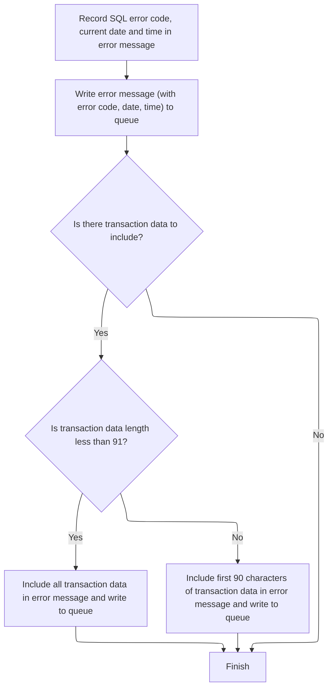

This section ensures that error details are accurately captured and logged, providing both technical and business context for troubleshooting and audit purposes. It also includes relevant transaction data when available, up to a defined limit, to aid in error resolution.

| Category       | Rule Name                        | Description                                                                                                                                                                  |
| -------------- | -------------------------------- | ---------------------------------------------------------------------------------------------------------------------------------------------------------------------------- |
| Business logic | Error message traceability       | Every error message must include the SQL error code, the current date, and the current time to ensure traceability and context for each logged error.                        |
| Business logic | Transaction data inclusion limit | If transaction (commarea) data is present, it must be included in the error message for additional context, but only up to a maximum of 90 characters.                       |
| Business logic | Transaction data truncation      | If the transaction data length is less than 91 characters, all transaction data must be included in the error message; otherwise, only the first 90 characters are included. |
| Business logic | Dual queue logging               | Error messages must be routed to both TDQ and TSQ queues to ensure they are available for both immediate processing and longer-term storage or review.                       |
| Business logic | No transaction data fallback     | If no transaction data is present, only the main error message is logged, without additional context.                                                                        |

<SwmSnippet path="/base/src/lgupdb01.cbl" line="502">

---

In <SwmToken path="base/src/lgupdb01.cbl" pos="502:1:5" line-data="       WRITE-ERROR-MESSAGE.">`WRITE-ERROR-MESSAGE`</SwmToken>, we grab the SQLCODE, get the current timestamp, format it, and stuff all that into the error message fields. This sets up the error details before we actually log anything.

```cobol
       WRITE-ERROR-MESSAGE.
      * Save SQLCODE in message
           MOVE SQLCODE TO EM-SQLRC
      * Obtain and format current time and date
           EXEC CICS ASKTIME ABSTIME(WS-ABSTIME)
           END-EXEC
           EXEC CICS FORMATTIME ABSTIME(WS-ABSTIME)
                     MMDDYYYY(WS-DATE)
                     TIME(WS-TIME)
           END-EXEC
```

---

</SwmSnippet>

<SwmSnippet path="/base/src/lgupdb01.cbl" line="512">

---

After prepping the error message, we call LGSTSQ to actually queue the error details. This hands off the logging to the message handling program, which is designed to route these messages to the right queues.

```cobol
           MOVE WS-DATE TO EM-DATE
           MOVE WS-TIME TO EM-TIME
      * Write output message to TDQ
           EXEC CICS LINK PROGRAM('LGSTSQ')
                     COMMAREA(ERROR-MSG)
                     LENGTH(LENGTH OF ERROR-MSG)
           END-EXEC.
```

---

</SwmSnippet>

<SwmSnippet path="/base/src/lgstsq.cbl" line="55">

---

LGSTSQ decides how to process and route the message, then writes it to both TDQ and TSQ queues, and sends a response if needed.

```cobol
       MAINLINE SECTION.

           MOVE SPACES TO WRITE-MSG.
           MOVE SPACES TO WS-RECV.

           EXEC CICS ASSIGN SYSID(WRITE-MSG-SYSID)
                RESP(WS-RESP)
           END-EXEC.

           EXEC CICS ASSIGN INVOKINGPROG(WS-INVOKEPROG)
                RESP(WS-RESP)
           END-EXEC.
           
           IF WS-INVOKEPROG NOT = SPACES
              MOVE 'C' To WS-FLAG
              MOVE COMMA-DATA  TO WRITE-MSG-MSG
              MOVE EIBCALEN    TO WS-RECV-LEN
           ELSE
              EXEC CICS RECEIVE INTO(WS-RECV)
                  LENGTH(WS-RECV-LEN)
                  RESP(WS-RESP)
              END-EXEC
              MOVE 'R' To WS-FLAG
              MOVE WS-RECV-DATA  TO WRITE-MSG-MSG
              SUBTRACT 5 FROM WS-RECV-LEN
           END-IF.

           MOVE 'GENAERRS' TO STSQ-NAME.
           IF WRITE-MSG-MSG(1:2) = 'Q=' THEN
              MOVE WRITE-MSG-MSG(3:4) TO STSQ-EXT
              MOVE WRITE-MSG-REST TO TEMPO
              MOVE TEMPO          TO WRITE-MSG-MSG
              SUBTRACT 7 FROM WS-RECV-LEN
           END-IF.

           ADD 5 TO WS-RECV-LEN.

      * Write output message to TDQ CSMT
      *
           EXEC CICS WRITEQ TD QUEUE(STDQ-NAME)
                     FROM(WRITE-MSG)
                     RESP(WS-RESP)
                     LENGTH(WS-RECV-LEN)

           END-EXEC.

      * Write output message to Genapp TSQ
      * If no space is available then the task will not wait for
      *  storage to become available but will ignore the request...
      *
           EXEC CICS WRITEQ TS QUEUE(STSQ-NAME)
                     FROM(WRITE-MSG)
                     RESP(WS-RESP)
                     NOSUSPEND
                     LENGTH(WS-RECV-LEN)

           END-EXEC.

           If WS-FLAG = 'R' Then
             EXEC CICS SEND TEXT FROM(FILLER-X)
              WAIT
              ERASE
              LENGTH(1)
              FREEKB
             END-EXEC.

           EXEC CICS RETURN
           END-EXEC.
```

---

</SwmSnippet>

<SwmSnippet path="/base/src/lgupdb01.cbl" line="520">

---

After logging the main error, we log up to 90 bytes of commarea data for extra context.

```cobol
           IF EIBCALEN > 0 THEN
             IF EIBCALEN < 91 THEN
               MOVE DFHCOMMAREA(1:EIBCALEN) TO CA-DATA
               EXEC CICS LINK PROGRAM('LGSTSQ')
                         COMMAREA(CA-ERROR-MSG)
                         LENGTH(LENGTH OF CA-ERROR-MSG)
               END-EXEC
             ELSE
               MOVE DFHCOMMAREA(1:90) TO CA-DATA
               EXEC CICS LINK PROGRAM('LGSTSQ')
                         COMMAREA(CA-ERROR-MSG)
                         LENGTH(LENGTH OF CA-ERROR-MSG)
               END-EXEC
             END-IF
           END-IF.
           EXIT.
```

---

</SwmSnippet>

## Preparing policy data for <SwmToken path="base/src/lgupdb01.cbl" pos="175:5:5" line-data="      * initialize DB2 host variables">`DB2`</SwmToken> update

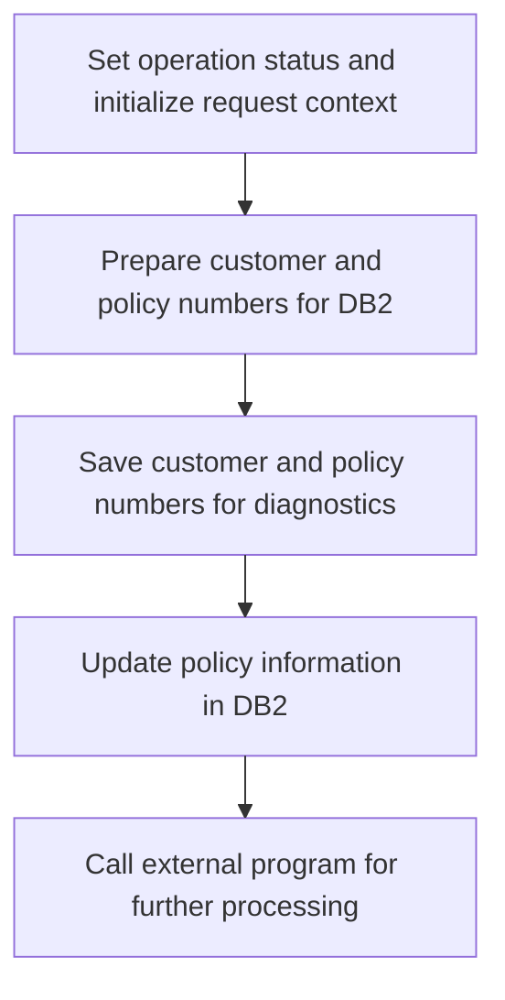

<SwmSnippet path="/base/src/lgupdb01.cbl" line="190">

---

After <SwmToken path="base/src/lgupdb01.cbl" pos="185:3:7" line-data="               PERFORM WRITE-ERROR-MESSAGE">`WRITE-ERROR-MESSAGE`</SwmToken>, MAINLINE sets up the return code, copies commarea lengths, and moves customer/policy numbers into both <SwmToken path="base/src/lgupdb01.cbl" pos="194:17:17" line-data="      * Convert commarea customer &amp; policy nums to DB2 integer format">`DB2`</SwmToken> integer fields and error message fields. This preps everything for the <SwmToken path="base/src/lgupdb01.cbl" pos="194:17:17" line-data="      * Convert commarea customer &amp; policy nums to DB2 integer format">`DB2`</SwmToken> update and error tracking.

```cobol
           MOVE '00' TO CA-RETURN-CODE
           MOVE EIBCALEN TO WS-CALEN.
           SET WS-ADDR-DFHCOMMAREA TO ADDRESS OF DFHCOMMAREA.

      * Convert commarea customer & policy nums to DB2 integer format
           MOVE CA-CUSTOMER-NUM TO DB2-CUSTOMERNUM-INT
           MOVE CA-POLICY-NUM   TO DB2-POLICYNUM-INT
      * and save in error msg field incase required
           MOVE CA-CUSTOMER-NUM TO EM-CUSNUM
           MOVE CA-POLICY-NUM   TO EM-POLNUM
```

---

</SwmSnippet>

<SwmSnippet path="/base/src/lgupdb01.cbl" line="207">

---

After prepping all the fields, we call <SwmToken path="base/src/lgupdb01.cbl" pos="207:3:9" line-data="           PERFORM UPDATE-POLICY-DB2-INFO.">`UPDATE-POLICY-DB2-INFO`</SwmToken> to run the <SwmToken path="base/src/lgupdb01.cbl" pos="207:7:7" line-data="           PERFORM UPDATE-POLICY-DB2-INFO.">`DB2`</SwmToken> update logic. Once that's done, we link to <SwmToken path="base/src/lgupdb01.cbl" pos="209:9:9" line-data="           EXEC CICS LINK Program(LGUPVS01)">`LGUPVS01`</SwmToken> to handle the VSAM file update.

```cobol
           PERFORM UPDATE-POLICY-DB2-INFO.

           EXEC CICS LINK Program(LGUPVS01)
                Commarea(DFHCOMMAREA)
                LENGTH(225)
           END-EXEC.
```

---

</SwmSnippet>

# Running the <SwmToken path="base/src/lgupdb01.cbl" pos="175:5:5" line-data="      * initialize DB2 host variables">`DB2`</SwmToken> policy update

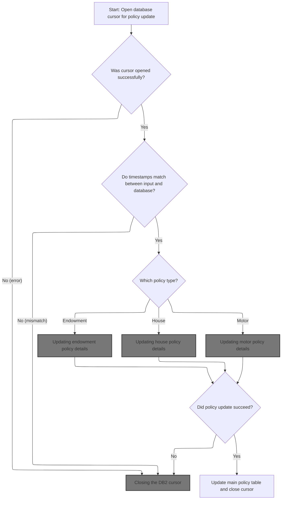

This section governs the process for updating policy records in the <SwmToken path="base/src/lgupdb01.cbl" pos="175:5:5" line-data="      * initialize DB2 host variables">`DB2`</SwmToken> database, ensuring that only valid and current data is updated, and that errors are handled appropriately. It supports updates for Endowment, House, and Motor policy types.

| Category        | Rule Name                   | Description                                                                                                                                             |
| --------------- | --------------------------- | ------------------------------------------------------------------------------------------------------------------------------------------------------- |
| Data validation | Timestamp concurrency check | Policy updates are only allowed if the timestamp in the input matches the timestamp in the database, ensuring that no concurrent changes have occurred. |
| Business logic  | Policy type routing         | The policy type must be determined from the input, and only the corresponding update routine (Endowment, House, Motor) is executed for that type.       |

<SwmSnippet path="/base/src/lgupdb01.cbl" line="251">

---

In <SwmToken path="base/src/lgupdb01.cbl" pos="251:1:7" line-data="       UPDATE-POLICY-DB2-INFO.">`UPDATE-POLICY-DB2-INFO`</SwmToken>, we open a <SwmToken path="base/src/lgupdb01.cbl" pos="251:5:5" line-data="       UPDATE-POLICY-DB2-INFO.">`DB2`</SwmToken> cursor to get ready for row-level updates. This sets up the context for fetching and updating the policy record.

```cobol
       UPDATE-POLICY-DB2-INFO.

      *    Open the cursor.
           MOVE ' OPEN   PCURSOR ' TO EM-SQLREQ
           EXEC SQL
             OPEN POLICY_CURSOR
           END-EXEC
```

---

</SwmSnippet>

<SwmSnippet path="/base/src/lgupdb01.cbl" line="259">

---

After opening the cursor, we check SQLCODE and set a return code. If there's an error, we log it with <SwmToken path="base/src/lgupdb01.cbl" pos="264:3:7" line-data="               PERFORM WRITE-ERROR-MESSAGE">`WRITE-ERROR-MESSAGE`</SwmToken> and bail out. These codes drive how the rest of the flow reacts.

```cobol
           Evaluate SQLCODE
             When 0
               MOVE '00' TO CA-RETURN-CODE
             When -913
               MOVE '90' TO CA-RETURN-CODE
               PERFORM WRITE-ERROR-MESSAGE
               EXEC CICS RETURN END-EXEC
             When Other
               MOVE '90' TO CA-RETURN-CODE
               PERFORM WRITE-ERROR-MESSAGE
               EXEC CICS RETURN END-EXEC
           END-Evaluate.
```

---

</SwmSnippet>

<SwmSnippet path="/base/src/lgupdb01.cbl" line="273">

---

After logging any errors, <SwmToken path="base/src/lgupdb01.cbl" pos="207:3:9" line-data="           PERFORM UPDATE-POLICY-DB2-INFO.">`UPDATE-POLICY-DB2-INFO`</SwmToken> fetches the policy row so we can work with the latest data for updates.

```cobol
           PERFORM FETCH-DB2-POLICY-ROW
```

---

</SwmSnippet>

<SwmSnippet path="/base/src/lgupdb01.cbl" line="275">

---

After fetching the row, we check if the timestamps match for concurrency. Then, based on <SwmToken path="base/src/lgupdb01.cbl" pos="283:3:7" line-data="             EVALUATE CA-REQUEST-ID">`CA-REQUEST-ID`</SwmToken>, we call the right update routine for the policy type—Endowment, House, or Motor.

```cobol
           IF SQLCODE = 0
      *      Fetch was successful
      *      Compare timestamp in commarea with that in DB2
             IF CA-LASTCHANGED EQUAL TO DB2-LASTCHANGED

      *----------------------------------------------------------------*
      *      Select for Update and Update specific policy type table   *
      *----------------------------------------------------------------*
             EVALUATE CA-REQUEST-ID

      *** Endowment ***
               WHEN '01UEND'
      *          Call routine to update Endowment table
                 PERFORM UPDATE-ENDOW-DB2-INFO

      *** House ***
               WHEN '01UHOU'
      *          Call routine to update Housetable
                 PERFORM UPDATE-HOUSE-DB2-INFO

      *** Motor ***
               WHEN '01UMOT'
      *          Call routine to update Motor table
                 PERFORM UPDATE-MOTOR-DB2-INFO

             END-EVALUATE
```

---

</SwmSnippet>

## Updating endowment policy details

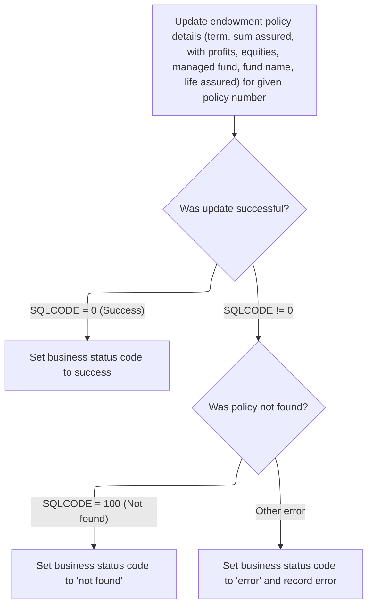

This section governs the rules for updating endowment policy details in the system and setting the appropriate business status code based on the outcome of the update operation.

| Category        | Rule Name                  | Description                                                                                                         |
| --------------- | -------------------------- | ------------------------------------------------------------------------------------------------------------------- |
| Data validation | Input validity requirement | The update operation must only proceed if all required input fields for the endowment policy are present and valid. |
| Business logic  | Successful update status   | If the update to the endowment policy is successful, the business status code must be set to indicate success.      |

<SwmSnippet path="/base/src/lgupdb01.cbl" line="387">

---

In <SwmToken path="base/src/lgupdb01.cbl" pos="387:1:7" line-data="       UPDATE-ENDOW-DB2-INFO.">`UPDATE-ENDOW-DB2-INFO`</SwmToken>, we convert the relevant commarea fields to <SwmToken path="base/src/lgupdb01.cbl" pos="387:5:5" line-data="       UPDATE-ENDOW-DB2-INFO.">`DB2`</SwmToken> integer formats and run the SQL UPDATE for the endowment policy. This assumes all input fields are valid.

```cobol
       UPDATE-ENDOW-DB2-INFO.

      *    Move numeric commarea fields to DB2 Integer formats
           MOVE CA-E-TERM        TO DB2-E-TERM-SINT
           MOVE CA-E-SUM-ASSURED TO DB2-E-SUMASSURED-INT

           MOVE ' UPDATE ENDOW ' TO EM-SQLREQ
           EXEC SQL
             UPDATE ENDOWMENT
               SET
                 WITHPROFITS   = :CA-E-WITH-PROFITS,
                   EQUITIES    = :CA-E-EQUITIES,
                   MANAGEDFUND = :CA-E-MANAGED-FUND,
                   FUNDNAME    = :CA-E-FUND-NAME,
                   TERM        = :DB2-E-TERM-SINT,
                   SUMASSURED  = :DB2-E-SUMASSURED-INT,
                   LIFEASSURED = :CA-E-LIFE-ASSURED
               WHERE
                   POLICYNUMBER = :DB2-POLICYNUM-INT
           END-EXEC
```

---

</SwmSnippet>

<SwmSnippet path="/base/src/lgupdb01.cbl" line="408">

---

After the update, if SQLCODE isn't zero, we set a return code ('01' for no row, '90' for error) and log the error with <SwmToken path="base/src/lgupdb01.cbl" pos="415:3:7" line-data="               PERFORM WRITE-ERROR-MESSAGE">`WRITE-ERROR-MESSAGE`</SwmToken>.

```cobol
           IF SQLCODE NOT EQUAL 0
      *      Non-zero SQLCODE from UPDATE statement
             IF SQLCODE EQUAL 100
               MOVE '01' TO CA-RETURN-CODE
             ELSE
               MOVE '90' TO CA-RETURN-CODE
      *        Write error message to TD QUEUE(CSMT)
               PERFORM WRITE-ERROR-MESSAGE
             END-IF
           END-IF.
           EXIT.
```

---

</SwmSnippet>

## Updating house policy details

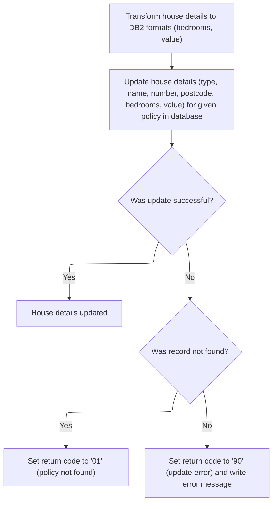

This section is responsible for updating house policy details in the database for a given policy number. It ensures that the provided details are correctly stored and that any errors during the update process are handled according to business rules.

| Category       | Rule Name                | Description                                                                                                                                                             |
| -------------- | ------------------------ | ----------------------------------------------------------------------------------------------------------------------------------------------------------------------- |
| Business logic | Update all house details | All provided house policy details (property type, house name, house number, postcode, bedrooms, value) must be updated for the specified policy number in the database. |

<SwmSnippet path="/base/src/lgupdb01.cbl" line="424">

---

In <SwmToken path="base/src/lgupdb01.cbl" pos="424:1:7" line-data="       UPDATE-HOUSE-DB2-INFO.">`UPDATE-HOUSE-DB2-INFO`</SwmToken>, we convert the relevant commarea fields to <SwmToken path="base/src/lgupdb01.cbl" pos="424:5:5" line-data="       UPDATE-HOUSE-DB2-INFO.">`DB2`</SwmToken> integer formats and run the SQL UPDATE for the house policy. This assumes all input fields are valid and the policy exists.

```cobol
       UPDATE-HOUSE-DB2-INFO.

      *    Move numeric commarea fields to DB2 Integer formats
           MOVE CA-H-BEDROOMS    TO DB2-H-BEDROOMS-SINT
           MOVE CA-H-VALUE       TO DB2-H-VALUE-INT

           MOVE ' UPDATE HOUSE ' TO EM-SQLREQ
           EXEC SQL
             UPDATE HOUSE
               SET
                    PROPERTYTYPE = :CA-H-PROPERTY-TYPE,
                    BEDROOMS     = :DB2-H-BEDROOMS-SINT,
                    VALUE        = :DB2-H-VALUE-INT,
                    HOUSENAME    = :CA-H-HOUSE-NAME,
                    HOUSENUMBER  = :CA-H-HOUSE-NUMBER,
                    POSTCODE     = :CA-H-POSTCODE
               WHERE
                    POLICYNUMBER = :DB2-POLICYNUM-INT
           END-EXEC
```

---

</SwmSnippet>

<SwmSnippet path="/base/src/lgupdb01.cbl" line="444">

---

After the update, if SQLCODE isn't zero, we set a return code ('01' for no row, '90' for error) and log the error with <SwmToken path="base/src/lgupdb01.cbl" pos="451:3:7" line-data="               PERFORM WRITE-ERROR-MESSAGE">`WRITE-ERROR-MESSAGE`</SwmToken>.

```cobol
           IF SQLCODE NOT EQUAL 0
      *      Non-zero SQLCODE from UPDATE statement
             IF SQLCODE = 100
               MOVE '01' TO CA-RETURN-CODE
             ELSE
               MOVE '90' TO CA-RETURN-CODE
      *        Write error message to TD QUEUE(CSMT)
               PERFORM WRITE-ERROR-MESSAGE
             END-IF
           END-IF.
           EXIT.
```

---

</SwmSnippet>

## Updating motor policy details

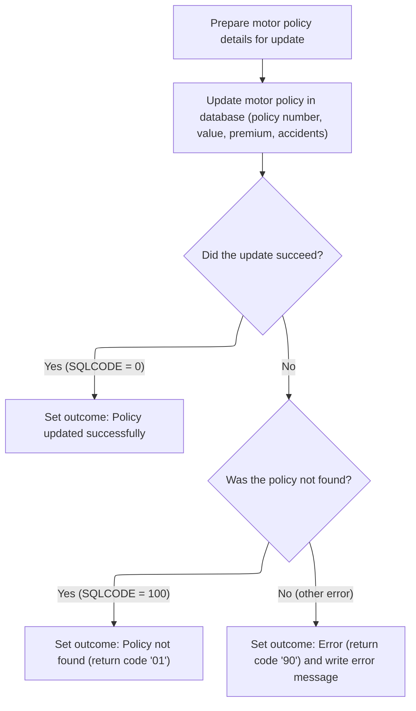

This section is responsible for updating motor policy details in the database. It ensures that the provided policy information is correctly mapped and attempts to update the corresponding record. The outcome is communicated via return codes and error messages.

| Category        | Rule Name                    | Description                                                                                                         |
| --------------- | ---------------------------- | ------------------------------------------------------------------------------------------------------------------- |
| Data validation | Valid policy number required | The motor policy update must only proceed if a valid policy number is provided in the input.                        |
| Business logic  | Successful update outcome    | If the update operation succeeds (SQLCODE = 0), the outcome must indicate that the policy was updated successfully. |

<SwmSnippet path="/base/src/lgupdb01.cbl" line="460">

---

In <SwmToken path="base/src/lgupdb01.cbl" pos="460:1:7" line-data="       UPDATE-MOTOR-DB2-INFO.">`UPDATE-MOTOR-DB2-INFO`</SwmToken>, we convert the relevant commarea fields to <SwmToken path="base/src/lgupdb01.cbl" pos="460:5:5" line-data="       UPDATE-MOTOR-DB2-INFO.">`DB2`</SwmToken> integer formats and run the SQL UPDATE for the motor policy. This assumes all input fields are valid and the policy exists.

```cobol
       UPDATE-MOTOR-DB2-INFO.

      *    Move numeric commarea fields to DB2 Integer formats
           MOVE CA-M-CC          TO DB2-M-CC-SINT
           MOVE CA-M-VALUE       TO DB2-M-VALUE-INT
           MOVE CA-M-PREMIUM     TO DB2-M-PREMIUM-INT
           MOVE CA-M-ACCIDENTS   TO DB2-M-ACCIDENTS-INT

           MOVE ' UPDATE MOTOR ' TO EM-SQLREQ
           EXEC SQL
             UPDATE MOTOR
               SET
                    MAKE              = :CA-M-MAKE,
                    MODEL             = :CA-M-MODEL,
                    VALUE             = :DB2-M-VALUE-INT,
                    REGNUMBER         = :CA-M-REGNUMBER,
                    COLOUR            = :CA-M-COLOUR,
                    CC                = :DB2-M-CC-SINT,
                    YEAROFMANUFACTURE = :CA-M-MANUFACTURED,
                    PREMIUM           = :DB2-M-PREMIUM-INT,
                    ACCIDENTS         = :DB2-M-ACCIDENTS-INT
               WHERE
                    POLICYNUMBER      = :DB2-POLICYNUM-INT
           END-EXEC
```

---

</SwmSnippet>

<SwmSnippet path="/base/src/lgupdb01.cbl" line="485">

---

After the update, if SQLCODE isn't zero, we set a return code ('01' for no row, '90' for error) and log the error with <SwmToken path="base/src/lgupdb01.cbl" pos="492:3:7" line-data="               PERFORM WRITE-ERROR-MESSAGE">`WRITE-ERROR-MESSAGE`</SwmToken>.

```cobol
           IF SQLCODE NOT EQUAL 0
      *      Non-zero SQLCODE from UPDATE statement
             IF SQLCODE EQUAL 100
               MOVE '01' TO CA-RETURN-CODE
             ELSE
               MOVE '90' TO CA-RETURN-CODE
      *        Write error message to TD QUEUE(CSMT)
               PERFORM WRITE-ERROR-MESSAGE
             END-IF
           END-IF.
           EXIT.
```

---

</SwmSnippet>

## Handling failed policy type updates

<SwmSnippet path="/base/src/lgupdb01.cbl" line="302">

---

After returning from <SwmToken path="base/src/lgupdb01.cbl" pos="298:3:9" line-data="                 PERFORM UPDATE-MOTOR-DB2-INFO">`UPDATE-MOTOR-DB2-INFO`</SwmToken>, if the update failed, <SwmToken path="base/src/lgupdb01.cbl" pos="207:3:9" line-data="           PERFORM UPDATE-POLICY-DB2-INFO.">`UPDATE-POLICY-DB2-INFO`</SwmToken> closes the cursor and exits to clean up <SwmToken path="base/src/lgupdb01.cbl" pos="175:5:5" line-data="      * initialize DB2 host variables">`DB2`</SwmToken> resources.

```cobol
              IF CA-RETURN-CODE NOT EQUAL '00'
      *         Update policy type specific table has failed
      *         So close cursor and return
                PERFORM CLOSE-PCURSOR
                EXEC CICS RETURN END-EXEC
              END-IF
```

---

</SwmSnippet>

## Closing the <SwmToken path="base/src/lgupdb01.cbl" pos="175:5:5" line-data="      * initialize DB2 host variables">`DB2`</SwmToken> cursor

```mermaid
%%{init: {"flowchart": {"defaultRenderer": "elk"}} }%%
flowchart TD
    node1["Initiate close of policy cursor (EM-SQLREQ updated)"] --> node2{"SQLCODE result"}
    click node1 openCode "base/src/lgupdb01.cbl:362:367"
    node2 -->|"0 (Success)"| node3["Set outcome code to '00'"]
    click node3 openCode "base/src/lgupdb01.cbl:369:371"
    node2 -->|"-501 (Already closed)"| node4["Set outcome code to '00' and update EM-SQLREQ with '-501 detected'"]
    click node4 openCode "base/src/lgupdb01.cbl:372:374"
    node2 -->|"Other (Error)"| node5["Set outcome code to '90', write error message, and return"]
    click node5 openCode "base/src/lgupdb01.cbl:377:379"
    node3 --> node6["Return control"]
    click node6 openCode "base/src/lgupdb01.cbl:375:381"
    node4 --> node6
    node5 --> node6
classDef HeadingStyle fill:#777777,stroke:#333,stroke-width:2px;

%% Swimm:
%% %%{init: {"flowchart": {"defaultRenderer": "elk"}} }%%
%% flowchart TD
%%     node1["Initiate close of policy cursor (<SwmToken path="base/src/lgupdb01.cbl" pos="254:13:15" line-data="           MOVE &#39; OPEN   PCURSOR &#39; TO EM-SQLREQ">`EM-SQLREQ`</SwmToken> updated)"] --> node2{"SQLCODE result"}
%%     click node1 openCode "<SwmPath>[base/src/lgupdb01.cbl](base/src/lgupdb01.cbl)</SwmPath>:362:367"
%%     node2 -->|"0 (Success)"| node3["Set outcome code to '00'"]
%%     click node3 openCode "<SwmPath>[base/src/lgupdb01.cbl](base/src/lgupdb01.cbl)</SwmPath>:369:371"
%%     node2 -->|"-501 (Already closed)"| node4["Set outcome code to '00' and update <SwmToken path="base/src/lgupdb01.cbl" pos="254:13:15" line-data="           MOVE &#39; OPEN   PCURSOR &#39; TO EM-SQLREQ">`EM-SQLREQ`</SwmToken> with '-501 detected'"]
%%     click node4 openCode "<SwmPath>[base/src/lgupdb01.cbl](base/src/lgupdb01.cbl)</SwmPath>:372:374"
%%     node2 -->|"Other (Error)"| node5["Set outcome code to '90', write error message, and return"]
%%     click node5 openCode "<SwmPath>[base/src/lgupdb01.cbl](base/src/lgupdb01.cbl)</SwmPath>:377:379"
%%     node3 --> node6["Return control"]
%%     click node6 openCode "<SwmPath>[base/src/lgupdb01.cbl](base/src/lgupdb01.cbl)</SwmPath>:375:381"
%%     node4 --> node6
%%     node5 --> node6
%% classDef HeadingStyle fill:#777777,stroke:#333,stroke-width:2px;
```

This section ensures that <SwmToken path="base/src/lgupdb01.cbl" pos="175:5:5" line-data="      * initialize DB2 host variables">`DB2`</SwmToken> resources are properly released by closing the policy cursor, and communicates the outcome of the operation through status codes and error messages.

| Category       | Rule Name                       | Description                                                                                                                                           |
| -------------- | ------------------------------- | ----------------------------------------------------------------------------------------------------------------------------------------------------- |
| Business logic | Successful cursor close outcome | If the SQL CLOSE operation on the policy cursor returns a success code (SQLCODE = 0), set the outcome code to '00' to indicate successful completion. |
| Business logic | Return control after close      | After any cursor close attempt, control is returned to the calling process, regardless of the outcome.                                                |

<SwmSnippet path="/base/src/lgupdb01.cbl" line="362">

---

In <SwmToken path="base/src/lgupdb01.cbl" pos="362:1:3" line-data="       CLOSE-PCURSOR.">`CLOSE-PCURSOR`</SwmToken>, we run the SQL CLOSE on the policy cursor to free up <SwmToken path="base/src/lgupdb01.cbl" pos="175:5:5" line-data="      * initialize DB2 host variables">`DB2`</SwmToken> resources after we're done with updates.

```cobol
       CLOSE-PCURSOR.
      *    Now close the Cursor and we're done!
           MOVE ' CLOSE  PCURSOR' TO EM-SQLREQ
           EXEC SQL
             CLOSE POLICY_CURSOR
           END-EXEC.
```

---

</SwmSnippet>

<SwmSnippet path="/base/src/lgupdb01.cbl" line="369">

---

After closing the cursor, we check SQLCODE and set a return code. If there's an error, we log it with <SwmToken path="base/src/lgupdb01.cbl" pos="378:3:7" line-data="               PERFORM WRITE-ERROR-MESSAGE">`WRITE-ERROR-MESSAGE`</SwmToken> and exit.

```cobol
           Evaluate SQLCODE
             When 0
               MOVE '00' TO CA-RETURN-CODE
             When -501
               MOVE '00' TO CA-RETURN-CODE
               MOVE '-501 detected c' TO EM-SQLREQ
               EXEC CICS RETURN END-EXEC
             When Other
               MOVE '90' TO CA-RETURN-CODE
               PERFORM WRITE-ERROR-MESSAGE
               EXEC CICS RETURN END-EXEC
           END-Evaluate.
           EXIT.
```

---

</SwmSnippet>

## Finalizing policy table updates

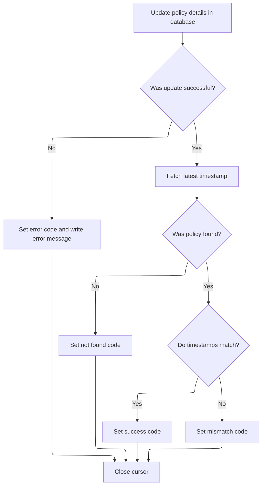

<SwmSnippet path="/base/src/lgupdb01.cbl" line="313">

---

After closing the cursor, <SwmToken path="base/src/lgupdb01.cbl" pos="207:3:9" line-data="           PERFORM UPDATE-POLICY-DB2-INFO.">`UPDATE-POLICY-DB2-INFO`</SwmToken> maps commarea fields to <SwmToken path="base/src/lgupdb01.cbl" pos="313:9:9" line-data="               MOVE CA-BROKERID      TO DB2-BROKERID-INT">`DB2`</SwmToken> host variables and runs the policy table update using those mapped values.

```cobol
               MOVE CA-BROKERID      TO DB2-BROKERID-INT
               MOVE CA-PAYMENT       TO DB2-PAYMENT-INT

      *        Update policy table details
               MOVE ' UPDATE POLICY  ' TO EM-SQLREQ
               EXEC SQL
                 UPDATE POLICY
                   SET ISSUEDATE        = :CA-ISSUE-DATE,
                       EXPIRYDATE       = :CA-EXPIRY-DATE,
                       LASTCHANGED      = CURRENT TIMESTAMP ,
                       BROKERID         = :DB2-BROKERID-INT,
                       BROKERSREFERENCE = :CA-BROKERSREF
                   WHERE CURRENT OF POLICY_CURSOR
               END-EXEC
```

---

</SwmSnippet>

<SwmSnippet path="/base/src/lgupdb01.cbl" line="329">

---

After updating the policy, we select the new LASTCHANGED timestamp and copy it to the commarea for concurrency tracking.

```cobol
               EXEC SQL
                 SELECT LASTCHANGED
                   INTO :CA-LASTCHANGED
                   FROM POLICY
                   WHERE POLICYNUMBER = :DB2-POLICYNUM-INT
               END-EXEC
```

---

</SwmSnippet>

<SwmSnippet path="/base/src/lgupdb01.cbl" line="336">

---

After updating, we check SQLCODE. If it failed, we rollback, set the error code, and log the error.

```cobol
               IF SQLCODE NOT EQUAL 0
      *          Non-zero SQLCODE from Update of policy table
                   EXEC CICS SYNCPOINT ROLLBACK END-EXEC
                   MOVE '90' TO CA-RETURN-CODE
      *            Write error message to TD QUEUE(CSMT)
                   PERFORM WRITE-ERROR-MESSAGE
               END-IF
```

---

</SwmSnippet>

<SwmSnippet path="/base/src/lgupdb01.cbl" line="344">

---

If the timestamps don't match, we set the return code to '02' to signal a concurrency issue and skip the update.

```cobol
             ELSE
      *        Timestamps do not match (policy table v commarea)
               MOVE '02' TO CA-RETURN-CODE
             END-IF
```

---

</SwmSnippet>

<SwmSnippet path="/base/src/lgupdb01.cbl" line="349">

---

If the fetch failed, we set the return code to '01' to show no row was found.

```cobol
           ELSE
      *      Non-zero SQLCODE from first SQL FETCH statement
             IF SQLCODE EQUAL 100
               MOVE '01' TO CA-RETURN-CODE
```

---

</SwmSnippet>

<SwmSnippet path="/base/src/lgupdb01.cbl" line="353">

---

At the end, we set the final return code, log any errors, and close the cursor before exiting. This wraps up the <SwmToken path="base/src/lgupdb01.cbl" pos="175:5:5" line-data="      * initialize DB2 host variables">`DB2`</SwmToken> update flow.

```cobol
             ELSE
               MOVE '90' TO CA-RETURN-CODE
      *        Write error message to TD QUEUE(CSMT)
               PERFORM WRITE-ERROR-MESSAGE
             END-IF
           END-IF.
      *    Now close the Cursor and we're done!
           PERFORM CLOSE-PCURSOR.
```

---

</SwmSnippet>

# Updating VSAM policy records

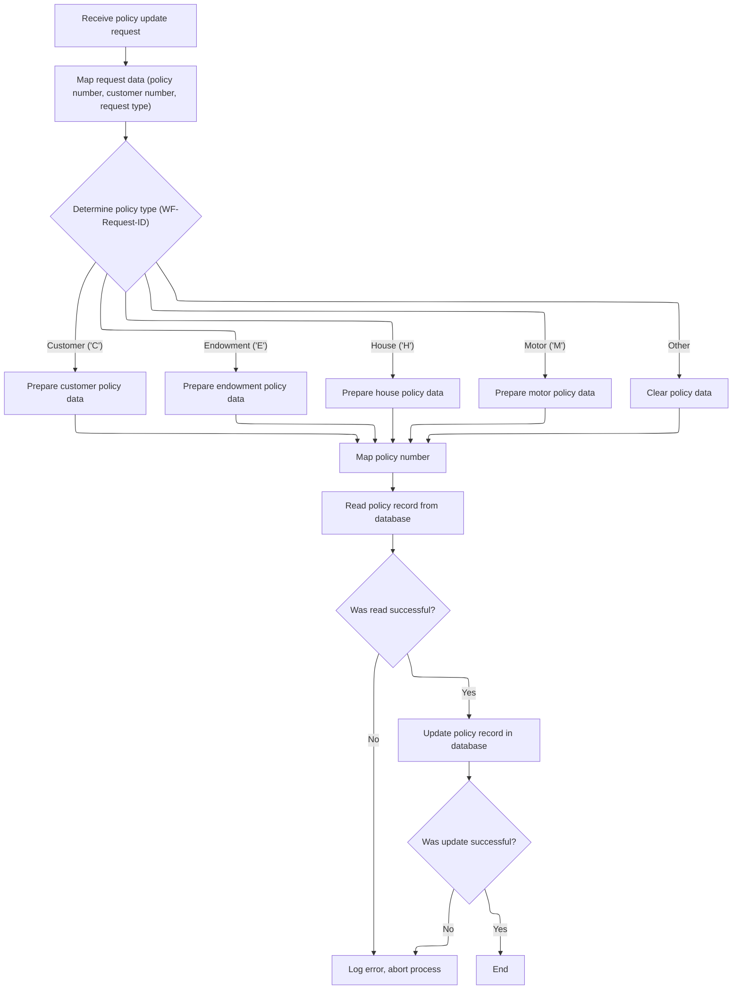

This section governs the process for updating policy records in the VSAM database. It ensures that only valid requests are processed, the correct policy data is updated according to the policy type, and errors are handled and logged appropriately.

| Category        | Rule Name                   | Description                                                                                                                                                                                                                                                                                                                                                    |
| --------------- | --------------------------- | -------------------------------------------------------------------------------------------------------------------------------------------------------------------------------------------------------------------------------------------------------------------------------------------------------------------------------------------------------------- |
| Data validation | Policy type determination   | The policy type must be determined using the 4th character of the <SwmToken path="base/src/lgupvs01.cbl" pos="102:3:7" line-data="           Move CA-Request-ID(4:1) To WF-Request-ID">`CA-Request-ID`</SwmToken> field. Only the following types are valid: Customer ('C'), Endowment ('E'), House ('H'), Motor ('M'). Any other value is treated as 'Other'. |
| Business logic  | Policy data mapping by type | For each valid policy type, only the corresponding data fields are mapped from the request to the working storage. For 'Other', all policy data fields are cleared.                                                                                                                                                                                            |

<SwmSnippet path="/base/src/lgupvs01.cbl" line="97">

---

In MAINLINE (<SwmToken path="base/src/lgupdb01.cbl" pos="209:9:9" line-data="           EXEC CICS LINK Program(LGUPVS01)">`LGUPVS01`</SwmToken>), we use the 4th character of <SwmToken path="base/src/lgupvs01.cbl" pos="102:3:7" line-data="           Move CA-Request-ID(4:1) To WF-Request-ID">`CA-Request-ID`</SwmToken> to pick which policy data fields to move, then read and rewrite the VSAM record. If anything fails, we log the error and abend with a specific code.

```cobol
       MAINLINE SECTION.
      *
      *---------------------------------------------------------------*
           Move EIBCALEN To WS-Commarea-Len.
      *---------------------------------------------------------------*
           Move CA-Request-ID(4:1) To WF-Request-ID
           Move CA-Policy-Num      To WF-Policy-Num
           Move CA-Customer-Num    To WF-Customer-Num

           Evaluate WF-Request-ID

             When 'C'
               Move CA-B-Postcode  To WF-B-Postcode
               Move CA-B-Status    To WF-B-Status
               Move CA-B-Customer  To WF-B-Customer

             When 'E'
               Move CA-E-WITH-PROFITS To  WF-E-WITH-PROFITS
               Move CA-E-EQUITIES     To  WF-E-EQUITIES
               Move CA-E-MANAGED-FUND To  WF-E-MANAGED-FUND
               Move CA-E-FUND-NAME    To  WF-E-FUND-NAME
               Move CA-E-LIFE-ASSURED To  WF-E-LIFE-ASSURED

             When 'H'
               Move CA-H-PROPERTY-TYPE To  WF-H-PROPERTY-TYPE
               Move CA-H-BEDROOMS      To  WF-H-BEDROOMS
               Move CA-H-VALUE         To  WF-H-VALUE
               Move CA-H-POSTCODE      To  WF-H-POSTCODE
               Move CA-H-HOUSE-NAME    To  WF-H-HOUSE-NAME

             When 'M'
               Move CA-M-MAKE          To  WF-M-MAKE
               Move CA-M-MODEL         To  WF-M-MODEL
               Move CA-M-VALUE         To  WF-M-VALUE
               Move CA-M-REGNUMBER     To  WF-M-REGNUMBER

             When Other
               Move Spaces To WF-Policy-Data
           End-Evaluate

           Move CA-Policy-Num      To WF-Policy-Num
      *---------------------------------------------------------------*
           Exec CICS Read File('KSDSPOLY')
                     Into(WS-FileIn)
                     Length(WS-Commarea-Len)
                     Ridfld(WF-Policy-Key)
                     KeyLength(21)
                     RESP(WS-RESP)
                     Update
           End-Exec.
           If WS-RESP Not = DFHRESP(NORMAL)
             Move EIBRESP2 To WS-RESP2
             MOVE '81' TO CA-RETURN-CODE
             PERFORM WRITE-ERROR-MESSAGE
             EXEC CICS ABEND ABCODE('LGV3') NODUMP END-EXEC
             EXEC CICS RETURN END-EXEC
           End-If.
      *---------------------------------------------------------------*
           Exec CICS ReWrite File('KSDSPOLY')
                     From(WF-Policy-Info)
                     Length(WS-Commarea-LenF)
                     RESP(WS-RESP)
           End-Exec.
           If WS-RESP Not = DFHRESP(NORMAL)
             Move EIBRESP2 To WS-RESP2
             MOVE '82' TO CA-RETURN-CODE
             PERFORM WRITE-ERROR-MESSAGE
             EXEC CICS ABEND ABCODE('LGV4') NODUMP END-EXEC
             EXEC CICS RETURN END-EXEC
           End-If.
```

---

</SwmSnippet>

<SwmSnippet path="/base/src/lgupvs01.cbl" line="174">

---

In <SwmToken path="base/src/lgupvs01.cbl" pos="174:1:5" line-data="       WRITE-ERROR-MESSAGE.">`WRITE-ERROR-MESSAGE`</SwmToken> (<SwmToken path="base/src/lgupdb01.cbl" pos="209:9:9" line-data="           EXEC CICS LINK Program(LGUPVS01)">`LGUPVS01`</SwmToken>), we format the timestamp, fill out the error message fields, and call LGSTSQ to log the error. If there's commarea data, we slice up to 90 bytes and log that too. This keeps error logs precise and avoids buffer overflow.

```cobol
       WRITE-ERROR-MESSAGE.
           EXEC CICS ASKTIME ABSTIME(WS-ABSTIME)
           END-EXEC
           EXEC CICS FORMATTIME ABSTIME(WS-ABSTIME)
                     MMDDYYYY(WS-DATE)
                     TIME(WS-TIME)
           END-EXEC
      *
           MOVE WS-DATE TO EM-DATE
           MOVE WS-TIME TO EM-TIME
           Move CA-Customer-Num To EM-Cusnum
           Move WS-RESP         To EM-RespRC
           Move WS-RESP2        To EM-Resp2RC
           EXEC CICS LINK PROGRAM('LGSTSQ')
                     COMMAREA(ERROR-MSG)
                     LENGTH(LENGTH OF ERROR-MSG)
           END-EXEC.
           IF EIBCALEN > 0 THEN
             IF EIBCALEN < 91 THEN
               MOVE DFHCOMMAREA(1:EIBCALEN) TO CA-DATA
               EXEC CICS LINK PROGRAM('LGSTSQ')
                         COMMAREA(CA-ERROR-MSG)
                         LENGTH(Length Of CA-ERROR-MSG)
               END-EXEC
             ELSE
               MOVE DFHCOMMAREA(1:90) TO CA-DATA
               EXEC CICS LINK PROGRAM('LGSTSQ')
                         COMMAREA(CA-ERROR-MSG)
                         LENGTH(Length Of CA-ERROR-MSG)
               END-EXEC
             END-IF
           END-IF.
           EXIT.
```

---

</SwmSnippet>

&nbsp;

*This is an auto-generated document by Swimm 🌊 and has not yet been verified by a human*

<SwmMeta version="3.0.0" repo-id="Z2l0aHViJTNBJTNBU3dpbW1pby1nZW5hcHAtbW90b3IlM0ElM0FHaXJpLVN3aW1t" repo-name="Swimmio-genapp-motor"><sup>Powered by [Swimm](https://app.swimm.io/)</sup></SwmMeta>
