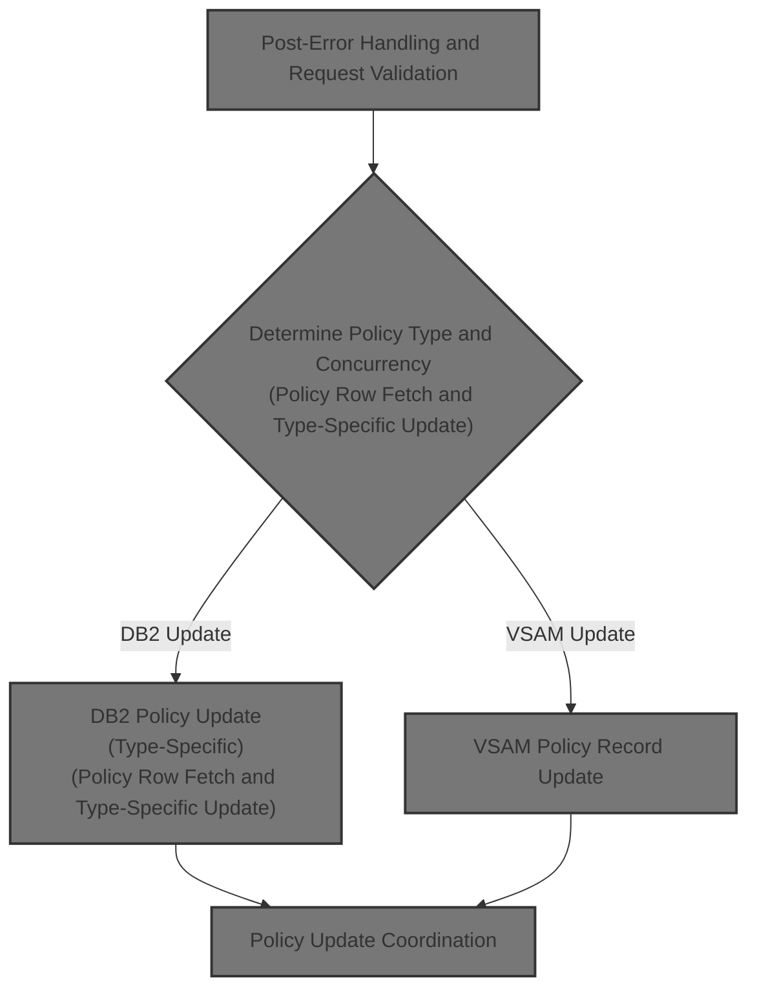
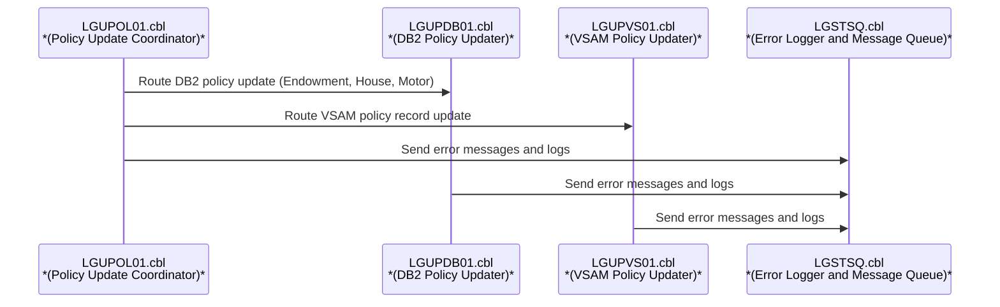
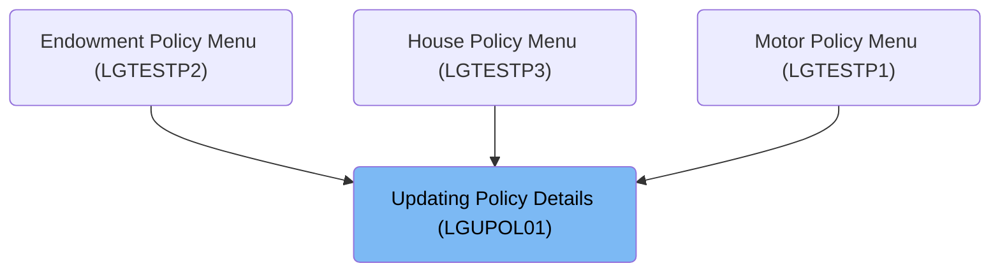
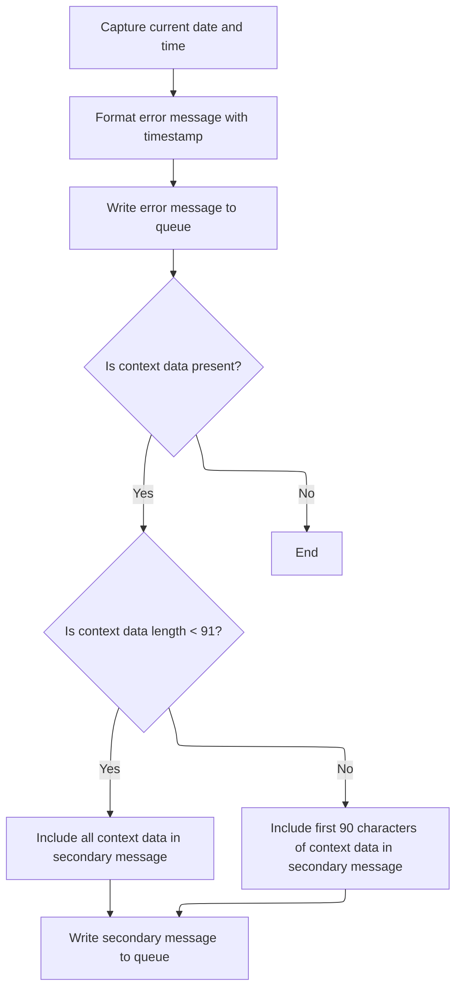
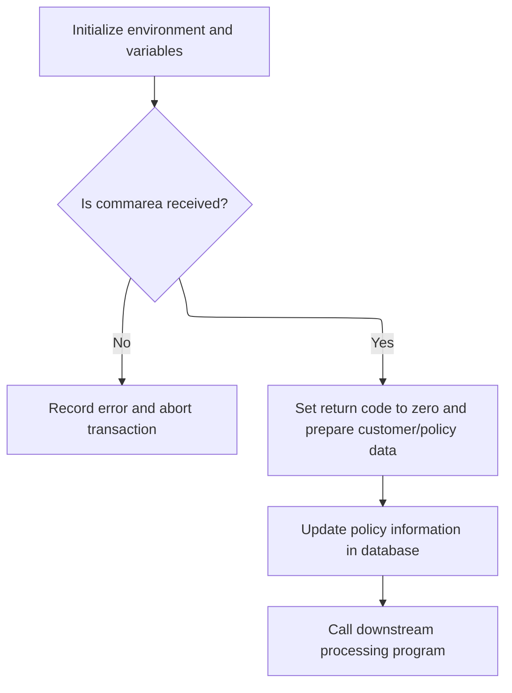
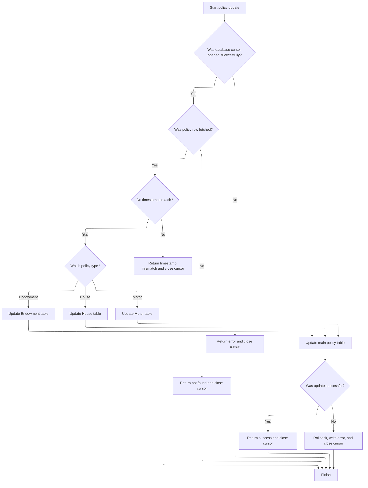
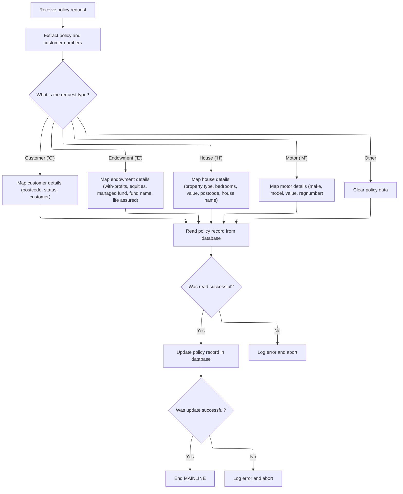

# Overview

This document explains the flow for updating insurance policy details. The process validates requests, coordinates updates to <SwmToken path="base/src/lgupol01.cbl" pos="143:7:7" line-data="           PERFORM UPDATE-POLICY-DB2-INFO.">`DB2`</SwmToken> and VSAM databases, manages concurrency, and logs errors with context. Input consists of policy update requests; output is updated policy records and status codes.



# Technical Overview



## Dependencies

### Programs

- <SwmToken path="base/src/lgupol01.cbl" pos="157:9:9" line-data="           EXEC CICS LINK Program(LGUPDB01)">`LGUPDB01`</SwmToken> (<SwmPath>[base/src/lgupdb01.cbl](base/src/lgupdb01.cbl)</SwmPath>)
- <SwmToken path="base/src/lgupdb01.cbl" pos="209:9:9" line-data="           EXEC CICS LINK Program(LGUPVS01)">`LGUPVS01`</SwmToken> (<SwmPath>[base/src/lgupvs01.cbl](base/src/lgupvs01.cbl)</SwmPath>)
- LGSTSQ (<SwmPath>[base/src/lgstsq.cbl](base/src/lgstsq.cbl)</SwmPath>)

### Copybooks

- LGCMAREA (<SwmPath>[base/src/lgcmarea.cpy](base/src/lgcmarea.cpy)</SwmPath>)
- LGPOLICY (<SwmPath>[base/src/lgpolicy.cpy](base/src/lgpolicy.cpy)</SwmPath>)
- SQLCA

# Where is this program used?

This program is used multiple times in the codebase as represented in the following diagram:



# Workflow

# Startup and Input Validation

This section ensures that the program starts with the correct context and input validation. It sets up all necessary identifiers for logging and error handling, and enforces that missing input is always recorded and the transaction is stopped to maintain data integrity.

| Category        | Rule Name                   | Description                                                                                                                                                                                                                    |
| --------------- | --------------------------- | ------------------------------------------------------------------------------------------------------------------------------------------------------------------------------------------------------------------------------ |
| Data validation | Mandatory Input Enforcement | If the commarea input is missing (length is zero), the program must record an error message detailing the missing input and terminate the transaction immediately. This prevents any processing on incomplete or invalid data. |
| Business logic  | Context Initialization      | The program must initialize all working storage header variables before any business logic is executed. This ensures that transaction, terminal, and task identifiers are available for subsequent logging and error handling. |

<SwmSnippet path="/base/src/lgupol01.cbl" line="83">

---

In <SwmToken path="base/src/lgupol01.cbl" pos="83:1:1" line-data="       MAINLINE SECTION.">`MAINLINE`</SwmToken>, this is where the flow starts. It sets up the working storage header and copies the transaction, terminal, and task identifiers from the CICS environment into local variables. This context is used for logging and error handling later in the flow.

```cobol
       MAINLINE SECTION.

      *----------------------------------------------------------------*
      * Common code                                                    *
      *----------------------------------------------------------------*
      * initialize working storage variables
           INITIALIZE WS-HEADER.
      * set up general variable
           MOVE EIBTRNID TO WS-TRANSID.
           MOVE EIBTRMID TO WS-TERMID.
           MOVE EIBTASKN TO WS-TASKNUM.
```

---

</SwmSnippet>

<SwmSnippet path="/base/src/lgupol01.cbl" line="99">

---

Here we check if the commarea is missing (EIBCALEN = 0). If so, we log an error message using <SwmToken path="base/src/lgupol01.cbl" pos="101:3:7" line-data="               PERFORM WRITE-ERROR-MESSAGE">`WRITE-ERROR-MESSAGE`</SwmToken> and then abend the transaction. This guarantees that missing input is always recorded before the program stops.

```cobol
           IF EIBCALEN IS EQUAL TO ZERO
               MOVE ' NO COMMAREA RECEIVED' TO EM-VARIABLE
               PERFORM WRITE-ERROR-MESSAGE
               EXEC CICS ABEND ABCODE('LGCA') NODUMP END-EXEC
           END-IF
```

---

</SwmSnippet>

## Error Logging and Message Formatting



This section ensures that all error events are logged with accurate timestamps and relevant context data, supporting traceability and concise error reporting.

| Category       | Rule Name               | Description                                                                                                                       |
| -------------- | ----------------------- | --------------------------------------------------------------------------------------------------------------------------------- |
| Business logic | Timestamp inclusion     | Every error message must include the current system date and time for traceability.                                               |
| Business logic | Dual queue logging      | Error messages must be written to both transient data queues and temporary storage queues to ensure redundancy and accessibility. |
| Business logic | Context data inclusion  | If context data is present, a secondary error message must be generated containing up to 90 characters of the context data.       |
| Business logic | Context data truncation | If the context data length exceeds 90 characters, only the first 90 characters are included in the secondary message.             |

<SwmSnippet path="/base/src/lgupol01.cbl" line="169">

---

In <SwmToken path="base/src/lgupol01.cbl" pos="169:1:5" line-data="       WRITE-ERROR-MESSAGE.">`WRITE-ERROR-MESSAGE`</SwmToken>, we grab the current system time and date using CICS commands, format them, and store them in the error message structure. This timestamp gets attached to every error log for traceability.

```cobol
       WRITE-ERROR-MESSAGE.
      * Save SQLCODE in message
      * Obtain and format current time and date
           EXEC CICS ASKTIME ABSTIME(WS-ABSTIME)
           END-EXEC
           EXEC CICS FORMATTIME ABSTIME(WS-ABSTIME)
                     MMDDYYYY(WS-DATE)
                     TIME(WS-TIME)
           END-EXEC
```

---

</SwmSnippet>

<SwmSnippet path="/base/src/lgupol01.cbl" line="178">

---

We send the error message to the queue by calling LGSTSQ.

```cobol
           MOVE WS-DATE TO EM-DATE
           MOVE WS-TIME TO EM-TIME
      * Write output message to TDQ
           EXEC CICS LINK PROGRAM('LGSTSQ')
                     COMMAREA(ERROR-MSG)
                     LENGTH(LENGTH OF ERROR-MSG)
           END-EXEC.
```

---

</SwmSnippet>

<SwmSnippet path="/base/src/lgstsq.cbl" line="55">

---

In <SwmToken path="base/src/lgstsq.cbl" pos="55:1:1" line-data="       MAINLINE SECTION.">`MAINLINE`</SwmToken> of LGSTSQ, we decide where the message comes from, handle special 'Q=' prefixed messages, and write the message to both a transient data queue and a temporary storage queue. If the message was received (not linked), we send a minimal response back and exit.

```cobol
       MAINLINE SECTION.

           MOVE SPACES TO WRITE-MSG.
           MOVE SPACES TO WS-RECV.

           EXEC CICS ASSIGN SYSID(WRITE-MSG-SYSID)
                RESP(WS-RESP)
           END-EXEC.

           EXEC CICS ASSIGN INVOKINGPROG(WS-INVOKEPROG)
                RESP(WS-RESP)
           END-EXEC.
           
           IF WS-INVOKEPROG NOT = SPACES
              MOVE 'C' To WS-FLAG
              MOVE COMMA-DATA  TO WRITE-MSG-MSG
              MOVE EIBCALEN    TO WS-RECV-LEN
           ELSE
              EXEC CICS RECEIVE INTO(WS-RECV)
                  LENGTH(WS-RECV-LEN)
                  RESP(WS-RESP)
              END-EXEC
              MOVE 'R' To WS-FLAG
              MOVE WS-RECV-DATA  TO WRITE-MSG-MSG
              SUBTRACT 5 FROM WS-RECV-LEN
           END-IF.

           MOVE 'GENAERRS' TO STSQ-NAME.
           IF WRITE-MSG-MSG(1:2) = 'Q=' THEN
              MOVE WRITE-MSG-MSG(3:4) TO STSQ-EXT
              MOVE WRITE-MSG-REST TO TEMPO
              MOVE TEMPO          TO WRITE-MSG-MSG
              SUBTRACT 7 FROM WS-RECV-LEN
           END-IF.

           ADD 5 TO WS-RECV-LEN.

      * Write output message to TDQ CSMT
      *
           EXEC CICS WRITEQ TD QUEUE(STDQ-NAME)
                     FROM(WRITE-MSG)
                     RESP(WS-RESP)
                     LENGTH(WS-RECV-LEN)

           END-EXEC.

      * Write output message to Genapp TSQ
      * If no space is available then the task will not wait for
      *  storage to become available but will ignore the request...
      *
           EXEC CICS WRITEQ TS QUEUE(STSQ-NAME)
                     FROM(WRITE-MSG)
                     RESP(WS-RESP)
                     NOSUSPEND
                     LENGTH(WS-RECV-LEN)

           END-EXEC.

           If WS-FLAG = 'R' Then
             EXEC CICS SEND TEXT FROM(FILLER-X)
              WAIT
              ERASE
              LENGTH(1)
              FREEKB
             END-EXEC.

           EXEC CICS RETURN
           END-EXEC.
```

---

</SwmSnippet>

<SwmSnippet path="/base/src/lgupol01.cbl" line="186">

---

After returning from LGSTSQ, <SwmToken path="base/src/lgupol01.cbl" pos="101:3:7" line-data="               PERFORM WRITE-ERROR-MESSAGE">`WRITE-ERROR-MESSAGE`</SwmToken> checks if there's commarea data to log. If so, it writes up to 90 bytes of it to the queue by calling LGSTSQ again. This keeps error logs concise and avoids oversized messages.

```cobol
           IF EIBCALEN > 0 THEN
             IF EIBCALEN < 91 THEN
               MOVE DFHCOMMAREA(1:EIBCALEN) TO CA-DATA
               EXEC CICS LINK PROGRAM('LGSTSQ')
                         COMMAREA(CA-ERROR-MSG)
                         LENGTH(LENGTH OF CA-ERROR-MSG)
               END-EXEC
             ELSE
               MOVE DFHCOMMAREA(1:90) TO CA-DATA
               EXEC CICS LINK PROGRAM('LGSTSQ')
                         COMMAREA(CA-ERROR-MSG)
                         LENGTH(LENGTH OF CA-ERROR-MSG)
               END-EXEC
             END-IF
           END-IF.
           EXIT.
```

---

</SwmSnippet>

## Post-Error Handling and Request Validation

```mermaid
%%{init: {"flowchart": {"defaultRenderer": "elk"}} }%%
flowchart TD
  node1["Set return code to '00' (Success)"] --> node2["Receive policy update request"]
  click node1 openCode "base/src/lgupol01.cbl:105:105"
  click node2 openCode "base/src/lgupol01.cbl:106:113"
  node2 --> node3{"What is the request type?"}
  click node3 openCode "base/src/lgupol01.cbl:113:141"
  node3 -->|"Endowment (01UEND)"| node4["Calculate required commarea length for Endowment"]
  click node4 openCode "base/src/lgupol01.cbl:116:117"
  node3 -->|"House (01UHOU)"| node5["Calculate required commarea length for House"]
  click node5 openCode "base/src/lgupol01.cbl:124:125"
  node3 -->|"Motor (01UMOT)"| node6["Calculate required commarea length for Motor"]
  click node6 openCode "base/src/lgupol01.cbl:132:133"
  node3 -->|"Other"| node7["Set return code '99' (Unknown request) and return"]
  click node7 openCode "base/src/lgupol01.cbl:140:141"
  node4 --> node8{"Is commarea length sufficient?"}
  click node8 openCode "base/src/lgupol01.cbl:118:121"
  node5 --> node9{"Is commarea length sufficient?"}
  click node9 openCode "base/src/lgupol01.cbl:126:129"
  node6 --> node10{"Is commarea length sufficient?"}
  click node10 openCode "base/src/lgupol01.cbl:134:137"
  node8 -->|"Yes"| node11["Proceed to update policy database"]
  node8 -->|"No"| node12["Set return code '98' (Insufficient data) and return"]
  click node12 openCode "base/src/lgupol01.cbl:119:121"
  node9 -->|"Yes"| node11
  node9 -->|"No"| node13["Set return code '98' (Insufficient data) and return"]
  click node13 openCode "base/src/lgupol01.cbl:127:129"
  node10 -->|"Yes"| node11
  node10 -->|"No"| node14["Set return code '98' (Insufficient data) and return"]
  click node14 openCode "base/src/lgupol01.cbl:135:137"
  node11 --> node15["Update policy database"]
  click node15 openCode "base/src/lgupol01.cbl:143:143"
  node15 --> node16["Return"]
  click node16 openCode "base/src/lgupol01.cbl:143:143"

classDef HeadingStyle fill:#777777,stroke:#333,stroke-width:2px;

%% Swimm:
%% %%{init: {"flowchart": {"defaultRenderer": "elk"}} }%%
%% flowchart TD
%%   node1["Set return code to '00' (Success)"] --> node2["Receive policy update request"]
%%   click node1 openCode "<SwmPath>[base/src/lgupol01.cbl](base/src/lgupol01.cbl)</SwmPath>:105:105"
%%   click node2 openCode "<SwmPath>[base/src/lgupol01.cbl](base/src/lgupol01.cbl)</SwmPath>:106:113"
%%   node2 --> node3{"What is the request type?"}
%%   click node3 openCode "<SwmPath>[base/src/lgupol01.cbl](base/src/lgupol01.cbl)</SwmPath>:113:141"
%%   node3 -->|"Endowment (<SwmToken path="base/src/lgupol01.cbl" pos="115:4:4" line-data="             WHEN &#39;01UEND&#39;">`01UEND`</SwmToken>)"| node4["Calculate required commarea length for Endowment"]
%%   click node4 openCode "<SwmPath>[base/src/lgupol01.cbl](base/src/lgupol01.cbl)</SwmPath>:116:117"
%%   node3 -->|"House (<SwmToken path="base/src/lgupol01.cbl" pos="123:4:4" line-data="             WHEN &#39;01UHOU&#39;">`01UHOU`</SwmToken>)"| node5["Calculate required commarea length for House"]
%%   click node5 openCode "<SwmPath>[base/src/lgupol01.cbl](base/src/lgupol01.cbl)</SwmPath>:124:125"
%%   node3 -->|"Motor (<SwmToken path="base/src/lgupol01.cbl" pos="131:4:4" line-data="             WHEN &#39;01UMOT&#39;">`01UMOT`</SwmToken>)"| node6["Calculate required commarea length for Motor"]
%%   click node6 openCode "<SwmPath>[base/src/lgupol01.cbl](base/src/lgupol01.cbl)</SwmPath>:132:133"
%%   node3 -->|"Other"| node7["Set return code '99' (Unknown request) and return"]
%%   click node7 openCode "<SwmPath>[base/src/lgupol01.cbl](base/src/lgupol01.cbl)</SwmPath>:140:141"
%%   node4 --> node8{"Is commarea length sufficient?"}
%%   click node8 openCode "<SwmPath>[base/src/lgupol01.cbl](base/src/lgupol01.cbl)</SwmPath>:118:121"
%%   node5 --> node9{"Is commarea length sufficient?"}
%%   click node9 openCode "<SwmPath>[base/src/lgupol01.cbl](base/src/lgupol01.cbl)</SwmPath>:126:129"
%%   node6 --> node10{"Is commarea length sufficient?"}
%%   click node10 openCode "<SwmPath>[base/src/lgupol01.cbl](base/src/lgupol01.cbl)</SwmPath>:134:137"
%%   node8 -->|"Yes"| node11["Proceed to update policy database"]
%%   node8 -->|"No"| node12["Set return code '98' (Insufficient data) and return"]
%%   click node12 openCode "<SwmPath>[base/src/lgupol01.cbl](base/src/lgupol01.cbl)</SwmPath>:119:121"
%%   node9 -->|"Yes"| node11
%%   node9 -->|"No"| node13["Set return code '98' (Insufficient data) and return"]
%%   click node13 openCode "<SwmPath>[base/src/lgupol01.cbl](base/src/lgupol01.cbl)</SwmPath>:127:129"
%%   node10 -->|"Yes"| node11
%%   node10 -->|"No"| node14["Set return code '98' (Insufficient data) and return"]
%%   click node14 openCode "<SwmPath>[base/src/lgupol01.cbl](base/src/lgupol01.cbl)</SwmPath>:135:137"
%%   node11 --> node15["Update policy database"]
%%   click node15 openCode "<SwmPath>[base/src/lgupol01.cbl](base/src/lgupol01.cbl)</SwmPath>:143:143"
%%   node15 --> node16["Return"]
%%   click node16 openCode "<SwmPath>[base/src/lgupol01.cbl](base/src/lgupol01.cbl)</SwmPath>:143:143"
%% 
%% classDef HeadingStyle fill:#777777,stroke:#333,stroke-width:2px;
```



<SwmSnippet path="/base/src/lgupol01.cbl" line="105">

---

Back in MAINLINE, after returning from <SwmToken path="base/src/lgupol01.cbl" pos="101:3:7" line-data="               PERFORM WRITE-ERROR-MESSAGE">`WRITE-ERROR-MESSAGE`</SwmToken>, we reset the return code and update local pointers and lengths. This preps the flow for the next validation steps.

```cobol
           MOVE '00' TO CA-RETURN-CODE
           MOVE EIBCALEN TO WS-CALEN.
           SET WS-ADDR-DFHCOMMAREA TO ADDRESS OF DFHCOMMAREA.
```

---

</SwmSnippet>

<SwmSnippet path="/base/src/lgupol01.cbl" line="113">

---

Here we validate the request type and make sure the commarea is long enough for an <SwmToken path="base/src/lgupol01.cbl" pos="115:4:4" line-data="             WHEN &#39;01UEND&#39;">`01UEND`</SwmToken> (endowment) request. If not, we set an error code and exit early.

```cobol
           EVALUATE CA-REQUEST-ID

             WHEN '01UEND'
               ADD WS-CA-HEADER-LEN  TO WS-REQUIRED-CA-LEN
               ADD WS-FULL-ENDOW-LEN TO WS-REQUIRED-CA-LEN
               IF EIBCALEN IS LESS THAN WS-REQUIRED-CA-LEN
                 MOVE '98' TO CA-RETURN-CODE
                 EXEC CICS RETURN END-EXEC
               END-IF
```

---

</SwmSnippet>

<SwmSnippet path="/base/src/lgupol01.cbl" line="123">

---

This is the same validation as before, but for <SwmToken path="base/src/lgupol01.cbl" pos="123:4:4" line-data="             WHEN &#39;01UHOU&#39;">`01UHOU`</SwmToken> (house) requests. We check the commarea length and exit if it's not enough.

```cobol
             WHEN '01UHOU'
               ADD WS-CA-HEADER-LEN  TO WS-REQUIRED-CA-LEN
               ADD WS-FULL-HOUSE-LEN TO WS-REQUIRED-CA-LEN
               IF EIBCALEN IS LESS THAN WS-REQUIRED-CA-LEN
                 MOVE '98' TO CA-RETURN-CODE
                 EXEC CICS RETURN END-EXEC
               END-IF
```

---

</SwmSnippet>

<SwmSnippet path="/base/src/lgupol01.cbl" line="131">

---

This is the commarea length check for <SwmToken path="base/src/lgupol01.cbl" pos="131:4:4" line-data="             WHEN &#39;01UMOT&#39;">`01UMOT`</SwmToken> (motor) requests. If the input is too short, we set an error code and return.

```cobol
             WHEN '01UMOT'
               ADD WS-CA-HEADER-LEN  TO WS-REQUIRED-CA-LEN
               ADD WS-FULL-MOTOR-LEN TO WS-REQUIRED-CA-LEN
               IF EIBCALEN IS LESS THAN WS-REQUIRED-CA-LEN
                 MOVE '98' TO CA-RETURN-CODE
                 EXEC CICS RETURN END-EXEC
               END-IF
```

---

</SwmSnippet>

<SwmSnippet path="/base/src/lgupol01.cbl" line="139">

---

After all the checks, we call <SwmToken path="base/src/lgupol01.cbl" pos="143:3:9" line-data="           PERFORM UPDATE-POLICY-DB2-INFO.">`UPDATE-POLICY-DB2-INFO`</SwmToken> to handle the actual policy update in the database. This is where the main business logic happens.

```cobol
             WHEN OTHER
               MOVE '99' TO CA-RETURN-CODE
           END-EVALUATE

           PERFORM UPDATE-POLICY-DB2-INFO.
```

---

</SwmSnippet>

# Policy Update Coordination

This section is responsible for coordinating the update of policy information in the <SwmToken path="base/src/lgupol01.cbl" pos="143:7:7" line-data="           PERFORM UPDATE-POLICY-DB2-INFO.">`DB2`</SwmToken> database by passing the required data to the <SwmToken path="base/src/lgupol01.cbl" pos="157:9:9" line-data="           EXEC CICS LINK Program(LGUPDB01)">`LGUPDB01`</SwmToken> program and handling the result.

| Category        | Rule Name                        | Description                                                                                                                                                                                                                             |
| --------------- | -------------------------------- | --------------------------------------------------------------------------------------------------------------------------------------------------------------------------------------------------------------------------------------- |
| Data validation | Complete Policy Data Requirement | All policy update requests must include a complete and valid commarea containing the necessary policy data.                                                                                                                             |
| Data validation | Commarea Size Limit              | The maximum length of the commarea passed to <SwmToken path="base/src/lgupol01.cbl" pos="157:9:9" line-data="           EXEC CICS LINK Program(LGUPDB01)">`LGUPDB01`</SwmToken> must not exceed 32,500 bytes.                           |
| Business logic  | Update Success Confirmation      | Policy updates are only considered successful if the <SwmToken path="base/src/lgupol01.cbl" pos="157:9:9" line-data="           EXEC CICS LINK Program(LGUPDB01)">`LGUPDB01`</SwmToken> program returns a success status in the result. |

<SwmSnippet path="/base/src/lgupol01.cbl" line="155">

---

In <SwmToken path="base/src/lgupol01.cbl" pos="155:1:7" line-data="       UPDATE-POLICY-DB2-INFO.">`UPDATE-POLICY-DB2-INFO`</SwmToken>, we call <SwmToken path="base/src/lgupol01.cbl" pos="157:9:9" line-data="           EXEC CICS LINK Program(LGUPDB01)">`LGUPDB01`</SwmToken> and pass the commarea. <SwmToken path="base/src/lgupol01.cbl" pos="157:9:9" line-data="           EXEC CICS LINK Program(LGUPDB01)">`LGUPDB01`</SwmToken> does the heavy lifting for the <SwmToken path="base/src/lgupol01.cbl" pos="155:5:5" line-data="       UPDATE-POLICY-DB2-INFO.">`DB2`</SwmToken> update and returns the result.

```cobol
       UPDATE-POLICY-DB2-INFO.

           EXEC CICS LINK Program(LGUPDB01)
                Commarea(DFHCOMMAREA)
                LENGTH(32500)
           END-EXEC.

           EXIT.
```

---

</SwmSnippet>

# <SwmToken path="base/src/lgupol01.cbl" pos="143:7:7" line-data="           PERFORM UPDATE-POLICY-DB2-INFO.">`DB2`</SwmToken> Update Processing



The <SwmToken path="base/src/lgupol01.cbl" pos="143:7:7" line-data="           PERFORM UPDATE-POLICY-DB2-INFO.">`DB2`</SwmToken> Update Processing section ensures that policy information is correctly updated in the database, validates input data, logs errors, and coordinates downstream processing. It is critical for maintaining data integrity and ensuring reliable transaction handling.

| Category        | Rule Name                             | Description                                                                                                                                                                                                                                                                  |
| --------------- | ------------------------------------- | ---------------------------------------------------------------------------------------------------------------------------------------------------------------------------------------------------------------------------------------------------------------------------- |
| Data validation | Commarea Required for Processing      | If no commarea is received, the transaction must be aborted and an error message must be logged and sent to the error queue.                                                                                                                                                 |
| Business logic  | Customer and Policy Number Conversion | The customer and policy numbers from the commarea must be converted to <SwmToken path="base/src/lgupol01.cbl" pos="143:7:7" line-data="           PERFORM UPDATE-POLICY-DB2-INFO.">`DB2`</SwmToken> integer format before any database update.                               |
| Business logic  | Policy Update and Downstream Trigger  | Upon successful validation of the commarea, the policy information must be updated in the <SwmToken path="base/src/lgupol01.cbl" pos="143:7:7" line-data="           PERFORM UPDATE-POLICY-DB2-INFO.">`DB2`</SwmToken> database and downstream processing must be triggered. |

<SwmSnippet path="/base/src/lgupdb01.cbl" line="162">

---

In MAINLINE of <SwmToken path="base/src/lgupol01.cbl" pos="157:9:9" line-data="           EXEC CICS LINK Program(LGUPDB01)">`LGUPDB01`</SwmToken>, we set up all the working storage and <SwmToken path="base/src/lgupdb01.cbl" pos="175:5:5" line-data="      * initialize DB2 host variables">`DB2`</SwmToken> variables, check for a valid commarea, and log and abend if it's missing. We also prep the input fields for <SwmToken path="base/src/lgupdb01.cbl" pos="175:5:5" line-data="      * initialize DB2 host variables">`DB2`</SwmToken> operations and error logging.

```cobol
       MAINLINE SECTION.

      *----------------------------------------------------------------*
      * Common code                                                    *
      *----------------------------------------------------------------*
      * initialize working storage variables
           INITIALIZE WS-HEADER.
      * set up general variable
           MOVE EIBTRNID TO WS-TRANSID.
           MOVE EIBTRMID TO WS-TERMID.
           MOVE EIBTASKN TO WS-TASKNUM.
           MOVE SPACES   TO WS-RETRY.
      *----------------------------------------------------------------*
      * initialize DB2 host variables
           INITIALIZE DB2-POLICY.
           INITIALIZE DB2-IN-INTEGERS.

      *----------------------------------------------------------------*
      * Check commarea and obtain required details                     *
      *----------------------------------------------------------------*
      * If NO commarea received issue an ABEND
           IF EIBCALEN IS EQUAL TO ZERO
               MOVE ' NO COMMAREA RECEIVED' TO EM-VARIABLE
               PERFORM WRITE-ERROR-MESSAGE
               EXEC CICS ABEND ABCODE('LGCA') NODUMP END-EXEC
           END-IF

      * initialize commarea return code to zero
           MOVE '00' TO CA-RETURN-CODE
           MOVE EIBCALEN TO WS-CALEN.
           SET WS-ADDR-DFHCOMMAREA TO ADDRESS OF DFHCOMMAREA.

      * Convert commarea customer & policy nums to DB2 integer format
           MOVE CA-CUSTOMER-NUM TO DB2-CUSTOMERNUM-INT
           MOVE CA-POLICY-NUM   TO DB2-POLICYNUM-INT
      * and save in error msg field incase required
           MOVE CA-CUSTOMER-NUM TO EM-CUSNUM
           MOVE CA-POLICY-NUM   TO EM-POLNUM

      *----------------------------------------------------------------*
      * Check which policy type is being requested                     *
      *   and check commarea length                                    *
      *----------------------------------------------------------------*

      *    Call procedure to update required tables
           PERFORM UPDATE-POLICY-DB2-INFO.

           EXEC CICS LINK Program(LGUPVS01)
                Commarea(DFHCOMMAREA)
                LENGTH(225)
           END-EXEC.
```

---

</SwmSnippet>

<SwmSnippet path="/base/src/lgupdb01.cbl" line="502">

---

In <SwmToken path="base/src/lgupdb01.cbl" pos="502:1:5" line-data="       WRITE-ERROR-MESSAGE.">`WRITE-ERROR-MESSAGE`</SwmToken>, we log the SQL error code, timestamp, and send the error message to LGSTSQ for queuing. If there's commarea data, we send up to 90 bytes of that too.

```cobol
       WRITE-ERROR-MESSAGE.
      * Save SQLCODE in message
           MOVE SQLCODE TO EM-SQLRC
      * Obtain and format current time and date
           EXEC CICS ASKTIME ABSTIME(WS-ABSTIME)
           END-EXEC
           EXEC CICS FORMATTIME ABSTIME(WS-ABSTIME)
                     MMDDYYYY(WS-DATE)
                     TIME(WS-TIME)
           END-EXEC
           MOVE WS-DATE TO EM-DATE
           MOVE WS-TIME TO EM-TIME
      * Write output message to TDQ
           EXEC CICS LINK PROGRAM('LGSTSQ')
                     COMMAREA(ERROR-MSG)
                     LENGTH(LENGTH OF ERROR-MSG)
           END-EXEC.
      * Write 90 bytes or as much as we have of commarea to TDQ
           IF EIBCALEN > 0 THEN
             IF EIBCALEN < 91 THEN
               MOVE DFHCOMMAREA(1:EIBCALEN) TO CA-DATA
               EXEC CICS LINK PROGRAM('LGSTSQ')
                         COMMAREA(CA-ERROR-MSG)
                         LENGTH(LENGTH OF CA-ERROR-MSG)
               END-EXEC
             ELSE
               MOVE DFHCOMMAREA(1:90) TO CA-DATA
               EXEC CICS LINK PROGRAM('LGSTSQ')
                         COMMAREA(CA-ERROR-MSG)
                         LENGTH(LENGTH OF CA-ERROR-MSG)
               END-EXEC
             END-IF
           END-IF.
           EXIT.
```

---

</SwmSnippet>

# Policy Row Fetch and Type-Specific Update



This section governs the process of updating a policy record in the database, ensuring concurrency control, type-specific updates, and robust error handling. It determines which policy table to update based on the policy type and ensures that only valid and current records are modified.

| Category        | Rule Name                    | Description                                                                                                                                                                                              |
| --------------- | ---------------------------- | -------------------------------------------------------------------------------------------------------------------------------------------------------------------------------------------------------- |
| Data validation | Policy Existence Check       | The policy row must be successfully fetched from the database before any update is attempted. If no matching row is found, the operation returns a 'not found' status.                                   |
| Data validation | Concurrency Control          | The timestamp in the update request must match the timestamp in the database for the policy row. If the timestamps do not match, the operation is aborted and a 'timestamp mismatch' status is returned. |
| Business logic  | Type-Specific Update Routing | The update must be routed to the correct policy type table (Endowment, House, Motor) based on the policy type specified in the request. Each type has its own update logic and required fields.          |
| Business logic  | Main Policy Table Update     | After a successful type-specific update, the main policy table must be updated with new details and a new timestamp. The assigned timestamp is returned in the response.                                 |

<SwmSnippet path="/base/src/lgupdb01.cbl" line="251">

---

In <SwmToken path="base/src/lgupdb01.cbl" pos="251:1:7" line-data="       UPDATE-POLICY-DB2-INFO.">`UPDATE-POLICY-DB2-INFO`</SwmToken>, we open a cursor, fetch the policy row, check timestamps for concurrency, and then branch to the right update routine based on policy type. If anything fails, we log the error and exit.

```cobol
       UPDATE-POLICY-DB2-INFO.

      *    Open the cursor.
           MOVE ' OPEN   PCURSOR ' TO EM-SQLREQ
           EXEC SQL
             OPEN POLICY_CURSOR
           END-EXEC

           Evaluate SQLCODE
             When 0
               MOVE '00' TO CA-RETURN-CODE
             When -913
               MOVE '90' TO CA-RETURN-CODE
               PERFORM WRITE-ERROR-MESSAGE
               EXEC CICS RETURN END-EXEC
             When Other
               MOVE '90' TO CA-RETURN-CODE
               PERFORM WRITE-ERROR-MESSAGE
               EXEC CICS RETURN END-EXEC
           END-Evaluate.

      *    Fetch the first row (we only expect one matching row)
           PERFORM FETCH-DB2-POLICY-ROW

           IF SQLCODE = 0
      *      Fetch was successful
      *      Compare timestamp in commarea with that in DB2
             IF CA-LASTCHANGED EQUAL TO DB2-LASTCHANGED

      *----------------------------------------------------------------*
      *      Select for Update and Update specific policy type table   *
      *----------------------------------------------------------------*
             EVALUATE CA-REQUEST-ID

      *** Endowment ***
               WHEN '01UEND'
      *          Call routine to update Endowment table
                 PERFORM UPDATE-ENDOW-DB2-INFO

      *** House ***
               WHEN '01UHOU'
      *          Call routine to update Housetable
                 PERFORM UPDATE-HOUSE-DB2-INFO

      *** Motor ***
               WHEN '01UMOT'
      *          Call routine to update Motor table
                 PERFORM UPDATE-MOTOR-DB2-INFO

             END-EVALUATE
      *----------------------------------------------------------------*
              IF CA-RETURN-CODE NOT EQUAL '00'
      *         Update policy type specific table has failed
      *         So close cursor and return
                PERFORM CLOSE-PCURSOR
                EXEC CICS RETURN END-EXEC
              END-IF

      *----------------------------------------------------------------*
      *        Now update Policy table and set new timestamp           *
      *----------------------------------------------------------------*
      *        Move numeric commarea fields to integer format
               MOVE CA-BROKERID      TO DB2-BROKERID-INT
               MOVE CA-PAYMENT       TO DB2-PAYMENT-INT

      *        Update policy table details
               MOVE ' UPDATE POLICY  ' TO EM-SQLREQ
               EXEC SQL
                 UPDATE POLICY
                   SET ISSUEDATE        = :CA-ISSUE-DATE,
                       EXPIRYDATE       = :CA-EXPIRY-DATE,
                       LASTCHANGED      = CURRENT TIMESTAMP ,
                       BROKERID         = :DB2-BROKERID-INT,
                       BROKERSREFERENCE = :CA-BROKERSREF
                   WHERE CURRENT OF POLICY_CURSOR
               END-EXEC

      *        get value of assigned Timestamp for return in commarea
               EXEC SQL
                 SELECT LASTCHANGED
                   INTO :CA-LASTCHANGED
                   FROM POLICY
                   WHERE POLICYNUMBER = :DB2-POLICYNUM-INT
               END-EXEC

               IF SQLCODE NOT EQUAL 0
      *          Non-zero SQLCODE from Update of policy table
                   EXEC CICS SYNCPOINT ROLLBACK END-EXEC
                   MOVE '90' TO CA-RETURN-CODE
      *            Write error message to TD QUEUE(CSMT)
                   PERFORM WRITE-ERROR-MESSAGE
               END-IF

             ELSE
      *        Timestamps do not match (policy table v commarea)
               MOVE '02' TO CA-RETURN-CODE
             END-IF

           ELSE
      *      Non-zero SQLCODE from first SQL FETCH statement
             IF SQLCODE EQUAL 100
               MOVE '01' TO CA-RETURN-CODE
             ELSE
               MOVE '90' TO CA-RETURN-CODE
      *        Write error message to TD QUEUE(CSMT)
               PERFORM WRITE-ERROR-MESSAGE
             END-IF
           END-IF.
      *    Now close the Cursor and we're done!
           PERFORM CLOSE-PCURSOR.
```

---

</SwmSnippet>

<SwmSnippet path="/base/src/lgupdb01.cbl" line="228">

---

In <SwmToken path="base/src/lgupdb01.cbl" pos="228:1:7" line-data="       FETCH-DB2-POLICY-ROW.">`FETCH-DB2-POLICY-ROW`</SwmToken>, we log the fetch operation name, pull the policy row from the database, and exit. This keeps error logs clear about which step failed if there's a problem.

```cobol
       FETCH-DB2-POLICY-ROW.
           MOVE ' FETCH  ROW   ' TO EM-SQLREQ
           EXEC SQL
             FETCH POLICY_CURSOR
             INTO  :DB2-ISSUEDATE,
                   :DB2-EXPIRYDATE,
                   :DB2-LASTCHANGED,
                   :DB2-BROKERID-INT INDICATOR :IND-BROKERID,
                   :DB2-BROKERSREF INDICATOR :IND-BROKERSREF,
                   :DB2-PAYMENT-INT INDICATOR :IND-PAYMENT
           END-EXEC
           EXIT.
```

---

</SwmSnippet>

<SwmSnippet path="/base/src/lgupdb01.cbl" line="387">

---

In <SwmToken path="base/src/lgupdb01.cbl" pos="387:1:7" line-data="       UPDATE-ENDOW-DB2-INFO.">`UPDATE-ENDOW-DB2-INFO`</SwmToken>, we convert the commarea numeric fields to <SwmToken path="base/src/lgupdb01.cbl" pos="387:5:5" line-data="       UPDATE-ENDOW-DB2-INFO.">`DB2`</SwmToken> integer types, update the ENDOWMENT table, and handle errors by setting return codes and logging if needed.

```cobol
       UPDATE-ENDOW-DB2-INFO.

      *    Move numeric commarea fields to DB2 Integer formats
           MOVE CA-E-TERM        TO DB2-E-TERM-SINT
           MOVE CA-E-SUM-ASSURED TO DB2-E-SUMASSURED-INT

           MOVE ' UPDATE ENDOW ' TO EM-SQLREQ
           EXEC SQL
             UPDATE ENDOWMENT
               SET
                 WITHPROFITS   = :CA-E-WITH-PROFITS,
                   EQUITIES    = :CA-E-EQUITIES,
                   MANAGEDFUND = :CA-E-MANAGED-FUND,
                   FUNDNAME    = :CA-E-FUND-NAME,
                   TERM        = :DB2-E-TERM-SINT,
                   SUMASSURED  = :DB2-E-SUMASSURED-INT,
                   LIFEASSURED = :CA-E-LIFE-ASSURED
               WHERE
                   POLICYNUMBER = :DB2-POLICYNUM-INT
           END-EXEC

           IF SQLCODE NOT EQUAL 0
      *      Non-zero SQLCODE from UPDATE statement
             IF SQLCODE EQUAL 100
               MOVE '01' TO CA-RETURN-CODE
             ELSE
               MOVE '90' TO CA-RETURN-CODE
      *        Write error message to TD QUEUE(CSMT)
               PERFORM WRITE-ERROR-MESSAGE
             END-IF
           END-IF.
           EXIT.
```

---

</SwmSnippet>

<SwmSnippet path="/base/src/lgupdb01.cbl" line="424">

---

In <SwmToken path="base/src/lgupdb01.cbl" pos="424:1:7" line-data="       UPDATE-HOUSE-DB2-INFO.">`UPDATE-HOUSE-DB2-INFO`</SwmToken>, we convert the commarea numeric fields to <SwmToken path="base/src/lgupdb01.cbl" pos="424:5:5" line-data="       UPDATE-HOUSE-DB2-INFO.">`DB2`</SwmToken> integer types, update the HOUSE table, and handle errors by setting return codes and logging if needed.

```cobol
       UPDATE-HOUSE-DB2-INFO.

      *    Move numeric commarea fields to DB2 Integer formats
           MOVE CA-H-BEDROOMS    TO DB2-H-BEDROOMS-SINT
           MOVE CA-H-VALUE       TO DB2-H-VALUE-INT

           MOVE ' UPDATE HOUSE ' TO EM-SQLREQ
           EXEC SQL
             UPDATE HOUSE
               SET
                    PROPERTYTYPE = :CA-H-PROPERTY-TYPE,
                    BEDROOMS     = :DB2-H-BEDROOMS-SINT,
                    VALUE        = :DB2-H-VALUE-INT,
                    HOUSENAME    = :CA-H-HOUSE-NAME,
                    HOUSENUMBER  = :CA-H-HOUSE-NUMBER,
                    POSTCODE     = :CA-H-POSTCODE
               WHERE
                    POLICYNUMBER = :DB2-POLICYNUM-INT
           END-EXEC

           IF SQLCODE NOT EQUAL 0
      *      Non-zero SQLCODE from UPDATE statement
             IF SQLCODE = 100
               MOVE '01' TO CA-RETURN-CODE
             ELSE
               MOVE '90' TO CA-RETURN-CODE
      *        Write error message to TD QUEUE(CSMT)
               PERFORM WRITE-ERROR-MESSAGE
             END-IF
           END-IF.
           EXIT.
```

---

</SwmSnippet>

<SwmSnippet path="/base/src/lgupdb01.cbl" line="460">

---

In <SwmToken path="base/src/lgupdb01.cbl" pos="460:1:7" line-data="       UPDATE-MOTOR-DB2-INFO.">`UPDATE-MOTOR-DB2-INFO`</SwmToken>, we convert the commarea numeric fields to <SwmToken path="base/src/lgupdb01.cbl" pos="460:5:5" line-data="       UPDATE-MOTOR-DB2-INFO.">`DB2`</SwmToken> integer types, update the MOTOR table, and handle errors by setting return codes and logging if needed.

```cobol
       UPDATE-MOTOR-DB2-INFO.

      *    Move numeric commarea fields to DB2 Integer formats
           MOVE CA-M-CC          TO DB2-M-CC-SINT
           MOVE CA-M-VALUE       TO DB2-M-VALUE-INT
           MOVE CA-M-PREMIUM     TO DB2-M-PREMIUM-INT
           MOVE CA-M-ACCIDENTS   TO DB2-M-ACCIDENTS-INT

           MOVE ' UPDATE MOTOR ' TO EM-SQLREQ
           EXEC SQL
             UPDATE MOTOR
               SET
                    MAKE              = :CA-M-MAKE,
                    MODEL             = :CA-M-MODEL,
                    VALUE             = :DB2-M-VALUE-INT,
                    REGNUMBER         = :CA-M-REGNUMBER,
                    COLOUR            = :CA-M-COLOUR,
                    CC                = :DB2-M-CC-SINT,
                    YEAROFMANUFACTURE = :CA-M-MANUFACTURED,
                    PREMIUM           = :DB2-M-PREMIUM-INT,
                    ACCIDENTS         = :DB2-M-ACCIDENTS-INT
               WHERE
                    POLICYNUMBER      = :DB2-POLICYNUM-INT
           END-EXEC

           IF SQLCODE NOT EQUAL 0
      *      Non-zero SQLCODE from UPDATE statement
             IF SQLCODE EQUAL 100
               MOVE '01' TO CA-RETURN-CODE
             ELSE
               MOVE '90' TO CA-RETURN-CODE
      *        Write error message to TD QUEUE(CSMT)
               PERFORM WRITE-ERROR-MESSAGE
             END-IF
           END-IF.
           EXIT.
```

---

</SwmSnippet>

<SwmSnippet path="/base/src/lgupdb01.cbl" line="362">

---

In <SwmToken path="base/src/lgupdb01.cbl" pos="362:1:3" line-data="       CLOSE-PCURSOR.">`CLOSE-PCURSOR`</SwmToken>, we close the <SwmToken path="base/src/lgupol01.cbl" pos="143:7:7" line-data="           PERFORM UPDATE-POLICY-DB2-INFO.">`DB2`</SwmToken> cursor and handle any errors by logging and returning if needed. This keeps <SwmToken path="base/src/lgupol01.cbl" pos="143:7:7" line-data="           PERFORM UPDATE-POLICY-DB2-INFO.">`DB2`</SwmToken> resources tidy and avoids leaks.

```cobol
       CLOSE-PCURSOR.
      *    Now close the Cursor and we're done!
           MOVE ' CLOSE  PCURSOR' TO EM-SQLREQ
           EXEC SQL
             CLOSE POLICY_CURSOR
           END-EXEC.

           Evaluate SQLCODE
             When 0
               MOVE '00' TO CA-RETURN-CODE
             When -501
               MOVE '00' TO CA-RETURN-CODE
               MOVE '-501 detected c' TO EM-SQLREQ
               EXEC CICS RETURN END-EXEC
             When Other
               MOVE '90' TO CA-RETURN-CODE
               PERFORM WRITE-ERROR-MESSAGE
               EXEC CICS RETURN END-EXEC
           END-Evaluate.
           EXIT.
```

---

</SwmSnippet>

# VSAM Policy Record Update



This section governs how policy records are updated in the VSAM database based on incoming requests, ensuring that only the relevant fields for the specified policy type are modified and that errors are logged with sufficient detail for troubleshooting.

| Category        | Rule Name                      | Description                                                                                                                                                                                                                                                                             |
| --------------- | ------------------------------ | --------------------------------------------------------------------------------------------------------------------------------------------------------------------------------------------------------------------------------------------------------------------------------------- |
| Data validation | Request type validation        | The policy update request must specify a valid request type using the 4th character of the request ID. Supported types are: 'C' for Customer, 'E' for Endowment, 'H' for House, 'M' for Motor, and any other value is treated as 'Other'.                                               |
| Data validation | Read-before-update requirement | The policy record must be successfully read from the VSAM database before any update is attempted. If the read fails, the process is aborted and an error is logged.                                                                                                                    |
| Business logic  | Policy field mapping by type   | For each supported request type, only the relevant fields for that policy type are mapped and updated. For example, Customer requests update postcode, status, and customer fields; Endowment requests update with-profits, equities, managed fund, fund name, and life assured fields. |

<SwmSnippet path="/base/src/lgupvs01.cbl" line="97">

---

In MAINLINE of <SwmToken path="base/src/lgupdb01.cbl" pos="209:9:9" line-data="           EXEC CICS LINK Program(LGUPVS01)">`LGUPVS01`</SwmToken>, we use the 4th character of the request ID to pick which policy fields to move, read the VSAM record, and rewrite it with the updated data. If anything fails, we log and abort.

```cobol
       MAINLINE SECTION.
      *
      *---------------------------------------------------------------*
           Move EIBCALEN To WS-Commarea-Len.
      *---------------------------------------------------------------*
           Move CA-Request-ID(4:1) To WF-Request-ID
           Move CA-Policy-Num      To WF-Policy-Num
           Move CA-Customer-Num    To WF-Customer-Num

           Evaluate WF-Request-ID

             When 'C'
               Move CA-B-Postcode  To WF-B-Postcode
               Move CA-B-Status    To WF-B-Status
               Move CA-B-Customer  To WF-B-Customer

             When 'E'
               Move CA-E-WITH-PROFITS To  WF-E-WITH-PROFITS
               Move CA-E-EQUITIES     To  WF-E-EQUITIES
               Move CA-E-MANAGED-FUND To  WF-E-MANAGED-FUND
               Move CA-E-FUND-NAME    To  WF-E-FUND-NAME
               Move CA-E-LIFE-ASSURED To  WF-E-LIFE-ASSURED

             When 'H'
               Move CA-H-PROPERTY-TYPE To  WF-H-PROPERTY-TYPE
               Move CA-H-BEDROOMS      To  WF-H-BEDROOMS
               Move CA-H-VALUE         To  WF-H-VALUE
               Move CA-H-POSTCODE      To  WF-H-POSTCODE
               Move CA-H-HOUSE-NAME    To  WF-H-HOUSE-NAME

             When 'M'
               Move CA-M-MAKE          To  WF-M-MAKE
               Move CA-M-MODEL         To  WF-M-MODEL
               Move CA-M-VALUE         To  WF-M-VALUE
               Move CA-M-REGNUMBER     To  WF-M-REGNUMBER

             When Other
               Move Spaces To WF-Policy-Data
           End-Evaluate

           Move CA-Policy-Num      To WF-Policy-Num
      *---------------------------------------------------------------*
           Exec CICS Read File('KSDSPOLY')
                     Into(WS-FileIn)
                     Length(WS-Commarea-Len)
                     Ridfld(WF-Policy-Key)
                     KeyLength(21)
                     RESP(WS-RESP)
                     Update
           End-Exec.
           If WS-RESP Not = DFHRESP(NORMAL)
             Move EIBRESP2 To WS-RESP2
             MOVE '81' TO CA-RETURN-CODE
             PERFORM WRITE-ERROR-MESSAGE
             EXEC CICS ABEND ABCODE('LGV3') NODUMP END-EXEC
             EXEC CICS RETURN END-EXEC
           End-If.
      *---------------------------------------------------------------*
           Exec CICS ReWrite File('KSDSPOLY')
                     From(WF-Policy-Info)
                     Length(WS-Commarea-LenF)
                     RESP(WS-RESP)
           End-Exec.
           If WS-RESP Not = DFHRESP(NORMAL)
             Move EIBRESP2 To WS-RESP2
             MOVE '82' TO CA-RETURN-CODE
             PERFORM WRITE-ERROR-MESSAGE
             EXEC CICS ABEND ABCODE('LGV4') NODUMP END-EXEC
             EXEC CICS RETURN END-EXEC
           End-If.
```

---

</SwmSnippet>

<SwmSnippet path="/base/src/lgupvs01.cbl" line="174">

---

In <SwmToken path="base/src/lgupvs01.cbl" pos="174:1:5" line-data="       WRITE-ERROR-MESSAGE.">`WRITE-ERROR-MESSAGE`</SwmToken>, we format the timestamp, fill out the error message structure, and call LGSTSQ to queue the error. If there's commarea data, we send up to 90 bytes of that too for extra context.

```cobol
       WRITE-ERROR-MESSAGE.
           EXEC CICS ASKTIME ABSTIME(WS-ABSTIME)
           END-EXEC
           EXEC CICS FORMATTIME ABSTIME(WS-ABSTIME)
                     MMDDYYYY(WS-DATE)
                     TIME(WS-TIME)
           END-EXEC
      *
           MOVE WS-DATE TO EM-DATE
           MOVE WS-TIME TO EM-TIME
           Move CA-Customer-Num To EM-Cusnum
           Move WS-RESP         To EM-RespRC
           Move WS-RESP2        To EM-Resp2RC
           EXEC CICS LINK PROGRAM('LGSTSQ')
                     COMMAREA(ERROR-MSG)
                     LENGTH(LENGTH OF ERROR-MSG)
           END-EXEC.
           IF EIBCALEN > 0 THEN
             IF EIBCALEN < 91 THEN
               MOVE DFHCOMMAREA(1:EIBCALEN) TO CA-DATA
               EXEC CICS LINK PROGRAM('LGSTSQ')
                         COMMAREA(CA-ERROR-MSG)
                         LENGTH(Length Of CA-ERROR-MSG)
               END-EXEC
             ELSE
               MOVE DFHCOMMAREA(1:90) TO CA-DATA
               EXEC CICS LINK PROGRAM('LGSTSQ')
                         COMMAREA(CA-ERROR-MSG)
                         LENGTH(Length Of CA-ERROR-MSG)
               END-EXEC
             END-IF
           END-IF.
           EXIT.
```

---

</SwmSnippet>

&nbsp;

*This is an auto-generated document by Swimm 🌊 and has not yet been verified by a human*

<SwmMeta version="3.0.0" repo-id="Z2l0aHViJTNBJTNBU3dpbW1pby1nZW5hcHAtbW90b3IlM0ElM0FHaXJpLVN3aW1t" repo-name="Swimmio-genapp-motor"><sup>Powered by [Swimm](https://app.swimm.io/)</sup></SwmMeta>
