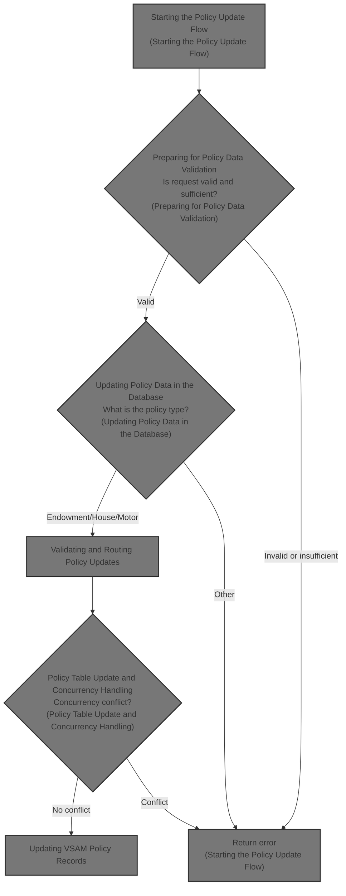
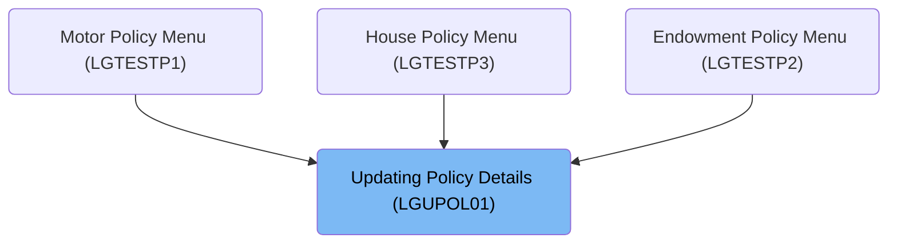
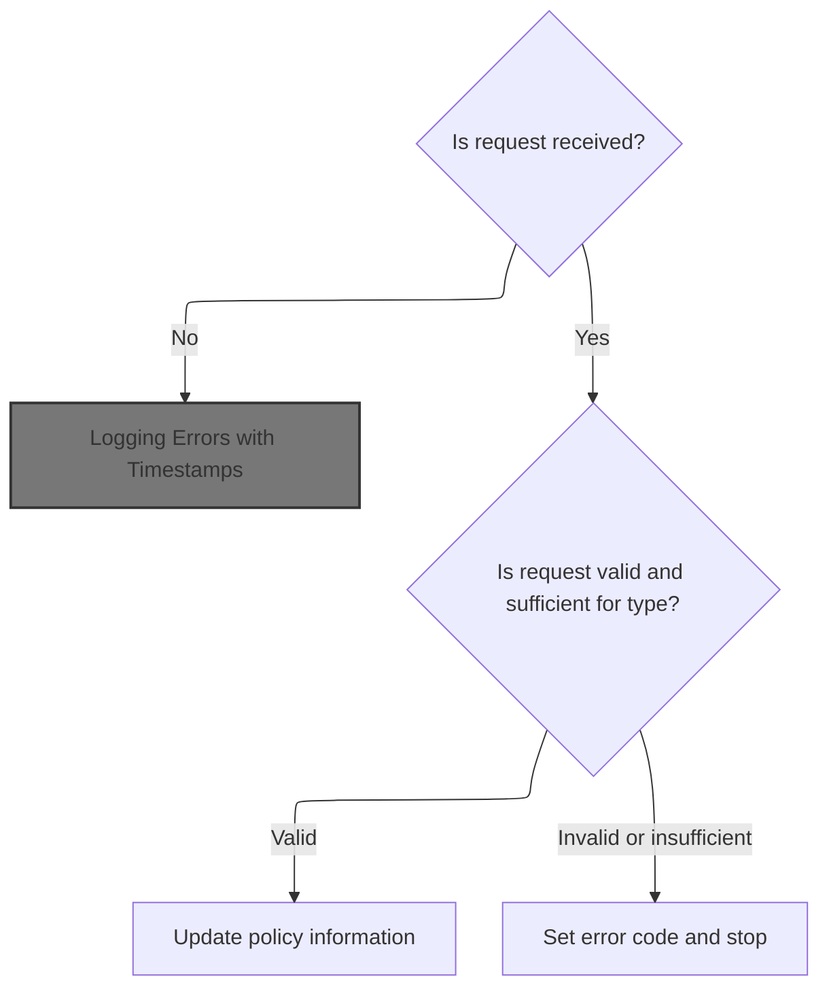
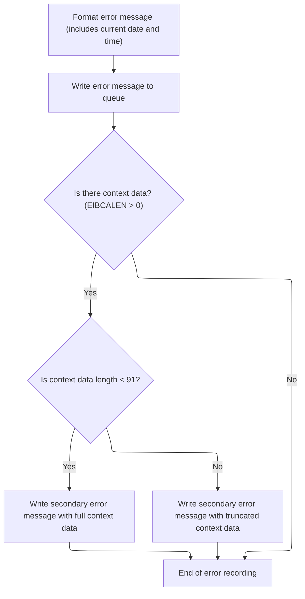
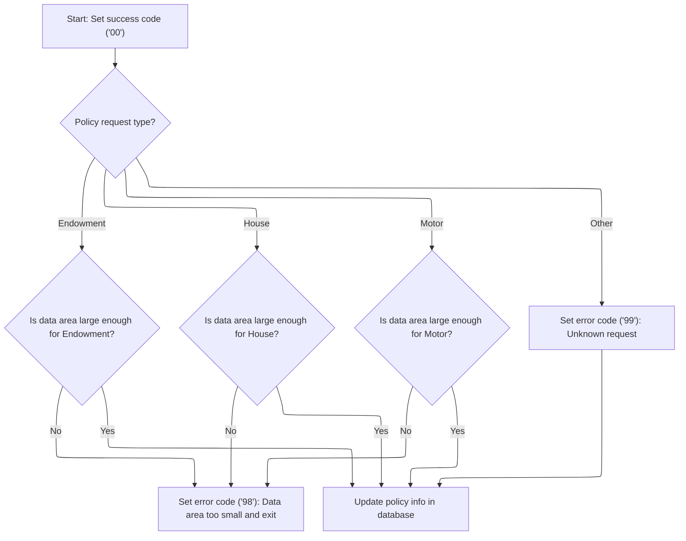
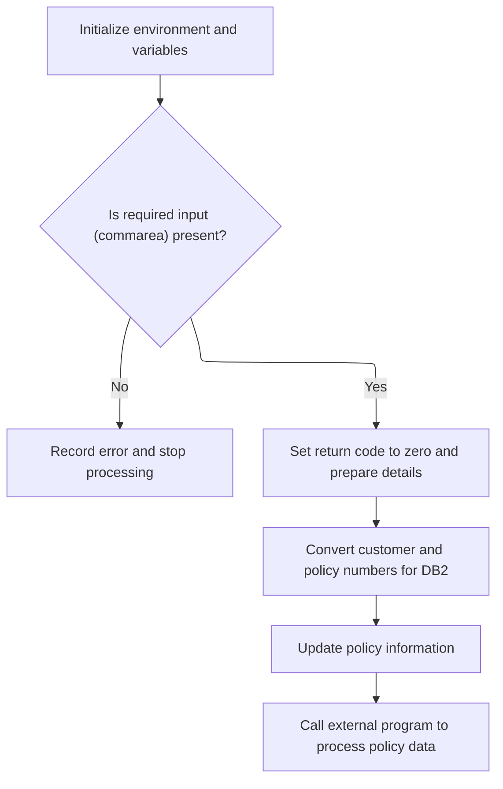
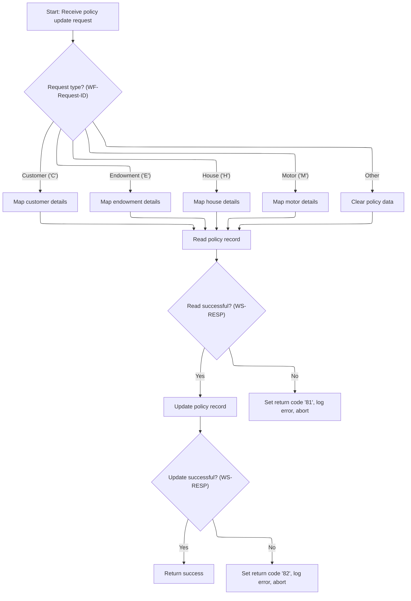

# Overview

This document explains the flow for updating insurance policy details. The process validates incoming requests, logs errors with timestamps, and updates policy records in both <SwmToken path="base/src/lgupol01.cbl" pos="143:7:7" line-data="           PERFORM UPDATE-POLICY-DB2-INFO.">`DB2`</SwmToken> and VSAM databases, ensuring consistency and proper handling for different policy types.



## Dependencies

### Programs

- <SwmToken path="base/src/lgupol01.cbl" pos="11:6:6" line-data="       PROGRAM-ID. LGUPOL01.">`LGUPOL01`</SwmToken> (<SwmPath>[base/src/lgupol01.cbl](base/src/lgupol01.cbl)</SwmPath>)
- <SwmToken path="base/src/lgupol01.cbl" pos="157:9:9" line-data="           EXEC CICS LINK Program(LGUPDB01)">`LGUPDB01`</SwmToken> (<SwmPath>[base/src/lgupdb01.cbl](base/src/lgupdb01.cbl)</SwmPath>)
- <SwmToken path="base/src/lgupdb01.cbl" pos="209:9:9" line-data="           EXEC CICS LINK Program(LGUPVS01)">`LGUPVS01`</SwmToken> (<SwmPath>[base/src/lgupvs01.cbl](base/src/lgupvs01.cbl)</SwmPath>)
- LGSTSQ (<SwmPath>[base/src/lgstsq.cbl](base/src/lgstsq.cbl)</SwmPath>)

### Copybooks

- LGCMAREA (<SwmPath>[base/src/lgcmarea.cpy](base/src/lgcmarea.cpy)</SwmPath>)
- LGPOLICY (<SwmPath>[base/src/lgpolicy.cpy](base/src/lgpolicy.cpy)</SwmPath>)
- SQLCA

# Where is this program used?

This program is used multiple times in the codebase as represented in the following diagram:



## Detailed View of the Program's Functionality

# Starting the Policy Update Flow

## Initialization and Request Validation

- When a request is received, the mainline logic initializes internal variables to track transaction, terminal, and task identifiers. This ensures all subsequent operations are associated with the correct transaction context.
- The code checks if any request data (commarea) was provided. If not, it logs an error message with a timestamp and aborts the transaction immediately.
- If a commarea is present, the return code is reset to indicate success, and pointers and lengths for the commarea are set up for further processing.
- The request type is evaluated:
  - For each supported policy type (Endowment, House, Motor), the code calculates the minimum required data length for that type and checks if the provided commarea is large enough.
  - If the commarea is too short for the requested type, an error code is set and processing stops.
  - If the request type is not recognized, a generic error code is set.

## Logging Errors with Timestamps

- When an error is detected (such as missing commarea or insufficient data), the error logging routine is invoked.
- The routine obtains the current date and time using system commands, formats them, and inserts them into the error message structure.
- The error message is then sent to a queue handler program, which routes and stores the message in both transient and temporary queues for later review.
- If there is context data in the commarea, up to 90 bytes are also logged as a secondary error message for additional context.

# Preparing for Policy Data Validation

- After error handling, the code resets the return code and prepares pointers and lengths for the commarea, clearing any previous error state.
- The request type is checked again, and for each supported type, the required commarea length is calculated and validated.
- If the commarea is sufficient, the code proceeds to update the policy information in the database.

# Updating Policy Data in the Database

## Database Update Invocation

- The mainline logic links to a dedicated database update program, passing the commarea and specifying a maximum length for the data transfer.
- The database update program initializes its own environment, variables, and host variables for <SwmToken path="base/src/lgupol01.cbl" pos="143:7:7" line-data="           PERFORM UPDATE-POLICY-DB2-INFO.">`DB2`</SwmToken> operations.
- It validates the presence of the commarea and converts customer and policy numbers to the appropriate <SwmToken path="base/src/lgupol01.cbl" pos="143:7:7" line-data="           PERFORM UPDATE-POLICY-DB2-INFO.">`DB2`</SwmToken> integer formats.
- These values are also saved in the error message structure for potential logging.

## Policy Update and Concurrency Handling

- The database update logic opens a cursor to select the relevant policy row, locking it for update.
- The result of the cursor open is checked:
  - If successful, the code fetches the policy row.
  - If the cursor open fails due to a lock or other error, an error code is set, the error is logged, and processing stops.
- After fetching the row, the code compares the timestamp in the commarea with the one in the database to detect concurrent modifications.
  - If the timestamps match, the code routes to the appropriate update routine based on the policy type (Endowment, House, Motor).
  - Each update routine converts relevant fields to <SwmToken path="base/src/lgupol01.cbl" pos="143:7:7" line-data="           PERFORM UPDATE-POLICY-DB2-INFO.">`DB2`</SwmToken> integer formats and performs the update. If the update fails, an error code is set and the error is logged.
  - If the policy type update succeeds, the main policy table is updated with new details and a new timestamp.
  - The new timestamp is retrieved and returned in the commarea.
  - If the main update fails, a rollback is performed, an error code is set, and the error is logged.
  - If the timestamps do not match, a concurrency error code is set.
- If the policy row is not found, a not-found error code is set.
- After all operations, the cursor is closed. If closing fails, the error is logged and an error code is set.

## Error Logging in Database Update

- Whenever an error occurs during database operations, the error logging routine is invoked.
- The routine saves the SQL error code, obtains and formats the current date and time, and sends the error message to the queue handler.
- If there is commarea data, up to 90 bytes are also logged for additional context.

# Updating VSAM Policy Records

## VSAM Update Flow

- After the database update, the mainline logic links to a program responsible for updating VSAM policy records.
- The VSAM update program determines the request type from the commarea and maps the relevant fields for the update.
- It reads the policy record from the VSAM KSDS file using the provided key.
- If the read fails, an error code is set, the error is logged, and the transaction is aborted.
- If the read succeeds, the program rewrites the policy record with the updated information.
- If the rewrite fails, an error code is set, the error is logged, and the transaction is aborted.
- If both operations succeed, the program returns success.

## Error Logging in VSAM Update

- When an error occurs during VSAM operations, the error logging routine is invoked.
- The routine obtains and formats the current date and time, fills out the error message fields, and sends the error message to the queue handler.
- If there is commarea data, up to 90 bytes are also logged for additional context.

# Queue Handler Logic

## Message Routing and Storage

- The queue handler program receives error messages and determines how to process them based on invocation context.
- If invoked directly, it copies the message data and sets the appropriate flags.
- If invoked via a receive operation, it receives the message, adjusts the length, and sets the flags accordingly.
- The program determines the queue name, adjusting it if a special parameter is present.
- The message is written to both a transient queue (for immediate review) and a temporary queue (for deferred processing).
- If the message was received, a one-character response is sent back.
- The program then returns control to the caller.

# Summary

- The overall flow ensures that policy update requests are validated for type and length, errors are logged with detailed context and timestamps, policy data is updated in both the database and VSAM files, and all operations are tracked and auditable via queue-based error logging.
- Concurrency is handled by comparing timestamps, and all error paths ensure that relevant information is captured for troubleshooting.

# Rule Definition

| Paragraph Name                                                                                                                                                                                                                                                                                                                                                                                                                                                                                                                                                                                                                                                                  | Rule ID | Category          | Description                                                                                                                                                                                                                                                   | Conditions                                                                                                                                                                                                                                                                                                                                                                                                                                                                                                         | Remarks                                                                                                                                                                                                                                                                                                                                                                                                                                                                                                                                                           |
| ------------------------------------------------------------------------------------------------------------------------------------------------------------------------------------------------------------------------------------------------------------------------------------------------------------------------------------------------------------------------------------------------------------------------------------------------------------------------------------------------------------------------------------------------------------------------------------------------------------------------------------------------------------------------------- | ------- | ----------------- | ------------------------------------------------------------------------------------------------------------------------------------------------------------------------------------------------------------------------------------------------------------- | ------------------------------------------------------------------------------------------------------------------------------------------------------------------------------------------------------------------------------------------------------------------------------------------------------------------------------------------------------------------------------------------------------------------------------------------------------------------------------------------------------------------ | ----------------------------------------------------------------------------------------------------------------------------------------------------------------------------------------------------------------------------------------------------------------------------------------------------------------------------------------------------------------------------------------------------------------------------------------------------------------------------------------------------------------------------------------------------------------- |
| MAINLINE SECTION (<SwmPath>[base/src/lgupol01.cbl](base/src/lgupol01.cbl)</SwmPath>), MAINLINE SECTION (<SwmPath>[base/src/lgupdb01.cbl](base/src/lgupdb01.cbl)</SwmPath>)                                                                                                                                                                                                                                                                                                                                                                                                                                                                                                      | RL-001  | Conditional Logic | The system must check that the commarea buffer is at least the minimum required length for the requested policy type before processing.                                                                                                                       | <SwmToken path="base/src/lgupol01.cbl" pos="113:3:7" line-data="           EVALUATE CA-REQUEST-ID">`CA-REQUEST-ID`</SwmToken> is <SwmToken path="base/src/lgupol01.cbl" pos="115:4:4" line-data="             WHEN &#39;01UEND&#39;">`01UEND`</SwmToken>, <SwmToken path="base/src/lgupol01.cbl" pos="123:4:4" line-data="             WHEN &#39;01UHOU&#39;">`01UHOU`</SwmToken>, or <SwmToken path="base/src/lgupol01.cbl" pos="131:4:4" line-data="             WHEN &#39;01UMOT&#39;">`01UMOT`</SwmToken>.     | Minimum lengths: Endowment (152 bytes), House (158 bytes), Motor (165 bytes). If EIBCALEN is less than required, set <SwmToken path="base/src/lgupol01.cbl" pos="105:9:13" line-data="           MOVE &#39;00&#39; TO CA-RETURN-CODE">`CA-RETURN-CODE`</SwmToken> to '98'.                                                                                                                                                                                                                                                                                        |
| MAINLINE SECTION (<SwmPath>[base/src/lgupol01.cbl](base/src/lgupol01.cbl)</SwmPath>), MAINLINE SECTION (<SwmPath>[base/src/lgupdb01.cbl](base/src/lgupdb01.cbl)</SwmPath>)                                                                                                                                                                                                                                                                                                                                                                                                                                                                                                      | RL-002  | Conditional Logic | Only specific request IDs are accepted for processing. Others are rejected.                                                                                                                                                                                   | <SwmToken path="base/src/lgupol01.cbl" pos="113:3:7" line-data="           EVALUATE CA-REQUEST-ID">`CA-REQUEST-ID`</SwmToken> is not <SwmToken path="base/src/lgupol01.cbl" pos="115:4:4" line-data="             WHEN &#39;01UEND&#39;">`01UEND`</SwmToken>, <SwmToken path="base/src/lgupol01.cbl" pos="123:4:4" line-data="             WHEN &#39;01UHOU&#39;">`01UHOU`</SwmToken>, or <SwmToken path="base/src/lgupol01.cbl" pos="131:4:4" line-data="             WHEN &#39;01UMOT&#39;">`01UMOT`</SwmToken>. | Accepted values: <SwmToken path="base/src/lgupol01.cbl" pos="115:4:4" line-data="             WHEN &#39;01UEND&#39;">`01UEND`</SwmToken>, <SwmToken path="base/src/lgupol01.cbl" pos="123:4:4" line-data="             WHEN &#39;01UHOU&#39;">`01UHOU`</SwmToken>, <SwmToken path="base/src/lgupol01.cbl" pos="131:4:4" line-data="             WHEN &#39;01UMOT&#39;">`01UMOT`</SwmToken>. If invalid, set <SwmToken path="base/src/lgupol01.cbl" pos="105:9:13" line-data="           MOVE &#39;00&#39; TO CA-RETURN-CODE">`CA-RETURN-CODE`</SwmToken> to '99'. |
| <SwmToken path="base/src/lgupol01.cbl" pos="143:3:9" line-data="           PERFORM UPDATE-POLICY-DB2-INFO.">`UPDATE-POLICY-DB2-INFO`</SwmToken> (<SwmPath>[base/src/lgupdb01.cbl](base/src/lgupdb01.cbl)</SwmPath>)                                                                                                                                                                                                                                                                                                                                                                                                                                                             | RL-003  | Conditional Logic | Before updating, the system checks that the timestamp in the commarea matches the <SwmToken path="base/src/lgupol01.cbl" pos="143:7:7" line-data="           PERFORM UPDATE-POLICY-DB2-INFO.">`DB2`</SwmToken> POLICY table. If not, update is aborted.       | <SwmToken path="base/src/lgupdb01.cbl" pos="278:3:5" line-data="             IF CA-LASTCHANGED EQUAL TO DB2-LASTCHANGED">`CA-LASTCHANGED`</SwmToken> does not equal <SwmToken path="base/src/lgupol01.cbl" pos="143:7:7" line-data="           PERFORM UPDATE-POLICY-DB2-INFO.">`DB2`</SwmToken> LASTCHANGED for the policy row.                                                                                                                                                                                   | Timestamp format: YYYY-MM-DD-HH.MM.SS.ssssss (26 chars). If mismatch, set <SwmToken path="base/src/lgupol01.cbl" pos="105:9:13" line-data="           MOVE &#39;00&#39; TO CA-RETURN-CODE">`CA-RETURN-CODE`</SwmToken> to '02'.                                                                                                                                                                                                                                                                                                                                   |
| <SwmToken path="base/src/lgupol01.cbl" pos="143:3:9" line-data="           PERFORM UPDATE-POLICY-DB2-INFO.">`UPDATE-POLICY-DB2-INFO`</SwmToken> (<SwmPath>[base/src/lgupdb01.cbl](base/src/lgupdb01.cbl)</SwmPath>)                                                                                                                                                                                                                                                                                                                                                                                                                                                             | RL-004  | Conditional Logic | If the requested policy row is not found in <SwmToken path="base/src/lgupol01.cbl" pos="143:7:7" line-data="           PERFORM UPDATE-POLICY-DB2-INFO.">`DB2`</SwmToken>, processing is aborted.                                                              | SQLCODE = 100 after fetch attempt.                                                                                                                                                                                                                                                                                                                                                                                                                                                                                 | If not found, set <SwmToken path="base/src/lgupol01.cbl" pos="105:9:13" line-data="           MOVE &#39;00&#39; TO CA-RETURN-CODE">`CA-RETURN-CODE`</SwmToken> to '01'.                                                                                                                                                                                                                                                                                                                                                                                           |
| <SwmToken path="base/src/lgupol01.cbl" pos="143:3:9" line-data="           PERFORM UPDATE-POLICY-DB2-INFO.">`UPDATE-POLICY-DB2-INFO`</SwmToken>, <SwmToken path="base/src/lgupdb01.cbl" pos="288:3:9" line-data="                 PERFORM UPDATE-ENDOW-DB2-INFO">`UPDATE-ENDOW-DB2-INFO`</SwmToken>, <SwmToken path="base/src/lgupdb01.cbl" pos="293:3:9" line-data="                 PERFORM UPDATE-HOUSE-DB2-INFO">`UPDATE-HOUSE-DB2-INFO`</SwmToken>, <SwmToken path="base/src/lgupdb01.cbl" pos="298:3:9" line-data="                 PERFORM UPDATE-MOTOR-DB2-INFO">`UPDATE-MOTOR-DB2-INFO`</SwmToken> (<SwmPath>[base/src/lgupdb01.cbl](base/src/lgupdb01.cbl)</SwmPath>) | RL-005  | Conditional Logic | Any <SwmToken path="base/src/lgupol01.cbl" pos="143:7:7" line-data="           PERFORM UPDATE-POLICY-DB2-INFO.">`DB2`</SwmToken> error during update results in a specific return code and error logging.                                                     | SQLCODE not 0 or 100 during <SwmToken path="base/src/lgupol01.cbl" pos="143:7:7" line-data="           PERFORM UPDATE-POLICY-DB2-INFO.">`DB2`</SwmToken> operations.                                                                                                                                                                                                                                                                                                                                               | If <SwmToken path="base/src/lgupol01.cbl" pos="143:7:7" line-data="           PERFORM UPDATE-POLICY-DB2-INFO.">`DB2`</SwmToken> error, set <SwmToken path="base/src/lgupol01.cbl" pos="105:9:13" line-data="           MOVE &#39;00&#39; TO CA-RETURN-CODE">`CA-RETURN-CODE`</SwmToken> to '90'. Error message includes SQLCODE.                                                                                                                                                                                                                                  |
| <SwmToken path="base/src/lgupol01.cbl" pos="143:3:9" line-data="           PERFORM UPDATE-POLICY-DB2-INFO.">`UPDATE-POLICY-DB2-INFO`</SwmToken>, <SwmToken path="base/src/lgupdb01.cbl" pos="288:3:9" line-data="                 PERFORM UPDATE-ENDOW-DB2-INFO">`UPDATE-ENDOW-DB2-INFO`</SwmToken>, <SwmToken path="base/src/lgupdb01.cbl" pos="293:3:9" line-data="                 PERFORM UPDATE-HOUSE-DB2-INFO">`UPDATE-HOUSE-DB2-INFO`</SwmToken>, <SwmToken path="base/src/lgupdb01.cbl" pos="298:3:9" line-data="                 PERFORM UPDATE-MOTOR-DB2-INFO">`UPDATE-MOTOR-DB2-INFO`</SwmToken> (<SwmPath>[base/src/lgupdb01.cbl](base/src/lgupdb01.cbl)</SwmPath>) | RL-006  | Data Assignment   | Update POLICY table with header and common fields, and the appropriate policy-type-specific table with relevant fields.                                                                                                                                       | <SwmToken path="base/src/lgupol01.cbl" pos="113:3:7" line-data="           EVALUATE CA-REQUEST-ID">`CA-REQUEST-ID`</SwmToken> is valid and concurrency check passes.                                                                                                                                                                                                                                                                                                                                               | Fields updated per table as per spec. After successful update, set <SwmToken path="base/src/lgupol01.cbl" pos="105:9:13" line-data="           MOVE &#39;00&#39; TO CA-RETURN-CODE">`CA-RETURN-CODE`</SwmToken> to '00' and update <SwmToken path="base/src/lgupdb01.cbl" pos="278:3:5" line-data="             IF CA-LASTCHANGED EQUAL TO DB2-LASTCHANGED">`CA-LASTCHANGED`</SwmToken> to new <SwmToken path="base/src/lgupol01.cbl" pos="143:7:7" line-data="           PERFORM UPDATE-POLICY-DB2-INFO.">`DB2`</SwmToken> timestamp.                            |
| MAINLINE SECTION (<SwmPath>[base/src/lgupdb01.cbl](base/src/lgupdb01.cbl)</SwmPath>), MAINLINE SECTION (<SwmPath>[base/src/lgupvs01.cbl](base/src/lgupvs01.cbl)</SwmPath>)                                                                                                                                                                                                                                                                                                                                                                                                                                                                                                      | RL-007  | Data Assignment   | Update the VSAM KSDS record for the policy, mapping fields according to the 4th character of <SwmToken path="base/src/lgupol01.cbl" pos="113:3:7" line-data="           EVALUATE CA-REQUEST-ID">`CA-REQUEST-ID`</SwmToken>.                                   | <SwmToken path="base/src/lgupol01.cbl" pos="113:3:7" line-data="           EVALUATE CA-REQUEST-ID">`CA-REQUEST-ID`</SwmToken> is valid and <SwmToken path="base/src/lgupol01.cbl" pos="143:7:7" line-data="           PERFORM UPDATE-POLICY-DB2-INFO.">`DB2`</SwmToken> update succeeded.                                                                                                                                                                                                                          | Field mapping depends on 4th character: 'E' (Endowment), 'H' (House), 'M' (Motor), 'C' (Customer), other clears policy data. If VSAM read fails, set <SwmToken path="base/src/lgupol01.cbl" pos="105:9:13" line-data="           MOVE &#39;00&#39; TO CA-RETURN-CODE">`CA-RETURN-CODE`</SwmToken> to '81'. If VSAM write fails, set <SwmToken path="base/src/lgupol01.cbl" pos="105:9:13" line-data="           MOVE &#39;00&#39; TO CA-RETURN-CODE">`CA-RETURN-CODE`</SwmToken> to '82'.                                                                         |
| <SwmToken path="base/src/lgupol01.cbl" pos="101:3:7" line-data="               PERFORM WRITE-ERROR-MESSAGE">`WRITE-ERROR-MESSAGE`</SwmToken> (<SwmPath>[base/src/lgupol01.cbl](base/src/lgupol01.cbl)</SwmPath>, <SwmPath>[base/src/lgupdb01.cbl](base/src/lgupdb01.cbl)</SwmPath>, <SwmPath>[base/src/lgupvs01.cbl](base/src/lgupvs01.cbl)</SwmPath>), LGSTSQ (<SwmPath>[base/src/lgstsq.cbl](base/src/lgstsq.cbl)</SwmPath>)                                                                                                                                                                                                                                                  | RL-008  | Data Assignment   | Log errors to the error message queue with a specific format, including commarea data if present.                                                                                                                                                             | Any error condition that sets <SwmToken path="base/src/lgupol01.cbl" pos="105:9:13" line-data="           MOVE &#39;00&#39; TO CA-RETURN-CODE">`CA-RETURN-CODE`</SwmToken> to a non-'00' value.                                                                                                                                                                                                                                                                                                                    | Error message format: Date (MMDDYYYY), Time (HHMMSS), Program Name (9 chars), Customer Number, Policy Number, Error Description (SQLCODE or VSAM RESP/RESP2). If commarea present, log up to 90 bytes prefixed with 'COMMAREA='.                                                                                                                                                                                                                                                                                                                                  |
| <SwmToken path="base/src/lgupol01.cbl" pos="143:3:9" line-data="           PERFORM UPDATE-POLICY-DB2-INFO.">`UPDATE-POLICY-DB2-INFO`</SwmToken> (<SwmPath>[base/src/lgupdb01.cbl](base/src/lgupdb01.cbl)</SwmPath>), <SwmToken path="base/src/lgupol01.cbl" pos="101:3:7" line-data="               PERFORM WRITE-ERROR-MESSAGE">`WRITE-ERROR-MESSAGE`</SwmToken> (lguppol01.cbl, <SwmPath>[base/src/lgupdb01.cbl](base/src/lgupdb01.cbl)</SwmPath>, <SwmPath>[base/src/lgupvs01.cbl](base/src/lgupvs01.cbl)</SwmPath>)                                                                                                                                                         | RL-009  | Data Assignment   | All timestamps in <SwmToken path="base/src/lgupol01.cbl" pos="143:7:7" line-data="           PERFORM UPDATE-POLICY-DB2-INFO.">`DB2`</SwmToken> and commarea must use the format YYYY-MM-DD-HH.MM.SS.ssssss. Error message timestamps use MMDDYYYY and HHMMSS. | Whenever timestamps are written to <SwmToken path="base/src/lgupol01.cbl" pos="143:7:7" line-data="           PERFORM UPDATE-POLICY-DB2-INFO.">`DB2`</SwmToken>, commarea, or error messages.                                                                                                                                                                                                                                                                                                                      | DB2/commarea timestamp: 26 chars, YYYY-MM-DD-HH.MM.SS.ssssss. Error message: Date (MMDDYYYY), Time (HHMMSS).                                                                                                                                                                                                                                                                                                                                                                                                                                                      |

# User Stories

## User Story 1: Validate and process policy update requests

---

### Story Description:

As a system, I want to validate incoming policy update requests for length, request ID, concurrency, and existence so that only correct and consistent data is processed and errors are handled appropriately.

---

### Business Rule Mapping:

| Rule ID | Paragraph Name                                                                                                                                                                                                                                                                                                                                                                                                                                                                                                                                                                                                                                                                  | Rule Description                                                                                                                                                                                                                                        |
| ------- | ------------------------------------------------------------------------------------------------------------------------------------------------------------------------------------------------------------------------------------------------------------------------------------------------------------------------------------------------------------------------------------------------------------------------------------------------------------------------------------------------------------------------------------------------------------------------------------------------------------------------------------------------------------------------------- | ------------------------------------------------------------------------------------------------------------------------------------------------------------------------------------------------------------------------------------------------------- |
| RL-005  | <SwmToken path="base/src/lgupol01.cbl" pos="143:3:9" line-data="           PERFORM UPDATE-POLICY-DB2-INFO.">`UPDATE-POLICY-DB2-INFO`</SwmToken>, <SwmToken path="base/src/lgupdb01.cbl" pos="288:3:9" line-data="                 PERFORM UPDATE-ENDOW-DB2-INFO">`UPDATE-ENDOW-DB2-INFO`</SwmToken>, <SwmToken path="base/src/lgupdb01.cbl" pos="293:3:9" line-data="                 PERFORM UPDATE-HOUSE-DB2-INFO">`UPDATE-HOUSE-DB2-INFO`</SwmToken>, <SwmToken path="base/src/lgupdb01.cbl" pos="298:3:9" line-data="                 PERFORM UPDATE-MOTOR-DB2-INFO">`UPDATE-MOTOR-DB2-INFO`</SwmToken> (<SwmPath>[base/src/lgupdb01.cbl](base/src/lgupdb01.cbl)</SwmPath>) | Any <SwmToken path="base/src/lgupol01.cbl" pos="143:7:7" line-data="           PERFORM UPDATE-POLICY-DB2-INFO.">`DB2`</SwmToken> error during update results in a specific return code and error logging.                                               |
| RL-001  | MAINLINE SECTION (<SwmPath>[base/src/lgupol01.cbl](base/src/lgupol01.cbl)</SwmPath>), MAINLINE SECTION (<SwmPath>[base/src/lgupdb01.cbl](base/src/lgupdb01.cbl)</SwmPath>)                                                                                                                                                                                                                                                                                                                                                                                                                                                                                                      | The system must check that the commarea buffer is at least the minimum required length for the requested policy type before processing.                                                                                                                 |
| RL-002  | MAINLINE SECTION (<SwmPath>[base/src/lgupol01.cbl](base/src/lgupol01.cbl)</SwmPath>), MAINLINE SECTION (<SwmPath>[base/src/lgupdb01.cbl](base/src/lgupdb01.cbl)</SwmPath>)                                                                                                                                                                                                                                                                                                                                                                                                                                                                                                      | Only specific request IDs are accepted for processing. Others are rejected.                                                                                                                                                                             |
| RL-003  | <SwmToken path="base/src/lgupol01.cbl" pos="143:3:9" line-data="           PERFORM UPDATE-POLICY-DB2-INFO.">`UPDATE-POLICY-DB2-INFO`</SwmToken> (<SwmPath>[base/src/lgupdb01.cbl](base/src/lgupdb01.cbl)</SwmPath>)                                                                                                                                                                                                                                                                                                                                                                                                                                                             | Before updating, the system checks that the timestamp in the commarea matches the <SwmToken path="base/src/lgupol01.cbl" pos="143:7:7" line-data="           PERFORM UPDATE-POLICY-DB2-INFO.">`DB2`</SwmToken> POLICY table. If not, update is aborted. |
| RL-004  | <SwmToken path="base/src/lgupol01.cbl" pos="143:3:9" line-data="           PERFORM UPDATE-POLICY-DB2-INFO.">`UPDATE-POLICY-DB2-INFO`</SwmToken> (<SwmPath>[base/src/lgupdb01.cbl](base/src/lgupdb01.cbl)</SwmPath>)                                                                                                                                                                                                                                                                                                                                                                                                                                                             | If the requested policy row is not found in <SwmToken path="base/src/lgupol01.cbl" pos="143:7:7" line-data="           PERFORM UPDATE-POLICY-DB2-INFO.">`DB2`</SwmToken>, processing is aborted.                                                        |

---

### Relevant Functionality:

- <SwmToken path="base/src/lgupol01.cbl" pos="143:3:9" line-data="           PERFORM UPDATE-POLICY-DB2-INFO.">`UPDATE-POLICY-DB2-INFO`</SwmToken>
  1. **RL-005:**
     - After <SwmToken path="base/src/lgupol01.cbl" pos="143:7:7" line-data="           PERFORM UPDATE-POLICY-DB2-INFO.">`DB2`</SwmToken> operation, check SQLCODE
     - If SQLCODE not 0 or 100:
       - Set <SwmToken path="base/src/lgupol01.cbl" pos="105:9:13" line-data="           MOVE &#39;00&#39; TO CA-RETURN-CODE">`CA-RETURN-CODE`</SwmToken> to '90'
       - Log error message
       - Stop processing (return)
- **MAINLINE SECTION (**<SwmPath>[base/src/lgupol01.cbl](base/src/lgupol01.cbl)</SwmPath>**)**
  1. **RL-001:**
     - Determine required length based on <SwmToken path="base/src/lgupol01.cbl" pos="113:3:7" line-data="           EVALUATE CA-REQUEST-ID">`CA-REQUEST-ID`</SwmToken>
       - If <SwmToken path="base/src/lgupol01.cbl" pos="115:4:4" line-data="             WHEN &#39;01UEND&#39;">`01UEND`</SwmToken>, required = 152
       - If <SwmToken path="base/src/lgupol01.cbl" pos="123:4:4" line-data="             WHEN &#39;01UHOU&#39;">`01UHOU`</SwmToken>, required = 158
       - If <SwmToken path="base/src/lgupol01.cbl" pos="131:4:4" line-data="             WHEN &#39;01UMOT&#39;">`01UMOT`</SwmToken>, required = 165
     - If EIBCALEN < required length:
       - Set <SwmToken path="base/src/lgupol01.cbl" pos="105:9:13" line-data="           MOVE &#39;00&#39; TO CA-RETURN-CODE">`CA-RETURN-CODE`</SwmToken> to '98'
       - Stop processing (return)
  2. **RL-002:**
     - If <SwmToken path="base/src/lgupol01.cbl" pos="113:3:7" line-data="           EVALUATE CA-REQUEST-ID">`CA-REQUEST-ID`</SwmToken> is not one of the accepted values:
       - Set <SwmToken path="base/src/lgupol01.cbl" pos="105:9:13" line-data="           MOVE &#39;00&#39; TO CA-RETURN-CODE">`CA-RETURN-CODE`</SwmToken> to '99'
       - Stop processing (return)
- <SwmToken path="base/src/lgupol01.cbl" pos="143:3:9" line-data="           PERFORM UPDATE-POLICY-DB2-INFO.">`UPDATE-POLICY-DB2-INFO`</SwmToken> **(**<SwmPath>[base/src/lgupdb01.cbl](base/src/lgupdb01.cbl)</SwmPath>**)**
  1. **RL-003:**
     - Fetch policy row from <SwmToken path="base/src/lgupol01.cbl" pos="143:7:7" line-data="           PERFORM UPDATE-POLICY-DB2-INFO.">`DB2`</SwmToken>
     - Compare <SwmToken path="base/src/lgupdb01.cbl" pos="278:3:5" line-data="             IF CA-LASTCHANGED EQUAL TO DB2-LASTCHANGED">`CA-LASTCHANGED`</SwmToken> to <SwmToken path="base/src/lgupdb01.cbl" pos="278:11:13" line-data="             IF CA-LASTCHANGED EQUAL TO DB2-LASTCHANGED">`DB2-LASTCHANGED`</SwmToken>
     - If not equal:
       - Set <SwmToken path="base/src/lgupol01.cbl" pos="105:9:13" line-data="           MOVE &#39;00&#39; TO CA-RETURN-CODE">`CA-RETURN-CODE`</SwmToken> to '02'
       - Stop processing (return)
  2. **RL-004:**
     - Fetch policy row from <SwmToken path="base/src/lgupol01.cbl" pos="143:7:7" line-data="           PERFORM UPDATE-POLICY-DB2-INFO.">`DB2`</SwmToken>
     - If SQLCODE = 100:
       - Set <SwmToken path="base/src/lgupol01.cbl" pos="105:9:13" line-data="           MOVE &#39;00&#39; TO CA-RETURN-CODE">`CA-RETURN-CODE`</SwmToken> to '01'
       - Stop processing (return)

## User Story 2: Update policy data in <SwmToken path="base/src/lgupol01.cbl" pos="143:7:7" line-data="           PERFORM UPDATE-POLICY-DB2-INFO.">`DB2`</SwmToken> and VSAM

---

### Story Description:

As a system, I want to update policy information in <SwmToken path="base/src/lgupol01.cbl" pos="143:7:7" line-data="           PERFORM UPDATE-POLICY-DB2-INFO.">`DB2`</SwmToken> tables and VSAM KSDS records according to the policy type so that policy data remains accurate and synchronized across all storage systems.

---

### Business Rule Mapping:

| Rule ID | Paragraph Name                                                                                                                                                                                                                                                                                                                                                                                                                                                                                                                                                                                                                                                                  | Rule Description                                                                                                                                                                                                            |
| ------- | ------------------------------------------------------------------------------------------------------------------------------------------------------------------------------------------------------------------------------------------------------------------------------------------------------------------------------------------------------------------------------------------------------------------------------------------------------------------------------------------------------------------------------------------------------------------------------------------------------------------------------------------------------------------------------- | --------------------------------------------------------------------------------------------------------------------------------------------------------------------------------------------------------------------------- |
| RL-006  | <SwmToken path="base/src/lgupol01.cbl" pos="143:3:9" line-data="           PERFORM UPDATE-POLICY-DB2-INFO.">`UPDATE-POLICY-DB2-INFO`</SwmToken>, <SwmToken path="base/src/lgupdb01.cbl" pos="288:3:9" line-data="                 PERFORM UPDATE-ENDOW-DB2-INFO">`UPDATE-ENDOW-DB2-INFO`</SwmToken>, <SwmToken path="base/src/lgupdb01.cbl" pos="293:3:9" line-data="                 PERFORM UPDATE-HOUSE-DB2-INFO">`UPDATE-HOUSE-DB2-INFO`</SwmToken>, <SwmToken path="base/src/lgupdb01.cbl" pos="298:3:9" line-data="                 PERFORM UPDATE-MOTOR-DB2-INFO">`UPDATE-MOTOR-DB2-INFO`</SwmToken> (<SwmPath>[base/src/lgupdb01.cbl](base/src/lgupdb01.cbl)</SwmPath>) | Update POLICY table with header and common fields, and the appropriate policy-type-specific table with relevant fields.                                                                                                     |
| RL-007  | MAINLINE SECTION (<SwmPath>[base/src/lgupdb01.cbl](base/src/lgupdb01.cbl)</SwmPath>), MAINLINE SECTION (<SwmPath>[base/src/lgupvs01.cbl](base/src/lgupvs01.cbl)</SwmPath>)                                                                                                                                                                                                                                                                                                                                                                                                                                                                                                      | Update the VSAM KSDS record for the policy, mapping fields according to the 4th character of <SwmToken path="base/src/lgupol01.cbl" pos="113:3:7" line-data="           EVALUATE CA-REQUEST-ID">`CA-REQUEST-ID`</SwmToken>. |

---

### Relevant Functionality:

- <SwmToken path="base/src/lgupol01.cbl" pos="143:3:9" line-data="           PERFORM UPDATE-POLICY-DB2-INFO.">`UPDATE-POLICY-DB2-INFO`</SwmToken>
  1. **RL-006:**
     - If concurrency check passes:
       - Update policy-type-specific table (ENDOWMENT, HOUSE, MOTOR)
       - If successful, update POLICY table with new timestamp
       - Set <SwmToken path="base/src/lgupol01.cbl" pos="105:9:13" line-data="           MOVE &#39;00&#39; TO CA-RETURN-CODE">`CA-RETURN-CODE`</SwmToken> to '00'
       - Update <SwmToken path="base/src/lgupdb01.cbl" pos="278:3:5" line-data="             IF CA-LASTCHANGED EQUAL TO DB2-LASTCHANGED">`CA-LASTCHANGED`</SwmToken> to new timestamp
- **MAINLINE SECTION (**<SwmPath>[base/src/lgupdb01.cbl](base/src/lgupdb01.cbl)</SwmPath>**)**
  1. **RL-007:**
     - Determine mapping based on <SwmToken path="base/src/lgupol01.cbl" pos="113:3:7" line-data="           EVALUATE CA-REQUEST-ID">`CA-REQUEST-ID`</SwmToken>(4:1)
     - Read VSAM record
       - If read fails, set <SwmToken path="base/src/lgupol01.cbl" pos="105:9:13" line-data="           MOVE &#39;00&#39; TO CA-RETURN-CODE">`CA-RETURN-CODE`</SwmToken> to '81', log error, stop
     - Write VSAM record
       - If write fails, set <SwmToken path="base/src/lgupol01.cbl" pos="105:9:13" line-data="           MOVE &#39;00&#39; TO CA-RETURN-CODE">`CA-RETURN-CODE`</SwmToken> to '82', log error, stop

## User Story 3: Log errors and maintain timestamp formats

---

### Story Description:

As a system, I want to log errors with detailed information and maintain consistent timestamp formats in <SwmToken path="base/src/lgupol01.cbl" pos="143:7:7" line-data="           PERFORM UPDATE-POLICY-DB2-INFO.">`DB2`</SwmToken>, commarea, and error messages so that issues can be traced and audited effectively.

---

### Business Rule Mapping:

| Rule ID | Paragraph Name                                                                                                                                                                                                                                                                                                                                                                                                                                                                                                          | Rule Description                                                                                                                                                                                                                                              |
| ------- | ----------------------------------------------------------------------------------------------------------------------------------------------------------------------------------------------------------------------------------------------------------------------------------------------------------------------------------------------------------------------------------------------------------------------------------------------------------------------------------------------------------------------- | ------------------------------------------------------------------------------------------------------------------------------------------------------------------------------------------------------------------------------------------------------------- |
| RL-008  | <SwmToken path="base/src/lgupol01.cbl" pos="101:3:7" line-data="               PERFORM WRITE-ERROR-MESSAGE">`WRITE-ERROR-MESSAGE`</SwmToken> (<SwmPath>[base/src/lgupol01.cbl](base/src/lgupol01.cbl)</SwmPath>, <SwmPath>[base/src/lgupdb01.cbl](base/src/lgupdb01.cbl)</SwmPath>, <SwmPath>[base/src/lgupvs01.cbl](base/src/lgupvs01.cbl)</SwmPath>), LGSTSQ (<SwmPath>[base/src/lgstsq.cbl](base/src/lgstsq.cbl)</SwmPath>)                                                                                          | Log errors to the error message queue with a specific format, including commarea data if present.                                                                                                                                                             |
| RL-009  | <SwmToken path="base/src/lgupol01.cbl" pos="143:3:9" line-data="           PERFORM UPDATE-POLICY-DB2-INFO.">`UPDATE-POLICY-DB2-INFO`</SwmToken> (<SwmPath>[base/src/lgupdb01.cbl](base/src/lgupdb01.cbl)</SwmPath>), <SwmToken path="base/src/lgupol01.cbl" pos="101:3:7" line-data="               PERFORM WRITE-ERROR-MESSAGE">`WRITE-ERROR-MESSAGE`</SwmToken> (lguppol01.cbl, <SwmPath>[base/src/lgupdb01.cbl](base/src/lgupdb01.cbl)</SwmPath>, <SwmPath>[base/src/lgupvs01.cbl](base/src/lgupvs01.cbl)</SwmPath>) | All timestamps in <SwmToken path="base/src/lgupol01.cbl" pos="143:7:7" line-data="           PERFORM UPDATE-POLICY-DB2-INFO.">`DB2`</SwmToken> and commarea must use the format YYYY-MM-DD-HH.MM.SS.ssssss. Error message timestamps use MMDDYYYY and HHMMSS. |

---

### Relevant Functionality:

- <SwmToken path="base/src/lgupol01.cbl" pos="101:3:7" line-data="               PERFORM WRITE-ERROR-MESSAGE">`WRITE-ERROR-MESSAGE`</SwmToken> **(**<SwmPath>[base/src/lgupol01.cbl](base/src/lgupol01.cbl)</SwmPath>
  1. **RL-008:**
     - On error:
       - Format error message with required fields
       - If commarea present, log up to 90 bytes with 'COMMAREA=' prefix
       - Write to error message queue via LGSTSQ
- <SwmToken path="base/src/lgupol01.cbl" pos="143:3:9" line-data="           PERFORM UPDATE-POLICY-DB2-INFO.">`UPDATE-POLICY-DB2-INFO`</SwmToken> **(**<SwmPath>[base/src/lgupdb01.cbl](base/src/lgupdb01.cbl)</SwmPath>**)**
  1. **RL-009:**
     - When updating DB2/commarea, use 26-char timestamp
     - When logging error, format date/time as MMDDYYYY and HHMMSS

# Workflow

# Starting the Policy Update Flow



This section governs the initial steps for updating a policy, ensuring that only valid and sufficient requests proceed, while errors are logged and transactions are halted when necessary.

| Category        | Rule Name                      | Description                                                                                                                                                                                                           |
| --------------- | ------------------------------ | --------------------------------------------------------------------------------------------------------------------------------------------------------------------------------------------------------------------- |
| Data validation | Request sufficiency validation | Requests must be validated for sufficiency and correctness based on their type before any policy update is performed. Invalid or insufficient requests must result in an error code being set and processing stopped. |

<SwmSnippet path="/base/src/lgupol01.cbl" line="83">

---

MAINLINE starts by grabbing the transaction and terminal IDs so everything downstream knows which transaction it's working on.

```cobol
       MAINLINE SECTION.

      *----------------------------------------------------------------*
      * Common code                                                    *
      *----------------------------------------------------------------*
      * initialize working storage variables
           INITIALIZE WS-HEADER.
      * set up general variable
           MOVE EIBTRNID TO WS-TRANSID.
           MOVE EIBTRMID TO WS-TERMID.
           MOVE EIBTASKN TO WS-TASKNUM.
```

---

</SwmSnippet>

<SwmSnippet path="/base/src/lgupol01.cbl" line="99">

---

If there's no commarea, we log the error and kill the transaction right away.

```cobol
           IF EIBCALEN IS EQUAL TO ZERO
               MOVE ' NO COMMAREA RECEIVED' TO EM-VARIABLE
               PERFORM WRITE-ERROR-MESSAGE
               EXEC CICS ABEND ABCODE('LGCA') NODUMP END-EXEC
           END-IF
```

---

</SwmSnippet>

## Logging Errors with Timestamps



This section ensures that every error encountered during execution is logged with a precise timestamp and, when available, relevant context data. The error messages are reliably queued for downstream processing and review, supporting robust error tracking and auditability.

| Category       | Rule Name                    | Description                                                                                                                                                                                                            |
| -------------- | ---------------------------- | ---------------------------------------------------------------------------------------------------------------------------------------------------------------------------------------------------------------------- |
| Business logic | Timestamped error logging    | Every error message must include the current date and time, formatted as MMDDYYYY and HHMMSS, respectively.                                                                                                            |
| Business logic | Dual queue error storage     | All error messages must be written to both the TDQ (Transient Data Queue) and TSQ (Temporary Storage Queue) for redundancy and accessibility.                                                                          |
| Business logic | Context data logging         | If context data is available (EIBCALEN > 0), it must be logged as a secondary error message. If the context data length is less than 91 bytes, the full data is logged; otherwise, only the first 90 bytes are logged. |
| Business logic | Queue extension handling     | If the error message begins with 'Q=', the message must be adjusted by extracting the extension and shifting the remaining message content accordingly.                                                                |
| Business logic | Error receipt acknowledgment | If the message is received rather than invoked, a one-character response must be sent back to the sender to acknowledge receipt.                                                                                       |
| Business logic | No context data handling     | If there is no context data (EIBCALEN = 0), no secondary error message is logged and error recording ends after the primary message.                                                                                   |

<SwmSnippet path="/base/src/lgupol01.cbl" line="169">

---

In <SwmToken path="base/src/lgupol01.cbl" pos="169:1:5" line-data="       WRITE-ERROR-MESSAGE.">`WRITE-ERROR-MESSAGE`</SwmToken> we're grabbing the current time and date using CICS commands, formatting them, and stuffing them into the error message structure. This way, every error log gets a timestamp for tracking.

```cobol
       WRITE-ERROR-MESSAGE.
      * Save SQLCODE in message
      * Obtain and format current time and date
           EXEC CICS ASKTIME ABSTIME(WS-ABSTIME)
           END-EXEC
           EXEC CICS FORMATTIME ABSTIME(WS-ABSTIME)
                     MMDDYYYY(WS-DATE)
                     TIME(WS-TIME)
           END-EXEC
```

---

</SwmSnippet>

<SwmSnippet path="/base/src/lgupol01.cbl" line="178">

---

After formatting the error message, we call LGSTSQ to actually queue the error. This keeps the logging logic out of the mainline and lets LGSTSQ handle all message routing and storage.

```cobol
           MOVE WS-DATE TO EM-DATE
           MOVE WS-TIME TO EM-TIME
      * Write output message to TDQ
           EXEC CICS LINK PROGRAM('LGSTSQ')
                     COMMAREA(ERROR-MSG)
                     LENGTH(LENGTH OF ERROR-MSG)
           END-EXEC.
```

---

</SwmSnippet>

<SwmSnippet path="/base/src/lgstsq.cbl" line="55">

---

LGSTSQ decides how to handle the incoming message based on whether it was invoked or received, adjusts the message if it starts with 'Q=', and writes it to both TDQ and TSQ queues. If the message was received, it sends a one-character response back. This covers both immediate and deferred message handling.

```cobol
       MAINLINE SECTION.

           MOVE SPACES TO WRITE-MSG.
           MOVE SPACES TO WS-RECV.

           EXEC CICS ASSIGN SYSID(WRITE-MSG-SYSID)
                RESP(WS-RESP)
           END-EXEC.

           EXEC CICS ASSIGN INVOKINGPROG(WS-INVOKEPROG)
                RESP(WS-RESP)
           END-EXEC.
           
           IF WS-INVOKEPROG NOT = SPACES
              MOVE 'C' To WS-FLAG
              MOVE COMMA-DATA  TO WRITE-MSG-MSG
              MOVE EIBCALEN    TO WS-RECV-LEN
           ELSE
              EXEC CICS RECEIVE INTO(WS-RECV)
                  LENGTH(WS-RECV-LEN)
                  RESP(WS-RESP)
              END-EXEC
              MOVE 'R' To WS-FLAG
              MOVE WS-RECV-DATA  TO WRITE-MSG-MSG
              SUBTRACT 5 FROM WS-RECV-LEN
           END-IF.

           MOVE 'GENAERRS' TO STSQ-NAME.
           IF WRITE-MSG-MSG(1:2) = 'Q=' THEN
              MOVE WRITE-MSG-MSG(3:4) TO STSQ-EXT
              MOVE WRITE-MSG-REST TO TEMPO
              MOVE TEMPO          TO WRITE-MSG-MSG
              SUBTRACT 7 FROM WS-RECV-LEN
           END-IF.

           ADD 5 TO WS-RECV-LEN.

      * Write output message to TDQ CSMT
      *
           EXEC CICS WRITEQ TD QUEUE(STDQ-NAME)
                     FROM(WRITE-MSG)
                     RESP(WS-RESP)
                     LENGTH(WS-RECV-LEN)

           END-EXEC.

      * Write output message to Genapp TSQ
      * If no space is available then the task will not wait for
      *  storage to become available but will ignore the request...
      *
           EXEC CICS WRITEQ TS QUEUE(STSQ-NAME)
                     FROM(WRITE-MSG)
                     RESP(WS-RESP)
                     NOSUSPEND
                     LENGTH(WS-RECV-LEN)

           END-EXEC.

           If WS-FLAG = 'R' Then
             EXEC CICS SEND TEXT FROM(FILLER-X)
              WAIT
              ERASE
              LENGTH(1)
              FREEKB
             END-EXEC.

           EXEC CICS RETURN
           END-EXEC.
```

---

</SwmSnippet>

<SwmSnippet path="/base/src/lgupol01.cbl" line="186">

---

After returning from LGSTSQ, <SwmToken path="base/src/lgupol01.cbl" pos="101:3:7" line-data="               PERFORM WRITE-ERROR-MESSAGE">`WRITE-ERROR-MESSAGE`</SwmToken> checks if there's commarea data to log. If so, it copies up to 90 bytes and calls LGSTSQ again to queue that chunk. This avoids buffer overruns and makes sure we log as much as fits.

```cobol
           IF EIBCALEN > 0 THEN
             IF EIBCALEN < 91 THEN
               MOVE DFHCOMMAREA(1:EIBCALEN) TO CA-DATA
               EXEC CICS LINK PROGRAM('LGSTSQ')
                         COMMAREA(CA-ERROR-MSG)
                         LENGTH(LENGTH OF CA-ERROR-MSG)
               END-EXEC
             ELSE
               MOVE DFHCOMMAREA(1:90) TO CA-DATA
               EXEC CICS LINK PROGRAM('LGSTSQ')
                         COMMAREA(CA-ERROR-MSG)
                         LENGTH(LENGTH OF CA-ERROR-MSG)
               END-EXEC
             END-IF
           END-IF.
           EXIT.
```

---

</SwmSnippet>

## Preparing for Policy Data Validation



<SwmSnippet path="/base/src/lgupol01.cbl" line="105">

---

Back in MAINLINE after <SwmToken path="base/src/lgupol01.cbl" pos="101:3:7" line-data="               PERFORM WRITE-ERROR-MESSAGE">`WRITE-ERROR-MESSAGE`</SwmToken>, we reset the return code and set up pointers and lengths for the commarea. This clears any error state and preps for the next validation steps.

```cobol
           MOVE '00' TO CA-RETURN-CODE
           MOVE EIBCALEN TO WS-CALEN.
           SET WS-ADDR-DFHCOMMAREA TO ADDRESS OF DFHCOMMAREA.
```

---

</SwmSnippet>

<SwmSnippet path="/base/src/lgupol01.cbl" line="113">

---

We check if the commarea is long enough for <SwmToken path="base/src/lgupol01.cbl" pos="115:4:4" line-data="             WHEN &#39;01UEND&#39;">`01UEND`</SwmToken>, and error out if not.

```cobol
           EVALUATE CA-REQUEST-ID

             WHEN '01UEND'
               ADD WS-CA-HEADER-LEN  TO WS-REQUIRED-CA-LEN
               ADD WS-FULL-ENDOW-LEN TO WS-REQUIRED-CA-LEN
               IF EIBCALEN IS LESS THAN WS-REQUIRED-CA-LEN
                 MOVE '98' TO CA-RETURN-CODE
                 EXEC CICS RETURN END-EXEC
               END-IF
```

---

</SwmSnippet>

<SwmSnippet path="/base/src/lgupol01.cbl" line="123">

---

Same as before, but for <SwmToken path="base/src/lgupol01.cbl" pos="123:4:4" line-data="             WHEN &#39;01UHOU&#39;">`01UHOU`</SwmToken> requests. We check the commarea length for house policies and error out if it's too short.

```cobol
             WHEN '01UHOU'
               ADD WS-CA-HEADER-LEN  TO WS-REQUIRED-CA-LEN
               ADD WS-FULL-HOUSE-LEN TO WS-REQUIRED-CA-LEN
               IF EIBCALEN IS LESS THAN WS-REQUIRED-CA-LEN
                 MOVE '98' TO CA-RETURN-CODE
                 EXEC CICS RETURN END-EXEC
               END-IF
```

---

</SwmSnippet>

<SwmSnippet path="/base/src/lgupol01.cbl" line="131">

---

This is the length check for motor policy requests. If the commarea isn't long enough, we set the error code and exit, just like for the other types.

```cobol
             WHEN '01UMOT'
               ADD WS-CA-HEADER-LEN  TO WS-REQUIRED-CA-LEN
               ADD WS-FULL-MOTOR-LEN TO WS-REQUIRED-CA-LEN
               IF EIBCALEN IS LESS THAN WS-REQUIRED-CA-LEN
                 MOVE '98' TO CA-RETURN-CODE
                 EXEC CICS RETURN END-EXEC
               END-IF
```

---

</SwmSnippet>

<SwmSnippet path="/base/src/lgupol01.cbl" line="139">

---

After all the length checks and request validation, we call <SwmToken path="base/src/lgupol01.cbl" pos="143:3:9" line-data="           PERFORM UPDATE-POLICY-DB2-INFO.">`UPDATE-POLICY-DB2-INFO`</SwmToken> to push the policy update to the database. This is where the actual update happens.

```cobol
             WHEN OTHER
               MOVE '99' TO CA-RETURN-CODE
           END-EVALUATE

           PERFORM UPDATE-POLICY-DB2-INFO.
```

---

</SwmSnippet>

# Updating Policy Data in the Database

This section ensures that policy data updates are correctly initiated and handed off to the main update logic, guaranteeing that all necessary information is transferred for accurate database updates.

| Category        | Rule Name                  | Description                                                                                                    |
| --------------- | -------------------------- | -------------------------------------------------------------------------------------------------------------- |
| Data validation | Policy Data Validation     | All required policy data fields must be present and valid before initiating the update process.                |
| Business logic  | Update Trigger Requirement | The update process must be initiated only when there is a change in the policy data that requires persistence. |

<SwmSnippet path="/base/src/lgupol01.cbl" line="155">

---

<SwmToken path="base/src/lgupol01.cbl" pos="155:1:7" line-data="       UPDATE-POLICY-DB2-INFO.">`UPDATE-POLICY-DB2-INFO`</SwmToken> just links to <SwmToken path="base/src/lgupol01.cbl" pos="157:9:9" line-data="           EXEC CICS LINK Program(LGUPDB01)">`LGUPDB01`</SwmToken>, passing the commarea for the <SwmToken path="base/src/lgupol01.cbl" pos="155:5:5" line-data="       UPDATE-POLICY-DB2-INFO.">`DB2`</SwmToken> update. All the heavy lifting happens in <SwmToken path="base/src/lgupol01.cbl" pos="157:9:9" line-data="           EXEC CICS LINK Program(LGUPDB01)">`LGUPDB01`</SwmToken>.

```cobol
       UPDATE-POLICY-DB2-INFO.

           EXEC CICS LINK Program(LGUPDB01)
                Commarea(DFHCOMMAREA)
                LENGTH(32500)
           END-EXEC.

           EXIT.
```

---

</SwmSnippet>

# Validating and Routing Policy Updates



This section is responsible for validating incoming policy update requests, converting and preparing data for database operations, updating policy records in <SwmToken path="base/src/lgupol01.cbl" pos="143:7:7" line-data="           PERFORM UPDATE-POLICY-DB2-INFO.">`DB2`</SwmToken> and VSAM, and ensuring error conditions are logged for operational visibility.

| Category       | Rule Name                                                                                                                                  | Description                                                                                                                                                                                                                                |
| -------------- | ------------------------------------------------------------------------------------------------------------------------------------------ | ------------------------------------------------------------------------------------------------------------------------------------------------------------------------------------------------------------------------------------------ |
| Business logic | Initialization success indicator                                                                                                           | When a valid commarea is received, the return code must be set to '00' to indicate successful initialization before any further processing.                                                                                                |
| Business logic | <SwmToken path="base/src/lgupol01.cbl" pos="143:7:7" line-data="           PERFORM UPDATE-POLICY-DB2-INFO.">`DB2`</SwmToken> policy update | Policy information must be updated in the <SwmToken path="base/src/lgupol01.cbl" pos="143:7:7" line-data="           PERFORM UPDATE-POLICY-DB2-INFO.">`DB2`</SwmToken> database using the converted customer and policy numbers.           |
| Business logic | VSAM policy update                                                                                                                         | After updating <SwmToken path="base/src/lgupol01.cbl" pos="143:7:7" line-data="           PERFORM UPDATE-POLICY-DB2-INFO.">`DB2`</SwmToken>, the policy data must also be updated in the VSAM file to maintain consistency across systems. |

<SwmSnippet path="/base/src/lgupdb01.cbl" line="162">

---

In MAINLINE (<SwmToken path="base/src/lgupol01.cbl" pos="157:9:9" line-data="           EXEC CICS LINK Program(LGUPDB01)">`LGUPDB01`</SwmToken>), we validate the commarea, convert customer and policy numbers to <SwmToken path="base/src/lgupdb01.cbl" pos="175:5:5" line-data="      * initialize DB2 host variables">`DB2`</SwmToken> integer format, and prep error message fields. Then we call <SwmToken path="base/src/lgupdb01.cbl" pos="207:3:9" line-data="           PERFORM UPDATE-POLICY-DB2-INFO.">`UPDATE-POLICY-DB2-INFO`</SwmToken> for the <SwmToken path="base/src/lgupdb01.cbl" pos="175:5:5" line-data="      * initialize DB2 host variables">`DB2`</SwmToken> update, and finally link to <SwmToken path="base/src/lgupdb01.cbl" pos="209:9:9" line-data="           EXEC CICS LINK Program(LGUPVS01)">`LGUPVS01`</SwmToken> to update the VSAM file.

```cobol
       MAINLINE SECTION.

      *----------------------------------------------------------------*
      * Common code                                                    *
      *----------------------------------------------------------------*
      * initialize working storage variables
           INITIALIZE WS-HEADER.
      * set up general variable
           MOVE EIBTRNID TO WS-TRANSID.
           MOVE EIBTRMID TO WS-TERMID.
           MOVE EIBTASKN TO WS-TASKNUM.
           MOVE SPACES   TO WS-RETRY.
      *----------------------------------------------------------------*
      * initialize DB2 host variables
           INITIALIZE DB2-POLICY.
           INITIALIZE DB2-IN-INTEGERS.

      *----------------------------------------------------------------*
      * Check commarea and obtain required details                     *
      *----------------------------------------------------------------*
      * If NO commarea received issue an ABEND
           IF EIBCALEN IS EQUAL TO ZERO
               MOVE ' NO COMMAREA RECEIVED' TO EM-VARIABLE
               PERFORM WRITE-ERROR-MESSAGE
               EXEC CICS ABEND ABCODE('LGCA') NODUMP END-EXEC
           END-IF

      * initialize commarea return code to zero
           MOVE '00' TO CA-RETURN-CODE
           MOVE EIBCALEN TO WS-CALEN.
           SET WS-ADDR-DFHCOMMAREA TO ADDRESS OF DFHCOMMAREA.

      * Convert commarea customer & policy nums to DB2 integer format
           MOVE CA-CUSTOMER-NUM TO DB2-CUSTOMERNUM-INT
           MOVE CA-POLICY-NUM   TO DB2-POLICYNUM-INT
      * and save in error msg field incase required
           MOVE CA-CUSTOMER-NUM TO EM-CUSNUM
           MOVE CA-POLICY-NUM   TO EM-POLNUM

      *----------------------------------------------------------------*
      * Check which policy type is being requested                     *
      *   and check commarea length                                    *
      *----------------------------------------------------------------*

      *    Call procedure to update required tables
           PERFORM UPDATE-POLICY-DB2-INFO.

           EXEC CICS LINK Program(LGUPVS01)
                Commarea(DFHCOMMAREA)
                LENGTH(225)
           END-EXEC.
```

---

</SwmSnippet>

<SwmSnippet path="/base/src/lgupdb01.cbl" line="502">

---

<SwmToken path="base/src/lgupdb01.cbl" pos="502:1:5" line-data="       WRITE-ERROR-MESSAGE.">`WRITE-ERROR-MESSAGE`</SwmToken> in <SwmToken path="base/src/lgupol01.cbl" pos="157:9:9" line-data="           EXEC CICS LINK Program(LGUPDB01)">`LGUPDB01`</SwmToken> logs the SQLCODE and timestamps, then calls LGSTSQ to queue the error. If there's commarea data, it sends up to 90 bytes to LGSTSQ for logging too.

```cobol
       WRITE-ERROR-MESSAGE.
      * Save SQLCODE in message
           MOVE SQLCODE TO EM-SQLRC
      * Obtain and format current time and date
           EXEC CICS ASKTIME ABSTIME(WS-ABSTIME)
           END-EXEC
           EXEC CICS FORMATTIME ABSTIME(WS-ABSTIME)
                     MMDDYYYY(WS-DATE)
                     TIME(WS-TIME)
           END-EXEC
           MOVE WS-DATE TO EM-DATE
           MOVE WS-TIME TO EM-TIME
      * Write output message to TDQ
           EXEC CICS LINK PROGRAM('LGSTSQ')
                     COMMAREA(ERROR-MSG)
                     LENGTH(LENGTH OF ERROR-MSG)
           END-EXEC.
      * Write 90 bytes or as much as we have of commarea to TDQ
           IF EIBCALEN > 0 THEN
             IF EIBCALEN < 91 THEN
               MOVE DFHCOMMAREA(1:EIBCALEN) TO CA-DATA
               EXEC CICS LINK PROGRAM('LGSTSQ')
                         COMMAREA(CA-ERROR-MSG)
                         LENGTH(LENGTH OF CA-ERROR-MSG)
               END-EXEC
             ELSE
               MOVE DFHCOMMAREA(1:90) TO CA-DATA
               EXEC CICS LINK PROGRAM('LGSTSQ')
                         COMMAREA(CA-ERROR-MSG)
                         LENGTH(LENGTH OF CA-ERROR-MSG)
               END-EXEC
             END-IF
           END-IF.
           EXIT.
```

---

</SwmSnippet>

# Policy Table Update and Concurrency Handling

```mermaid
%%{init: {"flowchart": {"defaultRenderer": "elk"}} }%%
flowchart TD
    node1["Open policy cursor"]
    click node1 openCode "base/src/lgupdb01.cbl:254:257"
    node1 --> node2{"SQLCODE after open?"}
    click node2 openCode "base/src/lgupdb01.cbl:259:270"
    node2 -->|"0 (Success)"| node3["Fetch policy row"]
    node2 -->|"-913 or Other"| node16["Set error code, write error, close cursor, return error"]
    click node16 openCode "base/src/lgupdb01.cbl:263:269"
    node3 --> node4{"SQLCODE after fetch?"}
    click node3 openCode "base/src/lgupdb01.cbl:273:274"
    node4 -->|"0 (Found)"| node5{"Timestamps match?"}
    node4 -->|"100 (Not found)"| node17["Set return code: Not found, close cursor, return"]
    click node17 openCode "base/src/lgupdb01.cbl:351:352"
    node4 -->|"Other"| node18["Set error code, write error, close cursor, return"]
    click node18 openCode "base/src/lgupdb01.cbl:354:357"
    node5 -->|"Yes"| node6{"Policy type?"}
    node5 -->|"No"| node19["Set return code: Concurrent modification, close cursor, return"]
    click node19 openCode "base/src/lgupdb01.cbl:346:347"
    node6 -->|"Endowment"| node7["Update Endowment table"]
    node6 -->|"House"| node8["Update House table"]
    node6 -->|"Motor"| node9["Update Motor table"]
    click node7 openCode "base/src/lgupdb01.cbl:288:289"
    click node8 openCode "base/src/lgupdb01.cbl:293:294"
    click node9 openCode "base/src/lgupdb01.cbl:298:299"
    node7 --> node10{"Type update success?"}
    node8 --> node10
    node9 --> node10
    node10 -->|"Yes"| node11["Update main policy table"]
    node10 -->|"No"| node12["Close cursor and return error"]
    click node11 openCode "base/src/lgupdb01.cbl:318:326"
    click node12 openCode "base/src/lgupdb01.cbl:305:306"
    node11 --> node13{"Main update success?"}
    node13 -->|"Yes"| node14["Close cursor and return success"]
    node13 -->|"No"| node15["Rollback, set error code, close cursor, return"]
    click node14 openCode "base/src/lgupdb01.cbl:360:360"
    click node15 openCode "base/src/lgupdb01.cbl:338:341"

classDef HeadingStyle fill:#777777,stroke:#333,stroke-width:2px;

%% Swimm:
%% %%{init: {"flowchart": {"defaultRenderer": "elk"}} }%%
%% flowchart TD
%%     node1["Open policy cursor"]
%%     click node1 openCode "<SwmPath>[base/src/lgupdb01.cbl](base/src/lgupdb01.cbl)</SwmPath>:254:257"
%%     node1 --> node2{"SQLCODE after open?"}
%%     click node2 openCode "<SwmPath>[base/src/lgupdb01.cbl](base/src/lgupdb01.cbl)</SwmPath>:259:270"
%%     node2 -->|"0 (Success)"| node3["Fetch policy row"]
%%     node2 -->|"-913 or Other"| node16["Set error code, write error, close cursor, return error"]
%%     click node16 openCode "<SwmPath>[base/src/lgupdb01.cbl](base/src/lgupdb01.cbl)</SwmPath>:263:269"
%%     node3 --> node4{"SQLCODE after fetch?"}
%%     click node3 openCode "<SwmPath>[base/src/lgupdb01.cbl](base/src/lgupdb01.cbl)</SwmPath>:273:274"
%%     node4 -->|"0 (Found)"| node5{"Timestamps match?"}
%%     node4 -->|"100 (Not found)"| node17["Set return code: Not found, close cursor, return"]
%%     click node17 openCode "<SwmPath>[base/src/lgupdb01.cbl](base/src/lgupdb01.cbl)</SwmPath>:351:352"
%%     node4 -->|"Other"| node18["Set error code, write error, close cursor, return"]
%%     click node18 openCode "<SwmPath>[base/src/lgupdb01.cbl](base/src/lgupdb01.cbl)</SwmPath>:354:357"
%%     node5 -->|"Yes"| node6{"Policy type?"}
%%     node5 -->|"No"| node19["Set return code: Concurrent modification, close cursor, return"]
%%     click node19 openCode "<SwmPath>[base/src/lgupdb01.cbl](base/src/lgupdb01.cbl)</SwmPath>:346:347"
%%     node6 -->|"Endowment"| node7["Update Endowment table"]
%%     node6 -->|"House"| node8["Update House table"]
%%     node6 -->|"Motor"| node9["Update Motor table"]
%%     click node7 openCode "<SwmPath>[base/src/lgupdb01.cbl](base/src/lgupdb01.cbl)</SwmPath>:288:289"
%%     click node8 openCode "<SwmPath>[base/src/lgupdb01.cbl](base/src/lgupdb01.cbl)</SwmPath>:293:294"
%%     click node9 openCode "<SwmPath>[base/src/lgupdb01.cbl](base/src/lgupdb01.cbl)</SwmPath>:298:299"
%%     node7 --> node10{"Type update success?"}
%%     node8 --> node10
%%     node9 --> node10
%%     node10 -->|"Yes"| node11["Update main policy table"]
%%     node10 -->|"No"| node12["Close cursor and return error"]
%%     click node11 openCode "<SwmPath>[base/src/lgupdb01.cbl](base/src/lgupdb01.cbl)</SwmPath>:318:326"
%%     click node12 openCode "<SwmPath>[base/src/lgupdb01.cbl](base/src/lgupdb01.cbl)</SwmPath>:305:306"
%%     node11 --> node13{"Main update success?"}
%%     node13 -->|"Yes"| node14["Close cursor and return success"]
%%     node13 -->|"No"| node15["Rollback, set error code, close cursor, return"]
%%     click node14 openCode "<SwmPath>[base/src/lgupdb01.cbl](base/src/lgupdb01.cbl)</SwmPath>:360:360"
%%     click node15 openCode "<SwmPath>[base/src/lgupdb01.cbl](base/src/lgupdb01.cbl)</SwmPath>:338:341"
%% 
%% classDef HeadingStyle fill:#777777,stroke:#333,stroke-width:2px;
```



This section governs the update of policy records in the <SwmToken path="base/src/lgupol01.cbl" pos="143:7:7" line-data="           PERFORM UPDATE-POLICY-DB2-INFO.">`DB2`</SwmToken> database, ensuring data integrity and concurrency control when multiple users or systems attempt to modify the same policy. It manages the update flow for different policy types (Endowment, House, Motor), handles error scenarios, and ensures that only valid and current data is committed.

| Category        | Rule Name                           | Description                                                                                                                                                                                                                       |
| --------------- | ----------------------------------- | --------------------------------------------------------------------------------------------------------------------------------------------------------------------------------------------------------------------------------- |
| Data validation | Mandatory policy identification     | A policy update request must include a valid policy number and a timestamp representing the last known update to the policy. If either is missing or invalid, the update cannot proceed.                                          |
| Data validation | Policy existence check              | If the policy row is not found during the fetch operation, a 'not found' status is returned and no update is performed.                                                                                                           |
| Business logic  | Concurrency safeguard               | If the timestamp in the update request does not match the timestamp in the database, the update is rejected and a 'concurrent modification' status is returned. This prevents overwriting changes made by other users or systems. |
| Business logic  | Policy type routing                 | Policy updates are routed to the correct policy type table (Endowment, House, Motor) based on the request ID. Only the relevant table is updated for each policy type.                                                            |
| Business logic  | Atomic update enforcement           | If the update to the policy type-specific table fails, the main policy table is not updated, and an error status is returned. No partial updates are allowed.                                                                     |
| Technical step  | Cursor closure and status reporting | After any update operation (successful or not), the database cursor is closed and the final status code is set to indicate the outcome.                                                                                           |

<SwmSnippet path="/base/src/lgupdb01.cbl" line="251">

---

<SwmToken path="base/src/lgupdb01.cbl" pos="251:1:7" line-data="       UPDATE-POLICY-DB2-INFO.">`UPDATE-POLICY-DB2-INFO`</SwmToken> opens a cursor, fetches the policy row, checks for concurrency by comparing timestamps, then routes to the right update routine based on request ID. If the update fails or timestamps don't match, we set error codes and log the error. Finally, we close the cursor.

```cobol
       UPDATE-POLICY-DB2-INFO.

      *    Open the cursor.
           MOVE ' OPEN   PCURSOR ' TO EM-SQLREQ
           EXEC SQL
             OPEN POLICY_CURSOR
           END-EXEC

           Evaluate SQLCODE
             When 0
               MOVE '00' TO CA-RETURN-CODE
             When -913
               MOVE '90' TO CA-RETURN-CODE
               PERFORM WRITE-ERROR-MESSAGE
               EXEC CICS RETURN END-EXEC
             When Other
               MOVE '90' TO CA-RETURN-CODE
               PERFORM WRITE-ERROR-MESSAGE
               EXEC CICS RETURN END-EXEC
           END-Evaluate.

      *    Fetch the first row (we only expect one matching row)
           PERFORM FETCH-DB2-POLICY-ROW

           IF SQLCODE = 0
      *      Fetch was successful
      *      Compare timestamp in commarea with that in DB2
             IF CA-LASTCHANGED EQUAL TO DB2-LASTCHANGED

      *----------------------------------------------------------------*
      *      Select for Update and Update specific policy type table   *
      *----------------------------------------------------------------*
             EVALUATE CA-REQUEST-ID

      *** Endowment ***
               WHEN '01UEND'
      *          Call routine to update Endowment table
                 PERFORM UPDATE-ENDOW-DB2-INFO

      *** House ***
               WHEN '01UHOU'
      *          Call routine to update Housetable
                 PERFORM UPDATE-HOUSE-DB2-INFO

      *** Motor ***
               WHEN '01UMOT'
      *          Call routine to update Motor table
                 PERFORM UPDATE-MOTOR-DB2-INFO

             END-EVALUATE
      *----------------------------------------------------------------*
              IF CA-RETURN-CODE NOT EQUAL '00'
      *         Update policy type specific table has failed
      *         So close cursor and return
                PERFORM CLOSE-PCURSOR
                EXEC CICS RETURN END-EXEC
              END-IF

      *----------------------------------------------------------------*
      *        Now update Policy table and set new timestamp           *
      *----------------------------------------------------------------*
      *        Move numeric commarea fields to integer format
               MOVE CA-BROKERID      TO DB2-BROKERID-INT
               MOVE CA-PAYMENT       TO DB2-PAYMENT-INT

      *        Update policy table details
               MOVE ' UPDATE POLICY  ' TO EM-SQLREQ
               EXEC SQL
                 UPDATE POLICY
                   SET ISSUEDATE        = :CA-ISSUE-DATE,
                       EXPIRYDATE       = :CA-EXPIRY-DATE,
                       LASTCHANGED      = CURRENT TIMESTAMP ,
                       BROKERID         = :DB2-BROKERID-INT,
                       BROKERSREFERENCE = :CA-BROKERSREF
                   WHERE CURRENT OF POLICY_CURSOR
               END-EXEC

      *        get value of assigned Timestamp for return in commarea
               EXEC SQL
                 SELECT LASTCHANGED
                   INTO :CA-LASTCHANGED
                   FROM POLICY
                   WHERE POLICYNUMBER = :DB2-POLICYNUM-INT
               END-EXEC

               IF SQLCODE NOT EQUAL 0
      *          Non-zero SQLCODE from Update of policy table
                   EXEC CICS SYNCPOINT ROLLBACK END-EXEC
                   MOVE '90' TO CA-RETURN-CODE
      *            Write error message to TD QUEUE(CSMT)
                   PERFORM WRITE-ERROR-MESSAGE
               END-IF

             ELSE
      *        Timestamps do not match (policy table v commarea)
               MOVE '02' TO CA-RETURN-CODE
             END-IF

           ELSE
      *      Non-zero SQLCODE from first SQL FETCH statement
             IF SQLCODE EQUAL 100
               MOVE '01' TO CA-RETURN-CODE
             ELSE
               MOVE '90' TO CA-RETURN-CODE
      *        Write error message to TD QUEUE(CSMT)
               PERFORM WRITE-ERROR-MESSAGE
             END-IF
           END-IF.
      *    Now close the Cursor and we're done!
           PERFORM CLOSE-PCURSOR.
```

---

</SwmSnippet>

<SwmSnippet path="/base/src/lgupdb01.cbl" line="387">

---

<SwmToken path="base/src/lgupdb01.cbl" pos="387:1:7" line-data="       UPDATE-ENDOW-DB2-INFO.">`UPDATE-ENDOW-DB2-INFO`</SwmToken> moves commarea fields to <SwmToken path="base/src/lgupdb01.cbl" pos="387:5:5" line-data="       UPDATE-ENDOW-DB2-INFO.">`DB2`</SwmToken> integer formats, runs the update, and sets return codes based on the SQL result. If the update fails, we log the error and bail out.

```cobol
       UPDATE-ENDOW-DB2-INFO.

      *    Move numeric commarea fields to DB2 Integer formats
           MOVE CA-E-TERM        TO DB2-E-TERM-SINT
           MOVE CA-E-SUM-ASSURED TO DB2-E-SUMASSURED-INT

           MOVE ' UPDATE ENDOW ' TO EM-SQLREQ
           EXEC SQL
             UPDATE ENDOWMENT
               SET
                 WITHPROFITS   = :CA-E-WITH-PROFITS,
                   EQUITIES    = :CA-E-EQUITIES,
                   MANAGEDFUND = :CA-E-MANAGED-FUND,
                   FUNDNAME    = :CA-E-FUND-NAME,
                   TERM        = :DB2-E-TERM-SINT,
                   SUMASSURED  = :DB2-E-SUMASSURED-INT,
                   LIFEASSURED = :CA-E-LIFE-ASSURED
               WHERE
                   POLICYNUMBER = :DB2-POLICYNUM-INT
           END-EXEC

           IF SQLCODE NOT EQUAL 0
      *      Non-zero SQLCODE from UPDATE statement
             IF SQLCODE EQUAL 100
               MOVE '01' TO CA-RETURN-CODE
             ELSE
               MOVE '90' TO CA-RETURN-CODE
      *        Write error message to TD QUEUE(CSMT)
               PERFORM WRITE-ERROR-MESSAGE
             END-IF
           END-IF.
           EXIT.
```

---

</SwmSnippet>

<SwmSnippet path="/base/src/lgupdb01.cbl" line="424">

---

<SwmToken path="base/src/lgupdb01.cbl" pos="424:1:7" line-data="       UPDATE-HOUSE-DB2-INFO.">`UPDATE-HOUSE-DB2-INFO`</SwmToken> converts commarea fields to <SwmToken path="base/src/lgupdb01.cbl" pos="424:5:5" line-data="       UPDATE-HOUSE-DB2-INFO.">`DB2`</SwmToken> integer formats, runs the update, and sets return codes if it fails. Errors get logged for troubleshooting.

```cobol
       UPDATE-HOUSE-DB2-INFO.

      *    Move numeric commarea fields to DB2 Integer formats
           MOVE CA-H-BEDROOMS    TO DB2-H-BEDROOMS-SINT
           MOVE CA-H-VALUE       TO DB2-H-VALUE-INT

           MOVE ' UPDATE HOUSE ' TO EM-SQLREQ
           EXEC SQL
             UPDATE HOUSE
               SET
                    PROPERTYTYPE = :CA-H-PROPERTY-TYPE,
                    BEDROOMS     = :DB2-H-BEDROOMS-SINT,
                    VALUE        = :DB2-H-VALUE-INT,
                    HOUSENAME    = :CA-H-HOUSE-NAME,
                    HOUSENUMBER  = :CA-H-HOUSE-NUMBER,
                    POSTCODE     = :CA-H-POSTCODE
               WHERE
                    POLICYNUMBER = :DB2-POLICYNUM-INT
           END-EXEC

           IF SQLCODE NOT EQUAL 0
      *      Non-zero SQLCODE from UPDATE statement
             IF SQLCODE = 100
               MOVE '01' TO CA-RETURN-CODE
             ELSE
               MOVE '90' TO CA-RETURN-CODE
      *        Write error message to TD QUEUE(CSMT)
               PERFORM WRITE-ERROR-MESSAGE
             END-IF
           END-IF.
           EXIT.
```

---

</SwmSnippet>

<SwmSnippet path="/base/src/lgupdb01.cbl" line="460">

---

<SwmToken path="base/src/lgupdb01.cbl" pos="460:1:7" line-data="       UPDATE-MOTOR-DB2-INFO.">`UPDATE-MOTOR-DB2-INFO`</SwmToken> converts numeric commarea fields to <SwmToken path="base/src/lgupdb01.cbl" pos="460:5:5" line-data="       UPDATE-MOTOR-DB2-INFO.">`DB2`</SwmToken> integer formats, runs the update, and sets return codes if it fails. Errors are logged for any failures.

```cobol
       UPDATE-MOTOR-DB2-INFO.

      *    Move numeric commarea fields to DB2 Integer formats
           MOVE CA-M-CC          TO DB2-M-CC-SINT
           MOVE CA-M-VALUE       TO DB2-M-VALUE-INT
           MOVE CA-M-PREMIUM     TO DB2-M-PREMIUM-INT
           MOVE CA-M-ACCIDENTS   TO DB2-M-ACCIDENTS-INT

           MOVE ' UPDATE MOTOR ' TO EM-SQLREQ
           EXEC SQL
             UPDATE MOTOR
               SET
                    MAKE              = :CA-M-MAKE,
                    MODEL             = :CA-M-MODEL,
                    VALUE             = :DB2-M-VALUE-INT,
                    REGNUMBER         = :CA-M-REGNUMBER,
                    COLOUR            = :CA-M-COLOUR,
                    CC                = :DB2-M-CC-SINT,
                    YEAROFMANUFACTURE = :CA-M-MANUFACTURED,
                    PREMIUM           = :DB2-M-PREMIUM-INT,
                    ACCIDENTS         = :DB2-M-ACCIDENTS-INT
               WHERE
                    POLICYNUMBER      = :DB2-POLICYNUM-INT
           END-EXEC

           IF SQLCODE NOT EQUAL 0
      *      Non-zero SQLCODE from UPDATE statement
             IF SQLCODE EQUAL 100
               MOVE '01' TO CA-RETURN-CODE
             ELSE
               MOVE '90' TO CA-RETURN-CODE
      *        Write error message to TD QUEUE(CSMT)
               PERFORM WRITE-ERROR-MESSAGE
             END-IF
           END-IF.
           EXIT.
```

---

</SwmSnippet>

<SwmSnippet path="/base/src/lgupdb01.cbl" line="362">

---

<SwmToken path="base/src/lgupdb01.cbl" pos="362:1:3" line-data="       CLOSE-PCURSOR.">`CLOSE-PCURSOR`</SwmToken> closes the <SwmToken path="base/src/lgupol01.cbl" pos="143:7:7" line-data="           PERFORM UPDATE-POLICY-DB2-INFO.">`DB2`</SwmToken> cursor and checks for errors. If closing fails, we log the error and set the return code. This wraps up the <SwmToken path="base/src/lgupol01.cbl" pos="143:7:7" line-data="           PERFORM UPDATE-POLICY-DB2-INFO.">`DB2`</SwmToken> update flow.

```cobol
       CLOSE-PCURSOR.
      *    Now close the Cursor and we're done!
           MOVE ' CLOSE  PCURSOR' TO EM-SQLREQ
           EXEC SQL
             CLOSE POLICY_CURSOR
           END-EXEC.

           Evaluate SQLCODE
             When 0
               MOVE '00' TO CA-RETURN-CODE
             When -501
               MOVE '00' TO CA-RETURN-CODE
               MOVE '-501 detected c' TO EM-SQLREQ
               EXEC CICS RETURN END-EXEC
             When Other
               MOVE '90' TO CA-RETURN-CODE
               PERFORM WRITE-ERROR-MESSAGE
               EXEC CICS RETURN END-EXEC
           END-Evaluate.
           EXIT.
```

---

</SwmSnippet>

# Updating VSAM Policy Records



This section governs how policy update requests are processed and applied to the VSAM policy records. It ensures that only the relevant fields for the specified policy type are updated, and that errors are handled with clear return codes and logging.

| Category        | Rule Name                          | Description                                                                                                                                                            |
| --------------- | ---------------------------------- | ---------------------------------------------------------------------------------------------------------------------------------------------------------------------- |
| Data validation | Unknown policy type handling       | If the policy type is not recognized (not 'C', 'E', 'H', or 'M'), all policy data fields are cleared before attempting the update.                                     |
| Data validation | Policy record read requirement     | A policy record must be successfully read from the VSAM file before it can be updated. If the read fails, the process is aborted and an error is logged.               |
| Business logic  | Policy type selection              | The fourth character of the request ID determines the policy type to be updated. Only fields relevant to the identified policy type are mapped for update.             |
| Business logic  | Error message content requirements | Error messages must include the date, time, customer number, response codes, and up to 90 bytes of commarea data if available, to provide context for troubleshooting. |
| Business logic  | Successful update confirmation     | A successful update returns a success response, confirming that the policy record has been updated in the VSAM file.                                                   |

<SwmSnippet path="/base/src/lgupvs01.cbl" line="97">

---

MAINLINE in <SwmToken path="base/src/lgupdb01.cbl" pos="209:9:9" line-data="           EXEC CICS LINK Program(LGUPVS01)">`LGUPVS01`</SwmToken> uses the 4th character of <SwmToken path="base/src/lgupvs01.cbl" pos="102:3:7" line-data="           Move CA-Request-ID(4:1) To WF-Request-ID">`CA-Request-ID`</SwmToken> to pick which fields to move for the update, then reads and rewrites the policy record in the KSDS file. If anything fails, we log the error and abort.

```cobol
       MAINLINE SECTION.
      *
      *---------------------------------------------------------------*
           Move EIBCALEN To WS-Commarea-Len.
      *---------------------------------------------------------------*
           Move CA-Request-ID(4:1) To WF-Request-ID
           Move CA-Policy-Num      To WF-Policy-Num
           Move CA-Customer-Num    To WF-Customer-Num

           Evaluate WF-Request-ID

             When 'C'
               Move CA-B-Postcode  To WF-B-Postcode
               Move CA-B-Status    To WF-B-Status
               Move CA-B-Customer  To WF-B-Customer

             When 'E'
               Move CA-E-WITH-PROFITS To  WF-E-WITH-PROFITS
               Move CA-E-EQUITIES     To  WF-E-EQUITIES
               Move CA-E-MANAGED-FUND To  WF-E-MANAGED-FUND
               Move CA-E-FUND-NAME    To  WF-E-FUND-NAME
               Move CA-E-LIFE-ASSURED To  WF-E-LIFE-ASSURED

             When 'H'
               Move CA-H-PROPERTY-TYPE To  WF-H-PROPERTY-TYPE
               Move CA-H-BEDROOMS      To  WF-H-BEDROOMS
               Move CA-H-VALUE         To  WF-H-VALUE
               Move CA-H-POSTCODE      To  WF-H-POSTCODE
               Move CA-H-HOUSE-NAME    To  WF-H-HOUSE-NAME

             When 'M'
               Move CA-M-MAKE          To  WF-M-MAKE
               Move CA-M-MODEL         To  WF-M-MODEL
               Move CA-M-VALUE         To  WF-M-VALUE
               Move CA-M-REGNUMBER     To  WF-M-REGNUMBER

             When Other
               Move Spaces To WF-Policy-Data
           End-Evaluate

           Move CA-Policy-Num      To WF-Policy-Num
      *---------------------------------------------------------------*
           Exec CICS Read File('KSDSPOLY')
                     Into(WS-FileIn)
                     Length(WS-Commarea-Len)
                     Ridfld(WF-Policy-Key)
                     KeyLength(21)
                     RESP(WS-RESP)
                     Update
           End-Exec.
           If WS-RESP Not = DFHRESP(NORMAL)
             Move EIBRESP2 To WS-RESP2
             MOVE '81' TO CA-RETURN-CODE
             PERFORM WRITE-ERROR-MESSAGE
             EXEC CICS ABEND ABCODE('LGV3') NODUMP END-EXEC
             EXEC CICS RETURN END-EXEC
           End-If.
      *---------------------------------------------------------------*
           Exec CICS ReWrite File('KSDSPOLY')
                     From(WF-Policy-Info)
                     Length(WS-Commarea-LenF)
                     RESP(WS-RESP)
           End-Exec.
           If WS-RESP Not = DFHRESP(NORMAL)
             Move EIBRESP2 To WS-RESP2
             MOVE '82' TO CA-RETURN-CODE
             PERFORM WRITE-ERROR-MESSAGE
             EXEC CICS ABEND ABCODE('LGV4') NODUMP END-EXEC
             EXEC CICS RETURN END-EXEC
           End-If.
```

---

</SwmSnippet>

<SwmSnippet path="/base/src/lgupvs01.cbl" line="174">

---

<SwmToken path="base/src/lgupvs01.cbl" pos="174:1:5" line-data="       WRITE-ERROR-MESSAGE.">`WRITE-ERROR-MESSAGE`</SwmToken> in <SwmToken path="base/src/lgupdb01.cbl" pos="209:9:9" line-data="           EXEC CICS LINK Program(LGUPVS01)">`LGUPVS01`</SwmToken> formats the timestamp, fills out the error message fields, and calls LGSTSQ to log the error. If there's commarea data, it sends up to 90 bytes for extra context.

```cobol
       WRITE-ERROR-MESSAGE.
           EXEC CICS ASKTIME ABSTIME(WS-ABSTIME)
           END-EXEC
           EXEC CICS FORMATTIME ABSTIME(WS-ABSTIME)
                     MMDDYYYY(WS-DATE)
                     TIME(WS-TIME)
           END-EXEC
      *
           MOVE WS-DATE TO EM-DATE
           MOVE WS-TIME TO EM-TIME
           Move CA-Customer-Num To EM-Cusnum
           Move WS-RESP         To EM-RespRC
           Move WS-RESP2        To EM-Resp2RC
           EXEC CICS LINK PROGRAM('LGSTSQ')
                     COMMAREA(ERROR-MSG)
                     LENGTH(LENGTH OF ERROR-MSG)
           END-EXEC.
           IF EIBCALEN > 0 THEN
             IF EIBCALEN < 91 THEN
               MOVE DFHCOMMAREA(1:EIBCALEN) TO CA-DATA
               EXEC CICS LINK PROGRAM('LGSTSQ')
                         COMMAREA(CA-ERROR-MSG)
                         LENGTH(Length Of CA-ERROR-MSG)
               END-EXEC
             ELSE
               MOVE DFHCOMMAREA(1:90) TO CA-DATA
               EXEC CICS LINK PROGRAM('LGSTSQ')
                         COMMAREA(CA-ERROR-MSG)
                         LENGTH(Length Of CA-ERROR-MSG)
               END-EXEC
             END-IF
           END-IF.
           EXIT.
```

---

</SwmSnippet>

&nbsp;

*This is an auto-generated document by Swimm 🌊 and has not yet been verified by a human*

<SwmMeta version="3.0.0" repo-id="Z2l0aHViJTNBJTNBU3dpbW1pby1nZW5hcHAtbW90b3IlM0ElM0FHaXJpLVN3aW1t" repo-name="Swimmio-genapp-motor"><sup>Powered by [Swimm](https://app.swimm.io/)</sup></SwmMeta>
