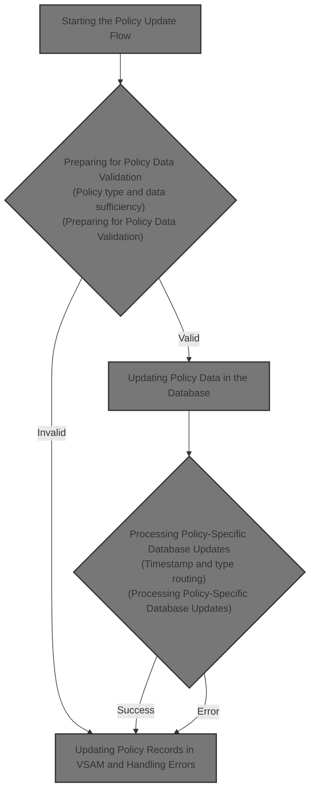
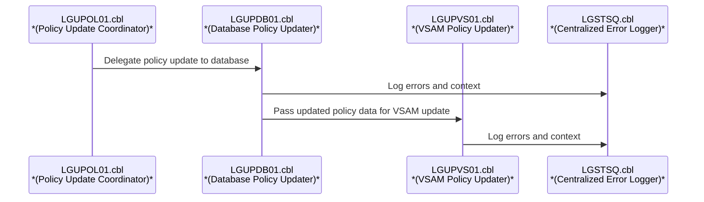
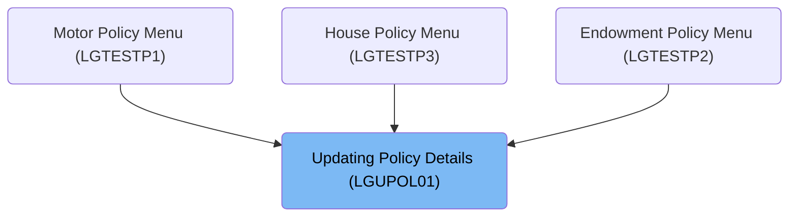
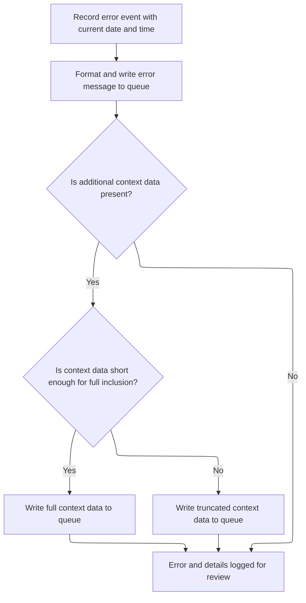
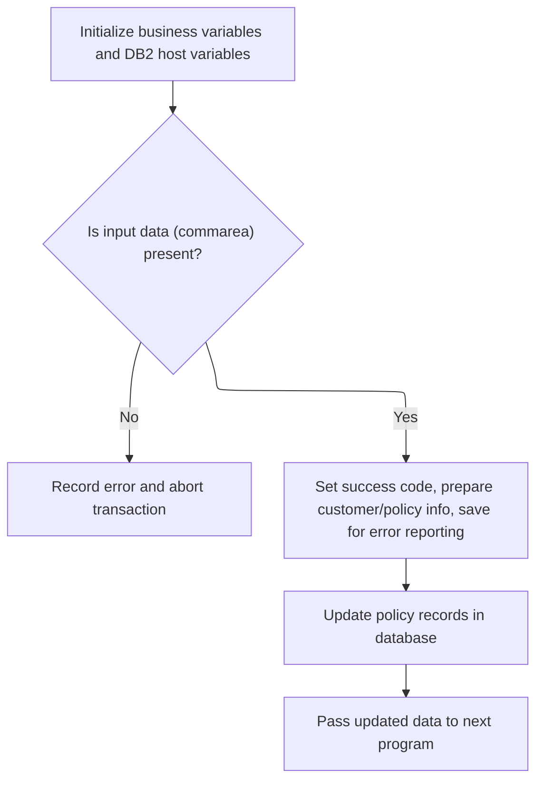
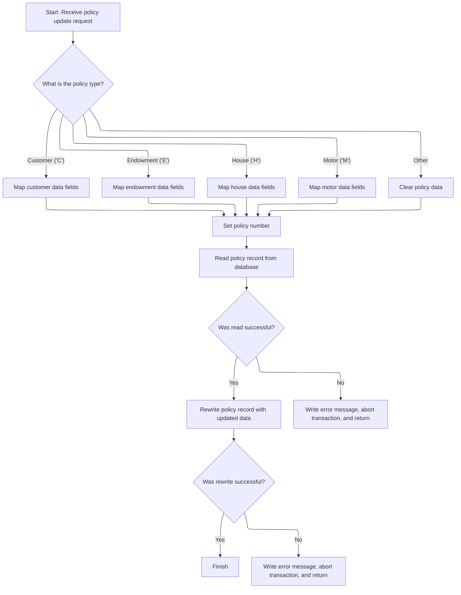

# Overview

This document describes the flow for updating policy details. The process validates requests, logs errors with context, prepares for policy data validation, and updates policy records in both the database and VSAM, ensuring standardized business rules and robust error tracking.



# Technical Overview



## Dependencies

### Programs

- <SwmToken path="base/src/lgupol01.cbl" pos="157:9:9" line-data="           EXEC CICS LINK Program(LGUPDB01)">`LGUPDB01`</SwmToken> (<SwmPath>[base/src/lgupdb01.cbl](base/src/lgupdb01.cbl)</SwmPath>)
- <SwmToken path="base/src/lgupdb01.cbl" pos="209:9:9" line-data="           EXEC CICS LINK Program(LGUPVS01)">`LGUPVS01`</SwmToken> (<SwmPath>[base/src/lgupvs01.cbl](base/src/lgupvs01.cbl)</SwmPath>)
- LGSTSQ (<SwmPath>[base/src/lgstsq.cbl](base/src/lgstsq.cbl)</SwmPath>)

### Copybooks

- LGCMAREA (<SwmPath>[base/src/lgcmarea.cpy](base/src/lgcmarea.cpy)</SwmPath>)
- LGPOLICY (<SwmPath>[base/src/lgpolicy.cpy](base/src/lgpolicy.cpy)</SwmPath>)
- SQLCA

# Where is this program used?

This program is used multiple times in the codebase as represented in the following diagram:



## Detailed View of the Program's Functionality

# 1\. Starting the Policy Update Flow

## a. Initialization and Environment Setup

When the policy update flow begins, the main program responsible for orchestrating the update initializes its working storage. This includes setting up a header for runtime information, such as transaction ID, terminal ID, and task number. These details are captured for use in logging and error handling throughout the transaction.

## b. Commarea Validation

The program checks if the input data area (commarea) is present. If the commarea is missing, it prepares an error message with a specific text indicating the absence of commarea, logs this error (including a timestamp), and then aborts the transaction to ensure the issue is recorded and no further processing occurs.

## c. Error Logging with Timestamp

When an error is detected (such as missing commarea), the program:

- Retrieves the current system date and time.
- Formats these values for inclusion in the error log.
- Prepares an error message structure containing the date, time, program name, and error details.
- Calls a dedicated queueing program to write the error message to both a transient data queue (TDQ) and a temporary storage queue (TSQ).
- If additional context data (commarea) is available, up to 90 bytes of this data are also sent to the queue for further analysis. If the commarea is shorter than 91 bytes, the entire commarea is sent; otherwise, only the first 90 bytes are included.

## d. Preparing for Policy Data Validation

After error handling, the program resets the return code and prepares the commarea length and address for subsequent validation steps. It then determines the type of policy update request (endowment, house, motor, or other) and calculates the required length for the commarea based on the policy type:

- For endowment, the required length is the header plus a fixed value.
- For house, the required length is the header plus a different fixed value.
- For motor, the required length is the header plus yet another fixed value.
- If the request type is unknown, an error code is set.

If the provided commarea length is insufficient for the requested policy type, an error code is set and the program returns early to prevent incomplete updates.

## e. Database Update Invocation

If all validations pass, the program invokes a dedicated routine to update the policy information in the database. This is done by linking to a separate program responsible for handling the database update logic.

# 2\. Updating Policy Data in the Database

## a. Initialization and Input Validation

The database update program initializes its own working storage and <SwmToken path="base/src/lgupol01.cbl" pos="143:7:7" line-data="           PERFORM UPDATE-POLICY-DB2-INFO.">`DB2`</SwmToken> host variables. It validates the presence of the commarea, aborting and logging an error if it is missing.

## b. Preparing Data for <SwmToken path="base/src/lgupol01.cbl" pos="143:7:7" line-data="           PERFORM UPDATE-POLICY-DB2-INFO.">`DB2`</SwmToken>

The program converts customer and policy numbers from the commarea into DB2-compatible integer formats. These values are also saved in the error message structure for potential logging.

## c. Policy Update Processing

The program opens a <SwmToken path="base/src/lgupol01.cbl" pos="143:7:7" line-data="           PERFORM UPDATE-POLICY-DB2-INFO.">`DB2`</SwmToken> cursor to select the relevant policy row for update. It evaluates the result of the cursor open operation:

- If successful, it proceeds.
- If a lock timeout or other error occurs, it logs the error and returns early.

It then fetches the policy row and compares the timestamp in the commarea with the one in the database:

- If the timestamps match, it routes to the appropriate update routine based on the policy type (endowment, house, motor).
- If the timestamps do not match, it sets a specific error code indicating a timestamp mismatch.
- If the fetch fails (row not found or other error), it sets an error code and logs the error.

## d. Policy-Specific Table Updates

Depending on the policy type:

- For endowment, the program converts relevant fields to <SwmToken path="base/src/lgupol01.cbl" pos="143:7:7" line-data="           PERFORM UPDATE-POLICY-DB2-INFO.">`DB2`</SwmToken> integer types and updates the endowment table.
- For house, it converts fields and updates the house table.
- For motor, it converts fields and updates the motor table.

If any of these updates fail, the program sets an error code and logs the error.

## e. Main Policy Table Update

After successfully updating the policy-specific table, the program updates the main policy table with new details and a new timestamp. It retrieves the assigned timestamp for return in the commarea. If this update fails, it rolls back the transaction, sets an error code, and logs the error.

## f. Closing the Cursor

Finally, the program closes the <SwmToken path="base/src/lgupol01.cbl" pos="143:7:7" line-data="           PERFORM UPDATE-POLICY-DB2-INFO.">`DB2`</SwmToken> cursor, updating the return code and logging any errors if the close operation fails.

## g. Error Logging

Throughout the database update process, any errors encountered are logged with a timestamp, SQL code, and up to 90 bytes of commarea data for context.

# 3\. Updating Policy Records in VSAM and Handling Errors

## a. Policy Type Mapping

The VSAM update program receives the policy update request and extracts the policy type from the request ID. It maps the relevant fields from the commarea to the internal data structure based on the policy type:

- For customer, endowment, house, or motor, the appropriate fields are moved.
- For unknown types, the policy data is cleared.

## b. Reading and Rewriting VSAM Record

The program attempts to read the policy record from the VSAM file using the constructed key. If the read fails, it logs an error with response codes, aborts the transaction, and returns early.

If the read is successful, the program rewrites the policy record with the updated data. If the rewrite fails, it logs an error, aborts the transaction, and returns.

## c. Error Logging

Any errors encountered during VSAM read or rewrite operations are logged with a timestamp, response codes, and up to 90 bytes of commarea data for context.

## d. Program Exit

After successful completion or error handling, the program exits and returns control.

# 4\. Queueing and Error Message Handling

## a. Message Preparation and Routing

The queueing program receives error messages or other data to be logged. It determines whether the message originated from a program or a terminal request. If the message starts with a specific prefix, it adjusts the queue name accordingly.

## b. Writing to Queues

The program writes the prepared message to both a transient data queue and a temporary storage queue. If the request originated from a terminal, it sends a response back to the terminal.

## c. Program Exit

After writing the message and handling any terminal responses, the program exits and returns control.

# Summary

The overall flow ensures that policy update requests are validated, processed, and logged consistently. Errors are captured with detailed context and timestamps, and all updates are routed through dedicated routines for database and VSAM file handling. Queueing logic centralizes error message storage for later review and troubleshooting.

# Rule Definition

| Paragraph Name                                                                                                                                                                                                                                                                                                                                                                                                                   | Rule ID | Category          | Description                                                                                                                                                                                                                                                                                                                                                                                                                                                                                              | Conditions                                                             | Remarks                                                                                                                                                                                                                                                                                                                                                                                                                                                                                          |
| -------------------------------------------------------------------------------------------------------------------------------------------------------------------------------------------------------------------------------------------------------------------------------------------------------------------------------------------------------------------------------------------------------------------------------- | ------- | ----------------- | -------------------------------------------------------------------------------------------------------------------------------------------------------------------------------------------------------------------------------------------------------------------------------------------------------------------------------------------------------------------------------------------------------------------------------------------------------------------------------------------------------- | ---------------------------------------------------------------------- | ------------------------------------------------------------------------------------------------------------------------------------------------------------------------------------------------------------------------------------------------------------------------------------------------------------------------------------------------------------------------------------------------------------------------------------------------------------------------------------------------ |
| MAINLINE SECTION, lines 88-93 in <SwmPath>[base/src/lgupol01.cbl](base/src/lgupol01.cbl)</SwmPath>; lines 167-173 in <SwmPath>[base/src/lgupdb01.cbl](base/src/lgupdb01.cbl)</SwmPath>                                                                                                                                                                                                                                           | RL-001  | Data Assignment   | At the start of the policy update flow, the system must initialize all working storage variables and capture transaction context (IDs, terminal, task) for use in subsequent processing.                                                                                                                                                                                                                                                                                                                 | Program entry point for policy update flow.                            | Transaction context includes transaction ID (4 chars), terminal ID (4 chars), and task number (7 digits).                                                                                                                                                                                                                                                                                                                                                                                        |
| MAINLINE SECTION, lines 98-103 in <SwmPath>[base/src/lgupol01.cbl](base/src/lgupol01.cbl)</SwmPath>; lines 183-187 in <SwmPath>[base/src/lgupdb01.cbl](base/src/lgupdb01.cbl)</SwmPath>                                                                                                                                                                                                                                          | RL-002  | Conditional Logic | If the commarea input is missing (length zero), the system must record an error event with the current date and time, format and write an error message to the error message queue, and abort the transaction.                                                                                                                                                                                                                                                                                           | Commarea length is zero at program entry.                              | Error message includes date (8 chars), time (6 chars), program name (9 chars), and context-specific info. Up to 90 bytes of commarea data prefixed with 'COMMAREA='.                                                                                                                                                                                                                                                                                                                             |
| <SwmToken path="base/src/lgupol01.cbl" pos="101:3:7" line-data="               PERFORM WRITE-ERROR-MESSAGE">`WRITE-ERROR-MESSAGE`</SwmToken> in <SwmPath>[base/src/lgupol01.cbl](base/src/lgupol01.cbl)</SwmPath>, <SwmPath>[base/src/lgupdb01.cbl](base/src/lgupdb01.cbl)</SwmPath>, and <SwmPath>[base/src/lgupvs01.cbl](base/src/lgupvs01.cbl)</SwmPath>                                                                      | RL-003  | Computation       | Error messages must include the date, time, program name, context-specific information (customer number, policy number, SQL or response codes), and up to 90 bytes of commarea data, prefixed with 'COMMAREA='. The error message must be sent to both a transient data queue (CSMT) and a temporary storage queue (GENAERRS or <SwmToken path="base/src/lgstsq.cbl" pos="6:19:19" line-data="      *  parm Q=nnnn is passed then Queue name GENAnnnn is used        *">`GENAnnnn`</SwmToken>).          | Any error condition requiring logging.                                 | Error message format: date (8 chars), time (6 chars), program name (9 chars), variable/context info (variable), commarea snapshot (up to 90 bytes, prefixed). Sent to CSMT (TDQ) and GENAERRS/GENAnnnn (TSQ).                                                                                                                                                                                                                                                                                    |
| MAINLINE SECTION, lines 113-141 in <SwmPath>[base/src/lgupol01.cbl](base/src/lgupol01.cbl)</SwmPath>                                                                                                                                                                                                                                                                                                                             | RL-004  | Computation       | For each policy update request, the system must determine the request type using the <SwmToken path="base/src/lgupol01.cbl" pos="113:3:7" line-data="           EVALUATE CA-REQUEST-ID">`CA-REQUEST-ID`</SwmToken> field and calculate the required commarea length based on the type.                                                                                                                                                                                                                   | Policy update request received with non-zero commarea.                 | Request types: <SwmToken path="base/src/lgupol01.cbl" pos="115:4:4" line-data="             WHEN &#39;01UEND&#39;">`01UEND`</SwmToken> (Endowment), <SwmToken path="base/src/lgupol01.cbl" pos="123:4:4" line-data="             WHEN &#39;01UHOU&#39;">`01UHOU`</SwmToken> (House), <SwmToken path="base/src/lgupol01.cbl" pos="131:4:4" line-data="             WHEN &#39;01UMOT&#39;">`01UMOT`</SwmToken> (Motor). Required lengths: header (28) + 124 (Endowment), 130 (House), 137 (Motor). |
| MAINLINE SECTION, lines 118-129, 134-137 in <SwmPath>[base/src/lgupol01.cbl](base/src/lgupol01.cbl)</SwmPath>                                                                                                                                                                                                                                                                                                                    | RL-005  | Conditional Logic | If the provided commarea length is insufficient for the request type, the system must set the return code to '98' and return an error.                                                                                                                                                                                                                                                                                                                                                                   | Commarea length is less than required for the determined request type. | Return code '98' indicates insufficient commarea length.                                                                                                                                                                                                                                                                                                                                                                                                                                         |
| MAINLINE SECTION, lines 139-141 in <SwmPath>[base/src/lgupol01.cbl](base/src/lgupol01.cbl)</SwmPath>                                                                                                                                                                                                                                                                                                                             | RL-006  | Conditional Logic | If the request type is not recognized, the system must set the return code to '99' and return an error.                                                                                                                                                                                                                                                                                                                                                                                                  | Request type does not match any known types.                           | Return code '99' indicates unrecognized request type.                                                                                                                                                                                                                                                                                                                                                                                                                                            |
| <SwmToken path="base/src/lgupol01.cbl" pos="143:3:9" line-data="           PERFORM UPDATE-POLICY-DB2-INFO.">`UPDATE-POLICY-DB2-INFO`</SwmToken> in <SwmPath>[base/src/lgupdb01.cbl](base/src/lgupdb01.cbl)</SwmPath>, invoked from <SwmPath>[base/src/lgupol01.cbl](base/src/lgupol01.cbl)</SwmPath>                                                                                                                             | RL-007  | Computation       | The system must update the policy data in the <SwmToken path="base/src/lgupol01.cbl" pos="143:7:7" line-data="           PERFORM UPDATE-POLICY-DB2-INFO.">`DB2`</SwmToken> database by passing the commarea to the database update logic, which initializes variables, validates input, converts fields, fetches the policy row, checks for timestamp conflicts, routes to the appropriate update routine, updates detail and main tables, logs errors if any update fails, and updates the return code. | Commarea length is sufficient and request type is valid.               | Policy-specific tables: ENDOWMENT, HOUSE, MOTOR. Main table: POLICY. Return codes: '00' (success), '01' (not found), '02' (timestamp conflict), '90' (<SwmToken path="base/src/lgupol01.cbl" pos="143:7:7" line-data="           PERFORM UPDATE-POLICY-DB2-INFO.">`DB2`</SwmToken> error).                                                                                                                                                                                                       |
| MAINLINE SECTION in <SwmPath>[base/src/lgupvs01.cbl](base/src/lgupvs01.cbl)</SwmPath>                                                                                                                                                                                                                                                                                                                                            | RL-008  | Computation       | The system must update policy records in the VSAM KSDS file by extracting the policy type from the request ID, mapping relevant fields, reading the VSAM record, and rewriting it with updated data. If the read or rewrite fails, an error message must be logged and the transaction aborted.                                                                                                                                                                                                          | VSAM update requested for a policy.                                    | VSAM file: KSDSPOLY. Return codes: '81' (read fail), '82' (rewrite fail).                                                                                                                                                                                                                                                                                                                                                                                                                        |
| <SwmToken path="base/src/lgupol01.cbl" pos="101:3:7" line-data="               PERFORM WRITE-ERROR-MESSAGE">`WRITE-ERROR-MESSAGE`</SwmToken> in <SwmPath>[base/src/lgupol01.cbl](base/src/lgupol01.cbl)</SwmPath>, <SwmPath>[base/src/lgupdb01.cbl](base/src/lgupdb01.cbl)</SwmPath>, <SwmPath>[base/src/lgupvs01.cbl](base/src/lgupvs01.cbl)</SwmPath>; LGSTSQ in <SwmPath>[base/src/lgstsq.cbl](base/src/lgstsq.cbl)</SwmPath> | RL-009  | Computation       | All error handling must ensure that error details are logged with timestamp, response/SQL codes, and a commarea snapshot for traceability. Error messages are sent to both transient and temporary queues.                                                                                                                                                                                                                                                                                               | Any error or abnormal condition during processing.                     | Error message includes timestamp, program name, context info, response/SQL codes, and up to 90 bytes of commarea data. Sent to CSMT (TDQ) and GENAERRS/GENAnnnn (TSQ).                                                                                                                                                                                                                                                                                                                           |
| <SwmToken path="base/src/lgupol01.cbl" pos="146:1:3" line-data="       END-PROGRAM.">`END-PROGRAM`</SwmToken> in <SwmPath>[base/src/lgupol01.cbl](base/src/lgupol01.cbl)</SwmPath>, <SwmPath>[base/src/lgupdb01.cbl](base/src/lgupdb01.cbl)</SwmPath>, <SwmPath>[base/src/lgupvs01.cbl](base/src/lgupvs01.cbl)</SwmPath>                                                                                                         | RL-010  | Conditional Logic | The system must return control to the caller after processing, regardless of outcome.                                                                                                                                                                                                                                                                                                                                                                                                                    | End of processing, whether successful or after error handling.         | Return is performed via EXEC CICS RETURN.                                                                                                                                                                                                                                                                                                                                                                                                                                                        |

# User Stories

## User Story 1: Comprehensive error handling and logging

---

### Story Description:

As a system, I want to handle all error conditions by recording detailed error events (including timestamp, program name, context info, response/SQL codes, and commarea snapshot), formatting and sending error messages to both transient and temporary queues, and aborting the transaction if necessary so that errors are traceable and can be acted upon.

---

### Business Rule Mapping:

| Rule ID | Paragraph Name                                                                                                                                                                                                                                                                                                                                                                                                                   | Rule Description                                                                                                                                                                                                                                                                                                                                                                                                                                                                                |
| ------- | -------------------------------------------------------------------------------------------------------------------------------------------------------------------------------------------------------------------------------------------------------------------------------------------------------------------------------------------------------------------------------------------------------------------------------- | ----------------------------------------------------------------------------------------------------------------------------------------------------------------------------------------------------------------------------------------------------------------------------------------------------------------------------------------------------------------------------------------------------------------------------------------------------------------------------------------------- |
| RL-002  | MAINLINE SECTION, lines 98-103 in <SwmPath>[base/src/lgupol01.cbl](base/src/lgupol01.cbl)</SwmPath>; lines 183-187 in <SwmPath>[base/src/lgupdb01.cbl](base/src/lgupdb01.cbl)</SwmPath>                                                                                                                                                                                                                                          | If the commarea input is missing (length zero), the system must record an error event with the current date and time, format and write an error message to the error message queue, and abort the transaction.                                                                                                                                                                                                                                                                                  |
| RL-003  | <SwmToken path="base/src/lgupol01.cbl" pos="101:3:7" line-data="               PERFORM WRITE-ERROR-MESSAGE">`WRITE-ERROR-MESSAGE`</SwmToken> in <SwmPath>[base/src/lgupol01.cbl](base/src/lgupol01.cbl)</SwmPath>, <SwmPath>[base/src/lgupdb01.cbl](base/src/lgupdb01.cbl)</SwmPath>, and <SwmPath>[base/src/lgupvs01.cbl](base/src/lgupvs01.cbl)</SwmPath>                                                                      | Error messages must include the date, time, program name, context-specific information (customer number, policy number, SQL or response codes), and up to 90 bytes of commarea data, prefixed with 'COMMAREA='. The error message must be sent to both a transient data queue (CSMT) and a temporary storage queue (GENAERRS or <SwmToken path="base/src/lgstsq.cbl" pos="6:19:19" line-data="      *  parm Q=nnnn is passed then Queue name GENAnnnn is used        *">`GENAnnnn`</SwmToken>). |
| RL-009  | <SwmToken path="base/src/lgupol01.cbl" pos="101:3:7" line-data="               PERFORM WRITE-ERROR-MESSAGE">`WRITE-ERROR-MESSAGE`</SwmToken> in <SwmPath>[base/src/lgupol01.cbl](base/src/lgupol01.cbl)</SwmPath>, <SwmPath>[base/src/lgupdb01.cbl](base/src/lgupdb01.cbl)</SwmPath>, <SwmPath>[base/src/lgupvs01.cbl](base/src/lgupvs01.cbl)</SwmPath>; LGSTSQ in <SwmPath>[base/src/lgstsq.cbl](base/src/lgstsq.cbl)</SwmPath> | All error handling must ensure that error details are logged with timestamp, response/SQL codes, and a commarea snapshot for traceability. Error messages are sent to both transient and temporary queues.                                                                                                                                                                                                                                                                                      |

---

### Relevant Functionality:

- **MAINLINE SECTION**
  1. **RL-002:**
     - If commarea length is zero:
       - Set error message variable to indicate missing commarea.
       - Call error message writing routine.
       - Abort transaction with specific abend code.
- <SwmToken path="base/src/lgupol01.cbl" pos="101:3:7" line-data="               PERFORM WRITE-ERROR-MESSAGE">`WRITE-ERROR-MESSAGE`</SwmToken> **in** <SwmPath>[base/src/lgupol01.cbl](base/src/lgupol01.cbl)</SwmPath>
  1. **RL-003:**
     - On error:
       - Obtain current date and time.
       - Populate error message fields with context info.
       - Move up to 90 bytes of commarea data to error message, prefixed with 'COMMAREA='.
       - Send error message to CSMT (TDQ) and GENAERRS/GENAnnnn (TSQ) via LGSTSQ.
  2. **RL-009:**
     - On error:
       - Format error message with all required details.
       - Send to both CSMT and GENAERRS/GENAnnnn via LGSTSQ.

## User Story 2: Initialize transaction and validate policy update request

---

### Story Description:

As a system, I want to initialize all working storage, capture transaction context, validate the presence and length of the commarea, and determine the policy update request type so that subsequent processing has the necessary context and only valid requests are processed.

---

### Business Rule Mapping:

| Rule ID | Paragraph Name                                                                                                                                                                         | Rule Description                                                                                                                                                                                                                                                                       |
| ------- | -------------------------------------------------------------------------------------------------------------------------------------------------------------------------------------- | -------------------------------------------------------------------------------------------------------------------------------------------------------------------------------------------------------------------------------------------------------------------------------------- |
| RL-001  | MAINLINE SECTION, lines 88-93 in <SwmPath>[base/src/lgupol01.cbl](base/src/lgupol01.cbl)</SwmPath>; lines 167-173 in <SwmPath>[base/src/lgupdb01.cbl](base/src/lgupdb01.cbl)</SwmPath> | At the start of the policy update flow, the system must initialize all working storage variables and capture transaction context (IDs, terminal, task) for use in subsequent processing.                                                                                               |
| RL-004  | MAINLINE SECTION, lines 113-141 in <SwmPath>[base/src/lgupol01.cbl](base/src/lgupol01.cbl)</SwmPath>                                                                                   | For each policy update request, the system must determine the request type using the <SwmToken path="base/src/lgupol01.cbl" pos="113:3:7" line-data="           EVALUATE CA-REQUEST-ID">`CA-REQUEST-ID`</SwmToken> field and calculate the required commarea length based on the type. |
| RL-005  | MAINLINE SECTION, lines 118-129, 134-137 in <SwmPath>[base/src/lgupol01.cbl](base/src/lgupol01.cbl)</SwmPath>                                                                          | If the provided commarea length is insufficient for the request type, the system must set the return code to '98' and return an error.                                                                                                                                                 |
| RL-006  | MAINLINE SECTION, lines 139-141 in <SwmPath>[base/src/lgupol01.cbl](base/src/lgupol01.cbl)</SwmPath>                                                                                   | If the request type is not recognized, the system must set the return code to '99' and return an error.                                                                                                                                                                                |

---

### Relevant Functionality:

- **MAINLINE SECTION**
  1. **RL-001:**
     - On program start:
       - Initialize all working storage variables.
       - Move transaction ID, terminal ID, and task number from system fields to working storage fields.
  2. **RL-004:**
     - Evaluate request type:
       - If <SwmToken path="base/src/lgupol01.cbl" pos="115:4:4" line-data="             WHEN &#39;01UEND&#39;">`01UEND`</SwmToken>: required length = header + 124
       - If <SwmToken path="base/src/lgupol01.cbl" pos="123:4:4" line-data="             WHEN &#39;01UHOU&#39;">`01UHOU`</SwmToken>: required length = header + 130
       - If <SwmToken path="base/src/lgupol01.cbl" pos="131:4:4" line-data="             WHEN &#39;01UMOT&#39;">`01UMOT`</SwmToken>: required length = header + 137
  3. **RL-005:**
     - If commarea length < required for type:
       - Set return code to '98'.
       - Return to caller.
  4. **RL-006:**
     - If request type is not recognized:
       - Set return code to '99'.
       - Return to caller.

## User Story 3: Process policy update and complete transaction

---

### Story Description:

As a system, I want to update policy data in the <SwmToken path="base/src/lgupol01.cbl" pos="143:7:7" line-data="           PERFORM UPDATE-POLICY-DB2-INFO.">`DB2`</SwmToken> database and VSAM KSDS file, including initializing variables, validating input, converting fields, fetching and checking the policy row, routing to the correct update routine, updating detail and main tables, logging errors if updates fail, updating the return code, and returning control to the caller so that policy information is accurately maintained and the transaction flow is properly completed.

---

### Business Rule Mapping:

| Rule ID | Paragraph Name                                                                                                                                                                                                                                                                                                           | Rule Description                                                                                                                                                                                                                                                                                                                                                                                                                                                                                         |
| ------- | ------------------------------------------------------------------------------------------------------------------------------------------------------------------------------------------------------------------------------------------------------------------------------------------------------------------------ | -------------------------------------------------------------------------------------------------------------------------------------------------------------------------------------------------------------------------------------------------------------------------------------------------------------------------------------------------------------------------------------------------------------------------------------------------------------------------------------------------------- |
| RL-007  | <SwmToken path="base/src/lgupol01.cbl" pos="143:3:9" line-data="           PERFORM UPDATE-POLICY-DB2-INFO.">`UPDATE-POLICY-DB2-INFO`</SwmToken> in <SwmPath>[base/src/lgupdb01.cbl](base/src/lgupdb01.cbl)</SwmPath>, invoked from <SwmPath>[base/src/lgupol01.cbl](base/src/lgupol01.cbl)</SwmPath>                     | The system must update the policy data in the <SwmToken path="base/src/lgupol01.cbl" pos="143:7:7" line-data="           PERFORM UPDATE-POLICY-DB2-INFO.">`DB2`</SwmToken> database by passing the commarea to the database update logic, which initializes variables, validates input, converts fields, fetches the policy row, checks for timestamp conflicts, routes to the appropriate update routine, updates detail and main tables, logs errors if any update fails, and updates the return code. |
| RL-008  | MAINLINE SECTION in <SwmPath>[base/src/lgupvs01.cbl](base/src/lgupvs01.cbl)</SwmPath>                                                                                                                                                                                                                                    | The system must update policy records in the VSAM KSDS file by extracting the policy type from the request ID, mapping relevant fields, reading the VSAM record, and rewriting it with updated data. If the read or rewrite fails, an error message must be logged and the transaction aborted.                                                                                                                                                                                                          |
| RL-010  | <SwmToken path="base/src/lgupol01.cbl" pos="146:1:3" line-data="       END-PROGRAM.">`END-PROGRAM`</SwmToken> in <SwmPath>[base/src/lgupol01.cbl](base/src/lgupol01.cbl)</SwmPath>, <SwmPath>[base/src/lgupdb01.cbl](base/src/lgupdb01.cbl)</SwmPath>, <SwmPath>[base/src/lgupvs01.cbl](base/src/lgupvs01.cbl)</SwmPath> | The system must return control to the caller after processing, regardless of outcome.                                                                                                                                                                                                                                                                                                                                                                                                                    |

---

### Relevant Functionality:

- <SwmToken path="base/src/lgupol01.cbl" pos="143:3:9" line-data="           PERFORM UPDATE-POLICY-DB2-INFO.">`UPDATE-POLICY-DB2-INFO`</SwmToken> **in** <SwmPath>[base/src/lgupdb01.cbl](base/src/lgupdb01.cbl)</SwmPath>
  1. **RL-007:**
     - Initialize <SwmToken path="base/src/lgupol01.cbl" pos="143:7:7" line-data="           PERFORM UPDATE-POLICY-DB2-INFO.">`DB2`</SwmToken> host variables.
     - Convert commarea fields to <SwmToken path="base/src/lgupol01.cbl" pos="143:7:7" line-data="           PERFORM UPDATE-POLICY-DB2-INFO.">`DB2`</SwmToken> types.
     - Open cursor and fetch policy row.
     - If timestamp matches, route to update routine based on type.
     - Update detail table and main POLICY table.
     - If any update fails, log error and set return code.
     - Close cursor.
- **MAINLINE SECTION in** <SwmPath>[base/src/lgupvs01.cbl](base/src/lgupvs01.cbl)</SwmPath>
  1. **RL-008:**
     - Extract policy type from request ID.
     - Map commarea fields to VSAM record structure.
     - Read VSAM record by key.
     - If read fails, log error, set return code, abort.
     - Rewrite VSAM record with updated data.
     - If rewrite fails, log error, set return code, abort.
- <SwmToken path="base/src/lgupol01.cbl" pos="146:1:3" line-data="       END-PROGRAM.">`END-PROGRAM`</SwmToken> **in** <SwmPath>[base/src/lgupol01.cbl](base/src/lgupol01.cbl)</SwmPath>
  1. **RL-010:**
     - At end of processing or after error handling:
       - Execute return to caller.

# Workflow

# Starting the Policy Update Flow

This section ensures that the Policy Update Flow starts with a valid environment by initializing storage and capturing transaction context. It also enforces the requirement that a commarea must be present, and handles missing commarea scenarios by logging the error and aborting the transaction.

<SwmSnippet path="/base/src/lgupol01.cbl" line="83">

---

In <SwmToken path="base/src/lgupol01.cbl" pos="83:1:1" line-data="       MAINLINE SECTION.">`MAINLINE`</SwmToken>, this is where we kick off the flow by setting up the environment: working storage is initialized and transaction context (IDs, terminal, task) is captured for later use in logging and error handling.

```cobol
       MAINLINE SECTION.

      *----------------------------------------------------------------*
      * Common code                                                    *
      *----------------------------------------------------------------*
      * initialize working storage variables
           INITIALIZE WS-HEADER.
      * set up general variable
           MOVE EIBTRNID TO WS-TRANSID.
           MOVE EIBTRMID TO WS-TERMID.
           MOVE EIBTASKN TO WS-TASKNUM.
```

---

</SwmSnippet>

<SwmSnippet path="/base/src/lgupol01.cbl" line="99">

---

Here we check if the commarea is missing. If so, we log the error details by calling <SwmToken path="base/src/lgupol01.cbl" pos="101:3:7" line-data="               PERFORM WRITE-ERROR-MESSAGE">`WRITE-ERROR-MESSAGE`</SwmToken> before aborting the transaction, so the issue is tracked in system logs.

```cobol
           IF EIBCALEN IS EQUAL TO ZERO
               MOVE ' NO COMMAREA RECEIVED' TO EM-VARIABLE
               PERFORM WRITE-ERROR-MESSAGE
               EXEC CICS ABEND ABCODE('LGCA') NODUMP END-EXEC
           END-IF
```

---

</SwmSnippet>

## Logging Error Details with Timestamp



This section ensures that all error events are recorded with precise timestamps and relevant context, supporting robust error tracking and auditability. It also enforces rules for handling and logging additional context data associated with errors.

| Category       | Rule Name                             | Description                                                                                                                                                                                                           |
| -------------- | ------------------------------------- | --------------------------------------------------------------------------------------------------------------------------------------------------------------------------------------------------------------------- |
| Business logic | Timestamped error logging             | Every error event must be logged with the current date and time to ensure accurate tracking and auditability.                                                                                                         |
| Business logic | Dual queue error storage              | Error messages must be written to both the transient data queue (TDQ) and the temporary storage queue (TSQ) to ensure redundancy and availability for review.                                                         |
| Business logic | Context data inclusion and truncation | If additional context data (commarea) is present, it must be included in the error log. If the context data is 90 bytes or less, the full data is logged; if it exceeds 90 bytes, only the first 90 bytes are logged. |
| Business logic | Error-only logging when no context    | If no additional context data is present, only the error and its details are logged, without any context data.                                                                                                        |
| Business logic | Special handling for 'Q=' errors      | If the error message starts with 'Q=', the message is adjusted to extract and log the relevant extension and message content.                                                                                         |

<SwmSnippet path="/base/src/lgupol01.cbl" line="169">

---

We fetch and format the timestamp for the error log.

```cobol
       WRITE-ERROR-MESSAGE.
      * Save SQLCODE in message
      * Obtain and format current time and date
           EXEC CICS ASKTIME ABSTIME(WS-ABSTIME)
           END-EXEC
           EXEC CICS FORMATTIME ABSTIME(WS-ABSTIME)
                     MMDDYYYY(WS-DATE)
                     TIME(WS-TIME)
           END-EXEC
```

---

</SwmSnippet>

<SwmSnippet path="/base/src/lgupol01.cbl" line="178">

---

After prepping the error message, we call LGSTSQ to actually queue and log it. This keeps error handling consistent and lets us leverage the queueing logic in LGSTSQ.

```cobol
           MOVE WS-DATE TO EM-DATE
           MOVE WS-TIME TO EM-TIME
      * Write output message to TDQ
           EXEC CICS LINK PROGRAM('LGSTSQ')
                     COMMAREA(ERROR-MSG)
                     LENGTH(LENGTH OF ERROR-MSG)
           END-EXEC.
```

---

</SwmSnippet>

<SwmSnippet path="/base/src/lgstsq.cbl" line="55">

---

LGSTSQ decides if the message comes from a program or terminal, tweaks the message if it starts with 'Q=', and writes it to both TDQ and TSQ. If it's a terminal request, it sends a response back.

```cobol
       MAINLINE SECTION.

           MOVE SPACES TO WRITE-MSG.
           MOVE SPACES TO WS-RECV.

           EXEC CICS ASSIGN SYSID(WRITE-MSG-SYSID)
                RESP(WS-RESP)
           END-EXEC.

           EXEC CICS ASSIGN INVOKINGPROG(WS-INVOKEPROG)
                RESP(WS-RESP)
           END-EXEC.
           
           IF WS-INVOKEPROG NOT = SPACES
              MOVE 'C' To WS-FLAG
              MOVE COMMA-DATA  TO WRITE-MSG-MSG
              MOVE EIBCALEN    TO WS-RECV-LEN
           ELSE
              EXEC CICS RECEIVE INTO(WS-RECV)
                  LENGTH(WS-RECV-LEN)
                  RESP(WS-RESP)
              END-EXEC
              MOVE 'R' To WS-FLAG
              MOVE WS-RECV-DATA  TO WRITE-MSG-MSG
              SUBTRACT 5 FROM WS-RECV-LEN
           END-IF.

           MOVE 'GENAERRS' TO STSQ-NAME.
           IF WRITE-MSG-MSG(1:2) = 'Q=' THEN
              MOVE WRITE-MSG-MSG(3:4) TO STSQ-EXT
              MOVE WRITE-MSG-REST TO TEMPO
              MOVE TEMPO          TO WRITE-MSG-MSG
              SUBTRACT 7 FROM WS-RECV-LEN
           END-IF.

           ADD 5 TO WS-RECV-LEN.

      * Write output message to TDQ CSMT
      *
           EXEC CICS WRITEQ TD QUEUE(STDQ-NAME)
                     FROM(WRITE-MSG)
                     RESP(WS-RESP)
                     LENGTH(WS-RECV-LEN)

           END-EXEC.

      * Write output message to Genapp TSQ
      * If no space is available then the task will not wait for
      *  storage to become available but will ignore the request...
      *
           EXEC CICS WRITEQ TS QUEUE(STSQ-NAME)
                     FROM(WRITE-MSG)
                     RESP(WS-RESP)
                     NOSUSPEND
                     LENGTH(WS-RECV-LEN)

           END-EXEC.

           If WS-FLAG = 'R' Then
             EXEC CICS SEND TEXT FROM(FILLER-X)
              WAIT
              ERASE
              LENGTH(1)
              FREEKB
             END-EXEC.

           EXEC CICS RETURN
           END-EXEC.
```

---

</SwmSnippet>

<SwmSnippet path="/base/src/lgupol01.cbl" line="186">

---

After returning from LGSTSQ, <SwmToken path="base/src/lgupol01.cbl" pos="101:3:7" line-data="               PERFORM WRITE-ERROR-MESSAGE">`WRITE-ERROR-MESSAGE`</SwmToken> checks if there's commarea data to log. If so, it sends up to 90 bytes to LGSTSQ for error tracking, making sure we don't overflow the buffer.

```cobol
           IF EIBCALEN > 0 THEN
             IF EIBCALEN < 91 THEN
               MOVE DFHCOMMAREA(1:EIBCALEN) TO CA-DATA
               EXEC CICS LINK PROGRAM('LGSTSQ')
                         COMMAREA(CA-ERROR-MSG)
                         LENGTH(LENGTH OF CA-ERROR-MSG)
               END-EXEC
             ELSE
               MOVE DFHCOMMAREA(1:90) TO CA-DATA
               EXEC CICS LINK PROGRAM('LGSTSQ')
                         COMMAREA(CA-ERROR-MSG)
                         LENGTH(LENGTH OF CA-ERROR-MSG)
               END-EXEC
             END-IF
           END-IF.
           EXIT.
```

---

</SwmSnippet>

## Preparing for Policy Data Validation

```mermaid
%%{init: {"flowchart": {"defaultRenderer": "elk"}} }%%
flowchart TD
    node1["Start: Prepare for request processing"]
    click node1 openCode "base/src/lgupol01.cbl:105:107"
    node1 --> node2{"What is the request type?"}
    click node2 openCode "base/src/lgupol01.cbl:113:114"
    node2 -->|"Endowment (01UEND)"| node3["Calculate required length: header + 124"]
    click node3 openCode "base/src/lgupol01.cbl:115:117"
    node2 -->|"House (01UHOU)"| node4["Calculate required length: header + 130"]
    click node4 openCode "base/src/lgupol01.cbl:123:125"
    node2 -->|"Motor (01UMOT)"| node5["Calculate required length: header + 137"]
    click node5 openCode "base/src/lgupol01.cbl:131:133"
    node2 -->|"Other"| node6["Set error code '99': Unknown request"]
    click node6 openCode "base/src/lgupol01.cbl:139:140"
    node3 --> node7{"Is provided length sufficient?"}
    click node7 openCode "base/src/lgupol01.cbl:118:121"
    node4 --> node8{"Is provided length sufficient?"}
    click node8 openCode "base/src/lgupol01.cbl:126:129"
    node5 --> node9{"Is provided length sufficient?"}
    click node9 openCode "base/src/lgupol01.cbl:134:137"
    node7 -->|"No"| node10["Set error code '98': Insufficient length"]
    click node10 openCode "base/src/lgupol01.cbl:119:120"
    node8 -->|"No"| node10
    node9 -->|"No"| node10
    node7 -->|"Yes"| node11["Update policy information"]
    click node11 openCode "base/src/lgupol01.cbl:143:143"
    node8 -->|"Yes"| node11
    node9 -->|"Yes"| node11
    node6 --> node12["Return to caller"]
    click node12 openCode "base/src/lgupol01.cbl:141:142"
    node10 --> node12
    node11 --> node12
classDef HeadingStyle fill:#777777,stroke:#333,stroke-width:2px;

%% Swimm:
%% %%{init: {"flowchart": {"defaultRenderer": "elk"}} }%%
%% flowchart TD
%%     node1["Start: Prepare for request processing"]
%%     click node1 openCode "<SwmPath>[base/src/lgupol01.cbl](base/src/lgupol01.cbl)</SwmPath>:105:107"
%%     node1 --> node2{"What is the request type?"}
%%     click node2 openCode "<SwmPath>[base/src/lgupol01.cbl](base/src/lgupol01.cbl)</SwmPath>:113:114"
%%     node2 -->|"Endowment (<SwmToken path="base/src/lgupol01.cbl" pos="115:4:4" line-data="             WHEN &#39;01UEND&#39;">`01UEND`</SwmToken>)"| node3["Calculate required length: header + 124"]
%%     click node3 openCode "<SwmPath>[base/src/lgupol01.cbl](base/src/lgupol01.cbl)</SwmPath>:115:117"
%%     node2 -->|"House (<SwmToken path="base/src/lgupol01.cbl" pos="123:4:4" line-data="             WHEN &#39;01UHOU&#39;">`01UHOU`</SwmToken>)"| node4["Calculate required length: header + 130"]
%%     click node4 openCode "<SwmPath>[base/src/lgupol01.cbl](base/src/lgupol01.cbl)</SwmPath>:123:125"
%%     node2 -->|"Motor (<SwmToken path="base/src/lgupol01.cbl" pos="131:4:4" line-data="             WHEN &#39;01UMOT&#39;">`01UMOT`</SwmToken>)"| node5["Calculate required length: header + 137"]
%%     click node5 openCode "<SwmPath>[base/src/lgupol01.cbl](base/src/lgupol01.cbl)</SwmPath>:131:133"
%%     node2 -->|"Other"| node6["Set error code '99': Unknown request"]
%%     click node6 openCode "<SwmPath>[base/src/lgupol01.cbl](base/src/lgupol01.cbl)</SwmPath>:139:140"
%%     node3 --> node7{"Is provided length sufficient?"}
%%     click node7 openCode "<SwmPath>[base/src/lgupol01.cbl](base/src/lgupol01.cbl)</SwmPath>:118:121"
%%     node4 --> node8{"Is provided length sufficient?"}
%%     click node8 openCode "<SwmPath>[base/src/lgupol01.cbl](base/src/lgupol01.cbl)</SwmPath>:126:129"
%%     node5 --> node9{"Is provided length sufficient?"}
%%     click node9 openCode "<SwmPath>[base/src/lgupol01.cbl](base/src/lgupol01.cbl)</SwmPath>:134:137"
%%     node7 -->|"No"| node10["Set error code '98': Insufficient length"]
%%     click node10 openCode "<SwmPath>[base/src/lgupol01.cbl](base/src/lgupol01.cbl)</SwmPath>:119:120"
%%     node8 -->|"No"| node10
%%     node9 -->|"No"| node10
%%     node7 -->|"Yes"| node11["Update policy information"]
%%     click node11 openCode "<SwmPath>[base/src/lgupol01.cbl](base/src/lgupol01.cbl)</SwmPath>:143:143"
%%     node8 -->|"Yes"| node11
%%     node9 -->|"Yes"| node11
%%     node6 --> node12["Return to caller"]
%%     click node12 openCode "<SwmPath>[base/src/lgupol01.cbl](base/src/lgupol01.cbl)</SwmPath>:141:142"
%%     node10 --> node12
%%     node11 --> node12
%% classDef HeadingStyle fill:#777777,stroke:#333,stroke-width:2px;
```



<SwmSnippet path="/base/src/lgupol01.cbl" line="105">

---

Back in MAINLINE after <SwmToken path="base/src/lgupol01.cbl" pos="101:3:7" line-data="               PERFORM WRITE-ERROR-MESSAGE">`WRITE-ERROR-MESSAGE`</SwmToken>, we reset the return code and prep commarea length and address for the next validation steps.

```cobol
           MOVE '00' TO CA-RETURN-CODE
           MOVE EIBCALEN TO WS-CALEN.
           SET WS-ADDR-DFHCOMMAREA TO ADDRESS OF DFHCOMMAREA.
```

---

</SwmSnippet>

<SwmSnippet path="/base/src/lgupol01.cbl" line="113">

---

Here we validate the commarea length for <SwmToken path="base/src/lgupol01.cbl" pos="115:4:4" line-data="             WHEN &#39;01UEND&#39;">`01UEND`</SwmToken> requests. If it's too short, we set an error code and exit early to prevent incomplete updates.

```cobol
           EVALUATE CA-REQUEST-ID

             WHEN '01UEND'
               ADD WS-CA-HEADER-LEN  TO WS-REQUIRED-CA-LEN
               ADD WS-FULL-ENDOW-LEN TO WS-REQUIRED-CA-LEN
               IF EIBCALEN IS LESS THAN WS-REQUIRED-CA-LEN
                 MOVE '98' TO CA-RETURN-CODE
                 EXEC CICS RETURN END-EXEC
               END-IF
```

---

</SwmSnippet>

<SwmSnippet path="/base/src/lgupol01.cbl" line="123">

---

Same deal as before, but for <SwmToken path="base/src/lgupol01.cbl" pos="123:4:4" line-data="             WHEN &#39;01UHOU&#39;">`01UHOU`</SwmToken> requests. We check if the commarea is long enough for house policy data and exit with an error if not.

```cobol
             WHEN '01UHOU'
               ADD WS-CA-HEADER-LEN  TO WS-REQUIRED-CA-LEN
               ADD WS-FULL-HOUSE-LEN TO WS-REQUIRED-CA-LEN
               IF EIBCALEN IS LESS THAN WS-REQUIRED-CA-LEN
                 MOVE '98' TO CA-RETURN-CODE
                 EXEC CICS RETURN END-EXEC
               END-IF
```

---

</SwmSnippet>

<SwmSnippet path="/base/src/lgupol01.cbl" line="131">

---

For <SwmToken path="base/src/lgupol01.cbl" pos="131:4:4" line-data="             WHEN &#39;01UMOT&#39;">`01UMOT`</SwmToken> requests, we check the commarea length for motor policy data and exit with an error if it's not enough.

```cobol
             WHEN '01UMOT'
               ADD WS-CA-HEADER-LEN  TO WS-REQUIRED-CA-LEN
               ADD WS-FULL-MOTOR-LEN TO WS-REQUIRED-CA-LEN
               IF EIBCALEN IS LESS THAN WS-REQUIRED-CA-LEN
                 MOVE '98' TO CA-RETURN-CODE
                 EXEC CICS RETURN END-EXEC
               END-IF
```

---

</SwmSnippet>

<SwmSnippet path="/base/src/lgupol01.cbl" line="139">

---

After handling all request types, we call <SwmToken path="base/src/lgupol01.cbl" pos="143:3:9" line-data="           PERFORM UPDATE-POLICY-DB2-INFO.">`UPDATE-POLICY-DB2-INFO`</SwmToken> to push the update to the database, regardless of the request ID outcome.

```cobol
             WHEN OTHER
               MOVE '99' TO CA-RETURN-CODE
           END-EVALUATE

           PERFORM UPDATE-POLICY-DB2-INFO.
```

---

</SwmSnippet>

# Updating Policy Data in the Database

This section is responsible for updating policy data in the database by delegating the update operation to a dedicated program. The main product role is to ensure that policy information is accurately and reliably updated in the database, maintaining data integrity and modularity of the update process.

| Category        | Rule Name              | Description                                                                                                                  |
| --------------- | ---------------------- | ---------------------------------------------------------------------------------------------------------------------------- |
| Data validation | Policy Data Validation | The update operation must only proceed if the policy data provided is complete and valid according to business requirements. |

<SwmSnippet path="/base/src/lgupol01.cbl" line="155">

---

In <SwmToken path="base/src/lgupol01.cbl" pos="155:1:7" line-data="       UPDATE-POLICY-DB2-INFO.">`UPDATE-POLICY-DB2-INFO`</SwmToken>, we hand off the commarea to <SwmToken path="base/src/lgupol01.cbl" pos="157:9:9" line-data="           EXEC CICS LINK Program(LGUPDB01)">`LGUPDB01`</SwmToken> for the actual <SwmToken path="base/src/lgupol01.cbl" pos="155:5:5" line-data="       UPDATE-POLICY-DB2-INFO.">`DB2`</SwmToken> update. This keeps the update logic modular and focused.

```cobol
       UPDATE-POLICY-DB2-INFO.

           EXEC CICS LINK Program(LGUPDB01)
                Commarea(DFHCOMMAREA)
                LENGTH(32500)
           END-EXEC.

           EXIT.
```

---

</SwmSnippet>

# Validating and Processing Policy Update Requests



This section is responsible for validating and processing policy update requests. It ensures that all required input data is present and correctly formatted before updating policy records in the database. If any validation fails, the section logs detailed error information and aborts the transaction to maintain data integrity.

| Category        | Rule Name                                                                                                                                               | Description                                                                                                                                                    |
| --------------- | ------------------------------------------------------------------------------------------------------------------------------------------------------- | -------------------------------------------------------------------------------------------------------------------------------------------------------------- |
| Data validation | Mandatory input presence                                                                                                                                | If the input commarea is missing, the transaction must be aborted and an error message must be logged with the reason 'NO COMMAREA RECEIVED'.                  |
| Data validation | Input field conversion for <SwmToken path="base/src/lgupol01.cbl" pos="143:7:7" line-data="           PERFORM UPDATE-POLICY-DB2-INFO.">`DB2`</SwmToken> | The customer number and policy number from the commarea must be converted and stored in DB2-compatible integer fields before any database update is attempted. |
| Business logic  | Success code initialization                                                                                                                             | The return code in the commarea must be set to '00' to indicate successful validation before proceeding with the policy update.                                |
| Business logic  | Data handoff to next process                                                                                                                            | After successful validation and update, the updated commarea data must be passed to the next program in the workflow for further processing.                   |

<SwmSnippet path="/base/src/lgupdb01.cbl" line="162">

---

In MAINLINE (<SwmToken path="base/src/lgupol01.cbl" pos="157:9:9" line-data="           EXEC CICS LINK Program(LGUPDB01)">`LGUPDB01`</SwmToken>), we prep <SwmToken path="base/src/lgupdb01.cbl" pos="175:5:5" line-data="      * initialize DB2 host variables">`DB2`</SwmToken> variables, validate input, and convert fields for <SwmToken path="base/src/lgupdb01.cbl" pos="175:5:5" line-data="      * initialize DB2 host variables">`DB2`</SwmToken> compatibility. If input is missing, we log and abort to avoid bad updates.

```cobol
       MAINLINE SECTION.

      *----------------------------------------------------------------*
      * Common code                                                    *
      *----------------------------------------------------------------*
      * initialize working storage variables
           INITIALIZE WS-HEADER.
      * set up general variable
           MOVE EIBTRNID TO WS-TRANSID.
           MOVE EIBTRMID TO WS-TERMID.
           MOVE EIBTASKN TO WS-TASKNUM.
           MOVE SPACES   TO WS-RETRY.
      *----------------------------------------------------------------*
      * initialize DB2 host variables
           INITIALIZE DB2-POLICY.
           INITIALIZE DB2-IN-INTEGERS.

      *----------------------------------------------------------------*
      * Check commarea and obtain required details                     *
      *----------------------------------------------------------------*
      * If NO commarea received issue an ABEND
           IF EIBCALEN IS EQUAL TO ZERO
               MOVE ' NO COMMAREA RECEIVED' TO EM-VARIABLE
               PERFORM WRITE-ERROR-MESSAGE
               EXEC CICS ABEND ABCODE('LGCA') NODUMP END-EXEC
           END-IF

      * initialize commarea return code to zero
           MOVE '00' TO CA-RETURN-CODE
           MOVE EIBCALEN TO WS-CALEN.
           SET WS-ADDR-DFHCOMMAREA TO ADDRESS OF DFHCOMMAREA.

      * Convert commarea customer & policy nums to DB2 integer format
           MOVE CA-CUSTOMER-NUM TO DB2-CUSTOMERNUM-INT
           MOVE CA-POLICY-NUM   TO DB2-POLICYNUM-INT
      * and save in error msg field incase required
           MOVE CA-CUSTOMER-NUM TO EM-CUSNUM
           MOVE CA-POLICY-NUM   TO EM-POLNUM

      *----------------------------------------------------------------*
      * Check which policy type is being requested                     *
      *   and check commarea length                                    *
      *----------------------------------------------------------------*

      *    Call procedure to update required tables
           PERFORM UPDATE-POLICY-DB2-INFO.

           EXEC CICS LINK Program(LGUPVS01)
                Commarea(DFHCOMMAREA)
                LENGTH(225)
           END-EXEC.
```

---

</SwmSnippet>

<SwmSnippet path="/base/src/lgupdb01.cbl" line="502">

---

<SwmToken path="base/src/lgupdb01.cbl" pos="502:1:5" line-data="       WRITE-ERROR-MESSAGE.">`WRITE-ERROR-MESSAGE`</SwmToken> in <SwmToken path="base/src/lgupol01.cbl" pos="157:9:9" line-data="           EXEC CICS LINK Program(LGUPDB01)">`LGUPDB01`</SwmToken> logs SQL errors with timestamp, then sends up to 90 bytes of commarea data to LGSTSQ for error tracking. This keeps error logs consistent and avoids buffer overflow.

```cobol
       WRITE-ERROR-MESSAGE.
      * Save SQLCODE in message
           MOVE SQLCODE TO EM-SQLRC
      * Obtain and format current time and date
           EXEC CICS ASKTIME ABSTIME(WS-ABSTIME)
           END-EXEC
           EXEC CICS FORMATTIME ABSTIME(WS-ABSTIME)
                     MMDDYYYY(WS-DATE)
                     TIME(WS-TIME)
           END-EXEC
           MOVE WS-DATE TO EM-DATE
           MOVE WS-TIME TO EM-TIME
      * Write output message to TDQ
           EXEC CICS LINK PROGRAM('LGSTSQ')
                     COMMAREA(ERROR-MSG)
                     LENGTH(LENGTH OF ERROR-MSG)
           END-EXEC.
      * Write 90 bytes or as much as we have of commarea to TDQ
           IF EIBCALEN > 0 THEN
             IF EIBCALEN < 91 THEN
               MOVE DFHCOMMAREA(1:EIBCALEN) TO CA-DATA
               EXEC CICS LINK PROGRAM('LGSTSQ')
                         COMMAREA(CA-ERROR-MSG)
                         LENGTH(LENGTH OF CA-ERROR-MSG)
               END-EXEC
             ELSE
               MOVE DFHCOMMAREA(1:90) TO CA-DATA
               EXEC CICS LINK PROGRAM('LGSTSQ')
                         COMMAREA(CA-ERROR-MSG)
                         LENGTH(LENGTH OF CA-ERROR-MSG)
               END-EXEC
             END-IF
           END-IF.
           EXIT.
```

---

</SwmSnippet>

# Processing Policy-Specific Database Updates

```mermaid
%%{init: {"flowchart": {"defaultRenderer": "elk"}} }%%
flowchart TD
  node1["Start: Open policy for update"] --> node2{"Did open succeed? (SQLCODE = 0?)"}
  click node1 openCode "base/src/lgupdb01.cbl:254:257"
  node2 -->|"Yes"| node3{"Was policy found? (SQLCODE after fetch)"}
  click node2 openCode "base/src/lgupdb01.cbl:259:270"
  node2 -->|"No"| node4["Set error code '90' and return"]
  click node4 openCode "base/src/lgupdb01.cbl:267:269"
  node3 -->|"Yes"| node5{"Is policy up-to-date? (timestamps match)"}
  click node3 openCode "base/src/lgupdb01.cbl:275:278"
  node3 -->|"No (100)"| node6["Set code '01' (Policy not found)"]
  click node6 openCode "base/src/lgupdb01.cbl:351:352"
  node3 -->|"Other"| node7["Set error code '90' and return"]
  click node7 openCode "base/src/lgupdb01.cbl:354:356"
  node5 -->|"Yes"| node8{"Policy type?"}
  click node5 openCode "base/src/lgupdb01.cbl:278:300"
  node5 -->|"No"| node9["Set code '02' (Timestamp mismatch)"]
  click node9 openCode "base/src/lgupdb01.cbl:346:346"
  node8 -->|"Endowment"| node10["Update Endowment details"]
  click node10 openCode "base/src/lgupdb01.cbl:288:288"
  node8 -->|"House"| node11["Update House details"]
  click node11 openCode "base/src/lgupdb01.cbl:293:293"
  node8 -->|"Motor"| node12["Update Motor details"]
  click node12 openCode "base/src/lgupdb01.cbl:298:298"
  node10 --> node13{"Update successful? (CA-RETURN-CODE = '00')"}
  node11 --> node13
  node12 --> node13
  node13 -->|"Yes"| node14["Update main policy record and timestamp"]
  click node14 openCode "base/src/lgupdb01.cbl:318:334"
  node13 -->|"No"| node15["Close policy and return error"]
  click node15 openCode "base/src/lgupdb01.cbl:305:306"
  node14 --> node16{"Update successful? (SQLCODE = 0)"}
  node16 -->|"Yes"| node17["Return success"]
  click node17 openCode "base/src/lgupdb01.cbl:329:334"
  node16 -->|"No"| node18["Rollback and return error"]
  click node18 openCode "base/src/lgupdb01.cbl:338:341"
  node6 --> node19["Close policy"]
  click node19 openCode "base/src/lgupdb01.cbl:360:360"
  node9 --> node19
  node15 --> node19
  node17 --> node19
  node18 --> node19
  node4 --> node19
  node7 --> node19
  node19["Done"]
classDef HeadingStyle fill:#777777,stroke:#333,stroke-width:2px;

%% Swimm:
%% %%{init: {"flowchart": {"defaultRenderer": "elk"}} }%%
%% flowchart TD
%%   node1["Start: Open policy for update"] --> node2{"Did open succeed? (SQLCODE = 0?)"}
%%   click node1 openCode "<SwmPath>[base/src/lgupdb01.cbl](base/src/lgupdb01.cbl)</SwmPath>:254:257"
%%   node2 -->|"Yes"| node3{"Was policy found? (SQLCODE after fetch)"}
%%   click node2 openCode "<SwmPath>[base/src/lgupdb01.cbl](base/src/lgupdb01.cbl)</SwmPath>:259:270"
%%   node2 -->|"No"| node4["Set error code '90' and return"]
%%   click node4 openCode "<SwmPath>[base/src/lgupdb01.cbl](base/src/lgupdb01.cbl)</SwmPath>:267:269"
%%   node3 -->|"Yes"| node5{"Is policy up-to-date? (timestamps match)"}
%%   click node3 openCode "<SwmPath>[base/src/lgupdb01.cbl](base/src/lgupdb01.cbl)</SwmPath>:275:278"
%%   node3 -->|"No (100)"| node6["Set code '01' (Policy not found)"]
%%   click node6 openCode "<SwmPath>[base/src/lgupdb01.cbl](base/src/lgupdb01.cbl)</SwmPath>:351:352"
%%   node3 -->|"Other"| node7["Set error code '90' and return"]
%%   click node7 openCode "<SwmPath>[base/src/lgupdb01.cbl](base/src/lgupdb01.cbl)</SwmPath>:354:356"
%%   node5 -->|"Yes"| node8{"Policy type?"}
%%   click node5 openCode "<SwmPath>[base/src/lgupdb01.cbl](base/src/lgupdb01.cbl)</SwmPath>:278:300"
%%   node5 -->|"No"| node9["Set code '02' (Timestamp mismatch)"]
%%   click node9 openCode "<SwmPath>[base/src/lgupdb01.cbl](base/src/lgupdb01.cbl)</SwmPath>:346:346"
%%   node8 -->|"Endowment"| node10["Update Endowment details"]
%%   click node10 openCode "<SwmPath>[base/src/lgupdb01.cbl](base/src/lgupdb01.cbl)</SwmPath>:288:288"
%%   node8 -->|"House"| node11["Update House details"]
%%   click node11 openCode "<SwmPath>[base/src/lgupdb01.cbl](base/src/lgupdb01.cbl)</SwmPath>:293:293"
%%   node8 -->|"Motor"| node12["Update Motor details"]
%%   click node12 openCode "<SwmPath>[base/src/lgupdb01.cbl](base/src/lgupdb01.cbl)</SwmPath>:298:298"
%%   node10 --> node13{"Update successful? (<SwmToken path="base/src/lgupol01.cbl" pos="105:9:13" line-data="           MOVE &#39;00&#39; TO CA-RETURN-CODE">`CA-RETURN-CODE`</SwmToken> = '00')"}
%%   node11 --> node13
%%   node12 --> node13
%%   node13 -->|"Yes"| node14["Update main policy record and timestamp"]
%%   click node14 openCode "<SwmPath>[base/src/lgupdb01.cbl](base/src/lgupdb01.cbl)</SwmPath>:318:334"
%%   node13 -->|"No"| node15["Close policy and return error"]
%%   click node15 openCode "<SwmPath>[base/src/lgupdb01.cbl](base/src/lgupdb01.cbl)</SwmPath>:305:306"
%%   node14 --> node16{"Update successful? (SQLCODE = 0)"}
%%   node16 -->|"Yes"| node17["Return success"]
%%   click node17 openCode "<SwmPath>[base/src/lgupdb01.cbl](base/src/lgupdb01.cbl)</SwmPath>:329:334"
%%   node16 -->|"No"| node18["Rollback and return error"]
%%   click node18 openCode "<SwmPath>[base/src/lgupdb01.cbl](base/src/lgupdb01.cbl)</SwmPath>:338:341"
%%   node6 --> node19["Close policy"]
%%   click node19 openCode "<SwmPath>[base/src/lgupdb01.cbl](base/src/lgupdb01.cbl)</SwmPath>:360:360"
%%   node9 --> node19
%%   node15 --> node19
%%   node17 --> node19
%%   node18 --> node19
%%   node4 --> node19
%%   node7 --> node19
%%   node19["Done"]
%% classDef HeadingStyle fill:#777777,stroke:#333,stroke-width:2px;
```



This section ensures that policy updates are processed correctly, with validation of timestamps to prevent conflicts, and routes updates to the appropriate policy-type table. It also manages error handling and logging for failed operations.

| Category        | Rule Name                       | Description                                                                                                                                                                                                                                                                           |
| --------------- | ------------------------------- | ------------------------------------------------------------------------------------------------------------------------------------------------------------------------------------------------------------------------------------------------------------------------------------- |
| Data validation | Policy existence validation     | A policy update request must only proceed if the policy exists in the database. If the policy is not found, the process must return a '01' code indicating 'Policy not found'.                                                                                                        |
| Data validation | Timestamp conflict prevention   | Policy updates must only proceed if the timestamp in the request matches the timestamp in the database, ensuring no concurrent modifications. If there is a mismatch, the process must return a '02' code indicating 'Timestamp mismatch'.                                            |
| Data validation | Numeric field type consistency  | All numeric fields in the request must be converted to the appropriate <SwmToken path="base/src/lgupol01.cbl" pos="143:7:7" line-data="           PERFORM UPDATE-POLICY-DB2-INFO.">`DB2`</SwmToken> integer types before being used in update statements, to ensure data consistency. |
| Business logic  | Policy type routing             | The update must be routed to the correct policy-type-specific table (Endowment, House, Motor) based on the policy type in the request. Each type has its own set of fields that must be updated.                                                                                      |
| Business logic  | Main policy update and rollback | After a successful policy-type-specific update, the main policy record must be updated with new details and a new timestamp. If this update fails, the transaction must be rolled back and an error code ('90') returned.                                                             |
| Business logic  | Return code standardization     | Every database operation (open, fetch, update, close) must set a return code in the response to indicate the outcome ('00' for success, '01' for not found, '02' for timestamp mismatch, '90' for general errors).                                                                    |

<SwmSnippet path="/base/src/lgupdb01.cbl" line="251">

---

<SwmToken path="base/src/lgupdb01.cbl" pos="251:1:7" line-data="       UPDATE-POLICY-DB2-INFO.">`UPDATE-POLICY-DB2-INFO`</SwmToken> opens a DB cursor, fetches the policy row, checks for timestamp conflicts, and routes to the right update routine (endowment, house, motor). Errors trigger logging and early exit.

```cobol
       UPDATE-POLICY-DB2-INFO.

      *    Open the cursor.
           MOVE ' OPEN   PCURSOR ' TO EM-SQLREQ
           EXEC SQL
             OPEN POLICY_CURSOR
           END-EXEC

           Evaluate SQLCODE
             When 0
               MOVE '00' TO CA-RETURN-CODE
             When -913
               MOVE '90' TO CA-RETURN-CODE
               PERFORM WRITE-ERROR-MESSAGE
               EXEC CICS RETURN END-EXEC
             When Other
               MOVE '90' TO CA-RETURN-CODE
               PERFORM WRITE-ERROR-MESSAGE
               EXEC CICS RETURN END-EXEC
           END-Evaluate.

      *    Fetch the first row (we only expect one matching row)
           PERFORM FETCH-DB2-POLICY-ROW

           IF SQLCODE = 0
      *      Fetch was successful
      *      Compare timestamp in commarea with that in DB2
             IF CA-LASTCHANGED EQUAL TO DB2-LASTCHANGED

      *----------------------------------------------------------------*
      *      Select for Update and Update specific policy type table   *
      *----------------------------------------------------------------*
             EVALUATE CA-REQUEST-ID

      *** Endowment ***
               WHEN '01UEND'
      *          Call routine to update Endowment table
                 PERFORM UPDATE-ENDOW-DB2-INFO

      *** House ***
               WHEN '01UHOU'
      *          Call routine to update Housetable
                 PERFORM UPDATE-HOUSE-DB2-INFO

      *** Motor ***
               WHEN '01UMOT'
      *          Call routine to update Motor table
                 PERFORM UPDATE-MOTOR-DB2-INFO

             END-EVALUATE
      *----------------------------------------------------------------*
              IF CA-RETURN-CODE NOT EQUAL '00'
      *         Update policy type specific table has failed
      *         So close cursor and return
                PERFORM CLOSE-PCURSOR
                EXEC CICS RETURN END-EXEC
              END-IF

      *----------------------------------------------------------------*
      *        Now update Policy table and set new timestamp           *
      *----------------------------------------------------------------*
      *        Move numeric commarea fields to integer format
               MOVE CA-BROKERID      TO DB2-BROKERID-INT
               MOVE CA-PAYMENT       TO DB2-PAYMENT-INT

      *        Update policy table details
               MOVE ' UPDATE POLICY  ' TO EM-SQLREQ
               EXEC SQL
                 UPDATE POLICY
                   SET ISSUEDATE        = :CA-ISSUE-DATE,
                       EXPIRYDATE       = :CA-EXPIRY-DATE,
                       LASTCHANGED      = CURRENT TIMESTAMP ,
                       BROKERID         = :DB2-BROKERID-INT,
                       BROKERSREFERENCE = :CA-BROKERSREF
                   WHERE CURRENT OF POLICY_CURSOR
               END-EXEC

      *        get value of assigned Timestamp for return in commarea
               EXEC SQL
                 SELECT LASTCHANGED
                   INTO :CA-LASTCHANGED
                   FROM POLICY
                   WHERE POLICYNUMBER = :DB2-POLICYNUM-INT
               END-EXEC

               IF SQLCODE NOT EQUAL 0
      *          Non-zero SQLCODE from Update of policy table
                   EXEC CICS SYNCPOINT ROLLBACK END-EXEC
                   MOVE '90' TO CA-RETURN-CODE
      *            Write error message to TD QUEUE(CSMT)
                   PERFORM WRITE-ERROR-MESSAGE
               END-IF

             ELSE
      *        Timestamps do not match (policy table v commarea)
               MOVE '02' TO CA-RETURN-CODE
             END-IF

           ELSE
      *      Non-zero SQLCODE from first SQL FETCH statement
             IF SQLCODE EQUAL 100
               MOVE '01' TO CA-RETURN-CODE
             ELSE
               MOVE '90' TO CA-RETURN-CODE
      *        Write error message to TD QUEUE(CSMT)
               PERFORM WRITE-ERROR-MESSAGE
             END-IF
           END-IF.
      *    Now close the Cursor and we're done!
           PERFORM CLOSE-PCURSOR.
```

---

</SwmSnippet>

<SwmSnippet path="/base/src/lgupdb01.cbl" line="387">

---

<SwmToken path="base/src/lgupdb01.cbl" pos="387:1:7" line-data="       UPDATE-ENDOW-DB2-INFO.">`UPDATE-ENDOW-DB2-INFO`</SwmToken> converts commarea fields to <SwmToken path="base/src/lgupdb01.cbl" pos="387:5:5" line-data="       UPDATE-ENDOW-DB2-INFO.">`DB2`</SwmToken> integer types, runs the update, and logs errors if the update fails. This keeps data types consistent for <SwmToken path="base/src/lgupdb01.cbl" pos="387:5:5" line-data="       UPDATE-ENDOW-DB2-INFO.">`DB2`</SwmToken>.

```cobol
       UPDATE-ENDOW-DB2-INFO.

      *    Move numeric commarea fields to DB2 Integer formats
           MOVE CA-E-TERM        TO DB2-E-TERM-SINT
           MOVE CA-E-SUM-ASSURED TO DB2-E-SUMASSURED-INT

           MOVE ' UPDATE ENDOW ' TO EM-SQLREQ
           EXEC SQL
             UPDATE ENDOWMENT
               SET
                 WITHPROFITS   = :CA-E-WITH-PROFITS,
                   EQUITIES    = :CA-E-EQUITIES,
                   MANAGEDFUND = :CA-E-MANAGED-FUND,
                   FUNDNAME    = :CA-E-FUND-NAME,
                   TERM        = :DB2-E-TERM-SINT,
                   SUMASSURED  = :DB2-E-SUMASSURED-INT,
                   LIFEASSURED = :CA-E-LIFE-ASSURED
               WHERE
                   POLICYNUMBER = :DB2-POLICYNUM-INT
           END-EXEC

           IF SQLCODE NOT EQUAL 0
      *      Non-zero SQLCODE from UPDATE statement
             IF SQLCODE EQUAL 100
               MOVE '01' TO CA-RETURN-CODE
             ELSE
               MOVE '90' TO CA-RETURN-CODE
      *        Write error message to TD QUEUE(CSMT)
               PERFORM WRITE-ERROR-MESSAGE
             END-IF
           END-IF.
           EXIT.
```

---

</SwmSnippet>

<SwmSnippet path="/base/src/lgupdb01.cbl" line="424">

---

<SwmToken path="base/src/lgupdb01.cbl" pos="424:1:7" line-data="       UPDATE-HOUSE-DB2-INFO.">`UPDATE-HOUSE-DB2-INFO`</SwmToken> converts commarea fields to <SwmToken path="base/src/lgupdb01.cbl" pos="424:5:5" line-data="       UPDATE-HOUSE-DB2-INFO.">`DB2`</SwmToken> integer types, runs the update on the HOUSE table, and logs errors if the update fails. This keeps <SwmToken path="base/src/lgupdb01.cbl" pos="424:5:5" line-data="       UPDATE-HOUSE-DB2-INFO.">`DB2`</SwmToken> data types in sync.

```cobol
       UPDATE-HOUSE-DB2-INFO.

      *    Move numeric commarea fields to DB2 Integer formats
           MOVE CA-H-BEDROOMS    TO DB2-H-BEDROOMS-SINT
           MOVE CA-H-VALUE       TO DB2-H-VALUE-INT

           MOVE ' UPDATE HOUSE ' TO EM-SQLREQ
           EXEC SQL
             UPDATE HOUSE
               SET
                    PROPERTYTYPE = :CA-H-PROPERTY-TYPE,
                    BEDROOMS     = :DB2-H-BEDROOMS-SINT,
                    VALUE        = :DB2-H-VALUE-INT,
                    HOUSENAME    = :CA-H-HOUSE-NAME,
                    HOUSENUMBER  = :CA-H-HOUSE-NUMBER,
                    POSTCODE     = :CA-H-POSTCODE
               WHERE
                    POLICYNUMBER = :DB2-POLICYNUM-INT
           END-EXEC

           IF SQLCODE NOT EQUAL 0
      *      Non-zero SQLCODE from UPDATE statement
             IF SQLCODE = 100
               MOVE '01' TO CA-RETURN-CODE
             ELSE
               MOVE '90' TO CA-RETURN-CODE
      *        Write error message to TD QUEUE(CSMT)
               PERFORM WRITE-ERROR-MESSAGE
             END-IF
           END-IF.
           EXIT.
```

---

</SwmSnippet>

<SwmSnippet path="/base/src/lgupdb01.cbl" line="460">

---

<SwmToken path="base/src/lgupdb01.cbl" pos="460:1:7" line-data="       UPDATE-MOTOR-DB2-INFO.">`UPDATE-MOTOR-DB2-INFO`</SwmToken> converts commarea fields to <SwmToken path="base/src/lgupdb01.cbl" pos="460:5:5" line-data="       UPDATE-MOTOR-DB2-INFO.">`DB2`</SwmToken> integer types, runs the update on the MOTOR table, and logs errors if the update fails. This keeps <SwmToken path="base/src/lgupdb01.cbl" pos="460:5:5" line-data="       UPDATE-MOTOR-DB2-INFO.">`DB2`</SwmToken> data types in sync.

```cobol
       UPDATE-MOTOR-DB2-INFO.

      *    Move numeric commarea fields to DB2 Integer formats
           MOVE CA-M-CC          TO DB2-M-CC-SINT
           MOVE CA-M-VALUE       TO DB2-M-VALUE-INT
           MOVE CA-M-PREMIUM     TO DB2-M-PREMIUM-INT
           MOVE CA-M-ACCIDENTS   TO DB2-M-ACCIDENTS-INT

           MOVE ' UPDATE MOTOR ' TO EM-SQLREQ
           EXEC SQL
             UPDATE MOTOR
               SET
                    MAKE              = :CA-M-MAKE,
                    MODEL             = :CA-M-MODEL,
                    VALUE             = :DB2-M-VALUE-INT,
                    REGNUMBER         = :CA-M-REGNUMBER,
                    COLOUR            = :CA-M-COLOUR,
                    CC                = :DB2-M-CC-SINT,
                    YEAROFMANUFACTURE = :CA-M-MANUFACTURED,
                    PREMIUM           = :DB2-M-PREMIUM-INT,
                    ACCIDENTS         = :DB2-M-ACCIDENTS-INT
               WHERE
                    POLICYNUMBER      = :DB2-POLICYNUM-INT
           END-EXEC

           IF SQLCODE NOT EQUAL 0
      *      Non-zero SQLCODE from UPDATE statement
             IF SQLCODE EQUAL 100
               MOVE '01' TO CA-RETURN-CODE
             ELSE
               MOVE '90' TO CA-RETURN-CODE
      *        Write error message to TD QUEUE(CSMT)
               PERFORM WRITE-ERROR-MESSAGE
             END-IF
           END-IF.
           EXIT.
```

---

</SwmSnippet>

<SwmSnippet path="/base/src/lgupdb01.cbl" line="362">

---

<SwmToken path="base/src/lgupdb01.cbl" pos="362:1:3" line-data="       CLOSE-PCURSOR.">`CLOSE-PCURSOR`</SwmToken> wraps up the DB transaction by closing the cursor, updating the return code, and logging any errors if the close fails.

```cobol
       CLOSE-PCURSOR.
      *    Now close the Cursor and we're done!
           MOVE ' CLOSE  PCURSOR' TO EM-SQLREQ
           EXEC SQL
             CLOSE POLICY_CURSOR
           END-EXEC.

           Evaluate SQLCODE
             When 0
               MOVE '00' TO CA-RETURN-CODE
             When -501
               MOVE '00' TO CA-RETURN-CODE
               MOVE '-501 detected c' TO EM-SQLREQ
               EXEC CICS RETURN END-EXEC
             When Other
               MOVE '90' TO CA-RETURN-CODE
               PERFORM WRITE-ERROR-MESSAGE
               EXEC CICS RETURN END-EXEC
           END-Evaluate.
           EXIT.
```

---

</SwmSnippet>

# Updating Policy Records in VSAM and Handling Errors



This section governs the business logic for updating policy records in the VSAM database, ensuring that only valid and complete data is written, and that errors are consistently logged and handled to maintain data integrity.

| Category        | Rule Name                    | Description                                                                                                                                                                                                       |
| --------------- | ---------------------------- | ----------------------------------------------------------------------------------------------------------------------------------------------------------------------------------------------------------------- |
| Data validation | Policy type validation       | Policy update requests must specify a valid policy type: Customer ('C'), Endowment ('E'), House ('H'), Motor ('M'), or Other. Requests with unrecognized types are treated as 'Other' and policy data is cleared. |
| Data validation | Policy record identification | Policy records are identified and updated using the policy number provided in the request. The update is only attempted if the record is successfully read from the database.                                     |
| Business logic  | Policy field mapping         | For each recognized policy type, only the relevant fields are mapped from the request to the policy record. For 'Other' types, all policy data fields are cleared.                                                |
| Business logic  | Error message composition    | Error messages must include the timestamp, response codes, customer number, and up to 90 bytes of commarea data. If the commarea data exceeds 90 bytes, only the first 90 bytes are logged.                       |
| Business logic  | Centralized error logging    | All error logs are sent to the LGSTSQ program for centralized error tracking and monitoring.                                                                                                                      |

<SwmSnippet path="/base/src/lgupvs01.cbl" line="97">

---

MAINLINE in <SwmToken path="base/src/lgupdb01.cbl" pos="209:9:9" line-data="           EXEC CICS LINK Program(LGUPVS01)">`LGUPVS01`</SwmToken> extracts the policy type from <SwmToken path="base/src/lgupvs01.cbl" pos="102:3:7" line-data="           Move CA-Request-ID(4:1) To WF-Request-ID">`CA-Request-ID`</SwmToken>, moves the right fields, reads the VSAM file, and rewrites it. Errors trigger logging and aborts to keep data clean.

```cobol
       MAINLINE SECTION.
      *
      *---------------------------------------------------------------*
           Move EIBCALEN To WS-Commarea-Len.
      *---------------------------------------------------------------*
           Move CA-Request-ID(4:1) To WF-Request-ID
           Move CA-Policy-Num      To WF-Policy-Num
           Move CA-Customer-Num    To WF-Customer-Num

           Evaluate WF-Request-ID

             When 'C'
               Move CA-B-Postcode  To WF-B-Postcode
               Move CA-B-Status    To WF-B-Status
               Move CA-B-Customer  To WF-B-Customer

             When 'E'
               Move CA-E-WITH-PROFITS To  WF-E-WITH-PROFITS
               Move CA-E-EQUITIES     To  WF-E-EQUITIES
               Move CA-E-MANAGED-FUND To  WF-E-MANAGED-FUND
               Move CA-E-FUND-NAME    To  WF-E-FUND-NAME
               Move CA-E-LIFE-ASSURED To  WF-E-LIFE-ASSURED

             When 'H'
               Move CA-H-PROPERTY-TYPE To  WF-H-PROPERTY-TYPE
               Move CA-H-BEDROOMS      To  WF-H-BEDROOMS
               Move CA-H-VALUE         To  WF-H-VALUE
               Move CA-H-POSTCODE      To  WF-H-POSTCODE
               Move CA-H-HOUSE-NAME    To  WF-H-HOUSE-NAME

             When 'M'
               Move CA-M-MAKE          To  WF-M-MAKE
               Move CA-M-MODEL         To  WF-M-MODEL
               Move CA-M-VALUE         To  WF-M-VALUE
               Move CA-M-REGNUMBER     To  WF-M-REGNUMBER

             When Other
               Move Spaces To WF-Policy-Data
           End-Evaluate

           Move CA-Policy-Num      To WF-Policy-Num
      *---------------------------------------------------------------*
           Exec CICS Read File('KSDSPOLY')
                     Into(WS-FileIn)
                     Length(WS-Commarea-Len)
                     Ridfld(WF-Policy-Key)
                     KeyLength(21)
                     RESP(WS-RESP)
                     Update
           End-Exec.
           If WS-RESP Not = DFHRESP(NORMAL)
             Move EIBRESP2 To WS-RESP2
             MOVE '81' TO CA-RETURN-CODE
             PERFORM WRITE-ERROR-MESSAGE
             EXEC CICS ABEND ABCODE('LGV3') NODUMP END-EXEC
             EXEC CICS RETURN END-EXEC
           End-If.
      *---------------------------------------------------------------*
           Exec CICS ReWrite File('KSDSPOLY')
                     From(WF-Policy-Info)
                     Length(WS-Commarea-LenF)
                     RESP(WS-RESP)
           End-Exec.
           If WS-RESP Not = DFHRESP(NORMAL)
             Move EIBRESP2 To WS-RESP2
             MOVE '82' TO CA-RETURN-CODE
             PERFORM WRITE-ERROR-MESSAGE
             EXEC CICS ABEND ABCODE('LGV4') NODUMP END-EXEC
             EXEC CICS RETURN END-EXEC
           End-If.
```

---

</SwmSnippet>

<SwmSnippet path="/base/src/lgupvs01.cbl" line="174">

---

<SwmToken path="base/src/lgupvs01.cbl" pos="174:1:5" line-data="       WRITE-ERROR-MESSAGE.">`WRITE-ERROR-MESSAGE`</SwmToken> in <SwmToken path="base/src/lgupdb01.cbl" pos="209:9:9" line-data="           EXEC CICS LINK Program(LGUPVS01)">`LGUPVS01`</SwmToken> logs error details with timestamp and response codes, then sends up to 90 bytes of commarea data to LGSTSQ for error tracking. This keeps error logs consistent and avoids buffer overflow.

```cobol
       WRITE-ERROR-MESSAGE.
           EXEC CICS ASKTIME ABSTIME(WS-ABSTIME)
           END-EXEC
           EXEC CICS FORMATTIME ABSTIME(WS-ABSTIME)
                     MMDDYYYY(WS-DATE)
                     TIME(WS-TIME)
           END-EXEC
      *
           MOVE WS-DATE TO EM-DATE
           MOVE WS-TIME TO EM-TIME
           Move CA-Customer-Num To EM-Cusnum
           Move WS-RESP         To EM-RespRC
           Move WS-RESP2        To EM-Resp2RC
           EXEC CICS LINK PROGRAM('LGSTSQ')
                     COMMAREA(ERROR-MSG)
                     LENGTH(LENGTH OF ERROR-MSG)
           END-EXEC.
           IF EIBCALEN > 0 THEN
             IF EIBCALEN < 91 THEN
               MOVE DFHCOMMAREA(1:EIBCALEN) TO CA-DATA
               EXEC CICS LINK PROGRAM('LGSTSQ')
                         COMMAREA(CA-ERROR-MSG)
                         LENGTH(Length Of CA-ERROR-MSG)
               END-EXEC
             ELSE
               MOVE DFHCOMMAREA(1:90) TO CA-DATA
               EXEC CICS LINK PROGRAM('LGSTSQ')
                         COMMAREA(CA-ERROR-MSG)
                         LENGTH(Length Of CA-ERROR-MSG)
               END-EXEC
             END-IF
           END-IF.
           EXIT.
```

---

</SwmSnippet>

<SwmSnippet path="/base/src/lgupvs01.cbl" line="170">

---

<SwmToken path="base/src/lgupvs01.cbl" pos="170:1:3" line-data="       A-EXIT.">`A-EXIT`</SwmToken> just ends the program and returns control. No logic or cleanup is shown here.

```cobol
       A-EXIT.
           EXIT.
           GOBACK.
```

---

</SwmSnippet>

&nbsp;

*This is an auto-generated document by Swimm 🌊 and has not yet been verified by a human*

<SwmMeta version="3.0.0" repo-id="Z2l0aHViJTNBJTNBU3dpbW1pby1nZW5hcHAtbW90b3IlM0ElM0FHaXJpLVN3aW1t" repo-name="Swimmio-genapp-motor"><sup>Powered by [Swimm](https://app.swimm.io/)</sup></SwmMeta>
