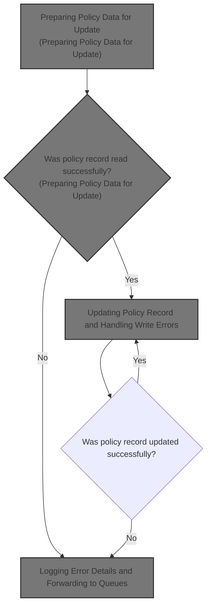
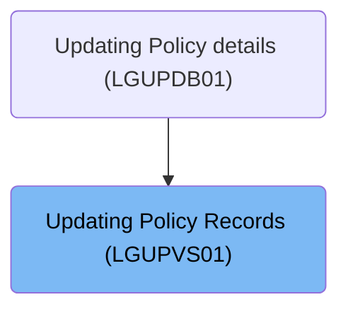
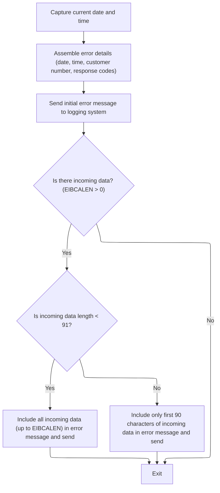
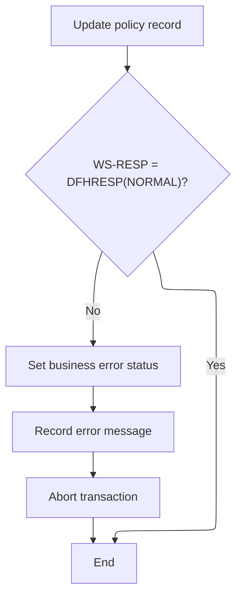

# Overview

This document explains the flow of updating policy records. Policy update requests are processed by selecting relevant fields according to the policy type, reading the current record, and updating it in the VSAM file. Errors encountered during the process are logged and forwarded to monitoring queues.



## Dependencies

### Programs

- <SwmToken path="base/src/lgupvs01.cbl" pos="11:6:6" line-data="       PROGRAM-ID. LGUPVS01.">`LGUPVS01`</SwmToken> (<SwmPath>[base/src/lgupvs01.cbl](base/src/lgupvs01.cbl)</SwmPath>)
- LGSTSQ (<SwmPath>[base/src/lgstsq.cbl](base/src/lgstsq.cbl)</SwmPath>)

### Copybook

- LGCMAREA (<SwmPath>[base/src/lgcmarea.cpy](base/src/lgcmarea.cpy)</SwmPath>)

# Where is this program used?

This program is used once, as represented in the following diagram:



## Detailed View of the Program's Functionality

# Preparing Policy Data for Update

The process begins by determining the length of the incoming communication area and extracting a specific character from the request identifier. This character is used to decide which type of policy data will be processed. The code then copies the policy number and customer number from the incoming data to the working area.

Next, a conditional block evaluates the extracted character to determine which set of policy fields to copy:

- If the character indicates a customer policy, customer-related fields such as postcode, status, and customer name are copied.
- If it indicates an endowment policy, fields related to profits, equities, managed fund, fund name, and life assured are copied.
- If it indicates a property policy, fields such as property type, number of bedrooms, value, postcode, and house name are copied.
- If it indicates a motor policy, fields such as make, model, value, and registration number are copied.
- If the character does not match any known type, the policy data area is cleared by filling it with spaces.

After setting up the working fields, the code attempts to read the corresponding policy record from a VSAM file using the prepared key. This step retrieves the current policy data for further processing.

If the file read operation fails, the code logs the error by preparing an error message, sets a specific return code to indicate the failure, and then aborts the transaction with a designated error code. This ensures that no further processing occurs and the error is recorded.

# Logging Error Details and Forwarding to Queues

When an error occurs, the system captures the current date and time using CICS services. This information is formatted and included in the error message structure, along with details such as customer number and response codes.

The error message is then sent to a logging system by linking to a dedicated program. This program determines whether it was invoked by another program or directly from a terminal. Depending on the invocation method, it sets up the message data accordingly. If the message starts with a specific prefix, the queue name is adjusted, and the prefix is removed from the message. The message length is also adjusted to account for these changes.

The error message is written to both a transient data queue (for system logging) and a temporary storage queue (for application-level logging). If the message was received from a terminal, a minimal response is sent back before returning control.

After the initial error message is logged, the system checks if there is additional incoming data. If so, it sends up to 90 characters of this data to the logging system for detailed error reporting. This ensures that all relevant information about the error is captured for troubleshooting.

# Updating Policy Record and Handling Write Errors

Once any read errors have been handled, the system attempts to update the policy record in the VSAM file with the new data prepared earlier. This is the main update operation.

If the update operation fails, the system logs the error by preparing another error message, sets a specific return code to indicate the write failure, and aborts the transaction with a different error code. This prevents any further updates and ensures that the error is recorded for later analysis.

If the update operation succeeds, the process completes without further action.

# Rule Definition

| Paragraph Name   | Rule ID | Category        | Description                                                                                                                                                                                                                                                                                                                                                                                          | Conditions                                                                                                                                                                                                                | Remarks                                                                                                                                                                                                                                                                                                                                                                          |
| ---------------- | ------- | --------------- | ---------------------------------------------------------------------------------------------------------------------------------------------------------------------------------------------------------------------------------------------------------------------------------------------------------------------------------------------------------------------------------------------------- | ------------------------------------------------------------------------------------------------------------------------------------------------------------------------------------------------------------------------- | -------------------------------------------------------------------------------------------------------------------------------------------------------------------------------------------------------------------------------------------------------------------------------------------------------------------------------------------------------------------------------- |
| MAINLINE SECTION | RL-001  | Computation     | Extract the 4th character of <SwmToken path="base/src/lgupvs01.cbl" pos="102:3:7" line-data="           Move CA-Request-ID(4:1) To WF-Request-ID">`CA-Request-ID`</SwmToken> and use it as <SwmToken path="base/src/lgupvs01.cbl" pos="102:16:20" line-data="           Move CA-Request-ID(4:1) To WF-Request-ID">`WF-Request-ID`</SwmToken> to determine the policy type for subsequent processing. | Always applies at the start of processing.                                                                                                                                                                                | <SwmToken path="base/src/lgupvs01.cbl" pos="102:3:7" line-data="           Move CA-Request-ID(4:1) To WF-Request-ID">`CA-Request-ID`</SwmToken> is an alphanumeric string. <SwmToken path="base/src/lgupvs01.cbl" pos="102:16:20" line-data="           Move CA-Request-ID(4:1) To WF-Request-ID">`WF-Request-ID`</SwmToken> is a single character used to indicate policy type. |
| MAINLINE SECTION | RL-002  | Data Assignment | Map fields from the commarea (CA-) to the working area (WF-) according to the policy type indicated by <SwmToken path="base/src/lgupvs01.cbl" pos="102:16:20" line-data="           Move CA-Request-ID(4:1) To WF-Request-ID">`WF-Request-ID`</SwmToken>.                                                                                                                                            | <SwmToken path="base/src/lgupvs01.cbl" pos="102:16:20" line-data="           Move CA-Request-ID(4:1) To WF-Request-ID">`WF-Request-ID`</SwmToken> must be set to one of the recognized policy types ('C', 'E', 'H', 'M'). | Field mappings:                                                                                                                                                                                                                                                                                                                                                                  |

- For 'C': postcode (8 chars), status (4 digits), customer (31 chars)
- For 'E': with-profits (1 char), equities (1 char), managed-fund (1 char), fund-name (10 chars), life-assured (30 chars)
- For 'H': property-type (15 chars), bedrooms (3 digits), value (8 digits), postcode (8 chars), house-name (9 chars)
- For 'M': make (15 chars), model (15 chars), value (6 digits), regnumber (7 chars)
- For other: all fields set to spaces. | | MAINLINE SECTION | RL-003 | Computation | Construct the policy record key using <SwmToken path="base/src/lgupvs01.cbl" pos="102:16:20" line-data="           Move CA-Request-ID(4:1) To WF-Request-ID">`WF-Request-ID`</SwmToken>, <SwmToken path="base/src/lgupvs01.cbl" pos="104:3:7" line-data="           Move CA-Customer-Num    To WF-Customer-Num">`CA-Customer-Num`</SwmToken>, and <SwmToken path="base/src/lgupvs01.cbl" pos="103:3:7" line-data="           Move CA-Policy-Num      To WF-Policy-Num">`CA-Policy-Num`</SwmToken>. | Always applies before file access. | Key format: 1 char (policy type) + 10 chars (customer number) + 10 chars (policy number), total 21 characters. | | MAINLINE SECTION | RL-004 | Conditional Logic | Read the policy record from the VSAM file using the constructed key and update it with the mapped <SwmToken path="base/src/lgupvs01.cbl" pos="134:7:11" line-data="               Move Spaces To WF-Policy-Data">`WF-Policy-Data`</SwmToken> fields. | File operations are performed after key construction and data mapping. | VSAM file name: 'KSDSPOLY'. Key length: 21. Data length: 64. Update operation uses the mapped <SwmToken path="base/src/lgupvs01.cbl" pos="156:3:7" line-data="                     From(WF-Policy-Info)">`WF-Policy-Info`</SwmToken> structure. | | <SwmToken path="base/src/lgupvs01.cbl" pos="150:3:7" line-data="             PERFORM WRITE-ERROR-MESSAGE">`WRITE-ERROR-MESSAGE`</SwmToken> | RL-005 | Conditional Logic | If the file read or update fails, capture the current date and time, assemble error details including customer number, policy number, and error code, and send an error message to the logging system and queues. | Triggered when file read or update returns a non-normal response. | Error message format includes date (8 chars), time (6 chars), program name (9 chars), policy number (10 chars), customer number (10 chars), error codes (5 digits each), and additional text. Error messages are sent to logging system and queues via LGSTSQ. | | <SwmToken path="base/src/lgupvs01.cbl" pos="150:3:7" line-data="             PERFORM WRITE-ERROR-MESSAGE">`WRITE-ERROR-MESSAGE`</SwmToken> | RL-006 | Conditional Logic | If there is incoming data (EIBCALEN > 0), include up to 90 characters of incoming data in the error message; if the data is shorter than 91 characters, include all of it, otherwise include only the first 90 characters. | EIBCALEN > 0 during error handling. | Incoming data is included in the error message as a string of up to 90 characters. | | MAINLINE SECTION, <SwmToken path="base/src/lgupvs01.cbl" pos="150:3:7" line-data="             PERFORM WRITE-ERROR-MESSAGE">`WRITE-ERROR-MESSAGE`</SwmToken> | RL-007 | Conditional Logic | Abort the transaction if a file read or update error occurs after logging the error. | Triggered after error message is logged due to file operation failure. | Transaction is aborted using CICS ABEND with specific abend codes (<SwmToken path="base/src/lgupvs01.cbl" pos="151:10:10" line-data="             EXEC CICS ABEND ABCODE(&#39;LGV3&#39;) NODUMP END-EXEC">`LGV3`</SwmToken> for read error, <SwmToken path="base/src/lgupvs01.cbl" pos="164:10:10" line-data="             EXEC CICS ABEND ABCODE(&#39;LGV4&#39;) NODUMP END-EXEC">`LGV4`</SwmToken> for update error). |

# User Stories

## User Story 1: Policy Type Extraction and Data Mapping

---

### Story Description:

As a system, I want to extract the policy type from the request ID, map the relevant policy data fields according to the policy type, and construct the policy record key so that I can accurately prepare data for subsequent file operations.

---

### Business Rule Mapping:

| Rule ID | Paragraph Name   | Rule Description                                                                                                                                                                                                                                                                                                                                                                                                                                                                                   |
| ------- | ---------------- | -------------------------------------------------------------------------------------------------------------------------------------------------------------------------------------------------------------------------------------------------------------------------------------------------------------------------------------------------------------------------------------------------------------------------------------------------------------------------------------------------- |
| RL-001  | MAINLINE SECTION | Extract the 4th character of <SwmToken path="base/src/lgupvs01.cbl" pos="102:3:7" line-data="           Move CA-Request-ID(4:1) To WF-Request-ID">`CA-Request-ID`</SwmToken> and use it as <SwmToken path="base/src/lgupvs01.cbl" pos="102:16:20" line-data="           Move CA-Request-ID(4:1) To WF-Request-ID">`WF-Request-ID`</SwmToken> to determine the policy type for subsequent processing.                                                                                               |
| RL-002  | MAINLINE SECTION | Map fields from the commarea (CA-) to the working area (WF-) according to the policy type indicated by <SwmToken path="base/src/lgupvs01.cbl" pos="102:16:20" line-data="           Move CA-Request-ID(4:1) To WF-Request-ID">`WF-Request-ID`</SwmToken>.                                                                                                                                                                                                                                          |
| RL-003  | MAINLINE SECTION | Construct the policy record key using <SwmToken path="base/src/lgupvs01.cbl" pos="102:16:20" line-data="           Move CA-Request-ID(4:1) To WF-Request-ID">`WF-Request-ID`</SwmToken>, <SwmToken path="base/src/lgupvs01.cbl" pos="104:3:7" line-data="           Move CA-Customer-Num    To WF-Customer-Num">`CA-Customer-Num`</SwmToken>, and <SwmToken path="base/src/lgupvs01.cbl" pos="103:3:7" line-data="           Move CA-Policy-Num      To WF-Policy-Num">`CA-Policy-Num`</SwmToken>. |

---

### Relevant Functionality:

- **MAINLINE SECTION**
  1. **RL-001:**
     - Extract the 4th character from the incoming request ID.
     - Store this character as the policy type indicator for subsequent logic.
  2. **RL-002:**
     - Evaluate the policy type indicator.
     - For each recognized type, move the corresponding fields from CA- to WF-.
     - If the type is not recognized, set all <SwmToken path="base/src/lgupvs01.cbl" pos="134:7:11" line-data="               Move Spaces To WF-Policy-Data">`WF-Policy-Data`</SwmToken> fields to spaces.
  3. **RL-003:**
     - Concatenate the policy type, customer number, and policy number to form the key for VSAM file access.

## User Story 2: Policy Record File Operations and Error Handling

---

### Story Description:

As a system, I want to read and update the policy record in the VSAM file, and if an error occurs, capture and log error details, include relevant incoming data in error messages, and abort the transaction so that errors are properly reported and handled to maintain data integrity.

---

### Business Rule Mapping:

| Rule ID | Paragraph Name                                                                                                                                               | Rule Description                                                                                                                                                                                                                                     |
| ------- | ------------------------------------------------------------------------------------------------------------------------------------------------------------ | ---------------------------------------------------------------------------------------------------------------------------------------------------------------------------------------------------------------------------------------------------- |
| RL-005  | <SwmToken path="base/src/lgupvs01.cbl" pos="150:3:7" line-data="             PERFORM WRITE-ERROR-MESSAGE">`WRITE-ERROR-MESSAGE`</SwmToken>                   | If the file read or update fails, capture the current date and time, assemble error details including customer number, policy number, and error code, and send an error message to the logging system and queues.                                    |
| RL-006  | <SwmToken path="base/src/lgupvs01.cbl" pos="150:3:7" line-data="             PERFORM WRITE-ERROR-MESSAGE">`WRITE-ERROR-MESSAGE`</SwmToken>                   | If there is incoming data (EIBCALEN > 0), include up to 90 characters of incoming data in the error message; if the data is shorter than 91 characters, include all of it, otherwise include only the first 90 characters.                           |
| RL-004  | MAINLINE SECTION                                                                                                                                             | Read the policy record from the VSAM file using the constructed key and update it with the mapped <SwmToken path="base/src/lgupvs01.cbl" pos="134:7:11" line-data="               Move Spaces To WF-Policy-Data">`WF-Policy-Data`</SwmToken> fields. |
| RL-007  | MAINLINE SECTION, <SwmToken path="base/src/lgupvs01.cbl" pos="150:3:7" line-data="             PERFORM WRITE-ERROR-MESSAGE">`WRITE-ERROR-MESSAGE`</SwmToken> | Abort the transaction if a file read or update error occurs after logging the error.                                                                                                                                                                 |

---

### Relevant Functionality:

- <SwmToken path="base/src/lgupvs01.cbl" pos="150:3:7" line-data="             PERFORM WRITE-ERROR-MESSAGE">`WRITE-ERROR-MESSAGE`</SwmToken>
  1. **RL-005:**
     - On file operation failure, get current date and time.
     - Assemble error message with all required details.
     - Send error message to logging system and queues using LGSTSQ.
  2. **RL-006:**
     - Check if incoming data length is greater than zero.
     - If less than 91, include all data; else, include only the first 90 characters.
     - Send this data as part of the error message to LGSTSQ.
- **MAINLINE SECTION**
  1. **RL-004:**
     - Read the record from the VSAM file using the constructed key.
     - If read is successful, update the record with the mapped data.
     - If update fails, proceed to error handling.
  2. **RL-007:**
     - After logging the error, invoke CICS ABEND with the appropriate abend code.
     - Return from the program to terminate the transaction.

# Workflow

# Preparing Policy Data for Update

This section is responsible for preparing the correct set of policy data fields for update, based on the type of policy indicated by the request ID. It ensures that only the relevant fields are copied and sets up the working area for subsequent file operations, handling errors appropriately.

| Category        | Rule Name               | Description                                                                                                                                                            |
| --------------- | ----------------------- | ---------------------------------------------------------------------------------------------------------------------------------------------------------------------- |
| Data validation | Policy record retrieval | The policy record is read from the VSAM file using the prepared key, and the operation is only considered successful if the response code indicates normal completion. |
| Business logic  | Policy type selection   | The fourth character of the request ID determines which set of policy fields (customer, endowment, property, or motor) are copied into the working area for update.    |

<SwmSnippet path="/base/src/lgupvs01.cbl" line="97">

---

In MAINLINE, we start by moving the commarea length and extracting the 4th character of <SwmToken path="base/src/lgupvs01.cbl" pos="102:3:7" line-data="           Move CA-Request-ID(4:1) To WF-Request-ID">`CA-Request-ID`</SwmToken> to <SwmToken path="base/src/lgupvs01.cbl" pos="102:16:20" line-data="           Move CA-Request-ID(4:1) To WF-Request-ID">`WF-Request-ID`</SwmToken>. This character is used to decide which policy data fields to copy next. The code assumes <SwmToken path="base/src/lgupvs01.cbl" pos="102:3:7" line-data="           Move CA-Request-ID(4:1) To WF-Request-ID">`CA-Request-ID`</SwmToken> is at least 4 characters, which isn't obvious unless you look closely.

```cobol
       MAINLINE SECTION.
      *
      *---------------------------------------------------------------*
           Move EIBCALEN To WS-Commarea-Len.
      *---------------------------------------------------------------*
           Move CA-Request-ID(4:1) To WF-Request-ID
           Move CA-Policy-Num      To WF-Policy-Num
           Move CA-Customer-Num    To WF-Customer-Num
```

---

</SwmSnippet>

<SwmSnippet path="/base/src/lgupvs01.cbl" line="106">

---

Here the code starts the EVALUATE block, using <SwmToken path="base/src/lgupvs01.cbl" pos="106:3:7" line-data="           Evaluate WF-Request-ID">`WF-Request-ID`</SwmToken> to pick which set of policy fields to move. For 'C', it moves customer-related fields. This sets up the working fields for later file operations.

```cobol
           Evaluate WF-Request-ID

             When 'C'
               Move CA-B-Postcode  To WF-B-Postcode
               Move CA-B-Status    To WF-B-Status
               Move CA-B-Customer  To WF-B-Customer
```

---

</SwmSnippet>

<SwmSnippet path="/base/src/lgupvs01.cbl" line="113">

---

Next up, if <SwmToken path="base/src/lgupvs01.cbl" pos="102:16:20" line-data="           Move CA-Request-ID(4:1) To WF-Request-ID">`WF-Request-ID`</SwmToken> is 'E', the code copies endowment policy fields into the working area. This continues the conditional setup for different policy types.

```cobol
             When 'E'
               Move CA-E-WITH-PROFITS To  WF-E-WITH-PROFITS
               Move CA-E-EQUITIES     To  WF-E-EQUITIES
               Move CA-E-MANAGED-FUND To  WF-E-MANAGED-FUND
               Move CA-E-FUND-NAME    To  WF-E-FUND-NAME
               Move CA-E-LIFE-ASSURED To  WF-E-LIFE-ASSURED
```

---

</SwmSnippet>

<SwmSnippet path="/base/src/lgupvs01.cbl" line="120">

---

For 'H', the code moves property policy fields into the working area. This keeps the conditional logic going for each policy type.

```cobol
             When 'H'
               Move CA-H-PROPERTY-TYPE To  WF-H-PROPERTY-TYPE
               Move CA-H-BEDROOMS      To  WF-H-BEDROOMS
               Move CA-H-VALUE         To  WF-H-VALUE
               Move CA-H-POSTCODE      To  WF-H-POSTCODE
               Move CA-H-HOUSE-NAME    To  WF-H-HOUSE-NAME
```

---

</SwmSnippet>

<SwmSnippet path="/base/src/lgupvs01.cbl" line="127">

---

For 'M', the code moves motor policy fields into the working area. This is the last specific branch before the default case.

```cobol
             When 'M'
               Move CA-M-MAKE          To  WF-M-MAKE
               Move CA-M-MODEL         To  WF-M-MODEL
               Move CA-M-VALUE         To  WF-M-VALUE
               Move CA-M-REGNUMBER     To  WF-M-REGNUMBER
```

---

</SwmSnippet>

<SwmSnippet path="/base/src/lgupvs01.cbl" line="133">

---

If <SwmToken path="base/src/lgupvs01.cbl" pos="102:16:20" line-data="           Move CA-Request-ID(4:1) To WF-Request-ID">`WF-Request-ID`</SwmToken> isn't recognized, the code clears the policy data by moving spaces to <SwmToken path="base/src/lgupvs01.cbl" pos="134:7:11" line-data="               Move Spaces To WF-Policy-Data">`WF-Policy-Data`</SwmToken>. This is the default branch of the conditional setup.

```cobol
             When Other
               Move Spaces To WF-Policy-Data
           End-Evaluate
```

---

</SwmSnippet>

<SwmSnippet path="/base/src/lgupvs01.cbl" line="137">

---

After setting up the working fields, the code reads the policy record from the VSAM file using the prepared key. This pulls in the current data for update.

```cobol
           Move CA-Policy-Num      To WF-Policy-Num
      *---------------------------------------------------------------*
           Exec CICS Read File('KSDSPOLY')
                     Into(WS-FileIn)
                     Length(WS-Commarea-Len)
                     Ridfld(WF-Policy-Key)
                     KeyLength(21)
                     RESP(WS-RESP)
                     Update
           End-Exec.
```

---

</SwmSnippet>

<SwmSnippet path="/base/src/lgupvs01.cbl" line="147">

---

If the file read fails, we log the error by calling <SwmToken path="base/src/lgupvs01.cbl" pos="150:3:7" line-data="             PERFORM WRITE-ERROR-MESSAGE">`WRITE-ERROR-MESSAGE`</SwmToken>, set a specific return code, and abend with <SwmToken path="base/src/lgupvs01.cbl" pos="151:10:10" line-data="             EXEC CICS ABEND ABCODE(&#39;LGV3&#39;) NODUMP END-EXEC">`LGV3`</SwmToken>. This stops the update and records what went wrong.

```cobol
           If WS-RESP Not = DFHRESP(NORMAL)
             Move EIBRESP2 To WS-RESP2
             MOVE '81' TO CA-RETURN-CODE
             PERFORM WRITE-ERROR-MESSAGE
             EXEC CICS ABEND ABCODE('LGV3') NODUMP END-EXEC
             EXEC CICS RETURN END-EXEC
           End-If.
```

---

</SwmSnippet>

## Logging Error Details and Forwarding to Queues



This section ensures that all relevant error details are logged and forwarded to appropriate queues for monitoring and troubleshooting. It also handles the inclusion of incoming data for more comprehensive error reporting.

| Category        | Rule Name                         | Description                                                                                                                                                                                                                            |
| --------------- | --------------------------------- | -------------------------------------------------------------------------------------------------------------------------------------------------------------------------------------------------------------------------------------- |
| Data validation | Error message formatting          | Error messages must be formatted according to the defined structure, including all required fields and fixed-length segments, to ensure consistency and compatibility with downstream systems.                                         |
| Business logic  | Mandatory error details           | The error message must always include the current date and time, customer number, and response codes, regardless of the presence of incoming data.                                                                                     |
| Business logic  | Incoming data inclusion limit     | If incoming data is present, up to 90 characters of the data must be included in the error message for logging. If the data length is less than 91, all incoming data is included; otherwise, only the first 90 characters are logged. |
| Business logic  | Dual queue forwarding             | Error messages must be sent to both the TDQ and TSQ queues for redundancy and to ensure availability for different downstream processes.                                                                                               |
| Business logic  | Terminal response acknowledgement | If the error message is received from a terminal, a response must be sent back to the terminal to acknowledge receipt and processing of the error.                                                                                     |
| Business logic  | No incoming data handling         | If no incoming data is present, only the basic error details are logged and forwarded, and no additional data is included in the error message.                                                                                        |

<SwmSnippet path="/base/src/lgupvs01.cbl" line="174">

---

In <SwmToken path="base/src/lgupvs01.cbl" pos="174:1:5" line-data="       WRITE-ERROR-MESSAGE.">`WRITE-ERROR-MESSAGE`</SwmToken>, we grab the current time, format it, and set up the error message fields. This info is used for logging when we call LGSTSQ to queue the error details.

```cobol
       WRITE-ERROR-MESSAGE.
           EXEC CICS ASKTIME ABSTIME(WS-ABSTIME)
           END-EXEC
           EXEC CICS FORMATTIME ABSTIME(WS-ABSTIME)
                     MMDDYYYY(WS-DATE)
                     TIME(WS-TIME)
           END-EXEC
```

---

</SwmSnippet>

<SwmSnippet path="/base/src/lgupvs01.cbl" line="182">

---

This part sends the error message to LGSTSQ for logging.

```cobol
           MOVE WS-DATE TO EM-DATE
           MOVE WS-TIME TO EM-TIME
           Move CA-Customer-Num To EM-Cusnum
           Move WS-RESP         To EM-RespRC
           Move WS-RESP2        To EM-Resp2RC
           EXEC CICS LINK PROGRAM('LGSTSQ')
                     COMMAREA(ERROR-MSG)
                     LENGTH(LENGTH OF ERROR-MSG)
           END-EXEC.
```

---

</SwmSnippet>

<SwmSnippet path="/base/src/lgstsq.cbl" line="55">

---

LGSTSQ checks if it's invoked by another program or from a terminal, then sets up the message data accordingly. It strips 'Q=' prefixes if present, adjusts message length, and writes the message to both TDQ and TSQ queues. If the message was received, it sends a response before returning.

```cobol
       MAINLINE SECTION.

           MOVE SPACES TO WRITE-MSG.
           MOVE SPACES TO WS-RECV.

           EXEC CICS ASSIGN SYSID(WRITE-MSG-SYSID)
                RESP(WS-RESP)
           END-EXEC.

           EXEC CICS ASSIGN INVOKINGPROG(WS-INVOKEPROG)
                RESP(WS-RESP)
           END-EXEC.
           
           IF WS-INVOKEPROG NOT = SPACES
              MOVE 'C' To WS-FLAG
              MOVE COMMA-DATA  TO WRITE-MSG-MSG
              MOVE EIBCALEN    TO WS-RECV-LEN
           ELSE
              EXEC CICS RECEIVE INTO(WS-RECV)
                  LENGTH(WS-RECV-LEN)
                  RESP(WS-RESP)
              END-EXEC
              MOVE 'R' To WS-FLAG
              MOVE WS-RECV-DATA  TO WRITE-MSG-MSG
              SUBTRACT 5 FROM WS-RECV-LEN
           END-IF.

           MOVE 'GENAERRS' TO STSQ-NAME.
           IF WRITE-MSG-MSG(1:2) = 'Q=' THEN
              MOVE WRITE-MSG-MSG(3:4) TO STSQ-EXT
              MOVE WRITE-MSG-REST TO TEMPO
              MOVE TEMPO          TO WRITE-MSG-MSG
              SUBTRACT 7 FROM WS-RECV-LEN
           END-IF.

           ADD 5 TO WS-RECV-LEN.

      * Write output message to TDQ CSMT
      *
           EXEC CICS WRITEQ TD QUEUE(STDQ-NAME)
                     FROM(WRITE-MSG)
                     RESP(WS-RESP)
                     LENGTH(WS-RECV-LEN)

           END-EXEC.

      * Write output message to Genapp TSQ
      * If no space is available then the task will not wait for
      *  storage to become available but will ignore the request...
      *
           EXEC CICS WRITEQ TS QUEUE(STSQ-NAME)
                     FROM(WRITE-MSG)
                     RESP(WS-RESP)
                     NOSUSPEND
                     LENGTH(WS-RECV-LEN)

           END-EXEC.

           If WS-FLAG = 'R' Then
             EXEC CICS SEND TEXT FROM(FILLER-X)
              WAIT
              ERASE
              LENGTH(1)
              FREEKB
             END-EXEC.

           EXEC CICS RETURN
           END-EXEC.
```

---

</SwmSnippet>

<SwmSnippet path="/base/src/lgupvs01.cbl" line="191">

---

After returning from LGSTSQ, <SwmToken path="base/src/lgupvs01.cbl" pos="150:3:7" line-data="             PERFORM WRITE-ERROR-MESSAGE">`WRITE-ERROR-MESSAGE`</SwmToken> checks if there's extra commarea data and, if so, sends up to 90 characters of it to LGSTSQ for detailed logging. This wraps up the error reporting before exiting.

```cobol
           IF EIBCALEN > 0 THEN
             IF EIBCALEN < 91 THEN
               MOVE DFHCOMMAREA(1:EIBCALEN) TO CA-DATA
               EXEC CICS LINK PROGRAM('LGSTSQ')
                         COMMAREA(CA-ERROR-MSG)
                         LENGTH(Length Of CA-ERROR-MSG)
               END-EXEC
             ELSE
               MOVE DFHCOMMAREA(1:90) TO CA-DATA
               EXEC CICS LINK PROGRAM('LGSTSQ')
                         COMMAREA(CA-ERROR-MSG)
                         LENGTH(Length Of CA-ERROR-MSG)
               END-EXEC
             END-IF
           END-IF.
           EXIT.
```

---

</SwmSnippet>

## Updating Policy Record and Handling Write Errors



<SwmSnippet path="/base/src/lgupvs01.cbl" line="155">

---

After logging any read errors, MAINLINE tries to rewrite the policy record with the updated data. This is the main update step.

```cobol
           Exec CICS ReWrite File('KSDSPOLY')
                     From(WF-Policy-Info)
                     Length(WS-Commarea-LenF)
                     RESP(WS-RESP)
           End-Exec.
```

---

</SwmSnippet>

<SwmSnippet path="/base/src/lgupvs01.cbl" line="160">

---

If the rewrite fails, MAINLINE logs the error, sets a specific return code, abends with <SwmToken path="base/src/lgupvs01.cbl" pos="164:10:10" line-data="             EXEC CICS ABEND ABCODE(&#39;LGV4&#39;) NODUMP END-EXEC">`LGV4`</SwmToken>, and returns to CICS. This prevents any further updates.

```cobol
           If WS-RESP Not = DFHRESP(NORMAL)
             Move EIBRESP2 To WS-RESP2
             MOVE '82' TO CA-RETURN-CODE
             PERFORM WRITE-ERROR-MESSAGE
             EXEC CICS ABEND ABCODE('LGV4') NODUMP END-EXEC
             EXEC CICS RETURN END-EXEC
           End-If.
```

---

</SwmSnippet>

&nbsp;

*This is an auto-generated document by Swimm 🌊 and has not yet been verified by a human*

<SwmMeta version="3.0.0" repo-id="Z2l0aHViJTNBJTNBU3dpbW1pby1nZW5hcHAtbW90b3IlM0ElM0FHaXJpLVN3aW1t" repo-name="Swimmio-genapp-motor"><sup>Powered by [Swimm](https://app.swimm.io/)</sup></SwmMeta>
