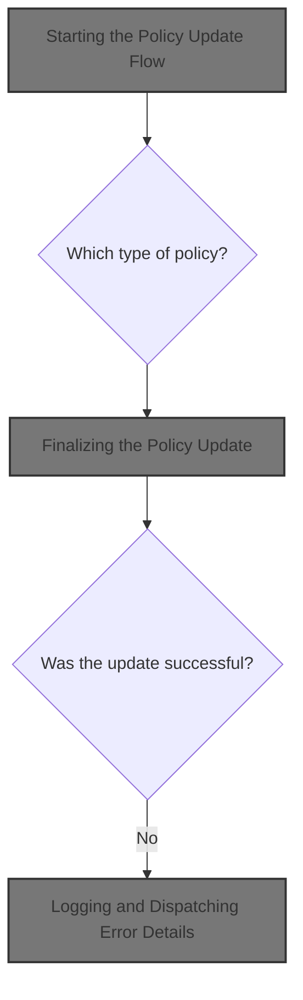
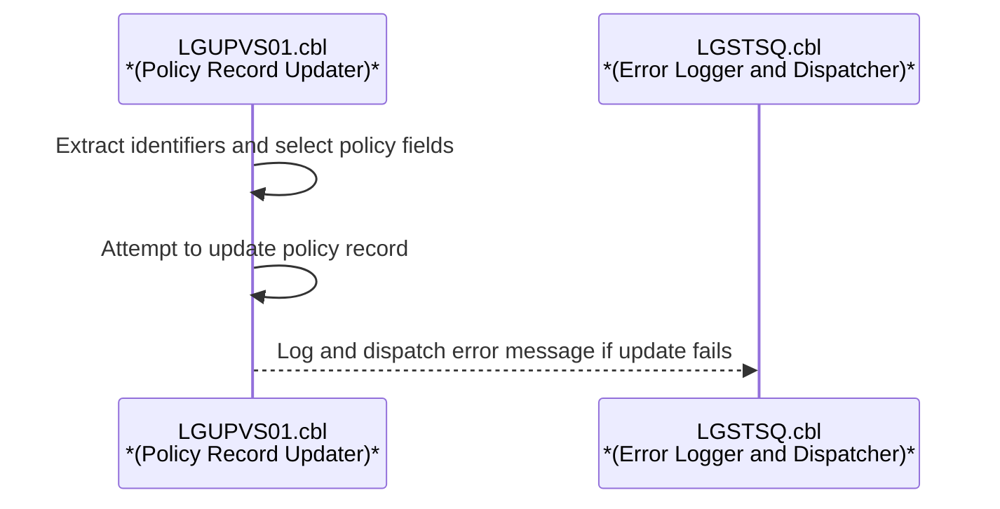
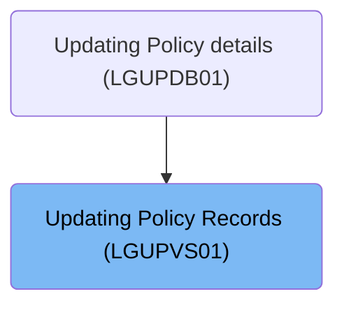
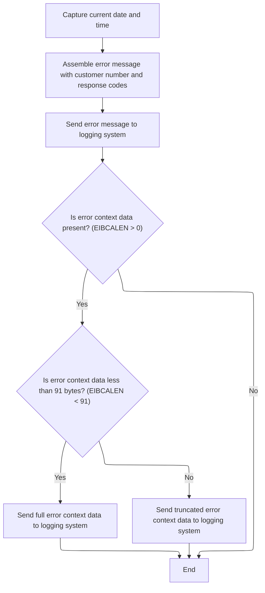

# Overview

This document explains the flow of updating policy records. The process extracts key identifiers and request type from the input, selects relevant policy fields, updates the VSAM record, and logs errors for traceability.



# Technical Overview



## Dependencies

### Program

- LGSTSQ (<SwmPath>[base/src/lgstsq.cbl](base/src/lgstsq.cbl)</SwmPath>)

### Copybook

- LGCMAREA (<SwmPath>[base/src/lgcmarea.cpy](base/src/lgcmarea.cpy)</SwmPath>)

# Where is this program used?

This program is used once, as represented in the following diagram:



# Workflow

# Starting the Policy Update Flow

This section initiates the policy update flow by extracting key identifiers and preparing policy-specific data for downstream processing. It ensures that only relevant fields are populated based on the request type and manages error handling for failed policy record reads.

| Category        | Rule Name                        | Description                                                                                                                                                    |
| --------------- | -------------------------------- | -------------------------------------------------------------------------------------------------------------------------------------------------------------- |
| Data validation | Policy record retrieval          | The policy record must be read from the VSAM file using the policy number as the key before any update can proceed.                                            |
| Business logic  | Request type branching           | The request type must be extracted from the input and used to determine which policy-specific fields are populated in the working storage.                     |
| Business logic  | Customer policy field selection  | If the request type is 'C', only customer policy fields (postcode, status, customer) are populated in the working storage.                                     |
| Business logic  | Endowment policy field selection | If the request type is 'E', only endowment policy fields (with-profits, equities, managed fund, fund name, life assured) are populated in the working storage. |
| Business logic  | House policy field selection     | If the request type is 'H', only house policy fields (property type, bedrooms, value, postcode, house name) are populated in the working storage.              |
| Business logic  | Motor policy field selection     | If the request type is 'M', only motor policy fields (make, model, value, registration number) are populated in the working storage.                           |

<SwmSnippet path="/base/src/lgupvs01.cbl" line="97">

---

In <SwmToken path="base/src/lgupvs01.cbl" pos="97:1:1" line-data="       MAINLINE SECTION.">`MAINLINE`</SwmToken>, this is where the flow kicks off: it sets up the working storage length for the commarea and extracts the request type, policy number, and customer number from the input. This sets up the context for all the downstream logic that follows based on the request type.

```cobol
       MAINLINE SECTION.
      *
      *---------------------------------------------------------------*
           Move EIBCALEN To WS-Commarea-Len.
      *---------------------------------------------------------------*
           Move CA-Request-ID(4:1) To WF-Request-ID
           Move CA-Policy-Num      To WF-Policy-Num
           Move CA-Customer-Num    To WF-Customer-Num
```

---

</SwmSnippet>

<SwmSnippet path="/base/src/lgupvs01.cbl" line="106">

---

This is where we pick which policy-specific fields to prep, depending on the request type.

```cobol
           Evaluate WF-Request-ID

             When 'C'
               Move CA-B-Postcode  To WF-B-Postcode
               Move CA-B-Status    To WF-B-Status
               Move CA-B-Customer  To WF-B-Customer
```

---

</SwmSnippet>

<SwmSnippet path="/base/src/lgupvs01.cbl" line="113">

---

This is where we handle endowment policy data if that's the request type.

```cobol
             When 'E'
               Move CA-E-WITH-PROFITS To  WF-E-WITH-PROFITS
               Move CA-E-EQUITIES     To  WF-E-EQUITIES
               Move CA-E-MANAGED-FUND To  WF-E-MANAGED-FUND
               Move CA-E-FUND-NAME    To  WF-E-FUND-NAME
               Move CA-E-LIFE-ASSURED To  WF-E-LIFE-ASSURED
```

---

</SwmSnippet>

<SwmSnippet path="/base/src/lgupvs01.cbl" line="120">

---

If the request is for a house policy ('H'), we move the house-specific fields into working storage. This keeps the data setup focused on the policy type being updated.

```cobol
             When 'H'
               Move CA-H-PROPERTY-TYPE To  WF-H-PROPERTY-TYPE
               Move CA-H-BEDROOMS      To  WF-H-BEDROOMS
               Move CA-H-VALUE         To  WF-H-VALUE
               Move CA-H-POSTCODE      To  WF-H-POSTCODE
               Move CA-H-HOUSE-NAME    To  WF-H-HOUSE-NAME
```

---

</SwmSnippet>

<SwmSnippet path="/base/src/lgupvs01.cbl" line="127">

---

If the request is for a motor policy ('M'), we move the motor-specific fields into working storage. This keeps the data setup targeted for the motor policy update.

```cobol
             When 'M'
               Move CA-M-MAKE          To  WF-M-MAKE
               Move CA-M-MODEL         To  WF-M-MODEL
               Move CA-M-VALUE         To  WF-M-VALUE
               Move CA-M-REGNUMBER     To  WF-M-REGNUMBER
```

---

</SwmSnippet>

<SwmSnippet path="/base/src/lgupvs01.cbl" line="133">

---

If the request type doesn't match any known branch, we just clear out the policy data. This acts as a fallback for unsupported or invalid request types.

```cobol
             When Other
               Move Spaces To WF-Policy-Data
           End-Evaluate
```

---

</SwmSnippet>

<SwmSnippet path="/base/src/lgupvs01.cbl" line="137">

---

After setting up the working storage, we read the current policy record from the VSAM file using the key fields. This gives us the data we need to update.

```cobol
           Move CA-Policy-Num      To WF-Policy-Num
      *---------------------------------------------------------------*
           Exec CICS Read File('KSDSPOLY')
                     Into(WS-FileIn)
                     Length(WS-Commarea-Len)
                     Ridfld(WF-Policy-Key)
                     KeyLength(21)
                     RESP(WS-RESP)
                     Update
           End-Exec.
```

---

</SwmSnippet>

<SwmSnippet path="/base/src/lgupvs01.cbl" line="147">

---

If the read fails, we log the error details and send an error message to the system queue by calling <SwmToken path="base/src/lgupvs01.cbl" pos="150:3:7" line-data="             PERFORM WRITE-ERROR-MESSAGE">`WRITE-ERROR-MESSAGE`</SwmToken>, then abend and return. This makes sure the failure is recorded and traceable.

```cobol
           If WS-RESP Not = DFHRESP(NORMAL)
             Move EIBRESP2 To WS-RESP2
             MOVE '81' TO CA-RETURN-CODE
             PERFORM WRITE-ERROR-MESSAGE
             EXEC CICS ABEND ABCODE('LGV3') NODUMP END-EXEC
             EXEC CICS RETURN END-EXEC
           End-If.
```

---

</SwmSnippet>

## Logging and Dispatching Error Details



This section ensures that all relevant error details are captured and logged in a consistent format, supporting traceability and error analysis for customer-related transactions.

| Category        | Rule Name                         | Description                                                                                                                                                                                |
| --------------- | --------------------------------- | ------------------------------------------------------------------------------------------------------------------------------------------------------------------------------------------ |
| Data validation | Error Context Data Limit          | If error context data is present (EIBCALEN > 0), up to 90 bytes of this data must be included in the error message. If more than 90 bytes are present, only the first 90 bytes are logged. |
| Business logic  | Timestamp Inclusion               | Every error message must include the current system date and time to ensure traceability of when the error occurred.                                                                       |
| Business logic  | Customer and Response Association | Error messages must include the customer number and response codes to associate the error with a specific customer and transaction outcome.                                                |
| Business logic  | Dual Queue Logging                | Error messages must be dispatched to both a temporary queue and a transient queue to ensure redundancy and support different error handling workflows.                                     |
| Business logic  | Received Message Acknowledgement  | If the error message is received rather than invoked, a minimal response must be sent to acknowledge receipt and the process must return immediately.                                      |

<SwmSnippet path="/base/src/lgupvs01.cbl" line="174">

---

In <SwmToken path="base/src/lgupvs01.cbl" pos="174:1:5" line-data="       WRITE-ERROR-MESSAGE.">`WRITE-ERROR-MESSAGE`</SwmToken>, we grab the current system time and format it for the error message. This timestamp gets included in the error log for traceability.

```cobol
       WRITE-ERROR-MESSAGE.
           EXEC CICS ASKTIME ABSTIME(WS-ABSTIME)
           END-EXEC
           EXEC CICS FORMATTIME ABSTIME(WS-ABSTIME)
                     MMDDYYYY(WS-DATE)
                     TIME(WS-TIME)
           END-EXEC
```

---

</SwmSnippet>

<SwmSnippet path="/base/src/lgupvs01.cbl" line="182">

---

Here we fill out the error message structure with the timestamp, customer number, and response codes, then call LGSTSQ to log it. This pushes the error details into the system's message queues for tracking.

```cobol
           MOVE WS-DATE TO EM-DATE
           MOVE WS-TIME TO EM-TIME
           Move CA-Customer-Num To EM-Cusnum
           Move WS-RESP         To EM-RespRC
           Move WS-RESP2        To EM-Resp2RC
           EXEC CICS LINK PROGRAM('LGSTSQ')
                     COMMAREA(ERROR-MSG)
                     LENGTH(LENGTH OF ERROR-MSG)
           END-EXEC.
```

---

</SwmSnippet>

<SwmSnippet path="/base/src/lgstsq.cbl" line="55">

---

In <SwmToken path="base/src/lgupvs01.cbl" pos="187:10:10" line-data="           EXEC CICS LINK PROGRAM(&#39;LGSTSQ&#39;)">`LGSTSQ`</SwmToken>, we figure out where the message is coming from (invoked or received), handle special 'Q=' messages, and write the message to both a temporary and a transient queue. If the message was received, we send a minimal response and return. This covers both logging and message flow control.

```cobol
       MAINLINE SECTION.

           MOVE SPACES TO WRITE-MSG.
           MOVE SPACES TO WS-RECV.

           EXEC CICS ASSIGN SYSID(WRITE-MSG-SYSID)
                RESP(WS-RESP)
           END-EXEC.

           EXEC CICS ASSIGN INVOKINGPROG(WS-INVOKEPROG)
                RESP(WS-RESP)
           END-EXEC.
           
           IF WS-INVOKEPROG NOT = SPACES
              MOVE 'C' To WS-FLAG
              MOVE COMMA-DATA  TO WRITE-MSG-MSG
              MOVE EIBCALEN    TO WS-RECV-LEN
           ELSE
              EXEC CICS RECEIVE INTO(WS-RECV)
                  LENGTH(WS-RECV-LEN)
                  RESP(WS-RESP)
              END-EXEC
              MOVE 'R' To WS-FLAG
              MOVE WS-RECV-DATA  TO WRITE-MSG-MSG
              SUBTRACT 5 FROM WS-RECV-LEN
           END-IF.

           MOVE 'GENAERRS' TO STSQ-NAME.
           IF WRITE-MSG-MSG(1:2) = 'Q=' THEN
              MOVE WRITE-MSG-MSG(3:4) TO STSQ-EXT
              MOVE WRITE-MSG-REST TO TEMPO
              MOVE TEMPO          TO WRITE-MSG-MSG
              SUBTRACT 7 FROM WS-RECV-LEN
           END-IF.

           ADD 5 TO WS-RECV-LEN.

      * Write output message to TDQ CSMT
      *
           EXEC CICS WRITEQ TD QUEUE(STDQ-NAME)
                     FROM(WRITE-MSG)
                     RESP(WS-RESP)
                     LENGTH(WS-RECV-LEN)

           END-EXEC.

      * Write output message to Genapp TSQ
      * If no space is available then the task will not wait for
      *  storage to become available but will ignore the request...
      *
           EXEC CICS WRITEQ TS QUEUE(STSQ-NAME)
                     FROM(WRITE-MSG)
                     RESP(WS-RESP)
                     NOSUSPEND
                     LENGTH(WS-RECV-LEN)

           END-EXEC.

           If WS-FLAG = 'R' Then
             EXEC CICS SEND TEXT FROM(FILLER-X)
              WAIT
              ERASE
              LENGTH(1)
              FREEKB
             END-EXEC.

           EXEC CICS RETURN
           END-EXEC.
```

---

</SwmSnippet>

<SwmSnippet path="/base/src/lgupvs01.cbl" line="191">

---

After returning from LGSTSQ, <SwmToken path="base/src/lgupvs01.cbl" pos="150:3:7" line-data="             PERFORM WRITE-ERROR-MESSAGE">`WRITE-ERROR-MESSAGE`</SwmToken> checks if there's extra data in the commarea. If so, it copies up to 90 characters into the error message and calls LGSTSQ again to log this chunk. This keeps error messages within the expected size and avoids overflows.

```cobol
           IF EIBCALEN > 0 THEN
             IF EIBCALEN < 91 THEN
               MOVE DFHCOMMAREA(1:EIBCALEN) TO CA-DATA
               EXEC CICS LINK PROGRAM('LGSTSQ')
                         COMMAREA(CA-ERROR-MSG)
                         LENGTH(Length Of CA-ERROR-MSG)
               END-EXEC
             ELSE
               MOVE DFHCOMMAREA(1:90) TO CA-DATA
               EXEC CICS LINK PROGRAM('LGSTSQ')
                         COMMAREA(CA-ERROR-MSG)
                         LENGTH(Length Of CA-ERROR-MSG)
               END-EXEC
             END-IF
           END-IF.
           EXIT.
```

---

</SwmSnippet>

## Finalizing the Policy Update

<SwmSnippet path="/base/src/lgupvs01.cbl" line="155">

---

Back in MAINLINE after error handling, we go ahead and rewrite the policy record with the updated info. This is the main update step if no errors occurred earlier.

```cobol
           Exec CICS ReWrite File('KSDSPOLY')
                     From(WF-Policy-Info)
                     Length(WS-Commarea-LenF)
                     RESP(WS-RESP)
           End-Exec.
```

---

</SwmSnippet>

<SwmSnippet path="/base/src/lgupvs01.cbl" line="160">

---

If the update fails, we log and bail out.

```cobol
           If WS-RESP Not = DFHRESP(NORMAL)
             Move EIBRESP2 To WS-RESP2
             MOVE '82' TO CA-RETURN-CODE
             PERFORM WRITE-ERROR-MESSAGE
             EXEC CICS ABEND ABCODE('LGV4') NODUMP END-EXEC
             EXEC CICS RETURN END-EXEC
           End-If.
```

---

</SwmSnippet>

&nbsp;

*This is an auto-generated document by Swimm 🌊 and has not yet been verified by a human*

<SwmMeta version="3.0.0" repo-id="Z2l0aHViJTNBJTNBU3dpbW1pby1nZW5hcHAtbW90b3IlM0ElM0FHaXJpLVN3aW1t" repo-name="Swimmio-genapp-motor"><sup>Powered by [Swimm](https://app.swimm.io/)</sup></SwmMeta>
