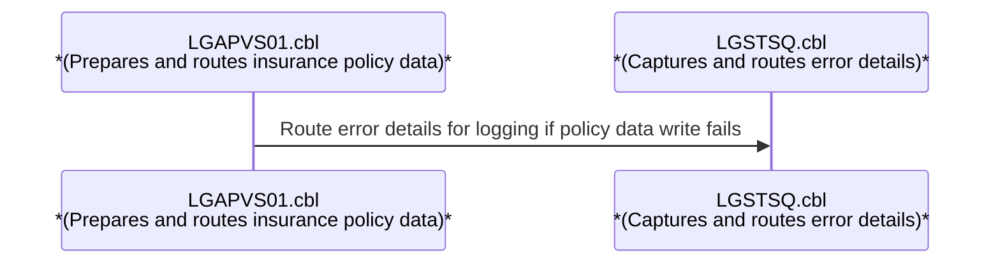
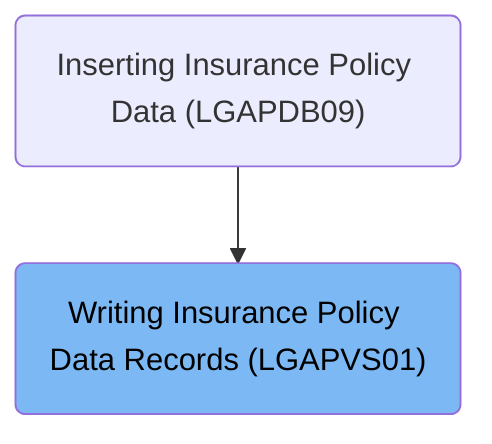
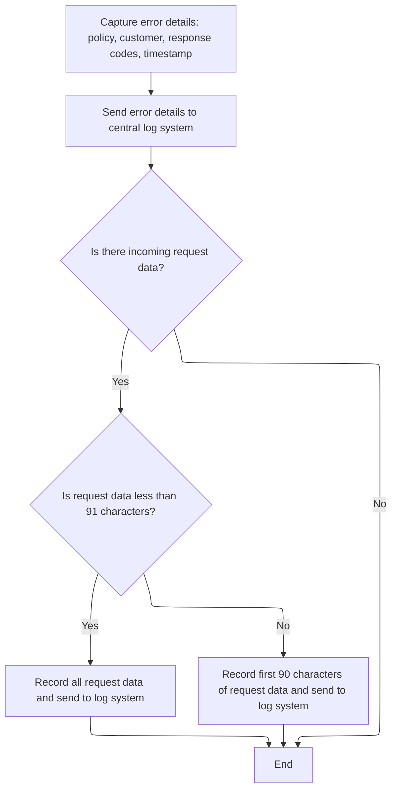

# Overview

This document explains the flow of preparing and routing insurance policy data. The process receives policy and customer information, determines the type of policy operation, and formats the data for storage. If the storage operation fails, detailed error information is captured and routed to the central log system.

# Technical Overview



## Dependencies

### Program

- LGSTSQ (<SwmPath>[base/src/lgstsq.cbl](base/src/lgstsq.cbl)</SwmPath>)

### Copybook

- LGCMAREA (<SwmPath>[base/src/lgcmarea.cpy](base/src/lgcmarea.cpy)</SwmPath>)

# Where is this program used?

This program is used once, as represented in the following diagram:



## Detailed View of the Program's Functionality

a. Preparing and Routing Policy Data

The process begins by determining the type of request received. This is done by extracting a specific character from the incoming request identifier, which indicates the type of policy operation to perform (such as customer, endowment, house, or motor insurance). The system also retrieves the policy and customer numbers from the request data.

Based on the extracted request type, the code branches into different preparation routines:

- If the request is for a customer record, it gathers all relevant customer fields (such as postal code, state, customer name, risk score, and several policy values) and places them into the customer section of the output record.
- If the request is for an endowment policy, it collects endowment-specific fields (such as product options, fund name, and life assured) and populates the endowment section of the record.
- If the request is for house insurance, it gathers house-specific fields (such as property type, number of rooms, value, postal code, and house name) and fills the house section of the record.
- If the request is for motor insurance, it collects motor-specific fields (such as make, model, value, and registration number) and fills the motor section of the record.
- If the request type does not match any known category, the data area of the record is cleared (filled with spaces) to prevent writing invalid or unexpected data.

Once the appropriate data fields are populated, the system writes the complete record to a file dedicated to policy data. The record has a fixed length, and a specific portion of the record serves as the key for file operations, ensuring that downstream systems can reliably locate and process the record.

After attempting to write the record, the system checks whether the operation was successful. If the write succeeds, the process completes normally. If the write fails, the system sets a specific return code to indicate an error, captures additional error details, and initiates error handling procedures.

b. Capturing and Routing Error Details

When an error occurs (such as a failed file write), the system enters an error handling routine. The first step is to capture the current system time and format it into separate date and time fields. These are used to timestamp the error for traceability.

The error message is then constructed, including the date, time, customer and policy numbers, and the response codes from the failed operation. This message is sent to a central logging system by invoking a separate program responsible for error logging and routing.

The logging program determines whether the message originated from another program or from a user. If the message includes a special prefix indicating a queue extension, it adjusts the target queue name accordingly. The message is then written to both a transient queue (for immediate system logging) and a temporary queue (for application-level tracking). If the message was received from a user, a minimal response is sent back to acknowledge receipt.

After logging the main error message, the error handler checks if there is any incoming request data (commarea). If present, it moves up to 90 bytes of this data into a buffer and sends it as a secondary error message to the logging system. This ensures that the original request data is preserved for troubleshooting, but avoids buffer overflows by limiting the size.

The error handling routine then exits, completing the process.

c. Summary of Flow

- The system routes incoming requests based on type, prepares the appropriate data, and writes it to a policy file.
- If the write fails, it logs detailed error information, including timestamps, identifiers, and response codes.
- Error messages are routed to both system and application-level queues for monitoring and troubleshooting.
- The original request data is also logged if available, with safeguards to prevent buffer overflows.

This design ensures that policy data is handled in a type-safe manner, errors are thoroughly logged, and all relevant information is preserved for support and analysis.

# Rule Definition

| Paragraph Name                                                                                                                                                                                                                                                                                                                                                                                                                                                                                                                                                                                               | Rule ID | Category          | Description                                                                                                                                                                                                                                                                                                                                                                                                                                                                             | Conditions                                                                                                                                                                              | Remarks                                                                                                                                                                                                                                                                                                                                                                                                                                                                                                                          |
| ------------------------------------------------------------------------------------------------------------------------------------------------------------------------------------------------------------------------------------------------------------------------------------------------------------------------------------------------------------------------------------------------------------------------------------------------------------------------------------------------------------------------------------------------------------------------------------------------------------ | ------- | ----------------- | --------------------------------------------------------------------------------------------------------------------------------------------------------------------------------------------------------------------------------------------------------------------------------------------------------------------------------------------------------------------------------------------------------------------------------------------------------------------------------------- | --------------------------------------------------------------------------------------------------------------------------------------------------------------------------------------- | -------------------------------------------------------------------------------------------------------------------------------------------------------------------------------------------------------------------------------------------------------------------------------------------------------------------------------------------------------------------------------------------------------------------------------------------------------------------------------------------------------------------------------- |
| Move <SwmToken path="base/src/lgapvs01.cbl" pos="95:3:7" line-data="           Move CA-Request-ID(4:1) To V2-REQ">`CA-Request-ID`</SwmToken>(4:1) To <SwmToken path="base/src/lgapvs01.cbl" pos="95:16:18" line-data="           Move CA-Request-ID(4:1) To V2-REQ">`V2-REQ`</SwmToken>, Evaluate <SwmToken path="base/src/lgapvs01.cbl" pos="95:16:18" line-data="           Move CA-Request-ID(4:1) To V2-REQ">`V2-REQ`</SwmToken>                                                                                                                                                                         | RL-001  | Conditional Logic | The system extracts the request type indicator from the fourth character of <SwmToken path="base/src/lgapvs01.cbl" pos="95:3:7" line-data="           Move CA-Request-ID(4:1) To V2-REQ">`CA-Request-ID`</SwmToken> and uses it to determine which record type to prepare ('C', 'E', 'H', 'M').                                                                                                                                                                                         | <SwmToken path="base/src/lgapvs01.cbl" pos="95:3:7" line-data="           Move CA-Request-ID(4:1) To V2-REQ">`CA-Request-ID`</SwmToken> must be present and at least 4 characters long. | Request types: 'C', 'E', 'H', 'M'. The indicator is always the fourth character of <SwmToken path="base/src/lgapvs01.cbl" pos="95:3:7" line-data="           Move CA-Request-ID(4:1) To V2-REQ">`CA-Request-ID`</SwmToken>.                                                                                                                                                                                                                                                                                                      |
| Exec CICS Write File('KSDSPOLY') From(<SwmToken path="base/src/lgapvs01.cbl" pos="137:3:5" line-data="                     From(V2-RECORD)">`V2-RECORD`</SwmToken>) Length(104) Ridfld(<SwmToken path="base/src/lgapvs01.cbl" pos="139:3:5" line-data="                     Ridfld(V2-KEY)">`V2-KEY`</SwmToken>) <SwmToken path="base/src/lgapvs01.cbl" pos="140:1:1" line-data="                     KeyLength(21)">`KeyLength`</SwmToken>(21) RESP(<SwmToken path="base/src/lgapvs01.cbl" pos="141:3:5" line-data="                     RESP(V1-RCD1)">`V1-RCD1`</SwmToken>)                               | RL-002  | Computation       | The output record must be written to the KSDSPOLY file with a length of exactly 104 bytes, where the first 21 bytes are the key and the remaining 83 bytes are the type-specific data section.                                                                                                                                                                                                                                                                                          | Output record must be prepared and formatted as specified.                                                                                                                              | Record format: 104 bytes total. Key: 21 bytes (<SwmToken path="base/src/lgapvs01.cbl" pos="95:16:18" line-data="           Move CA-Request-ID(4:1) To V2-REQ">`V2-REQ`</SwmToken>: 1 byte, <SwmToken path="base/src/lgapvs01.cbl" pos="97:11:13" line-data="           Move CA-Customer-Num    To V2-CUST">`V2-CUST`</SwmToken>: 10 bytes, <SwmToken path="base/src/lgapvs01.cbl" pos="96:11:13" line-data="           Move CA-Policy-Num      To V2-POL">`V2-POL`</SwmToken>: 10 bytes). Data section: 83 bytes, type-specific. |
| If <SwmToken path="base/src/lgapvs01.cbl" pos="141:3:5" line-data="                     RESP(V1-RCD1)">`V1-RCD1`</SwmToken> Not = DFHRESP(NORMAL), PERFORM <SwmToken path="base/src/lgapvs01.cbl" pos="146:3:5" line-data="             PERFORM P999-ERROR">`P999-ERROR`</SwmToken>                                                                                                                                                                                                                                                                                                                          | RL-003  | Conditional Logic | After writing the record, the system checks if the write was successful by verifying <SwmToken path="base/src/lgapvs01.cbl" pos="141:3:5" line-data="                     RESP(V1-RCD1)">`V1-RCD1`</SwmToken> equals 'NORMAL'. If not, it sets <SwmToken path="base/src/lgapvs01.cbl" pos="145:9:13" line-data="             MOVE &#39;80&#39; TO CA-RETURN-CODE">`CA-RETURN-CODE`</SwmToken> to '80', prepares an error log entry, and routes error details to the central log system. | Write operation response code must be checked after writing the record.                                                                                                                 | <SwmToken path="base/src/lgapvs01.cbl" pos="145:9:13" line-data="             MOVE &#39;80&#39; TO CA-RETURN-CODE">`CA-RETURN-CODE`</SwmToken> is set to '80' on error. Error log entry includes date (MMDDYYYY), time (HHMMSS), policy number, customer number, response code, and secondary response code.                                                                                                                                                                                                                     |
| PERFORM <SwmToken path="base/src/lgapvs01.cbl" pos="146:3:5" line-data="             PERFORM P999-ERROR">`P999-ERROR`</SwmToken>, EXEC CICS LINK PROGRAM('LGSTSQ') COMMAREA(<SwmToken path="base/src/lgapvs01.cbl" pos="171:3:5" line-data="                     COMMAREA(ERROR-MSG)">`ERROR-MSG`</SwmToken>), EXEC CICS LINK PROGRAM('LGSTSQ') COMMAREA(<SwmToken path="base/src/lgapvs01.cbl" pos="178:3:7" line-data="                         COMMAREA(CA-ERROR-MSG)">`CA-ERROR-MSG`</SwmToken>)                                                                                                         | RL-004  | Data Assignment   | Error log entry and request data (up to 90 bytes, prefixed with 'COMMAREA=') are sent to the logging program LGSTSQ for routing to both transient and temporary queues.                                                                                                                                                                                                                                                                                                                 | Error detected and/or incoming request data present.                                                                                                                                    | Error log entry format: date (8 bytes), time (6 bytes), policy number (10 bytes), customer number (10 bytes), response code (5 bytes), secondary response code (5 bytes). Request data: up to 90 bytes, prefixed with 'COMMAREA='. If request data is less than 91 bytes, log all; otherwise, log first 90 bytes.                                                                                                                                                                                                                |
| LGSTSQ: EXEC CICS WRITEQ TD QUEUE(<SwmToken path="base/src/lgstsq.cbl" pos="94:11:13" line-data="           EXEC CICS WRITEQ TD QUEUE(STDQ-NAME)">`STDQ-NAME`</SwmToken>) FROM(<SwmToken path="base/src/lgstsq.cbl" pos="57:7:9" line-data="           MOVE SPACES TO WRITE-MSG.">`WRITE-MSG`</SwmToken>), EXEC CICS WRITEQ TS QUEUE(<SwmToken path="base/src/lgstsq.cbl" pos="82:9:11" line-data="           MOVE &#39;GENAERRS&#39; TO STSQ-NAME.">`STSQ-NAME`</SwmToken>) FROM(<SwmToken path="base/src/lgstsq.cbl" pos="57:7:9" line-data="           MOVE SPACES TO WRITE-MSG.">`WRITE-MSG`</SwmToken>) | RL-005  | Computation       | LGSTSQ routes log entries to both transient and temporary queues. Queue messages must include the system ID, a filler byte, and up to 90 bytes of message data.                                                                                                                                                                                                                                                                                                                         | Log entry or request data is sent to LGSTSQ.                                                                                                                                            | Queue message format: system ID (4 bytes), filler byte (1 byte), message data (up to 90 bytes).                                                                                                                                                                                                                                                                                                                                                                                                                                  |
| Evaluate request type indicator, When 'C', When 'E', When 'H', When 'M', When Other                                                                                                                                                                                                                                                                                                                                                                                                                                                                                                                          | RL-006  | Data Assignment   | Depending on the request type, the system populates the output record with specific fields for customer, endowment, house, or motor data. If the request type is not recognized, the data section is cleared.                                                                                                                                                                                                                                                                           | Request type indicator must be one of 'C', 'E', 'H', 'M'. For other values, clear the data section.                                                                                     | Output record is 104 bytes: first 21 bytes are key (request type indicator, customer number, policy number), remaining 83 bytes are type-specific data. For 'C', use customer postal code, state code, customer name, risk score, and four financial/protection values. For 'E', use three endowment options, fund name, and life assured name. For 'H', use house type, number of rooms, house value, postal code, and householder name. For 'M', use motor make, model, value, and registration number.                        |

# User Stories

## User Story 1: Request type extraction and output record preparation

---

### Story Description:

As a system, I want to extract the request type from the fourth character of the <SwmToken path="base/src/lgapvs01.cbl" pos="95:3:7" line-data="           Move CA-Request-ID(4:1) To V2-REQ">`CA-Request-ID`</SwmToken> and prepare an output record with type-specific data fields so that the correct information is processed and stored for each request type.

---

### Business Rule Mapping:

| Rule ID | Paragraph Name                                                                                                                                                                                                                                                                                                                                                                                                                                                                                                                                                                 | Rule Description                                                                                                                                                                                                                                                                                |
| ------- | ------------------------------------------------------------------------------------------------------------------------------------------------------------------------------------------------------------------------------------------------------------------------------------------------------------------------------------------------------------------------------------------------------------------------------------------------------------------------------------------------------------------------------------------------------------------------------ | ----------------------------------------------------------------------------------------------------------------------------------------------------------------------------------------------------------------------------------------------------------------------------------------------- |
| RL-001  | Move <SwmToken path="base/src/lgapvs01.cbl" pos="95:3:7" line-data="           Move CA-Request-ID(4:1) To V2-REQ">`CA-Request-ID`</SwmToken>(4:1) To <SwmToken path="base/src/lgapvs01.cbl" pos="95:16:18" line-data="           Move CA-Request-ID(4:1) To V2-REQ">`V2-REQ`</SwmToken>, Evaluate <SwmToken path="base/src/lgapvs01.cbl" pos="95:16:18" line-data="           Move CA-Request-ID(4:1) To V2-REQ">`V2-REQ`</SwmToken>                                                                                                                                           | The system extracts the request type indicator from the fourth character of <SwmToken path="base/src/lgapvs01.cbl" pos="95:3:7" line-data="           Move CA-Request-ID(4:1) To V2-REQ">`CA-Request-ID`</SwmToken> and uses it to determine which record type to prepare ('C', 'E', 'H', 'M'). |
| RL-006  | Evaluate request type indicator, When 'C', When 'E', When 'H', When 'M', When Other                                                                                                                                                                                                                                                                                                                                                                                                                                                                                            | Depending on the request type, the system populates the output record with specific fields for customer, endowment, house, or motor data. If the request type is not recognized, the data section is cleared.                                                                                   |
| RL-002  | Exec CICS Write File('KSDSPOLY') From(<SwmToken path="base/src/lgapvs01.cbl" pos="137:3:5" line-data="                     From(V2-RECORD)">`V2-RECORD`</SwmToken>) Length(104) Ridfld(<SwmToken path="base/src/lgapvs01.cbl" pos="139:3:5" line-data="                     Ridfld(V2-KEY)">`V2-KEY`</SwmToken>) <SwmToken path="base/src/lgapvs01.cbl" pos="140:1:1" line-data="                     KeyLength(21)">`KeyLength`</SwmToken>(21) RESP(<SwmToken path="base/src/lgapvs01.cbl" pos="141:3:5" line-data="                     RESP(V1-RCD1)">`V1-RCD1`</SwmToken>) | The output record must be written to the KSDSPOLY file with a length of exactly 104 bytes, where the first 21 bytes are the key and the remaining 83 bytes are the type-specific data section.                                                                                                  |

---

### Relevant Functionality:

- **Move** <SwmToken path="base/src/lgapvs01.cbl" pos="95:3:7" line-data="           Move CA-Request-ID(4:1) To V2-REQ">`CA-Request-ID`</SwmToken>**(4:1) To** <SwmToken path="base/src/lgapvs01.cbl" pos="95:16:18" line-data="           Move CA-Request-ID(4:1) To V2-REQ">`V2-REQ`</SwmToken>
  1. **RL-001:**
     - Extract the fourth character from <SwmToken path="base/src/lgapvs01.cbl" pos="95:3:7" line-data="           Move CA-Request-ID(4:1) To V2-REQ">`CA-Request-ID`</SwmToken> and store as request type indicator.
     - Use this indicator to select the record type for further processing.
- **Evaluate request type indicator**
  1. **RL-006:**
     - If request type is 'C':
       - Populate customer data fields: postal code, state code, customer name, risk score, financial/protection values.
     - If request type is 'E':
       - Populate endowment data fields: three options, fund name, life assured name.
     - If request type is 'H':
       - Populate house data fields: house type, number of rooms, value, postal code, householder name.
     - If request type is 'M':
       - Populate motor data fields: make, model, value, registration number.
     - If request type is other:
       - Clear the data section (fill with spaces).
- **Exec CICS Write File('KSDSPOLY') From(**<SwmToken path="base/src/lgapvs01.cbl" pos="137:3:5" line-data="                     From(V2-RECORD)">`V2-RECORD`</SwmToken>**) Length(104) Ridfld(**<SwmToken path="base/src/lgapvs01.cbl" pos="139:3:5" line-data="                     Ridfld(V2-KEY)">`V2-KEY`</SwmToken>**)** <SwmToken path="base/src/lgapvs01.cbl" pos="140:1:1" line-data="                     KeyLength(21)">`KeyLength`</SwmToken>**(21) RESP(**<SwmToken path="base/src/lgapvs01.cbl" pos="141:3:5" line-data="                     RESP(V1-RCD1)">`V1-RCD1`</SwmToken>**)**
  1. **RL-002:**
     - Prepare output record with key and data section.
     - Write record to KSDSPOLY file with specified length and key.

## User Story 2: Record writing, error handling, and logging

---

### Story Description:

As a system, I want to write the prepared output record to the KSDSPOLY file, handle any write errors by setting the appropriate return code and preparing an error log entry, and send error logs and request data to the logging program for routing to both transient and temporary queues so that failed operations and relevant information are properly tracked, reported, and available for monitoring.

---

### Business Rule Mapping:

| Rule ID | Paragraph Name                                                                                                                                                                                                                                                                                                                                                                                                                                                                                                                                                                                               | Rule Description                                                                                                                                                                                                                                                                                                                                                                                                                                                                        |
| ------- | ------------------------------------------------------------------------------------------------------------------------------------------------------------------------------------------------------------------------------------------------------------------------------------------------------------------------------------------------------------------------------------------------------------------------------------------------------------------------------------------------------------------------------------------------------------------------------------------------------------ | --------------------------------------------------------------------------------------------------------------------------------------------------------------------------------------------------------------------------------------------------------------------------------------------------------------------------------------------------------------------------------------------------------------------------------------------------------------------------------------- |
| RL-003  | If <SwmToken path="base/src/lgapvs01.cbl" pos="141:3:5" line-data="                     RESP(V1-RCD1)">`V1-RCD1`</SwmToken> Not = DFHRESP(NORMAL), PERFORM <SwmToken path="base/src/lgapvs01.cbl" pos="146:3:5" line-data="             PERFORM P999-ERROR">`P999-ERROR`</SwmToken>                                                                                                                                                                                                                                                                                                                          | After writing the record, the system checks if the write was successful by verifying <SwmToken path="base/src/lgapvs01.cbl" pos="141:3:5" line-data="                     RESP(V1-RCD1)">`V1-RCD1`</SwmToken> equals 'NORMAL'. If not, it sets <SwmToken path="base/src/lgapvs01.cbl" pos="145:9:13" line-data="             MOVE &#39;80&#39; TO CA-RETURN-CODE">`CA-RETURN-CODE`</SwmToken> to '80', prepares an error log entry, and routes error details to the central log system. |
| RL-004  | PERFORM <SwmToken path="base/src/lgapvs01.cbl" pos="146:3:5" line-data="             PERFORM P999-ERROR">`P999-ERROR`</SwmToken>, EXEC CICS LINK PROGRAM('LGSTSQ') COMMAREA(<SwmToken path="base/src/lgapvs01.cbl" pos="171:3:5" line-data="                     COMMAREA(ERROR-MSG)">`ERROR-MSG`</SwmToken>), EXEC CICS LINK PROGRAM('LGSTSQ') COMMAREA(<SwmToken path="base/src/lgapvs01.cbl" pos="178:3:7" line-data="                         COMMAREA(CA-ERROR-MSG)">`CA-ERROR-MSG`</SwmToken>)                                                                                                         | Error log entry and request data (up to 90 bytes, prefixed with 'COMMAREA=') are sent to the logging program LGSTSQ for routing to both transient and temporary queues.                                                                                                                                                                                                                                                                                                                 |
| RL-005  | LGSTSQ: EXEC CICS WRITEQ TD QUEUE(<SwmToken path="base/src/lgstsq.cbl" pos="94:11:13" line-data="           EXEC CICS WRITEQ TD QUEUE(STDQ-NAME)">`STDQ-NAME`</SwmToken>) FROM(<SwmToken path="base/src/lgstsq.cbl" pos="57:7:9" line-data="           MOVE SPACES TO WRITE-MSG.">`WRITE-MSG`</SwmToken>), EXEC CICS WRITEQ TS QUEUE(<SwmToken path="base/src/lgstsq.cbl" pos="82:9:11" line-data="           MOVE &#39;GENAERRS&#39; TO STSQ-NAME.">`STSQ-NAME`</SwmToken>) FROM(<SwmToken path="base/src/lgstsq.cbl" pos="57:7:9" line-data="           MOVE SPACES TO WRITE-MSG.">`WRITE-MSG`</SwmToken>) | LGSTSQ routes log entries to both transient and temporary queues. Queue messages must include the system ID, a filler byte, and up to 90 bytes of message data.                                                                                                                                                                                                                                                                                                                         |

---

### Relevant Functionality:

- **If** <SwmToken path="base/src/lgapvs01.cbl" pos="141:3:5" line-data="                     RESP(V1-RCD1)">`V1-RCD1`</SwmToken> **Not = DFHRESP(NORMAL)**
  1. **RL-003:**
     - After writing record, check response code.
     - If not 'NORMAL':
       - Set return code to '80'.
       - Prepare error log entry with required fields.
       - Route error details to central log system.
- **PERFORM** <SwmToken path="base/src/lgapvs01.cbl" pos="146:3:5" line-data="             PERFORM P999-ERROR">`P999-ERROR`</SwmToken>
  1. **RL-004:**
     - Prepare error log entry with required fields.
     - If request data present:
       - If length < 91 bytes, log all.
       - Else, log first 90 bytes.
     - Prefix request data with 'COMMAREA='.
     - Send error log entry and request data to LGSTSQ via CICS LINK.
- **LGSTSQ: EXEC CICS WRITEQ TD QUEUE(**<SwmToken path="base/src/lgstsq.cbl" pos="94:11:13" line-data="           EXEC CICS WRITEQ TD QUEUE(STDQ-NAME)">`STDQ-NAME`</SwmToken>**) FROM(**<SwmToken path="base/src/lgstsq.cbl" pos="57:7:9" line-data="           MOVE SPACES TO WRITE-MSG.">`WRITE-MSG`</SwmToken>**)**
  1. **RL-005:**
     - Prepare queue message with system ID, filler byte, and message data.
     - Write message to transient queue (TDQ) and temporary queue (TSQ) using CICS WRITEQ.

# Workflow

# Preparing and Routing Policy Data

```mermaid
%%{init: {"flowchart": {"defaultRenderer": "elk"}} }%%
flowchart TD
  node1{"Request type (V2-REQ)?"}
  click node1 openCode "base/src/lgapvs01.cbl:99:131"
  node1 -->|"C"| node2["Prepare customer data"]
  click node2 openCode "base/src/lgapvs01.cbl:102:109"
  node1 -->|"E"| node3["Prepare endowment data"]
  click node3 openCode "base/src/lgapvs01.cbl:112:116"
  node1 -->|"H"| node4["Prepare house data"]
  click node4 openCode "base/src/lgapvs01.cbl:119:123"
  node1 -->|"M"| node5["Prepare motor data"]
  click node5 openCode "base/src/lgapvs01.cbl:126:129"
  node1 -->|"Other"| node6["Clear data"]
  click node6 openCode "base/src/lgapvs01.cbl:132:132"
  node2 --> node7["Write data to file"]
  node3 --> node7
  node4 --> node7
  node5 --> node7
  node6 --> node7
  click node7 openCode "base/src/lgapvs01.cbl:136:142"
  node7 --> node8{"Did write succeed? (V1-RCD1 = NORMAL?)"}
  click node8 openCode "base/src/lgapvs01.cbl:143:148"
  node8 -->|"Yes"| node9["Finish successfully"]
  click node9 openCode "base/src/lgapvs01.cbl:148:148"
  node8 -->|"No"| node10["Set CA-RETURN-CODE to '80', handle error, and return"]
  click node10 openCode "base/src/lgapvs01.cbl:144:147"

classDef HeadingStyle fill:#777777,stroke:#333,stroke-width:2px;

%% Swimm:
%% %%{init: {"flowchart": {"defaultRenderer": "elk"}} }%%
%% flowchart TD
%%   node1{"Request type (<SwmToken path="base/src/lgapvs01.cbl" pos="95:16:18" line-data="           Move CA-Request-ID(4:1) To V2-REQ">`V2-REQ`</SwmToken>)?"}
%%   click node1 openCode "<SwmPath>[base/src/lgapvs01.cbl](base/src/lgapvs01.cbl)</SwmPath>:99:131"
%%   node1 -->|"C"| node2["Prepare customer data"]
%%   click node2 openCode "<SwmPath>[base/src/lgapvs01.cbl](base/src/lgapvs01.cbl)</SwmPath>:102:109"
%%   node1 -->|"E"| node3["Prepare endowment data"]
%%   click node3 openCode "<SwmPath>[base/src/lgapvs01.cbl](base/src/lgapvs01.cbl)</SwmPath>:112:116"
%%   node1 -->|"H"| node4["Prepare house data"]
%%   click node4 openCode "<SwmPath>[base/src/lgapvs01.cbl](base/src/lgapvs01.cbl)</SwmPath>:119:123"
%%   node1 -->|"M"| node5["Prepare motor data"]
%%   click node5 openCode "<SwmPath>[base/src/lgapvs01.cbl](base/src/lgapvs01.cbl)</SwmPath>:126:129"
%%   node1 -->|"Other"| node6["Clear data"]
%%   click node6 openCode "<SwmPath>[base/src/lgapvs01.cbl](base/src/lgapvs01.cbl)</SwmPath>:132:132"
%%   node2 --> node7["Write data to file"]
%%   node3 --> node7
%%   node4 --> node7
%%   node5 --> node7
%%   node6 --> node7
%%   click node7 openCode "<SwmPath>[base/src/lgapvs01.cbl](base/src/lgapvs01.cbl)</SwmPath>:136:142"
%%   node7 --> node8{"Did write succeed? (<SwmToken path="base/src/lgapvs01.cbl" pos="141:3:5" line-data="                     RESP(V1-RCD1)">`V1-RCD1`</SwmToken> = NORMAL?)"}
%%   click node8 openCode "<SwmPath>[base/src/lgapvs01.cbl](base/src/lgapvs01.cbl)</SwmPath>:143:148"
%%   node8 -->|"Yes"| node9["Finish successfully"]
%%   click node9 openCode "<SwmPath>[base/src/lgapvs01.cbl](base/src/lgapvs01.cbl)</SwmPath>:148:148"
%%   node8 -->|"No"| node10["Set <SwmToken path="base/src/lgapvs01.cbl" pos="145:9:13" line-data="             MOVE &#39;80&#39; TO CA-RETURN-CODE">`CA-RETURN-CODE`</SwmToken> to '80', handle error, and return"]
%%   click node10 openCode "<SwmPath>[base/src/lgapvs01.cbl](base/src/lgapvs01.cbl)</SwmPath>:144:147"
%% 
%% classDef HeadingStyle fill:#777777,stroke:#333,stroke-width:2px;
```



This section is responsible for preparing and routing policy data based on the type of request received. It determines the type of policy operation (customer, endowment, house, or motor) and populates the corresponding data fields in a fixed-format record, which is then written to the policy file. The section also handles error scenarios if the write operation fails.

| Category       | Rule Name                     | Description                                                                                                                                                         |
| -------------- | ----------------------------- | ------------------------------------------------------------------------------------------------------------------------------------------------------------------- |
| Business logic | Type-specific data population | For each recognized request type, only the relevant data fields for that type are populated in the output record. All other fields remain untouched or are cleared. |

<SwmSnippet path="/base/src/lgapvs01.cbl" line="90">

---

In <SwmToken path="base/src/lgapvs01.cbl" pos="90:1:3" line-data="       P100-ENTRY SECTION.">`P100-ENTRY`</SwmToken>, this is where the flow starts. The code grabs the communication area length, extracts the type indicator from the fourth character of <SwmToken path="base/src/lgapvs01.cbl" pos="95:3:7" line-data="           Move CA-Request-ID(4:1) To V2-REQ">`CA-Request-ID`</SwmToken>, and moves over the policy and customer numbers. That single character (<SwmToken path="base/src/lgapvs01.cbl" pos="95:16:18" line-data="           Move CA-Request-ID(4:1) To V2-REQ">`V2-REQ`</SwmToken>) is used later to decide which data fields to populate for the record.

```cobol
       P100-ENTRY SECTION.
      *
      *---------------------------------------------------------------*
           Move EIBCALEN To V1-COMM.
      *---------------------------------------------------------------*
           Move CA-Request-ID(4:1) To V2-REQ
           Move CA-Policy-Num      To V2-POL
           Move CA-Customer-Num    To V2-CUST
```

---

</SwmSnippet>

<SwmSnippet path="/base/src/lgapvs01.cbl" line="99">

---

Here the code branches based on <SwmToken path="base/src/lgapvs01.cbl" pos="99:3:5" line-data="           Evaluate V2-REQ">`V2-REQ`</SwmToken>. If it's 'C', it moves all the customer-related fields into the customer section of the record. This sets up the data for customer-type records before moving on to the next case.

```cobol
           Evaluate V2-REQ

             When 'C'
               Move CA-B-PST     To V2-C-PCD
               Move CA-B-ST       To V2-C-Z9
               Move CA-B-Customer     To V2-C-CUST
               Move WS-RISK-SCORE     To V2-C-VAL
               Move CA-B-CA-B-FPR  To V2-C-P1VAL
               Move CA-B-CPR To V2-C-P2VAL
               Move CA-B-FLPR To V2-C-P3VAL
               Move CA-B-WPR To V2-C-P4VAL
```

---

</SwmSnippet>

<SwmSnippet path="/base/src/lgapvs01.cbl" line="111">

---

Next up, if <SwmToken path="base/src/lgapvs01.cbl" pos="95:16:18" line-data="           Move CA-Request-ID(4:1) To V2-REQ">`V2-REQ`</SwmToken> is 'E', the code fills in the endowment-specific fields in the record. This keeps the data structure clean and type-specific.

```cobol
             When 'E'
               Move CA-E-W-PRO        To  V2-E-OPT1
               Move CA-E-EQU          To  V2-E-OPT2
               Move CA-E-M-FUN        To  V2-E-OPT3
               Move CA-E-FUND-NAME    To  V2-E-NAME
               Move CA-E-LIFE-ASSURED To  V2-E-LIFE
```

---

</SwmSnippet>

<SwmSnippet path="/base/src/lgapvs01.cbl" line="118">

---

If <SwmToken path="base/src/lgapvs01.cbl" pos="95:16:18" line-data="           Move CA-Request-ID(4:1) To V2-REQ">`V2-REQ`</SwmToken> is 'H', this block moves the home insurance fields into the record. Each case is isolated so only the right data lands in the output.

```cobol
             When 'H'
               Move CA-H-P-TYP         To  V2-H-TYPE
               Move CA-H-BED           To  V2-H-ROOMS
               Move CA-H-VAL           To  V2-H-COST
               Move CA-H-PCD           To  V2-H-PCD
               Move CA-H-H-NAM         To  V2-H-NAME
```

---

</SwmSnippet>

<SwmSnippet path="/base/src/lgapvs01.cbl" line="125">

---

For <SwmToken path="base/src/lgapvs01.cbl" pos="95:16:18" line-data="           Move CA-Request-ID(4:1) To V2-REQ">`V2-REQ`</SwmToken> 'M', this part moves the motor insurance fields into the record. Keeps the data structure tight and type-specific.

```cobol
             When 'M'
               Move CA-M-MAKE          To  V2-M-MAKE
               Move CA-M-MODEL         To  V2-M-MODEL
               Move CA-M-VALUE         To  V2-M-COST
               Move CA-M-REGNUMBER     To  V2-M-NUM
```

---

</SwmSnippet>

<SwmSnippet path="/base/src/lgapvs01.cbl" line="131">

---

If <SwmToken path="base/src/lgapvs01.cbl" pos="95:16:18" line-data="           Move CA-Request-ID(4:1) To V2-REQ">`V2-REQ`</SwmToken> doesn't match any known type, this block just fills the data area with spaces. That way, nothing unexpected gets written to the record.

```cobol
             When Other
               Move Spaces To V2-DATA
           End-Evaluate
```

---

</SwmSnippet>

<SwmSnippet path="/base/src/lgapvs01.cbl" line="136">

---

Finally, this part writes the fully formatted record to the KSDSPOLY file. The record is always 104 bytes, and the key is 21 bytes, so downstream systems know how to find it.

```cobol
           Exec CICS Write File('KSDSPOLY')
                     From(V2-RECORD)
                     Length(104)
                     Ridfld(V2-KEY)
                     KeyLength(21)
                     RESP(V1-RCD1)
           End-Exec.
```

---

</SwmSnippet>

<SwmSnippet path="/base/src/lgapvs01.cbl" line="143">

---

If the write fails, this block jumps to error handling. It logs the error, sets a return code, and calls <SwmToken path="base/src/lgapvs01.cbl" pos="146:3:5" line-data="             PERFORM P999-ERROR">`P999-ERROR`</SwmToken> to make sure the failure is tracked and reported.

```cobol
           If V1-RCD1 Not = DFHRESP(NORMAL)
             Move EIBRESP2 To V1-RCD2
             MOVE '80' TO CA-RETURN-CODE
             PERFORM P999-ERROR
             EXEC CICS RETURN END-EXEC
           End-If.
```

---

</SwmSnippet>

# Capturing and Routing Error Details



This section ensures that all error events are captured with sufficient detail for traceability and troubleshooting, and that these details are reliably logged and routed for operational and support purposes.

| Category       | Rule Name                     | Description                                                                                                                                                              |
| -------------- | ----------------------------- | ------------------------------------------------------------------------------------------------------------------------------------------------------------------------ |
| Business logic | Complete error detail capture | All error logs must include the current system date and time, policy number, customer number, and both response codes for traceability.                                  |
| Business logic | Full request data logging     | If incoming request data is present and less than 91 characters, the entire request data must be recorded and sent to the log system.                                    |
| Business logic | Request data truncation       | If incoming request data exceeds 90 characters, only the first 90 characters must be recorded and sent to the log system to prevent buffer overflow.                     |
| Business logic | Dual queue routing            | Error messages must be routed to both transient and temporary queues to ensure redundancy and availability for downstream processing.                                    |
| Business logic | Source-based message handling | If the error message originates from a program, it must be flagged and processed differently than messages from a user, including handling any queue extension prefixes. |
| Business logic | No request data termination   | If no incoming request data is present, the error logging process must terminate without attempting to record request data.                                              |

<SwmSnippet path="/base/src/lgapvs01.cbl" line="156">

---

In <SwmToken path="base/src/lgapvs01.cbl" pos="156:1:3" line-data="       P999-ERROR.">`P999-ERROR`</SwmToken>, it grabs the current system time and formats it into date and time fields. This info gets attached to the error log for traceability.

```cobol
       P999-ERROR.
           EXEC CICS ASKTIME ABSTIME(V3-TIME)
           END-EXEC
           EXEC CICS FORMATTIME ABSTIME(V3-TIME)
                     MMDDYYYY(V3-DATE1)
                     TIME(V3-DATE2)
           END-EXEC
```

---

</SwmSnippet>

<SwmSnippet path="/base/src/lgapvs01.cbl" line="164">

---

This part fills out the error message with the date, time, customer and policy numbers, and response codes. Then it calls LGSTSQ to actually log or route the error message.

```cobol
           MOVE V3-DATE1 TO EM-DATE
           MOVE V3-DATE2 TO EM-TIME
           Move CA-Customer-Num To EM-Cusnum
           Move CA-Policy-Num   To EM-POLNUM 
           Move V1-RCD1         To EM-RespRC
           Move V1-RCD2         To EM-Resp2RC
           EXEC CICS LINK PROGRAM('LGSTSQ')
                     COMMAREA(ERROR-MSG)
                     LENGTH(LENGTH OF ERROR-MSG)
           END-EXEC.
```

---

</SwmSnippet>

<SwmSnippet path="/base/src/lgstsq.cbl" line="55">

---

<SwmToken path="base/src/lgstsq.cbl" pos="55:1:1" line-data="       MAINLINE SECTION.">`MAINLINE`</SwmToken> in LGSTSQ figures out if the message is from another program or a user, handles any 'Q=' prefix for queue extension, writes the message to both a transient and a temporary queue, and sends a response if needed. This covers both logging and routing for error or transaction messages.

```cobol
       MAINLINE SECTION.

           MOVE SPACES TO WRITE-MSG.
           MOVE SPACES TO WS-RECV.

           EXEC CICS ASSIGN SYSID(WRITE-MSG-SYSID)
                RESP(WS-RESP)
           END-EXEC.

           EXEC CICS ASSIGN INVOKINGPROG(WS-INVOKEPROG)
                RESP(WS-RESP)
           END-EXEC.
           
           IF WS-INVOKEPROG NOT = SPACES
              MOVE 'C' To WS-FLAG
              MOVE COMMA-DATA  TO WRITE-MSG-MSG
              MOVE EIBCALEN    TO WS-RECV-LEN
           ELSE
              EXEC CICS RECEIVE INTO(WS-RECV)
                  LENGTH(WS-RECV-LEN)
                  RESP(WS-RESP)
              END-EXEC
              MOVE 'R' To WS-FLAG
              MOVE WS-RECV-DATA  TO WRITE-MSG-MSG
              SUBTRACT 5 FROM WS-RECV-LEN
           END-IF.

           MOVE 'GENAERRS' TO STSQ-NAME.
           IF WRITE-MSG-MSG(1:2) = 'Q=' THEN
              MOVE WRITE-MSG-MSG(3:4) TO STSQ-EXT
              MOVE WRITE-MSG-REST TO TEMPO
              MOVE TEMPO          TO WRITE-MSG-MSG
              SUBTRACT 7 FROM WS-RECV-LEN
           END-IF.

           ADD 5 TO WS-RECV-LEN.

      * Write output message to TDQ CSMT
      *
           EXEC CICS WRITEQ TD QUEUE(STDQ-NAME)
                     FROM(WRITE-MSG)
                     RESP(WS-RESP)
                     LENGTH(WS-RECV-LEN)

           END-EXEC.

      * Write output message to Genapp TSQ
      * If no space is available then the task will not wait for
      *  storage to become available but will ignore the request...
      *
           EXEC CICS WRITEQ TS QUEUE(STSQ-NAME)
                     FROM(WRITE-MSG)
                     RESP(WS-RESP)
                     NOSUSPEND
                     LENGTH(WS-RECV-LEN)

           END-EXEC.

           If WS-FLAG = 'R' Then
             EXEC CICS SEND TEXT FROM(FILLER-X)
              WAIT
              ERASE
              LENGTH(1)
              FREEKB
             END-EXEC.

           EXEC CICS RETURN
           END-EXEC.
```

---

</SwmSnippet>

<SwmSnippet path="/base/src/lgapvs01.cbl" line="174">

---

Back in <SwmToken path="base/src/lgapvs01.cbl" pos="146:3:5" line-data="             PERFORM P999-ERROR">`P999-ERROR`</SwmToken>, after returning from LGSTSQ, this part checks the commarea length and moves up to 90 bytes into <SwmToken path="base/src/lgapvs01.cbl" pos="176:12:14" line-data="               MOVE DFHCOMMAREA(1:EIBCALEN) TO CA-DATA">`CA-DATA`</SwmToken>. It then calls LGSTSQ again to log or route this chunk, making sure nothing overflows the buffer.

```cobol
           IF EIBCALEN > 0 THEN
             IF EIBCALEN < 91 THEN
               MOVE DFHCOMMAREA(1:EIBCALEN) TO CA-DATA
               EXEC CICS LINK PROGRAM('LGSTSQ')
                         COMMAREA(CA-ERROR-MSG)
                         LENGTH(Length Of CA-ERROR-MSG)
               END-EXEC
             ELSE
               MOVE DFHCOMMAREA(1:90) TO CA-DATA
               EXEC CICS LINK PROGRAM('LGSTSQ')
                         COMMAREA(CA-ERROR-MSG)
                         LENGTH(Length Of CA-ERROR-MSG)
               END-EXEC
             END-IF
           END-IF.
           EXIT.
```

---

</SwmSnippet>

&nbsp;

*This is an auto-generated document by Swimm 🌊 and has not yet been verified by a human*

<SwmMeta version="3.0.0" repo-id="Z2l0aHViJTNBJTNBU3dpbW1pby1nZW5hcHAtbW90b3IlM0ElM0FHaXJpLVN3aW1t" repo-name="Swimmio-genapp-motor"><sup>Powered by [Swimm](https://app.swimm.io/)</sup></SwmMeta>
