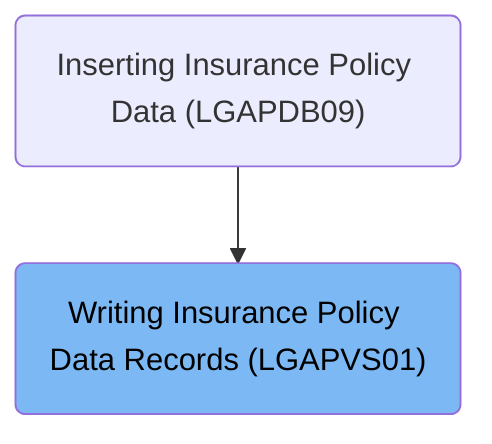
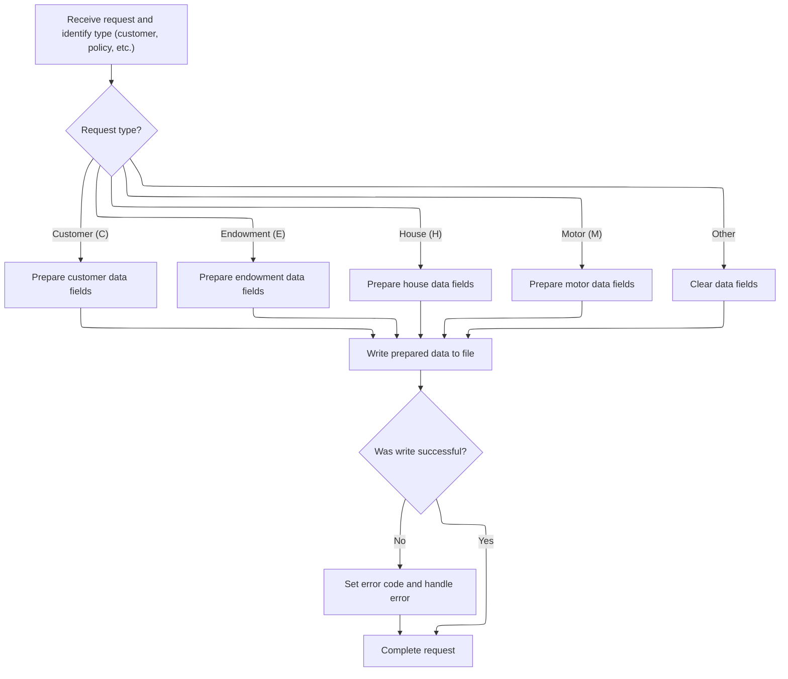
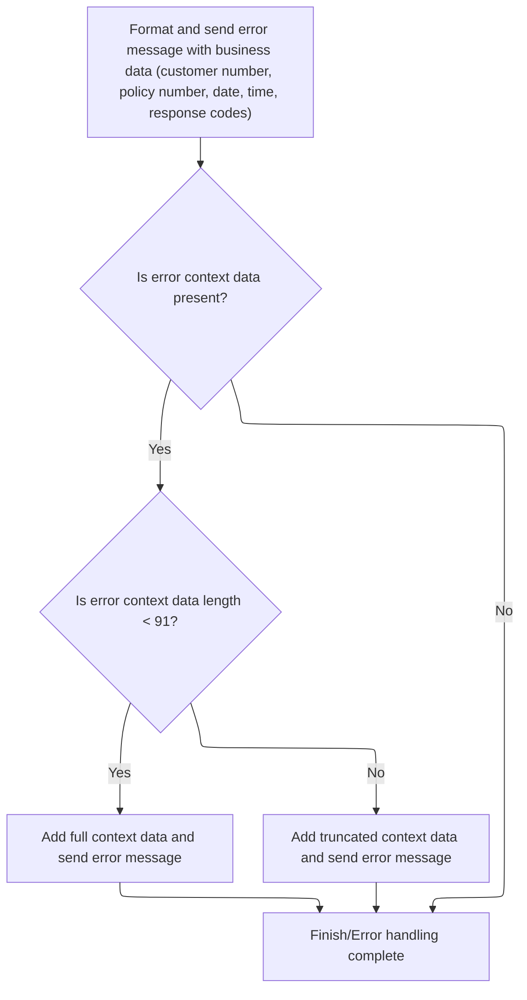

# Overview

This document explains the flow for preparing and routing insurance policy data. Requests containing customer, policy, and type information are mapped to structured records based on insurance type and written to persistent storage. Errors are logged and routed with full business context.

## Dependencies

### Programs

- <SwmToken path="base/src/lgapvs01.cbl" pos="2:6:6" line-data="       PROGRAM-ID. LGAPVS01.">`LGAPVS01`</SwmToken> (<SwmPath>[base/src/lgapvs01.cbl](base/src/lgapvs01.cbl)</SwmPath>)
- LGSTSQ (<SwmPath>[base/src/lgstsq.cbl](base/src/lgstsq.cbl)</SwmPath>)

### Copybook

- LGCMAREA (<SwmPath>[base/src/lgcmarea.cpy](base/src/lgcmarea.cpy)</SwmPath>)

# Where is this program used?

This program is used once, as represented in the following diagram:



## Detailed View of the Program's Functionality

## Preparing and Routing Policy Data

### 1\. Receiving and Identifying the Request

When a new request arrives, the program first determines the length of the communication area and stores it for later use. It then extracts the request type, policy number, and customer number from the incoming data and places these values into a record structure. This initial setup ensures that the program knows what kind of insurance data it is dealing with (such as customer, endowment, house, or motor) and who the request is for.

### 2\. Deciding Which Data to Prepare

The program examines the request type to determine which set of fields to process:

- **Customer Request**: If the request is for customer data, the program copies various customer-related fields (such as postal code, state, customer name, risk score, and several policy values) from the input into the customer section of the output record.
- **Endowment Request**: If the request is for an endowment policy, the program copies endowment-specific fields (such as product options, fund name, and life assured) into the endowment section of the output record.
- **House Request**: If the request is for house insurance, the program copies house-related fields (such as property type, number of rooms, value, postal code, and name) into the house section of the output record.
- **Motor Request**: If the request is for motor insurance, the program copies motor-specific fields (such as make, model, value, and registration number) into the motor section of the output record.
- **Other Requests**: If the request type does not match any known category, the program clears the data section of the record to prevent invalid or leftover data from being processed further.

### 3\. Writing the Prepared Data

Once the appropriate fields have been copied and the record is fully prepared, the program writes this record to a persistent file. It uses specific parameters to ensure the record is stored in the correct location, using the key and length information derived from the record structure.

### 4\. Handling Write Success or Failure

After attempting to write the record, the program checks whether the operation was successful:

- **Success**: If the write operation succeeds, the request is considered complete.
- **Failure**: If the write operation fails, the program sets an error code, logs the error, and terminates the request. This ensures that any issues are properly recorded and that the system does not proceed with incomplete or incorrect data.

## Error Logging and Message Routing

### 1\. Formatting and Sending Error Messages

When an error occurs, the program enters an error-handling routine. It first retrieves the current system time and formats it into a date and time string. These values are included in the error message for tracking purposes.

The error message is then populated with relevant business data, including the customer number, policy number, and response codes from the failed operation. This message is sent to a logging program, which is responsible for recording the error in the appropriate queues.

### 2\. Routing the Error Message

The logging program determines the source of the message and whether it was received or sent. It parses any queue extension information if present (for example, if a specific queue name is provided in the message). The message is then written to both a transient data queue (for system monitoring) and a temporary storage queue (for application-level error tracking).

If the message was received, the program sends a minimal text response before returning control to the caller.

### 3\. Handling Additional Error Context

After the initial error message is logged, the program checks if there is any leftover communication area data that should also be logged:

- **Short Context Data**: If the additional context data is less than a certain length, the program copies all of it into a secondary error message and logs it.
- **Long Context Data**: If the context data exceeds the maximum allowed length, only the first portion is copied and logged to avoid overflow.
- **No Context Data**: If there is no additional context data, the error handling routine simply exits.

This ensures that all relevant error details are captured and routed to the appropriate logging mechanisms before the program terminates the request.

## Summary

- The program receives insurance-related requests, identifies their type, and prepares the corresponding data fields.
- It writes the prepared data to a persistent file and checks for success or failure.
- On failure, it logs detailed error information, including business context and system response codes, and routes these messages to both system and application-level queues.
- Any additional context data is also logged, ensuring comprehensive error tracking and reporting.

# Rule Definition

| Paragraph Name                                                                                                             | Rule ID | Category          | Description                                                                                                                                                                                                                                                                                                                                                                                                | Conditions                                                                                                                                                                         | Remarks                                                                                                                                                                                                                                                                                                                                                                                                                                                                                                                                                                                                                                                                                                                                                                                                                                                                                                                                                                                                                                                                                                           |
| -------------------------------------------------------------------------------------------------------------------------- | ------- | ----------------- | ---------------------------------------------------------------------------------------------------------------------------------------------------------------------------------------------------------------------------------------------------------------------------------------------------------------------------------------------------------------------------------------------------------- | ---------------------------------------------------------------------------------------------------------------------------------------------------------------------------------- | ----------------------------------------------------------------------------------------------------------------------------------------------------------------------------------------------------------------------------------------------------------------------------------------------------------------------------------------------------------------------------------------------------------------------------------------------------------------------------------------------------------------------------------------------------------------------------------------------------------------------------------------------------------------------------------------------------------------------------------------------------------------------------------------------------------------------------------------------------------------------------------------------------------------------------------------------------------------------------------------------------------------------------------------------------------------------------------------------------------------- |
| <SwmToken path="base/src/lgapvs01.cbl" pos="90:1:3" line-data="       P100-ENTRY SECTION.">`P100-ENTRY`</SwmToken> SECTION | RL-001  | Conditional Logic | The system evaluates the request type from the input commarea and maps type-specific insurance fields to the output record accordingly. For types 'C', 'E', 'H', and 'M', specific input fields are mapped to output fields. For any other type, type-specific data fields are cleared.                                                                                                                    | Request type must be present in the input commarea. Mapping occurs only for recognized types ('C', 'E', 'H', 'M'). For other types, type-specific output fields are set to spaces. | Output record <SwmToken path="base/src/lgapvs01.cbl" pos="137:3:5" line-data="                     From(V2-RECORD)">`V2-RECORD`</SwmToken> contains <SwmToken path="base/src/lgapvs01.cbl" pos="95:16:18" line-data="           Move CA-Request-ID(4:1) To V2-REQ">`V2-REQ`</SwmToken> (1 byte), <SwmToken path="base/src/lgapvs01.cbl" pos="97:11:13" line-data="           Move CA-Customer-Num    To V2-CUST">`V2-CUST`</SwmToken> (10 bytes), <SwmToken path="base/src/lgapvs01.cbl" pos="96:11:13" line-data="           Move CA-Policy-Num      To V2-POL">`V2-POL`</SwmToken> (10 bytes), and <SwmToken path="base/src/lgapvs01.cbl" pos="132:7:9" line-data="               Move Spaces To V2-DATA">`V2-DATA`</SwmToken> (83 bytes). Type-specific sections within <SwmToken path="base/src/lgapvs01.cbl" pos="132:7:9" line-data="               Move Spaces To V2-DATA">`V2-DATA`</SwmToken> are populated based on request type. For unrecognized types, <SwmToken path="base/src/lgapvs01.cbl" pos="132:7:9" line-data="               Move Spaces To V2-DATA">`V2-DATA`</SwmToken> is set to spaces. |
| <SwmToken path="base/src/lgapvs01.cbl" pos="90:1:3" line-data="       P100-ENTRY SECTION.">`P100-ENTRY`</SwmToken> SECTION | RL-002  | Data Assignment   | The system formats the output record with the request type, customer number, policy number, and type-specific data. It writes the record to the persistent file 'KSDSPOLY' using the first 21 bytes as the key and the full 104 bytes as the record length.                                                                                                                                                | Output record must be fully populated before writing. Key and record length must match specified sizes.                                                                            | <SwmToken path="base/src/lgapvs01.cbl" pos="139:3:5" line-data="                     Ridfld(V2-KEY)">`V2-KEY`</SwmToken> is 21 bytes (<SwmToken path="base/src/lgapvs01.cbl" pos="95:16:18" line-data="           Move CA-Request-ID(4:1) To V2-REQ">`V2-REQ`</SwmToken> + <SwmToken path="base/src/lgapvs01.cbl" pos="97:11:13" line-data="           Move CA-Customer-Num    To V2-CUST">`V2-CUST`</SwmToken> + <SwmToken path="base/src/lgapvs01.cbl" pos="96:11:13" line-data="           Move CA-Policy-Num      To V2-POL">`V2-POL`</SwmToken>). <SwmToken path="base/src/lgapvs01.cbl" pos="137:3:5" line-data="                     From(V2-RECORD)">`V2-RECORD`</SwmToken> is 104 bytes (<SwmToken path="base/src/lgapvs01.cbl" pos="139:3:5" line-data="                     Ridfld(V2-KEY)">`V2-KEY`</SwmToken> + <SwmToken path="base/src/lgapvs01.cbl" pos="132:7:9" line-data="               Move Spaces To V2-DATA">`V2-DATA`</SwmToken>). File write uses these exact sizes.                                                                                                                     |
| <SwmToken path="base/src/lgapvs01.cbl" pos="146:3:5" line-data="             PERFORM P999-ERROR">`P999-ERROR`</SwmToken>   | RL-003  | Conditional Logic | If the file write is unsuccessful, the system sets an error code and formats an error message containing business data (customer number, policy number, date, time, response codes). If error context data is present, up to 90 bytes of commarea data are included in the error message.                                                                                                                  | File write response code indicates failure. Error context data length is checked before inclusion.                                                                                 | Error message includes: date (8 bytes), time (6 bytes), program name (9 bytes), policy number (10 bytes), customer number (10 bytes), response codes (5 bytes each), and up to 90 bytes of commarea data. If commarea data exceeds 90 bytes, only the first 90 bytes are included.                                                                                                                                                                                                                                                                                                                                                                                                                                                                                                                                                                                                                                                                                                                                                                                                                                |
| LGSTSQ MAINLINE SECTION                                                                                                    | RL-004  | Computation       | The system routes the formatted error message to the appropriate message queues for logging and tracking. The message is written to both a transient data queue (CSMT) and a temporary storage queue (GENAERRS or <SwmToken path="base/src/lgstsq.cbl" pos="6:19:19" line-data="      *  parm Q=nnnn is passed then Queue name GENAnnnn is used        *">`GENAnnnn`</SwmToken> based on message content). | Error message must be formatted and present. Queue naming conventions are applied if message starts with 'Q='.                                                                     | Message is routed to CSMT (TDQ) and GENAERRS/GENAnnnn (TSQ). If 'Q=' is present in the message, the queue name is adjusted accordingly. Message length is managed according to content and queue requirements.                                                                                                                                                                                                                                                                                                                                                                                                                                                                                                                                                                                                                                                                                                                                                                                                                                                                                                    |

# User Stories

## User Story 1: Process and persist insurance data requests

---

### Story Description:

As a system, I want to receive insurance data requests, map type-specific fields based on request type, format the output record, and write it to persistent storage so that insurance data is accurately processed and stored.

---

### Business Rule Mapping:

| Rule ID | Paragraph Name                                                                                                             | Rule Description                                                                                                                                                                                                                                                                        |
| ------- | -------------------------------------------------------------------------------------------------------------------------- | --------------------------------------------------------------------------------------------------------------------------------------------------------------------------------------------------------------------------------------------------------------------------------------- |
| RL-001  | <SwmToken path="base/src/lgapvs01.cbl" pos="90:1:3" line-data="       P100-ENTRY SECTION.">`P100-ENTRY`</SwmToken> SECTION | The system evaluates the request type from the input commarea and maps type-specific insurance fields to the output record accordingly. For types 'C', 'E', 'H', and 'M', specific input fields are mapped to output fields. For any other type, type-specific data fields are cleared. |
| RL-002  | <SwmToken path="base/src/lgapvs01.cbl" pos="90:1:3" line-data="       P100-ENTRY SECTION.">`P100-ENTRY`</SwmToken> SECTION | The system formats the output record with the request type, customer number, policy number, and type-specific data. It writes the record to the persistent file 'KSDSPOLY' using the first 21 bytes as the key and the full 104 bytes as the record length.                             |

---

### Relevant Functionality:

- <SwmToken path="base/src/lgapvs01.cbl" pos="90:1:3" line-data="       P100-ENTRY SECTION.">`P100-ENTRY`</SwmToken> **SECTION**
  1. **RL-001:**
     - Extract request type from input
     - If request type is 'C':
       - Map customer insurance fields to output
     - Else if request type is 'E':
       - Map endowment insurance fields to output
     - Else if request type is 'H':
       - Map house insurance fields to output
     - Else if request type is 'M':
       - Map motor insurance fields to output
     - Else:
       - Set type-specific output fields to spaces
  2. **RL-002:**
     - Populate output record fields
     - Write output record to file 'KSDSPOLY'
       - Use first 21 bytes as key
       - Use 104 bytes as record length
     - If write fails, proceed to error handling

## User Story 2: Handle file write errors and route error messages

---

### Story Description:

As a system, I want to detect file write failures, set error codes, format error messages with relevant business and context data, and route them to the appropriate message queues so that errors are properly reported, logged, and can be monitored.

---

### Business Rule Mapping:

| Rule ID | Paragraph Name                                                                                                           | Rule Description                                                                                                                                                                                                                                                                                                                                                                                           |
| ------- | ------------------------------------------------------------------------------------------------------------------------ | ---------------------------------------------------------------------------------------------------------------------------------------------------------------------------------------------------------------------------------------------------------------------------------------------------------------------------------------------------------------------------------------------------------- |
| RL-003  | <SwmToken path="base/src/lgapvs01.cbl" pos="146:3:5" line-data="             PERFORM P999-ERROR">`P999-ERROR`</SwmToken> | If the file write is unsuccessful, the system sets an error code and formats an error message containing business data (customer number, policy number, date, time, response codes). If error context data is present, up to 90 bytes of commarea data are included in the error message.                                                                                                                  |
| RL-004  | LGSTSQ MAINLINE SECTION                                                                                                  | The system routes the formatted error message to the appropriate message queues for logging and tracking. The message is written to both a transient data queue (CSMT) and a temporary storage queue (GENAERRS or <SwmToken path="base/src/lgstsq.cbl" pos="6:19:19" line-data="      *  parm Q=nnnn is passed then Queue name GENAnnnn is used        *">`GENAnnnn`</SwmToken> based on message content). |

---

### Relevant Functionality:

- <SwmToken path="base/src/lgapvs01.cbl" pos="146:3:5" line-data="             PERFORM P999-ERROR">`P999-ERROR`</SwmToken>
  1. **RL-003:**
     - On file write failure:
       - Set error code
       - Format error message with business data
       - If commarea data present:
         - If length < 91, include all
         - Else, include first 90 bytes
       - Route error message to message queues
- **LGSTSQ MAINLINE SECTION**
  1. **RL-004:**
     - Receive error message
     - If invoked by another program:
       - Use commarea data as message
     - Else:
       - Receive message from queue
     - If message starts with 'Q=':
       - Adjust queue name
       - Adjust message content and length
     - Write message to CSMT (TDQ)
     - Write message to GENAERRS/GENAnnnn (TSQ)
     - If received from queue, send text response
     - Return from program

# Workflow

# Preparing and Routing Policy Data



This section is responsible for preparing insurance policy data based on the request type and routing it to the appropriate output record. It ensures that only relevant data is mapped and written, and handles errors if the write operation fails.

| Category        | Rule Name                   | Description                                                                                                                                                    |
| --------------- | --------------------------- | -------------------------------------------------------------------------------------------------------------------------------------------------------------- |
| Data validation | Request type identification | The request type must be identified from the incoming data to determine which set of fields to process.                                                        |
| Data validation | Unknown type data clearing  | If the request type does not match any known types, all data fields in the output record are cleared to prevent invalid or irrelevant data from being written. |
| Business logic  | Customer data mapping       | For customer requests, only customer-related fields are mapped to the output record, ensuring that customer insurance data is correctly prepared.              |
| Business logic  | Endowment data mapping      | For endowment requests, only endowment-related fields are mapped to the output record, ensuring that endowment insurance data is correctly prepared.           |
| Business logic  | House data mapping          | For house requests, only house-related fields are mapped to the output record, ensuring that house insurance data is correctly prepared.                       |
| Business logic  | Motor data mapping          | For motor requests, only motor-related fields are mapped to the output record, ensuring that motor insurance data is correctly prepared.                       |
| Business logic  | Record writing              | The prepared insurance record must be written to the persistent file, with the correct key and length parameters to ensure proper storage.                     |

<SwmSnippet path="/base/src/lgapvs01.cbl" line="90">

---

In <SwmToken path="base/src/lgapvs01.cbl" pos="90:1:3" line-data="       P100-ENTRY SECTION.">`P100-ENTRY`</SwmToken>, we kick off by grabbing the commarea length and stashing it in <SwmToken path="base/src/lgapvs01.cbl" pos="93:7:9" line-data="           Move EIBCALEN To V1-COMM.">`V1-COMM`</SwmToken>, then we pull out the request type, policy number, and customer number from the incoming data and drop them into the <SwmToken path="base/src/lgapvs01.cbl" pos="137:3:5" line-data="                     From(V2-RECORD)">`V2-RECORD`</SwmToken> fields. This sets up the context for the rest of the flow, so downstream logic knows what kind of insurance data we're dealing with and who it's for.

```cobol
       P100-ENTRY SECTION.
      *
      *---------------------------------------------------------------*
           Move EIBCALEN To V1-COMM.
      *---------------------------------------------------------------*
           Move CA-Request-ID(4:1) To V2-REQ
           Move CA-Policy-Num      To V2-POL
           Move CA-Customer-Num    To V2-CUST
```

---

</SwmSnippet>

<SwmSnippet path="/base/src/lgapvs01.cbl" line="99">

---

Here we use the request type to decide which set of fields to copy from the input to the output record. For 'C', we grab customer-related fields and map them to the customer section of <SwmToken path="base/src/lgapvs01.cbl" pos="137:3:5" line-data="                     From(V2-RECORD)">`V2-RECORD`</SwmToken>. This sets up the record for customer insurance data before moving on to other types.

```cobol
           Evaluate V2-REQ

             When 'C'
               Move CA-B-PST     To V2-C-PCD
               Move CA-B-ST       To V2-C-Z9
               Move CA-B-Customer     To V2-C-CUST
               Move WS-RISK-SCORE     To V2-C-VAL
               Move CA-B-CA-B-FPR  To V2-C-P1VAL
               Move CA-B-CPR To V2-C-P2VAL
               Move CA-B-FLPR To V2-C-P3VAL
               Move CA-B-WPR To V2-C-P4VAL
```

---

</SwmSnippet>

<SwmSnippet path="/base/src/lgapvs01.cbl" line="111">

---

Next up, if the request type is 'E', we copy the endowment policy fields from the input to the endowment section of <SwmToken path="base/src/lgapvs01.cbl" pos="137:3:5" line-data="                     From(V2-RECORD)">`V2-RECORD`</SwmToken>. This keeps the data organized by insurance type.

```cobol
             When 'E'
               Move CA-E-W-PRO        To  V2-E-OPT1
               Move CA-E-EQU          To  V2-E-OPT2
               Move CA-E-M-FUN        To  V2-E-OPT3
               Move CA-E-FUND-NAME    To  V2-E-NAME
               Move CA-E-LIFE-ASSURED To  V2-E-LIFE
```

---

</SwmSnippet>

<SwmSnippet path="/base/src/lgapvs01.cbl" line="118">

---

If the request type is 'H', we grab the home insurance fields and map them to the home section of <SwmToken path="base/src/lgapvs01.cbl" pos="137:3:5" line-data="                     From(V2-RECORD)">`V2-RECORD`</SwmToken>. This keeps each insurance type's data in its own slot.

```cobol
             When 'H'
               Move CA-H-P-TYP         To  V2-H-TYPE
               Move CA-H-BED           To  V2-H-ROOMS
               Move CA-H-VAL           To  V2-H-COST
               Move CA-H-PCD           To  V2-H-PCD
               Move CA-H-H-NAM         To  V2-H-NAME
```

---

</SwmSnippet>

<SwmSnippet path="/base/src/lgapvs01.cbl" line="125">

---

If the request type is 'M', we copy the motor insurance fields from the input to the motor section of <SwmToken path="base/src/lgapvs01.cbl" pos="137:3:5" line-data="                     From(V2-RECORD)">`V2-RECORD`</SwmToken>. Each insurance type gets its own mapping.

```cobol
             When 'M'
               Move CA-M-MAKE          To  V2-M-MAKE
               Move CA-M-MODEL         To  V2-M-MODEL
               Move CA-M-VALUE         To  V2-M-COST
               Move CA-M-REGNUMBER     To  V2-M-NUM
```

---

</SwmSnippet>

<SwmSnippet path="/base/src/lgapvs01.cbl" line="131">

---

If the request type doesn't match any of the known types, we just clear out the data section of the record. This prevents garbage from being written to the file.

```cobol
             When Other
               Move Spaces To V2-DATA
           End-Evaluate
```

---

</SwmSnippet>

<SwmSnippet path="/base/src/lgapvs01.cbl" line="136">

---

Here we write the formatted insurance record to the persistent file using CICS. The key and length parameters make sure the record lands in the right spot.

```cobol
           Exec CICS Write File('KSDSPOLY')
                     From(V2-RECORD)
                     Length(104)
                     Ridfld(V2-KEY)
                     KeyLength(21)
                     RESP(V1-RCD1)
           End-Exec.
```

---

</SwmSnippet>

<SwmSnippet path="/base/src/lgapvs01.cbl" line="143">

---

Finally, if the file write fails, we set up the error codes and call <SwmToken path="base/src/lgapvs01.cbl" pos="146:3:5" line-data="             PERFORM P999-ERROR">`P999-ERROR`</SwmToken> to log the issue and bail out. This makes sure errors don't go unnoticed.

```cobol
           If V1-RCD1 Not = DFHRESP(NORMAL)
             Move EIBRESP2 To V1-RCD2
             MOVE '80' TO CA-RETURN-CODE
             PERFORM P999-ERROR
             EXEC CICS RETURN END-EXEC
           End-If.
```

---

</SwmSnippet>

# Error Logging and Message Routing



This section ensures that all relevant error information is captured, formatted, and routed to the correct queues for tracking and operational response. It also manages the inclusion of context data and guarantees that error messages are complete and traceable.

| Category        | Rule Name                         | Description                                                                                                                                                                                  |
| --------------- | --------------------------------- | -------------------------------------------------------------------------------------------------------------------------------------------------------------------------------------------- |
| Data validation | Context data length limit         | If error context data is present, it must be included in the error message. If the context data exceeds 90 characters, only the first 90 characters are included and the rest are truncated. |
| Business logic  | Mandatory business data inclusion | Every error message must include the customer number, policy number, date, time, and both response codes to ensure traceability and business relevance.                                      |
| Business logic  | Dual queue logging                | Error messages must be logged to both the TDQ and TSQ queues to ensure redundancy and availability for different operational processes.                                                      |
| Business logic  | Error timestamping                | A timestamp must be attached to every error message to allow for chronological tracking and auditability.                                                                                    |
| Business logic  | Error receipt acknowledgement     | If the error message was received (not invoked), a text response must be sent to acknowledge receipt before returning control.                                                               |
| Business logic  | Complete error detail logging     | If there is leftover commarea data after the initial error logging, it must be forwarded and logged to ensure all error details are captured before completion.                              |

<SwmSnippet path="/base/src/lgapvs01.cbl" line="156">

---

In <SwmToken path="base/src/lgapvs01.cbl" pos="156:1:3" line-data="       P999-ERROR.">`P999-ERROR`</SwmToken>, we grab the current system time and format it for the error log. This timestamp gets attached to the error message for tracking.

```cobol
       P999-ERROR.
           EXEC CICS ASKTIME ABSTIME(V3-TIME)
           END-EXEC
           EXEC CICS FORMATTIME ABSTIME(V3-TIME)
                     MMDDYYYY(V3-DATE1)
                     TIME(V3-DATE2)
           END-EXEC
```

---

</SwmSnippet>

<SwmSnippet path="/base/src/lgapvs01.cbl" line="164">

---

We fill out the error message and call LGSTSQ to log it in the queues.

```cobol
           MOVE V3-DATE1 TO EM-DATE
           MOVE V3-DATE2 TO EM-TIME
           Move CA-Customer-Num To EM-Cusnum
           Move CA-Policy-Num   To EM-POLNUM 
           Move V1-RCD1         To EM-RespRC
           Move V1-RCD2         To EM-Resp2RC
           EXEC CICS LINK PROGRAM('LGSTSQ')
                     COMMAREA(ERROR-MSG)
                     LENGTH(LENGTH OF ERROR-MSG)
           END-EXEC.
```

---

</SwmSnippet>

<SwmSnippet path="/base/src/lgstsq.cbl" line="55">

---

<SwmToken path="base/src/lgstsq.cbl" pos="55:1:1" line-data="       MAINLINE SECTION.">`MAINLINE`</SwmToken> figures out where the message came from, parses out any queue extension if present, and writes the message to both TDQ and TSQ. If the message was received, it sends a text response before returning.

```cobol
       MAINLINE SECTION.

           MOVE SPACES TO WRITE-MSG.
           MOVE SPACES TO WS-RECV.

           EXEC CICS ASSIGN SYSID(WRITE-MSG-SYSID)
                RESP(WS-RESP)
           END-EXEC.

           EXEC CICS ASSIGN INVOKINGPROG(WS-INVOKEPROG)
                RESP(WS-RESP)
           END-EXEC.
           
           IF WS-INVOKEPROG NOT = SPACES
              MOVE 'C' To WS-FLAG
              MOVE COMMA-DATA  TO WRITE-MSG-MSG
              MOVE EIBCALEN    TO WS-RECV-LEN
           ELSE
              EXEC CICS RECEIVE INTO(WS-RECV)
                  LENGTH(WS-RECV-LEN)
                  RESP(WS-RESP)
              END-EXEC
              MOVE 'R' To WS-FLAG
              MOVE WS-RECV-DATA  TO WRITE-MSG-MSG
              SUBTRACT 5 FROM WS-RECV-LEN
           END-IF.

           MOVE 'GENAERRS' TO STSQ-NAME.
           IF WRITE-MSG-MSG(1:2) = 'Q=' THEN
              MOVE WRITE-MSG-MSG(3:4) TO STSQ-EXT
              MOVE WRITE-MSG-REST TO TEMPO
              MOVE TEMPO          TO WRITE-MSG-MSG
              SUBTRACT 7 FROM WS-RECV-LEN
           END-IF.

           ADD 5 TO WS-RECV-LEN.

      * Write output message to TDQ CSMT
      *
           EXEC CICS WRITEQ TD QUEUE(STDQ-NAME)
                     FROM(WRITE-MSG)
                     RESP(WS-RESP)
                     LENGTH(WS-RECV-LEN)

           END-EXEC.

      * Write output message to Genapp TSQ
      * If no space is available then the task will not wait for
      *  storage to become available but will ignore the request...
      *
           EXEC CICS WRITEQ TS QUEUE(STSQ-NAME)
                     FROM(WRITE-MSG)
                     RESP(WS-RESP)
                     NOSUSPEND
                     LENGTH(WS-RECV-LEN)

           END-EXEC.

           If WS-FLAG = 'R' Then
             EXEC CICS SEND TEXT FROM(FILLER-X)
              WAIT
              ERASE
              LENGTH(1)
              FREEKB
             END-EXEC.

           EXEC CICS RETURN
           END-EXEC.
```

---

</SwmSnippet>

<SwmSnippet path="/base/src/lgapvs01.cbl" line="174">

---

Back in <SwmToken path="base/src/lgapvs01.cbl" pos="146:3:5" line-data="             PERFORM P999-ERROR">`P999-ERROR`</SwmToken>, after returning from LGSTSQ, we check if there's leftover commarea data and forward it to LGSTSQ again if needed. This makes sure all error details get logged before we exit.

```cobol
           IF EIBCALEN > 0 THEN
             IF EIBCALEN < 91 THEN
               MOVE DFHCOMMAREA(1:EIBCALEN) TO CA-DATA
               EXEC CICS LINK PROGRAM('LGSTSQ')
                         COMMAREA(CA-ERROR-MSG)
                         LENGTH(Length Of CA-ERROR-MSG)
               END-EXEC
             ELSE
               MOVE DFHCOMMAREA(1:90) TO CA-DATA
               EXEC CICS LINK PROGRAM('LGSTSQ')
                         COMMAREA(CA-ERROR-MSG)
                         LENGTH(Length Of CA-ERROR-MSG)
               END-EXEC
             END-IF
           END-IF.
           EXIT.
```

---

</SwmSnippet>

&nbsp;

*This is an auto-generated document by Swimm 🌊 and has not yet been verified by a human*

<SwmMeta version="3.0.0" repo-id="Z2l0aHViJTNBJTNBU3dpbW1pby1nZW5hcHAtbW90b3IlM0ElM0FHaXJpLVN3aW1t" repo-name="Swimmio-genapp-motor"><sup>Powered by [Swimm](https://app.swimm.io/)</sup></SwmMeta>
